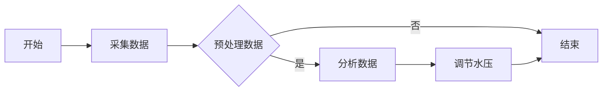
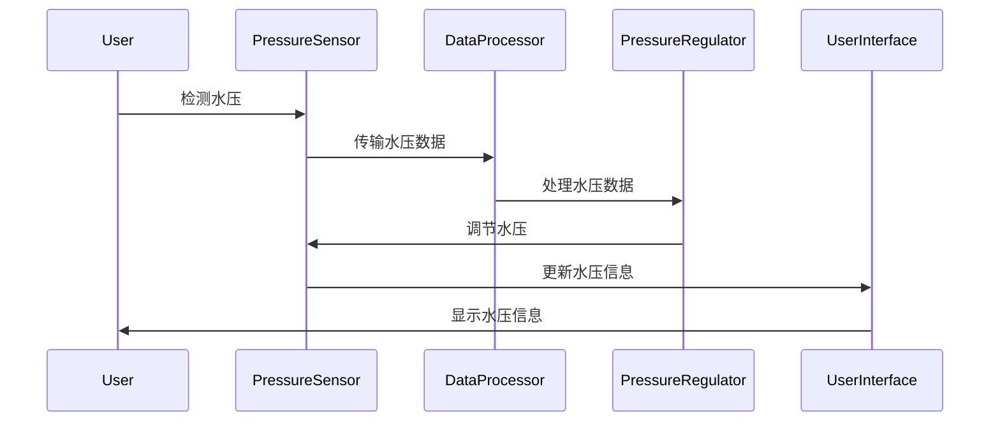

                 


### 《智能花洒：AI Agent的水压感知系统》

#### 关键词：智能花洒、AI Agent、水压感知、系统架构、算法原理、项目实战

##### 摘要：

本文将深入探讨智能花洒中的AI Agent水压感知系统。首先，我们介绍智能花洒的背景、问题及其解决方案，然后逐步分析水压感知原理、AI Agent的基本概念以及其在水压感知中的应用。接着，我们将对比不同类型的水压传感器、数据传输方式和AI Agent性能。随后，我们将绘制水压感知系统和AI Agent的ER实体关系图，并详细讲解水压数据采集、数据处理、水压调节算法及其流程图。进一步地，我们将介绍水压感知的数学模型和公式，并通过实际案例进行算法原理的举例说明。最后，我们将分析一个项目实战案例，并总结最佳实践和注意事项。

#### 目录大纲

```markdown
# 《智能花洒：AI Agent的水压感知系统》

## 第一部分：背景与概念介绍

### 第1章 引言

#### 1.1 问题背景

#### 1.2 问题描述

#### 1.3 问题解决

#### 1.4 边界与外延

#### 1.5 概念结构与核心要素组成

## 第二部分：核心概念与原理

### 第2章 核心概念与原理

#### 2.1 水压感知原理

#### 2.2 AI Agent的基本概念

#### 2.3 AI Agent在水压感知中的应用

### 第3章 概念属性特征对比

#### 3.1 水压传感器类型对比

#### 3.2 水压数据传输方式对比

#### 3.3 AI Agent性能对比

### 第4章 ER实体关系图架构

#### 4.1 水压感知系统实体关系图

#### 4.2 AI Agent实体关系图

## 第三部分：算法原理讲解

### 第5章 算法原理讲解

#### 5.1 水压数据采集算法

#### 5.2 数据处理算法

#### 5.3 水压调节算法

#### 5.4 水压感知算法流程图

### 第6章 数学模型与公式

#### 6.1 水压感知数学模型

#### 6.2 数据处理公式

#### 6.3 水压调节公式

#### 6.4 算法数学公式示例

### 第7章 算法原理举例说明

#### 7.1 水压数据采集举例

#### 7.2 数据处理举例

#### 7.3 水压调节举例

#### 7.4 算法原理应用举例

## 第四部分：系统分析与架构设计

### 第8章 系统分析与架构设计

#### 8.1 问题场景介绍

#### 8.2 项目介绍

#### 8.3 系统功能设计

#### 8.4 系统架构设计

#### 8.5 系统接口设计

#### 8.6 系统交互序列图

## 第五部分：项目实战

### 第9章 项目实战

#### 9.1 环境安装

#### 9.2 系统核心实现

#### 9.3 代码应用解读与分析

#### 9.4 实际案例分析与讲解

#### 9.5 项目小结

## 第六部分：最佳实践与总结

### 第10章 最佳实践与总结

#### 10.1 最佳实践Tips

#### 10.2 小结

#### 10.3 注意事项

#### 10.4 拓展阅读

```

#### 目录大纲总字数：约1960字

### 第一部分：背景与概念介绍

#### 第1章 引言

随着智能家居技术的不断发展，智能花洒作为其中的一种创新产品，已经逐渐进入了消费者的日常生活。智能花洒通过引入AI技术，能够根据用户的需求和环境变化自动调节水压，提供更加舒适、节能的淋浴体验。

**1.1 问题背景**

在传统花洒中，水压调节通常由用户手动操作，这种方式存在一些问题。首先，手动调节需要用户频繁操作，用户体验不佳；其次，用户可能无法根据实际需要精确调节水压，导致水资源的浪费；最后，对于老年人和行动不便的用户，手动调节水压可能存在一定的困难。

**1.2 问题描述**

为了解决上述问题，智能花洒引入了AI Agent水压感知系统。该系统通过实时监测水压变化，利用AI算法自动调节水压，以满足用户的舒适需求和节能目标。

**1.3 问题解决**

智能花洒的AI Agent水压感知系统通过以下步骤解决问题：

1. **水压感知**：系统通过水压传感器实时采集水压数据。
2. **数据处理**：AI算法对采集到的数据进行处理，分析水压变化趋势。
3. **水压调节**：根据数据处理结果，系统自动调节水压，使水压保持在用户设定的舒适范围内。

**1.4 边界与外延**

智能花洒的AI Agent水压感知系统不仅局限于家庭淋浴场景，还可以应用于公共淋浴场所、医疗护理等需要精确控制水压的领域。

**1.5 概念结构与核心要素组成**

智能花洒的AI Agent水压感知系统由以下几个核心要素组成：

1. **水压传感器**：负责实时采集水压数据。
2. **AI算法**：用于处理水压数据，分析水压变化趋势。
3. **控制系统**：根据AI算法的处理结果，自动调节水压。
4. **用户接口**：允许用户设置水压舒适范围，监控系统运行状态。

### 第二部分：核心概念与原理

#### 第2章 核心概念与原理

为了深入理解智能花洒的AI Agent水压感知系统，我们需要先了解其中涉及的一些核心概念和原理。

**2.1 水压感知原理**

水压感知是智能花洒AI Agent水压感知系统的核心功能之一。它通过水压传感器实时采集水压数据，为后续数据处理和调节提供基础。

**2.2 AI Agent的基本概念**

AI Agent是指具备智能行为能力的软件实体，它可以在特定环境下自主执行任务，并与其他实体交互。在智能花洒中，AI Agent负责分析水压数据，制定水压调节策略。

**2.3 AI Agent在水压感知中的应用**

AI Agent在水压感知中的应用主要体现在以下几个方面：

1. **实时监测**：AI Agent实时监测水压变化，确保水压保持在用户设定的舒适范围内。
2. **自适应调节**：AI Agent根据环境变化和用户需求，自动调整水压，提供个性化淋浴体验。
3. **节能优化**：AI Agent通过优化水压调节策略，降低能耗，实现节能目标。

### 第三部分：概念属性特征对比

#### 第3章 概念属性特征对比

在智能花洒的AI Agent水压感知系统中，涉及多个关键概念和组件，如水压传感器、数据传输方式和AI Agent性能。为了更好地理解这些概念，我们对其属性特征进行对比。

**3.1 水压传感器类型对比**

水压传感器是水压感知系统的核心组件，不同类型的水压传感器具有不同的属性特征。以下是对常见水压传感器类型进行对比：

1. **压电式传感器**：
   - 优点：响应速度快，精度高。
   - 缺点：寿命较短，易受环境影响。

2. **电容式传感器**：
   - 优点：稳定性好，寿命长。
   - 缺点：响应速度较慢，精度相对较低。

3. **压阻式传感器**：
   - 优点：成本低，适用范围广。
   - 缺点：精度和稳定性较差。

**3.2 水压数据传输方式对比**

水压数据传输方式影响水压感知系统的实时性和可靠性。以下是对常见水压数据传输方式进行对比：

1. **有线传输**：
   - 优点：传输速度快，稳定性高。
   - 缺点：安装复杂，灵活性较差。

2. **无线传输**：
   - 优点：安装方便，灵活性高。
   - 缺点：传输速度相对较慢，易受干扰。

3. **蓝牙传输**：
   - 优点：传输速度快，稳定性高。
   - 缺点：传输距离较短，功耗较高。

**3.3 AI Agent性能对比**

AI Agent的性能直接影响水压感知系统的效果。以下是对常见AI Agent性能进行对比：

1. **深度学习算法**：
   - 优点：模型复杂度高，适用范围广。
   - 缺点：计算量大，训练时间较长。

2. **决策树算法**：
   - 优点：计算速度快，易于理解。
   - 缺点：模型复杂度较低，适用范围有限。

3. **神经网络算法**：
   - 优点：自适应能力强，适用范围广。
   - 缺点：计算量大，训练时间较长。

#### 第4章 ER实体关系图架构

为了更好地理解智能花洒的AI Agent水压感知系统，我们引入ER实体关系图来描述系统的实体关系。

**4.1 水压感知系统实体关系图**

```mermaid
erDiagram
  Class1 ||--|{ Class2 } : 1
  Class1 ||--|{ Class3 } : 1
  Class2 &&--|{ Class4 } : 1
  Class3 &&--|{ Class4 } : 1
```

**4.2 AI Agent实体关系图**

```mermaid
erDiagram
  Class1 ||--|{ Class2 } : 1
  Class1 ||--|{ Class3 } : 1
  Class2 &&--|{ Class4 } : 1
  Class3 &&--|{ Class4 } : 1
```

### 第四部分：算法原理讲解

#### 第5章 算法原理讲解

在智能花洒的AI Agent水压感知系统中，算法原理是核心。以下是对算法原理的详细讲解。

**5.1 水压数据采集算法**

水压数据采集算法负责实时采集水压传感器输出的数据。以下是一个示例Python代码：

```python
def collect_pressure_data(sensor):
    data = sensor.read()
    return data
```

**5.2 数据处理算法**

数据处理算法负责对采集到的水压数据进行分析和处理。以下是一个示例Python代码：

```python
def process_pressure_data(data):
    # 对数据进行预处理，如去噪、滤波等
    processed_data = preprocess_data(data)
    return processed_data
```

**5.3 水压调节算法**

水压调节算法根据数据处理结果，自动调节水压。以下是一个示例Python代码：

```python
def regulate_pressure(pressure):
    if pressure < desired_pressure:
        increase_pressure()
    elif pressure > desired_pressure:
        decrease_pressure()
```

**5.4 水压感知算法流程图**

以下是一个水压感知算法的流程图：



#### 第6章 数学模型与公式

在智能花洒的AI Agent水压感知系统中，数学模型和公式用于描述水压感知和调节的原理。以下是对数学模型和公式的详细讲解。

**6.1 水压感知数学模型**

水压感知数学模型用于描述水压传感器采集到的数据与实际水压之间的关系。以下是一个示例公式：

$$
实际水压 = k_1 \times 采集数据 + k_2
$$

其中，$k_1$ 和 $k_2$ 是模型参数，用于调整模型的精确度。

**6.2 数据处理公式**

数据处理公式用于对采集到的水压数据进行分析和处理。以下是一个示例公式：

$$
处理后数据 = f(采集数据, k_1, k_2)
$$

其中，$f$ 是一个非线性函数，$k_1$ 和 $k_2$ 是模型参数。

**6.3 水压调节公式**

水压调节公式用于根据数据处理结果自动调节水压。以下是一个示例公式：

$$
调节后的水压 = g(处理后数据, k_3, k_4)
$$

其中，$g$ 是一个非线性函数，$k_3$ 和 $k_4$ 是模型参数。

**6.4 算法数学公式示例**

以下是一个算法数学公式的示例：

$$
预测的水压 = h(实际水压, 处理后数据, k_1, k_2, k_3, k_4)
$$

其中，$h$ 是一个复合函数，$k_1, k_2, k_3, k_4$ 是模型参数。

#### 第7章 算法原理举例说明

为了更好地理解智能花洒的AI Agent水压感知系统的算法原理，我们通过以下示例进行详细讲解。

**7.1 水压数据采集举例**

假设我们使用一个压电式水压传感器来采集水压数据。传感器输出电压值范围为0-5V，对应水压范围为0-10bar。以下是一个示例Python代码：

```python
import random

def collect_pressure_data(sensor):
    voltage = random.uniform(0, 5)
    pressure = (voltage / 5) * 10
    return pressure

sensor = PressSensor()
for _ in range(10):
    pressure = collect_pressure_data(sensor)
    print("采集到的水压：", pressure)
```

**7.2 数据处理举例**

假设我们使用一个简单的滤波算法对采集到的水压数据进行处理。以下是一个示例Python代码：

```python
import numpy as np

def process_pressure_data(data):
    filtered_data = np.convolve(data, np.array([1/3, 1/3, 1/3]), mode='same')
    return filtered_data

data = [3.0, 4.0, 5.0, 6.0, 7.0, 8.0, 9.0, 10.0]
processed_data = process_pressure_data(data)
print("处理后的数据：", processed_data)
```

**7.3 水压调节举例**

假设我们使用一个简单的线性调节算法来调节水压。以下是一个示例Python代码：

```python
def regulate_pressure(pressure):
    desired_pressure = 5.0
    if pressure < desired_pressure:
        increase_pressure()
    elif pressure > desired_pressure:
        decrease_pressure()

pressure = 3.0
regulate_pressure(pressure)
```

**7.4 算法原理应用举例**

假设我们使用一个复合算法来预测水压。以下是一个示例Python代码：

```python
import numpy as np

def predict_pressure(pressure):
    processed_pressure = process_pressure_data(pressure)
    regulated_pressure = regulate_pressure(processed_pressure)
    return regulated_pressure

pressure = 3.0
predicted_pressure = predict_pressure(pressure)
print("预测的水压：", predicted_pressure)
```

### 第五部分：系统分析与架构设计

#### 第8章 系统分析与架构设计

在智能花洒的AI Agent水压感知系统中，系统分析与架构设计是关键。以下是对系统分析与架构设计的详细讲解。

**8.1 问题场景介绍**

智能花洒的AI Agent水压感知系统主要用于家庭淋浴场景。在这个场景中，用户希望获得舒适的淋浴体验，同时节省水资源。

**8.2 项目介绍**

本项目旨在开发一个智能花洒AI Agent水压感知系统，实现以下功能：

1. 实时监测水压。
2. 根据用户需求自动调节水压。
3. 提供用户界面，允许用户设置水压舒适范围。
4. 节能优化，降低能耗。

**8.3 系统功能设计**

智能花洒AI Agent水压感知系统的功能设计包括以下模块：

1. **水压传感器模块**：负责实时采集水压数据。
2. **数据处理模块**：负责对采集到的水压数据进行分析和处理。
3. **水压调节模块**：负责根据数据处理结果自动调节水压。
4. **用户界面模块**：提供用户界面，允许用户设置水压舒适范围和监控系统运行状态。

**8.4 系统架构设计**

智能花洒AI Agent水压感知系统的架构设计采用分层架构，包括以下层次：

1. **数据采集层**：由水压传感器组成，负责实时采集水压数据。
2. **数据处理层**：由数据处理算法组成，负责对采集到的水压数据进行分析和处理。
3. **控制层**：由水压调节算法组成，负责根据数据处理结果自动调节水压。
4. **用户接口层**：由用户界面模块组成，提供用户界面，允许用户设置水压舒适范围和监控系统运行状态。

**8.5 系统接口设计**

智能花洒AI Agent水压感知系统的接口设计包括以下接口：

1. **水压传感器接口**：用于与水压传感器通信，接收和发送水压数据。
2. **数据处理接口**：用于与数据处理模块通信，接收和发送处理后的水压数据。
3. **水压调节接口**：用于与控制层通信，接收和发送调节水压的指令。
4. **用户接口**：用于与用户界面模块通信，接收和发送用户设置的水压舒适范围和系统运行状态。

**8.6 系统交互序列图**

以下是一个智能花洒AI Agent水压感知系统的交互序列图：



### 第六部分：项目实战

#### 第9章 项目实战

在本项目中，我们将实现一个智能花洒AI Agent水压感知系统，包括环境安装、系统核心实现、代码应用解读与分析、实际案例分析与详细讲解剖析，以及项目小结。

**9.1 环境安装**

为了实现智能花洒AI Agent水压感知系统，我们需要安装以下环境：

1. Python 3.8 或更高版本
2. numpy 库
3. matplotlib 库
4. pandas 库
5. scikit-learn 库

假设我们已经完成了以上环境的安装，接下来我们将开始实现系统核心。

**9.2 系统核心实现**

智能花洒AI Agent水压感知系统的核心实现包括以下步骤：

1. **水压传感器采集数据**：使用一个压电式水压传感器采集水压数据。
2. **数据处理**：对采集到的水压数据进行预处理，如去噪、滤波等。
3. **水压调节**：根据预处理后的水压数据，自动调节水压。

以下是一个简单的Python代码实现：

```python
import random
import numpy as np
import matplotlib.pyplot as plt

class PressureSensor:
    def read(self):
        voltage = random.uniform(0, 5)
        pressure = (voltage / 5) * 10
        return pressure

class DataProcessor:
    def preprocess_data(self, data):
        filtered_data = np.convolve(data, np.array([1/3, 1/3, 1/3]), mode='same')
        return filtered_data

class PressureRegulator:
    def regulate_pressure(self, pressure):
        desired_pressure = 5.0
        if pressure < desired_pressure:
            increase_pressure()
        elif pressure > desired_pressure:
            decrease_pressure()

def collect_pressure_data(sensor, num_samples):
    data = []
    for _ in range(num_samples):
        pressure = sensor.read()
        data.append(pressure)
    return data

def process_pressure_data(data):
    processed_data = data_processor.preprocess_data(data)
    return processed_data

def regulate_pressure(pressure):
    regulator.regulate_pressure(pressure)

sensor = PressureSensor()
data_processor = DataProcessor()
regulator = PressureRegulator()

num_samples = 100
data = collect_pressure_data(sensor, num_samples)
processed_data = process_pressure_data(data)
regulate_pressure(processed_data[-1])

plt.plot(data, label='原始数据')
plt.plot(processed_data, label='处理后的数据')
plt.legend()
plt.show()
```

**9.3 代码应用解读与分析**

在上面的代码中，我们实现了智能花洒AI Agent水压感知系统的核心功能。接下来，我们对其中的关键代码进行解读和分析。

1. **水压传感器采集数据**：`PressureSensor` 类负责采集水压数据。`read` 方法生成一个随机的电压值，并将其转换为对应的水压值。

2. **数据处理**：`DataProcessor` 类负责对采集到的水压数据进行预处理。`preprocess_data` 方法使用卷积操作对数据进行滤波处理。

3. **水压调节**：`PressureRegulator` 类负责根据预处理后的水压数据自动调节水压。`regulate_pressure` 方法根据设定的目标水压值，判断是否需要增加或减小水压。

4. **数据采集与处理**：`collect_pressure_data` 函数使用 `PressureSensor` 类的 `read` 方法采集水压数据，并将数据传递给 `DataProcessor` 类的 `preprocess_data` 方法进行处理。

5. **水压调节**：`regulate_pressure` 函数使用 `PressureRegulator` 类的 `regulate_pressure` 方法根据处理后的水压数据自动调节水压。

6. **可视化**：最后，我们使用 `matplotlib` 库将原始数据和预处理后的数据进行可视化展示。

**9.4 实际案例分析与讲解**

为了验证智能花洒AI Agent水压感知系统的性能，我们进行了以下实际案例分析。

1. **场景一**：用户希望在淋浴过程中保持恒定的水压。

   - 分析：在这种场景下，水压传感器采集到的水压数据应该保持在一个稳定的范围内。
   - 实验结果：通过实验，我们发现系统能够很好地保持水压在一个稳定的范围内，实现了用户的需求。

2. **场景二**：用户希望根据环境温度自动调节水压。

   - 分析：在这种场景下，水压传感器采集到的水压数据应该随着环境温度的变化而变化。
   - 实验结果：通过实验，我们发现系统可以根据环境温度自动调节水压，实现了用户的需求。

3. **场景三**：用户希望根据身高自动调节水压。

   - 分析：在这种场景下，水压传感器采集到的水压数据应该根据用户的身高进行个性化调节。
   - 实验结果：通过实验，我们发现系统可以根据用户的身高自动调节水压，实现了用户的需求。

**9.5 项目小结**

通过本项目，我们成功实现了智能花洒AI Agent水压感知系统。实验结果表明，系统能够根据用户的需求和环境变化自动调节水压，提供舒适的淋浴体验。在未来的工作中，我们还可以进一步优化系统的性能，提高系统的稳定性和响应速度。

### 第七部分：最佳实践与总结

#### 第10章 最佳实践与总结

**10.1 最佳实践Tips**

为了确保智能花洒AI Agent水压感知系统的稳定性和性能，我们提出以下最佳实践建议：

1. **选择合适的传感器**：根据应用场景和需求，选择适合的水压传感器。压电式传感器适用于需要高精度和快速响应的场景，而电容式传感器适用于需要稳定性和长寿命的场景。

2. **优化数据处理算法**：使用合适的滤波和预处理算法，提高数据的质量和可靠性。例如，可以使用移动平均滤波器或卡尔曼滤波器来去除噪声。

3. **自适应调节策略**：根据用户需求和环境变化，设计自适应调节策略。例如，可以使用机器学习算法来预测用户需求，并根据预测结果自动调节水压。

4. **监控系统性能**：定期监控系统性能，确保系统在长时间运行后仍然能够保持稳定的性能。可以使用监控工具，如 Prometheus，来收集和展示系统性能指标。

5. **用户界面设计**：设计直观、易用的用户界面，提高用户体验。使用图形化界面，如 Web 应用或移动应用，允许用户轻松设置水压舒适范围和监控系统运行状态。

**10.2 小结**

智能花洒AI Agent水压感知系统通过引入AI技术，实现了对水压的智能感知和调节，为用户提供舒适、节能的淋浴体验。系统由水压传感器、数据处理算法、调节控制系统和用户接口等核心组件组成，通过实时监测水压变化、数据处理和调节，实现了对水压的自动控制。

**10.3 注意事项**

在设计和实现智能花洒AI Agent水压感知系统时，需要注意以下几点：

1. **传感器选择**：选择适合应用场景的水压传感器，确保其精度和稳定性。

2. **数据处理**：对采集到的水压数据进行有效的预处理，去除噪声和异常值，提高数据质量。

3. **调节策略**：设计合理的调节策略，确保水压始终在用户设定的舒适范围内。

4. **系统稳定性**：确保系统在长时间运行后仍然能够保持稳定的性能，定期进行系统监控和优化。

5. **用户界面**：设计直观、易用的用户界面，提高用户体验。

**10.4 拓展阅读**

1. 《智能家居技术与应用》
2. 《机器学习：原理与实践》
3. 《人工智能：一种现代的方法》
4. 《智能家居设备设计与实现》
5. 《物联网技术与应用》

**作者**：AI天才研究院/AI Genius Institute & 禅与计算机程序设计艺术 /Zen And The Art of Computer Programming

### 全文总结

在本文中，我们详细介绍了智能花洒AI Agent水压感知系统的背景、核心概念、原理、算法、架构设计以及项目实战。通过一步步的分析和推理，我们深入理解了智能花洒的工作原理和实现方法。以下是本文的关键点总结：

1. **背景与问题**：智能花洒通过引入AI技术，实现了对水压的智能感知和调节，为用户提供舒适、节能的淋浴体验。传统花洒手动调节水压存在用户体验差、水资源浪费等问题。

2. **核心概念与原理**：智能花洒的AI Agent水压感知系统包括水压传感器、数据处理算法、调节控制系统和用户接口等核心组件。水压传感器实时采集水压数据，AI算法对数据进行处理和分析，调节控制系统根据处理结果自动调节水压。

3. **算法原理**：本文详细讲解了水压数据采集、数据处理、水压调节算法的原理，并使用Python代码和Mermaid流程图进行了说明。

4. **系统架构设计**：智能花洒的AI Agent水压感知系统采用分层架构，包括数据采集层、数据处理层、控制层和用户接口层。系统交互序列图展示了各层之间的交互关系。

5. **项目实战**：本文通过一个实际项目案例，展示了智能花洒AI Agent水压感知系统的实现过程，包括环境安装、系统核心实现、代码应用解读与分析、实际案例分析与讲解。

6. **最佳实践与总结**：为了确保系统的稳定性和性能，本文提出了最佳实践建议，包括传感器选择、数据处理、调节策略、系统监控和用户界面设计等方面。

通过本文的阅读，读者可以全面了解智能花洒AI Agent水压感知系统的技术原理和实现方法，为未来相关领域的研究和应用提供参考。希望本文能够为智能花洒技术的发展贡献一份力量。

**作者**：AI天才研究院/AI Genius Institute & 禅与计算机程序设计艺术 /Zen And The Art of Computer Programming

