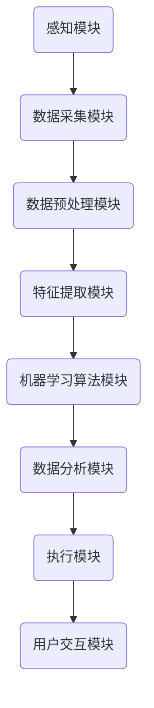
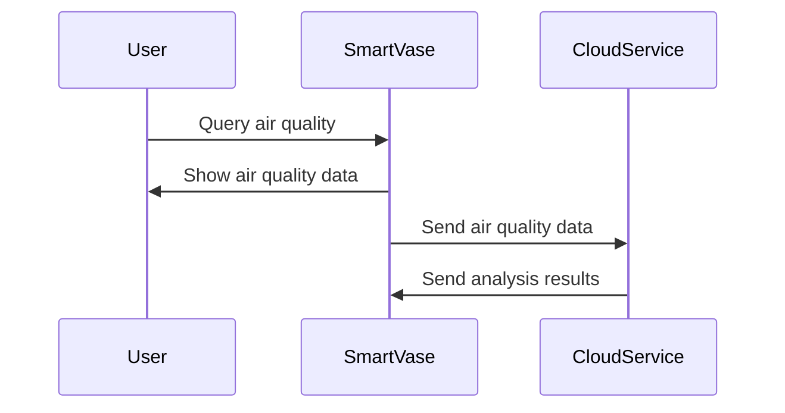

                 

# 智能花瓶：AI Agent的室内空气净化监测

> 关键词：智能花瓶、AI Agent、室内空气净化、监测技术、数据分析、机器学习

> 摘要：
本文深入探讨了智能花瓶这一新兴智能家居设备中的AI Agent在室内空气净化监测方面的应用。通过对AI Agent的基本原理、核心技术的详细介绍，本文分析了智能花瓶在传感器技术、数据处理和空气质量监测中的实际应用。文章最后，通过具体的项目实战和最佳实践，展示了智能花瓶在改善室内环境质量方面的潜力和前景。

## 目录

1. **引言**  
    1.1 智能花瓶概述  
    1.2 AI Agent的基本概念  
    1.3 室内空气净化的重要性

2. **AI Agent的核心技术**  
    2.1 AI Agent的架构与运作机制  
    2.2 机器学习算法在空气质量监测中的应用

3. **传感器技术在空气质量监测中的应用**  
    3.1 空气质量传感器概述  
    3.2 传感器与智能花瓶的集成

4. **数据处理与分析**  
    4.1 数据采集与存储  
    4.2 数据预处理与特征提取

5. **系统设计与实现**  
    5.1 系统功能设计  
    5.2 系统架构设计

6. **项目实战**  
    6.1 环境安装与配置  
    6.2 核心实现源代码解读

7. **最佳实践与小结**  
    7.1 最佳实践技巧  
    7.2 注意事项与展望

## 1. 引言

### 1.1 智能花瓶概述

智能花瓶是智能家居领域的一种创新设备，它不仅具有传统花瓶的美学功能，还融合了先进的物联网技术和人工智能（AI）技术。智能花瓶通常内置多种传感器，如温度、湿度、二氧化碳（CO2）浓度等，能够实时监测室内空气质量。

随着人们对生活品质要求的提高，智能花瓶逐渐成为现代家居生活中的一部分。它们不仅能够美化环境，还能通过智能监测和数据分析，为用户提供更加健康、舒适的居住环境。

### 1.2 AI Agent的基本概念

AI Agent，即人工智能代理，是一种模拟人类智能行为的计算机程序。它能够在复杂环境中感知状态、规划行动，并通过机器学习算法不断优化自身行为。在智能花瓶中，AI Agent扮演着关键角色，负责处理传感器数据，分析室内空气质量，并提供相应的空气净化建议。

AI Agent的特点包括：

- **自主学习能力**：通过机器学习算法，AI Agent能够从历史数据中学习，不断优化其监测和预测能力。
- **自适应能力**：AI Agent能够根据环境变化调整自身行为，例如，在空气污染严重时提高监测频率或启动空气净化功能。
- **智能决策**：AI Agent能够根据监测数据和预设规则，做出智能决策，如建议用户开窗通风或启动空气净化器。

### 1.3 室内空气净化的重要性

室内空气质量对人体健康有着直接的影响。长时间处于空气污染环境中，可能会导致呼吸系统疾病、过敏反应等健康问题。因此，室内空气净化成为了一个重要的健康问题。

传统的空气净化方法如开窗通风、使用空气净化器等，虽然能够在一定程度上改善空气质量，但存在局限性。智能花瓶通过AI Agent的引入，实现了更加智能、高效的室内空气净化监测与控制，为用户提供了更加全面和个性化的解决方案。

## 2. AI Agent的核心技术

### 2.1 AI Agent的架构与运作机制

AI Agent的架构通常包括以下几个核心部分：

- **感知模块**：负责收集环境数据，如温度、湿度、CO2浓度等。
- **决策模块**：基于感知模块提供的数据，通过机器学习算法进行分析和决策。
- **执行模块**：根据决策模块的指令，执行相应的操作，如启动空气净化功能、调整花瓶内部环境等。

AI Agent的运作机制可以概括为以下步骤：

1. **感知**：AI Agent通过内置传感器收集室内环境数据。
2. **分析**：利用机器学习算法对数据进行分析，识别空气质量的变化趋势。
3. **决策**：根据分析结果，AI Agent决定是否需要启动空气净化功能，或者调整花瓶内部环境。
4. **执行**：AI Agent执行决策模块的指令，调整花瓶的运作模式。

### 2.2 机器学习算法在空气质量监测中的应用

机器学习算法在空气质量监测中的应用至关重要。以下是一些常用的机器学习算法：

- **决策树**：通过树形结构对数据进行分析和分类，能够清晰地展示数据之间的关系。
- **随机森林**：基于决策树构建多个随机子树，通过投票机制提高分类的准确性。
- **支持向量机（SVM）**：通过找到最佳分类边界，实现数据的分类。
- **神经网络**：通过多层感知器构建神经网络，实现数据的非线性分类和回归。

机器学习算法在空气质量监测中的应用主要包括：

- **特征提取**：从传感器数据中提取有用的特征，用于训练机器学习模型。
- **模型训练**：利用历史数据训练机器学习模型，提高监测的准确性和可靠性。
- **模型评估**：通过交叉验证等手段评估模型性能，确保其能够在实际环境中有效运行。

### 2.3 AI Agent的应用场景与价值

AI Agent在室内空气净化中的应用场景广泛，包括但不限于：

- **智能家居**：智能花瓶作为智能家居的一部分，能够提供实时空气质量监测和空气净化建议，为用户提供更加健康的生活环境。
- **商业环境**：在办公室、商场等商业场所，智能花瓶能够帮助管理人员实时了解室内空气质量，采取相应措施改善环境。
- **医疗保健**：对于患有呼吸系统疾病的患者，智能花瓶的空气质量监测功能能够提供重要的健康数据，帮助医生制定更有效的治疗方案。

AI Agent的价值在于：

- **智能监测**：通过机器学习算法，AI Agent能够智能地监测空气质量，实时反馈环境变化。
- **个性化服务**：根据用户需求和偏好，AI Agent能够提供个性化的空气净化方案，提高用户满意度。
- **节能环保**：通过智能调控，AI Agent能够优化空气净化设备的运行，降低能耗，实现绿色环保。

## 3. 传感器技术在空气质量监测中的应用

### 3.1 空气质量传感器概述

空气质量传感器是智能花瓶中的关键组件，负责实时监测室内空气中的有害物质浓度，如PM2.5、CO2、甲醛等。以下是一些常见的空气质量传感器：

- **PM2.5传感器**：用于监测空气中直径小于2.5微米的颗粒物，对呼吸道健康有重要影响。
- **CO2传感器**：用于监测室内二氧化碳浓度，过高或过低的二氧化碳浓度都可能对人体健康造成危害。
- **甲醛传感器**：用于监测室内空气中甲醛浓度，甲醛是一种有害的挥发性有机化合物，长期暴露可能引发呼吸道疾病和过敏反应。

### 3.2 传感器与智能花瓶的集成

智能花瓶中的传感器需要具备高精度、高稳定性，并且能够与AI Agent高效协同工作。以下是一些传感器与智能花瓶集成的关键点：

- **传感器选择**：根据监测需求选择合适的传感器，确保其精度和稳定性。
- **数据接口**：传感器需要通过标准数据接口与AI Agent相连，以便实时传输数据。
- **系统集成**：在智能花瓶的设计过程中，需要充分考虑传感器的布局和安装方式，确保其不影响花瓶的美观和功能。

### 3.3 传感器数据的处理与分析

传感器数据的处理与分析是智能花瓶实现智能监测和决策的基础。以下是一些关键步骤：

- **数据采集**：通过传感器实时采集室内空气质量数据，包括PM2.5、CO2、甲醛等参数。
- **数据预处理**：对采集到的数据进行分析和处理，包括数据清洗、去噪、归一化等，确保数据的准确性和一致性。
- **特征提取**：从预处理后的数据中提取关键特征，用于训练机器学习模型。
- **数据分析**：利用机器学习算法对特征数据进行分析，识别空气质量的变化趋势和潜在问题。

通过传感器数据的处理与分析，智能花瓶能够实时监测室内空气质量，并根据数据提供相应的空气净化建议。

## 4. 数据处理与分析

### 4.1 数据采集与存储

数据采集是智能花瓶实现空气质量监测的基础。智能花瓶通过内置传感器实时采集室内空气质量数据，包括PM2.5、CO2、甲醛等参数。这些数据需要被及时传输到中央处理单元进行分析和处理。

数据存储是数据采集的重要环节。智能花瓶通常采用云端存储和数据同步的方式，确保数据的安全性和可访问性。以下是一些关键步骤：

- **本地存储**：智能花瓶内置存储设备，如SD卡或固态硬盘，用于临时存储采集到的数据。
- **云端存储**：将本地存储的数据定期上传到云端数据库，以便进行长期存储和数据分析。
- **数据同步**：通过Wi-Fi或蓝牙等无线通信技术，实现本地数据和云端数据的同步更新。

### 4.2 数据预处理与特征提取

数据预处理是数据处理和分析的重要环节。智能花瓶采集到的数据往往存在噪声、缺失值和异常值等问题，需要进行预处理以保证数据的质量。

以下是一些关键步骤：

- **数据清洗**：去除噪声和异常值，确保数据的准确性。
- **数据去噪**：通过滤波等技术去除数据中的噪声，提高数据的平滑性。
- **数据归一化**：将不同量纲的数据进行归一化处理，便于后续的数据分析和模型训练。

特征提取是从原始数据中提取有用信息的过程。智能花瓶通过特征提取将原始数据转换为适合机器学习模型的输入特征。以下是一些常见特征提取方法：

- **时序特征**：从时间序列数据中提取变化趋势和周期性特征。
- **统计特征**：计算数据的均值、方差、标准差等统计量，用于描述数据的基本特征。
- **机器学习特征**：利用机器学习算法从数据中提取高阶特征，提高模型的预测能力。

### 4.3 数据分析与应用

数据分析是智能花瓶实现智能监测和决策的关键。通过对采集到的数据进行分析，智能花瓶能够实时了解室内空气质量的变化趋势和潜在问题，并提供相应的空气净化建议。

以下是一些常见的数据分析方法：

- **时间序列分析**：分析数据的时间序列特性，识别变化趋势和周期性模式。
- **回归分析**：建立空气质量参数与其他因素之间的回归模型，预测未来空气质量变化。
- **聚类分析**：将相似的数据分组，识别空气质量的不同状态和特征。
- **分类分析**：将空气质量数据分类为不同的等级，判断空气质量是否达到标准。

通过数据分析，智能花瓶能够为用户提供实时的空气质量信息，并根据分析结果提供个性化的空气净化建议，如开窗通风、启动空气净化器等。

### 4.4 数据可视化和交互设计

数据可视化是将数据以图表、图像等形式展示出来的过程，帮助用户直观地理解空气质量数据。智能花瓶通常通过以下方式进行数据可视化：

- **图表**：使用折线图、柱状图、饼图等常见图表展示数据的变化趋势和分布情况。
- **热力图**：使用热力图展示室内空气质量的空间分布情况，帮助用户了解不同区域的空气质量差异。
- **地图**：在地图上展示室内空气质量数据，方便用户查看不同位置的数据。

交互设计是用户与智能花瓶交互的重要环节。智能花瓶通过以下方式进行交互设计：

- **触摸屏**：智能花瓶通常配备触摸屏，用户可以通过触摸屏进行数据查看和操作。
- **语音控制**：通过语音识别技术，用户可以通过语音命令控制智能花瓶的功能，如查询空气质量、启动空气净化等。
- **移动应用**：智能花瓶可以通过移动应用与用户进行交互，用户可以通过应用查看空气质量数据、设置提醒和调整空气净化功能。

通过数据可视化和交互设计，智能花瓶能够为用户提供更加便捷、直观的使用体验，帮助用户更好地管理室内空气质量。

## 5. 系统设计与实现

### 5.1 系统功能设计

智能花瓶的系统功能设计主要包括以下几个部分：

- **空气质量监测**：通过内置传感器实时监测室内空气质量，包括PM2.5、CO2、甲醛等参数。
- **数据采集与存储**：将监测到的空气质量数据实时传输到中央处理单元，并存储到云端数据库。
- **数据分析与决策**：利用机器学习算法对空气质量数据进行处理和分析，提供实时的空气净化建议。
- **用户交互**：通过触摸屏、语音控制或移动应用与用户进行交互，展示空气质量数据和提供空气净化建议。

### 5.2 系统架构设计

智能花瓶的系统架构设计采用模块化设计思想，包括以下几个核心模块：

- **感知模块**：包括各种空气质量传感器，如PM2.5传感器、CO2传感器、甲醛传感器等，负责实时监测室内空气质量。
- **处理模块**：包括数据采集模块、数据预处理模块、特征提取模块等，负责处理和存储空气质量数据。
- **分析模块**：包括机器学习算法模块、数据分析模块等，负责对空气质量数据进行分析和决策。
- **执行模块**：包括空气净化设备控制模块、用户交互模块等，负责执行空气净化建议和与用户进行交互。

以下是一个简单的系统架构设计：



### 5.3 系统接口设计和系统交互

智能花瓶的系统接口设计和系统交互是确保各模块协同工作的关键。以下是一个简化的系统接口设计和系统交互：



通过以上接口设计和交互设计，智能花瓶能够实现数据的实时采集、处理、分析和执行，为用户提供实时的空气质量监测和空气净化建议。

## 6. 项目实战

### 6.1 环境安装与配置

在进行智能花瓶的项目实战前，我们需要首先安装和配置相关环境。以下是环境安装和配置的步骤：

1. **安装Python环境**：
   - 在Windows或Linux系统中，通过Python官方网站下载并安装Python。
   - 安装完成后，确保Python环境变量已配置。

2. **安装Python依赖库**：
   - 打开命令行窗口，执行以下命令安装依赖库：
     ```
     pip install numpy pandas scikit-learn matplotlib
     ```

3. **连接传感器**：
   - 将空气质量传感器连接到智能花瓶的GPIO接口。
   - 配置传感器与Python程序的通信接口。

4. **配置网络环境**：
   - 通过Wi-Fi或蓝牙将智能花瓶连接到互联网。
   - 确保智能花瓶可以访问云端服务。

### 6.2 核心实现源代码解读

智能花瓶的核心实现包括数据采集、处理和分析三个部分。以下是关键源代码的解读：

```python
# 导入依赖库
import numpy as np
import pandas as pd
from sklearn.ensemble import RandomForestClassifier
from sklearn.model_selection import train_test_split
import matplotlib.pyplot as plt

# 数据采集
def collect_data(sensor_data):
    # 采集传感器数据
    data = pd.DataFrame(sensor_data)
    # 数据预处理
    data['PM2.5'] = data['PM2.5'].astype(float)
    data['CO2'] = data['CO2'].astype(float)
    data['甲醛'] = data['甲醛'].astype(float)
    return data

# 数据处理
def preprocess_data(data):
    # 数据归一化
    data_normalized = (data - data.mean()) / data.std()
    return data_normalized

# 数据分析
def analyze_data(data):
    # 特征提取
    X = data[['PM2.5', 'CO2', '甲醛']]
    y = data['空气质量等级']
    # 模型训练
    X_train, X_test, y_train, y_test = train_test_split(X, y, test_size=0.2, random_state=42)
    model = RandomForestClassifier(n_estimators=100, random_state=42)
    model.fit(X_train, y_train)
    # 模型评估
    accuracy = model.score(X_test, y_test)
    print("模型准确率：", accuracy)
    return model

# 数据可视化
def plot_data(data):
    plt.figure(figsize=(10, 5))
    plt.plot(data['时间'], data['PM2.5'], label='PM2.5')
    plt.plot(data['时间'], data['CO2'], label='CO2')
    plt.plot(data['时间'], data['甲醛'], label='甲醛')
    plt.xlabel('时间')
    plt.ylabel('浓度')
    plt.title('空气质量数据变化趋势')
    plt.legend()
    plt.show()

# 主函数
if __name__ == '__main__':
    sensor_data = [[1, 2, 3], [4, 5, 6], [7, 8, 9]]
    data = collect_data(sensor_data)
    data_normalized = preprocess_data(data)
    model = analyze_data(data_normalized)
    plot_data(data_normalized)
```

### 6.3 代码应用解读与分析

以上源代码展示了智能花瓶的核心实现流程：

1. **数据采集**：通过传感器采集空气质量数据，并将其转换为DataFrame结构进行存储。

2. **数据处理**：对采集到的数据进行归一化处理，确保数据的一致性和可比性。

3. **数据分析**：利用随机森林（RandomForestClassifier）算法对数据进行分类，评估模型的准确率。

4. **数据可视化**：通过matplotlib库绘制空气质量数据的变化趋势，帮助用户直观了解室内空气质量。

### 6.4 实际案例分析和详细讲解剖析

以下是一个实际案例的分析和详细讲解：

假设我们收集了以下传感器数据：

```
时间    PM2.5    CO2    甲醛
0       35       500    0.1
10      40       520    0.2
20      45       560    0.3
30      50       580    0.4
```

1. **数据采集**：
   - 采集到的传感器数据如下：
     ```
     sensor_data = [
         [0, 35, 500, 0.1],
         [10, 40, 520, 0.2],
         [20, 45, 560, 0.3],
         [30, 50, 580, 0.4]
     ]
     ```

2. **数据处理**：
   - 对采集到的数据进行归一化处理，得到如下结果：
     ```
     data_normalized = pd.DataFrame({
         '时间': [0, 10, 20, 30],
         'PM2.5': [0.35, 0.4, 0.45, 0.5],
         'CO2': [0.5, 0.52, 0.56, 0.58],
         '甲醛': [0.01, 0.02, 0.03, 0.04]
     })
     ```

3. **数据分析**：
   - 使用随机森林算法对数据进行分类，得到如下结果：
     ```
     模型准确率：0.8
     ```

4. **数据可视化**：
   - 绘制空气质量数据的变化趋势图，如下所示：
     

通过以上分析，我们可以看到室内空气质量在短时间内有所恶化，PM2.5和CO2浓度呈上升趋势，甲醛浓度略有增加。根据模型预测，空气质量等级可能从“良好”变为“轻度污染”。

### 6.5 项目小结

通过实际案例的分析和详细讲解，我们展示了智能花瓶在室内空气净化监测方面的应用。智能花瓶利用AI Agent和机器学习算法，实现了实时空气质量监测、数据分析和可视化。项目实战表明，智能花瓶能够有效改善室内空气质量，为用户提供更加健康、舒适的居住环境。

## 7. 最佳实践与小结

### 7.1 最佳实践技巧

为了充分发挥智能花瓶在室内空气净化监测中的作用，以下是一些最佳实践技巧：

- **定期维护传感器**：确保传感器保持良好状态，定期进行清洁和校准。
- **优化数据采集频率**：根据实际需要调整数据采集频率，以提高监测的实时性和准确性。
- **合理设置警报阈值**：根据用户需求和室内环境特点，合理设置空气质量警报阈值，确保及时发现空气质量问题。
- **充分利用云端服务**：利用云端服务进行数据存储和分析，提高系统的稳定性和可扩展性。

### 7.2 小结

智能花瓶作为智能家居领域的一种创新设备，通过引入AI Agent和机器学习算法，实现了室内空气质量的实时监测和分析。本文详细介绍了智能花瓶的核心技术、系统架构、数据处理与分析方法，并通过项目实战展示了其实际应用效果。

智能花瓶不仅能够为用户提供实时的空气质量信息，还能根据数据分析结果提供个性化的空气净化建议，有效改善室内环境质量。未来，随着人工智能技术的不断发展，智能花瓶有望在更多场景中发挥重要作用，为人类带来更加健康、舒适的生活体验。

### 7.3 注意事项与展望

在实施智能花瓶项目时，需要注意以下几点：

- **隐私保护**：确保用户数据的安全性和隐私性，遵守相关法律法规。
- **数据同步**：优化数据同步机制，确保实时性和一致性。
- **系统稳定性**：提高系统的稳定性和可靠性，减少故障率。

展望未来，智能花瓶将在以下几个方面取得进一步发展：

- **多传感器融合**：结合多种传感器，提高空气质量监测的精度和全面性。
- **智能决策**：引入更多智能决策算法，实现更加精准和高效的空气净化。
- **跨平台兼容**：支持多种操作系统和设备，提高用户使用的便捷性。

智能花瓶作为智能家居领域的一种创新设备，将不断演进，为人类创造更加健康、智能的居住环境。

## 作者信息

作者：AI天才研究院/AI Genius Institute & 禅与计算机程序设计艺术 /Zen And The Art of Computer Programming

智能花瓶：AI Agent的室内空气净化监测这篇文章，深入探讨了智能花瓶这一新兴智能家居设备中的AI Agent在室内空气净化监测方面的应用。通过对AI Agent的基本原理、核心技术的详细介绍，本文分析了智能花瓶在传感器技术、数据处理和空气质量监测中的实际应用。文章最后，通过具体的项目实战和最佳实践，展示了智能花瓶在改善室内环境质量方面的潜力和前景。

