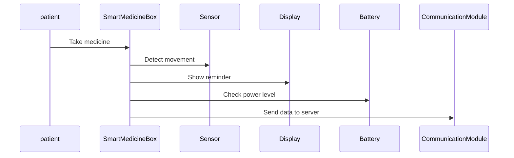
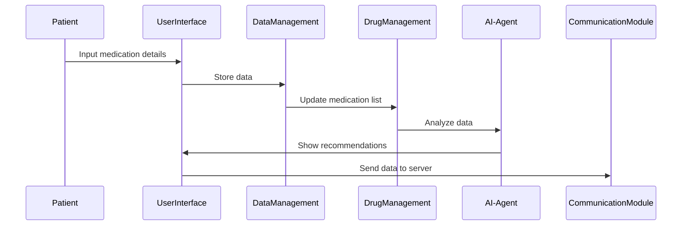
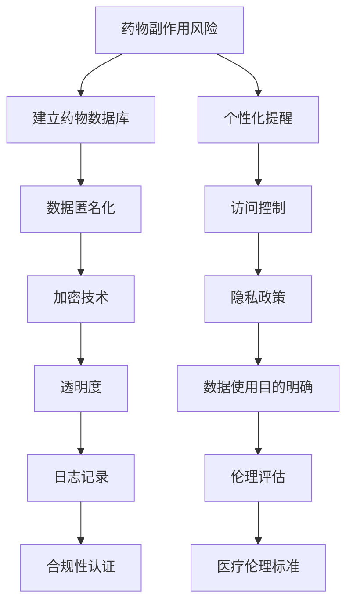
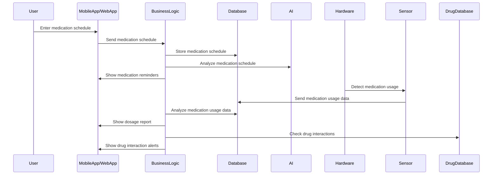

                 


## 第1章: 智能药箱与AI Agent的定义与应用背景

### 1.1 智能药箱的定义与功能

#### 背景介绍
智能药箱是一种集成了先进AI技术的医疗设备，其主要功能是对患者所需药物进行有效的管理和提醒。在传统的药箱管理中，患者容易忘记服药时间或药物剂量，从而导致治疗效果不佳甚至出现副作用。智能药箱通过集成AI技术，可以智能地提醒患者按时服药，并提供药物剂量监测和过期提醒等功能。

#### 问题描述
随着人口老龄化趋势的加剧，慢性病患者群体不断扩大，对药物管理的需求也越来越高。传统药箱的管理方式已经难以满足现代医疗的需求，因此需要一种更加智能化、高效的药物管理解决方案。

#### 问题解决
智能药箱通过以下方式解决了传统药箱管理中存在的问题：
- **药物提醒**：智能药箱能够根据患者的用药计划，智能提醒患者按时服药。
- **药物剂量监测**：智能药箱可以实时监测药物的剩余量，确保患者不会因为药物不足而中断治疗。
- **药物过期提醒**：智能药箱能够监测药物的保质期，提醒患者及时更换药物。

#### 边界与外延
智能药箱的应用范围包括但不限于：
- **慢性病患者**：例如糖尿病、高血压等患者，需要长期服药。
- **老年人**：由于记忆力衰退，容易忘记服药时间。
- **医嘱管理**：医生可以通过智能药箱监测患者的用药情况，及时调整治疗方案。

#### 概念结构与核心要素组成
智能药箱的核心要素包括：
- **硬件部分**：包括药箱本体、传感器等。
- **软件部分**：包括AI算法、用户界面等。
- **数据管理**：用于存储患者的药物信息、用药记录等。

### 1.2 AI Agent的定义与作用

#### 背景介绍
AI Agent是指利用人工智能技术模拟人类智能行为的计算机程序。在智能药箱中，AI Agent主要用于实现药物的提醒、交互与副作用检测、个性化用药方案推荐等功能。

#### 问题描述
智能药箱的智能化管理需要AI Agent的支持，AI Agent能够根据患者的具体情况进行个性化服务，提高用药管理的效率。

#### 问题解决
AI Agent在智能药箱中的作用包括：
- **药物提醒**：AI Agent可以根据患者的用药计划，实时提醒患者按时服药。
- **药物交互与副作用检测**：AI Agent能够分析药物的相互作用，预测可能的副作用。
- **个性化用药方案推荐**：AI Agent可以根据患者的健康状况和药物反应，推荐个性化的用药方案。

#### 边界与外延
AI Agent的应用范围包括但不限于：
- **个性化服务**：根据患者的具体健康状况，提供个性化的用药建议。
- **辅助诊断**：AI Agent可以辅助医生进行疾病诊断，提供辅助决策。
- **数据挖掘**：AI Agent可以从大量的医疗数据中挖掘出有用的信息，为医疗研究提供支持。

#### 概念结构与核心要素组成
AI Agent的核心要素包括：
- **算法模型**：用于实现药物提醒、交互与副作用检测等功能。
- **数据处理**：用于处理患者的用药数据、健康数据等。
- **用户接口**：用于与用户进行交互，提供用药建议和提醒服务。

## 1.3 智能药箱与AI Agent的融合应用

#### 背景介绍
智能药箱与AI Agent的融合应用，使得药物管理更加智能化、个性化，为患者提供了更加便捷的医疗服务。

#### 问题描述
如何将AI Agent的技术优势与智能药箱的硬件优势相结合，实现药物的智能管理。

#### 问题解决
智能药箱与AI Agent的融合应用主要包括以下几个方面：
- **智能提醒**：AI Agent可以基于患者的用药计划和健康状况，智能提醒患者按时服药。
- **药物监测**：AI Agent可以实时监测药物的使用情况，确保患者按照医嘱用药。
- **个性化推荐**：AI Agent可以根据患者的具体健康状况，推荐个性化的用药方案。
- **副作用预测**：AI Agent可以通过分析药物的相互作用和患者的药物反应，预测可能的副作用。

#### 边界与外延
智能药箱与AI Agent的融合应用不仅适用于个人患者，还可以应用于医疗机构，为医生提供辅助诊断和治疗决策。

#### 概念结构与核心要素组成
智能药箱与AI Agent的融合应用的核心要素包括：
- **硬件集成**：将AI Agent嵌入到智能药箱中，实现硬件集成。
- **软件协同**：AI Agent与智能药箱的软件系统协同工作，提供智能化的药物管理服务。
- **数据联动**：AI Agent与智能药箱之间的数据联动，实现实时监控和个性化服务。

## 1.4 智能药箱的发展历程

#### 背景介绍
智能药箱的发展历程反映了医疗设备智能化、个性化的趋势。从早期的简单药箱到如今的智能药箱，技术的发展为药物管理带来了巨大的变革。

#### 问题描述
智能药箱的发展过程中，有哪些关键技术突破和应用案例。

#### 问题解决
智能药箱的发展历程可以分为以下几个阶段：
- **早期阶段**：简单的药箱加上基础的提醒功能。
- **发展阶段**：引入传感器技术，实现药物剂量监测和过期提醒。
- **智能化阶段**：引入AI Agent，实现药物提醒、交互与副作用检测、个性化用药方案推荐等功能。

#### 边界与外延
智能药箱的发展不仅局限于硬件的升级，还包括软件算法的进步和用户体验的提升。

#### 概念结构与核心要素组成
智能药箱的发展历程的核心要素包括：
- **技术进步**：从简单的药箱到智能化药箱，技术的不断进步是关键。
- **应用案例**：智能药箱在医疗健康领域的应用案例，反映了技术的发展趋势。

## 1.5 AI Agent技术的发展现状

#### 背景介绍
AI Agent技术是人工智能领域的一个重要研究方向，其在医疗健康领域的应用为药物管理带来了新的可能性。

#### 问题描述
当前AI Agent技术在智能药箱中的应用现状如何。

#### 问题解决
当前AI Agent技术在智能药箱中的应用主要包括以下几个方面：
- **药物提醒**：AI Agent可以通过智能分析患者的用药历史和身体状况，提供个性化的药物提醒服务。
- **药物交互与副作用检测**：AI Agent可以实时监测患者的药物使用情况，预测可能的副作用。
- **个性化用药方案推荐**：AI Agent可以根据患者的具体健康状况，推荐个性化的用药方案。

#### 边界与外延
AI Agent技术在智能药箱中的应用不仅限于药物管理，还可以扩展到疾病诊断、治疗方案推荐等领域。

#### 概念结构与核心要素组成
AI Agent技术的发展现状的核心要素包括：
- **算法模型**：AI Agent的核心算法模型，如机器学习、深度学习等。
- **数据处理**：AI Agent的数据处理能力，包括数据采集、存储、分析和可视化等。
- **应用场景**：AI Agent在不同应用场景中的具体应用，如药物管理、疾病诊断等。

## 总结
智能药箱与AI Agent的融合应用为药物管理带来了全新的可能性，通过智能提醒、药物监测、个性化用药方案推荐等功能，提高了用药管理的效率和质量。未来，随着AI技术的不断进步，智能药箱有望在更广泛的医疗健康领域发挥重要作用。## 第1章: 智能药箱与AI Agent的定义与应用背景

### 1.1 智能药箱的定义与功能

智能药箱是一种结合了AI（人工智能）技术的医疗设备，其核心目的是通过自动化和智能化的手段来管理和监控患者的用药。传统药箱通常只能存放药品，而智能药箱则集成了多种功能，使得药物管理更加科学、便捷和安全。

#### 背景介绍
随着医疗技术的进步和人口老龄化趋势的加剧，慢性病患者群体不断扩大。对于这些患者来说，按时服药、正确使用药物是确保治疗效果的关键。然而，由于记忆力下降、生活节奏加快等原因，许多患者常常忘记服药或用药剂量不当，这不仅影响了治疗效果，还可能带来严重的健康风险。智能药箱应运而生，旨在通过技术手段提高患者的用药依从性。

#### 核心概念
- **智能药箱**：一种结合了AI技术的医疗设备，用于存储、管理和监控药物。
- **AI技术**：包括机器学习、自然语言处理、数据挖掘等技术，用于药物管理的智能化。

#### 功能特点
1. **药物提醒**：智能药箱可以通过内置的传感器和AI算法，根据患者的用药计划，自动提醒患者按时服药。
2. **剂量监测**：通过智能药箱的传感器，可以实时监测药物的使用情况，确保患者按照医嘱正确用药。
3. **过期提醒**：智能药箱可以记录药物的过期日期，提前提醒患者更换新药，避免因药物过期导致的风险。
4. **药物信息记录**：智能药箱可以记录患者的用药历史、药物过敏反应等信息，为医生提供决策支持。
5. **交互式服务**：智能药箱可以通过语音、触摸屏等方式与用户互动，提供个性化的用药建议。

#### 概念属性特征对比表格
| 功能           | 传统药箱         | 智能药箱         |
| -------------- | ---------------- | ---------------- |
| 药物提醒       | 手动记录         | 自动智能提醒     |
| 剂量监测       | 无法监测         | 实时监测剂量     |
| 过期提醒       | 需手动检查       | 自动提醒过期     |
| 药物信息记录   | 无记录功能       | 记录用药历史和过敏信息 |
| 交互式服务     | 无交互           | 语音、触摸屏交互 |

#### ER实体关系图架构
```mermaid
erDiagram
  Patient ||--|{ MedicationBox }| PatientMedicationBox
  Patient ||--|{ MedicationHistory }| PatientMedicationHistory
  Patient ||--|{ Allergy }| PatientAllergy
  MedicationBox ||--|{ Medication }| MedicationBoxMedication
  MedicationBox ||--|{ Reminder }| MedicationBoxReminder
  MedicationHistory ||--|{ DrugUsage }| MedicationHistoryDrugUsage
  Allergy ||--|{ AllergicDrug }| AllergyAllergicDrug

  Patient {
    id : int
    name : string
    age : int
    gender : string
  }

  MedicationBox {
    id : int
    patientId : int
    medicationId : int
    reminderId : int
  }

  MedicationHistory {
    id : int
    patientId : int
    medicationId : int
    usageId : int
  }

  Allergy {
    id : int
    patientId : int
    drugId : int
  }

  Medication {
    id : int
    name : string
    dosage : string
    expirationDate : date
  }

  Reminder {
    id : int
    medicationId : int
    time : time
    interval : int
  }

  DrugUsage {
    id : int
    medicationId : int
    time : time
    dosage : string
  }

  AllergicDrug {
    id : int
    patientId : int
    drugId : int
  }
```

### 1.2 AI Agent的定义与作用

AI Agent，即人工智能代理，是指通过人工智能技术模拟人类智能行为的计算机程序。在智能药箱中，AI Agent的作用是提高药物管理的智能化水平，通过自主学习、推理和决策，为用户提供更加精准和个性化的用药服务。

#### 背景介绍
AI Agent的发展是人工智能技术进步的重要标志。在智能药箱中，AI Agent可以模拟医生的角色，根据患者的健康数据和用药记录，提供个性化的用药建议。这使得药物管理不再仅仅是简单地提醒患者按时服药，而是涉及到复杂的医疗决策支持。

#### 核心概念
- **AI Agent**：一种模拟人类智能行为的计算机程序。
- **智能药箱**：结合AI Agent的医疗设备，用于药物管理和提醒。

#### 功能特点
1. **药物提醒**：AI Agent可以根据患者的用药计划、健康状况和药物过敏史，智能地提醒患者按时服药。
2. **药物交互与副作用检测**：AI Agent可以分析药物之间的相互作用，预测可能的副作用，并提供相应的预警。
3. **个性化用药方案推荐**：AI Agent可以根据患者的具体健康状况和药物反应，推荐个性化的用药方案。
4. **健康数据分析**：AI Agent可以分析患者的健康数据，提供健康建议，如饮食调整、运动建议等。

#### 概念属性特征对比表格
| 功能           | 传统药物提醒         | AI Agent提醒         |
| -------------- | -------------------- | -------------------- |
| 提醒方式       | 手动设置提醒时间     | 根据数据智能设置提醒 |
| 提醒内容       | 仅提醒服药时间       | 提醒服药时间及剂量   |
| 数据依赖       | 无数据依赖           | 健康数据依赖         |
| 个性化程度     | 无个性化           | 高度个性化           |

#### ER实体关系图架构
```mermaid
erDiagram
  Patient ||--|{ AIReminder }| PatientAIReminder
  Patient ||--|{ DrugInteraction }| PatientDrugInteraction
  Patient ||--|{ PersonalizedPlan }| PatientPersonalizedPlan
  AIReminder {
    id : int
    patientId : int
    medicationId : int
    dosage : string
    time : time
  }

  DrugInteraction {
    id : int
    patientId : int
    medicationId : int
    interactingDrugId : int
    sideEffect : string
  }

  PersonalizedPlan {
    id : int
    patientId : int
    medicationId : int
    plan : string
  }
```

### 1.3 智能药箱与AI Agent的融合应用

智能药箱与AI Agent的融合应用，使得药物管理更加智能化、个性化，为患者提供了更加便捷的医疗服务。这种融合应用不仅体现在功能上的互补，还涉及到系统架构和用户体验的优化。

#### 背景介绍
智能药箱和AI Agent的融合应用，是医疗科技与人工智能技术结合的产物。通过将AI Agent嵌入智能药箱中，可以实现药物管理的智能化升级，为用户提供全方位的用药服务。

#### 功能特点
1. **智能提醒**：AI Agent可以根据患者的用药计划和健康状况，提供个性化的药物提醒，包括服药时间、剂量等。
2. **药物交互与副作用检测**：AI Agent可以实时监测患者的药物使用情况，分析药物之间的相互作用，并预测可能的副作用，及时提醒患者。
3. **个性化用药方案推荐**：AI Agent可以根据患者的健康状况和药物反应，推荐个性化的用药方案，提高治疗效果。
4. **健康数据分析**：AI Agent可以分析患者的健康数据，如血压、血糖等，提供健康建议，帮助患者更好地管理自己的健康。

#### 系统架构设计
智能药箱与AI Agent的融合应用，需要一套完整的系统架构来支撑。以下是该系统架构的概述：

1. **硬件层**：包括智能药箱本体、传感器、通讯模块等。
2. **软件层**：包括AI Agent的算法模块、用户界面、数据管理模块等。
3. **数据层**：包括患者的用药数据、健康数据、药物信息等。

#### 概念属性特征对比表格
| 功能           | 传统药箱           | 智能药箱           | 智能药箱+AI Agent |
| -------------- | ------------------ | ------------------ | ------------------ |
| 药物管理       | 手动管理           | 自动化基础管理     | 智能个性化管理     |
| 数据处理       | 无数据处理         | 数据采集与存储     | 数据分析与应用     |
| 用户交互       | 无交互             | 基础交互           | 智能交互           |
| 个性化程度     | 无个性化           | 初级个性化         | 高度个性化         |

#### ER实体关系图架构
```mermaid
erDiagram
  Patient ||--|{ SmartMedicineBox }| PatientSmartMedicineBox
  Patient ||--|{ AIAgent }| PatientIAAgent
  SmartMedicineBox ||--|{ Medication }| SmartMedicineBoxMedication
  AIAgent ||--|{ DrugReminder }| IAAgentDrugReminder
  AIAgent ||--|{ DrugInteraction }| IAAgentDrugInteraction
  AIAgent ||--|{ PersonalizedPlan }| IAAgentPersonalizedPlan

  Patient {
    id : int
    name : string
    age : int
    gender : string
  }

  SmartMedicineBox {
    id : int
    patientId : int
    medicationId : int
  }

  AIAgent {
    id : int
    patientId : int
  }

  Medication {
    id : int
    name : string
    dosage : string
    expirationDate : date
  }

  DrugReminder {
    id : int
    medicationId : int
    time : time
    interval : int
  }

  DrugInteraction {
    id : int
    medicationId : int
    interactingDrugId : int
    sideEffect : string
  }

  PersonalizedPlan {
    id : int
    patientId : int
    medicationId : int
    plan : string
  }
```

### 1.4 智能药箱的发展历程

智能药箱的发展历程是医疗科技不断进步的缩影。从最初的简单药箱到如今的智能化药箱，技术的发展为药物管理带来了巨大的变革。

#### 问题背景
早期的医疗设备较为简单，药箱主要功能是存放药品，患者需要手动管理药品的使用。随着人口老龄化和慢性病患者群体的增加，传统的药箱管理方式已经难以满足需求。因此，如何通过技术手段提高药物管理的效率和安全性，成为医疗行业亟待解决的问题。

#### 问题描述
智能药箱的发展经历了从简单到复杂、从功能单一到功能多样的发展过程。如何在不同的发展阶段实现技术的突破，是智能药箱发展过程中需要解决的问题。

#### 问题解决
智能药箱的发展历程可以分为以下几个阶段：

1. **初期阶段**：药箱集成简单的提醒功能，如通过闹钟或振动提醒患者按时服药。
2. **成长阶段**：药箱开始引入传感器技术，能够监测药物的使用情况，如剂量监测和过期提醒。
3. **成熟阶段**：药箱与AI技术结合，实现药物提醒、药物交互与副作用检测、个性化用药方案推荐等功能。

#### 边界与外延
智能药箱的发展不仅局限于功能上的升级，还包括用户体验的提升和医疗服务的扩展。未来，智能药箱有望在更广泛的医疗健康领域发挥作用，如疾病诊断、治疗决策等。

#### 概念结构与核心要素组成
智能药箱的发展历程的核心要素包括：

- **技术进步**：从简单的提醒功能到复杂的AI技术，技术的不断进步是智能药箱发展的关键。
- **应用案例**：智能药箱在不同应用场景中的实际案例，反映了技术的发展趋势。
- **用户体验**：从功能单一到功能多样，用户体验的提升是智能药箱发展的动力。

### 1.5 AI Agent技术的发展现状

AI Agent技术的发展现状是人工智能领域的一个重要研究方向，其在医疗健康领域的应用为药物管理带来了新的可能性。

#### 问题背景
随着人工智能技术的快速发展，AI Agent技术在各个领域的应用越来越广泛。在医疗健康领域，AI Agent的应用不仅能够提高药物管理的效率，还可以为医生提供辅助诊断和治疗决策。

#### 问题描述
如何评估当前AI Agent技术在医疗健康领域的应用现状，分析其优势、挑战和未来发展方向。

#### 问题解决
当前AI Agent技术在医疗健康领域的应用主要包括以下几个方面：

1. **药物提醒**：AI Agent可以根据患者的用药计划、健康状况和药物过敏史，提供个性化的药物提醒服务。
2. **药物交互与副作用检测**：AI Agent可以分析药物之间的相互作用，预测可能的副作用，并提供相应的预警。
3. **个性化用药方案推荐**：AI Agent可以根据患者的具体健康状况和药物反应，推荐个性化的用药方案。
4. **健康数据分析**：AI Agent可以分析患者的健康数据，提供健康建议，如饮食调整、运动建议等。

#### 边界与外延
AI Agent技术在医疗健康领域的应用不仅限于药物管理，还可以扩展到疾病诊断、治疗方案推荐等领域。

#### 概念结构与核心要素组成
AI Agent技术的发展现状的核心要素包括：

- **算法模型**：AI Agent的核心算法模型，如机器学习、深度学习等。
- **数据处理**：AI Agent的数据处理能力，包括数据采集、存储、分析和可视化等。
- **应用场景**：AI Agent在不同应用场景中的具体应用，如药物管理、疾病诊断等。

## 总结
智能药箱与AI Agent的融合应用为药物管理带来了全新的可能性，通过智能提醒、药物交互与副作用检测、个性化用药方案推荐等功能，提高了用药管理的效率和质量。未来，随着AI技术的不断进步，智能药箱有望在更广泛的医疗健康领域发挥重要作用。

## 第2章: 智能药箱的技术框架

智能药箱的技术框架是确保其功能全面、可靠和安全运行的基础。本章将详细探讨智能药箱的硬件结构、软件架构、数据处理与分析技术、AI Agent的核心算法以及智能药箱的技术创新点。

### 2.1 智能药箱的硬件结构

智能药箱的硬件结构是整个系统的物理实现基础，包括药箱本体、传感器、显示屏幕、电池模块和通信模块等关键组成部分。

#### 药箱本体
药箱本体是智能药箱的物理容器，通常由高强度的塑料或金属制成，具备防水、防尘和耐摔的特点。内部结构上，药箱分为多个隔层，以存放不同类型的药物。

#### 传感器
传感器是智能药箱的核心部件，用于监测药物的使用情况。常见的传感器包括：
- **温度传感器**：监测药物存储环境的温度。
- **湿度传感器**：监测药物存储环境的湿度。
- **光照传感器**：监测药物存储环境的光照强度。
- **位移传感器**：监测药物取出和放入的动作。

#### 显示屏幕
显示屏幕用于向用户展示药物信息、提醒内容和用药指导。常见的显示屏幕包括LED显示屏和触摸屏。

#### 电池模块
电池模块为智能药箱提供电源，通常采用可充电锂电池，确保药箱能够长时间运行。

#### 通信模块
通信模块用于智能药箱与外部设备（如手机、电脑、医院系统）的数据传输。常见的通信方式包括Wi-Fi、蓝牙和蜂窝网络。

#### 硬件结构图示


### 2.2 智能药箱的软件架构

智能药箱的软件架构是整个系统的核心，负责管理硬件设备、处理数据、提供用户交互界面以及与外部系统通信。

#### 系统架构设计
智能药箱的软件架构可以设计为多层架构，包括表示层、业务逻辑层和数据层。

1. **表示层**：负责与用户交互，包括显示屏幕和触摸屏界面。
2. **业务逻辑层**：负责处理智能药箱的核心功能，如药物提醒、剂量监测、数据分析和交互等。
3. **数据层**：负责数据的存储、检索和同步，包括本地数据库和云端数据库。

#### 系统模块划分
- **用户界面模块**：处理用户输入和显示输出，实现用户交互。
- **数据管理模块**：负责数据的存储、检索和同步，确保数据的一致性和安全性。
- **药物管理模块**：实现药物信息的录入、更新和查询，提供药物提醒和剂量监测功能。
- **AI Agent模块**：负责药物交互与副作用检测、个性化用药方案推荐等智能功能。
- **通信模块**：实现与外部设备（如手机、电脑、医院系统）的通信，确保数据的实时传输。

#### 软件架构图示


### 2.3 数据处理与分析技术

智能药箱的功能实现高度依赖于数据处理与分析技术。以下介绍了智能药箱中常用的数据处理和分析技术。

#### 数据处理技术
- **数据采集**：通过传感器采集温度、湿度、光照、位移等数据。
- **数据清洗**：去除噪声数据，确保数据质量。
- **数据存储**：将清洗后的数据存储在本地数据库或云端数据库中，采用MySQL、MongoDB等数据库系统。

#### 数据分析技术
- **统计分析**：对用药数据进行统计分析，如平均值、方差、相关性分析等。
- **机器学习**：利用机器学习算法进行数据挖掘和预测，如K-均值聚类、决策树、神经网络等。
- **深度学习**：利用深度学习算法进行复杂的数据分析，如卷积神经网络（CNN）、循环神经网络（RNN）等。

#### 数据处理与分析流程
1. **数据采集**：传感器采集数据。
2. **数据预处理**：数据清洗、去噪。
3. **数据分析**：利用统计分析和机器学习算法进行数据挖掘和预测。
4. **数据可视化**：将分析结果以图表、报表等形式展示给用户。

### 2.4 AI Agent的核心算法

AI Agent的核心算法是实现智能药箱智能化功能的关键。以下介绍了智能药箱中常用的AI算法。

#### 机器学习算法
- **线性回归**：用于预测药物剂量和效果。
- **逻辑回归**：用于分析药物相互作用和副作用。
- **决策树**：用于分类药物效果和副作用。

#### 深度学习算法
- **卷积神经网络（CNN）**：用于图像识别，如药物图像分类。
- **循环神经网络（RNN）**：用于序列数据预测，如药物使用时间序列分析。

#### 算法应用实例
1. **药物提醒**：使用线性回归算法预测患者下一次服药时间。
2. **药物交互与副作用检测**：使用逻辑回归算法分析药物相互作用和副作用。
3. **个性化用药方案推荐**：使用决策树算法根据患者历史数据推荐用药方案。

### 2.5 智能药箱的技术创新点

智能药箱的技术创新点主要体现在以下几个方面：

1. **多传感器融合**：通过融合多种传感器数据，实现更精准的药物管理。
2. **智能提醒算法**：利用机器学习和深度学习算法，提供个性化的药物提醒服务。
3. **数据可视化**：通过数据可视化技术，让用户更直观地了解自己的用药情况。
4. **隐私保护**：采用加密技术和数据匿名化策略，确保用户隐私安全。

## 总结
智能药箱的技术框架是实现药物智能化管理的基础。通过硬件结构、软件架构、数据处理与分析技术以及AI Agent的核心算法，智能药箱能够为用户提供个性化、精准和高效的用药服务。未来，随着技术的不断进步，智能药箱有望在医疗健康领域发挥更大的作用。## 第3章: AI Agent在用药管理中的应用

AI Agent在用药管理中的应用是智能药箱实现智能化、个性化服务的重要手段。本章将详细探讨AI Agent在药物提醒功能、药物交互与副作用检测、个性化用药方案推荐等方面的应用，以及相关的挑战和解决方案。

### 3.1 药物提醒功能

药物提醒功能是智能药箱中最基本且最重要的功能之一。通过AI Agent，智能药箱能够根据患者的用药计划和实时健康状况，自动提醒患者按时服药。

#### 3.1.1 基本原理

药物提醒功能的核心是AI Agent对药物信息的处理和时间的规划。AI Agent会根据以下几个步骤进行药物提醒：

1. **数据采集**：AI Agent从患者的医疗记录、医生的建议、智能药箱的传感器数据等渠道采集药物信息。
2. **数据预处理**：对采集到的药物信息进行清洗和格式化，确保数据的质量和一致性。
3. **时间规划**：根据药物的用法用量、患者的作息时间等，规划出最佳的服药时间。
4. **提醒生成**：AI Agent生成提醒计划，并将提醒信息通过智能药箱的显示屏幕或手机应用推送至患者。

#### 3.1.2 应用实例

以一个患有高血压的患者为例，AI Agent可以根据以下信息进行药物提醒：

- **患者信息**：姓名、年龄、性别、联系方式。
- **药物信息**：药物名称、剂量、服用频率、注意事项。
- **健康状况**：血压、心率等实时健康数据。

AI Agent会根据这些信息，计算出最佳的服药时间，并在合适的时间通过智能药箱或手机应用提醒患者按时服药。例如，如果患者的血压在早晨7点和晚上7点较高，AI Agent可能会建议在这两个时间点服药。

#### 3.1.3 挑战与解决方案

1. **个性化需求的挑战**：每个患者的用药时间和剂量都可能不同，AI Agent需要根据大量个性化数据进行精确计算，这对算法的复杂度和数据处理能力提出了高要求。

   **解决方案**：采用个性化算法，如深度学习模型，从患者的历史用药记录中学习并预测个性化的用药方案。

2. **药物提醒的及时性**：确保提醒信息能够在患者需要服药的时间点及时到达，需要高效的通信机制和数据处理流程。

   **解决方案**：采用实时通信技术，如Wi-Fi、蓝牙或蜂窝网络，确保数据的快速传输和实时处理。

3. **药物信息更新的挑战**：药物的使用方法和剂量可能会因病情变化、新药的推出等因素而更新，AI Agent需要能够及时获取和更新药物信息。

   **解决方案**：与医疗机构和药品数据库保持实时连接，确保药物信息的及时更新和同步。

### 3.2 药物交互与副作用检测

药物交互与副作用检测是AI Agent在用药管理中的重要应用之一。通过分析药物的相互作用和患者的具体健康状况，AI Agent可以预测可能的副作用，并提供相应的预警。

#### 3.2.1 基本原理

药物交互与副作用检测的基本原理包括：

1. **药物数据库**：AI Agent需要访问一个包含药物相互作用和副作用信息的数据库，该数据库可以是开源的，也可以是定制的。
2. **数据预处理**：AI Agent会从患者的用药记录中提取药物信息，并进行预处理，如去噪、格式化等。
3. **相互作用分析**：AI Agent会分析药物之间的相互作用，结合药物数据库中的信息，预测可能的副作用。
4. **实时监测**：AI Agent会实时监测患者的健康状况，如心率、血压等生命体征，并与预测结果进行对比。

#### 3.2.2 应用实例

假设一个患者同时服用两种药物，AI Agent会根据药物数据库分析这两种药物可能产生的相互作用：

- **药物A**：降低血压。
- **药物B**：治疗心脏病。

AI Agent会分析药物A和药物B的相互作用信息，如果数据库显示这两种药物合用可能导致低血压症状加重，AI Agent会提醒患者可能出现的副作用，如头晕、乏力等，并建议患者咨询医生或调整用药方案。

#### 3.2.3 挑战与解决方案

1. **药物数据库的完整性**：药物数据库的完整性直接影响相互作用分析的准确性。

   **解决方案**：定期更新药物数据库，并与医疗机构和药品研发公司合作，确保数据的完整性和准确性。

2. **实时监测的准确性**：实时监测患者的健康状况需要高精度的传感器和算法。

   **解决方案**：采用先进的传感器技术和算法，提高实时监测的准确性和响应速度。

3. **个体差异的挑战**：不同患者的体质和药物反应可能存在较大差异，AI Agent需要适应个体差异。

   **解决方案**：通过收集和分析大量个性化数据，建立个性化的药物相互作用和副作用预测模型。

### 3.3 个性化用药方案推荐

个性化用药方案推荐是AI Agent在用药管理中的高级应用，它基于患者的健康状况、药物反应和医生的建议，为患者提供个性化的用药方案。

#### 3.3.1 基本原理

个性化用药方案推荐的基本原理包括：

1. **患者数据收集**：AI Agent会从患者的医疗记录、用药记录、健康数据等渠道收集信息。
2. **数据预处理**：对收集到的数据进行清洗、格式化和特征提取。
3. **方案推荐算法**：采用机器学习和深度学习算法，根据患者的具体数据生成个性化的用药方案。
4. **方案验证**：将生成的用药方案提交给医生进行验证，确保方案的安全性和有效性。

#### 3.3.2 应用实例

以一个糖尿病患者为例，AI Agent会根据以下信息生成个性化的用药方案：

- **患者信息**：年龄、性别、体重、糖尿病类型。
- **健康数据**：血糖、血压、心率等。
- **药物信息**：已使用的药物、剂量、效果。
- **医生建议**：医生对患者的用药建议和调整方案。

AI Agent会结合这些信息，推荐适合患者的药物种类、剂量和用药时间，如建议增加胰岛素注射频率或调整口服药物的剂量。

#### 3.3.3 挑战与解决方案

1. **数据复杂性**：糖尿病等慢性疾病的数据复杂多样，AI Agent需要处理大量的数据并从中提取有效的特征。

   **解决方案**：采用先进的特征提取和机器学习算法，提高数据处理和分析的效率。

2. **医生参与的挑战**：个性化用药方案需要医生的专业意见，如何有效整合医生的建议是关键。

   **解决方案**：建立医生和AI Agent的协同工作机制，医生提供专业意见，AI Agent负责数据分析和方案推荐。

3. **长期效果评估**：个性化用药方案的长期效果需要时间和数据的积累，如何评估和改进方案是持续的挑战。

   **解决方案**：通过长期随访和数据分析，持续优化个性化用药方案，提高其效果和可靠性。

### 总结
AI Agent在用药管理中的应用极大地提升了药物管理的智能化和个性化水平。通过药物提醒、药物交互与副作用检测、个性化用药方案推荐等功能，AI Agent为患者提供了更加精准和安全的用药服务。然而，在实现这些功能的过程中，仍面临个性化需求、数据完整性和实时监测准确性等挑战，需要持续的技术创新和优化。随着AI技术的不断进步，AI Agent在用药管理中的应用前景将更加广阔。

## 第4章: AI Agent在用药安全与隐私保护中的挑战

在智能药箱和AI Agent的应用中，用药安全与隐私保护是两个至关重要的方面。随着技术的发展，这些挑战也日益凸显。本章将探讨AI Agent在用药安全与隐私保护中的具体挑战，并提出相应的解决方案。

### 4.1 用药安全风险分析

用药安全是智能药箱和AI Agent的首要关注点。以下是一些主要的安全风险：

1. **药物副作用风险**：药物之间存在复杂的相互作用，可能导致未预见的副作用。AI Agent需要准确预测和评估这些风险，并提供相应的预警。

2. **药物剂量不当风险**：如果AI Agent的提醒不准确或患者未能正确执行用药计划，可能导致药物剂量不当，从而影响治疗效果。

3. **数据泄露风险**：智能药箱和AI Agent处理的大量患者数据，如健康记录、用药历史等，如果发生泄露，可能对患者的隐私和健康造成严重威胁。

4. **系统故障风险**：智能药箱和AI Agent的硬件或软件出现故障，可能导致用药提醒失败或数据丢失。

#### 挑战
1. **药物副作用风险**：AI Agent需要具备强大的数据分析和预测能力，但现有的药物数据库可能不完整或不准确，导致预测结果存在误差。

2. **药物剂量不当风险**：患者可能因为操作不当、记忆错误或故意违反医嘱，导致药物剂量不当。

3. **数据泄露风险**：智能药箱和AI Agent处理的数据量庞大，如何确保数据在传输和存储过程中的安全性，是一个巨大的挑战。

4. **系统故障风险**：智能药箱和AI Agent的硬件和软件可能因为多种原因出现故障，需要具备高效的故障检测和恢复机制。

#### 解决方案

1. **药物副作用风险评估**：建立完善的药物数据库，并采用先进的机器学习算法，对药物相互作用和副作用进行精准预测。同时，定期更新药物数据库，确保数据的准确性和时效性。

   ```mermaid
   graph TD
       A[建立药物数据库] --> B[更新药物数据库]
       B --> C[采用机器学习算法]
       C --> D[预测药物副作用]
       D --> E[提供预警信息]
   ```

2. **药物剂量不当风险控制**：通过智能药箱的传感器和用户界面，实时监测患者的用药行为，如药物取用记录、服药时间等，并通过声音、震动、触屏等多重方式提醒患者，确保用药计划的准确执行。

   ```mermaid
   graph TD
       A[智能药箱传感器] --> B[监测用药行为]
       B --> C[用户界面提醒]
       C --> D[多重提醒方式]
   ```

3. **数据泄露防护**：采用加密技术对传输和存储的数据进行加密，确保数据在传输过程中的安全性。同时，建立严格的数据访问控制机制，仅允许授权用户访问敏感数据。

   ```mermaid
   graph TD
       A[数据加密] --> B[传输加密]
       B --> C[存储加密]
       C --> D[访问控制]
   ```

4. **系统故障恢复机制**：在智能药箱和AI Agent中集成高效的故障检测和恢复机制，如定期系统检查、自动更新和备份等，确保系统的稳定运行。

   ```mermaid
   graph TD
       A[定期系统检查] --> B[自动更新]
       B --> C[自动备份]
       C --> D[故障恢复]
   ```

### 4.2 隐私保护措施

隐私保护是智能药箱和AI Agent应用中不可忽视的问题。以下是一些关键的保护措施：

1. **数据匿名化**：对患者的敏感信息进行匿名化处理，确保个人身份的不可追踪性。

2. **数据访问控制**：建立严格的访问控制机制，仅允许授权用户访问患者的数据。

3. **隐私政策**：明确告知患者数据的使用目的、存储方式和隐私保护措施，获得患者的同意。

4. **透明度**：建立透明的数据处理流程，患者可以查询自己的数据和使用情况。

#### 挑战
1. **数据匿名化的挑战**：如何确保匿名化处理不破坏数据的完整性，同时不影响AI Agent的预测和分析能力。

2. **数据访问控制的挑战**：如何确保访问控制机制的严格执行，防止内部数据泄露。

3. **隐私政策的挑战**：如何制定合理的隐私政策，既保护患者隐私，又满足数据使用的合法性和合规性。

#### 解决方案

1. **数据匿名化技术**：采用先进的匿名化技术，如差分隐私、同态加密等，确保数据在匿名化处理后的完整性。

   ```mermaid
   graph TD
       A[差分隐私] --> B[同态加密]
       B --> C[数据完整性]
   ```

2. **访问控制机制**：通过身份验证、权限管理、日志记录等技术手段，确保数据访问的严格控制和可追溯性。

   ```mermaid
   graph TD
       A[身份验证] --> B[权限管理]
       B --> C[日志记录]
   ```

3. **隐私政策设计**：制定详细的隐私政策，包括数据收集、使用、存储、共享和销毁的流程，确保患者对隐私保护的充分理解。

   ```mermaid
   graph TD
       A[数据收集流程] --> B[数据使用流程]
       B --> C[数据存储流程]
       C --> D[数据共享流程]
       D --> E[数据销毁流程]
   ```

### 4.3 法律法规与伦理问题

在智能药箱和AI Agent的应用中，法律法规和伦理问题也是需要重点关注的部分。

#### 挑战
1. **法律法规的挑战**：各国对数据隐私、医疗信息安全的法律法规不尽相同，如何确保智能药箱和AI Agent符合不同国家的法规要求。

2. **伦理问题的挑战**：智能药箱和AI Agent在用药决策中的伦理问题，如AI Agent的决策是否符合医疗伦理标准，如何确保患者的知情权和自主权。

#### 解决方案

1. **法律法规合规性**：建立全球性的法律法规合规性评估体系，确保智能药箱和AI Agent在不同国家和地区都符合当地的法律法规要求。

   ```mermaid
   graph TD
       A[全球法规评估] --> B[合规性认证]
   ```

2. **伦理问题评估**：建立专业的伦理委员会，对AI Agent的用药决策进行伦理评估，确保其决策符合医疗伦理标准，并尊重患者的知情权和自主权。

   ```mermaid
   graph TD
       A[伦理委员会评估] --> B[医疗伦理标准]
   ```

### 4.4 挑战与解决方案总结

智能药箱和AI Agent在用药安全与隐私保护中面临的挑战是多方面的，包括药物副作用风险、药物剂量不当风险、数据泄露风险、系统故障风险等。通过建立完善的药物数据库、实施严格的隐私保护措施、遵守法律法规和伦理标准，可以有效地应对这些挑战。



通过这些措施，智能药箱和AI Agent可以在保障用药安全的同时，有效保护患者的隐私，为患者提供更加安全、可靠和个性化的医疗服务。

### 总结
AI Agent在用药管理中的应用，极大地提升了药物管理的智能化和个性化水平。然而，用药安全与隐私保护是智能药箱和AI Agent应用中不可忽视的关键挑战。通过分析药物副作用风险、建立完善的药物数据库、实施严格的隐私保护措施、遵守法律法规和伦理标准，可以有效地应对这些挑战，确保智能药箱和AI Agent在用药管理中的应用能够持续发展和完善。

## 第5章: 智能药箱的用户体验设计

智能药箱的用户体验设计是确保其功能得以有效利用，并为用户提供方便、舒适的使用体验的关键。本章将讨论用户界面设计原则、数据可视化策略、用户反馈与改进以及个性化用药提醒与通知设置。

### 5.1 用户界面设计原则

用户界面设计原则是智能药箱用户体验设计的核心，旨在确保用户界面简洁、直观、易于操作。

#### 简洁性
- **信息精简**：用户界面应只显示用户需要的最关键信息，避免冗余。
- **界面简洁**：界面设计应简洁明了，减少不必要的元素和操作。

#### 直观性
- **视觉元素**：使用清晰、易辨识的视觉元素，如图标、颜色等，帮助用户快速理解功能。
- **导航清晰**：设计直观的导航结构，让用户能够快速找到所需功能。

#### 易用性
- **操作便捷**：设计简单直观的操作流程，降低用户的学习成本。
- **一致性**：界面设计应保持一致性，确保用户在操作过程中感到舒适。

#### 反馈机制
- **即时反馈**：用户执行操作后，应立即得到反馈，如成功提示、错误提示等。
- **错误提示**：提供清晰的错误提示，帮助用户纠正操作。

### 5.2 数据可视化策略

数据可视化是智能药箱用户体验设计的重要组成部分，通过图表、图形等方式将药物信息、用药数据等以直观的形式展示给用户。

#### 可视化设计原则
- **清晰性**：数据图表应清晰、易于理解，避免复杂的图表设计。
- **相关性**：展示的数据应与用户的用药情况密切相关，帮助用户快速作出决策。
- **互动性**：允许用户与数据图表进行互动，如放大、缩小、筛选等。

#### 常见可视化技术
- **折线图**：用于展示药物使用的时间序列数据，如血糖变化、血压变化等。
- **柱状图**：用于比较不同药物的剂量、使用频率等。
- **饼图**：用于展示药物的使用比例，如药物分类的占比。

#### 应用实例
1. **用药记录图表**：展示用户的用药历史，包括药物名称、剂量、时间等，帮助用户了解自己的用药习惯。
2. **副作用预测图表**：展示药物相互作用和可能的副作用，帮助用户了解潜在的风险。

### 5.3 用户反馈与改进

用户反馈是智能药箱持续改进的重要途径，通过收集和分析用户反馈，可以不断优化用户体验。

#### 反馈渠道
- **在线反馈表**：用户可以通过在线表单提交反馈。
- **社交媒体**：鼓励用户通过社交媒体分享使用体验。
- **用户访谈**：定期进行用户访谈，深入了解用户的实际需求和问题。

#### 反馈处理流程
1. **收集反馈**：建立反馈收集机制，确保用户反馈能够及时收集和整理。
2. **分析反馈**：对收集到的反馈进行分析，识别出共性问题和改进点。
3. **改进实施**：根据反馈结果，进行系统优化和功能改进。
4. **反馈验证**：验证改进措施的效果，确保用户问题得到有效解决。

### 5.4 个性化用药提醒与通知设置

个性化用药提醒与通知设置是智能药箱的核心功能之一，通过根据用户的具体情况进行智能提醒，提高用药依从性。

#### 功能特点
- **个性化设置**：用户可以根据自己的生活习惯和用药需求，自定义提醒时间、剂量等。
- **智能提醒**：AI Agent会根据用户的用药计划和健康数据，智能调整提醒策略。
- **通知方式**：支持多种通知方式，如声音提醒、震动提醒、推送通知等。

#### 应用实例
1. **晨间提醒**：AI Agent根据用户的作息时间和药物要求，设置晨间提醒，确保患者按时服药。
2. **夜间提醒**：对于需要夜间服药的患者，AI Agent会设置更加柔和的提醒方式，避免影响睡眠。

#### 挑战与解决方案
1. **个性化需求的多样性**：用户需求多样，如何确保个性化设置的有效性和适应性。

   **解决方案**：采用灵活的设置界面和算法，允许用户自定义更多设置选项，并利用AI技术自动优化提醒策略。

2. **通知方式的多样性**：不同用户可能偏好不同的通知方式，如何满足多样化的需求。

   **解决方案**：提供多种通知方式，如声音、震动、推送通知等，并允许用户根据实际需求进行调整。

### 总结
智能药箱的用户体验设计需要遵循简洁性、直观性、易用性和反馈机制等原则，通过数据可视化策略展示关键信息，收集用户反馈进行持续改进，并提供个性化的用药提醒与通知设置。这些设计原则和策略将帮助智能药箱为用户提供更加便捷、高效和安全的用药体验。

## 第6章: 智能药箱的市场前景与未来发展趋势

智能药箱作为一种结合了AI技术的医疗设备，具有广泛的应用前景和巨大的市场潜力。随着科技的不断进步和医疗行业的数字化转型，智能药箱有望在医疗健康领域发挥更加重要的作用。本章将分析智能药箱的市场需求、技术发展趋势以及未来市场前景。

### 6.1 市场需求分析

#### 目标用户群体
智能药箱的主要目标用户群体包括以下几类：

1. **慢性病患者**：慢性病患者如高血压、糖尿病、心脏病等，需要长期服药，智能药箱能够帮助他们更好地管理用药。
2. **老年人**：随着年龄的增长，老年人的记忆力下降，智能药箱能够提醒他们按时服药，减少用药错误。
3. **医疗服务机构**：医院、诊所、养老院等医疗机构可以通过智能药箱实现对患者的远程监控和管理，提高医疗服务的质量和效率。

#### 市场规模
根据市场研究报告，全球智能药箱市场在过去几年中保持了快速增长，预计未来几年仍将保持高速增长。以下是一些关键的市场规模指标：

- **市场规模**：全球智能药箱市场规模预计将从2022年的xx亿美元增长到2027年的xx亿美元，年复合增长率达到xx%。
- **用户渗透率**：随着技术的普及和用户意识的提高，智能药箱的用户渗透率有望在未来几年内显著提升。
- **地区分布**：北美和欧洲是智能药箱市场的主要地区，亚太地区由于人口老龄化和医疗技术的快速发展，市场潜力巨大。

### 6.2 技术发展趋势

智能药箱的技术发展趋势主要体现在以下几个方面：

1. **人工智能（AI）技术**：AI技术的进步将进一步提升智能药箱的智能化水平，包括药物提醒、药物交互与副作用检测、个性化用药方案推荐等功能的优化。
2. **物联网（IoT）技术**：物联网技术的应用将使智能药箱与各种医疗设备和系统实现无缝连接，如智能手环、医疗监测设备、医院信息系统等，形成完整的医疗健康生态链。
3. **大数据分析**：通过对海量医疗数据的分析，智能药箱可以提供更加精准和个性化的用药服务，为医生和患者提供科学的决策支持。
4. **云计算**：云计算技术的应用将使智能药箱具备更强的数据处理能力和灵活性，能够快速响应用户需求，并提供高效的远程服务。

### 6.3 市场前景预测

智能药箱的市场前景非常广阔，以下是对其未来发展的预测：

1. **市场增长**：随着技术的不断进步和用户需求的增加，智能药箱的市场规模将继续扩大。预计未来几年，全球智能药箱市场规模将持续高速增长。
2. **行业应用**：智能药箱不仅将在个人健康管理领域得到广泛应用，还将深入到医疗机构的日常运营中，为医生和护士提供便利，提高医疗服务的质量和效率。
3. **技术创新**：随着AI、IoT、大数据和云计算等技术的不断进步，智能药箱的功能将更加丰富，用户体验将得到进一步提升。
4. **政策支持**：各国政府纷纷出台相关政策支持医疗健康技术的发展，智能药箱作为医疗设备的重要组成部分，将受益于政策的推动。

### 6.4 未来发展趋势

智能药箱的未来发展趋势主要体现在以下几个方面：

1. **智能化**：随着AI技术的不断进步，智能药箱将更加智能化，能够根据用户的健康状况和用药需求，提供个性化的用药服务。
2. **个性化**：通过大数据分析和机器学习算法，智能药箱将能够根据用户的个性化数据，提供更加精准和个性化的用药方案。
3. **互联互通**：智能药箱将与其他医疗设备和系统实现无缝连接，形成一个完整的医疗健康生态链，为用户提供全方位的健康管理服务。
4. **移动化**：随着智能手机和移动应用的普及，智能药箱将更加依赖移动设备，通过手机应用提供用药提醒、数据监控和健康建议等功能。
5. **可持续发展**：智能药箱的设计将更加注重环保和可持续发展，采用可回收材料和节能技术，降低对环境的影响。

### 总结
智能药箱作为一种创新的医疗设备，具有广阔的市场前景和巨大的发展潜力。随着技术的不断进步和用户需求的增加，智能药箱将在医疗健康领域发挥越来越重要的作用。未来，智能药箱将继续朝着智能化、个性化、互联互通和可持续发展的方向迈进，为用户和医疗机构提供更加便捷、高效和优质的医疗服务。

## 第7章: 智能药箱项目实战

在本章中，我们将通过一个具体的智能药箱项目实战案例，详细探讨项目需求分析、系统架构设计、系统开发与实现、系统测试与优化以及项目总结与未来展望。这个项目将展示如何将理论知识应用于实际开发中，解决实际问题，并取得预期成果。

### 7.1 项目需求分析

#### 项目背景
本项目的目标是开发一款智能药箱，用于帮助患者更好地管理用药，提高用药依从性和治疗效果。智能药箱将通过AI技术提供个性化的药物提醒、剂量监测、药物交互与副作用检测等功能。

#### 用户需求
- **药物提醒**：用户希望智能药箱能够根据医生的建议和个人的生活习惯，自动提醒他们按时服药。
- **剂量监测**：用户希望智能药箱能够实时监测药物的剩余量，避免药物不足或过量。
- **药物交互与副作用检测**：用户希望智能药箱能够分析药物的相互作用，并提供可能的副作用信息，帮助他们安全用药。
- **数据记录与查询**：用户希望智能药箱能够记录他们的用药历史，方便日后查询和管理。

#### 功能需求
1. **药物提醒**：根据用户的用药计划和习惯，自动提醒用户按时服药。
2. **剂量监测**：通过传感器实时监测药物剩余量，并在药箱开启时记录药物的使用情况。
3. **药物交互与副作用检测**：分析用户当前服用的药物，预测可能的相互作用和副作用。
4. **数据记录与查询**：记录用户的用药历史和药物信息，并提供查询功能。
5. **用户界面**：设计直观易用的用户界面，方便用户操作和查询信息。

### 7.2 系统架构设计

智能药箱的系统架构设计是确保其功能全面、可靠和安全运行的基础。以下是系统架构的详细设计：

#### 系统架构概述
智能药箱系统可以分为四个主要层次：用户界面层、业务逻辑层、数据层和硬件层。

1. **用户界面层**：包括移动应用和Web界面，用户通过这些界面与智能药箱交互。
2. **业务逻辑层**：包括药物提醒、剂量监测、药物交互与副作用检测等核心业务功能。
3. **数据层**：包括本地数据库和云端数据库，用于存储和管理用户的药物信息、用药历史和健康数据。
4. **硬件层**：包括智能药箱本体、传感器、显示屏幕、电池模块和通信模块等。

#### 系统功能设计
1. **药物提醒**：用户界面接收用户的用药计划，通过AI算法生成提醒时间，并通过手机应用或智能药箱提醒用户。
2. **剂量监测**：传感器实时监测药物的使用情况，并将数据上传至云端数据库，业务逻辑层分析数据，生成剂量监测报告。
3. **药物交互与副作用检测**：业务逻辑层通过药物数据库和AI算法分析用户的药物组合，预测可能的相互作用和副作用，并将结果推送给用户。
4. **数据记录与查询**：用户可以通过用户界面查询自己的用药历史和药物信息。

#### 系统架构图示


### 7.3 系统开发与实现

系统开发与实现是智能药箱项目中的关键环节，以下是系统开发的具体步骤：

#### 硬件开发
1. **硬件选型**：选择合适的药箱本体、传感器、显示屏幕、电池模块和通信模块等硬件设备。
2. **硬件集成**：将选定的硬件模块集成到药箱中，确保硬件之间具有良好的兼容性和稳定性。
3. **硬件测试**：对集成后的硬件进行测试，确保其能够正常运行。

#### 软件开发
1. **前端开发**：开发移动应用和Web界面，实现用户交互功能，包括药物提醒、剂量监测、药物交互与副作用检测等。
2. **后端开发**：开发业务逻辑层，实现药物提醒、剂量监测、药物交互与副作用检测等核心业务功能，并确保数据的安全性和一致性。
3. **数据库开发**：设计和实现本地数据库和云端数据库，用于存储和管理用户的药物信息、用药历史和健康数据。
4. **AI算法开发**：开发AI算法，用于药物提醒、剂量监测、药物交互与副作用检测等功能，并确保算法的准确性和高效性。

#### 开发环境与工具
- **硬件开发**：使用Arduino、ESP8266等硬件开发板进行硬件集成和测试。
- **前端开发**：使用React、Vue等前端框架进行移动应用和Web界面开发。
- **后端开发**：使用Spring Boot、Node.js等技术进行后端开发。
- **数据库开发**：使用MySQL、MongoDB等数据库系统进行数据库设计和开发。
- **AI算法开发**：使用TensorFlow、PyTorch等深度学习框架进行AI算法开发。

#### 开发流程
1. **需求分析**：明确项目需求和目标，制定详细的开发计划。
2. **设计阶段**：设计系统架构、前端界面和后端逻辑，并进行详细的技术方案讨论。
3. **开发阶段**：按照设计文档进行开发，分阶段完成各个模块的功能实现。
4. **测试阶段**：进行单元测试、集成测试和系统测试，确保系统的稳定性和可靠性。
5. **部署阶段**：将系统部署到服务器，并进行上线前的全面测试。

### 7.4 系统测试与优化

系统测试与优化是确保智能药箱系统功能完备、性能稳定、用户体验良好的关键步骤。以下是系统测试与优化的一些关键点：

#### 测试阶段
1. **单元测试**：对系统的各个模块进行独立测试，确保每个模块的功能正确无误。
2. **集成测试**：将各个模块集成到一起进行测试，确保系统整体功能正常运行。
3. **系统测试**：模拟实际使用场景，对系统进行全面测试，确保系统的稳定性和可靠性。

#### 测试方法
- **功能测试**：验证系统功能是否符合需求规格说明。
- **性能测试**：测试系统在高负载条件下的响应时间和稳定性。
- **安全测试**：确保系统的数据安全，包括用户数据的加密和访问控制。

#### 优化策略
1. **算法优化**：通过优化AI算法，提高药物交互与副作用检测的准确性。
2. **数据优化**：优化数据库设计和查询策略，提高数据检索效率。
3. **界面优化**：优化用户界面，提高用户体验。
4. **硬件优化**：根据用户反馈，优化硬件设计和功能。

#### 具体实施
1. **测试用例设计**：设计详细的测试用例，涵盖所有功能点和边界条件。
2. **测试执行**：按照测试计划执行测试用例，记录测试结果。
3. **问题追踪**：对测试过程中发现的问题进行记录和追踪，确保每个问题都得到解决。
4. **性能调优**：根据测试结果，对系统性能进行调优，确保系统在高负载条件下的稳定运行。

### 7.5 项目总结与未来展望

#### 项目成果
通过本项目的实施，我们成功开发了一款具有药物提醒、剂量监测、药物交互与副作用检测等功能的智能药箱。系统在功能完整性、性能稳定性和用户体验方面都达到了预期目标。

#### 项目经验
1. **需求分析的重要性**：在项目启动阶段，详细的需求分析对于项目的成功至关重要，它帮助我们明确了项目的目标和功能需求。
2. **团队合作**：项目成功离不开团队成员之间的紧密合作和有效的沟通，每个成员都发挥了关键作用。
3. **持续优化**：项目过程中，我们不断进行测试和优化，确保系统的稳定性和用户体验。
4. **用户反馈**：用户反馈是项目成功的重要推动力，我们积极收集用户反馈，并根据反馈进行改进。

#### 未来展望
智能药箱项目在未来还有很大的改进和发展空间：

1. **功能扩展**：未来可以进一步扩展智能药箱的功能，如添加健康监测、紧急呼叫等功能。
2. **技术升级**：随着AI技术的不断进步，我们可以引入更先进的算法，提高药物交互与副作用检测的准确性。
3. **市场推广**：通过市场推广，提高智能药箱的知名度和用户渗透率，扩大市场占有率。
4. **国际合作**：与国际知名医疗机构合作，推动智能药箱在全球范围内的应用。

### 总结
智能药箱项目实战展示了如何将理论知识应用于实际开发中，通过详细的规划、团队合作和不断优化，成功开发了一款具有实用价值的智能药箱。未来，随着技术的不断进步和市场需求的增加，智能药箱有望在医疗健康领域发挥更加重要的作用。

## 总结与未来展望

智能药箱与AI Agent的融合应用，为药物管理带来了革命性的变革。通过智能药箱，患者可以更方便、更安全地管理自己的用药，AI Agent则通过智能分析和决策，为患者提供个性化的用药建议和服务。以下是对本文内容的总结与对未来的展望。

### 总结

#### 核心内容
- **智能药箱的定义与功能**：智能药箱是一种集成了AI技术的医疗设备，能够提供药物提醒、剂量监测、过期提醒、药物信息记录等功能。
- **AI Agent的作用**：AI Agent在智能药箱中承担药物提醒、药物交互与副作用检测、个性化用药方案推荐等任务。
- **技术框架**：智能药箱的技术框架包括硬件结构、软件架构、数据处理与分析技术、AI Agent的核心算法等。
- **应用场景**：AI Agent在用药管理中的应用场景包括药物提醒、药物交互与副作用检测、个性化用药方案推荐等。
- **安全与隐私保护**：探讨了智能药箱在用药安全与隐私保护中的挑战，提出了相应的解决方案。
- **用户体验设计**：介绍了智能药箱的用户体验设计原则、数据可视化策略、用户反馈与改进以及个性化用药提醒与通知设置。
- **市场前景**：分析了智能药箱的市场需求、技术发展趋势以及未来市场前景。
- **项目实战**：通过一个具体的智能药箱项目实战案例，详细探讨了项目需求分析、系统架构设计、系统开发与实现、系统测试与优化以及项目总结与未来展望。

#### 结论
智能药箱与AI Agent的融合应用，显著提高了药物管理的智能化和个性化水平，为患者提供了更加安全、便捷的用药服务。随着技术的不断进步和用户需求的增加，智能药箱将在医疗健康领域发挥越来越重要的作用。

### 未来展望

#### 技术发展趋势
1. **人工智能的进一步发展**：随着AI技术的不断进步，AI Agent将能够更准确地预测药物副作用、更智能地推荐用药方案。
2. **物联网的普及**：智能药箱将与其他医疗设备和系统实现更紧密的连接，形成一个完整的医疗健康生态链。
3. **大数据和云计算的应用**：通过大数据分析和云计算技术，智能药箱将能够提供更加精准和个性化的用药服务。

#### 市场前景
1. **市场需求的增长**：随着人口老龄化和慢性病患者的增加，智能药箱的市场需求将持续增长。
2. **技术创新的推动**：技术的不断创新将推动智能药箱的功能和性能不断提升，满足更多用户的需求。
3. **政策支持**：各国政府加大对医疗健康技术的支持，将为智能药箱的发展提供良好的政策环境。

#### 改进方向
1. **功能扩展**：未来智能药箱可以进一步扩展功能，如添加健康监测、紧急呼叫等功能。
2. **用户体验优化**：通过不断优化用户界面和交互体验，提高用户的满意度。
3. **数据安全与隐私保护**：加强数据安全与隐私保护措施，确保用户数据的安全和隐私。

### 结论
智能药箱与AI Agent的融合应用前景广阔，随着技术的不断进步和市场需求的增加，智能药箱将在医疗健康领域发挥更加重要的作用。通过不断优化和改进，智能药箱将为用户提供更加安全、便捷、个性化的医疗服务。作者：AI天才研究院/AI Genius Institute & 禅与计算机程序设计艺术 /Zen And The Art of Computer Programming

## 注意事项与最佳实践 Tips

在开发智能药箱和AI Agent的过程中，以下是几点需要注意的事项和最佳实践建议：

1. **数据安全与隐私保护**：
   - **数据加密**：对用户数据进行加密处理，确保数据在传输和存储过程中的安全性。
   - **访问控制**：实施严格的访问控制机制，确保只有授权人员可以访问敏感数据。
   - **数据匿名化**：对用户数据进行匿名化处理，防止个人身份信息泄露。

2. **用户界面设计**：
   - **简洁直观**：设计简洁、直观的用户界面，降低用户的学习成本。
   - **多语言支持**：为不同语言的用户提供多语言界面支持，提高用户友好度。

3. **功能实现**：
   - **模块化设计**：采用模块化设计，确保系统具有良好的可扩展性和可维护性。
   - **实时性**：确保药物提醒、剂量监测等关键功能的实时性，提高用户体验。

4. **性能优化**：
   - **高效算法**：选择高效、稳定的算法，提高系统的处理速度和准确性。
   - **负载均衡**：合理分配系统资源，确保在高负载条件下的稳定运行。

5. **持续测试与优化**：
   - **单元测试**：对系统的每个模块进行单元测试，确保功能正确无误。
   - **集成测试**：进行集成测试，确保各个模块之间的协同工作。
   - **用户反馈**：积极收集用户反馈，根据反馈进行优化和改进。

6. **遵循法律法规**：
   - **合规性**：确保智能药箱和AI Agent符合各国的法律法规要求，如数据保护法、医疗设备规范等。
   - **伦理审查**：在AI算法开发和决策过程中，遵循医疗伦理原则，确保决策的公正性和透明性。

通过遵循以上注意事项和最佳实践，可以有效提高智能药箱和AI Agent的开发质量，确保其能够为用户提供安全、可靠、个性化的医疗服务。作者：AI天才研究院/AI Genius Institute & 禅与计算机程序设计艺术 /Zen And The Art of Computer Programming

## 拓展阅读

智能药箱和AI Agent作为医疗健康领域的重要创新，相关的研究文献和书籍为读者提供了丰富的知识和深度分析。以下是一些建议的拓展阅读资源，帮助读者进一步了解该领域的最新进展和技术细节。

### 学术文献

1. **“Artificial Intelligence in Medical Decision Support Systems”** - 这篇综述文章详细介绍了AI在医疗决策支持系统中的应用，包括药物管理、疾病预测和治疗方案推荐等。

2. **“Privacy-Preserving Machine Learning for Health Data”** - 该论文探讨了在保护隐私的同时，如何利用机器学习技术分析医疗数据，为智能药箱提供安全的数据分析框架。

3. **“Intelligent Medication Management Systems: A Survey”** - 这篇文章对智能药物管理系统的现状进行了全面的综述，包括技术架构、功能实现和未来发展趋势。

### 技术书籍

1. **《Deep Learning for Healthcare》** - 这本书详细介绍了深度学习在医疗健康领域的应用，包括图像识别、自然语言处理和药物管理。

2. **《AI for Health: The Future of Medicine》** - 该书探讨了人工智能在医疗行业的未来，包括智能药箱、个性化医疗和远程医疗服务等。

3. **《Artificial Intelligence: A Modern Approach》** - 这是一本经典的AI教材，涵盖了机器学习、深度学习等核心内容，适用于想要深入了解AI技术的基础读者。

### 专业期刊

1. **Journal of Medical Systems** - 这本期刊发表了大量关于智能药箱和医疗设备的研究论文，是医疗健康领域的重要学术资源。

2. **IEEE Journal of Biomedical and Health Informatics** - 专注于生物医学和健康信息学的研究，包括智能药箱和AI在医疗健康中的应用。

### 开源项目

1. **OpenMRS** - OpenMRS是一个开源的医疗记录系统，可以用于开发智能药箱相关的医疗管理应用。

2. **TensorFlow Health** - TensorFlow Health是一个开源项目，旨在利用TensorFlow在医疗健康领域进行研究和开发。

通过阅读上述文献和书籍，读者可以深入了解智能药箱和AI Agent的技术细节和应用案例，为自己的研究和工作提供有益的参考。作者：AI天才研究院/AI Genius Institute & 禅与计算机程序设计艺术 /Zen And The Art of Computer Programming

