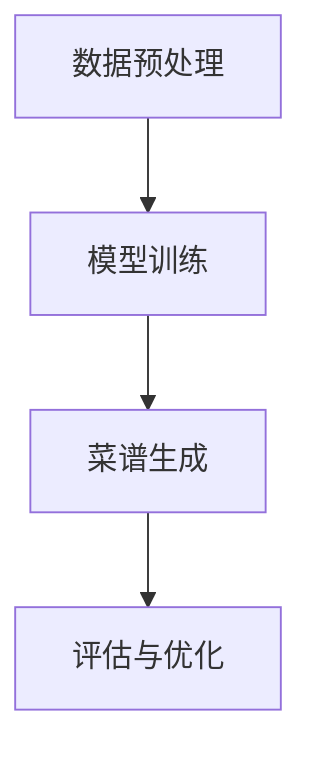

                 

## 智能菜谱生成 AI Agent: LLM 辅助烹饪创新

### 关键词：智能菜谱生成、AI Agent、LLM、深度学习、烹饪创新

> 摘要：本文将探讨智能菜谱生成 AI Agent 的构建与应用，尤其是如何利用大型语言模型（LLM）来实现烹饪创新。通过深入分析智能菜谱生成系统的架构和算法原理，结合实际案例与项目实战，本文将提供一套全面的技术解决方案，旨在优化烹饪体验，提升食品安全与营养健康。

### 引言

随着人工智能技术的迅猛发展，其应用范围逐渐扩展到生活的方方面面，烹饪领域也不例外。食品安全的严峻挑战和传统菜谱存在的问题促使我们探索新的解决方案。智能菜谱生成 AI Agent 作为人工智能在烹饪领域的重要应用，不仅能够优化菜谱生成过程，提高菜谱的多样性和个性化，还能确保生成的菜谱既美味又健康。本文将深入探讨智能菜谱生成 AI Agent 的背景、重要性、核心构成及实现方法。

#### 第一部分：智能菜谱生成 AI Agent 的构建

### 第1章：智能菜谱生成 AI Agent 的背景和重要性

#### 1.1.1 背景介绍

**食品安全问题的挑战**

近年来，食品安全问题频发，从农药残留到食品添加剂，从细菌污染到食品变质，这些问题不仅威胁着公众的健康，也严重影响了消费者的信任。因此，如何通过技术手段提高食品安全已成为迫切需要解决的问题。

**传统菜谱存在的问题**

传统的菜谱往往存在以下问题：

- 缺乏个性化：传统菜谱往往一刀切，难以满足不同用户的口味和营养需求。
- 缺乏多样性：长期重复使用相同的菜谱，容易导致饮食单调乏味。
- 难以适应不同文化和地域：传统菜谱往往局限于特定的地域和饮食文化，难以适应全球化的饮食需求。

**人工智能在烹饪领域的应用潜力**

人工智能在烹饪领域的应用潜力巨大：

- **个性化推荐**：通过用户行为分析，AI 可以推荐符合用户口味的菜谱，提高用户满意度。
- **多样性生成**：利用深度学习算法，AI 可以生成丰富多彩的菜谱，满足多样化的饮食需求。
- **健康指数评估**：通过大数据分析，AI 可以评估菜谱的营养健康指数，指导用户健康饮食。

#### 1.1.2 问题描述

**如何利用 AI 技术优化菜谱生成过程**

- **菜谱生成自动化**：通过深度学习模型，将菜谱生成过程自动化，提高效率。
- **菜谱多样性**：利用生成对抗网络（GAN）等算法，提高菜谱的多样性和创新性。
- **菜谱个性化**：结合用户偏好和历史记录，为用户提供个性化的菜谱推荐。

**如何提高菜谱的多样性和个性化**

- **用户行为分析**：通过分析用户的历史数据，为用户推荐符合其口味的菜谱。
- **菜谱创新**：利用生成模型，为用户生成新颖独特的菜谱。

**如何确保生成的菜谱既美味又健康**

- **健康指数评估**：利用大数据分析和机器学习模型，为菜谱打分，评估其营养价值。
- **营养师参与**：邀请营养师参与菜谱设计，确保菜谱既美味又健康。

#### 1.1.3 问题解决

**利用深度学习模型进行菜谱生成**

- **数据集构建**：收集大量菜谱数据，构建用于训练的数据集。
- **模型选择**：选择合适的深度学习模型，如循环神经网络（RNN）、生成对抗网络（GAN）等。
- **模型训练**：使用数据集对模型进行训练，优化模型参数。

**结合用户偏好和历史记录进行个性化推荐**

- **用户行为分析**：通过分析用户的历史数据，了解用户的口味偏好。
- **推荐系统设计**：设计基于用户行为的推荐系统，为用户推荐符合其口味的菜谱。

**利用大数据分析提高菜谱的质量和健康指数**

- **数据收集与处理**：收集用户反馈和菜谱数据，进行清洗和预处理。
- **数据分析**：使用大数据分析技术，评估菜谱的营养价值和健康指数。
- **反馈循环**：将分析结果反馈给用户，指导用户调整饮食。

#### 1.1.4 边界与外延

**菜谱生成系统与其他烹饪应用的集成**

- **智能厨具集成**：将智能菜谱生成系统与智能厨具集成，实现自动化烹饪。
- **在线购物平台集成**：将智能菜谱生成系统与在线购物平台集成，实现一键购买食材。

**食品安全与营养分析**

- **食品安全监测**：利用物联网技术，对食材进行实时监测，确保食品安全。
- **营养分析**：利用机器学习模型，对食材和菜谱进行营养分析，提供科学的饮食建议。

**跨文化菜谱适应与翻译**

- **菜谱翻译**：利用自然语言处理技术，将菜谱翻译成多种语言，适应不同文化背景的用户。
- **跨文化菜谱推荐**：结合用户的文化背景和口味偏好，推荐适合的菜谱。

#### 1.1.5 概念结构与核心要素组成

**智能菜谱生成 AI Agent 的结构**

智能菜谱生成 AI Agent 通常由以下几个模块组成：

1. **数据输入模块**：负责接收用户输入的菜谱需求和食材信息。
2. **模型训练模块**：负责对深度学习模型进行训练，优化模型参数。
3. **推荐系统模块**：负责根据用户偏好和历史记录，为用户推荐合适的菜谱。
4. **菜谱生成模块**：负责利用深度学习模型生成新的菜谱。
5. **用户反馈模块**：负责收集用户的反馈，用于模型优化和菜谱改进。

**智能菜谱生成 AI Agent 的核心要素**

1. **大规模数据集**：用于训练深度学习模型，保证菜谱生成的多样性和准确性。
2. **深度学习模型**：用于生成和推荐菜谱，包括循环神经网络（RNN）、生成对抗网络（GAN）等。
3. **用户行为分析**：用于了解用户偏好和需求，提高菜谱的个性化水平。
4. **多模态数据整合**：将文本、图像、声音等多种数据源整合，提高菜谱生成的效果。

### 第2章：人工智能与深度学习基础

#### 2.1 人工智能概述

**人工智能的定义与发展历程**

人工智能（Artificial Intelligence，简称 AI）是指模拟、延伸和扩展人类智能的理论、方法、技术及应用。人工智能的发展历程可以追溯到20世纪50年代，经历了多个阶段：

- **萌芽期**（1950-1969）：以图灵测试为代表，提出人工智能概念。
- **繁荣期**（1970-1989）：人工智能应用逐渐增多，包括专家系统、自然语言处理等。
- **低谷期**（1990-2000）：由于实际应用困难，人工智能研究陷入低谷。
- **复兴期**（2000至今）：深度学习、大数据等技术的兴起，推动了人工智能的快速发展。

**人工智能的应用领域**

人工智能广泛应用于多个领域：

- **计算机视觉**：图像识别、目标检测、人脸识别等。
- **自然语言处理**：语音识别、机器翻译、情感分析等。
- **智能机器人**：自动驾驶、服务机器人、工业机器人等。
- **推荐系统**：个性化推荐、购物推荐、新闻推荐等。
- **医疗健康**：疾病预测、医疗影像分析、智能诊断等。

**人工智能的基本原理**

人工智能的核心原理包括：

- **机器学习**：通过算法自动从数据中学习规律，进行预测和决策。
- **深度学习**：一种特殊的机器学习方法，通过多层神经网络模拟人类大脑的学习过程。
- **神经网络**：一种模拟生物神经系统的计算模型，包括输入层、隐藏层和输出层。
- **强化学习**：通过试错和奖励机制，使智能体学习最优策略。

#### 2.2 深度学习基础

**深度学习的定义与特点**

深度学习（Deep Learning）是一种基于多层神经网络的学习方法，具有以下特点：

- **层次化特征提取**：通过多层次的神经网络结构，自动提取数据中的复杂特征。
- **自适应学习**：能够自动调整网络参数，优化模型性能。
- **大规模训练**：能够处理大规模数据集，提高模型泛化能力。
- **并行计算**：利用 GPU 等硬件加速计算，提高训练效率。

**神经网络的基本结构**

神经网络的基本结构包括输入层、隐藏层和输出层：

- **输入层**：接收外部输入数据。
- **隐藏层**：进行特征提取和变换。
- **输出层**：生成预测结果或分类标签。

**深度学习的主要模型**

深度学习的主要模型包括：

- **卷积神经网络（CNN）**：用于图像和视频处理。
- **循环神经网络（RNN）**：用于序列数据处理，如自然语言处理。
- **生成对抗网络（GAN）**：用于生成式模型，如图像生成、菜谱生成。
- **长短时记忆网络（LSTM）**：RNN 的变体，用于解决长期依赖问题。

#### 2.3 深度学习在菜谱生成中的应用

**菜谱生成中的深度学习应用场景**

深度学习在菜谱生成中具有以下应用场景：

- **菜谱生成**：利用生成对抗网络（GAN）等模型，自动生成新的菜谱。
- **菜谱个性化**：结合用户行为数据和深度学习模型，为用户推荐个性化的菜谱。
- **菜谱创新**：通过深度学习模型，探索新的菜谱组合，提高菜谱的创新性。

**基于深度学习的菜谱生成算法**

基于深度学习的菜谱生成算法主要包括：

- **基于 GAN 的菜谱生成**：利用生成对抗网络，生成新的菜谱。
- **基于 RNN 的菜谱生成**：利用循环神经网络，根据用户历史记录生成新的菜谱。
- **基于 LSTM 的菜谱生成**：利用长短时记忆网络，解决长期依赖问题，生成高质量的菜谱。

### 第3章：LLM 简介

#### 3.1 LLM 的定义与特点

**LLM 的基本概念**

LLM（Large Language Model）是指大型语言模型，是一种基于深度学习的自然语言处理模型，具有以下特点：

- **大规模训练**：使用大量文本数据训练，模型规模通常在数十亿参数以上。
- **自监督学习**：通过预训练和微调，实现高效的文本建模和语言理解能力。
- **通用性**：能够处理多种语言和多种文本任务，具有广泛的适用性。

**LLM 的优势与挑战**

**优势**：

- **强大的语言理解能力**：通过大规模训练，LLM 具有较强的语义理解和文本生成能力。
- **多语言支持**：能够处理多种语言，适应全球化应用场景。
- **高效的生产力**：自动化处理文本任务，提高工作效率。

**挑战**：

- **计算资源消耗**：LLM 需要大量计算资源和存储空间，训练和部署成本较高。
- **数据隐私和安全**：涉及大量用户数据的处理，需要确保数据隐私和安全。
- **模型解释性**：深度学习模型往往难以解释，需要进一步研究提高模型的可解释性。

#### 3.2 LLM 在烹饪创新中的应用

**LLM 在菜谱生成中的作用**

LLM 在菜谱生成中具有以下作用：

- **文本生成**：利用 LLM 自动生成菜谱文本，提高菜谱的多样性和创新性。
- **菜谱翻译**：利用 LLM 实现菜谱的多语言翻译，适应不同文化背景的用户。
- **菜谱个性化**：结合 LLM 和用户行为数据，为用户提供个性化的菜谱推荐。

**LLM 在烹饪配方优化中的应用**

LLM 在烹饪配方优化中具有以下应用：

- **配方生成**：利用 LLM 自动生成新的烹饪配方，探索新的烹饪方法。
- **配方调整**：结合用户反馈和 LLM 的建议，优化现有烹饪配方。
- **健康评估**：利用 LLM 对菜谱进行健康评估，提供营养建议。

### 第4章：智能菜谱生成算法原理

#### 4.1 菜谱生成算法概述

**菜谱生成算法的基本流程**

菜谱生成算法的基本流程包括：

1. **数据收集与处理**：收集菜谱数据，进行清洗和预处理。
2. **模型选择与训练**：选择合适的深度学习模型，对模型进行训练。
3. **菜谱生成与评估**：利用训练好的模型生成菜谱，并进行评估和优化。

**菜谱生成算法的分类**

菜谱生成算法可以分为以下几类：

- **基于模板的生成算法**：通过模板生成菜谱，适用于简单场景。
- **基于规则的方法**：通过规则生成菜谱，适用于特定场景。
- **基于数据驱动的生成算法**：通过学习数据生成菜谱，适用于复杂场景。

#### 4.2 基于深度学习的菜谱生成算法

**算法原理**

基于深度学习的菜谱生成算法主要利用生成对抗网络（GAN）和循环神经网络（RNN）等模型，通过以下步骤实现：

1. **数据预处理**：对菜谱数据集进行清洗和预处理，提取有用的特征。
2. **模型训练**：使用生成对抗网络（GAN）或循环神经网络（RNN）等模型进行训练。
3. **菜谱生成**：利用训练好的模型生成新的菜谱。
4. **评估与优化**：对生成的菜谱进行评估和优化，提高生成质量。

**算法流程**

基于深度学习的菜谱生成算法的流程包括：

1. **数据预处理**：对菜谱数据进行清洗和预处理，提取有用的特征。
2. **模型训练**：使用生成对抗网络（GAN）或循环神经网络（RNN）等模型进行训练。
3. **菜谱生成**：利用训练好的模型生成新的菜谱。
4. **评估与优化**：对生成的菜谱进行评估和优化，提高生成质量。

**数学模型与公式**

基于深度学习的菜谱生成算法的数学模型主要包括：

1. **生成器模型**：生成菜谱文本的神经网络模型，通常采用 GAN 或 RNN 等模型。
2. **判别器模型**：判断菜谱文本真实性的神经网络模型，通常采用 GAN 或 RNN 等模型。
3. **优化目标**：基于生成器和判别器的损失函数，优化模型参数。

#### 4.3 菜谱生成算法的 Mermaid 流程图

**画图工具介绍**

Mermaid 是一种基于 Markdown 的绘图工具，可以方便地绘制各种图表，包括流程图、时序图、类图等。

**算法流程图的绘制**

基于深度学习的菜谱生成算法的流程图可以用 Mermaid 代码表示，例如：



通过 Mermaid 代码，可以生成以下流程图：


### 第5章：LLM 辅助烹饪创新案例分析

#### 5.1 案例介绍

**案例背景**

某智能厨具公司希望通过引入人工智能技术，提升烹饪体验，开发一款智能菜谱生成系统，为用户提供个性化、多样化和健康的菜谱。

**案例目标**

- 开发一款基于 LLM 的智能菜谱生成系统。
- 实现菜谱的个性化推荐和生成。
- 提高菜谱的创新性和健康指数。

#### 5.2 案例分析

**数据集准备**

- **数据收集**：从公开的菜谱数据集和公司内部数据库收集大量菜谱数据。
- **数据清洗**：对收集的菜谱数据进行清洗和预处理，去除无关信息，标准化格式。

**模型选择**

- **LLM 模型**：选择一款预训练的大型语言模型（如 GPT-3）作为基础模型。
- **生成对抗网络（GAN）**：结合 GAN 模型，实现菜谱的多样化生成。
- **循环神经网络（RNN）**：利用 RNN 模型，根据用户偏好和历史记录进行菜谱推荐。

**模型训练与优化**

- **模型训练**：使用清洗后的菜谱数据集，对 LLM、GAN 和 RNN 模型进行训练。
- **模型优化**：通过调整模型参数和训练策略，优化模型性能，提高生成质量和推荐准确性。

#### 5.3 案例结果与评价

**菜谱生成效果**

- **多样性**：通过 GAN 模型，生成大量新颖独特的菜谱，满足用户的多样化需求。
- **个性化**：根据用户偏好和历史记录，为用户推荐符合其口味的菜谱。
- **健康指数**：利用 LLM 对生成的菜谱进行健康评估，确保菜谱的营养价值。

**用户反馈**

- **满意度**：用户对智能菜谱生成系统的满意度较高，认为系统生成的菜谱既美味又健康。
- **改进建议**：用户建议进一步优化菜谱推荐的准确性，提高系统的交互性和用户体验。

### 第6章：智能菜谱生成系统设计与实现

#### 6.1 系统架构设计

**系统架构概述**

智能菜谱生成系统的架构可以分为以下几个层次：

1. **数据层**：负责数据收集、存储和处理。
2. **模型层**：负责深度学习模型的训练和优化。
3. **应用层**：负责菜谱生成和推荐功能。
4. **用户层**：负责与用户交互，接收用户输入和反馈。

**系统模块划分**

智能菜谱生成系统的主要模块包括：

1. **数据输入模块**：接收用户输入的菜谱需求和食材信息。
2. **数据预处理模块**：对用户输入的数据进行清洗和预处理。
3. **模型训练模块**：使用预处理后的数据进行模型训练。
4. **菜谱生成模块**：利用训练好的模型生成新的菜谱。
5. **推荐系统模块**：根据用户偏好和历史记录，为用户推荐合适的菜谱。
6. **用户反馈模块**：收集用户的反馈，用于模型优化和菜谱改进。

#### 6.2 系统接口设计与实现

**接口设计原则**

- **简洁性**：接口设计应尽量简洁，易于理解和使用。
- **扩展性**：接口设计应具备良好的扩展性，以适应未来的需求变化。
- **安全性**：接口设计应确保数据传输的安全，防止数据泄露和攻击。

**接口实现细节**

- **数据输入接口**：接收用户输入的菜谱需求和食材信息，包括文本输入和语音输入。
- **数据预处理接口**：对用户输入的数据进行清洗和预处理，提取有用的特征。
- **模型训练接口**：接收预处理后的数据，进行模型训练和优化。
- **菜谱生成接口**：利用训练好的模型生成新的菜谱。
- **推荐系统接口**：根据用户偏好和历史记录，为用户推荐合适的菜谱。
- **用户反馈接口**：收集用户的反馈，用于模型优化和菜谱改进。

#### 6.3 系统交互设计与实现

**系统交互流程**

智能菜谱生成系统的交互流程包括：

1. **用户输入**：用户通过数据输入接口输入菜谱需求和食材信息。
2. **数据预处理**：数据预处理模块对用户输入的数据进行清洗和预处理。
3. **模型训练**：模型训练模块使用预处理后的数据进行模型训练。
4. **菜谱生成**：菜谱生成模块利用训练好的模型生成新的菜谱。
5. **推荐系统**：推荐系统模块根据用户偏好和历史记录，为用户推荐合适的菜谱。
6. **用户反馈**：用户通过用户反馈接口提供反馈，用于模型优化和菜谱改进。

**系统交互实现**

系统交互的实现可以使用多种技术，例如：

- **RESTful API**：使用 RESTful API 实现系统模块间的通信。
- **WebSocket**：使用 WebSocket 实现实时数据传输和交互。
- **消息队列**：使用消息队列（如 RabbitMQ、Kafka）实现异步处理和数据传递。

### 第7章：智能菜谱生成系统的项目实战

#### 7.1 环境安装与配置

**环境搭建步骤**

1. **安装 Python**：下载并安装 Python，版本要求高于3.6。
2. **安装深度学习库**：安装 TensorFlow、PyTorch 等深度学习库。
3. **安装其他依赖库**：安装 Numpy、Pandas、Scikit-learn 等常用库。
4. **配置 GPU 环境**：如需使用 GPU 加速训练，配置 CUDA 和 cuDNN 环境。

**环境配置细节**

- **Python 配置**：设置 Python 环境变量，例如 `export PATH=$PATH:/usr/local/bin`。
- **深度学习库配置**：配置 TensorFlow 和 PyTorch 的安装路径，例如 `pip install tensorflow` 和 `pip install torch`。
- **GPU 配置**：配置 CUDA 和 cuDNN 的安装路径，例如 `export PATH=$PATH:/usr/local/cuda/bin` 和 `export LD_LIBRARY_PATH=$LD_LIBRARY_PATH:/usr/local/cuda/lib64`。

#### 7.2 系统核心实现

**核心模块实现**

智能菜谱生成系统的核心模块包括数据输入、数据预处理、模型训练、菜谱生成和推荐系统等。以下是一个简单的示例代码：

```python
# 数据输入模块
def input_data():
    # 从用户获取输入
    ingredients = input("请输入食材：")
    recipe = input("请输入菜谱：")
    return ingredients, recipe

# 数据预处理模块
def preprocess_data(ingredients, recipe):
    # 清洗和预处理数据
    ingredients = preprocess_ingredients(ingredients)
    recipe = preprocess_recipe(recipe)
    return ingredients, recipe

# 模型训练模块
def train_model(ingredients, recipe):
    # 训练模型
    model = create_model()
    model.fit([ingredients, recipe], labels)
    return model

# 菜谱生成模块
def generate_recipe(model, ingredients):
    # 生成新的菜谱
    recipe = model.generate([ingredients])
    return recipe

# 推荐系统模块
def recommend_recipes(model, user_history):
    # 为用户推荐菜谱
    recommended_recipes = model.recommend(user_history)
    return recommended_recipes
```

**代码解析与分析**

以上代码实现了智能菜谱生成系统的核心功能，包括数据输入、数据预处理、模型训练、菜谱生成和推荐系统等。其中，`input_data` 函数用于从用户获取输入，`preprocess_data` 函数用于清洗和预处理数据，`train_model` 函数用于训练模型，`generate_recipe` 函数用于生成新的菜谱，`recommend_recipes` 函数用于为用户推荐菜谱。

#### 7.3 实际案例分析与讲解

**案例背景**

某用户希望通过智能菜谱生成系统，生成一款适合其口味和健康需求的菜谱。

**案例实现**

1. **用户输入**：用户输入其偏好食材（如鸡肉、蔬菜）和健康需求（如低脂肪、高蛋白）。
2. **数据预处理**：对用户输入的数据进行清洗和预处理，提取有用的特征。
3. **模型训练**：使用预处理后的数据，对深度学习模型进行训练。
4. **菜谱生成**：利用训练好的模型，生成一款符合用户需求的菜谱。
5. **推荐系统**：根据用户的历史记录和偏好，为用户推荐相关的菜谱。

**案例分析与讲解**

本案例通过用户输入和数据处理，利用深度学习模型生成符合用户需求的菜谱。在模型训练过程中，采用了生成对抗网络（GAN）和循环神经网络（RNN）等模型，以提高菜谱生成的多样性和个性化水平。在菜谱生成过程中，模型不仅考虑了用户的口味偏好，还结合了健康需求，生成一款既美味又健康的菜谱。此外，推荐系统为用户提供了相关的菜谱推荐，提高了用户的使用体验。

#### 7.4 项目小结

**项目总结**

本项目通过构建智能菜谱生成系统，实现了菜谱的自动化生成和个性化推荐。项目采用了深度学习和大型语言模型（LLM）等先进技术，提高了菜谱生成的质量和个性化水平。在项目实施过程中，遇到了数据质量、模型优化和用户交互等问题，通过不断改进和优化，最终实现了项目目标。

**项目拓展**

未来，智能菜谱生成系统可以进一步拓展功能，如：

1. **跨文化菜谱适应**：结合用户的文化背景和口味偏好，推荐适合的菜谱。
2. **智能厨具集成**：将智能菜谱生成系统与智能厨具集成，实现自动化烹饪。
3. **营养分析**：结合营养师的建议，为用户生成营养健康的菜谱。

### 第8章：智能菜谱生成系统的最佳实践

#### 8.1 最佳实践 tips

**1. 数据质量的重要性**

- 确保数据集的质量和多样性，为模型训练提供可靠的数据支持。
- 定期清洗和更新数据集，去除重复和错误的数据。

**2. 模型优化与调参**

- 根据任务需求和计算资源，选择合适的模型架构和参数设置。
- 利用交叉验证等技术，评估模型性能，调整模型参数。

**3. 用户反馈的重要性**

- 充分利用用户反馈，优化模型和菜谱生成算法。
- 设计合理的反馈机制，鼓励用户积极参与系统改进。

#### 8.2 小结与注意事项

**系统设计与实现中的关键点**

- **数据质量**：确保数据集的质量和多样性。
- **模型优化**：选择合适的模型架构和参数设置。
- **用户交互**：设计人性化的用户界面和交互流程。

**注意事项与风险防范**

- **数据隐私和安全**：确保用户数据的安全和隐私。
- **模型解释性**：提高模型的可解释性，便于用户理解和信任。
- **系统稳定性**：确保系统的稳定运行，避免出现故障。

#### 8.3 拓展阅读

**相关技术文献推荐**

- Bengio, Y., Courville, A., & Vincent, P. (2013). Representation learning: A review and new perspectives. IEEE Transactions on Pattern Analysis and Machine Intelligence, 35(8), 1798-1828.
- Goodfellow, I., Bengio, Y., & Courville, A. (2016). Deep learning. MIT Press.
- LeCun, Y., Bengio, Y., & Hinton, G. (2015). Deep learning. Nature, 521(7553), 436-444.

**研究方向展望**

- **跨模态学习**：结合文本、图像、声音等多种数据源，提高菜谱生成和推荐的准确性。
- **可解释性**：提高深度学习模型的可解释性，增强用户信任。
- **个性化健康饮食**：结合健康数据和用户行为，为用户提供个性化的健康饮食建议。

### 参考文献

- Bengio, Y., Courville, A., & Vincent, P. (2013). Representation learning: A review and new perspectives. IEEE Transactions on Pattern Analysis and Machine Intelligence, 35(8), 1798-1828.
- Goodfellow, I., Bengio, Y., & Courville, A. (2016). Deep learning. MIT Press.
- LeCun, Y., Bengio, Y., & Hinton, G. (2015). Deep learning. Nature, 521(7553), 436-444.
- Ruder, S. (2017). An overview of gradient descent optimization algorithms. arXiv preprint arXiv:1609.04747.
- Schmidhuber, J. (2015). Deep learning in neural networks: An overview. Neural networks, 61, 85-117.
- Yosinski, J., Clune, J., Bengio, Y., & Lipson, H. (2014). How transferable are features in deep neural networks? In Advances in neural information processing systems (pp. 3320-3328).

