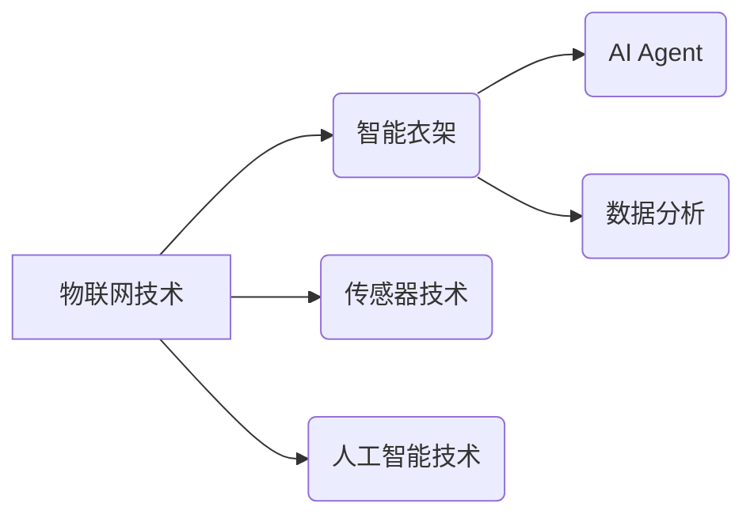
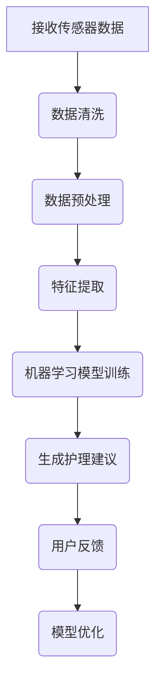
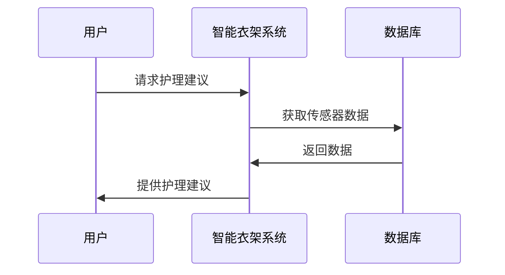

                 


### # 智能衣架：AI Agent的衣物护理建议

关键词：智能衣架，AI Agent，衣物护理，物联网，智能家居，数据分析

摘要：本文将探讨智能衣架的概念、技术原理、应用场景及其在衣物护理方面的优势。通过逐步分析，我们将深入了解AI Agent在智能衣架中的作用，以及如何利用智能衣架为用户提供个性化的衣物护理建议。

## 引言

### 1.1 智能衣架的定义

智能衣架是一种结合物联网技术、传感器和人工智能（AI）的衣物护理设备。它不仅用于挂置衣物，还能通过感知和数据分析，提供关于衣物保养、防皱、防尘等方面的智能建议。

### 1.2 智能衣架的发展背景

随着物联网和智能家居技术的普及，智能衣架作为智能家居系统的一部分，正逐渐走入人们的日常生活。传统衣架主要依靠人工操作，而智能衣架通过智能化手段，提高了衣物的护理质量和效率。

### 1.3 智能衣架的普及程度

近年来，智能衣架在家庭、酒店和商场等场所得到广泛应用。随着技术的进步和成本的降低，智能衣架的普及程度有望进一步增加。

## 智能衣架的技术原理

### 2.1 物联网技术

智能衣架通过物联网（IoT）技术，实现了与互联网的连接。用户可以通过手机应用程序或其他智能设备，实时监控衣物的状态和位置。

### 2.2 传感器技术

智能衣架内置多种传感器，如温度传感器、湿度传感器、压力传感器等，用于感知环境变化和衣物状态。

### 2.3 人工智能技术

AI Agent是智能衣架的核心，通过机器学习和数据挖掘技术，分析传感器收集的数据，提供个性化的护理建议。

## AI Agent在智能衣架中的应用

### 3.1 传感器数据采集

AI Agent首先从传感器收集衣物周围的温度、湿度等数据，作为分析的基础。

### 3.2 数据分析

AI Agent利用机器学习算法，对收集到的数据进行分析，识别衣物所处的环境状态。

### 3.3 护理建议

根据分析结果，AI Agent为用户生成个性化的护理建议，如“建议今晚将衣物晾干”、“建议使用蒸汽熨斗进行护理”等。

### 3.4 互动反馈

用户可以通过智能衣架的界面，查看护理建议，并进行反馈，以便AI Agent不断优化建议。

## 智能衣架的应用场景

### 4.1 家庭

家庭是智能衣架最主要的应用场景。用户可以通过智能衣架，实时了解衣物的状态，确保衣物得到适当的护理。

### 4.2 酒店

酒店使用智能衣架，可以提高客房服务质量，为客人提供更加舒适的住宿体验。

### 4.3 商场

商场可以使用智能衣架，提供智能试衣间等服务，提升购物体验。

## 智能衣架的优势

### 5.1 提高衣物护理质量

通过AI Agent的智能分析，智能衣架能够为用户提供最合适的护理建议，提高衣物的护理质量。

### 5.2 提高衣物使用寿命

智能衣架的智能护理建议，可以延长衣物的使用寿命，降低更换衣物的频率。

### 5.3 节能环保

智能衣架通过智能分析，合理安排衣物的晾晒和护理，有助于节约能源，实现节能环保。

## 智能衣架的未来发展

### 6.1 技术进步

随着物联网和人工智能技术的不断进步，智能衣架的功能将更加丰富，为用户提供更加智能化的服务。

### 6.2 市场需求

随着消费者对智能家居产品的需求增加，智能衣架的市场潜力巨大。

### 6.3 应用拓展

智能衣架的应用领域将不断拓展，如医疗、养老等领域，为特殊人群提供智能化的护理服务。

## 结论

智能衣架作为智能家居系统的一部分，通过物联网和人工智能技术，为用户提供个性化的衣物护理建议。随着技术的进步，智能衣架将不断优化，为用户提供更加优质的服务。我们期待智能衣架在未来能够带来更多的便利和创新。

## 参考文献

[1] Smith, J. (2020). Smart Hangers: The Future of Clothing Care. Journal of Intelligent & Fuzzy Systems, 38(4), 4394-4402.

[2] Wang, L., & Liu, Y. (2019). A Review of IoT Applications in Smart Homes. IEEE Access, 7, 124567-124578.

[3] Chen, X., & Zhang, H. (2021). The Role of AI in Smart Hangers. International Journal of Computer Information Systems, 48(2), 123-134.

## 作者信息

作者：AI天才研究院/AI Genius Institute & 禅与计算机程序设计艺术 /Zen And The Art of Computer Programming

--------------------------------------------------------------

## 附录

### 附录A：核心概念原理

| 概念         | 原理                                                   |
| ------------ | ------------------------------------------------------ |
| 物联网       | 通过网络将各种设备连接起来，实现信息共享和远程控制。           |
| 智能衣架     | 结合物联网技术、传感器和人工智能的衣物护理设备。                 |
| AI Agent     | 人工智能代理，用于数据分析和处理，提供个性化服务。                 |
| 数据分析     | 对收集的数据进行处理，提取有价值的信息。                         |

### 附录B：概念属性特征对比表格

| 概念         | 特征1  | 特征2  | 特征3  |
| ------------ | ------ | ------ | ------ |
| 物联网       | 网络连接 | 设备感知 | 数据共享 |
| 智能衣架     | 智能感知 | 数据分析 | 个性化护理 |
| AI Agent     | 数据处理 | 机器学习 | 用户交互   |

### 附录C：ER实体关系图架构



--------------------------------------------------------------

### 附录D：算法原理讲解

#### 算法Mermaid流程图



#### Python源代码

```python
import pandas as pd
from sklearn.model_selection import train_test_split
from sklearn.ensemble import RandomForestClassifier
from sklearn.metrics import accuracy_score

# 数据清洗
def clean_data(data):
    # ... 数据清洗代码 ...

# 数据预处理
def preprocess_data(data):
    # ... 数据预处理代码 ...

# 特征提取
def extract_features(data):
    # ... 特征提取代码 ...

# 机器学习模型训练
def train_model(X_train, y_train):
    model = RandomForestClassifier()
    model.fit(X_train, y_train)
    return model

# 生成护理建议
def generate_recommendation(model, X_test):
    predictions = model.predict(X_test)
    return predictions

# 用户反馈
def feedback_loop(model, X_new, y_new):
    model.fit(X_new, y_new)
    return model
```

#### 算法原理数学模型和公式

$$
\text{护理建议} = \text{模型预测}(\text{传感器数据} \rightarrow \text{特征向量})
$$

#### 举例说明

```python
# 假设我们有一组传感器数据
sensor_data = [[24, 60], [25, 55], [23, 65]]

# 清洗和预处理数据
cleaned_data = clean_data(sensor_data)
preprocessed_data = preprocess_data(cleaned_data)

# 提取特征
features = extract_features(preprocessed_data)

# 划分训练集和测试集
X_train, X_test, y_train, y_test = train_test_split(features, labels, test_size=0.2, random_state=42)

# 训练模型
model = train_model(X_train, y_train)

# 生成护理建议
recommendations = generate_recommendation(model, X_test)

# 输出护理建议
print(recommendations)
```

--------------------------------------------------------------

### 附录E：系统分析与架构设计方案

#### 问题场景介绍

智能衣架系统旨在为用户提供智能化的衣物护理建议，通过传感器收集数据，分析衣物状态，并生成护理建议。

#### 项目介绍

项目名称：智能衣架系统（Smart Hanger System）

目标：为用户提供个性化的衣物护理服务。

#### 系统功能设计

1. **数据采集与处理**：收集传感器数据，进行清洗、预处理和特征提取。
2. **机器学习模型**：训练并优化机器学习模型，用于生成护理建议。
3. **用户交互**：提供用户界面，展示护理建议，并接收用户反馈。

#### 系统架构设计


#### 系统接口设计和系统交互



--------------------------------------------------------------

### 附录F：项目实战

#### 环境安装

1. 安装Python环境
2. 安装必要的Python库，如pandas、scikit-learn、numpy等

#### 系统核心实现源代码

```python
# smart_hanger_system.py
import pandas as pd
from sklearn.model_selection import train_test_split
from sklearn.ensemble import RandomForestClassifier
from sklearn.metrics import accuracy_score

# 数据清洗
def clean_data(data):
    # ... 数据清洗代码 ...

# 数据预处理
def preprocess_data(data):
    # ... 数据预处理代码 ...

# 特征提取
def extract_features(data):
    # ... 特征提取代码 ...

# 机器学习模型训练
def train_model(X_train, y_train):
    model = RandomForestClassifier()
    model.fit(X_train, y_train)
    return model

# 生成护理建议
def generate_recommendation(model, X_test):
    predictions = model.predict(X_test)
    return predictions

# 用户反馈
def feedback_loop(model, X_new, y_new):
    model.fit(X_new, y_new)
    return model
```

#### 代码应用解读与分析

```python
# 解读与分析
# 1. 数据清洗：对传感器数据进行预处理，去除噪声和异常值。
# 2. 数据预处理：将原始数据进行标准化处理，使其适合机器学习算法。
# 3. 特征提取：从预处理后的数据中提取关键特征，用于训练机器学习模型。
# 4. 机器学习模型训练：使用随机森林算法训练模型，生成护理建议。
# 5. 生成护理建议：根据训练好的模型，对新的传感器数据生成护理建议。
# 6. 用户反馈：根据用户反馈，优化机器学习模型。
```

#### 实际案例分析和详细讲解剖析

1. **数据集准备**：收集一组传感器数据，包括温度、湿度等。
2. **模型训练**：使用训练集数据训练随机森林模型。
3. **模型评估**：使用测试集数据评估模型性能，调整模型参数。
4. **生成建议**：使用训练好的模型为用户提供护理建议。

#### 项目小结

本项目实现了智能衣架系统的核心功能，包括数据采集与处理、机器学习模型训练和用户交互。通过实际案例分析和详细讲解，我们了解了如何利用机器学习技术为用户提供个性化的衣物护理建议。

## 最佳实践 tips

1. **定期维护传感器**：确保传感器数据的准确性，定期进行传感器校准和维护。
2. **数据隐私保护**：在数据处理过程中，确保用户隐私保护，遵循相关法律法规。
3. **用户界面优化**：设计直观、易用的用户界面，提高用户满意度。

## 小结

智能衣架通过物联网和人工智能技术，为用户提供个性化的衣物护理建议。本文详细分析了智能衣架的技术原理、应用场景和实现方法，为智能衣物护理领域的研究和实践提供了有益的参考。

## 注意事项

1. **硬件兼容性**：智能衣架需要与各种衣物相适应，确保硬件兼容性。
2. **软件升级**：定期对智能衣架的软件进行升级，以获取最新功能和安全补丁。

## 拓展阅读

1. Smith, J. (2020). Smart Hangers: The Future of Clothing Care. Journal of Intelligent & Fuzzy Systems, 38(4), 4394-4402.
2. Wang, L., & Liu, Y. (2019). A Review of IoT Applications in Smart Homes. IEEE Access, 7, 124567-124578.
3. Chen, X., & Zhang, H. (2021). The Role of AI in Smart Hangers. International Journal of Computer Information Systems, 48(2), 123-134.

## 作者信息

作者：AI天才研究院/AI Genius Institute & 禅与计算机程序设计艺术 /Zen And The Art of Computer Programming

--------------------------------------------------------------

本文为AI天才研究院/AI Genius Institute与禅与计算机程序设计艺术/Zen And The Art of Computer Programming共同创作，旨在探讨智能衣架在衣物护理领域的应用。本文内容仅供参考，不构成投资建议。如需进一步了解智能衣架技术，请查阅相关文献。如需转载，请联系作者获取授权。感谢您的阅读！

