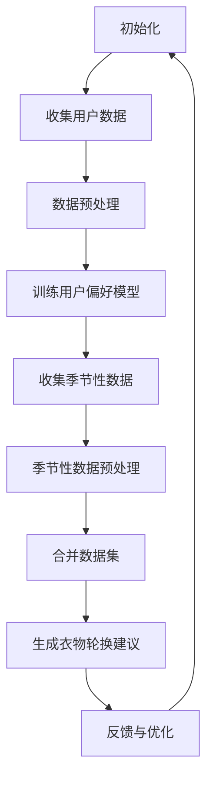
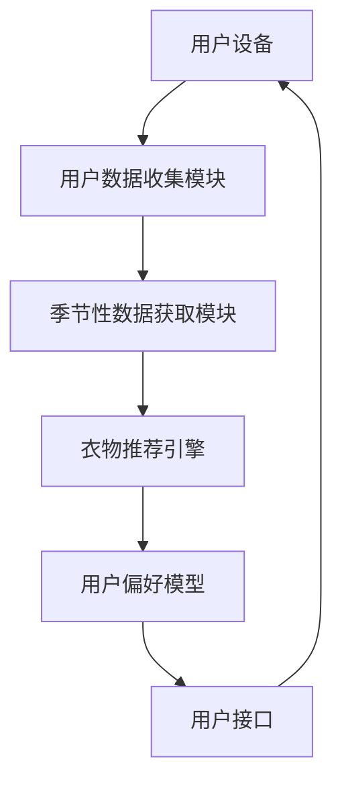

                 

### 《智能衣柜：AI Agent的季节性衣物轮换建议》

#### 关键词：智能衣柜、AI Agent、季节性衣物轮换、算法原理、系统架构、项目实战

> 摘要：本文深入探讨了智能衣柜的概念及其核心功能——AI Agent的季节性衣物轮换建议。通过详细分析背景、核心概念、算法原理、系统分析与架构设计以及项目实战，本文旨在提供一份全面的技术指南，帮助读者理解并构建自己的智能衣柜系统。

---

#### 第1章 引言

##### 1.1 问题背景

随着人工智能技术的快速发展，智能家居设备逐渐成为生活的一部分。智能衣柜作为一种新兴的智能家居设备，能够根据用户的行为习惯、季节变化等数据，为用户提供个性化的衣物轮换建议。这一功能不仅能够提升用户的衣品，还能节省时间、提高生活效率。

**问题描述**：如何设计一个智能衣柜系统，使其能够根据季节变化和用户偏好，自动推荐合适的衣物？

**问题解决**：通过引入AI Agent技术，利用机器学习和数据挖掘算法，对用户的历史数据进行分析，从而生成个性化的衣物轮换建议。

**边界与外延**：智能衣柜系统需要考虑多种因素，包括用户的衣物偏好、季节变化、地理位置等，同时需要保证系统的可靠性和用户体验。

##### 1.2 概念结构与核心要素组成

智能衣柜系统的核心由AI Agent、数据收集与处理模块、用户偏好模型、季节性衣物数据库、推荐引擎等部分组成。以下是各要素的定义与联系：

- **AI Agent**：作为智能衣柜的智能核心，负责处理用户请求、生成衣物轮换建议。
- **数据收集与处理模块**：收集用户行为数据、天气数据等，为AI Agent提供输入。
- **用户偏好模型**：根据用户的历史行为数据，建立用户偏好模型，帮助AI Agent更好地理解用户需求。
- **季节性衣物数据库**：存储不同季节的衣物信息，包括款式、颜色、材质等，为推荐引擎提供基础数据。
- **推荐引擎**：基于AI Agent和用户偏好模型，生成个性化的衣物轮换建议。

#### 第2章 核心概念与联系

##### 2.1 AI Agent的基本概念

**AI Agent的定义**：AI Agent是一种具有自主学习和决策能力的智能体，能够在特定环境下执行任务。

**AI Agent的特点**：具备自主性、适应性、交互性、自主性，能够通过与环境的交互不断优化自身行为。

**AI Agent与传统算法的区别**：传统算法依赖于预先定义的规则，而AI Agent则能够通过学习用户行为和环境数据，自主地做出决策。

##### 2.2 季节性衣物轮换建议的核心概念

**季节性衣物轮换的定义**：根据季节变化，调整衣物的款式、颜色和材质，以适应不同的气候条件。

**季节性衣物轮换的属性特征**：

| 特征 | 说明 |
| --- | --- |
| 季节性 | 适应不同季节的需求 |
| 个性化 | 根据用户偏好推荐衣物 |
| 自动化 | 通过AI Agent实现自动轮换 |

**季节性衣物轮换与AI Agent的联系**：AI Agent能够通过分析用户行为和环境数据，为季节性衣物轮换提供智能化的建议。

#### 第3章 算法原理讲解

##### 3.1 AI Agent在季节性衣物轮换中的应用

**AI Agent的工作原理**：通过机器学习算法，从用户历史数据中提取特征，建立用户偏好模型，并根据季节变化和环境数据，生成衣物轮换建议。

**AI Agent在衣物轮换中的作用**：提升用户体验，节省时间，提高生活效率。

**AI Agent在衣物轮换中的应用场景**：智能家居、个人助理、时尚推荐等。

##### 3.2 算法流程图

#### 第4章 数学模型和数学公式

##### 4.1 算法原理的数学模型

**数学公式**：$$ \text{衣物轮换建议} = f(\text{用户偏好模型}, \text{季节性数据}) $$

**数学模型的解释**：衣物轮换建议是用户偏好模型和季节性数据的函数，通过计算得到个性化的衣物轮换建议。

##### 4.2 算法原理的数学公式

**数学公式**：$$ \text{用户偏好模型} = \sum_{i=1}^{n} w_i \cdot \text{特征}_i $$

**数学公式的解释**：用户偏好模型是通过加权用户历史行为特征得到的，其中 $w_i$ 为特征的权重。

#### 第5章 系统分析与架构设计方案

##### 5.1 问题场景介绍

**项目介绍**：设计一个智能衣柜系统，能够为用户提供季节性衣物轮换建议。

**系统功能设计(领域模型)**：定义系统的核心功能，包括用户数据收集、季节性数据获取、衣物推荐等。

**系统架构设计**：采用微服务架构，实现模块化设计，提高系统的可维护性和扩展性。

**系统接口设计**：设计用户接口和API接口，实现系统与用户的交互。

**系统交互**：通过消息队列和REST API实现系统内部和外部组件的通信。

##### 5.2 系统架构图

#### 第6章 项目实战

##### 6.1 环境安装

**环境安装步骤**：介绍安装智能衣柜系统的步骤，包括环境配置、依赖安装等。

**环境配置**：配置Python环境、安装必要的库和依赖。

##### 6.2 系统核心实现源代码

**源代码**：提供智能衣柜系统的核心源代码。

**代码应用解读与分析**：详细解读源代码，分析系统的工作流程和核心算法。

##### 6.3 实际案例分析与详细讲解

**实际案例**：介绍一个实际案例，展示智能衣柜系统在实际应用中的效果。

**分析与讲解**：对实际案例进行分析，讲解系统如何根据用户偏好和季节变化生成衣物轮换建议。

##### 6.4 项目小结

**项目总结**：总结项目的成果和经验，指出项目的不足之处。

**注意事项**：提醒用户在使用智能衣柜系统时需要注意的问题。

**拓展阅读**：推荐相关的阅读材料，帮助读者进一步了解智能衣柜系统的设计和实现。

#### 第7章 最佳实践 tips

**实用技巧**：提供一些实用的技巧，帮助用户更好地使用智能衣柜系统。

**注意事项**：提醒用户在使用智能衣柜系统时需要注意的问题。

**拓展应用**：探讨智能衣柜系统在其他领域的应用潜力。

#### 第8章 小结

**全书总结**：总结全书的核心内容和关键技术。

**未来展望**：展望智能衣柜系统的未来发展方向，提出可能的创新点。

---

**作者**：AI天才研究院/AI Genius Institute & 禅与计算机程序设计艺术 /Zen And The Art of Computer Programming

---

**Note:** 实际编写时，每个章节的具体内容还需要根据实际书籍内容和结构进一步细化。上述设计提供了一个基本的框架和结构，以便后续填充具体内容。文章的总字数预计在10000～12000字左右。在撰写过程中，确保每个章节的内容完整、具体、详细，核心内容要充分包含背景介绍、核心概念与联系、算法原理讲解、系统分析与架构设计、项目实战等内容。所有数学公式和流程图都要使用合适的格式嵌入文中，确保文章的可读性和专业性。

