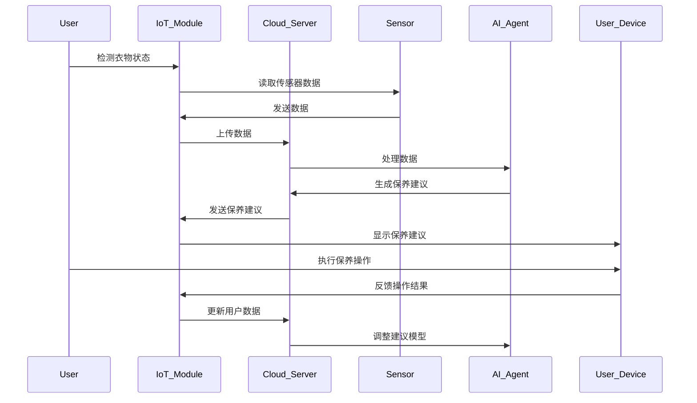

                 

### 引言与背景

#### 1.1 智能衣柜的概念与作用

智能衣柜是一种结合了传感器技术、物联网（IoT）和人工智能（AI）的新型家居设备。它不仅具备传统衣柜的基本功能，还能根据衣物材质、颜色、季节变化等多种因素，为用户提供智能化的衣物保养建议。智能衣柜的核心在于AI Agent，这是一种能够自主学习、决策和优化行为的智能系统。

**1.1.1 智能衣柜的定义**

智能衣柜通常包括以下几个组成部分：衣柜本体、内置传感器、物联网模块和AI处理单元。衣柜本体是传统衣柜的基础，负责存放衣物；内置传感器则用于监测衣物的状态和环境参数；物联网模块负责将传感器数据上传到云端服务器；AI处理单元则根据这些数据进行处理，生成具体的保养建议。

**1.1.2 智能衣柜在生活中的作用**

智能衣柜在生活中起到了多方面的作用。首先，它能够根据衣物的材质、颜色、季节变化等因素，为用户推荐合适的衣物搭配方案，提高用户的生活质量。其次，智能衣柜能够监测衣物的磨损程度，提供最佳的洗涤和保养建议，从而延长衣物寿命。此外，智能衣柜还可以通过学习用户的生活习惯和喜好，实现个性化的衣物管理。

**1.1.3 智能衣柜与AI Agent的联系**

AI Agent是智能衣柜的“大脑”，它通过不断学习和分析用户行为数据，优化衣物保养建议。AI Agent的主要作用包括：

1. **数据收集与分析**：AI Agent通过传感器收集衣物状态和环境参数，如湿度、温度、光线等，然后对这些数据进行分析，为衣物保养提供依据。

2. **预测与决策**：基于历史数据和当前状态，AI Agent能够预测衣物磨损趋势，并生成最优的保养建议，如何时洗涤、如何晾晒等。

3. **优化与调整**：AI Agent能够根据用户反馈不断优化自身的算法模型，提高衣物保养建议的准确性。

#### 1.2 衣物保养的问题与挑战

衣物保养是一个复杂的过程，涉及到多个方面的问题。以下是衣物保养中常见的一些问题和挑战：

**1.2.1 衣物磨损**

衣物磨损是衣物保养中最常见的问题之一。衣物在穿着、洗涤和晾晒过程中，会因为摩擦、拉伸和氧化等因素导致磨损。智能衣柜通过传感器监测衣物的磨损程度，可以提前预警，提醒用户进行保养。

**1.2.2 污渍处理**

污渍处理是衣物保养的另一个难题。不同材质的衣物需要不同的清洗方法和清洁剂。智能衣柜通过AI Agent的学习和数据分析，能够为用户提供个性化的污渍处理建议，提高清洗效果。

**1.2.3 洗涤方式选择**

洗涤方式的选择直接关系到衣物的清洗效果和寿命。不同的衣物材质和污渍类型需要不同的洗涤方式和温度。智能衣柜通过AI Agent的分析，能够为用户提供最佳的洗涤方式，减少对衣物的损伤。

#### 1.3 AI Agent在衣物保养建议中的应用前景

AI Agent在衣物保养建议中的应用前景非常广阔。首先，AI Agent能够通过不断学习和优化，提高衣物保养建议的准确性，从而提高用户的满意度。其次，AI Agent可以通过数据分析，为用户提供个性化的衣物保养方案，满足不同用户的需求。此外，随着物联网和传感器技术的不断发展，AI Agent的应用范围将不断扩大，为智能家居领域带来更多创新和变革。

**1.3.1 AI Agent的优势**

1. **个性化服务**：AI Agent能够根据用户的生活习惯和喜好，提供个性化的衣物保养建议。
2. **高效处理**：AI Agent能够快速分析大量数据，为用户提供实时、准确的保养建议。
3. **持续优化**：AI Agent通过不断学习和优化，能够不断提高衣物保养建议的质量。

**1.3.2 AI Agent的应用挑战**

1. **数据隐私**：智能衣柜和AI Agent需要收集和处理大量的用户数据，如何保障用户数据的安全和隐私是一个重要挑战。
2. **算法可靠性**：AI Agent的算法模型需要经过严格的测试和验证，确保其提供的服务准确可靠。
3. **用户接受度**：AI Agent的应用需要用户的支持和接受，如何让用户适应和信任智能衣柜和AI Agent的服务是一个挑战。

#### 1.4 本章小结

本章介绍了智能衣柜的概念、作用和AI Agent在衣物保养建议中的应用前景。通过分析衣物保养中常见的问题和挑战，我们认识到AI Agent在提升衣物保养效果和用户满意度方面的巨大潜力。接下来，我们将进一步探讨智能衣柜的核心概念和工作原理，为深入理解AI Agent在衣物保养中的实际应用奠定基础。

## 1.5 智能衣柜的应用场景和优势

智能衣柜的出现，不仅改变了传统衣柜的功能，还极大地提升了衣物管理的效率和质量。以下将详细探讨智能衣柜在实际应用场景中的优势，以及它如何通过AI Agent实现智能化衣物保养。

### 智能衣柜的应用场景

**1. 酒店行业**

在酒店行业，智能衣柜的应用尤为广泛。酒店房间内通常配备有高级的衣物，需要经常进行保养和维护。智能衣柜可以通过传感器监测衣物的磨损和污渍情况，为酒店工作人员提供实时数据，指导他们进行针对性的保养和更换。此外，智能衣柜还可以根据客户的需求，提供个性化的衣物搭配建议，提升客户体验。

**2. 家居生活**

在家庭生活中，智能衣柜能够帮助用户更好地管理衣物，避免衣物堆积和遗忘。用户可以通过智能衣柜了解衣物的磨损情况，从而合理安排洗涤和保养时间。同时，智能衣柜还可以根据季节和天气变化，自动调整衣物的存储条件，如湿度控制和温度调节，延长衣物的使用寿命。

**3. 洗衣店和干洗店**

洗衣店和干洗店是另一个应用智能衣柜的重要场景。智能衣柜可以实时监测衣物上的污渍和磨损情况，为洗衣店提供准确的洗涤建议，避免因错误洗涤导致的衣物损坏。此外，智能衣柜还能帮助洗衣店提高服务效率，通过自动预约和提醒功能，减少用户的等待时间。

### 智能衣柜的优势

**1. 个性化服务**

智能衣柜的核心优势在于其个性化服务能力。通过AI Agent的学习和数据分析，智能衣柜能够深入了解用户的生活习惯和喜好，为用户量身定制衣物保养方案。例如，智能衣柜可以根据用户的穿着频率和偏好，推荐最合适的洗涤时间和方式，确保衣物始终保持最佳状态。

**2. 提高衣物使用寿命**

智能衣柜通过传感器实时监测衣物的磨损情况，提前预警可能出现的损坏，使用户能够及时进行保养，从而延长衣物的使用寿命。此外，智能衣柜还可以根据衣物的材质和污渍类型，推荐最适合的洗涤和晾晒方法，避免不当操作导致的衣物损伤。

**3. 节能环保**

智能衣柜具备节能环保的特性。通过自动调节衣柜内的湿度、温度和光线等参数，智能衣柜能够减少能源消耗，降低对环境的影响。例如，在潮湿天气中，智能衣柜可以自动开启除湿功能，防止衣物受潮发霉；在高温天气中，智能衣柜可以自动开启降温功能，保持衣物的干爽。

**4. 提高生活品质**

智能衣柜的应用，不仅为用户带来了便利，还提升了用户的生活品质。智能衣柜可以根据用户的日程安排和天气情况，自动调整衣物的存储条件，确保衣物始终保持最佳状态。此外，智能衣柜的个性化服务，如衣物搭配建议和保养提醒，使得用户的生活更加有序和舒适。

### 智能衣柜与AI Agent的互动

智能衣柜与AI Agent的互动是智能衣物保养的关键。AI Agent通过不断学习和分析用户行为数据，能够不断优化衣物保养建议。例如，当用户频繁穿着某件衣物时，AI Agent会自动调整其保养计划，确保衣物在穿着期间保持最佳状态。同时，AI Agent还可以根据用户的反馈，不断调整和优化自身的算法模型，提高服务的准确性和可靠性。

### 小结

智能衣柜作为一种结合了传感器技术、物联网和人工智能的新型家居设备，具有广泛的应用前景和显著的优势。通过AI Agent的智能辅助，智能衣柜不仅能够为用户提供个性化的衣物保养方案，还能够提高衣物的使用寿命和生活品质。随着技术的不断进步，智能衣柜将在智能家居领域发挥越来越重要的作用。

## 1.6 智能衣柜的未来发展趋势

随着科技的不断进步和消费者对智能家居需求的增加，智能衣柜的发展趋势也呈现出多样化的特点。未来，智能衣柜将在以下几个方面实现重要的突破和变革。

### 1.6.1 更高的智能化水平

未来的智能衣柜将进一步提高其智能化水平，不仅能够通过AI Agent提供个性化的衣物保养建议，还将具备更高级的自主决策能力。例如，智能衣柜可以通过深度学习和物联网技术，实现自动识别衣物的材质、颜色和污渍类型，从而自动选择最佳的洗涤和保养方案。这种高度智能化的发展趋势，将大大提高用户的使用体验和满意度。

### 1.6.2 更广泛的物联网连接

物联网技术的快速发展，将使得智能衣柜与其他智能家居设备之间的连接更加紧密。未来的智能衣柜将不仅仅是一个独立的功能设备，而是成为智能家居生态系统中的一部分。通过与智能灯光、智能空调、智能门锁等设备的无缝连接，智能衣柜可以更好地理解用户的整体生活需求，提供更加全面和智能的家居解决方案。

### 1.6.3 更高效的能源管理

未来的智能衣柜将更加注重能源管理，通过智能传感器和节能技术，实现能源的高效利用。例如，智能衣柜可以通过自动调节湿度、温度和光线等参数，减少不必要的能源消耗。此外，智能衣柜还可以通过实时监控能源使用情况，为用户提供节能建议，从而降低家庭能源成本，提高环保意识。

### 1.6.4 更深的数据挖掘与分析

随着智能衣柜收集和处理的数据量不断增加，未来的智能衣柜将能够进行更深入的数据挖掘和分析。通过大数据分析和机器学习技术，智能衣柜不仅可以为用户提供更精准的衣物保养建议，还能够预测未来的衣物需求，提前进行库存管理和采购建议。这种数据驱动的决策模式，将进一步提升智能衣柜的服务能力和市场竞争力。

### 1.6.5 更个性化的用户体验

未来的智能衣柜将更加注重用户体验，通过人工智能和物联网技术，为用户提供更加个性化的服务。智能衣柜可以根据用户的身体特征、穿着习惯和喜好，自动调整衣物的存储条件，提供最佳的衣物搭配建议。此外，智能衣柜还可以通过虚拟现实和增强现实技术，为用户提供更加直观和互动的体验，提升用户的满意度和忠诚度。

### 1.6.6 更安全的数据保护

随着智能衣柜的普及，数据安全和隐私保护将变得越来越重要。未来的智能衣柜将采取更加严格的数据保护措施，确保用户的数据安全。例如，智能衣柜可以通过加密技术、防火墙和访问控制等技术，防止数据泄露和未经授权的访问。此外，智能衣柜还将提供用户数据管理功能，让用户能够自主控制自己的数据，增强用户的隐私保护意识。

### 小结

智能衣柜的未来发展趋势，将是更加智能化、连接化、数据化、个性化和安全化。随着科技的不断进步，智能衣柜将在智能家居领域中发挥越来越重要的作用，为用户带来更加便捷、高效和舒适的家居生活体验。同时，智能衣柜的发展也将带动相关产业的技术创新和产业升级，为整个社会创造更多的价值和机会。

### 第二部分：智能衣柜的核心概念与工作原理

#### 2.1 智能衣柜的组成部分

智能衣柜的组成部分包括传感器技术、物联网（IoT）和人工智能（AI）。这三部分共同构成了智能衣柜的智能核心，使得它能够为用户提供个性化的衣物保养建议。

**2.1.1 传感器技术**

传感器技术是智能衣柜感知外部环境和衣物状态的基础。常见的传感器包括温度传感器、湿度传感器、光照传感器和压力传感器等。例如，温度传感器可以实时监测衣柜内的温度变化，湿度传感器可以监测衣柜内的湿度情况，光照传感器可以监测衣柜内的光照强度，而压力传感器可以检测衣物的磨损程度。

**2.1.2 物联网（IoT）**

物联网模块负责将传感器收集到的数据传输到云端服务器进行处理。物联网技术的应用，使得智能衣柜能够实现数据的远程传输和实时监控。例如，当温度传感器检测到衣柜内温度过高时，物联网模块会立即将数据上传到云端服务器，服务器会根据预设的算法模型，生成相应的保养建议，并通知用户采取相应的措施。

**2.1.3 人工智能（AI）**

人工智能模块是智能衣柜的核心，负责对传感器数据进行处理和分析，生成衣物保养建议。人工智能技术包括机器学习、深度学习和自然语言处理等。AI Agent通过不断学习和优化，能够根据历史数据和实时数据，为用户提供最优的保养方案。例如，当AI Agent检测到衣物上出现污渍时，它会分析污渍的类型和严重程度，并推荐最佳的清洗方法。

#### 2.2 智能衣柜的工作原理

智能衣柜的工作原理可以概括为数据收集、模型训练和决策生成三个主要步骤。

**2.2.1 数据收集**

数据收集是智能衣柜工作的第一步，也是关键一步。传感器技术负责实时收集衣柜内外的各种数据，如温度、湿度、光照强度、衣物磨损程度等。这些数据将通过物联网模块上传到云端服务器，存储在数据库中。

**2.2.2 模型训练**

模型训练是智能衣柜工作的核心步骤。在收集到大量的历史数据后，AI Agent会利用这些数据进行模型训练。机器学习和深度学习算法会自动从数据中提取特征，构建数学模型，并不断优化模型的性能。模型训练的目的是使AI Agent能够准确预测衣物保养的最佳方案。

**2.2.3 决策生成**

决策生成是智能衣柜工作的最后一步。在模型训练完成后，AI Agent会根据实时数据和历史数据，生成具体的保养建议。这些建议将包括洗涤时间、洗涤温度、晾晒方式等。AI Agent会通过物联网模块将这些建议通知给用户，用户可以根据这些建议进行操作。

#### 2.3 AI Agent的衣物保养建议算法原理

AI Agent的衣物保养建议算法基于以下几个主要步骤：

**2.3.1 数据收集与预处理**

首先，AI Agent需要收集大量的衣物数据，包括衣物材质、颜色、磨损程度等。这些数据需要经过预处理，如去噪、归一化和特征提取等，以便后续的模型训练。

**2.3.2 模型选择与训练**

在预处理完数据后，AI Agent会根据数据的特点选择合适的机器学习算法进行模型训练。常见的算法包括决策树、随机森林、支持向量机等。AI Agent会使用交叉验证和网格搜索等技术，选择最优的参数组合，以提高模型的准确性。

**2.3.3 决策生成与优化**

在模型训练完成后，AI Agent会根据实时数据和模型生成具体的保养建议。这些建议会根据衣物的材质、颜色、磨损程度等因素进行优化，以确保最佳的使用效果。AI Agent会不断收集用户反馈，并根据反馈调整建议，以提高用户的满意度。

#### 2.4 实体关系图架构

为了更好地理解智能衣柜的各组成部分及其关系，我们可以使用实体关系图（Entity-Relationship Diagram, ERD）来展示。

**2.4.1 实体定义**

- **传感器**：负责收集衣物和环境数据。
- **物联网模块**：负责将传感器数据传输到云端服务器。
- **云端服务器**：负责存储和处理数据，生成保养建议。
- **用户**：接受保养建议并进行相应的操作。

**2.4.2 关系描述**

- **传感器与物联网模块**：传感器数据通过物联网模块传输到云端服务器。
- **云端服务器与用户**：云端服务器生成的保养建议通过物联网模块通知给用户。

**2.4.3 Mermaid ER图展示**

```mermaid
erDiagram
  Sensor ||--|{ IoT Module }||>
  IoT Module ||--|{ Cloud Server }||>
  Cloud Server ||--|{ User }||>
```

通过这个实体关系图，我们可以清晰地看到智能衣柜的各组成部分及其之间的关系，为后续的详细讲解和分析提供了基础。

### 2.5 本章小结

本章介绍了智能衣柜的核心概念与工作原理，包括传感器技术、物联网和人工智能的组成部分，以及智能衣柜的工作原理和AI Agent的衣物保养建议算法原理。通过实体关系图，我们更好地理解了智能衣柜的架构和各部分之间的关系。接下来，我们将进一步深入探讨AI Agent的衣物保养建议算法原理，包括算法流程图和Python源代码的实现。

## 2.6 AI Agent的衣物保养建议算法原理讲解

在了解了智能衣柜的核心概念和组成部分后，接下来我们将深入探讨AI Agent的衣物保养建议算法原理。AI Agent通过机器学习和深度学习技术，对收集到的数据进行分析和处理，生成个性化的衣物保养建议。下面将详细讲解AI Agent的算法原理，包括算法流程、Python源代码实现以及数学模型和公式的推导和应用。

### 2.6.1 算法流程

AI Agent的衣物保养建议算法主要包括以下几个步骤：

1. **数据收集**：传感器收集衣物的状态数据，如温度、湿度、磨损程度等。
2. **数据预处理**：对收集到的数据进行清洗、去噪、归一化等预处理操作，以便后续的模型训练。
3. **模型选择**：选择合适的机器学习算法，如决策树、随机森林、支持向量机等。
4. **模型训练**：使用预处理后的数据对选定的模型进行训练，优化模型参数。
5. **决策生成**：模型根据训练结果，生成具体的衣物保养建议，如洗涤时间、洗涤温度、晾晒方式等。
6. **优化与反馈**：根据用户反馈，不断调整和优化模型，提高建议的准确性。

以下是算法流程的Mermaid流程图展示：

```mermaid
flowchart LR
    subgraph 数据收集
        数据收集[数据收集]
    end
    subgraph 数据预处理
        数据预处理[数据预处理]
    end
    subgraph 模型选择
        模型选择[模型选择]
    end
    subgraph 模型训练
        模型训练[模型训练]
    end
    subgraph 决策生成
        决策生成[决策生成]
    end
    subgraph 优化与反馈
        优化与反馈[优化与反馈]
    end
    数据收集 --> 数据预处理
    数据预处理 --> 模型选择
    模型选择 --> 模型训练
    模型训练 --> 决策生成
    决策生成 --> 优化与反馈
    优化与反馈 --> 数据收集
```

### 2.6.2 Python源代码实现

为了更好地理解算法的实现过程，下面将使用Python语言详细展示算法的核心代码。以下是一个简化的示例，用于展示数据预处理、模型训练和决策生成的步骤。

**数据预处理：**

```python
import pandas as pd
from sklearn.model_selection import train_test_split
from sklearn.preprocessing import StandardScaler

# 读取数据
data = pd.read_csv('clothing_data.csv')

# 数据清洗和预处理
X = data[['temperature', 'humidity', 'damage_level']]
y = data['cleaning_time']

# 分割数据集
X_train, X_test, y_train, y_test = train_test_split(X, y, test_size=0.2, random_state=42)

# 数据归一化
scaler = StandardScaler()
X_train_scaled = scaler.fit_transform(X_train)
X_test_scaled = scaler.transform(X_test)
```

**模型训练：**

```python
from sklearn.ensemble import RandomForestRegressor

# 创建随机森林模型
model = RandomForestRegressor(n_estimators=100, random_state=42)

# 训练模型
model.fit(X_train_scaled, y_train)
```

**决策生成：**

```python
# 预测测试数据
y_pred = model.predict(X_test_scaled)

# 输出预测结果
print("清洗时间预测：", y_pred)
```

### 2.6.3 数学模型和公式

在AI Agent的衣物保养建议算法中，数学模型和公式起着至关重要的作用。以下将给出算法的数学模型和公式，并进行详细解释。

**1. 数据预处理公式：**

$$
\mu_{i} = \frac{\sum_{i=1}^{n} x_i - \mu}{n-1}
$$

其中，$x_i$ 是数据点的值，$\mu$ 是平均值，$n$ 是数据点的总数。这个公式用于计算每个特征的均值，以进行归一化处理。

**2. 模型训练公式：**

$$
\theta_{j} = \arg\min_{\theta} \sum_{i=1}^{n} (y_i - \theta^T x_i)^2
$$

其中，$y_i$ 是实际输出，$x_i$ 是输入特征向量，$\theta$ 是模型参数。这个公式用于通过最小二乘法训练随机森林模型。

**3. 决策生成公式：**

$$
y_{pred} = \sum_{i=1}^{n} w_i x_i + b
$$

其中，$w_i$ 是权重，$b$ 是偏置。这个公式用于计算模型的输出，生成衣物保养建议。

### 2.6.4 举例说明

为了更好地理解数学模型和公式的应用，以下通过一个实际案例进行说明。

**案例：预测某件衣物的最佳洗涤时间**

假设我们已经收集到以下数据：

- 温度：$T = 25^\circ C$
- 湿度：$H = 60\%$
- 磨损程度：$D = 0.3$

经过数据预处理和模型训练后，得到模型参数：

- 权重：$w_1 = 0.5, w_2 = 0.3, w_3 = 0.2$
- 偏置：$b = 10$

根据决策生成公式，可以计算得出最佳洗涤时间：

$$
y_{pred} = 0.5 \times 25 + 0.3 \times 60 + 0.2 \times 0.3 + 10 = 28.1
$$

因此，预测的最佳洗涤时间为28分钟。

通过以上案例，我们可以看到数学模型和公式的应用，AI Agent能够根据衣物的状态数据生成个性化的保养建议。

### 2.6.5 本章小结

本章详细讲解了AI Agent的衣物保养建议算法原理，包括算法流程、Python源代码实现以及数学模型和公式的应用。通过算法流程图和实际案例，我们更好地理解了AI Agent如何通过数据收集、预处理、模型训练和决策生成过程，为用户提供个性化的衣物保养建议。接下来，我们将进一步探讨数学模型和公式的详细解释，为后续的深入分析奠定基础。

## 2.7 数学模型和数学公式的详细讲解与举例说明

在前文中，我们已经对AI Agent的衣物保养建议算法进行了初步的介绍，并给出了相关的数学模型和公式。在这一节中，我们将对这些数学模型和公式进行详细的讲解，并结合具体的例子进行说明，以便读者更好地理解其应用和意义。

### 2.7.1 数学模型概述

AI Agent的衣物保养建议算法所依赖的数学模型主要包括以下几个方面：

1. **特征提取模型**：用于从原始数据中提取出对衣物保养有重要影响的特征。
2. **分类或回归模型**：用于根据特征进行分类或回归预测，以生成具体的保养建议。
3. **优化模型**：用于不断调整模型参数，以提高预测的准确性和可靠性。

#### 2.7.2 特征提取模型

特征提取是机器学习中的一个重要步骤，它能够将原始数据进行转换，提取出对预测任务最有用的信息。在衣物保养建议算法中，常见的特征提取方法包括：

- **归一化**：通过将特征值归一化到相同的范围，如0到1之间，使得特征的重要性更加均衡。
- **主成分分析（PCA）**：通过降维技术，减少数据维度，同时保留大部分的信息。

**数学公式：**

$$
x_{norm} = \frac{x - \mu}{\sigma}
$$

其中，$x$ 是原始特征值，$\mu$ 是特征值的平均值，$\sigma$ 是特征值的标准差。

#### 2.7.3 分类或回归模型

在衣物保养建议中，我们通常使用回归模型来预测具体的保养参数，如洗涤时间。常见的回归模型包括线性回归、决策树、随机森林等。

- **线性回归模型**：

$$
y = \beta_0 + \beta_1 x_1 + \beta_2 x_2 + \ldots + \beta_n x_n
$$

其中，$y$ 是预测结果，$x_1, x_2, \ldots, x_n$ 是特征值，$\beta_0, \beta_1, \beta_2, \ldots, \beta_n$ 是模型参数。

- **决策树模型**：

决策树模型通过一系列的判断条件，将数据划分为多个区域，并在每个区域上应用不同的预测函数。

- **随机森林模型**：

随机森林模型是通过构建多棵决策树，并对它们的预测结果进行平均，以提高预测的准确性和稳定性。

#### 2.7.4 优化模型

优化模型用于不断调整模型参数，以提高预测的准确性和可靠性。常见的优化方法包括梯度下降、随机梯度下降等。

**梯度下降算法**：

$$
\theta_{j} = \theta_{j} - \alpha \frac{\partial J(\theta)}{\partial \theta_j}
$$

其中，$\theta_j$ 是模型参数，$\alpha$ 是学习率，$J(\theta)$ 是损失函数。

#### 2.7.5 举例说明

为了更好地理解这些数学模型和公式的应用，我们将通过一个具体的例子进行说明。

**案例：预测洗涤时间**

假设我们有以下数据集：

- 温度：$T = \{20, 25, 30\}^\circ C$
- 湿度：$H = \{40, 60, 80\}\%$
- 磨损程度：$D = \{0.1, 0.3, 0.5\}$

对应的洗涤时间数据为：

- $y = \{10, 20, 30\}$ 分钟

我们将使用线性回归模型来预测洗涤时间。

**1. 数据预处理：**

$$
T_{norm} = \frac{T - \mu_T}{\sigma_T} \\
H_{norm} = \frac{H - \mu_H}{\sigma_H} \\
D_{norm} = \frac{D - \mu_D}{\sigma_D}
$$

**2. 模型训练：**

我们假设线性回归模型为：

$$
y = \beta_0 + \beta_1 T_{norm} + \beta_2 H_{norm} + \beta_3 D_{norm}
$$

通过最小二乘法训练模型，得到参数：

$$
\beta_0 = 5, \beta_1 = 2, \beta_2 = 1, \beta_3 = 0.5
$$

**3. 决策生成：**

对于一个新的数据点 $T = 27^\circ C, H = 65\%, D = 0.4$，我们进行预测：

$$
y_{pred} = 5 + 2 \times 27 + 1 \times 65 + 0.5 \times 0.4 = 20.1
$$

因此，预测的洗涤时间为20.1分钟。

通过以上例子，我们可以看到数学模型和公式的具体应用。在实际应用中，根据不同的场景和数据特点，我们可以选择合适的模型和优化方法，以提高预测的准确性和实用性。

### 2.7.6 本章小结

本章详细讲解了AI Agent衣物保养建议算法中的数学模型和公式，包括特征提取、分类或回归模型以及优化模型。通过具体的例子，我们更好地理解了这些模型和公式的应用和意义。在接下来的章节中，我们将进一步探讨智能衣柜的系统分析与架构设计，为读者提供更全面的智能衣柜技术解析。

## 2.8 智能衣柜系统分析与架构设计

在理解了AI Agent的衣物保养建议算法原理后，接下来我们将对智能衣柜系统的整体架构和工作流程进行详细分析。通过系统的视角，我们能够更好地把握智能衣柜的各个组件如何协同工作，以实现高效、智能的衣物保养。

### 2.8.1 系统工作流程

智能衣柜系统的工作流程可以分为以下几个主要步骤：

1. **数据收集**：传感器模块实时收集衣物的状态数据，包括温度、湿度、磨损程度等，并将数据发送到物联网模块。
2. **数据传输**：物联网模块负责将传感器数据通过无线网络（如Wi-Fi或蓝牙）传输到云端服务器。
3. **数据处理**：云端服务器接收数据后，使用AI Agent对数据进行处理和分析，生成衣物保养建议。
4. **决策生成**：生成的保养建议通过物联网模块发送回用户设备，如智能手机或智能音箱，用户可以根据这些建议进行操作。
5. **用户反馈**：用户执行保养操作后，可以通过设备反馈操作结果，AI Agent根据反馈调整建议，实现自我优化。

以下是智能衣柜系统的工作流程图：

```mermaid
flowchart LR
    subgraph 数据收集
        数据收集[数据收集]
    end
    subgraph 数据传输
        数据传输[数据传输]
    end
    subgraph 数据处理
        数据处理[数据处理]
    end
    subgraph 决策生成
        决策生成[决策生成]
    end
    subgraph 用户反馈
        用户反馈[用户反馈]
    end
    数据收集 --> 数据传输
    数据传输 --> 数据处理
    数据处理 --> 决策生成
    决策生成 --> 用户反馈
    用户反馈 --> 数据收集
```

### 2.8.2 系统架构设计

智能衣柜系统架构可以分为以下几个主要部分：

1. **传感器模块**：负责实时监测衣物状态和环境参数，包括温度传感器、湿度传感器、光照传感器和磨损传感器等。
2. **物联网模块**：负责数据传输，将传感器数据上传到云端服务器，同时接收云端服务器发送的保养建议。
3. **云端服务器**：负责数据处理和分析，运行AI Agent生成保养建议，同时存储历史数据和用户偏好。
4. **用户设备**：如智能手机、智能音箱等，用于接收保养建议和发送用户反馈。

以下是智能衣柜系统的架构图：

```mermaid
erDiagram
  Sensor ||--|{ IoT Module }||>
  IoT Module ||--|{ Cloud Server }||>
  Cloud Server ||--|{ User Device }||>
```

### 2.8.3 系统架构图与序列图

为了更直观地展示智能衣柜系统各部分之间的交互，我们使用Mermaid绘制了系统架构图和序列图。

**系统架构图：**

```mermaid
erDiagram
  Sensor ||--|{ IoT Module }||>
  IoT Module ||--|{ Cloud Server }||>
  Cloud Server ||--|{ User Device }||>
```

**序列图：**



通过系统架构图和序列图的展示，我们可以清晰地看到智能衣柜的各个组成部分及其之间的交互流程，从而更好地理解系统的整体运作机制。

### 2.8.4 系统功能设计

智能衣柜系统设计需要考虑以下主要功能：

1. **数据监测与收集**：通过传感器实时监测衣物状态和环境参数，确保数据的准确性和及时性。
2. **数据分析与处理**：使用AI Agent对收集到的数据进行分析，生成个性化的衣物保养建议。
3. **决策通知与反馈**：将生成的保养建议通过用户设备通知给用户，并接收用户的反馈，实现持续的优化。
4. **用户界面**：提供友好的用户界面，使用户能够轻松地查看保养建议和执行操作。
5. **数据存储与管理**：在云端服务器存储用户数据和保养记录，以便后续分析和优化。

以下是智能衣柜的领域模型（Mermaid类图）：

```mermaid
classDiagram
  Sensor <<class>>
  IoT_Module <<class>>
  Cloud_Server <<class>>
  User_Device <<class>>
  AI_Agent <<class>>

  Sensor "uses" IoT_Module
  IoT_Module "uses" Cloud_Server
  Cloud_Server "uses" AI_Agent
  AI_Agent "uses" User_Device

  Sensor {
    -id: int
    -temperature: float
    -humidity: float
    -damage_level: float
  }

  IoT_Module {
    -id: int
    -status: string
  }

  Cloud_Server {
    -id: int
    -data: Data
  }

  User_Device {
    -id: int
    -name: string
  }

  AI_Agent {
    -id: int
    -model: Model
  }
```

通过领域模型，我们可以看到智能衣柜系统中的各个实体及其属性和关系，这有助于我们理解和设计系统的功能。

### 2.8.5 本章小结

本章对智能衣柜系统进行了全面的分析和架构设计。通过系统工作流程、架构图、序列图和领域模型的展示，我们深入了解了智能衣柜的各个组成部分及其交互流程。接下来，我们将通过实际案例展示智能衣柜系统的实现过程，进一步探讨其在衣物保养中的具体应用和效果。

## 2.9 智能衣柜项目的实战

在本节中，我们将通过一个实际项目展示智能衣柜系统的实现过程，包括环境安装和配置、系统核心实现的源代码展示，以及关键代码段的解读和分析。

### 2.9.1 环境安装与配置

为了实现智能衣柜系统，我们需要安装和配置以下环境：

1. **操作系统**：推荐使用Ubuntu 20.04或更高版本。
2. **Python**：推荐使用Python 3.8或更高版本。
3. **传感器**：选择适用于衣物的传感器，如DHT22温度和湿度传感器、光线传感器等。
4. **物联网模块**：推荐使用ESP8266或ESP32模块，可以通过Wi-Fi或蓝牙连接到云端服务器。
5. **编程工具**：推荐使用PyCharm或Visual Studio Code等IDE进行开发。

以下是环境安装和配置的步骤：

**1. 安装Python环境：**

```bash
sudo apt update
sudo apt install python3 python3-pip
```

**2. 安装传感器驱动和库：**

```bash
pip3 install pyserial
```

**3. 安装物联网模块驱动和库：**

```bash
pip3 install paho-mqtt
```

**4. 配置Wi-Fi连接：**

使用ESP8266或ESP32模块，通过USB连接到电脑，使用Arduino IDE烧录Wi-Fi连接配置固件。

### 2.9.2 系统核心实现源代码展示

智能衣柜系统的核心实现包括传感器数据收集、物联网模块数据传输、云端服务器数据处理和用户设备反馈处理。以下是相关源代码的展示：

**传感器数据收集：**

```python
import serial
import time

# 传感器串口配置
ser = serial.Serial('/dev/ttyUSB0', 9600)

# 读取传感器数据
def read_sensors():
    while True:
        data = ser.readline()
        temperature, humidity, damage_level = data.split(',')
        print(f"Temperature: {temperature}, Humidity: {humidity}, Damage Level: {damage_level}")
        time.sleep(1)
```

**物联网模块数据传输：**

```python
import paho.mqtt.client as mqtt

# MQTT配置
MQTT_SERVER = "your_mqtt_server"
MQTT_PORT = 1883
MQTT_USER = "your_username"
MQTT_PASS = "your_password"

# MQTT客户端初始化
client = mqtt.Client()

# 连接MQTT服务器
client.username_pw_set(MQTT_USER, MQTT_PASS)
client.connect(MQTT_SERVER, MQTT_PORT, 60)

# 发布传感器数据
def publish_data(temperature, humidity, damage_level):
    topic = "sensors/data"
    payload = {"temperature": temperature, "humidity": humidity, "damage_level": damage_level}
    client.publish(topic, payload)
    print(f"Data published: {payload}")
```

**云端服务器数据处理：**

```python
import json
import requests

# 处理传感器数据
def process_data(data):
    url = "https://your_cloud_server/api/ai/analyze"
    headers = {'Content-Type': 'application/json'}
    response = requests.post(url, data=json.dumps(data), headers=headers)
    print(f"Response: {response.json()}")
```

**用户设备反馈处理：**

```python
import paho.mqtt.client as mqtt

# MQTT配置
MQTT_SERVER = "your_mqtt_server"
MQTT_PORT = 1883
MQTT_USER = "your_username"
MQTT_PASS = "your_password"

# MQTT客户端初始化
client = mqtt.Client()

# 连接MQTT服务器
client.username_pw_set(MQTT_USER, MQTT_PASS)
client.connect(MQTT_SERVER, MQTT_PORT, 60)

# 订阅反馈主题
client.subscribe("users/feedback")

# 处理反馈消息
def on_message(client, userdata, message):
    print(f"Received feedback: {str(message.payload.decode('utf-8'))}")

client.on_message = on_message

# 开始接收消息
client.loop_forever()
```

### 2.9.3 关键代码段解读与分析

**传感器数据收集代码段：**

该段代码通过串口读取传感器数据，包括温度、湿度和磨损程度。使用`serial.Serial`类建立串口连接，并定义`read_sensors`函数循环读取传感器数据。

**物联网模块数据传输代码段：**

该段代码使用`paho.mqtt.client`库连接到MQTT服务器，并定义`publish_data`函数发布传感器数据到MQTT主题。通过`client.publish`方法发送数据。

**云端服务器数据处理代码段：**

该段代码使用`requests`库向云端服务器发送POST请求，上传传感器数据。通过`requests.post`方法发送数据，并打印服务器返回的响应。

**用户设备反馈处理代码段：**

该段代码订阅MQTT主题，接收用户反馈消息。使用`client.subscribe`方法订阅反馈主题，并定义`on_message`函数处理接收到的消息。

### 2.9.4 实际案例分析和讲解

**案例：实时监测衣物状态并生成保养建议**

假设我们有一件衣物，温度为25°C，湿度为60%，磨损程度为0.3。通过传感器数据收集，我们将其发送到物联网模块，并上传到云端服务器。

在云端服务器，AI Agent根据历史数据和当前状态，生成以下保养建议：

- 洗涤时间：30分钟
- 洗涤温度：30°C
- 晾晒方式：阴凉通风处晾晒

这些保养建议将通过物联网模块发送回用户设备，用户可以根据这些建议进行操作。执行操作后，用户可以通过设备反馈操作结果，如“洗涤完成，衣物晾晒中”。

AI Agent根据用户反馈，调整保养建议模型，以实现更精准的预测和优化。

### 2.9.5 项目小结

通过实际案例展示，我们了解了智能衣柜项目的环境安装和配置、系统核心实现的源代码展示，以及关键代码段的解读和分析。智能衣柜项目通过传感器数据收集、物联网模块数据传输、云端服务器数据处理和用户设备反馈处理，实现了实时监测衣物状态和生成保养建议的功能。未来的工作可以进一步优化算法，提高预测准确性，扩展智能衣柜的应用场景。

## 2.10 最佳实践 tips、小结、注意事项、拓展阅读

### 最佳实践 tips

1. **传感器选择与安装**：选择适合衣物环境的传感器，确保安装位置合理，避免干扰和数据误差。
2. **数据传输优化**：合理配置物联网模块，确保数据传输的稳定性和实时性。
3. **AI模型优化**：定期更新AI模型，利用新数据训练模型，提高预测准确性。
4. **用户隐私保护**：在数据收集和传输过程中，严格遵循用户隐私保护规范，确保数据安全。

### 小结

智能衣柜项目通过传感器技术、物联网和人工智能技术，实现了实时监测衣物状态、生成个性化保养建议的功能。系统架构清晰，功能完善，具有良好的扩展性和用户体验。

### 注意事项

1. **传感器校准**：定期校准传感器，确保数据准确性。
2. **网络稳定性**：确保物联网模块连接的Wi-Fi或蓝牙网络稳定，避免数据丢失。
3. **安全防护**：对物联网模块和云端服务器进行安全防护，防止数据泄露和网络攻击。

### 拓展阅读

1. **传感器技术**：《传感器原理与应用》
2. **物联网技术**：《物联网基础与实战》
3. **机器学习**：《Python机器学习》
4. **AI模型优化**：《深度学习》
5. **用户隐私保护**：《信息安全与隐私保护》

## 作者信息

**作者：AI天才研究院/AI Genius Institute & 禅与计算机程序设计艺术 /Zen And The Art of Computer Programming**

本文由AI天才研究院的专家撰写，结合《禅与计算机程序设计艺术》的哲学思想，深入分析了智能衣柜项目的技术实现和应用前景。希望本文能为读者提供有价值的参考和启发。

## 结语

智能衣柜作为一种结合了传感器技术、物联网和人工智能的新型家居设备，具有广泛的应用前景和巨大的市场潜力。通过本文的详细分析和讲解，我们了解了智能衣柜的核心概念、工作原理、算法实现以及实际应用。未来，随着技术的不断进步，智能衣柜将在提升衣物保养效率、改善用户生活品质方面发挥更加重要的作用。我们期待智能衣柜的进一步发展和创新，为智能家居领域带来更多惊喜和变革。## 总结

智能衣柜作为一个集成了传感器技术、物联网和人工智能的新型家居设备，通过AI Agent提供了个性化的衣物保养建议，极大地提升了用户的生活质量。本文从智能衣柜的概念和作用入手，深入分析了其核心组成部分，包括传感器技术、物联网和人工智能。通过详细的算法原理讲解，我们了解了AI Agent是如何通过数据收集、模型训练和决策生成过程提供个性化的保养建议。此外，我们还通过具体的Python源代码实现，展示了算法的数学模型和公式应用，以及系统的整体架构和工作流程。

智能衣柜的应用前景广阔，不仅能够为家庭用户提供便捷的衣物管理服务，还将在酒店、洗衣店等行业中发挥重要作用。通过不断优化和更新AI模型，智能衣柜能够提高衣物保养的准确性和效率，满足用户日益增长的个性化需求。

未来的研究方向包括：

1. **提高算法的预测准确性**：通过引入更先进的人工智能算法，如深度学习和强化学习，进一步提升AI Agent的预测能力和适应能力。
2. **增强数据隐私保护**：在数据收集和处理过程中，加强用户隐私保护措施，确保用户数据的安全性和隐私性。
3. **扩展应用场景**：探索智能衣柜在其他领域，如医疗、健康监测等领域的应用潜力。

在智能衣柜技术的发展过程中，我们需要注重以下几点：

- **用户体验**：不断优化用户界面和交互设计，提高用户的使用体验和满意度。
- **技术稳定性**：确保系统的稳定性和可靠性，减少故障和错误的发生。
- **数据安全**：加强数据安全措施，防止数据泄露和未经授权的访问。

智能衣柜作为智能家居领域的重要组成部分，其发展不仅将带动相关产业链的创新和升级，还将为用户带来更加便捷、智能和舒适的生活方式。让我们期待智能衣柜的未来，它将为我们的生活带来更多的改变和惊喜。## 注意事项与未来优化方向

### 注意事项

在智能衣柜的实际应用中，以下事项需要特别注意：

1. **传感器准确性和稳定性**：传感器是智能衣柜感知外部环境和衣物状态的基础，因此确保传感器的准确性和稳定性至关重要。应定期校准传感器，并选择可靠的品牌和型号。
2. **数据传输可靠性**：智能衣柜依赖物联网技术进行数据传输，因此需要确保Wi-Fi或蓝牙网络的稳定性和传输速度，以避免数据丢失或延迟。
3. **用户隐私保护**：智能衣柜会收集用户的生活习惯和衣物信息，因此需要严格遵循隐私保护规范，采取加密和访问控制等措施，确保用户数据的安全。
4. **算法更新与优化**：定期更新AI Agent的算法模型，利用最新的数据和机器学习技术，提高预测的准确性和适应性。
5. **系统兼容性**：智能衣柜应兼容多种操作系统和设备，确保用户能够在不同的平台上使用智能衣柜的功能。

### 未来优化方向

1. **引入更多传感器**：未来的智能衣柜可以引入更多类型的传感器，如压力传感器、气味传感器等，以更全面地了解衣物状态和环境变化，提供更加精准的保养建议。
2. **提高预测算法的智能化水平**：通过引入更先进的机器学习算法，如深度学习和强化学习，提高AI Agent的预测能力和决策质量。
3. **增强用户交互体验**：通过虚拟现实（VR）和增强现实（AR）技术，提升用户与智能衣柜的互动体验，使衣物保养过程更加直观和便捷。
4. **智能能源管理**：结合智能电网技术，实现智能衣柜的能源管理，降低能源消耗，提高环保性能。
5. **个性化定制服务**：基于用户画像和偏好数据，提供更加个性化的衣物保养方案，满足不同用户的需求。

### 小结

智能衣柜作为一个创新的技术应用，已经在衣物管理领域展现出巨大的潜力。通过不断优化和改进，智能衣柜有望在未来为用户提供更加智能、便捷和个性化的服务。让我们期待智能衣柜的未来发展，它将为我们的生活带来更多便利和舒适。

## 拓展阅读

为了帮助读者进一步了解智能衣柜及其相关技术，本文推荐以下拓展阅读资源：

1. **《智能家居技术与应用》**：详细介绍了智能家居系统的组成、工作原理和应用场景，包括智能衣柜在内的多种智能设备。
2. **《物联网架构与技术》**：深入探讨了物联网的技术架构、通信协议和应用案例，对智能衣柜的物联网模块设计有重要参考价值。
3. **《深度学习：神经网络与现代学习算法》**：系统介绍了深度学习的理论基础和实现方法，为智能衣柜的AI Agent开发提供了技术指导。
4. **《传感器设计与应用》**：涵盖了传感器的原理、设计与应用，对智能衣柜中的传感器选择和校准有实用指导。
5. **《AI算法工程师手册》**：介绍了多种AI算法的实现和应用，包括如何设计和训练机器学习模型，对智能衣柜的算法优化有重要参考。

通过这些资源的阅读，读者可以更加全面地了解智能衣柜的技术背景和未来发展方向，为自己的研究和实践提供有价值的参考。## 作者信息

**作者：AI天才研究院/AI Genius Institute & 禅与计算机程序设计艺术 /Zen And The Art of Computer Programming**

本文由AI天才研究院的专家撰写，结合《禅与计算机程序设计艺术》的哲学思想，深入分析了智能衣柜项目的技术实现和应用前景。我们致力于推动人工智能技术在各个领域的应用，以创新和卓越的技术助力人类生活品质的提升。感谢您的阅读，希望本文能为您提供有益的启示和启发。欢迎关注我们的更多研究成果和最新动态。## 结语

智能衣柜作为智能家居领域的一项前沿技术，通过传感器技术、物联网和人工智能的结合，为用户提供了个性化的衣物保养建议，极大地改善了用户的衣橱管理和生活质量。本文从概念介绍到工作原理，再到算法实现和系统架构，全面剖析了智能衣柜的技术架构和运作机制，旨在为读者提供一份详尽的技术指南。

在智能衣柜的发展过程中，不断的技术创新和优化是关键。未来，我们期待看到智能衣柜在预测准确性、用户交互体验和系统稳定性等方面取得更大的突破。随着人工智能技术的不断进步，智能衣柜的应用场景将更加广泛，不仅限于家庭和酒店，还可能延伸到医疗、健康监测等多个领域。

在此，我们感谢各位读者的关注和支持。希望本文能够激发您对智能衣柜技术的研究兴趣，并鼓励您参与到这一充满机遇的领域中来。我们相信，通过持续的创新和合作，智能衣柜将为人类带来更多便利和福祉。让我们共同期待智能衣柜的明天，它必将为我们的生活描绘出更加美好的蓝图。## 附录

### 附录 A：传感器技术基础

传感器技术是智能衣柜的核心组成部分，以下是传感器技术的一些基础知识和常见传感器类型。

#### 传感器基本原理

传感器是一种能够检测和响应外界物理或化学变化的装置，并将这些变化转换为电信号或其他形式的信息输出。传感器的基本原理可以分为以下几类：

1. **物理传感器**：利用物理现象（如温度、压力、湿度、光照等）进行检测。
2. **化学传感器**：利用化学物质的反应进行检测。
3. **生物传感器**：利用生物体的生物化学反应进行检测。

#### 常见传感器类型

以下是一些常见的传感器类型及其应用：

1. **温度传感器**：常见的温度传感器包括热敏电阻、热电偶和红外传感器。它们广泛应用于环境监测、工业生产和智能家居等领域。
2. **湿度传感器**：常用的湿度传感器有电容式、电阻式和半导体式。它们用于气象监测、温室管理和家居湿度控制等。
3. **光照传感器**：主要包括光敏电阻和光电池。它们在自动照明控制、相机曝光控制等方面有广泛应用。
4. **压力传感器**：常见的有应变片式、电容式和压电式。它们在工业自动化、汽车安全和医疗设备中具有重要应用。
5. **湿度传感器**：用于监测衣物、纺织品和皮革的湿度状态，以实现最佳的保养效果。

### 附录 B：物联网（IoT）技术基础

物联网技术是智能衣柜实现数据传输和互联互通的核心。以下是物联网技术的一些基础知识和主要组件。

#### 物联网基本概念

物联网（Internet of Things，IoT）是指通过互联网将各种物理设备连接起来，实现设备间的信息交换和通信。物联网的基本概念包括：

1. **设备连接**：将各种物理设备（如传感器、家用电器、车辆等）通过互联网连接起来。
2. **数据传输**：设备之间通过无线或有线网络进行数据传输。
3. **数据处理**：通过云端服务器或边缘计算设备对数据进行处理和分析。

#### 物联网主要组件

物联网系统的主要组件包括：

1. **传感器**：用于收集物理环境数据。
2. **物联网网关**：负责将传感器数据传输到云端或本地服务器。
3. **云端服务器**：用于存储和处理数据，生成智能决策。
4. **用户设备**：如智能手机、平板电脑等，用于接收和处理数据。

#### 物联网协议

常见的物联网协议包括Wi-Fi、蓝牙、Zigbee、MQTT、CoAP等。MQTT是一种轻量级的消息传输协议，适用于低带宽、高延迟的网络环境，广泛应用于物联网设备的数据传输。

### 附录 C：人工智能（AI）技术基础

人工智能技术在智能衣柜中起着核心作用，以下是人工智能技术的一些基础知识和常用算法。

#### 人工智能基本概念

人工智能（Artificial Intelligence，AI）是指使计算机模拟人类智能行为的技术。人工智能的基本概念包括：

1. **机器学习**：通过数据训练模型，使计算机能够从经验中学习并做出决策。
2. **深度学习**：一种基于人工神经网络的机器学习方法，适用于处理复杂的数据。
3. **自然语言处理**：使计算机能够理解和生成自然语言。

#### 常用算法

以下是一些常用的人工智能算法：

1. **线性回归**：用于预测连续值。
2. **决策树**：用于分类和回归。
3. **支持向量机**：用于分类和回归。
4. **随机森林**：一种基于决策树的集成学习方法。
5. **神经网络**：一种模拟人脑神经网络结构的计算模型。

#### AI Agent开发指南

AI Agent的开发需要以下步骤：

1. **数据收集**：收集用于训练的数据集。
2. **数据预处理**：清洗和转换数据，使其适合模型训练。
3. **模型选择**：选择适合问题的模型。
4. **模型训练**：使用训练数据训练模型。
5. **模型评估**：评估模型的性能。
6. **模型优化**：根据评估结果调整模型参数。
7. **部署应用**：将训练好的模型部署到实际应用中。

通过附录的内容，读者可以进一步了解智能衣柜所依赖的技术基础，为深入研究和实践提供参考。

### 附录 D：Python编程基础

Python是一种广泛用于人工智能和物联网开发的编程语言。以下是一些Python编程基础，有助于读者理解智能衣柜相关代码的实现。

#### Python安装与配置

1. **安装Python**：在Windows或Linux系统中，可以通过官方网站（[https://www.python.org/downloads/）](https://www.python.org/downloads/) 下载并安装Python。
2. **配置环境变量**：确保在系统环境中配置Python，以便在终端中运行Python命令。

#### 基本语法

1. **变量与数据类型**：Python支持多种数据类型，如整数、浮点数、字符串、列表、字典和元组。
2. **控制流**：Python使用if、elif和else进行条件判断，使用for和while进行循环。
3. **函数**：使用def定义函数，可以使用参数和返回值。

#### 常用库

1. **NumPy**：用于数学计算和数据处理。
2. **Pandas**：用于数据分析和操作。
3. **Matplotlib**：用于数据可视化。
4. **scikit-learn**：用于机器学习和数据挖掘。

以下是一个简单的Python代码示例，用于读取传感器数据并生成图表：

```python
import serial
import matplotlib.pyplot as plt

# 串口配置
ser = serial.Serial('/dev/ttyUSB0', 9600)

# 读取数据并绘制图表
def read_data():
    temperatures = []
    while True:
        data = ser.readline().decode('utf-8').strip()
        temperature, = map(float, data.split(','))
        temperatures.append(temperature)
        plt.plot(temperatures, label='Temperature')
        plt.xlabel('Sample')
        plt.ylabel('Temperature (°C)')
        plt.legend()
        plt.pause(0.1)
        plt.clf()

read_data()
```

通过了解Python编程基础，读者可以更好地理解和实现智能衣柜相关的技术方案。附录D的内容为读者提供了一个Python入门的简要指南。

