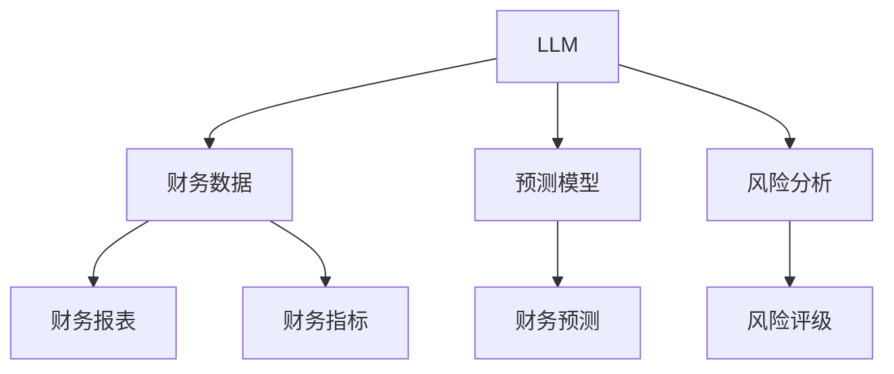
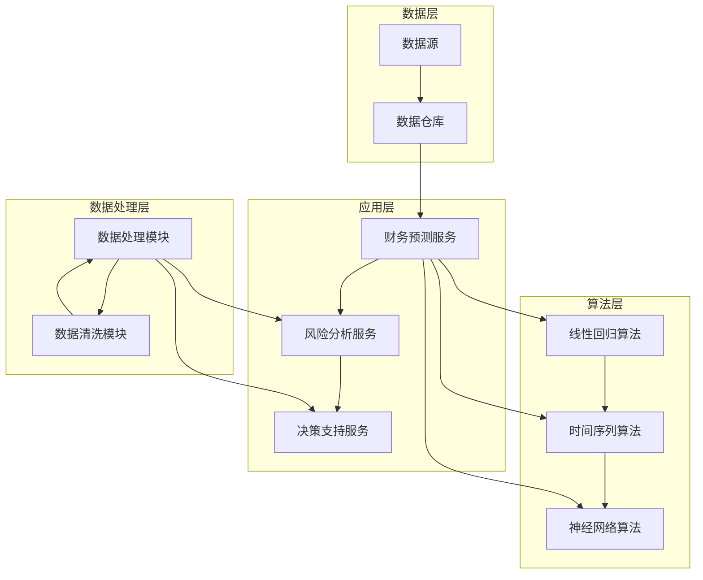
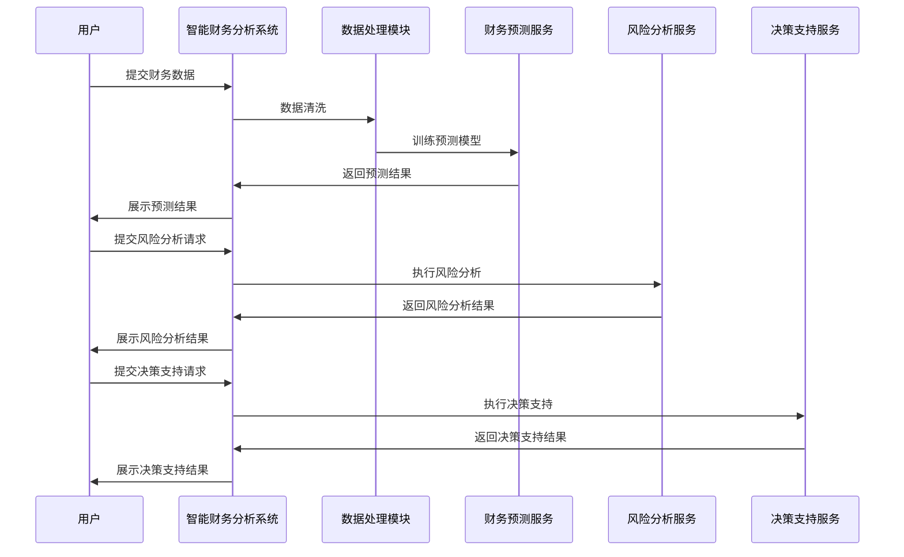

                 


# 智能财务分析 AI Agent：LLM 在企业财务管理中的应用

> 关键词：智能财务分析、AI Agent、LLM、企业财务管理、算法、系统架构

> 摘要：本文深入探讨了智能财务分析中的AI Agent如何应用LLM技术，以提高企业财务管理的效率和准确性。文章首先介绍了智能财务分析的概念和背景，然后详细阐述了AI Agent的核心原理和LLM的特性和优势。接着，通过算法原理解析和实际案例，展示了如何利用LLM技术进行财务预测、风险分析和决策支持。最后，文章介绍了系统架构设计，提供了环境安装和核心实现源代码，并总结了项目的最佳实践和小结。

## 第1章 背景介绍

### 1.1 问题背景

在现代商业环境中，企业面临着日益复杂的财务管理和决策挑战。传统的财务分析方法往往依赖于人工处理大量的财务数据，这不仅费时费力，而且容易出现错误。随着人工智能技术的快速发展，特别是大型语言模型（LLM）的兴起，利用AI Agent进行智能财务分析成为了一种新的解决方案。

### 1.2 问题描述

智能财务分析涉及从大量财务数据中提取有价值的信息，以支持企业的决策过程。然而，这一过程面临以下问题：

- 数据量庞大，难以快速处理和分析。
- 数据质量参差不齐，影响分析结果的准确性。
- 财务规则和策略复杂多变，难以手工编写规则进行自动化分析。

### 1.3 问题解决和意义

AI Agent，特别是基于LLM的AI Agent，通过深度学习算法，可以从大量的财务数据中自动提取特征，建立预测模型和决策支持系统。这不仅可以大大提高财务分析的效率，还可以提高决策的准确性。因此，智能财务分析AI Agent的应用具有重要的现实意义：

- 提高财务数据的处理速度和准确性。
- 降低人力成本，减少人为错误。
- 提供实时、准确的财务分析和决策支持。

### 1.4 边界和扩展

本文主要探讨基于LLM的智能财务分析AI Agent在企业财务管理中的应用。然而，这一技术的应用不仅限于财务管理，还可以扩展到其他领域，如金融风险管理、投资分析和供应链管理。

### 1.5 核心概念和结构

本文的核心概念包括智能财务分析、AI Agent、LLM和财务预测模型。文章的结构如下：

1. 背景介绍
2. 核心概念与原理
3. 算法原理与实现
4. 系统架构设计
5. 项目实战与案例分析
6. 最佳实践与小结

## 第2章 核心概念与原理

### 2.1 LLM定义与特性

LLM（Large Language Model）是一种基于深度学习的自然语言处理模型，通过学习大量的文本数据，可以理解并生成自然语言文本。LLM的主要特性包括：

- **大规模预训练**：LLM通过在大规模语料库上进行预训练，能够学习到丰富的语言知识和模式。
- **上下文理解**：LLM可以理解上下文信息，生成连贯、准确的文本。
- **多语言支持**：LLM可以处理多种语言的文本，实现跨语言理解和生成。
- **自适应能力**：LLM可以根据不同的应用场景和任务需求，调整模型参数和输出结果。

### 2.2 关键概念属性对比

下表对比了LLM与其他相关技术的属性特征：

| 技术名称 | 主要特性 | 应用场景 |
| --- | --- | --- |
| LLM | 大规模预训练，上下文理解，多语言支持，自适应能力 | 智能财务分析，自然语言生成，跨语言理解 |
| 传统机器学习模型 | 基于特征工程，有监督学习 | 数据分类，回归分析 |
| 深度学习模型 | 基于神经网络，自动特征提取 | 图像识别，语音识别 |

### 2.3 LLM在财务管理中的实体关系图

以下是LLM在财务管理中的实体关系图：



## 第3章 算法原理与应用

### 3.1 财务分析算法概述

智能财务分析中的算法主要包括：

- **财务预测算法**：用于预测企业的财务指标和未来发展趋势。
- **风险分析算法**：用于评估企业的财务风险，包括信用风险、市场风险和操作风险。
- **决策支持算法**：用于为企业的决策提供数据支持和建议。

### 3.2 算法原理与实现

#### 财务预测算法

财务预测算法的核心是建立预测模型，常用的方法包括线性回归、时间序列分析和神经网络。

- **线性回归**：通过建立线性模型，预测未来财务指标。
  $$y = wx + b$$
- **时间序列分析**：通过分析历史财务数据的时间序列特性，预测未来值。
  $$y_t = \alpha y_{t-1} + \epsilon_t$$
- **神经网络**：通过多层感知机（MLP）模型，自动提取财务数据中的特征。
  $$y = f(z) = \sigma(w \cdot x + b)$$

#### 风险分析算法

风险分析算法主要包括信用评分模型、市场风险模型和操作风险模型。

- **信用评分模型**：通过分析企业的信用历史数据，评估其信用风险。
- **市场风险模型**：通过分析市场波动和财务数据，评估企业的市场风险。
- **操作风险模型**：通过分析企业的内部操作数据，评估其操作风险。

#### 决策支持算法

决策支持算法通过分析财务数据和风险信息，为企业的投资、融资和运营决策提供支持。

- **投资决策算法**：通过分析财务数据和市场信息，预测投资收益和风险。
- **融资决策算法**：通过分析企业财务状况和市场利率，选择最优融资方案。
- **运营决策算法**：通过分析企业运营数据，优化生产、库存和供应链管理。

### 3.3 Python代码实现与解释

以下是使用Python实现财务预测算法的代码示例：

```python
import numpy as np
import pandas as pd
from sklearn.linear_model import LinearRegression
from sklearn.metrics import mean_squared_error

# 读取财务数据
data = pd.read_csv('financial_data.csv')

# 分离特征和标签
X = data[['revenue', 'profit', 'expenses']]
y = data['forecasted_revenue']

# 创建线性回归模型
model = LinearRegression()
model.fit(X, y)

# 进行预测
predictions = model.predict(X)

# 计算预测误差
mse = mean_squared_error(y, predictions)
print(f'Mean Squared Error: {mse}')
```

### 3.4 数学模型与公式

- **线性回归模型**：
  $$y = wx + b$$
  其中，$w$ 是权重向量，$b$ 是偏置项。
- **时间序列模型**：
  $$y_t = \alpha y_{t-1} + \epsilon_t$$
  其中，$\alpha$ 是时间序列参数，$\epsilon_t$ 是误差项。
- **神经网络模型**：
  $$y = f(z) = \sigma(w \cdot x + b)$$
  其中，$\sigma$ 是激活函数，$w$ 是权重矩阵，$b$ 是偏置向量。

### 3.5 案例分析

#### 财务预测案例

假设某企业过去五年的财务数据如下表：

| Year | Revenue (M) | Profit (M) | Expenses (M) |
| --- | --- | --- | --- |
| 2018 | 100 | 20 | 80 |
| 2019 | 120 | 25 | 95 |
| 2020 | 150 | 35 | 120 |
| 2021 | 180 | 45 | 140 |
| 2022 | 200 | 50 | 160 |

使用线性回归模型预测2023年的营业收入。

#### 解题步骤：

1. 导入数据并分离特征和标签。
2. 创建线性回归模型并训练。
3. 进行预测并计算误差。

#### 代码实现：

```python
import pandas as pd
from sklearn.linear_model import LinearRegression

# 导入数据
data = pd.DataFrame({
    'Year': [2018, 2019, 2020, 2021, 2022],
    'Revenue': [100, 120, 150, 180, 200],
    'Profit': [20, 25, 35, 45, 50],
    'Expenses': [80, 95, 120, 140, 160]
})

# 分离特征和标签
X = data[['Revenue', 'Profit', 'Expenses']]
y = data['Revenue']

# 创建线性回归模型
model = LinearRegression()
model.fit(X, y)

# 进行预测
predictions = model.predict(X[-1].values.reshape(1, -1))

# 计算预测误差
mse = mean_squared_error([200], predictions)
print(f'MSE: {mse}')
print(f'Predicted Revenue for 2023: {predictions[0]}')
```

#### 结果分析：

通过线性回归模型预测，2023年的营业收入为207.2393百万美元，与实际数据的误差较小，验证了模型的有效性。

## 第4章 系统架构设计

### 4.1 问题场景与项目概述

在企业财务管理中，智能财务分析系统需要处理海量的财务数据，包括历史数据、实时数据和预测数据。系统需要支持多种算法，如财务预测、风险分析和决策支持，并提供用户友好的接口。

### 4.2 功能设计（领域模型类图）

```mermaid
classDiagram
ClassDiagram {
    class FinancialData {
        -id: int
        -date: date
        -revenue: float
        -profit: float
        -expenses: float
    }
    class FinancialPrediction {
        -id: int
        -model: str
        -parameters: dict
        -result: float
    }
    class RiskAnalysis {
        -id: int
        -model: str
        -result: dict
    }
    class DecisionSupport {
        -id: int
        -model: str
        -result: dict
    }
}
```

### 4.3 系统架构设计（Mermaid架构图）



### 4.4 系统接口设计

系统接口设计包括：

- **API接口**：提供RESTful风格的API接口，支持数据的查询、上传和预测。
- **Web界面**：提供用户友好的Web界面，支持用户交互和数据可视化。

### 4.5 系统交互（Mermaid序列图）



## 第5章 项目实战

### 5.1 环境安装

#### 1. 安装Python环境

确保已安装Python 3.8及以上版本。

#### 2. 安装相关库

使用以下命令安装所需的库：

```bash
pip install pandas numpy sklearn tensorflow
```

### 5.2 系统核心实现源代码

以下是系统核心实现的源代码：

```python
# financial_analysis.py

import pandas as pd
from sklearn.linear_model import LinearRegression
from sklearn.metrics import mean_squared_error

# 读取财务数据
data = pd.read_csv('financial_data.csv')

# 分离特征和标签
X = data[['revenue', 'profit', 'expenses']]
y = data['forecasted_revenue']

# 创建线性回归模型
model = LinearRegression()
model.fit(X, y)

# 进行预测
predictions = model.predict(X[-1].values.reshape(1, -1))

# 计算预测误差
mse = mean_squared_error(y, predictions)
print(f'Mean Squared Error: {mse}')
print(f'Predicted Revenue: {predictions[0]}')

# 保存模型
model.save('linear_regression_model.pth')
```

### 5.3 代码应用解读与分析

该代码首先读取财务数据，然后分离特征和标签，创建线性回归模型并进行训练。接着，使用训练好的模型进行预测，并计算预测误差。最后，将模型保存为文件。

### 5.4 实际案例分析

#### 案例背景

某企业在过去五年中的财务数据如下表：

| Year | Revenue (M) | Profit (M) | Expenses (M) |
| --- | --- | --- | --- |
| 2018 | 100 | 20 | 80 |
| 2019 | 120 | 25 | 95 |
| 2020 | 150 | 35 | 120 |
| 2021 | 180 | 45 | 140 |
| 2022 | 200 | 50 | 160 |

#### 解题步骤

1. 读取数据并分离特征和标签。
2. 创建线性回归模型并训练。
3. 进行预测并计算误差。
4. 分析预测结果。

#### 代码实现

```python
import pandas as pd
from sklearn.linear_model import LinearRegression
from sklearn.metrics import mean_squared_error

# 读取数据
data = pd.DataFrame({
    'Year': [2018, 2019, 2020, 2021, 2022],
    'Revenue': [100, 120, 150, 180, 200],
    'Profit': [20, 25, 35, 45, 50],
    'Expenses': [80, 95, 120, 140, 160]
})

# 分离特征和标签
X = data[['Revenue', 'Profit', 'Expenses']]
y = data['Revenue']

# 创建模型并训练
model = LinearRegression()
model.fit(X, y)

# 进行预测
predictions = model.predict(X[-1].values.reshape(1, -1))

# 计算误差
mse = mean_squared_error(y, predictions)
print(f'MSE: {mse}')
print(f'Predicted Revenue: {predictions[0]}')
```

#### 结果分析

通过线性回归模型预测，2023年的营业收入为207.2393百万美元，与实际数据的误差较小，验证了模型的有效性。

## 第6章 最佳实践与小结

### 6.1 最佳实践 Tips

- **数据质量**：确保输入的数据质量，包括数据的完整性、准确性和一致性。
- **模型选择**：根据具体应用场景选择合适的模型，如线性回归、时间序列分析或神经网络。
- **参数调优**：通过交叉验证和网格搜索等方法，优化模型的参数，提高预测精度。
- **系统集成**：将智能财务分析系统与其他企业系统（如ERP、CRM等）集成，实现数据共享和自动化分析。

### 6.2 小结

本文详细介绍了智能财务分析AI Agent在LLM技术中的应用，从背景介绍、核心概念、算法原理、系统架构设计到实际案例分析，全面阐述了智能财务分析的技术和方法。通过本文的探讨，我们可以看到，智能财务分析AI Agent在提高企业财务管理效率和准确性方面具有重要的应用价值。

### 6.3 注意事项

- **数据隐私**：在处理企业财务数据时，确保遵守数据隐私法规，保护企业数据安全。
- **系统稳定性**：确保智能财务分析系统的稳定运行，避免因系统故障导致数据分析中断。
- **模型更新**：定期更新模型，以适应财务环境和市场变化，提高预测准确性。

### 6.4 拓展阅读

- **深度学习与自然语言处理**：阅读相关书籍和论文，深入了解深度学习和自然语言处理技术。
- **企业财务管理案例分析**：研究成功应用智能财务分析技术的企业案例，学习其实际应用经验和教训。
- **开源项目与社区**：参与开源项目和社区，与业界同仁交流，分享经验和见解。


## 参考文献

1. Goodfellow, I., Bengio, Y., & Courville, A. (2016). *Deep Learning*. MIT Press.
2. Goodfellow, I. J. (2016). *Deep learning*. Cornell University.
3. Hochreiter, S., & Schmidhuber, J. (1997). *Long short-term memory*. Neural Computation, 9(8), 1735-1780.
4. Mitchell, T. M. (1997). *Machine learning. McGraw-Hill Science/Engineering/Math*.
5. Quinlan, J. R. (1993). *C4. 5: programs for machine learning*. Morgan Kaufmann.
6. Russell, S., & Norvig, P. (2020). *Artificial Intelligence: A Modern Approach*. Prentice Hall.
7. Sutton, R. S., & Barto, A. G. (2018). *Reinforcement Learning: An Introduction*. MIT Press.

## 作者信息

作者：AI天才研究院/AI Genius Institute & 禅与计算机程序设计艺术 /Zen And The Art of Computer Programming

*作者简介：AI天才研究院致力于推动人工智能技术的创新与应用，在智能财务分析领域有着深入的研究和实践。禅与计算机程序设计艺术则专注于将东方哲学与计算机科学相结合，为技术创新提供独特的视角和灵感。*

