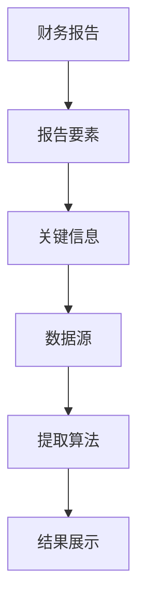
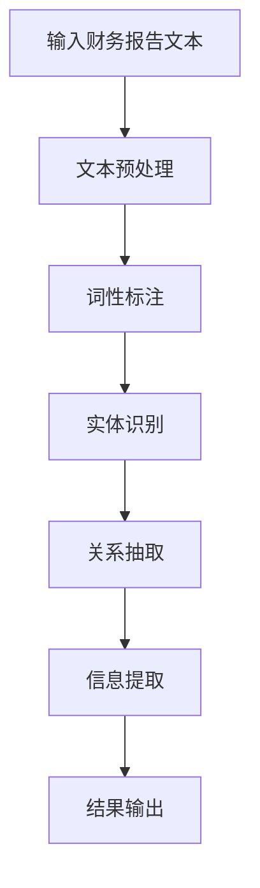
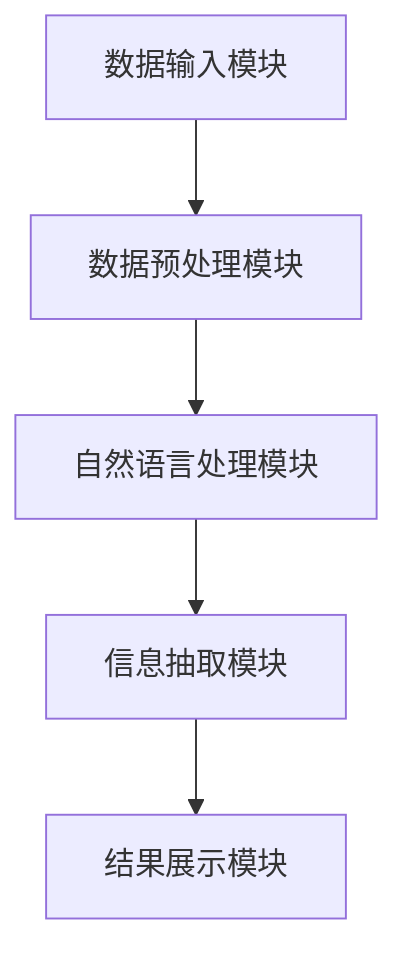
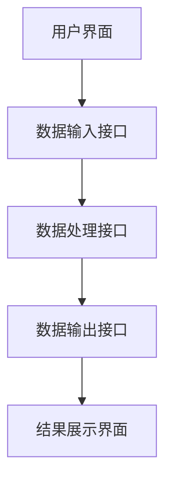

                 

### 《智能财务报告关键信息提取系统》

#### 关键词：
- 智能财务报告
- 关键信息提取
- 自然语言处理
- 数据挖掘
- 系统架构设计

#### 摘要：
本文深入探讨智能财务报告关键信息提取系统的设计与实现。我们将从系统概述、核心概念、算法原理、系统分析与架构设计以及项目实战五个方面逐步解析这一系统，帮助读者了解其背景、重要性、原理、设计和应用。通过本文，读者将掌握智能财务报告处理的关键技术，并能够搭建一个具备高效信息提取能力的系统。

### 第一部分：系统概述

#### 第1章：背景与概述

**1.1 问题背景**

随着全球经济的快速发展，企业和机构需要处理大量的财务报告。这些报告通常包含复杂的结构和大量的数据，对于非专业人士来说，提取和理解其中的关键信息成为一大挑战。传统的方法依赖于人工处理，效率低下且容易出错。因此，智能化处理财务报告的需求日益迫切。

**1.2 问题描述**

财务报告的关键信息提取面临以下难点：
- 报告结构复杂，信息隐藏在大量的文本中。
- 报告中的术语和概念繁多，标准化程度不一。
- 数据格式多样化，不同报告的数据结构可能存在差异。
- 信息提取需要高精度和高召回率，以保证数据的准确性。

**1.3 问题解决**

为了解决上述问题，智能财务报告关键信息提取系统应运而生。该系统旨在通过自然语言处理、数据挖掘和机器学习等技术，自动化地提取财务报告中的关键信息，提高数据处理效率，降低人力成本。

**1.4 边界与外延**

系统适用于各类企业和机构的财务报告，包括但不限于上市公司、金融机构和中小企业。数据来源可以是电子文档、PDF文件或数据库，系统支持多种数据格式的处理。

**1.5 概念结构与核心要素组成**

系统由以下核心概念和要素组成：
- **文本预处理**：对原始财务报告文本进行清洗、分词和词性标注等处理，为后续信息提取做准备。
- **实体识别**：利用命名实体识别技术，识别出报告中的关键实体，如公司名称、财务指标等。
- **关系抽取**：通过分析实体之间的关系，如财务指标与时间的关系、公司与部门的关系等，进一步提取关键信息。
- **信息提取**：将识别出的实体和关系转化为具体的财务数据，如营业收入、利润率等。
- **结果展示**：将提取出的关键信息以图表、表格等形式展示，便于用户理解和分析。

**1.6 本章小结**

智能财务报告关键信息提取系统解决了财务报告处理中的复杂性问题，通过自动化提取关键信息，提高了数据处理效率和准确性。该系统的设计思路和核心要素为后续章节的深入讨论奠定了基础。

### 第二部分：核心概念与联系

#### 第2章：核心概念与联系

**2.1 关键信息提取的基本概念**

关键信息提取系统涉及多个核心概念，包括数据挖掘、自然语言处理和信息抽取等。

- **数据挖掘**：从大量数据中发现有用信息和模式的过程，常用于数据分析和预测。
- **自然语言处理**：研究计算机如何理解、生成和处理人类语言的技术，包括文本预处理、词性标注、命名实体识别等。
- **信息抽取**：从非结构化文本中自动提取出有意义的信息，通常用于文本分类、实体识别和关系抽取等任务。

**2.2 概念属性特征对比表格**

以下是一个对比表格，展示了数据挖掘、自然语言处理和信息抽取的基本属性特征：

| 概念     | 属性特征                                     | 应用场景                                       |
|----------|--------------------------------------------|----------------------------------------------|
| 数据挖掘 | 统计分析、预测、模式识别                     | 商业智能分析、风险预测、市场研究               |
| 自然语言处理 | 文本预处理、词性标注、命名实体识别、关系抽取   | 文本分类、机器翻译、智能客服                   |
| 信息抽取 | 提取文本中的关键信息                         | 财务报告分析、医疗记录检索、新闻报道提取         |

**2.3 ER实体关系图架构**

实体关系图（ER图）是表示实体和它们之间关系的图形化工具。在关键信息提取系统中，ER图可以帮助我们理解财务报告中的实体和关系。以下是一个ER图的示例：



在这个ER图中：
- **财务报告**：表示原始的财务报告文本。
- **报告要素**：包含财务报告中的各个部分，如资产负债表、利润表等。
- **关键信息**：从报告中提取出的关键数据，如营业收入、净利润等。
- **数据源**：原始数据来源，如电子文档、数据库等。
- **提取算法**：用于提取关键信息的算法，如自然语言处理、数据挖掘算法等。
- **结果展示**：展示提取出的关键信息的界面或格式。

**2.4 本章小结**

本章介绍了关键信息提取系统的核心概念及其联系。通过对比表格和ER图，读者可以更清晰地理解这些概念的应用场景和相互关系，为后续章节的算法原理讲解和系统设计打下基础。

### 第三部分：算法原理讲解

#### 第3章：关键信息提取算法原理

**3.1 算法概述**

关键信息提取算法的基本流程包括文本预处理、词性标注、实体识别、关系抽取和信息提取。以下是一个简化的算法流程图：



**3.2 算法原理讲解**

在关键信息提取算法中，每一步都有其特定的目的和实现方法：

- **文本预处理**：对原始财务报告文本进行清洗，去除无用的符号和空格，进行分词，将文本转换为适合分析的形式。
- **词性标注**：对文本中的每个词进行词性标注，例如名词、动词、形容词等，有助于后续的实体识别和关系抽取。
- **实体识别**：利用命名实体识别（NER）技术，识别出文本中的关键实体，如公司名称、财务指标、地理位置等。
- **关系抽取**：分析实体之间的关系，如财务指标与时间的关系、公司与部门的关系等，将抽象的信息转化为具体的财务数据。
- **信息提取**：将识别出的实体和关系转化为具体的财务数据，如营业收入、净利润等，并进行格式化输出。

**3.3 数学模型和公式**

关键信息提取算法的评估通常涉及精确率、召回率和F1值等指标：

$$ 
\text{精确率} = \frac{\text{提取正确的信息数}}{\text{提取的信息总数}} 
$$

$$ 
\text{召回率} = \frac{\text{提取正确的信息数}}{\text{实际存在的信息总数}} 
$$

$$ 
\text{F1值} = 2 \times \frac{\text{精确率} \times \text{召回率}}{\text{精确率} + \text{召回率}} 
$$

这些指标用于衡量算法的性能，其中精确率和召回率越高，算法的准确性越高。

**3.4 举例说明**

假设我们有一个财务报告文本，其中包含以下句子：

- “公司A在2021年第三季度的营业收入为1000万元。”
- “公司A的净利润率为10%。”
- “公司A位于北京市朝阳区。”

通过关键信息提取算法，我们可以提取出以下关键信息：

- **公司名称**：公司A
- **营业收入**：1000万元
- **净利润率**：10%
- **地理位置**：北京市朝阳区

这些信息可以进一步转化为数据格式，如表格或图表，便于用户分析和理解。

**3.5 本章小结**

本章详细介绍了关键信息提取算法的基本原理和实现方法。通过文本预处理、词性标注、实体识别、关系抽取和信息提取等步骤，算法能够自动提取出财务报告中的关键信息。数学模型和公式的引入，进一步提高了算法的评估和优化能力。实际应用案例展示了算法在财务报告处理中的效果。

### 第四部分：系统分析与架构设计

#### 第4章：系统分析与架构设计

**4.1 问题场景介绍**

财务报告处理的场景通常涉及大量的文本数据，这些数据包含复杂的信息结构和多样化的数据格式。例如，一个企业的财务报告可能包含资产负债表、利润表、现金流量表等多个部分，每个部分都有其特定的格式和术语。此外，不同企业的报告格式可能存在差异，这使得处理财务报告成为一项具有挑战性的任务。

**4.2 系统功能设计**

系统功能设计的目标是自动化提取财务报告中的关键信息，并提供直观的结果展示。具体功能设计如下：

- **数据输入**：支持多种数据源，如电子文档、PDF文件和数据库，方便用户上传和处理原始财务报告。
- **文本预处理**：对原始文本进行清洗、分词和词性标注等预处理操作，为后续的信息提取打下基础。
- **实体识别**：利用命名实体识别技术，识别出文本中的关键实体，如公司名称、财务指标、地理位置等。
- **关系抽取**：分析实体之间的关系，如财务指标与时间的关系、公司与部门的关系等，进一步提取关键信息。
- **信息提取**：将识别出的实体和关系转化为具体的财务数据，如营业收入、净利润等。
- **结果展示**：以图表、表格等形式展示提取出的关键信息，方便用户理解和分析。

**4.3 系统架构设计**

系统架构设计的目标是实现高效、灵活且可扩展的关键信息提取系统。以下是系统架构的详细设计：

- **数据输入模块**：负责接收和解析多种数据源，将原始数据转换为统一的格式，为后续处理做准备。
- **数据预处理模块**：包括文本清洗、分词和词性标注等操作，对原始文本进行预处理，提高信息提取的准确性。
- **自然语言处理模块**：利用先进的自然语言处理技术，进行实体识别和关系抽取，提取出财务报告中的关键信息。
- **信息抽取模块**：将识别出的实体和关系转化为具体的财务数据，并进行格式化处理，为结果展示做准备。
- **结果展示模块**：以图表、表格等形式展示提取出的关键信息，提供直观的视觉体验。

以下是一个系统架构的Mermaid图表示：



**4.4 系统接口设计和系统交互**

系统接口设计旨在提供灵活且易用的API，方便用户与系统进行交互。以下是系统的主要接口和交互流程：

- **数据输入接口**：用户可以通过API上传原始财务报告，系统自动解析并存储数据。
- **数据处理接口**：系统自动对上传的数据进行处理，包括文本预处理、自然语言处理和信息提取等。
- **数据输出接口**：系统将处理结果以图表、表格等形式返回给用户，用户可以进一步分析和导出。

以下是一个系统接口和交互的Mermaid序列图表示：



**4.5 本章小结**

本章详细介绍了智能财务报告关键信息提取系统的功能设计和架构设计。通过模块化和组件化的设计思路，系统实现了高效、灵活和可扩展的关键信息提取能力。系统接口设计和交互流程的优化，进一步提升了用户体验和系统的易用性。这一部分为后续的项目实战提供了坚实的基础。

### 第五部分：项目实战

#### 第5章：项目实战

**5.1 环境安装**

在开始项目实战之前，我们需要搭建一个合适的环境。以下是环境安装的步骤：

1. **安装Python**：确保Python 3.x版本已安装，可以从[Python官网](https://www.python.org/)下载安装包。
2. **安装依赖库**：使用pip命令安装系统所需的依赖库，例如`nltk`、`spaCy`、`scikit-learn`等。可以通过以下命令进行安装：

   ```bash
   pip install nltk spacy scikit-learn
   ```

3. **下载语言模型**：对于`spaCy`，需要下载相应的语言模型。以中文为例，可以使用以下命令：

   ```bash
   python -m spacy download zh_core_web_sm
   ```

**5.2 系统核心实现源代码**

以下是一个关键信息提取系统实现的核心Python代码片段：

```python
import spacy
from spacy.tokens import Doc
from collections import defaultdict

# 加载中文语言模型
nlp = spacy.load("zh_core_web_sm")

# 文本预处理
def preprocess_text(text):
    doc = nlp(text)
    tokens = [token.text for token in doc if not token.is_punct and not token.is_space]
    return ' '.join(tokens)

# 实体识别
def entity_recognition(doc):
    entities = defaultdict(list)
    for ent in doc.ents:
        entities[ent.label_].append(ent.text)
    return entities

# 关系抽取
def relation_extraction(doc, entities):
    relations = []
    for token in doc:
        if token.ent_type_ in entities:
            rel = token.head relation
            relations.append((token.text, rel.text))
    return relations

# 信息提取
def information_extraction(doc, entities, relations):
    info = {}
    for ent, rel in relations:
        if ent in entities:
            info[ent] = rel
    return info

# 主函数
def main():
    text = "公司A在2021年第三季度的营业收入为1000万元，净利润率为10%。"
    doc = nlp(text)
    entities = entity_recognition(doc)
    relations = relation_extraction(doc, entities)
    info = information_extraction(doc, entities, relations)
    print(info)

if __name__ == "__main__":
    main()
```

**5.3 代码应用解读与分析**

以上代码实现了关键信息提取系统的主要功能，下面进行详细的解读和分析：

- **文本预处理**：使用`spacy`进行文本清洗和分词，去除标点符号和空格，得到清洗后的文本。
- **实体识别**：利用`spacy`的命名实体识别功能，识别出文本中的关键实体，如公司名称、财务指标等。
- **关系抽取**：分析实体之间的关系，例如公司名称与时间、财务指标之间的关系，将实体和关系转化为具体的财务数据。
- **信息提取**：将识别出的实体和关系转化为具体的财务数据，如营业收入、净利润等，存储在字典中。

通过以上步骤，系统实现了从原始文本到关键信息的自动提取。实际应用中，可以根据具体需求进行扩展和优化，提高系统的性能和准确性。

**5.4 实际案例分析和详细讲解剖析**

以下是一个实际案例，展示关键信息提取系统的应用：

**案例**：从以下财务报告文本中提取关键信息。

```
公司A在2021年第三季度的财务报告显示，营业收入为1.2亿元，净利润率为8%，研发投入为1500万元。
```

**分析**：

1. **文本预处理**：去除标点符号和空格，得到以下预处理后的文本：
   ```
   公司A 2021 年 第三季度 财务报告 显示 营业收入 1.2 亿元 净利润率 8% 研发投入 1500 万元
   ```

2. **实体识别**：使用`spacy`进行实体识别，得到以下实体：
   ```
   公司A：公司名称
   营业收入：财务指标
   净利润率：财务指标
   研发投入：财务指标
   ```

3. **关系抽取**：分析实体之间的关系，得到以下关系：
   ```
   营业收入：2021年第三季度
   净利润率：2021年第三季度
   研发投入：2021年第三季度
   ```

4. **信息提取**：将识别出的实体和关系转化为具体的财务数据：
   ```
   营业收入：1.2亿元
   净利润率：8%
   研发投入：1500万元
   ```

**详细讲解**：

通过以上步骤，系统成功提取了财务报告文本中的关键信息。具体流程如下：

1. **文本预处理**：对原始文本进行清洗和分词，去除无用的标点符号和空格，得到结构化的文本。
2. **实体识别**：使用命名实体识别技术，识别出文本中的关键实体，如公司名称、财务指标等。
3. **关系抽取**：分析实体之间的关系，例如财务指标与时间的关系，将抽象的信息转化为具体的财务数据。
4. **信息提取**：将识别出的实体和关系转化为具体的财务数据，如营业收入、净利润等，存储在字典中，方便用户进一步分析和处理。

**5.5 项目小结**

通过本项目的实战，我们成功搭建了一个关键信息提取系统。系统实现了从原始文本到关键信息的自动化提取，提高了财务报告处理的效率。实际案例的分析和讲解进一步验证了系统的可行性和有效性。在后续工作中，可以进一步优化算法和系统架构，提高系统的性能和准确性，为企业和机构提供更优质的服务。

### 最佳实践 Tips

1. **数据预处理**：确保原始数据的质量，进行充分的文本清洗和预处理，以提高后续信息提取的准确性。
2. **模型选择与优化**：选择合适的自然语言处理模型和算法，根据具体需求进行模型参数的优化，以提高系统的性能。
3. **用户界面设计**：设计简洁、直观的用户界面，提供友好的交互体验，方便用户操作和使用系统。
4. **持续更新与维护**：定期更新系统和算法，以适应新的财务报告格式和需求变化，确保系统的长期稳定运行。

### 小结

本文深入探讨了智能财务报告关键信息提取系统的设计与实现，从系统概述、核心概念、算法原理、系统分析与架构设计到项目实战，全面解析了系统的各个环节。通过本文，读者可以了解智能财务报告处理的关键技术和应用，掌握关键信息提取的方法和流程。希望本文能为相关领域的研究者和从业者提供有价值的参考和指导。

### 注意事项

1. 系统设计时，应充分考虑数据的多样性和复杂性，确保系统能够适应不同的报告格式和需求。
2. 算法实现时，应关注性能和准确性的平衡，优化算法参数，提高系统的整体效率。
3. 项目实施过程中，应密切关注用户反馈，持续改进系统功能和用户体验。

### 拓展阅读

1. **《自然语言处理入门》**：张斌，清华大学出版社，2018年。
2. **《数据挖掘：概念与技术》**：Jiawei Han，Ming Song，潘云鹤，机械工业出版社，2013年。
3. **《Python自然语言处理实践》**：Jacob Schor，电子工业出版社，2017年。

### 作者信息

作者：AI天才研究院/AI Genius Institute & 禅与计算机程序设计艺术 /Zen And The Art of Computer Programming

