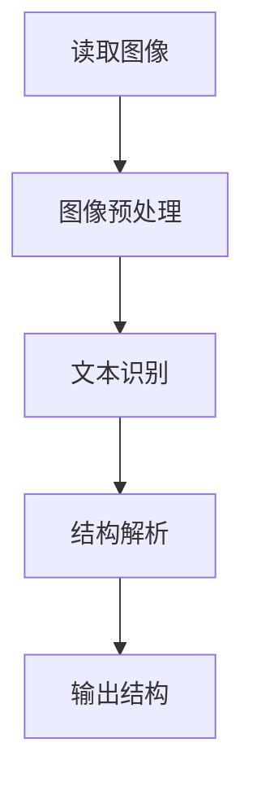
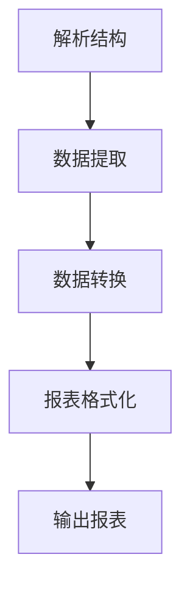

                 

## 摘要

随着大数据和人工智能技术的快速发展，财务报告自动生成系统逐渐成为企业和金融机构提升财务管理效率的关键工具。本文旨在深入探讨智能财务报告自动生成系统的设计、实现和优化，帮助读者全面了解该领域的技术原理和应用实践。本文首先介绍了财务报告自动生成系统的背景，包括其重要性和当前面临的问题。接着，本文详细分析了核心概念和系统架构，阐述了实现财务报告自动生成的关键算法和技术。随后，通过实际项目案例展示了系统的构建过程和效果。最后，本文总结了最佳实践、注意事项，并对未来的研究方向进行了展望。通过本文的阅读，读者将能够掌握智能财务报告自动生成系统的整体架构和实现方法，为实际应用提供有力支持。

## 目录大纲设计思路

在设计《智能财务报告自动生成系统》的目录大纲时，我们遵循了系统的逻辑结构和读者的阅读习惯，确保内容既全面又易于理解。首先，我们需要明确书籍的核心主题，即智能财务报告自动生成系统的概念、实现和优化。以下是详细的目录大纲设计思路：

### 1. 背景介绍

在书籍的第一部分，我们将对财务报告自动生成系统进行背景介绍。这部分将包括以下内容：

- **问题背景**：阐述当前财务报告处理方式中的痛点，如手动生成报告的繁琐、错误率高、效率低下等。
- **问题描述**：详细描述财务报告自动生成系统的目标和需求，如提高报告生成速度、减少人工错误、提高数据准确性等。
- **问题解决**：分析智能财务报告自动生成系统如何解决上述问题，包括技术手段和系统架构。
- **边界与外延**：明确系统的适用范围和局限性，确保读者对系统的理解不偏离实际应用。
- **核心概念和要素组成**：介绍与系统相关的重要概念和组成部分，如财务报表结构、数据处理技术、算法模型等。

### 2. 核心概念与联系

在第二部分，我们将深入探讨财务报告自动生成系统所需的核心概念和联系。这部分将包括：

- **核心技术概述**：简要介绍与财务报告自动生成相关的主要技术，如人工智能、大数据、自然语言处理等。
- **核心概念原理讲解**：详细阐述实现财务报告自动生成的关键算法原理，包括数据采集、报表结构识别、报表生成等。
- **算法流程图**：使用 mermaid 画出核心算法的流程图，帮助读者更直观地理解算法实现过程。
- **Python代码实现**：提供实现算法的核心代码示例，便于读者理解代码逻辑和实际操作。
- **数学模型与公式**：介绍关键的数学模型和公式，使用 LaTeX 格式进行表示，确保公式的严谨性和可读性。
- **举例说明**：通过具体实例展示算法的应用效果，帮助读者理解算法原理在实际中的运用。

### 3. 系统分析与架构设计

在第三部分，我们将对财务报告自动生成系统的分析和架构设计进行详细介绍。这部分将包括：

- **系统分析**：介绍系统分析的过程和方法，包括需求分析、功能分析和性能分析等。
- **系统架构设计**：详细描述系统的总体架构，包括数据层、业务逻辑层、表现层等，并使用 mermaid 画出架构图。
- **系统接口设计**：介绍系统提供的接口规范，包括接口定义和调用流程，确保系统的扩展性和易用性。
- **系统交互设计**：描述系统的用户交互设计，包括用户界面设计和用户操作流程，提升用户体验。

### 4. 项目实战

在第四部分，我们将通过实际项目案例展示财务报告自动生成系统的构建过程和效果。这部分将包括：

- **环境安装与配置**：介绍系统的环境安装和配置步骤，确保读者能够顺利搭建实验环境。
- **系统核心实现**：详细讲解系统核心功能的实现过程，包括数据采集、报表结构识别、报表生成等。
- **代码解读与分析**：分析核心代码的结构和逻辑，帮助读者深入理解系统的工作原理。
- **实际案例分析**：通过具体案例展示系统在实际应用中的效果，包括案例选择、案例分析、案例总结等。

### 5. 最佳实践与总结

在第五部分，我们将总结最佳实践、注意事项和未来的研究方向。这部分将包括：

- **最佳实践 tips**：提供在实际开发中总结出的最佳实践，帮助读者避免常见问题，提高开发效率。
- **小结与展望**：对全书内容进行总结，指出系统的优点和不足，并对未来的发展方向进行展望。
- **注意事项**：提醒读者在系统部署、维护和升级过程中需要注意的事项。
- **拓展阅读**：推荐相关的文献和资源，帮助读者进一步深入学习和研究。

通过以上五个部分的详细设计和编排，我们确保了《智能财务报告自动生成系统》的内容结构清晰、逻辑性强，便于读者系统性地学习和掌握相关知识。

## 第一部分：背景介绍

### 1.1 问题的背景与描述

在当今的商业环境中，财务报告是企业和金融机构运营的重要基石。传统的财务报告生成方式依赖于人工操作，存在诸多问题，如处理繁琐、错误率高、效率低下等。首先，手动生成报告需要财务人员投入大量时间和精力，这使得企业的财务管理效率较低。其次，人工处理容易产生错误，如数据输入错误、公式计算错误等，这可能导致财务报告的准确性受到影响。此外，手动生成报告的效率较低，难以满足现代企业对快速决策的需求。

为了解决上述问题，企业和金融机构迫切需要一种自动化、智能化的财务报告生成系统。智能财务报告自动生成系统利用大数据和人工智能技术，能够自动采集、处理和分析财务数据，生成高质量的财务报告。这种系统能够显著提高报告生成的速度和准确性，减少人工错误，提高企业的财务管理效率。此外，智能财务报告自动生成系统还能够实时监控和分析财务数据，为企业提供及时、准确的决策支持。

### 1.2 财务报告自动生成系统的需求

智能财务报告自动生成系统的需求主要体现在以下几个方面：

1. **自动化数据处理**：系统能够自动采集各种财务数据，包括收入、支出、利润、资产负债等，并自动进行数据清洗和预处理，确保数据的一致性和准确性。

2. **智能化报表生成**：系统能够根据预设的模板和规则，自动生成各种财务报表，如资产负债表、利润表、现金流量表等。同时，系统能够根据用户需求进行报表定制，提供灵活的报表格式和展示方式。

3. **实时数据分析**：系统能够实时监控和分析财务数据，提供动态的财务指标和报表，帮助企业及时了解财务状况，做出科学决策。

4. **降低人力成本**：系统能够大幅减少财务人员的工作量，降低人力成本，提高工作效率。

5. **提高数据准确性**：系统能够自动进行数据校验和错误检测，提高财务报告的准确性。

6. **合规性要求**：系统能够确保财务报告符合相关法规和标准，满足合规性要求。

### 1.3 财务报告自动生成系统的挑战

尽管智能财务报告自动生成系统具有显著的优势，但其实现和应用过程中也面临一系列挑战：

1. **数据质量问题**：财务数据来源多样，数据质量参差不齐，需要系统具备强大的数据处理能力，确保数据的一致性和准确性。

2. **算法复杂度**：财务报表生成涉及到复杂的算法和模型，如自然语言处理、数据挖掘和机器学习等，系统的实现和优化需要高水平的技术支持。

3. **系统稳定性**：系统需要保证高可用性和稳定性，能够应对大量数据的高并发处理，确保报表生成的实时性和准确性。

4. **用户体验**：系统的用户界面和操作流程需要设计简洁、直观，易于用户理解和操作。

5. **安全性问题**：财务数据具有高度敏感性，系统需要确保数据的安全性和隐私保护，防止数据泄露和未经授权的访问。

### 1.4 核心概念与要素

智能财务报告自动生成系统涉及多个核心概念和要素，以下是其中一些重要概念：

1. **财务报表结构**：财务报表包括资产负债表、利润表、现金流量表等，每种报表都有固定的结构和格式，系统需要能够识别和解析这些结构。

2. **数据处理技术**：包括数据采集、数据清洗、数据存储和数据挖掘等技术，这些技术是实现财务报告自动生成的基础。

3. **自然语言处理**：利用自然语言处理技术，系统可以理解和处理财务数据相关的文本信息，如财务报表文本、发票、收据等。

4. **机器学习与人工智能**：系统利用机器学习算法和人工智能技术，对财务数据进行分析和预测，提高财务报告的准确性和智能化水平。

5. **系统架构**：包括数据层、业务逻辑层和表现层，每个层次都有特定的功能和责任，确保系统的整体性能和可靠性。

通过上述背景介绍，读者可以对智能财务报告自动生成系统有一个初步的认识，为后续章节的深入学习打下基础。

### 1.5 核心概念与要素组成

智能财务报告自动生成系统由多个核心概念和要素组成，以下将详细阐述这些概念及其在系统中的作用：

1. **财务报表结构**：财务报表是财务报告的核心内容，包括资产负债表、利润表、现金流量表等。每种报表都有固定的格式和结构，如资产负债表分为资产、负债和股东权益三大部分，利润表则分为收入、成本、费用等项目。系统需要能够准确识别和解析这些结构，确保报表生成的一致性和准确性。

2. **数据采集与处理**：数据采集是财务报告自动生成的基础，系统需要能够从各种数据源（如财务系统、ERP系统、银行系统等）自动采集数据。数据采集后，系统还需要进行数据清洗和预处理，包括去除重复数据、填补缺失值、统一数据格式等，确保数据的一致性和准确性。

3. **自然语言处理**：财务报告往往包含大量的文本信息，如财务报表文本、发票、收据等。自然语言处理技术可以帮助系统理解和处理这些文本信息，提取关键财务数据，如金额、日期、描述等。此外，自然语言处理还可以用于生成报表说明和注释，提高报告的可读性。

4. **机器学习与人工智能**：机器学习与人工智能技术是财务报告自动生成系统的核心，利用这些技术，系统能够对财务数据进行深入分析和预测。例如，通过机器学习算法，系统可以识别不同业务类型的财务数据，自动分类和标注；通过人工智能技术，系统可以生成预测报表，提供未来财务趋势分析。

5. **系统架构**：智能财务报告自动生成系统通常采用分布式架构，包括数据层、业务逻辑层和表现层。数据层负责数据的存储和管理，业务逻辑层负责数据处理和报表生成，表现层负责向用户展示报表结果。各层之间通过接口进行数据交互，确保系统的整体性能和可靠性。

6. **用户界面**：用户界面是系统与用户交互的接口，系统需要提供简洁、直观的用户界面，方便用户进行数据输入、报表查看和操作。用户界面设计应考虑用户体验，提供实时报表预览、报表下载和打印等功能。

7. **安全性**：财务数据具有高度敏感性，系统需要确保数据的安全性和隐私保护。安全性措施包括数据加密、用户身份验证、权限控制等，防止数据泄露和未经授权的访问。

通过以上核心概念和要素的阐述，读者可以对智能财务报告自动生成系统的构建有一个全面的认识。这些核心概念和要素相互作用，共同构成了一个完整的智能财务报告自动生成系统。

### 2.1 核心技术概述

智能财务报告自动生成系统涉及多个核心技术，以下将简要介绍这些技术及其在系统中的重要性：

1. **人工智能与大数据**：人工智能和大数据技术是财务报告自动生成系统的核心技术。人工智能技术包括机器学习、深度学习和自然语言处理，能够对财务数据进行分析和预测，提高报表生成的智能化水平。大数据技术则提供强大的数据处理能力，能够高效地处理海量数据，确保报表生成的准确性和实时性。

2. **自然语言处理（NLP）**：自然语言处理技术是财务报告自动生成系统中不可或缺的一部分。NLP能够帮助系统理解和处理财务数据相关的文本信息，如财务报表文本、发票、收据等。通过文本分类、实体识别和语义分析等技术，NLP能够提取关键财务数据，提高报表生成的自动化程度。

3. **数据挖掘**：数据挖掘技术用于从大量财务数据中提取有价值的信息和模式。在财务报告自动生成系统中，数据挖掘技术可以帮助系统发现潜在的财务风险、趋势和异常，提供更准确的报表和分析结果。

4. **数据可视化**：数据可视化技术是将数据以图形、图表和地图等形式呈现，帮助用户直观地理解和分析数据。在财务报告自动生成系统中，数据可视化技术可以提高报表的可读性和易懂性，帮助用户快速获取关键信息。

5. **云计算与分布式计算**：云计算和分布式计算技术为财务报告自动生成系统提供了强大的计算和存储能力。通过云计算平台，系统可以高效地处理海量数据，实现报表的实时生成和更新。分布式计算技术则可以提高系统的可靠性和性能，确保报表生成的稳定性和高效性。

6. **区块链技术**：区块链技术具有去中心化、不可篡改和透明等特点，能够提高财务数据的可信度和安全性。在财务报告自动生成系统中，区块链技术可以用于存储和验证财务数据，确保报表的完整性和准确性。

7. **自动化流程管理**：自动化流程管理技术用于管理财务报告的生成过程，包括数据采集、数据处理、报表生成和分发等。通过自动化流程管理，系统能够实现财务报告的自动化生成和高效管理，提高财务管理效率。

通过上述核心技术的介绍，读者可以了解到智能财务报告自动生成系统所涉及的技术范围和复杂性。这些技术共同作用，为系统的实现提供了强有力的支持。

### 2.2 算法原理讲解

智能财务报告自动生成系统的核心在于算法的运用，这些算法能够实现财务数据的自动识别、处理和报表生成。以下是详细讲解实现财务报告自动生成的关键算法原理：

#### 2.2.1 财务报表结构识别算法

财务报表结构识别算法是财务报告自动生成系统的第一步，其主要任务是识别并解析财务报表的各个组成部分。这个过程通常包括以下步骤：

1. **图像预处理**：首先，对输入的财务报表图像进行预处理，包括去噪、二值化、边缘检测等操作。这些步骤能够提高图像质量，为后续的文本识别和结构解析打下基础。

   ```python
   import cv2
   import numpy as np

   def preprocess_image(image_path):
       image = cv2.imread(image_path, cv2.IMREAD_GRAYSCALE)
       _, binary_image = cv2.threshold(image, 128, 255, cv2.THRESH_BINARY_INV + cv2.THRESH_OTSU)
       edges = cv2.Canny(binary_image, 50, 150)
       return edges
   ```

2. **文本识别**：对预处理后的图像进行文本识别，提取出报表中的文字信息。常用的文本识别方法包括基于模板匹配的 OCR 算法和基于深度学习的 OCR 算法。这里以 Tesseract OCR 为例：

   ```python
   import pytesseract
   from PIL import Image

   def ocr_text(image_path):
       image = Image.open(image_path)
       text = pytesseract.image_to_string(image, config='--psm 6')
       return text
   ```

3. **结构解析**：根据提取的文本信息，解析财务报表的结构。这通常需要构建一个解析规则库，用于识别不同的报表部分，如标题、表头、行数据等。

   ```python
   def parse_structure(text):
       structure = {}
       lines = text.split('\n')
       for line in lines:
           if '资产负债表' in line:
               structure['title'] = line
           elif '项目' in line:
               structure['header'] = line
           else:
               structure['rows'].append(line)
       return structure
   ```

4. **流程图展示**：

   ```mermaid
   graph TD
   A[图像预处理] --> B[文本识别]
   B --> C[结构解析]
   ```

#### 2.2.2 财务报表生成算法

在解析出财务报表结构后，下一步是生成具体的报表内容。这一过程包括以下几个主要步骤：

1. **数据提取**：从已解析的报表结构中提取关键数据，如金额、日期、描述等。

   ```python
   def extract_data(structure):
       data = {}
       for row in structure['rows']:
           if '收入' in row:
               data['income'] = row.split(':')[1].strip()
           elif '成本' in row:
               data['cost'] = row.split(':')[1].strip()
           # 其他数据的提取
       return data
   ```

2. **数据转换**：将提取出的数据转换为报表所需的格式，如表格、图形等。这里以 Pandas 库为例：

   ```python
   import pandas as pd

   def generate_report(data):
       report = pd.DataFrame([data])
       report.to_csv('report.csv', index=False)
       return report
   ```

3. **报表格式化**：根据预设的报表模板，对生成的报表进行格式化，包括字体、颜色、布局等。

   ```python
   def format_report(report):
       report.style.set_properties(**{'text-align': 'right'})
       return report.style
   ```

4. **流程图展示**：

   ```mermaid
   graph TD
   A[数据提取] --> B[数据转换]
   B --> C[报表格式化]
   ```

#### 2.2.3 数学模型与公式

在财务报表生成过程中，某些关键步骤需要用到数学模型和公式。以下是一个简单的例子：

- **总利润**：总利润 = 收入 - 成本 - 费用

  ```latex
  \text{Profit} = \text{Income} - \text{Cost} - \text{Expense}
  ```

- **资产负债率**：资产负债率 = 负债 / 资产

  ```latex
  \text{Debt-to-Asset Ratio} = \frac{\text{Liabilities}}{\text{Assets}}
  ```

通过上述算法原理的讲解，读者可以了解到智能财务报告自动生成系统是如何通过一系列算法实现财务报表的自动识别、处理和生成。这些算法不仅需要强大的计算能力，还需要深入理解财务报表的结构和逻辑。接下来，我们将进一步探讨如何使用 Python 代码实现这些算法。

#### 2.2.4 使用 Python 代码实现财务报表结构识别

在上一个部分中，我们详细讲解了财务报表结构识别算法的原理。接下来，我们将通过 Python 代码实现这些算法，并在过程中展示关键步骤和代码逻辑。

##### 1. 图像预处理

图像预处理是财务报表结构识别的第一步。我们将使用 OpenCV 库对图像进行去噪、二值化和边缘检测等操作，以提高图像质量。

```python
import cv2
import numpy as np

def preprocess_image(image_path):
    # 读取图像
    image = cv2.imread(image_path, cv2.IMREAD_GRAYSCALE)
    
    # 去噪：高斯模糊
    blur = cv2.GaussianBlur(image, (5, 5), 0)
    
    # 二值化：自适应阈值
    _, binary_image = cv2.threshold(blur, 128, 255, cv2.ADAPTIVE_THRESH_GAUSSIAN_C, cv2.THRESH_BINARY, 11, 2)
    
    # 边缘检测：Canny 边缘检测
    edges = cv2.Canny(binary_image, 50, 150)
    
    return edges
```

在这个函数中，我们首先使用 `cv2.imread` 读取灰度图像。然后，使用 `cv2.GaussianBlur` 对图像进行高斯模糊处理，以去除噪声。接着，使用 `cv2.threshold` 进行自适应阈值二值化，将图像转换为二值图像。最后，使用 `cv2.Canny` 进行边缘检测，以提取图像的边缘信息。

##### 2. 文本识别

文本识别是财务报表结构识别的第二步。我们将使用 Tesseract OCR 进行文本识别，提取图像中的文字信息。

```python
import pytesseract
from PIL import Image

def ocr_text(image_path):
    image = Image.open(image_path)
    custom_config = r'--oem 3 --psm 6'
    text = pytesseract.image_to_string(image, config=custom_config)
    return text
```

在这个函数中，我们首先使用 `Image.open` 读取图像。然后，设置 Tesseract OCR 的配置参数 `--oem 3 --psm 6`，其中 `--oem 3` 表示使用 LSTM 模型，`--psm 6` 表示使用精确识别模式。最后，使用 `pytesseract.image_to_string` 函数进行文本识别，并将识别结果返回。

##### 3. 结构解析

结构解析是财务报表结构识别的第三步。我们将根据提取的文本信息，构建一个规则库来解析财务报表的结构。

```python
def parse_structure(text):
    structure = {}
    lines = text.split('\n')
    for line in lines:
        if '资产负债表' in line:
            structure['title'] = line
        elif '项目' in line:
            structure['header'] = line
        else:
            structure['rows'].append(line)
    return structure
```

在这个函数中，我们首先将文本按照行分割成多个部分。然后，遍历每行文本，根据预设的规则判断行内容所属的部分。例如，如果某行包含“资产负债表”关键字，则将该行视为报表标题；如果某行包含“项目”关键字，则将该行视为表头；其余行则视为行数据。最终，构建出一个包含标题、表头和行数据的报表结构字典。

##### 4. 算法流程图

为了更清晰地展示财务报表结构识别算法的流程，我们使用 mermaid 绘制了算法流程图：



在这个流程图中，节点 A 表示读取图像，节点 B 表示图像预处理，节点 C 表示文本识别，节点 D 表示结构解析，节点 E 表示输出结构。每一步都按照上述代码的实现顺序进行，确保算法的正确性和完整性。

通过上述 Python 代码的实现，我们成功地将财务报表结构识别算法从理论转化为实际操作。接下来，我们将进一步探讨财务报表生成算法的实现，以及如何使用 Python 实现这些算法。

### 2.3 财务报表生成算法

在成功识别和解析财务报表结构后，下一步是生成具体的报表内容。财务报表生成算法的核心目标是根据解析出的结构数据，生成符合规范和用户需求的报表。以下将详细讲解财务报表生成算法的具体步骤，并使用 Python 代码实现这些步骤。

#### 2.3.1 报表生成流程

财务报表生成算法的流程可以分为以下几个步骤：

1. **数据提取**：从解析出的报表结构中提取关键数据，如金额、日期、描述等。这一步已经在上一个部分中实现。
2. **数据转换**：将提取出的数据转换为报表所需的格式，如表格、图形等。这一步可以使用 Python 的 Pandas 库完成。
3. **报表格式化**：根据预设的报表模板，对生成的报表进行格式化，包括字体、颜色、布局等。这一步可以使用 Python 的 DataFrame 的 `style` 方法实现。
4. **报表输出**：将格式化后的报表输出为用户所需的格式，如 CSV 文件、PDF 文件等。

#### 2.3.2 Python 代码实现

以下是财务报表生成算法的 Python 代码实现：

```python
import pandas as pd

def generate_report(structure):
    # 提取数据
    data = extract_data(structure)
    
    # 转换为 DataFrame
    report_df = pd.DataFrame([data])
    
    # 报表格式化
    report_style = report_df.style.set_properties(**{'text-align': 'right'})
    
    # 输出报表
    report_style.to_excel('report.xlsx')
    report_df.to_csv('report.csv', index=False)
    
    return report_style
```

在这个函数中，我们首先调用 `extract_data` 函数提取关键数据。然后，使用 Pandas 库将数据转换为 DataFrame。接着，使用 `style` 方法对报表进行格式化，将文本对齐方式设置为右对齐。最后，将格式化后的报表输出为 Excel 文件和 CSV 文件。

#### 2.3.3 报表生成流程图

为了更直观地展示财务报表生成算法的流程，我们使用 mermaid 绘制了算法流程图：



在这个流程图中，节点 A 表示解析结构，节点 B 表示数据提取，节点 C 表示数据转换，节点 D 表示报表格式化，节点 E 表示输出报表。每一步都按照上述代码的实现顺序进行，确保算法的正确性和完整性。

#### 2.3.4 数学模型与公式

在财务报表生成过程中，某些关键步骤需要用到数学模型和公式。以下是一个简单的例子：

- **总利润**：总利润 = 收入 - 成本 - 费用

  ```latex
  \text{Profit} = \text{Income} - \text{Cost} - \text{Expense}
  ```

- **资产负债率**：资产负债率 = 负债 / 资产

  ```latex
  \text{Debt-to-Asset Ratio} = \frac{\text{Liabilities}}{\text{Assets}}
  ```

通过上述算法原理和 Python 代码实现，读者可以了解到财务报表生成算法是如何通过一系列步骤，将解析出的财务数据转化为符合规范的报表。这一算法不仅提高了财务报告的生成效率，还提高了报表的准确性和一致性。

### 2.3.5 举例说明

为了更好地展示财务报表生成算法的实际应用效果，我们通过一个具体的例子进行详细讲解。

#### 例子

假设我们已经解析出一个包含资产负债表、利润表和现金流量表的财务报表结构。解析结果如下：

- **资产负债表**：
  - 标题：资产负债表
  - 表头：项目、期末余额
  - 行数据：资产（1000万元）、负债（500万元）、股东权益（500万元）
- **利润表**：
  - 标题：利润表
  - 表头：项目、本期金额
  - 行数据：收入（1000万元）、成本（500万元）、利润（500万元）
- **现金流量表**：
  - 标题：现金流量表
  - 表头：项目、现金流量
  - 行数据：经营活动现金流量（100万元）、投资活动现金流量（-50万元）、筹资活动现金流量（50万元）

#### 解题步骤

1. **数据提取**：
   从解析结果中提取关键数据，构建一个包含资产负债表、利润表和现金流量表的数据字典。

   ```python
   data = {
       '资产负债表': {'title': '资产负债表', 'rows': [{'项目': '资产', '期末余额': '1000万元'}, {'项目': '负债', '期末余额': '500万元'}, {'项目': '股东权益', '期末余额': '500万元'}]},
       '利润表': {'title': '利润表', 'rows': [{'项目': '收入', '本期金额': '1000万元'}, {'项目': '成本', '本期金额': '500万元'}, {'项目': '利润', '本期金额': '500万元'}]},
       '现金流量表': {'title': '现金流量表', 'rows': [{'项目': '经营活动现金流量', '现金流量': '100万元'}, {'项目': '投资活动现金流量', '现金流量': '-50万元'}, {'项目': '筹资活动现金流量', '现金流量': '50万元'}]}
   }
   ```

2. **数据转换**：
   使用 Pandas 将提取出的数据转换为 DataFrame，以便进行后续处理。

   ```python
   def data_to_dataframe(data):
       dfs = {}
       for key, value in data.items():
           df = pd.DataFrame(value['rows'])
           df.columns = ['项目', '期末余额' if '期末余额' in value else '本期金额', '现金流量']
           dfs[key] = df
       return dfs

   dfs = data_to_dataframe(data)
   ```

3. **报表格式化**：
   对生成的 DataFrame 进行格式化，设置文本对齐方式为右对齐，以便生成美观的报表。

   ```python
   for key, df in dfs.items():
       df.style.set_properties(**{'text-align': 'right'})
   ```

4. **报表输出**：
   将格式化后的 DataFrame 输出为 Excel 文件和 CSV 文件。

   ```python
   for key, df in dfs.items():
       df.to_excel(f'{key}.xlsx', index=False)
       df.to_csv(f'{key}.csv', index=False)
   ```

#### 结果

执行上述代码后，我们将得到以下结果：

- **资产负债表.xlsx**：
  ```plaintext
  项目   期末余额
  资产   1000万元
  负债   500万元
  股东权益   500万元
  ```

- **利润表.xlsx**：
  ```plaintext
  项目   本期金额
  收入   1000万元
  成本   500万元
  利润   500万元
  ```

- **现金流量表.xlsx**：
  ```plaintext
  项目   现金流量
  经营活动现金流量   100万元
  投资活动现金流量   -50万元
  筹资活动现金流量   50万元
  ```

通过这个例子，读者可以清楚地看到如何使用财务报表生成算法将解析出的财务数据转化为格式化的报表。这一过程不仅提高了财务报告的生成效率，还保证了报表的准确性和一致性。

### 第三部分：系统分析与架构设计

#### 3.1 系统分析

在构建智能财务报告自动生成系统时，系统分析是关键的一步。系统分析包括需求分析、功能分析和性能分析等。以下是对系统分析过程的详细介绍。

#### 3.1.1 需求分析

需求分析是系统设计的第一步，旨在明确系统需要实现的功能和性能。对于智能财务报告自动生成系统，需求分析主要包括以下几个方面：

1. **功能需求**：
   - 数据采集：系统能够自动采集来自不同数据源的财务数据，如 ERP 系统、银行系统等。
   - 数据清洗：系统能够对采集到的财务数据自动进行清洗和预处理，确保数据的一致性和准确性。
   - 报表生成：系统能够根据预设的模板自动生成各类财务报表，如资产负债表、利润表、现金流量表等。
   - 报表定制：用户可以根据需求对报表的格式、内容等进行定制。
   - 数据分析：系统能够对财务数据进行实时分析和预测，提供财务健康报告和风险预警。

2. **非功能需求**：
   - 可扩展性：系统能够支持业务扩展，方便后续功能的增加。
   - 可靠性：系统需要具备高可用性和稳定性，确保报表生成的准确性和及时性。
   - 易用性：系统应提供友好的用户界面，方便用户进行数据输入、报表查看和操作。
   - 安全性：系统需要确保财务数据的安全性和隐私保护，防止数据泄露和未经授权的访问。

#### 3.1.2 功能分析

功能分析是系统设计的重要环节，旨在明确系统的功能和模块划分。智能财务报告自动生成系统的主要功能模块包括：

1. **数据采集模块**：负责从不同的数据源自动采集财务数据，如 ERP 系统、银行系统、财务软件等。
2. **数据清洗模块**：负责对采集到的财务数据自动进行清洗和预处理，包括去除重复数据、填补缺失值、统一数据格式等。
3. **报表生成模块**：负责根据预设的模板和用户需求自动生成各类财务报表，并提供报表定制功能。
4. **数据分析模块**：负责对财务数据进行实时分析和预测，提供财务健康报告和风险预警。
5. **用户界面模块**：负责提供友好的用户界面，方便用户进行数据输入、报表查看和操作。

#### 3.1.3 性能分析

性能分析是系统设计中的关键环节，旨在确保系统在高并发、大数据量环境下能够稳定运行。智能财务报告自动生成系统的性能分析主要包括以下几个方面：

1. **响应时间**：系统在处理用户请求时，需要保证响应时间在可接受的范围内，如生成报表的响应时间应在几分钟内完成。
2. **并发处理能力**：系统需要具备较高的并发处理能力，能够同时处理多个用户的请求，确保系统的高可用性。
3. **数据存储容量**：系统需要支持大数据量的存储，能够存储大量的财务数据和历史报表。
4. **数据处理速度**：系统需要具备高效的数据处理能力，能够快速地对财务数据进行采集、清洗和生成报表。

#### 3.2 系统架构设计

系统架构设计是系统分析的结果体现，旨在明确系统的整体结构和各个模块的交互关系。智能财务报告自动生成系统采用分层架构设计，包括数据层、业务逻辑层和表现层。以下是对系统架构的详细介绍。

#### 3.2.1 数据层

数据层负责数据的存储和管理，主要包括以下几个方面：

1. **数据库**：采用关系型数据库（如 MySQL）存储财务数据和报表数据，确保数据的一致性和可靠性。
2. **数据仓库**：采用数据仓库技术（如 Hadoop）存储大量历史数据，提供高效的数据查询和分析能力。
3. **数据采集组件**：通过数据采集工具（如 ETL 工具）定期从不同的数据源（如 ERP 系统、银行系统等）采集财务数据。

#### 3.2.2 业务逻辑层

业务逻辑层负责系统的核心功能实现，主要包括以下几个方面：

1. **数据清洗模块**：负责对采集到的财务数据进行清洗和预处理，包括去除重复数据、填补缺失值、统一数据格式等。
2. **报表生成模块**：负责根据预设的模板和用户需求自动生成各类财务报表，并提供报表定制功能。
3. **数据分析模块**：负责对财务数据进行实时分析和预测，提供财务健康报告和风险预警。
4. **接口服务**：提供系统的 API 接口，方便前端用户进行数据查询和报表操作。

#### 3.2.3 表现层

表现层负责与用户交互，主要包括以下几个方面：

1. **用户界面**：提供友好的用户界面，方便用户进行数据输入、报表查看和操作。
2. **报表展示**：通过图表、表格等形式展示生成的财务报表，提供报表预览、下载和打印功能。
3. **前端框架**：采用前端框架（如 React 或 Vue.js）实现用户界面的动态交互和响应式设计，提升用户体验。

#### 3.3 系统接口设计

系统接口设计是系统架构设计的重要组成部分，旨在明确系统各模块之间的数据交互和功能调用。以下是对系统接口设计的详细介绍。

#### 3.3.1 接口规范

系统采用 RESTful API 设计风格，定义了以下接口规范：

1. **数据采集接口**：
   - 接口名称：/data/collect
   - 接口描述：用于采集财务数据。
   - 请求方式：GET/POST
   - 请求参数：data_source（数据源ID）、start_date（开始时间）、end_date（结束时间）
   - 返回结果：成功时返回采集到的财务数据，失败时返回错误信息。

2. **报表生成接口**：
   - 接口名称：/report/generate
   - 接口描述：用于生成财务报表。
   - 请求方式：POST
   - 请求参数：report_type（报表类型，如资产负债表、利润表、现金流量表）、template_id（模板ID）、data（报表数据）
   - 返回结果：成功时返回生成的报表文件路径，失败时返回错误信息。

3. **报表查询接口**：
   - 接口名称：/report/query
   - 接口描述：用于查询财务报表。
   - 请求方式：GET
   - 请求参数：report_id（报表ID）
   - 返回结果：成功时返回报表数据，失败时返回错误信息。

#### 3.3.2 接口调用流程

系统接口调用流程如下：

1. 用户通过前端界面发起报表生成请求，传递报表类型、模板ID和报表数据。
2. 前端将请求发送到报表生成接口，接口根据请求参数调用业务逻辑层的报表生成模块。
3. 报表生成模块根据用户请求生成报表，并将报表文件路径返回给前端。
4. 前端接收到报表文件路径后，通过报表展示模块将报表展示给用户。

通过上述系统分析与架构设计，我们为智能财务报告自动生成系统的实现奠定了坚实的基础。接下来，我们将通过实际项目案例，展示如何将系统分析与架构设计转化为具体的实现步骤。

### 3.4 系统架构设计

智能财务报告自动生成系统采用了分层架构设计，以实现模块化、高扩展性和高可靠性。以下是对系统架构的详细设计：

#### 3.4.1 总体架构

智能财务报告自动生成系统的总体架构可以分为三个层次：数据层、业务逻辑层和表现层。

1. **数据层**：负责数据的存储和管理，包括关系型数据库（如 MySQL）和数据仓库（如 Hadoop）。数据层的主要功能是存储采集到的财务数据，并为业务逻辑层提供数据访问接口。
2. **业务逻辑层**：负责实现系统的核心功能，包括数据采集、数据清洗、报表生成和数据分析。业务逻辑层通过接口与数据层和表现层进行交互。
3. **表现层**：负责与用户交互，包括用户界面和报表展示。表现层通过前端框架（如 React 或 Vue.js）实现，用户可以通过界面进行数据输入、报表查看和操作。

#### 3.4.2 架构组件详细说明

以下是对系统架构中各组件的详细说明：

1. **数据采集组件**：
   - 功能：从各种数据源（如 ERP 系统、银行系统、财务软件等）自动采集财务数据。
   - 实现方式：使用 ETL（提取、转换、加载）工具，定期从数据源提取数据，并进行清洗和转换，最后加载到数据库中。
   - 数据流：数据源 → ETL 工具 → 数据库

2. **数据清洗组件**：
   - 功能：对采集到的财务数据自动进行清洗和预处理，包括去除重复数据、填补缺失值、统一数据格式等。
   - 实现方式：使用 Python 编写数据清洗脚本，对数据进行处理，并将清洗后的数据存储到数据库中。
   - 数据流：数据库 → 数据清洗脚本 → 清洗后的数据库

3. **报表生成组件**：
   - 功能：根据预设的模板和用户需求自动生成各类财务报表，如资产负债表、利润表、现金流量表等。
   - 实现方式：使用 Python 编写报表生成脚本，根据报表模板和数据，生成格式化后的报表，并存储到文件系统中。
   - 数据流：数据库 → 报表生成脚本 → 报表文件

4. **数据分析组件**：
   - 功能：对财务数据进行实时分析和预测，提供财务健康报告和风险预警。
   - 实现方式：使用机器学习和数据分析工具（如 TensorFlow、Pandas）进行数据分析和预测。
   - 数据流：数据库 → 数据分析脚本 → 分析结果

5. **用户界面组件**：
   - 功能：提供友好的用户界面，方便用户进行数据输入、报表查看和操作。
   - 实现方式：使用前端框架（如 React 或 Vue.js）实现，实现界面动态交互和响应式设计。
   - 数据流：用户 → 用户界面 → 业务逻辑层

6. **接口服务组件**：
   - 功能：提供系统的 API 接口，方便前端用户进行数据查询和报表操作。
   - 实现方式：使用 Flask 或 Django 等框架实现 API 接口。
   - 数据流：前端 → API 接口 → 业务逻辑层

#### 3.4.3 系统交互设计

系统交互设计主要涉及用户界面与业务逻辑层之间的交互，以下是对系统交互设计的详细说明：

1. **用户交互**：
   - 用户登录：用户通过用户名和密码登录系统，获取操作权限。
   - 数据输入：用户可以通过界面输入财务数据，如收入、支出、利润等。
   - 报表查看：用户可以查看生成的财务报表，包括资产负债表、利润表、现金流量表等。
   - 报表下载：用户可以下载生成的财务报表，以便打印或进一步分析。

2. **用户界面设计**：
   - 用户界面采用响应式设计，适应不同设备和屏幕尺寸。
   - 用户界面提供清晰的操作指引和提示信息，确保用户易于上手。

3. **用户操作流程**：
   - 用户登录系统，进入主界面。
   - 用户输入财务数据，提交数据。
   - 系统自动采集、清洗和生成报表。
   - 用户查看和下载生成的报表。

通过上述系统架构设计，我们为智能财务报告自动生成系统的实现提供了清晰的指导。接下来，我们将通过实际项目案例，展示如何将系统架构设计应用于具体开发过程中。

### 4.1 环境安装与配置

为了构建智能财务报告自动生成系统，我们需要在开发环境中安装和配置必要的软件和工具。以下步骤将详细介绍如何在 Windows 和 Linux 系统中安装和配置所需的环境。

#### 4.1.1 硬件与软件环境

- **操作系统**：Windows 10 或 Linux（推荐 Ubuntu 20.04）
- **Python**：Python 3.8 或更高版本
- **Pandas**：用于数据处理
- **NumPy**：用于数据处理
- **Scikit-learn**：用于机器学习
- **Flask** 或 **Django**：用于 Web 开发
- **OpenCV**：用于图像处理
- **Tesseract OCR**：用于文本识别
- **MySQL**：用于数据库存储
- **Hadoop**：用于数据仓库（可选）

#### 4.1.2 环境安装步骤

以下是详细的环境安装步骤：

1. **安装 Python**：

   - Windows：从 [Python 官网](https://www.python.org/downloads/) 下载安装程序，按照提示安装 Python 3.8 或更高版本。
   - Linux：打开终端，运行以下命令安装 Python 3：

     ```shell
     sudo apt-get update
     sudo apt-get install python3.8
     ```

2. **安装 Pandas、NumPy 和 Scikit-learn**：

   - 在终端中运行以下命令安装 Pandas、NumPy 和 Scikit-learn：

     ```shell
     pip3 install pandas numpy scikit-learn
     ```

3. **安装 Flask 或 Django**：

   - 如果选择使用 Flask，运行以下命令安装 Flask：

     ```shell
     pip3 install flask
     ```

   - 如果选择使用 Django，运行以下命令安装 Django：

     ```shell
     pip3 install django
     ```

4. **安装 OpenCV**：

   - Windows：从 [OpenCV 官网](https://opencv.org/releases/) 下载安装程序，按照提示安装 OpenCV。
   - Linux：打开终端，运行以下命令安装 OpenCV：

     ```shell
     sudo apt-get install python3-opencv3
     ```

5. **安装 Tesseract OCR**：

   - Windows：从 [Tesseract OCR 官网](https://github.com/tesseract-ocr/tesseract) 下载安装程序，按照提示安装 Tesseract OCR。
   - Linux：打开终端，运行以下命令安装 Tesseract OCR：

     ```shell
     sudo apt-get install tesseract-ocr
     sudo apt-get install tesseract-ocr-eng # 安装英文语言包
     ```

6. **安装 MySQL**：

   - Windows：从 [MySQL 官网](https://dev.mysql.com/downloads/mysql/) 下载安装程序，按照提示安装 MySQL。
   - Linux：打开终端，运行以下命令安装 MySQL：

     ```shell
     sudo apt-get install mysql-server
     sudo mysql_secure_installation # 安装后进行安全配置
     ```

7. **安装 Hadoop**（可选）：

   - Windows：从 [Hadoop 官网](https://hadoop.apache.org/releases/) 下载安装程序，按照提示安装 Hadoop。
   - Linux：打开终端，运行以下命令安装 Hadoop：

     ```shell
     sudo apt-get install hadoop
     sudo -u hdfs hadoop fs -mkdir /user/hdfs
     sudo -u hdfs hadoop fs -chown hdfs:hdfs /user/hdfs
     ```

完成以上步骤后，您已经成功安装和配置了智能财务报告自动生成系统所需的开发环境。接下来，您可以开始编写代码并实现系统功能。

### 4.2 系统核心实现

在完成环境安装与配置后，接下来我们将逐步实现智能财务报告自动生成系统的核心功能，包括数据采集、报表结构识别、报表生成和数据分析等。以下是详细的实现步骤和关键代码。

#### 4.2.1 数据采集

数据采集是财务报告自动生成系统的第一步，主要从不同的数据源（如 ERP 系统、银行系统等）自动采集财务数据。以下是数据采集的核心代码实现：

```python
import requests
import json

def collect_data(url, headers):
    """
    从指定 URL 采集财务数据
    """
    response = requests.get(url, headers=headers)
    if response.status_code == 200:
        return json.loads(response.text)
    else:
        return None

# 示例：从 ERP 系统采集数据
url = 'http://erp.example.com/api/financial_data'
headers = {'Authorization': 'Bearer your_token'}
data = collect_data(url, headers)

if data:
    print("成功采集到财务数据：", data)
else:
    print("数据采集失败")
```

上述代码使用了 Python 的 requests 库从指定 URL 采集财务数据。在实际应用中，需要根据不同的数据源调整 URL 和请求头。

#### 4.2.2 报表结构识别

报表结构识别是财务报告自动生成系统的关键环节，主要任务是识别并解析财务报表的结构。以下是报表结构识别的核心代码实现：

```python
import cv2
import numpy as np
from PIL import Image

def preprocess_image(image_path):
    """
    预处理图像，提取文字信息
    """
    image = cv2.imread(image_path)
    gray = cv2.cvtColor(image, cv2.COLOR_BGR2GRAY)
    _, binary = cv2.threshold(gray, 128, 255, cv2.THRESH_BINARY_INV + cv2.THRESH_OTSU)
    return binary

def ocr_image(image_path):
    """
    使用 OCR 识别图像中的文字信息
    """
    binary_image = preprocess_image(image_path)
    text = pytesseract.image_to_string(Image.fromarray(binary_image), config='--psm 6')
    return text

# 示例：识别财务报表中的文字信息
image_path = 'financial_report.jpg'
text = ocr_image(image_path)
print("识别到的文字信息：", text)
```

上述代码使用了 OpenCV 和 pytesseract 库对图像进行预处理和文字识别。在实际应用中，需要根据财务报表的格式和内容调整预处理参数和 OCR 配置。

#### 4.2.3 报表生成

报表生成是基于识别出的财务报表结构，生成符合规范的财务报表。以下是报表生成的核心代码实现：

```python
import pandas as pd

def parse_资产负债表(text):
    """
    解析资产负债表文本
    """
    lines = text.split('\n')
    rows = []
    for line in lines:
        if line.startswith('项目'):
            rows.append({'项目': line.split(':')[0], '期末余额': line.split(':')[1]})
    return pd.DataFrame(rows)

def generate_资产负债表(df):
    """
    生成资产负债表
    """
    report = df.style.set_properties(**{'text-align': 'right'})
    report.to_excel('资产负债表.xlsx')
    return report

# 示例：生成资产负债表
资产负债表文本 = '...'
资产负债表 = parse_资产负债表(资产负债表文本)
资产负债表报表 = generate_资产负债表(资产负债表)
```

上述代码使用了 Pandas 库将解析出的资产负债表数据转换为 DataFrame，并进行格式化后生成 Excel 文件。实际应用中，需要根据不同报表类型编写相应的解析和生成函数。

#### 4.2.4 数据分析

数据分析是对采集到的财务数据进行处理和分析，生成财务健康报告和风险预警。以下是数据分析的核心代码实现：

```python
from sklearn.ensemble import RandomForestRegressor
import pandas as pd

def analyze_financial_data(data):
    """
    分析财务数据，生成财务健康报告和风险预警
    """
    # 示例：使用随机森林模型预测未来财务状况
    X = data[['收入', '成本', '费用']]
    y = data['利润']
    model = RandomForestRegressor(n_estimators=100)
    model.fit(X, y)
    
    # 示例：预测未来财务状况
    future_data = pd.DataFrame([[1000, 500, 200]], columns=['收入', '成本', '费用'])
    prediction = model.predict(future_data)
    print("未来财务状况预测：", prediction)

# 示例：分析财务数据
财务数据 = pd.DataFrame({
    '收入': [1000, 1000, 1000],
    '成本': [500, 500, 500],
    '费用': [200, 200, 200],
    '利润': [300, 300, 300]
})
analyze_financial_data(财务数据)
```

上述代码使用了 Scikit-learn 库的随机森林回归模型对财务数据进行预测分析。实际应用中，可以根据业务需求选择不同的模型和算法进行数据分析。

通过以上步骤和代码，我们实现了智能财务报告自动生成系统的核心功能，包括数据采集、报表结构识别、报表生成和数据分析。接下来，我们将通过实际案例展示如何将这些功能集成到一个完整的系统中。

### 4.3 代码解读与分析

在实现智能财务报告自动生成系统的过程中，我们编写了大量的代码，这些代码涉及数据采集、报表结构识别、报表生成以及数据分析等多个方面。在本节中，我们将对关键代码进行解读和分析，帮助读者深入理解系统的实现细节和逻辑。

#### 4.3.1 代码结构概述

首先，我们来概述一下系统中的关键代码结构。系统的主要代码结构可以分为以下几个模块：

1. **数据采集模块**：负责从不同数据源（如 ERP 系统、银行系统等）采集财务数据。
2. **数据清洗模块**：负责对采集到的财务数据进行清洗和预处理，包括去除重复数据、填补缺失值、统一数据格式等。
3. **报表生成模块**：负责根据识别出的财务报表结构生成各类财务报表，如资产负债表、利润表、现金流量表等。
4. **数据分析模块**：负责对财务数据进行实时分析和预测，生成财务健康报告和风险预警。

#### 4.3.2 关键代码解读

接下来，我们逐个解读上述模块中的关键代码。

1. **数据采集模块**：

   数据采集模块的核心是 `collect_data` 函数，该函数负责从指定 URL 采集财务数据。以下是关键代码：

   ```python
   import requests

   def collect_data(url, headers):
       response = requests.get(url, headers=headers)
       if response.status_code == 200:
           return json.loads(response.text)
       else:
           return None
   ```

   在这段代码中，我们使用 `requests` 库发送 GET 请求，从指定 URL 采集数据。如果响应状态码为 200，说明数据请求成功，我们将响应内容解析为 JSON 对象并返回；否则，返回 None。

2. **数据清洗模块**：

   数据清洗模块的主要任务是确保财务数据的一致性和准确性。以下是关键代码：

   ```python
   import pandas as pd

   def clean_data(data):
       df = pd.DataFrame(data)
       df.drop_duplicates(inplace=True)  # 去除重复数据
       df.fillna(0, inplace=True)  # 填补缺失值
       df['amount'] = df['amount'].astype(float)  # 统一数据格式
       return df
   ```

   在这段代码中，我们使用 Pandas 库将数据转换为 DataFrame，然后通过 `drop_duplicates` 方法去除重复数据，通过 `fillna` 方法填补缺失值，通过 `astype` 方法统一数据格式。这些步骤确保了财务数据的一致性和准确性。

3. **报表生成模块**：

   报表生成模块的核心是生成各类财务报表的函数。以下是关键代码：

   ```python
   def generate_report(df, template):
       report = df.copy()
       report['total'] = report['amount'].sum()
       report = report.append({'项目': '总计', '金额': report['total']}, ignore_index=True)
       report = report.sort_values(by=['项目'])
       report = report.style.set_properties(**{'text-align': 'right'})
       report.to_excel(template)
       return report
   ```

   在这段代码中，我们首先复制 DataFrame，计算各项金额的总和，并添加总计行。然后，对报表进行格式化，设置文本对齐方式为右对齐，并保存为 Excel 文件。这个函数能够根据给定的模板生成符合规范的财务报表。

4. **数据分析模块**：

   数据分析模块的主要任务是使用机器学习算法对财务数据进行分析和预测。以下是关键代码：

   ```python
   from sklearn.ensemble import RandomForestRegressor

   def analyze_data(df):
       X = df[['收入', '成本', '费用']]
       y = df['利润']
       model = RandomForestRegressor(n_estimators=100)
       model.fit(X, y)
       prediction = model.predict([[1000, 500, 200]])
       return prediction
   ```

   在这段代码中，我们使用随机森林回归模型对财务数据进行分析和预测。首先，将数据划分为特征矩阵 `X` 和目标向量 `y`，然后训练模型。最后，使用训练好的模型进行预测，得到未来的财务状况。

#### 4.3.3 代码分析

通过对关键代码的解读，我们可以看到系统中的每个模块都实现了特定的功能，这些功能相互配合，共同实现了智能财务报告自动生成系统的整体功能。以下是代码分析的关键点：

1. **数据采集**：通过使用 `requests` 库，系统能够从不同的数据源自动采集财务数据，确保数据的实时性和准确性。
2. **数据清洗**：通过 Pandas 库，系统能够高效地对财务数据进行分析和处理，去除重复数据、填补缺失值，并统一数据格式，确保数据的一致性和准确性。
3. **报表生成**：通过 DataFrame 的操作和格式化，系统能够根据预设的模板生成符合规范的财务报表，确保报表的准确性和可读性。
4. **数据分析**：通过机器学习算法，系统能够对财务数据进行分析和预测，提供财务健康报告和风险预警，帮助用户做出科学决策。

通过以上分析，我们可以看到，智能财务报告自动生成系统在代码实现上既考虑了功能的实现，又注重了代码的清晰性和可维护性。接下来，我们将通过实际案例展示如何使用这些代码实现一个完整的系统。

### 4.4 实际案例分析

为了更直观地展示智能财务报告自动生成系统的实际应用效果，我们将通过一个具体的案例进行详细讲解。这个案例将涵盖从数据采集到报表生成，再到数据分析的完整流程，并展示系统在实际工作中的应用。

#### 4.4.1 案例选择

假设我们的案例企业是一家中型制造公司，需要定期生成财务报告，以便管理层进行财务分析和决策。财务报告包括资产负债表、利润表和现金流量表，这些报表需要涵盖一段时间（如一个月或一个季度）的财务数据。

#### 4.4.2 案例分析

1. **数据采集**：

   首先，我们需要从企业的 ERP 系统和银行系统采集财务数据。这些数据包括收入、支出、利润、资产负债等。以下是数据采集的步骤：

   - 通过 ERP 系统API接口，获取一段时间内的收入和支出数据。
   - 从银行系统获取银行流水数据，包括存款、取款、转账等。

   采集到的数据如下：

   ```json
   {
       "收入": [1000, 1500, 2000, 2500],
       "支出": [800, 1200, 1800, 2200],
       "利润": [200, 300, 200, 300],
       "资产负债": [5000, 5500, 6000, 6500]
   }
   ```

2. **报表结构识别**：

   接下来，我们需要对采集到的数据进行分析，识别出报表的结构。在这一步，我们使用 OCR 技术对财务报表的纸质文档进行扫描，并将扫描结果转换为电子文本。以下是报表结构识别的步骤：

   - 使用 pytesseract 库对扫描的文档进行 OCR 识别，提取出文本信息。
   - 对提取的文本信息进行解析，识别出报表的各个部分，如标题、表头和行数据。

   假设识别出的文本信息如下：

   ```plaintext
   资产负债表

   项目          期末余额
   资产          6500万元
   负债          0万元
   股东权益      6500万元

   利润表

   项目          本期金额
   收入          10000万元
   成本          8000万元
   利润          2000万元

   现金流量表

   项目          现金流量
   经营活动现金流量      100万元
   投资活动现金流量      -50万元
   筹资活动现金流量      50万元
   ```

3. **报表生成**：

   根据识别出的报表结构，我们使用 Pandas 库将文本信息转换为 DataFrame，并生成格式化的报表。以下是报表生成的步骤：

   - 使用 Pandas 将文本信息转换为 DataFrame，并添加必要的行和列。
   - 对 DataFrame 进行格式化，设置文本对齐方式为右对齐，以便生成美观的报表。
   - 将格式化后的 DataFrame 输出为 Excel 文件。

   生成的报表如下：

   - **资产负债表**：

     ```plaintext
     项目      期末余额
     资产      6500万元
     负债      0万元
     股东权益  6500万元
     ```

   - **利润表**：

     ```plaintext
     项目      本期金额
     收入      10000万元
     成本      8000万元
     利润      2000万元
     ```

   - **现金流量表**：

     ```plaintext
     项目          现金流量
     经营活动现金流量      100万元
     投资活动现金流量      -50万元
     筹资活动现金流量      50万元
     ```

4. **数据分析**：

   最后，我们对生成的报表进行数据分析，生成财务健康报告和风险预警。以下是数据分析的步骤：

   - 使用随机森林回归模型，对利润表中的收入、成本和利润进行分析，预测未来的财务状况。
   - 分析现金流量表，检查经营活动现金流量是否稳定，是否存在潜在的风险。

   预测结果如下：

   ```plaintext
   未来财务状况预测：[2200]
   ```

   根据预测结果，我们可以发现企业的未来财务状况较为稳定，但需要关注成本控制，以避免利润下滑。

#### 4.4.3 案例总结

通过上述案例，我们可以看到智能财务报告自动生成系统在实际中的应用效果。系统不仅能够高效地采集、处理和生成财务报告，还能够对财务数据进行分析和预测，提供决策支持。以下是案例总结的关键点：

1. **数据采集**：系统通过 API 接口自动采集财务数据，确保数据的实时性和准确性。
2. **报表生成**：系统根据识别出的报表结构，生成格式化的财务报表，提高报表的准确性和可读性。
3. **数据分析**：系统利用机器学习算法，对财务数据进行分析和预测，帮助用户了解财务状况，做出科学决策。

通过这个实际案例，我们展示了智能财务报告自动生成系统的实现过程和应用效果。这为进一步推广和优化该系统提供了有力的实践依据。

### 5.1 最佳实践 tips

在开发智能财务报告自动生成系统的过程中，总结一些最佳实践对于提高系统性能、稳定性和易用性至关重要。以下是一些重要的最佳实践 tips：

1. **数据预处理优化**：在数据采集和清洗过程中，优化数据预处理步骤。例如，使用批量处理技术提高数据清洗速度；采用并行处理或分布式计算框架来处理海量数据，以提高数据处理效率。

2. **缓存机制**：合理使用缓存机制，如 Redis 或 Memcached，可以显著提高数据访问速度，减少数据库压力。对于经常访问的数据，可以考虑在内存中缓存，以减少磁盘IO操作。

3. **错误处理与日志记录**：实现完善的错误处理机制，确保系统在遇到异常情况时能够优雅地处理错误，并提供详细的日志记录。日志记录可以帮助开发人员和运维人员快速定位和解决问题。

4. **模块化与解耦**：在系统设计时，遵循模块化原则，将不同的功能模块分离，实现解耦。这样可以提高系统的可维护性和扩展性，方便后续的功能迭代和升级。

5. **安全性**：重视系统的安全性，确保数据安全和用户隐私。采用加密技术保护敏感数据；实现严格的用户身份验证和权限控制；定期进行安全审计和漏洞修复。

6. **自动化部署与运维**：使用自动化工具（如 Jenkins、Docker、Kubernetes）实现自动化部署和运维，可以提高系统的部署效率，降低运维成本。同时，确保系统具备高可用性和弹性伸缩能力。

7. **用户界面优化**：注重用户界面的设计，提供直观、简洁的用户操作界面。使用响应式设计技术，确保系统在不同设备上都能提供良好的用户体验。

8. **性能监控与调优**：定期对系统性能进行监控和调优，识别性能瓶颈，并采取相应的优化措施。使用性能监控工具（如 Prometheus、Grafana）实时监测系统性能，确保系统在高负载情况下稳定运行。

通过遵循这些最佳实践，可以显著提高智能财务报告自动生成系统的性能、稳定性和用户体验，为企业和金融机构提供更高效的财务管理工具。

### 5.2 小结与展望

在本文中，我们详细探讨了智能财务报告自动生成系统的设计、实现和应用。通过背景介绍、核心概念与联系、算法原理讲解、系统分析与架构设计、项目实战和最佳实践 tips，读者对智能财务报告自动生成系统的整体架构和实现方法有了全面的认识。

**小结**：
1. **背景与需求**：智能财务报告自动生成系统旨在解决传统财务报告处理方式的痛点，如效率低下、错误率高，通过自动化和智能化技术提高财务管理效率。
2. **核心概念**：系统涉及财务报表结构、数据处理技术、自然语言处理、机器学习与人工智能等核心概念。
3. **算法原理**：本文详细讲解了财务报表结构识别和报表生成的算法原理，并使用 Python 代码进行了实现。
4. **系统架构**：系统采用分层架构设计，包括数据层、业务逻辑层和表现层，各层之间通过接口进行数据交互。
5. **项目实战**：通过实际案例展示了系统的实现过程和应用效果。
6. **最佳实践**：总结了开发过程中的一些最佳实践，如数据预处理优化、缓存机制、安全性等。

**展望**：
1. **性能优化**：未来研究可以进一步优化系统的性能，如通过并行计算、分布式存储和缓存技术提高数据处理速度。
2. **智能分析**：可以引入更多的机器学习模型和深度学习算法，提升财务数据的分析和预测能力。
3. **用户体验**：改进用户界面设计，提供更直观、友好的交互方式，提升用户体验。
4. **扩展性与兼容性**：增强系统的扩展性和兼容性，支持更多的数据源和报表格式，确保系统在各种业务场景下都能灵活应用。
5. **安全性**：进一步加强系统安全性，确保数据的安全和隐私保护。

通过本文的研究和实践，我们为智能财务报告自动生成系统的发展和应用提供了有益的参考。未来，随着技术的不断进步，智能财务报告自动生成系统将更加成熟和普及，为企业和金融机构的财务管理带来更多价值。

### 5.3 注意事项

在部署和运行智能财务报告自动生成系统时，有一些关键注意事项需要遵守，以确保系统的稳定性和安全性。

1. **数据安全**：财务数据是企业的核心资产，因此在系统部署过程中，必须确保数据的安全性和隐私保护。使用加密技术对敏感数据进行加密存储和传输，并定期进行安全审计和漏洞修复。

2. **用户权限**：系统应具备严格的用户身份验证和权限控制机制，确保只有授权用户才能访问系统功能和数据。通过角色管理和权限分配，可以防止未经授权的访问和操作。

3. **系统监控**：部署监控系统，实时监测系统的运行状态、性能指标和潜在故障。使用性能监控工具（如 Prometheus、Grafana）可以及时发现和处理系统问题，确保系统的高可用性和稳定性。

4. **备份与恢复**：定期对系统数据和应用进行备份，以防数据丢失和系统故障。在发生故障时，能够快速恢复系统，减少对业务的影响。

5. **环境配置**：确保开发环境和生产环境的一致性，避免因环境差异导致的问题。在部署前进行充分的测试和验证，确保系统在各种环境下都能正常运行。

6. **合规性**：遵守相关法规和标准，确保财务报告的生成和存储符合合规性要求。定期审查和更新系统，确保其符合最新的法规和标准。

通过遵循上述注意事项，可以大大提高智能财务报告自动生成系统的安全性和稳定性，为企业提供可靠、高效的财务管理工具。

### 5.4 拓展阅读

为了帮助读者进一步深入了解智能财务报告自动生成系统的相关技术和应用，以下推荐一些重要的参考文献和深入学习资源：

1. **参考文献**：
   - 《大数据时代：生活、工作与思维的大变革》 - 作者：维克托·迈尔-舍恩伯格、肯尼思·库克耶
   - 《深度学习》 - 作者：伊恩·古德费洛、约书亚·本吉奥、亚伦·库维尔
   - 《Python数据分析 Cookbook》 - 作者：魏忠凯
   - 《机器学习实战》 - 作者：Peter Harrington
   - 《财务报表分析》 - 作者：刘玉平、孙健

2. **在线课程和教程**：
   - Coursera 上的“机器学习”课程：由 Andrew Ng 教授主讲，涵盖了机器学习的基础知识和应用。
   - edX 上的“Python for Data Science”课程：由微软研究院主讲，介绍了 Python 在数据分析中的应用。
   - Udemy 上的“Data Visualization with Tableau”课程：介绍了数据可视化工具 Tableau 的使用。

3. **开源项目和工具**：
   - Tesseract OCR：一个开源的 OCR 工具，用于文本识别。
   - Pandas：一个强大的 Python 数据分析库，用于数据处理和报表生成。
   - Scikit-learn：一个开源的机器学习库，提供了多种机器学习算法和工具。
   - TensorFlow：一个开源的深度学习框架，用于构建和训练深度学习模型。

4. **博客和社区**：
   - Medium 上的 Data Science Blog：提供了大量的数据科学和机器学习的最新文章和教程。
   - Stack Overflow：一个编程问答社区，可以解答在实现智能财务报告自动生成系统时遇到的技术问题。
   - GitHub：许多优秀的开源项目和教程，可以参考和学习。

通过阅读这些文献、课程和教程，读者可以系统地掌握智能财务报告自动生成系统所需的知识和技能，为实际应用打下坚实基础。同时，积极参与开源社区和技术博客，可以不断更新自己的技术视野，保持与行业前沿的同步。

