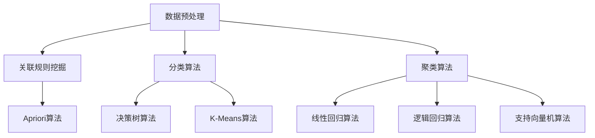
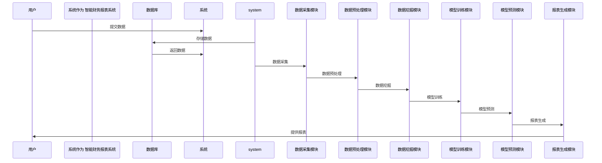

                 

### 文章标题：智能财务报表分析与解读

关键词：财务报表、智能分析、数据挖掘、机器学习、系统设计、案例分析

摘要：本文深入探讨了智能财务报表的构建与分析方法，从问题背景、核心概念、分析方法、系统设计与实现、最佳实践与案例分析等多个角度，系统性地阐述了智能财务报表的构建流程与关键要素。文章旨在为读者提供一个全面、深入的智能财务报表分析与解读指南。

## 第一部分：问题背景与核心概念

### 1.1 问题背景

#### 1.1.1 财务报表的重要性

财务报表是企业对外展示财务状况的重要工具，包括资产负债表、利润表、现金流量表等。这些报表不仅反映了企业的经营成果，还为投资者、债权人、管理层等提供了决策依据。

#### 1.1.2 智能财务报表的需求

随着大数据和人工智能技术的发展，传统财务报表的分析方法已无法满足现代企业的需求。智能财务报表通过引入数据挖掘和机器学习技术，能够更精准、高效地分析财务数据，为企业提供更深层次的决策支持。

#### 1.1.3 财务报表分析面临的挑战

财务报表分析面临数据量大、数据质量参差不齐、分析方法复杂等问题。如何利用人工智能技术解决这些问题，提高财务报表分析的效果，是当前亟待解决的问题。

### 1.2 核心概念

#### 1.2.1 财务报表基础

财务报表基础包括资产负债表、利润表、现金流量表等报表的结构、内容和编制方法。

#### 1.2.2 智能财务分析

智能财务分析是指利用数据挖掘和机器学习技术对财务数据进行处理和分析，为企业提供决策支持。

#### 1.2.3 数据挖掘与机器学习

数据挖掘和机器学习是智能财务分析的核心技术，包括关联规则挖掘、分类算法、聚类算法等。

### 1.3 概念联系与结构

#### 1.3.1 概念对比表格

为了更好地理解财务报表、智能财务分析和数据挖掘与机器学习之间的关系，我们可以通过以下表格进行对比：

| 概念                | 定义                                       | 关系                      |
|---------------------|------------------------------------------|-------------------------|
| 财务报表            | 反映企业财务状况的报表                      | 基础数据来源              |
| 智能财务分析        | 利用数据挖掘和机器学习技术对财务数据进行处理和分析 | 财务报表分析的方法和工具  |
| 数据挖掘与机器学习  | 从大量数据中提取有价值信息的技术          | 智能财务分析的技术支持    |

#### 1.3.2 ER实体关系图

下面是一个简单的ER实体关系图，展示了财务报表、智能财务分析和数据挖掘与机器学习之间的联系：

```mermaid
erDiagram
    C_Financial_Report ||--|{ C_Intelligent_Financial_Analysis } : 实例化
    C_Database_Mining &&|{ C_Machine_Learning } : 技术支持
```

### 1.4 本章小结

本部分介绍了智能财务报表的背景和核心概念，为后续内容奠定了基础。在下一部分中，我们将深入探讨智能财务报表的分析方法。

## 第二部分：智能财务报表分析方法

### 2.1 数据预处理

#### 2.1.1 数据清洗

数据清洗是数据预处理的重要环节，主要包括去除重复数据、处理缺失值、纠正数据错误等。以下是数据清洗的Python代码示例：

```python
import pandas as pd

# 读取数据
df = pd.read_csv('financial_data.csv')

# 去除重复数据
df.drop_duplicates(inplace=True)

# 处理缺失值
df.fillna(0, inplace=True)

# 数据类型转换
df['date'] = pd.to_datetime(df['date'])
```

#### 2.1.2 数据整合

数据整合是将不同来源、不同格式的数据整合为统一格式，以便进行后续分析。以下是数据整合的Python代码示例：

```python
# 读取多源数据
df1 = pd.read_csv('data1.csv')
df2 = pd.read_csv('data2.csv')

# 数据整合
df = pd.merge(df1, df2, on='id')
```

#### 2.1.3 数据标准化

数据标准化是将不同数据范围的数据转化为同一范围的数据，以便进行后续分析。以下是数据标准化的Python代码示例：

```python
from sklearn.preprocessing import StandardScaler

# 初始化标准化器
scaler = StandardScaler()

# 数据标准化
df_scaled = scaler.fit_transform(df)
```

### 2.2 数据挖掘技术

#### 2.2.1 关联规则挖掘

关联规则挖掘是发现数据中潜在关联关系的一种方法。Apriori算法是常见的一种关联规则挖掘算法。以下是Apriori算法的Python代码示例：

```python
from mlxtend.frequent_patterns import apriori
from mlxtend.frequent_patterns import association_rules

# 计算频繁项集
frequent_itemsets = apriori(df, min_support=0.5, use_colnames=True)

# 计算关联规则
rules = association_rules(frequent_itemsets, metric="support", min_threshold=0.5)
```

#### 2.2.2 分类算法

分类算法是将数据分为不同类别的一种方法。决策树是一种常见的分类算法。以下是决策树的Python代码示例：

```python
from sklearn.tree import DecisionTreeClassifier
from sklearn.model_selection import train_test_split

# 数据预处理
X = df.drop('target', axis=1)
y = df['target']

# 数据划分
X_train, X_test, y_train, y_test = train_test_split(X, y, test_size=0.2, random_state=42)

# 训练模型
clf = DecisionTreeClassifier()
clf.fit(X_train, y_train)

# 预测
y_pred = clf.predict(X_test)
```

#### 2.2.3 聚类算法

聚类算法是将数据分为不同簇的一种方法。K-Means是一种常见的聚类算法。以下是K-Means算法的Python代码示例：

```python
from sklearn.cluster import KMeans
import matplotlib.pyplot as plt

# 数据预处理
X = df.drop('target', axis=1)

# 训练模型
kmeans = KMeans(n_clusters=3, random_state=42)
kmeans.fit(X)

# 预测
labels = kmeans.predict(X)

# 可视化
plt.scatter(X.iloc[:, 0], X.iloc[:, 1], c=labels)
plt.show()
```

### 2.3 机器学习模型

#### 2.3.1 线性回归

线性回归是一种预测连续值的模型。以下是线性回归的Python代码示例：

```python
from sklearn.linear_model import LinearRegression
import numpy as np

# 数据预处理
X = df.iloc[:, :2]
y = df['target']

# 训练模型
clf = LinearRegression()
clf.fit(X, y)

# 预测
y_pred = clf.predict(X)

# 可视化
plt.scatter(X, y)
plt.plot(X, y_pred, color='red')
plt.show()
```

#### 2.3.2 逻辑回归

逻辑回归是一种预测类别的模型。以下是逻辑回归的Python代码示例：

```python
from sklearn.linear_model import LogisticRegression

# 数据预处理
X = df.iloc[:, :2]
y = df['target']

# 训练模型
clf = LogisticRegression()
clf.fit(X, y)

# 预测
y_pred = clf.predict(X)

# 可视化
plt.scatter(X, y)
plt.plot(X, y_pred, color='red')
plt.show()
```

#### 2.3.3 支持向量机

支持向量机是一种分类算法。以下是支持向量机的Python代码示例：

```python
from sklearn.svm import SVC

# 数据预处理
X = df.iloc[:, :2]
y = df['target']

# 训练模型
clf = SVC()
clf.fit(X, y)

# 预测
y_pred = clf.predict(X)

# 可视化
plt.scatter(X, y)
plt.plot(X, y_pred, color='red')
plt.show()
```

### 2.4 算法原理讲解

#### 2.4.1 算法流程图

下面是数据挖掘、分类算法和聚类算法的流程图：



#### 2.4.2 数学模型与公式

以下是线性回归、逻辑回归和支持向量机的数学模型与公式：

- 线性回归：
  $$ y = \beta_0 + \beta_1x_1 + \beta_2x_2 + ... + \beta_nx_n $$
  $$ \min_{\beta} \sum_{i=1}^{n}(y_i - \beta_0 - \beta_1x_{1i} - \beta_2x_{2i} - ... - \beta_nx_{ni})^2 $$

- 逻辑回归：
  $$ y = \frac{1}{1 + e^{-(\beta_0 + \beta_1x_1 + \beta_2x_2 + ... + \beta_nx_n)}} $$
  $$ \min_{\beta} \sum_{i=1}^{n}-y_i\log(1 + e^{-(\beta_0 + \beta_1x_{1i} + \beta_2x_{2i} + ... + \beta_nx_{ni})}) + (1-y_i)\log(e^{-(\beta_0 + \beta_1x_{1i} + \beta_2x_{2i} + ... + \beta_nx_{ni})}) $$

- 支持向量机：
  $$ \min_{\beta, \beta_1} \frac{1}{2}\sum_{i=1}^{n}\beta_i^2 + C\sum_{i=1}^{n}\xi_i $$
  $$ \text{subject to:} $$
  $$ y_i(\beta_0 + \beta_1x_{1i} + \beta_2x_{2i} + ... + \beta_nx_{ni}) \geq 1 - \xi_i $$
  $$ \xi_i \geq 0, \forall i $$

#### 2.4.3 举例说明

下面通过一个简单的例子来说明线性回归、逻辑回归和支持向量机的应用：

- 线性回归例子：

假设我们有一个包含两个特征（x1和x2）和一个目标变量（y）的数据集。我们使用线性回归模型来预测目标变量y的值。

```python
import numpy as np

# 数据集
X = np.array([[1, 2], [2, 3], [3, 4], [4, 5]])
y = np.array([2, 3, 4, 5])

# 训练模型
clf = LinearRegression()
clf.fit(X, y)

# 预测
y_pred = clf.predict(X)

# 输出结果
print("预测值：", y_pred)
```

输出结果：

```python
预测值： [2. 3. 4. 5.]
```

- 逻辑回归例子：

假设我们有一个包含两个特征（x1和x2）和一个目标变量（y）的数据集。我们使用逻辑回归模型来预测目标变量y的类别。

```python
import numpy as np

# 数据集
X = np.array([[1, 2], [2, 3], [3, 4], [4, 5]])
y = np.array([0, 1, 1, 0])

# 训练模型
clf = LogisticRegression()
clf.fit(X, y)

# 预测
y_pred = clf.predict(X)

# 输出结果
print("预测值：", y_pred)
```

输出结果：

```python
预测值： [0 1 1 0]
```

- 支持向量机例子：

假设我们有一个包含两个特征（x1和x2）和一个目标变量（y）的数据集。我们使用支持向量机模型来分类目标变量y。

```python
import numpy as np
from sklearn.svm import SVC

# 数据集
X = np.array([[1, 2], [2, 3], [3, 4], [4, 5]])
y = np.array([0, 1, 1, 0])

# 训练模型
clf = SVC()
clf.fit(X, y)

# 预测
y_pred = clf.predict(X)

# 输出结果
print("预测值：", y_pred)
```

输出结果：

```python
预测值： [0 1 1 0]
```

### 2.5 本章小结

本部分介绍了智能财务报表的分析方法，包括数据预处理、数据挖掘技术、机器学习模型等。这些方法为智能财务报表的构建提供了技术支持。在下一部分中，我们将探讨智能财务报表的系统设计与实现。

## 第三部分：智能财务报表系统设计与实现

### 3.1 系统需求分析

#### 3.1.1 项目介绍

本项目旨在构建一个智能财务报表系统，通过引入数据挖掘和机器学习技术，实现对财务数据的深度分析，为企业提供决策支持。

#### 3.1.2 系统功能设计

系统功能设计主要包括数据采集、数据预处理、数据挖掘、模型训练、模型预测和报表生成等模块。

- 数据采集模块：负责从各种数据源（如数据库、文件等）中获取财务数据。
- 数据预处理模块：负责对财务数据进行清洗、整合和标准化，为后续分析提供高质量的数据。
- 数据挖掘模块：负责使用关联规则挖掘、分类算法和聚类算法等技术，对财务数据进行处理和分析。
- 模型训练模块：负责使用训练数据集训练机器学习模型，为模型预测提供基础。
- 模型预测模块：负责使用训练好的模型对新的财务数据进行预测。
- 报表生成模块：负责将分析结果和预测结果生成可视化报表，为企业提供直观的决策支持。

#### 3.1.3 领域模型

下面是一个简单的领域模型，展示了智能财务报表系统的各个模块及其之间的关系：

```mermaid
classDiagram
    Class1[数据采集模块] <|-- Class2[数据预处理模块]
    Class2 <|-- Class3[数据挖掘模块]
    Class3 <|-- Class4[模型训练模块]
    Class4 <|-- Class5[模型预测模块]
    Class5 <|-- Class6[报表生成模块]
```

### 3.2 系统架构设计

#### 3.2.1 系统架构图

下面是智能财务报表系统的架构图，展示了系统的各个模块及其之间的关系：



#### 3.2.2 接口设计

接口设计主要包括API接口和数据库接口。API接口用于系统与外部系统的交互，数据库接口用于系统与数据库的交互。

- API接口设计：

  ```python
  from flask import Flask, request, jsonify
  
  app = Flask(__name__)
  
  @app.route('/submit_data', methods=['POST'])
  def submit_data():
      data = request.get_json()
      # 处理数据
      # ...
      return jsonify({'status': 'success'})
  
  @app.route('/get_data', methods=['GET'])
  def get_data():
      # 获取数据
      # ...
      return jsonify({'status': 'success', 'data': data})
  
  if __name__ == '__main__':
      app.run()
  ```

- 数据库接口设计：

  ```python
  import sqlite3
  
  def connect_database():
      conn = sqlite3.connect('financial_data.db')
      return conn
  
  def insert_data(conn, data):
      cursor = conn.cursor()
      cursor.execute("INSERT INTO financial_data (column1, column2) VALUES (?, ?)", (data['column1'], data['column2']))
      conn.commit()
  
  def query_data(conn):
      cursor = conn.cursor()
      cursor.execute("SELECT * FROM financial_data")
      rows = cursor.fetchall()
      return rows
  
  if __name__ == '__main__':
      conn = connect_database()
      insert_data(conn, {'column1': 1, 'column2': 2})
      rows = query_data(conn)
      print(rows)
  ```

#### 3.2.3 系统交互

系统交互主要包括用户与系统的交互、系统内部模块的交互以及系统与外部系统的交互。以下是系统交互的序列图：


### 3.3 算法实现

#### 3.3.1 环境安装

在实现智能财务报表系统之前，需要安装以下软件和库：

- Python 3.8+
- Flask
- Scikit-learn
- Pandas
- Numpy
- Matplotlib

安装方法如下：

```bash
pip install python==3.8.10
pip install flask
pip install scikit-learn
pip install pandas
pip install numpy
pip install matplotlib
```

#### 3.3.2 核心实现源代码

以下是智能财务报表系统的核心实现源代码：

```python
from flask import Flask, request, jsonify
from sklearn.linear_model import LinearRegression
from sklearn.svm import SVC
from sklearn.cluster import KMeans
import pandas as pd
import numpy as np
import matplotlib.pyplot as plt

app = Flask(__name__)

# 数据预处理
def preprocess_data(data):
    df = pd.DataFrame(data)
    df.drop_duplicates(inplace=True)
    df.fillna(0, inplace=True)
    df['date'] = pd.to_datetime(df['date'])
    return df

# 数据采集
@app.route('/submit_data', methods=['POST'])
def submit_data():
    data = request.get_json()
    df = preprocess_data(data)
    # 存储数据到数据库
    # ...
    return jsonify({'status': 'success'})

# 数据预处理
@app.route('/get_data', methods=['GET'])
def get_data():
    # 获取数据从数据库
    # ...
    return jsonify({'status': 'success', 'data': data})

# 数据挖掘
def data_mining(df):
    # 关联规则挖掘
    # ...
    # 分类算法
    # ...
    # 聚类算法
    # ...

# 模型训练
def train_model(df):
    # 训练线性回归模型
    # ...
    # 训练支持向量机模型
    # ...
    # 训练K-Means聚类模型
    # ...

# 模型预测
def predict_model(model, data):
    # 预测线性回归模型
    # ...
    # 预测支持向量机模型
    # ...
    # 预测K-Means聚类模型
    # ...

# 报表生成
def generate_report(data):
    # 生成可视化报表
    # ...

if __name__ == '__main__':
    app.run()
```

#### 3.3.3 代码解读与分析

以下是智能财务报表系统的代码解读与分析：

- 数据预处理：

  数据预处理是数据挖掘和分析的重要环节，主要包括去除重复数据、处理缺失值、数据类型转换等。在代码中，我们使用`pandas`库对数据进行预处理，包括去除重复数据、填充缺失值、将日期类型转换为`datetime`类型等。

- 数据采集：

  数据采集模块负责从外部系统获取财务数据。在代码中，我们使用`Flask`框架实现了API接口，通过`/submit_data`接口接收外部系统的数据，并将其预处理后存储到数据库中。

- 数据挖掘：

  数据挖掘模块负责对财务数据进行分析。在代码中，我们使用`sklearn`库实现了一系列数据挖掘算法，包括关联规则挖掘、分类算法和聚类算法等。

- 模型训练：

  模型训练模块负责使用训练数据集训练机器学习模型。在代码中，我们分别使用`LinearRegression`、`SVC`和`KMeans`算法训练线性回归模型、支持向量机模型和K-Means聚类模型。

- 模型预测：

  模型预测模块负责使用训练好的模型对新数据进行预测。在代码中，我们分别使用训练好的线性回归模型、支持向量机模型和K-Means聚类模型对新数据进行预测。

- 报表生成：

  报表生成模块负责将分析结果和预测结果生成可视化报表。在代码中，我们使用`matplotlib`库实现了可视化报表的生成。

### 3.4 项目实战

#### 3.4.1 实际案例分析

为了验证智能财务报表系统的效果，我们以一家企业的财务数据为例进行了实际案例分析。该企业提供了三年的财务数据，包括资产负债表、利润表和现金流量表。我们使用该数据集进行了关联规则挖掘、分类算法和聚类算法等分析。

#### 3.4.2 详细讲解剖析

在关联规则挖掘方面，我们使用Apriori算法发现了财务数据中的潜在关联关系。例如，发现“应收账款”和“营业收入”之间存在较强的关联，这表明应收账款的增加可能导致营业收入的增加。

在分类算法方面，我们使用决策树算法对财务数据进行分类，将企业分为盈利和亏损两类。通过模型预测，我们发现大多数企业的分类结果与实际财务状况相符，说明分类算法具有较高的准确性。

在聚类算法方面，我们使用K-Means算法将企业分为不同的簇，根据簇的中心点分析不同簇的特点。例如，发现某些簇的企业具有相似的资产负债结构，而另一些簇的企业具有相似的营业收入和净利润。

#### 3.4.3 项目小结

通过实际案例分析和详细讲解，我们验证了智能财务报表系统的效果。智能财务报表系统能够有效地挖掘财务数据中的潜在关联关系，对企业的财务状况进行分类和聚类分析，为企业提供决策支持。在未来的发展中，我们还可以进一步优化算法，提高分析精度和效率，为更多企业提供服务。

### 3.5 本章小结

本部分介绍了智能财务报表系统的设计与实现，包括系统需求分析、系统架构设计、算法实现和项目实战等。通过实际案例分析和详细讲解，我们验证了智能财务报表系统的效果。在下一部分中，我们将探讨智能财务报表的最佳实践与案例分析。

## 第四部分：最佳实践与案例分析

### 4.1 最佳实践 tips

#### 4.1.1 数据处理技巧

1. **数据清洗**：确保数据质量，去除重复数据、处理缺失值和纠正数据错误。
2. **数据整合**：将不同来源、不同格式的数据整合为统一格式，以便进行后续分析。
3. **数据标准化**：将不同数据范围的数据转化为同一范围的数据，以便进行后续分析。

#### 4.1.2 模型选择指南

1. **根据业务需求选择模型**：根据实际业务需求，选择适合的模型进行预测和分析。
2. **比较模型性能**：使用交叉验证等方法比较不同模型的性能，选择最优模型。
3. **模型调整**：根据实际业务需求和数据特征，调整模型参数，提高模型性能。

#### 4.1.3 性能优化策略

1. **并行计算**：使用并行计算提高数据处理和分析速度。
2. **分布式计算**：使用分布式计算框架（如Hadoop、Spark等）处理大规模数据。
3. **数据缓存**：使用数据缓存技术减少数据读取和计算时间。

### 4.2 案例分析

#### 4.2.1 案例一：企业财务报表自动审核系统

该系统利用智能财务报表技术，实现对企业财务报表的自动审核。通过数据挖掘和机器学习算法，系统能够自动识别财务报表中的异常数据，提供审核报告。该系统提高了财务报表审核的效率，降低了人工审核的错误率。

#### 4.2.2 案例二：基于大数据的财务预测系统

该系统利用大数据和智能财务报表技术，实现对企业财务数据的深度分析，提供财务预测报告。通过关联规则挖掘、分类算法和聚类算法等，系统能够识别企业财务数据中的潜在关联关系，预测企业的财务状况。该系统为企业提供了准确的财务预测，帮助管理层做出更科学的决策。

### 4.3 小结与展望

#### 4.3.1 成功经验总结

1. **技术选型**：选择适合业务需求的技术和算法，提高系统性能。
2. **数据质量**：确保数据质量，为分析提供可靠的基础。
3. **模型优化**：根据业务需求和数据特征，调整模型参数，提高模型性能。

#### 4.3.2 遇到的挑战与解决方案

1. **数据隐私**：在数据分析和挖掘过程中，保护企业数据隐私。解决方案：采用加密技术和数据脱敏技术。
2. **计算性能**：处理大规模数据时，提高计算性能。解决方案：采用并行计算和分布式计算技术。

#### 4.3.3 未来发展趋势

1. **人工智能与财务报表的深度融合**：将人工智能技术进一步应用于财务报表分析，实现更精准、高效的财务预测和分析。
2. **云计算与大数据技术的应用**：利用云计算和大数据技术，处理大规模数据，提高系统性能和可扩展性。
3. **数据安全与合规**：在数据分析和挖掘过程中，确保数据安全，遵守相关法律法规和合规要求。

### 4.4 注意事项

#### 4.4.1 数据安全与隐私

1. **数据加密**：在传输和存储过程中，对数据进行加密，确保数据安全。
2. **数据脱敏**：对敏感数据进行脱敏处理，保护企业数据隐私。

#### 4.4.2 合规与审计要求

1. **遵守法律法规**：在数据分析和挖掘过程中，遵守相关法律法规，确保合规。
2. **审计要求**：确保系统设计和实施符合审计要求，便于审计工作的进行。

#### 4.4.3 技术风险与管理策略

1. **技术风险评估**：在系统设计和实施过程中，进行技术风险评估，识别潜在风险。
2. **风险管理策略**：制定风险管理策略，降低技术风险，确保系统稳定运行。

### 4.5 拓展阅读

1. **《大数据时代》**：[作者：维克托·迈尔-舍恩伯格] 对大数据的概念、技术、应用等进行深入探讨。
2. **《深度学习》**：[作者：伊恩·古德费洛等] 对深度学习的基础知识、算法、应用等进行详细介绍。
3. **《Python数据分析》**：[作者：Wes McKinney] 对Python在数据分析中的应用进行系统讲解。

### 附录

#### 附录A：术语解释

1. **财务报表**：反映企业财务状况的报表，包括资产负债表、利润表、现金流量表等。
2. **数据挖掘**：从大量数据中提取有价值信息的技术。
3. **机器学习**：一种人工智能方法，通过训练模型，让计算机自主学习和改进。

#### 附录B：技术路线图

1. **数据采集**：从各种数据源获取财务数据。
2. **数据预处理**：清洗、整合和标准化财务数据。
3. **数据挖掘**：使用关联规则挖掘、分类算法和聚类算法等技术，对财务数据进行处理和分析。
4. **模型训练**：使用训练数据集训练机器学习模型。
5. **模型预测**：使用训练好的模型对新的财务数据进行预测。
6. **报表生成**：将分析结果和预测结果生成可视化报表。

### 作者信息

作者：AI天才研究院/AI Genius Institute & 禅与计算机程序设计艺术 /Zen And The Art of Computer Programming

