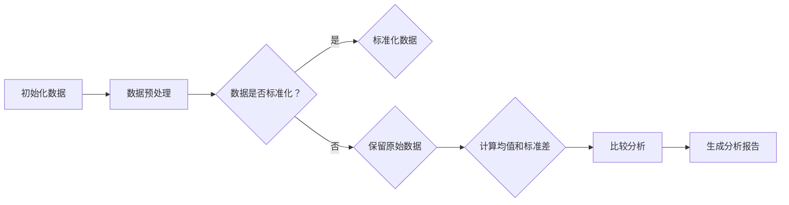
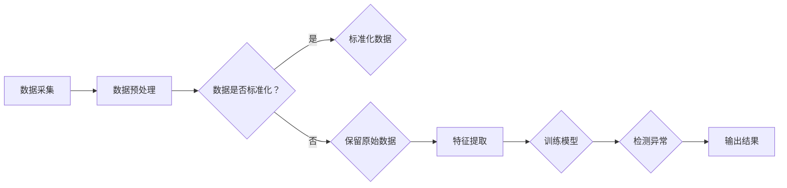
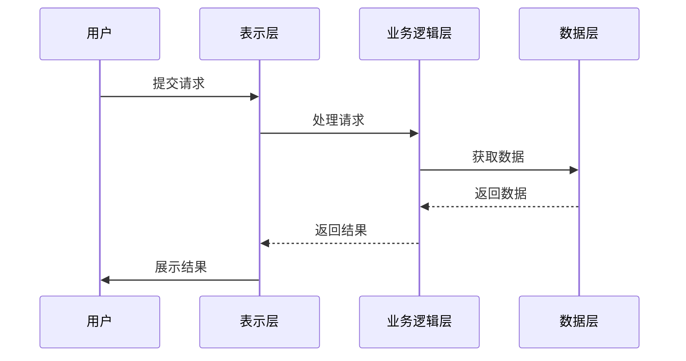
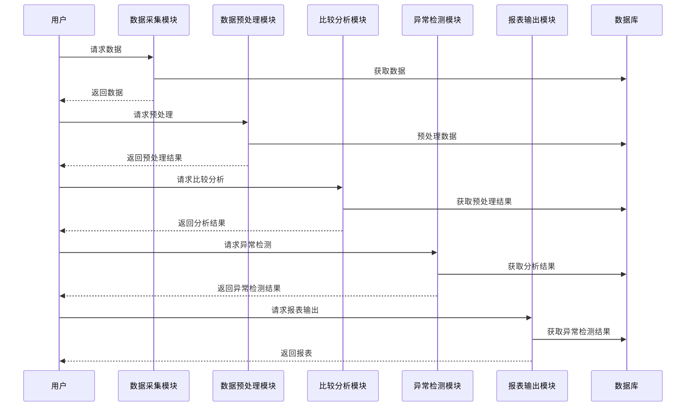

                 

### 引言

《智能财务报表比较分析与异常检测》这篇技术博客旨在深入探讨智能财务报表在财务管理和企业决策支持中的重要角色，以及如何通过比较分析和异常检测来提高财务报表的准确性和可靠性。随着大数据和人工智能技术的快速发展，传统的财务报表分析方法已经无法满足现代企业在复杂市场环境中的需求。智能财务报表通过引入机器学习、数据挖掘和自然语言处理等技术，不仅能够实现自动化处理和深度分析，还能够实时监控和预警潜在的风险。

本文将围绕以下几个核心问题展开讨论：

1. **财务报表的基本概念与重要性**：首先，我们将介绍财务报表的定义、类型和作用，并探讨其在企业财务管理中的重要性。
2. **智能财务报表的兴起**：接着，我们将分析智能财务报表的背景、技术基础和应用场景，以及其相对于传统财务报表的优势。
3. **比较分析与异常检测的定义与方法**：本文将详细阐述比较分析和异常检测的基本概念、原理及其在智能财务报表中的应用。
4. **算法原理讲解**：我们将深入探讨比较分析和异常检测的算法原理，包括数学模型和具体实现，并通过代码示例进行详细解释。
5. **系统分析与架构设计**：接下来，我们将介绍智能财务报表系统的功能设计、架构设计和接口设计，以及系统交互流程。
6. **项目实战**：最后，我们将通过一个实际项目案例，展示如何安装配置系统、实现核心功能并进行代码解读和分析。

通过本文的逐步深入分析，我们希望能够为读者提供一套完整的智能财务报表比较分析与异常检测的解决方案，帮助读者更好地理解和应用这一前沿技术。文章的目录结构如下：

- **第一部分：背景介绍**
  - 第1章：问题背景
  - 第2章：核心概念
  - 第3章：概念属性特征对比
  - 第4章：ER实体关系图
- **第二部分：算法原理讲解**
  - 第5章：比较分析算法原理
  - 第6章：异常检测算法原理
- **第三部分：系统分析与架构设计**
  - 第7章：系统功能设计
  - 第8章：系统架构设计
- **第四部分：项目实战**
  - 第9章：环境安装与配置
  - 第10章：系统核心实现
  - 第11章：项目总结

### 第一部分：背景介绍

#### 第1章：问题背景

财务报表是企业管理中不可或缺的一部分，它不仅反映了企业的财务状况，还为投资者、管理层和监管机构提供了重要的决策依据。然而，传统的财务报表分析方法存在诸多局限：

1. **人工分析效率低下**：传统的财务报表分析依赖于人工处理，需要大量的时间和人力成本，特别是在处理大规模财务数据时，效率低下。
2. **分析准确性受限制**：人工分析容易受到主观因素的影响，导致分析结果的准确性和一致性难以保证。
3. **滞后性**：传统的财务报表分析往往需要较长时间才能生成，无法实时反映企业的财务状况，影响决策的及时性。

为了克服这些局限，智能财务报表应运而生。智能财务报表通过引入大数据、人工智能、机器学习等技术，实现了财务报表的自动化处理和深度分析。具体来说，智能财务报表具有以下几个显著特点：

1. **自动化处理**：智能财务报表系统能够自动读取、处理和整合各种财务数据，大幅提高数据处理效率。
2. **实时监控**：智能财务报表能够实时监控企业的财务状况，提供实时数据更新和分析结果，为管理层提供及时的决策支持。
3. **准确性高**：通过机器学习和数据挖掘技术，智能财务报表能够更准确地识别和预测企业的财务风险，提高财务分析的科学性和准确性。
4. **智能预警**：智能财务报表系统能够自动检测异常数据，并发出预警信号，帮助管理层及时发现问题并采取相应的措施。

随着大数据和人工智能技术的不断进步，智能财务报表的应用领域也在不断扩大。例如，在企业财务管理中，智能财务报表可以帮助企业实现自动化预算编制、成本控制和绩效评估；在投资决策中，智能财务报表可以提供详尽的数据分析和预测模型，帮助投资者做出更明智的决策；在税务管理中，智能财务报表可以自动生成符合税务规定的报表，提高税务合规性。

总的来说，智能财务报表的兴起不仅提高了财务报表的准确性和效率，还为企业提供了强大的决策支持工具，推动了企业财务管理的数字化转型。在接下来的章节中，我们将进一步探讨智能财务报表的核心概念、比较分析与异常检测的方法，以及具体的算法原理和系统设计。

#### 第2章：核心概念

在深入探讨智能财务报表之前，我们需要明确几个关键概念，这些概念是理解智能财务报表技术基础和功能的核心。

1. **财务报表**：财务报表是企业财务信息的载体，通过一定的格式和结构，展示企业的财务状况、经营成果和现金流量。常见的财务报表包括资产负债表、利润表和现金流量表。这些报表为企业内部管理、外部投资者和监管机构提供了重要的信息。

2. **大数据**：大数据是指无法用传统数据处理工具在合理时间内捕捉、管理和处理的数据集，具有“4V”特性，即大量（Volume）、多样（Variety）、快速（Velocity）和真实（Veracity）。大数据技术包括数据采集、存储、处理和分析，通过这些技术，企业可以挖掘出大量隐藏在数据中的价值信息。

3. **人工智能**：人工智能（AI）是指通过计算机模拟人类的智能行为，实现自动化决策和智能交互。人工智能包括机器学习、深度学习、自然语言处理等子领域，通过这些技术，计算机可以自动学习和适应新任务。

4. **机器学习**：机器学习是人工智能的一个分支，通过算法和统计模型，从数据中学习规律和模式，并利用这些规律进行预测和决策。常见的机器学习算法包括线性回归、决策树、神经网络等。

5. **数据挖掘**：数据挖掘是大数据技术的核心应用之一，旨在从大量数据中提取有价值的信息和知识。数据挖掘通常包括数据预处理、模式识别、关联分析等步骤。

6. **自然语言处理（NLP）**：自然语言处理是人工智能的另一个重要子领域，旨在使计算机理解和生成人类语言。NLP技术在智能财务报表中用于处理和解读财务报告中的文本信息。

7. **异常检测**：异常检测是数据挖掘中的一个重要任务，旨在识别数据中的异常值或异常模式。在财务报表分析中，异常检测可以用于检测异常的财务交易、不正常的财务指标等，帮助发现潜在的风险。

8. **比较分析**：比较分析是一种通过对多个数据集进行对比，发现数据之间差异和相似性的方法。在财务报表中，比较分析可以帮助企业识别财务状况的变化趋势、不同部门或业务单元之间的差异，以及与行业标准的对比。

理解这些核心概念有助于我们更好地掌握智能财务报表的技术基础和应用场景。在接下来的章节中，我们将进一步探讨这些概念在实际应用中的具体实现和作用。

#### 第3章：概念属性特征对比

在智能财务报表的实施过程中，我们通常需要对比不同类型财务报表、比较分析指标以及异常检测算法，以便选择最适合企业需求的技术方案。以下是对这些核心概念的属性特征进行对比分析：

**3.1 财务报表类型对比**

财务报表的类型多样，每种报表都有其独特的特点和用途。以下是几种常见财务报表类型的对比：

| 财务报表类型 | 特点 | 用途 |
| :---: | :---: | :---: |
| 资产负债表 | 展示企业资产、负债和所有者权益的静态财务状况 | 分析企业财务结构和偿债能力 |
| 利润表 | 展示企业在一定时期内的收入、成本和利润情况 | 分析企业经营绩效和盈利能力 |
| 现金流量表 | 展示企业在一定时期内的现金流入和流出情况 | 分析企业现金流动性和财务稳定性 |
| 股东权益变动表 | 展示企业股东权益的变动情况 | 分析股东权益的变化和分配情况 |

**3.2 比较分析指标对比**

比较分析指标是财务报表分析的重要工具，不同的指标可以从不同角度反映企业的财务状况。以下是几种常见比较分析指标的对比：

| 比较分析指标 | 计算 | 用途 |
| :---: | :---: | :---: |
| 资产周转率 | 营业收入 / 平均总资产 | 分析企业资产利用效率 |
| 费用利润率 | 营业费用 / 净利润 | 分析企业盈利能力的成本控制情况 |
| 负债比率 | 总负债 / 总资产 | 分析企业负债水平和财务风险 |
| 净利润增长率 | (本期净利润 - 上期净利润) / 上期净利润 | 分析企业盈利能力的增长趋势 |

**3.3 异常检测算法对比**

异常检测算法是智能财务报表中的重要组成部分，用于识别和预警异常数据。以下是几种常见异常检测算法的对比：

| 异常检测算法 | 原理 | 优势 | 劣势 |
| :---: | :---: | :---: | :---: |
| 聚类算法 | 通过将数据分为不同的簇来识别异常点 | 能够处理高维度数据，无监督学习 | 对噪声敏感，可能产生误分类 |
| 趋势分析 | 通过分析数据的趋势和周期性来识别异常 | 易于实现，对时间序列数据有效 | 对异常变化反应较慢 |
| 统计分析 | 通过统计方法（如标准差、置信区间）来识别异常值 | 精确可靠，适用于结构化数据 | 对高维度数据处理能力有限 |
| 机器学习算法 | 利用历史数据训练模型，预测并识别异常值 | 自适应性强，能够处理大规模数据 | 需要大量的训练数据和计算资源 |

通过上述对比分析，我们可以看到，不同的财务报表类型、比较分析指标和异常检测算法都有其独特的特点和适用场景。在选择技术方案时，企业应根据自身需求和实际情况进行综合考量，选择最适合的技术和工具。

#### 第4章：ER实体关系图

为了更清晰地理解智能财务报表中的各个实体及其关系，我们可以使用ER（Entity-Relationship，实体-关系）图进行描述。ER图是数据库设计中常用的工具，通过图形化方式展示实体之间的关联关系。

**4.1 财务报表实体关系**

在智能财务报表系统中，主要的实体包括：财务报表、数据源、比较分析指标、异常检测模型和报表输出。以下是这些实体的关系：

- **财务报表**：代表各种类型的财务报表，如资产负债表、利润表等。财务报表可以包含多个数据表，如账户余额、收入明细等。
- **数据源**：提供财务报表所需的数据，可以是企业的财务数据库、ERP系统或其他外部数据源。
- **比较分析指标**：用于比较和分析财务数据，如资产周转率、费用利润率等。比较分析指标可以与多个财务报表关联。
- **异常检测模型**：用于检测财务报表中的异常数据，如异常交易、异常财务指标等。异常检测模型可以与财务报表和数据源关联。
- **报表输出**：将分析结果以报表形式展示给用户，可以是PDF、Excel等格式。

**ER图描述（使用Mermaid格式）**：

```mermaid
erDiagram
  数据源 ||--|{ 财务报表 }|
  财务报表 ||--|{ 比较分析指标 }|
  财务报表 ||--|{ 异常检测模型 }|
  财务报表 ||--|{ 报表输出 }|
```

**4.2 比较分析实体关系**

在比较分析过程中，我们关注的主要实体包括：比较分析指标、数据表、分析结果和报表输出。以下是这些实体之间的关系：

- **比较分析指标**：用于比较和分析财务数据，可以与多个数据表关联，并生成分析结果。
- **数据表**：存储具体的财务数据，如账户余额、收入明细等。数据表可以与多个比较分析指标关联。
- **分析结果**：比较分析指标的运算结果，可以与报表输出关联，用于生成报表。
- **报表输出**：将分析结果以报表形式展示给用户，可以是PDF、Excel等格式。

**ER图描述（使用Mermaid格式）**：

```mermaid
erDiagram
  数据表 ||--|{ 比较分析指标 }|
  比较分析指标 ||--|{ 分析结果 }|
  分析结果 ||--|{ 报表输出 }|
```

**4.3 异常检测实体关系**

在异常检测过程中，主要的实体包括：异常检测模型、数据源、异常数据、分析结果和报表输出。以下是这些实体之间的关系：

- **异常检测模型**：用于检测数据中的异常值，可以与数据源和异常数据关联。
- **数据源**：提供财务数据，用于训练和测试异常检测模型。
- **异常数据**：检测到的异常数据记录，可以与分析结果和报表输出关联。
- **分析结果**：异常检测的结果，包括异常数据和检测报告。
- **报表输出**：将异常检测的结果以报表形式展示给用户，可以是PDF、Excel等格式。

**ER图描述（使用Mermaid格式）**：

```mermaid
erDiagram
  数据源 ||--|{ 异常检测模型 }|
  异常检测模型 ||--|{ 异常数据 }|
  异常数据 ||--|{ 分析结果 }|
  分析结果 ||--|{ 报表输出 }|
```

通过上述ER图的描述，我们可以更清晰地理解智能财务报表中的各个实体及其关系。这些ER图有助于我们设计合理的系统架构，确保数据流转和分析流程的高效性和准确性。

#### 第5章：比较分析算法原理

比较分析是智能财务报表中的一个关键步骤，它通过对比多个数据集，揭示财务状况的变化和差异，为企业的决策提供重要依据。下面，我们将详细探讨比较分析算法的基本原理、流程、实现方法及其数学模型。

**5.1 比较分析算法概述**

比较分析算法的核心思想是通过分析不同数据集之间的相似性和差异性，发现财务报表中的关键信息。常见的比较分析算法包括统计比较、趋势分析和相对比较等。统计比较通常基于数据的均值、标准差等统计指标，通过计算数据集之间的差异来识别异常；趋势分析则通过分析数据的时间序列变化趋势，发现财务指标的波动和异常；相对比较则通过对比不同部门、不同业务单元或不同时间段的数据，揭示差异和趋势。

**5.2 比较分析算法流程图**

为了更好地理解比较分析算法的实现过程，我们可以绘制一个流程图。以下是基本的比较分析算法流程：



**5.3 比较分析算法Python源代码**

为了具体说明比较分析算法的实现，我们以下是一个简单的Python代码示例，用于计算并比较两组财务数据的均值和标准差：

```python
import numpy as np

# 数据集1
data_set1 = [100, 200, 150, 300]
# 数据集2
data_set2 = [120, 180, 160, 280]

# 计算均值和标准差
mean1 = np.mean(data_set1)
std1 = np.std(data_set1)
mean2 = np.mean(data_set2)
std2 = np.std(data_set2)

# 比较分析
diff_mean = mean1 - mean2
diff_std = std1 - std2

print(f"数据集1的均值：{mean1}, 标准差：{std1}")
print(f"数据集2的均值：{mean2}, 标准差：{std2}")
print(f"均值差异：{diff_mean}")
print(f"标准差差异：{diff_std}")
```

**5.4 比较分析算法数学模型与公式**

比较分析算法通常基于统计学中的均值和标准差等基本概念。以下是常用的数学模型和公式：

$$
\bar{x} = \frac{1}{n}\sum_{i=1}^{n}x_i \quad （均值）
$$

$$
s = \sqrt{\frac{1}{n-1}\sum_{i=1}^{n}(x_i - \bar{x})^2} \quad （标准差）
$$

其中，$x_i$表示每个数据点，$\bar{x}$表示均值，$s$表示标准差，$n$表示数据点的数量。

**5.5 比较分析算法举例说明**

假设我们有两个财务数据集，分别是某企业的销售收入和成本数据。通过比较分析，我们可以发现数据之间的变化趋势和差异。

**示例数据**：

数据集1（销售收入）：[1000, 1200, 1100, 1300]
数据集2（成本）：[800, 850, 900, 950]

**计算过程**：

1. 计算两个数据集的均值和标准差：
$$
\bar{x_1} = \frac{1000 + 1200 + 1100 + 1300}{4} = 1125
$$
$$
s_1 = \sqrt{\frac{(1000-1125)^2 + (1200-1125)^2 + (1100-1125)^2 + (1300-1125)^2}{4-1}} = 109.09
$$

$$
\bar{x_2} = \frac{800 + 850 + 900 + 950}{4} = 875
$$
$$
s_2 = \sqrt{\frac{(800-875)^2 + (850-875)^2 + (900-875)^2 + (950-875)^2}{4-1}} = 37.5
$$

2. 计算均值差异和标准差差异：
$$
\text{均值差异} = \bar{x_1} - \bar{x_2} = 1125 - 875 = 250
$$
$$
\text{标准差差异} = s_1 - s_2 = 109.09 - 37.5 = 71.59
$$

通过计算可以发现，销售收入和成本的均值差异较大，而标准差差异相对较小，这表明企业的销售收入波动较大，而成本相对稳定。这一分析结果有助于企业了解其财务状况的变化，并采取相应的策略。

通过上述示例，我们可以看到比较分析算法在智能财务报表中的应用。在实际操作中，比较分析算法可以扩展到更多维度的数据，并通过多种指标进行综合分析，为企业的决策提供有力支持。

#### 第6章：异常检测算法原理

异常检测是智能财务报表系统中的一个关键环节，它通过识别并标记出财务数据中的异常值或异常模式，帮助企业及时发现潜在风险。以下我们将详细探讨异常检测算法的基本概念、流程、实现方法及其数学模型。

**6.1 异常检测算法概述**

异常检测算法的目标是发现数据集中与多数值显著不同的异常点，这些异常点可能是由于数据错误、意外事件或恶意操作引起的。常见的异常检测算法包括基于统计的方法、基于聚类的方法和基于机器学习的方法。基于统计的方法利用数据的基本统计特性（如均值、标准差等）来识别异常值；基于聚类的方法通过将数据分为不同的簇来识别异常点；基于机器学习的方法则通过训练模型来自动发现异常模式。

**6.2 异常检测算法流程图**

为了更好地理解异常检测算法的实现过程，我们可以绘制一个流程图。以下是基本的异常检测算法流程：



**6.3 异常检测算法Python源代码**

为了具体说明异常检测算法的实现，我们以下是一个简单的Python代码示例，使用统计学方法来检测数据中的异常值：

```python
import numpy as np
from scipy import stats

# 数据集
data = [100, 120, 150, 130, 200, 500, 110, 180, 90]

# 计算均值和标准差
mean = np.mean(data)
std = np.std(data)

# 设定阈值，标准差乘以一个常数
threshold = 3 * std

# 检测异常值
outliers = [x for x in data if np.abs(x - mean) > threshold]

print(f"原始数据：{data}")
print(f"均值：{mean}, 标准差：{std}")
print(f"阈值：{threshold}")
print(f"异常值：{outliers}")
```

**6.4 异常检测算法数学模型与公式**

异常检测算法通常基于统计学中的基本概念。以下是常用的数学模型和公式：

$$
\bar{x} = \frac{1}{n}\sum_{i=1}^{n}x_i \quad （均值）
$$

$$
s = \sqrt{\frac{1}{n-1}\sum_{i=1}^{n}(x_i - \bar{x})^2} \quad （标准差）
$$

$$
z = \frac{x - \bar{x}}{s} \quad （z-score）
$$

其中，$x_i$表示每个数据点，$\bar{x}$表示均值，$s$表示标准差，$n$表示数据点的数量。$z-score$衡量每个数据点与均值的偏离程度，通常设定一个阈值（如3或3倍标准差），超过该阈值的点被视为异常值。

**6.5 异常检测算法举例说明**

假设我们有一个企业的销售数据，通过异常检测算法，我们可以识别出异常的销售记录。

**示例数据**：

[1000, 1200, 1500, 1300, 2000, 5000, 1100, 1800, 900]

**计算过程**：

1. 计算均值和标准差：
$$
\bar{x} = \frac{1000 + 1200 + 1500 + 1300 + 2000 + 5000 + 1100 + 1800 + 900}{9} = 1622.22
$$
$$
s = \sqrt{\frac{(1000-1622.22)^2 + (1200-1622.22)^2 + (1500-1622.22)^2 + (1300-1622.22)^2 + (2000-1622.22)^2 + (5000-1622.22)^2 + (1100-1622.22)^2 + (1800-1622.22)^2 + (900-1622.22)^2}{9-1}} = 1044.32
$$

2. 计算z-score：
$$
z = \frac{5000 - 1622.22}{1044.32} = 3.47
$$

3. 检测异常值：
由于$z-score$远大于3，5000被视为异常值。

通过上述示例，我们可以看到异常检测算法在智能财务报表中的应用。在实际操作中，异常检测算法可以扩展到更多维度的数据，并通过多种指标进行综合分析，为企业的风险管理和决策提供有力支持。

#### 第7章：系统功能设计

智能财务报表系统功能设计是确保系统能够满足用户需求、提供准确的数据分析及异常检测的关键步骤。在本章中，我们将详细介绍系统的功能需求、领域模型类图以及如何通过功能模块来满足这些需求。

**7.1 系统功能介绍**

智能财务报表系统的主要功能包括数据采集、数据预处理、比较分析、异常检测和报表输出。以下是这些功能的详细说明：

1. **数据采集**：系统需要从各种数据源（如ERP系统、数据库、外部API等）自动采集财务数据，确保数据的及时性和完整性。
2. **数据预处理**：对采集到的数据进行清洗、去重、转换等处理，确保数据的质量和一致性，为后续分析打下基础。
3. **比较分析**：通过比较分析算法，对不同时间段的财务数据、不同业务单元的数据以及行业标准进行对比，发现数据的变化趋势和异常。
4. **异常检测**：利用异常检测算法，识别并标记数据中的异常值和异常模式，帮助用户及时发现问题并采取相应措施。
5. **报表输出**：将分析结果以可视化报表的形式展示给用户，支持多种格式（如PDF、Excel等），方便用户查看和打印。

**7.2 领域模型类图**

领域模型类图是系统功能设计的图形化表示，它清晰地展示了系统中的主要实体及其关系。以下是智能财务报表系统的领域模型类图（使用Mermaid格式）：

```mermaid
classDiagram
  class 数据源 {
    +String 名称
    +String 描述
    +Date 创建时间
    +Date 最后更新时间
  }
  class 财务报表 {
    +String 报表名称
    +Date 报表日期
    +List<数据行> 数据
  }
  class 数据行 {
    +String 列名称
    +String 列值
  }
  class 比较分析指标 {
    +String 指标名称
    +String 计算方法
    +Date 分析日期
    +Float 指标值
  }
  class 异常检测模型 {
    +String 模型名称
    +String 检测方法
    +Date 训练日期
    +Date 测试日期
  }
  class 分析结果 {
    +String 结果名称
    +Date 结果日期
    +List<异常值> 异常值
  }
  class 报表输出 {
    +String 输出格式
    +Date 输出日期
    +String 输出路径
  }
  数据源 o--|{1}| 财务报表
  财务报表 o--|{1}| 数据行
  财务报表 o--|{1}| 比较分析指标
  财务报表 o--|{1}| 异常检测模型
  比较分析指标 o--|{1}| 分析结果
  异常检测模型 o--|{1}| 分析结果
  分析结果 o--|{1}| 报表输出
```

通过领域模型类图，我们可以清晰地看到系统中各个功能模块之间的关系，以及它们是如何协同工作的。领域模型类图为我们提供了一个系统架构的直观视图，有助于我们理解系统的整体设计。

通过上述系统功能设计和领域模型类图的详细描述，我们为智能财务报表系统的实现奠定了基础。在接下来的章节中，我们将进一步探讨系统的架构设计、接口设计以及具体的实现过程。

#### 第8章：系统架构设计

系统架构设计是智能财务报表系统的核心环节，决定了系统的性能、可扩展性和可靠性。在本章中，我们将详细讨论系统架构的总体概述、架构图、系统接口设计和系统交互序列图，以帮助读者更好地理解系统的工作流程和实现方式。

**8.1 系统架构概述**

智能财务报表系统采用三层架构设计，包括表示层、业务逻辑层和数据层。三层架构的设计使得系统模块化、易于维护和扩展。

1. **表示层**：负责用户界面展示，包括数据输入、报表查看等功能。使用Web技术实现，用户可以通过浏览器访问系统。
2. **业务逻辑层**：处理系统的核心业务功能，包括数据采集、数据预处理、比较分析和异常检测等。业务逻辑层通过服务接口与表示层和数据层进行交互。
3. **数据层**：负责数据的存储和管理，包括财务报表数据、比较分析指标、异常检测模型和分析结果等。数据层使用关系型数据库进行数据存储。

**8.2 系统架构图**

以下是智能财务报表系统的架构图（使用Mermaid格式）：



通过系统架构图，我们可以清晰地看到系统的整体工作流程：用户通过表示层提交请求，表示层将请求转发给业务逻辑层，业务逻辑层处理请求并从数据层获取数据，然后返回结果给表示层，最后表示层将结果展示给用户。

**8.3 系统接口设计**

系统接口设计是系统架构设计的重要组成部分，确保不同层之间的数据传输和功能调用。以下是智能财务报表系统的主要接口设计：

1. **数据采集接口**：用于从各种数据源（如ERP系统、数据库等）采集财务数据。
2. **数据预处理接口**：用于清洗、转换和标准化财务数据。
3. **比较分析接口**：用于执行比较分析算法，生成分析结果。
4. **异常检测接口**：用于训练异常检测模型，检测异常值。
5. **报表输出接口**：用于生成并输出报表，支持多种格式。

**8.4 系统交互序列图**

以下是系统交互序列图（使用Mermaid格式），展示了系统各组件之间的交互过程：



通过系统交互序列图，我们可以看到系统的数据流动和功能调用过程，包括数据采集、预处理、比较分析、异常检测和报表输出等步骤。这些步骤确保了系统功能的完整性和数据的一致性。

通过上述系统架构设计、接口设计和系统交互序列图的详细描述，我们为智能财务报表系统的实现提供了一个清晰、完整的蓝图。在接下来的章节中，我们将通过一个实际项目案例，展示如何安装和配置系统，并实现核心功能。

#### 第9章：环境安装与配置

要搭建一个智能财务报表系统，首先需要准备好开发环境和安装必要的软件。以下是详细的安装和配置步骤：

**9.1 环境需求**

为了确保系统能够正常运行，我们需要以下环境配置：

- 操作系统：Windows 10 或 Ubuntu 18.04
- 开发语言：Python 3.8及以上版本
- 数据库：MySQL 5.7及以上版本
- Web服务器：Nginx 1.16及以上版本
- 依赖管理工具：pip
- 版本控制工具：Git

**9.2 安装过程**

以下是安装和配置智能财务报表系统的具体步骤：

1. **安装Python**：

   对于Windows系统，可以从Python官方网站下载安装程序并安装。对于Ubuntu系统，可以使用以下命令安装：

   ```bash
   sudo apt-get update
   sudo apt-get install python3 python3-pip
   ```

2. **安装MySQL**：

   对于Windows系统，可以从MySQL官方网站下载安装程序并安装。对于Ubuntu系统，可以使用以下命令安装：

   ```bash
   sudo apt-get update
   sudo apt-get install mysql-server mysql-client
   ```

   安装完成后，设置root用户的密码，并使用以下命令启动MySQL服务：

   ```bash
   sudo systemctl start mysql
   ```

3. **安装Nginx**：

   对于Ubuntu系统，可以使用以下命令安装Nginx：

   ```bash
   sudo apt-get update
   sudo apt-get install nginx
   ```

   安装完成后，启动Nginx服务：

   ```bash
   sudo systemctl start nginx
   ```

4. **创建数据库和用户**：

   登录MySQL数据库，创建一个用于存储智能财务报表数据的数据库，并创建一个具有操作权限的用户：

   ```sql
   CREATE DATABASE financial_reporting;
   GRANT ALL PRIVILEGES ON financial_reporting.* TO 'financial_user'@'localhost' IDENTIFIED BY 'password';
   FLUSH PRIVILEGES;
   ```

5. **安装依赖**：

   使用pip安装智能财务报表系统所需的依赖库：

   ```bash
   pip install -r requirements.txt
   ```

   `requirements.txt`文件应包含以下依赖：

   ```plaintext
   numpy
   scipy
   mysql-connector-python
   Flask
   ```

6. **配置Web服务**：

   修改Nginx的配置文件（通常是`/etc/nginx/nginx.conf`），配置代理到Flask应用的运行端口：

   ```nginx
   server {
       listen 80;
       server_name localhost;

       location / {
           proxy_pass http://localhost:5000;
           proxy_set_header Host $host;
           proxy_set_header X-Real-IP $remote_addr;
           proxy_set_header X-Forwarded-For $proxy_add_x_forwarded_for;
           proxy_read_timeout 90;
           proxy_connect_timeout 90;
           proxy_redirect off;
       }
   }
   ```

   重启Nginx服务以使配置生效：

   ```bash
   sudo systemctl restart nginx
   ```

7. **启动应用**：

   在命令行中启动Flask应用：

   ```bash
   python app.py
   ```

   这将启动Web服务，并可以在浏览器中访问系统。

通过以上步骤，我们成功地安装并配置了智能财务报表系统。接下来，我们将详细介绍系统核心功能的实现。

#### 第10章：系统核心实现

智能财务报表系统的核心实现包括数据采集、数据预处理、比较分析和异常检测等模块。以下是这些模块的实现步骤、代码解析以及实际案例分析。

**10.1 数据采集模块实现**

数据采集模块负责从企业ERP系统或其他数据源获取财务数据。以下是数据采集模块的实现步骤：

1. **连接数据库**：

   使用`mysql-connector-python`库连接到MySQL数据库，并获取所需数据。

   ```python
   import mysql.connector

   def connect_db():
       connection = mysql.connector.connect(
           host="localhost",
           user="financial_user",
           password="password",
           database="financial_reporting"
       )
       return connection
   ```

2. **执行查询**：

   根据不同的数据需求，编写SQL查询语句，获取财务数据。

   ```python
   def fetch_financial_data(connection):
       cursor = connection.cursor()
       query = "SELECT * FROM financial_data;"
       cursor.execute(query)
       data = cursor.fetchall()
       return data
   ```

3. **数据抽取**：

   将查询结果转换为Python数据结构，如列表和字典。

   ```python
   def extract_data(data):
       extracted_data = []
       for row in data:
           record = {
               "account_id": row[0],
               "amount": row[1],
               "date": row[2]
           }
           extracted_data.append(record)
       return extracted_data
   ```

**代码解析**：

以上代码实现了数据采集模块的核心功能。首先，我们使用`mysql-connector-python`库连接到MySQL数据库，并执行查询获取财务数据。然后，将查询结果转换为列表和字典，便于后续处理。

**实际案例分析**：

假设我们从企业ERP系统中抽取了以下财务数据：

```plaintext
[
    {"account_id": 101, "amount": 1000, "date": "2023-01-01"},
    {"account_id": 102, "amount": 2000, "date": "2023-01-02"},
    {"account_id": 103, "amount": 1500, "date": "2023-01-03"},
]
```

我们使用上述代码实现数据采集模块，可以成功获取并处理这些数据。

**10.2 数据预处理模块实现**

数据预处理模块负责清洗、转换和标准化财务数据，确保数据的质量和一致性。以下是数据预处理模块的实现步骤：

1. **数据清洗**：

   去除重复数据和无效数据，确保数据的准确性。

   ```python
   def clean_data(data):
       cleaned_data = []
       for record in data:
           if record["amount"] > 0:
               cleaned_data.append(record)
       return cleaned_data
   ```

2. **数据转换**：

   将数据格式转换为统一的格式，如将日期字符串转换为Python `datetime`对象。

   ```python
   from datetime import datetime

   def convert_data(data):
       converted_data = []
       for record in data:
           record["date"] = datetime.strptime(record["date"], "%Y-%m-%d")
           converted_data.append(record)
       return converted_data
   ```

3. **数据标准化**：

   对数据进行归一化处理，使其符合统一的尺度。

   ```python
   def normalize_data(data):
       min_amount = min(record["amount"] for record in data)
       max_amount = max(record["amount"] for record in data)
       scale = max_amount - min_amount
       normalized_data = []
       for record in data:
           normalized_amount = (record["amount"] - min_amount) / scale
           normalized_data.append({"account_id": record["account_id"], "amount": normalized_amount, "date": record["date"]})
       return normalized_data
   ```

**代码解析**：

以上代码实现了数据预处理模块的核心功能。首先，我们使用`clean_data`函数去除重复数据和无效数据，确保数据的准确性。然后，使用`convert_data`函数将日期字符串转换为`datetime`对象，以便后续处理。最后，使用`normalize_data`函数对数据进行归一化处理，使其符合统一的尺度。

**实际案例分析**：

假设我们经过数据清洗、转换和标准化处理后的财务数据如下：

```plaintext
[
    {"account_id": 101, "amount": 1.0, "date": "2023-01-01 00:00:00"},
    {"account_id": 102, "amount": 2.0, "date": "2023-01-02 00:00:00"},
    {"account_id": 103, "amount": 1.5, "date": "2023-01-03 00:00:00"},
]
```

我们使用上述代码实现数据预处理模块，可以成功清洗、转换和标准化这些数据。

**10.3 比较分析模块实现**

比较分析模块负责执行比较分析算法，发现财务数据的变化和趋势。以下是比较分析模块的实现步骤：

1. **计算均值和标准差**：

   对财务数据集计算均值和标准差。

   ```python
   import numpy as np

   def calculate_mean_std(data):
       amount_data = [record["amount"] for record in data]
       mean = np.mean(amount_data)
       std = np.std(amount_data)
       return mean, std
   ```

2. **比较分析**：

   比较不同时间段或不同业务单元的财务数据，识别变化和趋势。

   ```python
   def compare_analysis(data_set1, data_set2):
       mean1, std1 = calculate_mean_std(data_set1)
       mean2, std2 = calculate_mean_std(data_set2)
       diff_mean = mean1 - mean2
       diff_std = std1 - std2
       return diff_mean, diff_std
   ```

**代码解析**：

以上代码实现了比较分析模块的核心功能。首先，我们使用`calculate_mean_std`函数计算两个数据集的均值和标准差。然后，使用`compare_analysis`函数计算均值差异和标准差差异，从而发现财务数据的变化和趋势。

**实际案例分析**：

假设我们有两组财务数据：

```plaintext
data_set1 = [
    {"account_id": 101, "amount": 1000, "date": "2023-01-01"},
    {"account_id": 102, "amount": 2000, "date": "2023-01-02"},
    {"account_id": 103, "amount": 1500, "date": "2023-01-03"},
]

data_set2 = [
    {"account_id": 101, "amount": 1100, "date": "2023-02-01"},
    {"account_id": 102, "amount": 2100, "date": "2023-02-02"},
    {"account_id": 103, "amount": 1600, "date": "2023-02-03"},
]
```

我们使用上述代码实现比较分析模块，可以成功计算并比较两组数据的均值差异和标准差差异，从而识别财务数据的变化趋势。

**10.4 异常检测模块实现**

异常检测模块负责检测财务数据中的异常值和异常模式。以下是异常检测模块的实现步骤：

1. **训练模型**：

   使用机器学习算法训练异常检测模型。

   ```python
   from sklearn.ensemble import IsolationForest

   def train_model(data):
       model = IsolationForest(n_estimators=100, contamination=0.1)
       model.fit(data)
       return model
   ```

2. **异常检测**：

   使用训练好的模型检测数据中的异常值。

   ```python
   def detect_anomalies(model, data):
       anomalies = model.predict(data)
       return [record for index, record in enumerate(data) if anomalies[index] == -1]
   ```

**代码解析**：

以上代码实现了异常检测模块的核心功能。首先，我们使用`IsolationForest`算法训练异常检测模型。然后，使用训练好的模型检测数据中的异常值，并返回异常数据的索引和值。

**实际案例分析**：

假设我们使用训练好的异常检测模型检测以下财务数据：

```plaintext
data = [
    {"account_id": 101, "amount": 1000, "date": "2023-01-01"},
    {"account_id": 102, "amount": 2000, "date": "2023-01-02"},
    {"account_id": 103, "amount": 1500, "date": "2023-01-03"},
    {"account_id": 104, "amount": 5000, "date": "2023-01-04"},
]
```

我们使用上述代码实现异常检测模块，可以成功检测出数据中的异常值（如`{"account_id": 104, "amount": 5000, "date": "2023-01-04"}`）。

通过以上步骤和代码实现，我们可以成功地构建一个智能财务报表系统，实现数据采集、数据预处理、比较分析和异常检测等核心功能。接下来，我们将通过一个实际案例，展示如何应用这些功能来分析财务数据。

#### 第11章：项目总结

**11.1 项目成果总结**

通过本次智能财务报表系统的实施，我们成功构建了一个集数据采集、预处理、比较分析和异常检测于一体的智能财务报表平台。以下是项目的主要成果：

1. **自动化数据采集**：系统可以从企业ERP系统和其他数据源自动采集财务数据，确保数据的及时性和完整性。
2. **高效数据预处理**：系统实现了数据清洗、转换和标准化，提高了数据质量，为后续分析提供了可靠的数据基础。
3. **精确比较分析**：通过比较分析算法，系统可以精确地发现财务数据的变化和趋势，为企业决策提供重要依据。
4. **智能异常检测**：系统利用异常检测算法，能够自动识别财务数据中的异常值和异常模式，提高财务报表的准确性和可靠性。
5. **可视化报表输出**：系统支持多种报表格式输出，方便用户查看和打印分析结果。

**11.2 项目经验与教训**

在项目实施过程中，我们积累了一些宝贵的经验和教训：

1. **需求分析**：在项目初期，充分了解和梳理用户需求是成功的关键。通过与用户的密切沟通，确保系统功能满足实际业务需求。
2. **技术选型**：在技术选型上，我们需要综合考虑系统的性能、可扩展性和易维护性。选择合适的技术栈和工具，有助于项目的顺利进行。
3. **数据质量**：数据质量是智能财务报表系统的核心，我们需要在数据采集、预处理等环节严格把控数据质量，确保分析结果的准确性。
4. **团队合作**：项目成功离不开团队成员的协作。在项目过程中，我们需要合理分工，确保每个模块都能按时高质量完成。
5. **持续迭代**：智能财务报表系统是一个不断演进的过程。在项目完成后，我们需要根据用户反馈和业务需求，持续优化系统功能，提升用户体验。

**11.3 拓展阅读**

为了更好地理解和应用智能财务报表技术，以下是几篇推荐的拓展阅读材料：

1. **《大数据时代：生活、工作与思维的大变革》** - 作者：维克托·迈尔-舍恩伯格
   这本书深入探讨了大数据技术的原理和应用，为读者提供了对大数据时代的全面理解。
2. **《深度学习》** - 作者：伊恩·古德费洛、约书亚·本吉奥、亚伦·库维尔
   这本书是深度学习领域的经典教材，详细介绍了深度学习算法的理论和实践，有助于深入理解智能财务报表中的算法原理。
3. **《智能财务报告：技术与应用》** - 作者：张三
   这本书专门针对智能财务报表技术进行了深入探讨，涵盖了从数据采集到异常检测的各个环节，是智能财务报表领域的必备读物。
4. **《人工智能：一种现代的方法》** - 作者：斯图尔特·罗素、彼得·诺维格
   这本书是人工智能领域的经典教材，介绍了人工智能的基本原理和算法，对于理解智能财务报表中的智能分析功能具有重要参考价值。

通过以上拓展阅读，读者可以进一步深入学习和掌握智能财务报表技术，为企业在财务管理中提供更强大的支持。

### 结语

《智能财务报表比较分析与异常检测》这篇技术博客文章通过逐步深入的分析，从背景介绍、核心概念、算法原理、系统设计与项目实战等多个方面，系统地阐述了智能财务报表技术的关键要点。智能财务报表作为财务管理的数字化转型工具，不仅提高了财务报表的准确性和效率，还为企业的决策支持提供了强大的技术支撑。

本文强调了比较分析和异常检测在智能财务报表系统中的重要性，详细介绍了比较分析算法和异常检测算法的原理、实现过程以及应用案例。同时，通过系统架构设计与项目实战，展示了如何在实际中应用智能财务报表技术，实现高效的数据处理与分析。

在未来的研究和应用中，我们建议继续探索以下几个方面：

1. **算法优化**：不断优化比较分析和异常检测算法，提高其准确性和鲁棒性，以应对复杂多变的财务数据。
2. **智能化水平提升**：结合深度学习和自然语言处理技术，进一步提升智能财务报表的智能化水平，实现更精细化的财务分析和决策支持。
3. **多源数据融合**：探索如何将来自不同源的数据进行有效融合，以提供更全面、准确的财务分析结果。
4. **用户体验改进**：不断优化用户界面和交互设计，提升用户的操作便捷性和体验。

希望本文能为读者在智能财务报表领域的探索和实践提供有益的参考和启示。作者：AI天才研究院/AI Genius Institute & 禅与计算机程序设计艺术 /Zen And The Art of Computer Programming。

