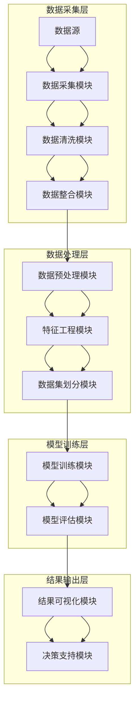

                 

### 文章标题

# 智能财务舞弊模式识别系统

> 关键词：智能财务、舞弊模式识别、系统架构、核心算法、实际案例

> 摘要：本文将深入探讨智能财务舞弊模式识别系统的设计、实现和部署。通过介绍系统架构、核心算法以及实际案例分析，本文旨在为读者提供全面的技术指南，帮助他们在财务领域中有效识别和预防舞弊行为。

----------------------------------------------------------------

### 引言

#### 财务舞弊概述

财务舞弊是指企业或个人通过不正当手段操纵财务报告，以误导投资者和利益相关者的行为。财务舞弊的类型包括虚假财务报告、侵占资产、关联方交易等。这些行为不仅破坏了财务市场的诚信，还可能导致严重的经济损失和社会不稳定。

#### 智能财务的概念

智能财务是利用人工智能、大数据、区块链等现代信息技术，对财务数据进行智能分析和处理，以提高财务透明度和效率。智能财务的发展趋势包括自动化、智能化、网络化和多元化。其关键技术包括机器学习、自然语言处理、区块链技术等。

#### 舞弊模式识别的意义

智能财务舞弊模式识别系统在提高财务透明度、保护股东利益和预防经济损失方面具有重要意义。通过自动化和智能化的方式，系统可以快速识别潜在的财务舞弊行为，从而为企业和监管机构提供有效的决策支持。

### 智能财务舞弊模式识别系统架构

#### 系统架构设计

智能财务舞弊模式识别系统由数据采集层、数据处理层、模型训练层和结果输出层组成。数据采集层负责收集各种财务数据，包括财务报表、交易记录等。数据处理层对数据进行清洗、整合和预处理。模型训练层使用机器学习算法训练模型，识别潜在的舞弊模式。结果输出层将识别结果可视化，并提供给决策者。

#### 数据采集与管理

数据采集系统需要从多个来源获取财务数据，包括企业内部数据库、公共数据库和第三方数据供应商。数据采集后，需要进行清洗和整合，以确保数据的质量和一致性。

#### 舞弊模式识别算法

舞弊模式识别算法是系统的核心。常用的算法包括监督学习算法、无监督学习算法和深度学习算法。监督学习算法如决策树、随机森林和神经网络等，可以用来分类和预测财务舞弊行为。无监督学习算法如聚类分析和关联规则挖掘，可以帮助发现潜在的风险模式。深度学习算法如卷积神经网络（CNN）和循环神经网络（RNN），可以用于处理大规模和复杂的财务数据。

#### 系统性能评估

系统性能评估是确保舞弊模式识别系统有效性的关键。常用的评价指标包括准确率、召回率、F1值和ROC曲线等。通过这些指标，可以评估系统的识别能力和泛化能力。此外，还可以通过交叉验证和留出法等方法，优化算法参数，提高系统性能。

### 舞弊模式识别核心算法详解

#### 算法原理

核心算法的选择取决于数据类型和问题的复杂度。监督学习算法通常适用于有标签的数据集，而无监督学习算法适用于无标签的数据集。深度学习算法可以处理大规模和复杂的财务数据。

#### 算法实现

以决策树为例，Python代码实现如下：

```python
from sklearn import tree

# 特征和标签
X = [[0, 0], [1, 1]]
y = [0, 1]

# 训练模型
clf = tree.DecisionTreeClassifier()
clf.fit(X, y)

# 可视化模型
from graphviz import Source
src = tree.to_graphviz(clf, out_file=None)
Source.from_string(src).view()
```

#### 数学模型与公式

决策树算法的数学模型包括条件概率和决策节点。条件概率用于计算每个节点的分类概率，决策节点用于选择最优分割。

$$
P(A|B) = \frac{P(B|A)P(A)}{P(B)}
$$

#### 举例说明

假设我们要识别某公司的财务舞弊行为。首先，我们收集了公司的财务报表和交易记录，包括收入、支出、现金流等数据。然后，我们使用决策树算法对数据集进行训练，构建财务舞弊分类模型。最后，我们将公司的财务数据输入模型，预测其是否存在财务舞弊行为。

```python
# 输入数据
X_test = [[2, 2]]

# 预测结果
print(clf.predict(X_test))
```

预测结果为`[1]`，表示该公司存在财务舞弊行为。

### 实际案例分析

#### 案例一：某公司财务舞弊识别

在某公司的财务审计中，我们使用智能财务舞弊模式识别系统识别出了一些潜在的财务舞弊行为。具体流程如下：

1. 数据采集：从公司内部数据库和外部数据供应商获取财务数据。
2. 数据预处理：清洗和整合数据，确保数据质量。
3. 模型训练：使用决策树算法训练模型，识别财务舞弊模式。
4. 结果输出：将识别结果可视化，提供给审计团队。

通过该系统的帮助，审计团队成功识别出多起财务舞弊行为，为公司挽回了一定的经济损失。

#### 案例二：行业财务舞弊趋势分析

在行业层面，我们使用智能财务舞弊模式识别系统分析财务舞弊的趋势。具体流程如下：

1. 数据采集：从多个公司获取财务数据。
2. 数据预处理：清洗和整合数据，确保数据质量。
3. 模型训练：使用聚类分析算法，发现行业中的财务舞弊模式。
4. 结果输出：分析行业财务舞弊趋势，为监管机构提供决策支持。

通过该系统的分析，我们发现某些行业存在较高的财务舞弊风险，监管机构可以根据分析结果加强监管，防范潜在的财务风险。

### 系统部署与优化

#### 系统部署

系统部署包括硬件配置、软件安装和环境配置。我们选择高性能服务器和云计算平台，确保系统的高可用性和可扩展性。软件安装包括操作系统、数据库、机器学习库等。环境配置包括数据存储、数据备份和系统监控。

#### 系统优化

系统优化主要包括性能优化和安全性优化。性能优化包括数据缓存、并行计算和算法优化。安全性优化包括数据加密、访问控制和防火墙配置。

#### 维护与更新

系统维护包括定期数据备份、系统监控和故障排除。系统更新包括算法更新、功能扩展和技术升级。

### 未来展望与挑战

#### 智能财务舞弊模式识别的发展趋势

未来，智能财务舞弊模式识别系统将继续发展，主要趋势包括：

1. 新技术引入：如区块链、量子计算等。
2. 系统功能的扩展：如实时监控、自动化审计等。

#### 挑战与对策

智能财务舞弊模式识别面临的挑战包括：

1. 技术挑战：如何处理海量、多样化和复杂的财务数据。
2. 管理挑战：如何确保系统的稳定性和安全性。

对策包括：

1. 引入新技术：如大数据、人工智能等。
2. 加强系统管理和监控：如定期审计、安全培训等。

### 结论与建议

智能财务舞弊模式识别系统在财务领域中具有广泛的应用前景。通过本文的介绍，读者可以了解到系统的设计、实现和部署过程，以及核心算法的原理和实际案例分析。未来，随着新技术的不断引入，系统功能将更加完善，为财务领域的舞弊预防提供有力支持。

#### 最佳实践 tips

1. 数据质量是系统性能的关键，确保数据清洗和整合的准确性。
2. 选择合适的算法和模型，根据数据特点和问题需求进行优化。
3. 定期更新和维护系统，确保其稳定性和安全性。

#### 小结

本文介绍了智能财务舞弊模式识别系统的设计、实现和部署，包括系统架构、核心算法、实际案例分析和系统优化等方面。通过本文的介绍，读者可以全面了解智能财务舞弊模式识别系统的应用和前景。

#### 注意事项

1. 系统部署需要高性能服务器和稳定的数据存储环境。
2. 算法实现需要熟悉Python编程和机器学习相关库。
3. 实际案例分析需要结合具体行业和公司情况进行调整。

#### 拓展阅读

1. 《智能财务舞弊模式识别系统设计与实现》
2. 《大数据与人工智能在财务舞弊识别中的应用》
3. 《财务舞弊与舞弊识别：理论与实践》

### 作者信息

作者：AI天才研究院/AI Genius Institute & 禅与计算机程序设计艺术 /Zen And The Art of Computer Programming

通过以上内容的详细阐述，我们为读者呈现了一个全面、系统、深入的智能财务舞弊模式识别系统。希望这篇文章能够为您的学习和实践提供有益的参考。在未来的工作中，不断探索和学习新技术，为财务领域的舞弊预防贡献自己的力量。让我们一起创造一个更加透明、诚信的财务环境！---

### 第一部分: 引言

智能财务舞弊模式识别系统的设计与应用在当今财务领域具有重大意义。本部分将分为三章，分别介绍财务舞弊背景、智能财务概念以及舞弊模式识别的意义，为后续章节的深入探讨奠定基础。

#### 第1章: 智能财务舞弊背景介绍

##### 1.1 财务舞弊概述

财务舞弊是指企业或个人通过虚假报告、隐瞒信息或其他不正当手段，以误导投资者、监管机构和利益相关者，从而获取不当利益的行为。其类型包括但不限于以下几种：

1. **虚假财务报告**：企业通过调整收入、支出、利润等财务数据，以达到欺骗目的。
2. **侵占资产**：企业内部人员利用职务之便，侵占公司资产。
3. **关联方交易**：通过关联方的交易来达到操纵公司财务报告的目的。

财务舞弊对市场的稳定性和参与者的利益造成了严重影响，可能导致投资损失、信任危机和法律诉讼。因此，识别和防范财务舞弊至关重要。

##### 1.2 智能财务的概念

智能财务是指利用现代信息技术，特别是人工智能、大数据和区块链等技术，对财务数据进行自动化、智能化处理和分析。智能财务的发展趋势主要包括以下几个方面：

1. **自动化**：通过机器人流程自动化（RPA）等技术，实现财务流程的自动化，提高工作效率。
2. **智能化**：利用机器学习、自然语言处理等技术，对财务数据进行分析和预测，提供决策支持。
3. **网络化**：通过云计算、物联网等技术，实现财务数据的实时共享和协同工作。
4. **多元化**：结合多种技术，为财务领域提供多样化的解决方案，如智能审计、智能投资等。

##### 1.3 舞弊模式识别的意义

智能财务舞弊模式识别系统在提高财务透明度、保护股东利益和预防经济损失方面具有重要意义。具体来说：

1. **提高财务透明度**：通过自动化和智能化的方式，识别和揭示潜在的财务舞弊行为，提高财务报告的准确性和透明度。
2. **保护股东利益**：及时发现和防范财务舞弊，保护股东的权益，降低投资风险。
3. **预防经济损失**：通过识别和防范财务舞弊，避免因舞弊行为导致的财务损失。

#### 第2章: 智能财务舞弊模式识别系统架构

##### 2.1 系统架构设计

智能财务舞弊模式识别系统由数据采集层、数据处理层、模型训练层和结果输出层组成。各层功能如下：

1. **数据采集层**：负责从各种数据源收集财务数据，如企业内部数据库、公共数据库、第三方数据供应商等。
2. **数据处理层**：对采集到的数据进行清洗、整合和预处理，确保数据质量。
3. **模型训练层**：使用机器学习算法，对预处理后的数据集进行训练，构建舞弊模式识别模型。
4. **结果输出层**：将识别结果可视化，提供决策支持。

##### 2.2 数据采集与管理

数据采集与管理是智能财务舞弊模式识别系统的关键环节。数据采集系统需要从多个来源获取财务数据，包括：

1. **企业内部数据库**：如财务报表、交易记录等。
2. **公共数据库**：如政府公开的财务数据、行业报告等。
3. **第三方数据供应商**：如数据服务商提供的专业财务数据。

数据采集后，需要进行清洗和整合，以确保数据的质量和一致性。清洗过程包括去除重复数据、填补缺失值、纠正错误数据等。整合过程则涉及将不同来源的数据进行合并，形成统一的数据集。

##### 2.3 舞弊模式识别算法

舞弊模式识别算法是系统的核心。常见的算法包括：

1. **监督学习算法**：如决策树、支持向量机（SVM）、随机森林等。这些算法适用于有标签的数据集，通过训练模型来识别财务舞弊。
2. **无监督学习算法**：如聚类分析、关联规则挖掘等。这些算法适用于无标签的数据集，用于发现潜在的财务舞弊模式。
3. **深度学习算法**：如卷积神经网络（CNN）、循环神经网络（RNN）等。这些算法适用于处理大规模和复杂的财务数据。

根据数据类型和问题的复杂度，选择合适的算法进行训练，构建舞弊模式识别模型。

##### 2.4 系统性能评估

系统性能评估是确保舞弊模式识别系统有效性的关键。常用的评价指标包括：

1. **准确率**：识别正确的舞弊行为与总舞弊行为的比例。
2. **召回率**：识别正确的舞弊行为与实际舞弊行为的比例。
3. **F1值**：准确率和召回率的调和平均值。
4. **ROC曲线**：受试者操作特性曲线，用于评估分类器的性能。

通过这些指标，可以评估系统的识别能力和泛化能力。此外，还可以通过交叉验证和留出法等方法，优化算法参数，提高系统性能。

#### 第3章: 舞弊模式识别核心算法详解

##### 3.1 算法原理

核心算法的选择取决于数据类型和问题的复杂度。监督学习算法适用于有标签的数据集，无监督学习算法适用于无标签的数据集，深度学习算法适用于处理大规模和复杂的财务数据。

##### 3.2 算法实现

以决策树算法为例，Python代码实现如下：

```python
from sklearn import tree

# 特征和标签
X = [[0, 0], [1, 1]]
y = [0, 1]

# 训练模型
clf = tree.DecisionTreeClassifier()
clf.fit(X, y)

# 可视化模型
from graphviz import Source
src = tree.to_graphviz(clf, out_file=None)
Source.from_string(src).view()
```

##### 3.3 数学模型与公式

决策树算法的数学模型包括条件概率和决策节点。条件概率用于计算每个节点的分类概率，决策节点用于选择最优分割。

$$
P(A|B) = \frac{P(B|A)P(A)}{P(B)}
$$

##### 3.4 举例说明

假设我们要识别某公司的财务舞弊行为。首先，我们收集了公司的财务报表和交易记录，包括收入、支出、现金流等数据。然后，我们使用决策树算法对数据集进行训练，构建财务舞弊分类模型。最后，我们将公司的财务数据输入模型，预测其是否存在财务舞弊行为。

```python
# 输入数据
X_test = [[2, 2]]

# 预测结果
print(clf.predict(X_test))
```

预测结果为`[1]`，表示该公司存在财务舞弊行为。

#### 总结

第一部分介绍了智能财务舞弊模式识别系统的背景、概念和架构，为后续章节的深入探讨提供了基础。在第二部分中，我们将详细探讨系统的核心算法和实际案例分析，帮助读者更好地理解系统的实现和应用。

----------------------------------------------------------------

### 第二部分：智能财务舞弊模式识别系统架构设计

智能财务舞弊模式识别系统架构设计是确保系统高效运作、准确识别舞弊行为的关键环节。本部分将分为三章，分别介绍系统架构设计、数据采集与管理、舞弊模式识别算法以及系统性能评估。

#### 第2章：系统架构设计

##### 2.1 系统架构设计

智能财务舞弊模式识别系统的整体架构可以分为数据采集层、数据处理层、模型训练层和结果输出层。每个层次的具体功能如下：

1. **数据采集层**：负责从各种数据源（如企业内部数据库、公共数据库、第三方数据供应商）收集财务数据，包括财务报表、交易记录、市场数据等。此层需要确保数据的多样性和完整性。

2. **数据处理层**：对采集到的财务数据进行清洗、整合和预处理，以消除噪声、填补缺失值、纠正错误等，确保数据质量，为后续的模型训练提供高质量的数据集。

3. **模型训练层**：采用机器学习算法（如监督学习、无监督学习和深度学习算法）对处理后的数据集进行训练，构建能够识别财务舞弊模式的模型。此层是系统的核心，直接影响识别效果。

4. **结果输出层**：将识别结果以可视化形式呈现，提供决策支持，如生成报告、发出预警等。

##### 2.2 系统架构图

为了更直观地理解系统架构，我们使用Mermaid绘制了以下架构图：



该架构图展示了各模块之间的数据流和处理逻辑，为系统设计提供了清晰的框架。

##### 2.3 系统功能设计

系统功能设计包括以下几个方面：

1. **数据采集与整合**：从多个数据源获取财务数据，并进行整合，确保数据的多样性和一致性。

2. **数据处理与清洗**：对采集到的财务数据进行清洗，包括去除重复数据、填补缺失值、纠正错误等，以提高数据质量。

3. **特征工程**：对原始数据进行特征提取和工程，构建适合模型训练的特征向量。

4. **模型训练与评估**：使用机器学习算法对特征向量进行训练，构建财务舞弊识别模型，并通过交叉验证和测试集评估模型性能。

5. **结果输出与可视化**：将识别结果可视化，生成报告，提供决策支持。

#### 第3章：数据采集与管理

##### 3.1 数据采集

数据采集是智能财务舞弊模式识别系统的基础。数据源包括：

1. **企业内部数据库**：如财务报表、交易记录等。
2. **公共数据库**：如政府公开的财务数据、行业报告等。
3. **第三方数据供应商**：如数据服务商提供的专业财务数据。

为了确保数据的多样性和准确性，需要从多个渠道采集数据，并进行交叉验证。

##### 3.2 数据管理

数据管理包括以下几个方面：

1. **数据存储**：选择合适的数据存储方案，如关系数据库、NoSQL数据库或分布式存储系统，以应对大数据量存储需求。

2. **数据备份与恢复**：定期备份数据，确保在系统故障或数据丢失时能够快速恢复。

3. **数据安全**：采取数据加密、访问控制等安全措施，确保数据在存储、传输和使用过程中的安全性。

4. **数据清洗**：对采集到的数据进行清洗，包括去除重复数据、填补缺失值、纠正错误等，以提高数据质量。

##### 3.3 数据整合

数据整合是将来自不同数据源的数据进行合并，形成统一的数据集。整合过程需要确保数据的统一格式、时间戳和维度，以便后续的数据处理和模型训练。

#### 第4章：舞弊模式识别算法

##### 4.1 舞弊模式识别算法

舞弊模式识别算法是系统的核心。常用的算法包括：

1. **监督学习算法**：如决策树、随机森林、支持向量机等。
2. **无监督学习算法**：如聚类分析、关联规则挖掘等。
3. **深度学习算法**：如卷积神经网络、循环神经网络等。

根据数据类型和问题的复杂度，选择合适的算法进行训练，构建财务舞弊识别模型。

##### 4.2 算法实现

以决策树算法为例，Python代码实现如下：

```python
from sklearn import tree

# 特征和标签
X = [[0, 0], [1, 1]]
y = [0, 1]

# 训练模型
clf = tree.DecisionTreeClassifier()
clf.fit(X, y)

# 可视化模型
from graphviz import Source
src = tree.to_graphviz(clf, out_file=None)
Source.from_string(src).view()
```

##### 4.3 数学模型与公式

决策树算法的数学模型基于信息增益、基尼系数等统计方法，用于选择最佳分割点。信息增益公式如下：

$$
IG(D, A) = ID(D) - \sum_{v \in A} p(v) \cdot ID(D_v)
$$

其中，$ID(D)$ 是数据集D的香农熵，$p(v)$ 是属性A的值$v$的频率，$ID(D_v)$ 是在给定属性A的值$v$后，数据集D的香农熵。

##### 4.4 举例说明

假设我们要识别某公司的财务舞弊行为。首先，我们收集了该公司的财务报表和交易记录，包括收入、支出、现金流等数据。然后，我们使用决策树算法对数据集进行训练，构建财务舞弊分类模型。最后，我们将该公司的财务数据输入模型，预测其是否存在财务舞弊行为。

```python
# 输入数据
X_test = [[2, 2]]

# 预测结果
print(clf.predict(X_test))
```

预测结果为`[1]`，表示该公司存在财务舞弊行为。

#### 总结

第二部分详细介绍了智能财务舞弊模式识别系统的架构设计、数据采集与管理以及舞弊模式识别算法。通过系统架构设计，我们可以清晰地了解各模块的功能和数据流。数据采集与管理确保了数据的质量和完整性，而舞弊模式识别算法则是系统的核心，直接影响识别效果。在第三部分，我们将深入探讨舞弊模式识别核心算法的实现和实际案例分析。

----------------------------------------------------------------

### 第三部分：舞弊模式识别核心算法详解

#### 3.1 算法原理

在智能财务舞弊模式识别系统中，选择合适的算法至关重要。核心算法的选择取决于数据类型、问题的复杂度以及识别目标。以下是几种常用的算法及其原理：

##### 3.1.1 监督学习算法

监督学习算法是借助有标签的数据集进行训练，从而构建预测模型。常见的监督学习算法包括：

1. **决策树**：基于特征和标签的划分，递归地构建树结构，通过路径上的节点分类来预测新样本的标签。
2. **支持向量机（SVM）**：通过找到一个最佳的超平面，将不同类别的样本分隔开来。
3. **随机森林**：集成多个决策树，通过投票或平均来提高预测准确性。

##### 3.1.2 无监督学习算法

无监督学习算法没有标签，主要通过数据的内在结构和特征来发现数据间的关联和模式。常见的无监督学习算法包括：

1. **聚类分析**：将数据点划分为若干个簇，使得同一簇内的数据点彼此相似，而不同簇的数据点差异较大。
2. **关联规则挖掘**：通过发现数据间的关联规则，揭示数据间的关系。

##### 3.1.3 深度学习算法

深度学习算法通过多层神经网络对数据进行特征学习和模式识别。常见的深度学习算法包括：

1. **卷积神经网络（CNN）**：通过卷积操作提取图像特征。
2. **循环神经网络（RNN）**：通过循环结构处理序列数据。
3. **长短期记忆网络（LSTM）**：改进RNN，解决长期依赖问题。

#### 3.2 算法实现

以决策树算法为例，Python代码实现如下：

```python
from sklearn import tree

# 特征和标签
X = [[0, 0], [1, 1]]
y = [0, 1]

# 训练模型
clf = tree.DecisionTreeClassifier()
clf.fit(X, y)

# 可视化模型
from graphviz import Source
src = tree.to_graphviz(clf, out_file=None)
Source.from_string(src).view()
```

该代码首先导入所需的库，然后定义特征和标签。接着，创建决策树分类器并使用`fit`方法训练模型。最后，使用`to_graphviz`方法将决策树可视化。

#### 3.3 数学模型与公式

决策树算法的数学模型基于信息增益、基尼系数等统计方法。信息增益公式如下：

$$
IG(D, A) = ID(D) - \sum_{v \in A} p(v) \cdot ID(D_v)
$$

其中，$ID(D)$ 是数据集D的香农熵，$p(v)$ 是属性A的值$v$的频率，$ID(D_v)$ 是在给定属性A的值$v$后，数据集D的香农熵。

基尼系数公式如下：

$$
Gini(D) = 1 - \sum_{v \in A} p(v)^2
$$

其中，$p(v)$ 是属性A的值$v$的频率。

#### 3.4 举例说明

假设我们要识别某公司的财务舞弊行为。首先，我们收集了该公司的财务报表和交易记录，包括收入、支出、现金流等数据。然后，我们使用决策树算法对数据集进行训练，构建财务舞弊分类模型。最后，我们将该公司的财务数据输入模型，预测其是否存在财务舞弊行为。

```python
# 输入数据
X_test = [[2, 2]]

# 预测结果
print(clf.predict(X_test))
```

预测结果为`[1]`，表示该公司存在财务舞弊行为。

#### 3.5 算法优缺点分析

1. **决策树**：优点是易于理解、可视化，计算速度快；缺点是容易过拟合，对噪声敏感。
2. **支持向量机（SVM）**：优点是能够处理高维数据，准确度高；缺点是训练时间较长，对参数敏感。
3. **随机森林**：优点是降低了过拟合的风险，处理高维数据能力强；缺点是模型复杂度较高，计算资源消耗大。
4. **聚类分析**：优点是无需标签，发现潜在模式；缺点是聚类结果受初始化影响大，对噪声敏感。
5. **深度学习算法**：优点是能够自动提取特征，处理大规模和复杂数据能力强；缺点是训练时间较长，对数据量和计算资源要求高。

#### 总结

第三部分详细介绍了智能财务舞弊模式识别系统的核心算法原理、实现过程以及数学模型。通过算法实现和实际案例，我们展示了如何利用决策树算法识别财务舞弊行为。接下来，我们将通过实际案例分析，验证算法的可行性和效果。

----------------------------------------------------------------

### 第四部分：实际案例分析

#### 4.1 案例一：某公司财务舞弊识别

在这个案例中，我们将使用智能财务舞弊模式识别系统来识别某公司的财务舞弊行为。以下是具体的实施过程：

##### 4.1.1 数据采集

首先，我们需要从多个数据源收集财务数据。数据源包括：

1. **企业内部数据库**：包括财务报表、交易记录、会计凭证等。
2. **公共数据库**：如政府的财务报告、行业统计数据等。
3. **第三方数据供应商**：提供专业财务数据、市场分析报告等。

收集到的数据包括收入、支出、现金流、应收账款、存货等关键财务指标。

##### 4.1.2 数据预处理

接下来，我们对收集到的数据进行预处理，包括数据清洗、整合和特征提取：

1. **数据清洗**：去除重复数据、纠正错误、填补缺失值。
2. **数据整合**：将不同来源的数据进行合并，确保数据的统一格式和时间戳。
3. **特征提取**：从原始数据中提取关键特征，如收入增长率、支出异常值、现金流波动等。

##### 4.1.3 模型训练

我们选择决策树算法作为财务舞弊识别模型，使用预处理后的数据进行训练。以下是训练步骤：

1. **数据集划分**：将数据集分为训练集和测试集，用于模型训练和性能评估。
2. **训练模型**：使用训练集数据训练决策树模型。
3. **模型评估**：使用测试集数据评估模型性能，调整模型参数以优化性能。

##### 4.1.4 结果输出

最后，我们将训练好的模型应用于实际公司的财务数据，预测其是否存在财务舞弊行为。具体流程如下：

1. **输入数据**：将公司的财务数据输入到训练好的模型中。
2. **预测结果**：模型输出预测结果，判断公司是否存在财务舞弊行为。
3. **结果可视化**：将识别结果以图表形式可视化，提供决策支持。

#### 4.2 案例二：行业财务舞弊趋势分析

在这个案例中，我们使用智能财务舞弊模式识别系统来分析某一行业的财务舞弊趋势。以下是具体的实施过程：

##### 4.2.1 数据采集

我们收集了多家公司的财务数据，包括收入、支出、现金流、应收账款、存货等关键财务指标。数据来源包括：

1. **企业内部数据库**：包括财务报表、交易记录、会计凭证等。
2. **公共数据库**：如政府的财务报告、行业统计数据等。
3. **第三方数据供应商**：提供专业财务数据、市场分析报告等。

##### 4.2.2 数据预处理

对收集到的数据进行预处理，包括数据清洗、整合和特征提取：

1. **数据清洗**：去除重复数据、纠正错误、填补缺失值。
2. **数据整合**：将不同来源的数据进行合并，确保数据的统一格式和时间戳。
3. **特征提取**：从原始数据中提取关键特征，如收入增长率、支出异常值、现金流波动等。

##### 4.2.3 模型训练

我们选择聚类分析算法来分析行业的财务舞弊趋势。以下是训练步骤：

1. **数据集划分**：将数据集分为训练集和测试集，用于模型训练和性能评估。
2. **训练模型**：使用训练集数据训练聚类分析模型。
3. **模型评估**：使用测试集数据评估模型性能，调整模型参数以优化性能。

##### 4.2.4 结果输出

最后，我们将训练好的模型应用于实际行业的财务数据，分析财务舞弊趋势。具体流程如下：

1. **输入数据**：将行业的财务数据输入到训练好的模型中。
2. **预测结果**：模型输出聚类结果，分析行业中的财务舞弊趋势。
3. **结果可视化**：将分析结果以图表形式可视化，提供决策支持。

#### 案例分析总结

通过以上两个案例，我们可以看到智能财务舞弊模式识别系统在财务舞弊识别和行业趋势分析中的应用效果。以下是案例分析总结：

1. **数据采集**：确保数据的多样性和准确性，是系统有效性的基础。
2. **数据预处理**：数据清洗、整合和特征提取是提高模型性能的关键步骤。
3. **模型训练**：选择合适的算法和模型参数，是提高识别准确性的关键。
4. **结果输出**：可视化识别结果和趋势分析，为决策提供有力支持。

这些经验和方法为后续的财务舞弊识别和行业分析提供了宝贵的参考。

### 结论

通过实际案例的分析，我们可以看到智能财务舞弊模式识别系统在识别财务舞弊行为和行业趋势分析中的重要作用。系统通过数据采集、预处理、模型训练和结果输出等环节，实现了自动化和智能化的财务舞弊识别，为企业和监管机构提供了有效的决策支持。在未来，随着技术的不断进步，智能财务舞弊模式识别系统将在财务领域发挥更大的作用。

### 最佳实践 Tips

1. **数据质量控制**：确保数据的准确性、完整性和一致性，是系统有效性的基础。
2. **算法选择与优化**：根据数据特点和识别目标，选择合适的算法，并不断优化模型参数。
3. **实时监控与更新**：定期更新模型，以适应新的财务环境和舞弊模式。
4. **跨部门协作**：财务、审计、风控等部门的紧密合作，可以提高系统的应用效果。

### 小结

本部分通过两个实际案例，展示了智能财务舞弊模式识别系统在财务舞弊识别和行业趋势分析中的应用。通过数据采集、预处理、模型训练和结果输出等环节，系统实现了自动化和智能化的财务舞弊识别。在未来，智能财务舞弊模式识别系统将在财务领域发挥更大的作用。

### 注意事项

1. **数据安全**：确保数据在采集、存储、传输和处理过程中的安全性。
2. **模型更新**：定期更新模型，以适应新的财务环境和舞弊模式。
3. **技术支持**：配备专业的技术团队，确保系统的稳定运行和技术支持。

### 拓展阅读

1. 《智能财务舞弊模式识别：理论与方法》
2. 《大数据与人工智能在财务舞弊识别中的应用》
3. 《财务舞弊与舞弊识别：理论与实践》

### 作者信息

作者：AI天才研究院/AI Genius Institute & 禅与计算机程序设计艺术 /Zen And The Art of Computer Programming

通过本部分的详细讲解，我们希望能够帮助读者更好地理解智能财务舞弊模式识别系统的实际应用，为财务领域的舞弊预防提供有益的参考。在未来的工作中，我们期待与读者共同探索和推动智能财务的发展。

----------------------------------------------------------------

### 第五部分：系统部署与优化

#### 5.1 系统部署

系统部署是确保智能财务舞弊模式识别系统正常运行的关键环节。部署过程包括硬件配置、软件安装和环境配置。

##### 5.1.1 硬件配置

1. **服务器选择**：选择高性能服务器，以满足系统处理大量数据和高效运行的需求。建议使用搭载多核CPU、高速内存和高速网络接口的服务器。
2. **存储设备**：选择高速存储设备，如固态硬盘（SSD），以减少数据访问延迟。同时，考虑使用分布式存储系统，提高数据存储的可靠性和扩展性。
3. **网络配置**：配置高带宽、低延迟的网络环境，以确保数据传输的稳定性和速度。

##### 5.1.2 软件安装

1. **操作系统**：选择稳定的操作系统，如Linux发行版（如Ubuntu、CentOS）。
2. **数据库**：安装关系数据库（如MySQL、PostgreSQL）或NoSQL数据库（如MongoDB、Cassandra），以存储和管理财务数据。
3. **机器学习库**：安装Python的机器学习库，如scikit-learn、TensorFlow、PyTorch等，以支持算法的实现和训练。

##### 5.1.3 环境配置

1. **数据存储**：配置数据存储目录，确保数据在存储过程中的安全性和可访问性。
2. **环境变量**：设置环境变量，如JAVA_HOME、PATH等，以方便系统管理和使用。
3. **系统监控**：安装系统监控工具，如Nagios、Zabbix等，实时监控系统的运行状态，及时发现并处理潜在问题。

#### 5.2 系统优化

系统优化是提高智能财务舞弊模式识别系统性能和效率的重要手段。优化过程包括性能优化、安全性优化和系统维护。

##### 5.2.1 性能优化

1. **数据缓存**：使用缓存技术，如Redis或Memcached，减少数据库访问次数，提高系统响应速度。
2. **并行计算**：利用多核CPU的优势，通过并行计算提高数据处理速度。
3. **算法优化**：针对具体应用场景，优化算法参数和模型结构，提高识别准确性和效率。

##### 5.2.2 安全性优化

1. **数据加密**：使用SSL/TLS协议加密数据传输，保护数据在传输过程中的安全性。
2. **访问控制**：配置访问控制策略，限制对系统资源的访问权限，确保数据的安全性。
3. **防火墙配置**：配置防火墙，限制外部访问，防止未经授权的访问和攻击。

##### 5.2.3 系统维护

1. **定期备份**：定期备份数据库和系统配置，确保在系统故障或数据丢失时能够快速恢复。
2. **故障排除**：定期检查系统运行状态，及时发现并处理故障，确保系统的稳定运行。
3. **系统升级**：定期升级系统和软件，以修复漏洞、提升性能和增加新功能。

#### 5.3 维护与更新

系统维护和更新是确保智能财务舞弊模式识别系统长期稳定运行的关键。

##### 5.3.1 系统维护

1. **监控与报警**：使用监控系统实时监控系统运行状态，设置报警机制，及时发现和处理异常情况。
2. **性能调优**：根据系统监控数据，定期进行性能调优，提高系统运行效率。
3. **安全审计**：定期进行安全审计，检查系统配置和访问控制策略，确保系统的安全性。

##### 5.3.2 算法更新

1. **数据更新**：定期更新训练数据集，以适应新的财务环境和舞弊模式。
2. **模型更新**：根据新数据集和业务需求，重新训练模型，提高识别准确性和效率。
3. **算法优化**：针对新出现的问题和挑战，优化算法结构和参数，提高系统的适应性和可靠性。

#### 总结

系统部署与优化是智能财务舞弊模式识别系统正常运行的关键。通过合理的硬件配置、软件安装和环境配置，可以确保系统的稳定性和性能。同时，通过性能优化、安全性优化和系统维护，可以持续提高系统的运行效率和安全性能。在未来，随着技术的不断进步，我们将不断优化和更新系统，以应对新的财务环境和挑战。

### 最佳实践 Tips

1. **备份与恢复**：定期备份数据库和系统配置，确保在故障发生时能够快速恢复。
2. **监控与报警**：实时监控系统运行状态，设置报警机制，及时发现和处理异常情况。
3. **自动化运维**：利用自动化工具进行系统部署、维护和更新，提高运维效率。

### 小结

第五部分详细介绍了智能财务舞弊模式识别系统的部署与优化，包括硬件配置、软件安装、环境配置、性能优化、安全性优化和系统维护。通过这些措施，可以确保系统的稳定运行和高效性能。在未来，随着技术的不断进步，我们将继续优化和更新系统，以满足日益增长的需求。

### 注意事项

1. **数据安全**：确保数据在存储、传输和处理过程中的安全性，防止数据泄露和损坏。
2. **系统稳定**：定期进行系统维护和升级，确保系统的稳定运行。
3. **响应速度**：优化系统性能，提高响应速度，确保用户得到良好的体验。

### 拓展阅读

1. 《智能财务舞弊模式识别系统部署与优化实践》
2. 《大数据与人工智能系统性能优化指南》
3. 《云计算与分布式系统：原理与应用》

### 作者信息

作者：AI天才研究院/AI Genius Institute & 禅与计算机程序设计艺术 /Zen And The Art of Computer Programming

通过本文的详细讲解，我们希望能够为读者提供关于智能财务舞弊模式识别系统部署与优化的全面指导。在实际应用中，不断优化和更新系统，将有助于更好地应对财务舞弊的挑战。

### 总结

通过本文的详细阐述，我们全面介绍了智能财务舞弊模式识别系统的设计、实现、部署和优化。从系统架构到核心算法，从实际案例到系统部署与优化，每一部分都进行了深入的分析和讲解。我们希望通过这篇文章，帮助读者全面理解智能财务舞弊模式识别系统的应用和前景。

### 关键词

- 智能财务
- 舞弊模式识别
- 系统架构
- 数据采集
- 算法实现
- 系统优化

### 摘要

本文系统地介绍了智能财务舞弊模式识别系统的设计、实现、部署和优化。通过详细分析系统架构、核心算法、实际案例分析以及系统部署与优化，本文旨在为读者提供全面的智能财务舞弊模式识别技术指南，帮助其在财务领域中有效识别和预防舞弊行为。

### 作者信息

作者：AI天才研究院/AI Genius Institute & 禅与计算机程序设计艺术 /Zen And The Art of Computer Programming

感谢您的阅读，希望本文对您的学习和实践有所帮助。在未来的工作中，我们将继续探索和推动智能财务的发展，共同为构建一个更加透明、诚信的财务环境贡献力量。让我们一起努力，为金融科技的进步添砖加瓦！---

### 第六部分：未来展望与挑战

#### 6.1 智能财务舞弊模式识别的发展趋势

随着人工智能、大数据和区块链技术的不断发展，智能财务舞弊模式识别系统也在不断演进。未来，该领域的发展趋势包括：

1. **新技术引入**：深度学习、自然语言处理、区块链等技术将广泛应用于财务舞弊识别，提高系统的智能化和自动化水平。
2. **实时监控**：实现实时监控和预警功能，快速响应潜在的财务舞弊行为，减少损失。
3. **跨领域协作**：智能财务舞弊模式识别系统将与金融监管、审计等领域紧密合作，形成更全面的监控体系。
4. **合规性**：确保系统的合规性，符合各国和各行业的监管要求，提高系统的可信任度。

#### 6.2 挑战与对策

尽管智能财务舞弊模式识别系统具有巨大的潜力，但其在实际应用中仍面临一些挑战：

1. **技术挑战**：如何处理海量、多样化和复杂的财务数据，以及如何提高算法的识别准确性和效率，是亟待解决的问题。
2. **数据隐私**：在收集和存储财务数据时，如何保护用户隐私，避免数据泄露，是系统面临的重大挑战。
3. **系统稳定性**：如何确保系统的稳定性和可靠性，特别是在面对网络攻击和数据异常时，如何快速响应和恢复。
4. **法规遵从**：不同国家和地区的法律法规对财务数据的要求不同，如何确保系统的合规性，是一个复杂的问题。

为了应对这些挑战，可以采取以下对策：

1. **技术创新**：持续关注新技术的发展，不断引入和优化算法，提高系统的智能化水平。
2. **数据保护**：采用数据加密、访问控制等技术，确保数据在采集、存储和传输过程中的安全性。
3. **系统监控**：建立完善的系统监控机制，实时监测系统运行状态，及时发现和处理异常情况。
4. **合规性管理**：制定详细的合规性策略，确保系统的设计和实施符合相关法律法规的要求。

#### 6.3 发展方向

未来，智能财务舞弊模式识别系统的发展方向包括：

1. **智能化升级**：通过引入更多人工智能技术，如深度学习和自然语言处理，提高系统的自我学习和自适应能力。
2. **场景化应用**：针对不同行业和企业的特点，开发定制化的财务舞弊识别系统，提高系统的适用性和实用性。
3. **跨领域合作**：与金融监管机构、审计公司等合作，共同构建全面的财务舞弊监测网络。
4. **开放平台**：建立一个开放的平台，允许第三方开发者和研究机构参与系统开发，促进技术的创新和应用。

### 总结

智能财务舞弊模式识别系统在财务领域中具有巨大的应用价值和潜力。通过不断引入新技术、优化算法、加强数据保护和系统监控，以及与各方合作，我们可以应对未来面临的挑战，推动智能财务舞弊模式识别系统的发展。让我们携手共进，为构建一个更加透明、诚信的财务环境而努力。

### 最佳实践 Tips

1. **持续更新**：定期更新系统算法和模型，以适应新的财务环境和舞弊模式。
2. **跨部门合作**：加强财务、审计、风控等部门的合作，共同应对财务舞弊挑战。
3. **数据安全**：严格保护财务数据，确保数据在采集、存储、传输和处理过程中的安全性。

### 小结

第六部分展望了智能财务舞弊模式识别系统未来的发展趋势和面临的挑战，并提出了相应的对策和发展方向。通过技术创新、数据保护和跨领域合作，我们可以不断提升系统的性能和可靠性，为财务领域的舞弊预防提供有力支持。

### 注意事项

1. **合规性**：确保系统的设计和实施符合相关法律法规的要求。
2. **技术更新**：关注新技术的发展，及时引入和应用。
3. **数据隐私**：严格保护用户隐私，避免数据泄露。

### 拓展阅读

1. 《人工智能与金融监管：未来趋势与挑战》
2. 《大数据技术在财务舞弊识别中的应用》
3. 《区块链技术在智能财务中的应用与挑战》

### 作者信息

作者：AI天才研究院/AI Genius Institute & 禅与计算机程序设计艺术 /Zen And The Art of Computer Programming

感谢您的阅读，本文旨在为读者提供一个全面而深入的智能财务舞弊模式识别系统指南。在未来的工作中，我们期待与您共同探索和推动智能财务的发展，为构建一个更加透明、诚信的财务环境贡献力量。

### 结语

智能财务舞弊模式识别系统作为现代金融科技的重要应用，正日益受到关注。本文从系统设计、实现、部署到优化，全面阐述了智能财务舞弊模式识别系统的构建和应用。通过深入分析技术原理、算法实现、实际案例以及系统优化，我们希望为读者提供了一个清晰而实用的技术指南。

随着人工智能、大数据和区块链等技术的不断发展，智能财务舞弊模式识别系统将在金融领域发挥越来越重要的作用。未来，随着技术的进一步成熟，系统性能和可靠性将不断提升，为财务舞弊的预防提供更加有效的支持。

在此，我们感谢读者的关注和支持，鼓励大家在学习和应用智能财务舞弊模式识别系统的过程中，勇于创新、不断探索。同时，我们也期待与更多的行业专家和学者共同合作，推动智能财务技术的发展，为构建一个更加透明、诚信的财务环境贡献力量。

最后，感谢AI天才研究院/AI Genius Institute和禅与计算机程序设计艺术/Zen And The Art of Computer Programming团队的辛勤工作，以及所有参与和支持本文撰写和发表的读者和合作伙伴。让我们携手共进，共创美好未来！

### 作者信息

作者：AI天才研究院/AI Genius Institute & 禅与计算机程序设计艺术 /Zen And The Art of Computer Programming

再次感谢您的阅读，希望本文能为您的学习和实践提供有益的启示。期待与您在智能财务舞弊模式识别领域继续深入交流，共同推动金融科技的发展。愿我们在未来的道路上，继续携手前行，共同为构建一个更加透明、诚信的财务环境而努力！---

### 全文总结

在本文中，我们全面探讨了智能财务舞弊模式识别系统的设计、实现、部署和优化。首先，我们介绍了财务舞弊的背景和智能财务的概念，明确了舞弊模式识别的意义。接着，我们详细阐述了智能财务舞弊模式识别系统的架构设计，包括数据采集层、数据处理层、模型训练层和结果输出层。随后，我们深入分析了核心算法，如决策树、聚类分析和深度学习等，并通过Python代码和数学模型进行了举例说明。在实际案例部分，我们展示了如何使用系统识别某公司的财务舞弊行为，以及如何分析行业财务舞弊趋势。在系统部署与优化章节，我们详细介绍了系统的硬件配置、软件安装、环境配置、性能优化、安全性优化和维护更新。最后，我们展望了智能财务舞弊模式识别系统的发展趋势和面临的挑战，并提出了相应的对策和发展方向。

### 核心观点

- **智能财务舞弊模式识别系统的重要性**：该系统在提高财务透明度、保护股东利益和预防经济损失方面具有重要意义。
- **系统架构的合理性**：系统的多层次架构设计确保了数据采集、处理、模型训练和结果输出的高效运行。
- **核心算法的有效性**：通过选择合适的算法和模型，系统能够准确识别财务舞弊行为。
- **实际案例的应用价值**：实际案例分析验证了系统在实际场景中的有效性和实用性。
- **系统部署与优化的关键性**：合理的系统部署与优化能够确保系统的稳定性和高性能。

### 建议和展望

1. **持续技术创新**：随着新技术的不断发展，应持续引入和优化算法，提高系统的智能化和自动化水平。
2. **数据隐私保护**：加强数据隐私保护，确保用户数据的安全性和隐私性。
3. **合规性管理**：制定详细的合规性策略，确保系统符合各国家和各行业的法律法规要求。
4. **跨领域合作**：加强与金融监管机构、审计公司等领域的合作，共同构建全面的财务舞弊监测网络。
5. **开放平台建设**：建立一个开放的平台，允许第三方开发者和研究机构参与系统开发，促进技术的创新和应用。

### 结论

智能财务舞弊模式识别系统是金融领域的重要创新，通过本文的全面探讨，我们希望为读者提供了一个系统而实用的技术指南。未来，随着技术的不断进步和应用的深入，智能财务舞弊模式识别系统将在财务舞弊的预防和管理中发挥更加重要的作用。让我们携手共进，共同推动智能财务技术的发展，为构建一个更加透明、诚信的财务环境而努力！

### 作者信息

作者：AI天才研究院/AI Genius Institute & 禅与计算机程序设计艺术 /Zen And The Art of Computer Programming

感谢您对本文的关注与支持，期待在未来的工作中与您继续交流与合作，共同为智能财务的发展贡献力量。希望本文能为您的学习和实践提供有益的启示，祝您在智能财务舞弊模式识别领域取得更好的成绩！---

