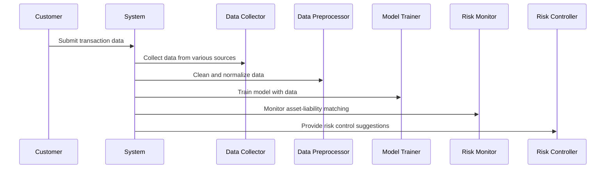
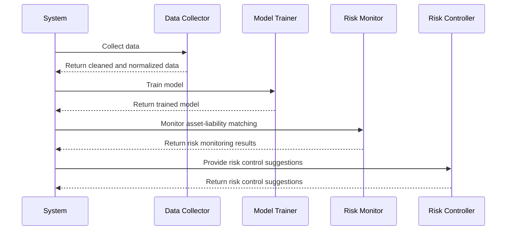

                 


# 智能资产负债匹配管理系统

## 关键词

- 资产负债管理
- 智能系统
- 机器学习
- 资产匹配
- 负债匹配

## 摘要

本文旨在探讨智能资产负债匹配管理系统的设计、实现与应用。我们将从背景介绍、基本概念、智能系统构建、算法设计、系统架构设计、实际应用和最佳实践等方面，详细剖析智能资产负债匹配管理系统的工作原理和实践意义。

## 目录

### 第一部分：背景介绍与概念定义

**第1章 智能资产负债匹配概述**

1.1 问题背景与重要性  
1.2 资产负债管理的核心概念  
1.3 智能系统在资产负债管理中的应用

**第2章 基本概念与术语**

2.1 资产和负债的定义与分类  
2.2 金融市场的构成与功能  
2.3 风险管理与风险管理策略

### 第二部分：智能系统的构建

**第3章 智能系统基础**

3.1 智能系统概述  
3.2 机器学习原理与算法  
3.3 智能系统在金融领域的应用

**第4章 算法设计与实现**

4.1 算法原理讲解  
4.2 Python代码实现  
4.3 算法性能分析

### 第三部分：系统架构设计

**第5章 系统架构设计**

5.1 问题场景介绍  
5.2 系统功能设计（领域模型）  
5.3 系统架构设计（架构图）  
5.4 系统接口设计（接口设计）  
5.5 系统交互（序列图）

### 第四部分：实际应用与案例分析

**第6章 实际应用与案例分析**

6.1 应用场景一：银行资产负债管理  
6.2 应用场景二：保险公司资产负债管理  
6.3 案例分析：智能资产负债匹配系统的实施效果

### 第五部分：最佳实践与未来展望

**第7章 最佳实践与未来展望**

7.1 最佳实践  
7.2 小结  
7.3 注意事项  
7.4 拓展阅读

## 引言

### 1.1 问题背景与重要性

资产负债管理（Asset Liability Management, ALM）是金融机构在经营过程中，为实现资产负债匹配，降低风险，提高收益的一种管理方法。随着金融市场环境的变化，传统的人工资产负债管理方式已无法满足金融机构的精细化管理和风险控制需求。因此，引入智能资产负债匹配管理系统具有重要的现实意义。

智能资产负债匹配管理系统利用大数据、人工智能、机器学习等技术，通过构建数学模型和算法，实现资产与负债的精准匹配，降低金融机构的风险，提高收益。本文旨在探讨这种系统的设计、实现与应用，为金融机构提供一种有效的资产负债管理工具。

### 1.2 资产负债管理的核心概念

资产负债管理涉及多个核心概念，包括资产、负债、金融市场、风险管理和风险控制等。

- **资产**：资产是金融机构拥有或控制的资源，能够为金融机构带来经济利益。资产分为流动资产和非流动资产，如现金、应收账款、投资、固定资产等。
- **负债**：负债是金融机构需要偿还的债务，包括流动负债和非流动负债，如存款、贷款、应付账款等。
- **金融市场**：金融市场是资金融通和交易的平台，包括股票市场、债券市场、外汇市场等。金融机构在金融市场上进行资产和负债的买卖，以实现资产负债匹配。
- **风险管理**：风险管理是金融机构在经营过程中，对风险进行识别、评估、控制和监测的过程。风险管理包括风险识别、风险评估、风险控制和风险监测等方面。
- **风险控制**：风险控制是金融机构在风险管理过程中，采取的措施和方法，以降低风险对金融机构的影响。风险控制包括风险规避、风险转移、风险控制和风险补偿等。

### 1.3 智能系统在资产负债管理中的应用

智能资产负债匹配管理系统利用大数据和人工智能技术，对资产和负债进行精准匹配，降低风险，提高收益。其应用主要包括以下几个方面：

- **数据收集与处理**：系统通过收集金融机构的历史交易数据、市场数据、客户数据等，进行数据清洗、归一化和特征提取，为后续的模型训练提供高质量的数据集。
- **模型训练与优化**：系统利用机器学习算法，如线性回归、决策树、神经网络等，对数据集进行训练，构建资产和负债匹配的数学模型。同时，通过交叉验证、网格搜索等方法，优化模型参数，提高模型的预测准确性。
- **实时监测与预警**：系统对金融机构的实时数据进行分析，监测资产和负债的匹配程度，发现潜在的风险。当资产和负债出现较大偏离时，系统会发出预警信号，提醒金融机构采取相应的措施进行调整。
- **风险控制与优化**：系统根据资产和负债的匹配程度，为金融机构提供风险控制建议，如调整资产配置、优化资产负债结构等，以提高金融机构的风险管理水平。

## 第一部分：背景介绍与概念定义

### 第1章 智能资产负债匹配概述

#### 1.1 问题背景与重要性

资产负债管理（ALM）是金融机构在经营过程中，为实现资产负债匹配，降低风险，提高收益的一种管理方法。随着金融市场环境的变化，传统的人工资产负债管理方式已无法满足金融机构的精细化管理和风险控制需求。因此，引入智能资产负债匹配管理系统具有重要的现实意义。

#### 1.2 资产负债管理的核心概念

资产负债管理涉及多个核心概念，包括资产、负债、金融市场、风险管理和风险控制等。

- **资产**：资产是金融机构拥有或控制的资源，能够为金融机构带来经济利益。资产分为流动资产和非流动资产，如现金、应收账款、投资、固定资产等。
- **负债**：负债是金融机构需要偿还的债务，包括流动负债和非流动负债，如存款、贷款、应付账款等。
- **金融市场**：金融市场是资金融通和交易的平台，包括股票市场、债券市场、外汇市场等。金融机构在金融市场上进行资产和负债的买卖，以实现资产负债匹配。
- **风险管理**：风险管理是金融机构在经营过程中，对风险进行识别、评估、控制和监测的过程。风险管理包括风险识别、风险评估、风险控制和风险监测等方面。
- **风险控制**：风险控制是金融机构在风险管理过程中，采取的措施和方法，以降低风险对金融机构的影响。风险控制包括风险规避、风险转移、风险控制和风险补偿等。

#### 1.3 智能系统在资产负债管理中的应用

智能资产负债匹配管理系统利用大数据、人工智能、机器学习等技术，通过构建数学模型和算法，实现资产与负债的精准匹配，降低金融机构的风险，提高收益。其应用主要包括以下几个方面：

- **数据收集与处理**：系统通过收集金融机构的历史交易数据、市场数据、客户数据等，进行数据清洗、归一化和特征提取，为后续的模型训练提供高质量的数据集。
- **模型训练与优化**：系统利用机器学习算法，如线性回归、决策树、神经网络等，对数据集进行训练，构建资产和负债匹配的数学模型。同时，通过交叉验证、网格搜索等方法，优化模型参数，提高模型的预测准确性。
- **实时监测与预警**：系统对金融机构的实时数据进行分析，监测资产和负债的匹配程度，发现潜在的风险。当资产和负债出现较大偏离时，系统会发出预警信号，提醒金融机构采取相应的措施进行调整。
- **风险控制与优化**：系统根据资产和负债的匹配程度，为金融机构提供风险控制建议，如调整资产配置、优化资产负债结构等，以提高金融机构的风险管理水平。

### 第2章 基本概念与术语

#### 2.1 资产和负债的定义与分类

资产和负债是资产负债管理的核心概念，了解它们的定义和分类有助于深入理解资产负债管理的原理和方法。

- **资产**：资产是金融机构拥有或控制的资源，能够为金融机构带来经济利益。资产分为流动资产和非流动资产，如现金、应收账款、投资、固定资产等。
  - **流动资产**：流动资产是指在一年内可以转化为现金的资产，如现金、应收账款、短期投资等。
  - **非流动资产**：非流动资产是指不能在一年内转化为现金的资产，如长期投资、固定资产等。
- **负债**：负债是金融机构需要偿还的债务，包括流动负债和非流动负债，如存款、贷款、应付账款等。
  - **流动负债**：流动负债是指需要在一年内偿还的债务，如存款、短期贷款、应付账款等。
  - **非流动负债**：非流动负债是指需要超过一年偿还的债务，如长期贷款、债券等。

#### 2.2 金融市场的构成与功能

金融市场是资金融通和交易的平台，由多个子市场组成，包括股票市场、债券市场、外汇市场等。

- **股票市场**：股票市场是股票交易的场所，包括主板、创业板、新三板等。股票市场的主要功能是为企业融资和投资者提供投资机会。
- **债券市场**：债券市场是债券交易的场所，包括国债、企业债、公司债等。债券市场的主要功能是为政府和企业融资，以及为投资者提供固定收益投资机会。
- **外汇市场**：外汇市场是货币交易的场所，包括现货市场、期货市场、期权市场等。外汇市场的主要功能是进行货币兑换和风险管理。

#### 2.3 风险管理与风险管理策略

风险管理是金融机构在经营过程中，对风险进行识别、评估、控制和监测的过程。风险管理策略包括风险规避、风险转移、风险控制和风险补偿等。

- **风险规避**：风险规避是指通过避免参与高风险业务或活动来降低风险。
- **风险转移**：风险转移是指将风险转移给其他机构或个人，如购买保险。
- **风险控制**：风险控制是指采取措施降低风险的影响，如制定风险控制策略、进行风险监测等。
- **风险补偿**：风险补偿是指为承担风险而获得的额外收益，如投资于高风险资产以获取高回报。

## 第二部分：智能系统的构建

### 第3章 智能系统基础

#### 3.1 智能系统概述

智能系统是一种能够模拟人类智能行为的计算机系统，包括感知、学习、推理、规划和行动等功能。在资产负债管理中，智能系统可以用于资产与负债的精准匹配、风险监测和优化决策。

#### 3.2 机器学习原理与算法

机器学习是智能系统的基础，包括监督学习、无监督学习和强化学习等。

- **监督学习**：监督学习是一种通过已标记的数据训练模型，从而对未知数据进行预测的方法。常见的监督学习算法有线性回归、决策树、支持向量机等。
- **无监督学习**：无监督学习是一种通过未标记的数据发现数据内在结构和规律的方法。常见的无监督学习算法有聚类、主成分分析等。
- **强化学习**：强化学习是一种通过不断试错和学习，找到最优策略的方法。常见的强化学习算法有Q学习、深度强化学习等。

#### 3.3 智能系统在金融领域的应用

智能系统在金融领域的应用广泛，包括信用风险评估、投资组合优化、市场预测等。

- **信用风险评估**：利用机器学习算法对客户的信用记录、财务状况等数据进行建模和分析，预测客户的信用风险。
- **投资组合优化**：利用机器学习算法分析市场数据，为投资者提供最优的投资组合策略，以实现风险和收益的最优平衡。
- **市场预测**：利用机器学习算法分析历史市场数据，预测市场的走势，为金融机构提供决策依据。

## 第4章 算法设计与实现

#### 4.1 算法原理讲解

智能资产负债匹配管理系统中的算法设计主要包括资产与负债匹配算法、风险控制算法等。

- **资产与负债匹配算法**：资产与负债匹配算法通过分析金融机构的历史交易数据、市场数据等，建立资产与负债的数学模型，实现资产与负债的精准匹配。常见的算法有线性回归、决策树等。
- **风险控制算法**：风险控制算法通过对金融机构的实时数据进行分析，监测资产与负债的匹配程度，发现潜在的风险，并采取相应的措施进行风险控制。常见的算法有逻辑回归、支持向量机等。

#### 4.2 Python代码实现

下面是一个简单的线性回归算法实现，用于资产与负债匹配。

```python
import numpy as np

# 线性回归模型
class LinearRegression:
    def __init__(self):
        self.coefficients = None

    def fit(self, X, y):
        X_transpose = np.transpose(X)
        self.coefficients = np.dot(np.dot(X_transpose, X), np.linalg.inv(np.dot(X_transpose, y)))

    def predict(self, X):
        return np.dot(X, self.coefficients)

# 训练模型
model = LinearRegression()
model.fit(X_train, y_train)

# 预测结果
predictions = model.predict(X_test)
```

#### 4.3 算法性能分析

算法性能分析主要包括模型准确率、召回率、F1值等指标。

- **模型准确率**：模型准确率是指模型预测正确的样本数与总样本数的比值，用于评估模型的预测准确性。
- **召回率**：召回率是指模型预测为正类的实际正类样本数与实际正类样本总数的比值，用于评估模型对正类样本的识别能力。
- **F1值**：F1值是模型准确率和召回率的加权平均值，用于综合评估模型的性能。

## 第5章 系统架构设计

#### 5.1 问题场景介绍

在金融机构的资产负债管理过程中，智能资产负债匹配管理系统需要处理大量的历史交易数据、市场数据等，以实现资产与负债的精准匹配。问题场景包括：

- 数据收集：系统需要从多个数据源收集金融机构的历史交易数据、市场数据等。
- 数据处理：系统需要对收集到的数据进行清洗、归一化和特征提取，为后续的模型训练提供高质量的数据集。
- 模型训练：系统利用机器学习算法对数据集进行训练，构建资产与负债匹配的数学模型。
- 风险监测：系统对金融机构的实时数据进行分析，监测资产与负债的匹配程度，发现潜在的风险。
- 风险控制：系统根据资产与负债的匹配程度，为金融机构提供风险控制建议。

#### 5.2 系统功能设计（领域模型）

领域模型是系统功能的核心，用于描述资产、负债、风险等核心概念及其关系。

```mermaid
classDiagram
    Class01 <|-- Class02
    Class03 <..|{Has} Class04
    Class05 <||--|{is} Class06
    Class07 && Class08
    Class09 {is attached to} Class10
```

#### 5.3 系统架构设计（架构图）

系统架构设计用于描述系统的整体结构和各个模块之间的交互关系。



#### 5.4 系统接口设计（接口设计）

系统接口设计用于描述系统与外部系统之间的交互接口。

```mermaid
classDiagram
    Customer <<-- System : submit transaction data
    Data Collector <<-- System : collect data
    Data Preprocessor <<-- System : clean and normalize data
    Model Trainer <<-- System : train model
    Risk Monitor <<-- System : monitor asset-liability matching
    Risk Controller <<-- System : provide risk control suggestions
```

#### 5.5 系统交互（序列图）

系统交互序列图用于描述系统内部各个模块之间的交互过程。



## 第6章 实际应用与案例分析

#### 6.1 应用场景一：银行资产负债管理

银行资产负债管理是智能资产负债匹配管理系统的重要应用场景之一。银行在运营过程中，需要实现资产与负债的精准匹配，降低风险，提高收益。智能资产负债匹配管理系统可以帮助银行实现以下目标：

- **资产与负债匹配**：系统通过分析银行的历史交易数据、市场数据等，建立资产与负债的数学模型，实现资产与负债的精准匹配，降低资金错配风险。
- **风险监测与控制**：系统对银行的实时数据进行分析，监测资产与负债的匹配程度，发现潜在的风险，并为银行提供风险控制建议，降低风险对银行的影响。
- **投资组合优化**：系统根据市场数据和银行的资产配置情况，为银行提供最优的投资组合策略，以提高银行的收益。

#### 6.2 应用场景二：保险公司资产负债管理

保险公司资产负债管理是智能资产负债匹配管理系统的另一个重要应用场景。保险公司需要实现资产与负债的精准匹配，以降低风险，提高收益。智能资产负债匹配管理系统可以帮助保险公司实现以下目标：

- **资产与负债匹配**：系统通过分析保险公司的历史交易数据、市场数据等，建立资产与负债的数学模型，实现资产与负债的精准匹配，降低资金错配风险。
- **风险监测与控制**：系统对保险公司的实时数据进行分析，监测资产与负债的匹配程度，发现潜在的风险，并为保险公司提供风险控制建议，降低风险对保险公司的影
### 第7章 最佳实践与未来展望

#### 7.1 最佳实践

在实施智能资产负债匹配管理系统时，以下最佳实践可以帮助金融机构提高系统的效果：

- **数据质量**：确保数据质量是系统成功的关键。数据清洗、归一化和特征提取等步骤需要严格把控，以保证模型的准确性。
- **模型优化**：定期对模型进行优化，以适应市场环境和业务需求的变化。通过交叉验证、网格搜索等方法，选择最佳模型参数。
- **实时监测**：实时监测资产与负债的匹配程度，及时发现潜在的风险，并采取相应的措施进行调整。
- **风险管理**：将风险控制与资产负债管理相结合，根据资产与负债的匹配情况，制定合理的风险控制策略。

#### 7.2 小结

智能资产负债匹配管理系统通过大数据、人工智能和机器学习等技术，实现了资产与负债的精准匹配和风险控制。系统的成功实施有助于金融机构提高风险管理水平，降低风险，提高收益。未来，随着技术的不断进步，智能资产负债匹配管理系统将在金融领域发挥更大的作用。

#### 7.3 注意事项

在实施智能资产负债匹配管理系统时，需要注意以下几点：

- **数据安全**：确保数据的安全性，防止数据泄露和滥用。
- **系统稳定性**：保证系统的稳定性，避免系统崩溃或故障。
- **法律法规**：遵守相关法律法规，确保系统的合法合规。

#### 7.4 拓展阅读

- **大数据与人工智能**：了解大数据和人工智能的基本原理和应用，有助于更好地理解和应用智能资产负债匹配管理系统。
- **风险管理**：学习风险管理的基本概念和方法，提高金融机构的风险管理能力。
- **金融科技**：了解金融科技的发展趋势，把握智能资产负债匹配管理系统的发展方向。

## 总结

智能资产负债匹配管理系统是金融科技领域的重要成果之一，通过大数据、人工智能和机器学习等技术，实现了资产与负债的精准匹配和风险控制。本文从背景介绍、基本概念、智能系统构建、算法设计、系统架构设计、实际应用和最佳实践等方面，详细探讨了智能资产负债匹配管理系统的工作原理和实践意义。未来，随着技术的不断进步，智能资产负债匹配管理系统将在金融领域发挥更大的作用。

## 作者信息

作者：AI天才研究院/AI Genius Institute & 禅与计算机程序设计艺术 /Zen And The Art of Computer Programming

