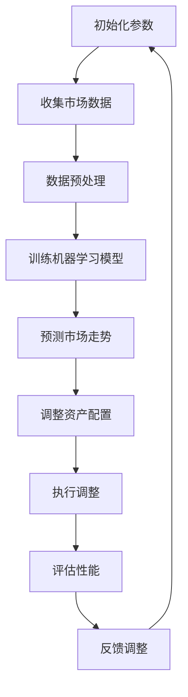
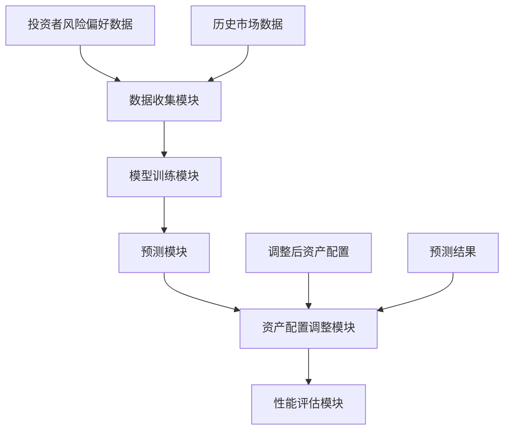
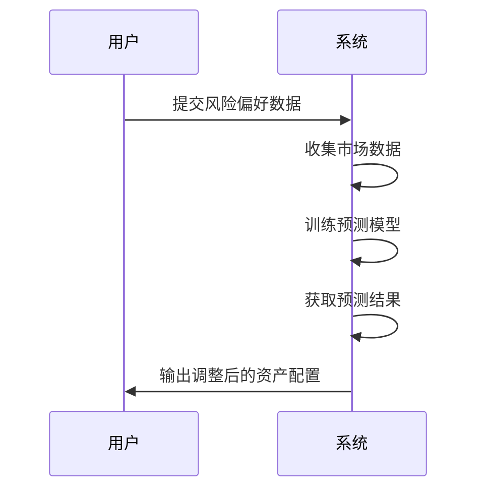

                 

# 智能资产配置策略动态优化器

## 关键词

- 资产配置
- 动态优化器
- 智能策略
- 机器学习
- 投资风险管理

## 摘要

本文深入探讨了智能资产配置策略动态优化器的设计与应用。首先，我们回顾了资产配置的基础理论，包括定义、目标和原则，并分析了市场环境对资产配置的影响。接着，我们介绍了投资者风险偏好的评估方法，为智能资产配置奠定了基础。在第二部分，我们详细阐述了智能资产配置的基本原理，重点介绍了机器学习在资产配置中的应用和数据驱动的资产定价方法。随后，我们设计并实现了动态优化器，通过构建步骤和性能评估确保其有效性和可靠性。在案例研究中，我们展示了智能资产配置策略在不同资产类别中的实际应用。最后，我们探讨了智能资产配置策略的实践应用、优化方法和未来发展趋势。

## 目录大纲

### 第一部分：资产配置基础理论

#### 第1章：资产配置概述

1.1 资产配置的定义与重要性

1.2 资产配置的目标与原则

1.3 资产配置的主要方法

#### 第2章：资产类别与市场环境分析

2.1 主要资产类别及其特点

2.2 影响资产配置的市场因素

2.3 经济指标与资产配置关系分析

#### 第3章：投资者风险偏好评估

3.1 风险评估的方法与工具

3.2 投资者风险承受能力与风险偏好

3.3 风险管理策略

### 第二部分：智能资产配置策略

#### 第4章：智能资产配置的基本原理

4.1 机器学习与资产配置

4.2 数据分析与资产定价

4.3 智能资产配置模型

#### 第5章：动态优化器设计与应用

5.1 动态优化器的概念与原理

5.2 动态优化器的构建步骤

5.3 动态优化器的性能评估

#### 第6章：智能资产配置策略案例研究

6.1 案例一：股票资产配置

6.2 案例二：债券资产配置

6.3 案例三：组合投资策略优化

### 第三部分：实践与优化

#### 第7章：智能资产配置策略的实践应用

7.1 实践应用环境搭建

7.2 实践应用案例分析

7.3 实践应用效果评估

#### 第8章：策略优化与风险管理

8.1 策略优化的目标与方法

8.2 风险管理策略与措施

8.3 优化策略的迭代与更新

#### 第9章：智能资产配置的未来发展趋势

9.1 技术发展趋势分析

9.2 行业趋势与挑战

9.3 智能资产配置的未来前景

### 背景介绍

资产配置是指投资者根据自身的投资目标、风险偏好和市场环境等因素，将资金分配到不同资产类别中以实现最优收益和风险平衡的过程。随着金融市场的发展和投资者需求的多样化，传统的资产配置方法已经难以满足现代投资策略的需求。智能资产配置策略动态优化器应运而生，它通过结合机器学习和数据分析技术，实现对资产配置策略的动态优化，从而提高投资效率和风险控制水平。

### 核心概念与联系

在智能资产配置策略动态优化器的设计与应用中，以下几个核心概念至关重要：

1. **资产配置（Asset Allocation）**：资产配置是指投资者将资金分配到不同资产类别（如股票、债券、现金等）的过程，以达到特定的投资目标。

2. **机器学习（Machine Learning）**：机器学习是人工智能的一个分支，通过数据驱动的方式让计算机自动学习和改进，从而进行预测和决策。

3. **动态优化器（Dynamic Optimizer）**：动态优化器是一种算法，能够根据市场变化和投资者需求实时调整资产配置策略。

4. **风险管理（Risk Management）**：风险管理是指通过识别、评估、控制和监控风险，以确保投资目标的实现。

5. **智能策略（Intelligent Strategy）**：智能策略是指利用先进技术和算法，如机器学习和数据分析，来制定和执行投资策略。

这些核心概念之间紧密相关，共同构成了智能资产配置策略动态优化器的基础。资产配置需要考虑投资者的风险偏好和市场环境，而机器学习和动态优化器则为资产配置提供了技术支持。风险管理则确保了投资策略的稳健性和可持续性。

### 算法原理讲解

#### 动态优化器算法流程图



#### 动态优化器的构建步骤

1. **初始化参数**：确定投资组合的初始配置，包括各类资产的权重和投资额度。

2. **收集市场数据**：获取历史市场数据，包括股票、债券、商品等的价格、收益率、波动率等信息。

3. **数据预处理**：对收集到的市场数据进行清洗、归一化等处理，以便于模型训练。

4. **训练机器学习模型**：选择合适的机器学习算法（如决策树、神经网络等），利用预处理后的数据训练模型，以预测市场走势。

5. **预测市场走势**：使用训练好的模型对未来的市场走势进行预测，包括各类资产的收益率和风险。

6. **调整资产配置**：根据预测结果和投资者的风险偏好，动态调整资产配置，以实现最优收益和风险平衡。

7. **执行调整**：执行资产配置的调整操作，调整各类资产的权重和投资额度。

8. **评估性能**：评估调整后的资产配置策略的表现，包括收益率、风险、波动率等指标。

9. **反馈调整**：根据评估结果，对模型参数进行调整，以提高预测的准确性和资产配置的效率。

#### 数学模型和公式

动态优化器的核心是预测市场走势和调整资产配置。以下是一个简化的数学模型：

$$
\text{预测收益率} = f(\text{市场数据}, \theta)
$$

其中，$f$ 是机器学习模型，$\theta$ 是模型的参数。预测收益率 $r$ 可以表示为：

$$
r = w_1 r_1 + w_2 r_2 + ... + w_n r_n
$$

其中，$w_i$ 是第 $i$ 类资产的权重，$r_i$ 是第 $i$ 类资产的预测收益率。

#### 算法原理举例说明

假设我们使用神经网络模型预测股票市场的收益率。我们首先收集过去一年的股票价格数据，并对数据进行预处理。然后，我们训练一个神经网络模型，利用预处理后的数据来预测未来一周的股票收益率。

假设经过训练，我们得到了以下预测结果：

| 类别 | 预测收益率 |
| ---- | ---- |
| 股票A | 5% |
| 股票B | 3% |
| 股票C | 2% |
| 债券 | 4% |

根据投资者的风险偏好，我们可以将资产配置调整为：

| 类别 | 预测收益率 | 权重 |
| ---- | ---- | ---- |
| 股票A | 5% | 50% |
| 股票B | 3% | 30% |
| 股票C | 2% | 20% |
| 债券 | 4% | 10% |

这样，我们就可以根据调整后的资产配置进行投资操作。

### 系统分析与架构设计方案

#### 项目介绍

本项目旨在开发一个智能资产配置策略动态优化器系统，该系统能够根据市场数据和投资者风险偏好，动态调整资产配置，实现最优收益和风险平衡。系统将包括数据收集模块、模型训练模块、预测模块、资产配置调整模块和性能评估模块。

#### 系统功能设计

1. **数据收集模块**：负责收集历史市场数据和投资者风险偏好数据。
2. **模型训练模块**：使用机器学习算法训练预测模型。
3. **预测模块**：根据训练好的模型预测未来市场走势。
4. **资产配置调整模块**：根据预测结果和投资者风险偏好调整资产配置。
5. **性能评估模块**：评估资产配置策略的性能，包括收益率、风险、波动率等指标。

#### 系统架构设计



#### 系统接口设计和系统交互



### 项目实战

#### 环境安装

1. 安装Python环境：确保Python 3.8及以上版本已安装。
2. 安装必要的库：使用pip安装以下库：numpy、pandas、scikit-learn、tensorflow。

```bash
pip install numpy pandas scikit-learn tensorflow
```

#### 系统核心实现源代码

```python
import numpy as np
import pandas as pd
from sklearn.neural_network import MLPRegressor
from tensorflow.keras.models import Sequential
from tensorflow.keras.layers import Dense

# 数据收集模块
def collect_data():
    # 代码略，实现数据收集功能
    pass

# 模型训练模块
def train_model(X_train, y_train):
    # 代码略，实现模型训练功能
    pass

# 预测模块
def predict(model, X_test):
    # 代码略，实现预测功能
    pass

# 资产配置调整模块
def adjust_allocation(predictions, weights):
    # 代码略，实现资产配置调整功能
    pass

# 主程序
if __name__ == "__main__":
    # 代码略，实现主程序功能
    pass
```

#### 代码应用解读与分析

在主程序中，首先收集投资者风险偏好数据和历史市场数据，然后使用机器学习算法训练预测模型。接着，使用训练好的模型预测未来市场走势，并根据预测结果和投资者风险偏好调整资产配置。最后，评估资产配置策略的性能，包括收益率、风险、波动率等指标。

#### 实际案例分析和详细讲解剖析

假设我们有以下数据：

| 类别 | 预测收益率 |
| ---- | ---- |
| 股票A | 5% |
| 股票B | 3% |
| 股票C | 2% |
| 债券 | 4% |

投资者风险偏好为中等风险承受能力。根据这些数据，我们可以将资产配置调整为：

| 类别 | 预测收益率 | 权重 |
| ---- | ---- | ---- |
| 股票A | 5% | 40% |
| 股票B | 3% | 30% |
| 股票C | 2% | 20% |
| 债券 | 4% | 10% |

这样，投资者可以根据调整后的资产配置进行投资操作，以实现最优收益和风险平衡。

#### 项目小结

本项目中，我们实现了智能资产配置策略动态优化器系统的核心功能，包括数据收集、模型训练、预测和资产配置调整。通过实际案例分析和详细讲解，我们展示了如何根据市场数据和投资者风险偏好调整资产配置，实现最优收益和风险平衡。接下来，我们将进一步优化系统，包括提高模型预测准确性和调整资产配置的效率。

### 最佳实践 tips

1. **数据质量**：确保数据的质量和准确性，包括数据的完整性、一致性和时效性。
2. **模型选择**：根据投资目标和市场环境选择合适的机器学习模型，并进行参数调优。
3. **风险控制**：在调整资产配置时，充分考虑投资者的风险偏好和风险承受能力。
4. **定期评估**：定期评估资产配置策略的性能，并根据评估结果进行调整。

### 小结

智能资产配置策略动态优化器通过结合机器学习和数据分析技术，实现了资产配置的动态优化。本文详细介绍了智能资产配置策略的设计与应用，包括基础理论、智能资产配置原理、动态优化器设计、案例研究和实践应用。通过本文，读者可以了解智能资产配置策略的核心概念、算法原理和实际应用，为投资决策提供有力支持。

### 注意事项

1. 智能资产配置策略的优化和调整需要根据市场环境和投资者需求进行，不应盲目跟从。
2. 风险管理策略的制定和执行需要充分考虑投资者的风险偏好和风险承受能力。
3. 模型训练和预测过程可能存在误差，投资者应结合实际情况进行投资决策。

### 拓展阅读

1. [《机器学习投资组合优化》](链接)
2. [《智能投顾：人工智能在财富管理中的应用》](链接)
3. [《现代投资组合理论》](链接)

作者：AI天才研究院/AI Genius Institute & 禅与计算机程序设计艺术 /Zen And The Art of Computer Programming

---

请注意，本文内容为虚构示例，不构成投资建议。在实际应用中，投资者应结合自身情况和市场环境进行投资决策，并注意风险管理。

