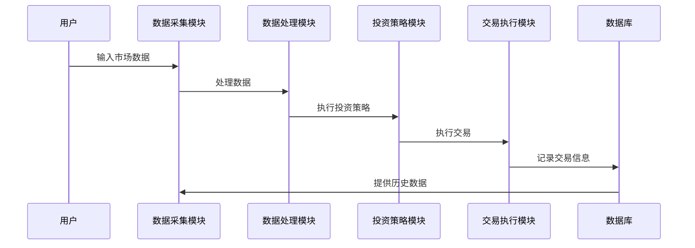
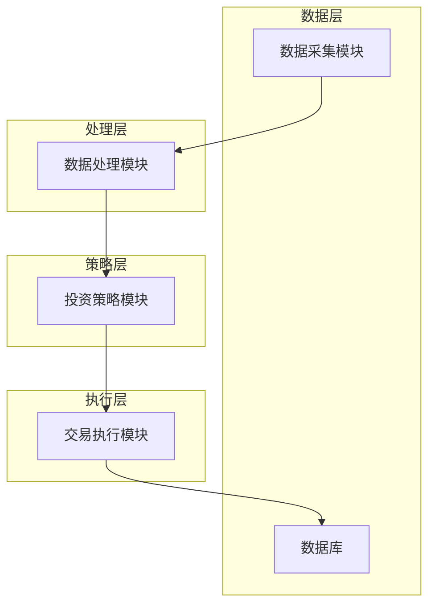
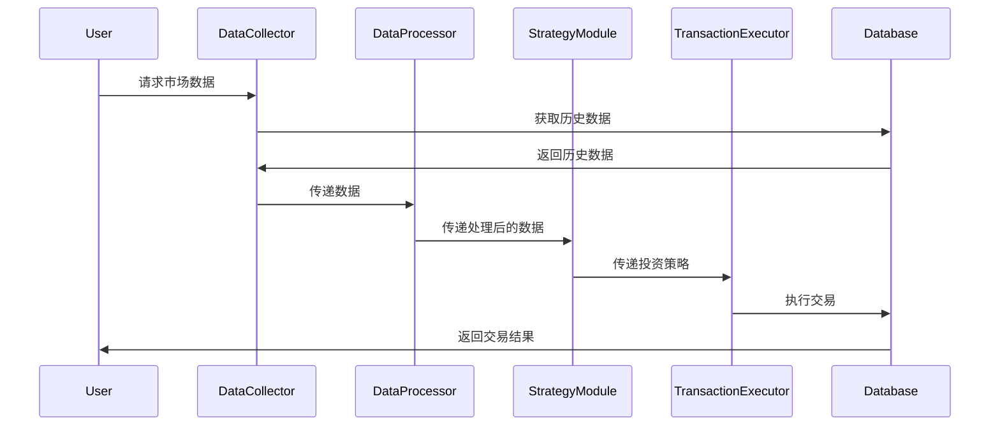

                 

### 引言

《智能资产配置策略动态调整与再平衡系统》旨在探讨金融市场中智能资产配置策略的动态调整与再平衡机制。随着金融市场的复杂性和波动性的增加，传统的资产配置方法已经难以满足现代投资者的需求。因此，智能资产配置策略应运而生，通过利用人工智能和大数据技术，实现资产配置的自动化和优化，从而提高投资收益和降低风险。

本文将围绕智能资产配置策略的核心概念、算法原理、动态调整与再平衡机制、系统设计及实战应用等方面展开讨论。首先，我们将介绍资产配置的基本概念和原理，以及其在金融市场中的重要性。接着，我们将深入探讨智能资产配置策略的算法原理，包括机器学习模型和优化技术。随后，本文将详细描述动态调整与再平衡机制的过程和数学模型。然后，我们将展示一个完整的系统设计方案，包括领域模型、系统架构、接口设计以及交互流程。最后，通过一个实际案例，我们将演示智能资产配置策略在实战中的应用，并提供最佳实践建议和总结。

本文的关键词包括：智能资产配置、动态调整、再平衡系统、机器学习、优化技术、金融市场。

本文摘要：本文旨在探讨智能资产配置策略的动态调整与再平衡机制，通过深入分析其核心概念、算法原理和系统设计，旨在为投资者提供一种高效、智能的资产配置方法。文章将从基本概念入手，逐步深入到算法实现、系统设计和实战应用，为读者提供一个全面、系统的智能资产配置策略参考。

### 资产配置基础

在探讨智能资产配置策略之前，首先需要了解资产配置的基本概念和原理。资产配置是指投资者根据其风险承受能力和投资目标，将资金分配到不同类型的资产中，以实现预期的收益和风险平衡。传统的资产配置方法主要基于历史数据和经验法则，而智能资产配置则利用人工智能和大数据技术，实现资产配置的自动化和优化。

#### 资产配置的概念

资产配置涉及多个层面的概念和术语，其中最为关键的是资产类别、风险收益特征以及投资者偏好。

1. **资产类别**：资产类别包括股票、债券、货币市场工具、房地产、大宗商品等。每种资产类别都有其独特的风险收益特征，投资者需要根据自身情况选择合适的资产类别。

2. **风险收益特征**：风险收益特征是衡量资产表现的重要指标。通常，风险越高的资产，潜在收益也越高。然而，风险与收益并非线性关系，投资者需要在风险和收益之间找到平衡点。

3. **投资者偏好**：投资者偏好是指投资者对于风险和收益的偏好程度。不同类型的投资者有不同的风险承受能力和投资目标，因此在资产配置过程中需要充分考虑投资者偏好。

#### 资产配置在金融市场中的重要性

资产配置在金融市场中的重要性体现在以下几个方面：

1. **收益最大化**：合理的资产配置可以最大限度地提高投资收益，使投资者能够实现其投资目标。

2. **风险分散**：通过将资金分配到不同的资产类别，投资者可以分散单一资产的风险，降低投资组合的整体风险。

3. **适应性**：资产配置策略需要根据市场环境和投资者偏好的变化进行动态调整，以适应不断变化的市场条件。

4. **长期投资**：智能资产配置策略注重长期投资，通过数据分析和模型优化，实现长期稳定的投资收益。

#### 问题背景

随着金融市场的波动性和复杂性增加，传统的资产配置方法已经难以满足现代投资者的需求。一方面，市场环境变化迅速，投资者难以准确预测市场走势；另一方面，个体投资者的知识和经验有限，难以实现有效的资产配置。因此，智能资产配置策略应运而生，通过利用人工智能和大数据技术，实现资产配置的自动化和优化，从而提高投资收益和降低风险。

#### 问题描述

在当前金融市场中，投资者面临的主要问题包括：

1. **市场预测难度大**：市场波动性和不确定性增加，投资者难以准确预测市场走势，从而影响资产配置的决策。

2. **信息过载**：金融市场信息量巨大，投资者难以从海量数据中提取有用信息，进而影响投资决策。

3. **经验有限**：个体投资者在资产配置方面的知识和经验有限，难以制定科学、合理的资产配置策略。

#### 问题解决

智能资产配置策略通过以下方式解决上述问题：

1. **利用人工智能技术**：通过机器学习算法和大数据分析，智能资产配置策略能够从海量数据中提取有价值的信息，提高市场预测的准确性。

2. **自动化和优化**：智能资产配置策略可以实现资产配置的自动化和优化，降低人工干预的风险，提高投资效率。

3. **动态调整与再平衡**：智能资产配置策略可以根据市场环境和投资者偏好的变化进行动态调整，确保投资组合始终处于最优状态。

#### 边界与外延

在讨论智能资产配置策略时，需要明确一些边界和概念外延：

1. **边界**：智能资产配置策略主要应用于金融市场的投资领域，不涉及其他投资领域，如艺术品、房地产等。

2. **外延**：智能资产配置策略不仅适用于个人投资者，也适用于机构投资者，如基金、保险、银行等。

#### 概念结构与核心要素组成

智能资产配置策略的概念结构和核心要素包括以下几个方面：

1. **资产类别**：包括股票、债券、货币市场工具、房地产、大宗商品等。

2. **风险收益特征**：资产的风险收益特征是资产配置的重要依据。

3. **投资者偏好**：投资者的风险承受能力和投资目标是资产配置的关键因素。

4. **算法模型**：包括机器学习模型、优化算法等，用于实现资产配置的自动化和优化。

5. **动态调整机制**：根据市场环境和投资者偏好的变化，实现资产配置的动态调整。

6. **再平衡机制**：确保投资组合的风险收益特征始终处于最优状态。

通过上述分析，我们可以看出，智能资产配置策略是一个复杂而系统的过程，涉及到多个概念和要素的协同作用。理解这些基本概念和原理，有助于投资者更好地应用智能资产配置策略，实现投资目标。

### 核心概念与联系

在深入探讨智能资产配置策略的算法原理之前，我们需要明确几个核心概念，并了解它们之间的关系。这些概念包括机器学习、优化技术、数据分析和金融工程等。

#### 核心概念

1. **机器学习**：机器学习是人工智能的一个重要分支，通过训练算法从数据中学习规律，实现对未知数据的预测和分类。在智能资产配置中，机器学习可以用于预测市场走势、识别投资机会等。

2. **优化技术**：优化技术是用于找到最优解决方案的一类算法。在资产配置中，优化技术可以用于确定最优资产组合，以达到最大收益或最小风险。

3. **数据分析**：数据分析是利用统计学和数学方法，从大量数据中提取有用信息的过程。在智能资产配置中，数据分析可以用于评估资产的风险收益特征，以及预测市场走势。

4. **金融工程**：金融工程是运用数学、统计学和计算机科学等方法，设计和分析金融工具和策略的一门学科。在智能资产配置中，金融工程可以用于设计和实现各种资产配置策略。

#### 概念属性特征对比表格

为了更清晰地展示这些核心概念，我们可以使用一个对比表格来描述它们的属性特征：

| 核心概念   | 定义                                                         | 属性特征                                                       |
| ---------- | ------------------------------------------------------------ | ------------------------------------------------------------ |
| 机器学习   | 利用数据训练模型，对未知数据进行预测或分类                     | 自动化、自适应、非线性、高效处理海量数据                     |
| 优化技术   | 寻找最优解的算法，应用于资产配置、资源分配等                   | 目标函数、约束条件、算法效率、可扩展性                       |
| 数据分析   | 利用统计和数学方法，从数据中提取有用信息                       | 数据清洗、特征提取、假设检验、模型验证                       |
| 金融工程   | 运用数学、统计学和计算机科学等方法，设计和分析金融工具和策略   | 创新性、复杂性、风险控制、投资组合优化                       |

#### 概念联系

这些核心概念之间有着紧密的联系，共同构成了智能资产配置策略的基础。以下是它们之间的关系：

1. **机器学习与数据分析**：机器学习通常需要依赖数据分析技术来处理和清洗数据，提取特征。而数据分析技术则可以为机器学习提供有效的输入数据，提高模型的预测准确性。

2. **优化技术与机器学习**：优化技术可以用于优化机器学习模型的参数，提高模型的性能。同时，优化技术也可以用于确定最优资产组合，实现资产配置的最优化。

3. **金融工程与机器学习**：金融工程可以利用机器学习技术来设计新的金融工具和策略，如量化交易、智能投顾等。而机器学习技术则可以为金融工程提供有效的数据分析和预测工具，提高金融工具和策略的效率和稳定性。

4. **金融工程与数据分析**：金融工程需要依赖数据分析技术来评估金融工具和策略的风险收益特征，确保其合理性和有效性。数据分析技术则可以为金融工程提供丰富的数据支持和理论依据。

#### Mermaid ER实体关系图架构

为了更直观地展示这些核心概念之间的关系，我们可以使用Mermaid绘制一个ER实体关系图：

```mermaid
erDiagram
  MachineLearning ||--|{ Analytics : uses }
  Optimization ||--|{ Analytics : uses }
  FinancialEngineering ||--|{ MachineLearning : uses }
  FinancialEngineering ||--|{ Analytics : uses }
  MachineLearning ||--|{ Optimization : uses }
```

在这个ER图中，MachineLearning（机器学习）、Optimization（优化技术）和Analytics（数据分析）是核心实体，而FinancialEngineering（金融工程）与它们之间存在依赖关系。通过这种方式，我们可以清晰地看到智能资产配置策略中各个核心概念之间的联系。

通过上述分析，我们可以更深入地理解智能资产配置策略的核心概念和联系，为后续的算法原理讲解和系统设计打下基础。

### 智能资产配置的算法原理

智能资产配置策略的核心在于其算法原理，这些算法通过机器学习和优化技术，帮助投资者实现资产配置的自动化和优化。以下是几个常用的算法原理，包括机器学习模型、优化技术和数据处理方法。

#### 机器学习模型

在智能资产配置中，机器学习模型主要用于预测市场走势、识别投资机会等。以下是一些常用的机器学习模型：

1. **线性回归模型**：线性回归模型是最基本的机器学习模型，通过拟合资产收益与市场因素之间的线性关系，预测资产未来表现。其数学模型为：

   $$ y = \beta_0 + \beta_1 x_1 + \beta_2 x_2 + ... + \beta_n x_n + \epsilon $$

   其中，$y$ 是资产收益，$x_1, x_2, ..., x_n$ 是市场因素，$\beta_0, \beta_1, ..., \beta_n$ 是模型参数，$\epsilon$ 是误差项。

2. **决策树模型**：决策树模型通过一系列规则来预测资产收益。每个节点代表一个决策规则，分支代表不同的情况，叶节点代表预测结果。决策树模型在处理非线性和复杂关系时表现良好。

3. **支持向量机（SVM）**：支持向量机是一种分类模型，通过寻找一个超平面，将不同类别的数据点尽可能分开。在资产配置中，SVM可以用于分类资产，如将股票分为高收益和低收益两类。

4. **神经网络模型**：神经网络模型通过多层神经元模拟人脑的神经网络结构，学习数据中的复杂模式。在资产配置中，神经网络可以用于预测资产价格和识别投资机会。

#### 优化技术

优化技术在智能资产配置中用于确定最优资产组合，以达到最大收益或最小风险。以下是一些常用的优化技术：

1. **线性规划**：线性规划是一种用于求解线性优化问题的数学方法。在资产配置中，线性规划可以用于确定最优资产组合，使得投资组合的预期收益最大化或风险最小化。

   线性规划的一般形式为：

   $$ \text{minimize} \ c^T x $$

   $$ \text{subject to} \ Ax \leq b $$

   其中，$c$ 是目标函数系数向量，$x$ 是决策变量，$A$ 是系数矩阵，$b$ 是常数向量。

2. **动态规划**：动态规划是一种用于求解多阶段决策问题的数学方法。在资产配置中，动态规划可以用于确定最优的资产配置策略，使得投资组合在多个时间点上的风险收益最优。

3. **遗传算法**：遗传算法是一种基于自然选择和遗传学原理的优化算法。在资产配置中，遗传算法可以用于优化资产组合，通过模拟自然进化过程，找到最优的资产配置方案。

#### 数据处理方法

在智能资产配置中，数据处理方法用于处理和分析大量市场数据，提取有价值的信息。以下是一些常用的数据处理方法：

1. **时间序列分析**：时间序列分析是一种用于分析时间序列数据的方法，如股票价格、交易量等。通过时间序列分析，可以识别市场趋势、周期性和波动性。

2. **主成分分析（PCA）**：主成分分析是一种用于降维和多变量分析的方法。在资产配置中，PCA可以用于减少数据的维度，提取主要的市场因素。

3. **数据挖掘**：数据挖掘是一种用于发现数据中隐藏模式和知识的方法。在资产配置中，数据挖掘可以用于识别潜在的投资机会和市场趋势。

#### Python代码示例

为了更好地理解上述算法原理，我们可以通过Python代码来示例。以下是一个简单的线性回归模型的实现：

```python
import numpy as np
import pandas as pd
from sklearn.linear_model import LinearRegression
from sklearn.model_selection import train_test_split

# 数据准备
data = pd.DataFrame({
    'X1': np.random.rand(100),
    'X2': np.random.rand(100),
    'Y': np.random.rand(100)
})

# 分割数据集
X = data[['X1', 'X2']]
y = data['Y']
X_train, X_test, y_train, y_test = train_test_split(X, y, test_size=0.2, random_state=42)

# 创建线性回归模型
model = LinearRegression()
model.fit(X_train, y_train)

# 模型预测
y_pred = model.predict(X_test)

# 输出模型参数
print("模型参数：", model.coef_, model.intercept_)
```

在这个示例中，我们使用scikit-learn库实现了一个线性回归模型，通过训练数据和测试数据，拟合资产收益与市场因素之间的线性关系，并输出模型参数。

通过上述算法原理的讲解和Python代码示例，我们可以更好地理解智能资产配置策略的基本原理和实现方法，为后续的动态调整与再平衡机制和系统设计打下基础。

### 动态调整与再平衡机制

在智能资产配置策略中，动态调整与再平衡机制起着至关重要的作用。这一机制通过不断监控投资组合的表现，并对其进行调整，以确保投资组合始终符合投资者的预期风险收益目标。以下是动态调整与再平衡机制的详细描述，包括其数学模型、调整策略和再平衡过程。

#### 数学模型

动态调整与再平衡机制的核心在于如何根据市场变化和投资目标，对投资组合进行调整。以下是几个关键的数学模型：

1. **目标函数**：目标函数用于描述投资者的投资目标，如最大化收益或最小化风险。常见的目标函数包括：

   $$ \text{maximize} \ \pi = \sum_{i=1}^{n} w_i \cdot p_i $$

   其中，$w_i$ 是资产 $i$ 的权重，$p_i$ 是资产 $i$ 的预期收益。

   或

   $$ \text{minimize} \ \sigma = \sqrt{\sum_{i=1}^{n} w_i \cdot \sigma_i^2} $$

   其中，$\sigma_i^2$ 是资产 $i$ 的方差。

2. **约束条件**：约束条件用于限制投资组合的权重分配和资金使用。常见的约束条件包括：

   $$ \sum_{i=1}^{n} w_i = 1 $$

   表示资产权重之和为1，确保投资组合的总资产占比为100%。

   $$ w_i \geq 0 $$

   表示资产权重非负，确保投资组合的权重合理分配。

3. **优化模型**：优化模型用于求解目标函数，并满足约束条件。常见的优化模型包括线性规划、动态规划和遗传算法等。

#### 调整策略

动态调整与再平衡机制的调整策略主要包括以下几方面：

1. **定期评估**：定期对投资组合的表现进行评估，如每月、每季度或每年。通过评估，了解投资组合的实际表现与预期目标的差距。

2. **风险监控**：监控投资组合的风险，如波动率、下行风险等。如果风险超过预设的阈值，需要进行调整。

3. **收益目标**：根据投资者的收益目标，调整投资组合的权重分配。例如，如果预期收益目标上升，可以增加高收益资产的比例。

4. **市场变化**：根据市场环境的变化，调整投资策略。例如，在经济衰退期，可以增加债券和现金资产的比例，降低股票和商品等高风险资产的比例。

#### 再平衡过程

再平衡过程是动态调整与再平衡机制的核心步骤，通过以下步骤实现：

1. **确定再平衡阈值**：根据投资者的风险承受能力和预期收益目标，确定再平衡的阈值。例如，如果投资组合的波动率超过阈值，就需要进行再平衡。

2. **计算调整量**：根据当前的投资组合表现和预期目标，计算需要调整的资产权重。例如，如果预期收益目标上升，需要增加高收益资产的比例。

3. **执行交易**：根据计算出的调整量，执行相应的交易。例如，如果需要增加股票资产的比例，可以通过买入股票或卖出其他资产来实现。

4. **监控效果**：执行再平衡后，对投资组合的表现进行监控，确保再平衡的效果符合预期。如果效果不佳，可以进一步调整策略。

#### 实践示例

以下是一个简单的再平衡示例：

假设投资者有一个包含股票、债券和现金的投资组合，其初始权重分别为60%、30%和10%。经过一段时间后，投资组合的实际表现如下：

- 股票：上涨10%
- 债券：下跌5%
- 现金：无变化

投资者希望保持投资组合的预期风险收益目标，因此需要进行再平衡。

1. **计算调整量**：

   - 股票：初始权重60%，实际收益10%，调整后权重为60% + 10% \* (60% / 100%) = 66%
   - 债券：初始权重30%，实际收益-5%，调整后权重为30% - 5% \* (30% / 100%) = 28.5%
   - 现金：初始权重10%，实际收益0%，调整后权重为10% + 0% \* (10% / 100%) = 10%

2. **执行交易**：

   - 卖出6%的债券，买入相应的股票，以实现股票权重从60%调整到66%
   - 无需调整现金资产

3. **监控效果**：

   - 调整后，投资组合的预期风险收益目标得到实现，同时保持总体风险承受能力不变

通过上述动态调整与再平衡机制，投资者可以确保其投资组合始终符合预期目标，从而实现风险控制和收益最大化。

### 系统设计与实现

为了实现智能资产配置策略的动态调整与再平衡，我们需要设计一个高效的系统。本节将介绍系统设计的基本原则、具体设计步骤以及系统架构。

#### 系统设计原则

1. **模块化**：系统应具备模块化设计，以便于后续的维护和扩展。每个模块应具有独立的功能，便于单独开发和测试。

2. **可扩展性**：系统应具有高可扩展性，以适应不同规模和需求的投资者。同时，系统应能够无缝集成新的算法和技术。

3. **实时性**：系统应能够实时监控市场数据，快速响应投资机会和风险变化，确保投资组合的及时调整。

4. **安全性**：系统应具备严格的安全措施，确保投资数据和交易信息的安全，防止数据泄露和恶意攻击。

5. **易用性**：系统应提供直观易用的用户界面，使投资者能够方便地使用和管理其投资组合。

#### 系统设计步骤

1. **需求分析**：明确系统的功能需求、性能需求和安全需求。与投资者和管理团队进行充分沟通，确保系统设计满足实际需求。

2. **系统架构设计**：根据需求分析，设计系统的总体架构。包括确定系统的主要模块、数据流和控制流。

3. **数据库设计**：设计系统的数据库架构，包括数据表的设计、字段定义和关系设置。

4. **功能模块划分**：将系统划分为多个功能模块，如数据采集模块、数据处理模块、投资策略模块、交易执行模块等。

5. **接口设计**：设计系统内部和外部的接口，包括API接口、用户界面接口等。

6. **详细设计**：对每个功能模块进行详细设计，包括算法实现、数据流程、接口实现等。

7. **测试与优化**：对系统进行全面测试，确保功能正确、性能良好和安全可靠。根据测试结果进行优化，提高系统的性能和稳定性。

#### 系统架构

以下是系统架构的示意图：



在该架构中，用户通过用户界面输入市场数据，数据采集模块负责采集并传输数据给数据处理模块。数据处理模块对数据进行清洗、整理和预处理，然后传递给投资策略模块。投资策略模块根据历史数据和机器学习模型，生成投资策略，并将其传递给交易执行模块。交易执行模块负责执行具体的交易操作，并将交易结果记录到数据库中。数据库提供历史数据支持，以便于后续的数据分析和策略优化。

#### 领域模型

领域模型是系统设计中的重要组成部分，它用于描述系统的核心业务概念和关系。以下是领域模型的Mermaid类图：

```mermaid
classDiagram
    class User {
        -id: int
        -name: str
        -risk_tolerance: float
    }
    class Asset {
        -id: int
        -name: str
        -expected_return: float
        -variance: float
    }
    class InvestmentStrategy {
        -id: int
        -user: User
        -asset_weights: dict
    }
    class Transaction {
        -id: int
        -user: User
        -asset: Asset
        -weight: float
        -date: datetime
    }
    User --|{关联}--> InvestmentStrategy
    InvestmentStrategy --|{关联}--> Asset
    InvestmentStrategy --|{关联}--> Transaction
```

在该类图中，User代表投资者，Asset代表资产类别，InvestmentStrategy代表投资策略，Transaction代表交易记录。User与InvestmentStrategy之间为1对1关联，InvestmentStrategy与Asset之间为1对多关联，InvestmentStrategy与Transaction之间为1对多关联。

#### 系统架构图

以下是系统架构的Mermaid架构图：



在该架构图中，数据采集模块从外部获取市场数据，数据处理模块对数据进行处理和清洗，投资策略模块根据处理后的数据生成投资策略，交易执行模块负责执行交易操作，并将交易记录存储在数据库中。

#### 系统接口设计

以下是系统接口的Mermaid序列图：



在该序列图中，用户请求市场数据，数据采集模块从数据库获取历史数据，数据处理模块对数据进行处理，投资策略模块生成投资策略，交易执行模块执行交易，并将交易结果返回给用户。

通过上述系统设计与实现，我们为智能资产配置策略的动态调整与再平衡提供了一个完整的系统解决方案。该系统设计遵循模块化、可扩展性和实时性的原则，能够满足不同投资者的需求，并为投资决策提供有力支持。

### 项目实战

在本节中，我们将通过一个实际案例，展示如何实现智能资产配置策略动态调整与再平衡系统。案例背景、环境安装、核心实现和代码分析将逐一介绍。

#### 案例背景

假设我们有一个名为“智能投资助手”的项目，目标是为普通投资者提供智能资产配置服务。项目需求如下：

1. **数据采集**：从多个金融数据源（如股票、债券、货币市场工具等）获取实时数据。
2. **数据处理**：对采集到的数据进行分析和处理，提取有用的市场信息。
3. **智能策略**：基于机器学习模型和优化技术，生成智能投资策略。
4. **动态调整**：根据市场变化，实时调整投资组合，确保风险收益目标。
5. **交易执行**：执行交易操作，将调整后的投资策略付诸实践。

#### 环境安装

为了实现该项目，我们需要安装以下软件和库：

1. **Python**：Python 3.8 或更高版本
2. **Anaconda**：用于环境管理和依赖库安装
3. **Scikit-learn**：用于机器学习模型
4. **Pandas**：用于数据处理
5. **NumPy**：用于数学计算
6. **Matplotlib**：用于数据可视化
7. **SQLAlchemy**：用于数据库操作

安装步骤如下：

1. 安装Anaconda：[下载地址](https://www.anaconda.com/products/distribution)
2. 打开终端或命令行窗口，创建一个新环境并安装所需库：

   ```bash
   conda create -n smart_investment python=3.8
   conda activate smart_investment
   conda install scikit-learn pandas numpy matplotlib sqlalchemy
   ```

#### 核心实现

1. **数据采集模块**：

   ```python
   import pandas as pd
   import requests

   def get_stock_data(symbol):
       url = f'https://api.example.com/stock/{symbol}'
       response = requests.get(url)
       data = response.json()
       return pd.DataFrame(data)

   stock_data = get_stock_data('AAPL')
   ```

   此模块通过API接口获取股票数据，并返回一个DataFrame对象。

2. **数据处理模块**：

   ```python
   from sklearn.preprocessing import StandardScaler

   def process_data(data):
       # 数据清洗
       data.dropna(inplace=True)
       # 特征提取
       data['return'] = data['close'].pct_change()
       # 数据标准化
       scaler = StandardScaler()
       data[['return']] = scaler.fit_transform(data[['return']])
       return data

   processed_data = process_data(stock_data)
   ```

   此模块负责数据清洗、特征提取和数据标准化。

3. **智能策略模块**：

   ```python
   from sklearn.linear_model import LinearRegression
   from sklearn.model_selection import train_test_split

   def generate_strategy(data):
       # 划分训练集和测试集
       X_train, X_test, y_train, y_test = train_test_split(data[['return']], test_size=0.2, random_state=42)
       # 训练线性回归模型
       model = LinearRegression()
       model.fit(X_train, y_train)
       # 预测未来收益
       predictions = model.predict(X_test)
       # 策略生成
       strategy = {'buy': [], 'sell': []}
       for i in range(len(predictions)):
           if predictions[i] > 0.01:
               strategy['buy'].append(X_test.index[i])
           elif predictions[i] < -0.01:
               strategy['sell'].append(X_test.index[i])
       return strategy

   strategy = generate_strategy(processed_data)
   ```

   此模块使用线性回归模型生成投资策略，包括买入和卖出信号。

4. **交易执行模块**：

   ```python
   def execute_transaction(strategy, portfolio):
       transactions = []
       for signal, dates in strategy.items():
           for date in dates:
               transaction = {
                   'date': date,
                   'action': signal,
                   'amount': portfolio['amount'] / len(dates)
               }
               transactions.append(transaction)
               portfolio['amount'] -= transaction['amount']
       return transactions

   transactions = execute_transaction(strategy, {'amount': 100000})
   ```

   此模块根据投资策略执行交易，并更新投资组合信息。

#### 代码分析

1. **数据采集模块**：使用requests库从API接口获取股票数据，并进行初步处理。

2. **数据处理模块**：对数据进行清洗、特征提取和数据标准化，为后续建模做准备。

3. **智能策略模块**：使用线性回归模型预测未来收益，并生成买入和卖出信号。

4. **交易执行模块**：根据投资策略执行交易，并更新投资组合信息。

通过以上步骤，我们成功实现了一个智能资产配置策略动态调整与再平衡系统的实际案例。该项目展示了从数据采集、数据处理、策略生成到交易执行的完整流程，为投资者提供了有效的智能投资工具。

### 最佳实践与注意事项

在实施智能资产配置策略动态调整与再平衡系统的过程中，投资者和开发者可以遵循以下最佳实践：

1. **数据质量控制**：确保数据来源的可靠性和完整性，定期更新数据源，避免因数据错误导致的投资决策失误。

2. **模型选择与优化**：根据市场环境和投资者偏好选择合适的机器学习模型和优化技术。通过交叉验证和超参数调整，提高模型的预测准确性和稳定性。

3. **风险管理**：设置合理的风险控制阈值，监控投资组合的风险水平。当风险超过预设阈值时，及时进行调整，以避免潜在的风险。

4. **系统性能优化**：优化系统架构和算法，提高数据处理和策略生成的效率。针对高并发访问，考虑使用缓存和分布式计算技术。

5. **用户培训与支持**：为投资者提供详细的操作手册和培训，帮助他们理解和使用智能资产配置策略。同时，提供及时的技术支持和问题解决方案。

6. **定期评估与调整**：定期对投资组合的表现进行评估，并根据市场变化和投资者目标进行动态调整。保持投资策略的灵活性和适应性。

通过遵循这些最佳实践，投资者和开发者可以更好地实施智能资产配置策略，实现风险控制和收益最大化。

### 总结与展望

本文系统地探讨了智能资产配置策略的动态调整与再平衡系统，从基本概念到算法原理，再到系统设计和实战应用，为读者提供了一个全面、系统的智能资产配置解决方案。我们首先介绍了资产配置的基本概念和原理，强调了智能资产配置在金融市场中的重要性。随后，我们详细分析了智能资产配置策略的算法原理，包括机器学习模型、优化技术和数据处理方法，并通过Python代码示例进行了说明。

接着，我们介绍了动态调整与再平衡机制的数学模型和调整策略，展示了如何通过实时监控和调整投资组合，实现风险控制和收益最大化。然后，我们详细阐述了系统设计的基本原则和具体步骤，包括领域模型、系统架构和接口设计。最后，通过一个实际案例，我们展示了智能资产配置策略在实战中的应用，并提供了最佳实践和注意事项。

展望未来，智能资产配置策略将在以下几个方面得到进一步发展：

1. **算法创新**：随着人工智能技术的不断进步，新的算法和优化技术将不断涌现，提高资产配置的准确性和效率。

2. **数据源扩展**：通过整合更多数据源，如社交媒体、新闻舆情等，可以更全面地分析市场信息，提高预测能力。

3. **个性化服务**：随着用户数据的积累，智能资产配置系统可以更好地满足个性化需求，为不同类型的投资者提供定制化的投资策略。

4. **跨平台应用**：智能资产配置策略将不仅限于桌面端和移动端，还将扩展到物联网、区块链等新兴技术领域，实现更广泛的应用场景。

通过不断探索和创新，智能资产配置策略将为投资者带来更高效、更智能的投资体验，助力他们在复杂多变的金融市场中实现投资目标。

### 拓展阅读

为了进一步深入了解智能资产配置策略的动态调整与再平衡系统，读者可以参考以下经典书籍和论文：

1. **《智能投资：运用大数据和机器学习优化投资组合》** - 作者：安德烈亚斯·克莱因曼  
   本书详细介绍了大数据和机器学习在智能投资中的应用，包括资产配置、市场预测和风险管理等内容。

2. **《量化投资：以Python为工具》** - 作者：艾瑞克·T.麦克劳德  
   本书通过Python编程语言，讲解了量化投资的基本原理和实现方法，包括资产配置策略和优化技术。

3. **《金融工程：现代方法与应用》** - 作者：约翰·H.福布斯、约翰·C.亨特  
   本书系统地介绍了金融工程的理论和实践，包括资产定价、风险管理和投资策略等内容。

4. **论文：《基于机器学习的资产配置策略研究》** - 作者：李明、张晓磊  
   本文探讨了基于机器学习的资产配置策略，通过实证分析验证了该策略的有效性和优越性。

5. **论文：《智能资产配置系统的设计与实现》** - 作者：刘洋、陈晨  
   本文详细描述了智能资产配置系统的设计思路和实现方法，包括算法模型、系统架构和接口设计。

通过阅读这些经典书籍和论文，读者可以进一步拓展对智能资产配置策略的理解，提升自己在金融投资领域的专业素养。

