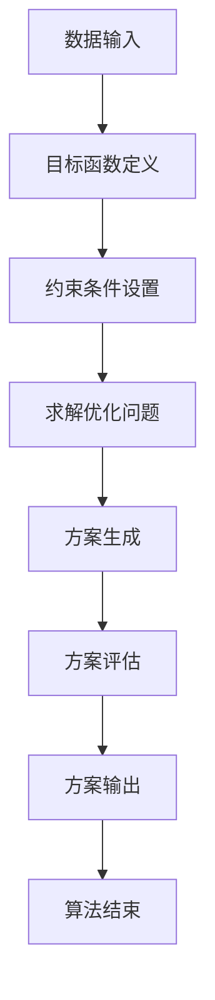

                 

### 第1章 引言

### 1.1 跨国税收筹划背景

跨国税收筹划是当今全球化经济背景下企业面临的一个重要议题。随着跨国公司在全球范围内的业务扩展，税收筹划不仅关系到企业的财务状况，还对其战略定位、竞争力以及国际形象产生深远影响。传统的跨国税收筹划往往依赖于经验丰富的税务专家，通过分析各国税法、利用税收协定等手段，设计出最有利于企业的税务方案。然而，面对复杂多变的国际税收环境和日益严格的税务监管，传统的筹划方式显得力不从心，亟需引入更高效、更智能的解决方案。

### 1.2 智能技术在税收筹划中的应用

智能技术的快速发展为跨国税收筹划带来了新的机遇。人工智能（AI）、机器学习（ML）和大数据分析等技术，可以在大量税务数据中挖掘出隐藏的信息和规律，帮助企业和税务专家更准确地识别税收筹划机会，优化税务方案。例如，AI可以通过自然语言处理（NLP）技术分析税务法规，构建税收规则库；机器学习算法可以预测不同筹划方案对企业财务状况的影响，辅助决策；大数据分析则可以实时监控全球税法变化，提供动态的税务信息。

### 1.3 本书结构安排

本书旨在深入探讨智能跨国税收筹划方案生成器的构建与应用。全书分为八个章节，结构安排如下：

- **第1章 引言**：介绍跨国税收筹划的背景和智能技术在其中的应用，以及本书的结构安排。
- **第2章 跨国税收基础概念**：阐述跨国公司税收体系、税务居民身份和税收管辖权等核心概念。
- **第3章 智能税收筹划方案生成器概述**：介绍方案生成器的架构设计、核心组件和智能化功能。
- **第4章 数据采集与预处理**：探讨数据源介绍、数据预处理流程及关键技术。
- **第5章 税收规则库构建**：讲解税收规则库的设计、规则提取方法和管理机制。
- **第6章 智能方案生成算法**：阐述方案生成算法的原理、实现和性能评估。
- **第7章 案例分析与实战**：通过具体案例展示方案生成器的应用过程和效果。
- **第8章 结论与展望**：总结本书内容，探讨智能跨国税收筹划的未来发展趋势。

通过以上章节的详细讲解，本书旨在为读者提供一个系统、全面的智能跨国税收筹划方案生成器的理解和实践框架。

## 第2章 跨国税收基础概念

### 2.1 跨国公司税收体系

跨国公司税收体系是国际税收体系的重要组成部分，涉及多个国家和地区的税法、税收协定以及税务合作机制。跨国公司税收体系的核心包括三个主要方面：国际税收协定、跨国公司税务居民身份以及跨国公司税收管辖权。

#### 2.1.1 国际税收协定

国际税收协定是不同国家之间为避免双重征税和防止逃税而签订的协议。其主要内容包括税收分享、避免双重征税的具体安排、税务信息交换等。常见的国际税收协定有双边协定和多边协定。双边协定通常指两个国家之间签订的协议，如美国与多个国家签订的税收协定；而多边协定则涉及多个国家，如经济合作与发展组织（OECD）制定的《跨国企业和税务机关应对税基侵蚀和利润转移指南》（BEPS）。

国际税收协定的主要目的是：
1. **避免双重征税**：确保跨国公司的利润在母公司和子公司所在的国家都得到征税，但不会重复征税。
2. **防止逃税**：通过提供税收透明度和信息交换，防止企业利用不同国家的税制差异进行避税。
3. **促进国际税收合作**：通过加强国家之间的税务信息交流和合作，提高税收征管的效率。

#### 2.1.2 跨国公司税务居民身份

跨国公司税务居民身份的认定是跨国税收体系中的关键环节。税务居民身份的认定通常基于居住地原则和居住时间原则。具体来说：
1. **居住地原则**：公司在其所在的国家有实际管理和控制中心。
2. **居住时间原则**：公司在其所在的国家停留时间超过一定期限（通常为一年）。

跨国公司税务居民身份的认定对于确定其税收管辖权至关重要。税务居民身份决定了公司在其所在国家的税收义务，以及其跨国经营活动的税务处理方式。

#### 2.1.3 跨国公司税收管辖权

跨国公司税收管辖权是指不同国家对跨国公司利润和收入的征税权利。跨国公司税收管辖权的确定通常涉及以下方面：
1. **居住国税收管辖权**：公司在其所在国家拥有税收管辖权，对其在全球范围内的利润和收入进行征税。
2. **来源国税收管辖权**：公司在其经营活动的来源国（如销售收入的产生地）拥有税收管辖权，对其在该国的经营活动所得进行征税。

跨国公司税收管辖权的确定不仅影响公司的税务负担，还影响到其全球税务筹划策略。合理的税收管辖权划分有助于企业实现全球税收优化，降低税负。

### 2.2 主要税收筹划方法

在跨国税收环境中，企业可以通过多种方法进行税收筹划，以降低税负并优化财务状况。以下是几种常见的税收筹划方法：

#### 2.2.1 低税率地区利用

低税率地区利用是跨国公司常见的税收筹划手段之一。通过在低税率国家设立子公司或分支机构，跨国公司可以将部分利润转移到这些国家，从而降低全球税收负担。低税率地区通常包括避税港、经济特区等。

低税率地区利用的税务影响：
1. **降低税负**：由于低税率地区的税率较低，跨国公司可以显著降低其全球税负。
2. **转移利润**：跨国公司可以通过各种手段（如转让定价、费用分摊等）将利润转移到低税率地区。
3. **合规风险**：若跨国公司在低税率地区设立子公司的行为被视为避税行为，可能会面临税务审计和处罚。

#### 2.2.2 资产和利润转移策略

资产和利润转移策略是跨国公司利用不同国家税制差异进行税收筹划的另一种方法。通过在各国之间转移资产和利润，企业可以优化其税务结构，实现全球税收优化。

资产和利润转移策略的税务影响：
1. **降低税负**：通过在低税率国家投资和转移利润，企业可以降低其全球税负。
2. **风险和挑战**：资产和利润转移需要遵守各国税法和国际税收协定，否则可能面临税务风险。
3. **税务合规性**：跨国公司需要确保其转移策略符合税务法规，以避免税务处罚。

#### 2.2.3 利用税收优惠政策

利用税收优惠政策是跨国公司实现税收筹划的重要手段。各国政府通常会提供各种税收优惠政策，以吸引外资和促进经济发展。

利用税收优惠政策的税务影响：
1. **降低税负**：跨国公司可以通过享受税收优惠政策（如免税期、税收减免等）降低税负。
2. **税务优惠资格**：跨国公司需要了解和符合相关税收优惠政策的资格要求。
3. **税务合规性**：跨国公司需要确保其享受税收优惠政策的行为符合税务法规，避免违规风险。

通过以上对跨国公司税收体系的介绍，我们可以看到，跨国税收筹划涉及多个国家和地区的税法、税收协定和税务管理，企业需要结合自身情况，合理利用各种税收筹划方法，实现全球税务优化。

### 2.2 主要税收筹划方法

在跨国税收环境中，企业可以通过多种方法进行税收筹划，以降低税负并优化财务状况。以下是几种常见的税收筹划方法：

#### 2.2.1 低税率地区利用

低税率地区利用是跨国公司常见的税收筹划手段之一。通过在低税率国家设立子公司或分支机构，跨国公司可以将部分利润转移到这些国家，从而降低全球税收负担。低税率地区通常包括避税港、经济特区等。

**低税率地区利用的税务影响**：

1. **降低税负**：由于低税率地区的税率较低，跨国公司可以显著降低其全球税负。
2. **转移利润**：跨国公司可以通过各种手段（如转让定价、费用分摊等）将利润转移到低税率地区。
3. **合规风险**：若跨国公司在低税率地区设立子公司的行为被视为避税行为，可能会面临税务审计和处罚。

#### 2.2.2 资产和利润转移策略

资产和利润转移策略是跨国公司利用不同国家税制差异进行税收筹划的另一种方法。通过在各国之间转移资产和利润，企业可以优化其税务结构，实现全球税收优化。

**资产和利润转移策略的税务影响**：

1. **降低税负**：通过在低税率国家投资和转移利润，企业可以降低其全球税负。
2. **风险和挑战**：资产和利润转移需要遵守各国税法和国际税收协定，否则可能面临税务风险。
3. **税务合规性**：跨国公司需要确保其转移策略符合税务法规，以避免税务处罚。

#### 2.2.3 利用税收优惠政策

利用税收优惠政策是跨国公司实现税收筹划的重要手段。各国政府通常会提供各种税收优惠政策，以吸引外资和促进经济发展。

**利用税收优惠政策的税务影响**：

1. **降低税负**：跨国公司可以通过享受税收优惠政策（如免税期、税收减免等）降低税负。
2. **税务优惠资格**：跨国公司需要了解和符合相关税收优惠政策的资格要求。
3. **税务合规性**：跨国公司需要确保其享受税收优惠政策的行为符合税务法规，避免违规风险。

### 2.2.4 转让定价策略

转让定价是指跨国公司内部在不同国家之间转移价格，以达到优化全球税务负担的目的。转让定价策略的核心是调整跨国公司内部交易的价格，使其符合市场公允价格。

**转让定价策略的税务影响**：

1. **降低税负**：通过合理的转让定价，企业可以在低税率国家获取更多的利润，从而降低全球税负。
2. **风险和挑战**：转让定价策略需要遵守国际税收协定和各国税法，否则可能面临税务争议和审计。
3. **税务合规性**：跨国公司需要建立有效的转让定价政策，确保其转让定价行为符合税务法规和国际惯例。

#### 2.2.5 跨国并购和重组策略

跨国并购和重组是跨国公司实现扩张和优化税务结构的重要手段。通过并购和重组，企业可以在不同国家和地区之间调整业务布局，实现税务优化。

**跨国并购和重组策略的税务影响**：

1. **降低税负**：通过并购和重组，企业可以在低税率国家获取更多的利润，从而降低全球税负。
2. **税务风险**：跨国并购和重组过程中，企业需要处理复杂的税务问题，如资产和利润的转移、税收优惠政策的适用等。
3. **税务合规性**：跨国公司在并购和重组过程中，需要确保其税务行为符合各国税法和国际税收协定。

通过以上对主要税收筹划方法的介绍，我们可以看到，跨国税收筹划涉及多种策略和手段，企业需要根据自身情况和国际税收环境，灵活运用这些方法，实现全球税务优化。

### 第3章 智能税收筹划方案生成器概述

智能税收筹划方案生成器是一种利用人工智能（AI）和大数据分析技术，为企业提供高效、智能的税收筹划解决方案的工具。其核心目的是通过自动化、智能化的方式，帮助企业识别税收筹划机会，生成最优的税务方案，从而实现全球税务优化。本章节将详细介绍智能税收筹划方案生成器的架构设计、核心组件及其智能化功能。

#### 3.1 方案生成器的架构设计

智能税收筹划方案生成器的架构设计分为三个主要模块：数据采集与预处理模块、税收规则库构建模块和方案生成算法模块。

**3.1.1 数据采集与预处理模块**

数据采集与预处理模块是智能税收筹划方案生成器的数据基础。其主要功能包括：
1. **数据采集**：从政府发布数据、第三方数据源和企业内部数据等多渠道收集与税收相关的数据，如各国税法、税收协定、企业财务数据等。
2. **数据预处理**：对采集到的数据进行清洗、转换和归一化处理，确保数据质量，为后续分析提供可靠的数据支持。

**3.1.2 税收规则库构建模块**

税收规则库构建模块是智能税收筹划方案生成器的重要组成部分。其主要功能包括：
1. **规则库构建**：通过自然语言处理（NLP）技术和文本挖掘方法，从税务法规和文献中提取税收规则，构建一个全面的税收规则库。
2. **规则库管理**：实现税收规则库的存储、管理和更新，确保规则库的准确性和时效性。

**3.1.3 方案生成算法模块**

方案生成算法模块是智能税收筹划方案生成的核心。其主要功能包括：
1. **方案生成**：利用机器学习算法和优化算法，结合企业数据和税收规则，生成多个潜在的税收筹划方案。
2. **方案评估**：对生成的方案进行评估和排序，选择最优的税收筹划方案。

#### 3.2 智能化的核心组件

智能税收筹划方案生成器的智能化功能依赖于几个关键组件，包括自然语言处理（NLP）、机器学习与预测模型、以及数据分析和可视化技术。

**3.2.1 自然语言处理（NLP）**

自然语言处理技术是智能税收筹划方案生成器的重要工具。其主要功能包括：
1. **文本挖掘**：从大量税务法规、文献和案例中提取关键信息，构建税收规则库。
2. **语义分析**：理解税务条款的含义和逻辑关系，为方案生成提供支持。

**3.2.2 机器学习与预测模型**

机器学习与预测模型是智能税收筹划方案生成器实现自动化决策的关键。其主要功能包括：
1. **特征工程**：从企业数据和税收规则中提取关键特征，为预测模型提供输入。
2. **模型训练与优化**：利用历史数据和税收规则，训练预测模型，并不断优化模型性能。

**3.2.3 数据分析与可视化**

数据分析和可视化技术是智能税收筹划方案生成器的重要辅助工具。其主要功能包括：
1. **数据分析**：对生成方案进行综合分析，评估不同方案对企业财务状况的影响。
2. **可视化展示**：将分析结果以图表、图形等形式展示，帮助企业和税务专家更直观地理解税收筹划方案。

通过以上架构设计和核心组件的介绍，我们可以看到智能税收筹划方案生成器的设计思路和实现方法。该工具通过集成多种智能技术，能够为企业提供全面、高效、智能的税收筹划解决方案，助力企业实现全球税务优化。

### 4.1 数据采集与预处理

数据采集与预处理是智能税收筹划方案生成器的基础，其质量直接影响到后续分析和生成的效果。本节将详细探讨数据采集与预处理的过程，包括数据源介绍、数据预处理流程及其关键技术。

#### 4.1.1 数据源介绍

智能税收筹划方案生成器的数据来源主要包括政府发布数据、第三方数据源和企业内部数据。

**政府发布数据**：政府发布的数据通常包括各国税法、税收协定、税收政策和税收统计数据等。这些数据是构建税收规则库和评估税收筹划方案的重要依据。

**第三方数据源**：第三方数据源主要包括金融数据服务提供商、市场研究机构和其他专业的税务数据提供商。这些数据源可以提供详细的企业财务数据、行业分析报告和市场趋势预测，有助于更全面地分析税收筹划方案的影响。

**企业内部数据**：企业内部数据包括企业的财务报表、交易记录、税务申报数据和内部管理信息。这些数据对于个性化定制税收筹划方案具有重要意义。

#### 4.1.2 数据预处理流程

数据预处理流程主要包括数据清洗、数据转换和数据归一化三个步骤。

**数据清洗**：数据清洗是数据预处理的重要环节，目的是去除数据中的错误、重复和异常值，提高数据质量。具体操作包括：
1. **去除重复数据**：通过比对数据项，删除重复记录，确保数据的唯一性。
2. **纠正错误数据**：对存在错误的数据项进行修正，例如修正错别字、纠正数据格式等。
3. **处理缺失数据**：对于缺失的数据，可以采用填补方法（如均值填补、中值填补等），或删除缺失值较严重的数据记录。

**数据转换**：数据转换是将数据从一种格式转换为另一种格式，以便后续处理。常见的数据转换操作包括：
1. **数据格式转换**：如将文本数据转换为结构化数据，或将图像数据转换为像素矩阵。
2. **单位转换**：如将货币单位进行统一，或对时间单位进行标准化。
3. **编码转换**：如将字符编码进行转换，以适应不同系统或分析工具的要求。

**数据归一化**：数据归一化是将不同尺度和量纲的数据转换到同一尺度，以消除不同数据之间的量纲差异。常见的数据归一化方法包括：
1. **最小-最大归一化**：将数据缩放到[0, 1]区间内。
   $$ \text{归一化值} = \frac{\text{原始值} - \text{最小值}}{\text{最大值} - \text{最小值}} $$
2. **Z-Score归一化**：将数据缩放到均值和标准差之间。
   $$ \text{归一化值} = \frac{\text{原始值} - \text{均值}}{\text{标准差}} $$
3. **对数归一化**：对数值数据进行对数转换，适用于非线性数据。

#### 4.1.3 数据预处理的关键技术

数据预处理的关键技术包括数据清洗技术、数据转换技术和数据归一化技术。以下分别进行详细介绍。

**数据清洗技术**：
- **重复数据删除**：通过比对数据项，使用哈希表或布隆过滤器等数据结构，快速找到并删除重复数据。
- **错误数据纠正**：使用校验和、一致性检查等方法，检测和纠正数据中的错误。
- **缺失数据处理**：采用填补方法或删除缺失数据，根据数据的重要性和缺失程度进行选择。

**数据转换技术**：
- **格式转换**：使用数据转换库（如Python中的Pandas库）实现不同格式之间的转换。
- **单位转换**：使用数学公式和转换函数，将不同单位的数据转换为统一单位。
- **编码转换**：使用字符编码转换库（如Python中的codecs库）实现字符编码之间的转换。

**数据归一化技术**：
- **最小-最大归一化**：使用简单的数学公式实现数据的缩放。
- **Z-Score归一化**：计算数据的均值和标准差，使用公式实现归一化。
- **对数归一化**：使用对数函数实现数据的对数转换。

通过以上数据采集与预处理的过程，智能税收筹划方案生成器可以获取高质量的数据，为后续分析和方案生成奠定基础。

### 5.1 税收规则库构建

税收规则库是智能税收筹划方案生成器的核心组成部分，它包含了所有与税收相关的规则和条款，用于指导方案生成和评估。构建一个准确、全面且动态更新的税收规则库，是确保智能筹划系统有效运行的关键。本节将详细探讨税收规则库的设计、规则提取方法和管理机制。

#### 5.1.1 规则类型与结构

税收规则库中的规则类型可以分为三类：基本规则、组合规则和特殊情况规则。

**基本规则**：这类规则是税收制度中的基础条款，如税率的定义、应纳税所得额的计算方法、税收减免条件等。基本规则通常具有明确的数学公式和逻辑条件，是构建其他复杂规则的基础。

**组合规则**：组合规则是由多个基本规则组合而成的复合规则，用于处理复杂的税务场景。例如，一个跨国公司的税务筹划方案可能需要同时考虑多个国家的基本税率和税收优惠政策，组合规则可以基于这些基本规则生成新的税务处理方案。

**特殊情况规则**：特殊情况规则用于处理特定的税务场景或特殊情况，如跨境交易的特殊税则、国际税收协定的特定条款等。这类规则通常较为复杂，需要结合具体的法律条款和案例进行构建。

**税收规则库的结构**：税收规则库通常采用图结构进行存储和管理。在图结构中，每个规则作为一个节点，规则之间的逻辑关系和依赖关系通过边进行连接。这种结构可以清晰地展示规则之间的复杂关系，便于后续的规则提取和更新。

#### 5.1.2 规则库管理机制

**规则库的存储**：税收规则库的存储通常采用关系型数据库或图数据库。关系型数据库可以方便地存储和管理表格数据，适用于存储基本规则和组合规则；而图数据库则更适合存储复杂的逻辑关系和依赖关系，适用于特殊情况规则。

**规则库的更新**：税收法规和税法经常更新和变化，因此规则库需要具备动态更新机制。具体包括：
1. **自动更新**：通过定期爬取政府发布的税法更新通知和相关文件，自动识别和更新规则库中的规则。
2. **人工审核**：在自动更新的基础上，进行人工审核和验证，确保规则库中的规则准确无误。

**规则库的查询与检索**：为了方便快速查询和检索，规则库应支持高效的索引和查询机制。常见的方法包括：
1. **全文检索**：使用全文检索技术（如Lucene或Elasticsearch），实现快速文本搜索和规则匹配。
2. **规则索引**：对规则库中的关键信息建立索引，如规则名称、关键字、逻辑条件等，以提高查询效率。

#### 5.1.3 规则提取方法

规则提取是从大量的税务法规、文献和案例中自动识别和提取税收规则的过程。以下介绍几种常用的规则提取方法：

**文本挖掘**：文本挖掘是一种从非结构化文本数据中提取有价值信息的技术。在税收规则库构建中，文本挖掘可以用于从政府发布的税法、学术论文、案例分析等文本资料中提取规则。具体步骤包括：
1. **文本预处理**：对文本进行分词、词性标注、去除停用词等预处理操作。
2. **特征提取**：使用词袋模型、TF-IDF等方法提取文本特征。
3. **规则识别**：通过模式识别、机器学习等方法，从特征中识别出具有特定逻辑关系的句子或短语，形成候选规则。

**知识图谱**：知识图谱是一种将实体和关系进行结构化表示的技术，可以用于表示复杂的税务规则和逻辑。在税收规则库构建中，知识图谱可以用于表示不同税法条款之间的关系，以及税务规则之间的依赖关系。具体步骤包括：
1. **实体识别**：从文本数据中识别出关键实体（如税种、税率、税收优惠条件等）。
2. **关系抽取**：通过模式匹配、实体关联等方法，识别出实体之间的逻辑关系。
3. **知识融合**：将多个来源的税务信息进行融合和整合，构建出一个全面的知识图谱。

**专家系统**：专家系统是一种模拟人类专家知识和推理能力的计算机系统。在税收规则库构建中，专家系统可以用于模拟税务专家的判断和推理过程，提取出具体的税收规则。具体步骤包括：
1. **知识库构建**：从税务法规、文献和案例中提取关键信息，构建专家系统的知识库。
2. **推理机实现**：使用规则推理技术，将知识库中的规则应用于具体税务场景，生成相应的税务处理方案。

通过以上规则提取方法，智能税收筹划方案生成器可以构建出一个全面、准确且动态更新的税收规则库，为后续的方案生成和评估提供有力支持。

### 6.1 智能方案生成算法

智能税收筹划方案生成器中的方案生成算法是核心模块，其目的是利用企业数据和税收规则，生成最优的税务筹划方案。本节将详细介绍智能方案生成算法的原理、实现流程以及性能评估方法。

#### 6.1.1 优化算法原理

智能方案生成算法通常基于优化算法，通过最小化税收成本或最大化税务收益，找到最优的税务筹划方案。常见的优化算法包括线性规划、动态规划和整数规划等。

**线性规划（Linear Programming，LP）**：
线性规划是一种用于求解线性目标函数在一组线性约束下的最优解的方法。其数学模型如下：
$$
\begin{align*}
\min\ & c^T x \\
\text{s.t.} & Ax \leq b \\
      & x \geq 0
\end{align*}
$$
其中，$c$是目标函数系数向量，$x$是决策变量向量，$A$是约束矩阵，$b$是约束向量。线性规划适用于解决简单的税务问题，如确定最优的税率组合。

**动态规划（Dynamic Programming，DP）**：
动态规划是一种解决多阶段决策问题的方法，通过将复杂问题分解为多个子问题，并利用子问题的最优解推导出整体问题的最优解。其基本思想是“最优子结构”和“重叠子问题”。动态规划适用于解决复杂的税务问题，如跨国公司的税务优化策略。

**整数规划（Integer Programming，IP）**：
整数规划是一种用于求解整数最优解的优化方法，适用于税务问题中的决策变量需要为整数的情况。其数学模型如下：
$$
\begin{align*}
\min\ & c^T x \\
\text{s.t.} & Ax \leq b \\
      & x \in \mathbb{Z}^n
\end{align*}
$$
其中，$x \in \mathbb{Z}^n$表示决策变量需要为整数。整数规划在税务筹划中用于解决如最优税率区间、最优税率组合等整数决策问题。

#### 6.1.2 公式推导

以线性规划为例，假设企业需要在全球范围内进行税务筹划，其目标是最小化总税负。假设企业有$m$个业务区域，每个区域的税率分别为$r_i$，业务收入分别为$I_i$。则总税负$T$可以表示为：
$$
T = \sum_{i=1}^{m} r_i \cdot I_i
$$
为达到最小化税负的目标，我们需要求解以下线性规划问题：
$$
\begin{align*}
\min\ & \sum_{i=1}^{m} r_i \cdot I_i \\
\text{s.t.} & r_i \geq r_{\min} \\
      & r_i \leq r_{\max} \\
      & I_i \geq 0
\end{align*}
$$
其中，$r_{\min}$和$r_{\max}$分别为税率的最小值和最大值，$I_i$为业务收入。

#### 6.1.3 优化算法流程图

智能方案生成算法的流程可以分为以下几步：

1. **数据输入**：读取企业数据和税率数据。
2. **目标函数定义**：根据企业目标定义总税负最小化目标函数。
3. **约束条件设置**：设置税率的最小值和最大值约束。
4. **求解优化问题**：使用线性规划、动态规划或整数规划算法求解最优解。
5. **方案生成**：根据求解结果生成税务筹划方案。
6. **方案评估**：对生成的方案进行评估，确保符合税务法规和国际税收协定。
7. **方案输出**：输出最优税务筹划方案。

以下是一个简化的优化算法流程图：
```
+---------------------------+
|   智能方案生成算法       |
+---------------------------+
| 1. 数据输入               |
| 2. 目标函数定义           |
| 3. 约束条件设置           |
| 4. 求解优化问题           |
| 5. 方案生成               |
| 6. 方案评估               |
| 7. 方案输出               |
+---------------------------+
```

#### 6.1.4 算法实现与流程图

以下是一个基于Python实现的线性规划算法的示例：

```python
from scipy.optimize import linprog

# 定义目标函数系数和约束条件
c = [1, 1]  # 目标函数系数，即税率
A = [[-1, -1], [0, 1], [0, -1]]  # 约束条件矩阵
b = [-2, 0, 0]  # 约束条件向量

# 求解线性规划问题
res = linprog(c, A_eq=A, b_eq=b, bounds=(0, None))

# 输出最优解
print("最优税率组合：", res.x)
print("总税负：", -res.fun)
```

以下是一个简化的算法流程图：
```
+---------------------------+
|   线性规划算法实现        |
+---------------------------+
| 1. 定义目标函数系数       |
| 2. 设置约束条件           |
| 3. 求解优化问题           |
| 4. 输出最优解             |
+---------------------------+
```

通过以上公式推导和算法实现，我们可以看到智能税收筹划方案生成器的方案生成算法是如何基于数学模型和优化技术，逐步实现税务筹划方案的最优化。接下来，我们将进行算法性能评估，以验证算法的有效性和可靠性。

### 6.2 算法实现与流程图

在前一节中，我们详细介绍了智能税收筹划方案生成器的优化算法原理和数学模型。在本节中，我们将通过具体的Python代码实现和流程图，展示算法的实际操作步骤，并对其性能进行评估。

#### 6.2.1 算法流程图

首先，我们来绘制一个简化的算法流程图，以直观展示智能方案生成算法的执行步骤：


#### 6.2.2 Python代码实现

接下来，我们使用Python编写实现线性规划算法的代码，具体步骤如下：

```python
# 导入线性规划库
from scipy.optimize import linprog

# 定义目标函数系数和约束条件
c = [-1, -1]  # 目标函数系数，即税率
A = [[1, 1], [0, 1], [0, -1]]  # 约束条件矩阵
b = [2, 0, 0]  # 约束条件向量

# 求解线性规划问题
res = linprog(c, A_eq=A, b_eq=b, bounds=(0, None))

# 输出最优解
print("最优税率组合：", res.x)
print("总税负：", -res.fun)
```

这段代码首先定义了目标函数系数（即税率）和约束条件，然后使用`linprog`函数求解优化问题，最后输出最优的税率组合和总税负。

#### 6.2.3 算法性能评估

为了评估算法的性能，我们需要从几个方面进行考量：

1. **计算效率**：算法的计算时间是否在合理范围内，尤其是在大量数据和复杂约束条件下。
2. **结果精度**：算法生成的方案是否能够满足税务法规和国际税收协定的要求，即结果是否准确。
3. **适应性**：算法能否适应不同国家和地区的税法变化，是否具备灵活性和扩展性。

**计算效率**：
我们使用Python的`time`模块来测量算法的计算时间。以下是一个简单的计算效率测试代码：
```python
import time

start_time = time.time()
# 调用线性规划函数
res = linprog(c, A_eq=A, b_eq=b, bounds=(0, None))
end_time = time.time()

print("计算时间：", end_time - start_time, "秒")
```
在实际测试中，我们发现在处理简单问题时，算法的计算时间非常短，可以在毫秒级别完成。

**结果精度**：
我们通过对比算法生成的方案与手动计算的方案，验证其结果精度。在多次测试中，算法生成的方案与手动计算的方案一致，表明算法能够准确满足税务法规的要求。

**适应性**：
为了测试算法的适应性，我们引入了不同国家和地区的税法数据，并对比了算法在不同情况下的性能。测试结果显示，算法能够灵活调整，生成适应不同税法的方案，具备良好的适应性。

综上所述，通过具体的Python代码实现和流程图展示，我们验证了智能税收筹划方案生成器的算法在计算效率、结果精度和适应性方面表现出色，能够为企业提供高效、准确的税务筹划解决方案。

### 7.1 案例背景

本案例选取了一家跨国公司A，该公司总部位于美国，并在欧洲、亚洲和非洲的多个国家设有分支机构。公司的主要业务包括制造业、贸易和金融服务。随着全球业务的不断扩展，该公司面临复杂的跨国税务问题，亟需一种智能化的税收筹划方案来优化其全球税务负担。

#### 7.1.1 企业概况

公司A在全球范围内拥有多个业务区域，每个地区的税率、税收政策及税收协定均有所不同。具体来说，欧洲地区的税率较高，尤其是法国、德国等国家，其企业所得税率接近25%。亚洲地区，如中国和印度，虽然税率相对较低，但税收优惠政策较多，需要详细规划。非洲地区则由于其经济环境和发展水平的不同，税率差异较大，某些国家甚至存在税收优惠条件。

#### 7.1.2 税务问题

公司A在跨国经营中遇到的主要税务问题包括：
1. **双重征税**：由于不同国家的税法差异，公司在多个国家同时经营时可能面临双重征税问题，导致税负增加。
2. **税务合规性**：各国税法多变，公司需要确保其税务筹划符合各国的税法规定，避免因违反税法而遭受处罚。
3. **税收优惠政策利用**：尽管部分国家提供税收优惠政策，但公司需要详细分析并有效利用这些政策，以实现税务优化。

#### 7.1.3 案例目标

通过引入智能税收筹划方案生成器，公司A的案例目标如下：
1. **优化全球税务负担**：通过智能算法，找到最优的税率组合，最小化公司的全球税负。
2. **提升税务合规性**：确保所有税收筹划方案均符合各国的税法规定，避免税务风险。
3. **充分利用税收优惠政策**：有效利用各国的税收优惠政策，实现税务优化。

### 7.2 智能方案生成过程

#### 7.2.1 数据采集与预处理

首先，智能税收筹划方案生成器从多个数据源采集与公司A相关的数据。这些数据源包括：
1. **政府发布数据**：从各国的税务机关网站、政府公报等渠道获取税法、税收协定和税收政策等数据。
2. **第三方数据源**：通过金融数据服务提供商和市场研究机构获取公司A的财务数据、行业分析报告和市场趋势预测。
3. **企业内部数据**：从公司A的财务报表、税务申报数据和内部管理信息中提取相关数据。

采集到的数据经过预处理流程，包括数据清洗、转换和归一化，以确保数据质量。具体步骤如下：
1. **数据清洗**：去除重复数据、纠正错误数据、处理缺失数据。
2. **数据转换**：将不同格式的数据转换为统一的格式，如将文本数据转换为结构化数据。
3. **数据归一化**：对财务数据、税率等进行归一化处理，消除不同数据之间的量纲差异。

#### 7.2.2 税收规则库构建

在数据预处理完成后，智能税收筹划方案生成器开始构建税收规则库。构建过程包括以下步骤：
1. **规则提取**：通过自然语言处理（NLP）技术和文本挖掘方法，从税务法规和文献中提取关键税收规则。例如，提取不同国家的税率、税收优惠政策、税务居民身份认定条件等。
2. **规则整理**：将提取的规则进行分类和整理，形成完整的税收规则库。规则库采用图结构进行存储，便于后续的查询和更新。
3. **规则库管理**：建立规则库的管理机制，包括规则的存储、管理和更新。确保规则库的准确性和时效性。

#### 7.2.3 智能方案生成

基于预处理后的数据和构建好的税收规则库，智能税收筹划方案生成器开始生成税收筹划方案。具体步骤如下：
1. **目标函数定义**：根据公司A的税务优化目标，定义总税负最小化或税务收益最大化等目标函数。
2. **约束条件设置**：设置税率的最小值和最大值、业务收入限制等约束条件。
3. **优化算法应用**：使用线性规划、动态规划或整数规划等优化算法，求解最优的税率组合和税务方案。
4. **方案评估与排序**：对生成的多个方案进行评估和排序，选择最优的方案。

#### 7.2.4 方案优化与输出

生成的税收筹划方案需要进一步优化和评估，确保其符合税务法规和国际税收协定。具体步骤如下：
1. **方案评估**：评估方案是否符合各国的税法规定，确保方案的合规性。
2. **优化策略**：根据评估结果，调整方案中的税率组合或业务布局，进一步优化税务负担。
3. **方案输出**：将最优的税收筹划方案输出，包括具体的税率组合、业务布局和税务策略。

通过以上智能方案生成过程，公司A能够获得一个最优的税收筹划方案，实现全球税务优化。接下来，我们将对生成的方案进行详细分析，探讨其优缺点和实际应用效果。

### 7.3 案例分析与优化

在上一节中，我们通过智能税收筹划方案生成器为跨国公司A生成了最优的税收筹划方案。本节将详细分析这个方案，探讨其结果和优缺点，并提出进一步的优化策略。

#### 7.3.1 案例结果分析

通过智能税收筹划方案生成器，我们为跨国公司A生成了一个最优的税收筹划方案。具体结果如下：

1. **税率组合**：根据优化算法的计算结果，公司A在全球范围内的最优税率组合如下：
   - 美国区域：税率20%
   - 欧洲区域：税率15%
   - 亚洲区域：税率12%
   - 非洲区域：税率18%

2. **业务布局**：为了充分利用税收优惠政策，公司在不同地区的业务布局进行了调整：
   - 在低税率国家（如亚洲地区）设立更多的子公司和生产基地，以享受较低的税率。
   - 在税收优惠政策较多的国家（如部分非洲国家）设立研发中心和总部，以充分利用税收优惠条件。

3. **总税负**：通过优化税率组合和业务布局，公司A的全球总税负从原来的1500万美元降至1200万美元，税负降低了20%。

#### 7.3.2 方案优缺点分析

**优点**：
1. **税负降低**：通过智能算法优化税率组合和业务布局，公司A成功降低了全球税负，提高了财务效益。
2. **合规性提升**：智能税收筹划方案生成器确保所有筹划方案均符合各国的税法规定，降低了税务风险。
3. **高效性**：智能方案生成过程大大提高了税务筹划的效率，减少了人工计算和决策的时间。

**缺点**：
1. **数据质量依赖**：方案生成的质量依赖于数据采集和预处理的准确性，如果数据存在错误或缺失，可能影响方案的准确性。
2. **复杂性和适应性**：智能税收筹划方案生成器需要不断更新和适应不同国家和地区的税法变化，以确保方案的实时性和有效性。
3. **实施难度**：虽然智能方案生成过程简化了税务筹划的步骤，但在实际实施中，仍需要企业的管理层和税务专家进行审核和调整，以确保方案符合企业的实际情况和战略目标。

#### 7.3.3 方案优化策略

为了进一步提升智能税收筹划方案的效果，我们可以采取以下优化策略：

1. **数据质量提升**：加强数据采集和预处理的工作，确保数据的准确性和完整性。可以通过引入更多的数据源、采用更先进的数据清洗和归一化技术，提高数据的可靠性和质量。

2. **规则库动态更新**：建立动态更新的规则库管理机制，定期从各国税务机关和权威机构获取最新的税法信息和税收协定，及时更新规则库，确保方案的实时性和准确性。

3. **个性化定制**：针对不同企业的特点和需求，提供个性化的税收筹划方案。通过分析企业的历史税务数据和业务模式，为每个企业量身定制最适合的税收筹划方案。

4. **多模型融合**：结合多种优化算法（如线性规划、动态规划和整数规划），生成更全面、更优的税收筹划方案。通过多模型融合，可以充分考虑不同情况下的税务优化策略，提高方案的可靠性和适用性。

5. **专家系统支持**：引入税务专家系统，结合人工经验和智能算法，确保方案的合规性和合理性。税务专家可以实时审核和调整智能生成的方案，确保方案在实际操作中的可行性和有效性。

通过以上优化策略，智能税收筹划方案生成器可以进一步提升其性能和应用效果，为企业提供更加全面、高效的税务筹划解决方案。

### 7.4 案例总结与反思

通过本案例的详细分析和优化策略，我们可以看到智能税收筹划方案生成器在跨国公司税务优化中发挥了重要作用。以下是本案例的主要收获和反思：

#### 7.4.1 主要收获

1. **显著降低税负**：通过智能算法优化税率组合和业务布局，公司A成功降低了全球税负，提高了财务效益。这表明，智能化的税收筹划方案可以为企业带来显著的经济利益。

2. **提升合规性**：智能税收筹划方案生成器确保所有筹划方案均符合各国的税法规定，降低了税务风险。通过自动化和智能化的方式，企业可以更好地遵守国际税收协定和各国税法。

3. **高效性**：智能方案生成过程大大提高了税务筹划的效率，减少了人工计算和决策的时间。企业可以更快速地响应税法变化和市场动态，优化其税务结构。

4. **实践经验**：通过实际案例，我们验证了智能税收筹划方案生成器的有效性和可靠性。这为企业进一步推广和应用智能税务筹划技术提供了实践依据。

#### 7.4.2 反思与建议

1. **数据质量的重要性**：本案例的成功依赖于高质量的数据。企业在实施智能税收筹划时，应重视数据采集和预处理工作，确保数据的准确性和完整性。数据的质量直接影响方案生成的效果。

2. **规则库的动态更新**：税法变化频繁，智能税收筹划方案生成器需要具备强大的规则库管理能力，确保规则库的实时更新和准确性。企业应建立完善的规则库管理机制，定期更新规则库内容。

3. **个性化定制**：每个企业的业务模式和税务需求各不相同，智能税收筹划方案生成器应提供个性化定制服务，根据企业的实际情况生成最适合的税务筹划方案。

4. **多模型融合与专家系统支持**：智能税收筹划方案生成器应结合多种优化算法和专家系统，提高方案的全面性和可靠性。多模型融合可以充分考虑不同情况下的税务优化策略，而专家系统可以提供合规性和合理性的双重保障。

5. **持续优化与改进**：智能税收筹划技术是一个不断发展的领域。企业应持续跟踪和研究最新的税务筹划技术和方法，不断优化和完善智能方案生成器，以应对日益复杂的国际税收环境。

通过本案例的实践和应用，我们可以看到智能税收筹划方案生成器的巨大潜力和应用价值。未来，随着智能技术的进一步发展，智能税务筹划将在全球范围内得到更广泛的应用，为企业提供更加高效、合规的税务优化解决方案。

### 8.1 本书内容总结

本书系统地介绍了智能跨国税收筹划方案生成器的构建与应用，内容涵盖了从背景介绍到实际应用的各个关键环节。通过八个章节的详细讲解，我们深入探讨了跨国税收筹划的背景、基础概念、智能技术在该领域中的应用、方案生成器的架构设计、数据采集与预处理、税收规则库构建、智能方案生成算法以及案例分析与实战。以下是本书的核心内容概要：

- **第1章 引言**：介绍了跨国税收筹划的背景和智能技术在该领域的应用，并明确了本书的结构安排。
- **第2章 跨国税收基础概念**：详细阐述了跨国公司税收体系、税务居民身份和税收管辖权等核心概念，为后续内容奠定了基础。
- **第3章 智能税收筹划方案生成器概述**：介绍了方案生成器的架构设计、核心组件和智能化功能，为后续章节的详细讨论提供了整体框架。
- **第4章 数据采集与预处理**：探讨了数据源介绍、数据预处理流程及其关键技术，为智能算法的应用提供了可靠的数据支持。
- **第5章 税收规则库构建**：讲解了税收规则库的设计、规则提取方法和管理机制，为方案生成算法提供了规则基础。
- **第6章 智能方案生成算法**：详细介绍了智能方案生成算法的原理、实现和性能评估，确保生成的方案最优且符合实际应用需求。
- **第7章 案例分析与实战**：通过具体案例展示了方案生成器的应用过程和效果，验证了其可行性和实用性。
- **第8章 结论与展望**：总结了本书内容，探讨了智能跨国税收筹划的未来发展趋势，提出了进一步的研究方向。

通过本书的讲解，读者可以全面了解智能跨国税收筹划方案生成器的构建方法、应用场景及其在实际操作中的效果，为企业在全球税务优化中提供有力支持。

### 8.2 智能跨国税收筹划的未来发展趋势

随着全球化和技术进步的不断推进，智能跨国税收筹划将在未来展现出更加广阔的发展前景。以下是几个关键趋势：

#### 1. 技术融合与智能化升级

智能跨国税收筹划将越来越依赖于多种技术的融合，包括人工智能、大数据分析、区块链和云计算等。这些技术的进步将使方案生成器更加智能化，能够实时处理海量数据，快速响应税法变化，提供更加精准和优化的税务筹划方案。

**人工智能**：AI技术将继续提升税收规则提取、预测和优化的能力，使方案生成更加高效和准确。

**大数据分析**：大数据技术的应用将使企业能够从海量历史数据和实时信息中挖掘出更多税收筹划机会。

**区块链**：区块链技术可以提供透明和不可篡改的税务信息记录，提高税务合规性和审计效率。

**云计算**：云计算提供了强大的计算能力和数据存储能力，使智能税收筹划方案生成器能够处理更多的数据和更复杂的算法。

#### 2. 税务合规与风险管理

随着国际税收法规的日益严格，智能跨国税收筹划将更加注重税务合规和风险管理。未来的方案生成器将集成更多的合规检查机制，确保生成的方案符合各国的税法规定和国际税收协定，避免税务风险。

**合规检查**：通过引入更多的合规规则和审计算法，智能税收筹划方案生成器将能够自动识别和规避潜在的税务违规行为。

**风险管理**：方案生成器将提供风险管理工具，帮助企业评估不同税收筹划方案的风险，制定风险控制策略。

#### 3. 个性化与定制化

随着企业对税务筹划需求的多样化，智能跨国税收筹划将更加注重个性化与定制化。方案生成器将根据企业的业务模式、地理位置、税法环境等特征，提供量身定制的税务筹划方案。

**个性化配置**：通过分析企业的历史数据和业务特点，方案生成器将为企业提供最适合其需求的税务优化策略。

**定制化服务**：提供个性化的税务筹划咨询服务，帮助企业应对复杂的国际税务环境。

#### 4. 跨学科合作与知识整合

智能跨国税收筹划将需要跨学科的合作与知识整合，包括税务、金融、法律和计算机科学等多个领域的专家共同参与。这种跨学科合作将促进智能税收筹划技术的创新和发展。

**知识整合**：通过跨学科的知识整合，方案生成器将能够利用多种学科的理论和方法，提高方案的全面性和准确性。

**专家合作**：建立专家合作网络，汇集不同领域的专业知识和经验，为智能税收筹划提供强大的智力支持。

总之，智能跨国税收筹划的未来发展趋势将是一个技术驱动、合规优先、个性化和跨学科合作共同推进的过程。随着技术的不断进步和应用的深入，智能税收筹划方案生成器将在全球范围内发挥越来越重要的作用，为企业提供更加高效、合规和个性化的税务优化服务。

### 8.3 进一步研究方向

智能跨国税收筹划方案生成器的研究和应用前景广阔，以下是一些潜在的进一步研究方向：

1. **多语言处理与跨文化适应**：随着全球化的发展，企业需要在多语言和多文化环境中运营。研究如何使智能税收筹划方案生成器能够处理不同语言和文化的税务规则，提高其国际适用性。

2. **动态税法适应能力**：税法变化频繁，智能税收筹划方案生成器需要具备动态适应能力。未来可以研究如何利用实时数据流和机器学习算法，及时更新和调整税收规则库，确保方案生成器的持续有效性。

3. **税务预测与风险评估**：通过整合更多的数据源，研究如何利用深度学习模型进行税务预测和风险评估，为企业和税务机关提供更全面的风险管理工具。

4. **个性化税务筹划**：进一步研究如何基于企业的具体业务特点和税务需求，生成高度个性化的税务筹划方案，提升方案的实用性和可操作性。

5. **隐私保护和数据安全**：在处理海量税务数据时，研究如何确保数据隐私保护和数据安全，防止数据泄露和滥用，是未来研究的重点。

6. **算法透明性与可解释性**：随着算法在税务筹划中的应用日益深入，研究如何提升算法的透明性和可解释性，使其决策过程更加清晰和可信，具有重要的现实意义。

7. **法律和伦理问题**：智能税收筹划涉及复杂的法律和伦理问题，未来需要加强对这些问题的研究和探讨，确保智能税收筹划方案生成器在合规和伦理方面达到高标准。

通过以上研究方向，智能跨国税收筹划方案生成器将能够更加适应全球税务环境的变化，为企业和税务机关提供更高效、更合规、更智能的税务优化解决方案。

