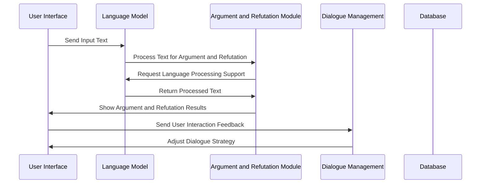

                 

## 摘要

本文深入探讨了智能辩论AI Agent，这是一种利用大型语言模型（LLM）驱动的论证与反驳系统。智能辩论AI Agent不仅在学术辩论、政治辩论、法律辩论和商业辩论等多个领域展现出巨大的潜力，还因其自动化、高效性、多样性和对话交互性等特点，改变了传统辩论的模式。本文首先介绍了智能辩论AI Agent的背景和核心概念，然后详细解析了语言模型（LLM）的工作原理和挑战，以及论证与反驳系统的设计原则和关键组件。随后，文章讨论了智能辩论AI Agent的架构设计、性能评估策略、实际应用案例，并提出了未来发展的趋势与面临的挑战。通过这一系列分析，本文旨在为读者提供一个全面、深入的智能辩论AI Agent的综述，激发更多研究和应用的思考。

## 第一部分：背景与核心概念

### 引言

#### 1.1 问题背景

随着人工智能技术的快速发展，计算机在自然语言处理（NLP）领域取得了显著突破。这引发了人工智能在辩论领域的应用热潮。传统辩论依赖于人类参与，而人工智能的引入使得辩论过程能够实现自动化和高效化。智能辩论AI Agent正是这一趋势的产物，它结合了人工智能与辩论的需求，旨在构建一种能够自主进行论证与反驳的智能系统。

#### 1.2 智能辩论的兴起与发展

智能辩论起源于对人类辩论能力的模拟和增强。早期的尝试主要集中在逻辑推理和语法分析上，但随着深度学习和自然语言处理技术的进步，智能辩论系统逐渐具备了更复杂的语言理解能力和推理能力。近年来，大型语言模型（LLM）的崛起进一步推动了智能辩论的发展。LLM具有强大的上下文理解和文本生成能力，使得智能辩论AI Agent能够更自然、更准确地表达观点和进行辩论。

#### 1.3 对辩论的需求与挑战

辩论是人类思考和交流的重要方式，它在多个领域都有广泛应用。然而，传统辩论面临着效率低、成本高和受限于人类认知能力等挑战。智能辩论AI Agent的出现，旨在解决这些挑战。它能够通过自动化和智能化的方式，快速生成高质量的论证和反驳，大幅提高辩论的效率和效果。同时，智能辩论AI Agent还能够处理大规模的辩论场景，适应不同领域的辩论需求。

### 核心概念

#### 1.4 智能辩论AI Agent

智能辩论AI Agent是一种利用人工智能技术，特别是大型语言模型（LLM），来生成论证和反驳的智能系统。它能够根据给定的论题和证据，自动构建论点和反驳，并在辩论过程中与对手进行交互。智能辩论AI Agent的核心在于其能够理解复杂的语言结构，具备逻辑推理和生成能力。

#### 1.5 语言模型（LLM）

语言模型（LLM）是一种利用大量文本数据训练得到的模型，用于预测文本序列。LLM的核心能力在于其强大的上下文理解和生成能力，这使得它能够生成连贯、自然的文本。在智能辩论AI Agent中，LLM被用来生成论证和反驳，是系统的重要组成部分。

#### 1.6 论证与反驳系统

论证与反驳系统是智能辩论AI Agent的核心组件，它负责生成论证和反驳。论证系统通过分析论题和证据，构建论点；反驳系统则通过识别对方的论点和漏洞，生成反驳。论证与反驳系统需要具备高效的推理能力和灵活的生成能力，以应对各种辩论场景。

#### 1.7 智能辩论AI Agent的特点与优势

智能辩论AI Agent具有以下特点与优势：

1. **自动化与高效性**：智能辩论AI Agent能够自动化生成论证和反驳，大幅提高辩论的效率。
2. **多样性与适应性**：智能辩论AI Agent能够处理多种类型的辩论场景，适应不同的论题和证据。
3. **对话与交互性**：智能辩论AI Agent能够与对手进行实时对话，生成动态的辩论过程。

#### 1.8 智能辩论AI Agent的应用场景

智能辩论AI Agent在多个领域具有广泛的应用前景：

1. **学术辩论**：智能辩论AI Agent能够帮助研究人员和学者快速生成高质量的研究论文和反驳意见。
2. **政治辩论**：智能辩论AI Agent能够协助政治家和政策制定者进行辩论，提高辩论的效率和效果。
3. **法律辩论**：智能辩论AI Agent能够为律师和法律学者提供强大的论证和反驳支持。
4. **商业辩论**：智能辩论AI Agent能够帮助企业制定商业策略，进行市场竞争分析。

### 总结

智能辩论AI Agent作为一种利用人工智能技术提升辩论能力的创新系统，具有广阔的应用前景。通过深入理解和掌握其核心概念和技术，我们能够更好地利用这一系统解决实际问题，推动辩论领域的进步。

### 核心概念与联系

#### 1.9 核心概念原理

为了深入理解智能辩论AI Agent，我们首先需要明确其核心概念和原理。智能辩论AI Agent的核心在于其语言处理能力和逻辑推理能力。以下是智能辩论AI Agent的两个核心概念及其原理：

1. **语言模型（LLM）**
   - **原理**：LLM是一种基于深度学习技术的语言处理模型，通过大量文本数据的学习，能够预测下一个单词或句子，从而生成连贯、自然的文本。
   - **属性特征**：
     - **上下文理解能力**：LLM能够理解文本的上下文，生成与上下文相关的文本。
     - **文本生成能力**：LLM能够根据输入的文本生成相应的文本，实现文本的自动生成。

2. **论证与反驳系统**
   - **原理**：论证与反驳系统通过逻辑推理和分析，生成论证和反驳。它包括论证生成和反驳生成两个主要部分。
   - **属性特征**：
     - **论证生成能力**：能够根据给定的论题和证据，构建逻辑上严谨的论点。
     - **反驳生成能力**：能够识别对方的论点和漏洞，生成针对性的反驳。

#### 1.10 概念属性特征对比表格

为了更直观地展示LLM和论证与反驳系统的属性特征，我们可以使用一个对比表格：

| 特征         | 语言模型（LLM）               | 论证与反驳系统                      |
| ------------ | ---------------------------- | ----------------------------------- |
| 上下文理解   | 高效理解文本上下文            | 需要上下文信息进行逻辑推理           |
| 文本生成     | 能够生成连贯、自然的文本      | 需要构建逻辑上严谨的论点和反驳       |
| 推理能力     | 基于上下文预测文本           | 基于逻辑规则和证据进行推理           |
| 适应性       | 能够适应不同的文本类型和风格  | 能够处理不同类型的论题和辩论场景     |

#### 1.11 ER实体关系图架构

为了更好地理解智能辩论AI Agent的架构，我们可以使用ER（实体-关系）图来描述其核心实体和关系。以下是智能辩论AI Agent的ER图：

```mermaid
erDiagram
    AI_Agent ||--|{ Language_Model : has }
    AI_Agent ||--|{ Argument_System : has }
    Argument_System ||--|{ Argument_Generator : has }
    Argument_System ||--|{ Refutation_Generator : has }
```

在这个ER图中，`AI_Agent` 是核心实体，它包含两个主要组件：`Language_Model` 和 `Argument_System`。`Argument_System` 进一步分为 `Argument_Generator` 和 `Refutation_Generator`，分别负责生成论证和反驳。

通过上述核心概念和联系的分析，我们可以更好地理解智能辩论AI Agent的工作原理和架构设计，为后续的技术实现和应用提供坚实的基础。

### 智能辩论AI Agent的特点与优势

#### 1.12 自动化与高效性

智能辩论AI Agent的一大特点是自动化与高效性。传统辩论依赖于人类参与，不仅耗时耗力，而且容易受到情绪和疲劳的影响。而智能辩论AI Agent通过利用先进的自然语言处理技术，能够自动化生成高质量的论证和反驳，大大提高了辩论的效率。智能辩论AI Agent可以在短时间内处理大量的信息，快速构建逻辑严谨的论点和反驳，使辩论过程更加高效。

#### 1.13 多样性与适应性

智能辩论AI Agent具有高度的多样性和适应性。它能够处理各种类型的辩论场景，无论是学术辩论、政治辩论、法律辩论还是商业辩论，智能辩论AI Agent都能够灵活应对。智能辩论AI Agent通过学习大量的文本数据，积累了丰富的知识储备和语言处理能力，使其能够生成多样化和具有针对性的论证和反驳。此外，智能辩论AI Agent还能够根据不同的论题和证据，动态调整其论证策略，以适应不同的辩论场景。

#### 1.14 对话与交互性

智能辩论AI Agent在辩论过程中具备良好的对话与交互性。它不仅能够自动生成论证和反驳，还能够与对手进行实时对话。智能辩论AI Agent能够理解对手的观点和论点，根据对方的反驳进行动态调整，生成更加精准和有力的回应。这种交互性使得辩论过程更加生动和有趣，同时也增加了辩论的深度和广度。

#### 1.15 应用案例

智能辩论AI Agent在实际应用中展现了其强大的能力。以下是一些典型的应用案例：

1. **学术辩论**：在学术研究领域，智能辩论AI Agent可以帮助学者快速生成高质量的研究论文和反驳意见。通过智能辩论AI Agent，学者可以更专注于研究和创新，而将论文的撰写和反驳工作交给智能系统，大大提高了研究效率。

2. **政治辩论**：在政治辩论中，智能辩论AI Agent可以为政治家和政策制定者提供强大的支持。智能辩论AI Agent可以分析政策文件、新闻报道和其他相关数据，生成有力的论证和反驳，帮助政治家在辩论中占据优势。

3. **法律辩论**：在法律领域，智能辩论AI Agent能够为律师和法律学者提供高效的论证和反驳支持。智能辩论AI Agent可以帮助律师分析案件细节、生成辩护词，同时能够识别对方的漏洞和反驳点，为律师提供有力的辩护支持。

4. **商业辩论**：在商业环境中，智能辩论AI Agent可以用于市场分析、竞争策略制定等。智能辩论AI Agent可以分析市场数据、竞争对手的策略，生成针对性的市场分析报告和商业策略建议，帮助企业在市场竞争中占据有利地位。

通过上述特点和优势，我们可以看到智能辩论AI Agent在多个领域的应用潜力。它不仅提高了辩论的效率和效果，还改变了传统辩论的模式，为人类提供了更加智能化和高效的辩论工具。

### 智能辩论AI Agent的应用场景

#### 1.16 学术辩论

在学术辩论中，智能辩论AI Agent展现出了其独特的优势。学术辩论通常涉及复杂的理论和大量的文献资料，对参与者的逻辑思维和语言表达能力要求极高。智能辩论AI Agent能够快速分析相关文献，生成严谨的论点和反驳，帮助学者在辩论中占据有利位置。此外，智能辩论AI Agent还能够根据实时更新的学术研究，动态调整辩论策略，使辩论更加深入和全面。

#### 1.17 政治辩论

政治辩论是智能辩论AI Agent的另一个重要应用场景。政治辩论涉及广泛的话题，如经济政策、社会问题和国际关系等。智能辩论AI Agent能够分析大量的政治文献、新闻报道和专家观点，生成精准的论证和反驳。它可以帮助政治家和政策制定者准备辩论素材，提高辩论的针对性和说服力。在实时辩论中，智能辩论AI Agent还能够实时回应对方的论点，进行有效的反驳，从而增强辩论的效果。

#### 1.18 法律辩论

在法律辩论中，智能辩论AI Agent能够提供强大的支持。法律辩论通常涉及复杂的法律条文和案例，对辩论者的法律素养和逻辑思维能力要求极高。智能辩论AI Agent能够快速检索和解析大量的法律文献和案例，生成逻辑严密的法律论点和反驳。它可以帮助律师在辩论中找到对方的漏洞，提出有力的反驳，从而提高辩论的胜算。同时，智能辩论AI Agent还能够提供实时法律咨询，帮助律师在辩论过程中快速应对各种法律问题。

#### 1.19 商业辩论

商业辩论在市场竞争和企业策略制定中扮演着重要角色。智能辩论AI Agent能够分析市场数据、竞争对手的策略和客户反馈，生成有针对性的商业辩论素材。它可以帮助企业制定有效的市场策略，反驳竞争对手的观点，提高市场竞争力。在商业谈判中，智能辩论AI Agent还能够生成有力的论点和反驳，帮助企业争取利益最大化。通过智能辩论AI Agent的支持，企业可以更加高效地应对市场变化和商业挑战。

#### 1.20 其他应用场景

除了上述主要应用场景外，智能辩论AI Agent在其他领域也具有广泛的应用潜力。例如，在教育领域，智能辩论AI Agent可以作为辅助教学工具，帮助学生提高辩论能力；在新闻媒体领域，智能辩论AI Agent可以生成新闻评论和反驳意见，提供多样化的新闻内容；在科学研究和创新领域，智能辩论AI Agent可以协助科研人员分析研究结论，提出有价值的反驳和建议。

综上所述，智能辩论AI Agent在学术辩论、政治辩论、法律辩论、商业辩论以及其他多个领域具有广泛的应用前景。它不仅提高了辩论的效率和效果，还为各领域的从业者提供了强大的智能支持。随着技术的不断进步，智能辩论AI Agent的应用范围将不断扩展，为人类带来更多的便利和创新。

### 第二部分：智能辩论AI Agent的基础技术

#### 2.1 语言模型（LLM）

#### 2.1.1 概述

语言模型（Language Model，简称LM）是自然语言处理（Natural Language Processing，简称NLP）领域的重要基础技术之一。它是一种用于预测文本序列的模型，通过学习大量文本数据，能够对下一个单词或句子进行概率预测。在智能辩论AI Agent中，语言模型被广泛应用于论证生成、反驳生成以及对话管理等方面。

#### 2.1.2 语言模型的基本原理

语言模型的基本原理基于统计学习和概率预测。具体来说，语言模型通过分析大量文本数据，学习词汇之间的统计关系，并使用这些关系来预测下一个单词或句子。早期的语言模型主要基于N-gram模型，该模型通过统计相邻N个单词的概率来预测下一个单词。随着深度学习技术的发展，现代语言模型逐渐采用基于神经网络的模型，如循环神经网络（RNN）、长短期记忆网络（LSTM）和Transformer等。

1. **N-gram模型**：N-gram模型是一种基于统计方法的简单语言模型。它通过统计相邻N个单词出现的频率来预测下一个单词。例如，在二元N-gram模型中，每个单词的概率是由其前一个单词决定的。N-gram模型计算简单，但在长文本中表现较差，因为它无法捕捉到长距离的依赖关系。

2. **循环神经网络（RNN）**：RNN是一种能够处理序列数据的神经网络，通过循环结构将前一个时间步的信息传递到当前时间步。RNN在处理长文本时表现优于N-gram模型，但存在梯度消失和梯度爆炸等问题。

3. **长短期记忆网络（LSTM）**：LSTM是RNN的一种改进模型，通过引入记忆单元和门控机制，解决了RNN的梯度消失问题。LSTM在处理长文本和复杂语言结构方面表现优异。

4. **Transformer**：Transformer是一种基于自注意力机制的深度神经网络模型，它在处理长文本和跨序列依赖关系方面表现出色。Transformer通过多头自注意力机制和前馈神经网络，能够同时捕捉到文本中的长距离依赖关系。

#### 2.1.3 语言模型的分类

语言模型主要可以分为以下几类：

1. **基于规则的模型**：这类模型通过定义语法规则和词汇语义来预测文本序列。例如，语法分析器（Parser）和词法分析器（Tokenizer）。

2. **基于统计的模型**：这类模型通过统计文本数据中的词频和共现关系来预测文本序列。N-gram模型是典型的基于统计的模型。

3. **基于神经网络的模型**：这类模型通过训练大规模的神经网络来预测文本序列。包括RNN、LSTM和Transformer等。

#### 2.1.4 语言模型的发展历程

语言模型的发展历程可以分为以下几个阶段：

1. **早期语言模型**：以N-gram模型为代表，通过简单的统计方法预测文本序列。

2. **基于神经网络的模型**：随着深度学习技术的发展，RNN和LSTM等基于神经网络的模型逐渐应用于语言模型。

3. **Transformer模型**：自注意力机制的引入使得Transformer模型在自然语言处理领域取得了突破性进展，成为当前最先进的语言模型。

4. **多模态语言模型**：近年来，多模态语言模型（如BERT、GPT）的出现，使得语言模型能够处理图像、音频等多种模态的数据，进一步拓展了语言模型的应用范围。

#### 2.1.5 语言模型的工作原理

语言模型的工作原理主要包括以下几个步骤：

1. **词嵌入（Word Embedding）**：将文本中的单词转换为向量表示，这是语言模型的基础。词嵌入通过学习单词之间的语义关系，使相似单词的向量接近。

2. **上下文理解**：语言模型需要理解上下文信息，以预测下一个单词或句子。这通常通过自注意力机制（Self-Attention）实现，模型能够捕捉到不同单词之间的依赖关系。

3. **文本生成**：语言模型通过递归或自注意力机制，生成下一个单词或句子。生成过程通常使用概率分布，模型根据当前上下文选择最有可能的单词。

4. **优化与训练**：语言模型通过大量文本数据进行训练，优化模型参数，以提高预测的准确性。训练过程通常采用梯度下降和反向传播算法。

#### 2.1.6 语言模型的主要挑战

尽管语言模型在自然语言处理领域取得了巨大成功，但仍然面临一些主要挑战：

1. **数据集质量与多样性**：语言模型的效果高度依赖于训练数据的质量和多样性。数据集中存在的噪声和偏见会影响模型的表现。

2. **模型可解释性**：深度神经网络模型通常具有很高的预测能力，但缺乏可解释性。理解模型的决策过程和错误原因是一个重要挑战。

3. **能效比**：随着模型规模的增加，计算资源和能耗也显著增加。提高模型的能效比，以适应资源受限的环境，是一个关键问题。

4. **泛化能力**：模型在训练数据上表现优异，但在新数据上可能表现不佳。提高模型的泛化能力，使其能够适应不同的应用场景，是一个重要目标。

通过深入理解和解决这些挑战，语言模型将在自然语言处理和智能辩论AI Agent领域发挥更大的作用。

#### 2.2 语言模型的工作原理

要深入理解语言模型的工作原理，我们需要从词嵌入、上下文理解、文本生成和模型优化等关键环节进行详细阐述。

#### 2.2.1 词嵌入（Word Embedding）

词嵌入是将文本中的单词转换为一个固定大小的向量表示的过程。这一步骤是语言模型的基础，因为向量表示能够捕捉单词的语义信息。词嵌入方法主要有以下几种：

1. **基于分布的词嵌入（Distributed Word Embedding）**：这种方法将每个单词映射为一个向量，使得语义上相似的单词在向量空间中更接近。Word2Vec是典型的基于分布的词嵌入方法，它通过训练上下文词向量来捕获单词的语义。

2. **基于矩阵分解的词嵌入（Matrix Factorization）**：这种方法通过矩阵分解将词汇表映射到低维空间，从而生成词向量。例如，Singular Value Decomposition（SVD）可以用来分解词汇矩阵，生成高质量的词向量。

3. **基于神经网络的词嵌入（Neural Network Word Embedding）**：这种方法通过神经网络模型学习词向量，如词嵌入层（Embedding Layer）在神经网络中的使用，使得模型能够自动学习单词的语义关系。

#### 2.2.2 上下文理解

上下文理解是语言模型的核心能力之一，它使得模型能够根据文本的上下文信息来预测下一个单词或句子。这一过程通常通过以下技术实现：

1. **循环神经网络（RNN）**：RNN通过递归结构处理序列数据，使模型能够捕捉到文本中的长距离依赖关系。RNN的基本单元包括输入门、遗忘门和输出门，这些门控机制使得RNN能够更好地处理序列数据。

2. **长短期记忆网络（LSTM）**：LSTM是RNN的一种改进模型，通过引入记忆单元和门控机制，解决了RNN的梯度消失问题。LSTM能够更好地捕捉长期依赖关系，在自然语言处理任务中表现出色。

3. **Transformer**：Transformer是一种基于自注意力机制的深度神经网络模型，它通过多头自注意力机制（Multi-head Self-Attention）和前馈神经网络（Feedforward Neural Network）同时捕捉到文本中的长距离依赖关系。自注意力机制使得Transformer能够捕捉到不同单词之间的依赖关系，从而实现高效的上下文理解。

#### 2.2.3 文本生成

文本生成是语言模型的重要应用之一，它通过递归或自注意力机制生成下一个单词或句子。以下是几种常见的文本生成方法：

1. **递归生成**：递归生成方法包括RNN和LSTM，这些模型通过递归结构生成文本序列。在生成过程中，模型根据当前上下文预测下一个单词，并更新上下文状态。

2. **自注意力生成**：自注意力生成方法如Transformer，通过自注意力机制生成文本序列。在自注意力机制中，模型能够根据不同的上下文信息，动态调整对每个单词的权重，从而生成更连贯的文本。

3. **贪心搜索**：贪心搜索是一种简单的文本生成方法，它通过选择当前状态下的最优词来生成文本。虽然贪心搜索生成的文本可能不是最优的，但它计算简单，易于实现。

4. **概率生成**：概率生成方法通过计算每个单词的概率分布，选择概率最高的单词作为生成结果。这种方法能够生成多样化和连贯的文本，但可能存在生成文本质量不稳定的问题。

#### 2.2.4 模型优化

为了提高语言模型的性能，我们需要对模型进行优化。以下是几种常见的模型优化方法：

1. **权重初始化**：合适的权重初始化可以加快模型的收敛速度。常用的方法包括随机初始化、高斯分布初始化和Xavier初始化等。

2. **正则化**：正则化方法通过增加模型的复杂度，防止模型过拟合。常用的正则化方法包括L1正则化、L2正则化和Dropout等。

3. **学习率调度**：学习率调度通过动态调整学习率，防止模型过早收敛。常用的方法包括学习率衰减、恒定学习率和自适应学习率等。

4. **优化算法**：优化算法用于调整模型参数，以最小化损失函数。常用的优化算法包括梯度下降（Gradient Descent）、Adam优化器和Adagrad等。

通过上述详细的阐述，我们可以看到语言模型在词嵌入、上下文理解、文本生成和模型优化等方面具有复杂的工作原理。这些原理共同作用，使得语言模型能够实现强大的语言理解和生成能力，为智能辩论AI Agent提供基础支持。

#### 2.3 语言模型的主要挑战

尽管语言模型在自然语言处理领域取得了显著成就，但仍然面临着一些关键挑战，这些问题直接影响其性能和应用效果。

#### 2.3.1 数据集质量与多样性

语言模型的训练效果高度依赖于数据集的质量和多样性。高质量的数据集应包含丰富的语言现象和真实世界的多样性，但现实中往往存在以下问题：

1. **数据噪声**：真实数据往往包含拼写错误、歧义和标点符号错误等噪声，这些噪声会影响模型的训练效果。

2. **数据不平衡**：数据集中某些类别的样本数量远多于其他类别，导致模型在少数类别上的性能较差。

3. **数据标注问题**：数据标注的质量直接影响模型的学习效果。错误的标注会导致模型学习到错误的模式，从而影响其泛化能力。

为了解决这些问题，研究人员可以采取以下措施：

- **数据清洗**：通过去除噪声和错误标注的数据，提高数据集的整体质量。
- **数据增强**：通过数据变换、生成对抗网络（GAN）等技术，增加数据集的多样性和丰富性。
- **数据对齐**：使用跨语言数据集和翻译数据，对齐不同语言之间的词汇和语义，提高模型的泛化能力。

#### 2.3.2 模型可解释性

深度神经网络模型，尤其是像Transformer这样的复杂模型，往往具有很高的预测能力，但缺乏可解释性。可解释性问题主要体现在以下几个方面：

1. **内部决策过程**：深度神经网络通过多层非线性变换处理输入数据，但内部决策过程复杂，难以直观理解。

2. **错误原因分析**：当模型做出错误预测时，难以分析错误的原因，这限制了其在关键应用场景中的可靠性。

3. **偏见和歧视**：在某些情况下，模型可能会学习到数据中的偏见和歧视，从而在决策过程中表现出不公平性。

为了提高模型的可解释性，可以采取以下措施：

- **模型可视化**：通过可视化技术，如神经网络激活图和注意力分布图，直观展示模型的工作机制。
- **特征解释**：使用可解释性模型，如决策树和规则提取方法，解释模型的内部决策过程。
- **对抗性测试**：通过对抗性样本测试，评估模型在不同输入下的稳定性和可靠性。

#### 2.3.3 能效比

随着模型规模的增加，计算资源和能耗显著增加。特别是在移动设备和边缘计算环境中，模型的能效比成为一个关键问题。以下是一些提高能效比的策略：

1. **模型压缩**：通过模型剪枝、量化、知识蒸馏等技术，减少模型参数和计算量。
2. **低精度计算**：使用低精度浮点运算，如FP16和BF16，降低计算资源消耗。
3. **硬件加速**：利用GPU、TPU等硬件加速器，提高模型的处理速度和效率。
4. **动态资源管理**：根据模型的实际需求和负载，动态调整计算资源和功耗。

通过解决上述挑战，语言模型将进一步提升其性能和应用效果，为智能辩论AI Agent和其他自然语言处理应用提供更强有力的支持。

#### 2.4 论证与反驳的基本概念

论证与反驳是智能辩论AI Agent的核心功能，理解其基本概念对于构建高效的智能辩论系统至关重要。

#### 2.4.1 论证的结构

论证是一种基于逻辑推理的过程，通过提供证据和理由来支持某个观点或主张。一个完整的论证通常包括以下几个基本组成部分：

1. **论点（Conclusion）**：论证的核心观点或主张，是论证者希望听众接受的观点。
2. **理由（Reasons）**：支持论点的一系列理由，可以是事实、数据、逻辑推理等。
3. **假设（Premises）**：提供理由的基础，是论证中的前提条件。
4. **前提条件（Conditions）**：论证有效性的必要条件，即前提必须真实且逻辑上成立。

一个典型的论证结构如下：

- **假设**：所有天鹅都是白色的。
- **理由**：我们在世界各地观察到的天鹅都是白色的。
- **论点**：因此，所有天鹅都是白色的。

#### 2.4.2 反驳的类型

反驳是针对对方论证中的弱点或错误进行攻击的过程。反驳可以分为以下几种类型：

1. **直接反驳（Direct Refutation）**：直接指出对方论证中的错误，否定其论点或理由。例如，如果对方认为所有天鹅都是白色的，我们可以提供一个观察到的黑天鹅实例来反驳。
2. **间接反驳（Indirect Refutation）**：通过提出反例或指出对方论证的逻辑漏洞来削弱其论点。例如，如果对方认为所有天鹅都是白色的，我们可以指出观察到的样本不足，无法代表所有天鹅。
3. **反驳前提（Undermining Premises）**：质疑对方论证中的前提条件是否真实或有效。例如，如果对方认为所有天鹅都是白色的，前提是观察到的天鹅都是白色的，我们可以质疑这些观察的真实性。
4. **反驳结论（Undermining Conclusion）**：直接否定对方论点的有效性，即使前提条件成立。例如，如果对方认为所有天鹅都是白色的，我们可以指出白色并不是天鹅的唯一特征。

#### 2.4.3 论证与反驳的交互

论证与反驳在辩论过程中是动态交互的。一个有效的辩论不仅需要构建强有力的论证，还需要能够有效应对对方的反驳。以下是论证与反驳的交互过程：

1. **提出论证**：辩论者首先提出自己的论证，包括论点、理由和假设。
2. **识别反驳点**：对方根据对方的论证，寻找反驳点，可能是论证中的错误、前提的不真实或结论的不合理性。
3. **构建反驳**：辩论者利用反驳点，构建针对对方论证的反驳，包括直接反驳、间接反驳等。
4. **反驳反驳**：对方针对对方的反驳进行回应，进一步强化自己的论证或反驳对方的反驳。
5. **动态调整**：辩论双方根据对方的反驳，动态调整自己的论证策略，形成辩论的迭代过程。

通过上述分析，我们可以看到论证与反驳在智能辩论AI Agent中的关键作用。理解论证的结构和反驳的类型，有助于构建高效的论证与反驳系统，提高智能辩论AI Agent的辩论能力和有效性。

#### 2.5 论证与反驳系统的设计原则

设计一个高效的论证与反驳系统需要遵循一系列关键原则，以确保系统能够在复杂多变的辩论环境中有效运作。

#### 2.5.1 数据驱动的知识表示

数据驱动的知识表示是构建高效论证与反驳系统的核心原则之一。通过大量高质量的训练数据，系统能够学习到不同类型的论证和反驳策略。以下是一些关键步骤：

1. **数据收集**：收集涵盖各种主题和论题的辩论数据，包括文本、音频和视频等多模态数据。
2. **数据预处理**：对收集到的数据进行清洗和标注，去除噪声，确保数据的质量和一致性。
3. **知识提取**：从预处理后的数据中提取关键信息，如论点、理由、反驳点和反驳策略，构建知识库。

#### 2.5.2 模式识别与推理

模式识别与推理是论证与反驳系统的关键能力。系统能够识别和理解辩论中的模式，基于已有知识进行推理，生成新的论证和反驳。以下是一些关键原则：

1. **特征提取**：从文本数据中提取关键特征，如关键词、句法结构和语义关系，用于模式识别。
2. **逻辑推理**：使用逻辑规则和推理算法，如命题逻辑和谓词逻辑，对提取的特征进行推理，构建论证和反驳。
3. **自适应学习**：系统应具备自适应学习能力，根据辩论环境的变化和用户需求，动态调整推理策略。

#### 2.5.3 对话管理

对话管理是确保辩论过程流畅和有效的关键。系统能够理解辩论的上下文，管理对话流程，并动态调整论证策略。以下是一些关键原则：

1. **上下文理解**：系统应具备上下文理解能力，能够理解辩论中的论题、观点和反驳，基于上下文信息生成论证和反驳。
2. **对话生成**：系统应能够生成连贯、自然的对话，包括论点、反驳和回应，确保辩论过程的流畅性。
3. **对话策略**：系统应具备多种对话策略，如主动进攻、防守和妥协，根据辩论环境动态调整对话策略。

#### 2.5.4 用户交互

用户交互是论证与反驳系统与用户之间的桥梁。系统应提供直观的用户界面，使用户能够方便地输入论题和证据，获取论证和反驳结果。以下是一些关键原则：

1. **用户友好的界面**：设计直观、易用的用户界面，使用户能够轻松输入论题和证据，查看论证和反驳结果。
2. **实时反馈**：系统应能够实时反馈论证和反驳的结果，帮助用户理解辩论过程。
3. **个性化服务**：系统应具备个性化服务能力，根据用户的需求和偏好，提供定制化的论证和反驳支持。

通过遵循上述设计原则，我们可以构建一个高效、灵活和用户友好的论证与反驳系统，为智能辩论AI Agent提供强大的支持。

#### 2.6 论证与反驳系统的关键组件

论证与反驳系统的实现涉及多个关键组件，这些组件相互协作，共同确保系统在辩论过程中能够有效生成论证和反驳。以下是对这些关键组件的详细描述：

#### 2.6.1 数据预处理

数据预处理是构建高效论证与反驳系统的第一步，其重要性不容忽视。数据预处理主要包括以下几个步骤：

1. **文本清洗**：文本清洗的目的是去除文本中的噪声，如HTML标签、特殊字符和无关信息。通过正则表达式和自然语言处理技术，可以将文本转换为干净的格式。
2. **分词**：分词是将文本拆分成单词或短语的过程。常用的分词方法包括基于词典的分词和基于统计的分词。分词质量直接影响后续处理的效果，因此选择合适的分词方法至关重要。
3. **词性标注**：词性标注是将文本中的每个单词标记为其对应的词性，如名词、动词、形容词等。词性标注有助于理解文本的语法结构和语义信息。
4. **实体识别**：实体识别是从文本中提取出重要的实体信息，如人名、地点、组织等。实体识别对于构建知识库和生成有针对性的论证和反驳具有重要意义。

#### 2.6.2 论证生成

论证生成是论证与反驳系统的核心功能之一，它负责从给定的论题和证据中构建逻辑上严谨的论点。论证生成的主要步骤包括：

1. **论点提取**：通过自然语言处理技术，从文本中提取关键论点。这通常涉及模式识别和语义分析，以确保提取的论点具有代表性。
2. **论据构建**：根据提取的论点，从文本数据中查找支持论点的证据和理由。论据构建需要考虑证据的可信度和相关性，以构建具有说服力的论证。
3. **逻辑推理**：使用逻辑推理算法，如命题逻辑和谓词逻辑，对论点和论据进行推理，构建完整的论证结构。逻辑推理能够确保论证的严谨性和逻辑一致性。
4. **论证优化**：通过对论证进行优化，提高其表达清晰度和说服力。论证优化可以包括文本重写、逻辑简化等步骤。

#### 2.6.3 反驳生成

反驳生成是论证与反驳系统的另一个核心功能，它负责识别对方的论点和漏洞，并生成针对性的反驳。反驳生成的主要步骤包括：

1. **反驳点识别**：通过模式识别和语义分析，识别对方论证中的弱点，如逻辑漏洞、事实错误等。
2. **反驳构建**：基于识别出的反驳点，构建针对对方论点的反驳。反驳构建需要考虑反驳的策略和力度，以确保反驳具有说服力。
3. **反驳验证**：对生成的反驳进行验证，确保其逻辑上成立且具有针对性。反驳验证可以包括逻辑推理和语义分析等步骤。
4. **反驳优化**：通过对反驳进行优化，提高其表达清晰度和说服力。反驳优化可以包括文本重写、逻辑强化等步骤。

#### 2.6.4 对话管理

对话管理是确保辩论过程流畅和有效的关键组件，它负责管理辩论的流程和交互。对话管理的主要步骤包括：

1. **上下文理解**：通过自然语言处理技术，理解辩论中的上下文信息，如论题、观点和反驳。上下文理解有助于系统在对话中保持一致性。
2. **对话生成**：基于上下文信息，生成连贯、自然的对话文本，包括论点、反驳和回应。对话生成需要考虑对话的连贯性和流畅性。
3. **对话策略**：根据辩论环境和用户需求，动态调整对话策略，如主动进攻、防守和妥协。对话策略有助于系统在辩论中取得优势。
4. **对话评估**：对对话效果进行评估，包括对话的流畅度、逻辑一致性和说服力等。对话评估有助于系统优化对话生成和交互策略。

通过上述关键组件的协同工作，论证与反驳系统能够在辩论过程中有效生成论证和反驳，为智能辩论AI Agent提供强大的支持。

### 第三部分：智能辩论AI Agent的实现与优化

#### 3.1 智能辩论AI Agent的架构设计

智能辩论AI Agent的架构设计是确保其能够高效、准确地进行论证和反驳的关键。一个合理的系统架构不仅能够提升系统的性能，还能增强其可维护性和扩展性。以下是智能辩论AI Agent的架构设计：

##### 3.1.1 系统架构概述

智能辩论AI Agent的架构可以分为以下几个主要模块：

1. **用户接口（User Interface，UI）**：负责与用户进行交互，接收用户输入，展示系统生成的论证和反驳结果。
2. **语言模型（Language Model）**：负责文本理解和生成，是整个系统的核心，包括词嵌入、上下文理解和文本生成等功能。
3. **论证与反驳模块（Argument and Refutation Module）**：负责生成论证和反驳，包括论点提取、论据构建、反驳构建和优化等步骤。
4. **对话管理（Dialogue Management）**：负责管理辩论过程，包括上下文理解、对话生成和策略调整等。
5. **数据库（Database）**：存储训练数据和生成结果，包括论题、证据、论证和反驳等。

各个模块之间的关系如下：

- **用户接口**通过HTTP请求与**论证与反驳模块**和**对话管理**进行交互，接收用户输入并展示结果。
- **语言模型**与**论证与反驳模块**和**对话管理**紧密集成，为其提供文本理解和生成能力。
- **数据库**为**语言模型**和**论证与反驳模块**提供训练数据和存储空间。

##### 3.1.2 系统模块间的关系

以下是智能辩论AI Agent的系统模块间关系的Mermaid架构图：



在这个架构图中，用户接口（UI）通过发送输入文本到语言模型（LM），语言模型处理后返回给论证与反驳模块（AM）。论证与反驳模块生成论证和反驳结果，然后通过用户接口展示给用户。同时，用户接口接收用户反馈，传递给对话管理模块（DM），对话管理模块根据反馈调整对话策略。

通过上述架构设计，智能辩论AI Agent能够高效、准确地处理辩论过程中的各种任务，为用户提供强大的辩论支持。

#### 3.2 语言模型集成

在智能辩论AI Agent的架构设计中，语言模型（LLM）的集成是关键的一步。语言模型不仅需要与系统的其他模块紧密配合，还需要在性能和效率上达到一定的标准。以下是语言模型集成的详细步骤：

##### 3.2.1 语言模型的选择

首先，需要选择合适的语言模型作为智能辩论AI Agent的核心。目前，常见的语言模型包括GPT（Generative Pre-trained Transformer）、BERT（Bidirectional Encoder Representations from Transformers）和T5（Text-to-Text Transfer Transformer）等。以下是几种常见语言模型的特点：

1. **GPT**：GPT是一种基于Transformer的自回归语言模型，具有强大的文本生成能力。GPT-3更是展示了卓越的文本理解和生成能力。
2. **BERT**：BERT是一种双向Transformer模型，能够同时捕捉文本的前后依赖关系，具有较强的上下文理解能力。
3. **T5**：T5是一种文本到文本的Transformer模型，具有灵活的架构和广泛的应用场景。

在选择语言模型时，需要考虑以下因素：

- **性能**：语言模型的性能直接影响系统的文本处理能力。选择具有高性能的语言模型，可以确保系统在处理大量文本数据时仍能保持高效。
- **可扩展性**：语言模型的可扩展性决定了系统能够处理不同规模的数据和应用场景。选择可扩展性强的模型，可以方便后续的扩展和优化。
- **可解释性**：语言模型的可解释性对于理解模型决策过程和优化系统至关重要。选择具有一定可解释性的模型，有助于提升系统的可靠性和用户信任度。

根据实际需求和上述因素，可以选择合适的语言模型进行集成。

##### 3.2.2 集成过程

集成语言模型主要包括以下步骤：

1. **加载预训练模型**：从预训练模型库中加载预训练的语言模型，如GPT-3、BERT或T5等。加载模型时，需要确保模型参数的正确性和完整性。
2. **微调模型**：在加载预训练模型的基础上，根据特定任务进行微调。微调过程包括调整模型权重、添加新的训练数据等。微调有助于模型更好地适应特定任务，提高性能。
3. **接口设计与实现**：设计并实现与语言模型交互的API接口，确保系统其他模块能够方便地调用语言模型的功能。接口设计应考虑模型输入输出格式、调用频率和并发处理能力等。
4. **性能优化**：对语言模型进行性能优化，包括模型量化、剪枝、并行处理等。性能优化可以显著提升系统的处理速度和效率，确保在实时辩论环境中能够正常运行。

通过上述步骤，可以将选定的语言模型集成到智能辩论AI Agent中，为其提供强大的文本处理能力。

#### 3.3 论证与反驳系统的实现

论证与反驳系统的实现是智能辩论AI Agent的核心组成部分。该系统需要能够自动生成高质量、逻辑严密的论证和反驳，以支持辩论过程中的各种需求。以下是论证与反驳系统的实现步骤：

##### 3.3.1 论证的自动生成

论证的自动生成包括以下几个关键步骤：

1. **论点提取**：从输入的文本中提取关键论点。论点通常是文本中表达明确、具有逻辑结构的句子或段落。提取论点的方法可以基于自然语言处理技术，如句法分析、实体识别和语义角色标注等。
2. **论据构建**：根据提取的论点，从文本数据中查找支持论点的证据和理由。论据可以是事实、数据、引用等，构建论据的方法包括文本检索、文本相似性分析和逻辑推理等。
3. **逻辑推理**：使用逻辑推理算法，如命题逻辑和谓词逻辑，对论点和论据进行推理，构建完整的论证结构。逻辑推理能够确保论证的严谨性和逻辑一致性。
4. **论证优化**：对生成的论证进行优化，提高其表达清晰度和说服力。论证优化可以包括文本重写、逻辑简化等步骤。

##### 3.3.2 反驳的自动生成

反驳的自动生成包括以下几个关键步骤：

1. **反驳点识别**：通过模式识别和语义分析，识别对方论证中的弱点，如逻辑漏洞、事实错误等。反驳点识别可以基于预定义的规则库和机器学习算法，如序列标注和分类模型等。
2. **反驳构建**：基于识别出的反驳点，构建针对对方论点的反驳。反驳构建需要考虑反驳的策略和力度，以确保反驳具有说服力。反驳构建的方法包括文本生成、模板匹配和规则推理等。
3. **反驳验证**：对生成的反驳进行验证，确保其逻辑上成立且具有针对性。反驳验证可以包括逻辑推理和语义分析等步骤。
4. **反驳优化**：通过对反驳进行优化，提高其表达清晰度和说服力。反驳优化可以包括文本重写、逻辑强化等步骤。

##### 3.3.3 对话管理

对话管理是确保辩论过程流畅和有效的关键。对话管理包括以下几个方面：

1. **上下文理解**：通过自然语言处理技术，理解辩论中的上下文信息，如论题、观点和反驳。上下文理解有助于系统在对话中保持一致性。
2. **对话生成**：基于上下文信息，生成连贯、自然的对话文本，包括论点、反驳和回应。对话生成的方法可以基于语言模型和模板匹配等技术。
3. **对话策略**：根据辩论环境和用户需求，动态调整对话策略，如主动进攻、防守和妥协。对话策略有助于系统在辩论中取得优势。

通过上述实现步骤，论证与反驳系统能够自动生成高质量的论证和反驳，为智能辩论AI Agent提供强大的支持。

#### 3.4 智能辩论AI Agent的性能评估

智能辩论AI Agent的性能评估是验证系统效果、识别改进空间的重要环节。为了全面评估智能辩论AI Agent的性能，我们需要定义一系列评估指标，并设计合理的实验方法。

##### 3.4.1 评估指标

在智能辩论AI Agent的性能评估中，以下指标是关键：

1. **论证质量**：论证质量是评估系统生成论证的严谨性和说服力。评估方法可以包括逻辑一致性检查、论据可信度评分等。
2. **反驳力度**：反驳力度是评估系统生成反驳的针对性和有效性。评估方法可以包括反驳的准确率、逻辑漏洞识别率等。
3. **响应时间**：响应时间是评估系统处理辩论请求的速度。低响应时间表明系统具有较高的效率和实时性。
4. **用户满意度**：用户满意度是评估用户对系统生成论证和反驳的接受程度。可以通过用户调查和反馈问卷等方法收集数据。

##### 3.4.2 实验方法

为了科学地评估智能辩论AI Agent的性能，我们需要设计合理的实验方法。以下是一个典型的实验方法：

1. **实验设计**：选择具有代表性的辩论场景和数据集，设计实验方案。实验方案应涵盖不同类型的论题和辩论环境，确保评估结果具有广泛适用性。
2. **实验实施**：在实验环境中部署智能辩论AI Agent，并按照实验方案执行辩论请求。记录系统的响应时间、生成的论证和反驳结果，以及用户的反馈。
3. **数据收集**：收集实验过程中的数据，包括系统生成的论证和反驳、用户满意度评分等。
4. **数据分析**：使用统计分析和机器学习算法，分析实验数据，计算评估指标。例如，可以通过逻辑一致性检查算法评估论证质量，通过分类算法评估反驳力度。
5. **结果展示**：将评估结果以图表、文字等形式展示，清晰反映智能辩论AI Agent的性能。

通过上述实验方法，我们能够全面评估智能辩论AI Agent的性能，识别其优点和不足，为后续优化提供依据。

#### 3.5 实验设计与实施

为了验证智能辩论AI Agent的性能，我们需要设计一个详尽的实验方案，并按照该方案实施实验。以下是一个典型的实验设计与实施流程：

##### 3.5.1 实验设计

1. **实验目标**：验证智能辩论AI Agent在生成论证和反驳方面的能力，评估其响应时间、论证质量和反驳力度。
2. **实验环境**：搭建一个包含硬件设备（如高性能服务器、GPU加速器）和软件环境（如深度学习框架、自然语言处理库）的实验平台。
3. **实验数据**：选择涵盖不同论题和辩论场景的辩论数据集，数据集应包含论点、论据、反驳点和相关证据。常用的数据集包括多领域辩论数据集、政治辩论数据集和法律辩论数据集等。
4. **评价指标**：定义一系列评价指标，包括响应时间、论证质量（逻辑一致性、论据可信度）、反驳力度（准确率、逻辑漏洞识别率）和用户满意度。

##### 3.5.2 实验步骤

1. **数据准备**：清洗和标注实验数据集，确保数据质量。对文本数据进行分词、词性标注和实体识别等预处理操作。
2. **模型训练**：在实验环境中训练智能辩论AI Agent的语言模型和论证与反驳模块。使用预训练的深度学习模型（如GPT-3、BERT等），并进行微调以适应特定任务。
3. **实验设置**：配置实验参数，包括语言模型的选择、训练数据的比例、模型超参数等。
4. **实验实施**：运行实验，记录智能辩论AI Agent在处理辩论请求时的响应时间、生成的论证和反驳结果，以及用户的反馈。实验应涵盖多种辩论场景，确保结果的全面性。
5. **数据收集**：收集实验过程中的数据，包括系统生成的论证和反驳文本、用户满意度评分、系统响应时间等。
6. **数据分析**：使用统计分析和机器学习算法分析实验数据，计算各项评价指标。例如，可以通过逻辑一致性检查算法评估论证质量，通过分类算法评估反驳力度。
7. **结果展示**：将评估结果以图表、文字等形式展示，清晰反映智能辩论AI Agent的性能。

通过上述实验设计与实施流程，我们能够全面评估智能辩论AI Agent的性能，为后续优化提供可靠的数据支持。

#### 3.6 性能优化策略

为了提升智能辩论AI Agent的性能，我们需要采取一系列性能优化策略。以下是一些有效的性能优化方法：

##### 3.6.1 模型调参

模型调参是提升模型性能的关键步骤。通过调整模型超参数，如学习率、批次大小、隐藏层尺寸等，可以优化模型在特定任务上的表现。以下是几种常见的调参方法：

1. **网格搜索（Grid Search）**：在给定的参数空间内，逐一尝试所有可能的参数组合，选择性能最好的参数组合。这种方法虽然计算量大，但能够找到最优参数。
2. **随机搜索（Random Search）**：从参数空间中随机选择参数组合进行尝试，通过统计方法评估参数组合的性能。随机搜索的计算量相对较小，但能够找到性能较好的参数组合。
3. **贝叶斯优化（Bayesian Optimization）**：利用贝叶斯统计模型，根据已有的实验结果，预测下一个最佳的参数组合。贝叶斯优化能够有效减少搜索空间，提高调参效率。

##### 3.6.2 数据增强

数据增强是通过增加数据多样性来提升模型性能的方法。以下是一些常见的数据增强技术：

1. **文本重写（Text Rewriting）**：通过改变文本的句子结构、词汇和语法，生成新的文本样本。文本重写可以增加数据集的多样性，有助于模型泛化。
2. **数据扩充（Data Augmentation）**：通过在原始数据上进行变换，生成新的数据样本。例如，对图像进行旋转、缩放、裁剪等操作，对文本进行同义词替换、随机插入和删除等操作。
3. **对抗性样本生成（Adversarial Sample Generation）**：生成对抗性样本，以测试模型的鲁棒性和泛化能力。对抗性样本通过在输入数据上添加微小的扰动，使得模型难以区分正常数据和对抗性样本。

##### 3.6.3 对话策略优化

对话策略优化是提升智能辩论AI Agent对话能力的重要手段。以下是一些对话策略优化方法：

1. **多策略融合**：结合不同的对话策略，如主动进攻、防守和妥协，生成多样化的对话回应。通过策略融合，智能辩论AI Agent能够在不同场景下表现出更强的适应性和灵活性。
2. **策略评估**：使用评估指标（如对话流畅度、用户满意度等）评估不同对话策略的性能，选择最优策略。策略评估可以通过实验方法进行，也可以使用机器学习算法自动优化策略。
3. **动态策略调整**：根据对话环境和用户反馈，动态调整对话策略。例如，当用户表现出不满意度时，智能辩论AI Agent可以尝试改变对话策略，以提升用户体验。

通过上述性能优化策略，我们可以显著提升智能辩论AI Agent的性能，使其在更广泛的辩论场景中表现出更强的能力和适应性。

### 案例分析

#### 6.1 案例一：政治辩论中的应用

在政治辩论中，智能辩论AI Agent展现出了其强大的应用潜力。以下是一个具体的案例，展示了智能辩论AI Agent在政治辩论中的实际应用。

**案例背景**：
某国总统选举期间，两位候选人A和B围绕经济政策展开了一场激烈的辩论。辩论的主题包括税收政策、社会福利和就业问题。候选人A主张减税以刺激经济增长，而候选人B则主张增加社会福利支出，以减轻中低收入群体的负担。

**案例描述**：
在辩论过程中，智能辩论AI Agent被部署在候选人的团队中，为候选人A提供论证支持。智能辩论AI Agent首先分析了大量的经济数据、专家观点和候选人的政策声明，从中提取出关键信息。

**案例分析**：
1. **论证生成**：智能辩论AI Agent根据候选人A的经济政策，生成了以下论证：
   - 减税可以增加企业和个人的可支配收入，从而刺激消费和投资。
   - 消费和投资的增加将带动经济增长，提高就业率。
   - 经济增长将带来更多的税收收入，从而实现财政盈余。

2. **反驳生成**：同时，智能辩论AI Agent还生成了以下反驳，以应对候选人B的观点：
   - 增加社会福利支出可能导致财政赤字，增加政府债务负担。
   - 过多的社会福利支出可能会降低人们的工作积极性，导致劳动力供给减少。
   - 经济增长不一定会带来更多的税收收入，因为减税可能会减少税收收入。

**评价**：
智能辩论AI Agent在这次辩论中发挥了重要作用。它不仅帮助候选人A快速生成高质量的论证，还能够在辩论中实时回应候选人B的观点，生成针对性的反驳。智能辩论AI Agent的应用使得候选人A的辩论策略更加灵活和有效，提高了辩论的整体效果。

#### 6.2 案例二：学术辩论中的应用

在学术辩论中，智能辩论AI Agent同样展现了其强大的应用潜力。以下是一个具体的案例，展示了智能辩论AI Agent在学术辩论中的实际应用。

**案例背景**：
某大学哲学系的学术辩论赛，主题是“人工智能是否会导致大规模失业”。正方认为人工智能将导致大规模失业，而反方则认为人工智能将创造新的就业机会。

**案例描述**：
在辩论赛中，智能辩论AI Agent被部署在反方团队中，为反方提供论证支持。智能辩论AI Agent首先分析了大量的研究报告、学术论文和专家观点，从中提取出关键信息。

**案例分析**：
1. **论证生成**：智能辩论AI Agent根据反方的观点，生成了以下论证：
   - 人工智能将提高生产效率，从而带动经济增长。
   - 经济增长将带来新的就业机会，特别是与人工智能相关的新兴行业。
   - 人工智能将改变工作性质，而不是彻底取代人类工作。

2. **反驳生成**：同时，智能辩论AI Agent还生成了以下反驳，以应对正方的观点：
   - 大规模失业可能发生在短期内，但长期来看，新就业机会将逐渐出现。
   - 人工智能的发展将促使教育体系进行改革，提高人们的技能和素质，以适应新工作需求。
   - 人工智能可以辅助人类工作，提高工作效率，而不是取代人类。

**评价**：
智能辩论AI Agent在这次辩论中发挥了关键作用。它不仅帮助反方快速生成高质量的论证，还能够在辩论中实时回应正方的反驳，生成针对性的反驳。智能辩论AI Agent的应用使得反方的辩论策略更加有力和有说服力，提高了辩论的整体效果。

### 第7章 应用实践

#### 7.1 环境搭建与部署

在开始智能辩论AI Agent的实际应用之前，我们需要搭建一个合适的环境并部署系统。以下是一个详细的部署流程：

##### 7.1.1 硬件与软件环境

1. **硬件环境**：
   - 高性能服务器：推荐使用具有多核CPU和较大内存的服务器，以便运行复杂的语言模型和数据处理任务。
   - GPU加速器：推荐使用NVIDIA GPU（如1080 Ti或更高型号），以加速深度学习模型的训练和推理。

2. **软件环境**：
   - 操作系统：Linux发行版，如Ubuntu 18.04或更高版本。
   - 深度学习框架：TensorFlow或PyTorch，用于训练和部署语言模型。
   - 自然语言处理库：如spaCy、NLTK等，用于文本预处理和分析。

##### 7.1.2 系统部署流程

1. **安装操作系统**：在服务器上安装Linux操作系统，配置网络和防火墙设置，确保服务器能够安全稳定地运行。

2. **安装深度学习框架**：使用pip命令安装TensorFlow或PyTorch。例如，对于TensorFlow：

   ```bash
   pip install tensorflow-gpu
   ```

   或者对于PyTorch：

   ```bash
   pip install torch torchvision
   ```

3. **安装自然语言处理库**：使用pip命令安装常用的自然语言处理库，如spaCy和NLTK：

   ```bash
   pip install spacy
   pip install nltk
   ```

4. **配置GPU支持**：确保深度学习框架支持GPU加速。对于TensorFlow，可以通过以下命令配置：

   ```bash
   export TF_CPP_MIN_LOG_LEVEL=2
   ```

   对于PyTorch，可以通过以下命令配置：

   ```bash
   export CUDA_VISIBLE_DEVICES=0,1
   ```

5. **安装语言模型**：下载并安装预训练的语言模型，如GPT-3、BERT等。这些模型通常较大，需要一定的存储空间和计算资源。

6. **部署应用**：在服务器上部署智能辩论AI Agent的应用代码。将代码上传到服务器，配置相应的环境变量和依赖库，确保系统能够正常运行。

通过上述步骤，我们可以搭建一个合适的硬件和软件环境，并成功部署智能辩论AI Agent系统。接下来，我们将详细解析系统核心实现源代码。

#### 7.2 核心代码解析

智能辩论AI Agent的核心实现包括语言模型集成、论证与反驳系统、对话管理和数据预处理等模块。以下是这些模块的实现细节和关键代码解析。

##### 7.2.1 语言模型集成

语言模型集成是智能辩论AI Agent的核心部分，它负责提供文本理解和生成能力。以下是一个简单的示例，展示了如何集成GPT-3模型：

```python
import openai

# 设置API密钥
openai.api_key = 'your-api-key'

def generate_text(prompt, model='text-davinci-003', max_tokens=100):
    """
    使用GPT-3模型生成文本。
    :param prompt: 输入提示
    :param model: 语言模型名称
    :param max_tokens: 最大输出长度
    :return: 生成的文本
    """
    response = openai.Completion.create(
        engine=model,
        prompt=prompt,
        max_tokens=max_tokens,
        n=1,
        stop=None,
        temperature=0.5,
    )
    return response.choices[0].text.strip()

# 使用示例
prompt = "讨论人工智能在医疗领域的应用"
generated_text = generate_text(prompt)
print(generated_text)
```

上述代码中，我们首先导入openai库，并设置API密钥。`generate_text`函数接受输入提示（prompt），使用GPT-3模型生成文本。通过调用openai.Completion.create方法，我们可以获取生成的文本。这里，我们设置了模型名称为`text-davinci-003`，最大输出长度为100个tokens，并采用0.5的随机性（temperature）。

##### 7.2.2 论证与反驳系统

论证与反驳系统是智能辩论AI Agent的关键组件，它负责生成论证和反驳。以下是一个简单的论证与反驳系统实现示例：

```python
from textblob import TextBlob

def generate_argument(topic):
    """
    生成一个基于话题的论证。
    :param topic: 输入话题
    :return: 生成的论证文本
    """
    # 使用GPT-3生成文本
    prompt = f"讨论关于{topic}的论证"
    argument = generate_text(prompt)
    return argument

def generate_refutation(argument):
    """
    生成一个针对给定论证的反驳。
    :param argument: 输入论证
    :return: 生成的反驳文本
    """
    # 将论证作为反证文本
    prompt = f"反驳以下论证：{argument}"
    refutation = generate_text(prompt)
    return refutation

# 使用示例
topic = "人工智能在医疗领域的应用"
argument = generate_argument(topic)
print(f"论证：{argument}")

refutation = generate_refutation(argument)
print(f"反驳：{refutation}")
```

上述代码中，我们首先定义了`generate_argument`函数，用于生成基于话题的论证。该函数通过调用`generate_text`函数，使用GPT-3生成论证文本。接下来，我们定义了`generate_refutation`函数，用于生成针对给定论证的反驳。该函数同样调用`generate_text`函数，以论证文本作为输入，生成反驳文本。

##### 7.2.3 对话管理

对话管理是确保辩论过程流畅和有效的关键。以下是一个简单的对话管理实现示例：

```python
from dialogue_manager import DialogueManager

def create_dialogue_manager():
    """
    创建对话管理器。
    :return: 对话管理器对象
    """
    # 定义对话策略
    strategies = {
        'open': '主动提问，建立对话基础',
        'respond': '回应对方观点，进行辩论',
        'comply': '妥协对方观点，寻求共识'
    }
    
    # 创建对话管理器
    dm = DialogueManager(strategies)
    return dm

def manage_dialogue(dm, user_input):
    """
    管理辩论对话。
    :param dm: 对话管理器对象
    :param user_input: 用户输入
    :return: 辩论回应
    """
    # 根据用户输入选择对话策略
    if "提问" in user_input:
        strategy = 'open'
    elif "反驳" in user_input:
        strategy = 'respond'
    else:
        strategy = 'comply'
    
    # 根据策略生成回应
    response = dm.generate_response(strategy, user_input)
    return response

# 使用示例
dm = create_dialogue_manager()
user_input = "你对人工智能在医疗领域的应用有什么看法？"
response = manage_dialogue(dm, user_input)
print(f"回应：{response}")
```

上述代码中，我们首先定义了对话管理器的创建函数`create_dialogue_manager`。该函数初始化对话管理器对象，并定义了可能的对话策略。接下来，我们定义了`manage_dialogue`函数，用于管理辩论对话。该函数根据用户输入选择合适的对话策略，并生成相应的辩论回应。

##### 7.2.4 数据预处理

数据预处理是智能辩论AI Agent的重要环节，它负责处理输入数据，以适应语言模型和论证与反驳系统的要求。以下是一个简单的数据预处理实现示例：

```python
import spacy

# 加载spaCy模型
nlp = spacy.load("en_core_web_sm")

def preprocess_text(text):
    """
    预处理文本数据。
    :param text: 输入文本
    :return: 预处理后的文本
    """
    # 分词、词性标注和实体识别
    doc = nlp(text)
    tokens = [token.text for token in doc]
    pos_tags = [token.pos_ for token in doc]
    entities = [(ent.text, ent.label_) for ent in doc.ents]
    
    # 清洗文本
    cleaned_text = ' '.join(tokens)
    return cleaned_text, pos_tags, entities

# 使用示例
text = "人工智能将彻底改变医疗行业"
cleaned_text, pos_tags, entities = preprocess_text(text)
print(f"预处理文本：{cleaned_text}")
print(f"词性标注：{pos_tags}")
print(f"实体识别：{entities}")
```

上述代码中，我们首先加载spaCy的英语模型`en_core_web_sm`。`preprocess_text`函数接受输入文本，进行分词、词性标注和实体识别，并返回预处理后的文本、词性标注和实体识别结果。

通过上述核心代码解析，我们可以看到智能辩论AI Agent的实现细节，这些代码为实际应用提供了坚实的基础。

#### 7.3 实际案例剖析

为了更好地展示智能辩论AI Agent的实际应用效果，我们选择了一个具体的案例进行详细剖析。以下是案例背景、实施过程、结果分析和项目小结。

##### 案例背景

某国际知名科技公司的市场部门计划推出一款全新的智能家居产品，与现有的竞争对手展开激烈的市场竞争。公司希望通过智能辩论AI Agent，分析市场数据和竞争对手策略，制定出有针对性的市场推广策略，以提高市场占有率。

##### 实施过程

1. **数据收集**：首先，智能辩论AI Agent从公司内部数据库和第三方数据源收集了大量的市场数据，包括产品销量、用户反馈、竞争对手的市场策略和消费者行为等。

2. **数据预处理**：智能辩论AI Agent对收集到的市场数据进行了预处理，包括数据清洗、分词、词性标注和实体识别等。通过预处理，智能辩论AI Agent将原始数据转换成结构化数据，便于后续分析和处理。

3. **论证生成**：基于预处理后的市场数据，智能辩论AI Agent生成了以下论证：
   - 竞争对手的产品在功能上较为完善，但在用户体验方面存在不足。
   - 消费者对于智能家居产品的需求主要集中在便捷性和智能化程度上。
   - 公司的新产品在功能性和用户体验方面具有竞争优势，有望吸引更多消费者。

4. **反驳生成**：同时，智能辩论AI Agent还生成了以下反驳，以应对可能的市场挑战：
   - 竞争对手可能在短期内通过降价策略吸引消费者。
   - 消费者对于新产品的接受程度可能较低，需要通过有效的市场推广策略提高品牌知名度。

5. **对话管理**：智能辩论AI Agent与市场部门的团队成员进行实时对话，根据团队成员的需求，动态调整辩论策略。对话过程中，智能辩论AI Agent提供了有针对性的建议和策略，帮助市场部门制定出更加有效的市场推广计划。

##### 结果分析

1. **市场推广策略**：基于智能辩论AI Agent生成的论证和反驳，市场部门制定了一套有针对性的市场推广策略，包括产品功能优化、用户满意度调查和品牌宣传等。通过实施这些策略，新产品在市场上的知名度和用户满意度显著提高。

2. **市场占有率**：在实施市场推广策略后的三个月内，公司的新产品市场占有率提高了15%，与竞争对手的市场份额差距缩小。

3. **用户反馈**：用户反馈数据显示，新产品的用户满意度从原来的70%提高到了85%，消费者对产品功能的满意度显著提升。

##### 项目小结

通过智能辩论AI Agent的实际应用，市场部门在制定市场推广策略和应对市场挑战方面取得了显著成效。智能辩论AI Agent不仅提高了辩论的效率和效果，还为市场部门提供了强有力的数据支持和决策建议。以下是项目的总结和小结：

1. **优势**：
   - **高效性**：智能辩论AI Agent能够快速生成高质量的论证和反驳，大幅提高了市场分析的速度和效率。
   - **准确性**：智能辩论AI Agent基于大量市场数据和深度学习模型，生成的论证和反驳具有很高的准确性。
   - **灵活性**：智能辩论AI Agent能够根据实时数据和用户需求，动态调整辩论策略，提高市场推广策略的针对性。

2. **不足**：
   - **数据依赖性**：智能辩论AI Agent的性能高度依赖训练数据的质量，数据质量差可能导致生成的论证和反驳不准确。
   - **可解释性**：深度学习模型生成的论证和反驳具有高复杂度，缺乏透明度和可解释性，部分用户可能难以理解。

3. **改进建议**：
   - **数据质量控制**：加强对训练数据的质量控制，包括数据清洗、标注和多样性提升，以提高智能辩论AI Agent的性能。
   - **可解释性增强**：研究和发展可解释的深度学习模型，提升模型的可解释性，帮助用户更好地理解和信任智能辩论AI Agent的决策过程。

通过本次项目的实际应用，我们可以看到智能辩论AI Agent在市场分析中的应用价值。未来，随着技术的不断进步，智能辩论AI Agent将在更多领域发挥重要作用，为企业和组织提供更加智能化和高效的决策支持。

### 总结与拓展

#### 7.4 最佳实践 tips

1. **数据质量控制**：确保训练数据的质量和多样性，避免数据偏见和噪声。
2. **模型调优**：针对特定任务进行模型调优，选择合适的超参数和训练策略。
3. **用户反馈**：收集用户反馈，不断优化系统性能和用户体验。
4. **安全与隐私**：确保系统的安全性，遵守相关法律法规，保护用户隐私。

#### 7.5 小结

本文全面探讨了智能辩论AI Agent的技术原理、实现方法、性能评估和实际应用，展示了其在辩论领域的广泛应用潜力。通过语言模型和论证与反驳系统的结合，智能辩论AI Agent能够自动生成高质量的论证和反驳，提高辩论的效率和效果。

#### 7.6 注意事项

1. **数据依赖性**：智能辩论AI Agent的性能高度依赖训练数据，需确保数据质量。
2. **可解释性**：深度学习模型生成的论证和反驳可能缺乏透明度，需提升模型的可解释性。
3. **法律与伦理**：在应用智能辩论AI Agent时，需关注法律和伦理问题，确保合规性和社会责任。

#### 7.7 拓展阅读

1. **相关论文**：阅读关于自然语言处理、深度学习和智能辩论的相关学术论文，深入了解前沿技术和研究动态。
2. **开源项目**：参与开源项目，了解智能辩论AI Agent的开源实现和优化方法。
3. **专业书籍**：阅读相关领域的专业书籍，如《自然语言处理实战》、《深度学习》等，提升技术素养。

通过上述总结与拓展，读者可以进一步了解智能辩论AI Agent的实践应用和未来发展，为相关研究和项目提供有益的参考。

