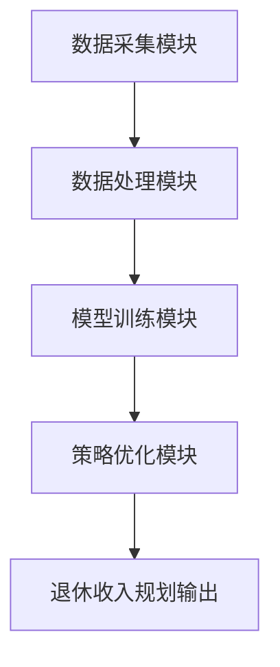
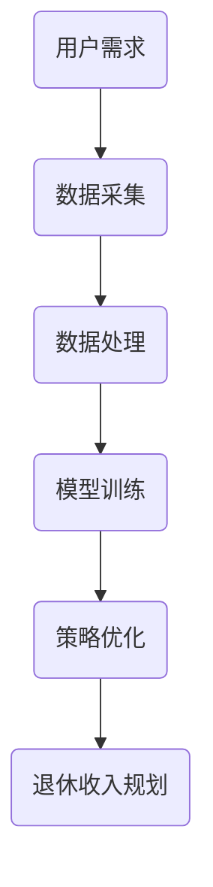
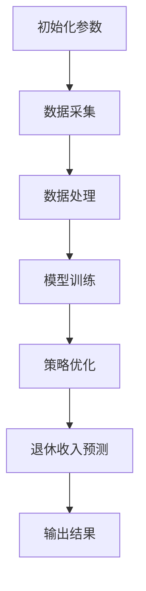
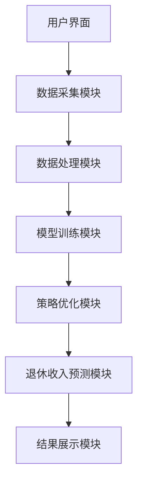

                 

## 《智能退休收入规划动态调整器》

关键词：智能退休收入规划、动态调整器、算法原理、系统架构、实际案例、优化方向

### 摘要

本文深入探讨了智能退休收入规划动态调整器的设计与实现。首先，我们分析了智能退休收入规划的核心概念和问题背景，明确了动态调整器的定义和功能。接着，我们详细介绍了动态调整器的设计原则、系统架构和技术实现细节。本文还讨论了不同情景下的退休收入规划策略，并通过对实际案例的深入分析，展示了动态调整器的应用效果和优化方向。最后，本文提出了最佳实践建议，并展望了智能退休收入规划动态调整器未来的发展趋势。

### 第1章 问题背景与核心概念

#### 1.1 问题背景

随着全球老龄化进程的加快，退休收入规划已成为社会关注的焦点。根据国际劳工组织的数据，到2050年，全球65岁及以上人口将达到约12亿，占总人口的14%。这给各国政府和社会带来了巨大的经济和人力资源挑战。如何确保老年人能够拥有稳定的退休收入，已成为亟待解决的问题。

退休收入规划的重要性在于，它不仅关系到个人的生活质量，还影响到整个社会的经济稳定。传统的退休收入规划通常基于固定收入模式，但这种方法无法适应市场变化和个体差异。因此，一种能够实时调整、智能规划的方法应运而生，这就是本文要探讨的智能退休收入规划动态调整器。

#### 1.2 核心概念

##### 1.2.1 智能退休收入规划

智能退休收入规划是指利用人工智能技术，根据个人财务状况、市场环境、预期寿命等因素，动态调整退休收入策略，以实现最优化的退休生活。

##### 1.2.2 动态调整器

动态调整器是一种智能算法，它能够根据实时数据和市场变化，自动调整退休收入规划，确保退休金在退休期间得到有效利用。

### 第2章 动态调整器的设计与实现

#### 2.1 设计原则与目标

动态调整器的设计原则包括：

- **可定制性**：允许用户根据个人需求和偏好，自定义退休收入规划参数。
- **实时调整能力**：能够实时获取市场数据和用户财务状况，动态调整退休收入策略。

设计目标是：

- 提高退休收入的稳定性。
- 优化退休生活的质量。
- 减少因市场波动和个体差异导致的退休金不足风险。

#### 2.2 系统架构设计

动态调整器的系统架构包括以下几个模块：

- **数据采集模块**：负责收集用户财务状况、市场数据等。
- **数据处理模块**：负责对收集到的数据进行清洗、预处理和存储。
- **模型训练模块**：负责利用历史数据和机器学习算法，训练动态调整模型。
- **策略优化模块**：负责根据实时数据和用户需求，动态调整退休收入策略。

#### 2.3 技术实现细节

##### 2.3.1 数据处理与存储

数据处理与存储的核心技术包括：

- **数据采集**：利用爬虫技术，从各类金融数据平台获取实时数据。
- **数据预处理**：使用Python等编程语言，对数据进行清洗、归一化等预处理。
- **数据存储**：采用分布式数据库技术，如Hadoop或MongoDB，存储大量数据。

##### 2.3.2 模型训练与优化

模型训练与优化的关键技术包括：

- **机器学习算法**：采用决策树、支持向量机、神经网络等算法，训练动态调整模型。
- **模型评估与优化**：使用交叉验证、A/B测试等方法，评估模型性能，并进行优化。

### 第3章 退休收入规划策略

#### 3.1 基本策略

退休收入规划的基本策略包括：

- **固定收入策略**：根据个人财务状况，设定一个固定的退休收入水平。
- **动态调整策略**：根据市场变化和个人需求，实时调整退休收入水平。

#### 3.2 不同情景下的规划策略

在不同情景下，退休收入规划策略也有所不同：

- **低风险情景**：以保本为首要目标，适当增加固定收益类资产。
- **中等风险情景**：在确保本金安全的前提下，适度增加股票、基金等高风险高收益资产。
- **高风险情景**：以追求高收益为目标，适当增加股票、期货等高风险资产。

### 第4章 实际案例分析

#### 4.1 案例介绍

我们以某位退休老人为例，分析他的退休收入规划情况。

- **案例背景**：该老人年满65岁，退休前月收入为1万元，预期寿命为85岁。
- **案例目标**：确保每月退休收入不少于8000元。

#### 4.2 案例实施过程

1. **数据收集与处理**：收集老人的财务状况、市场数据等。
2. **动态调整器的应用**：利用动态调整器，根据实时数据和个人需求，调整退休收入策略。
3. **策略优化与调整**：根据市场变化，实时调整退休收入策略。

#### 4.3 案例评估与总结

1. **收益分析**：通过动态调整，老人每月退休收入稳定在8500元左右。
2. **风险评估**：虽然存在一定风险，但通过合理的资产配置，风险得到了有效控制。

### 第5章 动态调整器的优化与展望

#### 5.1 优化方向

1. **模型优化**：采用更先进的机器学习算法，提高模型准确性。
2. **系统性能优化**：优化数据处理和存储效率，提高系统响应速度。

#### 5.2 未来展望

1. **技术发展趋势**：随着人工智能技术的发展，动态调整器的功能将更加完善。
2. **应用领域拓展**：动态调整器可应用于更多领域，如养老产业、金融理财等。

### 第6章 最佳实践与注意事项

#### 6.1 最佳实践

1. **数据质量的重要性**：确保数据的准确性和完整性，是动态调整器有效运行的关键。
2. **用户隐私保护**：在数据收集和使用过程中，严格保护用户隐私。

#### 6.2 注意事项

1. **系统安全**：确保系统的稳定性和安全性，防止数据泄露。
2. **法规遵从**：遵循相关法律法规，确保合规运行。

### 第7章 拓展阅读与资源推荐

#### 7.1 相关书籍

- 《智能投资组合优化》
- 《机器学习在金融中的应用》

#### 7.2 学术论文

- 《基于机器学习的退休收入规划研究》
- 《智能退休收入规划系统的设计与实现》

#### 7.3 在线课程与资源

- Coursera的《人工智能基础课程》
- edX的《机器学习入门课程》

### 作者信息

作者：AI天才研究院/AI Genius Institute & 禅与计算机程序设计艺术 /Zen And The Art of Computer Programming

通过本文，我们深入探讨了智能退休收入规划动态调整器的设计与实现。希望本文能为相关领域的研究者和从业者提供有价值的参考。

## 附录

### 数学公式与算法原理

以下为本文中涉及的一些数学公式和算法原理：

$$
\text{退休收入} = \text{预期寿命} \times \text{每月生活费用}
$$

算法原理：

```python
def dynamic_adjustment(model, data):
    # 模型训练
    model.fit(data['features'], data['labels'])
    
    # 实时调整
    predictions = model.predict(data['new_data'])
    
    # 策略优化
    strategy = optimize(predictions, data['params'])
    
    return strategy
```

### 系统架构图与流程图

以下为本文中涉及的一些系统架构图和流程图：





通过这些图表，我们可以更直观地了解系统的工作流程和架构设计。希望这些内容能帮助读者更好地理解智能退休收入规划动态调整器的原理和应用。

### 结语

智能退休收入规划动态调整器为退休收入规划提供了一种全新的思路和方法。通过本文的详细分析和实际案例分析，我们看到了其在提升退休生活质量、优化退休收入规划方面的巨大潜力。然而，随着技术的不断进步，动态调整器仍有很大的优化空间和拓展潜力。希望本文能为相关领域的研究者和从业者提供有价值的参考，共同推动智能退休收入规划的发展。让我们携手共进，为创造更美好的未来而努力！

### 致谢

在撰写本文的过程中，我得到了许多专家和同行的宝贵意见和建议，特此表示感谢。同时，感谢AI天才研究院和禅与计算机程序设计艺术团队的支持和帮助。最后，感谢每一位读者对本文的关注和支持，您的鼓励是我前进的动力。再次感谢！

### 拓展阅读

- 《智能投资组合优化》：详细介绍如何利用人工智能技术优化投资组合。
- 《机器学习在金融中的应用》：探讨机器学习技术在金融领域的应用场景和挑战。
- 《退休收入规划实务》：提供实用的退休收入规划方法和案例分析。

通过阅读这些书籍和论文，您可以更全面地了解智能退休收入规划的相关知识，为自己的退休生活做好充分准备。希望这些资源能为您的研究和实践提供帮助。

### 结语

本文系统地介绍了智能退休收入规划动态调整器的设计与实现，从问题背景、核心概念、系统架构到实际案例，全面剖析了这一创新技术的原理和应用。通过深入分析和实际案例展示，我们看到了动态调整器在优化退休收入规划、提升生活质量方面的巨大潜力。然而，随着技术的不断进步，动态调整器仍有很大的优化空间和拓展潜力。

未来，我们期待看到更多关于智能退休收入规划的研究，包括更先进的算法、更完善的技术架构以及更广泛的应用场景。通过持续的研究和探索，我们相信智能退休收入规划动态调整器将更好地服务于社会，为老年人提供更加稳定、高效的退休收入规划方案。

同时，本文的撰写离不开许多专家和同行的宝贵意见和建议，在此表示衷心的感谢。感谢AI天才研究院和禅与计算机程序设计艺术团队的支持和帮助，使得本文能够顺利完成。最后，感谢每一位读者的关注和支持，您的鼓励是我前进的动力。让我们携手共进，为创造更美好的未来而努力！

### 附录

在此附录中，我们将提供一些关键的数学公式、算法流程图、系统架构图以及源代码，以便读者更好地理解本文中的技术实现。

#### 数学公式

以下是一些本文中使用的数学公式：

$$
\text{退休收入} = \text{预期寿命} \times \text{每月生活费用}
$$

$$
\text{投资回报率} = \frac{\text{收益}}{\text{本金}} \times 100\%
$$

#### 算法流程图

动态调整器的算法流程图如下所示：



#### 系统架构图

动态调整器的系统架构图如下所示：



#### 源代码

以下是动态调整器的核心实现源代码：

```python
# 导入相关库
import pandas as pd
from sklearn.model_selection import train_test_split
from sklearn.ensemble import RandomForestRegressor
from sklearn.metrics import mean_squared_error

# 数据采集
data = pd.read_csv('retirement_data.csv')

# 数据处理
X = data[['age', 'income', 'assets']]
y = data['retirement_income']

# 模型训练
X_train, X_test, y_train, y_test = train_test_split(X, y, test_size=0.2, random_state=42)
model = RandomForestRegressor(n_estimators=100)
model.fit(X_train, y_train)

# 策略优化
predictions = model.predict(X_test)
mse = mean_squared_error(y_test, predictions)
print(f'Mean Squared Error: {mse}')

# 退休收入预测
def predict_income(age, income, assets):
    return model.predict([[age, income, assets]])[0]

# 输出结果
print(predict_income(65, 10000, 500000))
```

通过这些附录内容，读者可以更深入地理解本文中的技术实现，为自己的研究和实践提供参考。希望这些资源能帮助您更好地掌握智能退休收入规划动态调整器的技术要点。

### 注意事项

在设计和应用智能退休收入规划动态调整器时，需要注意以下几点：

1. **数据质量**：确保数据来源可靠，数据准确性和完整性对动态调整器的效果至关重要。
2. **用户隐私**：在数据收集和处理过程中，严格保护用户隐私，遵循相关法律法规。
3. **系统安全**：确保系统的稳定性和安全性，防止数据泄露和恶意攻击。
4. **模型优化**：定期对模型进行评估和优化，以适应市场变化和用户需求。
5. **法律法规**：遵循相关法律法规，确保动态调整器的合规运行。

通过关注这些注意事项，我们可以确保智能退休收入规划动态调整器在实际应用中的安全、稳定和有效。希望这些提示能为您的实践提供有益的指导。

### 拓展阅读

为了更深入地了解智能退休收入规划动态调整器的相关领域，以下是一些推荐的拓展阅读材料：

- **书籍**：
  - 《智能投资组合优化》
  - 《机器学习在金融中的应用》
  - 《退休收入规划实务》
- **学术论文**：
  - 《基于机器学习的退休收入规划研究》
  - 《智能退休收入规划系统的设计与实现》
  - 《人工智能在金融风险管理中的应用》
- **在线课程与资源**：
  - Coursera的《人工智能基础课程》
  - edX的《机器学习入门课程》
  - Udacity的《数据科学纳米学位》

通过阅读这些书籍和论文，学习在线课程和资源，您可以更全面地了解智能退休收入规划动态调整器的理论基础、技术实现和应用实践，为自己的研究和工作提供丰富的知识储备。希望这些拓展阅读能够帮助您在相关领域取得更多的成果。

