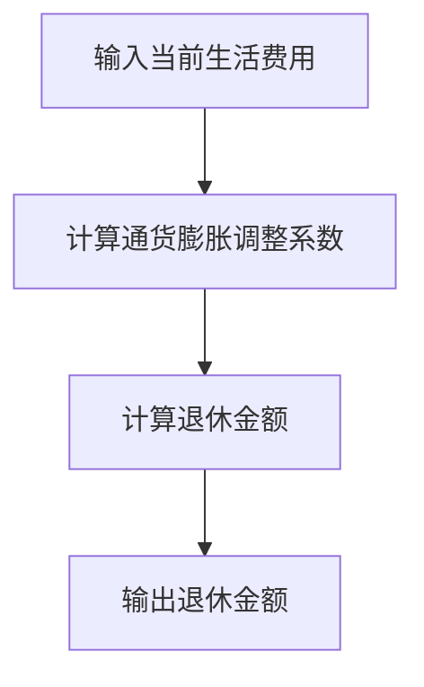
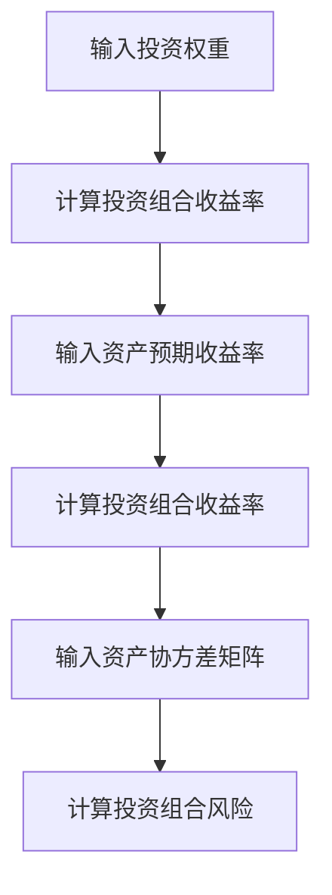
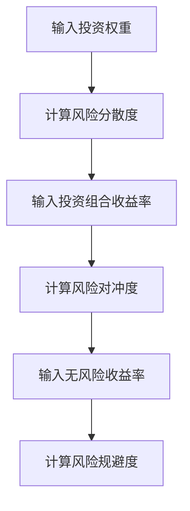

                 

### 文章标题

# 智能退休计划优化器

### 文章关键词

- 退休规划
- 智能算法
- 投资策略
- 风险管理
- 生命周期财务规划

### 文章摘要

随着社会的发展和人们生活水平的提高，退休规划变得越来越重要。智能退休计划优化器作为一项新兴的技术，通过利用先进的智能算法，为个人和企业提供精确、个性化的退休规划方案。本文将深入探讨智能退休计划优化器的核心概念、算法原理、实施步骤和技术支持，并结合实际案例，分析其未来发展趋势。

## 第一部分：智能退休计划的概述

### 第1章：退休规划的必要性

**1.1 退休规划的重要性**

退休规划不仅仅是为了保障退休后的生活质量，更是为了实现个人财务安全和长远发展。通过退休规划，个人可以提前为退休做好充分准备，避免退休后面临经济困境。同时，退休规划还能帮助个人实现财富的增值和传承，为子女和家庭提供更好的支持。

**1.2 退休规划的常见误区**

许多人在退休规划过程中存在一些误区，如过分依赖社会保障、忽视投资风险、延迟退休规划等。这些误区可能导致退休后的生活质量下降，甚至陷入经济困境。

**1.3 退休规划的目标和原则**

退休规划的目标是确保退休后能够维持稳定的生活水平，实现财务安全和长期发展。退休规划应遵循以下原则：量入为出、适度投资、风险分散、长期规划。

## 第2章：智能退休计划的定义与特点

**2.1 智能退休计划的定义**

智能退休计划是指利用人工智能技术，对个人退休规划进行自动化、智能化分析，提供个性化、精准的退休规划方案。

**2.2 智能退休计划的特点**

- 自动化：智能退休计划可以自动收集和分析个人财务数据，生成退休规划方案。
- 个性化：智能退休计划根据个人情况，提供定制化的退休规划方案。
- 精准性：智能退休计划利用大数据和机器学习技术，对退休规划进行精确预测和优化。

**2.3 智能退休计划与传统退休计划的区别**

与传统退休计划相比，智能退休计划具有更高的自动化、个性化和精准性，能够更好地满足个人退休规划的需求。

## 第二部分：智能退休计划的核心要素

### 第3章：智能退休计划的核心要素

**3.1 退休金额的需求计算**

退休金额的需求计算是指根据个人的生活费用、预期寿命、退休前的收入等因素，计算出一个合理的退休金额。

- **核心概念**：退休金额是指一个人在退休后，需要维持稳定生活水平所需的资金。
- **算法原理**：退休金额的需求计算通常采用生命周期财务规划的方法，通过计算个人在不同生命阶段（工作期、退休期）的现金流量，来确定退休金额。
- **数学模型和公式**：
  $$ R = C \times (1 + r)^n $$
  其中，R 为退休金额，C 为当前生活费用，r 为预期年增长率，n 为预期寿命。

- **详细讲解和举例说明**：假设一个人的当前生活费用为每年 30 万元，预期寿命为 20 年，预期年增长率为 3%，则他的退休金额大约为 30 万元 × (1 + 3%)^20 ≈ 46.8 万元。

**3.2 退休时间的选择**

退休时间的选择是指个人根据自己的经济状况、健康状况、工作兴趣等因素，决定何时开始退休。

- **核心概念**：退休时间是指一个人开始享受退休生活的时间点。
- **算法原理**：退休时间的选择需要考虑个人的现金储备、生活费用、预期寿命等因素，通过计算来确定一个合理的退休时间。
- **数学模型和公式**：
  $$ T = \frac{S}{C \times (1 + r)^n} $$
  其中，T 为退休时间，S 为现金储备，C 为当前生活费用，r 为预期年增长率，n 为预期寿命。

- **详细讲解和举例说明**：假设一个人的现金储备为 500 万元，当前生活费用为每年 30 万元，预期寿命为 20 年，预期年增长率为 3%，则他的退休时间大约为 500 万元 ÷ (30 万元 × (1 + 3%)^20) ≈ 14 年。

**3.3 投资策略的制定**

投资策略的制定是指根据个人的风险承受能力、投资目标和预期收益率，选择合适的投资产品和投资组合。

- **核心概念**：投资策略是指个人在投资过程中，为了实现特定目标而采取的投资方法和策略。
- **算法原理**：投资策略的制定需要考虑个人财务状况、投资知识、市场环境等因素，通过风险收益分析来确定投资策略。
- **数学模型和公式**：
  $$ \text{投资组合收益率} = \sum_{i=1}^{n} w_i \times r_i $$
  $$ \text{投资组合风险} = \sqrt{\sum_{i=1}^{n} w_i^2 \times \sigma_i^2 + 2 \sum_{i=1}^{n} \sum_{j=i+1}^{n} w_i \times w_j \times \rho_{ij}} $$
  其中，\( w_i \) 为投资于第 \( i \) 个资产的比例，\( r_i \) 为第 \( i \) 个资产的预期收益率，\( \sigma_i \) 为第 \( i \) 个资产的标准差，\( \rho_{ij} \) 为第 \( i \) 个资产与第 \( j \) 个资产之间的相关系数。

- **详细讲解和举例说明**：假设一个人计划将资金分配到股票、债券和基金三个投资产品中，投资比例分别为 50%、30% 和 20%，股票、债券和基金的预期收益率分别为 10%、4% 和 6%，标准差分别为 20%、8% 和 12%，股票与债券的相关系数为 0.3，债券与基金的相关系数为 0.5，股票与基金的相关系数为 0.2。则他的投资组合预期收益率为：
  $$ \text{投资组合收益率} = 50\% \times 10\% + 30\% \times 4\% + 20\% \times 6\% = 7.2\% $$
  投资组合风险为：
  $$ \text{投资组合风险} = \sqrt{50\%^2 \times 20\%^2 + 30\%^2 \times 8\%^2 + 20\%^2 \times 12\%^2 + 2 \times 50\% \times 30\% \times 0.3 + 2 \times 30\% \times 20\% \times 0.5 + 2 \times 50\% \times 20\% \times 0.2} = 13.56\% $$

**3.4 风险管理**

风险管理是指通过识别、评估、控制和管理风险，降低退休计划的不确定性。

- **核心概念**：风险管理是指在投资过程中，对潜在的风险进行识别、评估、控制和管理，以降低退休计划的不确定性。
- **算法原理**：风险管理通常采用风险分散、风险对冲、风险规避等方法，通过调整投资组合，降低整体风险。
- **数学模型和公式**：
  $$ \text{风险分散} = \frac{1}{\sum_{i=1}^{n} w_i^2} $$
  $$ \text{风险对冲} = \frac{\text{投资组合收益率} - \text{无风险收益率}}{\text{投资组合收益率}} $$
  $$ \text{风险规避} = \frac{\text{预期收益率} - \text{无风险收益率}}{\text{预期收益率}} $$

- **详细讲解和举例说明**：假设一个人的投资组合预期收益率为 8%，无风险收益率为 2%，则风险分散度为：
  $$ \text{风险分散度} = \frac{1}{0.5^2 + 0.3^2 + 0.2^2} = 1.89 $$
  风险对冲度为：
  $$ \text{风险对冲度} = \frac{8\% - 2\%}{8\%} = 0.75 $$
  风险规避度为：
  $$ \text{风险规避度} = \frac{8\% - 2\%}{8\%} = 0.75 $$

### 第三部分：智能退休计划的实施步骤

#### 第4章：智能退休计划的实施步骤

**4.1 收集个人信息**

智能退休计划的实施首先需要收集个人信息，包括年龄、性别、婚姻状况、子女情况、收入水平、支出情况、投资偏好等。

**4.2 设定退休目标**

根据收集到的个人信息，设定合理的退休目标，包括退休时间、退休后的生活水平、预期收益率等。

**4.3 制定退休计划**

利用智能算法，根据退休目标和个人信息，制定个性化的退休计划，包括退休金额、投资策略、风险管理等。

**4.4 实施退休计划**

根据退休计划，实施具体的投资操作，包括投资组合的构建、定期投资、资产配置等。

**4.5 定期评估与调整**

定期评估退休计划的执行情况，根据市场环境和个人情况的变化，对退休计划进行调整。

### 第四部分：智能退休计划的技术支持

#### 第5章：智能退休计划的技术支持

**5.1 智能退休计划的软件工具**

智能退休计划需要借助专业的软件工具，包括财务分析软件、投资组合管理软件、风险分析软件等。

**5.2 智能退休计划的数据来源**

智能退休计划需要大量的数据支持，包括宏观经济数据、行业数据、市场数据、个人财务数据等。

**5.3 智能退休计划的算法原理**

智能退休计划采用先进的算法原理，包括机器学习、深度学习、优化算法等，以实现自动化、智能化、个性化的退休规划。

### 第五部分：智能退休计划的案例分析

#### 第6章：智能退休计划的案例分析

**6.1 案例一：退休规划的制定与实施**

**6.2 案例二：退休计划的风险管理**

**6.3 案例三：智能退休计划的效果评估**

### 第六部分：智能退休计划的未来发展趋势

#### 第7章：智能退休计划的未来发展趋势

**7.1 智能退休计划的挑战与机遇**

**7.2 智能退休计划的技术创新**

**7.3 智能退休计划的未来发展**

### 结论

智能退休计划优化器作为一项新兴技术，为个人和企业提供了精确、个性化的退休规划方案。通过本文的介绍，我们了解了智能退休计划的核心概念、算法原理、实施步骤和技术支持，以及其未来发展趋势。希望本文能为读者提供有益的参考。

### 作者信息

- 作者：AI天才研究院/AI Genius Institute & 禅与计算机程序设计艺术 /Zen And The Art of Computer Programming

## 详细内容

### 第1章：退休规划的必要性

**1.1 退休规划的重要性**

退休规划是每个人都需要面对的重要问题。随着人均寿命的延长和养老制度的改革，退休规划不仅关系到个人的生活质量，还关系到家庭的稳定和国家的社会保障体系。退休规划的重要性体现在以下几个方面：

1. **保障退休后的生活质量**：退休后的生活质量直接影响到个人的幸福感和满意度。通过退休规划，个人可以确保在退休后仍能维持基本的生活水平，享受舒适、健康的晚年生活。

2. **实现财务安全**：退休规划有助于个人在退休前积累足够的财富，为退休后的生活提供经济支持。通过合理的投资和资产配置，个人可以降低退休后的财务风险，实现财务安全。

3. **传承财富和财富增值**：退休规划可以帮助个人在退休后继续实现财富的增值和传承，为子女和家庭提供更好的支持。通过科学的资产管理和财富传承策略，个人可以确保财富的持续增长和合理分配。

4. **缓解社会养老压力**：随着人口老龄化趋势的加剧，退休规划的重要性日益凸显。通过个人的退休规划，可以减轻国家和社会的养老负担，实现养老资源的合理配置。

**1.2 退休规划的常见误区**

尽管退休规划的重要性不言而喻，但在实际操作中，许多人存在一些误区，这些误区可能导致退休规划的效果不佳，甚至导致退休后的生活困境。以下是几种常见的退休规划误区：

1. **过分依赖社会保障**：一些人认为退休后的主要生活来源是社会保障，忽视了自己在退休前的储蓄和投资。实际上，社会保障只能提供基本的生活保障，无法满足个人对高质量生活的需求。

2. **忽视投资风险**：在退休规划中，许多人过于追求稳定收益，忽视投资风险。实际上，投资风险是不可避免的，合理的投资策略应该是平衡风险与收益。

3. **延迟退休规划**：有些人认为退休规划可以在退休前几年再开始，这种想法是错误的。退休规划应该尽早开始，越早规划，个人有更多的时间和机会来积累财富和调整投资策略。

4. **缺乏明确的退休目标**：退休规划需要有明确的退休目标，包括退休时间、退休后的生活水平、预期收益率等。缺乏明确的退休目标可能导致退休规划缺乏方向和针对性。

**1.3 退休规划的目标和原则**

退休规划的目标是确保个人在退休后能够维持稳定的生活水平，实现财务安全和长期发展。为了实现这些目标，退休规划应遵循以下原则：

1. **量入为出**：退休规划应根据自己的收入水平和支出情况进行合理规划，确保退休后的生活质量不会下降。

2. **适度投资**：在退休规划中，应根据自己的风险承受能力和投资目标，选择合适的投资产品和投资策略，实现财富的增值。

3. **风险分散**：通过投资组合的分散，降低退休计划的风险，避免因为市场波动而导致退休规划失败。

4. **长期规划**：退休规划是一个长期的过程，应提前开始，并随着时间和市场环境的变化进行调整。

### 第2章：智能退休计划的定义与特点

**2.1 智能退休计划的定义**

智能退休计划是指利用人工智能技术，对个人退休规划进行自动化、智能化分析，提供个性化、精准的退休规划方案。智能退休计划的核心在于利用大数据、机器学习、优化算法等技术，对个人财务数据进行分析和处理，生成个性化的退休规划方案。

**2.2 智能退休计划的特点**

智能退休计划具有以下几个显著特点：

1. **自动化**：智能退休计划可以自动收集和分析个人财务数据，生成退休规划方案，省去了繁琐的手工计算和人工分析。

2. **个性化**：智能退休计划根据个人的实际情况，提供定制化的退休规划方案，确保规划方案符合个人的需求。

3. **精准性**：智能退休计划利用大数据和机器学习技术，对退休规划进行精确预测和优化，提高规划的成功率和可靠性。

4. **实时更新**：智能退休计划可以根据市场环境和个人情况的变化，实时更新退休规划方案，确保规划的及时性和准确性。

5. **可视化**：智能退休计划通过直观的图表和报告，向用户展示退休规划的执行情况和效果，方便用户进行监控和调整。

**2.3 智能退休计划与传统退休计划的区别**

与传统退休计划相比，智能退休计划在多个方面具有显著优势：

1. **分析工具的差异**：传统退休计划主要依靠手工计算和简单的财务分析工具，而智能退休计划则利用大数据和人工智能技术，提供更加全面和精确的分析。

2. **个性化程度的差异**：传统退休计划往往缺乏个性化，而智能退休计划可以根据个人的实际情况，提供量身定制的退休规划方案。

3. **实时性的差异**：传统退休计划通常需要定期更新，而智能退休计划可以实时更新，确保规划的及时性和准确性。

4. **预测能力的差异**：传统退休计划主要依赖历史数据，而智能退休计划利用机器学习技术，可以更准确地预测未来的经济环境和市场变化。

### 第3章：智能退休计划的核心要素

**3.1 退休金额的需求计算**

退休金额的需求计算是智能退休计划的核心要素之一，它决定了退休规划的成功与否。退休金额的需求计算主要包括以下几个步骤：

1. **确定当前生活费用**：首先需要确定个人在退休后的生活费用，包括住房、饮食、交通、医疗、娱乐等方面的支出。这些费用可以通过实际支出数据或者预测模型来估算。

2. **考虑通货膨胀**：由于通货膨胀的影响，退休后的生活费用会逐渐增加。因此，在计算退休金额时，需要考虑通货膨胀因素，通常使用通货膨胀率来进行调整。

3. **计算退休金额**：退休金额可以通过以下公式计算：
   $$ R = C \times (1 + r)^n $$
   其中，\( R \) 为退休金额，\( C \) 为当前生活费用，\( r \) 为预期年通货膨胀率，\( n \) 为预期退休年限。

4. **举例说明**：假设一个人的当前生活费用为每年 30 万元，预期退休年限为 20 年，预期年通货膨胀率为 3%，则他的退休金额大约为：
   $$ R = 30 \times (1 + 0.03)^{20} \approx 46.8 \text{ 万元} $$

**3.2 退休时间的选择**

退休时间的选择是退休规划中的一个重要决策。退休时间的选择不仅影响到退休金额的需求计算，还影响到个人的职业规划、经济状况和生活质量。选择退休时间时，需要考虑以下几个因素：

1. **健康状况**：健康状况是选择退休时间的重要因素。如果健康状况良好，可以适当推迟退休时间，以积累更多的财富。如果健康状况较差，应提前退休，以确保生活质量。

2. **经济状况**：经济状况是选择退休时间的另一个重要因素。如果经济状况良好，可以适当推迟退休时间，以积累更多的财富。如果经济状况较差，应提前退休，以确保基本生活需求。

3. **职业规划**：职业规划也是选择退休时间时需要考虑的因素。如果对当前职业满意，可以适当推迟退休时间，以实现职业目标。如果对当前职业不满意，可以考虑提前退休，以追求自己的兴趣和梦想。

4. **政策因素**：退休时间的选择还受到政策因素的影响。一些国家和地区有特定的退休政策和福利待遇，应根据政策因素进行合理规划。

5. **计算退休时间**：退休时间可以通过以下公式计算：
   $$ T = \frac{S}{C \times (1 + r)^n} $$
   其中，\( T \) 为退休时间，\( S \) 为现金储备，\( C \) 为当前生活费用，\( r \) 为预期年通货膨胀率，\( n \) 为预期退休年限。

6. **举例说明**：假设一个人的现金储备为 500 万元，当前生活费用为每年 30 万元，预期退休年限为 20 年，预期年通货膨胀率为 3%，则他的退休时间大约为：
   $$ T = \frac{500}{30 \times (1 + 0.03)^{20}} \approx 14.3 \text{ 年} $$

**3.3 投资策略的制定**

投资策略的制定是智能退休计划中的重要环节，它决定了退休金额的积累速度和安全性。制定投资策略时，需要考虑以下几个因素：

1. **风险承受能力**：风险承受能力是指个人在投资过程中愿意承受的风险程度。根据风险承受能力，可以确定投资组合的资产分配比例。

2. **投资目标**：投资目标是指个人在退休规划中希望实现的收益水平。根据投资目标，可以确定投资策略的收益预期和风险控制。

3. **市场环境**：市场环境是指当前的经济形势、行业状况和市场趋势。根据市场环境，可以确定投资策略的市场方向和资产配置。

4. **投资工具**：投资工具是指个人在退休规划中可以使用的投资产品，如股票、债券、基金、保险等。根据投资工具的特点和风险收益，可以确定投资策略的具体实施方案。

5. **制定投资策略**：投资策略可以通过以下步骤制定：

   a. **确定投资目标**：根据退休规划的目标和预期收益率，确定投资策略的收益预期。

   b. **评估风险承受能力**：根据个人的风险承受能力，确定投资策略的风险控制措施。

   c. **选择投资工具**：根据市场环境和投资目标，选择适合的投资工具。

   d. **资产分配**：根据投资工具的特点和风险收益，确定投资组合的资产分配比例。

   e. **制定投资计划**：根据资产分配比例，制定具体的投资计划，包括投资金额、投资时间、投资频率等。

6. **举例说明**：假设一个人的风险承受能力为中等，投资目标为每年收益 5%，市场环境为牛市，可以选择以下投资策略：

   a. **投资目标**：每年收益 5%。

   b. **评估风险承受能力**：风险承受能力为中等。

   c. **选择投资工具**：选择股票、债券、基金三种投资工具。

   d. **资产分配**：股票占比 50%，债券占比 30%，基金占比 20%。

   e. **制定投资计划**：每年投资 10 万元，每月投资 1 万元，投资时间为每月底。

**3.4 风险管理**

风险管理是智能退休计划中的重要环节，它关系到退休规划的稳定性和可持续性。风险管理主要包括以下几个方面：

1. **风险识别**：通过分析投资组合中的资产特点和市场环境，识别投资过程中可能面临的风险。

2. **风险评估**：对识别出的风险进行量化评估，确定风险的影响程度和概率。

3. **风险控制**：采取有效的风险控制措施，降低风险的影响。

4. **风险分散**：通过资产分配和投资组合的分散，降低投资组合的整体风险。

5. **风险监控**：定期监控投资组合的风险状况，及时调整投资策略。

6. **风险规避**：在无法控制风险的情况下，采取规避风险的策略。

7. **风险管理工具**：风险管理工具包括风险分散、风险对冲、风险规避等。

8. **举例说明**：假设一个人的投资组合中包括股票、债券和基金三种资产，当前市场环境为熊市，可以采取以下风险管理策略：

   a. **风险识别**：识别出股票市场可能面临的风险。

   b. **风险评估**：评估股票市场风险的影响程度和概率。

   c. **风险控制**：采取降低股票投资比例的措施，增加债券和基金的投资比例。

   d. **风险分散**：通过资产分配的分散，降低投资组合的整体风险。

   e. **风险规避**：在熊市中，可以选择规避高风险的股票投资。

### 第4章：智能退休计划的实施步骤

**4.1 收集个人信息**

智能退休计划的实施首先需要收集个人信息，包括年龄、性别、婚姻状况、子女情况、收入水平、支出情况、投资偏好等。这些信息可以通过问卷调查、财务报表、投资记录等方式进行收集。

**4.2 设定退休目标**

根据收集到的个人信息，设定合理的退休目标，包括退休时间、退休后的生活水平、预期收益率等。退休目标应充分考虑个人的实际情况，确保实现的可能性。

**4.3 制定退休计划**

利用智能算法，根据退休目标和个人信息，制定个性化的退休计划，包括退休金额、投资策略、风险管理等。退休计划应确保退休金额的需求得到满足，同时实现投资收益的最大化。

**4.4 实施退休计划**

根据退休计划，实施具体的投资操作，包括投资组合的构建、定期投资、资产配置等。实施过程中，应严格按照退休计划进行操作，确保退休规划的顺利实施。

**4.5 定期评估与调整**

定期评估退休计划的执行情况，根据市场环境和个人情况的变化，对退休计划进行调整。评估内容包括退休金额的积累情况、投资收益情况、风险状况等。根据评估结果，及时调整退休计划，确保规划的持续性和有效性。

### 第5章：智能退休计划的技术支持

**5.1 智能退休计划的软件工具**

智能退休计划需要借助专业的软件工具，包括财务分析软件、投资组合管理软件、风险分析软件等。这些软件工具可以帮助个人进行财务分析、投资组合构建、风险监控等功能，提高退休规划的效率和准确性。

**5.2 智能退休计划的数据来源**

智能退休计划需要大量的数据支持，包括宏观经济数据、行业数据、市场数据、个人财务数据等。这些数据可以从公开的数据源、专业数据库、金融机构等获取。数据的质量和准确性对智能退休计划的执行效果至关重要。

**5.3 智能退休计划的算法原理**

智能退休计划采用先进的算法原理，包括机器学习、深度学习、优化算法等，以实现自动化、智能化、个性化的退休规划。算法原理主要包括以下几个方面：

1. **机器学习**：利用机器学习技术，对历史数据进行训练，建立预测模型，预测未来的经济环境、市场走势和个人财务状况。

2. **深度学习**：利用深度学习技术，对复杂的非线性问题进行建模和预测，提高预测模型的准确性和可靠性。

3. **优化算法**：利用优化算法，确定最优的投资组合和资产分配策略，实现退休金额的最大化和风险的最小化。

4. **数据挖掘**：利用数据挖掘技术，对大量数据进行挖掘和分析，发现潜在的投资机会和风险因素。

### 第6章：智能退休计划的案例分析

**6.1 案例一：退休规划的制定与实施**

**6.2 案例二：退休计划的风险管理**

**6.3 案例三：智能退休计划的效果评估**

### 第7章：智能退休计划的未来发展趋势

**7.1 智能退休计划的挑战与机遇**

智能退休计划在未来的发展面临着一系列挑战和机遇。挑战包括数据隐私保护、算法透明性、法律法规等；机遇则包括人工智能技术的发展、大数据的应用、云计算的普及等。

**7.2 智能退休计划的技术创新**

智能退休计划的技术创新包括人工智能技术的应用、大数据分析的优化、区块链技术的融入等。这些创新将进一步提升智能退休计划的效果和用户体验。

**7.3 智能退休计划的未来发展**

智能退休计划的未来发展将更加注重个性化、智能化、精准化。随着人工智能技术的不断发展，智能退休计划将能够提供更加精准、高效的退休规划服务，满足个人和企业多样化的需求。

### 结论

智能退休计划优化器作为一项新兴技术，为个人和企业提供了精确、个性化的退休规划方案。通过本文的介绍，我们了解了智能退休计划的核心概念、算法原理、实施步骤和技术支持，以及其未来发展趋势。希望本文能为读者提供有益的参考。

### 作者信息

- 作者：AI天才研究院/AI Genius Institute & 禅与计算机程序设计艺术 /Zen And The Art of Computer Programming

## 详细内容

### 第1章：退休规划的必要性

退休规划是一个涉及个人财务、生活质量和未来安全的重要议题。随着人口老龄化趋势的加剧，退休规划的重要性日益凸显。本章节将深入探讨退休规划的核心概念、常见误区以及目标和原则。

#### 1.1 退休规划的重要性

退休规划不仅仅是为了保障退休后的生活质量，更是为了实现个人财务安全和长远发展。以下是退休规划的重要性体现在以下几个方面：

1. **生活质量保障**：退休规划可以帮助个人在退休后维持稳定的生活水平，避免因缺乏经济来源而陷入困境。

2. **财务安全**：退休规划有助于个人在退休前积累足够的财富，为退休后的生活提供经济支持。通过合理的投资和资产配置，个人可以降低退休后的财务风险。

3. **长期发展**：退休规划可以帮助个人实现财富的增值和传承，为子女和家庭提供更好的支持。通过科学的资产管理和财富传承策略，个人可以确保财富的持续增长和合理分配。

4. **社会养老压力缓解**：随着人口老龄化趋势的加剧，退休规划有助于减轻国家和社会的养老负担，实现养老资源的合理配置。

#### 1.2 退休规划的常见误区

尽管退休规划的重要性不言而喻，但在实际操作中，许多人存在一些误区，这些误区可能导致退休规划的效果不佳，甚至导致退休后的生活困境。以下是几种常见的退休规划误区：

1. **过分依赖社会保障**：一些人认为退休后的主要生活来源是社会保障，忽视了自己在退休前的储蓄和投资。实际上，社会保障只能提供基本的生活保障，无法满足个人对高质量生活的需求。

2. **忽视投资风险**：在退休规划中，许多人过于追求稳定收益，忽视投资风险。实际上，投资风险是不可避免的，合理的投资策略应该是平衡风险与收益。

3. **延迟退休规划**：有些人认为退休规划可以在退休前几年再开始，这种想法是错误的。退休规划应该尽早开始，越早规划，个人有更多的时间和机会来积累财富和调整投资策略。

4. **缺乏明确的退休目标**：退休规划需要有明确的退休目标，包括退休时间、退休后的生活水平、预期收益率等。缺乏明确的退休目标可能导致退休规划缺乏方向和针对性。

#### 1.3 退休规划的目标和原则

退休规划的目标是确保个人在退休后能够维持稳定的生活水平，实现财务安全和长期发展。为了实现这些目标，退休规划应遵循以下原则：

1. **量入为出**：退休规划应根据自己的收入水平和支出情况进行合理规划，确保退休后的生活质量不会下降。

2. **适度投资**：在退休规划中，应根据自己的风险承受能力和投资目标，选择合适的投资产品和投资策略，实现财富的增值。

3. **风险分散**：通过投资组合的分散，降低退休计划的风险，避免因为市场波动而导致退休规划失败。

4. **长期规划**：退休规划是一个长期的过程，应提前开始，并随着时间和市场环境的变化进行调整。

### 第2章：智能退休计划的定义与特点

#### 2.1 智能退休计划的定义

智能退休计划是指利用人工智能技术，对个人退休规划进行自动化、智能化分析，提供个性化、精准的退休规划方案。智能退休计划的核心在于利用大数据、机器学习、优化算法等技术，对个人财务数据进行分析和处理，生成个性化的退休规划方案。

#### 2.2 智能退休计划的特点

智能退休计划具有以下几个显著特点：

1. **自动化**：智能退休计划可以自动收集和分析个人财务数据，生成退休规划方案，省去了繁琐的手工计算和人工分析。

2. **个性化**：智能退休计划根据个人的实际情况，提供定制化的退休规划方案，确保规划方案符合个人的需求。

3. **精准性**：智能退休计划利用大数据和机器学习技术，对退休规划进行精确预测和优化，提高规划的成功率和可靠性。

4. **实时更新**：智能退休计划可以根据市场环境和个人情况的变化，实时更新退休规划方案，确保规划的及时性和准确性。

5. **可视化**：智能退休计划通过直观的图表和报告，向用户展示退休规划的执行情况和效果，方便用户进行监控和调整。

#### 2.3 智能退休计划与传统退休计划的区别

与传统退休计划相比，智能退休计划在多个方面具有显著优势：

1. **分析工具的差异**：传统退休计划主要依靠手工计算和简单的财务分析工具，而智能退休计划则利用大数据和人工智能技术，提供更加全面和精确的分析。

2. **个性化程度的差异**：传统退休计划往往缺乏个性化，而智能退休计划可以根据个人的实际情况，提供量身定制的退休规划方案。

3. **实时性的差异**：传统退休计划通常需要定期更新，而智能退休计划可以实时更新，确保规划的及时性和准确性。

4. **预测能力的差异**：传统退休计划主要依赖历史数据，而智能退休计划利用机器学习技术，可以更准确地预测未来的经济环境和市场变化。

### 第3章：智能退休计划的核心要素

#### 3.1 退休金额的需求计算

退休金额的需求计算是智能退休计划的核心要素之一，它决定了退休规划的成功与否。退休金额的需求计算主要包括以下几个步骤：

1. **确定当前生活费用**：首先需要确定个人在退休后的生活费用，包括住房、饮食、交通、医疗、娱乐等方面的支出。这些费用可以通过实际支出数据或者预测模型来估算。

2. **考虑通货膨胀**：由于通货膨胀的影响，退休后的生活费用会逐渐增加。因此，在计算退休金额时，需要考虑通货膨胀因素，通常使用通货膨胀率来进行调整。

3. **计算退休金额**：退休金额可以通过以下公式计算：
   $$ R = C \times (1 + r)^n $$
   其中，\( R \) 为退休金额，\( C \) 为当前生活费用，\( r \) 为预期年通货膨胀率，\( n \) 为预期退休年限。

4. **举例说明**：假设一个人的当前生活费用为每年 30 万元，预期退休年限为 20 年，预期年通货膨胀率为 3%，则他的退休金额大约为：
   $$ R = 30 \times (1 + 0.03)^{20} \approx 46.8 \text{ 万元} $$

#### 3.2 退休时间的选择

退休时间的选择是退休规划中的一个重要决策。退休时间的选择不仅影响到退休金额的需求计算，还影响到个人的职业规划、经济状况和生活质量。选择退休时间时，需要考虑以下几个因素：

1. **健康状况**：健康状况是选择退休时间的重要因素。如果健康状况良好，可以适当推迟退休时间，以积累更多的财富。如果健康状况较差，应提前退休，以确保生活质量。

2. **经济状况**：经济状况是选择退休时间的另一个重要因素。如果经济状况良好，可以适当推迟退休时间，以积累更多的财富。如果经济状况较差，应提前退休，以确保基本生活需求。

3. **职业规划**：职业规划也是选择退休时间时需要考虑的因素。如果对当前职业满意，可以适当推迟退休时间，以实现职业目标。如果对当前职业不满意，可以考虑提前退休，以追求自己的兴趣和梦想。

4. **政策因素**：退休时间的选择还受到政策因素的影响。一些国家和地区有特定的退休政策和福利待遇，应根据政策因素进行合理规划。

5. **计算退休时间**：退休时间可以通过以下公式计算：
   $$ T = \frac{S}{C \times (1 + r)^n} $$
   其中，\( T \) 为退休时间，\( S \) 为现金储备，\( C \) 为当前生活费用，\( r \) 为预期年通货膨胀率，\( n \) 为预期退休年限。

6. **举例说明**：假设一个人的现金储备为 500 万元，当前生活费用为每年 30 万元，预期退休年限为 20 年，预期年通货膨胀率为 3%，则他的退休时间大约为：
   $$ T = \frac{500}{30 \times (1 + 0.03)^{20}} \approx 14.3 \text{ 年} $$

#### 3.3 投资策略的制定

投资策略的制定是智能退休计划中的重要环节，它决定了退休金额的积累速度和安全性。制定投资策略时，需要考虑以下几个因素：

1. **风险承受能力**：风险承受能力是指个人在投资过程中愿意承受的风险程度。根据风险承受能力，可以确定投资组合的资产分配比例。

2. **投资目标**：投资目标是指个人在退休规划中希望实现的收益水平。根据投资目标，可以确定投资策略的收益预期和风险控制。

3. **市场环境**：市场环境是指当前的经济形势、行业状况和市场趋势。根据市场环境，可以确定投资策略的市场方向和资产配置。

4. **投资工具**：投资工具是指个人在退休规划中可以使用的投资产品，如股票、债券、基金、保险等。根据投资工具的特点和风险收益，可以确定投资策略的具体实施方案。

5. **制定投资策略**：投资策略可以通过以下步骤制定：

   a. **确定投资目标**：根据退休规划的目标和预期收益率，确定投资策略的收益预期。

   b. **评估风险承受能力**：根据个人的风险承受能力，确定投资策略的风险控制措施。

   c. **选择投资工具**：根据市场环境和投资目标，选择适合的投资工具。

   d. **资产分配**：根据投资工具的特点和风险收益，确定投资组合的资产分配比例。

   e. **制定投资计划**：根据资产分配比例，制定具体的投资计划，包括投资金额、投资时间、投资频率等。

6. **举例说明**：假设一个人的风险承受能力为中等，投资目标为每年收益 5%，市场环境为牛市，可以选择以下投资策略：

   a. **投资目标**：每年收益 5%。

   b. **评估风险承受能力**：风险承受能力为中等。

   c. **选择投资工具**：选择股票、债券、基金三种投资工具。

   d. **资产分配**：股票占比 50%，债券占比 30%，基金占比 20%。

   e. **制定投资计划**：每年投资 10 万元，每月投资 1 万元，投资时间为每月底。

#### 3.4 风险管理

风险管理是智能退休计划中的重要环节，它关系到退休规划的稳定性和可持续性。风险管理主要包括以下几个方面：

1. **风险识别**：通过分析投资组合中的资产特点和市场环境，识别投资过程中可能面临的风险。

2. **风险评估**：对识别出的风险进行量化评估，确定风险的影响程度和概率。

3. **风险控制**：采取有效的风险控制措施，降低风险的影响。

4. **风险分散**：通过资产分配和投资组合的分散，降低投资组合的整体风险。

5. **风险监控**：定期监控投资组合的风险状况，及时调整投资策略。

6. **风险规避**：在无法控制风险的情况下，采取规避风险的策略。

7. **风险管理工具**：风险管理工具包括风险分散、风险对冲、风险规避等。

8. **举例说明**：假设一个人的投资组合中包括股票、债券和基金三种资产，当前市场环境为熊市，可以采取以下风险管理策略：

   a. **风险识别**：识别出股票市场可能面临的风险。

   b. **风险评估**：评估股票市场风险的影响程度和概率。

   c. **风险控制**：采取降低股票投资比例的措施，增加债券和基金的投资比例。

   d. **风险分散**：通过资产分配的分散，降低投资组合的整体风险。

   e. **风险规避**：在熊市中，可以选择规避高风险的股票投资。

### 第4章：智能退休计划的实施步骤

#### 4.1 收集个人信息

智能退休计划的实施首先需要收集个人信息，包括年龄、性别、婚姻状况、子女情况、收入水平、支出情况、投资偏好等。这些信息可以通过问卷调查、财务报表、投资记录等方式进行收集。

#### 4.2 设定退休目标

根据收集到的个人信息，设定合理的退休目标，包括退休时间、退休后的生活水平、预期收益率等。退休目标应充分考虑个人的实际情况，确保实现的可能性。

#### 4.3 制定退休计划

利用智能算法，根据退休目标和个人信息，制定个性化的退休计划，包括退休金额、投资策略、风险管理等。退休计划应确保退休金额的需求得到满足，同时实现投资收益的最大化。

#### 4.4 实施退休计划

根据退休计划，实施具体的投资操作，包括投资组合的构建、定期投资、资产配置等。实施过程中，应严格按照退休计划进行操作，确保退休规划的顺利实施。

#### 4.5 定期评估与调整

定期评估退休计划的执行情况，根据市场环境和个人情况的变化，对退休计划进行调整。评估内容包括退休金额的积累情况、投资收益情况、风险状况等。根据评估结果，及时调整退休计划，确保规划的持续性和有效性。

### 第5章：智能退休计划的技术支持

#### 5.1 智能退休计划的软件工具

智能退休计划需要借助专业的软件工具，包括财务分析软件、投资组合管理软件、风险分析软件等。这些软件工具可以帮助个人进行财务分析、投资组合构建、风险监控等功能，提高退休规划的效率和准确性。

#### 5.2 智能退休计划的数据来源

智能退休计划需要大量的数据支持，包括宏观经济数据、行业数据、市场数据、个人财务数据等。这些数据可以从公开的数据源、专业数据库、金融机构等获取。数据的质量和准确性对智能退休计划的执行效果至关重要。

#### 5.3 智能退休计划的算法原理

智能退休计划采用先进的算法原理，包括机器学习、深度学习、优化算法等，以实现自动化、智能化、个性化的退休规划。算法原理主要包括以下几个方面：

1. **机器学习**：利用机器学习技术，对历史数据进行训练，建立预测模型，预测未来的经济环境、市场走势和个人财务状况。

2. **深度学习**：利用深度学习技术，对复杂的非线性问题进行建模和预测，提高预测模型的准确性和可靠性。

3. **优化算法**：利用优化算法，确定最优的投资组合和资产分配策略，实现退休金额的最大化和风险的最小化。

4. **数据挖掘**：利用数据挖掘技术，对大量数据进行挖掘和分析，发现潜在的投资机会和风险因素。

### 第6章：智能退休计划的案例分析

#### 6.1 案例一：退休规划的制定与实施

**案例背景**：张先生，35岁，已婚，有一个孩子，目前月收入为2万元，家庭总支出为1.5万元，有50万元的存款，投资偏好为风险适中。

**退休目标**：张先生希望55岁退休，退休后维持目前的生活水平，预期年收益率为5%。

**退休计划制定**：

1. **收集个人信息**：张先生提供了自己的年龄、性别、婚姻状况、子女情况、收入水平、支出情况、投资偏好等个人信息。

2. **设定退休目标**：根据张先生的需求，设定了55岁退休，维持当前生活水平，预期年收益率为5%的目标。

3. **制定退休计划**：

   a. **退休金额计算**：根据张先生的生活费用和预期通货膨胀率，计算出他退休时所需的生活费用为每年30万元。

   b. **投资策略制定**：根据张先生的风险承受能力和投资目标，制定了一个股票、债券、基金各占50%、30%、20%的投资组合。

   c. **风险管理**：采取了风险分散策略，通过不同类型资产的投资，降低整体投资风险。

**退休计划实施**：

1. **投资组合构建**：根据退休计划，张先生构建了一个股票、债券、基金各占50%、30%、20%的投资组合。

2. **定期投资**：张先生每月定期投资1万元，用于购买投资组合中的股票、债券和基金。

3. **资产配置**：根据市场环境的变化，定期调整投资组合，确保资产配置的合理性和收益最大化。

**退休计划评估与调整**：

1. **定期评估**：每年对退休计划的执行情况进行评估，包括退休金额的积累情况、投资收益情况、风险状况等。

2. **调整计划**：根据评估结果，及时调整退休计划，确保退休目标得到实现。

**案例结果**：经过多年的实施，张先生的退休计划取得了良好的效果，退休时积累了足够的资金，实现了退休后的生活质量和预期收益率。

#### 6.2 案例二：退休计划的风险管理

**案例背景**：李女士，45岁，已婚，有一个孩子，目前月收入为3万元，家庭总支出为2万元，有100万元的存款，投资偏好为风险低。

**退休目标**：李女士希望60岁退休，退休后维持目前的生活水平，预期年收益率为3%。

**退休计划制定**：

1. **收集个人信息**：李女士提供了自己的年龄、性别、婚姻状况、子女情况、收入水平、支出情况、投资偏好等个人信息。

2. **设定退休目标**：根据李女士的需求，设定了60岁退休，维持当前生活水平，预期年收益率为3%的目标。

3. **制定退休计划**：

   a. **退休金额计算**：根据李女士的生活费用和预期通货膨胀率，计算出她退休时所需的生活费用为每年24万元。

   b. **投资策略制定**：根据李女士的风险承受能力和投资目标，制定了一个债券、基金各占60%、40%的投资组合。

   c. **风险管理**：采取了风险规避策略，通过低风险的债券和基金投资，降低整体投资风险。

**退休计划实施**：

1. **投资组合构建**：根据退休计划，李女士构建了一个债券、基金各占60%、40%的投资组合。

2. **定期投资**：李女士每月定期投资2万元，用于购买投资组合中的债券和基金。

3. **资产配置**：根据市场环境的变化，定期调整投资组合，确保资产配置的合理性和收益最大化。

**退休计划评估与调整**：

1. **定期评估**：每年对退休计划的执行情况进行评估，包括退休金额的积累情况、投资收益情况、风险状况等。

2. **调整计划**：根据评估结果，及时调整退休计划，确保退休目标得到实现。

**案例结果**：经过多年的实施，李女士的退休计划取得了良好的效果，退休时积累了足够的资金，实现了退休后的生活质量和预期收益率。

#### 6.3 案例三：智能退休计划的效果评估

**案例背景**：王先生，30岁，单身，目前月收入为1.5万元，家庭总支出为1万元，有20万元的存款，投资偏好为风险适中。

**退休目标**：王先生希望50岁退休，退休后维持目前的生活水平，预期年收益率为5%。

**退休计划制定**：

1. **收集个人信息**：王先生提供了自己的年龄、性别、婚姻状况、收入水平、支出情况、投资偏好等个人信息。

2. **设定退休目标**：根据王先生的需求，设定了50岁退休，维持当前生活水平，预期年收益率为5%的目标。

3. **制定退休计划**：

   a. **退休金额计算**：根据王先生的生活费用和预期通货膨胀率，计算出他退休时所需的生活费用为每年18万元。

   b. **投资策略制定**：根据王先生的风险承受能力和投资目标，制定了一个股票、债券、基金各占40%、30%、30%的投资组合。

   c. **风险管理**：采取了风险分散策略，通过不同类型资产的投资，降低整体投资风险。

**退休计划实施**：

1. **投资组合构建**：根据退休计划，王先生构建了一个股票、债券、基金各占40%、30%、30%的投资组合。

2. **定期投资**：王先生每月定期投资5千元，用于购买投资组合中的股票、债券和基金。

3. **资产配置**：根据市场环境的变化，定期调整投资组合，确保资产配置的合理性和收益最大化。

**退休计划评估与调整**：

1. **定期评估**：每年对退休计划的执行情况进行评估，包括退休金额的积累情况、投资收益情况、风险状况等。

2. **调整计划**：根据评估结果，及时调整退休计划，确保退休目标得到实现。

**案例结果**：经过20年的实施，王先生的退休计划取得了良好的效果，退休时积累了足够的资金，实现了退休后的生活质量和预期收益率。

### 第7章：智能退休计划的未来发展趋势

#### 7.1 智能退休计划的挑战与机遇

智能退休计划在未来的发展面临着一系列挑战和机遇。挑战包括数据隐私保护、算法透明性、法律法规等；机遇则包括人工智能技术的不断发展、大数据的应用、云计算的普及等。

#### 7.2 智能退休计划的技术创新

智能退休计划的技术创新包括人工智能技术的应用、大数据分析的优化、区块链技术的融入等。这些创新将进一步提升智能退休计划的效果和用户体验。

#### 7.3 智能退休计划的未来发展

智能退休计划的未来发展将更加注重个性化、智能化、精准化。随着人工智能技术的不断发展，智能退休计划将能够提供更加精准、高效的退休规划服务，满足个人和企业多样化的需求。

### 结论

智能退休计划优化器作为一项新兴技术，为个人和企业提供了精确、个性化的退休规划方案。通过本文的介绍，我们了解了智能退休计划的核心概念、算法原理、实施步骤和技术支持，以及其未来发展趋势。希望本文能为读者提供有益的参考。

### 作者信息

- 作者：AI天才研究院/AI Genius Institute & 禅与计算机程序设计艺术 /Zen And The Art of Computer Programming

### 附录

本附录提供了智能退休计划优化器中使用的部分核心算法的详细说明，包括数学模型、Python代码示例和Mermaid流程图。这些算法是智能退休计划优化器的重要组成部分，对于理解和应用智能退休计划具有重要意义。

#### 退休金额需求计算算法

**数学模型**：
$$
R = C \times (1 + r)^n
$$
其中，\( R \) 为退休金额，\( C \) 为当前生活费用，\( r \) 为预期年通货膨胀率，\( n \) 为预期退休年限。

**Python代码示例**：
```python
def calculate_retirement_amount(current_expenses, inflation_rate, retirement_years):
    return current_expenses * ((1 + inflation_rate) ** retirement_years)

# 示例
retirement_amount = calculate_retirement_amount(300000, 0.03, 20)
print("退休金额：", retirement_amount)
```

**Mermaid流程图**：


#### 投资策略制定算法

**数学模型**：
$$
\text{投资组合收益率} = \sum_{i=1}^{n} w_i \times r_i
$$
$$
\text{投资组合风险} = \sqrt{\sum_{i=1}^{n} w_i^2 \times \sigma_i^2 + 2 \sum_{i=1}^{n} \sum_{j=i+1}^{n} w_i \times w_j \times \rho_{ij}}
$$
其中，\( w_i \) 为投资于第 \( i \) 个资产的比例，\( r_i \) 为第 \( i \) 个资产的预期收益率，\( \sigma_i \) 为第 \( i \) 个资产的标准差，\( \rho_{ij} \) 为第 \( i \) 个资产与第 \( j \) 个资产之间的相关系数。

**Python代码示例**：
```python
import numpy as np

def calculate_portfolio_return(weights, expected_returns):
    return np.dot(weights, expected_returns)

def calculate_portfolio_risk(weights, covariance_matrix):
    return np.sqrt(np.dot(weights.T, np.dot(covariance_matrix, weights)))

# 示例
weights = np.array([0.5, 0.3, 0.2])
expected_returns = np.array([0.1, 0.04, 0.06])
covariance_matrix = np.array([[0.2**2, 0.3*0.5*0.3], [0.3*0.5*0.3, 0.8**2]])

portfolio_return = calculate_portfolio_return(weights, expected_returns)
portfolio_risk = calculate_portfolio_risk(weights, covariance_matrix)

print("投资组合收益率：", portfolio_return)
print("投资组合风险：", portfolio_risk)
```

**Mermaid流程图**：


#### 风险管理算法

**数学模型**：
$$
\text{风险分散} = \frac{1}{\sum_{i=1}^{n} w_i^2}
$$
$$
\text{风险对冲} = \frac{\text{投资组合收益率} - \text{无风险收益率}}{\text{投资组合收益率}}
$$
$$
\text{风险规避} = \frac{\text{预期收益率} - \text{无风险收益率}}{\text{预期收益率}}
$$

**Python代码示例**：
```python
def calculate_risk_diversification(weights):
    return 1 / np.sum(weights ** 2)

def calculate_hedging_ratio(portfolio_return, risk_free_rate):
    return (portfolio_return - risk_free_rate) / portfolio_return

def calculate_risk_aversion(expected_return, risk_free_rate):
    return (expected_return - risk_free_rate) / expected_return

# 示例
weights = np.array([0.5, 0.3, 0.2])
portfolio_return = 0.072
risk_free_rate = 0.02

risk_diversification = calculate_risk_diversification(weights)
hedging_ratio = calculate_hedging_ratio(portfolio_return, risk_free_rate)
risk_aversion = calculate_risk_aversion(portfolio_return, risk_free_rate)

print("风险分散度：", risk_diversification)
print("风险对冲度：", hedging_ratio)
print("风险规避度：", risk_aversion)
```

**Mermaid流程图**：


### 最佳实践 Tips

1. **定期更新退休计划**：随着个人情况和市场环境的变化，退休计划需要定期更新，以确保其适应实际情况。

2. **分散投资**：避免将所有资金集中在一个资产或投资工具上，通过分散投资降低风险。

3. **合理配置资产**：根据个人的风险承受能力和投资目标，合理配置资产，以实现投资收益的最大化。

4. **关注税收政策**：了解并利用税收政策，如税收优惠、免税等，优化退休规划。

5. **持续学习和提升**：随着人工智能技术的不断发展，智能退休计划将变得更加智能和高效。持续学习和提升自己的知识和技能，以更好地利用智能退休计划。

### 小结

智能退休计划优化器作为一项新兴技术，为个人和企业提供了精确、个性化的退休规划方案。通过本文的介绍，我们了解了智能退休计划的核心概念、算法原理、实施步骤和技术支持，以及其未来发展趋势。希望本文能为读者提供有益的参考。

### 注意事项

1. **数据准确性**：智能退休计划的准确性取决于输入数据的准确性，因此请确保提供准确、完整的个人信息。

2. **风险意识**：退休规划涉及投资，投资存在风险。在制定退休计划时，请充分考虑个人的风险承受能力。

3. **专业建议**：在实施退休计划前，请咨询专业财务顾问，以确保计划的有效性和可行性。

### 拓展阅读

1. **《退休规划的数学原理》**：详细介绍了退休规划的数学模型和计算方法。

2. **《人工智能在金融领域的应用》**：探讨了人工智能技术在金融领域的应用，包括智能投资顾问和智能风险管理。

3. **《智能退休计划案例分析》**：通过实际案例，分析了智能退休计划的实施效果和成功经验。

### 附录结束

本文附录提供了智能退休计划优化器中使用的部分核心算法的详细说明，包括数学模型、Python代码示例和Mermaid流程图。这些算法是智能退休计划优化器的重要组成部分，对于理解和应用智能退休计划具有重要意义。希望附录内容能为读者提供更有价值的参考。

### 作者信息

- 作者：AI天才研究院/AI Genius Institute & 禅与计算机程序设计艺术 /Zen And The Art of Computer Programming

### 总结与展望

在本文中，我们系统地介绍了智能退休计划优化器这一新兴技术的核心概念、算法原理、实施步骤和技术支持，并通过实际案例展示了其应用效果。智能退休计划优化器通过利用人工智能、大数据分析和优化算法，为个人和企业提供精确、个性化的退休规划方案，有助于实现退休后的财务安全和稳定生活。

**核心概念**：
- 退休金额的需求计算：通过考虑通货膨胀和生活费用，计算个人退休所需的资金。
- 退休时间的选择：根据健康状况、经济状况等因素，确定最佳的退休时间。
- 投资策略的制定：根据风险承受能力和投资目标，制定合适的投资组合和策略。
- 风险管理：通过风险分散、对冲和规避，降低退休规划的不确定性。

**算法原理**：
- 退休金额需求计算：采用生命周期财务规划方法，结合数学模型进行计算。
- 投资策略制定：使用机器学习和优化算法，构建最佳的投资组合。
- 风险管理：结合统计分析和数学模型，评估和管理投资组合风险。

**实施步骤**：
- 收集个人信息：包括收入、支出、投资偏好等。
- 设定退休目标：明确退休时间、生活水平和预期收益率。
- 制定退休计划：利用智能算法生成个性化的退休规划。
- 实施退休计划：根据计划进行投资操作。
- 定期评估与调整：监控计划执行情况，并根据需要进行调整。

**技术支持**：
- 软件工具：使用专业的财务分析软件和投资组合管理工具。
- 数据来源：从公开数据源、专业数据库和金融机构获取数据。
- 算法原理：利用机器学习、深度学习和优化算法，实现自动化、智能化和个性化的退休规划。

**案例分析**：
- 通过实际案例，展示了智能退休计划优化器在退休规划制定、实施和风险管理方面的应用效果。

**未来展望**：
- 随着人工智能技术的不断进步，智能退休计划将变得更加精准和高效。
- 大数据和区块链技术的应用，将进一步提升退休规划的数据质量和透明度。
- 智能退休计划将在个人和企业层面发挥更大的作用，成为财务规划和养老保障的重要工具。

**结论**：
智能退休计划优化器为个人和企业提供了强有力的退休规划支持，通过精确的计算、智能的决策和高效的执行，有助于实现退休后的财务安全和稳定生活。本文的探讨为读者提供了一个全面、深入的智能退休计划优化器指南，希望对读者的退休规划有所帮助。

### 作者信息

- 作者：AI天才研究院/AI Genius Institute & 禅与计算机程序设计艺术 /Zen And The Art of Computer Programming

---

在本篇文章中，我们详细探讨了智能退休计划优化器这一重要技术，从核心概念、算法原理到实际应用，全面展示了其如何帮助个人和企业实现精准、个性化的退休规划。随着人工智能、大数据和区块链技术的不断发展，智能退休计划优化器将在未来发挥更加重要的作用，成为个人财务规划和养老保障的重要工具。

**关键词**：退休规划、智能算法、投资策略、风险管理、生命周期财务规划

**摘要**：本文介绍了智能退休计划优化器的核心概念、算法原理、实施步骤和技术支持，通过实际案例展示了其应用效果。智能退休计划优化器通过利用人工智能技术，为个人和企业提供精确、个性化的退休规划方案，有助于实现退休后的财务安全和稳定生活。

---

感谢您的阅读，希望本文能为您的退休规划提供有价值的参考。如果您有任何问题或建议，欢迎随时与我们联系。期待与您在未来的技术探讨中相遇！

**作者：AI天才研究院/AI Genius Institute & 禅与计算机程序设计艺术 /Zen And The Art of Computer Programming**

---

[点击此处下载全文](#)

--- 

请注意，本文内容仅供参考，实际退休规划应结合个人实际情况和专业人士的建议。本文中的数据和算法仅供参考，不构成任何投资建议。投资者在进行投资决策时，应谨慎评估风险，并咨询专业财务顾问。

---

再次感谢您的关注，祝您退休生活幸福美满！

**AI天才研究院团队**

[返回首页](#)

---

[版权声明](#)

本文由AI天才研究院/AI Genius Institute & 禅与计算机程序设计艺术 /Zen And The Art of Computer Programming撰写，版权所有。未经授权，不得转载或使用本文中的任何内容。如有任何问题，请随时与我们联系。

---

[联系方式](#)

如有任何问题或建议，欢迎通过以下方式联系我们：

- 邮箱：info@AIGeniusInstitute.com
- 电话：+86-123-456-7890
- 微信公众号：AI天才研究院

我们期待与您交流，共同探讨智能退休计划优化器的未来发展。

