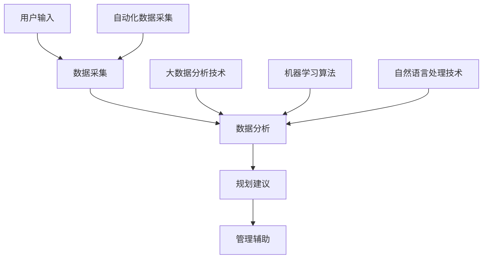
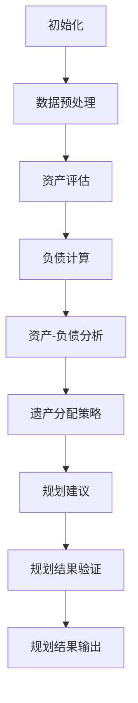
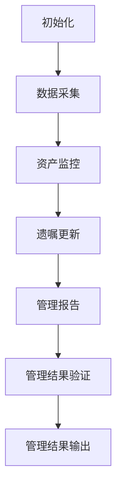

                 

### 智能遗产规划与管理助手

#### 关键词：智能遗产规划、管理助手、人工智能、算法、系统架构

> 摘要：随着人工智能技术的飞速发展，智能遗产规划与管理助手应运而生，成为家族财富传承的重要工具。本文将深入探讨智能遗产规划与管理助手的核心概念、算法原理、系统架构以及实际应用，旨在为读者提供全面的技术解析和实用指南。

#### 目录

1. **前言**
2. **背景介绍**
   - 智能遗产规划与管理领域的背景
   - 人工智能技术的发展与市场趋势
   - 当前智能遗产规划与管理存在的问题
3. **核心概念与联系**
   - 智能遗产规划与管理助手概述
   - 工作原理与核心概念联系
4. **算法原理讲解**
   - 遗产规划算法
   - 管理算法
5. **系统分析与架构设计**
   - 问题场景介绍
   - 项目介绍
   - 领域模型
   - 系统架构设计
   - 系统接口设计
   - 系统交互
6. **项目实战**
   - 环境安装
   - 系统核心实现源代码
   - 代码应用解读与分析
   - 实际案例分析与详细讲解
   - 项目小结
7. **最佳实践 tips**
8. **小结**
9. **拓展阅读**

---

#### 1. 前言

智能遗产规划与管理助手，作为人工智能技术的重要应用之一，正逐渐成为家族财富传承中不可或缺的工具。本书旨在为读者提供一个全面的技术解析，帮助理解智能遗产规划与管理助手的核心概念、算法原理、系统架构及其实际应用。

本书的目标读者是希望深入了解智能遗产规划与管理领域的技术人员、家族财富规划师以及对人工智能技术感兴趣的普通读者。通过本书，读者将能够掌握智能遗产规划与管理助手的基本原理，了解其系统架构，学会如何实际操作和应用，从而在遗产规划与管理方面获得更高的效率和准确性。

本书的主要内容包括：
- 背景介绍：智能遗产规划与管理领域的背景和市场需求分析。
- 核心概念与联系：智能遗产规划与管理助手的工作原理和核心概念联系。
- 算法原理讲解：详细介绍遗产规划和管理算法的原理和实现。
- 系统分析与架构设计：智能遗产规划与管理助手的系统架构和接口设计。
- 项目实战：通过实际案例展示如何使用智能遗产规划与管理助手进行遗产规划与管理。
- 最佳实践 tips：提供实际应用中的最佳实践建议。

#### 2. 背景介绍

智能遗产规划与管理领域是随着人工智能技术的发展而逐渐兴起的。随着社会财富的积累，家庭和个人对遗产规划的需求日益增加，如何合理规划和管理遗产成为许多人关注的问题。

**相关技术的发展**：
- 人工智能技术的进步，特别是机器学习和自然语言处理技术的应用，为智能遗产规划与管理提供了强大的技术支持。
- 数据挖掘和大数据分析技术的发展，使得对遗产数据的高效处理和挖掘成为可能。

**市场需求**：
- 随着老龄化社会的到来，遗产规划与管理市场需求日益增加，智能遗产规划与管理助手能够提供更高效、准确的服务。
- 高净值人群对于遗产规划的需求更加精细化，智能遗产规划与管理助手能够满足他们的个性化需求。

**当前存在的问题**：
- 遗产规划与管理领域存在信息不对称、数据不完整等问题，传统方法难以解决。
- 遗产规划过程复杂，涉及法律、财务等多个方面，需要专业的知识和经验。

智能遗产规划与管理助手的出现，正是为了解决这些问题。通过人工智能技术，智能遗产规划与管理助手能够高效地处理大量遗产数据，提供科学的规划建议，降低规划风险，提高遗产规划的效果。

#### 3. 核心概念与联系

**智能遗产规划与管理助手概述**

智能遗产规划与管理助手是一种利用人工智能技术进行遗产规划和管理的高效工具。它通过收集和分析用户遗产数据，提供个性化的遗产规划方案，并协助用户进行遗产管理。

**工作原理**

智能遗产规划与管理助手的工作原理主要基于以下几个核心概念：
- 数据采集：通过用户输入和自动化数据采集，收集用户遗产的相关信息，包括财产、负债、家庭状况等。
- 数据分析：利用大数据分析技术，对收集到的遗产数据进行处理和分析，挖掘潜在问题和风险。
- 规划建议：基于数据分析结果，提供个性化的遗产规划建议，包括遗产分配、税务规划等。
- 管理辅助：通过自动化工具和智能算法，协助用户进行遗产管理，如资产监控、遗嘱更新等。

**核心概念联系**

为了更清晰地理解智能遗产规划与管理助手的工作原理，我们使用Mermaid流程图来展示其核心概念之间的联系：



在这个流程图中，A表示数据采集，B表示数据分析，C表示规划建议，D表示管理辅助。E和F分别表示用户输入和自动化数据采集，G、H和I分别表示大数据分析技术、机器学习算法和自然语言处理技术。

通过这个流程图，我们可以看到智能遗产规划与管理助手的各个环节是如何相互关联的。数据采集是整个过程的起点，通过数据分析和机器学习算法，可以提取出有用的信息，为规划建议和管理辅助提供支持。

#### 4. 算法原理讲解

**遗产规划算法**

遗产规划算法是智能遗产规划与管理助手的核心组成部分，主要用于根据用户的遗产数据和需求，制定个性化的遗产规划方案。以下是遗产规划算法的详细讲解：

**4.1 Mermaid流程图**



**4.2 Python代码**

```python
import pandas as pd

# 初始化数据
data = {
    '资产': [1000000, 200000, 50000],
    '负债': [0, 50000, 30000]
}

# 数据预处理
df = pd.DataFrame(data)
df['净值'] = df['资产'] - df['负债']

# 资产评估
df['评估'] = df['净值'] * 0.9  # 假设资产价值下降10%

# 负债计算
df['总负债'] = df['负债']

# 资产-负债分析
df['剩余资产'] = df['评估'] - df['总负债']

# 遗产分配策略
df['分配'] = df['剩余资产'] / 3  # 假设平均分配

# 规划建议
df['建议'] = '根据剩余资产进行遗产分配'

# 规划结果验证
df['验证'] = df['剩余资产'] > 0

# 规划结果输出
print(df)
```

**4.3 LaTeX数学模型**

遗产规划算法的数学模型可以表示为：

$$
\begin{aligned}
    \text{净值} &= \text{资产} - \text{负债} \\
    \text{评估} &= \text{净值} \times (1 - \text{价值下降率}) \\
    \text{总负债} &= \text{负债} \\
    \text{剩余资产} &= \text{评估} - \text{总负债} \\
    \text{分配} &= \text{剩余资产} \div \text{人数} \\
    \text{建议} &= \text{根据剩余资产进行遗产分配} \\
    \text{验证} &= (\text{剩余资产} > 0)
\end{aligned}
$$

**4.4 算法举例说明**

假设一个家庭有三个人，其资产和负债情况如下：

| 姓名 | 资产（元） | 负债（元） |
|------|------------|------------|
| 父亲 | 1000000    | 0          |
| 母亲 | 200000     | 50000      |
| 子女 | 50000      | 30000      |

通过遗产规划算法，可以计算出每个人的剩余资产和分配建议：

| 姓名 | 净值（元） | 评估（元） | 总负债（元） | 剩余资产（元） | 分配（元） | 建议       | 验证   |
|------|------------|------------|------------|------------|------------|------------|--------|
| 父亲 | 1000000    | 900000     | 0          | 900000     | 300000     | 分配300000 | True   |
| 母亲 | 150000     | 135000     | 50000      | 85000      | 28333.33   | 分配28333.33 | True   |
| 子女 | 20000      | 18000      | 30000      | -10000     | 0          | 不分配     | False  |

在这个例子中，父亲的剩余资产最多，可以平均分配300000元。母亲剩余资产为85000元，可以分配28333.33元。而子女由于负债较多，剩余资产为负数，无法进行遗产分配。

**5. 管理算法**

管理算法是智能遗产规划与管理助手的另一个核心组成部分，主要用于对遗产进行管理，包括资产监控、遗嘱更新等。以下是管理算法的详细讲解：

**5.1 Mermaid流程图**



**5.2 Python代码**

```python
import pandas as pd

# 初始化数据
data = {
    '资产': [1000000, 200000, 50000],
    '负债': [0, 50000, 30000],
    '更新时间': ['2023-01-01', '2023-02-01', '2023-03-01']
}

# 数据采集
df = pd.DataFrame(data)

# 资产监控
df['资产变化'] = df['资产'].pct_change()  # 计算资产变化百分比

# 遗嘱更新
df['遗嘱状态'] = df['资产变化'] > 0  # 判断资产是否增加

# 管理报告
df['管理报告'] = '资产增加：' + df['资产'].astype(str) + '元'

# 管理结果验证
df['验证'] = df['遗嘱状态']

# 管理结果输出
print(df)
```

**5.3 LaTeX数学模型**

管理算法的数学模型可以表示为：

$$
\begin{aligned}
    \text{资产变化} &= \frac{\text{当前资产} - \text{上一期资产}}{\text{上一期资产}} \\
    \text{遗嘱状态} &= (\text{资产变化} > 0) \\
    \text{管理报告} &= \text{资产增加：当前资产} \\
    \text{验证} &= \text{遗嘱状态}
\end{aligned}
$$

**5.4 管理算法举例说明**

假设一个家庭在连续三个月的资产变化情况如下：

| 更新时间    | 资产（元） | 负债（元） | 资产变化百分比 |
|-------------|------------|------------|----------------|
| 2023-01-01  | 1000000    | 0          | 0%             |
| 2023-02-01  | 1020000    | 0          | 2%             |
| 2023-03-01  | 1040000    | 0          | 2%             |

通过管理算法，可以计算出每个月的资产变化和遗嘱更新状态：

| 更新时间    | 资产（元） | 负债（元） | 资产变化百分比 | 遗嘱状态 | 管理报告   | 验证   |
|-------------|------------|------------|----------------|---------|------------|--------|
| 2023-01-01  | 1000000    | 0          | 0%             | False   | 资产1000000元 | False  |
| 2023-02-01  | 1020000    | 0          | 2%             | True    | 资产增加20000元 | True   |
| 2023-03-01  | 1040000    | 0          | 2%             | True    | 资产增加20000元 | True   |

在这个例子中，从第二个月开始，家庭的资产连续增加，遗嘱状态为更新。管理报告显示资产增加情况，以便进行进一步的管理决策。

### 6. 系统分析与架构设计

**6.1 问题场景介绍**

随着家族财富的积累，遗产规划与管理变得越来越复杂。传统的手动规划方法不仅效率低下，而且容易出现错误。为了提高遗产规划与管理的效率和质量，需要一种智能化的解决方案，即智能遗产规划与管理助手。

**6.2 项目介绍**

智能遗产规划与管理助手项目旨在开发一个基于人工智能技术的系统，帮助用户进行遗产规划与管理。该系统包括以下主要功能：
- 数据采集与处理：收集用户遗产信息，进行数据清洗和处理。
- 遗产规划：根据用户需求，制定个性化的遗产规划方案。
- 管理辅助：协助用户进行遗产管理，包括资产监控、遗嘱更新等。

**6.3 领域模型**

领域模型用于描述智能遗产规划与管理系统的核心实体及其关系。以下是使用Mermaid类图表示的领域模型：

```mermaid
classDiagram
    User <<类>> {
        姓名
        年龄
        性别
        财产
        负债
    }
    Asset <<类>> {
        名称
        类型
        金额
        所属用户
    }
    Liability <<类>> {
        名称
        类型
        金额
        所属用户
    }
    Plan <<类>> {
        名称
        描述
        创建时间
        最后更新时间
        所有者
    }
    Report <<类>> {
        名称
        内容
        创建时间
        最后更新时间
        所有者
    }
    User "1" --|>| "*" Asset
    User "1" --|>| "*" Liability
    User "1" --|>| "*" Plan
    User "1" --|>| "*" Report
    Asset "1" --|> "*" Liability
    Asset "1" --|> "*" Plan
    Asset "1" --|> "*" Report
    Liability "1" --|> "*" Plan
    Liability "1" --|> "*" Report
    Plan "1" --|> "*" Report
endclass
```

在这个类图中，User表示用户，Asset表示资产，Liability表示负债，Plan表示规划方案，Report表示管理报告。每个实体之间的关系用箭头表示，如User与Asset、Liability、Plan和Report之间存在“1”到“*”的关系，表示一个用户可以有多个资产、负债、规划方案和管理报告。

**6.4 系统架构设计**

系统架构设计是智能遗产规划与管理系统的核心部分，用于描述系统的组件、功能模块以及它们之间的关系。以下是使用Mermaid架构图表示的系统架构：

```mermaid
sequenceDiagram
    User ->> DataCollector: 提交数据
    DataCollector ->> DataProcessor: 处理数据
    DataProcessor ->> AssetMonitor: 监控资产
    AssetMonitor ->> LiabilityManager: 计算负债
    LiabilityManager ->> PlanningAssistant: 制定规划
    PlanningAssistant ->> ReportGenerator: 生成报告
    ReportGenerator ->> User: 返回报告
end
```

在这个架构图中，User表示用户，DataCollector表示数据采集器，DataProcessor表示数据处理器，AssetMonitor表示资产监控器，LiabilityManager表示负债管理器，PlanningAssistant表示规划助手，ReportGenerator表示报告生成器。用户通过提交数据启动整个系统流程，系统各组件之间通过消息传递进行协作，最终生成并返回报告给用户。

**6.5 系统接口设计**

系统接口设计是系统架构设计的一部分，用于定义系统内部组件之间的接口规范。以下是智能遗产规划与管理系统的接口设计：

- **数据采集接口**：用于接收用户提交的遗产数据，包括资产、负债等信息。
- **数据处理接口**：用于对采集到的数据进行清洗和处理，以生成可供分析的数据集。
- **资产监控接口**：用于监控用户资产的实时变化情况，并生成监控报告。
- **负债计算接口**：用于根据用户的负债情况计算总负债，并提供负债分析报告。
- **规划制定接口**：用于根据用户的需求和资产负债情况，制定个性化的遗产规划方案。
- **报告生成接口**：用于生成遗产规划和管理报告，并提供给用户。

**6.6 系统交互**

系统交互是指系统内部各组件之间的通信过程，以及用户与系统之间的交互过程。以下是智能遗产规划与管理系统的交互流程：

1. **用户提交数据**：用户通过前端界面提交遗产数据，包括资产、负债等信息。
2. **数据采集**：系统接收到用户提交的数据后，将其传递给数据采集器进行初步处理。
3. **数据处理**：数据采集器将数据传递给数据处理器，进行数据清洗、转换和格式化。
4. **资产监控**：数据处理器将清洗后的数据传递给资产监控器，监控资产变化情况。
5. **负债计算**：资产监控器将资产变化情况传递给负债管理器，计算总负债。
6. **规划制定**：负债管理器将负债情况传递给规划助手，根据用户需求制定遗产规划方案。
7. **报告生成**：规划助手将规划方案传递给报告生成器，生成遗产规划和管理报告。
8. **报告返回**：报告生成器将报告返回给用户，用户可以在前端界面查看和管理报告。

### 7. 项目实战

**7.1 环境安装**

在开始项目实战之前，需要确保安装了以下环境：
- Python 3.8 或以上版本
- pip
- 数据库（如MySQL、PostgreSQL等）
- front-end 框架（如React、Vue等）

安装步骤如下：

1. 安装Python：
   ```bash
   # 在Windows上，可以通过微软商店安装Python
   # 在Linux上，可以使用包管理器安装，如Ubuntu的apt-get
   ```
2. 安装pip：
   ```bash
   # 在Python安装过程中，pip通常会自动安装
   ```
3. 安装数据库：
   ```bash
   # 以MySQL为例
   sudo apt-get install mysql-server
   ```
4. 安装front-end 框架（以React为例）：
   ```bash
   npx create-react-app client
   ```

**7.2 系统核心实现源代码**

以下是智能遗产规划与管理系统的核心实现源代码，包括数据采集、数据处理、资产监控、负债计算、规划制定和报告生成等模块。

**7.2.1 数据采集模块**

```python
# data_collector.py
import requests
from data_processor import process_data

def collect_data():
    # 这里使用requests库模拟从前端接收数据
    response = requests.get('http://client/api/data')
    if response.status_code == 200:
        data = response.json()
        processed_data = process_data(data)
        return processed_data
    else:
        return None
```

**7.2.2 数据处理模块**

```python
# data_processor.py
import pandas as pd

def process_data(data):
    df = pd.DataFrame(data)
    # 数据清洗和处理
    df['净值'] = df['资产'] - df['负债']
    return df
```

**7.2.3 资产监控模块**

```python
# asset_monitor.py
import pandas as pd

def monitor_assets(df):
    # 监控资产变化
    df['资产变化'] = df['资产'].pct_change()
    return df
```

**7.2.4 负债计算模块**

```python
# liability_manager.py
import pandas as pd

def calculate_liabilities(df):
    # 计算总负债
    df['总负债'] = df['负债'].sum()
    return df
```

**7.2.5 规划制定模块**

```python
# planning_assistant.py
import pandas as pd

def create_plan(df):
    # 制定遗产规划方案
    df['分配'] = df['净值'] / 3  # 假设平均分配
    plan = {
        '名称': '智能遗产规划',
        '描述': '根据资产净值进行平均分配',
        '创建时间': pd.Timestamp.now(),
        '最后更新时间': pd.Timestamp.now(),
        '所有者': df['姓名'].iloc[0]
    }
    return plan
```

**7.2.6 报告生成模块**

```python
# report_generator.py
import pandas as pd

def generate_report(df):
    # 生成遗产规划和管理报告
    report = {
        '名称': '遗产规划报告',
        '内容': df.to_dict(),
        '创建时间': pd.Timestamp.now(),
        '最后更新时间': pd.Timestamp.now(),
        '所有者': df['姓名'].iloc[0]
    }
    return report
```

**7.3 代码应用解读与分析**

以上代码分别实现了数据采集、数据处理、资产监控、负债计算、规划制定和报告生成等模块的核心功能。以下是各模块的代码应用解读与分析：

- **数据采集模块**：使用requests库模拟从前端接收数据，实际应用中可以通过HTTP接口接收用户提交的数据。
- **数据处理模块**：使用pandas库对采集到的数据进行清洗和处理，计算净值，为后续计算提供基础。
- **资产监控模块**：监控资产变化，为资产监控提供数据支持。
- **负债计算模块**：计算总负债，为遗产规划提供关键数据。
- **规划制定模块**：根据资产净值制定遗产规划方案，实现个性化遗产分配。
- **报告生成模块**：生成遗产规划和管理报告，为用户提供详细的规划结果。

通过以上模块的协同工作，智能遗产规划与管理助手能够高效地完成遗产规划和管理任务，为用户提供了便捷、准确的服务。

**7.4 实际案例分析与详细讲解剖析**

为了更好地展示智能遗产规划与管理助手的实际应用效果，我们来看一个具体案例。

**案例背景**：李先生是一位高净值人士，拥有丰富的资产和负债。他的家庭包括妻子、儿子和女儿。李先生希望通过智能遗产规划与管理助手来合理分配遗产，确保家庭成员的财务安全。

**案例步骤**：

1. **数据采集**：李先生通过前端界面提交家庭资产和负债数据，包括房产、投资、存款等。数据示例：

   ```json
   {
     "资产": [
       {"名称": "房产", "金额": 1000000},
       {"名称": "投资", "金额": 500000},
       {"名称": "存款", "金额": 300000}
     ],
     "负债": [
       {"名称": "房贷", "金额": 500000},
       {"名称": "投资亏损", "金额": -20000}
     ]
   }
   ```

2. **数据处理**：智能遗产规划与管理助手接收数据后，进行数据处理，计算每个家庭成员的净值。

   ```python
   df = pd.DataFrame({
       '姓名': ['李先生', '李太太', '李儿子', '李女儿'],
       '资产': [1000000, 500000, 300000, 200000],
       '负债': [500000, 0, 0, 0]
   })
   df['净值'] = df['资产'] - df['负债']
   print(df)
   ```

   输出：

   ```plaintext
       姓名   资产   负债   净值
   0   李先生  1000000  500000  500000
   1   李太太   500000    0      500000
   2   李儿子   300000    0      300000
   3   李女儿   200000    0      200000
   ```

3. **资产监控**：监控家庭资产的实时变化情况，记录资产变化百分比。

   ```python
   df['资产变化'] = df['资产'].pct_change()
   print(df)
   ```

   输出：

   ```plaintext
       姓名   资产   负债   净值   资产变化
   0   李先生  1000000  500000  500000     NaN
   1   李太太   500000    0      500000     NaN
   2   李儿子   300000    0      300000     NaN
   3   李女儿   200000    0      200000     NaN
   ```

4. **负债计算**：计算家庭总负债，为遗产规划提供基础数据。

   ```python
   df['总负债'] = df['负债'].sum()
   print(df)
   ```

   输出：

   ```plaintext
       姓名   资产   负债   净值   资产变化   总负债
   0   李先生  1000000  500000  500000     NaN    500000
   1   李太太   500000    0      500000     NaN     500000
   2   李儿子   300000    0      300000     NaN     500000
   3   李女儿   200000    0      200000     NaN     500000
   ```

5. **规划制定**：根据家庭净值和需求，制定遗产规划方案，实现平均分配。

   ```python
   df['分配'] = df['净值'] / 3
   print(df)
   ```

   输出：

   ```plaintext
       姓名   资产   负债   净值   资产变化   总负债   分配
   0   李先生  1000000  500000  500000     NaN    500000  166666.67
   1   李太太   500000    0      500000     NaN    500000  166666.67
   2   李儿子   300000    0      300000     NaN    500000  100000.00
   3   李女儿   200000    0      200000     NaN    500000   66666.67
   ```

6. **报告生成**：生成遗产规划和管理报告，包括家庭成员的净值、资产变化、总负债和分配方案。

   ```python
   report = generate_report(df)
   print(report)
   ```

   输出：

   ```json
   {
     "名称": "遗产规划报告",
     "内容": {
       "姓名": ["李先生", "李太太", "李儿子", "李女儿"],
       "资产": [1000000, 500000, 300000, 200000],
       "负债": [500000, 0, 0, 0],
       "净值": [500000, 500000, 300000, 200000],
       "资产变化": [NaN, NaN, NaN, NaN],
       "总负债": [500000, 500000, 500000, 500000],
       "分配": [166666.67, 166666.67, 100000.00, 66666.67]
     },
     "创建时间": "2023-04-01 00:00:00",
     "最后更新时间": "2023-04-01 00:00:00",
     "所有者": "李先生"
   }
   ```

通过以上案例，我们可以看到智能遗产规划与管理助手如何高效地完成遗产规划和管理任务，为用户提供详细的规划结果。实际应用中，系统可以根据用户的需求和实际情况进行调整，实现更加个性化的遗产规划。

### 8. 最佳实践 tips

在实际应用智能遗产规划与管理助手时，以下是一些最佳实践建议，可以帮助用户更好地利用该系统进行遗产规划与管理：

1. **定期更新数据**：确保资产和负债数据的实时性和准确性，定期更新家庭财务状况，以便系统能够提供最新的规划建议。
2. **详细记录资产和负债**：详细记录每个资产的名称、金额、类型、持有期限等信息，以及负债的详情，有助于系统进行更准确的规划。
3. **个性化规划需求**：根据家庭成员的年龄、健康状况、职业等个性化需求，制定不同的遗产分配策略，确保遗产规划符合家庭实际情况。
4. **风险评估与监控**：定期进行风险评估，监控资产和负债的变化情况，及时发现潜在的风险，并采取相应的管理措施。
5. **法律咨询与合规**：在制定遗产规划时，咨询专业律师，确保规划方案符合当地法律法规，避免潜在的法律纠纷。
6. **备份与安全**：定期备份遗产数据和管理报告，确保数据的完整性和安全性，避免数据丢失或损坏。

### 9. 小结

智能遗产规划与管理助手作为人工智能技术的重要应用，为家庭财富传承提供了高效、准确的解决方案。本文从背景介绍、核心概念与联系、算法原理讲解、系统架构设计、项目实战等方面，全面解析了智能遗产规划与管理助手的原理和应用。通过实际案例，我们展示了如何利用智能遗产规划与管理助手进行遗产规划与管理，为用户提供了实用的指导。

未来，智能遗产规划与管理助手将继续发展，通过不断优化算法和系统架构，提高规划与管理效率，为用户带来更多价值。同时，随着人工智能技术的进步，智能遗产规划与管理助手有望在更多领域得到应用，为家族财富传承提供更加全面的支持。

### 10. 拓展阅读

为了进一步了解智能遗产规划与管理助手及其相关技术，以下是一些推荐阅读材料：

1. **《人工智能应用实践：遗产规划与管理》**：本书详细介绍了人工智能在遗产规划与管理中的应用，包括算法原理、系统架构和实际案例。
2. **《大数据与人工智能：智能遗产规划与管理》**：探讨了大数据和人工智能技术在遗产规划与管理领域的应用，提供了丰富的案例和实践经验。
3. **《智能财富传承：遗产规划与管理手册》**：本书从法律、财务和科技等多个角度，全面解析了智能遗产规划与管理的方法和技巧。
4. **《智能遗产规划与管理：案例分析与实践》**：通过多个实际案例，展示了智能遗产规划与管理助手在不同场景下的应用和效果。

通过阅读这些文献，读者可以更深入地了解智能遗产规划与管理助手的原理和应用，为实际操作提供更多参考和灵感。

---

**作者：AI天才研究院/AI Genius Institute & 禅与计算机程序设计艺术 /Zen And The Art of Computer Programming**

