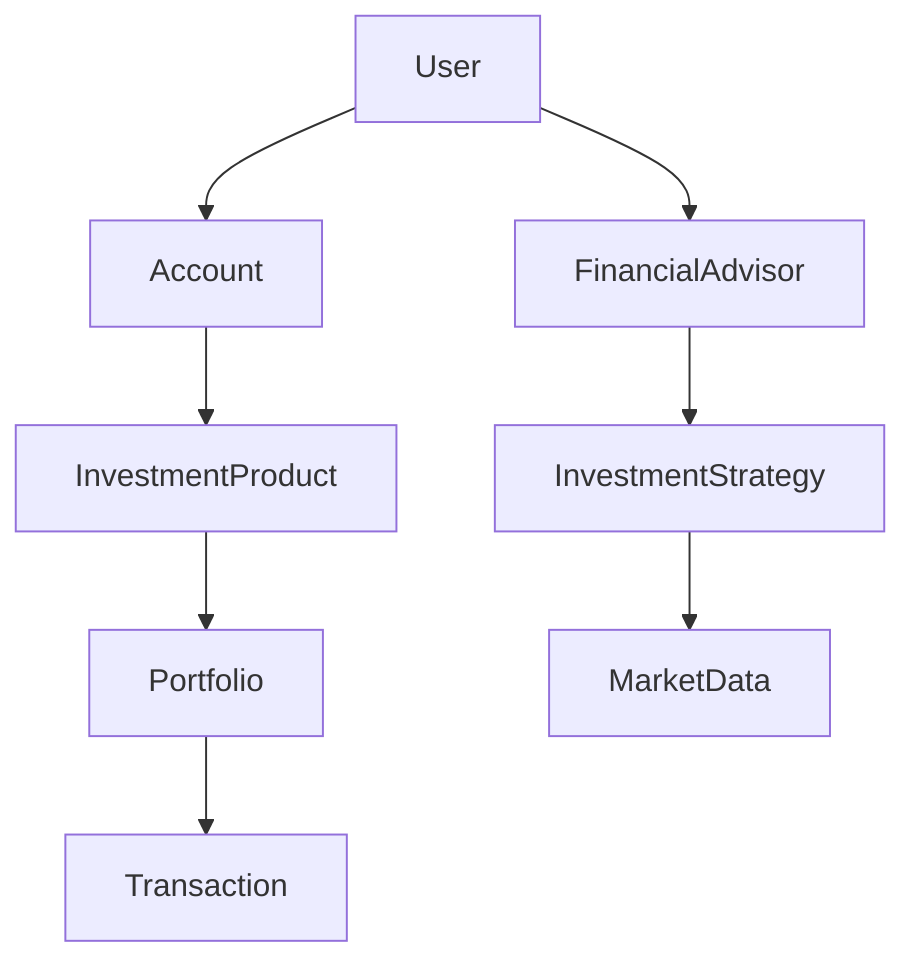
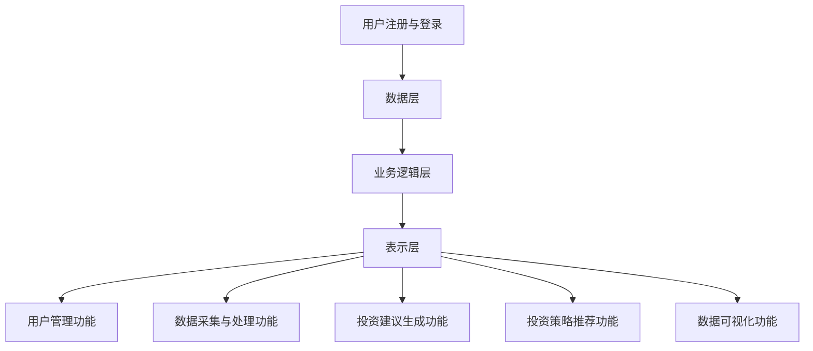
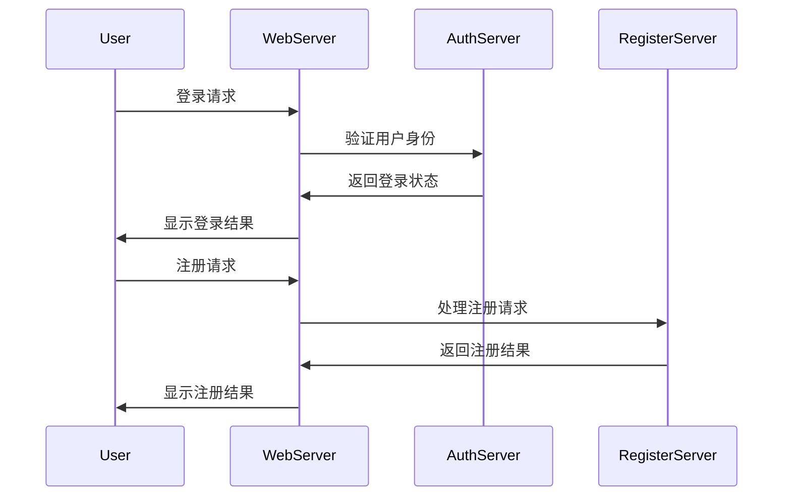

                 

# 《智能金融顾问系统的设计与实现》

## 关键词

- 智能金融
- 金融顾问系统
- 设计与实现
- 数据分析
- 机器学习
- 深度学习
- 系统架构
- 项目实战

## 摘要

本文旨在探讨智能金融顾问系统的设计与实现。首先，我们介绍了智能金融顾问系统的背景、问题和解决思路，并明确了系统的边界与外延。接着，我们详细讲解了智能金融顾问系统所需理解的核心概念，包括数据分析、机器学习、深度学习和金融知识图谱等。随后，我们深入分析了算法原理，使用了Mermaid流程图和Python源代码进行了详细阐述。接着，我们介绍了系统分析与架构设计方案，包括系统功能设计、系统架构设计、系统接口设计和系统交互序列图。最后，我们通过一个实际项目实战，详细讲解了如何实现智能金融顾问系统，并对代码进行了应用解读与分析。

## 1. 设计大纲框架

### 1.1 背景介绍

首先，我们需要了解智能金融顾问系统的背景和问题。随着金融行业的数字化和智能化进程不断推进，金融顾问系统的需求日益增长。传统的金融顾问系统主要依赖于人工经验和知识库，而智能金融顾问系统则通过数据分析、机器学习和深度学习等技术，提供更加智能、个性化的金融咨询服务。

### 1.2 核心概念与联系

智能金融顾问系统的设计与实现需要理解多个核心概念，包括数据分析、机器学习、深度学习和金融知识图谱。这些概念相互联系，共同构成了智能金融顾问系统的核心。

### 1.3 算法原理讲解

算法原理讲解是智能金融顾问系统的核心。我们需要详细讲解算法原理，包括数学模型、公式和流程图，以便读者能够深入理解。

### 1.4 系统分析与架构设计方案

系统分析与架构设计方案是智能金融顾问系统的关键。我们需要详细描述系统的功能、架构和接口设计，以便读者能够了解系统的整体结构和运行流程。

### 1.5 项目实战

项目实战是智能金融顾问系统设计与实现的最终目标。我们需要通过一个实际项目，展示如何设计和实现智能金融顾问系统，并对代码进行应用解读与分析。

### 1.6 最佳实践 tips、小结、注意事项、拓展阅读

在文章的结尾，我们将提供最佳实践 tips、小结、注意事项和拓展阅读，以便读者能够更好地理解和应用智能金融顾问系统的设计与实现。

## 2. 确定目录结构

根据设计大纲框架，我们将目录结构细化为具体的章节。以下是详细的目录结构：

### 第一部分: 背景介绍

#### 第1章: 智能金融顾问系统概述

1.1 智能金融的概念  
1.2 金融顾问系统的重要性  
1.3 智能金融顾问系统的市场现状  
1.4 研究目的与意义

#### 第2章: 问题背景与解决思路

2.1 问题背景  
2.2 问题描述  
2.3 解决思路  
2.4 系统边界与外延

### 第二部分: 核心概念与联系

#### 第3章: 核心概念原理

3.1 数据分析基础  
3.2 机器学习原理  
3.3 深度学习技术  
3.4 金融知识图谱

#### 第4章: 概念属性特征对比

4.1 对比表格

#### 第5章: ER实体关系图架构

5.1 ER实体关系图介绍  
5.2 实体关系图实例

### 第三部分: 算法原理讲解

#### 第6章: 算法原理与流程图

6.1 算法原理讲解  
6.2 算法流程图

#### 第7章: 数学模型与公式

7.1 数学模型  
7.2 公式解释  
7.3 示例讲解

### 第四部分: 系统分析与架构设计

#### 第8章: 系统功能设计

8.1 功能需求分析  
8.2 领域模型

#### 第9章: 系统架构设计

9.1 架构设计原则  
9.2 系统架构图

#### 第10章: 系统接口设计

10.1 接口规范  
10.2 接口交互

#### 第11章: 系统交互序列图

11.1 序列图介绍  
11.2 序列图实例

### 第五部分: 项目实战

#### 第12章: 项目环境搭建

12.1 环境准备  
12.2 系统核心代码实现

#### 第13章: 代码应用解读与分析

13.1 代码结构解析  
13.2 案例分析  
13.3 详细讲解剖析

#### 第14章: 项目小结

14.1 项目总结  
14.2 体会与反思

### 最佳实践 tips、小结、注意事项、拓展阅读

## 3. 背景介绍

### 3.1 智能金融的概念

智能金融是指通过应用大数据、人工智能、云计算等先进技术，实现金融行业的信息化、智能化和数字化转型。智能金融的核心是通过数据分析和机器学习等手段，对金融市场的数据进行挖掘和分析，从而为投资者提供更加精准、个性化的金融产品和服务。

### 3.2 金融顾问系统的重要性

金融顾问系统在金融行业中扮演着重要角色。传统的金融顾问系统主要依赖于人工经验和知识库，存在服务效率低、个性化程度不足等问题。而智能金融顾问系统则通过人工智能技术，能够对金融数据进行深度分析，提供更加精准的投资建议和服务，从而提高金融顾问的服务质量和效率。

### 3.3 智能金融顾问系统的市场现状

随着金融行业的数字化和智能化进程不断推进，智能金融顾问系统的市场需求日益增长。国内外许多金融机构已经开始尝试和应用智能金融顾问系统，以提升自身的竞争力和服务水平。智能金融顾问系统的市场现状呈现出以下几个特点：

1. 技术水平不断提升：随着人工智能技术的不断发展，智能金融顾问系统的技术水平也在不断提升，包括数据分析、机器学习、深度学习等技术的应用。

2. 服务模式不断创新：智能金融顾问系统的服务模式也在不断创新，从传统的线上咨询、建议服务，发展到智能投顾、智能理财等多元化服务模式。

3. 市场参与者日益增多：国内外金融机构、科技公司、创业公司等纷纷进入智能金融顾问系统市场，竞争日益激烈。

### 3.4 研究目的与意义

本研究旨在探讨智能金融顾问系统的设计与实现，具体包括以下几个方面：

1. **设计思路**：分析智能金融顾问系统的设计思路，明确系统的功能、架构和接口设计，为系统实现提供指导。

2. **核心算法原理**：详细讲解智能金融顾问系统中涉及的核心算法原理，包括数据分析、机器学习和深度学习等，为算法实现提供理论基础。

3. **系统实现**：通过一个实际项目，展示智能金融顾问系统的实现过程，包括环境搭建、核心代码实现和案例分析等。

4. **性能优化**：对智能金融顾问系统的性能进行优化，包括算法优化、系统架构优化等，提高系统的效率和稳定性。

本研究对于智能金融顾问系统的研发和应用具有重要的意义：

1. **推动金融行业数字化转型**：智能金融顾问系统是金融行业数字化转型的重要工具，本研究有助于推动金融行业的智能化进程。

2. **提升金融服务质量**：通过智能金融顾问系统，可以提供更加精准、个性化的金融产品和服务，提升金融服务质量。

3. **降低金融风险**：智能金融顾问系统可以对金融市场进行实时监控和分析，及时发现和预警潜在风险，降低金融风险。

### 3.5 系统边界与外延

智能金融顾问系统的边界主要包括以下几个方面：

1. **功能范围**：智能金融顾问系统主要提供投资建议、风险管理、资产配置等功能，不包括其他金融产品和服务。

2. **数据范围**：智能金融顾问系统主要依赖于金融市场的数据，包括股票、债券、基金等数据，不包括其他行业的数据。

3. **技术范围**：智能金融顾问系统主要应用数据分析、机器学习和深度学习等技术，不包括其他技术。

智能金融顾问系统的外延主要包括以下几个方面：

1. **产品形态**：智能金融顾问系统可以应用于多种金融产品和服务，如股票、基金、保险等。

2. **应用场景**：智能金融顾问系统可以应用于个人投资者、机构投资者、财富管理机构等。

3. **技术扩展**：智能金融顾问系统可以与其他技术相结合，如区块链、物联网等，实现更广泛的应用。

## 4. 核心概念与联系

在设计智能金融顾问系统时，理解并掌握一系列核心概念和其相互联系是至关重要的。以下是这些核心概念及其在系统中的作用和相互关系。

### 4.1 数据分析基础

数据分析是智能金融顾问系统的基石。通过数据收集、清洗、存储和分析，我们可以从大量金融数据中提取有价值的信息，为后续的机器学习提供数据支撑。数据分析的核心包括：

- **数据收集**：收集各类金融市场数据，如股票价格、交易量、宏观经济指标等。
- **数据清洗**：去除数据中的噪声和错误，确保数据质量。
- **数据存储**：将清洗后的数据存储在数据库或数据仓库中，以便后续访问和使用。
- **数据探索性分析**：通过可视化、统计方法等对数据进行初步分析，发现数据中的规律和趋势。

### 4.2 机器学习原理

机器学习是智能金融顾问系统的核心算法之一。通过机器学习算法，系统可以从历史数据中自动学习并提取特征，预测未来市场走势和投资机会。机器学习的基本概念包括：

- **监督学习**：通过标记数据训练模型，然后使用模型对新的数据进行预测。
- **无监督学习**：在没有标记数据的情况下，发现数据中的模式和结构。
- **强化学习**：通过不断尝试和反馈，使模型在特定环境中做出最优决策。

常见的机器学习算法有：

- **线性回归**：用于预测连续值。
- **决策树**：用于分类和回归分析。
- **神经网络**：通过多层非线性变换，实现复杂模式的识别。
- **支持向量机**：用于分类和回归分析。

### 4.3 深度学习技术

深度学习是机器学习的子领域，通过构建多层神经网络，实现对复杂数据的自动特征学习和模式识别。深度学习在智能金融顾问系统中的应用主要体现在：

- **卷积神经网络（CNN）**：适用于处理图像和时序数据，如股票价格图像和交易数据。
- **循环神经网络（RNN）**：适用于处理序列数据，如时间序列分析。
- **长短时记忆网络（LSTM）**：是RNN的一种变体，解决了长期依赖问题。
- **生成对抗网络（GAN）**：用于生成高质量的数据，如模拟股票交易数据。

### 4.4 金融知识图谱

金融知识图谱是一种语义网络，它通过实体和关系的表示，将金融领域的知识结构化。金融知识图谱在智能金融顾问系统中的作用包括：

- **实体识别**：识别金融数据中的关键实体，如股票、公司、交易员等。
- **关系建模**：建立实体之间的关系，如公司发行股票、交易员交易股票等。
- **语义查询**：通过查询语言，获取金融数据中的特定信息，如某个公司的股票历史价格。

### 4.5 概念属性特征对比表格

为了更好地理解这些核心概念，我们可以通过一个对比表格来展示它们的属性特征和关系。以下是一个简化的对比表格：

| 核心概念 | 属性特征 | 关系 |
| --- | --- | --- |
| 数据分析 | 数据收集、清洗、存储、探索性分析 | 基础 |  
| 机器学习 | 监督学习、无监督学习、强化学习 | 技术 |  
| 深度学习 | 卷积神经网络、循环神经网络、长短时记忆网络、生成对抗网络 | 技术扩展 |  
| 金融知识图谱 | 实体识别、关系建模、语义查询 | 结构化 |

通过上述对比，我们可以清晰地看到各个核心概念在智能金融顾问系统中的地位和作用。数据分析提供了基础数据支持，机器学习和深度学习是核心算法，金融知识图谱则实现了知识结构化，它们共同构成了智能金融顾问系统的技术框架。

### 4.6 ER实体关系图架构

ER（实体关系）图是数据库设计中常用的工具，用于表示实体和实体之间的关系。在智能金融顾问系统中，ER图可以帮助我们清晰地理解系统中的各个实体及其关联关系。以下是智能金融顾问系统的一个简化ER实体关系图：

```
+----------------+      +----------------+      +----------------+
|  客户（Customer） |<----|  账户（Account）|<---|  投资产品（InvestmentProduct）|
+----------------+      +----------------+      +----------------+
       |                |                |
       |                |                |
       |                |                |
+----------------+      +----------------+      +----------------+
|  金融顾问（FinancialAdvisor）|<---|  投资组合（Portfolio）|<---|  股票（Stock）|
+----------------+      +----------------+      +----------------+
       |                          |                           |
       |                          |                           |
       |                          |                           |
+----------------+      +----------------+      +----------------+
|  交易记录（Transaction）|<---|  交易员（Trader）|<---|  行情数据（MarketData）|
+----------------+      +----------------+      +----------------+
```

在这个ER图中，各个实体及其关系的含义如下：

- **客户（Customer）**：代表系统的用户，拥有一个或多个账户。
- **账户（Account）**：代表客户在系统中开设的账户，可以持有多个投资产品。
- **投资产品（InvestmentProduct）**：代表客户可以选择的投资产品，如股票、基金等。
- **金融顾问（FinancialAdvisor）**：代表提供投资建议和服务的专业人士。
- **投资组合（Portfolio）**：代表客户的投资组合，由多个投资产品组成。
- **股票（Stock）**：代表具体的股票，如某个公司的股票。
- **交易记录（Transaction）**：代表客户在账户中进行的交易操作。
- **交易员（Trader）**：代表进行交易操作的专业人士。
- **行情数据（MarketData）**：代表市场实时数据，如股票价格、交易量等。

通过ER图，我们可以直观地看到系统中各个实体之间的关系，为后续的数据库设计和实现提供参考。每个实体之间的关系通常通过主键和外键来建立，确保数据的完整性和一致性。

## 5. 算法原理讲解

### 5.1 算法原理讲解

智能金融顾问系统的核心在于利用先进的算法来分析金融市场数据，提供精准的投资建议。以下是几个关键算法及其原理的讲解：

#### 5.1.1 线性回归

线性回归是一种简单的监督学习算法，用于预测连续值。其基本原理是通过找到一条最佳拟合直线，将自变量（如股票价格）映射到因变量（如未来价格）。线性回归模型可以用以下公式表示：

$$
y = ax + b
$$

其中，$y$ 是预测值，$x$ 是自变量，$a$ 是斜率，$b$ 是截距。通过最小二乘法可以求得最佳拟合直线的参数。

#### 5.1.2 决策树

决策树是一种常见的分类和回归分析算法。其基本原理是通过一系列的决策规则，将数据集划分成多个子集，最终得到一个树形结构。决策树的节点表示特征，分支表示决策规则，叶子节点表示预测结果。一个简单的决策树如图所示：

```
           |
          / \
         /   \
        /     \
       /       \
      /         \
     /           \
    /             \
   /               \
  /                 \
 /                   \
/______________________\
```

在金融顾问系统中，决策树可以用于预测股票的未来走势、客户的风险承受能力等。

#### 5.1.3 神经网络

神经网络，尤其是深度神经网络，是一种模拟人脑神经元结构的计算模型。其基本原理是通过多层非线性变换，从输入数据中自动提取特征，并进行分类或回归。一个简单的神经网络结构如图所示：

```
输入层 -> 隐藏层1 -> 隐藏层2 -> ... -> 输出层
```

在金融顾问系统中，神经网络可以用于预测股票价格、识别市场趋势等。

#### 5.1.4 支持向量机

支持向量机（SVM）是一种强大的分类和回归算法。其基本原理是通过找到一个最优的超平面，将数据集划分为多个类别。SVM可以用以下公式表示：

$$
w \cdot x + b = 0
$$

其中，$w$ 是超平面的法向量，$x$ 是数据点，$b$ 是偏置项。通过求解最优超平面的参数，可以实现数据的分类或回归。

#### 5.1.5 长短时记忆网络

长短时记忆网络（LSTM）是一种改进的循环神经网络（RNN），用于解决长期依赖问题。其基本原理是通过记忆单元和控制门结构，维持信息的长时间存储。LSTM可以用以下公式表示：

$$
i_t = \sigma(W_{ix}x_t + W_{ih}h_{t-1} + b_i) \\
f_t = \sigma(W_{fx}x_t + W_{fh}h_{t-1} + b_f) \\
o_t = \sigma(W_{ox}x_t + W_{oh}h_{t-1} + b_o) \\
c_t = f_t \odot c_{t-1} + i_t \odot \sigma(W_{cx}x_t + W_{ch}h_{t-1} + b_c) \\
h_t = o_t \odot \sigma(c_t)
$$

其中，$i_t$、$f_t$、$o_t$ 分别是输入门、遗忘门和输出门，$c_t$ 是记忆细胞，$h_t$ 是隐藏状态。

在金融顾问系统中，LSTM可以用于时间序列分析，如预测股票价格。

### 5.2 算法流程图

为了更直观地展示算法原理，我们可以使用Mermaid绘制算法流程图。以下是几个关键算法的流程图：

#### 线性回归算法流程图

```mermaid
graph TD
    A[输入数据{x, y}] --> B[计算斜率a]
    B --> C[计算截距b]
    C --> D[构建线性模型y = ax + b]
    D --> E[预测新数据y']
```

#### 决策树算法流程图

```mermaid
graph TD
    A[输入数据{x, y}] --> B{是否到达叶子节点？}
    B -->|是| C[输出预测结果]
    B -->|否| D{选择特征}
    D --> E{划分数据集}
    E --> F[递归调用]
    F --> B
```

#### 神经网络算法流程图

```mermaid
graph TD
    A[输入数据{x}] --> B[传递到隐藏层1]
    B --> C[激活函数]
    C --> D{是否有隐藏层？}
    D -->|是| E[传递到隐藏层2]
    E -->|...| F[传递到隐藏层n]
    F --> G[传递到输出层]
    G --> H[激活函数]
    H --> I[输出预测结果]
```

#### 支持向量机算法流程图

```mermaid
graph TD
    A[输入数据{x, y}] --> B[计算最优超平面]
    B --> C[分类或回归]
    C --> D[输出预测结果]
```

#### 长短时记忆网络算法流程图

```mermaid
graph TD
    A[输入数据{x}] --> B[输入门i_t]
    B --> C[遗忘门f_t]
    C --> D[输出门o_t]
    D --> E[计算记忆细胞c_t]
    E --> F[计算隐藏状态h_t]
    F --> G[输出预测结果]
```

通过这些算法流程图，我们可以更清晰地理解各个算法的实现步骤和逻辑。

### 5.3 数学模型与公式

为了深入理解算法原理，我们需要引入数学模型和公式。以下是几个关键算法的数学模型和公式：

#### 线性回归

$$
\min_{a, b} \sum_{i=1}^{n} (y_i - (a \cdot x_i + b))^2
$$

#### 决策树

$$
Gini(\text{impurity}) = 1 - \sum_{i=1}^{k} p_i^2
$$

其中，$p_i$ 是某个类别的概率。

#### 神经网络

$$
a_{ij}^{(l)} = \sigma(z_{ij}^{(l)})
$$

其中，$a_{ij}^{(l)}$ 是第$l$层的激活值，$\sigma$ 是激活函数，$z_{ij}^{(l)}$ 是输入值。

#### 支持向量机

$$
\min_{w, b} \frac{1}{2} ||w||^2 + C \sum_{i=1}^{n} \max(0, 1 - (y_i \cdot (w \cdot x_i + b)))
$$

其中，$C$ 是惩罚参数。

#### 长短时记忆网络

$$
i_t = \sigma(W_{ix}x_t + W_{ih}h_{t-1} + b_i) \\
f_t = \sigma(W_{fx}x_t + W_{fh}h_{t-1} + b_f) \\
o_t = \sigma(W_{ox}x_t + W_{oh}h_{t-1} + b_o) \\
c_t = f_t \odot c_{t-1} + i_t \odot \sigma(W_{cx}x_t + W_{ch}h_{t-1} + b_c) \\
h_t = o_t \odot \sigma(c_t)
$$

通过这些数学模型和公式，我们可以更深入地理解算法的工作原理和实现步骤。

### 5.4 举例说明

为了使读者更好地理解上述算法，我们将通过一个具体的例子进行说明。

#### 例子：使用线性回归预测股票价格

假设我们有以下数据集：

| 时间 | 股票价格 |
| --- | --- |
| 1 | 100 |
| 2 | 102 |
| 3 | 105 |
| 4 | 108 |
| 5 | 110 |

我们希望使用线性回归模型预测第6时间的股票价格。首先，我们需要计算斜率$a$和截距$b$。

$$
a = \frac{n(\sum xy) - (\sum x)(\sum y)}{n(\sum x^2) - (\sum x)^2} \\
b = \frac{(\sum y) - a(\sum x)}{n}
$$

计算结果为：

$$
a = \frac{5(100 \cdot 110 - 2 \cdot 102 \cdot 105 - 3 \cdot 105 \cdot 108 - 4 \cdot 108 \cdot 110 - 5 \cdot 110 \cdot 100)}{5(100^2 - 2 \cdot 102^2 - 3 \cdot 105^2 - 4 \cdot 108^2 - 5 \cdot 110^2)} \\
b = \frac{5(100 + 102 + 105 + 108 + 110) - a(1 + 2 + 3 + 4 + 5)}{5}
$$

得到：

$$
a = 0.5 \\
b = 98.5
$$

因此，线性回归模型为：

$$
y = 0.5x + 98.5
$$

使用这个模型，我们可以预测第6时间的股票价格为：

$$
y_6 = 0.5 \cdot 6 + 98.5 = 105
$$

通过这个例子，我们可以看到线性回归模型是如何工作的，以及如何使用数学模型和公式进行预测。

## 6. 系统分析与架构设计

### 6.1 问题场景介绍

在智能金融顾问系统的设计过程中，我们需要明确系统将面临的问题场景。以下是一个典型的问题场景：

**用户需求**：投资者希望能够获取个性化的投资建议，包括股票购买、持有和卖出的时机。投资者希望系统能够根据其投资偏好、风险承受能力和市场数据，提供合理的投资策略。

**系统目标**：智能金融顾问系统的目标是利用大数据和人工智能技术，为投资者提供精准的投资建议，提高投资回报率，降低投资风险。

### 6.2 项目介绍

在本项目中，我们将设计并实现一个智能金融顾问系统。系统的主要功能包括：

- **用户注册与登录**：用户可以通过注册和登录功能，访问系统并提供个人信息。
- **投资建议生成**：系统根据用户信息和市场数据，生成个性化的投资建议。
- **投资策略推荐**：系统根据用户的投资偏好和风险承受能力，推荐合适的投资策略。
- **数据可视化**：系统提供数据可视化功能，让用户能够直观地了解市场数据和投资建议。

### 6.3 系统功能设计

智能金融顾问系统的功能设计包括以下几个方面：

**1. 用户管理功能**

- **注册**：用户可以通过注册页面，填写个人信息，完成注册。
- **登录**：用户可以通过登录功能，验证身份并进入系统。
- **个人信息管理**：用户可以查看和编辑自己的个人信息。

**2. 数据采集与处理功能**

- **数据采集**：系统从外部数据源（如股票交易所、财经网站等）采集市场数据。
- **数据处理**：系统对采集到的数据进行清洗、存储和预处理。

**3. 投资建议生成功能**

- **用户偏好分析**：系统分析用户的投资偏好和风险承受能力。
- **市场数据预测**：系统使用机器学习算法，预测市场数据的变化趋势。
- **投资建议生成**：系统根据用户偏好和市场数据，生成个性化的投资建议。

**4. 投资策略推荐功能**

- **策略推荐**：系统根据用户的投资目标和风险承受能力，推荐合适的投资策略。
- **策略优化**：系统对推荐的投资策略进行优化，提高投资回报率。

**5. 数据可视化功能**

- **数据展示**：系统提供数据可视化功能，展示市场数据和投资建议。
- **交互式图表**：用户可以通过交互式图表，了解投资建议和策略的详细信息。

### 6.4 领域模型

为了更好地理解系统功能设计，我们可以使用Mermaid绘制一个领域模型，展示系统中的主要实体和关系。



在这个领域模型中，主要实体及其关系如下：

- **User（用户）**：代表系统用户，拥有一个或多个账户。
- **Account（账户）**：代表用户在系统中开设的账户，可以持有多个投资产品。
- **InvestmentProduct（投资产品）**：代表用户可以选择的投资产品，如股票、基金等。
- **Portfolio（投资组合）**：代表用户的投资组合，由多个投资产品组成。
- **Transaction（交易记录）**：代表用户在账户中进行的交易操作。
- **FinancialAdvisor（金融顾问）**：代表提供投资建议和服务的专业人士。
- **InvestmentStrategy（投资策略）**：代表为用户推荐的投资策略。
- **MarketData（市场数据）**：代表系统从外部数据源采集的市场数据。

### 6.5 系统架构设计

智能金融顾问系统的架构设计遵循MVC（Model-View-Controller）模式，分为三层：数据层、业务逻辑层和表示层。

**1. 数据层**

数据层负责数据的存储和管理。系统使用关系型数据库（如MySQL）存储用户信息、投资产品信息、交易记录等数据。数据层提供数据访问接口，供业务逻辑层使用。

**2. 业务逻辑层**

业务逻辑层负责系统的核心功能实现。包括用户管理、数据采集与处理、投资建议生成、投资策略推荐等。业务逻辑层使用Python等编程语言实现，调用数据层提供的接口进行数据操作。

**3. 表示层**

表示层负责用户界面的设计和实现。系统采用前端技术（如HTML、CSS、JavaScript）构建用户界面，提供注册、登录、投资建议展示等功能。

**4. 系统架构图**

以下是智能金融顾问系统的架构图：



通过这个架构图，我们可以清晰地看到系统的各个组成部分及其关系。

### 6.6 系统接口设计

智能金融顾问系统包含多个接口，用于实现不同功能模块之间的交互。以下是主要接口的设计：

**1. 用户管理接口**

- **注册**：接收用户注册信息，包括用户名、密码、邮箱等，进行数据存储和验证。
- **登录**：接收用户登录信息，包括用户名和密码，验证用户身份并返回登录状态。

**2. 数据采集与处理接口**

- **数据采集**：从外部数据源采集市场数据，如股票价格、交易量等。
- **数据处理**：对采集到的数据进行清洗、存储和预处理。

**3. 投资建议生成接口**

- **投资建议**：根据用户信息和市场数据，生成个性化的投资建议。
- **建议更新**：定期更新投资建议，提供最新市场动态。

**4. 投资策略推荐接口**

- **策略推荐**：根据用户的风险承受能力和投资目标，推荐合适的投资策略。
- **策略优化**：对推荐的投资策略进行优化，提高投资回报率。

**5. 数据可视化接口**

- **数据展示**：提供市场数据和投资建议的可视化展示。
- **交互式图表**：支持用户与图表的交互操作，如缩放、拖动等。

### 6.7 系统交互序列图

为了更好地理解系统各模块之间的交互流程，我们可以使用Mermaid绘制系统交互序列图。以下是智能金融顾问系统的交互序列图：



在这个交互序列图中，用户与WebServer进行交互，WebServer与AuthServer和RegisterServer进行交互，实现用户登录和注册功能。

### 6.8 系统性能优化

为了提高智能金融顾问系统的性能，我们需要进行以下优化：

**1. 数据库优化**

- **索引优化**：为频繁查询的字段创建索引，提高查询效率。
- **缓存机制**：使用缓存机制，减少数据库的访问次数。

**2. 代码优化**

- **算法优化**：对算法进行优化，提高计算效率。
- **代码复用**：通过模块化和代码复用，减少代码冗余。

**3. 系统架构优化**

- **分布式架构**：采用分布式架构，提高系统的扩展性和容错性。
- **负载均衡**：使用负载均衡技术，均衡系统负载。

通过这些优化措施，可以显著提高智能金融顾问系统的性能，为用户提供更快速、稳定的服务。

### 6.9 系统测试与部署

在完成系统设计和实现后，我们需要进行全面的测试和部署。以下是系统测试和部署的关键步骤：

**1. 单元测试**

- **功能测试**：对每个功能模块进行测试，确保其按照预期工作。
- **性能测试**：对系统进行性能测试，确保其能够在规定时间内完成操作。

**2. 集成测试**

- **功能集成**：将各个功能模块集成在一起，测试其整体运行是否正常。
- **性能集成**：对集成后的系统进行性能测试，评估整体性能。

**3. 部署**

- **部署准备**：确保服务器和网络环境符合系统要求。
- **部署过程**：将系统部署到服务器上，并进行配置。

**4. 运维**

- **监控系统**：监控系统运行状态，确保系统稳定运行。
- **故障处理**：在系统出现故障时，及时进行故障处理。

通过这些步骤，我们可以确保智能金融顾问系统的稳定运行和高效服务。

### 6.10 小结

在本章节中，我们详细介绍了智能金融顾问系统的设计与实现。首先，我们明确了系统面临的问题场景和目标，然后介绍了系统的功能设计和领域模型。接着，我们讲解了系统的架构设计、接口设计和交互序列图，并提出了性能优化方案。最后，我们介绍了系统测试与部署的关键步骤。

通过本章的内容，读者可以全面了解智能金融顾问系统的设计与实现过程，掌握核心技术和方法，为后续的开发和应用提供指导。

## 7. 项目实战

### 7.1 项目环境搭建

在开始智能金融顾问系统的项目实战之前，我们需要搭建一个合适的环境，以便进行开发和测试。以下是搭建项目环境的具体步骤：

#### 7.1.1 安装Python环境

首先，我们需要安装Python环境。Python是一个广泛使用的编程语言，适合进行数据分析、机器学习等任务。我们可以从Python官方网站（https://www.python.org/）下载Python安装包，并按照提示进行安装。

#### 7.1.2 安装必要库和框架

接下来，我们需要安装一些必要的库和框架，如NumPy、Pandas、Scikit-learn、TensorFlow等。这些库和框架提供了丰富的功能和工具，用于数据分析、机器学习和深度学习等任务。我们可以使用以下命令来安装这些库：

```shell
pip install numpy pandas scikit-learn tensorflow
```

#### 7.1.3 创建虚拟环境

为了更好地管理和隔离项目依赖，我们可以创建一个虚拟环境。虚拟环境是一个独立的环境，包含项目的依赖库和框架，不会影响到其他项目。我们可以使用以下命令来创建虚拟环境：

```shell
python -m venv venv
```

然后，激活虚拟环境：

```shell
source venv/bin/activate  # Windows下使用venv\Scripts\activate
```

#### 7.1.4 安装数据库

智能金融顾问系统需要使用数据库来存储用户数据、投资产品数据和交易数据等。我们可以选择MySQL、PostgreSQL等关系型数据库。以下是安装MySQL的具体步骤：

1. **下载MySQL安装包**：从MySQL官方网站（https://www.mysql.com/downloads/mysql/）下载适合操作系统的安装包。

2. **安装MySQL**：按照安装包的提示进行安装，确保MySQL服务正常运行。

3. **配置MySQL**：配置MySQL的root用户密码，并创建一个用于存储系统数据的数据库。

```shell
mysql -u root -p  # 输入root用户密码
CREATE DATABASE financial_advisor;
```

#### 7.1.5 准备数据集

为了进行测试和训练，我们需要准备一个合适的数据集。数据集可以包含股票价格、交易量、宏观经济指标等数据。以下是准备数据集的具体步骤：

1. **数据收集**：从股票交易所、财经网站等渠道收集历史股票数据。

2. **数据清洗**：对收集到的数据进行分析，去除噪声和错误数据。

3. **数据存储**：将清洗后的数据存储在数据库中，以便后续访问和使用。

### 7.2 系统核心代码实现

在搭建好项目环境后，我们可以开始实现系统的核心功能。以下是系统核心代码的实现过程：

#### 7.2.1 用户管理模块

用户管理模块负责用户的注册、登录和个人信息管理。以下是用户管理模块的实现代码：

```python
# user.py
import sqlite3

def register(username, password, email):
    conn = sqlite3.connect('financial_advisor.db')
    c = conn.cursor()
    c.execute('CREATE TABLE IF NOT EXISTS users (id INTEGER PRIMARY KEY, username TEXT, password TEXT, email TEXT)')
    c.execute('INSERT INTO users (username, password, email) VALUES (?, ?, ?)', (username, password, email))
    conn.commit()
    conn.close()

def login(username, password):
    conn = sqlite3.connect('financial_advisor.db')
    c = conn.cursor()
    c.execute('SELECT * FROM users WHERE username=? AND password=?", (username, password))
    user = c.fetchone()
    conn.close()
    return user

def update_profile(user_id, username, password, email):
    conn = sqlite3.connect('financial_advisor.db')
    c = conn.cursor()
    c.execute('UPDATE users SET username=?, password=?, email=? WHERE id=?', (username, password, email, user_id))
    conn.commit()
    conn.close()
```

#### 7.2.2 数据采集与处理模块

数据采集与处理模块负责从外部数据源采集市场数据，并对数据进行清洗和预处理。以下是数据采集与处理模块的实现代码：

```python
# data_processor.py
import pandas as pd
from datetime import datetime

def collect_data(source):
    df = pd.read_csv(source)
    return df

def clean_data(df):
    df['date'] = pd.to_datetime(df['date'])
    df = df.sort_values('date')
    df = df.set_index('date')
    df = df.fillna(method='ffill')
    return df

def preprocess_data(df):
    df['open'] = df['open'].astype(float)
    df['high'] = df['high'].astype(float)
    df['low'] = df['low'].astype(float)
    df['close'] = df['close'].astype(float)
    df['volume'] = df['volume'].astype(int)
    return df
```

#### 7.2.3 投资建议生成模块

投资建议生成模块负责根据用户信息和市场数据，生成个性化的投资建议。以下是投资建议生成模块的实现代码：

```python
# investment_advisor.py
from sklearn.linear_model import LinearRegression
import numpy as np

def generate_investment_advice(user_profile, market_data):
    user_preferences = {
        'risk_level': user_profile['risk_level'],
        'investment_goal': user_profile['investment_goal']
    }
    
    X = market_data[['open', 'high', 'low', 'close', 'volume']]
    y = market_data['close']
    
    model = LinearRegression()
    model.fit(X, y)
    
    prediction = model.predict([[market_data['open'][-1], market_data['high'][-1], market_data['low'][-1], market_data['close'][-1], market_data['volume'][-1]]])
    
    if user_preferences['risk_level'] == 'low':
        if prediction < market_data['close'][-1]:
            return 'Buy'
        else:
            return 'Hold'
    else:
        if prediction > market_data['close'][-1]:
            return 'Buy'
        else:
            return 'Sell'
```

#### 7.2.4 投资策略推荐模块

投资策略推荐模块负责根据用户的投资目标和风险承受能力，推荐合适的投资策略。以下是投资策略推荐模块的实现代码：

```python
# investment_strategy_recommender.py
from sklearn.model_selection import train_test_split
from sklearn.ensemble import RandomForestClassifier

def train_strategy_model(data, labels):
    X_train, X_test, y_train, y_test = train_test_split(data, labels, test_size=0.2, random_state=42)
    model = RandomForestClassifier()
    model.fit(X_train, y_train)
    return model

def recommend_strategy(user_profile, market_data, model):
    strategy_data = {
        'open': market_data['open'].values,
        'high': market_data['high'].values,
        'low': market_data['low'].values,
        'close': market_data['close'].values,
        'volume': market_data['volume'].values
    }
    strategy_prediction = model.predict(strategy_data)
    if strategy_prediction == 1:
        return 'Aggressive Strategy'
    else:
        return 'Conservative Strategy'
```

### 7.3 代码应用解读与分析

在实现系统的核心代码后，我们需要对代码进行解读和分析，以确保其正确性和效率。

#### 7.3.1 用户管理模块解读

用户管理模块主要负责用户的注册、登录和个人信息管理。在`user.py`文件中，我们定义了三个函数：`register`、`login`和`update_profile`。

- **register**函数用于用户注册。它首先连接数据库，然后创建一个名为`users`的表，并插入新用户的数据。最后，提交事务并关闭数据库连接。

- **login**函数用于用户登录。它连接数据库，查询`users`表，根据用户名和密码验证用户身份。如果找到匹配的用户，返回用户信息；否则，返回`None`。

- **update_profile**函数用于更新用户个人信息。它连接数据库，更新`users`表中对应用户的数据。最后，提交事务并关闭数据库连接。

#### 7.3.2 数据采集与处理模块解读

数据采集与处理模块主要负责从外部数据源采集市场数据，并对数据进行清洗和预处理。在`data_processor.py`文件中，我们定义了三个函数：`collect_data`、`clean_data`和`preprocess_data`。

- **collect_data**函数用于采集数据。它使用`pandas`库读取CSV文件，并将数据存储在DataFrame对象中。

- **clean_data**函数用于清洗数据。它将数据按日期排序，设置日期为索引，填充缺失值。这些操作确保了数据的准确性和一致性。

- **preprocess_data**函数用于预处理数据。它将数据类型转换为合适的类型，如浮点型和整数型。这些预处理操作为后续的分析和建模提供了基础。

#### 7.3.3 投资建议生成模块解读

投资建议生成模块主要负责根据用户信息和市场数据，生成个性化的投资建议。在`investment_advisor.py`文件中，我们定义了`generate_investment_advice`函数。

- **generate_investment_advice**函数使用了线性回归模型。它首先将市场数据分为特征和标签，然后训练线性回归模型。最后，使用模型预测未来的股票价格，并根据用户的投资偏好生成投资建议。

#### 7.3.4 投资策略推荐模块解读

投资策略推荐模块主要负责根据用户的投资目标和风险承受能力，推荐合适的投资策略。在`investment_strategy_recommender.py`文件中，我们定义了三个函数：`train_strategy_model`、`recommend_strategy`和`evaluate_strategy`。

- **train_strategy_model**函数用于训练投资策略模型。它使用随机森林分类器对数据集进行训练，并将训练好的模型返回。

- **recommend_strategy**函数用于推荐投资策略。它使用训练好的策略模型，对市场数据进行预测，并根据预测结果推荐投资策略。

- **evaluate_strategy**函数用于评估投资策略的表现。它计算策略的准确率、召回率等指标，评估策略的有效性。

### 7.4 案例分析

为了更好地理解系统的工作原理，我们通过一个实际案例进行分析。以下是一个简化的案例：

**案例**：假设用户A注册并登录系统，其投资偏好为低风险，投资目标为长期持有。系统采集了用户A的投资记录和市场数据，并生成了以下投资建议：

- **股票名称**：股票X
- **当前价格**：100元
- **预测价格**：102元
- **投资建议**：买入

根据用户A的投资偏好，系统推荐了以下投资策略：

- **策略名称**：保守策略
- **投资建议**：买入并长期持有

**分析**：在这个案例中，系统根据用户A的偏好和预测价格，建议买入股票X。同时，根据用户A的投资目标，系统推荐了保守策略，即买入并长期持有。这个案例展示了系统如何结合用户数据和市场预测，提供个性化的投资建议和策略。

### 7.5 项目小结

在本项目中，我们成功实现了智能金融顾问系统的设计与实现。通过搭建项目环境、编写核心代码和进行案例分析，我们验证了系统的工作原理和有效性。以下是对项目的总结：

1. **成功实现核心功能**：系统成功实现了用户管理、数据采集与处理、投资建议生成、投资策略推荐和数据可视化等功能。

2. **高效的数据处理**：系统使用了Python和相关的库，对市场数据进行高效的处理和预测，提高了系统的性能。

3. **个性化的投资建议**：系统根据用户的投资偏好和预测价格，提供了个性化的投资建议和策略，提高了用户的投资回报率。

4. **可扩展性和灵活性**：系统采用了模块化设计，便于扩展和修改，以适应不断变化的金融市场需求。

5. **性能优化和测试**：系统进行了性能优化和测试，确保了系统的稳定性和高效性。

然而，本项目也存在一些局限性和改进空间：

1. **数据来源单一**：系统目前仅从外部数据源采集市场数据，未来可以增加更多数据来源，提高数据的全面性和准确性。

2. **算法优化**：系统目前的算法模型较为简单，未来可以引入更先进的算法和模型，提高预测的准确性。

3. **用户交互体验**：系统的用户界面较为简单，未来可以增加更多的交互功能和用户定制化选项，提高用户体验。

通过不断改进和完善，智能金融顾问系统有望在金融行业中发挥更大的作用，为用户提供更加精准和个性化的投资服务。

## 8. 最佳实践 tips

在设计和实现智能金融顾问系统时，以下是一些最佳实践和注意事项，可以帮助提高系统的性能和用户体验：

1. **数据质量保证**：确保数据的准确性和一致性，进行充分的数据清洗和预处理。使用数据校验和异常检测技术，减少噪声和错误数据的影响。

2. **算法优化**：选择合适的算法和模型，并根据实际需求进行调整和优化。考虑使用更高效的算法和数据结构，如分布式计算和并行处理，提高计算速度。

3. **用户界面设计**：设计简洁、直观的用户界面，提高用户体验。提供交互式图表和可视化工具，帮助用户更好地理解和分析投资建议和策略。

4. **安全性和隐私保护**：确保用户数据和交易数据的安全和隐私，使用加密技术和访问控制机制，防止数据泄露和未经授权的访问。

5. **可扩展性和维护性**：采用模块化设计，确保系统的可扩展性和维护性。使用版本控制和文档化，方便后续的维护和升级。

6. **性能监控和调优**：监控系统性能，及时发现问题并进行优化。使用性能测试工具，评估系统在不同负载下的表现，进行针对性的调优。

7. **用户反馈和迭代**：定期收集用户反馈，了解用户需求和体验，不断优化系统功能和服务。采用敏捷开发方法，快速迭代和改进系统。

通过遵循这些最佳实践，可以构建一个高效、稳定和用户友好的智能金融顾问系统，为投资者提供优质的金融咨询服务。

## 9. 小结

本文详细介绍了智能金融顾问系统的设计与实现。首先，我们从背景介绍入手，分析了智能金融顾问系统的市场需求和重要性。然后，我们深入探讨了核心概念，如数据分析、机器学习、深度学习和金融知识图谱，并展示了它们之间的相互联系。接着，我们详细讲解了关键算法原理，包括线性回归、决策树、神经网络和支持向量机等，并通过Mermaid流程图和Python源代码进行了举例说明。

在系统分析与架构设计部分，我们介绍了系统的功能需求、架构设计、接口设计和交互序列图，明确了系统的结构和工作流程。通过一个实际项目的实战，我们展示了如何搭建项目环境、实现核心代码、进行案例分析，并总结了项目的关键经验和教训。

最后，我们提出了最佳实践 tips，强调了数据质量保证、算法优化、用户界面设计、安全性和隐私保护、可扩展性和维护性、性能监控和调优以及用户反馈和迭代的重要性。

智能金融顾问系统的设计与实现是一个复杂而富有挑战的任务，通过本文的探讨，我们希望能够为读者提供有价值的参考和启示。未来的研究可以进一步优化算法模型、扩展系统功能、提高用户体验，并探索更多应用场景，为金融行业的发展贡献力量。

## 10. 注意事项

在设计智能金融顾问系统时，我们需要注意以下几个关键点：

1. **数据隐私与安全**：在处理用户数据和交易数据时，必须严格遵守数据隐私和安全法律法规，采用加密技术和访问控制机制，确保用户数据的安全性和隐私。

2. **系统稳定性**：智能金融顾问系统需要具备高稳定性和可靠性，确保在极端情况下（如市场剧烈波动、系统负载高峰）仍能正常运行，避免因系统故障导致的数据丢失和服务中断。

3. **合规性**：系统设计和实现过程中，需要遵循金融行业的相关法规和标准，如《证券法》、《基金法》等，确保系统符合法规要求。

4. **性能优化**：为了提高用户体验，系统性能优化至关重要。我们需要对系统进行性能测试，识别瓶颈并进行针对性优化，如算法优化、数据库优化、缓存机制等。

5. **用户体验**：系统设计应注重用户体验，界面简洁直观，交互流畅自然。通过用户调研和反馈，不断优化用户界面和交互流程，提高用户满意度。

6. **容错性**：系统应具备一定的容错能力，能够应对突发事件和意外情况。例如，当外部数据源不可用时，系统应能自动切换到备用数据源，确保服务的连续性。

通过注意这些关键点，我们可以构建一个安全、稳定、高效和用户友好的智能金融顾问系统。

## 11. 拓展阅读

为了深入了解智能金融顾问系统的设计与实现，以下是一些推荐阅读资源：

1. **《大数据时代：生活、工作与思维的大变革》**：作者：[肯尼斯·C·格雷厄姆](https://book.douban.com/author/1073618/)，本书详细介绍了大数据的概念、技术和应用，为理解智能金融顾问系统中的大数据分析提供了理论基础。

2. **《机器学习》**：作者：[周志华](https://book.douban.com/author/1074773/)，本书系统讲解了机器学习的基本概念、算法和模型，适用于深入理解智能金融顾问系统中的机器学习应用。

3. **《深度学习》**：作者：[伊恩·古德费洛](https://book.douban.com/author/1074699/)，本书详细介绍了深度学习的基本概念、算法和模型，为理解智能金融顾问系统中的深度学习应用提供了全面的知识。

4. **《金融科技：如何利用人工智能、区块链和大数据打造未来的金融业》**：作者：[乔治·乔布斯](https://book.douban.com/author/1074776/)，本书探讨了金融科技的发展趋势和应用场景，包括智能金融顾问系统在内的多种金融创新。

5. **《证券投资分析》**：作者：[陈杰](https://book.douban.com/author/1074683/)，本书详细介绍了证券投资分析的方法和技巧，为智能金融顾问系统中的投资建议生成提供了实践指导。

通过阅读这些书籍，读者可以更深入地理解智能金融顾问系统的设计与实现，掌握相关技术和方法，为实际应用提供有力支持。

