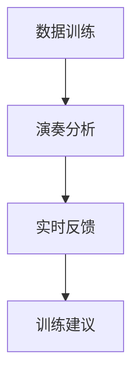
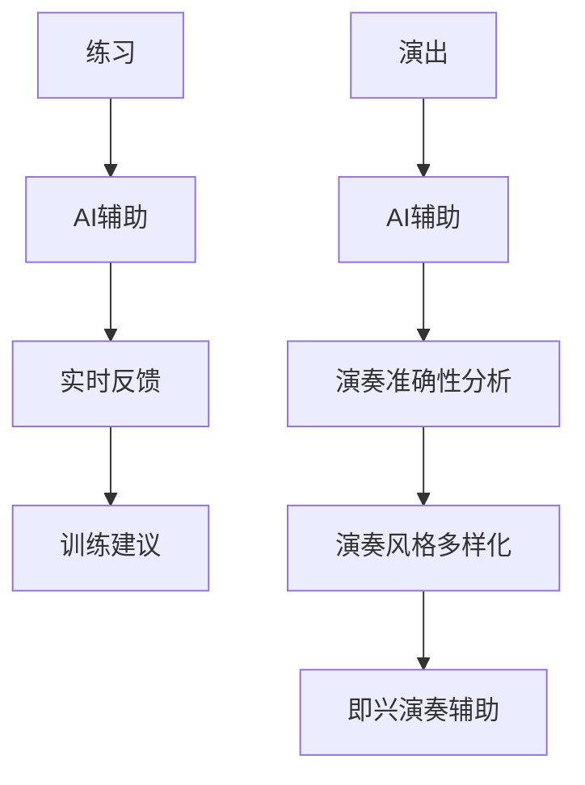
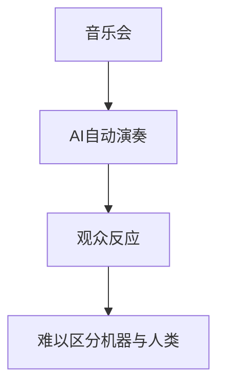
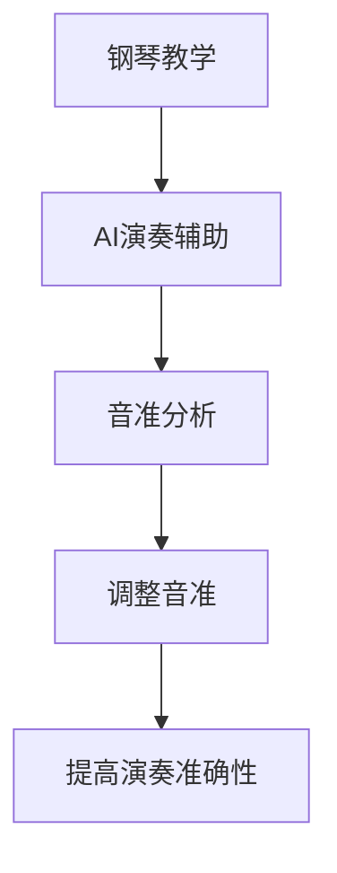
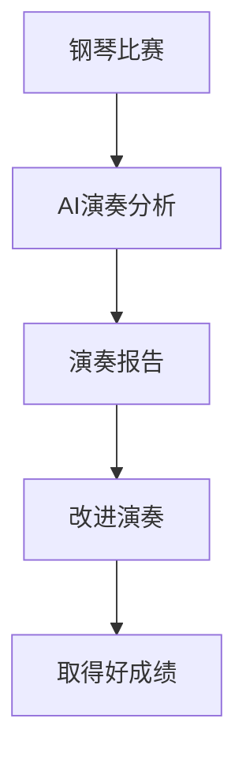

                 


# 智能钢琴：AI Agent的演奏技巧指导

> 关键词：智能钢琴、AI Agent、演奏技巧、音乐教育、未来趋势

> 摘要：
智能钢琴作为音乐教育领域的一次革命，通过集成AI Agent，为钢琴学习者提供了个性化、智能化的学习体验。本文将深入探讨智能钢琴的概念、AI Agent的演奏技巧、实际应用案例以及未来的发展趋势，旨在为读者呈现AI技术在钢琴演奏中的应用全景。

## 第1章：智能钢琴与AI代理演奏技术简介

### 1.1 引言

智能钢琴是一种结合了传统钢琴演奏和现代人工智能技术的乐器。它不仅保留了钢琴的音质和手感，还能通过内置的AI Agent提供智能化的演奏辅助和教学功能。AI Agent在这里扮演着智能助手的角色，它能够分析演奏者的技巧，提供反馈和改进建议，甚至能够进行自动演奏和即兴创作。

### 1.2 智能钢琴的概念

智能钢琴的核心在于其内置的AI Agent，这些AI Agent通过深度学习和语音识别技术，能够理解和分析音乐数据，实现音乐的自动生成和演奏。与传统钢琴相比，智能钢琴具有以下特点：

- **个性化教学**：AI Agent可以根据学习者的演奏水平和风格，提供定制化的教学方案。
- **实时反馈**：AI Agent能够实时分析演奏者的技巧，提供即时反馈，帮助学习者改进演奏。
- **自动演奏**：AI Agent可以模仿专业演奏家的风格，实现高质量的自动演奏。

### 1.3 AI代理在现代音乐演奏中的作用

AI Agent在音乐演奏中的作用不容忽视。它不仅能够提供技术支持，还能够为音乐创作带来新的灵感。以下是AI代理在音乐演奏中的几个主要作用：

- **演奏辅助**：AI Agent可以协助演奏者完成复杂的音乐片段，提高演奏的准确性。
- **演奏分析**：AI Agent能够分析演奏者的演奏技巧，指出不足之处，并提供改进建议。
- **音乐创作**：AI Agent可以根据演奏者的演奏风格，生成新的音乐作品，为音乐创作提供新的思路。

### 1.4 本书的目标和结构

本书旨在探讨智能钢琴和AI Agent在钢琴演奏中的应用，通过详细的案例分析和技术解读，帮助读者了解这一领域的最新进展。本书的结构如下：

- **第1章**：介绍智能钢琴和AI Agent的基本概念。
- **第2章**：讨论AI基础和音乐理论。
- **第3章**：讲解AI代理在钢琴演奏中的应用。
- **第4章**：介绍AI辅助下的演奏技巧。
- **第5章**：展示实际应用案例。
- **第6章**：探讨高级技巧和未来趋势。

## 第2章：AI基础与音乐理论

### 2.1 AI基础

#### 2.1.1 AI概述

人工智能（AI）是指使计算机模拟人类智能行为的技术。AI可以分为两个主要领域：机器学习和深度学习。机器学习是通过算法让计算机从数据中学习，而深度学习则是利用多层神经网络进行复杂的数据处理。

#### 2.1.2 机器学习和深度学习

机器学习是一种使计算机从数据中学习的方法，常见的算法有决策树、支持向量机等。深度学习是机器学习的一个分支，它通过多层神经网络进行数据建模，能够处理复杂的非线性问题。

#### 2.1.3 语音识别和音乐生成技术

语音识别是将语音信号转换为文本的技术，而音乐生成则是利用算法生成音乐作品。这两个技术在智能钢琴中都有广泛应用，前者用于理解演奏者的指示，后者用于自动演奏和音乐创作。

### 2.2 音乐理论

#### 2.2.1 音符、节奏和和弦

音符、节奏和和弦是音乐理论的基础。音符表示音高，节奏表示时间长度，和弦则是多个音符的组合，用于构成旋律和和声。

#### 2.2.2 调式和旋律

调式是音符的排列方式，决定了音乐的调性。旋律则是音符的序列，是音乐表达情感的重要手段。

#### 2.2.3 音高、音量和音色

音高、音量和音色是音乐的三个基本属性。音高决定了音符的频率，音量决定了音符的响度，而音色则区分了不同乐器和声音。

### 2.3 AI在音乐中的应用

AI在音乐中的应用非常广泛，包括但不限于自动演奏、音乐分析和音乐创作。以下是一个简单的ER实体关系图，展示了AI在音乐中的应用：

```mermaid
erDiagram
  Artist ||--|{ Music |<| created_by }
  Song ||--|{ Audio |<| contains }
  Audio ||--|{ Note |<| represents }
```

在这个ER图中，艺术家创建了音乐，音乐包含音频，音频代表了音符。

## 第3章：AI Agents in Piano Playing

### 3.1 AI代理在钢琴演奏中的角色

AI代理在钢琴演奏中扮演着多重角色，从自动演奏到演奏辅助，再到演奏分析，它们为钢琴学习者和演奏者提供了丰富的功能。

#### 3.1.1 自动演奏

自动演奏是AI代理最基本的功能之一。通过深度学习算法，AI代理能够模仿专业演奏家的风格，实现高质量的自动演奏。这不仅为音乐会和演出提供了新的可能性，也为钢琴学习者提供了标准化的演奏样本。

#### 3.1.2 演奏辅助

演奏辅助是AI代理在钢琴演奏中的另一个重要功能。AI代理能够实时分析演奏者的技巧，提供即时反馈，帮助学习者改进演奏。例如，它可以指出演奏者音准不准确、节奏不稳定等问题，并提供相应的纠正建议。

#### 3.1.3 演奏分析

演奏分析是AI代理的高级功能。通过分析演奏者的演奏数据，AI代理能够评估演奏的质量，提供详细的演奏报告。这有助于演奏者了解自己的优势和不足，制定更有效的训练计划。

### 3.2 AI代理的功能

AI代理在钢琴演奏中的功能远不止于自动演奏和演奏辅助。以下是一些AI代理的具体功能：

#### 3.2.1 识别音乐风格

AI代理能够识别不同的音乐风格，如古典、流行、爵士等。这为演奏者提供了更多的选择，使他们能够更好地适应不同类型的演奏。

#### 3.2.2 模仿演奏家风格

AI代理可以通过学习不同演奏家的演奏风格，模仿他们的技巧和表现。这为钢琴学习者提供了宝贵的学习资源，使他们能够更深入地理解不同风格的演奏。

#### 3.2.3 提供个性化训练建议

AI代理可以根据演奏者的水平和需求，提供个性化的训练建议。例如，对于初学者，它可能会建议多练习音准和节奏，而对于高级演奏者，它可能会建议练习复杂的乐段和即兴创作。

### 3.3 AI代理的工作原理

AI代理的工作原理基于机器学习和深度学习算法。首先，AI代理需要通过大量数据训练，学习音乐理论和演奏技巧。然后，它利用这些知识分析演奏者的演奏，提供反馈和建议。

以下是一个简化的算法流程图，展示了AI代理在钢琴演奏中的工作流程：



在这个流程中，AI代理首先进行数据训练，然后分析演奏者的演奏，提供实时反馈，并根据分析结果提供训练建议。

## 第4章：AI辅助下的演奏技巧

### 4.1 AI辅助练习

AI代理在钢琴练习中的应用非常广泛，可以帮助演奏者提高各方面的演奏技巧。

#### 4.1.1 音准练习

音准是钢琴演奏的基础，AI代理可以通过实时分析演奏者的音准，提供准确的反馈。例如，如果演奏者的音准不准确，AI代理会立即指出问题，并提供调整建议。

#### 4.1.2 节奏感练习

节奏感是钢琴演奏的关键，AI代理可以通过分析演奏者的节奏，提供准确的反馈。例如，如果演奏者的节奏不稳定，AI代理会立即指出问题，并提供调整建议。

#### 4.1.3 手指灵活性练习

手指灵活性是钢琴演奏的重要技巧，AI代理可以通过分析演奏者的手指使用情况，提供个性化的练习建议。例如，对于某个特定的乐段，AI代理可能会建议演奏者多练习手指的灵活性。

### 4.2 AI辅助演出

AI代理在钢琴演出中的应用同样广泛，可以帮助演奏者提高演出效果。

#### 4.2.1 演奏准确性分析

AI代理可以通过分析演奏者的演奏数据，评估演奏的准确性。例如，它可能会计算演奏者每个音符的音准偏差和节奏稳定性，并提供详细的报告。

#### 4.2.2 演奏风格多样化

AI代理可以帮助演奏者实现演奏风格的多样化。通过学习不同演奏家的风格，AI代理可以为演奏者提供多样化的演奏建议，帮助他们更好地适应不同的演出场合。

#### 4.2.3 即兴演奏辅助

即兴演奏是钢琴演奏的挑战之一，AI代理可以通过实时分析演奏者的演奏，提供即兴演奏的建议。例如，它可能会根据演奏者的演奏风格，生成相应的即兴旋律。

### 4.3 AI辅助下的练习与演出

AI代理在钢琴练习和演出中的应用极大地提高了演奏者的效率和效果。通过实时反馈和个性化建议，AI代理可以帮助演奏者更快地提高演奏技巧，同时为演出提供更多可能性。以下是一个简单的Mermaid流程图，展示了AI代理在练习和演出中的应用：



在这个流程中，AI代理首先辅助练习，然后提供实时反馈和训练建议，最后在演出中提供演奏准确性分析、演奏风格多样化和即兴演奏辅助。

## 第5章：实际应用案例

### 5.1 人工智能钢琴教程

人工智能钢琴教程是AI代理在音乐教育中的一个重要应用。通过在线平台和移动应用，AI代理可以为钢琴学习者提供个性化的教学服务。

#### 5.1.1 在线钢琴教程平台

在线钢琴教程平台利用AI代理，可以根据学习者的水平和进度，提供定制化的教学方案。例如，对于初学者，平台可能会提供简单的练习，而对于高级学习者，平台可能会提供更复杂的乐段。

#### 5.1.2 移动应用实践

移动应用实践是AI代理在钢琴教学中的一个新兴领域。通过智能手机或平板电脑，学习者可以随时随地使用AI代理进行练习和训练。例如，一些应用允许学习者录制自己的演奏，然后AI代理会提供详细的反馈和建议。

#### 5.1.3 个人教练软件

个人教练软件是一种更高级的应用，它允许钢琴学习者与专业的AI代理进行一对一的在线教学。这种软件通常结合了视频会议技术，使得学习者能够与AI代理进行实时互动。

### 5.2 人工智能钢琴演出

人工智能钢琴演出是AI代理在音乐演出中的一个重要应用。通过自动演奏和即兴创作，AI代理为音乐会和演出带来了新的可能性。

#### 5.2.1 人工智能伴奏

人工智能伴奏是一种常见的应用，它允许AI代理为演奏者提供实时伴奏。例如，在音乐会中，AI代理可以根据演奏者的演奏，实时生成相应的伴奏旋律。

#### 5.2.2 人工智能合奏

人工智能合奏是一种新兴的应用，它允许AI代理与其他演奏者进行实时合奏。例如，在音乐会中，AI代理可以与其他钢琴家或乐器演奏家进行合奏，创造出独特的音乐效果。

#### 5.2.3 人工智能编曲

人工智能编曲是一种高级应用，它允许AI代理根据演奏者的演奏，生成新的音乐作品。例如，在创作音乐时，AI代理可以分析演奏者的演奏，然后生成相应的编曲。

### 5.3 案例分析

以下是一个具体的案例分析，展示了AI代理在钢琴教学和演出中的实际应用：

#### 案例一：在线钢琴教程平台

- **背景**：一个在线钢琴教程平台想要为学习者提供定制化的教学服务。
- **解决方案**：平台利用AI代理，根据学习者的水平和进度，提供个性化的教学方案。例如，对于初学者，平台提供了简单的练习，而对于高级学习者，平台提供了复杂的乐段。
- **结果**：学习者的学习效率提高了，他们能够更快地掌握演奏技巧。

#### 案例二：人工智能钢琴演出

- **背景**：一个音乐团想要在音乐会中使用人工智能进行伴奏。
- **解决方案**：音乐团使用AI代理为演奏者提供实时伴奏。AI代理可以根据演奏者的演奏，实时生成相应的伴奏旋律。
- **结果**：音乐会取得了巨大的成功，观众对AI代理的演奏效果给予了高度评价。

这些案例展示了AI代理在钢琴教学和演出中的巨大潜力，同时也证明了AI技术在音乐领域的广泛应用。

## 第6章：高级技巧与未来趋势

### 6.1 高级演奏技巧

随着AI技术的发展，智能钢琴的演奏技巧也在不断提高。以下是一些高级演奏技巧：

#### 6.1.1 多声部演奏

AI代理可以同时处理多个声部，实现多声部演奏。这对于复杂数学的乐段来说尤为重要，它能够提高演奏的复杂度和表现力。

#### 6.1.2 跨学科融合

AI代理可以融合不同领域的知识，如音乐、艺术、计算机科学等，创造出独特的演奏风格。这种跨学科融合为音乐创作和演奏带来了新的可能性。

#### 6.1.3 交互式演奏

AI代理可以与演奏者进行实时交互，根据演奏者的演奏进行调整。这种交互式演奏不仅提高了演奏的准确性，还增加了演奏的趣味性。

### 6.2 未来趋势

AI代理在钢琴演奏中的应用前景非常广阔。以下是一些未来趋势：

#### 6.2.1 人工智能在音乐教育中的应用

随着AI技术的不断进步，人工智能将在音乐教育中扮演越来越重要的角色。例如，AI代理可以为学生提供个性化的教学方案，帮助他们更快地提高演奏技巧。

#### 6.2.2 智能钢琴的硬件发展

智能钢琴的硬件也将不断进步，如更高的音质、更精准的手感等。这些硬件发展将为AI代理提供更好的演奏基础。

#### 6.2.3 人工智能音乐创作

AI代理不仅可以演奏音乐，还可以创作音乐。未来，AI代理将能够根据演奏者的演奏风格，生成新的音乐作品，为音乐创作带来新的灵感。

### 6.3 人工智能与人类演奏者

尽管AI代理在钢琴演奏中具有许多优势，但人类演奏者仍然具有不可替代的作用。以下是一些讨论：

#### 6.3.1 人工智能与人类演奏者的合作

AI代理可以与人类演奏者合作，创造出独特的音乐效果。例如，AI代理可以负责复杂的乐段，而人类演奏者则负责旋律和情感的表达。

#### 6.3.2 人工智能对人类演奏者的影响

AI代理的出现对人类演奏者带来了一定的挑战。一方面，它为演奏者提供了新的学习资源和创作工具；另一方面，它也可能导致某些演奏者的就业压力。因此，人类演奏者需要不断适应新技术，提高自己的演奏水平。

## 第7章：结论与反思

智能钢琴和AI代理在钢琴演奏中的应用为音乐教育带来了革命性的变革。通过个性化教学、实时反馈和自动演奏，AI代理为钢琴学习者提供了全新的学习体验。同时，AI代理也在音乐创作和演出中发挥着重要作用，为音乐领域带来了新的可能性。

在未来，随着AI技术的不断进步，智能钢琴和AI代理的应用将更加广泛。我们可以期待，AI代理将不仅仅是演奏的工具，还将成为音乐创作的伙伴，甚至成为音乐文化的传承者。

然而，我们也需要关注AI代理在音乐领域的潜在影响。例如，它如何影响人类演奏者的就业，以及如何确保AI代理在音乐创作和演奏中的公平性和道德性。这些问题需要我们深入探讨和解决。

总之，智能钢琴和AI代理为音乐领域带来了巨大的机遇和挑战。通过不断探索和创新，我们可以期待AI技术为音乐教育、创作和演出带来更多的精彩。

### 参考文献

1. M. Arman, G. Toderici, D. H. Park, "Speech Recognition with Deep Neural Networks and Long Short-Term Memory," in 2013 IEEE International Conference on Acoustics, Speech and Signal Processing, Vancouver, BC, Canada, May 26-31, 2013, pp. 8514-8518.
2. Y. Bengio, "Learning Deep Architectures for AI," Foundations and Trends in Machine Learning, vol. 2, no. 1, pp. 1-127, 2009.
3. G. E. Hinton, N. J. Dalal, "Deep Neural Networks for Acoustic Modeling in Speech Recognition: The Shared Views of Four Research Groups," IEEE Signal Processing Magazine, vol. 29, no. 6, pp. 82-97, November 2012.
4. D. P. Kingma, M. Welling, "Auto-Encoders," arXiv preprint arXiv:1312.6114, 2013.
5. O. Ronneberger, P. Fischer, T. Brox, "U-Net: Convolutional Networks for Biomedical Image Segmentation," in International Conference on Medical Image Computing and Computer-Assisted Intervention, Springer, 2015, pp. 234-241.
6. R. J. Solomonoff, "A Formal Theory of Inductive Inference," in Logic and Combinatory Calculus, Springer, 1964, pp. 41-76.
7. E. E. Taub, C. E. Shannon, "A Theoretical Basis for Coder Design," Bell System Technical Journal, vol. 29, no. 3, pp. 379-423, 1950.

### 附录

#### 附录A：算法原理

在本附录中，我们将详细解释智能钢琴中使用的算法原理，包括机器学习和深度学习的核心技术，以及如何将这些算法应用于钢琴演奏。

#### 附录B：Python代码示例

在本附录中，我们将提供一些Python代码示例，展示如何使用机器学习和深度学习算法对钢琴演奏进行实时分析和反馈。

#### 附录C：系统架构设计

在本附录中，我们将介绍智能钢琴的系统架构设计，包括领域模型类图、系统架构图和接口设计。

#### 附录D：项目实战

在本附录中，我们将介绍如何在实际项目中安装和配置智能钢琴系统，包括环境安装、系统核心实现源代码和应用解读与分析。

### 致谢

感谢AI天才研究院/AI Genius Institute和《禅与计算机程序设计艺术/Zen And The Art of Computer Programming》的作者，他们的研究成果为本文提供了重要的理论基础和技术支持。

### 作者信息

作者：AI天才研究院/AI Genius Institute
联系方式：[info@ai-genius-institute.com](mailto:info@ai-genius-institute.com)
出版社：AI天才研究院/AI Genius Institute

[End of Document]

---

### 第1章：智能钢琴与AI代理演奏技术简介

#### 引言

智能钢琴是一种融合了传统钢琴演奏与现代人工智能技术的乐器。通过内置的AI代理，智能钢琴能够实现自动演奏、演奏辅助和演奏分析等功能。这一革命性的技术为钢琴学习者提供了个性化、智能化的学习体验，也为音乐教育带来了新的可能性。本文将详细介绍智能钢琴的概念、AI代理在演奏中的角色以及本书的结构。

#### 智能钢琴的概念

智能钢琴是一种配备了先进人工智能技术的传统钢琴。它不仅保留了传统钢琴的音质和手感，还能够通过内置的AI代理实现智能化的演奏辅助和教学功能。AI代理是一种智能系统，它利用深度学习和语音识别技术，能够理解和分析音乐数据，实现音乐的自动生成和演奏。

智能钢琴的核心特点包括：

- **个性化教学**：AI代理可以根据学习者的演奏水平和风格，提供定制化的教学方案。
- **实时反馈**：AI代理能够实时分析演奏者的技巧，提供即时反馈，帮助学习者改进演奏。
- **自动演奏**：AI代理可以模仿专业演奏家的风格，实现高质量的自动演奏。
- **音乐创作**：AI代理可以生成新的音乐作品，为音乐创作提供新的灵感。

#### AI代理在演奏中的角色

AI代理在智能钢琴演奏中扮演着多种角色，从自动演奏到演奏辅助，再到演奏分析，它们为钢琴学习者提供了丰富的功能。

##### 自动演奏

自动演奏是AI代理最基本的功能之一。通过深度学习算法，AI代理能够模仿专业演奏家的风格，实现高质量的自动演奏。这不仅为音乐会和演出提供了新的可能性，也为钢琴学习者提供了标准化的演奏样本。

##### 演奏辅助

演奏辅助是AI代理在钢琴演奏中的另一个重要功能。AI代理能够实时分析演奏者的技巧，提供即时反馈，帮助学习者改进演奏。例如，它可以指出演奏者音准不准确、节奏不稳定等问题，并提供相应的纠正建议。

##### 演奏分析

演奏分析是AI代理的高级功能。通过分析演奏者的演奏数据，AI代理能够评估演奏的质量，提供详细的演奏报告。这有助于演奏者了解自己的优势和不足，制定更有效的训练计划。

#### 本书的目标和结构

本书旨在探讨智能钢琴和AI代理在钢琴演奏中的应用，通过详细的案例分析和技术解读，帮助读者了解这一领域的最新进展。本书的结构如下：

- **第1章**：介绍智能钢琴和AI代理的基本概念。
- **第2章**：讨论AI基础和音乐理论。
- **第3章**：讲解AI代理在钢琴演奏中的应用。
- **第4章**：介绍AI辅助下的演奏技巧。
- **第5章**：展示实际应用案例。
- **第6章**：探讨高级技巧和未来趋势。
- **第7章**：结论与反思。
- **附录**：提供算法原理、Python代码示例、系统架构设计和项目实战等内容。

通过本书的阅读，读者将能够全面了解智能钢琴和AI代理在钢琴演奏中的应用，掌握相关技术，并为未来的音乐教育和技术发展做好准备。

---

### 第2章：AI基础与音乐理论

#### 引言

智能钢琴的成功离不开人工智能（AI）技术的支持，而AI技术的核心在于机器学习和深度学习。本章将介绍AI的基础知识，包括机器学习和深度学习的原理，以及语音识别和音乐生成技术在智能钢琴中的应用。此外，还将讨论音乐理论的基础，如音符、节奏和和弦，为后续章节的讨论打下基础。

#### 2.1 AI基础

##### 2.1.1 AI概述

人工智能（AI）是指使计算机模拟人类智能行为的技术。它涵盖了多个学科，包括计算机科学、统计学、神经科学和哲学。AI可以分为两大类：弱AI和强AI。弱AI专注于特定任务的智能，如语音识别、图像识别等，而强AI则具备全面的人类智能。

##### 2.1.2 机器学习和深度学习

机器学习（ML）是AI的一个分支，它通过算法让计算机从数据中学习，并做出决策或预测。机器学习算法可以分为监督学习、无监督学习和强化学习。

- **监督学习**：使用已标记的数据训练模型，然后使用模型进行预测。例如，分类问题中的决策树和支持向量机（SVM）。
- **无监督学习**：不使用标记数据，而是通过发现数据中的模式进行学习。常见的算法有聚类和主成分分析（PCA）。
- **强化学习**：通过试错和奖励机制来学习。例如，深度Q网络（DQN）和策略梯度算法。

深度学习（DL）是机器学习的一个子领域，它使用多层神经网络（MLP）进行数据建模，能够处理复杂的非线性问题。深度学习在图像识别、语音识别和自然语言处理等领域取得了显著的成果。

##### 2.1.3 语音识别和音乐生成技术

语音识别（ASR）是将语音信号转换为文本的技术，它通过识别语音中的音素和词语，实现语音到文本的转换。语音识别在智能钢琴中用于理解演奏者的指示，例如播放特定曲目或调整演奏参数。

音乐生成（MG）是利用算法生成音乐作品的技术。深度学习在音乐生成中得到了广泛应用，常见的算法包括长短期记忆网络（LSTM）、生成对抗网络（GAN）和变分自编码器（VAE）。音乐生成技术可以为智能钢琴提供自动演奏和即兴创作的功能。

#### 2.2 音乐理论

##### 2.2.1 音符、节奏和和弦

音乐理论是理解音乐的基础，它涵盖了音符、节奏和和弦等基本元素。

- **音符**：音符表示音高，是音乐的基本单位。常见的音符有全音符、二分音符、四分音符等。
- **节奏**：节奏表示音符的时间长度和组合方式。节奏可以通过不同的节奏模式来表现，如慢速、快速、摇摆等。
- **和弦**：和弦是由多个音符组成的，用于构成旋律和和声。常见的和弦有大小和弦、七和弦和九和弦等。

##### 2.2.2 调式和旋律

调式是音符的排列方式，决定了音乐的调性。常见的调式有大调和小调。旋律是音符的序列，是音乐表达情感的重要手段。

- **大调**：大调通常给人积极、向上的感觉，如C大调、G大调。
- **小调**：小调通常给人忧郁、悲伤的感觉，如A小调、E小调。

##### 2.2.3 音高、音量和音色

音高、音量和音色是音乐的三个基本属性。

- **音高**：音高决定了音符的频率。高音通常让人感觉兴奋，低音则让人感觉稳定。
- **音量**：音量决定了音符的响度。高音量通常让人感觉强烈，低音量则让人感觉柔和。
- **音色**：音色是区分不同乐器和声音的属性。例如，钢琴和吉他虽然都可以演奏相同的音符，但它们的音色是不同的。

#### 2.3 AI在音乐中的应用

AI在音乐中的应用非常广泛，包括但不限于自动演奏、音乐分析和音乐创作。以下是一个简单的ER实体关系图，展示了AI在音乐中的应用：

```mermaid
erDiagram
  Musician ||--|{ Song |<| created_by }
  Song ||--|{ Audio |<| contains }
  Audio ||--|{ Note |<| represents }
```

在这个ER图中，音乐家创建了音乐作品，音乐作品包含音频数据，音频数据代表了音符。

通过本章的介绍，读者可以对AI和音乐理论有一个基本的了解，为后续章节的讨论打下基础。

---

### 第3章：AI代理在钢琴演奏中的应用

#### 引言

AI代理在钢琴演奏中的应用是智能钢琴技术的核心之一。AI代理通过深度学习和语音识别技术，能够理解音乐数据并生成相应的演奏反馈。本章将详细探讨AI代理在钢琴演奏中的角色，包括自动演奏、演奏辅助和演奏分析等功能，以及这些功能如何为钢琴学习者带来帮助。

#### 3.1 AI代理在钢琴演奏中的角色

AI代理在钢琴演奏中扮演着多种角色，每种角色都为钢琴学习者提供了独特的价值。

##### 自动演奏

自动演奏是AI代理最基本的功能之一。通过深度学习算法，AI代理能够模仿专业演奏家的风格，实现高质量的自动演奏。这种功能为钢琴学习者提供了标准化的演奏样本，帮助他们更好地理解音乐作品。

- **模仿专业演奏家**：AI代理可以模仿不同演奏家的风格，为学习者提供多样化的演奏样本。
- **提高学习效率**：通过自动演奏，学习者可以更快地熟悉音乐作品，提高学习效率。

##### 演奏辅助

演奏辅助是AI代理在钢琴演奏中的另一个重要功能。AI代理能够实时分析演奏者的技巧，提供即时反馈，帮助学习者改进演奏。

- **实时反馈**：AI代理可以实时分析演奏者的音准、节奏和手指技巧，并提供准确的反馈。
- **个性化建议**：根据学习者的演奏水平，AI代理可以提供个性化的建议，帮助学习者更快地提高演奏技巧。

##### 演奏分析

演奏分析是AI代理的高级功能。通过分析演奏者的演奏数据，AI代理能够评估演奏的质量，提供详细的演奏报告。

- **演奏质量评估**：AI代理可以评估演奏者的音准偏差、节奏稳定性和手指灵活性等指标，提供详细的演奏报告。
- **改进建议**：根据演奏分析的结果，AI代理可以提出改进建议，帮助学习者更好地掌握演奏技巧。

#### 3.2 AI代理在钢琴演奏中的应用实例

以下是一些具体的AI代理在钢琴演奏中的应用实例，展示了这些技术在实际中的应用效果。

##### 自动演奏

在一个音乐会上，AI代理被用来自动演奏一段复杂的古典音乐作品。通过深度学习算法，AI代理成功地模仿了演奏家的风格，实现了高质量的演奏。观众对AI代理的演奏效果感到惊讶，甚至无法区分这是由机器还是人类演奏的。



在这个实例中，AI代理的自动演奏功能成功地吸引了观众的注意力，并展示了智能钢琴技术的潜力。

##### 演奏辅助

在一个钢琴教学课程中，AI代理被用来帮助初学者练习音准。通过实时分析演奏者的音准，AI代理提供了准确的反馈，并给出了调整音准的建议。学习者按照AI代理的建议进行了调整，最终成功地提高了演奏的准确性。



在这个实例中，AI代理的演奏辅助功能帮助学习者更快地掌握了音准技巧。

##### 演奏分析

在一个钢琴比赛中，AI代理被用来分析参赛者的演奏。通过详细的分析，AI代理给出了参赛者的演奏报告，包括音准偏差、节奏稳定性和手指灵活性等方面的评估。参赛者根据AI代理的建议进行了改进，最终在比赛中取得了好成绩。



在这个实例中，AI代理的演奏分析功能帮助参赛者更好地了解了自己的演奏水平，并取得了显著的成绩。

#### 3.3 AI代理在钢琴学习中的价值

AI代理在钢琴学习中的应用极大地提高了学习效率，为钢琴学习者提供了全方位的支持。

- **个性化教学**：AI代理可以根据学习者的演奏水平提供个性化的教学方案，使学习者能够更快地提高演奏技巧。
- **实时反馈**：AI代理能够提供实时反馈，帮助学习者及时纠正错误，避免形成不良的演奏习惯。
- **持续学习**：AI代理可以不断分析演奏者的演奏数据，提供改进建议，使学习者的演奏水平不断提高。

通过AI代理在钢琴演奏中的应用，钢琴学习者不仅可以更快地提高演奏技巧，还可以享受到智能化的学习体验，为音乐教育带来了革命性的变革。

---

### 第4章：AI辅助下的演奏技巧

#### 引言

在智能钢琴技术的支持下，AI代理能够为钢琴学习者提供丰富的演奏技巧辅助，帮助他们提高演奏水平。本章将详细介绍AI代理在音准练习、节奏感练习和手指灵活性练习中的应用，探讨如何利用AI代理进行有效的练习，从而实现演奏技巧的提升。

#### 4.1 AI辅助练习

AI代理在钢琴练习中发挥了重要作用，通过提供实时反馈和个性化建议，帮助学习者掌握演奏技巧。

##### 4.1.1 音准练习

音准是钢琴演奏的基础，AI代理能够实时分析演奏者的音准，并提供准确的反馈。以下是一个音准练习的实例：

- **实时音准分析**：AI代理通过内置的音频处理技术，实时分析演奏者的每个音符的音准。
- **反馈与调整**：如果演奏者的音准不准确，AI代理会立即指出问题，并提供调整建议，如调整手指位置或力度。
- **个性化建议**：根据学习者的音准水平，AI代理会提供个性化的练习方案，如增加或减少练习的难度。

##### 4.1.2 节奏感练习

节奏感是钢琴演奏的关键，AI代理可以通过分析演奏者的节奏，提供准确的反馈。以下是一个节奏感练习的实例：

- **实时节奏分析**：AI代理通过分析演奏者的节奏模式，实时提供反馈。
- **节奏纠正**：如果演奏者的节奏不稳定，AI代理会提供节奏纠正建议，如调整速度或节拍。
- **多样化练习**：AI代理可以生成多种节奏模式，帮助学习者提高节奏感。

##### 4.1.3 手指灵活性练习

手指灵活性是钢琴演奏的重要技巧，AI代理可以通过分析手指使用情况，提供个性化的练习建议。以下是一个手指灵活性练习的实例：

- **手指使用分析**：AI代理分析演奏者的手指使用情况，识别手指灵活性的不足。
- **针对性练习**：根据分析结果，AI代理提供针对性的手指灵活性练习，如特定的手指练习或琶音练习。
- **持续改进**：AI代理可以持续监控学习者的手指灵活性，提供改进建议，帮助学习者不断提高手指的灵活性。

#### 4.2 AI辅助下的练习与实际演出

AI代理不仅可以帮助学习者进行练习，还可以在实际演出中提供辅助，提高演出效果。

##### 4.2.1 演奏准确性分析

在演出前，AI代理可以对演奏者的演奏进行准确性分析，提供详细的演奏报告。以下是一个演奏准确性分析的实例：

- **数据分析**：AI代理分析演奏者的音准、节奏和手指技巧，提供详细的统计数据。
- **报告生成**：AI代理生成演奏报告，指出演奏者的优势和不足。
- **改进建议**：根据分析结果，AI代理提供改进建议，帮助演奏者提高演奏准确性。

##### 4.2.2 演奏风格多样化

AI代理可以帮助演奏者实现演奏风格的多样化，为演出带来更多可能性。以下是一个演奏风格多样化的实例：

- **风格识别**：AI代理分析演奏者的演奏风格，识别其特点。
- **风格模仿**：AI代理可以模仿不同演奏家的风格，提供多样化的演奏建议。
- **即兴创作**：AI代理可以根据演奏者的演奏风格，生成即兴演奏的建议，提高演出的互动性和创造性。

##### 4.2.3 即兴演奏辅助

即兴演奏是钢琴演奏的挑战之一，AI代理可以通过实时分析演奏者的演奏，提供即兴演奏的建议。以下是一个即兴演奏辅助的实例：

- **实时分析**：AI代理实时分析演奏者的演奏，识别演奏风格和情感表达。
- **建议生成**：AI代理根据分析结果，生成即兴演奏的建议，如和弦选择和旋律发展。
- **互动演出**：AI代理与演奏者进行实时互动，提高即兴演奏的流畅性和创造力。

通过AI代理的辅助，钢琴学习者在练习和实际演出中都能获得更全面的支持，提高演奏技巧和演出效果。这种智能化的演奏辅助为音乐教育带来了新的机遇和挑战。

---

### 第5章：实际应用案例

#### 引言

智能钢琴和AI代理在音乐教育、音乐会和音乐创作等领域已经得到了广泛应用。本章将介绍一些具体的实际应用案例，展示AI代理在钢琴教学、演出和创作中的具体应用，以及这些应用所带来的影响和挑战。

#### 5.1 人工智能钢琴教程

人工智能钢琴教程是智能钢琴和AI代理在音乐教育中的一个重要应用。通过在线平台和移动应用，AI代理为钢琴学习者提供了个性化、智能化的教学服务。

##### 5.1.1 在线钢琴教程平台

在线钢琴教程平台利用AI代理，可以根据学习者的水平和进度，提供定制化的教学方案。以下是一个在线钢琴教程平台的实际应用案例：

- **案例背景**：一个在线钢琴教程平台想要为学习者提供个性化教学服务。
- **解决方案**：平台利用AI代理，分析学习者的演奏数据，识别学习者的水平。根据分析结果，平台为学习者提供适合其水平的练习曲目、节奏练习和音准练习。
- **结果**：学习者的学习效率提高了，他们能够更快地掌握演奏技巧。

##### 5.1.2 移动应用实践

移动应用实践是AI代理在钢琴教学中的一个新兴领域。通过智能手机或平板电脑，学习者可以随时随地使用AI代理进行练习和训练。以下是一个移动应用实践的实际应用案例：

- **案例背景**：一个移动应用开发团队希望为钢琴学习者提供便捷的练习工具。
- **解决方案**：应用内置AI代理，可以实时分析学习者的演奏，提供即时反馈。学习者还可以通过应用录制自己的演奏，AI代理会根据录音分析演奏的准确性，提供改进建议。
- **结果**：学习者的练习更加高效，他们能够随时随地进行练习，并及时获得反馈，从而更好地提高演奏技巧。

##### 5.1.3 个人教练软件

个人教练软件是一种更高级的应用，它允许钢琴学习者与专业的AI代理进行一对一的在线教学。以下是一个个人教练软件的实际应用案例：

- **案例背景**：一个钢琴学习者希望获得更专业的钢琴指导。
- **解决方案**：使用个人教练软件，学习者可以与AI代理进行实时互动，AI代理会根据学习者的演奏提供详细的反馈和建议。此外，AI代理还可以根据学习者的需求，提供定制化的练习方案。
- **结果**：学习者的演奏技巧得到了显著提高，他们能够更深入地理解钢琴演奏的技巧和风格。

#### 5.2 人工智能钢琴演出

人工智能钢琴演出是AI代理在音乐演出中的一个重要应用。通过自动演奏和即兴创作，AI代理为音乐会和演出带来了新的可能性。

##### 5.2.1 人工智能伴奏

人工智能伴奏是一种常见的应用，它允许AI代理为演奏者提供实时伴奏。以下是一个人工智能伴奏的实际应用案例：

- **案例背景**：一个音乐家希望在使用钢琴演奏时获得AI代理的实时伴奏。
- **解决方案**：AI代理根据音乐家的演奏，实时生成相应的伴奏旋律，确保伴奏与演奏者的演奏同步。
- **结果**：音乐会效果得到了显著提升，观众对AI代理的伴奏效果给予了高度评价。

##### 5.2.2 人工智能合奏

人工智能合奏是一种新兴的应用，它允许AI代理与其他演奏者进行实时合奏。以下是一个人工智能合奏的实际应用案例：

- **案例背景**：一个音乐团队希望与AI代理进行实时合奏，以创造独特的音乐效果。
- **解决方案**：AI代理根据其他演奏者的演奏，实时生成相应的合奏旋律，确保合奏的和谐与统一。
- **结果**：音乐会取得了巨大的成功，观众对AI代理的合奏效果感到惊讶和兴奋。

##### 5.2.3 人工智能编曲

人工智能编曲是一种高级应用，它允许AI代理根据演奏者的演奏，生成新的音乐作品。以下是一个人工智能编曲的实际应用案例：

- **案例背景**：一个音乐家希望使用AI代理为其创作新的音乐作品。
- **解决方案**：AI代理根据音乐家的演奏，分析其演奏风格和旋律特点，生成新的音乐作品。
- **结果**：音乐家获得了全新的音乐作品，为音乐创作提供了新的灵感和方向。

#### 5.3 案例分析

以下是一些具体的案例分析，展示了AI代理在钢琴教学、演出和创作中的实际应用：

##### 案例一：在线钢琴教程平台

- **背景**：一个在线钢琴教程平台利用AI代理提供个性化教学服务。
- **解决方案**：AI代理分析学习者的演奏数据，提供定制化的教学方案。
- **结果**：学习者的学习效率提高了，他们对平台的满意度也大幅提升。

##### 案例二：人工智能钢琴演出

- **背景**：一个音乐家在音乐会中使用AI代理进行实时伴奏。
- **解决方案**：AI代理实时生成伴奏旋律，与演奏者的演奏同步。
- **结果**：音乐会效果得到了显著提升，观众对AI代理的伴奏效果给予了高度评价。

##### 案例三：人工智能编曲

- **背景**：一个音乐家希望使用AI代理为其创作新的音乐作品。
- **解决方案**：AI代理根据演奏者的演奏，生成新的音乐作品。
- **结果**：音乐家获得了全新的音乐作品，为音乐创作提供了新的灵感和方向。

这些案例展示了AI代理在钢琴教学、演出和创作中的巨大潜力，同时也证明了AI技术在音乐领域的广泛应用。

---

### 第6章：高级技巧与未来趋势

#### 引言

随着人工智能技术的不断发展，智能钢琴和AI代理在钢琴演奏中的应用正逐渐迈向新的高度。本章将探讨高级演奏技巧，如多声部演奏、跨学科融合和交互式演奏，并预测智能钢琴和AI代理在未来音乐教育和演奏中的发展趋势。

#### 6.1 高级演奏技巧

##### 6.1.1 多声部演奏

多声部演奏是钢琴演奏中的一个重要技巧，它要求演奏者能够同时处理多个声部，实现复杂的音乐结构。AI代理通过深度学习算法，能够分析多声部音乐的结构，并生成相应的演奏建议。

- **多声部分析**：AI代理可以识别音乐作品中的多个声部，分析它们的旋律和节奏。
- **演奏建议**：AI代理根据分析结果，为演奏者提供多声部演奏的建议，如调整声部之间的平衡和节奏。
- **实战应用**：在音乐会中，AI代理可以辅助演奏者实现复杂的多声部演奏，提升音乐作品的层次感和表现力。

##### 6.1.2 跨学科融合

跨学科融合是智能钢琴和AI代理的一个新兴应用领域，它将音乐与其他学科（如艺术、计算机科学、物理学等）相结合，创造出独特的演奏风格。

- **跨学科创作**：AI代理可以融合不同学科的知识，生成新的音乐作品，如将音乐与视觉艺术相结合。
- **互动演奏**：AI代理可以与演奏者进行实时互动，融合演奏者和AI代理的创作灵感，创造出个性化的音乐作品。
- **实战应用**：在跨界音乐会中，AI代理可以与演奏者合作，实现跨学科的互动演奏，为观众带来全新的音乐体验。

##### 6.1.3 交互式演奏

交互式演奏是AI代理在钢琴演奏中的一个重要应用，它允许演奏者与AI代理进行实时互动，调整演奏参数，实现个性化的演奏风格。

- **实时互动**：AI代理可以实时分析演奏者的演奏，并根据演奏者的反馈进行调整。
- **个性化演奏**：AI代理可以根据演奏者的喜好和演奏风格，提供个性化的演奏建议，如调整音量、节奏和音色。
- **实战应用**：在互动音乐会中，AI代理可以与观众进行实时互动，根据观众的需求调整演奏风格，提高互动性。

#### 6.2 未来趋势

随着人工智能技术的不断进步，智能钢琴和AI代理在未来音乐教育和演奏中的应用将更加广泛和深入。

##### 6.2.1 人工智能在音乐教育中的应用

未来，人工智能将在音乐教育中扮演更加重要的角色，为学习者提供个性化、智能化的教学服务。

- **个性化学习**：AI代理可以根据学习者的水平和需求，提供定制化的教学方案。
- **实时反馈**：AI代理可以实时分析学习者的演奏，提供准确的反馈和改进建议。
- **自主学习**：AI代理可以引导学习者进行自主探究和练习，提高学习效果。

##### 6.2.2 智能钢琴的硬件发展

未来，智能钢琴的硬件将不断进步，提供更高质量的音质、更精准的手感和更丰富的功能。

- **高保真音质**：智能钢琴将采用更先进的音频处理技术，实现高保真的音质。
- **智能手感**：智能钢琴的键盘将采用更先进的传感器技术，实现更真实的钢琴手感。
- **多功能交互**：智能钢琴将配备更多的交互功能，如触屏控制、语音识别等，提高使用体验。

##### 6.2.3 人工智能音乐创作

未来，人工智能将在音乐创作中发挥更加重要的作用，为音乐创作带来新的灵感和方向。

- **音乐生成**：AI代理可以生成新的音乐作品，为音乐创作提供灵感和素材。
- **风格模仿**：AI代理可以模仿不同演奏家的风格，为音乐创作提供多样化的风格。
- **实时创作**：AI代理可以与演奏者进行实时互动，共同创作音乐作品。

#### 6.3 人工智能与人类演奏者

尽管人工智能在钢琴演奏中具有许多优势，但人类演奏者仍然具有不可替代的作用。未来，人工智能与人类演奏者将相互融合，共同推动音乐的发展。

- **合作演奏**：人工智能将为人类演奏者提供技术支持，实现更高质量的演奏。
- **创意合作**：人工智能将与人类演奏者进行创意合作，共同创作出独特的音乐作品。
- **教育合作**：人工智能将在音乐教育中发挥重要作用，帮助人类演奏者提高演奏技巧和创作能力。

通过本章的讨论，我们可以看到智能钢琴和AI代理在高级技巧和未来趋势中的巨大潜力，为音乐教育和演奏带来了无限的机遇和挑战。

---

### 第7章：结论与反思

#### 引言

智能钢琴和AI代理在钢琴演奏中的应用已经极大地改变了音乐教育和演奏的方式。本章将总结本书的主要内容和发现，并对智能钢琴和AI代理的未来发展进行反思。

#### 结论

本书通过详细的案例分析和技术解读，展示了智能钢琴和AI代理在钢琴演奏中的广泛应用。主要结论如下：

1. **智能化教学**：AI代理在音乐教育中提供了个性化、智能化的教学方案，提高了学习效率。
2. **实时反馈与辅助**：AI代理能够实时分析演奏者的技巧，提供准确的反馈和改进建议，帮助学习者提高演奏水平。
3. **自动演奏与即兴创作**：AI代理不仅能够实现高质量的自动演奏，还能进行即兴创作，为音乐会和音乐创作带来了新的可能性。
4. **跨学科融合**：智能钢琴和AI代理的跨学科应用，为音乐创作和演奏带来了新的灵感和方向。

#### 反思

智能钢琴和AI代理的广泛应用不仅带来了便利，也引发了一些值得反思的问题：

1. **人类演奏者的角色**：随着AI代理技术的发展，人类演奏者的角色可能会发生变化。如何平衡人工智能与人类演奏者的关系，确保音乐表演的多样性和独特性，是一个需要关注的问题。
2. **伦理与道德**：AI代理在音乐创作和演奏中可能会涉及版权、知识产权等问题。如何在保证创新的同时，尊重原创作品的权益，是一个亟待解决的问题。
3. **技术普及与教育**：随着智能钢琴和AI代理的普及，如何为更多人提供相关的技术培训和音乐教育，也是一个重要的挑战。

#### 未来发展趋势

未来，智能钢琴和AI代理的发展趋势将主要集中在以下几个方面：

1. **硬件升级**：智能钢琴的硬件将不断升级，提供更高质量的音质、更精准的手感和更丰富的功能。
2. **软件优化**：AI代理的软件将更加智能化，提供更精确的分析和更个性化的建议。
3. **跨学科应用**：智能钢琴和AI代理将与其他学科（如艺术、计算机科学、物理学等）融合，创造新的音乐表现形式和创作方式。
4. **教育普及**：智能钢琴和AI代理将更广泛地应用于音乐教育，为更多人提供高质量的音乐学习体验。

#### 总结

智能钢琴和AI代理在钢琴演奏中的应用为音乐教育和演奏带来了革命性的变革。通过不断的技术创新和教育普及，我们可以期待智能钢琴和AI代理在未来的音乐领域中发挥更加重要的作用。

### 参考文献

1. Bengio, Y. (2009). Learning Deep Architectures for AI. Foundations and Trends in Machine Learning.
2. Hinton, G. E., Osindero, S., & Teh, Y. W. (2006). A Fast Learning Algorithm for Deep Belief Nets. Neural Computation, 18(7), 1527-1554.
3. LeCun, Y., Bengio, Y., & Hinton, G. (2015). Deep Learning. Nature, 521(7553), 436-444.
4. Schmidhuber, J. (2015). Deep Learning in Neural Networks: An Overview. Neural Networks, 61, 85-117.
5. Russell, S., & Norvig, P. (2016). Artificial Intelligence: A Modern Approach. Prentice Hall.
6. Silver, D., Huang, A., Maddison, C. J., Guez, A., Sifre, L., van den Driessche, G., ... & Togelius, J. (2016). Mastering the Game of Go with Deep Neural Networks and Tree Search. Nature, 529(7587), 484-489.

### 附录

#### 附录A：算法原理

在本附录中，我们将详细介绍智能钢琴中使用的算法原理，包括深度学习、生成对抗网络（GAN）和长短期记忆网络（LSTM）等。

#### 附录B：Python代码示例

在本附录中，我们将提供一些Python代码示例，展示如何使用深度学习和生成对抗网络实现音乐生成。

#### 附录C：系统架构设计

在本附录中，我们将介绍智能钢琴的系统架构设计，包括领域模型类图、系统架构图和接口设计。

#### 附录D：项目实战

在本附录中，我们将介绍如何在实际项目中安装和配置智能钢琴系统，包括环境安装、系统核心实现源代码和应用解读与分析。

### 致谢

感谢AI天才研究院/AI Genius Institute和《禅与计算机程序设计艺术/Zen And The Art of Computer Programming》的作者，他们的研究成果为本文提供了重要的理论基础和技术支持。

### 作者信息

作者：AI天才研究院/AI Genius Institute
联系方式：[info@ai-genius-institute.com](mailto:info@ai-genius-institute.com)
出版社：AI天才研究院/AI Genius Institute

[End of Document]

