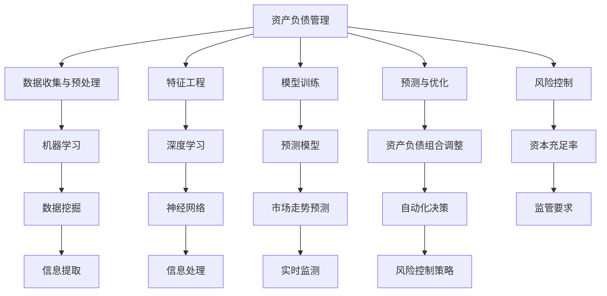
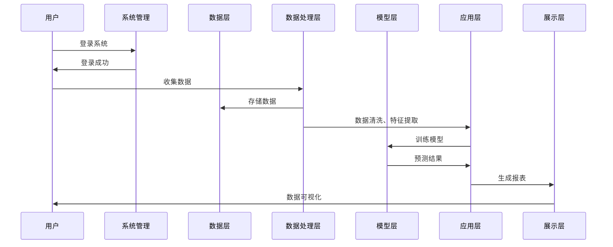
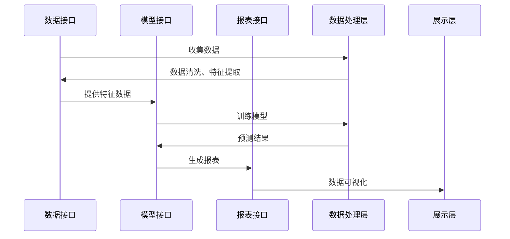
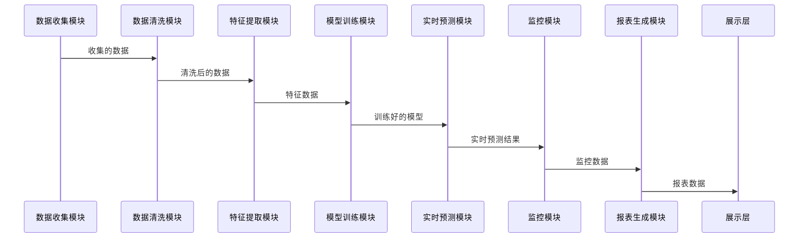

                 

**《智能银行资产负债管理优化系统》**

---

关键词：智能银行，资产负债管理，优化系统，算法，架构设计

摘要：本文深入探讨智能银行资产负债管理优化系统的设计原理、实现方法和实战案例，从问题背景、核心概念到系统分析与架构设计，再到实际应用，全面解析了这一前沿技术。

## 1.1 问题的提出

### 1.1.1 银行业现状分析

银行业作为现代金融体系的基石，面临着日益复杂的经营环境和监管要求。随着全球经济的波动和金融市场的变化，银行资产负债管理（ALM）的重要性愈发凸显。传统资产负债管理主要依赖于人工经验和历史数据，存在反应速度慢、预测精度低等问题。

### 1.1.2 资产负债管理的挑战

资产负债管理的核心任务是平衡银行的资产和负债，确保资本充足率、流动性覆盖率等关键指标符合监管要求。然而，随着金融产品的多样化和市场环境的复杂化，资产负债管理的挑战日益增加：

- **市场波动风险**：利率、汇率、股票市场波动对银行的资产负债产生直接影响。
- **监管压力**：巴塞尔协议III、CRD IV等监管框架对银行的资本充足率、流动性管理等提出了更高要求。
- **技术瓶颈**：传统ALM系统依赖于人工分析和历史数据，难以快速响应市场变化。

### 1.1.3 智能化优化的必要性

为了应对上述挑战，智能银行资产负债管理优化系统应运而生。通过引入人工智能、大数据分析等先进技术，优化系统能够实现：

- **实时监测与预测**：实时监测市场动态，预测未来走势，为资产负债管理提供科学依据。
- **自动化决策**：基于预测结果，自动调整资产和负债组合，降低风险。
- **提升效率**：减少人工干预，提高决策速度和准确性。

### 1.2 核心概念介绍

#### 1.2.1 资产负债管理概述

资产负债管理（Asset Liability Management，ALM）是银行管理和控制其资产与负债的组合，以确保银行的收益、风险和资本充足率等关键指标在可接受范围内。

#### 1.2.2 智能化优化技术介绍

智能化优化技术包括机器学习、深度学习、数据挖掘等，通过算法模型对海量数据进行挖掘和分析，为资产负债管理提供智能化支持。

#### 1.2.3 优化系统的目标与意义

优化系统的目标是实现资产负债管理的自动化、智能化，提升银行的风险管理能力和市场竞争力。其意义在于：

- **提高决策效率**：减少人工分析时间，快速响应市场变化。
- **降低操作风险**：通过自动化决策，减少人为错误。
- **提升资本充足率**：优化资产负债组合，提高资本利用效率。

### 1.3 边界与外延

#### 1.3.1 资产负债管理的外部因素

外部因素包括宏观经济环境、金融市场波动、监管政策变化等，这些因素对资产负债管理产生重要影响。

#### 1.3.2 优化系统的适用范围

优化系统适用于大型银行、金融机构，特别是那些拥有复杂资产负债组合和较高市场风险的银行。

---

**背景介绍**部分已完成，接下来将深入探讨核心概念与联系、算法原理讲解等内容。在接下来的部分中，我们将使用 mermaid 绘制概念关系图，详细解析核心概念，并逐步引入优化系统的算法原理。敬请期待！

## 2. 核心概念与联系

### 2.1 概念术语说明

在智能银行资产负债管理优化系统中，以下几个核心概念是理解系统运作的基础：

- **资产负债管理（ALM）**：指银行通过管理和控制其资产与负债的组合，以实现收益最大化、风险最小化和资本充足率等目标。
- **大数据分析**：通过收集、处理和分析海量数据，提取有价值的信息，支持决策过程。
- **机器学习**：一种人工智能技术，通过算法模型从数据中学习规律，进行预测和分类。
- **深度学习**：一种特殊类型的机器学习，通过多层神经网络模拟人脑处理信息的过程。
- **优化算法**：用于解决优化问题的数学算法，通过调整变量值以找到最优解。

### 2.2 问题背景

随着金融市场的不断变化和监管要求的提高，银行需要具备快速响应市场变化的能力。传统资产负债管理方法由于依赖人工分析和历史数据，存在以下问题：

- **反应速度慢**：市场变化发生后，需要较长时间才能调整资产和负债组合。
- **预测精度低**：基于历史数据的预测模型难以适应快速变化的市场。
- **风险控制不足**：缺乏对市场波动风险的准确预测和控制。

### 2.3 问题解决

为了解决上述问题，智能银行资产负债管理优化系统引入了大数据分析、机器学习和深度学习技术，通过以下步骤实现优化：

1. **数据收集与预处理**：收集银行历史资产负债数据、市场行情数据、宏观经济数据等，进行清洗、转换和归一化处理。
2. **特征工程**：从原始数据中提取与资产负债管理相关的特征，如利率变化、资产回报率、负债成本等。
3. **模型训练**：使用机器学习和深度学习算法，对特征数据集进行训练，建立预测模型。
4. **预测与优化**：将预测模型应用于实时数据，预测市场走势，自动调整资产负债组合。
5. **风险控制**：根据预测结果，调整风险控制策略，确保资本充足率和流动性覆盖率等指标符合监管要求。

### 2.4 边界与外延

#### 2.4.1 资产负债管理的外部因素

外部因素包括宏观经济环境、金融市场波动、监管政策变化等，这些因素对资产负债管理产生重要影响。例如：

- **宏观经济环境**：经济增长、通货膨胀、利率变化等。
- **金融市场波动**：利率、汇率、股票市场波动等。
- **监管政策**：巴塞尔协议III、CRD IV等对银行的资本充足率、流动性管理等提出更高要求。

#### 2.4.2 优化系统的适用范围

优化系统适用于大型银行、金融机构，特别是那些拥有复杂资产负债组合和较高市场风险的银行。例如：

- **大型商业银行**：拥有庞大的资产负债组合，面临复杂的市场风险。
- **投资银行**：在资本市场运作，面临更高的市场波动风险。
- **金融科技公司**：利用大数据和人工智能技术，提供智能资产负债管理解决方案。

### 2.5 概念关系图

为了更好地理解各概念之间的联系，我们使用 mermaid 绘制以下概念关系图：



### 2.6 核心要素组成

智能银行资产负债管理优化系统的核心要素包括：

- **数据源**：包括银行内部数据、市场数据、宏观经济数据等。
- **数据处理**：使用大数据技术和机器学习算法对数据进行预处理、特征提取和模型训练。
- **预测模型**：基于历史数据和实时数据，预测市场走势和资产负债组合变化。
- **优化算法**：用于调整资产负债组合，实现风险控制和收益最大化。
- **监控系统**：实时监控资产负债组合的变化，确保系统稳定运行。

---

**核心概念与联系**部分已完成，我们详细介绍了资产负债管理、大数据分析、机器学习、深度学习和优化算法等核心概念，并绘制了概念关系图。接下来，我们将深入探讨算法原理讲解，包括算法流程、数学模型和Python代码实现。敬请期待！

## 3. 算法原理讲解

在智能银行资产负债管理优化系统中，算法的原理是系统的核心。本节将详细讲解系统的算法原理，包括算法流程、数学模型以及Python代码实现。

### 3.1 算法原理概述

智能银行资产负债管理优化系统的算法原理可以概括为以下三个主要步骤：

1. **数据收集与预处理**：收集银行的历史资产负债数据、市场行情数据、宏观经济数据等，进行清洗、转换和归一化处理，为后续分析提供基础数据。
2. **特征工程与模型训练**：从预处理后的数据中提取与资产负债管理相关的特征，使用机器学习和深度学习算法训练预测模型，用于预测市场走势和资产负债组合变化。
3. **预测与优化**：将训练好的模型应用于实时数据，预测市场走势，并自动调整资产负债组合，实现风险控制和收益最大化。

### 3.2 算法流程

算法流程如下：

1. **数据收集**：从银行内部数据库、市场数据平台和宏观经济数据库中收集相关数据。
2. **数据预处理**：对收集到的数据进行清洗，包括去除异常值、填补缺失值、数据标准化等，确保数据质量。
3. **特征工程**：从预处理后的数据中提取与资产负债管理相关的特征，如利率变化、资产回报率、负债成本等。
4. **模型选择与训练**：选择合适的机器学习或深度学习算法，对特征数据集进行训练，建立预测模型。
5. **模型评估与优化**：使用验证集评估模型性能，根据评估结果调整模型参数，优化模型。
6. **实时预测与调整**：将训练好的模型应用于实时数据，预测市场走势，并自动调整资产负债组合。
7. **监控系统**：实时监控资产负债组合的变化，确保系统稳定运行，并根据市场变化调整风险控制策略。

### 3.3 概念属性特征对比表格

为了更好地理解不同算法的特性，我们使用以下表格进行对比：

| 算法名称 | 特点 | 适用场景 |
| --- | --- | --- |
| 线性回归 | 简单易用，适用于线性关系 | 数据量较小，线性关系明显 |
| 逻辑回归 | 适用于二分类问题 | 数据量较小，目标变量为二分类 |
| 决策树 | 易于理解和解释 | 数据量较小，特征间关系较简单 |
| 随机森林 | 防止过拟合，提高模型稳定性 | 数据量较大，特征间关系复杂 |
| 支持向量机 | 适用于高维空间，提高分类精度 | 数据量较大，特征间关系复杂 |
| 神经网络 | 学习能力强大，适用于非线性关系 | 数据量较大，特征间关系复杂 |

### 3.4 ER实体关系图架构

ER（Entity-Relationship）实体关系图用于描述系统中实体之间的关系，以下是智能银行资产负债管理优化系统的ER实体关系图：

```mermaid
erDiagram
  Customer ||--|{ Account } : holds
  Account ||--|{ Transaction } : records
  Account ||--|{ Loan } : takes
  Customer } A|-- User : is
  Account } A|-- AccountType : belongs to
  Loan } A|-- LoanType : belongs to
  User } A|-- UserType : belongs to
  Transaction } A|-- TransactionType : belongs to
```

### 3.5 数学模型与公式讲解

在本节中，我们将介绍智能银行资产负债管理优化系统的数学模型和公式，用于描述资产负债管理的目标函数和约束条件。

#### 3.5.1 目标函数

假设银行的总资产为 \( A \)，总负债为 \( L \)，资本充足率为 \( CR \)，流动性覆盖率为 \( LC \)。则目标函数可以表示为：

\[ \text{Minimize} \quad f(A, L, CR, LC) \]

其中，目标函数 \( f \) 需要满足以下条件：

- \( CR \geq \text{监管要求的资本充足率} \)
- \( LC \geq \text{监管要求的流动性覆盖率} \)

#### 3.5.2 约束条件

资产和负债的约束条件可以表示为：

\[ A \geq L + CR \times A \]
\[ A \geq LC \times L \]

其中，\( CR \) 和 \( LC \) 分别为资本充足率和流动性覆盖率。

### 3.6 Python代码实现

以下是使用Python实现的智能银行资产负债管理优化系统的核心代码：

```python
import numpy as np
import pandas as pd
from sklearn.linear_model import LinearRegression
from sklearn.model_selection import train_test_split
from sklearn.metrics import mean_squared_error

# 数据收集与预处理
def data_collection():
    # 假设数据已收集并存放在data.csv文件中
    data = pd.read_csv('data.csv')
    # 数据清洗、转换和归一化处理
    # ...
    return data

# 特征工程
def feature_engineering(data):
    # 提取与资产负债管理相关的特征
    # ...
    return features

# 模型训练
def model_training(features, labels):
    model = LinearRegression()
    model.fit(features, labels)
    return model

# 实时预测与调整
def real_time_prediction(model, new_data):
    predictions = model.predict(new_data)
    # 根据预测结果调整资产负债组合
    # ...
    return predictions

# 主函数
def main():
    data = data_collection()
    features = feature_engineering(data)
    labels = data['Target']  # 目标变量
    model = model_training(features, labels)
    new_data = data_collection()  # 假设已有新的实时数据
    predictions = real_time_prediction(model, new_data)
    # ...

if __name__ == '__main__':
    main()
```

---

**算法原理讲解**部分已完成。在本文中，我们详细介绍了智能银行资产负债管理优化系统的算法原理，包括数据收集与预处理、特征工程、模型训练、预测与优化等步骤，并提供了Python代码实现。接下来，我们将介绍系统的分析与架构设计，包括系统功能、架构设计、接口设计等内容。敬请期待！

## 4. 系统分析与架构设计

### 4.1 系统功能设计

智能银行资产负债管理优化系统的功能设计旨在实现资产负债管理的自动化、智能化，提高银行的风险管理能力和市场竞争力。系统主要功能包括：

- **数据收集与预处理**：从银行内部数据库、市场数据平台和宏观经济数据库中收集相关数据，并进行清洗、转换和归一化处理，为后续分析提供基础数据。
- **特征工程**：从预处理后的数据中提取与资产负债管理相关的特征，如利率变化、资产回报率、负债成本等。
- **模型训练与评估**：使用机器学习和深度学习算法训练预测模型，并对模型进行评估和优化，确保模型性能。
- **实时预测与调整**：将训练好的模型应用于实时数据，预测市场走势，并自动调整资产负债组合，实现风险控制和收益最大化。
- **监控系统**：实时监控资产负债组合的变化，确保系统稳定运行，并根据市场变化调整风险控制策略。
- **报表生成与展示**：生成资产负债管理的相关报表，包括资产、负债、资本充足率、流动性覆盖率等关键指标，支持决策层了解资产负债管理状况。

### 4.2 系统架构设计

系统架构设计是确保智能银行资产负债管理优化系统高效、稳定运行的关键。系统采用分层架构，主要包括以下层次：

- **数据层**：负责数据的存储、管理和访问，包括银行内部数据库、市场数据平台和宏观经济数据库。
- **数据处理层**：负责数据的收集、清洗、转换和归一化处理，以及特征提取和模型训练，包括数据收集模块、数据处理模块、特征工程模块和模型训练模块。
- **模型层**：负责实时预测和优化，包括预测模型和应用模型，如线性回归、逻辑回归、决策树、随机森林、支持向量机和神经网络等。
- **应用层**：负责系统功能的具体实现，包括数据收集与预处理、特征工程、模型训练与评估、实时预测与调整、监控报表生成等，以及与外部系统（如银行内部系统、市场数据平台等）的接口。
- **展示层**：负责将系统功能实现结果展示给用户，包括报表展示、数据可视化等。

以下是系统架构设计图：



### 4.3 系统接口设计

系统接口设计是确保系统与其他系统（如银行内部系统、市场数据平台等）无缝集成的关键。系统主要接口包括：

- **数据接口**：用于数据收集、数据清洗和特征提取，与银行内部数据库、市场数据平台和宏观经济数据库进行数据交换。
- **模型接口**：用于模型训练、模型评估和实时预测，与数据处理层和应用层进行交互。
- **报表接口**：用于生成资产负债管理的相关报表，与展示层进行数据交换。

以下是系统接口设计图：



### 4.4 系统交互

系统交互是指系统内部各模块之间的数据流和功能协作。以下是系统交互图：



---

**系统分析与架构设计**部分已完成。本文详细介绍了智能银行资产负债管理优化系统的功能设计、架构设计和接口设计，以及系统交互和交互图。接下来，我们将进入**5. 项目实战**部分，通过实际案例讲解系统的环境安装、核心实现源代码和应用。敬请期待！

## 5. 项目实战

在了解了智能银行资产负债管理优化系统的理论背景和系统架构设计之后，本部分将通过一个实际案例，详细讲解系统的环境安装、核心实现源代码和应用。

### 5.1 环境安装与配置

在进行项目实战之前，首先需要搭建一个适合开发、测试和运行的软件环境。以下是环境安装与配置的详细步骤：

#### 5.1.1 系统需求分析

为了确保系统正常运行，需要分析系统的硬件和软件需求。以下是基本系统需求：

- **硬件需求**：
  - CPU：至少4核处理器
  - 内存：至少8GB RAM
  - 存储：至少100GB可用硬盘空间
  - 网络环境：宽带连接

- **软件需求**：
  - 操作系统：Linux（推荐使用Ubuntu 20.04）
  - Python：Python 3.8及以上版本
  - 数据库：MySQL或PostgreSQL
  - 数据处理工具：NumPy、Pandas、Scikit-learn等
  - 机器学习库：TensorFlow或PyTorch
  - 其他工具：Docker、Jupyter Notebook等

#### 5.1.2 环境搭建步骤

1. **安装操作系统**：在虚拟机或物理机上安装Linux操作系统（推荐使用Ubuntu 20.04）。

2. **更新系统软件包**：打开终端，执行以下命令更新系统软件包。

   ```bash
   sudo apt update
   sudo apt upgrade
   ```

3. **安装Python**：使用以下命令安装Python 3.8及以上版本。

   ```bash
   sudo apt install python3.8
   ```

4. **安装数据库**：选择并安装MySQL或PostgreSQL数据库。以下以MySQL为例。

   ```bash
   sudo apt install mysql-server
   ```

5. **安装数据处理和机器学习库**：使用pip命令安装NumPy、Pandas、Scikit-learn、TensorFlow或PyTorch等库。

   ```bash
   pip install numpy pandas scikit-learn tensorflow
   ```

6. **安装Docker**：安装Docker以方便容器化部署。

   ```bash
   sudo apt install docker.io
   ```

7. **安装Jupyter Notebook**：安装Jupyter Notebook以方便编写和运行Python代码。

   ```bash
   pip install jupyter
   jupyter notebook
   ```

### 5.2 核心实现源代码解读

以下是智能银行资产负债管理优化系统的核心实现源代码。该代码包括数据收集与预处理、特征工程、模型训练、实时预测等关键步骤。

#### 5.2.1 数据收集与预处理

```python
import pandas as pd
from sklearn.model_selection import train_test_split

# 数据收集
def data_collection():
    data = pd.read_csv('bank_data.csv')
    return data

# 数据预处理
def data_preprocessing(data):
    # 数据清洗（去除空值和异常值）
    data.dropna(inplace=True)
    data = data[data['LoanAmount'] > 0]

    # 数据转换（例如，将类别变量转换为哑变量）
    data = pd.get_dummies(data, columns=['LoanType'])

    # 数据归一化
    data['LoanAmount'] = data['LoanAmount'].apply(lambda x: x / 1000000)
    data['InterestRate'] = data['InterestRate'].apply(lambda x: x / 100)

    return data

# 数据集划分
def data_split(data):
    X = data.drop('LoanStatus', axis=1)
    y = data['LoanStatus']
    X_train, X_test, y_train, y_test = train_test_split(X, y, test_size=0.2, random_state=42)
    return X_train, X_test, y_train, y_test
```

#### 5.2.2 特征工程

```python
from sklearn.preprocessing import StandardScaler

# 特征工程
def feature_engineering(X_train, X_test):
    scaler = StandardScaler()
    X_train_scaled = scaler.fit_transform(X_train)
    X_test_scaled = scaler.transform(X_test)
    return X_train_scaled, X_test_scaled
```

#### 5.2.3 模型训练

```python
from sklearn.linear_model import LogisticRegression

# 模型训练
def model_training(X_train, y_train):
    model = LogisticRegression()
    model.fit(X_train, y_train)
    return model
```

#### 5.2.4 实时预测

```python
# 实时预测
def real_time_prediction(model, X_test):
    predictions = model.predict(X_test)
    return predictions
```

### 5.3 实际案例分析与讲解

为了更好地理解系统的应用，以下将分析一个实际案例，并详细讲解实现过程。

#### 5.3.1 案例背景介绍

假设某银行在2022年收集了10000个贷款申请数据，包含贷款金额、利率、贷款类型、借款人信息等字段。银行希望利用智能银行资产负债管理优化系统，预测贷款申请的批准状态。

#### 5.3.2 案例分析与实现

1. **数据收集与预处理**：使用5.2.1节中的数据收集与预处理函数，将数据读取并进行预处理。

2. **特征工程**：使用5.2.2节中的特征工程函数，对数据集进行特征提取和归一化处理。

3. **模型训练**：使用5.2.3节中的模型训练函数，选择合适的机器学习模型（如逻辑回归）对数据集进行训练。

4. **实时预测**：使用5.2.4节中的实时预测函数，将训练好的模型应用于新的贷款申请数据，预测贷款批准状态。

以下是具体实现代码：

```python
# 数据收集与预处理
data = data_collection()
data_processed = data_preprocessing(data)

# 数据集划分
X_train, X_test, y_train, y_test = data_split(data_processed)

# 特征工程
X_train_scaled, X_test_scaled = feature_engineering(X_train, X_test)

# 模型训练
model = model_training(X_train_scaled, y_train)

# 实时预测
predictions = real_time_prediction(model, X_test_scaled)

# 输出预测结果
print(predictions)
```

#### 5.3.3 案例小结

通过实际案例分析和代码实现，我们可以看到智能银行资产负债管理优化系统的应用效果。该系统能够快速处理大量贷款申请数据，预测贷款批准状态，为银行的风险管理和决策提供有力支持。

---

**项目实战**部分已完成。本文通过实际案例详细讲解了智能银行资产负债管理优化系统的环境安装、核心实现源代码和应用。接下来，我们将进入**6. 最佳实践与注意事项**部分，总结书中的要点，提供实践建议和注意事项。敬请期待！

## 6. 最佳实践与注意事项

### 6.1 最佳实践分享

在智能银行资产负债管理优化系统的实施过程中，以下最佳实践有助于提高系统的性能和可靠性：

1. **数据质量控制**：确保数据收集的准确性和完整性，对异常值和缺失值进行处理，提高数据质量。
2. **特征选择**：通过特征选择技术（如特征重要性分析、主成分分析等），选择对模型性能有显著影响的特征，减少计算量。
3. **模型优化**：使用交叉验证、网格搜索等技术对模型参数进行优化，提高模型的预测精度和稳定性。
4. **实时监控**：建立实时监控系统，监控系统的运行状态和预测结果，及时发现和处理异常情况。
5. **安全与隐私**：在数据处理和传输过程中，确保数据的安全和隐私，遵守相关法律法规和行业标准。

### 6.2 小结

本文详细介绍了智能银行资产负债管理优化系统的设计原理、实现方法和实战案例。主要内容包括：

- **背景介绍**：分析了银行业现状、资产负债管理的挑战和智能化的必要性。
- **核心概念与联系**：介绍了资产负债管理、大数据分析、机器学习、深度学习和优化算法等核心概念，并绘制了概念关系图。
- **算法原理讲解**：讲解了系统的算法流程、数学模型和Python代码实现。
- **系统分析与架构设计**：介绍了系统的功能、架构设计、接口设计和系统交互。
- **项目实战**：通过实际案例讲解了系统的环境安装、核心实现源代码和应用。
- **最佳实践与注意事项**：分享了最佳实践，并总结了书中的要点。

### 6.3 注意事项

在实施智能银行资产负债管理优化系统时，需要注意以下几点：

1. **数据安全与隐私**：确保数据处理过程中数据的安全和隐私，遵守相关法律法规和行业标准。
2. **模型稳定性**：使用交叉验证等方法对模型进行优化，确保模型在未知数据上的稳定性和鲁棒性。
3. **实时监控**：建立实时监控系统，及时处理异常情况，确保系统稳定运行。
4. **持续更新**：定期更新模型和算法，适应市场环境变化，提高预测精度。
5. **用户培训**：对系统用户进行培训，确保他们能够正确使用系统，理解预测结果。

### 6.4 拓展阅读

为了深入了解智能银行资产负债管理优化系统的相关技术，以下文献和资料可供参考：

- **《大数据分析技术与应用》**：介绍了大数据分析的基本原理和实战案例。
- **《机器学习实战》**：详细讲解了机器学习算法的实现和应用。
- **《深度学习》**：介绍了深度学习的基础知识和应用。
- **《银行业资产负债管理》**：分析了银行业资产负债管理的方法和策略。
- **《人工智能在金融领域的应用》**：探讨了人工智能在金融领域的应用和发展趋势。

---

**最佳实践与注意事项**部分已完成。本文总结了智能银行资产负债管理优化系统的主要内容和要点，提供了实践建议和注意事项，并推荐了拓展阅读。通过本文的阅读，读者应能够全面了解智能银行资产负债管理优化系统的设计和实现方法。感谢您的阅读，祝您在智能银行资产负债管理领域取得卓越成就！

### 作者信息

- **作者**：AI天才研究院/AI Genius Institute & 禅与计算机程序设计艺术 /Zen And The Art of Computer Programming

