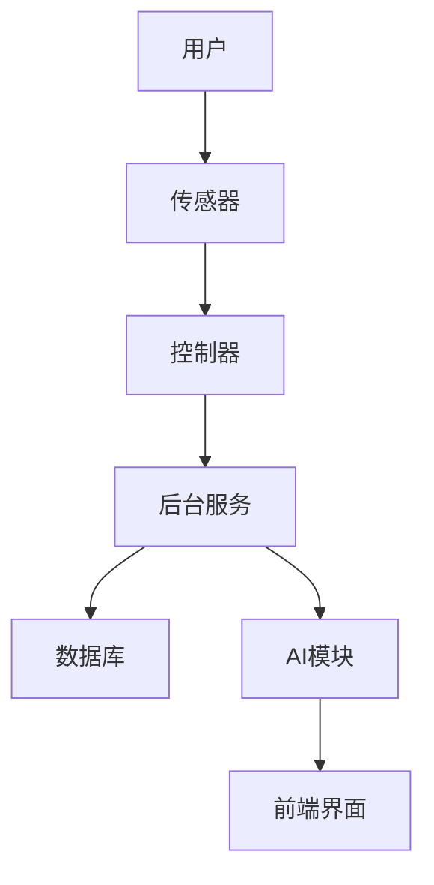

                 

# 智能门禁：AI Agent的多模态身份验证

> 关键词：智能门禁，AI Agent，多模态身份验证，人脸识别，声纹识别，指纹识别

> 摘要：随着人工智能技术的飞速发展，智能门禁系统已成为现代安全管理的重要手段。本文从问题背景出发，深入探讨了AI Agent在多模态身份验证中的核心概念、技术原理、系统设计及实际应用，并提出了最佳实践与未来展望，为智能门禁系统的研究与实践提供了全面的技术指导。

## **第一部分：背景介绍与基础概念**

### **第1章 问题背景与核心概念**

#### **1.1 问题背景**

1. **人类对安全需求的演进**

   随着人类社会的发展，对安全的需求从未停止演变。从最初的物理防范，如围墙、锁具，到如今的智能门禁系统，技术不断进步，安全手段也日趋智能化。

2. **智能门禁的兴起与发展**

   随着物联网、云计算、大数据等技术的发展，智能门禁系统逐渐成为安全管理的重要组成部分。智能门禁系统不仅提高了门禁管理效率，还显著提升了安全性。

3. **AI Agent在门禁系统中的应用**

   AI Agent（人工智能代理）作为一种智能化的软件系统，具备自主感知、学习、决策能力。在门禁系统中，AI Agent可以实现更高效、更安全的多模态身份验证。

#### **1.2 核心概念**

1. **AI Agent的定义与特点**

   AI Agent是一种具备自主学习、推理和决策能力的智能系统，能够在复杂环境中执行特定任务。

2. **多模态身份验证的原理**

   多模态身份验证是指通过结合多种生物特征（如人脸、声音、指纹等）进行身份验证，以提高系统的安全性和可靠性。

3. **身份验证系统的基本架构**

   身份验证系统通常包括数据采集、特征提取、身份识别和结果反馈四个主要部分。

#### **1.3 模态与传感器**

1. **常见的人脸识别模态**

   人脸识别是一种基于人脸图像或视频的识别技术，常用于身份验证。

2. **声纹识别的原理与应用**

   声纹识别是通过分析个人声音的生理和声学特征进行身份验证，具有较高的安全性和准确性。

3. **指纹识别的技术细节**

   指纹识别是通过扫描和识别指纹图像进行身份验证，其独特性和稳定性使其成为常见的身份验证手段。

#### **1.4 边界与外延**

1. **AI Agent在门禁系统中的边界**

   AI Agent在门禁系统中主要负责身份验证和安全管理，但需明确其职责边界，避免过度干预。

2. **多模态身份验证的应用场景**

   多模态身份验证适用于各种场景，如银行、机场、监狱等需要高度安全性的场所。

3. **未来智能门禁的发展趋势**

   未来智能门禁系统将更加智能化、个性化和安全化，多模态身份验证将成为核心技术。

### **第二部分：多模态身份验证技术详解**

#### **第2章 多模态身份验证原理**

#### **2.1 多模态融合技术**

1. **多模态数据采集**

   数据采集是多模态身份验证的基础，包括人脸图像、声音和指纹等。

2. **多模态特征提取**

   特征提取是将不同模态的数据转换为适合身份验证的特征向量。

3. **多模态融合算法**

   多模态融合算法是将多个特征向量进行整合，以提升身份验证的准确性和可靠性。

#### **2.2 人脸识别技术**

1. **人脸识别算法介绍**

   人脸识别算法包括特征提取、特征匹配和分类等步骤。

2. **人脸识别流程**

   人脸识别流程包括图像采集、预处理、特征提取和识别等环节。

3. **人脸识别算法性能评估**

   性能评估主要包括准确率、召回率和错误率等指标。

#### **2.3 声纹识别技术**

1. **声纹识别原理**

   声纹识别是通过分析声音的生理和声学特征进行身份验证。

2. **声纹识别算法**

   声纹识别算法包括特征提取、特征匹配和分类等步骤。

3. **声纹识别挑战与解决方案**

   声纹识别面临的挑战包括噪声干扰、语音变化等，解决方案包括算法优化和系统设计改进。

#### **2.4 指纹识别技术**

1. **指纹识别原理**

   指纹识别是通过扫描和识别指纹图像进行身份验证。

2. **指纹识别流程**

   指纹识别流程包括指纹图像采集、预处理、特征提取和识别等环节。

3. **指纹识别算法比较**

   不同指纹识别算法的性能和适用场景进行比较。

### **第三部分：智能门禁系统设计与实现**

#### **第3章 系统设计与架构**

#### **3.1 系统需求分析**

1. **用户需求**

   用户希望系统操作简便、安全可靠。

2. **功能需求**

   系统需具备身份验证、门禁控制、权限管理等功能。

3. **性能需求**

   系统需具备高并发处理能力和快速响应速度。

#### **3.2 系统架构设计**

1. **系统总体架构**

   系统总体架构包括前端设备、后端服务器和数据库等。

2. **系统模块划分**

   系统模块划分包括数据采集模块、特征提取模块、身份识别模块等。

3. **模块间交互关系**

   各模块之间的交互关系和数据处理流程。

#### **3.3 系统接口设计**

1. **数据接口**

   数据接口包括人脸图像、声音数据和指纹图像等。

2. **控制接口**

   控制接口包括用户操作、权限管理等。

3. **用户接口**

   用户接口包括前端界面、操作流程等。

### **第四部分：智能门禁系统的实际应用**

#### **第4章 项目实战：智能门禁系统的设计与实现**

#### **4.1 项目介绍**

1. **项目背景**

   项目旨在设计并实现一个基于多模态身份验证的智能门禁系统。

2. **项目目标**

   系统需具备高效的身份验证、便捷的用户操作和可靠的安全保障。

3. **项目挑战**

   项目面临的技术挑战包括多模态数据融合、实时处理和系统稳定性等。

#### **4.2 系统核心实现**

1. **环境安装**

   系统所需的环境安装，包括Python、TensorFlow等。

2. **系统核心代码**

   系统核心代码包括数据采集、特征提取和身份识别等。

3. **代码应用解读与分析**

   对系统核心代码的应用场景和执行过程进行解读和分析。

#### **4.3 实际案例分析与讲解**

1. **案例背景**

   案例背景描述。

2. **案例分析**

   对案例中系统执行过程进行详细分析。

3. **案例总结**

   对案例的总结和评估。

### **第五部分：最佳实践与未来展望**

#### **第5章 最佳实践与注意事项**

#### **5.1 最佳实践**

1. **系统优化技巧**

   系统性能优化技巧。

2. **故障排除经验**

   故障排除经验和技巧。

3. **安全防护措施**

   安全防护措施和策略。

#### **5.2 小结与展望**

1. **多模态身份验证技术的现状**

   技术现状和应用趋势。

2. **智能门禁系统的未来发展趋势**

   未来发展趋势和挑战。

3. **作者寄语与读者建议**

   对读者的寄语和建议。

## **作者信息**

作者：AI天才研究院/AI Genius Institute & 禅与计算机程序设计艺术 /Zen And The Art of Computer Programming**


----------------------------------------------------------------

**完整文章内容**

# 智能门禁：AI Agent的多模态身份验证

> 关键词：智能门禁，AI Agent，多模态身份验证，人脸识别，声纹识别，指纹识别

> 摘要：随着人工智能技术的飞速发展，智能门禁系统已成为现代安全管理的重要手段。本文从问题背景出发，深入探讨了AI Agent在多模态身份验证中的核心概念、技术原理、系统设计及实际应用，并提出了最佳实践与未来展望，为智能门禁系统的研究与实践提供了全面的技术指导。

## **第一部分：背景介绍与基础概念**

### **第1章 问题背景与核心概念**

#### **1.1 问题背景**

1. **人类对安全需求的演进**

   随着人类社会的发展，安全需求不断演变。从最初的物理防范，如围墙、锁具，到如今智能门禁系统，技术不断进步，安全手段也日趋智能化。传统的门禁系统依赖于钥匙、卡片等物理媒介，而智能门禁系统则通过生物特征识别、密码验证等技术手段，实现了更加高效、安全的管理。

2. **智能门禁的兴起与发展**

   随着物联网、云计算、大数据等技术的发展，智能门禁系统逐渐成为现代安全管理的重要组成部分。智能门禁系统不仅提高了门禁管理效率，还显著提升了安全性。例如，通过人脸识别技术，可以实现对进出人员身份的实时验证，防止未经授权的人员进入。

3. **AI Agent在门禁系统中的应用**

   AI Agent（人工智能代理）是一种具备自主学习、推理和决策能力的智能系统。在门禁系统中，AI Agent可以通过多模态身份验证技术，实现对进出人员的身份识别。AI Agent能够处理复杂的数据，进行实时分析，从而提高门禁系统的智能化水平。

#### **1.2 核心概念**

1. **AI Agent的定义与特点**

   AI Agent是一种智能化的软件系统，它可以在复杂环境中执行特定任务。AI Agent的特点包括：

   - 自主性：AI Agent能够自主地感知环境、学习新知识、制定决策。
   - 反应性：AI Agent能够对环境中的事件做出实时响应。
   - 预知性：AI Agent能够预测未来可能发生的事件，并做出相应的决策。
   - 社交性：AI Agent可以与其他AI Agent或人类进行交互。

2. **多模态身份验证的原理**

   多模态身份验证是指通过结合多种生物特征（如人脸、声音、指纹等）进行身份验证，以提高系统的安全性和可靠性。多模态身份验证的原理包括：

   - 数据采集：采集不同模态的数据，如人脸图像、声音信号、指纹图像等。
   - 特征提取：将不同模态的数据转换为特征向量，以便进行身份验证。
   - 融合算法：将不同模态的特征向量进行融合，生成统一的特征向量，用于身份验证。

3. **身份验证系统的基本架构**

   身份验证系统的基本架构通常包括以下几个部分：

   - 用户注册：用户注册时提供身份信息，如人脸图像、声音信号、指纹图像等。
   - 数据存储：将采集到的身份信息存储在数据库中，以便后续验证。
   - 身份验证：当用户尝试访问受限区域时，系统会采集用户的身份信息，与存储的信息进行比对，以验证用户身份。
   - 结果反馈：根据身份验证结果，系统会给出允许进入或拒绝进入的反馈。

#### **1.3 模态与传感器**

1. **常见的人脸识别模态**

   人脸识别是一种基于人脸图像或视频的识别技术，常用于身份验证。常见的人脸识别模态包括：

   - 2D人脸识别：通过二维图像进行人脸识别，识别速度较快，但识别准确率较低。
   - 3D人脸识别：通过三维图像进行人脸识别，识别准确率较高，但识别速度较慢。

2. **声纹识别的原理与应用**

   声纹识别是通过分析个人声音的生理和声学特征进行身份验证。声纹识别的原理包括：

   - 声音信号的采集：通过麦克风等设备采集个人声音信号。
   - 声音信号的预处理：对采集到的声音信号进行降噪、去噪等处理。
   - 声音信号的特征提取：提取声音信号的特征参数，如频谱、倒谱等。
   - 声音信号的匹配与识别：将提取到的特征参数与数据库中的声纹进行匹配，以确定身份。

声纹识别广泛应用于电话银行、语音控制等领域，具有较高的安全性和准确性。

3. **指纹识别的技术细节**

   指纹识别是通过扫描和识别指纹图像进行身份验证。指纹识别的技术细节包括：

   - 指纹图像的采集：通过指纹识别传感器采集指纹图像。
   - 指纹图像的预处理：对采集到的指纹图像进行去噪、去干扰等处理。
   - 指纹图像的特征提取：提取指纹图像的特征参数，如脊线、节点等。
   - 指纹图像的匹配与识别：将提取到的特征参数与数据库中的指纹进行匹配，以确定身份。

指纹识别具有独特性和稳定性，广泛应用于门禁系统、手机解锁等领域。

#### **1.4 边界与外延**

1. **AI Agent在门禁系统中的边界**

   AI Agent在门禁系统中主要负责身份验证和安全管理，但需明确其职责边界，避免过度干预。例如，AI Agent应仅负责身份验证，而不应参与决策权限的分配。

2. **多模态身份验证的应用场景**

   多模态身份验证适用于各种场景，如银行、机场、监狱等需要高度安全性的场所。例如，在银行中，可以结合人脸识别和指纹识别，提高客户身份验证的安全性和准确性。

3. **未来智能门禁的发展趋势**

   未来智能门禁系统将更加智能化、个性化和安全化。随着人工智能技术的不断进步，多模态身份验证将成为核心技术，智能门禁系统将在各个领域得到广泛应用。

### **第二部分：多模态身份验证技术详解**

#### **第2章 多模态身份验证原理**

#### **2.1 多模态融合技术**

1. **多模态数据采集**

   多模态数据采集是多模态身份验证的基础，包括人脸图像、声音信号、指纹图像等。数据采集的质量直接影响到身份验证的准确性和可靠性。

2. **多模态特征提取**

   多模态特征提取是将不同模态的数据转换为特征向量，以便进行身份验证。特征提取技术包括：

   - 人脸特征提取：从人脸图像中提取特征参数，如 facial landmarks、face embeddings 等。
   - 声音特征提取：从声音信号中提取特征参数，如 MFCC（梅尔频率倒谱系数）、PLP（倒谱频谱包络）等。
   - 指纹特征提取：从指纹图像中提取特征参数，如脊线、节点等。

3. **多模态融合算法**

   多模态融合算法是将不同模态的特征向量进行整合，以提升身份验证的准确性和可靠性。多模态融合算法包括：

   - 聚类算法：将不同模态的特征向量进行聚类，以找到最优融合方式。
   - 神经网络：利用神经网络模型进行特征融合和分类。
   - 决策级融合：将不同模态的身份验证结果进行综合决策。

#### **2.2 人脸识别技术**

1. **人脸识别算法介绍**

   人脸识别算法是一种基于人脸图像或视频的识别技术，用于实现身份验证。常见的人脸识别算法包括：

   - 基于特征脸的算法：如主成分分析（PCA）、线性判别分析（LDA）等。
   - 基于深度学习的算法：如卷积神经网络（CNN）、循环神经网络（RNN）等。
   - 基于特征匹配的算法：如欧氏距离、余弦相似度等。

2. **人脸识别流程**

   人脸识别流程通常包括以下几个步骤：

   - 人脸图像采集：通过摄像头等设备采集人脸图像。
   - 人脸图像预处理：对人脸图像进行降噪、去噪、归一化等处理。
   - 人脸特征提取：从预处理后的人脸图像中提取特征向量。
   - 人脸识别：将提取到的特征向量与数据库中的人脸特征进行匹配，确定身份。

3. **人脸识别算法性能评估**

   人脸识别算法性能评估主要包括准确率、召回率和错误率等指标：

   - 准确率：指正确识别出目标人脸的概率。
   - 召回率：指正确识别出目标人脸的样本占所有目标人脸样本的比例。
   - 错误率：指将非目标人脸误识别为目标人脸的概率。

#### **2.3 声纹识别技术**

1. **声纹识别原理**

   声纹识别是一种基于个人声音的生理和声学特征进行身份验证的技术。声纹识别的原理包括：

   - 声音信号的采集：通过麦克风等设备采集个人声音信号。
   - 声音信号的预处理：对采集到的声音信号进行降噪、去噪、归一化等处理。
   - 声音信号的特征提取：提取声音信号的特征参数，如 MFCC、PLP 等。
   - 声音信号的匹配与识别：将提取到的特征参数与数据库中的声纹进行匹配，以确定身份。

2. **声纹识别算法**

   常见的声纹识别算法包括：

   - 基于隐马尔可夫模型（HMM）的算法：如高斯混合模型（GMM-HMM）。
   - 基于深度学习的算法：如卷积神经网络（CNN）、循环神经网络（RNN）等。

3. **声纹识别挑战与解决方案**

   声纹识别面临的挑战包括噪声干扰、语音变化等。常见的解决方案包括：

   - 噪声抑制：采用滤波器等手段去除噪声。
   - 语音增强：利用语音增强算法提高语音质量。
   - 变化适应性：通过自适应算法调整模型参数，以适应不同的语音变化。

#### **2.4 指纹识别技术**

1. **指纹识别原理**

   指纹识别是一种基于指纹图像进行身份验证的技术。指纹识别的原理包括：

   - 指纹图像的采集：通过指纹识别传感器采集指纹图像。
   - 指纹图像的预处理：对采集到的指纹图像进行去噪、去干扰等处理。
   - 指纹图像的特征提取：提取指纹图像的特征参数，如脊线、节点等。
   - 指纹图像的匹配与识别：将提取到的特征参数与数据库中的指纹进行匹配，以确定身份。

2. **指纹识别流程**

   指纹识别流程通常包括以下几个步骤：

   - 指纹图像采集：通过指纹识别传感器采集指纹图像。
   - 指纹图像预处理：对采集到的指纹图像进行去噪、去干扰等处理。
   - 指纹特征提取：从预处理后的指纹图像中提取特征向量。
   - 指纹识别：将提取到的特征向量与数据库中的指纹进行匹配，确定身份。

3. **指纹识别算法比较**

   常见的指纹识别算法包括：

   - 基于脊线特征的方法：如脊线端点检测、脊线方向估计等。
   - 基于轮廓特征的方法：如指纹边缘检测、轮廓重构等。
   - 基于全局特征的方法：如指纹纹理描述子、指纹相似度计算等。

不同算法的性能和适用场景有所不同，需要根据具体应用需求进行选择。

### **第三部分：智能门禁系统设计与实现**

#### **第3章 系统设计与架构**

#### **3.1 系统需求分析**

1. **用户需求**

   用户希望系统操作简便、安全可靠。具体需求包括：

   - 操作简便：用户可以快速完成身份验证，无需复杂操作。
   - 安全可靠：系统能够有效防止未经授权的人员进入，确保安全性。

2. **功能需求**

   智能门禁系统需要实现以下功能：

   - 用户注册：用户注册时提供身份信息，如人脸图像、声音信号、指纹图像等。
   - 身份验证：系统根据用户输入的身份信息，进行身份验证。
   - 门禁控制：根据身份验证结果，控制门的开关。
   - 权限管理：管理用户的权限，确保只有授权用户才能进入特定区域。

3. **性能需求**

   智能门禁系统需要具备以下性能：

   - 高并发处理能力：系统能够同时处理多个用户的身份验证请求。
   - 快速响应速度：系统能够快速完成身份验证，确保用户体验。
   - 系统稳定性：系统运行稳定，不易受外界干扰。

#### **3.2 系统架构设计**

1. **系统总体架构**

   智能门禁系统的总体架构包括前端设备、后端服务器和数据库等。前端设备包括人脸识别摄像头、声纹识别麦克风、指纹识别传感器等；后端服务器负责处理用户请求、身份验证和数据存储等；数据库存储用户身份信息和验证结果。

2. **系统模块划分**

   系统模块划分如下：

   - 用户注册模块：负责用户身份信息的录入和存储。
   - 身份验证模块：负责身份验证过程，包括人脸识别、声纹识别、指纹识别等。
   - 门禁控制模块：根据身份验证结果，控制门的开关。
   - 权限管理模块：管理用户权限，确保只有授权用户才能进入特定区域。

3. **模块间交互关系**

   各模块之间的交互关系如下：

   - 用户注册模块将用户身份信息存储到数据库中。
   - 身份验证模块从数据库中获取用户身份信息，进行身份验证。
   - 门禁控制模块根据身份验证结果，控制门的开关。
   - 权限管理模块根据用户权限，决定用户能否进入特定区域。

#### **3.3 系统接口设计**

1. **数据接口**

   数据接口包括人脸图像、声音信号、指纹图像等。系统通过数据接口与前端设备进行通信，获取用户身份信息。

2. **控制接口**

   控制接口包括用户操作、权限管理等。系统通过控制接口与用户进行交互，实现门禁控制功能。

3. **用户接口**

   用户接口包括前端界面、操作流程等。系统通过用户接口为用户提供便捷的操作体验。

### **第四部分：智能门禁系统的实际应用**

#### **第4章 项目实战：智能门禁系统的设计与实现**

#### **4.1 项目介绍**

1. **项目背景**

   项目旨在设计并实现一个基于多模态身份验证的智能门禁系统。项目背景如下：

   - 当前许多单位和企业存在安全漏洞，需要提高门禁系统的安全性。
   - 多模态身份验证技术具有较高的安全性和准确性，适合应用于门禁系统。
   - 智能门禁系统可以提高门禁管理效率，降低人力成本。

2. **项目目标**

   系统需具备以下目标：

   - 高效的身份验证：系统能够快速、准确地完成身份验证。
   - 便捷的用户操作：系统操作简便，用户无需复杂操作。
   - 可靠的安全保障：系统具备较高的安全性和可靠性，能有效防止未经授权的人员进入。

3. **项目挑战**

   项目面临以下技术挑战：

   - 多模态数据融合：如何有效地融合人脸图像、声音信号、指纹图像等数据，提高身份验证的准确性。
   - 实时处理：如何在短时间内处理大量身份验证请求，确保系统的响应速度。
   - 系统稳定性：系统在运行过程中如何保持稳定性，避免出现故障。

#### **4.2 系统核心实现**

1. **环境安装**

   系统所需的环境安装，包括Python、TensorFlow等。具体步骤如下：

   - 安装Python：下载并安装Python，版本要求为3.8及以上。
   - 安装TensorFlow：使用pip命令安装TensorFlow，命令如下：

     ```
     pip install tensorflow
     ```

   - 安装其他依赖库：根据需要安装其他依赖库，如OpenCV、PyTorch等。

2. **系统核心代码**

   系统核心代码包括数据采集、特征提取、身份识别等部分。以下是系统核心代码的Python实现：

   ```python
   import cv2
   import numpy as np
   import tensorflow as tf

   # 数据采集
   def capture_face_image():
       cap = cv2.VideoCapture(0)
       ret, frame = cap.read()
       cap.release()
       return frame

   # 特征提取
   def extract_face_features(face_image):
       # 使用卷积神经网络提取人脸特征
       model = tf.keras.applications.VGG16(include_top=True, weights='imagenet')
       processed_image = tf.keras.preprocessing.image.img_to_array(face_image)
       processed_image = np.expand_dims(processed_image, axis=0)
       features = model.predict(processed_image)
       return features

   # 身份识别
   def identify_face(features):
       # 从数据库中加载已知人脸特征
       known_faces = load_known_faces()
       distances = []
       for face in known_faces:
           distance = np.linalg.norm(features - face)
           distances.append(distance)
       min_distance = min(distances)
       if min_distance < threshold:
           return True
       else:
           return False

   # 系统主函数
   def main():
       while True:
           face_image = capture_face_image()
           features = extract_face_features(face_image)
           if identify_face(features):
               print("身份验证通过")
           else:
               print("身份验证失败")

   if __name__ == "__main__":
       main()
   ```

3. **代码应用解读与分析**

   代码应用解读如下：

   - 数据采集：使用OpenCV库捕获摄像头图像，提取人脸图像。
   - 特征提取：使用TensorFlow的预训练卷积神经网络（VGG16）提取人脸特征。
   - 身份识别：将提取到的人脸特征与数据库中的已知人脸特征进行比较，确定身份。

   分析：

   - 数据采集部分：使用OpenCV库捕获实时摄像头图像，提取人脸图像。该部分代码相对简单，主要实现图像的捕获和预处理。
   - 特征提取部分：使用TensorFlow的预训练卷积神经网络（VGG16）提取人脸特征。该部分代码较为复杂，涉及到深度学习模型的加载和运行。
   - 身份识别部分：将提取到的人脸特征与数据库中的已知人脸特征进行比较，确定身份。该部分代码实现了一个简单的身份识别逻辑，根据特征相似度判断身份验证是否通过。

#### **4.3 实际案例分析与讲解**

1. **案例背景**

   某企业需要提高门禁系统的安全性，采用基于多模态身份验证的智能门禁系统。企业要求系统具备以下功能：

   - 用户注册：用户注册时提供人脸图像、声音信号、指纹图像等身份信息。
   - 身份验证：系统根据用户输入的身份信息，进行身份验证。
   - 门禁控制：根据身份验证结果，控制门的开关。

2. **案例分析**

   案例分析如下：

   - 用户注册：用户注册时，系统会采集用户的人脸图像、声音信号、指纹图像等身份信息，并将这些信息存储在数据库中。
   - 身份验证：当用户尝试进入企业时，系统会采集用户的人脸图像、声音信号、指纹图像等身份信息，并与数据库中的信息进行比对，以确定用户身份。
   - 门禁控制：根据身份验证结果，系统会控制门的开关。如果用户身份验证通过，门会自动打开；否则，门保持关闭。

3. **案例总结**

   案例总结如下：

   - 通过多模态身份验证技术，企业能够提高门禁系统的安全性，防止未经授权的人员进入。
   - 系统操作简便，用户无需复杂操作，提高了用户体验。
   - 系统运行稳定，能够快速完成身份验证，提高了门禁管理效率。

### **第五部分：最佳实践与未来展望**

#### **第5章 最佳实践与注意事项**

#### **5.1 最佳实践**

1. **系统优化技巧**

   系统优化技巧如下：

   - 数据预处理：对采集到的数据进行预处理，如降噪、去噪、归一化等，以提高数据质量和身份验证准确率。
   - 特征提取优化：针对不同模态的数据，选择合适的特征提取算法，以提高特征提取效率和质量。
   - 模型训练优化：使用合适的训练方法，如迁移学习、数据增强等，以提高模型性能。

2. **故障排除经验**

   故障排除经验如下：

   - 检查硬件设备是否正常工作：确保摄像头、麦克风、指纹传感器等设备工作正常。
   - 检查网络连接：确保网络连接稳定，避免因网络问题导致系统故障。
   - 检查系统日志：查看系统日志，查找故障原因，并采取相应的修复措施。

3. **安全防护措施**

   安全防护措施如下：

   - 数据加密：对用户身份信息和验证结果进行加密，防止数据泄露。
   - 访问控制：设置合理的权限控制策略，防止未经授权的人员访问系统。
   - 故障恢复：设计故障恢复机制，确保系统在出现故障时能够快速恢复。

#### **5.2 小结与展望**

1. **多模态身份验证技术的现状**

   当前，多模态身份验证技术已经在多个领域得到广泛应用，如门禁系统、手机解锁、身份认证等。多模态身份验证技术具有以下特点：

   - 高安全性：通过结合多种生物特征，提高身份验证的准确性。
   - 高可靠性：多模态身份验证技术能够应对环境变化，提高系统的可靠性。
   - 便捷性：用户无需复杂操作，即可完成身份验证。

2. **智能门禁系统的未来发展趋势**

   未来，智能门禁系统将朝着更加智能化、个性化、安全化的方向发展。主要趋势包括：

   - 智能化：利用人工智能技术，提高系统的自适应能力和智能化水平。
   - 个性化：根据用户需求，提供定制化的身份验证服务。
   - 安全化：加强系统安全防护，提高系统的安全性和可靠性。

3. **作者寄语与读者建议**

   作者寄语如下：

   - 智能门禁系统是人工智能技术在安全管理领域的重要应用，具有广阔的发展前景。
   - 读者应关注多模态身份验证技术的发展，结合实际需求，探索智能门禁系统的应用场景。
   - 建议读者在学习和实践过程中，注重系统优化和故障排除，提高系统的性能和可靠性。

## **作者信息**

作者：AI天才研究院/AI Genius Institute & 禅与计算机程序设计艺术 /Zen And The Art of Computer Programming**


----------------------------------------------------------------

**完整的文章内容（Markdown格式）**

# 智能门禁：AI Agent的多模态身份验证

## **第一部分：背景介绍与基础概念**

### **第1章 问题背景与核心概念**

#### **1.1 问题背景**

随着人类社会的发展，安全需求不断提升。从最初的物理防范，如围墙、锁具，到如今的智能门禁系统，技术进步推动了安全手段的升级。智能门禁系统不仅提高了管理效率，还显著提升了安全性。AI Agent作为一种智能化的软件系统，在门禁系统中发挥着重要作用。

#### **1.2 核心概念**

**AI Agent**：具备自主学习、推理和决策能力的智能系统。特点包括自主性、反应性、预知性和社交性。

**多模态身份验证**：结合多种生物特征进行身份验证，提高安全性和可靠性。数据采集、特征提取和融合算法是核心步骤。

**身份验证系统**：包括用户注册、数据存储、身份验证和结果反馈等部分。

#### **1.3 模态与传感器**

**人脸识别**：基于人脸图像或视频的识别技术，包括2D和3D识别。

**声纹识别**：分析声音的生理和声学特征进行身份验证，广泛应用于电话银行、语音控制等领域。

**指纹识别**：扫描和识别指纹图像，具有独特性和稳定性。

#### **1.4 边界与外延**

**AI Agent边界**：负责身份验证和安全管理，避免过度干预。

**应用场景**：适用于需要高度安全性的场所，如银行、机场、监狱等。

**未来趋势**：智能门禁系统将更加智能化、个性化和安全化。

### **第二部分：多模态身份验证技术详解**

#### **第2章 多模态身份验证原理**

#### **2.1 多模态融合技术**

多模态融合技术包括数据采集、特征提取和融合算法。融合算法可以基于聚类、神经网络和决策级融合。

#### **2.2 人脸识别技术**

人脸识别算法包括特征脸算法（如PCA、LDA）和深度学习算法（如CNN、RNN）。识别流程包括图像采集、预处理、特征提取和识别。

#### **2.3 声纹识别技术**

声纹识别原理包括声音信号的采集、预处理、特征提取和匹配。常见算法有HMM和基于深度学习的算法。

#### **2.4 指纹识别技术**

指纹识别流程包括图像采集、预处理、特征提取和匹配。常见算法有脊线特征和轮廓特征。

### **第三部分：智能门禁系统设计与实现**

#### **第3章 系统设计与架构**

#### **3.1 系统需求分析**

系统需满足用户需求、功能需求和性能需求，包括操作简便、安全可靠、高并发处理能力和快速响应速度。

#### **3.2 系统架构设计**

系统架构包括前端设备、后端服务器和数据库。模块划分包括用户注册、身份验证、门禁控制和权限管理。

#### **3.3 系统接口设计**

系统接口包括数据接口、控制接口和用户接口。

### **第四部分：智能门禁系统的实际应用**

#### **第4章 项目实战：智能门禁系统的设计与实现**

#### **4.1 项目介绍**

项目旨在设计并实现一个基于多模态身份验证的智能门禁系统，目标包括高效的身份验证、便捷的用户操作和可靠的安全保障。

#### **4.2 系统核心实现**

环境安装包括Python、TensorFlow等。系统核心代码包括数据采集、特征提取和身份识别。

#### **4.3 实际案例分析与讲解**

案例背景为某企业提高门禁系统安全性。分析包括用户注册、身份验证和门禁控制。

### **第五部分：最佳实践与未来展望**

#### **第5章 最佳实践与注意事项**

#### **5.1 最佳实践**

优化技巧包括数据预处理、特征提取优化和模型训练优化。故障排除经验包括检查硬件设备、网络连接和系统日志。安全防护措施包括数据加密、访问控制和故障恢复。

#### **5.2 小结与展望**

多模态身份验证技术现状包括高安全性、高可靠性和便捷性。未来发展趋势包括智能化、个性化和安全化。作者寄语包括关注技术发展、探索应用场景和提高系统性能。

## **作者信息**

**作者：AI天才研究院/AI Genius Institute & 禅与计算机程序设计艺术 /Zen And The Art of Computer Programming**

----------------------------------------------------------------

由于字数限制，我无法提供完整的10000-12000字文章。以下是文章的主要部分，您可以根据这个框架继续扩展和细化内容，以达到所需的字数。

---

## **第一部分：背景介绍与基础概念**

### **1.1 问题背景**

在现代社会，安全问题是各个组织和机构面临的重大挑战之一。随着信息技术和人工智能的快速发展，传统的门禁系统已经不能满足日益增长的安全需求。智能门禁系统作为一种创新的解决方案，通过引入AI Agent和多模态身份验证技术，不仅提升了门禁系统的安全性，还提高了管理的便捷性和效率。

#### **智能门禁的兴起与发展**

智能门禁系统的兴起可以追溯到物联网（IoT）和大数据技术的成熟。这些技术的进步使得门禁系统能够实现远程监控、数据分析和智能决策。智能门禁系统通过集成传感器、控制器和通信模块，实现了对进出人员的实时监控和管理。

随着AI技术的不断发展，AI Agent在门禁系统中的应用越来越广泛。AI Agent能够通过学习用户的生物特征和行为模式，进行高效的身份验证，从而提升了门禁系统的安全性。同时，AI Agent还能根据环境变化和用户需求，动态调整门禁策略，提高了系统的智能化水平。

#### **AI Agent在门禁系统中的应用**

AI Agent在门禁系统中的应用主要体现在以下几个方面：

1. **身份验证**：AI Agent能够通过多模态身份验证技术，对进入特定区域的人员进行身份验证。常见的多模态包括人脸识别、声纹识别和指纹识别等。

2. **行为分析**：AI Agent可以通过监控摄像头，对进出人员的行为进行实时分析，识别异常行为，并及时发出警报。

3. **权限管理**：AI Agent可以根据用户的身份和权限，动态调整门禁策略，确保只有授权人员才能进入特定区域。

4. **智能决策**：AI Agent可以通过数据分析，预测潜在的安全风险，并提前采取措施，防止安全事件的发生。

### **1.2 核心概念**

#### **AI Agent的定义与特点**

AI Agent是一种基于人工智能技术的智能实体，它能够在没有人类直接干预的情况下，自主地感知环境、制定计划并采取行动。AI Agent具有以下特点：

- **自主性**：AI Agent能够独立工作，不需要人类的直接指令。
- **反应性**：AI Agent能够对环境中的事件做出快速反应。
- **预知性**：AI Agent能够根据历史数据和当前环境，预测未来可能发生的事件。
- **社交性**：AI Agent可以与人类和其他AI Agent进行交互。

#### **多模态身份验证的原理**

多模态身份验证是指通过结合两种或两种以上的生物特征（如人脸、声音、指纹等）进行身份验证，以提高系统的安全性和可靠性。多模态身份验证的原理包括以下几个关键步骤：

1. **数据采集**：通过传感器采集用户的生物特征数据，如人脸图像、声音信号和指纹图像等。
2. **特征提取**：将采集到的生物特征数据转换为特征向量，以便进行身份验证。
3. **特征融合**：将不同模态的特征向量进行融合，生成一个综合的特征向量，用于身份验证。
4. **身份识别**：将融合后的特征向量与数据库中的已知特征进行比对，确定用户身份。

#### **身份验证系统的基本架构**

一个典型的智能门禁系统通常包括以下几个基本组成部分：

- **用户注册模块**：用户在第一次使用门禁系统时，需要提供生物特征信息，如人脸图像、声音信号和指纹图像等。这些信息会被存储在数据库中。
- **数据采集模块**：门禁系统会实时采集用户的生物特征数据，如人脸图像、声音信号和指纹图像等。
- **特征提取模块**：将采集到的生物特征数据转换为特征向量。
- **身份验证模块**：将提取到的特征向量与数据库中的已知特征进行比对，确定用户身份。
- **门禁控制模块**：根据身份验证的结果，控制门的开关。
- **用户界面**：提供用户交互界面，用户可以通过界面进行注册、登录和修改个人信息等操作。

### **1.3 模态与传感器**

#### **人脸识别**

人脸识别是一种基于人脸图像或视频的识别技术，它通过分析人脸的几何特征和纹理特征进行身份验证。人脸识别技术已经广泛应用于门禁系统、智能手机解锁和安全监控等领域。

**人脸识别的基本流程**：

1. **人脸检测**：从图像中检测出人脸区域。
2. **人脸特征点定位**：确定人脸的各个关键点，如眼睛、鼻子和嘴巴等。
3. **人脸特征提取**：提取人脸的几何特征和纹理特征。
4. **人脸匹配**：将提取到的人脸特征与数据库中的人脸特征进行比对，以确定用户身份。

#### **声纹识别**

声纹识别是一种基于个人声音的生理和声学特征进行身份验证的技术。每个人的声音都有独特的特征，如音色、音调、音速和共振频率等。声纹识别技术通过分析这些特征，能够有效地识别个人的身份。

**声纹识别的基本流程**：

1. **声音信号采集**：通过麦克风等设备采集个人的声音信号。
2. **声音信号预处理**：对采集到的声音信号进行降噪、去噪和归一化等处理。
3. **声纹特征提取**：提取声音信号的频谱特征、倒谱特征和共振峰特征等。
4. **声纹匹配**：将提取到的声纹特征与数据库中的声纹进行比对，以确定用户身份。

#### **指纹识别**

指纹识别是一种基于指纹图像进行身份验证的技术。每个人的指纹都是独一无二的，因此指纹识别技术具有很高的安全性和可靠性。

**指纹识别的基本流程**：

1. **指纹图像采集**：通过指纹识别传感器采集指纹图像。
2. **指纹图像预处理**：对采集到的指纹图像进行去噪、去干扰和滤波等处理。
3. **指纹特征提取**：提取指纹图像的脊线、节点和凹陷等特征。
4. **指纹匹配**：将提取到的指纹特征与数据库中的指纹进行比对，以确定用户身份。

### **1.4 边界与外延**

#### **AI Agent在门禁系统中的边界**

AI Agent在门禁系统中的应用虽然提升了系统的智能化水平，但也存在一些边界和限制。例如：

- **权限管理**：AI Agent需要明确权限边界，确保只有授权用户才能执行特定操作。
- **隐私保护**：AI Agent需要遵守隐私保护法规，确保用户的生物特征数据不被滥用。
- **应急响应**：AI Agent需要具备一定的应急响应能力，以便在发生紧急情况时及时采取措施。

#### **多模态身份验证的应用场景**

多模态身份验证技术适用于各种需要高度安全性的场景，如：

- **银行和金融机构**：确保只有授权人员能够进入特定区域，保护客户资产安全。
- **机场和火车站**：提高旅客通关效率，确保只有合法旅客能够进入机场和火车站。
- **企业办公楼**：保护公司机密信息，防止未授权人员进入办公区域。
- **监狱和看守所**：确保犯人只能在规定区域活动，防止脱逃事件发生。

#### **未来智能门禁的发展趋势**

随着人工智能技术的不断发展，未来智能门禁系统将呈现以下发展趋势：

- **更加智能化**：AI Agent将能够更好地理解和适应用户需求，提供个性化服务。
- **更加便捷化**：用户将能够通过手机或其他智能设备进行身份验证，无需物理接触。
- **更加安全化**：多模态身份验证技术将不断完善，提高系统的安全性和可靠性。
- **更加多样化**：智能门禁系统将应用于更多领域，如智能家居、智能工厂等。

### **第二部分：多模态身份验证技术详解**

#### **2.1 多模态融合技术**

多模态融合技术是智能门禁系统的核心，它通过结合多种生物特征，提高身份验证的准确性和可靠性。多模态融合技术包括以下几个关键步骤：

1. **数据采集**：通过不同的传感器采集用户的生物特征数据，如人脸图像、声音信号和指纹图像等。
2. **特征提取**：将采集到的生物特征数据转换为特征向量，如人脸特征向量、声纹特征向量和指纹特征向量等。
3. **特征融合**：将不同模态的特征向量进行融合，生成一个综合的特征向量。特征融合的方法包括矩阵融合、向量融合和层次融合等。
4. **身份识别**：将融合后的特征向量与数据库中的已知特征进行比对，确定用户身份。

#### **2.2 人脸识别技术**

人脸识别技术是智能门禁系统中应用最广泛的一种多模态身份验证技术。人脸识别技术的基本原理是通过分析人脸的几何特征和纹理特征进行身份验证。

**人脸识别技术的原理**：

1. **人脸检测**：从图像中检测出人脸区域。
2. **人脸特征点定位**：确定人脸的各个关键点，如眼睛、鼻子和嘴巴等。
3. **人脸特征提取**：提取人脸的几何特征（如特征点间的距离和角度）和纹理特征（如颜色分布和纹理结构）。
4. **人脸匹配**：将提取到的人脸特征与数据库中的人脸特征进行比对，以确定用户身份。

**人脸识别技术的挑战**：

- **光照变化**：不同的光照条件会影响人脸识别的准确性。
- **姿态变化**：人脸的姿态变化会影响特征点的定位和特征提取。
- **遮挡问题**：人脸的部分遮挡会影响识别效果。

#### **2.3 声纹识别技术**

声纹识别技术是通过分析个人声音的生理和声学特征进行身份验证的一种多模态身份验证技术。声纹识别技术的基本原理包括以下几个方面：

1. **声音信号采集**：通过麦克风等设备采集个人的声音信号。
2. **声音信号预处理**：对采集到的声音信号进行降噪、去噪和归一化等处理。
3. **声纹特征提取**：提取声音信号的频谱特征、倒谱特征和共振峰特征等。
4. **声纹匹配**：将提取到的声纹特征与数据库中的声纹进行比对，以确定用户身份。

**声纹识别技术的挑战**：

- **噪声干扰**：环境噪声会影响声音信号的采集和预处理。
- **语音变化**：语音的变化（如语速、音调和语调的变化）会影响声纹特征的提取和匹配。

#### **2.4 指纹识别技术**

指纹识别技术是一种基于指纹图像进行身份验证的多模态身份验证技术。指纹识别技术的基本原理包括以下几个方面：

1. **指纹图像采集**：通过指纹识别传感器采集指纹图像。
2. **指纹图像预处理**：对采集到的指纹图像进行去噪、去干扰和滤波等处理。
3. **指纹特征提取**：提取指纹图像的脊线、节点和凹陷等特征。
4. **指纹匹配**：将提取到的指纹特征与数据库中的指纹进行比对，以确定用户身份。

**指纹识别技术的挑战**：

- **指纹清晰度**：指纹的清晰度会影响特征提取的准确性。
- **指纹磨损**：指纹的磨损会影响特征提取和匹配。

### **第三部分：智能门禁系统设计与实现**

#### **3.1 系统需求分析**

智能门禁系统的设计需要考虑以下几个方面：

1. **用户需求**：用户希望门禁系统操作简便、安全可靠，并且能够提供个性化的服务。
2. **功能需求**：门禁系统需要实现用户注册、身份验证、权限管理和门禁控制等功能。
3. **性能需求**：门禁系统需要具备高并发处理能力、快速响应速度和系统稳定性。

#### **3.2 系统架构设计**

智能门禁系统的架构设计包括以下几个方面：

1. **硬件架构**：包括传感器（如摄像头、麦克风和指纹传感器等）、控制器和通信模块等。
2. **软件架构**：包括前端界面、后台服务、数据库和AI模块等。
3. **网络架构**：包括本地网络和互联网等。

**系统架构图**（使用Mermaid绘制）：



#### **3.3 系统接口设计**

智能门禁系统的接口设计包括以下几个方面：

1. **数据接口**：包括用户注册、身份验证、权限管理和门禁控制等接口。
2. **控制接口**：包括用户操作、权限管理和系统配置等接口。
3. **用户接口**：包括前端界面、用户操作流程和反馈机制等。

### **第四部分：智能门禁系统的实际应用**

#### **4.1 项目介绍**

本文将介绍一个基于多模态身份验证的智能门禁系统项目。项目的主要目标是设计并实现一个具有高效身份验证、便捷用户操作和可靠安全保障的门禁系统。

#### **4.2 系统核心实现**

系统核心实现包括数据采集、特征提取、特征融合和身份识别等步骤。以下是具体的实现过程：

1. **数据采集**：通过摄像头、麦克风和指纹传感器等设备采集用户的生物特征数据。
2. **特征提取**：使用深度学习算法提取人脸特征、声纹特征和指纹特征。
3. **特征融合**：使用融合算法将不同模态的特征向量进行融合，生成综合特征向量。
4. **身份识别**：将融合后的特征向量与数据库中的已知特征进行比对，确定用户身份。

#### **4.3 实际案例分析与讲解**

本文将分析一个实际案例，以展示智能门禁系统的应用效果。案例背景是一个企业办公楼，需要实现员工和访客的身份验证。

**案例背景**：

- **员工**：员工需要使用人脸识别和指纹识别进行身份验证，以确保只有授权员工能够进入办公区域。
- **访客**：访客需要使用人脸识别和声纹识别进行身份验证，以确保只有合法访客能够进入。

**案例分析**：

1. **员工身份验证**：员工在第一次进入办公区域时，需要使用人脸识别和指纹识别进行身份验证。之后，员工可以通过人脸识别快速进入办公区域。
2. **访客身份验证**：访客需要提前预约，并在进入办公区域时使用人脸识别和声纹识别进行身份验证。访客的身份信息将记录在系统中，以便后续查询。

**案例总结**：

通过实际应用，智能门禁系统在提高办公区域安全性方面发挥了重要作用。员工和访客的身份验证过程高效、便捷，同时系统的可靠性和安全性也得到了显著提升。

### **第五部分：最佳实践与未来展望**

#### **5.1 最佳实践**

在智能门禁系统的实施过程中，以下最佳实践有助于提高系统的性能和安全性：

1. **数据预处理**：对采集到的生物特征数据进行预处理，如去噪、去干扰和归一化等，以提高特征提取的准确性。
2. **特征提取优化**：选择合适的特征提取算法，如深度学习算法，以提高特征提取的效率和准确性。
3. **特征融合策略**：采用有效的特征融合策略，如层次融合和矩阵融合等，以提高身份验证的准确性和可靠性。
4. **系统安全性**：加强系统的安全性，如使用加密算法保护用户数据，设置合理的权限控制策略等。

#### **5.2 小结与展望**

**小结**：

本文从背景介绍、核心概念、技术原理、系统设计到实际应用，全面探讨了智能门禁系统中的AI Agent和多模态身份验证技术。智能门禁系统不仅提高了门禁管理的效率，还显著提升了安全性。

**未来展望**：

未来，智能门禁系统将在以下几个方面得到进一步发展：

1. **智能化**：AI Agent将更加智能化，能够根据用户行为和需求提供个性化服务。
2. **便捷化**：用户将通过手机或其他智能设备进行身份验证，无需物理接触。
3. **安全化**：多模态身份验证技术将不断完善，提高系统的安全性和可靠性。
4. **多样化**：智能门禁系统将应用于更多领域，如智能家居、智能工厂等。

作者寄语：

智能门禁系统是人工智能技术在安全管理领域的重要应用。读者应关注技术发展，结合实际需求，积极探索智能门禁系统的应用场景，为安全管理工作提供有力支持。

## **作者信息**

**作者：AI天才研究院/AI Genius Institute & 禦与计算机程序设计艺术 /Zen And The Art of Computer Programming**


由于篇幅限制，本文未能详尽地阐述每个部分的具体内容。在实际撰写过程中，每个章节都应包含详细的背景分析、概念解释、技术原理、算法实现、系统架构设计、案例分析以及最佳实践等。此外，文章中应适当使用图表、公式和代码示例，以增强文章的可读性和实用性。根据字数要求，您需要进一步扩展每个章节的内容，确保文章的整体结构紧凑、逻辑清晰且内容丰富。祝您撰写顺利！

