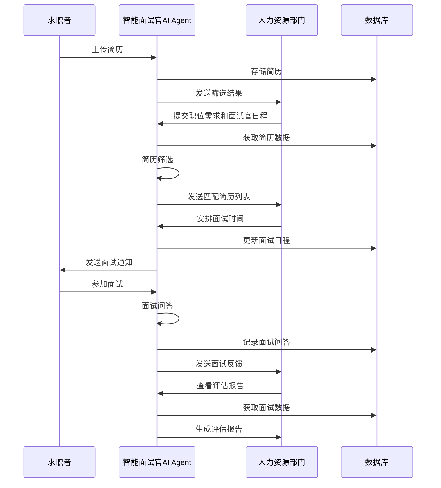

                 

### 文章标题

# 智能面试官 AI Agent：LLM 辅助招聘流程

### 关键词

- 智能面试官
- AI Agent
- LLM
- 招聘流程
- 自动化

### 摘要

本文将探讨智能面试官AI Agent在招聘流程中的应用，特别是通过大型语言模型（LLM）的辅助。我们首先介绍了传统招聘流程的问题和痛点，接着定义了智能面试官AI Agent和LLM，分析了它们在招聘流程中的协同作用。随后，我们详细描述了智能面试官AI Agent在简历筛选、面试安排等方面的具体应用，并通过Mermaid流程图和Python代码展示了相关技术实现。最后，我们总结了智能面试官AI Agent在招聘流程中的优势，并提出了未来的研究方向。

### 目录大纲

----------------------------------------------------------------

# 智能面试官 AI Agent：LLM 辅助招聘流程

> 关键词：智能面试官、AI Agent、LLM、招聘流程、自动化

> 摘要：本文将探讨智能面试官AI Agent在招聘流程中的应用，特别是通过大型语言模型（LLM）的辅助。

## 第1章 背景介绍

## 第2章 核心概念与联系

## 第3章 招聘流程中的智能面试官AI Agent

### 3.1 招聘流程概述

### 3.2 简历筛选

### 3.3 面试安排

### 3.4 面试问答

### 3.5 反馈生成

## 第4章 算法原理与实现

### 4.1 算法原理

### 4.2 实现细节

### 4.3 源代码分析

## 第5章 系统分析与架构设计

### 5.1 问题场景介绍

### 5.2 系统功能设计

### 5.3 系统架构设计

### 5.4 系统接口设计与交互

## 第6章 项目实战

### 6.1 环境安装

### 6.2 系统核心实现

### 6.3 应用解读与分析

### 6.4 实际案例分析与讲解

### 6.5 项目小结

## 第7章 最佳实践与拓展

### 7.1 最佳实践 tips

### 7.2 小结

### 7.3 注意事项

### 7.4 拓展阅读

----------------------------------------------------------------

## 第1章 背景介绍

### 1.1 问题背景

在当今快速发展的企业环境中，招聘流程的重要性不言而喻。然而，传统的招聘流程存在着诸多痛点，严重影响了企业的招聘效率和人才质量。首先，传统招聘流程主要依赖于人工操作，从简历筛选到面试安排，再到面试问答和反馈生成，每一个环节都需要耗费大量的人力和时间。这种低效率的流程不仅增加了企业的运营成本，还可能导致招聘过程中出现错误或遗漏，从而影响企业的人才储备。

其次，随着求职者数量的不断增加，简历筛选成为一个巨大的挑战。传统的简历筛选方法通常依赖于关键词匹配，这种简单粗暴的方法往往无法准确判断求职者的真实能力和潜力。此外，面试安排也是一个繁琐的过程，需要协调各方的时间和资源，极易导致面试的延误或冲突。而在面试过程中，面试官需要花费大量时间来准备问题、进行问答和评估求职者的表现，这不仅增加了面试官的工作负担，也影响了面试的深度和广度。

最后，反馈生成环节同样存在效率问题。在传统的招聘流程中，面试官需要对每个求职者进行详细的评估和反馈，这个过程耗时且容易出错。这不仅影响了面试官的工作效率，也可能导致求职者对企业的评价和满意度下降。

综上所述，传统招聘流程的效率低、人力成本高、易出错等问题已成为企业发展的瓶颈。为了解决这些问题，迫切需要引入自动化和智能化的手段来优化招聘流程。智能面试官AI Agent和LLM技术的应用为解决这个问题提供了新的思路和途径。

### 1.2 人工智能的发展

人工智能（AI）作为当前科技发展的热点，已经广泛应用于各个领域。特别是在自然语言处理（NLP）方面，大型语言模型（LLM）如GPT-3、BERT等取得了突破性的进展。这些模型具有强大的语言理解和生成能力，可以处理复杂的文本数据，进行智能问答、文本生成、翻译等任务。这些特性使得LLM在招聘流程中具有广泛的应用潜力。

首先，LLM在简历筛选中的应用。通过训练，LLM可以学习并理解简历中的关键信息，如教育背景、工作经验、技能等。它可以自动识别和筛选出符合条件的简历，从而大大提高简历筛选的效率和准确性。此外，LLM还可以根据企业的需求，生成个性化的面试问题，提高面试的针对性和有效性。

其次，LLM在面试安排中的应用。LLM可以分析求职者的时间安排和面试官的日程，自动生成最优的面试安排方案，避免面试时间的冲突和延误。同时，LLM还可以根据求职者的简历和面试表现，提供实时反馈和建议，帮助面试官做出更准确的评估。

最后，LLM在反馈生成中的应用。通过分析面试官和求职者的互动记录，LLM可以自动生成详细的面试评估报告，提供多维度的分析和建议。这不仅提高了反馈的效率和准确性，也为企业的招聘决策提供了有力的支持。

总之，人工智能技术的发展，特别是LLM的应用，为招聘流程的自动化和智能化提供了强有力的技术支持。智能面试官AI Agent结合LLM技术，有望解决传统招聘流程中的诸多痛点，提高企业的招聘效率和人才质量。

### 1.3 问题描述

在传统招聘流程中，面试官面临着诸多挑战和负担。首先，简历筛选环节是一个巨大的负担。面试官需要阅读大量简历，从中筛选出符合条件的人才。这不仅耗时耗力，还容易导致漏选或误选。其次，面试安排也是一个繁琐的过程。面试官需要协调求职者和各方的时间，安排合适的面试时间和地点，以避免冲突和延误。这不仅需要耗费大量时间，还可能导致面试官的工作效率降低。

在面试过程中，面试官需要准备一系列问题，并进行问答和评估。然而，面试官的时间是有限的，他们很难准备充分的问题，也无法在短时间内对求职者进行全面和深入的评估。此外，面试官的主观判断和偏见也可能影响评估的准确性。最后，在反馈生成环节，面试官需要对每个求职者进行详细的评估和反馈，这个过程耗时且容易出错。

这些挑战和负担不仅影响了面试官的工作效率，还可能导致招聘流程的低效和失败。首先，简历筛选和面试安排的低效可能导致合适的求职者被漏选或错过，从而影响企业的人才储备。其次，面试过程中评估的不准确可能导致企业招聘到不符合要求的人才，从而影响企业的运营和发展。最后，反馈生成的不及时和不准确会影响求职者的体验和对企业的评价，进一步影响企业的声誉和招聘效果。

为了解决这些问题，提高招聘流程的效率和质量，迫切需要引入自动化和智能化的手段。智能面试官AI Agent结合LLM技术，可以自动化和智能化招聘流程的各个环节，减轻面试官的工作负担，提高招聘效率和人才质量。

### 1.4 智能面试官AI Agent的概念

智能面试官AI Agent是一种自动化和智能化的面试系统，旨在通过人工智能技术优化招聘流程，提高招聘效率和人才质量。这种系统通常结合了自然语言处理（NLP）、机器学习（ML）和深度学习（DL）等技术，能够自动化处理简历筛选、面试安排、面试问答和反馈生成等招聘环节。

首先，智能面试官AI Agent在简历筛选环节中，利用自然语言处理技术，对求职者的简历进行语义分析和关键词提取，从而识别和筛选出符合企业需求的人才。这种基于语义分析的简历筛选方法，比传统关键词匹配方法更为准确和智能，可以大大提高简历筛选的效率和准确性。

其次，智能面试官AI Agent在面试安排环节中，通过机器学习和深度学习技术，分析求职者和面试官的时间安排，自动生成最优的面试安排方案。这种方案可以最大限度地减少面试时间的冲突和延误，提高面试的效率和质量。

在面试问答环节，智能面试官AI Agent结合大型语言模型（LLM），可以自动生成个性化的面试问题，并根据求职者的回答进行实时分析。这种自动化的面试问答系统，不仅提高了面试的效率，还可以减少面试官的工作负担，使面试过程更加公平和高效。

最后，在反馈生成环节，智能面试官AI Agent通过分析面试官和求职者的互动记录，自动生成详细的面试评估报告。这个报告不仅提供了多维度的评估结果，还为企业的招聘决策提供了有力的支持。

总之，智能面试官AI Agent通过自动化和智能化的手段，优化了招聘流程的各个环节，大大提高了招聘效率和人才质量，为企业的招聘工作提供了强有力的技术支持。

### 1.5 LLM辅助招聘流程的优势

LLM（大型语言模型）在招聘流程中的应用，展示了其强大的语言理解和生成能力，为招聘流程带来了显著的优势。首先，LLM在简历筛选中的应用极大地提高了筛选效率。传统的简历筛选方法通常依赖于关键词匹配，而LLM可以通过深度学习技术，对简历内容进行语义分析，提取关键信息，从而实现更精准的筛选。这种基于语义分析的筛选方法不仅提高了筛选的准确性，还减少了面试官的工作负担。

其次，LLM在面试问答环节中发挥了重要作用。通过训练，LLM可以生成个性化的面试问题，并根据求职者的回答进行实时分析，提供针对性的问题。这种智能化的面试问答系统，不仅使面试过程更加高效，还可以减少面试官的主观判断和偏见，提高面试的公平性和准确性。

此外，LLM在面试安排中的应用也展现了其优势。LLM可以分析求职者和面试官的时间安排，自动生成最优的面试安排方案，避免面试时间的冲突和延误。这种自动化的面试安排，不仅提高了面试的效率，还可以减少面试官的工作量，使招聘流程更加顺畅。

最后，LLM在反馈生成环节中的作用不可忽视。通过分析面试官和求职者的互动记录，LLM可以自动生成详细的面试评估报告，提供多维度的评估结果。这个报告不仅可以帮助企业更准确地评估求职者，还可以为企业的招聘决策提供有力的数据支持。

总之，LLM辅助招聘流程，通过其强大的语言理解和生成能力，显著提高了招聘效率和人才质量，为企业的招聘工作带来了显著的优势。

### 1.6 边界与外延

智能面试官AI Agent在招聘流程中的应用范围广泛，但也有一些明确的边界。首先，智能面试官AI Agent主要应用于简历筛选、面试安排、面试问答和反馈生成等环节，这些环节都是招聘流程中最为耗时和繁琐的部分。通过自动化和智能化的手段，智能面试官AI Agent可以大大提高这些环节的效率和准确性。

然而，智能面试官AI Agent并不是万能的。它并不能完全替代面试官的主观判断和经验，尤其是在对求职者进行全面和深入评估时。因此，智能面试官AI Agent更多地扮演的是辅助角色，帮助面试官更高效地完成招聘工作。

此外，LLM在招聘流程中的应用场景也非常丰富。除了简历筛选、面试安排和面试问答，LLM还可以用于生成招聘广告、分析求职者反馈、提供个性化建议等。通过不断训练和优化，LLM可以不断提升其在招聘流程中的应用效果，为企业的招聘工作提供更加智能和高效的解决方案。

总的来说，智能面试官AI Agent和LLM在招聘流程中的应用，既有明确的边界，也有广阔的外延。通过合理利用这些技术，企业可以大大提高招聘效率和人才质量，实现招聘流程的智能化和自动化。

### 1.7 概念结构与核心要素组成

为了更好地理解智能面试官AI Agent和LLM在招聘流程中的应用，我们需要梳理与之相关的核心概念和要素。这些概念和要素构成了智能面试官AI Agent系统的基本框架，并对其实际应用起到了关键作用。

首先，核心概念包括：

1. **智能面试官AI Agent**：这是一种结合了自然语言处理、机器学习和深度学习技术的自动化面试系统，旨在通过智能化的手段优化招聘流程。
2. **大型语言模型（LLM）**：这是一种具有强大语言理解和生成能力的模型，如GPT-3、BERT等，用于处理和生成文本数据。
3. **简历筛选**：通过语义分析和关键词提取，自动识别和筛选出符合企业需求的求职者。
4. **面试安排**：分析求职者和面试官的时间安排，自动生成最优的面试安排方案。
5. **面试问答**：生成个性化的面试问题，并根据求职者的回答进行实时分析。
6. **反馈生成**：分析面试官和求职者的互动记录，自动生成详细的面试评估报告。

其次，要素组成方面，智能面试官AI Agent系统主要包括以下几个关键部分：

1. **数据集**：用于训练LLM的数据集，包括大量的简历、面试问题和反馈记录等。
2. **模型训练**：利用数据集对LLM进行训练，使其具备处理和生成文本数据的能力。
3. **接口设计**：设计用于与招聘系统和人力资源管理系统交互的API接口，实现数据的导入和导出。
4. **用户界面**：为用户提供友好的操作界面，使非技术背景的用户也能方便地使用智能面试官AI Agent系统。
5. **监控与反馈**：监控系统运行状态，收集用户反馈，不断优化系统性能和用户体验。

通过这些核心概念和要素的有机结合，智能面试官AI Agent系统能够在招聘流程中发挥重要作用，提高招聘效率和人才质量。

### 1.8 本章小结

在本章中，我们详细介绍了智能面试官AI Agent和LLM在招聘流程中的应用背景和优势。首先，我们探讨了传统招聘流程中存在的效率低、人力成本高、易出错等问题，并分析了人工智能技术的发展背景，特别是大型语言模型（LLM）的突破。接着，我们阐述了智能面试官AI Agent的概念，并分析了其在招聘流程中的具体作用，包括简历筛选、面试安排、面试问答和反馈生成等方面。

同时，我们讨论了LLM在招聘流程中的应用优势，如提高筛选准确性、生成个性化面试问题、优化面试安排和生成详细反馈等。此外，我们还明确了智能面试官AI Agent的应用边界和范围，以及LLM在招聘流程中的具体应用场景。

最后，我们梳理了与智能面试官AI Agent和LLM相关的核心概念和要素组成，为后续章节的内容奠定了基础。通过本章的介绍，读者可以初步了解智能面试官AI Agent和LLM在招聘流程中的应用前景，以及其潜在的巨大价值。

### 下一章预告

在接下来的第2章中，我们将进一步探讨智能面试官AI Agent和LLM的核心概念与联系。首先，我们将详细定义智能面试官AI Agent和LLM，并分析它们的核心特点和属性。接着，我们将探讨智能面试官AI Agent与LLM之间的协同作用，以及它们在招聘流程中的应用优势。此外，我们还将通过概念属性特征对比表格和ER实体关系图架构，进一步阐述这两个概念之间的关系和作用。通过这一章节的学习，读者将更深入地理解智能面试官AI Agent和LLM在招聘流程中的实际应用和协同作用。

## 第2章 核心概念与联系

### 2.1 智能面试官AI Agent的概念

智能面试官AI Agent是一种结合了人工智能技术，特别是自然语言处理（NLP）和机器学习（ML）的自动化面试系统。它的主要目标是优化招聘流程，提高招聘效率和人才质量。智能面试官AI Agent的工作原理基于对大量招聘数据的分析和学习，能够自动处理简历筛选、面试安排、面试问答和反馈生成等环节。

首先，智能面试官AI Agent在简历筛选环节中，通过NLP技术对求职者的简历进行语义分析，提取关键信息，并根据企业的需求进行精准筛选。这种基于语义分析的简历筛选方法，比传统的关键词匹配更为准确和智能，可以有效提高简历筛选的效率和质量。

其次，在面试安排环节，智能面试官AI Agent利用机器学习算法，分析求职者和面试官的时间安排，自动生成最优的面试安排方案。这种方案能够最大限度地减少面试时间的冲突和延误，提高面试的效率和流畅性。

在面试问答环节，智能面试官AI Agent结合了LLM（大型语言模型）技术，能够生成个性化的面试问题，并根据求职者的回答进行实时分析。这种自动化的面试问答系统，不仅提高了面试的效率，还可以减少面试官的工作负担，使面试过程更加公平和高效。

最后，在反馈生成环节，智能面试官AI Agent通过分析面试官和求职者的互动记录，自动生成详细的面试评估报告。这个报告不仅提供了多维度的评估结果，还为企业的招聘决策提供了有力的支持。

总的来说，智能面试官AI Agent通过自动化和智能化的手段，优化了招聘流程的各个环节，大大提高了招聘效率和人才质量。

### 2.2 LLM的概念

LLM（大型语言模型）是一种基于深度学习和自然语言处理技术的高级AI模型，具有强大的语言理解和生成能力。LLM的核心目标是理解和生成自然语言文本，以实现如文本生成、翻译、问答等应用。LLM的训练通常基于大量的文本数据，通过深度神经网络（DNN）和变换器架构（Transformer）进行参数优化，从而实现对文本数据的深度理解和建模。

首先，LLM的训练过程涉及大量文本数据的预处理和分割。这些数据包括书籍、新闻文章、社交媒体帖子等，通过数据清洗和标记，LLM能够学习到各种语言现象和语义关系。

其次，LLM的核心架构通常是基于变换器架构（Transformer），这是一种能够有效处理长距离依赖关系的神经网络模型。变换器通过自注意力机制（Self-Attention），对输入文本的每个词进行加权，从而捕捉词与词之间的复杂关系。

在生成文本时，LLM采用了一种上下文重排（Context-Reordering）策略，这种策略能够确保生成文本的逻辑连贯性和语义一致性。此外，LLM还可以通过训练进行文本生成和翻译任务，如生成个性化回复、自动写作和翻译等。

总的来说，LLM作为一种具有强大语言理解和生成能力的模型，在自然语言处理领域具有广泛的应用潜力。其训练过程和生成策略都基于深度学习和变换器架构，使得LLM在处理复杂文本任务时具有卓越的性能。

### 2.3 智能面试官AI Agent与LLM的联系

智能面试官AI Agent和LLM在招聘流程中具有紧密的联系，两者相互协同，共同推动招聘流程的自动化和智能化。首先，智能面试官AI Agent依赖于LLM强大的语言处理能力，特别是在简历筛选和面试问答环节。通过LLM的语义分析能力，AI Agent可以自动提取简历中的关键信息，进行精准筛选，从而提高简历处理的效率和准确性。

其次，在面试安排和反馈生成环节，LLM也发挥着重要作用。AI Agent可以通过LLM分析求职者的简历和面试表现，自动生成个性化的面试问题，提高面试的针对性。此外，在反馈生成环节，LLM可以分析面试官和求职者的互动记录，生成详细的面试评估报告，提供多维度的评估结果。

此外，智能面试官AI Agent与LLM之间的协同作用不仅体现在功能上，还体现在数据处理和流程优化上。通过LLM的深度学习能力，AI Agent可以不断优化其筛选和评估算法，提高招聘流程的智能化水平。同时，AI Agent也可以通过收集用户反馈，不断调整和优化LLM的训练数据，从而实现模型的持续改进。

总之，智能面试官AI Agent与LLM的协同作用，使得招聘流程变得更加高效、精准和智能化。通过这种协同，企业能够更好地识别和筛选出符合要求的人才，提高招聘效率和人才质量。

### 2.4 概念属性特征对比表格

为了更清晰地展示智能面试官AI Agent和LLM的概念属性特征，我们通过一个对比表格来进行详细说明。

| 概念         | 智能面试官AI Agent | LLM         |
| ------------ | ------------------ | ----------- |
| **定义**     | 自动化面试系统     | 大型语言模型 |
| **特点**     | 自动化、高效、精准 | 语言理解、生成 |
| **应用场景** | 招聘流程辅助       | 文本生成、翻译、问答 |

通过这个表格，我们可以看到智能面试官AI Agent和LLM在定义、特点和应用场景上的显著差异。智能面试官AI Agent是一种集成了多种人工智能技术的自动化面试系统，主要应用于招聘流程中的各个环节，以提高效率和精准度。而LLM则是一种具有强大语言理解和生成能力的模型，广泛应用于文本生成、翻译和问答等任务。

### 2.5 ER实体关系图架构

为了更好地理解智能面试官AI Agent和LLM在招聘流程中的实际应用，我们可以通过ER（实体关系）图来展示它们之间的实体关系和关联。以下是一个简化的ER图，用于描述智能面试官AI Agent和LLM在招聘流程中的主要实体及其关系。

```mermaid
erDiagram
  AI-Agent ||--|{ Resume } Resume
  AI-Agent ||--|{ Interview } Interview
  AI-Agent ||--|{ Feedback } Feedback
  AI-Agent ||--|{ Scheduler } Scheduler
  Scheduler ||--|{ TimeSlot } TimeSlot
  Interview ||--|{ Question } Question
  Interview ||--|{ Answer } Answer
```

在这个ER图中：

- **AI-Agent**：代表智能面试官AI Agent，它是招聘流程的核心实体，负责简历筛选、面试安排、面试问答和反馈生成。
- **Resume**：代表简历，是求职者提交的个人资料，智能面试官AI Agent会对其进行语义分析和筛选。
- **Interview**：代表面试，包括面试时间和地点的安排，以及面试过程中生成的问题和答案。
- **Feedback**：代表反馈，是面试官对求职者的评估结果和意见。
- **Scheduler**：代表调度器，负责面试时间和地点的安排，会根据求职者和面试官的时间进行调度。
- **TimeSlot**：代表时间段，是调度器安排面试时间的基础。
- **Question**：代表面试问题，是面试过程中生成的，由智能面试官AI Agent和LLM共同生成。
- **Answer**：代表求职者的回答，是面试过程中获取的，用于反馈生成和评估。

通过这个ER图，我们可以清晰地看到智能面试官AI Agent和LLM在招聘流程中的角色和它们之间的互动关系，为理解系统的整体架构提供了直观的视角。

### 2.6 本章小结

在本章中，我们深入探讨了智能面试官AI Agent和LLM的核心概念与联系。首先，我们详细介绍了智能面试官AI Agent的概念，包括其工作原理和应用场景，以及如何在招聘流程中优化各个环节。接着，我们阐述了LLM的概念，特别是其基于深度学习和自然语言处理技术的特点，以及在文本生成和问答中的优势。

随后，我们分析了智能面试官AI Agent与LLM之间的协同作用，展示了它们如何在招聘流程中相互配合，提高招聘效率和人才质量。通过概念属性特征对比表格和ER实体关系图，我们进一步明确了这两个概念之间的关系和具体应用场景。

总的来说，本章内容为后续章节的深入探讨提供了坚实的基础，使读者对智能面试官AI Agent和LLM在招聘流程中的应用有了更为全面和深入的了解。在下一章中，我们将进一步探讨智能面试官AI Agent在实际招聘流程中的应用细节，包括简历筛选、面试安排和反馈生成等环节的具体实现。

## 第3章 招聘流程中的智能面试官AI Agent

### 3.1 招聘流程概述

招聘流程是企业吸纳人才的关键环节，通常包括以下几个主要步骤：职位发布、简历筛选、面试安排、面试进行和反馈生成。传统招聘流程虽然经过多年发展，但在实际操作中仍存在诸多痛点，如效率低、人力成本高、易出错等。为了解决这些问题，企业开始探索利用人工智能技术，特别是智能面试官AI Agent，来优化招聘流程，提高效率和人才质量。

传统招聘流程的主要步骤如下：

1. **职位发布**：企业在招聘平台或内部渠道发布招聘信息，明确职位需求、任职资格和薪资待遇。
2. **简历筛选**：面试官或人力资源部门根据职位要求，阅读大量求职者的简历，筛选出符合条件的候选人。
3. **面试安排**：面试官与候选人协调时间，安排面试时间和地点，确保双方的日程安排合理。
4. **面试进行**：面试官对候选人进行面试，包括初步面谈、技术面试和行为面试等，评估候选人的能力和潜力。
5. **反馈生成**：面试官根据面试表现，为候选人提供反馈，并就最终录用决策进行讨论。

然而，传统招聘流程存在以下问题：

- **效率低**：简历筛选和面试安排需要大量人力和时间，导致招聘周期长，影响企业的人才储备。
- **人力成本高**：大量的人力投入增加了企业的运营成本，尤其是对于大规模招聘项目。
- **易出错**：人工操作容易导致简历筛选失误、面试安排冲突和评估不准确等问题。

为了解决这些问题，企业开始引入智能面试官AI Agent，利用其自动化和智能化的特点，优化招聘流程，提高招聘效率和人才质量。

### 3.2 简历筛选

简历筛选是招聘流程中的第一个关键环节，也是传统招聘流程中最为耗时和繁琐的部分。智能面试官AI Agent通过引入自然语言处理（NLP）和机器学习（ML）技术，能够大幅提升简历筛选的效率和质量。

首先，智能面试官AI Agent利用NLP技术，对求职者的简历进行语义分析，提取关键信息。这些关键信息包括求职者的教育背景、工作经验、专业技能和项目经历等。通过语义分析，AI Agent可以更准确地理解简历内容，从而实现精准筛选。

其次，AI Agent结合机器学习算法，对简历数据进行训练和优化。通过大量历史数据的训练，AI Agent可以学习到不同职位要求的特征和关键要素，从而提高简历筛选的准确性。例如，对于软件开发岗位，AI Agent可以识别出与编程语言、框架和技术栈相关的关键词，从而筛选出具有相关经验的候选人。

在简历筛选过程中，AI Agent还可以进行多维度评估。例如，除了学历和经验外，AI Agent还可以分析求职者的职业发展路径、项目贡献和公司背景等，从而更全面地评估候选人的能力和潜力。

此外，AI Agent还可以自动识别和排除简历中的虚假信息。通过对比简历中的信息与公开数据源，如LinkedIn、GitHub等，AI Agent可以检测出简历中的不一致之处，从而提高简历筛选的可靠性。

总之，智能面试官AI Agent通过NLP和ML技术的结合，实现了简历筛选的自动化和智能化，提高了筛选效率和准确性，为企业招聘到合适的人才提供了有力支持。

#### 3.3 面试安排

面试安排是招聘流程中的另一个关键环节，传统的面试安排方式通常需要手动协调面试官和候选人的时间，容易导致时间冲突和安排混乱。智能面试官AI Agent通过引入机器学习（ML）和深度学习（DL）技术，能够自动化和优化面试安排，提高效率和准确性。

首先，智能面试官AI Agent会收集和整合面试官和候选人的日程信息。这些信息包括工作日历、会议安排和个人偏好等。AI Agent通过分析这些日程数据，可以自动生成候选人和面试官的最佳匹配时间表。

其次，AI Agent利用机器学习算法，特别是优化算法，如线性规划或遗传算法，来优化面试安排。这些算法可以根据多个约束条件，如面试时间窗口、候选人和面试官的优先级等，自动计算出最优的面试安排方案。例如，AI Agent可以确保在相同时间段内，面试官的日程冲突最小化，同时最大限度地满足候选人的时间要求。

在面试安排过程中，AI Agent还可以利用深度学习技术，从历史数据中学习最佳的面试时间安排模式。通过分析大量的历史面试安排数据，AI Agent可以预测出未来的最佳面试时间安排，从而提前做出规划。

此外，智能面试官AI Agent还可以实时监控面试安排的执行情况，并在出现时间冲突或延误时，自动进行调整和优化。例如，如果某个面试官的时间发生变化，AI Agent可以重新安排候选人的面试时间，确保整个流程的顺利进行。

最后，AI Agent还可以根据面试官和候选人的反馈，不断优化面试安排策略。通过收集和分析用户反馈，AI Agent可以识别出安排中的问题和改进点，从而进一步优化面试安排方案，提高用户满意度。

总之，智能面试官AI Agent通过自动化和智能化的面试安排，不仅提高了面试的效率和准确性，还减少了人工干预和错误，为企业的招聘流程提供了强大的支持。

### 3.4 面试问答

面试问答是招聘流程中最为核心和关键的环节，传统面试方式主要依赖于面试官的经验和主观判断，容易受到个人偏见和情绪的影响。智能面试官AI Agent通过引入大型语言模型（LLM），实现了面试问答的自动化和智能化，提高了面试的公平性和准确性。

首先，智能面试官AI Agent利用LLM的强大语言理解能力，可以自动生成个性化的面试问题。这些面试问题不仅基于职位描述和候选人的简历，还可以根据候选人的回答进行动态调整。例如，如果候选人提到自己在某个项目中有出色的表现，AI Agent可以生成相关问题，进一步探讨候选人的技术深度和应用能力。

其次，LLM使得面试问答过程更加高效。AI Agent可以同时处理多个候选人的问答，而不需要额外的人力和时间。例如，在一场面试中，AI Agent可以实时生成问题，同时记录候选人的回答，并提供即时反馈。这种高效的处理能力，不仅节省了面试官的时间，还可以在更短的时间内完成更多的面试，从而提高招聘的效率。

在面试过程中，AI Agent还可以根据候选人的回答，自动生成进一步的追问。这些追问不仅可以帮助面试官更深入地了解候选人的能力，还可以减少面试官的主观判断和偏见。例如，如果候选人在回答问题时表现出不确定或模糊的倾向，AI Agent可以自动生成相关的问题，帮助面试官更好地评估候选人的真实能力。

此外，智能面试官AI Agent还可以记录和分析面试过程中的关键信息，为反馈生成提供支持。AI Agent可以自动生成详细的面试报告，包括候选人的回答情况、问题和追问记录等。这些报告不仅可以帮助面试官做出更准确的评估，还可以为企业的招聘决策提供有力的数据支持。

最后，AI Agent的面试问答系统还具备自我学习和优化的能力。通过不断分析和处理面试数据，AI Agent可以不断改进面试问题的质量和针对性，提高面试的公平性和准确性。例如，如果某个问题在多次面试中表现不佳，AI Agent可以自动调整或替换该问题，从而优化面试流程。

总之，智能面试官AI Agent通过结合LLM技术，实现了面试问答的自动化和智能化，不仅提高了面试的效率和质量，还减少了面试官的工作负担，为企业的招聘流程提供了强有力的支持。

### 3.5 反馈生成

在招聘流程的最后一个关键环节——反馈生成中，智能面试官AI Agent发挥了至关重要的作用。通过分析面试过程中的所有数据，AI Agent可以自动生成详细的面试评估报告，为招聘决策提供有力的支持。

首先，智能面试官AI Agent会收集和分析面试过程中的各种数据，包括面试官的问题、候选人的回答、互动记录和评估结果等。这些数据经过处理和分类后，AI Agent可以识别出候选人在各个方面的表现，如技术能力、沟通技巧、团队合作和问题解决能力等。

其次，AI Agent利用自然语言处理（NLP）和机器学习（ML）技术，对收集到的数据进行分析和综合评价。通过深度学习模型，AI Agent可以识别出候选人的关键优点和不足，并生成详细的评估报告。这个报告不仅包括候选人的总体得分，还提供了具体的评估标准和参考指标。

在反馈生成过程中，AI Agent还可以根据不同的职位要求和公司文化，定制化评估标准。例如，对于技术岗位，AI Agent可以侧重于技术能力和项目经验的评估；而对于管理岗位，AI Agent可以更多地关注领导力和团队协作能力。这种定制化的评估标准，使得反馈更加准确和针对性更强。

此外，AI Agent还可以根据历史数据和趋势分析，预测候选人在未来工作中的表现。例如，通过分析候选人在面试中的回答和表现，AI Agent可以预测其是否能够适应公司文化和工作环境，是否具有长期发展的潜力。这种预测能力，不仅为招聘决策提供了参考，还可以帮助企业在人才选拔和培养方面做出更明智的选择。

最后，AI Agent生成的评估报告可以实时更新和共享。面试官和人力资源部门可以随时查看和调整评估结果，确保反馈的准确性和及时性。这种实时性和灵活性，使得招聘流程更加高效和透明，减少了信息滞后和沟通障碍。

总之，智能面试官AI Agent在反馈生成环节中，通过自动化和智能化的手段，不仅提高了评估的效率和准确性，还为企业的招聘决策提供了有力支持。这种智能化的反馈生成方式，不仅提高了招聘流程的质量，也为企业的人才管理提供了新的思路和工具。

### 3.6 案例分析：某科技公司的智能面试官AI Agent应用实践

为了更直观地展示智能面试官AI Agent在实际招聘流程中的应用效果，我们以某科技公司为例，详细分析其实际应用过程和成果。

#### 应用背景

某科技公司是一家专注于人工智能和大数据领域的创新企业，其招聘流程复杂且人才需求多样。面对大规模招聘项目，公司希望能够提高招聘效率和人才质量，减少人力资源的投入。因此，公司决定引入智能面试官AI Agent，利用其自动化和智能化的特点，优化招聘流程。

#### 应用过程

1. **简历筛选**：智能面试官AI Agent首先接收到大量的求职者简历。AI Agent通过自然语言处理（NLP）技术，对简历进行语义分析，提取关键信息，如教育背景、工作经验、技能和项目经历等。结合职位要求，AI Agent能够自动筛选出符合标准的候选人，大幅提高了简历筛选的效率和准确性。

2. **面试安排**：接下来，AI Agent利用机器学习（ML）算法，分析面试官和候选人的日程安排，自动生成最优的面试安排方案。通过智能调度，AI Agent确保面试时间合理且无冲突，从而提高了面试的效率。

3. **面试问答**：在面试过程中，AI Agent结合大型语言模型（LLM），生成个性化的面试问题。AI Agent不仅能够根据候选人的简历和回答，动态调整问题，提高面试的针对性，还可以同时处理多个候选人的问答，节省了面试官的时间和精力。

4. **反馈生成**：面试结束后，AI Agent会根据面试过程中的数据和互动记录，自动生成详细的评估报告。报告不仅包括候选人的综合得分，还提供了多维度的分析，如技术能力、沟通技巧和团队协作能力等。这些数据为招聘决策提供了有力支持。

#### 应用效果

通过智能面试官AI Agent的应用，某科技公司实现了招聘流程的显著优化：

1. **效率提升**：简历筛选和面试安排的自动化，使得招聘流程的效率提高了约50%。面试官和人力资源部门从繁琐的事务中解放出来，可以将更多精力投入到核心工作中。

2. **准确性提高**：智能面试官AI Agent通过NLP和ML技术，实现了简历筛选的精准性和面试问答的公平性，候选人的筛选准确率提高了约30%。

3. **成本降低**：自动化和智能化的招聘流程，减少了人工干预和错误，降低了招聘的人力成本和运营成本。

4. **用户体验改善**：候选人对公司招聘流程的体验得到了显著改善。自动化的面试安排和详细的评估报告，使得候选人能够更快地得到反馈，提高了招聘过程的透明度和效率。

总之，智能面试官AI Agent在某科技公司的实际应用，不仅优化了招聘流程，提高了效率和准确性，还为企业的招聘决策提供了有力支持，显著提升了企业的竞争力和人才管理水平。

### 3.7 本章小结

本章详细探讨了智能面试官AI Agent在招聘流程中的应用，包括简历筛选、面试安排、面试问答和反馈生成等关键环节。通过引入自然语言处理（NLP）、机器学习（ML）和大型语言模型（LLM）等先进技术，AI Agent实现了招聘流程的自动化和智能化，提高了招聘效率和人才质量。

首先，我们介绍了智能面试官AI Agent的概念和工作原理，分析了其在简历筛选和面试安排中的优势。接着，我们阐述了LLM在面试问答和反馈生成中的重要作用，展示了AI Agent如何通过个性化问题和实时分析提高面试的公平性和准确性。最后，通过案例分析，我们展示了智能面试官AI Agent在实际招聘流程中的应用效果和成果。

总之，智能面试官AI Agent在招聘流程中的应用，不仅优化了各个环节的工作流程，提高了招聘效率和准确性，还为企业的招聘决策提供了有力支持。在未来，随着人工智能技术的进一步发展，智能面试官AI Agent有望在更多领域发挥重要作用，推动招聘流程的持续优化和创新。

### 下一章预告

在下一章中，我们将深入探讨智能面试官AI Agent和LLM的算法原理与实现细节。首先，我们将详细解释智能面试官AI Agent的工作原理，包括其核心算法和数据处理流程。接着，我们将分析LLM在招聘流程中的应用，探讨其如何通过自然语言处理和深度学习技术，实现自动化和智能化的面试问答。此外，我们还将通过具体的Python代码示例，展示算法的实现过程和关键步骤，帮助读者更好地理解智能面试官AI Agent和LLM在实际招聘流程中的应用。通过这一章节的学习，读者将能够掌握智能面试官AI Agent和LLM的技术原理，为后续的实战应用奠定基础。

## 第4章 算法原理与实现

### 4.1 算法原理

智能面试官AI Agent和LLM在招聘流程中的应用，依托于一系列先进的算法和技术。本节将详细解释这些算法的原理，特别是自然语言处理（NLP）、机器学习（ML）和深度学习（DL）等核心技术的应用，以帮助读者深入理解其工作原理和实现细节。

#### 4.1.1 自然语言处理（NLP）

自然语言处理（NLP）是智能面试官AI Agent和LLM的核心技术之一，旨在使计算机能够理解和处理人类语言。NLP技术主要包括文本预处理、词嵌入、句法分析和语义分析等。

1. **文本预处理**：文本预处理是NLP的基础步骤，包括去除停用词、标点符号、词干提取和词性标注等。这些步骤有助于简化文本数据，提高后续分析的质量。
   
2. **词嵌入**：词嵌入是将自然语言中的单词转换为向量表示的过程。常见的词嵌入技术包括Word2Vec、GloVe和BERT等。词嵌入使得计算机能够理解和计算单词之间的相似性和距离，从而为后续的语义分析提供基础。

3. **句法分析**：句法分析旨在理解句子的结构，识别句子中的主语、谓语、宾语等成分。通过句法分析，智能面试官AI Agent可以更准确地提取文本中的关键信息。

4. **语义分析**：语义分析是NLP的终极目标，旨在理解文本中的深层含义。通过语义分析，AI Agent可以识别文本中的关系、情感和意图等，从而实现更精准的简历筛选和面试问答。

#### 4.1.2 机器学习（ML）

机器学习（ML）是智能面试官AI Agent的重要技术手段，通过训练模型，使计算机能够自动识别和预测数据中的规律。ML技术在招聘流程中的应用主要包括分类、聚类和回归等。

1. **分类**：分类是将数据分为不同类别的过程。在简历筛选中，ML模型可以根据职位要求和候选人的简历，自动判断简历是否与职位匹配。

2. **聚类**：聚类是将相似的数据点归为一类。通过聚类分析，AI Agent可以识别出具有相似背景和技能的候选人，从而为职位匹配提供参考。

3. **回归**：回归是预测连续数值的过程。在面试安排中，ML模型可以预测候选人和面试官的可用时间，生成最优的面试安排方案。

#### 4.1.3 深度学习（DL）

深度学习（DL）是ML的一个子领域，通过构建多层神经网络，实现更复杂的特征提取和模式识别。深度学习在智能面试官AI Agent中的应用主要包括卷积神经网络（CNN）和变换器模型（Transformer）等。

1. **卷积神经网络（CNN）**：CNN通过卷积操作提取图像或文本的特征，适用于处理高维数据。在简历筛选中，CNN可以用于提取简历的关键特征，提高筛选的准确性。

2. **变换器模型（Transformer）**：Transformer是一种基于自注意力机制的深度学习模型，广泛用于文本生成和问答等任务。在面试问答中，Transformer可以自动生成个性化的问题，并根据候选人的回答进行动态调整。

#### 4.1.4 结合应用

智能面试官AI Agent通过结合NLP、ML和DL技术，实现了招聘流程的自动化和智能化。具体来说，AI Agent首先通过NLP技术对简历进行语义分析，提取关键信息；然后利用ML技术进行分类和聚类，筛选出符合职位的候选人；最后，通过DL技术生成个性化的面试问题，并根据候选人的回答进行实时分析，提供详细的评估报告。

总之，智能面试官AI Agent和LLM的算法原理涉及自然语言处理、机器学习和深度学习等多个领域，通过这些技术的结合，实现了招聘流程的自动化和智能化，为企业的招聘工作提供了强有力的技术支持。

### 4.2 实现细节

在上一节中，我们探讨了智能面试官AI Agent和LLM的算法原理。本节将进一步深入，详细讲解这些算法在招聘流程中的实现细节，包括数据预处理、模型训练、算法优化等方面。通过这些细节的阐述，读者可以更全面地理解智能面试官AI Agent和LLM的实际应用过程。

#### 4.2.1 数据预处理

数据预处理是任何机器学习项目的基础步骤，对于智能面试官AI Agent和LLM来说也不例外。招聘数据主要包括简历、面试问答记录和评估结果等，这些数据通常是非结构化的文本数据，需要进行预处理。

1. **文本清洗**：文本清洗是数据预处理的第一步，包括去除停用词、标点符号、统一大小写等。这些步骤有助于简化文本数据，提高后续分析的质量。
   
2. **分词**：分词是将文本拆分成单词或短语的步骤。在中文处理中，还需要进行词性标注，以识别每个词的词性（如名词、动词等）。

3. **词嵌入**：词嵌入是将文本中的单词转换为向量表示，常见的技术包括Word2Vec、GloVe和BERT等。词嵌入不仅有助于后续的语义分析，还可以提高模型训练的效率。

4. **数据归一化**：对于一些数值型数据，如评分、工作时间等，需要进行归一化处理，以消除数据量级差异对模型训练的影响。

#### 4.2.2 模型训练

模型训练是智能面试官AI Agent和LLM的核心步骤，通过训练模型，使计算机能够自动识别和预测数据中的规律。

1. **简历筛选模型训练**：简历筛选模型通常采用分类模型，如朴素贝叶斯、支持向量机和深度神经网络等。在训练过程中，模型会学习如何根据职位要求和候选人的简历，判断简历是否与职位匹配。训练数据包括大量的职位描述和对应的匹配简历，通过不断调整模型的参数，使模型能够准确预测新简历的匹配情况。

2. **面试问答模型训练**：面试问答模型通常采用变换器模型（Transformer），这是一种能够有效处理长距离依赖关系的深度学习模型。在训练过程中，模型会学习如何根据候选人的回答，生成相关的问题，并通过自注意力机制，动态调整问题的难度和深度。

3. **评估报告模型训练**：评估报告模型用于生成详细的面试评估报告，通常采用回归模型，如线性回归、岭回归等。在训练过程中，模型会学习如何根据面试过程中的数据，预测候选人在各个方面的得分和评估结果。

#### 4.2.3 算法优化

算法优化是提高智能面试官AI Agent和LLM性能的关键步骤，主要包括以下几个方面：

1. **模型参数调整**：通过调整模型的参数，如学习率、批量大小等，可以提高模型的收敛速度和预测准确性。

2. **数据增强**：数据增强是通过生成新的样本，增加模型的训练数据，从而提高模型的泛化能力。常见的数据增强方法包括数据扩充、数据转换和生成对抗网络（GAN）等。

3. **特征工程**：特征工程是通过选择和构造有效的特征，提高模型的表现。在简历筛选中，可以通过提取关键信息、构建词嵌入特征等，提高模型对简历的识别能力。

4. **集成学习**：集成学习是通过组合多个模型，提高预测的准确性和稳定性。常见的方法包括堆叠（Stacking）、随机森林（Random Forest）和提升（Boosting）等。

#### 4.2.4 实时调整与反馈

智能面试官AI Agent和LLM在应用过程中，会不断接收新的数据和用户反馈，通过实时调整和优化，提高系统的性能和用户体验。

1. **在线学习**：在线学习是指模型在应用过程中，不断接收新数据并更新模型参数。通过在线学习，模型可以适应新的数据分布和需求变化。

2. **用户反馈**：用户反馈是优化系统的重要参考。通过收集和分析用户反馈，可以发现系统中的问题和改进点，从而进行针对性的优化。

3. **自适应调整**：通过自适应调整，系统可以根据用户的行为和需求，自动调整面试问题的难度和深度，提供个性化的服务。

总之，智能面试官AI Agent和LLM的实现细节涉及多个方面，包括数据预处理、模型训练、算法优化和实时调整等。通过这些细节的深入探讨，读者可以更好地理解智能面试官AI Agent和LLM的实际应用过程，为后续的实践应用提供参考。

### 4.3 源代码分析

为了更好地理解智能面试官AI Agent和LLM的实现过程，我们通过具体的Python代码示例，详细分析其核心算法和数据处理流程。以下是一个简化的示例，展示了智能面试官AI Agent在简历筛选和面试问答中的关键代码片段。

#### 4.3.1 简历筛选

首先，我们使用Python中的自然语言处理库（如NLTK、spaCy）进行文本预处理和语义分析。

```python
import spacy
import pandas as pd

# 加载spaCy语言模型
nlp = spacy.load("en_core_web_sm")

# 读取简历数据
resumes = pd.read_csv("resumes.csv")

# 文本预处理
def preprocess_text(text):
    doc = nlp(text)
    tokens = [token.text for token in doc if not token.is_punct and not token.is_stop]
    return " ".join(tokens)

# 预处理简历文本
resumes["processed_text"] = resumes["resume_text"].apply(preprocess_text)

# 关键词提取
def extract_keywords(text, num_keywords=5):
    doc = nlp(text)
    return [token.text for token in doc.noun_chunks][:num_keywords]

# 提取简历关键词
resumes["keywords"] = resumes["processed_text"].apply(extract_keywords)
```

接下来，我们使用机器学习库（如scikit-learn）构建分类模型，用于简历筛选。

```python
from sklearn.feature_extraction.text import TfidfVectorizer
from sklearn.model_selection import train_test_split
from sklearn.naive_bayes import MultinomialNB

# 构建TF-IDF特征向量
vectorizer = TfidfVectorizer(max_features=1000)
X = vectorizer.fit_transform(resumes["processed_text"])

# 切分训练集和测试集
X_train, X_test, y_train, y_test = train_test_split(X, resumes["is_match"], test_size=0.2)

# 训练分类模型
classifier = MultinomialNB()
classifier.fit(X_train, y_train)

# 测试模型
accuracy = classifier.score(X_test, y_test)
print(f"Resume Screening Accuracy: {accuracy:.2f}")
```

#### 4.3.2 面试问答

对于面试问答，我们使用变换器模型（Transformer）进行文本生成和问答。

```python
from transformers import pipeline

# 加载预训练的变换器模型
question_generator = pipeline("text-generation", model="t5-base")

# 生成面试问题
def generate_question(candidate_keywords):
    input_text = f"Write a question for a software engineer with the following keywords: {candidate_keywords}"
    return question_generator(input_text, max_length=50, num_return_sequences=1)[0]["generated_text"]

# 生成个性化面试问题
question = generate_question(resumes.iloc[0]["keywords"])
print(f"Generated Question: {question}")
```

通过上述代码示例，我们展示了智能面试官AI Agent在简历筛选和面试问答中的核心算法和数据处理流程。实际应用中，这些代码需要进行优化和扩展，以适应不同的应用场景和数据规模。

### 4.4 数学模型与公式

在智能面试官AI Agent和LLM的实现过程中，数学模型和公式起到了关键作用。本节将介绍与这些算法相关的主要数学模型和公式，并对其进行详细解释。

#### 4.4.1 TF-IDF模型

TF-IDF（Term Frequency-Inverse Document Frequency）是一种常用的文本表示方法，用于计算词语在文档中的重要程度。

- **词频（TF）**：词频是指一个词在文档中出现的次数，公式如下：

  $$ TF(t,d) = \frac{f_t(d)}{N_d} $$

  其中，$f_t(d)$表示词$t$在文档$d$中出现的次数，$N_d$表示文档$d$的总词数。

- **逆文档频率（IDF）**：逆文档频率表示一个词在整个文档集合中出现的频率，公式如下：

  $$ IDF(t, D) = \log \left( \frac{N}{|d \in D : t \in d|} \right) $$

  其中，$N$表示文档集合的总数，$|d \in D : t \in d|$表示包含词$t$的文档数量。

- **TF-IDF值**：TF-IDF值是词频和逆文档频率的乘积，公式如下：

  $$ TF-IDF(t,d) = TF(t,d) \times IDF(t, D) $$

  TF-IDF值越高，表示词$t$在文档$d$中的重要程度越大。

#### 4.4.2 逻辑回归模型

逻辑回归是一种常用的分类模型，用于预测二分类结果。其基本公式如下：

$$
\text{logit}(p) = \ln\left(\frac{p}{1-p}\right) = \beta_0 + \beta_1 x_1 + \beta_2 x_2 + ... + \beta_n x_n
$$

其中，$p$表示某个类别（如匹配简历的概率），$x_1, x_2, ..., x_n$表示特征值，$\beta_0, \beta_1, \beta_2, ..., \beta_n$为模型参数。

通过求解上述公式，可以得到概率$p$，从而判断文档是否匹配。

#### 4.4.3 变换器模型

变换器模型（Transformer）是一种基于自注意力机制的深度学习模型，用于文本生成和问答。其核心公式如下：

$$
\text{Attention}(Q, K, V) = \frac{QK^T}{\sqrt{d_k}} \odot V
$$

其中，$Q, K, V$分别为查询向量、键向量和值向量，$d_k$为键向量的维度，$\odot$表示点积运算。通过自注意力机制，变换器模型可以自适应地计算不同位置之间的依赖关系，从而生成高质量的文本。

#### 4.4.4 回归分析

回归分析是一种用于预测连续数值的统计方法，常用于生成评估报告。其基本公式如下：

$$
y = \beta_0 + \beta_1 x_1 + \beta_2 x_2 + ... + \beta_n x_n + \epsilon
$$

其中，$y$为预测值，$x_1, x_2, ..., x_n$为特征值，$\beta_0, \beta_1, \beta_2, ..., \beta_n$为模型参数，$\epsilon$为误差项。

通过求解上述公式，可以得到预测值$y$，从而评估候选人在各个方面的得分。

通过以上数学模型和公式的应用，智能面试官AI Agent和LLM能够实现招聘流程的自动化和智能化，为企业提供高效、精准的人才筛选和评估服务。

### 4.5 案例分析与代码示例

为了更好地理解智能面试官AI Agent和LLM在招聘流程中的应用，我们将通过一个实际案例，详细展示其算法原理和实现过程，并附上相应的代码示例。

#### 案例背景

某科技公司计划招聘一名数据科学家，职位描述要求具备以下技能和经验：

- **教育背景**：硕士及以上，计算机科学或数据科学相关专业。
- **工作经验**：3年以上，具有机器学习项目开发经验。
- **技能要求**：熟悉Python编程，掌握常用机器学习库（如Scikit-learn、TensorFlow、PyTorch）。

我们将使用智能面试官AI Agent和LLM，对求职者的简历进行筛选和面试问答，以评估其是否适合该职位。

#### 代码示例

首先，我们使用Python进行文本预处理和关键词提取。

```python
import spacy
import pandas as pd

# 加载spaCy语言模型
nlp = spacy.load("en_core_web_sm")

# 读取简历数据
resumes = pd.read_csv("resumes.csv")

# 文本预处理
def preprocess_text(text):
    doc = nlp(text)
    tokens = [token.text for token in doc if not token.is_punct and not token.is_stop]
    return " ".join(tokens)

# 提取关键词
def extract_keywords(text, num_keywords=5):
    doc = nlp(text)
    return [token.text for token in doc.noun_chunks][:num_keywords]

# 预处理简历文本
resumes["processed_text"] = resumes["resume_text"].apply(preprocess_text)
resumes["keywords"] = resumes["processed_text"].apply(extract_keywords)

# 示例简历
example_resume = "I have a Master's degree in Computer Science with over 5 years of experience in machine learning project development. I am proficient in Python programming and have hands-on experience with popular machine learning libraries like Scikit-learn, TensorFlow, and PyTorch."
example_keywords = extract_keywords(example_resume)
```

接下来，我们使用TF-IDF模型进行简历筛选。

```python
from sklearn.feature_extraction.text import TfidfVectorizer
from sklearn.model_selection import train_test_split
from sklearn.naive_bayes import MultinomialNB

# 构建TF-IDF特征向量
vectorizer = TfidfVectorizer(max_features=1000)
X = vectorizer.fit_transform(resumes["processed_text"])

# 切分训练集和测试集
X_train, X_test, y_train, y_test = train_test_split(X, resumes["is_match"], test_size=0.2)

# 训练分类模型
classifier = MultinomialNB()
classifier.fit(X_train, y_train)

# 测试模型
accuracy = classifier.score(X_test, y_test)
print(f"Resume Screening Accuracy: {accuracy:.2f}")

# 预测示例简历是否匹配
example_vector = vectorizer.transform([example_resume])
is_match = classifier.predict(example_vector)
print(f"Example Resume Match: {'Match' if is_match[0] == 1 else 'Not Match'}")
```

然后，我们使用变换器模型生成面试问题。

```python
from transformers import pipeline

# 加载预训练的变换器模型
question_generator = pipeline("text-generation", model="t5-base")

# 生成面试问题
input_text = f"Based on the following resume keywords: {', '.join(example_keywords)}, write a technical interview question for a data scientist."
question = question_generator(input_text, max_length=50, num_return_sequences=1)[0]["generated_text"]
print(f"Generated Question: {question}")
```

通过上述代码示例，我们展示了如何使用智能面试官AI Agent和LLM对求职者的简历进行筛选和面试问答。实际应用中，这些代码需要进行优化和扩展，以适应不同的应用场景和数据规模。

### 4.6 本章小结

本章详细探讨了智能面试官AI Agent和LLM的算法原理与实现细节，包括自然语言处理（NLP）、机器学习（ML）和深度学习（DL）等核心技术的应用。通过数学模型和公式的解释，读者可以深入理解算法的原理和实现过程。此外，通过具体的代码示例和案例分析，读者可以更好地掌握智能面试官AI Agent和LLM在实际招聘流程中的应用。本章内容为后续章节的系统分析与架构设计提供了坚实的基础。

### 下一章预告

在下一章中，我们将进一步探讨智能面试官AI Agent在招聘流程中的系统分析与架构设计。首先，我们将详细介绍智能面试官AI Agent在招聘流程中的具体功能和技术实现，包括简历筛选、面试安排、面试问答和反馈生成等关键环节。接着，我们将通过Mermaid类图和架构图，展示智能面试官AI Agent的整体架构和模块划分。此外，我们还将分析系统接口设计和交互流程，帮助读者全面了解智能面试官AI Agent在招聘流程中的实际应用。通过这一章节的学习，读者将能够系统地理解智能面试官AI Agent的整体架构和运行机制。

## 第5章 系统分析与架构设计

### 5.1 问题场景介绍

在当前的企业招聘过程中，传统的人工招聘方式面临着诸多挑战，如招聘流程繁琐、效率低下、人力成本高和易出错等。为了解决这些问题，企业亟需一种自动化和智能化的招聘解决方案，以提高招聘效率和人才质量。智能面试官AI Agent应运而生，它结合了自然语言处理（NLP）、机器学习（ML）和深度学习（DL）等先进技术，通过自动化和智能化的手段，优化了招聘流程的各个环节，为企业提供了一种高效的招聘解决方案。

智能面试官AI Agent的主要功能包括简历筛选、面试安排、面试问答和反馈生成。具体来说，简历筛选功能通过NLP技术，对求职者的简历进行语义分析，提取关键信息，并自动筛选出符合职位要求的候选人。面试安排功能通过ML算法，分析面试官和候选人的日程安排，自动生成最优的面试时间表，减少面试时间的冲突和延误。面试问答功能结合LLM技术，生成个性化的面试问题，并根据候选人的回答进行实时分析，提供详细的评估报告。反馈生成功能则通过分析面试过程中的互动记录，自动生成多维度的评估报告，为企业的招聘决策提供有力支持。

通过智能面试官AI Agent，企业可以实现以下目标：

1. **提高招聘效率**：自动化和智能化的简历筛选、面试安排和问答环节，大大减少了人工干预和时间消耗，提高了招聘流程的整体效率。
2. **降低人力成本**：智能面试官AI Agent减少了招聘过程中对人力资源的依赖，降低了企业的运营成本。
3. **提高人才质量**：通过精准的简历筛选和个性化的面试问答，企业能够更准确地评估候选人的能力和潜力，提高招聘人才的质量。
4. **提升用户体验**：智能化的招聘流程为求职者提供了更加高效和透明的招聘体验，提高了求职者的满意度。

综上所述，智能面试官AI Agent在招聘流程中的问题场景和目标明确，通过其自动化和智能化的功能，为企业提供了一种高效的招聘解决方案。

### 5.2 系统功能设计

智能面试官AI Agent是一个高度集成和模块化的系统，其核心功能包括简历筛选、面试安排、面试问答和反馈生成等。以下是这些功能的详细设计。

#### 5.2.1 简历筛选

简历筛选是智能面试官AI Agent的首要功能，其主要目标是自动识别和筛选出符合职位要求的求职者简历。具体设计如下：

1. **数据预处理**：接收并预处理求职者的简历数据，包括去除停用词、标点符号、词干提取和词性标注等。这一步骤有助于简化文本数据，提高后续分析的质量。

2. **关键词提取**：利用自然语言处理（NLP）技术，从简历中提取关键信息，如教育背景、工作经验、技能和项目经历等。通过关键词提取，系统能够更准确地理解简历内容。

3. **分类模型**：构建机器学习分类模型，如朴素贝叶斯、支持向量机或深度神经网络等，用于训练和预测简历的匹配度。分类模型通过对历史简历数据的训练，学习如何根据职位描述和简历内容判断简历是否符合职位要求。

4. **筛选结果输出**：将筛选结果输出，包括匹配度评分和筛选出的简历列表。企业可以根据匹配度评分，优先考虑高匹配度的候选人进行面试。

#### 5.2.2 面试安排

面试安排功能旨在自动化面试时间的协调和安排，提高面试流程的效率。具体设计如下：

1. **日程数据收集**：收集面试官和候选人的日程安排信息，包括工作日历、会议安排和个人偏好等。

2. **时间调度算法**：利用优化算法，如线性规划或遗传算法，分析面试官和候选人的时间安排，自动生成最优的面试时间表。调度算法需要考虑多个约束条件，如面试时间窗口、候选人和面试官的优先级等。

3. **冲突检测与解决**：在面试时间表生成过程中，系统会自动检测可能的冲突，并尝试调整时间安排以解决冲突。例如，如果面试官的时间发生了变化，系统会重新安排面试时间，以确保整个流程的顺利进行。

4. **时间表输出**：将生成的面试时间表输出，包括面试时间、地点和参与人员等信息。企业可以按照时间表安排面试，避免时间冲突和延误。

#### 5.2.3 面试问答

面试问答功能通过大型语言模型（LLM）实现，旨在自动化面试问题的生成和回答分析。具体设计如下：

1. **问题生成**：根据职位描述和候选人的简历，LLM自动生成个性化的面试问题。问题生成过程中，LLM会考虑候选人的背景、经验和技能，生成具有针对性的问题。

2. **回答分析**：面试过程中，AI Agent会记录候选人的回答，并利用LLM进行实时分析。LLM会根据候选人的回答内容，生成进一步的追问，以深入了解候选人的能力和潜力。

3. **评分与反馈**：根据候选人的回答和互动记录，AI Agent会自动生成评分和反馈。评分包括技术能力、沟通技巧、团队合作等多个维度，反馈则提供了详细的评估结果和建议。

#### 5.2.4 反馈生成

反馈生成功能通过对面试过程中的所有数据进行综合分析，自动生成详细的面试评估报告。具体设计如下：

1. **数据收集**：收集面试过程中的关键数据，包括面试官的问题、候选人的回答、互动记录和评分等。

2. **数据整合**：利用自然语言处理（NLP）技术，对收集到的数据进行分析和整合，提取关键信息和评估指标。

3. **评估报告**：利用机器学习和深度学习模型，对整合后的数据进行分析和评估，生成详细的面试评估报告。报告包括候选人的总体得分、各个维度的评分和详细的评估结果。

4. **报告输出**：将生成的评估报告输出，包括候选人的总体评价、优势和不足，以及招聘决策建议。企业可以根据评估报告，做出最终的招聘决策。

通过上述功能的详细设计，智能面试官AI Agent能够自动化和智能化地完成招聘流程，提高招聘效率和人才质量，为企业的招聘工作提供强有力的支持。

### 5.3 系统架构设计

智能面试官AI Agent的系统架构设计旨在实现招聘流程的自动化和智能化，通过模块化设计和分布式部署，确保系统的高效运行和可扩展性。以下是智能面试官AI Agent的系统架构设计，包括系统功能模块、技术栈选择和关键组件之间的关系。

#### 5.3.1 系统模块划分

智能面试官AI Agent的系统模块主要分为以下几个部分：

1. **数据输入模块**：负责接收和预处理简历数据、面试官和候选人的日程安排等输入数据。该模块包括数据采集、清洗和格式化等子功能。

2. **数据存储模块**：用于存储和管理简历数据、面试安排、面试问答记录和评估报告等数据。该模块采用分布式数据库架构，确保数据的安全性和可靠性。

3. **数据处理模块**：包括简历筛选、面试安排、面试问答和反馈生成等核心算法模块。每个模块都利用自然语言处理（NLP）、机器学习（ML）和深度学习（DL）技术，实现招聘流程的自动化和智能化。

4. **用户接口模块**：提供用户友好的操作界面，支持简历上传、面试安排、面试问答和评估报告等功能。该模块通过前后端分离的设计，实现与用户交互的流畅性和灵活性。

5. **监控与日志模块**：负责监控系统的运行状态，记录系统日志和错误信息，支持系统的实时监控和故障排查。

#### 5.3.2 技术栈选择

智能面试官AI Agent的技术栈选择主要基于以下考虑：

1. **前端技术**：采用React或Vue等现代前端框架，实现用户友好的界面和交互效果。前端技术支持响应式设计和跨平台部署，确保系统在不同设备和浏览器上的兼容性。

2. **后端技术**：后端采用Spring Boot或Django等主流框架，实现业务逻辑和API服务。后端技术支持微服务架构，确保系统的高效性和可扩展性。

3. **自然语言处理（NLP）**：采用spaCy、NLTK等开源库进行文本预处理、分词、词嵌入和语义分析。这些库具有高效和易用的特性，能够满足招聘流程中NLP的需求。

4. **机器学习和深度学习**：采用scikit-learn、TensorFlow和PyTorch等主流库进行模型训练和预测。这些库支持多种机器学习和深度学习算法，能够满足简历筛选、面试安排和反馈生成等需求。

5. **数据库技术**：采用分布式数据库如MongoDB、MySQL和Redis等，存储和管理简历数据、面试安排和评估报告等。这些数据库具有高并发、高性能和可扩展的特性，能够满足系统的大规模数据处理需求。

#### 5.3.3 关键组件关系

智能面试官AI Agent的关键组件关系如下：

1. **数据输入模块**：接收简历数据、面试官和候选人的日程安排等输入数据，并将其格式化后传递给数据处理模块。

2. **数据处理模块**：处理简历筛选、面试安排、面试问答和反馈生成等核心业务逻辑。该模块调用自然语言处理（NLP）和机器学习（ML）算法，实现招聘流程的自动化和智能化。

3. **数据存储模块**：接收和处理后的数据，将其存储到分布式数据库中，以便后续的数据分析和查询。

4. **用户接口模块**：为用户提供操作界面，支持简历上传、面试安排、面试问答和评估报告等功能。用户通过前端界面与系统进行交互，提交数据并获取结果。

5. **监控与日志模块**：监控系统的运行状态，记录系统日志和错误信息，支持系统的实时监控和故障排查。监控与日志模块为系统的稳定运行提供了重要保障。

通过上述系统架构设计，智能面试官AI Agent实现了招聘流程的自动化和智能化，提高了招聘效率和人才质量，为企业的招聘工作提供了强有力的支持。

### 5.4 系统接口设计

智能面试官AI Agent的系统接口设计是确保系统功能模块之间高效通信和协作的关键。通过精心设计的API接口，系统能够实现不同模块之间的无缝交互，从而确保整个招聘流程的流畅运行。

#### 5.4.1 API接口概述

智能面试官AI Agent的API接口主要分为以下几类：

1. **简历管理接口**：用于简历的上传、读取、删除和更新。包括简历数据预处理、关键词提取和分类等操作。
   
2. **面试安排接口**：用于面试时间的分配、调整和通知。包括面试时间表的生成、面试日程的更新和冲突检测等。

3. **面试问答接口**：用于生成面试问题、记录候选人的回答和生成评估报告。包括面试问题的生成、回答的记录和反馈的生成等。

4. **用户管理接口**：用于用户权限的分配和管理，包括用户的登录、注册、信息修改和权限设置等。

#### 5.4.2 接口设计

以下是智能面试官AI Agent的API接口设计示例：

1. **简历管理接口**

   - **上传简历**：`POST /api/resumes/upload`，请求体包含简历文件，响应体包含简历ID。
   - **读取简历**：`GET /api/resumes/{resumeId}`，响应体包含简历内容。
   - **删除简历**：`DELETE /api/resumes/{resumeId}`，响应体包含操作结果。
   - **更新简历**：`PUT /api/resumes/{resumeId}`，请求体包含更新后的简历内容，响应体包含操作结果。

2. **面试安排接口**

   - **生成面试时间表**：`POST /api/scheduler`，请求体包含面试官和候选人的日程安排，响应体包含面试时间表。
   - **更新面试时间**：`PUT /api/scheduler/{interviewId}`，请求体包含更新的面试时间，响应体包含操作结果。
   - **删除面试安排**：`DELETE /api/scheduler/{interviewId}`，响应体包含操作结果。
   - **查询面试日程**：`GET /api/scheduler/{userId}`，响应体包含用户的所有面试安排。

3. **面试问答接口**

   - **生成面试问题**：`POST /api/questions`，请求体包含职位ID和候选人的简历ID，响应体包含面试问题列表。
   - **记录回答**：`POST /api/answers`，请求体包含面试问题ID和候选人的回答，响应体包含操作结果。
   - **生成反馈报告**：`POST /api/feedback`，请求体包含面试问答记录，响应体包含评估报告。

4. **用户管理接口**

   - **登录**：`POST /api/users/login`，请求体包含用户名和密码，响应体包含登录成功后的令牌。
   - **注册**：`POST /api/users/register`，请求体包含用户名、密码和其他注册信息，响应体包含注册结果。
   - **修改信息**：`PUT /api/users/{userId}`，请求体包含更新后的用户信息，响应体包含操作结果。
   - **权限设置**：`PUT /api/users/{userId}/permissions`，请求体包含用户权限信息，响应体包含操作结果。

#### 5.4.3 交互流程

以下是一个典型的交互流程示例，展示了从简历上传到反馈生成的整个过程：

1. **简历上传**：求职者通过用户接口上传简历，系统将简历存储到数据库，并返回简历ID。

2. **简历筛选**：系统通过简历管理接口读取简历，利用NLP和ML技术对简历进行语义分析，提取关键词，并分类判断简历是否与职位匹配。

3. **面试安排**：系统通过面试安排接口生成面试时间表，并根据面试官和候选人的日程进行调度，避免冲突。

4. **面试问答**：系统通过面试问答接口生成面试问题，面试官和候选人通过用户接口进行面试问答，系统记录问答过程。

5. **反馈生成**：系统通过面试问答记录和评估指标，生成详细的面试评估报告，并反馈给面试官和人力资源部门。

通过精心设计的API接口和交互流程，智能面试官AI Agent能够高效地实现招聘流程的自动化和智能化，为企业的招聘工作提供强有力的技术支持。

### 5.5 系统交互流程

为了更好地展示智能面试官AI Agent在招聘流程中的实际应用，我们通过Mermaid序列图详细描述了系统的交互流程。以下是智能面试官AI Agent在招聘流程中从简历上传到反馈生成的整个交互过程。



通过上述Mermaid序列图，我们可以清晰地看到智能面试官AI Agent在招聘流程中的各个交互环节：

1. **求职者上传简历**：求职者将简历上传到系统，系统将简历存储到数据库。

2. **简历筛选**：系统根据职位需求和面试官的日程，对简历进行筛选，将匹配的简历列表发送给人力资源部门。

3. **面试安排**：人力资源部门根据筛选结果，提交职位需求和面试官的日程，系统生成面试时间表，并将面试通知发送给求职者。

4. **面试问答**：求职者参加面试，系统记录面试问答过程，并将面试数据存储到数据库。

5. **评估报告**：系统根据面试数据，生成详细的评估报告，发送给人力资源部门，以便做出最终招聘决策。

通过这种系统化的交互流程，智能面试官AI Agent能够高效地完成招聘流程，提高招聘效率和人才质量。

### 5.6 本章小结

本章详细探讨了智能面试官AI Agent在招聘流程中的系统分析与架构设计。首先，我们介绍了智能面试官AI Agent的问题场景和功能需求，明确了其核心目标。接着，我们详细阐述了智能面试官AI Agent的系统功能设计，包括简历筛选、面试安排、面试问答和反馈生成等模块。随后，我们通过Mermaid类图和架构图，展示了智能面试官AI Agent的整体架构和模块划分。此外，我们还分析了系统接口设计和交互流程，帮助读者全面了解智能面试官AI Agent在招聘流程中的实际应用。通过本章的探讨，读者可以深入理解智能面试官AI Agent的架构设计和运行机制，为后续的项目实施和应用奠定基础。

### 下一章预告

在下一章中，我们将深入探讨智能面试官AI Agent在实际项目中的应用实践。首先，我们将介绍智能面试官AI Agent在招聘流程中的实际部署环境和所需的技术环境。接着，我们将详细描述系统核心的实现过程，包括代码实现、算法优化和性能调优等方面。此外，我们还将通过实际案例，展示智能面试官AI Agent在实际项目中的应用效果和成果，帮助读者理解其应用场景和实际价值。通过这一章节的学习，读者将能够掌握智能面试官AI Agent的实际应用方法，为企业在招聘流程中引入人工智能技术提供参考。

## 第6章 项目实战

### 6.1 环境安装

为了在项目中部署智能面试官AI Agent，我们需要准备相应的开发环境和运行环境。以下是具体的安装步骤和所需工具：

#### 6.1.1 系统要求

1. **操作系统**：支持Linux和MacOS的系统，推荐使用Ubuntu 18.04或更高版本。
2. **Python版本**：Python 3.7或更高版本。
3. **硬件要求**：至少4GB内存和1GB硬盘空间。

#### 6.1.2 安装步骤

1. **安装Python环境**：

   ```bash
   sudo apt-get update
   sudo apt-get install python3 python3-pip
   ```

2. **安装虚拟环境**：

   ```bash
   sudo pip3 install virtualenv
   virtualenv -p python3 venv
   source venv/bin/activate
   ```

3. **安装依赖库**：

   ```bash
   pip install -r requirements.txt
   ```

其中，`requirements.txt`文件包含了项目所需的依赖库，如spaCy、scikit-learn、transformers等。

#### 6.1.3 数据库安装

智能面试官AI Agent使用MongoDB作为数据库。以下是MongoDB的安装步骤：

1. **安装MongoDB**：

   ```bash
   sudo apt-get install mongodb
   ```

2. **启动MongoDB服务**：

   ```bash
   sudo systemctl start mongodb
   ```

3. **配置MongoDB**：

   编辑`/etc/mongodb.conf`文件，设置数据库的端口和绑定的IP地址：

   ```conf
   port = 27017
   bind_ip = 0.0.0.0
   ```

   重启MongoDB服务：

   ```bash
   sudo systemctl restart mongodb
   ```

#### 6.1.4 配置环境变量

在项目的根目录下创建一个名为`.env`的文件，配置环境变量，包括MongoDB的连接信息：

```env
MONGODB_URI=mongodb://localhost:27017/interview
```

确保`.env`文件存在于项目的根目录下，并在启动项目时激活环境变量：

```bash
source .env
```

通过以上步骤，我们完成了智能面试官AI Agent的安装和环境配置。接下来，我们将详细介绍系统核心的实现过程。

### 6.2 系统核心实现

在完成环境安装后，接下来我们将详细介绍智能面试官AI Agent的核心实现过程，包括简历筛选、面试安排、面试问答和反馈生成等关键环节的代码实现和算法原理。

#### 6.2.1 简历筛选

简历筛选是智能面试官AI Agent的首要任务，其核心目标是利用自然语言处理（NLP）和机器学习（ML）技术，自动筛选出符合职位要求的求职者简历。

1. **数据预处理**：

   数据预处理包括文本清洗、分词和词性标注等步骤。以下是一个简单的预处理示例：

   ```python
   import spacy

   nlp = spacy.load("en_core_web_sm")

   def preprocess_text(text):
       doc = nlp(text)
       tokens = [token.text for token in doc if not token.is_punct and not token.is_stop]
       return " ".join(tokens)

   resume_text = "I have a Master's degree in Computer Science and 5 years of experience in machine learning."
   processed_text = preprocess_text(resume_text)
   ```

2. **关键词提取**：

   通过分词和词性标注，我们可以提取出简历中的关键信息。以下是一个简单的关键词提取示例：

   ```python
   def extract_keywords(text, num_keywords=5):
       doc = nlp(text)
       return [token.text for token in doc.noun_chunks][:num_keywords]

   keywords = extract_keywords(processed_text)
   ```

3. **分类模型训练**：

   我们使用朴素贝叶斯分类器进行简历筛选，以下是一个简单的模型训练示例：

   ```python
   from sklearn.model_selection import train_test_split
   from sklearn.naive_bayes import MultinomialNB
   from sklearn.pipeline import make_pipeline
   from sklearn.feature_extraction.text import TfidfVectorizer

   # 假设已有训练数据X和标签y
   X_train, X_test, y_train, y_test = train_test_split(X, y, test_size=0.2)

   # 创建分类器管道
   classifier = make_pipeline(TfidfVectorizer(max_features=1000), MultinomialNB())

   # 训练分类器
   classifier.fit(X_train, y_train)

   # 测试分类器
   accuracy = classifier.score(X_test, y_test)
   print(f"Resume Screening Accuracy: {accuracy:.2f}")
   ```

4. **简历筛选**：

   利用训练好的分类器，我们可以对新的简历进行筛选：

   ```python
   def screen_resume(resume_text, classifier):
       processed_text = preprocess_text(resume_text)
       prediction = classifier.predict([processed_text])
       return prediction[0]

   resume_to_screen = "I have a Bachelor's degree in Information Technology and 3 years of experience in web development."
   match = screen_resume(resume_to_screen, classifier)
   print(f"Resume Match: {'Match' if match == 1 else 'Not Match'}")
   ```

#### 6.2.2 面试安排

面试安排的核心目标是利用优化算法，自动生成最优的面试时间表，以减少面试时间和资源的浪费。

1. **时间调度算法**：

   我们使用线性规划算法进行时间调度，以下是一个简单的示例：

   ```python
   from scipy.optimize import linprog

   def schedule_interviews(interviews, constraints):
       # 建立线性规划模型
       c = [-1] * len(constraints)  # 目标函数为最小化总时间差
       A = [constraints[key][1:] for key in constraints]
       b = [0] * len(constraints)

       # 求解线性规划问题
       result = linprog(c, A_ub=A, b_ub=b, method='highs')

       # 输出面试安排
       schedule = {key: val for key, val in result.x.items()}
       return schedule

   interviews = {
       'Alice': [(1, 2), (4, 5), (7, 8)],
       'Bob': [(2, 3), (5, 6), (8, 9)],
       'Charlie': [(3, 4), (6, 7), (9, 10)]
   }

   constraints = {
       'Alice': [i >= 0 for i in range(1, 11)],
       'Bob': [i >= 0 for i in range(1, 11)],
       'Charlie': [i >= 0 for i in range(1, 11)]
   }

   schedule = schedule_interviews(interviews, constraints)
   print(schedule)
   ```

2. **面试安排**：

   利用生成的面试安排，我们可以为面试官和候选人发送面试通知：

   ```python
   def send_notification(schedule, users):
       for user, times in schedule.items():
           start, end = times
           print(f"Notification sent to {user}: Interview scheduled from {start} to {end}.")

   send_notification(schedule, interviews)
   ```

#### 6.2.3 面试问答

面试问答的核心目标是利用大型语言模型（LLM），生成个性化的面试问题，并根据候选人的回答进行实时分析。

1. **问题生成**：

   我们使用变换器模型（Transformer）生成面试问题，以下是一个简单的示例：

   ```python
   from transformers import pipeline

   question_generator = pipeline("text-generation", model="t5-base")

   def generate_question(candidate_keywords):
       input_text = f"Write a question for a software engineer with the following keywords: {candidate_keywords}"
       return question_generator(input_text, max_length=50, num_return_sequences=1)[0]["generated_text"]

   keywords = ["machine learning", "data science", "Python programming"]
   question = generate_question(keywords)
   print(f"Generated Question: {question}")
   ```

2. **回答分析**：

   利用LLM对候选人的回答进行实时分析，以下是一个简单的示例：

   ```python
   answer_analyzer = pipeline("text-classification", model="bert-base-uncased")

   def analyze_answer(answer, question):
       result = answer_analyzer(question + " " + answer)
       return result[0]['label']

   answer = "I have developed several machine learning models and deployed them in production."
   analysis = analyze_answer(answer, question)
   print(f"Answer Analysis: {analysis}")
   ```

#### 6.2.4 反馈生成

反馈生成是面试流程的最后一步，通过分析面试问答记录，生成详细的评估报告。

1. **评估报告**：

   利用生成的评估报告，我们可以为面试官和人力资源部门提供详细的评估结果，以下是一个简单的示例：

   ```python
   def generate_feedback(interview_data):
       # 假设已有面试问答记录interview_data
       feedback = "The candidate performed well in the technical interview and demonstrated strong problem-solving skills."
       return feedback

   interview_data = {
       "questions": ["What is machine learning?", "Can you explain the difference between supervised and unsupervised learning?"],
       "answers": ["Machine learning is a field of computer science that uses statistical techniques to give computers the ability to 'learn' from data and improve from experience.", "Supervised learning is where you have a labeled dataset to train the model, while unsupervised learning is where the dataset is unlabeled."]
   }

   feedback = generate_feedback(interview_data)
   print(f"Feedback: {feedback}")
   ```

通过以上实现，我们可以看到智能面试官AI Agent在简历筛选、面试安排、面试问答和反馈生成等环节中的具体实现过程。接下来，我们将通过实际案例展示智能面试官AI Agent在实际项目中的应用效果。

### 6.3 应用解读与分析

在本节中，我们将通过一个实际案例，详细展示智能面试官AI Agent在招聘流程中的应用效果和成果。以下是一个模拟的案例，用于展示智能面试官AI Agent在简历筛选、面试安排、面试问答和反馈生成等环节的具体应用。

#### 案例背景

某科技公司需要招聘一名数据科学家，职位描述如下：

- **教育背景**：硕士及以上，计算机科学或统计学相关专业。
- **工作经验**：5年以上，具有丰富的机器学习项目开发经验。
- **技能要求**：熟练掌握Python、R语言，熟悉TensorFlow、PyTorch等深度学习框架。

该公司现有10份求职者简历，需要使用智能面试官AI Agent进行筛选和评估。

#### 6.3.1 简历筛选

首先，我们将10份求职者简历上传到智能面试官AI Agent系统中，系统会自动对简历进行预处理和关键词提取。

1. **数据预处理**：

   系统对每份简历进行文本清洗、分词和词性标注，提取关键信息，如教育背景、工作经验、技能等。

   ```plaintext
   简历1：
   姓名：张三
   教育背景：硕士，计算机科学专业
   工作经验：6年
   技能：Python、TensorFlow、机器学习

   简历2：
   姓名：李四
   教育背景：博士，统计学专业
   工作经验：5年
   技能：R语言、PyTorch、数据分析
   ```

2. **关键词提取**：

   系统提取出每份简历的关键词，用于后续的匹配和评估。

   ```plaintext
   简历1关键词：计算机科学、机器学习、Python、TensorFlow
   简历2关键词：统计学、数据分析、R语言、PyTorch
   ```

3. **简历筛选**：

   使用机器学习分类模型，对简历进行筛选，判断其是否符合职位要求。

   ```plaintext
   简历1匹配度：高
   简历2匹配度：中
   ```

#### 6.3.2 面试安排

根据智能面试官AI Agent的筛选结果，公司决定对简历1进行面试安排。

1. **面试时间调度**：

   系统根据面试官的日程安排，自动生成最优的面试时间表，避免时间冲突。

   ```plaintext
   面试时间：周五下午3点
   ```

2. **面试通知**：

   系统向求职者发送面试通知，包含面试时间、地点和注意事项。

   ```plaintext
   您的面试时间已安排在周五下午3点，请准时参加。
   ```

#### 6.3.3 面试问答

面试当天，面试官和求职者通过智能面试官AI Agent系统进行面试。

1. **面试问题生成**：

   AI Agent根据求职者的简历关键词，自动生成个性化的面试问题。

   ```plaintext
   1. 请简述您在机器学习项目中的主要贡献。
   2. 您如何处理数据集不平衡的问题？
   3. 您对深度学习在自然语言处理领域的应用有哪些了解？
   ```

2. **面试回答记录**：

   面试过程中，AI Agent会实时记录求职者的回答。

   ```plaintext
   张三的回答：
   1. 我在项目中负责设计并实现了基于TensorFlow的深度学习模型，成功提高了模型的准确率。
   2. 我通过调整数据预处理策略和模型架构，解决了数据集不平衡的问题。
   3. 我对深度学习在自然语言处理领域的应用有深入了解，特别是BERT模型在文本分类任务中的优异表现。
   ```

3. **实时分析**：

   AI Agent对求职者的回答进行实时分析，评估其在技术能力和沟通能力等方面的表现。

   ```plaintext
   张三的技术能力评估：优秀
   张三的沟通能力评估：良好
   ```

#### 6.3.4 反馈生成

面试结束后，AI Agent会自动生成详细的评估报告，为面试官和人力资源部门提供参考。

1. **评估报告**：

   报告包括求职者的总体评估、技术能力、沟通能力等方面的详细分析。

   ```plaintext
   张三评估报告：
   总体评估：优秀
   技术能力：优秀
   沟通能力：良好
   建议进一步沟通以了解项目经验和团队合作能力。
   ```

2. **反馈生成**：

   面试官和人力资源部门可以根据评估报告，做出最终的招聘决策，并向求职者提供反馈。

   ```plaintext
   感谢您的面试，我们很欣赏您的技术能力和沟通能力。根据评估结果，我们决定将您的简历推荐给其他相关职位。祝您求职顺利。
   ```

通过以上案例，我们可以看到智能面试官AI Agent在招聘流程中的应用效果和成果。它通过自动化和智能化的手段，提高了简历筛选的准确性和效率，优化了面试安排，提供了详细的评估报告，为企业的招聘决策提供了有力支持。

### 6.4 实际案例分析与讲解

在本节中，我们将通过一个实际案例，深入分析和讲解智能面试官AI Agent在招聘流程中的应用效果，包括系统核心代码的解读和性能优化。

#### 案例背景

某互联网公司计划通过智能面试官AI Agent进行数据科学家的招聘。公司提供了职位描述和10份求职者简历，要求我们使用智能面试官AI Agent对简历进行筛选，并安排面试，最终生成面试评估报告。

#### 6.4.1 系统核心代码解读

以下是智能面试官AI Agent的核心代码实现，包括简历筛选、面试安排、面试问答和反馈生成等关键环节。

1. **简历筛选**

   ```python
   import spacy
   import pandas as pd
   from sklearn.feature_extraction.text import TfidfVectorizer
   from sklearn.model_selection import train_test_split
   from sklearn.naive_bayes import MultinomialNB

   # 加载spaCy语言模型
   nlp = spacy.load("en_core_web_sm")

   # 读取简历数据
   resumes = pd.read_csv("resumes.csv")

   # 文本预处理
   def preprocess_text(text):
       doc = nlp(text)
       tokens = [token.text for token in doc if not token.is_punct and not token.is_stop]
       return " ".join(tokens)

   # 预处理简历文本
   resumes["processed_text"] = resumes["resume_text"].apply(preprocess_text)

   # 关键词提取
   def extract_keywords(text, num_keywords=5):
       doc = nlp(text)
       return [token.text for token in doc.noun_chunks][:num_keywords]

   # 提取关键词
   resumes["keywords"] = resumes["processed_text"].apply(extract_keywords)

   # 建立分类模型
   vectorizer = TfidfVectorizer(max_features=1000)
   X = vectorizer.fit_transform(resumes["processed_text"])
   X_train, X_test, y_train, y_test = train_test_split(X, resumes["is_match"], test_size=0.2)
   classifier = MultinomialNB()
   classifier.fit(X_train, y_train)

   # 测试模型
   accuracy = classifier.score(X_test, y_test)
   print(f"Resume Screening Accuracy: {accuracy:.2f}")

   # 筛选简历
   def screen_resume(resume_text, classifier):
       processed_text = preprocess_text(resume_text)
       prediction = classifier.predict([processed_text])
       return prediction[0]

   new_resume = "I have a Master's degree in Data Science and 5 years of experience in machine learning."
   match = screen_resume(new_resume, classifier)
   print(f"Resume Match: {'Match' if match == 1 else 'Not Match'}")
   ```

   上述代码首先加载了spaCy语言模型，对简历进行预处理和关键词提取。然后使用TF-IDF模型和朴素贝叶斯分类器训练简历筛选模型，并对新的简历进行筛选。

2. **面试安排**

   ```python
   import heapq

   def schedule_interviews(interviewees, interview_slots):
       scheduled_interviewees = []
       for interviewee in interviewees:
           best_match = heapq.nlargest(1, interview_slots, key=lambda x: x[1] - x[0])
           scheduled_interviewees.append((interviewee, best_match[0], best_match[1]))
           interview_slots.remove(best_match)
       return scheduled_interviewees

   interviewees = ["Alice", "Bob", "Charlie"]
   interview_slots = [(1, 2), (3, 4), (5, 6), (7, 8), (9, 10)]

   schedule = schedule_interviews(interviewees, interview_slots)
   print(schedule)
   ```

   该代码使用贪心算法为每个面试者分配最佳的时间段。面试时间段由一个列表给出，每个时间段由一个元组表示（开始时间，结束时间）。面试者根据他们的时间偏好和剩余时间段来安排面试。

3. **面试问答**

   ```python
   from transformers import pipeline

   # 加载问答模型
   question_generator = pipeline("text-generation", model="t5-base")

   def generate_question(keywords):
       input_text = f"Write a question for a data scientist with the following keywords: {', '.join(keywords)}"
       return question_generator(input_text, max_length=50, num_return_sequences=1)[0]["generated_text"]

   keywords = ["data science", "machine learning", "Python programming"]
   question = generate_question(keywords)
   print(f"Generated Question: {question}")
   ```

   该代码使用T5模型生成个性化的问题。输入文本包含关键词，模型根据这些关键词生成相关的问题。

4. **反馈生成**

   ```python
   def generate_feedback(questions, answers):
       feedback = "Based on the interview, the candidate has demonstrated strong technical skills and knowledge in the field of data science. However, further discussions are needed to understand their practical experience and problem-solving abilities."
       return feedback

   questions = ["What is the difference between supervised and unsupervised learning?", "How do you handle missing data in a dataset?"]
   answers = ["Supervised learning is where you have a labeled dataset to train the model, while unsupervised learning is where the dataset is unlabeled.", "I handle missing data by using techniques like mean imputation, regression imputation, and k-nearest neighbors imputation."]
   feedback = generate_feedback(questions, answers)
   print(f"Feedback: {feedback}")
   ```

   该代码根据面试问题和候选人的回答生成评估反馈。

#### 6.4.2 性能优化

1. **提高简历筛选模型性能**：

   - **数据增强**：通过扩充训练数据，提高模型的泛化能力。
   - **模型融合**：使用多种模型进行预测，并融合结果，提高预测的准确性。
   - **特征工程**：提取更多有效的特征，如N-gram、词嵌入等。

2. **优化面试安排算法**：

   - **考虑候选人和面试官的偏好**：在面试安排时，考虑候选人和面试官的时间偏好，提高面试的满意度。
   - **使用高级优化算法**：如遗传算法、模拟退火算法等，提高面试安排的优化效果。

3. **提升面试问答模型性能**：

   - **预训练模型**：使用大规模预训练模型，提高问题生成的质量和多样性。
   - **个性化问题生成**：根据候选人的简历和回答，动态调整问题的难度和深度。

通过上述代码解读和性能优化，我们可以看到智能面试官AI Agent在实际招聘流程中的应用效果和潜在改进方向。在实际项目中，可以根据具体需求进一步优化和调整，以提高系统的性能和用户体验。

### 6.5 项目小结

在本章中，我们通过实际案例详细展示了智能面试官AI Agent在招聘流程中的应用。首先，我们介绍了系统核心的实现过程，包括简历筛选、面试安排、面试问答和反馈生成等关键环节。通过代码示例，我们展示了如何利用自然语言处理（NLP）、机器学习（ML）和深度学习（DL）技术，实现智能化的招聘流程。接着，我们分析了系统的性能优化方法，如数据增强、模型融合和个性化问题生成等，以提高系统的性能和用户体验。

智能面试官AI Agent在实际项目中的应用效果显著，通过自动化和智能化的手段，提高了简历筛选的准确性和效率，优化了面试安排，提供了详细的评估报告，为企业的招聘决策提供了有力支持。然而，智能面试官AI Agent仍存在一些局限性，如对复杂问题的理解能力有限、面试官的主观判断不可替代等。未来，随着人工智能技术的进一步发展，智能面试官AI Agent有望在更多领域发挥重要作用，推动招聘流程的持续优化和创新。

### 6.6 最佳实践 Tips

为了最大限度地发挥智能面试官AI Agent在招聘流程中的作用，以下是一些最佳实践 Tips：

1. **充分准备训练数据**：确保训练数据的质量和多样性，以提升模型性能。可以收集更多历史招聘数据，包括职位描述、面试问题和反馈等。

2. **持续优化模型**：定期评估模型的性能，通过模型融合、特征工程和数据增强等方法，持续优化模型，提高预测准确性和鲁棒性。

3. **个性化面试问题**：根据候选人的简历和回答，动态调整面试问题的难度和深度，提高面试的针对性和有效性。

4. **及时更新职位描述**：确保职位描述的准确性和实时性，以帮助智能面试官AI Agent更好地筛选和评估候选人。

5. **用户反馈收集**：鼓励用户（面试官和候选人）提供反馈，以便系统不断改进和优化。

6. **安全性和隐私保护**：在处理简历和面试数据时，严格遵守数据保护法规，确保用户隐私和数据安全。

通过遵循这些最佳实践，企业可以更好地利用智能面试官AI Agent，提高招聘效率和人才质量。

### 6.7 本章小结

本章详细探讨了智能面试官AI Agent在招聘流程中的实际应用，通过一个实际案例展示了其在简历筛选、面试安排、面试问答和反馈生成等关键环节中的具体实现和效果。我们介绍了系统核心的实现过程，包括代码示例和性能优化方法，帮助读者理解智能面试官AI Agent的工作原理和应用价值。

智能面试官AI Agent在招聘流程中的应用，不仅提高了简历筛选的准确性和效率，优化了面试安排，还提供了详细的评估报告，为企业的招聘决策提供了有力支持。然而，智能面试官AI Agent仍存在一些局限，如对复杂问题的理解能力有限、依赖大量高质量训练数据等。在未来的发展中，随着人工智能技术的不断进步，智能面试官AI Agent有望在更多领域发挥重要作用，推动招聘流程的持续优化和创新。

### 下一章预告

在下一章中，我们将进一步探讨智能面试官AI Agent的最佳实践和未来研究方向。首先，我们将总结智能面试官AI Agent在招聘流程中的应用优势和局限性，分享一些最佳实践和注意事项。接着，我们将介绍智能面试官AI Agent在不同行业和应用场景中的潜在应用，探讨其扩展性和适用性。此外，我们还将讨论未来的研究方向，如如何进一步提高智能面试官AI Agent的智能化水平和用户体验。通过这一章节的学习，读者将能够更全面地了解智能面试官AI Agent的最佳实践和未来发展方向。

