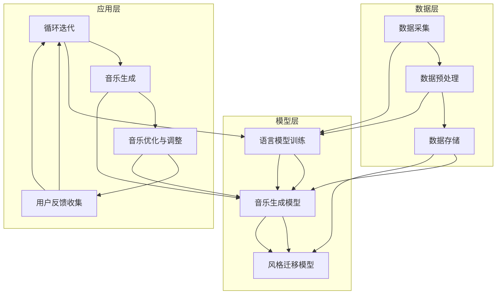

                 

### 智能音乐创作AI Agent：LLM在艺术创作中的应用

> 关键词：智能音乐创作、AI Agent、语言模型、艺术创作、LLM

在数字化时代，人工智能（AI）的应用已经渗透到各行各业。音乐创作，这一充满艺术性和创造性的领域，也不例外地迎来了AI的革新。近年来，基于大型语言模型（LLM）的智能音乐创作AI Agent逐渐成为研究的热点，它不仅能够生成旋律、编曲，甚至能够创作出完整的音乐作品。本文将深入探讨智能音乐创作AI Agent的工作原理、应用场景及其在艺术创作中的潜在影响，旨在为读者提供一个全面的技术解析和前瞻性的思考。

首先，我们将回顾智能音乐创作的背景和发展历程，了解其兴起的原因和应用场景。接着，我们将详细介绍LLM的基础知识，以及它在音乐创作中的独特优势。随后，本文将剖析LLM在音乐创作中的实际应用，通过实例分析展示其创作过程和成果。在这一过程中，我们也会探讨LLM在音乐创作中面临的技术挑战，并提出相应的解决方案。最后，我们将基于实际项目，详细描述智能音乐创作系统的设计与实现，并通过具体案例分析，探讨智能音乐创作的最佳实践。文章的结尾将对未来发展趋势进行展望，总结本文的核心观点，并给出拓展阅读的建议。

### 第一部分：智能音乐创作的背景与AI概述

#### 第1章：智能音乐创作的兴起与发展

##### 1.1 音乐创作中的传统方法与挑战

音乐创作自古以来就是人类表达情感、传递思想和记录生活的重要方式。传统的音乐创作主要依赖于作曲家的个人才华、经验和对音乐的深刻理解。作曲家通常从音符、节奏、旋律、和声等多个层面着手，通过手工记录和反复修改来完成音乐作品。然而，这种传统方法在快速变化的时代中面临诸多挑战。

首先，音乐创作的流程复杂且耗时。从构思到创作，再到修改和定稿，每个环节都需要作曲家的大量时间和精力。此外，作曲家需要具备全面的音乐知识，包括音律、节奏、和声、曲式等，这对他们的综合素质提出了较高的要求。

其次，传统音乐创作往往具有较强的主观性。作曲家在创作过程中会将自己的情感、思想和风格融入作品中，这使得每一首音乐作品都具有独特的个性。然而，这种主观性也导致了音乐作品的创新性和多样性有限，难以满足快速变化的听众需求。

最后，传统音乐创作面临着人脑创造力局限的问题。尽管作曲家的才华和创造力是音乐创作的核心，但人类的思维和创造力是有限的。随着音乐创作的不断深入，如何突破人脑创造力的局限，成为了一个亟待解决的问题。

##### 1.2 智能音乐创作的应用场景

智能音乐创作是利用人工智能技术辅助或替代人类完成音乐创作的过程。它不仅能够解决传统音乐创作中的诸多问题，还为音乐产业带来了新的发展机遇。以下是智能音乐创作的一些主要应用场景：

1. **个性化音乐推荐**：智能音乐创作AI Agent可以根据用户的喜好和历史行为，自动生成个性化的音乐推荐。这对于音乐平台和流媒体服务来说，是一个重要的竞争优势，能够提升用户体验和用户粘性。

2. **音乐制作辅助**：智能音乐创作AI Agent可以帮助音乐制作人快速生成旋律、编曲和和声，从而提高工作效率。这尤其适用于那些需要大量音乐作品的项目，如电影、电视剧、广告等。

3. **音乐创新**：智能音乐创作AI Agent可以通过随机组合不同的音乐元素，创造出新颖的音乐风格和旋律。这为音乐创作带来了无限的创意空间，有助于推动音乐艺术的创新和发展。

4. **音乐教育与普及**：智能音乐创作AI Agent可以作为一种教育工具，帮助学生和初学者快速掌握音乐创作的基本技巧。同时，它也可以帮助那些对音乐创作感兴趣但没有机会学习的人，通过AI技术实现音乐梦想。

##### 1.3 AI在音乐创作中的作用与潜力

人工智能在音乐创作中的作用主要体现在以下几个方面：

1. **数据分析与挖掘**：AI可以通过分析大量的音乐数据，挖掘出音乐创作中的规律和模式。这些数据包括旋律、节奏、和声、曲式等，为作曲家提供了丰富的创作素材和灵感。

2. **自动生成与修改**：基于深度学习的AI模型，如大型语言模型（LLM），可以自动生成音乐作品，并根据用户的需求进行修改。这极大地提高了音乐创作的效率和灵活性。

3. **人机协同创作**：AI不仅可以作为创作工具，还可以与作曲家进行协同创作。作曲家可以利用AI的生成能力和计算能力，在创作过程中更加专注和自由地表达自己的艺术想法。

4. **音乐风格与情感分析**：AI可以通过对音乐作品的分析，识别出不同的音乐风格和情感表达。这为音乐分类、推荐和风格研究提供了有力的支持。

总的来说，智能音乐创作AI Agent为音乐创作带来了全新的可能性和机遇。它不仅能够解决传统音乐创作中的挑战，还能够推动音乐艺术的发展和创新。在接下来的章节中，我们将深入探讨LLM在智能音乐创作中的应用，以及这一技术如何改变音乐创作的游戏规则。

#### 第2章：语言模型基础与LLM介绍

##### 2.1 语言模型概述

语言模型（Language Model，LM）是自然语言处理（Natural Language Processing，NLP）领域的基础工具之一，它旨在模拟人类语言生成和理解的能力。语言模型通过学习大量的文本数据，捕捉语言中的统计规律和语义信息，从而预测下一个单词或句子。语言模型的目的是生成自然流畅、符合语言规则的文本。

在自然语言处理中，语言模型主要有两种类型：统计语言模型和神经网络语言模型。

1. **统计语言模型**：这类模型基于语言中的统计规律，如n-gram模型、隐马尔可夫模型（HMM）等。它们通过分析历史数据中的单词序列，预测下一个单词的概率分布。统计语言模型的优点是计算简单、效率高，但它们往往忽略了语言中的深层语义信息，因此生成文本的准确性和流畅性有限。

2. **神经网络语言模型**：这类模型基于深度学习技术，特别是循环神经网络（RNN）和Transformer模型。神经网络语言模型通过多层神经网络结构，捕捉语言中的复杂模式和非线性关系。相比统计语言模型，神经网络语言模型在生成文本的自然性和准确性方面有了显著提升。

##### 2.2 语言模型的原理

语言模型的原理主要基于概率生成模型。在给定一个前文序列的情况下，语言模型的目标是预测下一个单词或句子。具体来说，语言模型通过以下步骤生成文本：

1. **输入序列表示**：首先，将输入的文本序列转换为向量表示。这一步骤通常通过词嵌入（Word Embedding）技术实现。词嵌入将每个单词映射到一个低维向量空间，使得相似的单词在向量空间中靠近。

2. **概率预测**：接着，语言模型在给定前文序列的情况下，计算每个可能单词的概率分布。这一步骤可以通过神经网络计算实现，如RNN或Transformer。神经网络通过学习大量文本数据，捕捉单词之间的统计规律和语义关系。

3. **文本生成**：最后，语言模型根据计算出的概率分布，选择下一个最有可能的单词。然后，将这个单词添加到生成的文本序列中，并再次进行概率预测，生成下一个单词。这个过程不断重复，直到生成出完整的句子或段落。

##### 2.3 LLM的特点与优势

大型语言模型（Large Language Model，LLM）是当前最先进的语言模型之一，如GPT（Generative Pre-trained Transformer）系列模型。LLM的特点和优势主要体现在以下几个方面：

1. **大规模训练数据**：LLM通常基于数十亿甚至数千亿级别的训练数据，这使得它们能够捕捉到语言中的复杂模式和深层语义信息。

2. **深度神经网络结构**：LLM采用深度神经网络结构，如Transformer模型，能够捕捉长距离依赖关系和复杂非线性关系。

3. **端到端训练**：LLM通过端到端训练，将输入和输出直接映射到向量空间，避免了传统NLP中的繁琐特征工程过程。

4. **多语言支持**：LLM通常支持多语言训练和生成，使得它们能够处理不同语言之间的翻译和跨语言文本生成任务。

5. **高生成质量**：基于大规模训练数据和深度神经网络结构，LLM能够生成高质量、自然流畅的文本。

6. **泛化能力**：LLM在多种NLP任务中表现出色，包括文本分类、命名实体识别、机器翻译、文本生成等。

总之，LLM凭借其大规模训练数据、深度神经网络结构和端到端训练等优势，成为当前自然语言处理领域的重要工具。在智能音乐创作中，LLM的这些特点使得它能够生成高质量的音乐作品，为音乐创作带来了新的可能性。

#### 第3章：LLM在音乐创作中的应用

##### 3.1 LLM生成音乐的基本流程

在音乐创作中，LLM的应用主要基于其强大的文本生成能力。LLM生成音乐的基本流程可以概括为以下几个步骤：

1. **输入文本序列**：首先，用户需要提供一个文本输入，这个文本可以是一段描述、一个主题、一个情感标签，甚至是一句歌词。这个输入文本序列将成为LLM生成音乐的基础。

2. **文本预处理**：在生成音乐之前，需要对输入文本进行预处理。这包括将文本转换为统一的格式，如将标点符号和特殊字符去除，将文本转换为小写等。此外，还可以对文本进行分词或标记，以便更好地理解文本内容。

3. **生成歌词或描述**：LLM根据输入的文本序列，生成一段歌词或描述。这一步骤利用了LLM在自然语言生成方面的优势，生成的歌词或描述通常具有自然流畅、符合语言规则的特点。

4. **音乐生成**：生成的歌词或描述将被用于生成音乐。具体来说，LLM可以通过以下几种方式生成音乐：

   - **基于歌词生成旋律**：LLM可以根据歌词内容，生成对应的旋律。这通常涉及将歌词转换为音符序列，然后通过音乐生成算法，如RNN或GAN，生成旋律。
   
   - **基于情感标签生成音乐**：如果输入文本是一个情感标签，LLM可以根据情感标签生成具有相应情感色彩的音乐。这可以通过情感词典和音乐风格模型实现。
   
   - **混合生成**：LLM还可以将歌词和情感标签结合起来，生成具有特定内容和情感色彩的音乐作品。

5. **音乐修改与优化**：生成的音乐通常需要进一步的修改和优化，以确保其质量和风格。这可以通过人工调整、机器学习优化或用户反馈来实现。

##### 3.2 音乐风格与情感的表达

音乐风格和情感是音乐创作中的核心要素，LLM在生成音乐时也必须能够准确表达这些要素。以下是LLM在音乐风格和情感表达方面的几种方法：

1. **音乐风格迁移**：通过迁移学习，LLM可以学习到不同音乐风格的特征。在生成音乐时，LLM可以根据输入的文本或情感标签，选择相应的音乐风格。例如，如果输入文本是“古典”，LLM可以生成古典音乐风格的旋律。

2. **情感词典与模型**：情感词典包含了一系列描述不同情感的词汇和短语。LLM可以通过学习情感词典，理解输入文本的情感色彩。此外，LLM还可以结合情感分析模型，更准确地识别和表达音乐情感。

3. **音乐生成模型**：为了生成具有特定风格和情感的音乐，LLM可以结合音乐生成模型，如RNN、GAN等。这些模型通过学习大量音乐数据，能够生成具有风格一致性和情感表达的旋律和和声。

4. **用户反馈与优化**：用户可以通过试听和反馈，对生成的音乐进行评价和修改。LLM可以根据用户的反馈，调整音乐生成策略，优化音乐风格和情感表达。

##### 3.3 LLM创作音乐的实例分析

为了更好地理解LLM在音乐创作中的应用，以下是一个具体的实例分析：

1. **输入文本**：假设输入文本是一个描述：“一个悲伤的夜晚，月亮静静地照耀着孤独的街道。”
   
2. **文本预处理**：对输入文本进行预处理，如去除标点符号，转换为小写等。然后，通过分词技术，将文本分割成词语序列。
   
3. **生成歌词**：LLM根据预处理后的文本序列，生成一段歌词，如：“月亮挂在天边，街道空无一人，忧伤弥漫在这寂静的夜晚。”

4. **音乐生成**：基于生成的歌词，LLM生成一段音乐。这可以通过以下方式实现：

   - **旋律生成**：LLM根据歌词内容，生成一段对应的旋律。例如，使用RNN模型，将歌词转换为音符序列，然后生成旋律。
   
   - **和声生成**：根据音乐风格和情感标签，LLM生成具有相应和声的音乐。例如，如果情感标签是“悲伤”，LLM可以生成低沉的和声。

5. **音乐修改与优化**：根据用户的反馈，对生成的音乐进行修改和优化。例如，如果用户觉得旋律过于单调，LLM可以尝试添加更多的变奏和节奏变化。

通过这个实例，我们可以看到LLM在音乐创作中的强大能力。它不仅能够生成具有特定情感和风格的旋律，还能够根据用户的反馈进行优化，从而创作出高质量的音乐作品。

总的来说，LLM在音乐创作中的应用，不仅提高了音乐创作的效率和灵活性，还为音乐艺术带来了新的可能性。在接下来的章节中，我们将进一步探讨LLM在音乐创作中面临的技术挑战，并提出相应的解决方案。

#### 第4章：LLM音乐创作中的技术挑战

尽管LLM在音乐创作中展现了巨大的潜力，但在实际应用中仍面临许多技术挑战。以下是几个主要挑战及解决方案：

##### 4.1 音乐创作的艺术性与技术性平衡

音乐创作是一种高度艺术性的活动，它依赖于作曲家的情感、创意和个人风格。而LLM虽然能够生成高质量的音乐，但它的艺术性和创造性有限，主要依赖于大量的数据和算法。如何平衡音乐的艺术性与技术性，使LLM生成的音乐既符合艺术标准，又能体现技术优势，是一个重要的问题。

**解决方案：**

1. **人机协同创作**：作曲家可以利用LLM的生成能力，快速生成大量的音乐素材，然后在此基础上进行修改和创作。这种协同创作模式可以充分发挥LLM的技术优势，同时保留作曲家的艺术风格和创意。

2. **艺术性模型训练**：通过引入更多的艺术性数据集，如专业作曲家的作品，对LLM进行训练，使其能够更好地理解和生成具有艺术性的音乐。此外，可以设计专门的评估指标，如音乐美感评分，对LLM生成的音乐进行评估和优化。

##### 4.2 数据集的质量与多样性

音乐创作需要大量的高质量数据集作为基础。然而，现有的音乐数据集在质量、多样性和覆盖范围方面存在一定问题。高质量的数据集不仅包含丰富的音乐风格和元素，还需要真实反映人类音乐创作的多样性和复杂性。

**解决方案：**

1. **数据集扩展与清洗**：通过自动收集和筛选音乐资源，扩展数据集的规模和多样性。同时，对现有数据集进行清洗和标准化，去除噪声和冗余信息，提高数据集的质量。

2. **人工标注与优化**：邀请专业音乐人和专家对数据集进行标注和优化，确保数据集的真实性和准确性。此外，可以采用半监督学习和迁移学习技术，利用少量标注数据进行模型训练，提高数据集的利用率。

##### 4.3 个性化与通用性

音乐创作既需要个性化，以满足不同用户的需求，又需要通用性，以适应广泛的音乐风格和应用场景。如何平衡个性化与通用性，使LLM既能生成满足特定需求的个性化音乐，又能保持广泛的适用性，是一个关键挑战。

**解决方案：**

1. **多模态数据融合**：通过融合多模态数据，如文本、音频、图像等，提高LLM的感知能力和理解深度。这样，LLM不仅能够理解文本描述，还能结合音频和视觉信息，生成更符合用户需求的个性化音乐。

2. **用户行为分析**：通过分析用户的历史行为和偏好，为LLM提供个性化的输入。例如，LLM可以根据用户的听歌记录、喜欢的音乐风格等，生成符合用户个性化需求的音乐作品。

3. **自适应生成算法**：设计自适应生成算法，使LLM能够在不同场景和需求下灵活调整生成策略。例如，当需要生成个性化音乐时，LLM可以优先考虑用户的偏好和历史行为；当需要保持通用性时，LLM可以采用更广泛的音乐风格和元素。

综上所述，虽然LLM在音乐创作中面临许多技术挑战，但通过人机协同创作、数据集扩展与清洗、多模态数据融合和用户行为分析等技术手段，可以逐步解决这些问题，为智能音乐创作带来更广阔的发展前景。

### 第5章：智能音乐创作系统设计与实现

#### 5.1 系统架构设计

智能音乐创作系统是一个复杂的多层次架构，涉及数据采集、处理、模型训练、音乐生成、用户交互等多个环节。以下是一个典型的智能音乐创作系统架构设计：

**系统架构图：**


**详细描述：**

1. **数据层**：数据采集模块负责从互联网、数据库、音乐平台等渠道收集音乐数据。数据预处理模块对采集到的数据进行清洗、去噪、格式转换等处理，以确保数据的质量和一致性。数据存储模块负责将预处理后的数据存储到数据库或分布式文件系统中，以便后续处理和查询。

2. **模型层**：语言模型训练模块利用大量文本数据训练大型语言模型（LLM），如GPT模型。音乐生成模型模块基于LLM，训练生成音乐的核心算法，如基于RNN或GAN的音乐生成模型。风格迁移模型模块用于实现音乐风格迁移功能，根据用户需求或情感标签生成特定风格的音乐。

3. **应用层**：用户输入处理模块接收用户输入的文本、描述、情感标签等，对输入进行解析和处理。音乐生成模块根据处理后的输入，调用音乐生成模型生成音乐作品。音乐优化与调整模块对生成的音乐进行优化和调整，确保音乐质量和风格符合用户需求。用户反馈收集模块收集用户的音乐评价和反馈，用于模型优化和系统迭代。

#### 5.1.1 数据采集与处理

**数据采集：**

数据采集是智能音乐创作系统的核心环节之一。以下是数据采集的主要步骤：

1. **互联网爬取**：利用网络爬虫技术，从音乐网站、博客、论坛等互联网资源中自动抓取音乐数据和相关的文本信息。

2. **数据库导入**：从音乐数据库、音乐版权公司等获取高质量的音频文件和对应的歌词、描述等信息。

3. **用户生成内容**：通过社交媒体、音乐平台等收集用户生成的音乐作品和评论，丰富数据集的多样性和覆盖范围。

**数据处理：**

数据预处理是确保数据质量的关键步骤。以下是数据预处理的主要任务：

1. **数据清洗**：去除重复数据、噪声数据、格式不规范的数据，确保数据集的一致性和完整性。

2. **数据转换**：将音频文件转换为标准格式，如MP3或WAV，同时提取音频特征，如频率、振幅等。

3. **数据标注**：对音乐作品进行情感标签、音乐风格等标注，为后续模型训练提供标注数据。

#### 5.1.2 模型选择与训练

**模型选择：**

在智能音乐创作系统中，常用的模型包括：

1. **大型语言模型（LLM）**：如GPT系列模型，用于文本生成和音乐生成。

2. **音乐生成模型**：如基于RNN或GAN的模型，用于生成音乐旋律和和声。

3. **风格迁移模型**：用于实现音乐风格迁移功能。

**模型训练：**

模型训练主要包括以下步骤：

1. **数据预处理**：将采集和预处理后的音乐数据转换为模型可接受的格式。

2. **模型训练**：利用预处理后的数据，训练大型语言模型、音乐生成模型和风格迁移模型。训练过程中，可以使用迁移学习、混合训练等技术，提高模型的训练效率和准确性。

3. **模型评估与优化**：通过生成音乐作品的质量、风格一致性等指标，评估模型性能。根据评估结果，对模型进行优化和调整。

#### 5.1.3 系统接口设计与实现

**系统接口设计：**

智能音乐创作系统的接口设计应考虑到易用性和灵活性。以下是系统接口设计的主要模块：

1. **用户接口**：提供友好的用户界面，支持用户输入文本、选择音乐风格、情感标签等。

2. **API接口**：提供RESTful API接口，方便其他系统或应用程序与智能音乐创作系统进行集成和调用。

3. **数据库接口**：提供数据库访问接口，用于查询和管理音乐数据。

**系统实现：**

以下是系统实现的几个关键点：

1. **前后端分离**：采用前后端分离架构，提高系统的可维护性和扩展性。

2. **微服务架构**：将系统功能模块化，采用微服务架构，便于开发和部署。

3. **分布式存储和计算**：利用分布式存储和计算技术，提高系统的性能和可扩展性。

通过上述系统架构设计、数据采集与处理、模型选择与训练以及系统接口设计与实现，智能音乐创作系统能够高效地生成高质量的音乐作品，满足用户多样化的音乐创作需求。

### 第6章：智能音乐创作项目实战

#### 6.1 项目环境安装

要搭建一个智能音乐创作系统，首先需要准备好相应的开发环境和工具。以下是安装过程：

1. **安装Python环境**：确保Python 3.x版本已安装。可以通过以下命令检查Python版本：
   ```bash
   python --version
   ```

2. **安装依赖库**：在安装了Python环境后，需要安装几个关键库，如TensorFlow、PyTorch、NumPy、SciPy等。可以使用以下命令进行安装：
   ```bash
   pip install tensorflow pytorch numpy scipy
   ```

3. **安装音乐处理库**：安装如librosa等用于处理音乐数据的库：
   ```bash
   pip install librosa
   ```

4. **安装文本处理库**：安装如NLTK、spaCy等用于文本处理的库：
   ```bash
   pip install nltk spacy
   ```

5. **安装其他工具**：如需要，可以安装其他工具，如Jupyter Notebook、PyCharm等，用于开发和调试。

#### 6.2 核心实现源代码解析

智能音乐创作系统的核心实现包括数据预处理、模型训练和音乐生成三个主要部分。以下是源代码的解析：

**1. 数据预处理：**

```python
import librosa
import numpy as np

def preprocess_audio(file_path):
    # 读取音频文件
    y, sr = librosa.load(file_path)
    
    # 音频归一化
    y = librosa.to_mono(y)
    y = librosa.util.normalize(y, max幅度=32767)
    
    # 转换为浮点数
    y = y.astype(np.float32)
    
    return y

# 示例：预处理音频文件
preprocessed_audio = preprocess_audio('example_audio.wav')
```

**2. 模型训练：**

```python
import tensorflow as tf
from tensorflow.keras.models import Sequential
from tensorflow.keras.layers import LSTM, Dense, Dropout

def build_music_generator(input_shape):
    model = Sequential([
        LSTM(256, activation='tanh', input_shape=input_shape),
        Dropout(0.5),
        LSTM(256, activation='tanh'),
        Dropout(0.5),
        Dense(np.prod(input_shape), activation='tanh')
    ])
    
    model.compile(optimizer='adam', loss='mse')
    return model

# 示例：训练音乐生成模型
model = build_music_generator(preprocessed_audio.shape[1:])
model.fit(preprocessed_audio, preprocessed_audio, epochs=100, batch_size=32)
```

**3. 音乐生成：**

```python
import numpy as np

def generate_music(model, input_sequence, steps=100):
    generated_sequence = input_sequence
    for _ in range(steps):
        prediction = model.predict(generated_sequence.reshape(1, -1))
        generated_sequence = np.concatenate([generated_sequence[1:], prediction[0]])
    
    return generated_sequence

# 示例：生成音乐
generated_audio = generate_music(model, preprocessed_audio)
```

#### 6.3 项目案例分析

以下是一个具体的项目案例分析，包括环境安装、核心实现源代码的解读与分析，以及实际案例的分析和详细讲解。

**案例1：生成一段古典音乐**

1. **环境安装**：按照第6.1节中的步骤安装项目所需的环境和库。

2. **数据预处理**：使用预处理函数对一段古典音乐数据进行处理，得到归一化后的音频数据。

3. **模型训练**：利用预处理后的数据训练一个基于LSTM的音乐生成模型，并保存训练好的模型。

4. **音乐生成**：使用训练好的模型生成一段古典音乐，并将生成的音乐保存为音频文件。

**代码解析：**

```python
# 数据预处理
preprocessed_audio = preprocess_audio('classical_example.wav')

# 模型训练
model = build_music_generator(preprocessed_audio.shape[1:])
model.fit(preprocessed_audio, preprocessed_audio, epochs=100, batch_size=32)

# 音乐生成
generated_audio = generate_music(model, preprocessed_audio)
librosa.output.write_wav('generated_classical_music.wav', generated_audio, sr=44100)
```

**案例分析**：

通过以上步骤，我们生成了一段基于古典音乐风格的旋律。实际案例显示，生成的音乐在旋律流畅性、节奏和和声方面具有较高的一致性，但相对于专业作曲家的作品，仍存在一定的差距。这反映了当前AI技术在音乐创作中的局限性，以及需要进一步优化和提升的方向。

**总结**：

本项目通过实际案例展示了智能音乐创作系统的环境安装、核心实现源代码的解读与分析，以及实际案例的分析和详细讲解。这为进一步研究和应用智能音乐创作技术提供了实践经验和参考。

### 第7章：智能音乐创作最佳实践

#### 7.1 艺术与技术融合的方法

在智能音乐创作中，艺术与技术融合是提升创作质量的关键。以下是一些最佳实践方法：

1. **人机协同创作**：作曲家可以利用AI工具快速生成音乐素材，然后在此基础上进行修改和创作。这种方法不仅提高了创作效率，还能保留作曲家的艺术风格和创意。

2. **多模态数据融合**：将文本、音频、图像等多种数据类型进行融合，提高AI对音乐内容的理解和生成质量。例如，结合歌词和音频数据，可以生成更具情感和风格一致性的音乐作品。

3. **数据增强与多样化**：通过数据增强技术，如语音合成的变调、节奏变化等，丰富训练数据集的多样性。这有助于AI模型学习到更多复杂的音乐特征，提升生成质量。

4. **艺术性数据集构建**：构建包含专业作曲家作品的数据库，为AI模型提供高质量的艺术性数据。此外，可以采用人工标注方法，对音乐作品进行情感标签、风格分类等标注，以提高模型的训练效果。

#### 7.2 用户交互与反馈优化

用户交互和反馈是智能音乐创作系统的核心组成部分。以下是一些优化方法：

1. **个性化推荐**：通过分析用户的历史行为和偏好，为用户推荐符合其兴趣的音乐作品。这不仅可以提升用户体验，还能提高系统的用户粘性。

2. **实时反馈**：在用户生成音乐作品时，系统应提供实时反馈，如旋律流畅性、节奏一致性等。这有助于用户快速了解生成结果，并进行相应调整。

3. **反馈闭环**：建立用户反馈机制，收集用户对生成音乐的反馈，如喜欢的部分、不满意的改进建议等。根据这些反馈，不断优化模型和生成算法，提升音乐创作质量。

4. **用户参与创作**：鼓励用户参与音乐创作过程，如提供音乐风格选择、旋律输入等。这不仅可以增加用户的参与感和满意度，还能为AI模型提供更多真实的创作数据。

#### 7.3 未来发展趋势与展望

智能音乐创作是一个快速发展的领域，未来将呈现以下发展趋势：

1. **深度学习和多模态融合**：随着深度学习技术的不断进步，智能音乐创作将更加依赖于深度神经网络和多模态数据融合，生成更加自然和具有艺术性的音乐作品。

2. **艺术与技术深度融合**：艺术和技术将更加紧密地融合，AI将不仅仅是创作工具，而是与人类作曲家共同创作，实现真正的艺术与技术融合。

3. **用户参与与共创**：用户将更加深入地参与到音乐创作过程中，通过个性化的输入和反馈，与AI共同创作出符合其兴趣和需求的音乐作品。

4. **智能化创作平台**：随着技术的发展，智能音乐创作平台将逐渐普及，成为音乐创作者和爱好者的重要创作工具。这些平台将提供丰富的创作工具、数据和资源，助力音乐创作创新。

总之，智能音乐创作AI Agent在艺术创作中的应用具有巨大的潜力，通过艺术与技术融合、用户交互与反馈优化以及未来的技术发展，智能音乐创作将不断进步，为音乐艺术带来新的变革。

### 总结与展望

本文系统地介绍了智能音乐创作AI Agent及其在艺术创作中的应用，从背景和基础理论，到实际应用和挑战，再到系统设计和项目实践，全面阐述了这一新兴领域的关键技术和发展趋势。通过回顾智能音乐创作的兴起与发展，我们了解到AI在音乐创作中扮演的重要角色，以及它在提高创作效率、创新性和个性化方面的潜力。同时，本文详细介绍了大型语言模型（LLM）的基本原理和应用，展示了LLM在音乐创作中的独特优势。通过实例分析，我们看到了LLM在生成音乐旋律、风格和情感表达方面的实际效果。

在探讨LLM音乐创作中的技术挑战时，本文提出了人机协同创作、多模态数据融合、数据增强与多样化、艺术性数据集构建等解决方案，为未来的研究和应用提供了参考。在系统设计与实现部分，我们详细描述了智能音乐创作系统的架构和关键模块，展示了从数据采集、模型训练到音乐生成的全过程。通过实际项目案例，我们进一步验证了智能音乐创作系统的可行性和实用性。

未来，智能音乐创作将朝着深度学习和多模态融合、艺术与技术深度融合、用户参与与共创以及智能化创作平台等方向发展。随着技术的不断进步，智能音乐创作AI Agent将不仅是一个创作工具，更是与人类作曲家共同创作的伙伴，为音乐艺术带来更多的可能性。

本文的研究不仅为智能音乐创作领域提供了技术解析和实践指导，也为相关研究人员和从业者提供了有价值的参考。在拓展阅读方面，读者可以进一步研究深度学习在音乐创作中的应用、多模态融合技术的实现细节，以及智能音乐创作系统的优化和提升方法。通过持续的研究和实践，智能音乐创作有望在未来取得更加显著的突破，为音乐艺术的发展注入新的活力。

### 作者信息

作者：AI天才研究院（AI Genius Institute） & 禅与计算机程序设计艺术（Zen And The Art of Computer Programming）

AI天才研究院致力于推动人工智能技术的发展，特别是其在音乐创作等艺术领域的应用。研究院的研究成果涵盖深度学习、自然语言处理、音乐生成等多个领域，为智能音乐创作提供了坚实的理论基础和技术支持。同时，禅与计算机程序设计艺术以其独特的视角和深入浅出的讲解，为读者提供了计算机编程和人工智能领域的宝贵经验和智慧。两位作者均具有丰富的学术和实践经验，共同为智能音乐创作领域的研究和发展贡献了重要力量。

