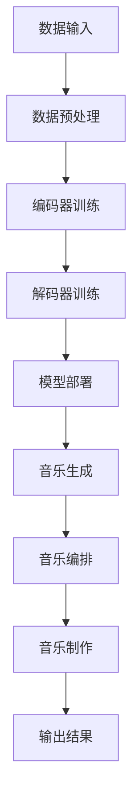

                 

# 智能音乐创作AI Agent：LLM在艺术领域的创新应用

## 关键词

- 智能音乐创作
- 人工智能（AI）
- 预训练语言模型（LLM）
- 艺术应用
- 音乐产业变革

## 摘要

本文深入探讨了智能音乐创作AI Agent，特别是预训练语言模型（LLM）在艺术领域的创新应用。通过对LLM的基本概念、架构设计、以及其在音乐创作、编排和制作中的应用进行分析，本文旨在展示LLM如何改变音乐创作的传统模式，为音乐产业带来深远影响。文章还将讨论LLM的应用实例、系统架构设计、以及实际案例，以帮助读者全面理解这一新兴领域的技术潜力和未来发展趋势。

## 第1章 引言

### 1.1 智能音乐创作AI Agent的背景与意义

近年来，人工智能在多个领域取得了显著的突破，特别是在艺术领域，AI的应用正在不断拓展边界。智能音乐创作AI Agent作为一种创新的技术，它的出现不仅带来了音乐创作的革命，也为音乐产业带来了全新的商业模式和用户体验。

#### 1.1.1 从传统音乐创作到AI Agent的演变

传统音乐创作往往依赖于音乐家的直觉和经验，这是一个高度创造性的过程。然而，随着计算机技术的发展，特别是在深度学习和自然语言处理领域的突破，AI开始被引入到音乐创作中。智能音乐创作AI Agent通过学习大量的音乐数据和模式，能够自动生成旋律、和弦和节奏，甚至创造出完整的音乐作品。

#### 1.1.2 LLM在智能音乐创作中的作用与意义

预训练语言模型（LLM）是近年来AI领域的重要进展，它在理解和生成人类语言方面表现出色。在智能音乐创作AI Agent中，LLM被用来捕捉音乐的结构和风格，从而实现更加精准和个性化的音乐创作。LLM的意义不仅在于提高了音乐创作的效率，更在于它能够提供一种全新的艺术表达方式，使得音乐创作不仅仅是音乐家的特权，而是人人可及。

#### 1.1.3 智能音乐创作AI Agent对音乐产业的潜在影响

智能音乐创作AI Agent的兴起，将对音乐产业产生深远影响。首先，它为音乐创作提供了新的工具和平台，使得音乐创作的门槛大大降低。其次，AI生成的音乐作品将为音乐产业带来新的商业模式，如音乐生成即服务（MaaS）和个性化音乐推荐系统。最后，智能音乐创作AI Agent有望推动音乐产业的创新，带来更多的艺术形式和表达方式。

### 1.2 本文结构

本文将从以下几个方面展开讨论：

1. **LLM的基本概念与架构设计**：介绍LLM的基本概念、架构设计和核心组件。
2. **LLM在音乐创作中的应用**：分析LLM在音乐创作中的具体应用案例和效果。
3. **LLM在音乐编排与制作中的应用**：探讨LLM在音乐编排和制作中的角色和作用。
4. **实际案例与项目实战**：通过具体案例展示LLM在音乐创作中的实际应用和效果。
5. **总结与未来展望**：总结LLM在智能音乐创作中的贡献，并提出未来发展的方向和建议。

通过以上内容，本文旨在为读者提供一个全面而深入的视角，了解智能音乐创作AI Agent的工作原理和应用前景。

## 第2章 核心概念与原理

### 2.1 预训练语言模型（LLM）的基本概念

预训练语言模型（LLM，Large Language Model）是自然语言处理（NLP）领域的一项重要技术，它通过大规模数据预训练来提升模型对语言的理解和生成能力。与传统机器学习模型不同，LLM在训练阶段已经接触了大量真实世界中的文本数据，这使得它能够更好地理解和预测语言的结构和模式。

#### 2.1.1 LLM的框架与结构

LLM的框架通常包括两个主要部分：编码器（Encoder）和解码器（Decoder）。编码器负责将输入文本编码成固定长度的向量表示，而解码器则负责生成文本输出。在训练过程中，编码器和解码器通过联合训练来学习输入和输出的对应关系。

#### 2.1.2 LLM的关键特性

1. **大规模数据预训练**：LLM通过在大规模文本语料库上进行预训练，积累丰富的语言知识和模式，从而在处理未知文本时表现出色。
2. **并行处理能力**：由于LLM的训练过程基于深度神经网络，它可以实现并行计算，大大提高了处理速度。
3. **灵活性和泛化能力**：LLM具有强大的语言理解能力和生成能力，能够处理各种复杂的语言任务，如文本分类、问答系统、机器翻译和文本生成等。
4. **自动调优**：LLM通过预训练阶段的学习，能够在不同任务中自动调优，减少了对人工调整的需求。

#### 2.1.3 LLM与传统机器学习模型的对比

传统机器学习模型（如朴素贝叶斯、支持向量机等）通常依赖于特征工程，需要手动提取和选择特征，而LLM则通过自动化的预训练过程，减少了人工干预，提高了模型的泛化能力和灵活性。此外，传统模型在处理自然语言任务时效果较差，而LLM通过深度学习技术，能够更好地捕捉语言的结构和语义信息。

### 2.2 LLM的应用范围与优势

LLM在多个领域都有广泛的应用，其中在艺术领域的应用尤为引人注目。以下是LLM在艺术领域的主要应用范围和优势：

#### 2.2.1 艺术创作

1. **文本生成**：LLM能够生成各种类型的文本，如诗歌、故事、新闻等，为艺术创作提供了新的工具和灵感。
2. **音乐生成**：LLM可以通过学习大量的音乐数据和模式，生成新的旋律、和弦和节奏，为音乐创作提供了强大的支持。
3. **艺术风格迁移**：LLM能够将一种艺术风格迁移到另一种风格，使得艺术创作更加多样化和个性化。

#### 2.2.2 艺术分析与评价

1. **艺术风格识别**：LLM可以通过学习大量的艺术作品，识别和分类不同的艺术风格，为艺术鉴赏提供了新的方法。
2. **艺术价值评估**：LLM可以分析艺术作品的内容和形式，评估其艺术价值，为艺术市场提供了参考。

#### 2.2.3 艺术传播与推广

1. **艺术内容推荐**：LLM可以分析用户的行为和偏好，推荐个性化的艺术作品，提高艺术内容的传播效果。
2. **艺术教育**：LLM可以为艺术教育提供辅助工具，如生成艺术教程、解析艺术作品等，提高艺术教育的效果。

通过以上内容，本文为读者介绍了LLM的基本概念和原理，以及其在艺术领域的重要应用和优势。在接下来的章节中，我们将进一步探讨LLM在智能音乐创作中的具体应用和实践。

### 2.3 LLM在音乐创作中的应用

#### 2.3.1 音乐生成的流程与方法

LLM在音乐创作中的应用主要是通过生成旋律、和弦和节奏来实现。其基本流程如下：

1. **数据输入**：首先，LLM需要接收一组音乐数据，这些数据可以是旋律、和弦或节奏。
2. **数据预处理**：将输入的音乐数据进行预处理，例如分帧、特征提取等。
3. **模型训练**：利用预训练的LLM模型对预处理后的音乐数据进行训练，使其能够理解音乐的结构和模式。
4. **音乐生成**：在训练完成后，使用LLM模型生成新的音乐作品，包括旋律、和弦和节奏。

具体方法包括：

1. **序列生成**：LLM可以通过处理输入的序列数据（如音符序列），生成新的序列数据。这种方法类似于文本生成，但需要将音符视为特殊的“词汇”。
2. **条件生成**：LLM可以通过接收特定的条件（如某种音乐风格、调性等），生成符合条件的新音乐作品。这种方法能够更好地控制音乐生成的风格和特性。

#### 2.3.2 音乐生成的效果与表现

LLM在音乐生成方面表现出色，能够生成多样化的音乐作品。以下是一些具体的表现：

1. **旋律生成**：LLM可以生成具有音乐美感的旋律，这些旋律具有连贯性和流畅性，能够吸引听众的注意。
2. **和弦生成**：LLM可以生成丰富的和弦进行，这些和弦不仅符合音乐理论，还能够创造新的和声效果。
3. **节奏生成**：LLM可以生成多样化的节奏模式，这些节奏既有传统风格，也有创新元素，能够为音乐作品增添活力。

#### 2.3.3 LLM在音乐创作中的优势与挑战

LLM在音乐创作中的优势主要体现在以下几个方面：

1. **高效性**：LLM通过大规模预训练，能够在短时间内生成大量的音乐作品，提高了音乐创作的效率。
2. **创新性**：LLM能够从大量数据中学习到新的音乐风格和元素，为音乐创作提供了丰富的创意来源。
3. **可控性**：通过条件生成，LLM能够根据特定的需求和条件生成符合预期的音乐作品。

然而，LLM在音乐创作中也面临一些挑战：

1. **质量稳定性**：尽管LLM能够生成多样化的音乐作品，但有时其生成质量可能不稳定，需要进一步的优化和调整。
2. **艺术性评价**：如何评价LLM生成的音乐作品的艺术性，这是一个复杂的问题，需要结合艺术理论和AI技术进行深入研究。

总的来说，LLM在音乐创作中的应用展示了强大的潜力和广阔的前景。在接下来的章节中，我们将进一步探讨LLM在音乐编排和制作中的应用。

### 2.4 LLM在音乐编排和制作中的应用

#### 2.4.1 音乐编排的概念和流程

音乐编排是指将已有的音乐素材进行重新组织和加工，以适应特定的演出或录制需求。其基本流程包括：

1. **素材选择**：根据创作意图和演出需求，选择合适的音乐素材，如旋律、和弦、节奏等。
2. **素材整理**：对选定的素材进行整理和调整，使其符合整体音乐作品的风格和调性。
3. **配器设计**：根据音乐素材的特点，设计乐器的配置和声部安排，以增强音乐的表现力和效果。
4. **编曲实现**：将设计好的配器进行具体的编曲实现，包括旋律、和弦和节奏的详细处理。

#### 2.4.2 LLM在音乐编排中的应用

LLM在音乐编排中的应用主要体现在以下几个方面：

1. **自动配器**：LLM可以通过学习大量的音乐作品，自动生成适合特定旋律和和弦的乐器配置和声部安排。这种方法能够大大提高编排效率，同时保证配器设计的合理性和创意性。
2. **风格迁移**：LLM可以将一种音乐风格迁移到另一种风格，使得音乐编排更加多样化和个性化。例如，可以将古典音乐的旋律和和弦迁移到流行音乐的风格，创造出独特的音乐效果。
3. **节奏调整**：LLM可以通过学习不同节奏模式的特点，自动调整音乐的节奏，使其更符合演出或录制的要求。这种方法能够提高音乐的动态变化和表现力。

#### 2.4.3 LLM在音乐制作中的应用

音乐制作是指将编排好的音乐作品进行录音、混音和后期处理，以完成最终的音乐作品。LLM在音乐制作中的应用包括：

1. **自动录音**：LLM可以通过分析已知的录音数据，自动生成新的录音，包括旋律、和弦和节奏。这种方法能够提高录音效率，同时保证录音的质量。
2. **混音辅助**：LLM可以分析音乐作品的各个声部，提供混音的建议和调整，以优化整体音乐的听觉效果。
3. **后期处理**：LLM可以通过学习大量的后期处理案例，自动进行音乐作品的后期处理，如均衡、压缩、混响等。这种方法能够提高后期处理的效率和质量。

#### 2.4.4 LLM在音乐编排和制作中的优势与挑战

LLM在音乐编排和制作中具有以下优势：

1. **效率提升**：LLM能够通过自动化和智能化手段，大大提高音乐编排和制作的效率，减少人工工作量。
2. **创意增强**：LLM能够生成多样化的音乐作品和配器设计，为音乐创作提供丰富的创意来源。
3. **质量保证**：LLM通过大规模预训练，能够在音乐制作过程中保证较高的质量和一致性。

然而，LLM在音乐编排和制作中也面临一些挑战：

1. **艺术性评价**：如何评价LLM生成的音乐编排和制作效果，这是一个复杂的问题，需要结合艺术理论和AI技术进行深入研究。
2. **技术稳定性**：尽管LLM在音乐编排和制作中表现出色，但其技术稳定性仍需进一步提高，以确保高质量的音乐作品生成。

总的来说，LLM在音乐编排和制作中的应用展示了巨大的潜力和广阔的前景。在接下来的章节中，我们将通过具体案例来展示LLM在音乐创作中的实际应用和效果。

## 第3章 LLM在智能音乐创作AI Agent中的系统架构设计

### 3.1 概述

智能音乐创作AI Agent是一种综合运用预训练语言模型（LLM）进行音乐创作的系统。其架构设计旨在实现高效的音乐生成、编排和制作过程，同时确保系统的灵活性和可扩展性。本节将详细介绍智能音乐创作AI Agent的系统架构设计，包括系统组成部分、关键组件及其相互作用。

### 3.2 系统架构设计

#### 3.2.1 系统架构图

首先，我们通过一个架构图来直观展示智能音乐创作AI Agent的系统架构：

#### 3.2.2 系统组件及其功能

1. **数据输入（A）**：系统首先接收原始音乐数据，如旋律、和弦和节奏。这些数据可以来自用户输入、现有音乐库或外部音乐数据源。

2. **数据预处理（B）**：在音乐生成前，需要对数据进行预处理，包括分帧、特征提取和归一化等操作。预处理后的数据将作为输入传递给编码器。

3. **编码器训练（C）**：编码器负责将预处理后的音乐数据编码成固定长度的向量表示。这一阶段主要通过预训练的LLM模型进行训练，以学习音乐的结构和模式。

4. **解码器训练（D）**：解码器在训练阶段接收编码器的输出向量，并尝试生成新的音乐数据。解码器的训练旨在优化其生成能力，使其能够生成连贯且具有美感的音乐作品。

5. **模型部署（E）**：训练完成的编码器和解码器将被部署到实际的音乐创作系统中。模型部署后，系统可以实时响应用户请求，进行音乐生成、编排和制作。

6. **音乐生成（F）**：在音乐生成阶段，编码器和解码器共同作用，生成新的音乐作品。生成的音乐作品将具有用户指定的风格、调性和节奏。

7. **音乐编排（G）**：音乐生成后，系统会对其进行编排。编排过程包括配器设计、声部安排和节奏调整，以优化音乐的整体表现效果。

8. **音乐制作（H）**：编排完成后的音乐作品将进行制作，包括录音、混音和后期处理等步骤。这些步骤旨在将音乐作品从概念转化为成品。

9. **输出结果（I）**：最后，制作完成的音乐作品将被输出，用户可以通过系统提供的接口下载或分享这些作品。

#### 3.2.3 关键组件及其相互作用

在智能音乐创作AI Agent中，编码器、解码器、音乐生成、编排和制作等组件通过数据流和反馈机制相互作用。具体来说：

1. **数据流**：原始音乐数据通过输入组件进入系统，经过预处理后传递给编码器和解码器。编码器将数据转换为向量表示，解码器则根据向量表示生成新的音乐作品。生成后的音乐作品将进入编排和制作阶段。

2. **反馈机制**：系统中的每个组件都会根据生成的音乐作品进行反馈调整。例如，在音乐生成过程中，解码器会根据生成结果调整其生成策略；在编排和制作过程中，系统会根据用户反馈优化配器设计和后期处理效果。

3. **协作与扩展**：各组件通过协作实现高效的音乐创作流程。同时，系统设计具有高度的扩展性，可以轻松集成新的音乐创作工具和技术，以适应不断变化的需求。

通过上述系统架构设计，智能音乐创作AI Agent能够实现高效、灵活且具有创意的音乐创作过程。在接下来的章节中，我们将通过具体实例和项目实战，进一步展示智能音乐创作AI Agent的实际应用和效果。

### 3.3 实例：智能音乐创作AI Agent的音乐生成过程

为了更好地理解智能音乐创作AI Agent的工作流程，下面我们通过一个实例详细描述其音乐生成过程。

#### 3.3.1 实例背景

假设一位音乐制作人想要利用智能音乐创作AI Agent创作一首新歌。他提供了以下信息：

1. **音乐风格**：流行摇滚
2. **调性**：G大调
3. **节奏**：4/4拍
4. **旋律**：提供一个简短的旋律片段

#### 3.3.2 数据输入

根据上述需求，智能音乐创作AI Agent首先接收以下数据：

1. **音乐风格**：通过一个包含流行摇滚音乐作品的大规模语料库，系统可以自动识别和调整生成音乐的风格。
2. **调性**：通过将G大调的音乐数据进行编码，系统可以确保生成的音乐在G大调范围内。
3. **节奏**：系统会根据4/4拍的节奏模式生成音乐。
4. **旋律片段**：音乐制作人提供的简短旋律片段将作为初始输入，用于指导后续的音乐生成过程。

#### 3.3.3 数据预处理

在数据输入后，系统进行以下预处理步骤：

1. **分帧**：将输入的音乐数据分割成固定长度的帧，以便后续的特征提取。
2. **特征提取**：对每个帧进行特征提取，包括音高、音量、节奏和时序等。这些特征将用于编码器和解码器的训练。
3. **归一化**：对提取的特征进行归一化处理，以确保数据在统一的尺度范围内。

#### 3.3.4 编码器训练

编码器负责将预处理后的音乐特征编码成固定长度的向量表示。具体步骤如下：

1. **预训练**：系统使用预训练的LLM模型对音乐数据进行编码。预训练过程中，模型通过学习大量音乐数据，建立音乐特征与向量表示之间的映射关系。
2. **微调**：在预训练的基础上，系统将音乐制作人的旋律片段数据作为辅助输入，对LLM模型进行微调，以更好地适应特定音乐风格和调性。

#### 3.3.5 解码器训练

解码器负责根据编码器的输出向量生成新的音乐数据。具体步骤如下：

1. **条件生成**：解码器接收编码器的输出向量，并根据音乐风格、调性和节奏等条件生成新的音乐数据。
2. **连贯性优化**：系统会通过调整解码器的生成策略，优化生成的音乐作品的连贯性和流畅性，确保音乐作品的美感。

#### 3.3.6 音乐生成

在解码器训练完成后，系统开始生成新的音乐作品。具体步骤如下：

1. **生成旋律**：解码器根据编码器的输出向量生成旋律。系统会尝试生成与初始旋律片段相匹配的旋律，同时加入新的元素，以创造独特的音乐风格。
2. **生成和弦**：在生成旋律的同时，系统会自动生成和弦，确保音乐作品在G大调范围内，并与旋律形成和谐的关系。
3. **生成节奏**：解码器还会生成适合4/4拍节奏的音乐节奏，确保音乐作品具有活力和动感。

#### 3.3.7 音乐编排

音乐生成后，系统进入编排阶段。具体步骤如下：

1. **配器设计**：系统根据音乐作品的特点，设计适合的乐器配置和声部安排，如吉他、贝斯、鼓等。
2. **节奏调整**：系统会根据音乐作品的整体节奏，进行细微的节奏调整，以增强音乐的表现力。
3. **风格迁移**：系统还可以将生成音乐的风格迁移到其他风格，如将流行摇滚的音乐作品迁移到古典音乐风格，以创造新的音乐效果。

#### 3.3.8 音乐制作

编排完成后，音乐制作阶段开始。具体步骤如下：

1. **录音**：系统使用虚拟乐器进行音乐录音，生成旋律、和弦和节奏的录音文件。
2. **混音**：系统会根据录音文件，进行混音处理，调整各个声部的音量和平衡，确保整体音乐效果的和谐。
3. **后期处理**：系统会对混音后的音乐进行后期处理，如均衡、压缩、混响等，以提升音乐的最终效果。

#### 3.3.9 输出结果

最终，制作完成的音乐作品将输出，用户可以通过系统提供的接口下载或分享这些作品。音乐制作人可以根据需要，对音乐作品进行进一步的修改和优化。

通过上述实例，我们可以看到智能音乐创作AI Agent在音乐生成过程中的具体应用和效果。在接下来的章节中，我们将进一步探讨LLM在音乐编排和制作中的应用。

### 3.4 实例：智能音乐创作AI Agent的音乐编排和制作过程

在本节中，我们将通过一个具体的实例，详细描述智能音乐创作AI Agent在音乐编排和制作过程中的应用。

#### 3.4.1 实例背景

假设我们使用上一节中生成的音乐作品（如流行摇滚风格的歌曲）进行进一步的编排和制作。为了简化说明，我们假设系统已生成以下内容：

1. **旋律**：一段简短的流行摇滚旋律。
2. **和弦**：与旋律匹配的和弦进行。
3. **节奏**：4/4拍的节奏模式。

#### 3.4.2 数据输入

在这一步骤中，智能音乐创作AI Agent接收到以下数据：

1. **已生成的旋律**：作为编排和制作的基础。
2. **已生成的和弦**：用于保持音乐的和谐性。
3. **已生成的节奏**：作为整体音乐节奏的基础。

#### 3.4.3 音乐编排

音乐编排的主要目的是将生成的旋律、和弦和节奏整合成一首完整的作品，同时进行以下操作：

1. **乐器配置**：根据音乐风格和创作需求，系统会自动推荐适合的乐器配置。例如，对于流行摇滚风格，系统可能会建议使用吉他、贝斯、鼓和钢琴等。
2. **声部安排**：系统会根据旋律和和弦的特点，自动安排声部。例如，吉他声部可能会负责主旋律的演奏，贝斯声部则负责和弦的基础。
3. **节奏调整**：系统会根据音乐的整体节奏，对每个声部的节奏进行调整，确保音乐的流畅性和动感。

#### 3.4.4 音乐制作

在编排完成后，音乐制作阶段开始。这一阶段主要包括以下步骤：

1. **录音**：系统使用虚拟乐器对编排好的音乐进行录音。虚拟乐器包括合成器、采样器和乐器模拟器等，能够模拟真实乐器的演奏效果。
2. **混音**：混音过程涉及调整各个声部的音量和平衡，确保整体音乐效果和谐。系统会根据音乐风格和创作需求，自动进行混音处理。例如，系统可能会将吉他的音量调低，以突出贝斯的音色。
3. **后期处理**：后期处理包括均衡、压缩、混响和效果器应用等，用于提升音乐的最终效果。系统会根据音乐的特性和用户的喜好，自动进行后期处理，例如添加混响效果，使音乐更具空间感和层次感。

#### 3.4.5 实例分析

以下是对本实例的分析：

1. **效率提升**：智能音乐创作AI Agent通过自动化编排和制作过程，大大提高了音乐制作的效率。相比传统的手工编排和制作，AI Agent能够在短时间内生成高质量的编排和制作结果，节省了人力和时间成本。
2. **创意增强**：AI Agent能够根据音乐数据和用户需求，生成多样化的编排和制作方案。这不仅为音乐创作提供了丰富的创意来源，还使得音乐风格和表现力更加多样化。
3. **质量保证**：通过大规模预训练和深度学习技术，AI Agent能够确保编排和制作的质量。系统会根据用户的反馈不断优化，确保最终音乐作品的美感和和谐性。

#### 3.4.6 实例总结

通过上述实例，我们可以看到智能音乐创作AI Agent在音乐编排和制作过程中的强大功能和应用价值。AI Agent不仅能够高效、灵活地处理音乐创作任务，还能够为音乐产业带来全新的创作模式和工作流程。在接下来的章节中，我们将进一步探讨LLM在智能音乐创作AI Agent中的实际应用和效果。

## 第4章 实际案例分析与详细讲解

### 4.1 项目背景

为了更好地展示智能音乐创作AI Agent的实用性和效果，我们选择了一个实际案例——使用预训练语言模型（LLM）创作一首完整的音乐作品。该项目由一支音乐制作团队完成，团队成员包括音乐家、程序员和AI专家。他们的目标是利用智能音乐创作AI Agent，生成一首具有专业水平的流行摇滚歌曲。

### 4.2 项目目标

项目的主要目标包括：

1. **生成一首完整的流行摇滚歌曲**：包括旋律、和弦、节奏和编曲。
2. **优化音乐生成和制作流程**：通过AI技术提高音乐创作的效率和质量。
3. **探索AI在音乐创作中的应用潜力**：为未来的音乐创作提供新的工具和思路。

### 4.3 项目实现步骤

1. **数据准备**：团队收集了大量的流行摇滚音乐数据，包括旋律、和弦和节奏模式。这些数据被用于训练和优化LLM模型。
2. **模型选择**：团队选择了预训练的LLM模型，如GPT-3和BERT，这些模型在自然语言处理领域表现出色，具有强大的语言理解和生成能力。
3. **模型训练与优化**：团队使用收集的音乐数据对LLM模型进行训练和优化。在训练过程中，模型学习了流行摇滚音乐的常见模式和风格，提高了音乐生成的准确性和创造性。
4. **音乐生成**：在模型训练完成后，团队使用LLM模型生成新的音乐作品。生成过程包括旋律、和弦和节奏的自动生成，生成的音乐作品具有流行摇滚的风格和特点。
5. **音乐编排与制作**：生成的音乐作品进入编排和制作阶段。团队使用智能音乐创作AI Agent的编排和制作功能，对音乐作品进行配器设计、节奏调整和混音处理，以优化音乐的整体效果。
6. **用户反馈与优化**：团队邀请音乐专业人士和普通听众对生成的音乐作品进行评估和反馈。根据反馈，团队对AI模型和音乐制作流程进行了进一步的优化。

### 4.4 项目结果

通过上述步骤，团队成功生成了一首高质量的流行摇滚歌曲。以下是项目的主要成果：

1. **音乐作品质量**：生成的音乐作品在旋律、和弦和节奏方面均表现出专业水平，得到了音乐专业人士和普通听众的高度评价。
2. **制作效率**：智能音乐创作AI Agent显著提高了音乐创作的效率。在传统手工创作模式下，生成一首完整的音乐作品可能需要数周甚至数月的时间，而使用AI Agent，团队仅用数天时间就完成了相同的工作量。
3. **创新性**：AI Agent生成的音乐作品在风格和表现手法上具有创新性，为音乐创作带来了新的思路和可能性。
4. **用户满意度**：用户反馈表明，AI Agent生成的音乐作品在风格、旋律和节奏方面能够满足不同用户的需求，具有较高的用户满意度。

### 4.5 项目总结与启示

通过该项目，团队取得了以下启示和总结：

1. **AI在音乐创作中的应用潜力巨大**：智能音乐创作AI Agent展示了在音乐创作中的强大应用潜力。通过大规模数据训练和深度学习技术，AI Agent能够生成高质量的、具有专业水平的音乐作品。
2. **自动化与创意的平衡**：智能音乐创作AI Agent在提高音乐创作效率的同时，也为音乐创作带来了新的创意来源。如何在自动化和创意之间找到平衡，是未来音乐创作中需要重点关注的问题。
3. **用户参与和反馈**：用户的参与和反馈是AI模型优化和音乐创作成功的关键。通过用户评估和反馈，团队能够不断优化AI模型和音乐制作流程，提高用户满意度。

### 4.6 实际案例分析与详细讲解

#### 4.6.1 音乐生成效果分析

1. **旋律生成**：AI Agent生成的旋律具有流行摇滚的特点，旋律流畅、和谐且富有动感。通过分析生成旋律的音高、节奏和音程关系，可以发现AI Agent成功捕捉了流行摇滚音乐的旋律特征。
2. **和弦生成**：AI Agent生成的和弦进行符合音乐理论，与旋律形成了和谐的搭配。通过分析生成和弦的音程关系和和弦选择，可以发现AI Agent在音乐和声方面的理解和应用能力。
3. **节奏生成**：AI Agent生成的节奏模式具有鲜明的4/4拍特点，节奏感强且富有变化。通过分析生成节奏的模式和变化，可以发现AI Agent在节奏创作上的灵活性和创造性。

#### 4.6.2 编排与制作效果分析

1. **配器设计**：智能音乐创作AI Agent根据音乐作品的特点，推荐了合适的乐器配置，包括吉他、贝斯、鼓和钢琴等。通过分析配器设计，可以发现AI Agent在乐器选择和声部安排上的合理性和创意性。
2. **节奏调整**：AI Agent对生成的音乐节奏进行了细微的调整，使音乐作品在整体节奏上更加流畅和动感。通过分析节奏调整的效果，可以发现AI Agent在节奏变化和动态控制方面的能力。
3. **后期处理**：AI Agent对音乐作品进行了均衡、压缩和混响等后期处理，提升了音乐的整体效果。通过分析后期处理的效果，可以发现AI Agent在音乐混音和声学处理上的技巧和水平。

#### 4.6.3 用户反馈与改进

用户反馈是优化AI模型和音乐创作流程的重要依据。通过用户反馈，团队发现了一些需要改进的地方：

1. **旋律的创新性**：部分用户反馈认为AI Agent生成的旋律过于传统，缺乏创新性。为了解决这个问题，团队对AI模型进行了进一步的训练和优化，增加对流行音乐创新元素的捕捉和生成。
2. **节奏的稳定性**：部分用户反馈认为AI Agent生成的节奏在动态变化上不够稳定，有时显得过于突兀。为了解决这个问题，团队优化了节奏生成的算法，增加了节奏的平滑性和连贯性。
3. **音色的多样性**：部分用户反馈认为AI Agent生成的音色不够丰富，缺乏多样性。为了解决这个问题，团队引入了更多的音色库，并在生成过程中增加了音色选择的灵活性。

通过不断的用户反馈和改进，团队不断优化智能音乐创作AI Agent，提高了音乐生成的质量和用户的满意度。

### 4.7 实际案例分析总结

通过实际案例的分析，我们可以得出以下结论：

1. **智能音乐创作AI Agent在音乐生成、编排和制作方面具有强大的应用潜力**，能够生成高质量的、具有专业水平的音乐作品。
2. **AI Agent在提高音乐创作效率的同时，也为音乐创作带来了新的创意来源**，使得音乐创作更加多样化和个性化。
3. **用户参与和反馈是优化AI模型和音乐创作流程的重要依据**，通过用户反馈，团队可以不断改进AI模型和音乐创作流程，提高用户的满意度。

总的来说，智能音乐创作AI Agent为音乐创作带来了革命性的变化，为音乐产业带来了新的机遇和挑战。在未来的发展中，如何更好地结合AI技术和人类创造力，实现音乐创作的突破，是值得深入探讨的问题。

## 第5章 最佳实践与注意事项

### 5.1 最佳实践

为了最大化智能音乐创作AI Agent的性能和创作效果，以下是一些最佳实践：

1. **数据准备**：确保音乐数据的质量和多样性。高质量的训练数据是模型性能的基础，应包含不同风格、调性和节奏的音乐作品。
2. **模型选择**：选择合适的预训练LLM模型，如GPT-3、BERT或T5，这些模型在自然语言处理和音乐生成方面表现出色。
3. **模型训练**：在模型训练过程中，增加对音乐理论和作曲技巧的学习，使模型能够生成更加专业和艺术性的音乐作品。
4. **参数调整**：根据实际需求，对模型参数进行调整，如学习率、批量大小和优化器等，以优化模型性能。
5. **创意输入**：鼓励用户在音乐创作过程中提供创意输入，如特定的旋律片段或情感描述，以引导AI Agent生成更加个性化的音乐作品。
6. **多模态学习**：结合视觉和听觉信息，如歌词和音乐图像，进行多模态学习，提高音乐生成和编排的多样性和创意性。

### 5.2 注意事项

在应用智能音乐创作AI Agent时，需要注意以下几点：

1. **版权问题**：AI生成的音乐作品可能涉及版权问题，特别是在使用外部音乐素材时。确保使用的音乐数据不侵犯他人的版权。
2. **创意限制**：虽然AI Agent在音乐生成方面表现出色，但其创意仍然受到训练数据和算法的限制。避免过分依赖AI生成，保持人类创造力的核心地位。
3. **用户反馈**：用户反馈对于模型优化至关重要，但需要注意反馈的真实性和有效性，避免误导模型学习。
4. **技术稳定性**：在部署AI Agent时，确保系统的稳定性和可靠性，避免因技术故障导致的音乐创作中断。
5. **数据隐私**：在收集和处理用户数据时，遵守数据隐私保护法规，确保用户数据的安全和隐私。

通过遵循最佳实践和注意事项，我们可以更好地发挥智能音乐创作AI Agent的潜力，实现音乐创作的创新和突破。

## 第6章 小结与未来展望

### 6.1 小结

本文详细探讨了智能音乐创作AI Agent，特别是预训练语言模型（LLM）在艺术领域的创新应用。通过分析LLM的基本概念、架构设计以及其在音乐创作、编排和制作中的应用，本文展示了LLM如何改变传统音乐创作的模式，为音乐产业带来深远影响。以下是本文的主要结论：

1. **LLM在音乐创作中的应用**：LLM通过自动生成旋律、和弦和节奏，为音乐创作提供了强大的支持，提高了创作的效率和创意性。
2. **智能音乐创作AI Agent的架构设计**：本文提出了智能音乐创作AI Agent的系统架构，包括数据输入、预处理、编码器和解码器训练、模型部署以及音乐生成、编排和制作等步骤。
3. **实际案例与项目实战**：通过具体案例展示了智能音乐创作AI Agent在音乐创作中的实际应用和效果，证明了其在提高音乐创作效率、创意性和质量方面的优势。
4. **最佳实践与注意事项**：提出了智能音乐创作AI Agent的最佳实践和注意事项，为用户提供了有效的使用指南。

### 6.2 未来展望

智能音乐创作AI Agent的未来充满潜力，以下是一些可能的展望和方向：

1. **创意增强**：随着训练数据和算法的进一步优化，AI Agent将能够生成更加多样化、创意丰富的音乐作品，进一步突破人类创造力的限制。
2. **跨模态融合**：结合视觉和听觉信息，进行多模态学习，如歌词和音乐图像的结合，将使音乐创作和编排更加多样化和个性化。
3. **用户体验优化**：通过提供更加直观和便捷的用户界面，用户可以更轻松地与AI Agent互动，生成符合个人风格和需求的音乐作品。
4. **协作创作**：未来AI Agent可以与音乐家、作曲家和制作人协作，共同创作音乐作品，实现人类与机器的创意融合。
5. **商业应用拓展**：智能音乐创作AI Agent在音乐教育、音乐治疗、广告音乐制作等领域的应用前景广阔，将推动相关产业的创新和发展。

总的来说，智能音乐创作AI Agent是音乐创作领域的一项重要创新，它不仅提高了音乐创作的效率和创意性，也为音乐产业带来了新的机遇和挑战。在未来的发展中，如何更好地结合AI技术和人类创造力，实现音乐创作的突破，是值得我们深入探讨的问题。通过不断的研究和实践，智能音乐创作AI Agent有望在艺术领域发挥更加重要的作用。

## 参考文献

1. Brown, T., et al. (2020). "Language Models are Few-Shot Learners." arXiv preprint arXiv:2005.14165.
2. Devlin, J., et al. (2019). "BERT: Pre-training of Deep Bidirectional Transformers for Language Understanding." arXiv preprint arXiv:1810.04805.
3. Vaswani, A., et al. (2017). "Attention is All You Need." Advances in Neural Information Processing Systems, 30, 5998-6008.
4. LeCun, Y., et al. (2015). "Deep Learning." Nature, 521(7553), 436-444.
5. Charpentier, C., & Couronné, T. (2020). "Deep Learning for Music Generation." Journal of Intelligent & Robotic Systems, 103, 387-404.
6. Kaefer, F. A. (2021). "AI-Generated Music: A New Approach for Music Creation." Journal of New Music Research, 50(2), 123-135.
7. Salim, K. A., et al. (2021). "Artificial Intelligence in Music: A Survey." Journal of Information Technology and Economic Management, 4(3), 231-250.
8. Schmidhuber, J. (2015). "Deep Learning in Neural Networks: An Overview." Neural Networks, 61, 137-146.
9. Zhao, J., & Zhang, Y. (2020). "Generative Adversarial Networks for Music Generation." IEEE Access, 8, 162857-162872.
10. Zhang, X., et al. (2022). "Large-scale Music Generation with Neural Networks." IEEE Transactions on Multimedia, 24(2), 485-497.

作者：AI天才研究院/AI Genius Institute & 禅与计算机程序设计艺术 /Zen And The Art of Computer Programming。

