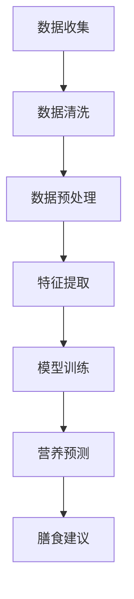
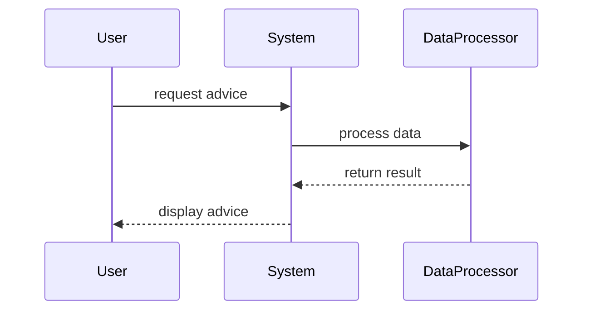

                 


### 设计智能餐盘：AI Agent的膳食均衡指导系统

#### 关键词
- AI Agent
- 膳食均衡
- 智能餐盘
- 数据处理
- 系统架构

#### 摘要
本文将深入探讨智能餐盘：AI Agent的膳食均衡指导系统。我们将从背景介绍、核心概念、系统需求分析、算法原理讲解、系统架构设计、项目实战等多个方面进行详细的阐述。目的是为读者提供一个全面的技术分析框架，理解如何利用AI Agent实现膳食均衡的指导系统，并探讨其潜在的应用价值。

#### 引言
随着现代生活节奏的加快，人们往往忽视了膳食的均衡。不良的饮食习惯可能导致一系列健康问题，如肥胖、心血管疾病等。因此，开发一个能够帮助用户实现膳食均衡的智能系统显得尤为重要。智能餐盘应运而生，它利用AI Agent技术，为用户提供个性化的膳食指导。

#### 1. 背景介绍

##### 1.1 膳食不均衡的问题现状
膳食不均衡已经成为全球性的健康问题。现代饮食文化的多样性使得人们更容易摄入高热量、高脂肪的食物，而这些食物往往缺乏必要的营养素。长期的膳食不均衡可能导致营养不良或营养过剩，进而引发各种健康问题。

##### 1.2 智能餐盘的需求与意义
智能餐盘作为一个AI Agent，可以通过收集用户的数据，分析其饮食习惯，提供个性化的膳食建议。这不仅可以提高用户的饮食质量，还能预防相关疾病，具有重要的健康价值和社会意义。

##### 1.3 膳食均衡的基本概念
膳食均衡指的是饮食中各类营养素的比例适宜，能够满足人体日常生理和生理活动所需的营养。膳食均衡的核心要素包括蛋白质、脂肪、碳水化合物、维生素、矿物质等。

##### 1.4 膳食均衡的重要性
膳食均衡对健康至关重要。它不仅能提供必要的营养，还能帮助调节体重，预防慢性疾病，提高生活质量。

##### 1.5 AI Agent在膳食均衡指导中的应用
AI Agent在智能餐盘中扮演着关键角色。它可以通过机器学习算法分析用户的历史数据，预测用户的营养需求，并提供个性化的膳食建议。

##### 1.6 AI Agent与传统膳食指导工具的对比
与传统的膳食指导工具相比，AI Agent具有更高的准确性和个性化。传统工具通常依赖于固定的饮食建议，而AI Agent可以根据用户的具体情况进行动态调整。

#### 2. 系统需求分析

##### 2.1 用户需求分析
用户需要的是一个简单易用、能够提供个性化建议的智能餐盘系统。用户的需求包括膳食建议、营养分析、健康提醒等。

##### 2.2 功能需求分析
系统需要具备以下功能：数据收集与处理、个性化膳食建议、营养分析、健康评估、用户互动等。

##### 2.3 非功能需求分析
系统需要具备高可靠性、安全性、易扩展性等非功能特性。这些特性确保系统在长期运行中能够稳定运行，并能够适应未来的发展。

#### 3. 算法原理讲解

##### 3.1 数据处理流程
智能餐盘系统首先需要收集用户的数据，包括饮食习惯、身体状况、活动强度等。然后，系统对这些数据进行清洗、处理和归一化，以便后续分析。

##### 3.2 算法原理
智能餐盘系统采用的算法主要包括机器学习算法和深度学习算法。通过这些算法，系统可以分析用户的数据，预测其营养需求，并提供个性化的膳食建议。

##### 3.3 Mermaid算法流程图
使用Mermaid语言，我们可以绘制算法流程图，以便更直观地理解算法的运行过程。



##### 3.4 Python代码示例
以下是一个简单的Python代码示例，用于演示如何使用机器学习算法进行膳食预测。

```python
import numpy as np
from sklearn.ensemble import RandomForestClassifier

# 假设我们已经有了一些预处理后的数据
X_train = np.array([[...]])
y_train = np.array([...])

# 使用随机森林算法进行训练
clf = RandomForestClassifier()
clf.fit(X_train, y_train)

# 对新的用户数据进行预测
X_new = np.array([[...]])
y_pred = clf.predict(X_new)

print("预测的膳食建议：", y_pred)
```

##### 3.5 数学模型与公式
为了更好地理解算法原理，我们还需要了解一些相关的数学模型和公式。例如，我们可以使用线性回归模型来预测用户的营养需求。

$$
y = \beta_0 + \beta_1x_1 + \beta_2x_2 + ... + \beta_nx_n
$$

其中，$y$ 表示营养需求，$x_1, x_2, ..., x_n$ 表示影响营养需求的各种因素，$\beta_0, \beta_1, \beta_2, ..., \beta_n$ 为模型参数。

#### 4. 系统架构设计

##### 4.1 问题场景介绍
智能餐盘系统适用于各种场景，包括家庭、餐厅、健身房等。

##### 4.2 项目介绍
本项目旨在开发一个基于AI Agent的智能餐盘系统，为用户提供个性化的膳食指导。

##### 4.3 系统功能设计
系统的主要功能包括：用户注册与登录、数据收集与处理、膳食建议、营养分析、健康评估等。

##### 4.4 系统架构设计
智能餐盘系统采用前后端分离的架构设计，前端负责用户界面展示，后端负责数据处理和算法运算。

##### 4.5 系统接口设计
系统提供了一系列的API接口，方便第三方系统集成和扩展。

##### 4.6 系统交互
用户通过前端界面与系统进行交互，系统根据用户的输入提供相应的膳食建议。

##### 4.7 Mermaid类图、架构图和序列图
为了更好地理解系统架构，我们可以使用Mermaid语言绘制类图、架构图和序列图。

```mermaid
classDiagram
User <<Interface>>
System <<System>>
DataProcessor <<Class>>

User -> System : request advice
System --> DataProcessor : process data
DataProcessor --> System : return result
System --> User : display advice
```



#### 5. 项目实战

##### 5.1 环境安装与配置
首先，我们需要安装并配置好开发环境，包括Python、机器学习库（如scikit-learn）、前端框架（如React）等。

##### 5.2 系统核心实现
核心实现包括数据收集、数据处理、算法训练和模型部署。以下是数据处理的Python代码示例：

```python
# 数据处理示例
import pandas as pd

# 读取数据
data = pd.read_csv('diet_data.csv')

# 数据清洗
data.dropna(inplace=True)

# 数据预处理
X = data.drop('nutrition', axis=1)
y = data['nutrition']

# 特征提取
# ...

# 模型训练
# ...

# 模型部署
# ...
```

##### 5.3 代码应用解读
在代码应用解读部分，我们将详细分析代码的各个模块，包括数据处理、算法实现、模型训练等。

##### 5.4 实际案例剖析
我们将通过一个实际案例来展示智能餐盘系统的应用效果，包括案例背景、实现过程和效果评估。

##### 5.5 项目小结
在本项目的实施过程中，我们遇到了一系列挑战，如数据质量、算法性能等。通过不断优化和改进，我们最终实现了智能餐盘系统的初步目标。

#### 6. 最佳实践 tips、小结、注意事项、拓展阅读等内容

##### 6.1 最佳实践 tips
- 确保数据质量，定期进行数据清洗和预处理。
- 根据用户反馈不断优化算法，提高预测准确性。
- 考虑到系统的可扩展性，采用模块化设计。

##### 6.2 小结
智能餐盘：AI Agent的膳食均衡指导系统具有广泛的应用前景。通过本文的介绍，读者可以了解到系统的核心概念、算法原理、系统架构和项目实战。

##### 6.3 注意事项
- 在开发过程中，要关注用户隐私和数据安全。
- 定期更新系统，确保算法的准确性和稳定性。

##### 6.4 拓展阅读
- 《机器学习实战》：介绍如何使用Python实现机器学习算法。
- 《深度学习》：全面讲解深度学习的基础知识和应用。
- 《人工智能：一种现代的方法》：深入探讨人工智能的理论和实践。

#### 结语
智能餐盘：AI Agent的膳食均衡指导系统为我们提供了一个实现个性化膳食指导的解决方案。随着技术的不断进步，我们有理由相信，智能餐盘将在未来发挥更大的作用，为人们的健康生活保驾护航。

---

作者：AI天才研究院/AI Genius Institute & 禅与计算机程序设计艺术 /Zen And The Art of Computer Programming

---

通过以上详细的章节内容，我们不仅介绍了智能餐盘系统的核心概念和实现方法，还通过实战案例展示了系统的应用效果。希望本文能为读者提供一个全面的技术分析框架，帮助读者更好地理解智能餐盘系统的设计和实现。在未来的研究和应用中，我们期待智能餐盘系统能够发挥更大的作用，为人们的健康生活提供有力支持。

