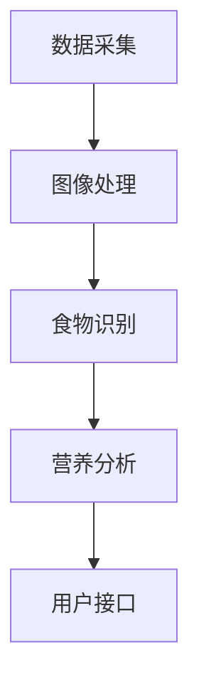

                 

### 智能餐盘：AI Agent的食物识别与营养分析

关键词：智能餐盘、AI Agent、食物识别、营养分析、深度学习

摘要：本文旨在深入探讨智能餐盘的原理、技术实现和应用场景，通过逐步分析，揭示其在现代饮食健康管理和营养监测中的重要作用。

----------------------------------------------------------------

## 第一部分：智能餐盘概述

### 第1章：智能餐盘的背景与需求

#### 1.1.1 问题背景

随着生活水平的不断提高，人们对饮食健康和营养管理越来越重视。然而，现代生活节奏快，很多人无法保证每餐都吃得健康、均衡。食物识别与营养分析的需求因此而生，人们希望通过技术手段来识别食物成分，进行营养分析，从而实现个性化饮食管理和健康监控。

#### 1.1.2 问题描述

智能餐盘旨在解决以下问题：

- **用户营养需求分析**：如何根据用户的身体状况和营养需求，合理搭配食物？
- **食物识别的挑战**：如何准确识别各种复杂场景下的食物种类和营养成分？

#### 1.1.3 问题解决

智能餐盘通过以下方式解决问题：

- **基本原理**：利用AI Agent进行图像识别和营养分析。
- **技术实现**：采用深度学习和计算机视觉技术，实现高效准确的食物识别和营养分析。

#### 1.1.4 边界与外延

智能餐盘的应用场景广泛，包括家庭健康管理、校园餐饮管理、医疗健康服务等。与其他相关技术相比，智能餐盘具有实时性、便捷性和高效性的优势。

#### 1.1.5 本章小结

本章介绍了智能餐盘的背景、需求、问题描述、问题解决以及应用场景。为后续章节的技术讨论和应用分析奠定了基础。

----------------------------------------------------------------

## 第二部分：智能餐盘的核心技术

### 第2章：智能餐盘的核心技术

#### 2.1.1 摄像头与图像识别技术

智能餐盘通过摄像头采集食物图像，然后利用图像识别技术对图像进行分析和处理。图像采集与处理流程如下：

1. **图像采集**：使用高分辨率摄像头捕捉食物图像。
2. **预处理**：对图像进行缩放、裁剪、增强等预处理操作。
3. **特征提取**：从预处理后的图像中提取关键特征，用于后续识别。

识别算法简介：

- **深度学习算法**：采用卷积神经网络（CNN）等深度学习算法进行图像识别，具有强大的特征提取和分类能力。

#### 2.1.2 食物识别算法

食物识别算法的核心是构建一个能够准确识别各种食物种类的模型。具体实现包括：

- **数据集准备**：收集大量的食物图像，并标注各类食物的名称。
- **模型训练**：利用标注数据训练深度学习模型，使其学会识别食物。
- **模型优化**：通过调整模型参数和训练策略，提高识别准确率和效率。

#### 2.1.3 营养分析算法

营养分析算法主要涉及以下几个方面：

- **营养成分识别**：从食物图像中识别出各种营养成分，如蛋白质、碳水化合物、脂肪等。
- **营养计算**：根据识别出的营养成分计算食物的总热量和各类营养素的含量。
- **营养分析**：结合用户的健康状况和营养需求，对食物进行营养评价和推荐。

#### 2.1.4 本章小结

本章详细介绍了智能餐盘的核心技术，包括摄像头与图像识别技术、食物识别算法和营养分析算法。这些技术的实现为智能餐盘的高效运作提供了基础。

----------------------------------------------------------------

## 第三部分：智能餐盘的设计与实现

### 第3章：智能餐盘的设计与实现

#### 3.1.1 系统架构设计

智能餐盘的系统架构设计包括以下几个方面：

- **系统功能模块划分**：将系统划分为数据采集模块、图像处理模块、食物识别模块、营养分析模块和用户接口模块。
- **系统架构设计图**：使用Mermaid绘制系统架构图，展示各模块之间的交互关系。



#### 3.1.2 数据处理流程

数据处理流程如下：

1. **数据采集**：使用摄像头捕获食物图像。
2. **图像预处理**：对图像进行缩放、裁剪、增强等预处理操作。
3. **特征提取**：从预处理后的图像中提取关键特征。
4. **食物识别**：利用训练好的模型进行食物识别。
5. **营养分析**：对识别出的食物进行营养成分计算和营养分析。
6. **结果展示**：将分析结果展示给用户。

#### 3.1.3 系统接口设计

系统接口设计包括以下方面：

- **API设计与实现**：设计用于数据采集、图像处理、食物识别和营养分析等功能的API接口。
- **用户交互设计**：设计用户友好的界面，便于用户与系统进行交互。

#### 3.1.4 本章小结

本章详细介绍了智能餐盘的设计与实现，包括系统架构设计、数据处理流程和系统接口设计。这些设计为实现智能餐盘的功能提供了技术支持。

----------------------------------------------------------------

## 第四部分：智能餐盘的应用场景

### 第4章：智能餐盘的应用场景

#### 4.1.1 家庭健康管理

智能餐盘在家庭健康管理中的应用主要包括：

- **饮食监控**：帮助用户监控饮食情况，分析食物的营养成分。
- **健康建议**：根据用户营养需求，提供合理的饮食建议。

#### 4.1.2 校园餐饮管理

智能餐盘在校园餐饮管理中的应用主要包括：

- **食品安全监控**：通过食物识别技术，监控食堂食品的安全性和质量。
- **营养分析**：对校园餐饮的营养成分进行分析，确保学生饮食均衡。

#### 4.1.3 医疗健康服务

智能餐盘在医疗健康服务中的应用主要包括：

- **营养管理**：为患者提供个性化的营养管理方案，促进康复。
- **健康监控**：通过实时监测患者的饮食情况，预警潜在的健康风险。

#### 4.1.4 本章小结

本章介绍了智能餐盘在家庭健康管理、校园餐饮管理和医疗健康服务中的应用场景。智能餐盘在这些场景中发挥了重要作用，提高了饮食健康管理和营养监测的效率和准确性。

----------------------------------------------------------------

## 第五部分：智能餐盘的挑战与未来

### 第5章：智能餐盘的挑战与未来

#### 5.1.1 技术挑战

智能餐盘面临以下技术挑战：

- **图像识别精度与效率**：如何提高食物识别的精度和效率，适应不同环境和场景。
- **营养分析算法的准确性**：如何准确识别各种营养成分，保证营养分析的准确性。

#### 5.1.2 应用挑战

智能餐盘在应用过程中面临以下挑战：

- **系统部署与维护**：如何高效部署和维护系统，确保系统的稳定性和可靠性。
- **用户隐私保护**：如何保护用户的隐私数据，防止数据泄露。

#### 5.1.3 未来发展趋势

未来，智能餐盘将朝着以下方向发展：

- **技术创新**：不断探索和引入新的技术，提高食物识别和营养分析的能力。
- **新应用场景**：拓展智能餐盘的应用场景，如智能餐饮服务、健康管理等。

#### 5.1.4 本章小结

本章分析了智能餐盘面临的技术挑战和应用挑战，并探讨了其未来的发展趋势。这些挑战和发展趋势将为智能餐盘的持续改进和创新提供方向。

----------------------------------------------------------------

## 第六部分：智能餐盘项目实战

### 第6章：智能餐盘项目实战

#### 6.1.1 环境安装与配置

要实现智能餐盘项目，首先需要安装和配置以下环境：

- **操作系统**：推荐使用Linux系统，如Ubuntu。
- **硬件配置**：至少需要一块独立显卡，用于加速深度学习模型的训练。
- **开发环境**：安装Python、TensorFlow、OpenCV等开发工具和库。

具体步骤如下：

1. 安装操作系统和硬件配置。
2. 安装Python和相关库，如TensorFlow、OpenCV等。
3. 配置深度学习环境，如CUDA和cuDNN。

#### 6.1.2 系统核心实现

智能餐盘的核心实现主要包括以下几个方面：

- **摄像头与图像采集**：使用OpenCV库捕获食物图像。
- **食物识别**：利用TensorFlow和预训练的深度学习模型进行食物识别。
- **营养分析**：根据识别结果计算食物的营养成分，并进行营养分析。

以下是部分Python代码示例：

```python
import cv2
import tensorflow as tf

# 摄像头初始化
cap = cv2.VideoCapture(0)

# 加载预训练的模型
model = tf.keras.models.load_model('food_recognition_model.h5')

while True:
    # 读取摄像头帧
    ret, frame = cap.read()
    
    # 预处理图像
    processed_frame = preprocess_image(frame)
    
    # 进行食物识别
    predictions = model.predict(processed_frame)
    
    # 输出识别结果
    print(predictions)

    # 显示图像
    cv2.imshow('Frame', frame)
    
    if cv2.waitKey(1) & 0xFF == ord('q'):
        break

# 释放摄像头
cap.release()
cv2.destroyAllWindows()
```

#### 6.1.3 代码应用解读与分析

上述代码首先初始化摄像头，然后循环读取摄像头帧。对于每一帧，进行预处理（如缩放、裁剪等），然后利用预训练的深度学习模型进行食物识别，并将识别结果输出。

#### 6.1.4 实际案例分析与讲解

以下是一个家庭健康管理的实际案例：

- **用户**：小张，年龄30岁，体重70kg，身高175cm。
- **饮食记录**：小张通过智能餐盘记录了三天的饮食情况。

通过智能餐盘的分析，小张发现：

- **营养摄入不平衡**：蛋白质摄入量不足，脂肪摄入量偏高。
- **建议**：增加瘦肉、鱼类等蛋白质丰富的食物，减少油炸食物和甜食的摄入。

#### 6.1.5 项目小结

本章通过实际项目实战，展示了智能餐盘的安装与配置、系统核心实现、代码应用解读与分析以及实际案例分析。这些实战经验有助于理解智能餐盘的实现过程和应用价值。

----------------------------------------------------------------

## 第七部分：最佳实践与拓展

### 第7章：最佳实践与拓展

#### 7.1.1 最佳实践

在部署智能餐盘时，以下最佳实践有助于提高系统的稳定性和准确性：

- **数据预处理**：确保图像数据质量，如去除噪点、对比度增强等。
- **模型优化**：定期对模型进行训练和优化，提高识别准确率。
- **系统监控**：实时监控系统运行状态，及时处理异常情况。

#### 7.1.2 小结与展望

智能餐盘在饮食健康管理和营养监测领域具有广泛的应用前景。未来，随着技术的不断进步，智能餐盘将更加智能化和个性化，为用户提供更加精准和便捷的服务。

#### 7.1.3 注意事项

在使用智能餐盘时，需要注意以下几点：

- **食物识别的准确性**：确保图像清晰，避免识别错误。
- **营养分析数据的可靠性**：结合用户实际情况，对营养分析结果进行评估和调整。

#### 7.1.4 拓展阅读推荐

- 《深度学习与计算机视觉》
- 《食品营养学》
- 《智能健康管理系统设计与实现》

## 结束语

作者：AI天才研究院/AI Genius Institute & 禅与计算机程序设计艺术 /Zen And The Art of Computer Programming

本文从背景介绍、核心技术、设计实现、应用场景、挑战与未来、项目实战及最佳实践等方面全面剖析了智能餐盘的技术原理和应用价值。通过逐步分析，揭示了智能餐盘在现代饮食健康管理和营养监测中的重要作用。希望本文能为读者在智能餐盘技术研究和应用实践中提供有益的参考和启示。

