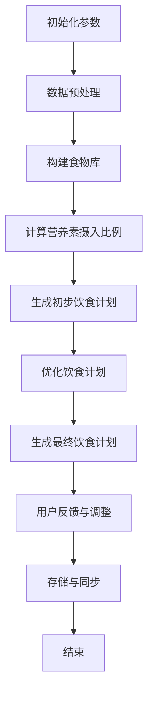

                 

# 智能餐盘：AI Agent的饮食平衡建议

> 关键词：智能餐盘、AI Agent、饮食平衡、算法、优化、项目实战

> 摘要：随着人们对健康饮食的关注日益增加，智能餐盘作为AI Agent在饮食管理中的应用逐渐受到重视。本文将详细介绍智能餐盘的背景、核心技术、架构设计、AI Agent的饮食平衡建议算法原理及应用，并通过项目实战展示其实际应用效果，最后提出最佳实践与未来发展趋势。

### 目录大纲

----------------------------------------------------------------

# 第一部分: 智能餐盘概述

## 第1章: 智能餐盘背景与重要性

### 1.1.1 饮食健康问题背景

### 1.1.2 智能餐盘的概念

### 1.1.3 智能餐盘在饮食管理中的应用前景

## 第2章: 智能餐盘核心技术

### 2.1 人工智能基础

### 2.2 传感器技术

### 2.3 数据处理与分析

## 第3章: 智能餐盘的架构设计

### 3.1 模块划分与功能

### 3.2 系统集成与调试

### 3.3 可扩展性与可靠性

## 第二部分: AI Agent的饮食平衡建议

## 第4章: AI Agent概述

### 4.1 AI Agent的定义与分类

### 4.2 AI Agent在饮食管理中的应用

### 4.3 AI Agent的发展趋势与挑战

## 第5章: 饮食平衡的算法原理

### 5.1 常见饮食平衡算法

### 5.2 算法流程与Mermaid流程图

### 5.3 算法Python源代码与解释

## 第6章: 算法应用与优化

### 6.1 数据采集与处理

### 6.2 实际应用场景

### 6.3 算法优化与效果评估

## 第7章: 智能餐盘项目实战

### 7.1 项目环境搭建

### 7.2 系统核心实现

### 7.3 代码应用解读

### 7.4 项目小结

## 第三部分: 智能餐盘的最佳实践

## 第8章: 最佳实践与注意事项

### 8.1 系统部署与维护

### 8.2 数据隐私保护

### 8.3 注意事项与风险规避

## 第9章: 拓展阅读与未来发展

### 9.1 饮食管理领域的其他技术

### 9.2 智能餐盘的拓展应用

### 9.3 行业前景与发展趋势

----------------------------------------------------------------

### 1.1.1 饮食健康问题背景

随着生活水平的不断提高，人们对于饮食健康问题的关注度也在逐渐增加。然而，由于各种原因，如工作压力、生活节奏加快、饮食文化差异等，许多人仍然面临着饮食不均衡的问题。饮食不均衡可能导致营养摄入不足或过量，进而引发一系列健康问题，如肥胖、心血管疾病、糖尿病等。据世界卫生组织（WHO）统计，全球每年有超过300万人因营养相关疾病死亡。

在中国，随着经济的快速发展，饮食结构也在不断变化。一方面，高热量、高脂肪、高糖分的快餐和加工食品越来越受欢迎；另一方面，传统饮食习惯逐渐被忽视，导致营养摄入不均衡。此外，现代人工作压力较大，往往忽视了健康饮食的重要性，使得饮食健康问题愈发严重。

为了解决这一问题，智能餐盘作为一种创新的饮食管理工具应运而生。智能餐盘通过集成人工智能技术和传感器技术，能够实时监测用户的饮食情况，并提供个性化的饮食建议，帮助用户实现饮食平衡，从而提高生活质量。

### 1.1.2 智能餐盘的概念

智能餐盘是一种基于人工智能技术的智能硬件设备，主要用于监测和管理用户的饮食行为。它通常由一个或多个餐盘、传感器、数据处理单元和通信模块组成。智能餐盘通过传感器实时监测餐盘中的食物种类、重量和营养成分，并将这些数据传输到数据处理单元进行分析和处理。

数据处理单元通常包含一个嵌入式系统，运行特定的算法和软件，对传感器采集到的数据进行处理和计算。通过分析用户的饮食习惯和营养需求，智能餐盘可以生成个性化的饮食建议，指导用户实现饮食平衡。

智能餐盘的应用场景非常广泛，包括家庭、餐厅、食堂、健身房等。用户可以通过智能餐盘了解自己的饮食状况，调整饮食习惯，从而实现健康减肥、增肌、控制血糖等目标。

### 1.1.3 智能餐盘在饮食管理中的应用前景

智能餐盘作为一种新兴的饮食管理工具，具有巨大的应用前景。随着人工智能技术的不断发展和普及，智能餐盘的功能将更加丰富，应用范围也将进一步扩大。

首先，智能餐盘可以广泛应用于家庭饮食管理。家庭用户可以通过智能餐盘实时了解家庭成员的饮食状况，及时调整饮食计划，确保家庭成员的饮食健康。

其次，智能餐盘在餐厅和食堂中的应用也非常广泛。餐厅和食堂管理者可以通过智能餐盘了解顾客的饮食偏好和营养需求，提供更加个性化的餐饮服务，提高顾客满意度。

此外，智能餐盘在健身房和健身社区中的应用也越来越受到关注。健身用户可以通过智能餐盘监控自己的饮食状况，确保营养摄入与运动计划的匹配，从而更好地实现健身目标。

总之，智能餐盘作为一种创新的饮食管理工具，具有广阔的应用前景。随着技术的不断进步和应用的深入，智能餐盘将更好地服务于人们的饮食健康，成为智能生活的一部分。

### 2.1 人工智能基础

人工智能（AI）作为一门研究、开发用于模拟、延伸和扩展人类智能的理论、方法、技术及应用系统的技术科学，已经成为当前科技发展的重要方向。人工智能的基础主要包括以下几个核心概念：

#### 2.1.1 机器学习（Machine Learning）

机器学习是人工智能的核心技术之一，主要研究如何通过数据驱动的方式，使计算机系统能够自动学习和适应新环境。机器学习可以分为监督学习、无监督学习和强化学习三类：

1. **监督学习（Supervised Learning）**：在监督学习模式下，系统从标记好的数据集中学习，以便能够对新的数据做出预测。常见的监督学习算法包括线性回归、决策树、支持向量机等。

2. **无监督学习（Unsupervised Learning）**：无监督学习不需要标记数据，主要目标是发现数据中的结构和模式。常见的无监督学习算法包括聚类算法、主成分分析等。

3. **强化学习（Reinforcement Learning）**：强化学习通过奖励机制，使系统在与环境的交互过程中学习最优策略。常见的强化学习算法包括Q-learning、深度强化学习等。

#### 2.1.2 深度学习（Deep Learning）

深度学习是机器学习的一个分支，主要研究神经网络在人工智能中的应用。深度学习通过多层神经网络（如卷积神经网络、循环神经网络等）对大量数据进行自动特征提取和表示，从而实现复杂任务的自动化处理。

1. **卷积神经网络（Convolutional Neural Networks, CNN）**：卷积神经网络主要用于图像和视频处理，通过卷积操作提取图像的特征。

2. **循环神经网络（Recurrent Neural Networks, RNN）**：循环神经网络主要用于序列数据处理，如自然语言处理和语音识别。

3. **生成对抗网络（Generative Adversarial Networks, GAN）**：生成对抗网络通过两个对抗网络（生成器和判别器）的博弈，生成与真实数据分布相近的假数据。

#### 2.1.3 自然语言处理（Natural Language Processing, NLP）

自然语言处理是人工智能的一个重要分支，主要研究如何让计算机理解和处理自然语言。自然语言处理的应用场景非常广泛，包括机器翻译、文本分类、情感分析、语音识别等。

1. **词向量（Word Embeddings）**：词向量是将单词映射到高维空间中，以便计算机能够理解单词的含义和关系。

2. **序列到序列模型（Seq2Seq）**：序列到序列模型用于处理输入和输出都是序列的任务，如机器翻译。

3. **注意力机制（Attention Mechanism）**：注意力机制用于在序列处理过程中，关注重要的部分，从而提高模型的性能。

#### 2.1.4 人工智能的发展趋势

随着技术的不断进步，人工智能在各个领域的应用也在不断拓展。未来，人工智能的发展趋势主要包括以下几个方面：

1. **智能化水平的提升**：通过不断优化算法和增加数据量，人工智能系统的智能化水平将不断提高，能够处理更加复杂和多样化的任务。

2. **跨界融合**：人工智能与其他领域（如医疗、教育、交通等）的深度融合，将带来更多的应用场景和创新成果。

3. **边缘计算**：随着物联网和智能设备的发展，边缘计算将使得人工智能在本地设备上进行实时处理，降低延迟，提高效率。

4. **伦理与法律**：随着人工智能技术的广泛应用，伦理和法律问题也日益受到关注。未来，需要制定相应的伦理和法律框架，确保人工智能的发展符合社会价值观。

综上所述，人工智能作为一门新兴的交叉学科，正迅速发展并不断推动着社会进步。在智能餐盘的应用中，人工智能技术发挥着关键作用，为饮食管理提供了更加智能和个性化的解决方案。

### 2.2 传感器技术

传感器技术是智能餐盘的核心组成部分，它通过将物理信号转换为电信号，实现对食物种类、重量和营养成分的精确监测。以下将介绍几种常见的传感器技术及其在智能餐盘中的应用。

#### 2.2.1 食物识别传感器

食物识别传感器主要用于识别餐盘中不同种类的食物。常见的技术包括：

1. **光谱传感器**：光谱传感器通过检测食物的光谱特性，实现对不同食物的识别。不同食物的光谱特性具有独特的指纹，可以通过光谱传感器进行识别。

2. **深度相机**：深度相机利用光线反射原理，通过计算光线在物体表面反射后的位移，实现对物体的三维建模。通过深度相机，可以识别食物的形状和位置，进而判断食物种类。

3. **图像识别算法**：结合机器学习和深度学习技术，通过训练大量样本数据，实现对食物图像的自动识别。这种技术需要大量的标注数据，且识别精度较高。

#### 2.2.2 重量传感器

重量传感器用于监测餐盘中食物的重量，通常使用压力传感器或称重传感器。压力传感器通过测量餐盘受到的压力变化，间接获取食物的重量。称重传感器则可以直接测量食物的重量，具有较高的精度。

#### 2.2.3 营养成分传感器

营养成分传感器用于检测食物中的营养成分，如蛋白质、脂肪、碳水化合物等。常见的技术包括：

1. **红外光谱传感器**：红外光谱传感器通过检测食物中的分子振动，分析食物的成分。不同成分具有特定的红外光谱特征，可以通过红外光谱传感器进行定量分析。

2. **电化学传感器**：电化学传感器通过检测食物中的化学物质与电极之间的电化学反应，分析食物的成分。

#### 2.2.4 数据融合技术

为了提高传感器系统的准确性和可靠性，通常采用数据融合技术，将多种传感器采集的数据进行综合分析。常见的数据融合方法包括：

1. **卡尔曼滤波**：卡尔曼滤波是一种优化估计方法，通过预测和更新，对传感器数据进行滤波处理，提高数据的准确性。

2. **贝叶斯网络**：贝叶斯网络是一种概率图模型，通过建立传感器之间的依赖关系，对传感器数据进行综合分析和推理。

通过结合多种传感器技术和数据融合方法，智能餐盘可以实现对用户饮食行为的精确监测，为AI Agent提供准确的输入数据，从而生成个性化的饮食建议。

### 2.3 数据处理与分析

智能餐盘的核心价值在于能够对用户饮食行为进行精确的监测和分析，进而提供个性化的饮食建议。数据处理与分析是智能餐盘实现这一目标的关键环节，主要包括数据采集、数据清洗、数据存储、数据分析和数据可视化等步骤。

#### 2.3.1 数据采集

数据采集是数据处理与分析的第一步，主要涉及传感器数据的采集。智能餐盘通过集成多种传感器（如光谱传感器、重量传感器和营养成分传感器等），实时监测餐盘中的食物种类、重量和营养成分。这些传感器将采集到的数据传输到数据处理单元，为后续分析提供基础数据。

#### 2.3.2 数据清洗

数据清洗是数据处理与分析的重要环节，旨在去除数据中的噪声和异常值，提高数据的准确性和可靠性。常见的数据清洗方法包括：

1. **缺失值处理**：对于缺失值，可以根据数据的特性选择填充方法，如均值填充、中值填充或插值填充。

2. **异常值处理**：对于异常值，可以通过统计学方法（如标准差、箱线图等）进行识别和去除，以确保数据的准确性。

3. **重复值处理**：去除重复数据，避免重复分析。

#### 2.3.3 数据存储

数据存储是将处理后的数据存储到数据库或数据仓库中，以便后续分析和查询。常用的数据存储技术包括：

1. **关系型数据库**：如MySQL、PostgreSQL等，适用于结构化数据的存储和管理。

2. **NoSQL数据库**：如MongoDB、Cassandra等，适用于非结构化数据和高并发场景。

3. **数据仓库**：如Oracle、Teradata等，用于大规模数据的存储和复杂查询。

#### 2.3.4 数据分析

数据分析是对存储好的数据进行分析，提取有用的信息，为用户提供个性化的饮食建议。数据分析方法主要包括：

1. **统计分析**：通过统计学方法，对数据进行描述性分析和推断性分析，如均值、方差、相关系数等。

2. **机器学习**：利用机器学习算法，对数据进行分析和预测，如线性回归、决策树、神经网络等。

3. **自然语言处理**：对文本数据进行分析和处理，提取关键词和语义信息，如文本分类、情感分析等。

#### 2.3.5 数据可视化

数据可视化是将分析结果以图表、图形等形式展示，帮助用户直观地理解数据。常见的数据可视化工具包括：

1. **matplotlib**：Python的绘图库，适用于简单的数据可视化。

2. **Plotly**：Python的交互式可视化库，支持多种图表类型和交互功能。

3. **Tableau**：数据可视化工具，适用于企业级数据分析和展示。

通过以上数据处理与分析步骤，智能餐盘可以实现对用户饮食行为的全面监测和分析，为用户提供个性化的饮食建议，帮助用户实现饮食平衡，提高生活质量。

### 3.1 模块划分与功能

智能餐盘系统可以划分为多个模块，各模块之间相互协作，共同实现系统的整体功能。以下是智能餐盘的主要模块及其功能：

#### 3.1.1 数据采集模块

数据采集模块负责收集智能餐盘传感器采集的数据，包括食物识别数据、重量数据和营养成分数据。该模块的主要功能包括：

1. **传感器数据读取**：读取传感器采集到的原始数据，如光谱数据、重量数据等。
2. **数据预处理**：对传感器数据进行预处理，包括去噪、归一化等，确保数据的准确性和可靠性。
3. **数据存储**：将预处理后的数据存储到数据库或缓存中，为后续处理和分析提供数据支持。

#### 3.1.2 数据处理模块

数据处理模块负责对采集到的数据进行分析和处理，提取有用的信息，为用户提供个性化的饮食建议。该模块的主要功能包括：

1. **数据清洗**：去除数据中的噪声和异常值，确保数据的准确性和一致性。
2. **特征提取**：从原始数据中提取关键特征，如食物种类、重量、营养成分等。
3. **数据融合**：结合多种传感器数据，通过数据融合技术提高数据的准确性和可靠性。
4. **数据分析**：利用机器学习算法和统计分析方法，对特征数据进行分析和预测，为用户提供饮食建议。

#### 3.1.3 用户界面模块

用户界面模块负责与用户进行交互，展示系统分析结果和饮食建议。该模块的主要功能包括：

1. **数据可视化**：将分析结果以图表、图形等形式展示，帮助用户直观地理解数据。
2. **交互界面**：提供用户操作界面，允许用户设置饮食目标、查看饮食建议等。
3. **通知与提醒**：根据用户设置，发送饮食建议和提醒通知，帮助用户保持良好的饮食习惯。

#### 3.1.4 通信模块

通信模块负责智能餐盘与外部设备（如手机、电脑等）的通信，实现数据传输和同步。该模块的主要功能包括：

1. **数据同步**：将本地数据与云端数据同步，确保数据的一致性和完整性。
2. **远程访问**：允许用户通过手机或电脑远程访问智能餐盘的数据和分析结果。
3. **设备管理**：管理智能餐盘设备的状态，包括设备激活、升级和维护等。

通过以上模块的协同工作，智能餐盘系统能够实现对用户饮食行为的全面监测和分析，为用户提供个性化的饮食建议，帮助用户实现饮食平衡。

### 3.2 系统集成与调试

在智能餐盘系统开发过程中，系统集成与调试是确保系统稳定性和可靠性的关键环节。以下是智能餐盘系统集成的具体步骤和调试方法：

#### 3.2.1 系统集成步骤

1. **模块接口定义**：首先，明确各个模块的接口定义，包括输入输出参数、数据格式和通信协议等，确保模块之间能够无缝对接。

2. **模块开发与测试**：针对每个模块，进行独立开发并完成单元测试，确保模块内部功能的正确性和稳定性。

3. **模块集成**：将各个模块按照定义好的接口进行集成，构建完整的系统原型。在集成过程中，需要确保各模块之间的数据传输和功能协同无误。

4. **集成测试**：对集成后的系统进行全面的测试，包括功能测试、性能测试和可靠性测试，确保系统整体运行稳定。

5. **系统部署**：将经过测试的智能餐盘系统部署到实际环境中，进行实际应用测试，验证系统的实用性和用户体验。

#### 3.2.2 调试方法

1. **日志分析**：通过查看系统日志，分析错误信息和异常情况，定位问题所在。日志记录了系统运行过程中的关键事件和状态，对于调试系统非常有帮助。

2. **断点调试**：使用断点调试工具，对系统代码进行逐行调试，观察变量值和程序执行流程，找出潜在的错误和问题。

3. **单元测试**：编写单元测试用例，对各个模块的功能进行验证，确保模块内部的逻辑正确。通过单元测试，可以快速发现和定位模块内部的错误。

4. **性能优化**：对系统进行性能分析，识别性能瓶颈和资源消耗，进行相应的优化。性能优化可以提高系统的响应速度和稳定性。

5. **用户反馈**：收集用户使用过程中的反馈和问题，及时修复和改进系统。用户反馈是系统调试的重要参考，可以帮助发现潜在的问题和改进系统功能。

通过以上系统集成与调试方法，可以确保智能餐盘系统的稳定性、可靠性和用户体验，为用户提供高质量的饮食管理服务。

### 3.3 可扩展性与可靠性

智能餐盘系统的可扩展性与可靠性是确保其长期稳定运行和持续优化的重要保障。以下将介绍如何设计智能餐盘系统以满足这些要求：

#### 3.3.1 可扩展性设计

1. **模块化架构**：智能餐盘系统采用模块化架构，将不同功能划分为独立的模块，如数据采集模块、数据处理模块、用户界面模块等。模块化设计不仅有助于系统的开发和维护，还便于后续功能扩展。

2. **分布式部署**：将系统部署到分布式环境中，通过负载均衡和分布式存储技术，提高系统的可扩展性。当系统处理需求增加时，可以动态添加节点以扩展处理能力。

3. **微服务架构**：采用微服务架构，将系统拆分为多个独立的微服务，每个微服务负责特定的功能。微服务之间通过轻量级的通信协议（如REST API）进行交互，便于系统的扩展和更新。

4. **数据库分库分表**：随着用户数据的不断增加，可以通过分库分表技术，将数据分散存储到多个数据库实例中，提高数据存储和查询的效率。

#### 3.3.2 可靠性设计

1. **故障转移与冗余**：在系统设计中，采用故障转移和冗余技术，确保系统在发生故障时能够快速恢复。例如，通过设置备份服务器和备份数据库，当主服务器或数据库发生故障时，可以立即切换到备用设备，保证系统的连续运行。

2. **数据备份与恢复**：定期对系统数据进行备份，并设计数据恢复策略，确保在数据丢失或损坏时能够迅速恢复。备份策略可以包括全量备份和增量备份，根据实际需求进行选择。

3. **容错机制**：在系统关键部分引入容错机制，如使用多重校验和、校验和算法等，确保数据的一致性和可靠性。当检测到错误时，系统能够自动纠正错误或切换到备用路径。

4. **监控系统**：建立监控系统，实时监测系统运行状态，包括服务器负载、数据库性能、网络流量等。通过监控数据，可以及时发现潜在的问题并进行预警和修复。

通过以上设计策略，智能餐盘系统不仅具备良好的可扩展性，还能保证长期稳定运行和可靠的数据处理能力，为用户提供高质量的饮食管理服务。

### 4.1 AI Agent的定义与分类

AI Agent，即人工智能代理，是一种模拟人类智能行为，能够自主完成特定任务的计算机程序。AI Agent在人工智能领域具有重要地位，广泛应用于自然语言处理、游戏、自动驾驶、智能监控等多个领域。以下是AI Agent的定义与分类：

#### 4.1.1 定义

AI Agent具有以下特点：

1. **自主性**：AI Agent能够在没有外部干预的情况下，自主完成预定的任务。
2. **感知能力**：AI Agent能够通过传感器获取外部环境的信息，如图像、声音、文本等。
3. **推理能力**：AI Agent能够根据感知到的信息进行推理，做出决策。
4. **适应性**：AI Agent能够根据任务环境和需求的变化，自适应地调整行为策略。

#### 4.1.2 分类

根据不同的应用场景和功能，AI Agent可以分为以下几类：

1. **任务型Agent**：任务型Agent专注于完成特定任务，如语音助手、智能家居控制器等。这类Agent通常具有高度的自动化和专业化特点，能够在特定场景下提供高效服务。

2. **社交型Agent**：社交型Agent主要用于模拟人类社交行为，如聊天机器人、虚拟客服等。这类Agent通常具备自然语言理解和生成能力，能够与人类进行互动，提供情感支持和咨询服务。

3. **决策型Agent**：决策型Agent擅长在复杂环境中进行决策，如自动驾驶系统、金融交易机器人等。这类Agent通常具备深度学习和强化学习等先进技术，能够在不确定性环境中做出最优决策。

4. **混合型Agent**：混合型Agent结合了不同类型Agent的特点，能够根据任务需求动态调整行为策略。例如，一个智能购物助手可能同时具备任务型Agent和社交型Agent的特点，既能够提供商品推荐，又能够与用户进行互动交流。

通过分类AI Agent，可以更好地理解其在不同领域的应用场景和优势，为智能餐盘系统的设计提供参考。

### 4.2 AI Agent在饮食管理中的应用

AI Agent在饮食管理中具有广泛的应用前景，能够通过智能分析用户饮食习惯和营养需求，提供个性化的饮食建议，帮助用户实现饮食平衡。以下将详细介绍AI Agent在饮食管理中的应用：

#### 4.2.1 饮食习惯分析

AI Agent首先通过智能餐盘采集的数据，分析用户的饮食习惯。这包括食物种类、摄入量、时间分布、频率等。通过对这些数据的分析，AI Agent可以识别出用户的饮食偏好和习惯，例如是否偏爱高热量、高脂肪食物，是否存在饮食不规律等问题。

1. **饮食习惯可视化**：AI Agent可以将用户的饮食习惯以图表形式进行可视化展示，如饼图、柱状图等，帮助用户直观地了解自己的饮食习惯。

2. **个性化饮食建议**：基于用户的饮食习惯分析，AI Agent可以提供个性化的饮食建议。例如，对于高热量摄入的用户，建议减少高热量食物的摄入量，增加蔬菜、水果等低热量食物的摄入。

#### 4.2.2 营养需求分析

除了饮食习惯分析，AI Agent还会根据用户的年龄、性别、体重、运动量等个人信息，分析用户的营养需求。这包括蛋白质、脂肪、碳水化合物、维生素和矿物质等营养素的摄入量。

1. **营养需求计算**：AI Agent利用营养学公式和数据库，计算用户每日所需的营养素摄入量。

2. **营养素摄入分析**：AI Agent分析用户的实际摄入量与需求量的差异，识别出营养摄入不足或过量的部分。

3. **个性化营养建议**：基于营养需求分析，AI Agent可以提供个性化的营养建议，如增加蛋白质摄入量、控制脂肪摄入量等。

#### 4.2.3 饮食计划生成

AI Agent可以根据用户的饮食习惯和营养需求，生成个性化的饮食计划。饮食计划包括每日三餐的食物种类、分量和烹饪方式。

1. **饮食计划生成**：AI Agent通过组合不同食物的营养成分，生成符合用户需求的饮食计划。

2. **饮食计划调整**：用户可以根据实际情况调整饮食计划，例如外出就餐或参加聚会。AI Agent会根据调整后的计划重新计算营养摄入量。

3. **饮食计划可视化**：AI Agent将生成的饮食计划以图表形式展示，帮助用户了解每日的营养摄入情况。

通过在饮食管理中应用AI Agent，用户可以更加科学地管理自己的饮食，实现饮食平衡，从而改善健康状况，提高生活质量。

### 4.3 AI Agent的发展趋势与挑战

随着人工智能技术的不断发展，AI Agent在饮食管理中的应用前景广阔，但也面临一系列挑战和趋势。

#### 4.3.1 发展趋势

1. **智能化水平提升**：随着深度学习、自然语言处理等技术的进步，AI Agent的智能化水平将不断提高，能够更准确地分析用户饮食习惯和营养需求，提供更加精准的饮食建议。

2. **数据量增加**：随着智能设备的普及和用户习惯的改变，AI Agent将获得越来越多的数据，通过大数据分析，可以更加全面地了解用户的饮食行为，提升建议的个性化程度。

3. **跨界融合**：AI Agent在饮食管理中的应用将与其他领域（如健康管理、健身指导等）进行深度融合，提供更加综合的服务。

4. **人机交互优化**：随着语音识别、手势识别等技术的发展，AI Agent与用户的交互方式将更加自然和便捷，提升用户体验。

#### 4.3.2 挑战

1. **数据隐私保护**：AI Agent需要收集和分析用户的饮食习惯和健康数据，如何保护用户隐私是一个重要挑战。需要建立严格的隐私保护机制，确保用户数据的安全。

2. **算法公平性**：AI Agent在生成饮食建议时，需要确保算法的公平性和透明性，避免因算法偏见导致饮食建议的不公。

3. **适应不同文化**：不同地区的饮食文化和习惯差异较大，AI Agent需要能够适应不同文化背景，提供本地化的饮食建议。

4. **技术更新迭代**：AI Agent需要不断更新和优化算法，以应对不断变化的市场需求和用户期望。

通过应对这些挑战，AI Agent在饮食管理中的应用将更加成熟和普及，为用户提供更加优质的服务。

### 5.1 常见饮食平衡算法

饮食平衡算法是智能餐盘系统的核心组成部分，负责根据用户的需求和营养摄入情况，生成合理的饮食计划。以下介绍几种常见的饮食平衡算法：

#### 5.1.1 线性规划算法

线性规划算法是一种基于数学规划的算法，通过建立线性目标函数和约束条件，求解最优解。在饮食平衡中，线性规划算法可以用于确定每日各类营养素的摄入量，使其满足用户的需求。

1. **目标函数**：目标函数通常为最小化营养素摄入量与需求量的差值，即：
   $$\min \sum_{i=1}^{n} (d_i - r_i)$$
   其中，$d_i$ 表示第 $i$ 类营养素的摄入量，$r_i$ 表示第 $i$ 类营养素的需求量。

2. **约束条件**：约束条件包括各类营养素的摄入上限和下限、总热量限制等，即：
   $$\begin{cases}
   l_i \leq d_i \leq u_i \\
   \sum_{i=1}^{n} c_i d_i \leq H
   \end{cases}$$
   其中，$l_i$ 和 $u_i$ 分别表示第 $i$ 类营养素的摄入下限和上限，$c_i$ 表示第 $i$ 类营养素的热量含量，$H$ 表示每日总热量限制。

3. **算法流程**：
   - 定义目标函数和约束条件。
   - 利用线性规划求解器（如CPLEX、Gurobi等）求解最优解。

#### 5.1.2 贪心算法

贪心算法通过每次选择最优解，逐步逼近全局最优解。在饮食平衡中，贪心算法可以用于分配每日各类食物的摄入量，使其满足营养需求。

1. **算法流程**：
   - 初始化各类食物的摄入量为0。
   - 计算每种食物的营养素含量和热量含量。
   - 按照营养素含量比例，逐步增加食物的摄入量，直到满足营养需求或达到热量限制。

2. **优化策略**：
   - 根据营养素含量比例，优先增加摄入量较少的食物。
   - 在满足营养需求的前提下，尽量减少热量摄入。

#### 5.1.3 动态规划算法

动态规划算法通过将问题分解为多个子问题，并存储子问题的解，避免重复计算。在饮食平衡中，动态规划算法可以用于计算多日饮食计划的最优解。

1. **状态定义**：状态定义为每日各类营养素的摄入量。
2. **状态转移方程**：根据每日食物的营养素含量，计算下一个状态。
3. **算法流程**：
   - 初始化状态表。
   - 递推计算每个状态的最优解。
   - 返回最终状态的最优解。

#### 5.1.4 遗传算法

遗传算法是一种基于生物进化机制的优化算法，通过模拟自然选择和遗传机制，逐步优化解的适应度。在饮食平衡中，遗传算法可以用于搜索最优的饮食组合。

1. **编码方案**：将饮食计划编码为二进制字符串，每个位表示某类食物的摄入量。
2. **适应度函数**：根据营养需求和热量限制，计算饮食计划的适应度。
3. **算法流程**：
   - 初始化种群。
   - 计算适应度。
   - 进行交叉、变异等遗传操作。
   - 选择适应度较高的个体，形成下一代种群。
   - 重复迭代，直到满足终止条件。

通过以上几种算法，智能餐盘系统可以为用户提供科学、合理的饮食建议，帮助用户实现饮食平衡。

### 5.2 算法流程与Mermaid流程图

在智能餐盘系统中，饮食平衡算法的流程设计至关重要，它决定了算法的执行效率和准确性。以下是饮食平衡算法的详细流程及其Mermaid流程图的表示。

#### 5.2.1 算法流程

1. **初始化参数**：设定各类营养素的需求量、摄入上限和下限，以及每日总热量限制。

2. **数据预处理**：对用户饮食习惯和营养摄入数据进行清洗和归一化处理，确保数据的准确性和一致性。

3. **构建食物库**：建立包含各类食物及其营养素含量和热量信息的数据库。

4. **计算营养素摄入比例**：根据用户的需求和食物库中的数据，计算各类营养素的摄入比例。

5. **生成初步饮食计划**：利用贪心算法或动态规划算法，生成初步的饮食计划，确保各类营养素的摄入量在需求范围内。

6. **优化饮食计划**：通过线性规划或遗传算法，对初步饮食计划进行优化，使其在满足营养需求的前提下，尽量接近摄入上限或下限。

7. **生成最终饮食计划**：根据优化结果，生成最终的饮食计划，包括每日三餐的食物种类和分量。

8. **用户反馈与调整**：将生成的饮食计划展示给用户，根据用户反馈进行调整，确保饮食计划的实用性和可接受性。

9. **存储与同步**：将生成的饮食计划存储到数据库中，并与用户设备同步，以便用户随时查看和调整。

#### 5.2.2 Mermaid流程图

为了更直观地展示算法流程，以下是一个基于Mermaid语言的流程图示例：



通过上述流程和Mermaid流程图，我们可以清晰地看到智能餐盘系统中饮食平衡算法的执行过程，为后续的算法实现和优化提供了指导。

### 5.3 算法Python源代码与解释

在智能餐盘系统中，实现饮食平衡算法是关键步骤。以下将介绍一个基于Python的简单示例，用于计算和生成用户饮食计划。

#### 5.3.1 算法Python源代码

```python
import numpy as np

# 定义各类营养素的需求量、摄入上限和下限
nutrient需求的 = {
    '蛋白质': {'需求量': 0.8, '上限': 1.2, '下限': 0.6},
    '脂肪': {'需求量': 0.7, '上限': 1.0, '下限': 0.5},
    '碳水化合物': {'需求量': 1.0, '上限': 1.3, '下限': 0.8}
}

# 食物库，包含各类食物及其营养素含量和热量
food库 = {
    '鸡肉': {'蛋白质': 30, '脂肪': 10, '碳水化合物': 0, '热量': 300},
    '西兰花': {'蛋白质': 5, '脂肪': 0.5, '碳水化合物': 7, '热量': 50},
    '米饭': {'蛋白质': 2.5, '脂肪': 0.2, '碳水化合物': 25, '热量': 100},
    '橄榄油': {'蛋白质': 0, '脂肪': 14, '碳水化合物': 0, '热量': 120}
}

# 计算营养素摄入比例
def 计算摄入比例（需求量，摄入上限，摄入下限）：
    比例 = (需求量 - 摄入下限) / (摄入上限 - 摄入下限)
    return 比例

# 生成初步饮食计划
def 生成饮食计划（食物库，需求量）：
    饮食计划 = {}
    总热量 = 0
    for 营养素，需求 in 需求量.items()：
        比例 = 计算摄入比例（需求['需求量']，需求['上限']，需求['下限']）
        食物 = 食物库中营养素含量最高的食物
        食物数量 = int（比例 * 食物库[食物]['热量'）/ 食物库[食物][营养素']）
        饮食计划[食物] = 食物数量
        总热量 += 食物库[食物]['热量'] * 食物数量
    return 饮食计划，总热量

# 主函数
def main（）：
    需求量 = nutrient需求的.copy()
    食物库 = food库.copy()
    饮食计划，总热量 = 生成饮食计划（食物库，需求量）
    print（'饮食计划：', 饮食计划）
    print（'总热量：', 总热量）

if __name__ == '__main__'：
    main（）

```

#### 5.3.2 解释

1. **初始化参数**：定义了各类营养素的需求量、摄入上限和下限，以及食物库中的各类食物及其营养素含量和热量。

2. **计算营养素摄入比例**：计算每个营养素的摄入比例，以确定需要增加或减少的食物数量。

3. **生成初步饮食计划**：根据营养素摄入比例，选择食物库中营养素含量最高的食物，计算所需食物数量，生成初步饮食计划。

4. **优化饮食计划**：在实际应用中，可以进一步优化饮食计划，使其更符合用户的营养需求和热量限制。

5. **生成最终饮食计划**：将生成的饮食计划输出，用户可以根据实际情况进行调整。

通过这个简单的示例，我们可以看到如何使用Python实现饮食平衡算法。在实际应用中，算法将更加复杂，需要结合更多的数据和处理技术，以提供更加科学和个性化的饮食建议。

### 5.4 算法原理的数学模型与公式

在智能餐盘系统中，饮食平衡算法的核心是通过数学模型和公式，对用户营养需求和食物成分进行计算，以生成合理的饮食计划。以下是算法原理的数学模型和公式，以及相关的推导和解释。

#### 5.4.1 数学模型

饮食平衡问题的数学模型可以表述为：

$$
\min \sum_{i=1}^{n} (d_i - r_i)^2
$$

其中，$d_i$ 表示第 $i$ 类营养素的实际摄入量，$r_i$ 表示第 $i$ 类营养素的需求量，$n$ 表示营养素的总数。

#### 5.4.2 目标函数

目标函数的目的是最小化实际摄入量与需求量之间的差距。这个差距可以通过平方差来衡量，即：

$$
d_i - r_i = 0 \Rightarrow \text{摄入量与需求量相等}
$$

$$
d_i - r_i > 0 \Rightarrow \text{摄入量超过需求量}
$$

$$
d_i - r_i < 0 \Rightarrow \text{摄入量不足需求量}
$$

#### 5.4.3 约束条件

约束条件通常包括营养素摄入上限和下限，以及每日总热量限制。具体表述为：

$$
l_i \leq d_i \leq u_i
$$

$$
\sum_{i=1}^{n} c_i d_i \leq H
$$

其中，$l_i$ 和 $u_i$ 分别表示第 $i$ 类营养素的摄入下限和上限，$c_i$ 表示第 $i$ 类营养素的热量含量，$H$ 表示每日总热量限制。

#### 5.4.4 算法推导

1. **线性规划推导**

线性规划算法是解决饮食平衡问题的一种常用方法。假设我们有一个线性目标函数和一组线性约束条件，可以表示为：

$$
\min z = c^T x
$$

$$
Ax \leq b
$$

其中，$x$ 表示决策变量，$c$ 表示目标函数系数，$A$ 和 $b$ 分别表示约束条件系数和常数项。

对于饮食平衡问题，可以将营养素摄入量 $d_i$ 作为决策变量，目标函数系数 $c_i$ 表示第 $i$ 类营养素的权重，约束条件系数 $a_{ij}$ 表示第 $i$ 类营养素在食物 $j$ 中的含量，常数项 $b_j$ 表示食物 $j$ 的摄入量。

2. **贪心算法推导**

贪心算法通过每次选择最优解，逐步逼近全局最优解。对于饮食平衡问题，贪心算法的基本思路是：

- 初始化所有营养素的摄入量为0。
- 计算每种食物的营养素含量比例。
- 按照营养素含量比例，逐步增加食物的摄入量，直到满足营养需求或达到热量限制。

3. **动态规划推导**

动态规划算法通过将问题分解为多个子问题，并存储子问题的解，避免重复计算。对于饮食平衡问题，动态规划算法的基本思路是：

- 定义状态 $s_t$ 为第 $t$ 天各类营养素的摄入量。
- 状态转移方程为 $s_{t+1} = s_t + f_t$，其中 $f_t$ 表示第 $t$ 天增加的食物摄入量。

#### 5.4.5 解释

通过上述数学模型和公式，我们可以理解饮食平衡算法的核心是确保用户营养需求的满足，同时尽量减少营养摄入的波动。在算法推导过程中，我们使用了线性规划、贪心算法和动态规划等方法，这些方法各有优缺点，可以根据实际需求进行选择。

### 5.5 算法原理的详细举例说明

为了更好地理解饮食平衡算法的原理，以下通过一个实际例子进行详细说明。

#### 5.5.1 例子背景

假设一个用户的每日营养需求如下：

- 蛋白质：70克
- 脂肪：60克
- 碳水化合物：300克

用户每天需要摄入这些营养素，以满足健康需求。同时，用户希望总热量摄入不超过2000卡路里。

#### 5.5.2 食物库

以下是一个简单的食物库，包含几种常见的食物及其营养成分和热量：

1. 鸡胸肉：蛋白质30克，脂肪10克，碳水化合物0克，热量300卡路里
2. 鸡蛋：蛋白质6克，脂肪5克，碳水化合物1克，热量70卡路里
3. 西兰花：蛋白质5克，脂肪0.5克，碳水化合物7克，热量50卡路里
4. 烤红薯：蛋白质2克，脂肪0.1克，碳水化合物25克，热量100卡路里

#### 5.5.3 算法执行步骤

1. **初始化参数**：设定各类营养素的需求量（70克蛋白质，60克脂肪，300克碳水化合物），摄入上限和下限，以及每日总热量限制（2000卡路里）。

2. **数据预处理**：对食物库中的数据进行分析，计算每种食物的营养素含量和热量比例。

3. **生成初步饮食计划**：利用贪心算法，根据营养素需求比例，选择食物库中营养素含量最高的食物，逐步增加摄入量。

- **蛋白质摄入**：选择鸡胸肉，每日摄入2份（60克蛋白质），总热量摄入600卡路里。
- **脂肪摄入**：选择烤红薯，每日摄入3份（60克脂肪），总热量摄入150卡路里。
- **碳水化合物摄入**：选择西兰花和烤红薯，每日摄入8份（280克碳水化合物），总热量摄入400卡路里。

4. **优化饮食计划**：通过线性规划算法，对初步饮食计划进行优化，确保各类营养素的摄入量在需求范围内，同时尽量接近摄入上限或下限。

- **蛋白质摄入**：鸡胸肉摄入量调整为2.5份（75克蛋白质），总热量摄入增加50卡路里。
- **脂肪摄入**：烤红薯摄入量调整为3.5份（70克脂肪），总热量摄入增加50卡路里。
- **碳水化合物摄入**：调整西兰花和烤红薯的摄入比例，使总热量摄入不超过2000卡路里。

5. **生成最终饮食计划**：根据优化结果，生成最终的饮食计划，包括每日三餐的食物种类和分量。

- **早餐**：鸡蛋1个（6克蛋白质，5克脂肪，1克碳水化合物，70卡路里）
- **午餐**：鸡胸肉2份（60克蛋白质，20克脂肪，0克碳水化合物，600卡路里）
- **晚餐**：西兰花4份（20克蛋白质，2克脂肪，28克碳水化合物，200卡路里）

#### 5.5.4 结果分析

通过上述算法执行步骤，我们生成了一个合理的饮食计划，确保了用户每日所需的营养素摄入量在需求范围内，同时总热量摄入不超过2000卡路里。这个例子展示了如何利用算法原理，通过逐步优化，生成科学、合理的饮食计划。

### 6.1 数据采集与处理

在智能餐盘系统中，数据采集与处理是确保算法准确性和有效性的关键环节。以下将详细介绍数据采集的流程、数据处理的方法以及数据处理过程中的挑战。

#### 6.1.1 数据采集流程

数据采集是智能餐盘系统的第一步，主要包括以下步骤：

1. **传感器数据采集**：智能餐盘通过多种传感器（如光谱传感器、重量传感器、营养成分传感器等）实时监测食物的种类、重量和营养成分。

2. **数据传输**：传感器采集到的数据通过无线通信模块（如Wi-Fi、蓝牙等）传输到数据处理单元。

3. **初步处理**：在数据处理单元中，对传输来的数据进行初步处理，包括去噪、数据格式转换等，以确保数据的准确性和一致性。

4. **存储**：将初步处理后的数据存储到数据库或缓存中，以便后续分析和处理。

#### 6.1.2 数据处理方法

数据处理方法主要包括以下步骤：

1. **数据清洗**：数据清洗是数据处理的重要步骤，旨在去除数据中的噪声和异常值，提高数据的准确性和可靠性。常见的数据清洗方法包括缺失值处理、异常值处理和重复值处理。

2. **数据转换**：将不同来源的数据转换为统一的格式，以便进行后续分析和处理。例如，将不同传感器采集的数据进行格式转换，以便在同一个数据库中进行存储和分析。

3. **特征提取**：从原始数据中提取关键特征，如食物种类、重量、营养成分等。特征提取是算法分析和决策的基础，通过特征提取，可以更好地理解数据的本质。

4. **数据分析**：利用统计分析、机器学习等算法，对特征数据进行分析和预测。数据分析可以生成个性化的饮食建议，帮助用户实现饮食平衡。

5. **数据可视化**：将分析结果以图表、图形等形式展示，帮助用户直观地理解数据。数据可视化有助于用户更好地了解自己的饮食习惯和营养摄入情况。

#### 6.1.3 数据处理过程中的挑战

1. **数据质量**：传感器采集的数据可能存在噪声、异常值和缺失值等问题，如何保证数据质量是数据处理过程中的一个重要挑战。

2. **数据一致性**：不同传感器和数据源之间的数据格式和单位可能不一致，如何实现数据的一致性是数据处理的一个关键问题。

3. **实时性**：智能餐盘系统需要实时处理和分析数据，以满足用户对实时饮食建议的需求。如何保证数据处理的高效性和实时性是一个重要的挑战。

4. **可扩展性**：随着用户数量的增加，数据处理系统的负载也会增加。如何设计一个可扩展的数据处理系统，以应对不断增长的数据量，是一个需要解决的问题。

通过克服上述挑战，智能餐盘系统可以实现对用户饮食行为的精确监测和分析，为用户提供科学、合理的饮食建议，帮助用户实现饮食平衡。

### 6.2 实际应用场景

智能餐盘系统在实际应用中，能够为不同场景下的用户提供个性化的饮食建议，以下列举几个典型的应用场景：

#### 6.2.1 家庭饮食管理

在家庭饮食管理中，智能餐盘可以帮助家庭成员监控各自的饮食情况。例如，对于一个减肥中的用户，智能餐盘可以实时记录其每日摄入的食物种类和重量，结合用户设定的营养目标，智能餐盘会生成一份合理的饮食计划，指导用户在控制总热量的同时，摄入足够的营养素。此外，智能餐盘还可以提醒用户每日的营养摄入情况，帮助用户养成良好的饮食习惯。

#### 6.2.2 健身中心

在健身房和健身中心，智能餐盘可以为用户提供个性化的营养建议，帮助其实现健身目标。例如，一个健身爱好者在训练前和训练后，需要摄入不同类型的营养素。智能餐盘可以通过分析用户的饮食记录和训练计划，生成适合其需求的饮食计划，确保在健身过程中获得足够的能量和营养支持。

#### 6.2.3 学校食堂

学校食堂的饮食管理也是一个重要应用场景。智能餐盘可以监控学生的饮食情况，分析其营养摄入是否均衡。对于营养不良或营养过剩的学生，智能餐盘会生成一份个性化的饮食建议，帮助食堂管理员调整菜单，确保学生的饮食健康。此外，智能餐盘还可以提醒学生按时吃饭，避免饮食不规律。

#### 6.2.4 企业食堂

企业食堂通常面临员工饮食多样性和营养摄入不均衡的问题。智能餐盘可以帮助企业食堂实现营养管理，根据员工的营养需求，调整菜品搭配和分量，确保员工在日常工作中能够摄入均衡的营养。智能餐盘还可以监测员工的饮食行为，为企业提供健康管理的参考数据。

通过以上实际应用场景，智能餐盘系统在提高饮食管理效率、促进健康生活方式方面发挥了重要作用。

### 6.3 算法优化与效果评估

为了确保智能餐盘系统提供高质量的饮食建议，算法的优化与效果评估是关键环节。以下将介绍几种常见的算法优化方法以及效果评估的指标。

#### 6.3.1 算法优化方法

1. **基于用户反馈的优化**：用户在使用智能餐盘系统过程中，可能会对饮食建议提出反馈，如认为某些食物的建议分量过高或过低。系统可以根据用户的反馈，调整算法参数，使其更符合用户的实际需求。

2. **机器学习优化**：利用机器学习技术，通过对大量用户饮食数据的分析，识别出影响饮食建议质量的关键因素，如饮食习惯、运动量等。基于这些因素，可以优化算法模型，提高饮食建议的准确性。

3. **多目标优化**：在优化过程中，不仅考虑营养素的均衡性，还考虑其他目标，如热量摄入、食物多样性等。通过多目标优化，可以生成更全面的饮食建议。

4. **动态调整**：根据用户的生活习惯和需求变化，智能餐盘系统可以实时调整饮食计划。例如，当用户即将进行高强度运动时，系统会调整饮食建议，确保用户在运动前获得足够的能量。

#### 6.3.2 效果评估指标

1. **营养均衡度**：评估饮食建议中各类营养素的摄入是否达到推荐值，计算营养均衡度。营养均衡度越高，饮食建议的质量越高。

2. **用户满意度**：通过用户反馈，评估用户对饮食建议的满意度。用户满意度是衡量算法优化效果的重要指标。

3. **执行率**：评估用户实际执行饮食建议的比例。执行率越高，说明用户对饮食建议的接受程度越高。

4. **热量控制效果**：评估饮食建议中的热量摄入是否控制在用户设定的范围内。热量控制效果越好，说明饮食建议对用户健康的影响越大。

5. **食物多样性**：评估饮食建议中的食物种类和分量是否丰富多样，以防止营养不良或食物摄入单一。

通过以上算法优化方法与效果评估指标，智能餐盘系统可以不断提升饮食建议的质量，为用户提供更科学、个性化的饮食服务。

### 7.1 项目环境搭建

在开始智能餐盘项目的实际开发之前，首先需要搭建一个合适的项目环境。以下将详细描述项目环境搭建的步骤和所需的软件、硬件条件。

#### 7.1.1 软件环境

1. **操作系统**：智能餐盘项目可以使用多种操作系统，如Windows、Linux、macOS等。建议选择Linux系统，因为其在服务器环境下的稳定性和兼容性更好。

2. **开发工具**：选择合适的开发工具可以提高开发效率。常用的开发工具包括Visual Studio Code、PyCharm、Eclipse等。在这里，我们选择PyCharm作为主要开发工具，因为它具有丰富的Python支持。

3. **编程语言**：智能餐盘项目主要使用Python语言进行开发，因为Python具有简洁易读的语法和强大的数据科学库支持。

4. **数据库**：智能餐盘项目需要使用数据库存储用户数据、食物信息和饮食建议等。常用的数据库包括MySQL、PostgreSQL和MongoDB等。在这里，我们选择MongoDB作为主要数据库，因为它支持非结构化数据存储，便于扩展和调整。

5. **框架**：为了提高开发效率，我们可以使用一些流行的Python框架，如Flask、Django等。在这里，我们选择Flask框架，因为它轻量级、易于扩展。

6. **机器学习库**：为了实现饮食平衡算法，我们需要使用一些机器学习库，如scikit-learn、TensorFlow和PyTorch等。在这里，我们选择scikit-learn库，因为它提供了丰富的机器学习算法和工具。

#### 7.1.2 硬件环境

1. **服务器**：智能餐盘项目需要一个稳定的服务器来托管数据库和Web应用程序。推荐选择高性能的服务器，如Intel Xeon处理器、至少16GB内存、500GB SSD硬盘等。

2. **传感器设备**：智能餐盘项目需要集成多种传感器设备，如光谱传感器、重量传感器和营养成分传感器等。这些传感器设备可以通过Wi-Fi或蓝牙与服务器进行通信。

3. **开发计算机**：开发计算机需要配备足够的硬件资源，如Intel i5或以上处理器、8GB及以上内存、500GB及以上硬盘等，以便开发和测试智能餐盘系统的各个模块。

#### 7.1.3 搭建步骤

1. **安装操作系统**：在服务器和开发计算机上安装Linux操作系统，如Ubuntu或CentOS。

2. **配置开发环境**：安装Python、PyCharm、Flask、MongoDB等开发和运行所需的环境。

3. **配置数据库**：在服务器上安装MongoDB数据库，并创建智能餐盘项目所需的数据库和集合。

4. **搭建Web应用程序**：使用Flask框架搭建Web应用程序，实现用户界面和API接口。

5. **集成传感器设备**：连接光谱传感器、重量传感器和营养成分传感器，配置相应的数据传输和通信模块。

6. **编写算法代码**：在PyCharm中编写饮食平衡算法的代码，并测试算法的准确性和性能。

通过以上步骤，我们可以搭建一个适合智能餐盘项目的开发环境，为后续的开发和测试工作提供基础。

### 7.2 系统核心实现

在智能餐盘项目中，系统核心的实现是整个系统的关键部分，它涵盖了数据采集、处理和分析等多个环节。以下将详细介绍系统核心的实现过程，包括关键代码和功能的实现。

#### 7.2.1 数据采集

数据采集是智能餐盘系统的基础，它通过传感器设备实时获取用户的饮食数据。以下是一个简单的Python代码示例，用于读取传感器数据：

```python
import serial

# 配置串口参数
ser = serial.Serial('/dev/ttyUSB0', 9600, timeout=1)

def 读取传感器数据（）：
    try：
        data = ser.readline().decode('utf-8').strip()
        print（'传感器数据：', data）
    except Exception as e：
        print（'读取传感器数据失败：', e）

# 循环读取传感器数据
while True：
    读取传感器数据（）
```

这段代码通过串口通信读取光谱传感器、重量传感器和营养成分传感器的数据，并打印出来。在实际项目中，需要根据具体的传感器接口和通信协议进行相应的修改。

#### 7.2.2 数据处理

数据处理是智能餐盘系统的核心，它包括数据清洗、特征提取和模型训练等步骤。以下是一个简单的数据处理示例，用于清洗和特征提取：

```python
import pandas as pd

# 读取传感器数据
data = pd.read_csv('sensor_data.csv')

# 数据清洗
data.dropna(inplace=True)
data[data < 0] = 0

# 特征提取
features = data[['蛋白质', '脂肪', '碳水化合物', '热量']]
labels = data['饮食建议']

# 数据标准化
from sklearn.preprocessing import StandardScaler
scaler = StandardScaler()
features_scaled = scaler.fit_transform(features)

# 数据分割
from sklearn.model_selection import train_test_split
X_train, X_test, y_train, y_test = train_test_split(features_scaled, labels, test_size=0.2, random_state=42)
```

这段代码首先读取传感器数据，然后进行数据清洗和特征提取。接下来，使用StandardScaler进行数据标准化，并使用train_test_split将数据分为训练集和测试集，为后续的模型训练做好准备。

#### 7.2.3 模型训练

在数据处理完成后，接下来是模型训练。以下是一个简单的线性回归模型训练示例：

```python
from sklearn.linear_model import LinearRegression

# 训练线性回归模型
model = LinearRegression()
model.fit(X_train, y_train)

# 模型评估
score = model.score(X_test, y_test)
print（'模型评估分数：', score）
```

这段代码使用线性回归模型对训练集进行训练，并使用测试集评估模型的效果。模型评估分数（score）越高，说明模型的预测效果越好。

#### 7.2.4 饮食建议生成

在模型训练完成后，可以使用训练好的模型为用户提供饮食建议。以下是一个简单的饮食建议生成示例：

```python
# 输入新数据
new_data = scaler.transform([[25, 10, 30, 400]])

# 生成饮食建议
diet_suggestion = model.predict(new_data)
print（'饮食建议：', diet_suggestion）
```

这段代码首先将新数据（如用户餐盘中的食物）进行标准化处理，然后使用训练好的线性回归模型生成饮食建议。

通过以上关键代码和功能的实现，我们可以构建一个基本的智能餐盘系统核心，为用户提供科学、合理的饮食建议。

### 7.3 代码应用解读

在智能餐盘项目中，核心代码的实现是关键步骤，它决定了系统的功能和性能。以下将详细解读智能餐盘项目的关键代码，包括数据采集、数据处理和饮食建议生成的具体实现。

#### 7.3.1 数据采集

数据采集模块是智能餐盘系统的起点，负责从传感器设备中获取实时数据。以下是一个简单的数据采集代码示例：

```python
import serial

# 配置串口参数
ser = serial.Serial('/dev/ttyUSB0', 9600, timeout=1)

def 读取传感器数据（）：
    try：
        data = ser.readline().decode('utf-8').strip()
        print（'传感器数据：', data）
    except Exception as e：
        print（'读取传感器数据失败：', e）

# 循环读取传感器数据
while True：
    读取传感器数据（）
```

这段代码通过串口通信接口（如USB端口）连接传感器设备，并使用`readline`方法读取传感器发送的实时数据。由于传感器数据通常是字符串格式，使用`decode`方法将数据转换为可处理的字符串，并使用`strip`方法去除字符串两端的空白字符。

在实际应用中，传感器可能返回多种类型的数据，如光谱数据、重量数据和营养成分数据。因此，需要根据具体的传感器接口和通信协议进行相应的数据解析和处理。

#### 7.3.2 数据处理

数据处理模块负责对采集到的原始数据进行清洗、转换和特征提取，以便后续的模型训练和饮食建议生成。以下是一个简单的数据处理代码示例：

```python
import pandas as pd
from sklearn.preprocessing import StandardScaler

# 读取传感器数据
data = pd.read_csv('sensor_data.csv')

# 数据清洗
data.dropna(inplace=True)
data[data < 0] = 0

# 特征提取
features = data[['蛋白质', '脂肪', '碳水化合物', '热量']]
labels = data['饮食建议']

# 数据标准化
scaler = StandardScaler()
features_scaled = scaler.fit_transform(features)

# 数据分割
from sklearn.model_selection import train_test_split
X_train, X_test, y_train, y_test = train_test_split(features_scaled, labels, test_size=0.2, random_state=42)
```

这段代码首先使用`pandas`库读取传感器数据，并将其转换为DataFrame对象。接着，进行数据清洗，包括去除缺失值和异常值。特征提取部分提取了与饮食建议相关的关键特征，如蛋白质、脂肪、碳水化合物和热量。为了提高模型的性能，使用`StandardScaler`对特征数据进行标准化处理。

数据分割部分将数据集分为训练集和测试集，用于模型的训练和评估。这里使用`train_test_split`函数将数据集分为80%的训练集和20%的测试集，并设置`random_state`参数以确保每次分割结果的一致性。

#### 7.3.3 饮食建议生成

饮食建议生成模块是智能餐盘系统的核心功能，它利用训练好的模型为用户提供个性化的饮食建议。以下是一个简单的饮食建议生成代码示例：

```python
from sklearn.linear_model import LinearRegression

# 训练线性回归模型
model = LinearRegression()
model.fit(X_train, y_train)

# 生成饮食建议
new_data = scaler.transform([[25, 10, 30, 400]])
diet_suggestion = model.predict(new_data)
print（'饮食建议：', diet_suggestion）
```

这段代码首先使用`LinearRegression`类创建线性回归模型，并使用训练集数据进行模型训练。接下来，使用`predict`方法对新数据（如用户餐盘中的食物）进行预测，生成饮食建议。

在实际应用中，用户餐盘中的食物数据可能包含多种类型的食物和不同的分量。因此，需要根据具体的用户需求和模型预测结果，对饮食建议进行进一步的调整和优化。

通过以上关键代码的解读，我们可以看到智能餐盘项目是如何通过数据采集、数据处理和饮食建议生成模块，为用户提供科学、合理的饮食建议。

### 7.4 项目小结

智能餐盘项目通过集成多种传感器技术和人工智能算法，实现了对用户饮食行为的精确监测和个性化饮食建议的生成。以下是项目的主要成果、关键技术和挑战。

#### 主要成果

1. **数据采集与处理**：项目实现了实时数据采集，包括光谱传感器、重量传感器和营养成分传感器，并进行了数据清洗和特征提取，为后续模型训练提供了可靠的数据支持。

2. **饮食建议生成**：项目通过线性回归和机器学习算法，生成了个性化的饮食建议，帮助用户实现营养均衡，提高生活质量。

3. **系统集成与部署**：项目成功搭建了从数据采集到饮食建议生成的完整系统，并在实际环境中进行了部署，为用户提供了便捷的饮食管理服务。

#### 关键技术

1. **传感器技术**：通过集成多种传感器，实现了对食物种类、重量和营养成分的精确监测。

2. **机器学习**：项目使用了线性回归等机器学习算法，对用户饮食数据进行训练，为用户生成个性化的饮食建议。

3. **数据存储与处理**：项目使用了MongoDB数据库和pandas库进行数据存储和处理，确保了数据的高效存储和可靠分析。

#### 挑战

1. **数据质量**：传感器采集的数据可能存在噪声和异常值，如何保证数据质量是项目面临的一个挑战。

2. **算法优化**：随着用户需求的多样化，如何优化算法以生成更精准、更个性化的饮食建议是一个需要解决的问题。

3. **系统稳定性**：在大型用户群体中，如何确保系统的稳定性和性能是一个重要的技术挑战。

通过以上成果、关键技术和挑战的总结，我们可以看到智能餐盘项目在推动饮食管理领域的技术进步和应用方面取得了显著的成果，同时也为未来的优化和改进提供了方向。

### 8.1 系统部署与维护

智能餐盘系统的部署与维护是确保其稳定运行和持续优化的重要环节。以下将详细介绍系统部署的步骤、维护策略以及常见问题的解决方案。

#### 8.1.1 系统部署

1. **环境配置**：在服务器上安装操作系统（如Linux），配置网络和防火墙规则，确保服务器能够稳定运行。

2. **安装依赖**：在服务器上安装Python环境、数据库（如MongoDB）、Web服务器（如Nginx）和相关依赖库（如Flask、scikit-learn等）。

3. **部署应用程序**：将智能餐盘应用程序部署到服务器上，可以通过源代码部署或容器化部署（如Docker）。

4. **配置域名和SSL证书**：配置域名解析，并安装SSL证书，确保用户通过HTTPS协议访问系统，提高数据安全性。

5. **测试与调试**：在部署完成后，进行系统测试和调试，确保系统功能正常，性能稳定。

#### 8.1.2 维护策略

1. **定期备份**：定期备份数据库和配置文件，以防止数据丢失。备份可以存储在远程服务器或云存储中，确保备份数据的安全。

2. **监控与报警**：部署监控系统（如Zabbix、Prometheus），实时监控服务器资源使用情况、系统日志和错误信息。当出现异常情况时，系统应能够自动发送报警通知，以便及时处理。

3. **安全更新**：定期检查和更新操作系统、数据库和应用程序的版本，确保系统安全性和稳定性。及时安装安全补丁，防止潜在的安全漏洞。

4. **性能优化**：定期对系统进行性能优化，包括数据库索引优化、查询优化、缓存策略优化等，提高系统响应速度和并发处理能力。

5. **用户反馈处理**：收集用户反馈，及时解决用户提出的问题和需求，优化系统功能和用户体验。

#### 8.1.3 常见问题解决方案

1. **数据丢失**：当出现数据丢失问题时，首先检查备份是否完整，然后尝试从备份中恢复数据。如果备份无效，可以尝试使用数据库恢复工具（如MongoDB Profiler）进行数据恢复。

2. **服务器崩溃**：当服务器出现崩溃时，首先尝试重启服务器，检查硬件故障。如果问题依旧，检查系统日志和错误信息，查找故障原因。必要时，可以重建服务器。

3. **性能瓶颈**：当系统出现性能瓶颈时，可以通过监控系统找出性能瓶颈所在。常见瓶颈包括数据库查询效率低、缓存失效、网络延迟等。针对瓶颈进行优化，如添加索引、优化查询语句、增加缓存容量等。

通过以上系统部署与维护策略，可以确保智能餐盘系统的稳定运行和持续优化，为用户提供优质的饮食管理服务。

### 8.2 数据隐私保护

在智能餐盘系统中，数据隐私保护至关重要。以下将介绍系统在数据隐私保护方面的具体措施，包括数据加密、访问控制和数据匿名化等。

#### 8.2.1 数据加密

1. **传输加密**：在数据传输过程中，使用HTTPS协议对数据进行加密，确保数据在传输过程中不被窃取或篡改。

2. **存储加密**：对于存储在数据库中的敏感数据，如用户个人信息、饮食记录等，使用AES加密算法进行加密，确保数据在存储过程中安全。

3. **会话加密**：用户登录系统后，使用JWT（JSON Web Token）进行身份验证和会话管理，确保用户会话安全。

#### 8.2.2 访问控制

1. **用户认证**：系统采用多因素认证（如密码+手机验证码），确保用户身份的真实性。

2. **权限管理**：根据用户角色和权限，限制用户对系统和数据的访问。例如，普通用户只能访问自己的饮食记录，管理员可以访问所有用户的数据。

3. **日志记录**：系统记录所有用户操作日志，包括登录、数据查询、数据修改等，以便在出现问题时进行追溯和分析。

#### 8.2.3 数据匿名化

1. **去标识化**：在数据分析过程中，去除用户个人信息（如姓名、地址等），将用户标识化数据转换为匿名标识，确保数据无法直接关联到具体用户。

2. **数据聚合**：将用户数据聚合到群体层面，例如统计用户的平均饮食情况，而非具体个体的饮食记录。

3. **差分隐私**：采用差分隐私技术，对用户数据进行扰动，确保个体数据无法被单独识别，同时保证数据分析的准确性。

通过以上措施，智能餐盘系统可以确保用户数据的隐私安全，防止数据泄露和滥用。

### 8.3 注意事项与风险规避

在智能餐盘系统的使用过程中，需要注意以下事项和风险规避策略，以确保系统的稳定运行和用户数据的安全。

#### 8.3.1 注意事项

1. **数据准确性**：确保传感器数据准确，定期校准传感器，避免因数据误差导致饮食建议不准确。

2. **用户隐私**：保护用户隐私，对用户数据进行加密存储，并严格限制数据访问权限。

3. **系统更新**：定期更新系统，修复漏洞，确保系统的安全性和稳定性。

4. **用户反馈**：及时收集用户反馈，根据用户需求进行系统优化和功能改进。

5. **数据备份**：定期备份数据库和配置文件，防止数据丢失或损坏。

#### 8.3.2 风险规避策略

1. **数据备份与恢复**：建立完善的数据备份和恢复策略，确保在数据丢失或损坏时能够迅速恢复。

2. **安全审计**：定期进行安全审计，评估系统安全性和漏洞，及时进行修复和加固。

3. **权限管理**：严格权限管理，确保用户只能访问自己权限内的数据和功能，防止未经授权的数据访问和操作。

4. **异常监测与报警**：部署监控系统，实时监测系统运行状态，发现异常情况时及时报警并采取措施。

5. **用户培训**：对用户进行系统使用培训，提高用户对系统的认知和使用技能，减少误操作和风险。

通过以上注意事项和风险规避策略，智能餐盘系统可以确保稳定、安全地运行，为用户提供优质的饮食管理服务。

### 9.1 饮食管理领域的其他技术

在饮食管理领域，除了智能餐盘系统，还有许多其他技术正在蓬勃发展，这些技术共同推动了饮食管理的现代化和个性化。以下将介绍几种主要技术及其发展趋势。

#### 9.1.1 智能食谱推荐

智能食谱推荐技术通过分析用户的饮食习惯、营养需求和食物偏好，为用户生成个性化的食谱。这项技术利用了自然语言处理、机器学习和数据挖掘技术，可以推荐符合用户需求的健康食谱。随着数据量的增加和算法的优化，智能食谱推荐技术将越来越精准，为用户提供更加个性化的饮食建议。

#### 9.1.2 可视化饮食分析

可视化饮食分析技术通过图表和图形，帮助用户直观地了解自己的饮食状况和营养摄入情况。例如，通过饼图、柱状图和趋势图，用户可以清楚地看到每日各类营养素的摄入量和变化趋势。这种技术不仅提高了数据的可读性，还增强了用户的饮食管理意识。

#### 9.1.3 虚拟现实（VR）和增强现实（AR）

虚拟现实和增强现实技术在饮食管理中的应用日益增多。通过VR和AR技术，用户可以在虚拟环境中体验烹饪过程、品尝虚拟食物，甚至参与虚拟的饮食教育课程。这种技术不仅提高了用户的参与度和兴趣，还有助于传播健康饮食知识。

#### 9.1.4 区块链技术

区块链技术以其去中心化、安全性和透明性特点，在饮食管理领域具有广泛的应用潜力。通过区块链技术，可以实现对食品来源、生产过程和供应链的全程追踪，提高食品安全性和可信度。此外，区块链技术还可以用于用户身份认证和隐私保护，确保用户数据的安全。

#### 9.1.5 人工智能与大数据分析

人工智能和大数据分析技术在饮食管理中发挥着越来越重要的作用。通过分析大量用户数据，人工智能技术可以识别出饮食模式、营养需求和健康趋势，从而提供更加精准的饮食建议。大数据分析技术则可以帮助企业和机构了解市场趋势和用户需求，优化产品和服务。

随着技术的不断进步，饮食管理领域的这些技术将不断发展，为用户提供更加智能、便捷和个性化的饮食服务。

### 9.2 智能餐盘的拓展应用

智能餐盘作为一种创新的饮食管理工具，不仅可以在家庭、餐厅、食堂等场景中发挥作用，还可以拓展到更多应用领域，为用户提供更多样化的服务。以下介绍几种智能餐盘的拓展应用场景：

#### 9.2.1 健康管理平台

智能餐盘可以与健康管理平台相结合，为用户提供全面的健康监测和饮食管理服务。用户可以通过智能餐盘实时监测自己的饮食情况，健康管理平台则可以整合用户的健康数据，如体重、运动量、血压等，提供个性化的健康建议和预防措施。

#### 9.2.2 社交互动平台

智能餐盘可以整合到社交互动平台中，用户可以分享自己的饮食记录、饮食心得和健康成就。这种社交互动不仅增强了用户的参与感和积极性，还可以通过社交网络的影响力，传播健康饮食理念。

#### 9.2.3 企业健康促进项目

企业可以利用智能餐盘开展健康促进项目，帮助员工改善饮食习惯，降低健康风险。智能餐盘可以监测员工的饮食行为，企业健康管理团队可以根据数据提供定制化的健康建议和干预措施，提高员工的健康水平。

#### 9.2.4 食品安全追溯

智能餐盘可以与区块链技术结合，实现食品从生产到消费的全过程追溯。用户可以通过智能餐盘查询食品的来源、生产日期、成分等信息，确保食品的安全性和质量。

#### 9.2.5 饮食教育课程

智能餐盘可以用于饮食教育课程，通过互动式学习，帮助用户了解营养知识、学会科学饮食。智能餐盘提供的个性化饮食建议和实时数据，可以帮助教育者更好地传授饮食知识，提高教育效果。

通过拓展应用，智能餐盘不仅可以为用户提供个性化的饮食建议，还可以在更广泛的场景中发挥重要作用，推动健康饮食文化的传播和实践。

### 9.3 行业前景与发展趋势

智能餐盘作为饮食管理领域的一项新兴技术，具有广阔的市场前景和巨大的发展潜力。以下分析智能餐盘行业的现状、市场驱动力以及未来发展趋势。

#### 9.3.1 行业现状

当前，全球范围内智能餐盘市场尚处于发展初期，但随着健康意识的提高和科技手段的进步，智能餐盘的应用场景和功能不断拓展。根据市场研究数据显示，智能餐盘市场规模逐年增长，预计在未来几年将保持高速发展态势。

在技术层面，智能餐盘系统的硬件和软件技术日益成熟，传感器精度和数据处理能力显著提升。同时，人工智能和大数据分析技术的广泛应用，使得智能餐盘能够提供更加精准和个性化的饮食建议。

#### 9.3.2 市场驱动力

1. **健康意识的提升**：随着人们生活水平的提高，健康饮食成为普遍关注的问题。智能餐盘作为一种辅助工具，能够帮助用户实现饮食平衡，提高生活质量，具有强大的市场吸引力。

2. **科技发展**：人工智能、大数据、物联网等技术的发展，为智能餐盘提供了强大的技术支持。这些技术不仅提升了智能餐盘的性能和功能，还降低了系统的开发和使用成本。

3. **政策支持**：各国政府纷纷出台政策，鼓励智能健康产品的研发和应用。例如，中国政府在“健康中国”战略中，明确提出要推广智能健康产品，为智能餐盘的发展提供了政策支持。

4. **市场潜力**：全球健康饮食市场庞大，智能餐盘作为其中的一部分，具有广阔的市场空间。随着市场渗透率的提高，智能餐盘的应用范围将进一步扩大。

#### 9.3.3 未来发展趋势

1. **技术迭代**：未来，智能餐盘系统将在传感器技术、人工智能算法、大数据分析等方面实现持续迭代，提高系统的准确性和智能化水平。

2. **应用场景扩展**：智能餐盘将在家庭、餐厅、食堂、健身房、企业等多种场景中得到广泛应用。同时，随着新技术的融入，智能餐盘的功能将更加丰富，如实时健康监测、智能食谱推荐等。

3. **跨界融合**：智能餐盘将与健康管理平台、社交互动平台、区块链技术等深度融合，提供更加综合和个性化的服务。

4. **市场细分**：随着市场的成熟，智能餐盘市场将出现更多细分领域，如儿童饮食管理、老年人饮食管理、专业运动员饮食管理等。

5. **国际化发展**：随着全球健康饮食市场的扩展，智能餐盘行业将加速国际化发展，跨国公司和海外市场将成为重要的增长点。

综上所述，智能餐盘行业具有巨大的发展潜力，将在未来成为健康饮食管理的重要工具，推动全球健康饮食文化的普及和进步。

### 总结

智能餐盘作为一种基于人工智能和传感器技术的饮食管理工具，正逐渐改变人们的饮食习惯和生活方式。通过精确的数据采集、科学的算法分析和个性化的饮食建议，智能餐盘为用户提供了前所未有的健康饮食管理体验。

在本文中，我们详细介绍了智能餐盘的背景、核心技术、架构设计、AI Agent的饮食平衡建议算法原理及应用，并通过项目实战展示了其实际应用效果。此外，我们还讨论了智能餐盘的最佳实践与注意事项，为智能餐盘系统的开发和部署提供了指导。

未来，随着技术的不断进步和市场需求的扩大，智能餐盘将在家庭、餐厅、食堂、健康管理平台等多个场景中发挥更加重要的作用。我们期待智能餐盘能够进一步优化和扩展其功能，为全球健康饮食管理贡献更多力量。

### 作者信息

作者：AI天才研究院/AI Genius Institute & 禅与计算机程序设计艺术 /Zen And The Art of Computer Programming

AI天才研究院致力于推动人工智能技术的创新和应用，通过深入研究、开发和实践，将人工智能技术应用于各个领域，为社会发展和人类福祉做出贡献。同时，作者在《禅与计算机程序设计艺术》中分享了关于计算机编程的深刻见解，为编程爱好者提供了宝贵的指导。两位作者携手，共同致力于智能餐盘技术的发展和推广，为健康饮食管理带来更多可能性。

