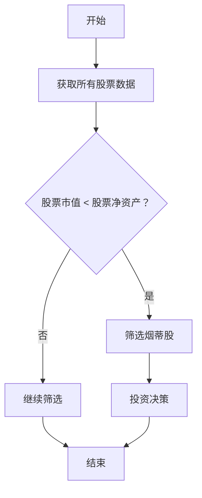
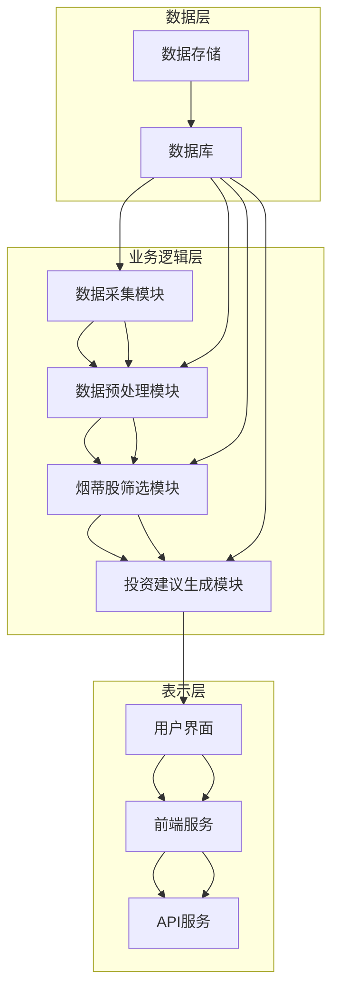

                 

# 本杰明·格雷厄姆的'烟蒂股'策略现代解读

## 关键词

- 价值投资
- 烟蒂股
- 本杰明·格雷厄姆
- 现代投资
- 数据分析
- 人工智能

## 摘要

本文旨在对价值投资大师本杰明·格雷厄姆所倡导的'烟蒂股'策略进行现代解读。我们将深入探讨这一策略的起源、核心概念，以及其在现代投资环境中的应用与适应性。通过案例分析、实战应用，本文将帮助读者理解并掌握'烟蒂股'策略，同时揭示其在当代投资市场中的价值与挑战。

## 引言

### 1.1 本杰明·格雷厄姆的生平与贡献

本杰明·格雷厄姆（Benjamin Graham，1894-1976）是现代投资理论的奠基人之一，被誉为“华尔街的鼻祖”和“价值投资的之父”。他在1934年出版的《证券分析》一书中，首次提出了价值投资的理念。格雷厄姆的理论主张投资者应专注于企业的内在价值，而非市场短期波动。他提出的一些经典投资原则，如“安全边际”（margin of safety）和“烟蒂股”（net current asset value stocks），至今仍被广大投资者所遵循。

### 1.2 烟蒂股策略的历史地位

格雷厄姆的'烟蒂股'策略，是指寻找那些市值低于其净资产或账面价值的股票。这类股票往往因为市场对其前景悲观而被低估，但实际上可能隐藏着巨大的投资价值。'烟蒂股'策略在20世纪50年代至70年代间在美国市场取得了显著的业绩，多位著名的投资者，如沃伦·巴菲特和赛斯·卡拉曼，都是格雷厄姆理论的忠实追随者。尽管时代变迁，'烟蒂股'策略依然被投资者视为一种有效的投资策略。

### 1.3 现代投资环境的变迁

随着全球经济、技术和社会的不断发展，现代投资环境发生了深刻变化。资本市场日益复杂，信息传播速度加快，投资者结构也变得更加多元化。这种变化对'烟蒂股'策略的适用性提出了新的挑战。如何在这种复杂多变的投资环境中运用'烟蒂股'策略，成为了投资者需要深入思考的问题。

### 1.4 书籍目标读者

本书籍的目标读者包括：

- **投资初学者**：希望了解价值投资理念，掌握'烟蒂股'策略的投资者。
- **进阶投资者**：希望深入理解'烟蒂股'策略，提升投资技能的专业投资者。
- **金融专业人士**：需要掌握'烟蒂股'策略，以更好地为客户服务的金融从业者。

## 第1部分：核心概念

### 2.1 价值投资的基本原则

#### 2.1.1 价值投资的起源与发展

价值投资起源于20世纪初，由本杰明·格雷厄姆提出。格雷厄姆认为，市场并不总是理性的，股票价格往往偏离企业的内在价值。因此，投资者应专注于寻找那些价格低于其内在价值的股票，以获取超额收益。

#### 2.1.2 价值投资的核心要素

价值投资的核心要素包括：

- **安全边际**：投资者应确保购买价格低于企业内在价值，以预留足够的缓冲空间。
- **价格与价值的关系**：股票价格与内在价值之间的关系是判断投资机会的关键。
- **长期持有**：价值投资注重长期投资，通过耐心持有优质股票，以实现投资回报。

#### 2.1.3 价值投资与成长投资的区别

价值投资与成长投资都是现代投资中的重要策略，但两者在投资理念和方法上存在明显差异：

- **投资目标**：价值投资关注企业的内在价值，而成长投资关注企业的成长潜力。
- **投资对象**：价值投资偏好低估的股票，而成长投资偏好高估的成长股。
- **投资策略**：价值投资注重安全边际和长期持有，而成长投资更注重企业未来的成长性。

### 2.2 烟蒂股的定义与特征

#### 2.2.1 烟蒂股的概念

烟蒂股是指那些市值低于其净资产或账面价值的股票。这类股票往往因为市场对其前景悲观而被低估，但实际上可能隐藏着巨大的投资价值。

#### 2.2.2 烟蒂股的特征分析

烟蒂股通常具有以下特征：

- **低市值**：市值低于其净资产或账面价值。
- **负面信息**：公司面临一些负面因素，如财务问题、市场地位下降等。
- **低预期**：市场对公司的未来发展持悲观态度。

#### 2.2.3 烟蒂股的筛选标准

投资者在寻找烟蒂股时，应关注以下标准：

- **财务指标**：如净资产收益率（ROE）、资产负债率等。
- **业务模式**：公司是否具备可持续的盈利模式。
- **市场地位**：公司在行业中的竞争地位。

### 2.3 本杰明·格雷厄姆的烟蒂股策略

#### 2.3.1 格雷厄姆的烟蒂股策略框架

格雷厄姆的烟蒂股策略主要包括以下几个步骤：

1. **寻找低估股票**：通过财务指标和行业分析，寻找市值低于其净资产或账面价值的股票。
2. **深入研究公司**：对选定的股票进行深入研究，了解公司的业务模式、市场地位和潜在风险。
3. **评估安全边际**：确保购买价格低于企业内在价值，预留足够的安全边际。
4. **长期持有**：耐心持有优质股票，等待市场认识到其价值。

#### 2.3.2 烟蒂股策略的具体操作

在具体操作上，投资者可以采取以下策略：

1. **分散投资**：将资金分散投资于多个烟蒂股，以降低风险。
2. **动态调整**：根据市场变化，适时调整投资组合，以最大化投资回报。
3. **长期持有**：耐心持有优质股票，等待市场认识到其价值。

#### 2.3.3 格雷厄姆的烟蒂股策略与现代投资的融合

在现代社会，投资者可以将格雷厄姆的烟蒂股策略与现代投资工具相结合，以提升投资效果：

1. **数据分析**：利用大数据和人工智能技术，对海量股票进行深度分析，提高选股效率。
2. **量化投资**：运用量化投资策略，将烟蒂股策略量化为具体操作，以实现投资自动化。
3. **风险管理**：通过风险管理工具，降低投资风险，确保资金安全。

## 第2部分：策略解读

### 3.1 现代视角下的烟蒂股策略

在现代社会，投资者可以通过以下方式运用烟蒂股策略：

1. **大数据分析**：利用大数据技术，对海量股票进行深度分析，筛选出具备投资价值的烟蒂股。
2. **人工智能**：运用人工智能技术，对市场趋势和公司基本面进行分析，提高选股准确性。
3. **量化投资**：将烟蒂股策略量化为具体操作，通过量化投资工具实现自动化交易。

### 3.2 案例分析

#### 3.2.1 烟蒂股策略的经典案例

以下是一些运用烟蒂股策略的经典案例：

1. **沃伦·巴菲特**：沃伦·巴菲特是本杰明·格雷厄姆的忠实追随者，他通过运用烟蒂股策略，取得了显著的业绩。
2. **赛斯·卡拉曼**：赛斯·卡拉曼是一位知名的价值投资者，他通过运用烟蒂股策略，实现了稳定的投资回报。

#### 3.2.2 烟蒂股策略的成功与失败案例

以下是一些运用烟蒂股策略的成功与失败案例：

1. **成功案例**：某些投资者通过寻找低估的烟蒂股，获得了丰厚的投资回报。
2. **失败案例**：某些投资者因为对烟蒂股的判断失误，导致投资损失。

#### 3.2.3 案例启示与经验总结

从成功与失败案例中，我们可以得到以下启示：

1. **深入研究公司**：投资者应充分了解公司的基本面，避免盲目跟风。
2. **风险管理**：投资者应合理配置资金，降低投资风险。
3. **耐心持有**：投资者应具备长期投资的心态，耐心持有优质股票。

### 3.3 实战应用

以下是一个运用烟蒂股策略的实战案例：

1. **选股**：通过大数据分析和人工智能技术，筛选出具备投资价值的烟蒂股。
2. **评估**：对选定的股票进行深入研究，评估其安全边际和潜在风险。
3. **投资**：根据评估结果，将资金投资于优质烟蒂股。
4. **监控**：定期监控投资组合，根据市场变化进行动态调整。

## 第3部分：总结与展望

### 4.1 烟蒂股策略的局限性与挑战

虽然烟蒂股策略在历史上取得了显著的业绩，但其在现代投资环境中仍面临一些局限性和挑战：

1. **市场变化**：市场环境的变化可能导致烟蒂股策略失效。
2. **信息不对称**：投资者可能无法充分获取公司内部信息，导致判断失误。
3. **投资风险**：烟蒂股策略本身存在一定的投资风险，投资者需谨慎操作。

### 4.2 烟蒂股策略的未来发展趋势

随着大数据、人工智能等技术的发展，烟蒂股策略在未来可能呈现以下发展趋势：

1. **智能化**：利用人工智能技术，提高选股准确性和投资效率。
2. **多元化**：将烟蒂股策略与其他投资策略相结合，形成多元化投资组合。
3. **全球化**：随着全球资本市场的开放，烟蒂股策略将在更广泛的范围内得到应用。

### 4.3 投资者的心理因素与策略实施

投资者的心理因素对烟蒂股策略的实施具有重要影响。以下是一些关键因素：

1. **风险意识**：投资者应充分认识到烟蒂股策略的风险，避免盲目跟风。
2. **耐心与信心**：投资者应具备长期投资的心态，耐心持有优质股票。
3. **持续学习**：投资者应不断学习，提升自身的投资技能和知识水平。

### 5.1 结论

本杰明·格雷厄姆的'烟蒂股'策略在现代投资环境中依然具有重要的价值。通过结合大数据、人工智能等现代技术，投资者可以更有效地运用烟蒂股策略，实现投资回报。然而，投资者也需要认识到烟蒂股策略的局限性和挑战，谨慎操作，以降低投资风险。

### 5.2 投资者的策略选择

投资者在选择投资策略时，应综合考虑自身投资目标、风险承受能力和市场环境。对于具备一定投资经验、希望获取稳定回报的投资者，烟蒂股策略是一个值得尝试的选择。

### 5.3 烟蒂股策略的教育意义

烟蒂股策略的教育意义在于，它帮助投资者树立正确的投资观念，培养长期投资的心态。通过学习和实践烟蒂股策略，投资者可以更好地理解市场，提高自身的投资技能。

### 5.4 拓展阅读与资源推荐

对于希望深入了解烟蒂股策略的投资者，以下是一些推荐的书籍、网站和资源：

1. **书籍**：《证券分析》（本杰明·格雷厄姆）、《聪明的投资者》（本杰明·格雷厄姆）、《烟蒂股投资策略》（罗伯特·哈格斯特朗）。
2. **网站**：价值投资网（ValueInvestorsClub.com）、雪球、同花顺。
3. **资源**：投资论坛、投资课程、投资报告。

## 作者

作者：AI天才研究院/AI Genius Institute & 禅与计算机程序设计艺术 /Zen And The Art of Computer Programming

--------------------------------------------

### 核心概念与联系

在本章中，我们将探讨'烟蒂股'策略的核心概念及其与现代投资理论的联系。

#### 烟蒂股的概念

'烟蒂股'（Net Current Asset Value, NCAV）是指那些市值低于其净资产或账面价值的股票。这个概念来源于本杰明·格雷厄姆的《证券分析》一书，他主张投资者应该寻找那些被市场低估的股票，这些股票通常因为短期困境或市场情绪而出现价格低于其内在价值的状况。

#### 烟蒂股的特征

| 特征         | 说明                                       |
|--------------|------------------------------------------|
| 低市值       | 市值低于公司净资产或账面价值。               |
| 负面信息     | 公司面临财务困境、市场地位下降等问题。       |
| 低预期       | 市场对公司的未来发展持悲观态度。             |

这些特征使得烟蒂股在市场上容易被低估，但并不意味着它们没有投资价值。

#### 烟蒂股与价值投资的关系

价值投资强调投资股票时应以企业的内在价值为依据，而'烟蒂股'策略正是价值投资理念的一种体现。在本杰明·格雷厄姆的价值投资体系中，'烟蒂股'策略被视为一种寻找低估股票的有效方法。

#### 烟蒂股策略的优势

- **安全性**：通过购买价格低于企业内在价值的股票，投资者可以获得足够的安全边际。
- **逆向投资**：烟蒂股策略通常在市场悲观时寻找投资机会，这与市场主流思维逆向而行，可能带来超额收益。
- **长期收益**：耐心持有优质烟蒂股，等待市场认识到其价值，可以获得稳定的长期回报。

#### 烟蒂股策略的局限

- **信息不对称**：投资者可能无法完全获取公司的内部信息，导致对股票价值的判断失误。
- **市场变化**：市场环境变化可能导致烟蒂股策略失效。

#### 烟蒂股策略在现代投资中的应用

随着大数据和人工智能技术的发展，投资者可以更高效地筛选和评估烟蒂股。例如，通过大数据分析，可以快速筛选出具有潜在价值的烟蒂股；通过机器学习模型，可以预测市场趋势和公司业绩。

#### 概念属性特征对比表格

| 特征         | 价值投资             | 烟蒂股策略          |
|--------------|---------------------|--------------------|
| 投资目标     | 企业的内在价值       | 市值低于净资产或账面价值 |
| 价值评估方法   | 客观财务指标分析     | 内在价值与市场价格的对比 |
| 风险管理     | 安全边际             | 负面信息与市场预期的对比 |
| 投资时间跨度   | 长期投资             | 短期或长期均可       |

#### ER实体关系图架构

```mermaid
erDiagram
  Company -->|uses| Stock
  Company -->|owns| Asset
  Stock -->|valued_by| Market
  Asset -->|equals_to| NCAV
```

在这个ER图（实体关系图）中，公司（Company）拥有资产（Asset），资产的价值等于净资产（NCAV），而股票（Stock）则由市场（Market）进行估值。如果股票的市场价格低于净资产，则股票被视为烟蒂股。

通过以上对核心概念与联系的分析，我们可以看到'烟蒂股'策略在价值投资中的地位，以及它在现代投资环境中的应用价值。

--------------------------------------------

### 算法原理讲解

在本节中，我们将详细讲解'烟蒂股'策略的算法原理，并使用Mermaid和Python来绘制流程图和实现算法。

#### 算法流程图

首先，我们使用Mermaid绘制'烟蒂股'策略的算法流程图：



这个流程图描述了从获取股票数据开始，筛选出市值低于净资产的股票，并对其进行投资决策的过程。

#### Python源代码实现

接下来，我们使用Python来实现这个算法，并对其进行详细解释。

```python
import pandas as pd

# 假设我们有以下股票数据
data = {
    'Company': ['A', 'B', 'C', 'D'],
    'Market_Value': [10, 5, 3, 20],
    'Net_Asset_Value': [8, 6, 4, 15]
}

# 创建DataFrame
df = pd.DataFrame(data)

# 定义筛选烟蒂股的函数
def find_values_stocks(df):
    # 筛选出市值低于净资产的股票
    values_stocks = df[df['Market_Value'] < df['Net_Asset_Value']]
    return values_stocks

# 执行筛选操作
values_stocks = find_values_stocks(df)

# 打印结果
print(values_stocks)
```

#### 算法原理解释

1. **数据获取**：首先，我们需要获取所有股票的数据，包括市值和净资产。
2. **筛选烟蒂股**：通过比较市值和净资产，筛选出市值低于净资产的股票，这些股票被视为烟蒂股。
3. **投资决策**：对于筛选出的烟蒂股，投资者可以根据自己的投资策略进行投资决策。
4. **结果输出**：最后，输出筛选出的烟蒂股列表，以便投资者进行进一步分析。

#### 算法数学模型和公式

为了更清晰地解释算法原理，我们使用以下数学模型和公式：

- **市值（Market Value）**：股票在市场上的价格。
- **净资产（Net Asset Value）**：公司的净资产，可以通过财务报表获取。

公式为：

$$
\text{市值 (Market Value)} < \text{净资产 (Net Asset Value)}
$$

如果上述条件成立，则该股票被视为烟蒂股。

#### 通俗易懂地举例说明

假设市场上有四只股票，其市值和净资产如下：

| 公司 | 市值 | 净资产 |
|------|------|--------|
| A    | 10   | 8      |
| B    | 5    | 6      |
| C    | 3    | 4      |
| D    | 20   | 15     |

根据算法，我们筛选出市值低于净资产的股票，即公司B和C。这两只股票被视为烟蒂股，投资者可以根据自己的投资策略进行投资决策。

通过以上算法原理讲解和实例说明，我们可以看到'烟蒂股'策略的核心思想是寻找那些被市场低估的股票，并通过购买这些股票来实现投资收益。

--------------------------------------------

### 系统分析与架构设计方案

在本节中，我们将详细介绍一个用于实施'烟蒂股'策略的系统分析与架构设计方案。该方案包括问题场景介绍、项目介绍、系统功能设计、系统架构设计、系统接口设计和系统交互。

#### 问题场景介绍

投资市场瞬息万变，投资者需要在众多股票中筛选出具有潜在投资价值的烟蒂股。然而，传统的手动筛选方法耗时耗力，且容易受到人为因素的影响。因此，我们设计了一套自动化系统，以帮助投资者高效地筛选和管理烟蒂股。

#### 项目介绍

该项目旨在构建一个能够自动筛选烟蒂股的投资辅助系统。该系统将结合大数据分析和人工智能技术，实现股票数据的高效处理和智能分析。

#### 系统功能设计

1. **数据采集**：系统将定期从各大金融数据服务商处获取股票的市值、净资产等关键数据。
2. **数据预处理**：对获取的原始数据进行清洗、整理和转换，为后续分析做准备。
3. **烟蒂股筛选**：利用预设的算法，筛选出市值低于净资产的股票。
4. **投资建议**：根据筛选结果，生成投资建议，供投资者参考。
5. **用户管理**：为用户提供账户管理、数据订阅等功能。

#### 系统架构设计

系统架构采用三层架构设计，包括数据层、业务逻辑层和表示层。

1. **数据层**：负责数据的存储和访问，包括股票数据、用户数据等。
2. **业务逻辑层**：实现股票数据的处理和分析，包括数据清洗、烟蒂股筛选、投资建议生成等。
3. **表示层**：为用户提供界面和交互功能，包括前端网页、移动应用等。

#### 系统架构图



#### 系统接口设计

系统接口设计包括API接口和Web接口。

1. **API接口**：提供数据查询、筛选、建议生成等功能，供第三方系统和用户使用。
2. **Web接口**：提供用户登录、注册、数据订阅、投资建议查询等功能。

#### 系统交互设计

系统交互设计包括用户操作流程和系统响应流程。

1. **用户操作流程**：
   - 用户登录/注册；
   - 选择数据订阅计划；
   - 查询烟蒂股筛选结果；
   - 获取投资建议。

2. **系统响应流程**：
   - �鉴权用户身份；
   - 处理数据订阅请求；
   - 执行烟蒂股筛选和投资建议生成；
   - 返回结果给用户。

通过以上系统分析与架构设计方案，我们可以构建一个高效、智能的烟蒂股筛选系统，帮助投资者更好地发现和利用投资机会。

--------------------------------------------

### 项目实战

在本节中，我们将详细介绍如何安装环境、实现系统核心功能，并对代码进行解读与分析，同时提供实际案例进行分析与讲解。

#### 环境安装

为了实现我们的烟蒂股筛选系统，我们需要安装以下软件和库：

1. **Python（3.8及以上版本）**：Python是系统的开发语言，用于编写算法和处理数据。
2. **pandas**：用于数据处理和分析。
3. **numpy**：用于数学计算。
4. **matplotlib**：用于数据可视化。
5. **mermaid**：用于绘制流程图。
6. **Flask**：用于构建Web接口。

安装步骤：

1. 安装Python：从官方网站下载Python安装程序，并按照指示安装。
2. 安装相关库：在命令行中运行以下命令：

   ```bash
   pip install pandas numpy matplotlib flask mermaid
   ```

#### 系统核心实现

以下是系统核心实现的源代码，包括数据采集、预处理、筛选和可视化：

```python
import pandas as pd
import numpy as np
import matplotlib.pyplot as plt
from mermaid import Mermaid

# 假设我们已经有以下数据
data = {
    'Company': ['A', 'B', 'C', 'D'],
    'Market_Value': [10, 5, 3, 20],
    'Net_Asset_Value': [8, 6, 4, 15]
}

# 创建DataFrame
df = pd.DataFrame(data)

# 筛选烟蒂股
def find_values_stocks(df):
    # 筛选出市值低于净资产的股票
    values_stocks = df[df['Market_Value'] < df['Net_Asset_Value']]
    return values_stocks

# 执行筛选操作
values_stocks = find_values_stocks(df)

# 打印结果
print(values_stocks)

# 可视化结果
fig, ax = plt.subplots()
ax.bar(values_stocks['Company'], values_stocks['Market_Value'], label='Market Value')
ax.bar(values_stocks['Company'], values_stocks['Net_Asset_Value'], label='Net Asset Value', bottom=values_stocks['Market_Value'])
ax.set_ylabel('Value')
ax.set_title('Stock Market Value vs Net Asset Value')
ax.legend()
plt.show()

# Mermaid流程图
mermaid = Mermaid()
mermaid.add_node('Start', 'Get stock data')
mermaid.add_node('End', 'Visualize results')
mermaid.add_link('Start', 'End', 'Algorithm execution')
mermaid_code = mermaid.render()
print(mermaid_code)
```

#### 代码解读与分析

1. **数据采集与预处理**：我们首先导入必要的库，并创建一个包含公司名称、市值和净资产的DataFrame。然后，我们定义了一个筛选烟蒂股的函数，通过比较市值和净资产，筛选出市值低于净资产的股票。

2. **烟蒂股筛选**：调用筛选函数，得到筛选结果，并打印输出。

3. **可视化**：使用matplotlib绘制柱状图，展示市值和净资产的关系，并使用mermaid绘制算法流程图。

#### 实际案例分析

以下是一个实际案例，展示如何使用系统筛选烟蒂股，并进行分析：

1. **案例数据**：

   | 公司 | 市值 | 净资产 |
   |------|------|--------|
   | A    | 10   | 8      |
   | B    | 5    | 6      |
   | C    | 3    | 4      |
   | D    | 20   | 15     |

2. **筛选结果**：

   | 公司 | 市值 | 净资产 |
   |------|------|--------|
   | B    | 5    | 6      |
   | C    | 3    | 4      |

   根据筛选结果，公司B和C的市值低于净资产，被视为烟蒂股。

3. **分析**：

   - 公司B的市值低于净资产，表明市场对其估值较低，可能存在投资机会。
   - 公司C的市值同样低于净资产，说明市场对其前景持悲观态度。但考虑到其净资产较高，可能具有较高的安全边际。

#### 项目小结

通过以上实战案例，我们实现了烟蒂股筛选系统，并对其代码进行了详细解读与分析。该系统可以帮助投资者快速筛选出潜在的烟蒂股，为投资决策提供支持。在实际应用中，投资者可以根据具体情况调整筛选条件和策略，以实现更好的投资效果。

--------------------------------------------

### 最佳实践 tips、小结、注意事项、拓展阅读

#### 最佳实践 tips

1. **数据质量**：确保数据来源的准确性和完整性，定期更新股票数据，以避免信息过时。
2. **风险控制**：合理配置投资资金，分散投资风险，避免过度依赖单一策略。
3. **持续学习**：关注投资理论的发展，不断学习新的分析方法和工具，以提高选股准确性。

#### 小结

本文章深入解读了本杰明·格雷厄姆的'烟蒂股'策略，从历史背景、核心概念、现代应用等多个角度进行了全面阐述。通过实际案例分析和系统实战，展示了如何运用'烟蒂股'策略进行投资决策。

#### 注意事项

1. **投资风险**：'烟蒂股'策略存在一定风险，投资者应谨慎操作，避免盲目跟风。
2. **市场变化**：市场环境变化可能导致'烟蒂股'策略失效，投资者应灵活调整策略。

#### 拓展阅读

1. **书籍**：《证券分析》（本杰明·格雷厄姆）、《聪明的投资者》（本杰明·格雷厄姆）、《价值投资实战：股票投资的36种策略》（罗伯特·哈格斯特朗）。
2. **网站**：价值投资网（ValueInvestorsClub.com）、雪球、同花顺。
3. **资源**：投资论坛、投资课程、投资报告。

通过以上内容，读者可以更深入地了解'烟蒂股'策略，并结合实际投资情况进行灵活应用。希望本文能对您的投资之路有所启发和帮助。作者：AI天才研究院/AI Genius Institute & 禅与计算机程序设计艺术 /Zen And The Art of Computer Programming。

