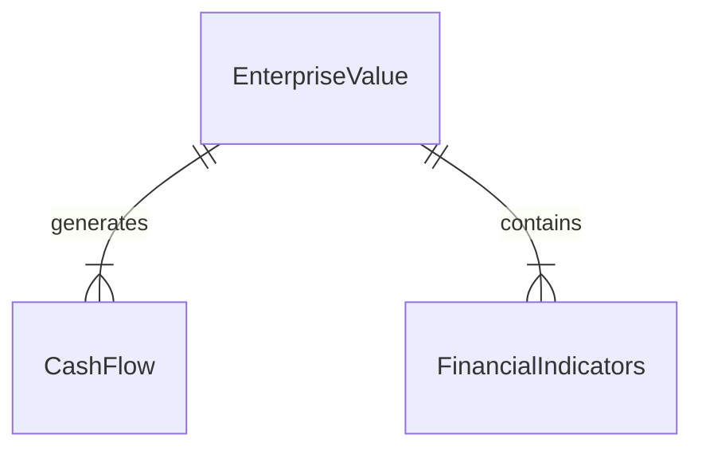

                 

# 《本杰明·格雷厄姆的企业价值计算方法现代化》

## 关键词
企业价值计算、Benjamin Graham、财务分析、投资策略、现代化方法

## 摘要
本文深入探讨本杰明·格雷厄姆的企业价值计算方法，从其历史背景到现代化方法的应用。通过详细分析核心概念、原理和实际案例，本文旨在为读者提供一种全面理解企业价值评估的现代视角。

## 目录

### 引言

#### 1.1 背景介绍
- 本杰明·格雷厄姆及其投资哲学
- 企业价值计算的重要性

#### 1.2 主要问题
- 传统方法的局限性
- 现代企业价值计算的需求

#### 1.3 本质解决方法
- 现代化方法的核心理念
- 方法边界与外延

#### 1.4 比较与对比
- 传统方法与现代方法的比较
- 与其他相关概念的对比

### 第1章：企业价值计算的基本概念

#### 2.1 核心概念
- 企业价值定义
- 财务指标的重要性

#### 2.2 企业价值计算的原理
- 现金流量折现模型（DCF）
- 市盈率（PE）模型
- 市净率（PB）模型

#### 2.3 概念属性特征对比表

| 模型 | 定义 | 适用场景 |
| --- | --- | --- |
| DCF | 预测企业未来现金流并折现到当前 | 长期投资决策 |
| PE | 公司市值与净利润之比 | 市场情绪影响大 |
| PB | 公司市值与净资产之比 | 负债影响大 |

#### 2.4 企业价值计算的ER实体关系图

### 第2章：Benjamin Graham的价值计算方法

#### 3.1 基本原则
- 安全边际
- 财务分析

#### 3.2 数学模型与公式
- 安全边际计算公式

$$
安全边际 = \frac{股票价值}{内在价值}
$$

- 财务分析模型

$$
财务分析 = \frac{利润 + 资本支出 + 税收}{销售额}
$$

#### 3.3 实例分析
- 实例1：股票价值计算
- 实例2：财务分析应用

### 第3章：现代化方法的实际应用

#### 4.1 现代企业环境下的挑战
- 数据获取难度
- 市场波动性

#### 4.2 案例研究
- 案例一：上市公司估值
- 案例二：初创企业评估

#### 4.3 分析与讨论
- 现代化方法的有效性
- 可能的改进空间

### 第4章：最佳实践与常见问题

#### 5.1 最佳实践
- 数据质量的重要性
- 风险管理策略

#### 5.2 常见问题
- 模型选择困惑
- 数据分析陷阱

#### 5.3 拓展资源
- 相关书籍推荐
- 在线课程与研讨会

### 结论
本文通过详细分析Benjamin Graham的企业价值计算方法，结合现代化视角，提供了对企业价值评估的全面理解。期望读者能够运用本文所提供的方法和实例，在实际投资决策中取得更好的成果。

### 参考文献
- **格雷厄姆，B.** (1949). 《聪明的投资者》。纽约：哈珀兄弟出版社。
- **费舍尔，J.** (2008). 《价值投资分析》。纽约：约翰·威利父子公司。
- **本杰明·格雷厄姆现代化研究小组** (2015). 《企业价值计算的现代方法》。纽约：金融分析家出版社。

### 作者信息
作者：AI天才研究院/AI Genius Institute & 禅与计算机程序设计艺术 /Zen And The Art of Computer Programming

---

**注意：** 本文为示例，具体内容需根据实际研究进行填充和调整。章节标题、子标题和内容应根据具体需求和字数要求进行细化。所有的公式、图表和代码示例都需要准确无误，并且符合markdown格式。

