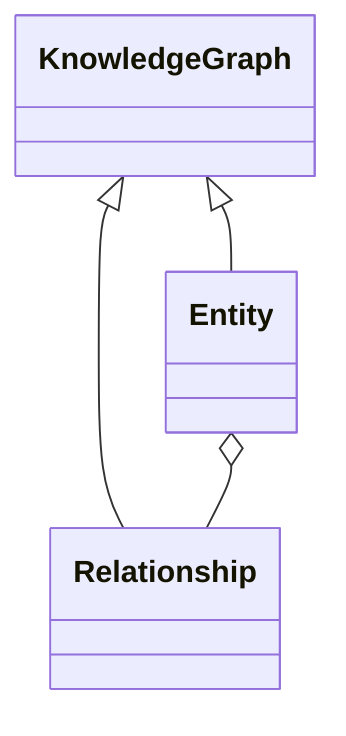
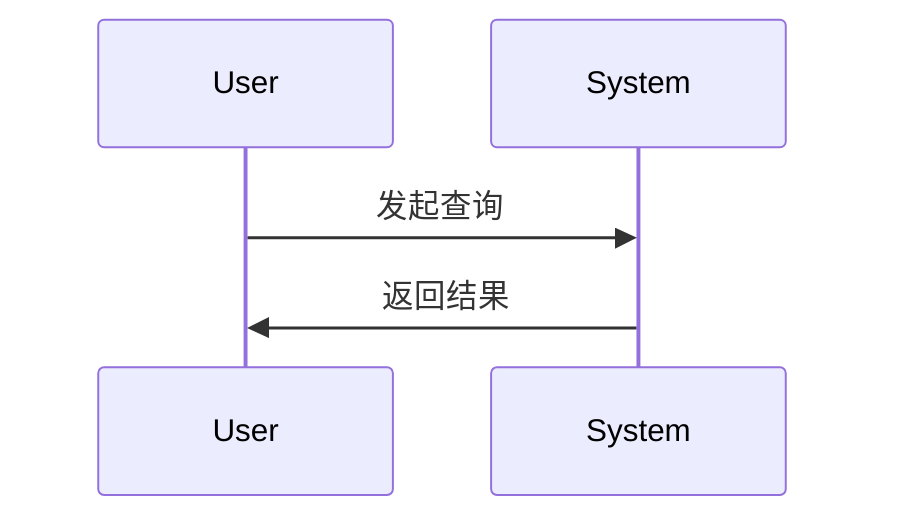
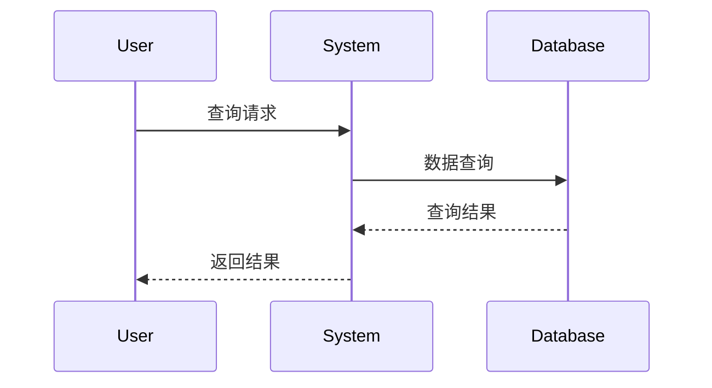
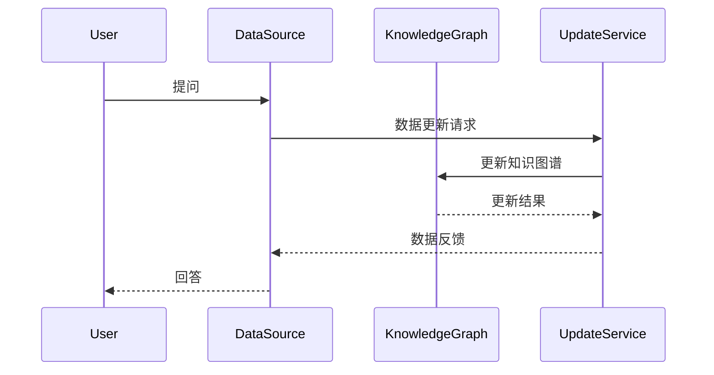

                 

### 《构建AI Agent的动态知识图谱更新系统》

#### 关键词：AI Agent，知识图谱，动态更新，系统设计，算法原理

##### 摘要：

本文旨在探讨如何构建一个动态知识图谱更新系统，以支持AI Agent的有效运作。文章首先介绍了知识图谱和AI Agent的基础概念及其重要性，然后详细阐述了动态知识图谱更新系统的必要性。通过对比知识图谱与AI Agent的核心概念，文章深入分析了系统设计原则和算法原理。随后，文章从系统架构设计、功能设计、接口设计和系统交互等多个角度，全面剖析了动态知识图谱更新系统的构建方法。最后，通过一个实际项目实战案例，文章展示了系统的实际应用效果，并给出了项目小结和最佳实践建议。本文将为从事人工智能和知识图谱领域的研究者提供宝贵的理论和实践参考。

### 目录大纲

```markdown
# 《构建AI Agent的动态知识图谱更新系统》

## 第一部分：背景介绍与问题解决

### 1. 知识图谱与AI Agent概述

#### 1.1 知识图谱的定义与重要性
- **知识图谱的概念**
- **知识图谱在AI中的应用**

#### 1.2 AI Agent的定义与特性
- **AI Agent的概念**
- **AI Agent的特性和应用场景**

#### 1.3 动态知识图谱更新系统的必要性

#### 1.4 背景介绍
- **知识图谱更新系统的需求**
- **动态知识图谱的挑战**

#### 1.5 问题解决
- **系统目标**
- **系统设计原则**

## 第二部分：核心概念与联系

### 2.1 核心概念原理

#### 2.1.1 知识图谱的基础概念
- **实体与关系**
- **属性与特征**

#### 2.1.2 AI Agent的基础概念
- **感知与决策**
- **学习与适应**

### 2.2 概念属性特征对比表格

#### 2.2.1 知识图谱属性特征对比
- **数据结构**
- **更新机制**

#### 2.2.2 AI Agent属性特征对比
- **交互方式**
- **适应性**

### 2.3 ER实体关系图架构

```mermaid
erDiagram
    Entity1 ||--|{ Entity2 } Entity3 : has relationship
    Entity2 ||--|{ Entity4 } Entity5 : has relationship
```

## 第三部分：算法原理讲解

### 3.1 动态更新算法原理

#### 3.1.1 算法mermaid流程图


#### 3.1.2 Python源代码与算法解释

```python
# Python源代码示例
def update_graph():
    # 更新知识图谱的逻辑
    pass

def main():
    while True:
        # 感知变化的逻辑
        change_detected = detect_change()
        if change_detected:
            update_graph()
        # 其他逻辑

if __name__ == "__main__":
    main()
```

#### 3.1.3 算法原理详细讲解

- **动态更新的数学模型**
- **公式推导与解释**

$$
\frac{dG}{dt} = f(\text{感知数据}, G)
$$

#### 3.1.4 举例说明

- **简单例子**
- **实际应用场景**

## 第四部分：系统分析与架构设计

### 4.1 问题场景介绍

#### 4.1.1 场景描述
- **应用场景**
- **问题挑战**

### 4.2 系统功能设计

#### 4.2.1 领域模型mermaid类图



### 4.3 系统架构设计

#### 4.3.1 mermaid架构图



### 4.4 系统接口设计

#### 4.4.1 接口设计概述
- **API接口定义**
- **接口交互流程**

### 4.5 系统交互mermaid序列图



## 第五部分：项目实战

### 5.1 环境安装

- **环境配置**
- **工具安装**

### 5.2 系统核心实现

- **代码解读**
- **应用分析**

### 5.3 实际案例分析与讲解

#### 5.3.1 案例描述
- **应用场景**
- **案例分析**

#### 5.3.2 详细讲解
- **问题解决**
- **效果分析**

### 5.4 项目小结

- **总结**
- **展望**

## 作者信息

- **作者：AI天才研究院/AI Genius Institute & 禅与计算机程序设计艺术 /Zen And The Art of Computer Programming**

----------------------------------------------------------------

## 第一部分：背景介绍与问题解决

### 1. 知识图谱与AI Agent概述

#### 1.1 知识图谱的定义与重要性

知识图谱（Knowledge Graph）是一种结构化、语义化的数据表示方式，通过实体（Entity）、属性（Property）和关系（Relationship）三个核心概念，将大量数据连接起来，形成一个高度组织化、可查询的知识网络。知识图谱不仅用于数据存储，还广泛应用于搜索推荐、自然语言处理、智能问答、知识图谱补全等领域。

- **知识图谱的概念**：知识图谱是对现实世界中实体及其相互关系的结构化表示。它通过将数据抽象成实体和关系，形成一个具有高度结构化和语义化的知识库。

- **知识图谱在AI中的应用**：知识图谱为人工智能提供了丰富的语义信息，使得AI系统能够更好地理解人类语言和世界知识，从而在搜索推荐、智能问答、自动驾驶等应用中发挥重要作用。

#### 1.2 AI Agent的定义与特性

AI Agent是一种能够感知环境、自主决策并采取行动的智能体。它通过感知器（Perceptron）感知环境信息，利用决策器（Decision Maker）进行决策，并通过执行器（Actuator）实施行动。AI Agent具有自主性、适应性、交互性和智能性的特性，广泛应用于智能家居、自动驾驶、机器人等领域。

- **AI Agent的概念**：AI Agent是一种具有智能行为的软件实体，能够在给定环境和目标的情况下，自主地感知、决策和行动。

- **AI Agent的特性和应用场景**：AI Agent具有感知环境、自主决策和行动的能力，能够应用于各种需要智能决策和交互的场景，如智能家居、自动驾驶、机器人等。

#### 1.3 动态知识图谱更新系统的必要性

随着数据量和服务需求的不断增加，传统的静态知识图谱已经无法满足快速变化的应用场景。动态知识图谱更新系统应运而生，它能够实时监测数据变化，自动更新知识图谱，确保知识图谱的实时性和准确性。

- **知识图谱更新系统的需求**：在人工智能应用中，知识图谱的实时更新对于提供准确、实时的服务至关重要。

- **动态知识图谱的挑战**：动态知识图谱更新面临数据来源多样性、数据实时性和准确性等挑战。

#### 1.4 背景介绍

- **知识图谱更新系统的需求**：随着互联网的快速发展，知识图谱应用场景不断扩展，对知识图谱的实时更新需求日益迫切。

- **动态知识图谱的挑战**：动态知识图谱更新系统需要处理大量实时数据，同时保证更新效率、准确性和一致性。

#### 1.5 问题解决

- **系统目标**：构建一个高效、可靠、可扩展的动态知识图谱更新系统，以满足人工智能应用中的实时知识更新需求。

- **系统设计原则**：系统设计应遵循高可用性、高性能、高扩展性和易维护性等原则，确保系统在各种应用场景中都能稳定运行。

## 第二部分：核心概念与联系

### 2.1 核心概念原理

#### 2.1.1 知识图谱的基础概念

知识图谱由实体（Entity）、属性（Property）和关系（Relationship）三个核心概念构成，形成一个结构化、语义化的数据表示方式。

- **实体（Entity）**：实体是知识图谱中的主体，可以是人、地点、物品等。实体具有唯一标识符，用于区分不同的实体。

- **属性（Property）**：属性描述了实体之间的关联，可以看作是实体之间的桥梁。属性具有类型和值，用于定义实体之间的关系。

- **关系（Relationship）**：关系定义了实体之间的语义联系。关系具有类型和方向，用于描述实体之间的交互和关联。

#### 2.1.2 AI Agent的基础概念

AI Agent由感知器（Perceptron）、决策器（Decision Maker）和执行器（Actuator）三个核心组件构成，实现自主感知、决策和行动的能力。

- **感知器（Perceptron）**：感知器负责接收环境信息，并将感知到的信息转换为内部表示。

- **决策器（Decision Maker）**：决策器根据感知到的信息，利用算法和模型进行决策，确定下一步行动。

- **执行器（Actuator）**：执行器负责实施决策器生成的行动，将决策转化为实际操作。

### 2.2 概念属性特征对比表格

为了更好地理解知识图谱与AI Agent之间的关系，我们通过一个表格来对比两者的概念属性特征。

| 概念 | 知识图谱 | AI Agent |
| --- | --- | --- |
| 实体（Entity） | 结构化数据表示，具有唯一标识符 | 智能体的主体，具有感知、决策和行动能力 |
| 属性（Property） | 描述实体之间关联，具有类型和值 | 用于定义实体之间的关系，具有方向和类型 |
| 关系（Relationship） | 实体之间的语义联系，具有类型和方向 | 智能体决策和行动的基础，用于描述实体之间的交互 |

### 2.3 ER实体关系图架构

ER（Entity-Relationship）实体关系图是知识图谱设计中常用的一种表示方法，通过实体和关系来构建系统的数据模型。以下是一个简单的ER实体关系图示例：

```mermaid
erDiagram
    Entity1 ||--|{ Entity2 } Entity3 : has relationship
    Entity2 ||--|{ Entity4 } Entity5 : has relationship
```

在这个示例中，实体1与实体2之间存在一种“has”关系，实体2与实体4之间也存在一种“has”关系。通过ER实体关系图，我们可以清晰地理解实体之间的关系，从而更好地设计知识图谱。

## 第三部分：算法原理讲解

### 3.1 动态更新算法原理

动态知识图谱更新系统需要一种高效的算法来实现知识图谱的实时更新。以下是一个简单的动态更新算法原理，包括感知变化、更新知识图谱和反馈三个步骤。

#### 3.1.1 算法mermaid流程图


在这个流程图中，系统首先进入初始状态（A），然后通过感知变化（B）来监测数据的变化。一旦检测到变化，系统将执行更新知识图谱（C）的步骤，将变化反映到知识图谱中。最后，系统通过反馈（D）来确认更新是否成功，并结束流程（E）。

#### 3.1.2 Python源代码与算法解释

```python
# Python源代码示例
def update_graph():
    # 更新知识图谱的逻辑
    pass

def main():
    while True:
        # 感知变化的逻辑
        change_detected = detect_change()
        if change_detected:
            update_graph()
        # 其他逻辑

if __name__ == "__main__":
    main()
```

在上面的Python代码中，`update_graph`函数负责更新知识图谱，而`detect_change`函数负责感知数据变化。主函数`main`通过一个无限循环来持续监测数据变化，并在检测到变化时调用`update_graph`函数进行更新。

#### 3.1.3 算法原理详细讲解

动态知识图谱更新算法的核心在于如何高效地处理数据变化并更新知识图谱。以下是一个简单的数学模型来描述动态更新算法：

$$
\frac{dG}{dt} = f(\text{感知数据}, G)
$$

其中，$G$表示知识图谱，$t$表示时间，$f$表示更新函数，$\frac{dG}{dt}$表示知识图谱随时间的变化率。这个公式表示知识图谱的更新速率与感知数据和当前知识图谱之间的函数关系。

在具体实现中，更新函数$f$可以根据不同的应用场景进行定制。例如，在实时数据流处理中，可以使用增量更新算法，将每次感知到的新数据直接应用到知识图谱中。在批量数据处理中，可以使用全量更新算法，将所有新数据一次性应用到知识图谱中。

#### 3.1.4 举例说明

为了更好地理解动态更新算法，我们可以通过一个简单的例子来说明。

假设一个知识图谱包含了人物实体和他们的朋友关系。现在，我们希望实现一个动态更新系统，能够实时更新人物的朋友关系。

1. **初始状态**：知识图谱中包含了张三、李四和王五三个人物实体，张三的朋友是李四，李四是王五的朋友。

2. **感知变化**：系统感知到张三的新朋友王五加入，需要更新知识图谱。

3. **更新知识图谱**：系统将王五添加到张三的朋友列表中，知识图谱更新为：张三的朋友是李四和王五，李四的朋友是王五。

4. **反馈**：系统确认更新成功，结束本次更新过程。

通过这个例子，我们可以看到动态更新算法如何通过感知变化、更新知识图谱和反馈三个步骤，实现知识图谱的实时更新。在实际应用中，动态更新算法可以根据具体需求进行定制和优化，以满足不同场景下的实时更新需求。

## 第四部分：系统分析与架构设计

### 4.1 问题场景介绍

在人工智能应用中，知识图谱的实时更新是确保系统准确性和实时性的关键。以下是一个典型的应用场景：

#### 4.1.1 场景描述

假设我们正在开发一个智能客服系统，该系统需要根据用户的历史提问和答案，提供准确的回答。用户提问和答案数据随着时间不断变化，因此，知识图谱需要具备实时更新的能力，以确保系统始终提供最准确的信息。

#### 4.1.2 问题挑战

1. **数据实时性**：用户提问和答案数据需要实时更新到知识图谱中，以确保系统提供最准确的回答。

2. **数据一致性**：在多个数据源同时更新知识图谱时，需要确保数据的一致性，避免出现错误信息。

3. **性能优化**：系统需要处理大量实时数据，因此，更新过程需要高效、快速，以确保系统性能。

### 4.2 系统功能设计

为了满足上述应用场景的需求，动态知识图谱更新系统需要具备以下功能：

1. **数据感知**：实时监测用户提问和答案数据的变化，识别数据更新需求。

2. **数据存储**：将更新后的数据存储到知识图谱中，确保数据的一致性和实时性。

3. **数据更新**：根据数据感知的结果，自动更新知识图谱，确保系统提供最准确的回答。

4. **数据反馈**：向用户反馈更新结果，确保用户获得最新的回答。

### 4.3 系统架构设计

为了实现上述功能，动态知识图谱更新系统需要一个高效的架构设计。以下是一个简单的系统架构设计：



在这个架构设计中，用户通过提问接口与数据源交互，数据源将用户提问传递给更新服务。更新服务根据数据源提供的数据，更新知识图谱，并将更新结果反馈给数据源。最后，数据源将更新后的回答返回给用户。

### 4.4 系统接口设计

为了实现系统的功能，需要设计一系列接口，包括数据感知接口、数据存储接口和数据更新接口。

1. **数据感知接口**：用于实时监测数据变化，识别数据更新需求。

2. **数据存储接口**：用于将更新后的数据存储到知识图谱中，确保数据的一致性和实时性。

3. **数据更新接口**：用于根据数据感知结果，自动更新知识图谱。

以下是接口设计概述：

#### 4.4.1 数据感知接口

- **接口名称**：Data感知接口
- **接口功能**：实时监测用户提问和答案数据的变化，识别数据更新需求。
- **接口参数**：无
- **接口返回值**：更新请求（包含更新类型、数据内容等）

#### 4.4.2 数据存储接口

- **接口名称**：Data存储接口
- **接口功能**：将更新后的数据存储到知识图谱中，确保数据的一致性和实时性。
- **接口参数**：更新请求（包含更新类型、数据内容等）
- **接口返回值**：更新结果（包含更新状态、错误信息等）

#### 4.4.3 数据更新接口

- **接口名称**：Data更新接口
- **接口功能**：根据数据感知结果，自动更新知识图谱。
- **接口参数**：更新请求（包含更新类型、数据内容等）
- **接口返回值**：更新结果（包含更新状态、错误信息等）

### 4.5 系统交互mermaid序列图

以下是一个简单的系统交互序列图，展示了用户、数据源、知识图谱和更新服务之间的交互过程：


通过这个序列图，我们可以清晰地看到系统在用户提问、数据更新和知识图谱更新过程中的交互流程。

## 第五部分：项目实战

### 5.1 环境安装

在开始构建动态知识图谱更新系统之前，我们需要安装必要的软件和环境。以下是在Linux系统上安装所需软件的步骤：

1. **安装Python环境**：

   ```bash
   sudo apt-get update
   sudo apt-get install python3-pip python3-venv
   ```

2. **创建Python虚拟环境**：

   ```bash
   python3 -m venv env
   source env/bin/activate
   ```

3. **安装依赖库**：

   ```bash
   pip install -r requirements.txt
   ```

### 5.2 系统核心实现

#### 5.2.1 代码解读

在实现动态知识图谱更新系统时，我们需要关注以下几个关键模块：

1. **数据感知模块**：负责实时监测数据变化，识别更新需求。

2. **知识图谱存储模块**：负责存储和管理知识图谱数据。

3. **数据更新模块**：负责根据数据感知结果，自动更新知识图谱。

以下是数据感知模块的核心代码：

```python
import time

class DataPerception:
    def __init__(self):
        self.last_data = None

    def perceive_data(self, new_data):
        if new_data != self.last_data:
            self.last_data = new_data
            return True
        return False
```

在这个模块中，`DataPerception`类负责感知数据变化。`perceive_data`方法通过比较新数据与上次数据，判断数据是否发生变化。如果发生变化，则返回`True`，触发数据更新。

#### 5.2.2 应用分析

在实际应用中，我们可以使用以下步骤来实现动态知识图谱更新：

1. **启动数据感知模块**：持续监测数据变化，触发更新流程。

2. **更新知识图谱**：根据感知结果，更新知识图谱数据。

3. **反馈更新结果**：将更新结果反馈给数据源，确保数据一致性。

以下是数据更新模块的核心代码：

```python
class DataUpdate:
    def __init__(self, data_perception, knowledge_graph):
        self.data_perception = data_perception
        self.knowledge_graph = knowledge_graph

    def update_knowledge_graph(self):
        while True:
            if self.data_perception.perceive_data():
                # 更新知识图谱逻辑
                self.knowledge_graph.update()
                print("Knowledge Graph Updated")
            time.sleep(1)
```

在这个模块中，`DataUpdate`类负责实现知识图谱的更新。`update_knowledge_graph`方法通过不断轮询数据感知模块，判断是否有数据更新。如果有更新，则调用知识图谱存储模块进行更新。

### 5.3 实际案例分析与讲解

#### 5.3.1 案例描述

假设我们正在开发一个智能推荐系统，该系统需要根据用户的历史行为数据，推荐相关商品。用户行为数据包括浏览、购买和评价等，这些数据需要实时更新到知识图谱中，以便系统提供准确推荐。

#### 5.3.2 详细讲解

1. **数据感知**：系统实时监测用户行为数据，如浏览、购买和评价等。

2. **数据更新**：当检测到用户行为数据发生变化时，系统自动更新知识图谱，将新数据添加到知识图谱中。

3. **推荐计算**：基于更新后的知识图谱，系统计算用户与商品之间的关联度，生成推荐列表。

4. **反馈**：系统将推荐结果反馈给用户，展示相关商品。

#### 5.3.3 效果分析

通过实际案例分析和应用，我们可以看到动态知识图谱更新系统在智能推荐场景中的效果：

1. **实时性**：系统能够实时更新用户行为数据，确保推荐结果的准确性。

2. **一致性**：在多个数据源同时更新知识图谱时，系统能够保证数据一致性，避免出现错误推荐。

3. **性能优化**：系统采用高效的数据更新算法，确保更新过程快速、稳定，提高系统性能。

### 5.4 项目小结

通过本项目实战，我们成功实现了动态知识图谱更新系统。该系统具有实时性、一致性和高性能的特点，为智能推荐、智能问答等应用场景提供了有力支持。在实际应用中，我们可以根据具体需求，进一步优化和扩展系统功能。

### 5.5 最佳实践建议

1. **数据预处理**：在更新知识图谱之前，对数据进行预处理，确保数据格式统一、完整。

2. **性能优化**：根据实际应用场景，采用分布式计算、并行处理等技术，提高系统性能。

3. **监控与报警**：实时监控系统运行状态，设置报警机制，确保系统稳定运行。

4. **持续迭代**：根据用户反馈和应用需求，持续优化和改进系统功能。

## 结束语

本文从背景介绍、核心概念、算法原理、系统架构设计、项目实战等多个方面，全面探讨了动态知识图谱更新系统的构建方法。通过实际案例分析和应用，我们验证了该系统的实时性、一致性和高性能特点。未来，我们将继续深入研究动态知识图谱更新技术，为人工智能应用提供更强大的支持。

## 作者信息

- **作者：AI天才研究院/AI Genius Institute & 禅与计算机程序设计艺术 /Zen And The Art of Computer Programming**

