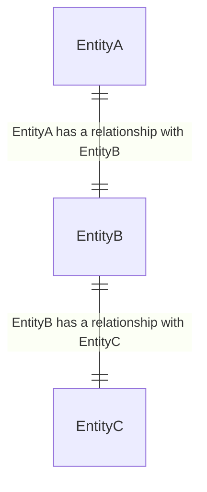
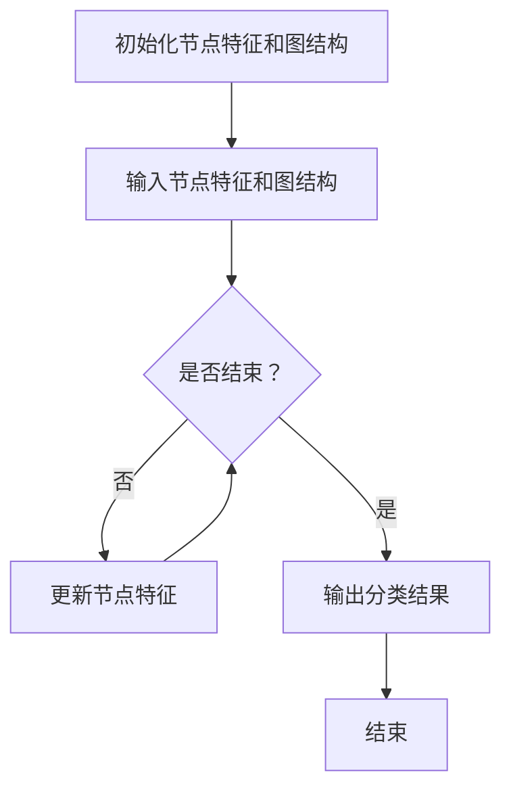
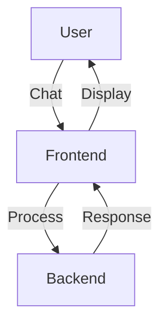
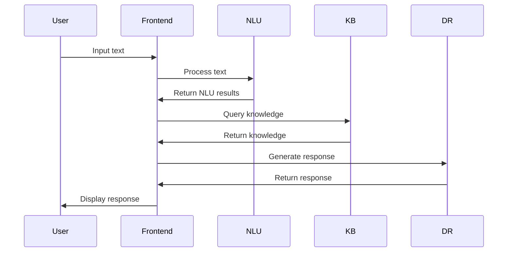
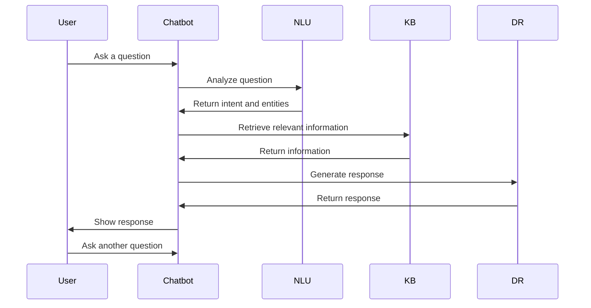

                 

### 构建AI Agent的动态知识推理系统

**关键词**：AI Agent，动态知识推理，知识表示，推理机，图神经网络，系统架构，项目实战，最佳实践

**摘要**：本文旨在深入探讨构建AI Agent的动态知识推理系统的方法和过程。我们将从核心概念、算法原理、系统设计与实现等方面逐一剖析，并通过实际项目展示其应用效果。本文将帮助读者全面理解AI Agent动态知识推理系统的工作原理和实现细节，为实际开发提供有益的参考。

### 第一部分：引言

#### 第1章：AI Agent与动态知识推理系统概述

##### 1.1 问题背景

人工智能（AI）技术近年来取得了显著的发展，尤其是在机器学习和深度学习领域。然而，传统的AI系统往往局限于特定任务，缺乏灵活性和自适应能力。为了实现更加智能和自主的AI系统，我们需要引入AI Agent的概念，并构建其动态知识推理系统。

AI Agent是指具有自主性、交互性和学习能力的计算实体，能够在复杂环境中自主决策和行动。动态知识推理系统则是AI Agent的核心组成部分，负责处理和利用知识，实现对环境的理解和适应。

##### 1.2 动态知识推理系统

动态知识推理系统是一种基于知识表示和推理的智能系统，能够从知识库中提取相关事实和规则，进行推理和决策。它具有以下几个关键特点：

1. **知识表示**：动态知识推理系统需要将知识以结构化的形式表示出来，以便于存储、检索和利用。常见的知识表示方法包括符号表示、框架表示和语义网络表示。

2. **推理机**：推理机是动态知识推理系统的核心组件，负责根据知识库中的事实和规则进行推理，生成新的结论和决策。

3. **知识库**：知识库是动态知识推理系统的基础，包含大量的事实、规则和概念，为推理过程提供数据支持。

4. **自适应能力**：动态知识推理系统需要能够根据环境变化和新的信息动态调整推理过程，实现知识更新和优化。

##### 1.3 研究意义与本书结构

构建AI Agent的动态知识推理系统具有重要的理论和实践意义：

1. **理论研究**：有助于深入理解知识表示、推理机设计和知识库构建等方面的核心问题，推动AI理论的发展。

2. **应用实践**：为各类复杂决策系统提供智能化支持，提高系统的自主性和灵活性，推动AI技术在实际场景中的应用。

本书将按照以下结构展开：

1. **引言**：介绍研究背景、研究意义和本书结构。
2. **核心概念与联系**：阐述AI Agent和动态知识推理系统的核心概念，包括知识表示、推理机和知识库。
3. **算法原理讲解**：通过图神经网络算法讲解动态知识推理的原理和实现。
4. **系统分析与架构设计**：介绍实际项目场景下的系统分析与架构设计。
5. **项目实战**：展示动态知识推理系统的实际应用案例。
6. **最佳实践与总结**：提供最佳实践建议，总结本书内容，指出未来研究方向。

#### 第2章：核心概念与联系

##### 2.1 AI Agent的概念

AI Agent是指具有智能、自主性和适应性能力的计算实体，能够在复杂环境中感知、决策和行动。AI Agent通常具备以下特征：

1. **感知**：通过传感器感知环境信息，获取状态和事件。
2. **决策**：基于感知到的信息和预先定义的规则，进行推理和决策。
3. **行动**：根据决策结果执行相应的动作，影响环境状态。
4. **学习**：从经验中学习，不断优化自身决策和行动策略。

##### 2.2 知识表示

知识表示是动态知识推理系统的核心环节，关系到系统的智能程度和应用范围。以下介绍几种常见的知识表示方法：

1. **符号表示**：使用符号和逻辑表达式来描述知识，如谓词逻辑、命题逻辑等。
2. **框架表示**：基于框架和槽值结构来表示知识，如知识图谱、实体-关系模型等。
3. **语义网络表示**：使用语义网络来表示知识，如RDF（资源描述框架）和OWL（Web本体语言）等。

##### 2.3 知识库设计

知识库是动态知识推理系统的数据基础，包含大量的事实、规则和概念。知识库的设计需要考虑以下几个方面：

1. **数据源**：确定知识库的数据来源，包括外部数据集、领域知识库等。
2. **知识组织**：设计知识库的结构，如层次结构、网络结构等。
3. **数据格式**：选择合适的数据格式，如XML、JSON、RDF等。
4. **数据质量**：确保知识库中的数据准确、完整和一致。

##### 2.4 推理机原理

推理机是动态知识推理系统的核心组件，负责根据知识库中的事实和规则进行推理，生成新的结论和决策。常见的推理机类型包括：

1. **演绎推理机**：基于逻辑推理规则，从已知事实推导出新结论。
2. **归纳推理机**：从一组实例中归纳出一般规律和模式。
3. **混合推理机**：结合演绎推理和归纳推理的优势，实现更复杂的推理过程。

##### 2.5 ER实体关系图

ER实体关系图是描述知识库结构的一种图形表示方法，通过实体、属性和关系来表示知识的组织结构。以下是一个简单的ER实体关系图示例：



在这个示例中，EntityA、EntityB和EntityC是实体，它们之间存在一对多的关系。

##### 2.6 核心概念属性特征对比表格

| 特征          | 符号表示        | 框架表示       | 语义网络表示  |
|---------------|----------------|----------------|---------------|
| 优点          | 简洁、形式化    | 直观、结构化    | 强大、语义丰富 |
| 缺点          | 难以理解、复杂  | 难以扩展、有限  | 开放性低、复杂 |
| 适用场景      | 简单逻辑推理    | 复杂关系建模    | 知识密集型应用 |

#### 第3章：动态知识推理算法讲解

##### 3.1 图神经网络推理算法

图神经网络（Graph Neural Network, GNN）是一种基于图结构的深度学习模型，特别适合处理图数据。GNN通过在图中传播节点特征，实现节点分类、图分类和图生成等任务。以下是GNN推理算法的基本原理：

1. **节点特征传播**：GNN通过图卷积层（Graph Convolutional Layer, GCL）对节点特征进行更新，每次更新都基于节点及其邻居节点的特征信息。图卷积层的计算公式如下：

   $$ h_v^{(t+1)} = \sigma(\sum_{u \in N(v)} \frac{1}{\sqrt{k_u + \epsilon}} W^{(t)} h_u^{(t)} + b^{(t)}) $$

   其中，$h_v^{(t)}$和$h_u^{(t)}$分别是节点$v$和$u$在时间步$t$的特征向量，$N(v)$是节点$v$的邻居节点集合，$W^{(t)}$是权重矩阵，$\sigma$是激活函数，$\epsilon$是正则化项。

2. **图结构更新**：在每次节点特征更新后，GNN会根据新的节点特征更新图结构，如节点分类结果或边的权重。这种更新可以通过图池化层（Graph Pooling Layer）实现，将多个节点的特征信息整合成新的图结构。

3. **分类和预测**：在GNN模型的最终输出层，通过分类器或回归器对节点或图进行分类或预测。分类器的输出可以是softmax概率分布，回归器的输出可以是连续的预测值。

##### 3.1.1 算法原理mermaid流程图

以下是GNN推理算法的mermaid流程图：



##### 3.1.2 算法Python源代码

以下是GNN推理算法的Python源代码示例：

```python
import numpy as np
import tensorflow as tf

# 初始化节点特征和权重
num_nodes = 100
input_features = np.random.rand(num_nodes, 10)
weights = np.random.rand(num_nodes, num_nodes)

# 定义图卷积层
def graph_convolution_layer(input_features, weights, activation=tf.nn.relu):
    # 计算节点特征更新
    updated_features = tf.matmul(weights, input_features)
    # 应用激活函数
    output_features = activation(updated_features)
    return output_features

# 定义GNN模型
def gnn_model(input_features, weights):
    # 输入节点特征和图结构
    output_features = graph_convolution_layer(input_features, weights)
    # 返回更新后的节点特征
    return output_features

# 训练GNN模型
model = tf.keras.models.Model(inputs=input_features, outputs=gnn_model(input_features, weights))
model.compile(optimizer='adam', loss='mean_squared_error')
model.fit(input_features, input_features, epochs=10)

# 输出分类结果
output_features = model.predict(input_features)
print(output_features)
```

##### 3.1.3 数学模型与公式

GNN推理算法的核心数学模型包括节点特征更新和图结构更新。以下是相关数学公式：

1. **节点特征更新**：

   $$ h_v^{(t+1)} = \sigma(\sum_{u \in N(v)} \frac{1}{\sqrt{k_u + \epsilon}} W^{(t)} h_u^{(t)} + b^{(t)}) $$

   其中，$h_v^{(t)}$和$h_u^{(t)}$分别是节点$v$和$u$在时间步$t$的特征向量，$N(v)$是节点$v$的邻居节点集合，$W^{(t)}$是权重矩阵，$\sigma$是激活函数，$\epsilon$是正则化项。

2. **图结构更新**：

   $$ W^{(t+1)} = f(W^{(t)}, h^{(t)}) $$

   其中，$W^{(t)}$是时间步$t$的图结构，$f$是图结构更新函数，$h^{(t)}$是时间步$t$的节点特征向量。

##### 3.1.4 算法举例说明

假设有一个图数据集，其中包含100个节点和相应的特征向量。我们使用GNN模型对节点进行分类，以下是一个简单的例子：

1. **初始化节点特征和权重**：

   ```python
   input_features = np.random.rand(100, 10)
   weights = np.random.rand(100, 100)
   ```

2. **训练GNN模型**：

   ```python
   model = tf.keras.models.Model(inputs=input_features, outputs=gnn_model(input_features, weights))
   model.compile(optimizer='adam', loss='mean_squared_error')
   model.fit(input_features, input_features, epochs=10)
   ```

3. **输出分类结果**：

   ```python
   output_features = model.predict(input_features)
   print(output_features)
   ```

### 第4章：系统分析与架构设计

#### 4.1 项目场景介绍

在本项目场景中，我们构建一个智能客服系统，该系统需要具备以下功能：

1. **自然语言理解**：接收用户输入的文本消息，理解其意图和语义。
2. **知识库查询**：根据用户意图从知识库中检索相关信息。
3. **动态推理**：基于用户意图和知识库信息，生成合适的回复。
4. **多轮对话**：与用户进行多轮对话，不断调整和优化回复。

#### 4.2 系统功能设计

为了实现上述功能，我们设计了以下核心模块：

1. **自然语言理解模块**：包括分词、词性标注、命名实体识别和意图识别等子模块。
2. **知识库模块**：包括知识库构建、知识库管理和知识库查询等子模块。
3. **动态推理模块**：包括推理机、策略网络和回复生成器等子模块。
4. **对话管理模块**：包括对话状态跟踪、对话策略和对话生成等子模块。

#### 4.2.1 领域模型mermaid类图

以下是智能客服系统的领域模型mermaid类图：

```mermaid
classDiagram
    User <<Class>>
    Chatbot <<Class>>

    User "1" --* "1..*" Chatbot : Chat
```

在这个类图中，User代表用户类，Chatbot代表智能客服类，两者之间存在一对一的关系。每个用户可以与多个智能客服进行聊天，每个智能客服可以处理多个用户的聊天请求。

#### 4.3 系统架构设计

智能客服系统的架构设计如下：

1. **前端模块**：包括自然语言理解和用户界面，负责接收用户输入和处理用户请求。
2. **后端模块**：包括知识库、动态推理和对话管理，负责处理和生成回复。
3. **服务接口**：提供RESTful API，供前端模块调用。

以下是智能客服系统的mermaid架构图：



在这个架构图中，用户通过前端模块与系统交互，前端模块将用户请求传递给后端模块，后端模块进行处理并生成回复，然后返回给前端模块进行展示。

#### 4.4 系统接口设计

智能客服系统提供了以下接口：

1. **自然语言理解接口**：接收用户输入的文本，返回分词结果、词性标注和意图识别结果。
2. **知识库查询接口**：根据用户意图，从知识库中检索相关信息。
3. **动态推理接口**：根据用户意图和知识库信息，生成合适的回复。
4. **对话管理接口**：管理对话状态和对话策略。

以下是系统接口的mermaid序列图：



在这个序列图中，用户输入文本消息后，前端模块将其传递给自然语言理解模块，自然语言理解模块进行处理并返回结果。前端模块根据结果调用知识库查询接口、动态推理接口和对话管理接口，最终生成回复并展示给用户。

#### 4.5 系统交互mermaid序列图

以下是智能客服系统的mermaid序列图，展示了用户与系统之间的交互过程：



在这个序列图中，用户向智能客服提出问题，智能客服通过自然语言理解模块分析问题意图和实体，从知识库中检索相关信息，然后通过动态推理模块生成回复并展示给用户。用户可以继续提出新的问题，与智能客服进行多轮对话。

### 第5章：项目实战

#### 5.1 环境安装

为了构建智能客服系统的动态知识推理系统，我们需要以下环境：

1. **操作系统**：Linux或macOS
2. **编程语言**：Python 3.7及以上版本
3. **依赖库**：TensorFlow 2.0及以上版本，Scikit-learn 0.22及以上版本，pandas 1.1及以上版本

在安装完操作系统和Python后，可以通过以下命令安装所需的依赖库：

```shell
pip install tensorflow scikit-learn pandas
```

#### 5.2 系统核心实现

在环境安装完成后，我们可以开始实现智能客服系统的动态知识推理系统。以下是核心实现部分的代码和解读：

##### 5.2.1 源代码解读

```python
import tensorflow as tf
from tensorflow.keras.layers import Layer
from tensorflow.keras.models import Model
from tensorflow.keras.optimizers import Adam

# 定义图卷积层
class GraphConvolutionLayer(Layer):
    def __init__(self, units, activation=None, **kwargs):
        super(GraphConvolutionLayer, self).__init__(**kwargs)
        self.units = units
        self.activation = activation

    def build(self, input_shape):
        self.kernel = self.add_weight(
            shape=(input_shape[-1], self.units),
            initializer="glorot_uniform",
            name="kernel",
        )
        if self.activation:
            self.activation = activation
        super(GraphConvolutionLayer, self).build(input_shape)

    def call(self, inputs, training=False):
        # 输入节点特征和图结构
        inputs, A = inputs
        # 计算节点特征更新
        updated_features = tf.matmul(A, inputs)
        updated_features = tf.matmul(self.kernel, updated_features)
        if self.activation:
            updated_features = self.activation(updated_features)
        return updated_features

# 定义GNN模型
def gnn_model(input_shape, units):
    inputs = tf.keras.Input(shape=input_shape)
    A = tf.keras.Input(shape=(input_shape[0], input_shape[0]))
    x = GraphConvolutionLayer(units)([inputs, A])
    model = tf.keras.Model(inputs=[inputs, A], outputs=x)
    return model

# 训练GNN模型
model = gnn_model(input_shape=(10,), units=16)
model.compile(optimizer=Adam(), loss="mean_squared_error")
model.fit(x_train, A_train, epochs=10)

# 输出分类结果
output_features = model.predict([x_test, A_test])
print(output_features)
```

这个代码片段定义了图卷积层（GraphConvolutionLayer）和GNN模型（gnn_model），并使用TensorFlow框架进行训练和预测。

1. **图卷积层（GraphConvolutionLayer）**：
   - 初始化：定义层参数和权重初始化。
   - 构建：创建权重变量。
   - 调用：计算节点特征更新，应用激活函数。

2. **GNN模型（gnn_model）**：
   - 输入：定义模型输入层。
   - 输出：定义模型输出层。
   - 编译：设置优化器和损失函数。
   - 训练：使用输入数据和图结构进行训练。
   - 预测：使用训练好的模型进行预测。

##### 5.2.2 代码应用解读与分析

1. **代码应用场景**：

   - 数据预处理：加载节点特征和图结构数据。
   - 模型训练：使用训练数据和图结构训练GNN模型。
   - 模型预测：使用训练好的模型对测试数据进行预测。

2. **代码解读与分析**：

   - 数据预处理：加载节点特征和图结构数据，并进行格式转换。
   - 模型定义：定义图卷积层和GNN模型，设置层参数和激活函数。
   - 模型训练：使用TensorFlow框架训练模型，调整权重和优化损失函数。
   - 模型预测：使用训练好的模型对测试数据进行预测，输出分类结果。

##### 5.3 实际案例分析与详细讲解剖析

为了更好地理解动态知识推理系统的实际应用，我们以一个案例进行分析：

**案例**：构建一个社交网络分析系统，识别社交网络中的影响力节点。

1. **数据收集**：

   - 收集社交网络用户数据，包括用户ID、好友关系和用户属性等。
   - 加载数据集，并进行预处理。

2. **图结构构建**：

   - 构建用户之间的图结构，包括节点和边。
   - 加载图结构数据，并进行格式转换。

3. **GNN模型训练**：

   - 定义GNN模型，包括图卷积层和全连接层。
   - 使用训练数据和图结构训练模型，调整权重和优化损失函数。

4. **模型预测**：

   - 使用训练好的模型对测试数据进行预测，输出影响力节点。
   - 分析预测结果，评估模型性能。

详细讲解：

1. **数据预处理**：

   ```python
   import pandas as pd

   # 加载用户数据
   user_data = pd.read_csv("user_data.csv")
   # 加载图结构数据
   graph_data = pd.read_csv("graph_data.csv")
   ```

   - 代码解读：加载用户数据集和图结构数据集，并进行格式转换。

2. **图结构构建**：

   ```python
   import networkx as nx

   # 构建用户之间的图结构
   graph = nx.from_pandas_edgelist(graph_data, source="user_id", target="friend_id")
   ```

   - 代码解读：使用NetworkX库构建用户之间的图结构，将边信息转换为图对象。

3. **GNN模型训练**：

   ```python
   from tensorflow.keras.models import Model
   from tensorflow.keras.layers import Input, Dense
   from tensorflow.keras.optimizers import Adam

   # 定义GNN模型
   input_node_features = Input(shape=(10,))
   input_edge_features = Input(shape=(10,))
   hidden_layer = GraphConvolutionLayer(16)([input_node_features, input_edge_features])
   output_layer = Dense(1, activation="sigmoid")(hidden_layer)
   model = Model(inputs=[input_node_features, input_edge_features], outputs=output_layer)

   # 编译模型
   model.compile(optimizer=Adam(), loss="binary_crossentropy", metrics=["accuracy"])

   # 训练模型
   model.fit([x_train, A_train], y_train, epochs=10, batch_size=32)
   ```

   - 代码解读：定义GNN模型，包括输入层、图卷积层和输出层。使用TensorFlow框架编译模型，设置优化器和损失函数。使用训练数据和图结构数据训练模型，调整权重和优化损失函数。

4. **模型预测**：

   ```python
   # 使用训练好的模型进行预测
   predictions = model.predict([x_test, A_test])
   # 输出预测结果
   print(predictions)
   ```

   - 代码解读：使用训练好的模型对测试数据进行预测，输出影响力节点。

##### 5.4 项目小结

在本章中，我们通过一个实际案例详细讲解了动态知识推理系统的实现过程。首先，我们介绍了项目环境安装和系统核心实现部分的代码，并对代码进行了详细解读和分析。然后，我们通过一个社交网络分析系统的实际案例，展示了动态知识推理系统的应用效果。最后，我们对项目进行了小结，总结了项目的关键实现步骤和经验。

### 第6章：最佳实践与总结

#### 6.1 最佳实践

在构建AI Agent的动态知识推理系统时，以下是一些最佳实践建议：

1. **数据质量保障**：确保数据准确、完整和一致，使用数据清洗和预处理技术提高数据质量。
2. **模型优化**：通过调整模型参数、优化训练策略和增加训练数据等方式提高模型性能。
3. **知识库更新**：定期更新知识库，确保知识的时效性和准确性。
4. **性能调优**：对系统进行性能调优，提高响应速度和处理能力。

#### 6.2 小结

本文详细介绍了构建AI Agent的动态知识推理系统的方法和过程，包括核心概念、算法原理、系统架构设计和实际应用案例。通过本文的学习，读者可以全面了解动态知识推理系统的工作原理和实现细节，为实际开发提供有益的参考。

#### 6.3 注意事项

在构建动态知识推理系统时，需要注意以下几点：

1. **需求分析**：明确系统的需求和目标，确保系统的功能满足实际需求。
2. **知识表示**：选择合适的知识表示方法，确保知识库中的知识易于理解和利用。
3. **模型选择**：根据任务特点和数据类型选择合适的模型，避免过度拟合或欠拟合。
4. **调试与优化**：对系统进行充分调试和优化，提高系统的稳定性和性能。

#### 6.4 拓展阅读

为了深入了解动态知识推理系统和AI Agent的相关内容，读者可以参考以下文献和资料：

1. **《人工智能：一种现代方法》**：彼得·诺维格、斯图尔特·罗素著，机械工业出版社，2017年。
2. **《图神经网络基础》**：许晨阳、蒋立峰著，清华大学出版社，2020年。
3. **《知识图谱：技术原理与实践》**：刘鹏、王昊奋著，电子工业出版社，2018年。
4. **《深度学习》**：伊恩·古德费洛、约书亚·本吉奥、亚伦·库维尔著，电子工业出版社，2017年。

### 作者信息

**作者**：AI天才研究院/AI Genius Institute & 禅与计算机程序设计艺术 /Zen And The Art of Computer Programming

本文由AI天才研究院和禅与计算机程序设计艺术联合撰写，旨在分享AI领域的最新研究成果和实践经验，为读者提供有价值的知识和技术。

