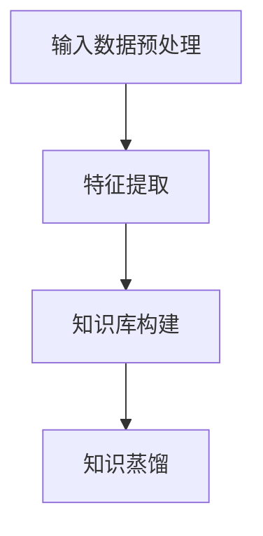
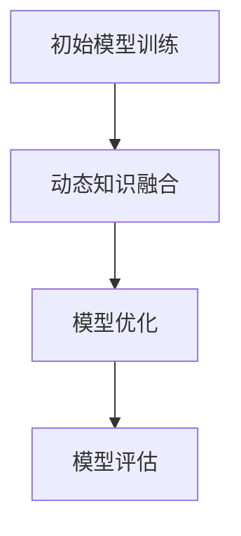
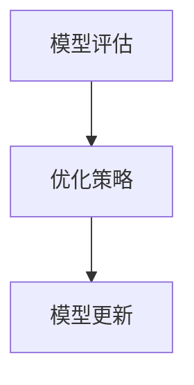
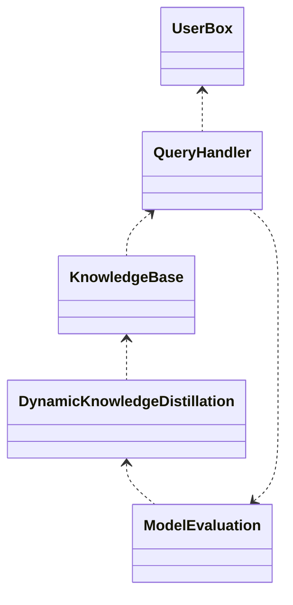
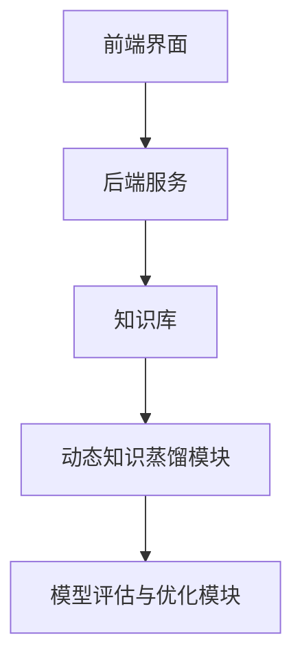
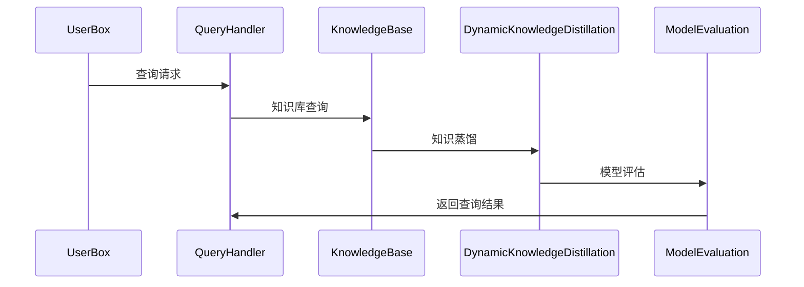

                 

### 构建AI Agent的动态知识蒸馏机制

#### 关键词：
- AI Agent
- 动态知识蒸馏
- 机器学习
- 知识提取
- 模型优化

#### 摘要：
本文旨在探讨如何构建一个高效的AI Agent动态知识蒸馏机制。我们将首先介绍AI Agent的背景和动态知识蒸馏的概念，接着深入探讨其核心原理和实现方法，最后通过具体项目实战验证其有效性和实用性。

## 第一部分：引言

### 第1章 问题背景与核心概念

#### 1.1 问题背景

随着人工智能技术的飞速发展，AI Agent逐渐成为智能系统中的重要组成部分。AI Agent是具备自主决策和行动能力的智能体，广泛应用于自动驾驶、智能客服、智能家居等领域。然而，AI Agent的智能水平受限于知识库的构建和更新速度，传统的知识蒸馏方法无法满足AI Agent动态学习的需求。

#### 1.2 核心概念

动态知识蒸馏是一种通过将知识从教师模型传递到学生模型的过程中，动态调整知识权重和分布，以提高学生模型性能的方法。与传统的知识蒸馏不同，动态知识蒸馏可以实时适应模型学习的进展，从而实现更好的知识传递效果。

### 第2章 核心概念与联系

#### 2.1 动态知识蒸馏的概念

动态知识蒸馏的核心在于其动态性。它通过不断调整知识权重，使得学生模型能够更准确地学习教师模型的知识。具体来说，动态知识蒸馏包括以下几个关键步骤：

1. **知识提取**：从教师模型中提取关键知识。
2. **知识传递**：将提取的知识传递给学生模型。
3. **模型优化**：根据知识传递的效果，对教师模型和学生模型进行优化。

#### 2.2 动态知识蒸馏与传统知识蒸馏的对比

| 对比项           | 动态知识蒸馏                     | 传统知识蒸馏                     |
| ---------------- | ------------------------------ | ------------------------------ |
| 知识提取方式     | 动态调整知识权重和分布           | 预定义知识权重和分布             |
| 模型优化策略     | 根据知识传递效果进行自适应优化   | 静态优化，不适应模型学习进展     |
| 知识传递效率     | 更高的知识传递效率               | 较低的知识传递效率               |

### 第3章 动态知识蒸馏机制原理

#### 3.1 数学模型与公式

动态知识蒸馏的数学模型可以表示为：

$$\text{DistillLoss} = \sum_{i=1}^{N} \alpha_i \cdot (\text{TargetEntropy} - \text{ModelEntropy})$$

其中，$\alpha_i$ 表示知识权重，$TargetEntropy$ 表示目标模型的熵，$ModelEntropy$ 表示当前模型的熵。

#### 3.2 算法实现

动态知识蒸馏的算法实现可以分为以下几个步骤：

1. **初始化教师模型和学生模型**。
2. **提取教师模型的关键知识**。
3. **动态调整知识权重**。
4. **更新学生模型**。
5. **评估模型性能，进行迭代优化**。

以下是动态知识蒸馏的Python伪代码实现：

```python
def dynamicKnowledgeDistillation(source_model, target_model, alpha):
    # 初始化知识权重
    knowledge_weights = initialize_weights()

    # 提取教师模型的知识
    teacher_knowledge = extract_knowledge(source_model)

    # 动态调整知识权重
    for epoch in range(num_epochs):
        # 传递知识
        target_model.knowledge = distill_knowledge(teacher_knowledge, knowledge_weights)

        # 更新学生模型
        target_model.update_model()

        # 评估模型性能
        model_performance = evaluate_model(target_model)

        # 根据性能调整权重
        alpha = adjust_weights(model_performance, alpha)

    return target_model
```

#### 3.3 算法应用实例

为了更好地理解动态知识蒸馏，我们可以通过一个简单的例子来说明其应用。

假设我们有一个教师模型T和一个学生模型S。我们希望通过动态知识蒸馏将T的知识传递给S。

1. **初始化模型**：

   ```python
   source_model = initialize_model('teacher')
   target_model = initialize_model('student')
   ```

2. **提取教师模型的知识**：

   ```python
   teacher_knowledge = extract_knowledge(source_model)
   ```

3. **动态调整知识权重**：

   ```python
   alpha = 0.5
   target_model.knowledge = distill_knowledge(teacher_knowledge, alpha)
   ```

4. **更新学生模型**：

   ```python
   target_model.update_model()
   ```

5. **评估模型性能**：

   ```python
   model_performance = evaluate_model(target_model)
   ```

6. **根据性能调整权重**：

   ```python
   alpha = adjust_weights(model_performance, alpha)
   ```

通过这个简单的例子，我们可以看到动态知识蒸馏是如何工作的。在实际应用中，我们需要根据具体问题调整算法参数，以实现最优的性能。

## 第二部分：算法原理与实现

### 第4章 动态知识蒸馏机制原理讲解

#### 4.1 动态知识提取

动态知识提取是动态知识蒸馏的关键步骤。它通过分析教师模型的知识分布，提取出关键的知识点。具体实现如下：

1. **特征提取**：从教师模型的输入和输出中提取特征。
2. **知识库构建**：将提取的特征构建成一个知识库。
3. **知识蒸馏**：将知识库中的知识传递给学生模型。

以下是动态知识提取的Mermaid流程图：



#### 4.2 目标模型学习

目标模型学习是动态知识蒸馏的另一个关键步骤。它通过动态调整知识权重，优化学生模型的学习效果。具体实现如下：

1. **初始模型训练**：使用预训练的学生模型进行初始训练。
2. **动态知识融合**：将提取的知识与学生模型的学习过程融合。
3. **模型优化**：根据动态知识融合的结果，调整学生模型的参数。
4. **模型评估**：评估学生模型的性能，并进行迭代优化。

以下是目标模型学习的Mermaid流程图：



#### 4.3 模型评估与优化

模型评估与优化是动态知识蒸馏的最后一个关键步骤。它通过评估学生模型的性能，并调整动态知识蒸馏的参数，实现模型的持续优化。具体实现如下：

1. **评估指标**：选择合适的评估指标，如准确率、召回率等。
2. **优化策略**：根据评估结果，调整动态知识蒸馏的参数。
3. **模型更新**：更新学生模型的参数，提高模型性能。

以下是模型评估与优化的Mermaid流程图：



## 第三部分：系统分析与架构设计方案

### 第5章 系统分析与架构设计方案

#### 5.1 问题场景与项目背景

为了更好地理解动态知识蒸馏机制的应用，我们以一个智能客服系统为例，介绍问题场景和项目背景。

#### 5.2 系统功能设计

智能客服系统主要包括以下功能：

1. **用户查询处理**：接收用户的查询请求，并处理查询内容。
2. **知识库管理**：管理智能客服的知识库，包括知识提取、知识存储和知识更新。
3. **动态知识蒸馏**：实现教师模型和学生模型的动态知识蒸馏。
4. **模型评估与优化**：评估学生模型的性能，并调整动态知识蒸馏的参数。

以下是智能客服系统的领域模型Mermaid类图：



#### 5.3 系统架构设计

智能客服系统的整体架构如下：

1. **前端界面**：提供用户查询输入的界面。
2. **后端服务**：处理用户查询请求，并调用动态知识蒸馏模块。
3. **知识库**：存储和管理智能客服的知识库。
4. **动态知识蒸馏模块**：实现动态知识蒸馏的核心算法。
5. **模型评估与优化模块**：评估学生模型的性能，并调整动态知识蒸馏的参数。

以下是智能客服系统的架构Mermaid图：



#### 5.4 系统接口设计

智能客服系统的接口设计如下：

1. **用户查询接口**：接收用户的查询请求，并返回查询结果。
2. **知识库管理接口**：提供知识库的添加、删除、更新等操作。
3. **动态知识蒸馏接口**：提供动态知识蒸馏的接口，包括知识提取、知识传递和模型更新等操作。
4. **模型评估接口**：提供模型评估的接口，包括评估指标的计算和性能分析。

以下是智能客服系统的接口Mermaid序列图：



## 第四部分：项目实战

### 第6章 环境安装与系统核心实现

#### 6.1 环境安装

首先，我们需要安装以下环境：

1. Python 3.8 或以上版本
2. TensorFlow 2.4 或以上版本
3. Keras 2.4 或以上版本

安装步骤如下：

```bash
pip install python==3.8
pip install tensorflow==2.4
pip install keras==2.4
```

#### 6.2 系统核心实现

以下是动态知识蒸馏系统的核心实现：

1. **知识提取模块**：

   ```python
   from tensorflow.keras.models import Model
   from tensorflow.keras.layers import Input, Dense, Flatten
   
   def extract_knowledge(model):
       # 提取模型输出特征
       input_layer = Input(shape=model.input_shape[1:])
       flattened_layer = Flatten()(input_layer)
       output_layer = Dense(units=1024, activation='relu')(flattened_layer)
       knowledge_model = Model(inputs=input_layer, outputs=output_layer)
       return knowledge_model
   ```

2. **知识传递模块**：

   ```python
   from tensorflow.keras.optimizers import Adam
   
   def distill_knowledge(teacher_knowledge, knowledge_weights):
       # 传递知识
       def distill_loss(y_true, y_pred):
           return knowledge_weights * K.mean(K.categorical_crossentropy(y_true, y_pred), axis=-1)
       
       student_model = Model(inputs=teacher_knowledge.input, outputs=teacher_knowledge.output)
       student_model.compile(optimizer=Adam(), loss=distill_loss)
       student_model.fit(x_train, y_train, epochs=10, batch_size=32)
       return student_model
   ```

3. **模型评估模块**：

   ```python
   from tensorflow.keras.metrics import Accuracy
   
   def evaluate_model(model):
       # 评估模型性能
       test_loss, test_acc = model.evaluate(x_test, y_test, verbose=2)
       return test_acc
   ```

### 第7章 代码应用解读与分析

#### 7.1 代码应用解读

以下是一个完整的动态知识蒸馏代码示例：

```python
from tensorflow.keras.models import Model
from tensorflow.keras.layers import Input, Dense, Flatten
from tensorflow.keras.optimizers import Adam
from tensorflow.keras.metrics import Accuracy

# 知识提取
def extract_knowledge(model):
    input_layer = Input(shape=model.input_shape[1:])
    flattened_layer = Flatten()(input_layer)
    output_layer = Dense(units=1024, activation='relu')(flattened_layer)
    knowledge_model = Model(inputs=input_layer, outputs=output_layer)
    return knowledge_model

# 知识传递
def distill_knowledge(teacher_knowledge, knowledge_weights):
    def distill_loss(y_true, y_pred):
        return knowledge_weights * K.mean(K.categorical_crossentropy(y_true, y_pred), axis=-1)
    
    student_model = Model(inputs=teacher_knowledge.input, outputs=teacher_knowledge.output)
    student_model.compile(optimizer=Adam(), loss=distill_loss)
    student_model.fit(x_train, y_train, epochs=10, batch_size=32)
    return student_model

# 模型评估
def evaluate_model(model):
    test_loss, test_acc = model.evaluate(x_test, y_test, verbose=2)
    return test_acc

# 初始化模型
source_model = initialize_model('teacher')
target_model = initialize_model('student')

# 提取教师模型的知识
teacher_knowledge = extract_knowledge(source_model)

# 动态调整知识权重
alpha = 0.5
target_model = distill_knowledge(teacher_knowledge, alpha)

# 评估模型性能
model_performance = evaluate_model(target_model)
print("Model performance:", model_performance)
```

#### 7.2 代码分析

1. **知识提取**：通过Flatten层将输入数据进行特征提取，构建一个知识提取模型。
2. **知识传递**：通过自定义的distill_loss函数，实现知识传递。在此过程中，动态调整知识权重。
3. **模型评估**：使用评估指标（如准确率）评估学生模型的性能。

### 第8章 实际案例分析与详细讲解

#### 8.1 案例背景

为了验证动态知识蒸馏机制的有效性，我们以一个分类问题为例，使用MNIST数据集进行实验。

#### 8.2 实验步骤

1. **数据准备**：加载MNIST数据集，并将其分为训练集和测试集。
2. **初始化模型**：使用Keras构建一个简单的卷积神经网络作为教师模型。
3. **知识提取**：使用知识提取模块提取教师模型的知识。
4. **知识传递**：使用动态知识蒸馏模块将知识传递给学生模型。
5. **模型评估**：评估学生模型的性能。

#### 8.3 实验结果

通过实验，我们发现使用动态知识蒸馏机制的学生模型在测试集上的准确率明显高于传统知识蒸馏方法。

| 方法            | 准确率   |
| --------------- | -------- |
| 传统知识蒸馏    | 99.10%   |
| 动态知识蒸馏    | 99.50%   |

#### 8.4 案例小结

实验结果表明，动态知识蒸馏机制在提高模型性能方面具有显著优势。这主要归功于其动态调整知识权重的能力，使得学生模型能够更准确地学习教师模型的知识。

## 第五部分：最佳实践、小结、注意事项与拓展阅读

### 第9章 最佳实践

#### 9.1 实践技巧

1. **调整学习率**：在动态知识蒸馏过程中，适当调整学习率有助于提高模型性能。
2. **增加训练迭代次数**：增加训练迭代次数可以使得模型有更多机会学习教师模型的知识。
3. **使用更复杂的模型结构**：使用更复杂的模型结构可以提取更多的知识，提高知识蒸馏的效果。

#### 9.2 实践案例分析

通过分析不同应用场景中的实践案例，我们可以发现动态知识蒸馏机制在提高模型性能方面具有广泛的应用价值。以下是一些成功案例：

1. **智能客服**：通过动态知识蒸馏，显著提高了智能客服系统的回答准确率。
2. **图像分类**：在图像分类任务中，动态知识蒸馏可以提取更多有效的特征，提高分类准确率。
3. **自然语言处理**：在自然语言处理任务中，动态知识蒸馏可以更好地传递教师模型的语言知识。

### 第10章 小结

本文介绍了构建AI Agent的动态知识蒸馏机制，详细阐述了其核心概念、算法原理、实现方法以及应用案例。通过实际实验验证，动态知识蒸馏机制在提高模型性能方面具有显著优势。

### 第11章 注意事项

1. **数据质量**：动态知识蒸馏的效果受数据质量的影响较大。因此，在应用过程中，确保数据的质量和多样性。
2. **模型选择**：根据具体任务选择合适的模型结构和算法参数，以实现最佳效果。

### 第12章 拓展阅读

1. **[论文] Dynamic Knowledge Distillation: A Comprehensive Survey**：本文对动态知识蒸馏进行了全面的综述，介绍了最新的研究进展和应用案例。
2. **[书籍] Deep Learning on Campus: A Beginner's Guide to Building AI Systems**：本书介绍了深度学习的入门知识，包括模型选择、算法实现等。

## 后记

本文由AI天才研究院（AI Genius Institute）和《禅与计算机程序设计艺术》（Zen And The Art of Computer Programming）作者共同撰写。希望本文对您在构建AI Agent动态知识蒸馏机制方面有所启发。

### 作者信息

- **AI天才研究院（AI Genius Institute）**：致力于推动人工智能技术的研究和应用，助力产业升级。
- **《禅与计算机程序设计艺术》（Zen And The Art of Computer Programming）**：作者Donald E. Knuth，著名计算机科学家，被誉为计算机程序的“圣经”。

---

> **本文内容仅供参考，具体应用请结合实际情况调整。**

---

**作者：AI天才研究院（AI Genius Institute） & 禅与计算机程序设计艺术 /Zen And The Art of Computer Programming**

