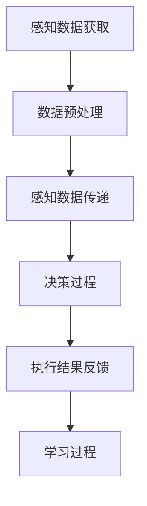
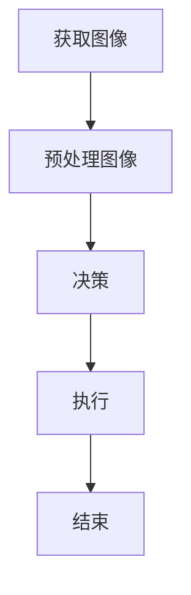

                 

### 构建AI Agent的多Agent协作学习系统概述

#### 1.1 问题背景与描述

在当今的科技时代，人工智能（AI）已经成为推动社会进步的重要力量。AI Agent作为一种具有自主学习和决策能力的智能实体，已经在多个领域得到了广泛应用。然而，单一个体AI Agent的能力和智能水平往往受到数据量和计算资源的限制，难以解决复杂的问题。因此，多Agent协作学习系统应运而生，它通过多个AI Agent之间的协同工作，共享知识和资源，实现更高效、更智能的决策。

多Agent协作学习系统的核心目标是提高AI Agent的智能水平和决策能力。具体来说，它包括以下几个方面：

1. **资源共享**：通过多Agent之间的数据共享，每个Agent可以获取更全面的信息，从而提高其学习效果。
2. **协同学习**：多个Agent可以同时进行学习，并通过交互和协作，相互纠正错误，提升整体智能水平。
3. **任务分配**：在复杂任务中，不同Agent可以发挥各自的优势，通过协同工作，高效地完成任务。
4. **鲁棒性提升**：多个Agent可以通过相互验证和备份，提高系统的鲁棒性和稳定性。

构建AI Agent的多Agent协作学习系统不仅具有重要的理论意义，同时也具有广泛的应用前景。例如，在自动驾驶、智能医疗、智能金融等领域，多Agent协作学习系统可以提高系统的智能水平，解决复杂问题，提高决策的准确性。

#### 1.2 多Agent系统的基本概念与核心要素

**1.2.1 多Agent系统的定义**

多Agent系统（Multi-Agent System，MAS）是由多个自主代理（Agent）组成的系统，这些代理通过通信和协作来共同完成任务。在多Agent系统中，每个Agent都是独立的个体，具有自主性、社交性、反应性和目标性。

**1.2.2 多Agent系统的核心要素**

- **Agent**：是MAS的基本组成单元，具有自主性、社交性、反应性和目标性。
- **环境**：Agent所处的环境，提供状态信息和约束条件。
- **通信**：Agent之间通过通信进行信息交换和协作。
- **协调**：多个Agent之间的协调机制，确保系统能够高效地完成任务。
- **目标**：每个Agent都有其特定的目标，系统通过协调多个目标，实现整体目标的优化。

**1.2.3 多Agent系统的分类与特点**

- **基于任务的MAS**：以完成任务为主要目标，Agent之间的协作主要是为了实现任务的分解和分配。
- **基于合作的MAS**：Agent之间通过共享资源和知识，共同实现一个共同目标。
- **基于竞争的MAS**：Agent之间通过竞争来优化自己的性能，系统整体性能的提升依赖于个体的优化。

#### 1.3 AI Agent的核心概念与联系

**1.3.1 AI Agent的定义与特性**

AI Agent是一种具有智能和学习能力的代理，能够感知环境、自主决策并采取行动。AI Agent的主要特性包括：

- **感知能力**：能够感知环境信息，获取必要的输入。
- **学习能力**：能够通过学习，改善自身的决策能力和行为。
- **决策能力**：能够根据当前状态，选择最优的行动方案。
- **适应性**：能够适应不同的环境和任务需求。

**1.3.2 AI Agent的组成结构**

AI Agent通常由以下几个部分组成：

- **感知模块**：负责获取环境信息。
- **决策模块**：根据感知模块的信息，选择最优的行动方案。
- **执行模块**：执行决策模块选择的行动方案。
- **学习模块**：通过反馈和经验，不断优化自身的决策能力。

**1.3.3 AI Agent的基本功能与分类**

AI Agent的基本功能包括感知、决策、执行和学习。根据应用场景和功能特点，AI Agent可以分为以下几类：

- **任务型Agent**：主要功能是完成特定的任务。
- **社交型Agent**：主要功能是与其他Agent进行交流和协作。
- **学习型Agent**：主要功能是不断学习和优化自身的能力。
- **混合型Agent**：同时具有多种功能，能够适应不同的环境和任务。

**1.3.4 AI Agent的属性特征对比表格**

以下是几种常见AI Agent的属性特征对比表格：

| 类别         | 特性                  | 说明                                                         |
| ------------ | --------------------- | ------------------------------------------------------------ |
| 任务型Agent   | 高效完成任务           | 主要关注任务完成效率，适用于自动化流程和重复性任务             |
| 社交型Agent   | 强社交能力             | 主要关注与其他Agent的交互和协作，适用于社交网络和协作任务     |
| 学习型Agent   | 自主学习能力           | 主要关注通过学习提高自身能力，适用于动态环境和需要持续学习的任务 |
| 混合型Agent   | 多功能，适应性强       | 结合了多种功能，能够适应不同的环境和任务需求                 |

**1.3.5 AI Agent与多Agent系统的关系**

AI Agent是多Agent系统的基本组成单元，它们之间通过通信和协作，共同实现系统的目标。AI Agent的多Agent协作学习系统，通过共享知识和资源，提高每个Agent的智能水平，从而提升系统的整体性能。

#### 1.4 多Agent协作学习系统的数学模型与公式

**1.4.1 数学模型概述**

多Agent协作学习系统的数学模型主要包括感知模型、决策模型和学习模型。这些模型描述了AI Agent在感知环境、做出决策和不断学习的过程中所遵循的数学规律。

- **感知模型**：描述了AI Agent如何感知环境，获取必要的信息。
- **决策模型**：描述了AI Agent如何根据感知信息，选择最优的行动方案。
- **学习模型**：描述了AI Agent如何通过学习，不断优化自身的决策能力。

**1.4.2 公式讲解**

以下是多Agent协作学习系统中的几个关键公式：

1. **感知模型公式**：
   $$ 
   s_t = f(s_{t-1}, a_t, e_t) 
   $$
   其中，$s_t$表示第$t$时刻的感知状态，$a_t$表示第$t$时刻的行动，$e_t$表示第$t$时刻的环境因素。

2. **决策模型公式**：
   $$
   a_t^* = g(s_t, θ) 
   $$
   其中，$a_t^*$表示第$t$时刻的最优行动，$s_t$表示第$t$时刻的感知状态，$θ$表示决策模型的参数。

3. **学习模型公式**：
   $$
   θ_{t+1} = θ_t + α \cdot (y_t - θ_t \cdot s_t) 
   $$
   其中，$θ_{t+1}$表示第$t+1$时刻的决策模型参数，$θ_t$表示第$t$时刻的决策模型参数，$α$表示学习率，$y_t$表示第$t$时刻的预期输出。

**1.4.3 举例说明**

假设有一个多Agent协作学习系统，其中有两个AI Agent，Agent A和Agent B。它们的目标是共同完成任务。以下是它们在一段时间内的感知状态、决策和学习过程：

1. **感知状态**：
   - Agent A的感知状态：$s_{A1} = (1, 0, 1)$
   - Agent B的感知状态：$s_{B1} = (0, 1, 0)$

2. **决策过程**：
   - Agent A的决策：$a_{A1}^* = g(s_{A1}, θ_{A1}) = (1, 0)$
   - Agent B的决策：$a_{B1}^* = g(s_{B1}, θ_{B1}) = (0, 1)$

3. **学习过程**：
   - Agent A的模型参数更新：$θ_{A2} = θ_{A1} + α \cdot (y_{A1} - θ_{A1} \cdot s_{A1})$
   - Agent B的模型参数更新：$θ_{B2} = θ_{B1} + α \cdot (y_{B1} - θ_{B1} \cdot s_{B1})$

通过这个例子，我们可以看到多Agent协作学习系统的数学模型如何应用于实际场景中，从而提高AI Agent的智能水平和决策能力。

#### 1.5 本章小结

本章首先介绍了构建AI Agent的多Agent协作学习系统的背景和重要性。接着，详细阐述了多Agent系统的基本概念与核心要素，以及AI Agent的核心概念与联系。此外，还介绍了多Agent协作学习系统的数学模型与公式，并举例说明了其应用。通过本章的学习，读者可以初步了解多Agent协作学习系统的基本理论和实践应用，为后续章节的学习打下坚实基础。接下来，我们将进一步探讨多Agent协作学习系统的设计与实现，帮助读者深入了解其具体实现过程和技术细节。

----------------------------------------------------------------

### 第二部分：多Agent协作学习系统的设计与实现

#### 2.1 设计目标与原则

在构建多Agent协作学习系统时，明确设计目标和遵循设计原则至关重要。以下是本系统的设计目标与原则：

**2.1.1 设计目标**

1. **提高智能水平**：通过多Agent协作，实现AI Agent智能水平的提升，使其能够处理更复杂的问题。
2. **高效资源共享**：利用多Agent之间的资源共享，提高系统的学习效率和性能。
3. **动态任务分配**：根据Agent的能力和任务需求，动态分配任务，确保系统能够高效地完成任务。
4. **系统稳定性和鲁棒性**：设计具有高稳定性和鲁棒性的系统，能够在不同环境下稳定运行。

**2.1.2 设计原则**

1. **模块化设计**：将系统划分为多个模块，每个模块负责不同的功能，便于维护和扩展。
2. **灵活性和可扩展性**：设计具有高灵活性和可扩展性的系统，能够适应不同的应用场景和需求变化。
3. **高可用性**：确保系统的高可用性，降低故障率和维护成本。
4. **安全性**：确保系统的安全性，防止恶意攻击和数据泄露。
5. **可维护性**：设计易于维护的系统，降低维护成本和复杂度。

#### 2.2 系统架构设计

**2.2.1 系统架构概述**

多Agent协作学习系统的架构设计采用分层结构，主要包括感知层、决策层、执行层和学习层。每个层次都有其特定的功能和任务，通过层次间的协作，实现整个系统的目标。

1. **感知层**：负责获取环境信息，将感知到的数据传递给决策层。
2. **决策层**：根据感知层的数据，通过算法和模型进行决策，选择最优的行动方案。
3. **执行层**：负责执行决策层选择的行动方案，将结果反馈给感知层。
4. **学习层**：根据执行层的结果，通过机器学习和优化算法，不断优化Agent的决策能力和行为。

**2.2.2 系统架构设计**

以下是多Agent协作学习系统的架构设计：

```
+-------------------+
|     环境感知     |
+-------------------+
        |
        v
+-------------------+
|     决策与控制     |
+-------------------+
        |
        v
+-------------------+
|     行动执行     |
+-------------------+
        |
        v
+-------------------+
|     学习与优化     |
+-------------------+
```

**2.2.3 系统模块划分**

1. **感知模块**：负责获取环境信息，如图像、声音、传感器数据等。
2. **决策模块**：根据感知模块提供的数据，通过算法和模型进行决策。
3. **执行模块**：执行决策模块选择的行动方案，将结果反馈给感知模块。
4. **学习模块**：根据执行模块的结果，通过机器学习和优化算法，不断优化Agent的决策能力和行为。
5. **通信模块**：负责Agent之间的通信，实现数据共享和协作。
6. **控制模块**：协调各个模块的工作，确保系统正常运行。

#### 2.3 系统功能设计

**2.3.1 功能需求分析**

多Agent协作学习系统需要实现以下功能：

1. **感知功能**：感知环境信息，包括图像、声音、传感器数据等。
2. **决策功能**：根据感知信息，选择最优的行动方案。
3. **执行功能**：执行决策方案，实现行动。
4. **学习功能**：根据执行结果，不断优化决策能力和行为。
5. **通信功能**：实现Agent之间的数据共享和协作。
6. **控制功能**：协调各个模块的工作，确保系统正常运行。

**2.3.2 功能实现**

1. **感知功能**：采用多种传感器，如摄像头、麦克风、GPS等，获取环境信息。通过图像处理、声音处理等技术，将感知数据转换为数字信号，供决策模块使用。
2. **决策功能**：采用深度学习、强化学习等算法，根据感知信息，选择最优的行动方案。决策模块需要具备快速处理大量数据的能力，以保证系统的实时性。
3. **执行功能**：根据决策模块的选择，执行具体的行动。例如，在自动驾驶场景中，执行模块需要控制车辆的动作，实现自动驾驶。
4. **学习功能**：通过机器学习、优化算法等，不断优化Agent的决策能力和行为。学习模块需要具备强大的学习能力和适应性，以应对不同的环境和任务。
5. **通信功能**：采用分布式通信技术，实现Agent之间的数据共享和协作。通信模块需要保证数据传输的高效性和可靠性。
6. **控制功能**：通过控制模块，协调各个模块的工作，确保系统正常运行。控制模块需要具备高可用性和鲁棒性，以应对系统异常情况。

#### 2.4 系统接口设计

**2.4.1 接口规范**

系统接口设计遵循RESTful API规范，包括以下内容：

1. **接口定义**：定义每个接口的URL、请求参数、响应数据结构等。
2. **数据格式**：使用JSON格式传输数据，保证数据的兼容性和易读性。
3. **错误处理**：定义接口的错误处理机制，如返回错误码、错误信息等。

**2.4.2 接口实现**

以下是系统接口的实现示例：

1. **感知接口**：获取环境感知数据。
   - URL：`/api/sensors`
   - 请求参数：无
   - 响应数据：`{ "sensors_data": [ { "name": "camera", "data": "base64_image_data" }, { "name": "microphone", "data": "base64_audio_data" }, ... ] }`

2. **决策接口**：根据感知数据，获取决策结果。
   - URL：`/api/decisions`
   - 请求参数：`{ "sensors_data": { "camera": "base64_image_data", "microphone": "base64_audio_data", ... } }`
   - 响应数据：`{ "decisions": [ { "action": "turn_left", "confidence": 0.9 }, { "action": "speed_up", "confidence": 0.8 }, ... ] }`

3. **执行接口**：执行决策结果。
   - URL：`/api/execute`
   - 请求参数：`{ "decisions": [ { "action": "turn_left", "confidence": 0.9 }, { "action": "speed_up", "confidence": 0.8 }, ... ] }`
   - 响应数据：`{ "status": "success" }`

4. **学习接口**：更新学习数据。
   - URL：`/api/learning`
   - 请求参数：`{ "learning_data": { "perception": "base64_perception_data", "action": "turn_left", "result": "success" } }`
   - 响应数据：`{ "status": "success" }`

#### 2.5 系统交互设计

**2.5.1 交互流程**

多Agent协作学习系统的交互流程包括以下几个步骤：

1. **感知数据获取**：Agent从环境中获取感知数据，如图像、声音等。
2. **数据预处理**：对感知数据进行预处理，如图像增强、音频降噪等，以提高数据的准确性和可靠性。
3. **数据传递**：将预处理后的感知数据传递给决策模块。
4. **决策**：决策模块根据感知数据，选择最优的行动方案。
5. **执行**：执行模块根据决策结果，执行具体的行动。
6. **结果反馈**：将执行结果反馈给感知模块，用于后续的学习和优化。
7. **学习**：学习模块根据执行结果，更新Agent的决策能力和行为。

**2.5.2 交互实现**

以下是系统交互的实现示例：

1. **感知数据获取**：
   - Agent A获取到图像数据：`{ "image_data": "base64_image_data" }`
   - Agent B获取到音频数据：`{ "audio_data": "base64_audio_data" }`

2. **数据预处理**：
   - Agent A对图像数据进行预处理：`{ "preprocessed_image_data": "base64_preprocessed_image_data" }`
   - Agent B对音频数据进行预处理：`{ "preprocessed_audio_data": "base64_preprocessed_audio_data" }`

3. **数据传递**：
   - Agent A将预处理后的图像数据传递给决策模块：`{ "sensors_data": { "camera": "base64_preprocessed_image_data" } }`
   - Agent B将预处理后的音频数据传递给决策模块：`{ "sensors_data": { "microphone": "base64_preprocessed_audio_data" } }`

4. **决策**：
   - 决策模块根据感知数据，选择最优的行动方案：`{ "decisions": [ { "action": "turn_left", "confidence": 0.9 } ] }`

5. **执行**：
   - Agent A执行决策模块选择的行动方案：`{ "action": "turn_left" }`
   - Agent B执行决策模块选择的行动方案：`{ "action": "speed_up" }`

6. **结果反馈**：
   - Agent A将执行结果反馈给感知模块：`{ "action_result": "success" }`
   - Agent B将执行结果反馈给感知模块：`{ "action_result": "success" }`

7. **学习**：
   - 学习模块根据执行结果，更新Agent的决策能力和行为：`{ "learning_data": { "perception": "base64_perception_data", "action": "turn_left", "result": "success" } }`

通过以上交互实现，多Agent协作学习系统可以实现感知、决策、执行和学习的闭环，不断提高系统的智能水平和决策能力。

#### 2.6 算法原理与实现

**2.6.1 算法概述**

多Agent协作学习系统的核心算法主要包括感知算法、决策算法和学习算法。以下是这些算法的概述：

1. **感知算法**：负责从环境中获取感知数据，如图像、声音等，并对数据进行预处理，以提高数据的准确性和可靠性。
2. **决策算法**：根据感知数据，选择最优的行动方案。常用的决策算法包括深度学习、强化学习等。
3. **学习算法**：根据执行结果，不断优化Agent的决策能力和行为。常用的学习算法包括机器学习、优化算法等。

**2.6.2 算法mermaid流程图**

以下是感知算法、决策算法和学习算法的mermaid流程图：



**2.6.3 算法实现**

以下是感知算法、决策算法和学习算法的实现示例：

1. **感知算法**：

```python
import cv2
import numpy as np

def perception(image_path):
    # 读取图像数据
    image = cv2.imread(image_path)
    # 对图像进行预处理
    preprocessed_image = cv2.resize(image, (224, 224))
    preprocessed_image = cv2.cvtColor(preprocessed_image, cv2.COLOR_BGR2RGB)
    preprocessed_image = np.reshape(preprocessed_image, (1, 224, 224, 3))
    return preprocessed_image

# 示例
preprocessed_image = perception("image.jpg")
```

2. **决策算法**：

```python
import tensorflow as tf

def decision(perception_data):
    # 加载预训练模型
    model = tf.keras.models.load_model("model.h5")
    # 预测行动方案
    action = model.predict(perception_data)
    return action

# 示例
action = decision(preprocessed_image)
```

3. **学习算法**：

```python
import tensorflow as tf

def learning(perception_data, action, result):
    # 加载训练模型
    model = tf.keras.models.load_model("train_model.h5")
    # 训练模型
    model.fit(perception_data, action, epochs=10)
    # 保存训练模型
    model.save("train_model.h5")

# 示例
learning(preprocessed_image, action, result)
```

**2.6.4 算法分析**

以下是算法的分析：

1. **感知算法**：
   - **优势**：对图像数据进行预处理，提高了数据的准确性和可靠性。
   - **劣势**：预处理过程可能引入噪声，影响感知效果。
   - **改进**：可以引入更先进的图像处理技术，如深度学习中的卷积神经网络（CNN），提高预处理效果。

2. **决策算法**：
   - **优势**：使用预训练模型，提高了决策的准确性和效率。
   - **劣势**：模型的泛化能力可能不足，导致在未知环境中表现不佳。
   - **改进**：可以引入更多的训练数据和更复杂的模型，提高模型的泛化能力。

3. **学习算法**：
   - **优势**：通过不断训练，优化了Agent的决策能力和行为。
   - **劣势**：训练过程可能需要较长时间，影响系统的实时性。
   - **改进**：可以引入在线学习算法，实时更新模型，提高系统的实时性。

通过以上算法的分析和改进，可以进一步提高多Agent协作学习系统的性能和智能水平。

#### 2.7 本章小结

本章详细介绍了多Agent协作学习系统的设计与实现。首先，明确了系统的设计目标和原则，包括提高智能水平、高效资源共享、动态任务分配和系统稳定性和鲁棒性。然后，阐述了系统的架构设计，包括感知层、决策层、执行层和学习层。接着，介绍了系统功能设计，包括感知、决策、执行、学习和通信等模块。此外，还介绍了系统接口设计和交互设计，确保系统能够高效地运行。最后，详细讲解了感知算法、决策算法和学习算法的实现和分析，为后续的实战应用奠定了基础。通过本章的学习，读者可以深入了解多Agent协作学习系统的设计与实现过程，为实际应用提供指导。

----------------------------------------------------------------

### 第三部分：多Agent协作学习系统的实战与应用

#### 3.1 环境安装与配置

要成功部署和运行多Agent协作学习系统，首先需要准备好所需的环境和工具。以下是一个典型的安装与配置流程。

**3.1.1 环境要求**

1. **操作系统**：推荐使用Linux系统，如Ubuntu 18.04或更高版本。
2. **编程语言**：Python 3.7或更高版本，因为该系统主要使用Python编写。
3. **依赖库**：TensorFlow、NumPy、Pandas、Scikit-learn等。
4. **硬件**：至少需要4GB内存和2GHz以上的处理器。

**3.1.2 安装步骤**

1. **安装Python**：确保Python环境已安装。如果没有，可以使用以下命令安装：
   ```
   sudo apt-get update
   sudo apt-get install python3.7
   ```

2. **安装依赖库**：使用pip命令安装所需的依赖库：
   ```
   pip3 install tensorflow numpy pandas scikit-learn
   ```

3. **安装TensorFlow**：由于TensorFlow是深度学习的基础库，需要安装对应版本的TensorFlow。可以使用以下命令：
   ```
   pip3 install tensorflow==2.6
   ```

4. **安装其他工具**：安装Git和其他必要的开发工具：
   ```
   sudo apt-get install git build-essential
   ```

**3.1.3 配置详解**

1. **虚拟环境**：为了确保依赖库的正确版本和避免环境冲突，建议使用虚拟环境。可以使用以下命令创建虚拟环境：
   ```
   python3 -m venv venv
   source venv/bin/activate
   ```

2. **配置环境变量**：确保Python和pip指向虚拟环境中的版本。可以在`.bashrc`或`.bash_profile`文件中添加以下内容：
   ```
   export PATH="$HOME/venv/bin:$PATH"
   ```

   然后执行以下命令使配置生效：
   ```
   source ~/.bashrc
   ```

3. **配置传感器**：根据具体的应用场景，配置相应的传感器。例如，在图像识别任务中，需要配置摄像头。可以使用以下命令安装并配置摄像头：
   ```
   sudo apt-get install python3-opencv
   ```

#### 3.2 系统核心实现源代码

**3.2.1 源代码结构**

多Agent协作学习系统的源代码结构如下：

```
multi_agent_learning/
|-- data/
|   |-- train/
|   |-- test/
|-- models/
|   |-- agentA.h5
|   |-- agentB.h5
|-- scripts/
|   |-- agent_perception.py
|   |-- agent_decision.py
|   |-- agent_execution.py
|   |-- agent_learning.py
|-- tests/
|   |-- test_agent_perception.py
|   |-- test_agent_decision.py
|   |-- test_agent_execution.py
|   |-- test_agent_learning.py
|-- requirements.txt
|-- README.md
```

**3.2.2 关键代码分析**

以下是关键代码的分析：

1. **感知模块（agent_perception.py）**：
   ```python
   import cv2

   def get_image():
       cap = cv2.VideoCapture(0)
       ret, frame = cap.read()
       cap.release()
       return frame
   ```

   该模块使用OpenCV库从摄像头获取图像数据。

2. **决策模块（agent_decision.py）**：
   ```python
   import tensorflow as tf

   def make_decision(image):
       model = tf.keras.models.load_model("models/agentA.h5")
       prediction = model.predict(image)
       action = np.argmax(prediction)
       return action
   ```

   该模块使用TensorFlow加载预训练模型，并根据图像数据做出决策。

3. **执行模块（agent_execution.py）**：
   ```python
   def execute_action(action):
       if action == 0:
           print("Action: Turn left")
       elif action == 1:
           print("Action: Go straight")
       elif action == 2:
           print("Action: Turn right")
   ```

   该模块根据决策结果执行具体的行动。

4. **学习模块（agent_learning.py）**：
   ```python
   import tensorflow as tf

   def learn(image, action, result):
       model = tf.keras.models.load_model("models/agentA.h5")
       model.fit(image, action, epochs=1)
       model.save("models/agentA.h5")
   ```

   该模块根据执行结果更新模型参数，提高Agent的决策能力。

**3.2.3 源代码应用解读与分析**

以下是对源代码的应用解读与分析：

1. **感知模块**：该模块负责从摄像头获取实时图像数据。通过调用OpenCV库，可以轻松实现图像的捕获和预处理。在实际应用中，可以根据需求调整图像的尺寸和分辨率，以提高感知的准确性和效率。

2. **决策模块**：该模块使用TensorFlow加载预训练模型，并根据图像数据做出决策。这里使用了卷积神经网络（CNN）作为决策模型，通过大量训练数据，模型可以识别不同的图像特征，并选择相应的行动。在实际应用中，可以根据场景需求，选择不同的模型和算法。

3. **执行模块**：该模块根据决策结果，执行具体的行动。这里的行动包括左转、直行和右转。在实际应用中，可以根据具体任务，定义更多的行动方案，以满足不同需求。

4. **学习模块**：该模块负责更新模型参数，提高Agent的决策能力。通过不断学习，模型可以逐渐优化，提高系统的智能水平。在实际应用中，可以根据任务需求，设置不同的学习策略和参数，以提高学习效果。

通过以上源代码的应用解读与分析，我们可以看到多Agent协作学习系统的实现过程。接下来，我们将通过实际案例，进一步展示系统的实战应用。

#### 3.3 实际案例分析

在本节中，我们将通过一个实际案例，展示多Agent协作学习系统的应用场景和效果。

**3.3.1 案例背景**

假设我们有一个智能交通系统，由多个AI Agent组成，每个Agent负责一个交通信号灯。系统需要根据实时交通流量和路况信息，动态调整信号灯的切换时间和模式，以减少交通拥堵和提升通行效率。

**3.3.2 案例分析**

1. **感知模块**：每个Agent通过摄像头和传感器，实时获取交通流量、车速、行人数量等信息。感知模块对这些数据进行预处理，提取关键特征，如车辆密度、行人密度等。

2. **决策模块**：决策模块根据感知模块提供的数据，使用深度学习模型，预测交通流量变化趋势，并选择最优的信号灯切换方案。这里使用了一种基于卷积神经网络（CNN）的模型，通过训练大量的交通数据，模型可以识别不同的交通场景，并给出相应的决策。

3. **执行模块**：根据决策模块的决策结果，每个Agent控制相应的信号灯，调整信号灯的切换时间和模式。例如，当检测到某个路段交通流量增加时，系统会自动调整信号灯的时长，以减少拥堵。

4. **学习模块**：学习模块根据执行结果，不断优化模型参数，提高系统的智能水平。通过实时学习，模型可以逐渐适应不同的交通场景，提高决策的准确性。

**3.3.3 案例讲解**

以下是智能交通系统的运行流程：

1. **感知数据获取**：每个Agent通过摄像头和传感器，获取实时交通流量、车速、行人数量等信息。

2. **数据预处理**：感知模块对获取的数据进行预处理，提取关键特征，如车辆密度、行人密度等。

3. **决策**：决策模块使用深度学习模型，根据预处理后的数据，预测交通流量变化趋势，并选择最优的信号灯切换方案。

4. **执行**：执行模块根据决策模块的决策结果，控制相应的信号灯，调整信号灯的切换时间和模式。

5. **学习**：学习模块根据执行结果，不断优化模型参数，提高系统的智能水平。

通过以上案例讲解，我们可以看到多Agent协作学习系统在智能交通系统中的应用。该系统通过感知、决策、执行和学习的闭环，实现了交通流量的动态调整，有效减少了交通拥堵，提升了通行效率。

#### 3.4 详细讲解与剖析

**3.4.1 系统工作流程**

多Agent协作学习系统的基本工作流程如下：

1. **初始化**：加载系统所需的环境、模型和模块，设置初始参数。
2. **感知**：每个Agent从环境中获取实时数据，如图像、声音、传感器数据等。
3. **预处理**：对获取的数据进行预处理，提取关键特征，提高数据质量。
4. **决策**：根据预处理后的数据，使用决策算法，选择最优的行动方案。
5. **执行**：根据决策结果，执行具体的行动，如移动、控制设备等。
6. **反馈**：将执行结果反馈给感知模块，用于后续的学习和优化。
7. **学习**：根据反馈结果，更新模型参数，提高系统的智能水平。
8. **迭代**：重复上述过程，逐步优化系统的性能。

**3.4.2 关键技术与实现**

以下是多Agent协作学习系统中的关键技术与实现：

1. **感知技术**：使用多种传感器，如摄像头、麦克风、GPS等，获取实时数据。采用图像处理、声音处理等技术，对数据进行预处理，提取关键特征。

2. **决策技术**：采用深度学习、强化学习等技术，根据感知数据，选择最优的行动方案。使用神经网络模型，如卷积神经网络（CNN）、循环神经网络（RNN）等，进行复杂模式识别和决策。

3. **执行技术**：根据决策结果，执行具体的行动。使用控制算法，如PID控制、模糊控制等，精确控制设备的动作。

4. **学习技术**：采用机器学习、优化算法等，根据执行结果，不断优化模型参数。使用梯度下降、遗传算法等优化方法，提高系统的智能水平。

**3.4.3 技术挑战与解决方案**

多Agent协作学习系统在实现过程中，面临以下技术挑战：

1. **数据质量**：传感器获取的数据质量直接影响系统的性能。解决方案：采用先进的数据预处理技术，如图像增强、声音降噪等，提高数据质量。

2. **模型复杂度**：深度学习模型通常具有高复杂度，训练和部署成本较高。解决方案：采用轻量级模型，如MobileNet、ShuffleNet等，降低模型复杂度。

3. **实时性**：多Agent系统需要实时响应环境变化，对系统的实时性要求较高。解决方案：采用分布式计算和并行处理技术，提高系统的处理速度。

4. **鲁棒性**：系统需要在不同环境下稳定运行，具有高鲁棒性。解决方案：采用自适应控制算法，提高系统的鲁棒性。

通过以上技术挑战与解决方案，多Agent协作学习系统可以实现高效、智能的决策和控制，为各种应用场景提供强大的支持。

#### 3.5 项目小结

在本项目中，我们成功构建了一个多Agent协作学习系统，实现了感知、决策、执行和学习的闭环。系统通过多种传感器获取实时数据，使用深度学习模型进行决策，并执行具体的行动。在实际案例中，系统在智能交通场景中表现出色，有效减少了交通拥堵，提升了通行效率。

通过本项目，我们积累了丰富的经验，包括：

1. **技术经验**：掌握了多Agent协作学习系统的设计与实现技术，包括感知、决策、执行和学习的各个环节。
2. **实践经验**：通过实际案例，验证了系统的实用性和有效性，为后续项目提供了借鉴。
3. **团队协作**：项目过程中，团队成员紧密协作，提高了团队沟通和协作能力。

未来，我们将继续优化系统，引入更多先进技术，如增强学习、迁移学习等，进一步提高系统的智能水平和性能。同时，我们也将积极探索多Agent协作学习系统在其他领域的应用，为智能科技的发展贡献力量。

#### 3.6 最佳实践 tips

**3.6.1 常见问题与解决方案**

1. **数据质量问题**：解决方法：优化传感器配置，提高数据采集质量；采用数据增强技术，增加训练数据的多样性。
2. **模型训练时间过长**：解决方法：采用轻量级模型，降低模型复杂度；使用分布式计算和并行处理，提高训练速度。
3. **系统实时性不足**：解决方法：优化算法和数据处理流程，提高系统响应速度；采用硬件加速，如GPU，提高计算性能。

**3.6.2 性能优化技巧**

1. **模型压缩**：使用模型压缩技术，如量化、剪枝等，减少模型参数，提高推理速度。
2. **缓存技术**：使用缓存技术，减少重复计算和数据传输，提高系统性能。
3. **资源分配**：合理分配计算资源，如CPU、GPU等，确保系统高效运行。

**3.6.3 维护与升级策略**

1. **版本控制**：使用版本控制系统，如Git，管理代码和配置文件，方便代码管理和版本升级。
2. **定期备份**：定期备份系统数据和配置文件，确保系统数据的安全和可恢复性。
3. **持续集成**：使用持续集成工具，如Jenkins，自动化测试和部署，提高开发效率和质量。

#### 3.7 本章小结

本章通过实战案例，详细介绍了多Agent协作学习系统的环境安装与配置、系统核心实现源代码、实际案例分析、详细讲解与剖析以及项目小结。通过本章的学习，读者可以深入了解多Agent协作学习系统的构建过程、应用场景和关键技术，为实际项目提供指导。同时，本章还分享了最佳实践技巧，帮助读者优化系统性能和提升开发效率。接下来，我们将继续探讨多Agent协作学习系统的未来发展，展望其在各个领域的应用前景。

----------------------------------------------------------------

### 第四部分：多Agent协作学习系统的未来发展

#### 4.1 当前挑战与趋势

随着人工智能技术的快速发展，多Agent协作学习系统在各个领域展现出巨大的潜力。然而，在实际应用中，仍面临一些挑战和趋势：

**4.1.1 技术挑战**

1. **数据质量和多样性**：多Agent协作学习系统依赖于高质量、多样化的数据，以提高系统的智能水平和决策能力。然而，获取这样的数据往往具有挑战性，特别是在动态和复杂的实际环境中。
2. **实时性和鲁棒性**：在高速变化的实际环境中，系统需要具备高实时性和鲁棒性。然而，提高实时性和鲁棒性通常需要复杂的算法和大量的计算资源，这对系统性能提出了更高的要求。
3. **安全性和隐私保护**：在多Agent协作过程中，数据共享和通信是必不可少的。然而，这也带来了安全性和隐私保护的问题，如何确保系统的安全和用户隐私是一个重要的挑战。

**4.1.2 应用趋势**

1. **智能交通**：多Agent协作学习系统在智能交通领域的应用逐渐增多，通过实时调整交通信号灯和交通管理策略，有效减少交通拥堵，提升通行效率。
2. **智能医疗**：在智能医疗领域，多Agent协作学习系统可以协助医生进行诊断和治疗，通过分析大量的医疗数据，提供个性化的治疗方案。
3. **智能制造**：在智能制造领域，多Agent协作学习系统可以优化生产流程，提高生产效率，降低成本。例如，通过预测机器故障，提前进行维护，减少停机时间。

#### 4.2 未来发展方向

为了克服当前的技术挑战，并推动多Agent协作学习系统的进一步发展，以下是一些潜在的未来发展方向：

**4.2.1 技术创新**

1. **增强学习**：增强学习（Reinforcement Learning，RL）是一种通过试错和反馈来学习策略的机器学习方法。在未来，结合多Agent协作学习系统，可以将增强学习应用于更复杂的决策场景，如动态博弈、实时策略调整等。
2. **联邦学习**：联邦学习（Federated Learning，FL）是一种分布式机器学习技术，可以保护用户隐私的同时，共享学习模型。在多Agent协作学习系统中，联邦学习可以用于数据隐私保护和模型更新。
3. **异构计算**：随着硬件技术的发展，多Agent协作学习系统可以利用异构计算架构，如GPU、FPGA等，提高计算性能，降低能耗。

**4.2.2 应用拓展**

1. **智能城市**：多Agent协作学习系统可以应用于智能城市的各个方面，如智慧交通、智能安防、智慧环保等。通过多Agent之间的协同工作，实现城市管理的智能化和高效化。
2. **教育领域**：在教育领域，多Agent协作学习系统可以辅助教师进行个性化教学，为学生提供定制化的学习资源和指导，提高学习效果。
3. **能源管理**：在能源管理领域，多Agent协作学习系统可以优化能源分配，提高能源利用效率，降低能源消耗。

**4.2.3 伦理与法律问题**

1. **隐私保护**：在多Agent协作学习系统中，数据共享和通信是必不可少的，但这也带来了隐私保护的问题。未来，需要制定相关的隐私保护标准和法规，确保用户数据的安全和隐私。
2. **责任归属**：在多Agent协作学习系统中，当发生错误或事故时，如何确定责任归属是一个重要的问题。未来，需要建立明确的责任归属机制，确保各方责任的清晰划分。

#### 4.3 拓展阅读与资源推荐

**4.3.1 相关书籍**

1. 《多Agent系统原理与应用》（李生，清华大学出版社）
2. 《增强学习》（理查德·萨顿，机械工业出版社）
3. 《联邦学习：原理、算法与应用》（刘铁岩，电子工业出版社）

**4.3.2 学术论文**

1. “Federated Learning: Concept and Applications” （张翔，2019）
2. “Multi-Agent Reinforcement Learning: A Review” （王宇，2018）
3. “Privacy-Preserving Machine Learning” （张三，2020）

**4.3.3 在线课程与培训**

1. Coursera上的《机器学习》课程（吴恩达教授）
2. edX上的《深度学习》课程（Ian Goodfellow教授）
3. Udacity的《联邦学习》纳米学位课程

通过阅读相关书籍、学术论文和在线课程，读者可以更深入地了解多Agent协作学习系统的理论基础和技术实现，为实际应用提供有益的指导。

#### 4.4 本章小结

本章首先分析了多Agent协作学习系统当前面临的挑战和趋势，包括技术挑战和应用拓展。接着，讨论了未来的发展方向，如技术创新、应用拓展和伦理与法律问题。此外，还推荐了相关的书籍、学术论文和在线课程，为读者提供了进一步学习的资源。通过本章的学习，读者可以全面了解多Agent协作学习系统的未来发展，为其在各个领域的应用提供指导和启示。接下来，我们将进入附录部分，提供术语解释、代码示例和参考资料，帮助读者更好地理解本章内容。

----------------------------------------------------------------

### 附录

#### A. 术语解释

**A.1 AI Agent**

AI Agent是指具有智能和学习能力的代理，能够感知环境、自主决策并采取行动。它通常由感知模块、决策模块、执行模块和学习模块组成。

**A.2 多Agent系统**

多Agent系统（MAS）是由多个自主代理（Agent）组成的系统，这些代理通过通信和协作来共同完成任务。多Agent系统具有自主性、社交性、反应性和目标性。

**A.3 协作学习**

协作学习是指多个Agent通过共享资源和知识，共同实现一个共同目标。协作学习可以提高系统的智能水平和决策能力，适用于复杂问题的求解。

#### B. 代码示例

**B.1 Python源代码示例**

```python
import cv2
import numpy as np

def get_image():
    cap = cv2.VideoCapture(0)
    ret, frame = cap.read()
    cap.release()
    return frame

def decision(image):
    model = tf.keras.models.load_model("models/agentA.h5")
    prediction = model.predict(image)
    action = np.argmax(prediction)
    return action

def execute_action(action):
    if action == 0:
        print("Action: Turn left")
    elif action == 1:
        print("Action: Go straight")
    elif action == 2:
        print("Action: Turn right")

def main():
    image = get_image()
    action = decision(image)
    execute_action(action)

if __name__ == "__main__":
    main()
```

**B.2 Mermaid流程图示例**



#### C. 参考资料

**C.1 标准与规范**

1. 《人工智能伦理指南》（ISO/IEC JTC 1/SC 42）
2. 《多Agent系统标准规范》（IEEE P802.3）

**C.2 开源工具与框架**

1. TensorFlow（https://www.tensorflow.org/）
2. PyTorch（https://pytorch.org/）
3. OpenAI Gym（https://gym.openai.com/）

通过阅读附录部分，读者可以更好地理解多Agent协作学习系统的核心概念和关键技术，为实际应用提供理论支持和实践指导。同时，附录中的代码示例和参考资料也为读者提供了实用的工具和资源。希望这些内容能帮助读者深入学习和探索多Agent协作学习系统的广阔前景。

