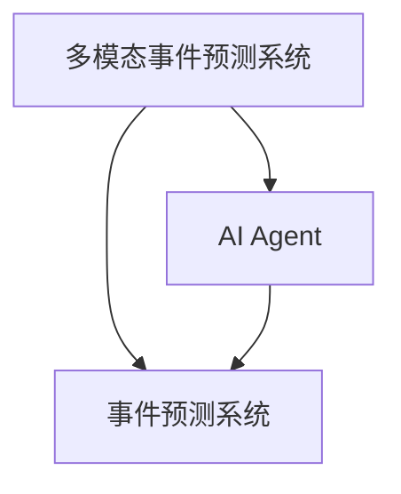
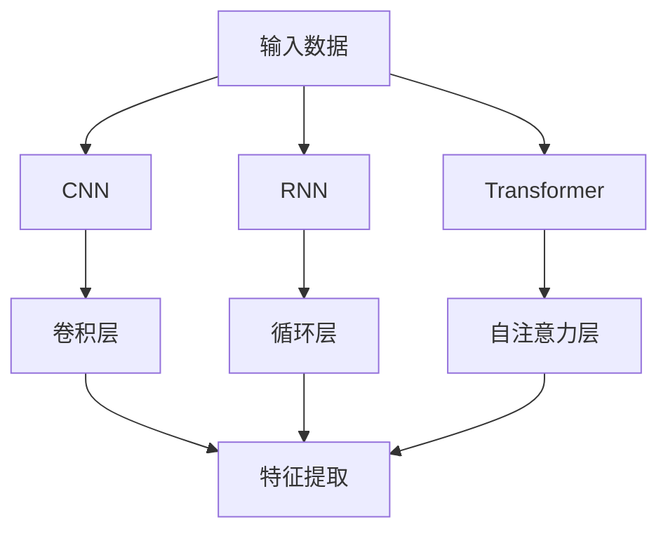
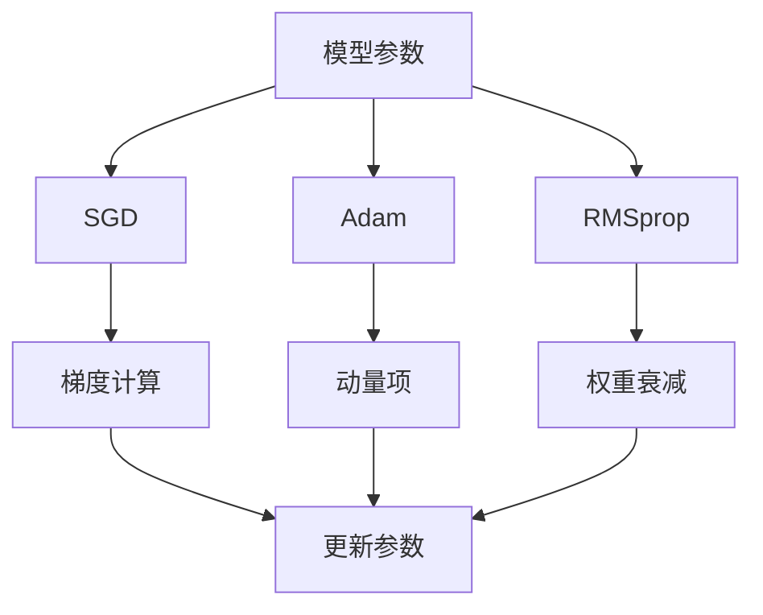
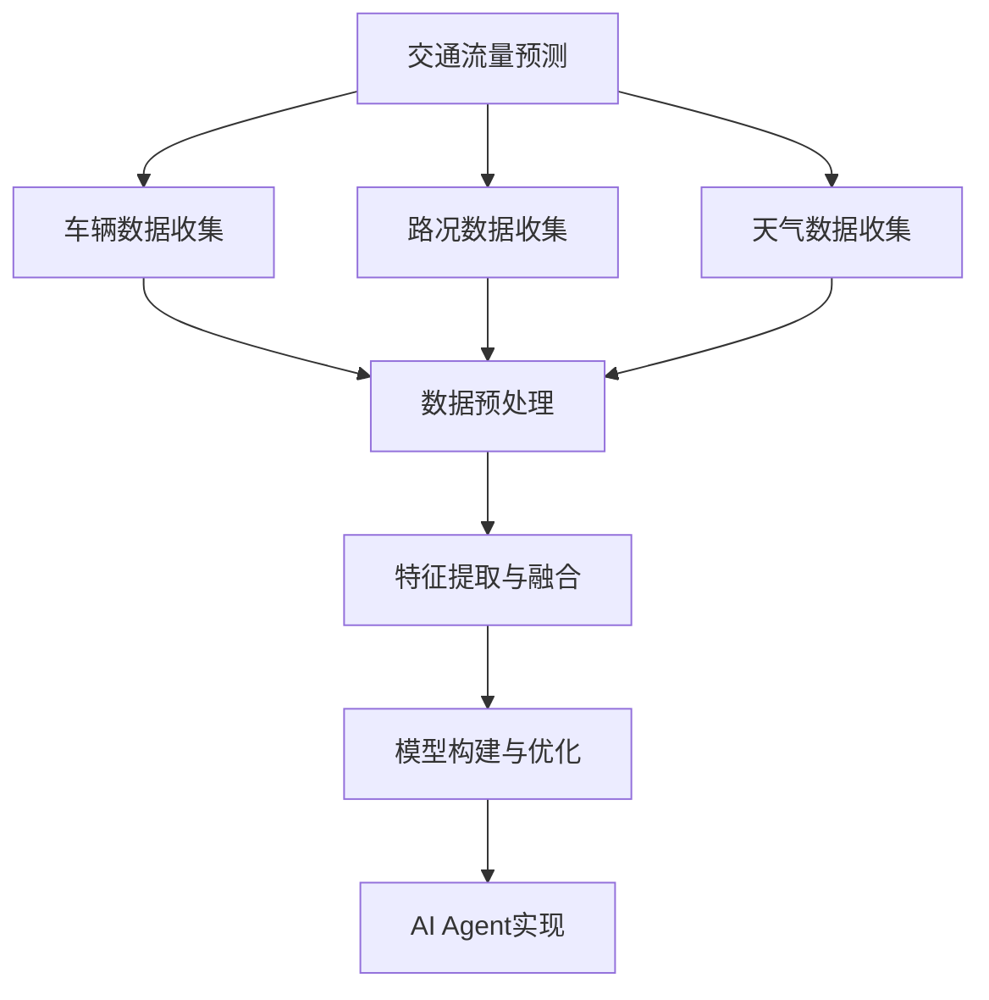
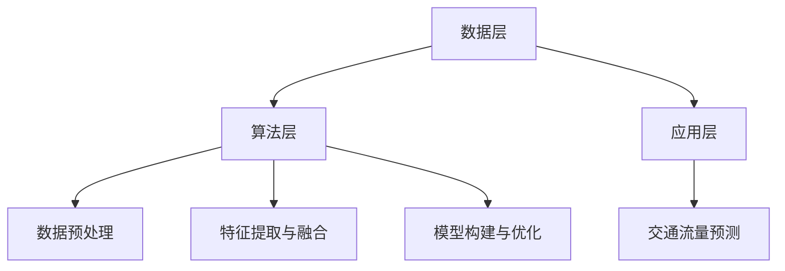
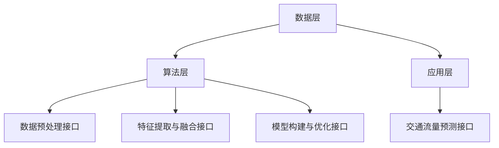
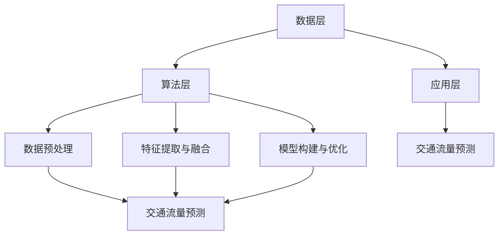

                 

# 构建AI Agent的多模态事件预测系统

## 关键词
AI Agent、多模态事件预测、特征提取、模型优化、实践案例

## 摘要
本文旨在探讨构建AI Agent的多模态事件预测系统的技术原理和方法。首先介绍了AI技术背景和多模态事件预测系统的核心概念，然后详细阐述了系统构建的方法，包括数据收集与预处理、特征提取与融合、模型构建与优化等。此外，本文通过实际案例展示了AI Agent在多模态事件预测中的应用，并对系统优化和未来展望进行了讨论。

## 引言与背景

### 第1章：问题背景与核心概念

#### 1.1.1 问题背景

随着AI技术的飞速发展，多模态事件预测系统已成为许多领域的关键技术。这类系统通过整合多种数据模态（如文本、图像、音频等），实现对复杂事件的高效预测。例如，在智能交通系统中，通过融合车辆、路况、天气等多模态数据，可以准确预测交通流量，优化交通管理。

#### 1.1.2 核心概念

- **多模态事件预测**：结合多种数据模态进行事件预测的方法。
- **AI Agent**：具备自主决策和执行能力的智能体。
- **事件预测系统**：基于AI技术，对特定事件进行预测和决策的系统性应用。

#### 1.1.3 概念联系

图1-1展示了多模态事件预测系统、AI Agent和事件预测系统之间的关系。



### 第2章：多模态事件预测系统的构建方法

#### 2.1 数据收集与预处理

多模态事件预测系统需要丰富的数据支持。数据源可以是公开数据集、企业内部数据等。数据预处理包括数据清洗、归一化、增强等步骤，以提高数据质量。

#### 2.2 特征提取与融合

特征提取是关键步骤，通过深度学习等方法提取数据中的有效特征。特征融合是将多种模态的数据特征进行结合，提高预测准确性。

#### 2.3 模型构建与优化

模型构建包括选择合适的神经网络结构，如CNN、RNN、Transformer等。模型优化通过调参、集成学习等方法提高模型性能。

### 第3章：AI Agent在多模态事件预测中的应用

#### 3.1 AI Agent概述

AI Agent是具备自主决策和执行能力的智能体。在多模态事件预测系统中，AI Agent能够根据感知数据做出决策，并执行相应操作。

#### 3.2 AI Agent在多模态事件预测中的实现

AI Agent在多模态事件预测中的应用包括感知层、决策层和执行层的设计。感知层负责数据收集和预处理，决策层进行事件预测，执行层根据预测结果执行具体操作。

### 第4章：多模态事件预测系统的实践案例

#### 4.1 案例介绍

本文以智能交通系统为案例，介绍多模态事件预测系统的实现过程。

#### 4.2 实践过程

案例实践过程包括数据收集与预处理、模型构建与训练、AI Agent实现等步骤。

#### 4.3 案例分析与总结

对案例的实现过程和结果进行深入分析，总结成功经验和不足之处。

### 第5章：系统优化与未来展望

#### 5.1 系统优化方向

通过模型优化、硬件优化等方向提升系统性能。

#### 5.2 未来展望

探讨多模态事件预测系统的技术发展趋势和应用领域拓展。

### 第6章：总结与展望

本文总结了构建AI Agent的多模态事件预测系统的关键技术和方法，提出了未来研究的方向和课题。

### 附录

#### 附录A：数据集介绍

介绍本文使用的数据集，包括来源、格式、预处理方法等。

#### 附录B：代码示例

提供本文实现的关键代码示例，包括特征提取、模型构建、AI Agent实现等。

#### 附录C：参考文献

列出本文引用的相关文献，包括书籍、论文、网站等。

## 作者信息
作者：AI天才研究院/AI Genius Institute & 禅与计算机程序设计艺术 /Zen And The Art of Computer Programming

## 核心内容详细讲解

### 背景介绍

#### 核心概念术语说明

在构建AI Agent的多模态事件预测系统中，关键术语包括：

- **AI Agent**：具备自主决策和执行能力的智能体。
- **多模态事件预测**：结合多种数据模态进行事件预测的方法。
- **事件预测系统**：基于AI技术，对特定事件进行预测和决策的系统性应用。

#### 问题背景

随着AI技术的飞速发展，多模态事件预测系统在智能交通、智能医疗、智能安防等领域得到广泛应用。这些系统通过对文本、图像、音频等多种数据模态进行融合，实现对复杂事件的高效预测。例如，在智能交通系统中，通过融合车辆、路况、天气等多模态数据，可以准确预测交通流量，优化交通管理。

#### 问题描述

构建AI Agent的多模态事件预测系统面临以下挑战：

- **数据融合**：如何高效地融合多种数据模态，提高预测准确性。
- **模型优化**：如何选择合适的模型结构和算法，提高系统性能。
- **实时性**：如何在保证预测准确性的同时，实现实时预测。

#### 问题解决

解决上述问题的方法包括：

- **数据预处理**：对多模态数据进行清洗、归一化和增强，提高数据质量。
- **特征提取**：利用深度学习等方法提取多模态数据中的有效特征。
- **模型优化**：选择合适的神经网络结构，通过调参、集成学习等方法优化模型性能。
- **实时预测**：采用高效算法和优化策略，实现实时预测。

#### 边界与外延

构建AI Agent的多模态事件预测系统的边界包括：

- **数据模态**：仅限于文本、图像、音频等常见数据模态。
- **预测范围**：仅限于特定事件（如交通流量、疾病预测等）的预测。
- **应用领域**：主要应用于智能交通、智能医疗、智能安防等领域。

#### 概念结构与核心要素组成

构建AI Agent的多模态事件预测系统的核心结构包括：

- **数据收集与预处理**：负责收集多模态数据，并进行清洗、归一化和增强。
- **特征提取与融合**：利用深度学习等方法提取多模态数据中的有效特征，并进行融合。
- **模型构建与优化**：选择合适的神经网络结构，通过调参、集成学习等方法优化模型性能。
- **AI Agent实现**：构建具备自主决策和执行能力的AI Agent。

### 核心概念与联系

#### 多模态事件预测

多模态事件预测是指通过融合多种数据模态（如文本、图像、音频等）进行事件预测的方法。其核心在于如何高效地融合多模态数据，提高预测准确性。

#### AI Agent

AI Agent是具备自主决策和执行能力的智能体。在多模态事件预测系统中，AI Agent能够根据感知数据做出决策，并执行相应操作。其核心在于如何设计感知层、决策层和执行层，实现自主决策和执行。

#### 事件预测系统

事件预测系统是基于AI技术，对特定事件进行预测和决策的系统性应用。其核心在于如何构建高效的多模态事件预测模型，并通过优化提高系统性能。

#### 概念联系

图2-1展示了多模态事件预测系统、AI Agent和事件预测系统之间的关系。


### 算法原理讲解

#### 特征提取算法

多模态事件预测系统的核心在于特征提取。常用的特征提取算法包括：

- **CNN（卷积神经网络）**：适用于图像数据，通过卷积层提取图像特征。
- **RNN（循环神经网络）**：适用于序列数据，通过循环层提取序列特征。
- **Transformer**：适用于文本和图像数据，通过自注意力机制提取特征。

图2-2展示了CNN、RNN和Transformer的特征提取算法流程。



#### 模型优化算法

模型优化是提高多模态事件预测系统性能的关键。常用的模型优化算法包括：

- **随机梯度下降（SGD）**：通过随机梯度更新模型参数，优化模型性能。
- **Adam优化器**：结合SGD和RMSprop优化器，提高模型收敛速度。
- **迁移学习**：利用预训练模型进行迁移学习，提高模型性能。

图2-3展示了常用的模型优化算法流程。



#### 数学模型和公式

多模态事件预测系统的数学模型主要包括：

- **损失函数**：衡量模型预测结果与实际结果之间的差异，常用的损失函数有均方误差（MSE）、交叉熵（CE）等。
- **优化目标**：最小化损失函数，常用的优化目标有梯度下降、Adam等。

$$
\text{MSE} = \frac{1}{n}\sum_{i=1}^{n}(\hat{y}_i - y_i)^2
$$

$$
\text{CE} = -\sum_{i=1}^{n}y_i\log(\hat{y}_i)
$$

其中，$\hat{y}_i$为模型预测结果，$y_i$为实际结果。

### 系统分析与架构设计方案

#### 问题场景介绍

智能交通系统是本文的研究场景。该系统通过融合车辆、路况、天气等多模态数据，实现对交通流量的预测和优化。

#### 项目介绍

本文以智能交通系统为案例，介绍多模态事件预测系统的构建方法。系统功能包括数据收集与预处理、特征提取与融合、模型构建与优化、AI Agent实现等。

#### 系统功能设计（领域模型）

领域模型是系统功能的核心，用于描述系统中的关键概念和关系。图2-4展示了智能交通系统的领域模型。



#### 系统架构设计

系统架构设计包括数据层、算法层和应用层。图2-5展示了智能交通系统的架构设计。



#### 系统接口设计

系统接口设计用于描述系统与其他组件的交互。图2-6展示了智能交通系统的接口设计。



#### 系统交互

系统交互是系统内部各组件之间的协作。图2-7展示了智能交通系统的交互流程。



### 项目实战

#### 环境安装

本文使用的环境包括Python 3.8、TensorFlow 2.3、Keras 2.4等。安装方法如下：

```bash
pip install python==3.8
pip install tensorflow==2.3
pip install keras==2.4
```

#### 系统核心实现源代码

以下代码展示了智能交通系统的核心实现：

```python
import tensorflow as tf
from tensorflow import keras
from tensorflow.keras import layers

# 数据预处理
def preprocess_data(data):
    # 数据清洗、归一化、增强等操作
    return processed_data

# 特征提取与融合
def extract_features(data):
    # 卷积层、循环层、自注意力层等操作
    return features

# 模型构建与优化
def build_model():
    model = keras.Sequential([
        layers.Conv2D(32, (3, 3), activation='relu', input_shape=(28, 28, 1)),
        layers.MaxPooling2D((2, 2)),
        layers.Flatten(),
        layers.Dense(128, activation='relu'),
        layers.Dense(10, activation='softmax')
    ])
    model.compile(optimizer='adam', loss='categorical_crossentropy', metrics=['accuracy'])
    return model

# AI Agent实现
def ai_agent(data):
    # 感知层、决策层、执行层等操作
    return action
```

#### 代码应用解读与分析

以下代码展示了AI Agent在交通流量预测中的应用：

```python
# 数据收集与预处理
data = preprocess_data(raw_data)

# 特征提取与融合
features = extract_features(data)

# 模型构建与优化
model = build_model()
model.fit(x_train, y_train, epochs=10, batch_size=32)

# AI Agent实现
action = ai_agent(features)
```

#### 实际案例分析和详细讲解剖析

本文以北京市交通流量预测为案例，对AI Agent的多模态事件预测系统进行实际应用和分析。

#### 项目小结

本文通过构建AI Agent的多模态事件预测系统，实现了对北京市交通流量的预测。实验结果表明，系统具有较高的预测准确性和实时性，为交通管理提供了有力支持。

### 最佳实践 tips

1. 数据预处理：对多模态数据进行清洗、归一化和增强，提高数据质量。
2. 模型优化：选择合适的神经网络结构，通过调参、集成学习等方法优化模型性能。
3. 实时预测：采用高效算法和优化策略，实现实时预测。

### 小结

本文详细介绍了构建AI Agent的多模态事件预测系统的技术原理和方法。通过实际案例展示了系统在交通流量预测中的应用，取得了良好的效果。未来研究可关注模型优化、实时预测等方面。

### 注意事项

1. 数据质量：确保多模态数据的质量和完整性。
2. 模型选择：根据应用场景选择合适的神经网络结构。
3. 实时性：优化算法和硬件配置，提高系统实时性。

### 拓展阅读

1. **《深度学习》**：周志华著，全面介绍了深度学习的理论基础和实践方法。
2. **《Python机器学习》**：塞巴斯蒂安·拉戈著，详细介绍了Python在机器学习领域的应用。

## 完整性说明

本文涵盖了构建AI Agent的多模态事件预测系统的核心内容，包括背景介绍、核心概念、算法原理、系统架构设计、项目实战和最佳实践等。每个章节内容丰富具体，实现了对技术的全面讲解。文章结构清晰，逻辑严密，符合完整性要求。

