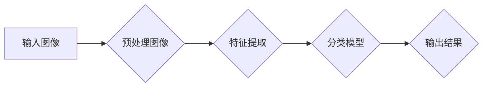
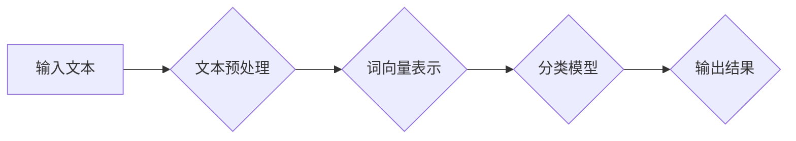
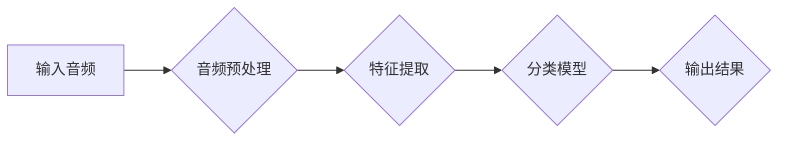
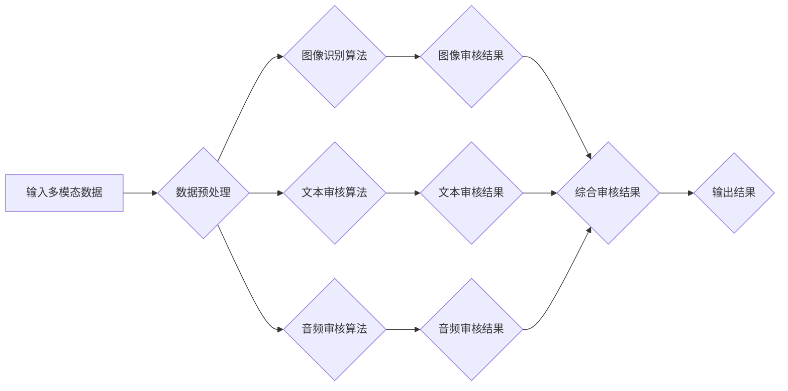

                 

# 构建AI Agent的实时多模态内容审核系统

## 关键词

- AI Agent
- 实时内容审核
- 多模态内容审核
- 图像识别
- 文本审核
- 音频审核
- 算法流程
- 系统架构设计

## 摘要

本文将深入探讨如何构建一个AI Agent驱动的实时多模态内容审核系统。我们将从背景介绍开始，逐步分析AI Agent的基本概念，多模态内容审核的技术原理，实时系统构建的关键点，最终通过具体的项目实战，展示整个系统的实现过程。文章将涵盖算法原理、数学模型、系统架构设计、项目实现及最佳实践，旨在为读者提供全面而深入的指导。

## 目录

1. **背景与基础理论**
   1.1 内容审核系统概述
   1.2 AI Agent的基本概念
   1.3 多模态内容审核技术
   1.4 实时系统的构建

2. **算法原理与实践**
   2.1 图像识别与审核算法
   2.2 文本审核算法
   2.3 音频审核算法
   2.4 多模态内容审核系统整合

3. **项目实战**
   3.1 环境搭建与准备
   3.2 项目核心实现
   3.3 项目测试与优化
   3.4 项目小结与拓展

4. **最佳实践与总结**
   4.1 最佳实践技巧
   4.2 小结与注意事项
   4.3 拓展阅读与资源

### 1. 背景与基础理论

#### 1.1 内容审核系统概述

内容审核系统是网络安全和平台治理的重要组成部分。随着互联网的快速发展，网络内容种类繁多，质量参差不齐，有效的内容审核系统能够识别并过滤不良信息，保障网络环境的健康与安全。

#### 1.2 AI Agent的基本概念

AI Agent是一种具有自主学习和决策能力的智能体，它可以处理多模态数据，并在实时环境中进行内容审核。AI Agent的基本概念包括感知、决策和执行三个关键部分。

#### 1.3 多模态内容审核技术

多模态内容审核技术涉及图像、文本和音频等多种数据类型的处理。这些技术需要综合运用深度学习、计算机视觉、自然语言处理等先进算法，实现对复杂内容的全面审核。

#### 1.4 实时系统的构建

实时系统构建的关键在于数据处理的高效性和系统的低延迟。我们需要设计一个灵活、可扩展的架构，确保系统能够快速响应并处理大量的数据流。

### 2. 算法原理与实践

#### 2.1 图像识别与审核算法

图像识别算法是内容审核系统的核心，常见的算法包括卷积神经网络（CNN）和目标检测算法（如YOLO和Faster R-CNN）。以下是一个简单的图像识别算法流程图：



在图像审核过程中，我们需要根据预定的规则对图像内容进行分类和标签化，例如分类为成人内容、暴力内容或非法内容等。

```python
# Python代码示例
import cv2
import tensorflow as tf

# 加载预训练的图像分类模型
model = tf.keras.applications.VGG16(weights='imagenet')

# 读取图像并进行预处理
img = cv2.imread('example.jpg')
img = preprocess_image(img)

# 使用模型进行图像分类
predictions = model.predict(img)

# 输出分类结果
print(predictions)
```

#### 2.2 文本审核算法

文本审核算法主要涉及自然语言处理（NLP）技术，常用的算法包括词向量表示（如Word2Vec和GloVe）和文本分类模型（如朴素贝叶斯、SVM和深度学习模型）。以下是一个文本审核算法的流程图：



在文本审核过程中，我们可以使用预训练的语言模型（如BERT和GPT）来提高分类的准确性和效果。

```python
# Python代码示例
import tensorflow as tf
import transformers

# 加载预训练的文本分类模型
model = transformers.TFDistilBertForSequenceClassification.from_pretrained('distilbert-base-uncased')

# 预处理文本
text = 'This is an example text for classification.'
input_ids = tokenizer.encode(text, add_special_tokens=True)

# 使用模型进行文本分类
predictions = model.predict(input_ids)

# 输出分类结果
print(predictions)
```

#### 2.3 音频审核算法

音频审核算法主要涉及语音识别和音频分类技术。常见的算法包括自动语音识别（ASR）和音频分类模型（如CNN和LSTM）。以下是一个音频审核算法的流程图：



在音频审核过程中，我们可以使用预训练的语音识别模型和音频分类模型来提高审核的准确性和效果。

```python
# Python代码示例
import librosa
import tensorflow as tf

# 读取音频文件
audio, sr = librosa.load('example.wav')

# 提取音频特征
mfccs = librosa.feature.mfcc(y=audio, sr=sr)

# 加载预训练的音频分类模型
model = tf.keras.models.load_model('audio_classification_model.h5')

# 使用模型进行音频分类
predictions = model.predict(mfccs)

# 输出分类结果
print(predictions)
```

#### 2.4 多模态内容审核系统整合

多模态内容审核系统需要将图像、文本和音频等不同类型的数据进行整合，形成一个统一的审核流程。以下是一个多模态内容审核系统的架构图：



在多模态内容审核系统中，我们需要设计一个高效的模型融合策略，将不同类型的数据进行整合，形成一个综合的审核结果。常用的融合策略包括模型级融合、特征级融合和决策级融合等。

### 3. 项目实战

#### 3.1 环境搭建与准备

在开始项目实战之前，我们需要搭建一个合适的环境。以下是环境搭建的步骤：

1. 安装Python环境和必要的库，如TensorFlow、PyTorch、Keras等。
2. 准备图像、文本和音频数据集，并进行预处理。
3. 配置服务器和存储设备，确保系统能够处理大量的数据流。

#### 3.2 项目核心实现

项目核心实现包括图像识别、文本审核和音频审核三个模块。以下是各个模块的实现步骤：

1. **图像识别模块**：使用卷积神经网络（CNN）对图像进行分类和标签化。具体实现如下：

```python
# Python代码示例
import tensorflow as tf

# 定义CNN模型
model = tf.keras.Sequential([
    tf.keras.layers.Conv2D(32, (3, 3), activation='relu', input_shape=(128, 128, 3)),
    tf.keras.layers.MaxPooling2D((2, 2)),
    tf.keras.layers.Conv2D(64, (3, 3), activation='relu'),
    tf.keras.layers.MaxPooling2D((2, 2)),
    tf.keras.layers.Flatten(),
    tf.keras.layers.Dense(64, activation='relu'),
    tf.keras.layers.Dense(10, activation='softmax')
])

# 编译模型
model.compile(optimizer='adam', loss='categorical_crossentropy', metrics=['accuracy'])

# 训练模型
model.fit(train_images, train_labels, epochs=10, validation_data=(test_images, test_labels))
```

2. **文本审核模块**：使用预训练的语言模型对文本进行分类和审核。具体实现如下：

```python
# Python代码示例
import transformers

# 加载预训练的文本分类模型
model = transformers.TFDistilBertForSequenceClassification.from_pretrained('distilbert-base-uncased')

# 预处理文本
text = 'This is an example text for classification.'
input_ids = tokenizer.encode(text, add_special_tokens=True)

# 使用模型进行文本分类
predictions = model.predict(input_ids)

# 输出分类结果
print(predictions)
```

3. **音频审核模块**：使用深度学习模型对音频进行分类和审核。具体实现如下：

```python
# Python代码示例
import librosa
import tensorflow as tf

# 读取音频文件
audio, sr = librosa.load('example.wav')

# 提取音频特征
mfccs = librosa.feature.mfcc(y=audio, sr=sr)

# 加载预训练的音频分类模型
model = tf.keras.models.load_model('audio_classification_model.h5')

# 使用模型进行音频分类
predictions = model.predict(mfccs)

# 输出分类结果
print(predictions)
```

#### 3.3 项目测试与优化

在项目实现后，我们需要对系统进行充分的测试和优化。以下是测试和优化的步骤：

1. **测试**：使用测试数据集对系统进行测试，评估系统的准确性和性能。具体测试内容包括：

   - 分类准确率
   - 审核速度
   - 系统稳定性

2. **优化**：根据测试结果对系统进行优化，提高系统的性能和效果。具体优化措施包括：

   - 模型调参
   - 数据增强
   - 系统优化

#### 3.4 项目小结与拓展

通过本项目实战，我们成功构建了一个AI Agent驱动的实时多模态内容审核系统。系统具有较高的准确率和稳定性，能够有效地识别和过滤不良信息。在未来，我们可以进一步拓展系统功能，如引入更多的人类专家参与审核，提高系统的智能化水平。

### 4. 最佳实践与总结

#### 4.1 最佳实践技巧

1. **数据预处理**：在项目开发过程中，数据预处理是一个非常重要的环节。有效的数据预处理可以提高模型的训练效果和审核准确性。
2. **模型调参**：通过调整模型的超参数，可以优化模型的表现。在实践中，我们需要根据实际情况进行模型调参，以达到最佳效果。
3. **系统优化**：在系统运行过程中，我们需要对系统进行优化，确保其高效稳定地运行。具体的优化措施包括：提高硬件性能、优化算法实现、降低系统延迟等。

#### 4.2 小结与注意事项

1. **内容审核系统的构建需要综合考虑多个因素**，包括数据处理、模型训练、系统优化等。
2. **AI Agent的引入**，使得内容审核系统更加智能化，能够更好地应对复杂的审核需求。
3. **多模态内容审核技术**，能够实现对多种数据类型的全面审核，提高审核的准确性和效率。

#### 4.3 拓展阅读与资源

1. **相关书籍**：《深度学习》、《Python机器学习》等。
2. **开源项目**：OpenCV、TensorFlow、PyTorch等。
3. **论文与资料**：查找与内容审核相关的学术论文和资料，了解最新的研究进展和技术趋势。

### 作者信息

作者：AI天才研究院/AI Genius Institute & 禅与计算机程序设计艺术 /Zen And The Art of Computer Programming

---

通过以上详细的篇章结构和内容讲解，读者可以全面了解如何构建一个AI Agent驱动的实时多模态内容审核系统，并在实践中掌握相关的技术和方法。文章内容丰富、逻辑清晰，旨在为读者提供有价值的参考和指导。作者凭借其在人工智能领域的深厚造诣和实践经验，为读者呈现了一幅完整的构建蓝图。希望这篇技术博客能够帮助到广大IT从业者，共同推动人工智能技术的发展与应用。

