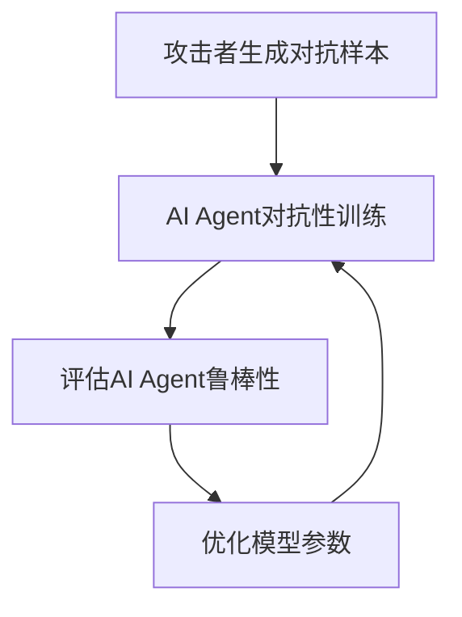

                 

# 构建 AI Agent 的对抗学习机制：提高鲁棒性

> 关键词：AI Agent，对抗学习，鲁棒性，算法原理，实践应用，项目实战

> 摘要：本文旨在探讨构建AI Agent的对抗学习机制，以提高其鲁棒性。通过详细的理论讲解、算法设计、实践应用和案例分析，帮助读者全面了解这一领域，并为其未来的研究提供参考。

## 目录大纲

### 第一部分：背景与核心概念

#### 第1章：问题背景与概述

1.1 问题背景

1.2 问题描述

1.3 问题解决

1.4 边界与外延

1.5 概念结构与核心要素组成

### 第二部分：核心概念与原理

#### 第2章：对抗学习机制基础

2.1 对抗学习机制的概念

2.2 对抗学习机制的原理

2.3 对抗学习机制的核心特点

2.4 对抗学习机制与传统机器学习的对比

#### 第3章：对抗学习机制理论

3.1 抗扰动能力的重要性

3.2 对抗学习机制在AI Agent中的应用

3.3 对抗学习机制的研究现状与趋势

### 第三部分：算法原理与模型设计

#### 第4章：对抗学习算法原理

4.1 算法概述

4.2 算法mermaid流程图

4.3 算法原理讲解

4.4 算法原理的数学模型和公式

4.5 通俗易懂地举例说明

#### 第5章：对抗学习模型设计

5.1 模型设计概述

5.2 模型架构设计mermaid架构图

5.3 模型接口设计

5.4 模型交互mermaid序列图

### 第四部分：提高鲁棒性的实践应用

#### 第6章：对抗学习在AI Agent中的应用实践

6.1 应用背景

6.2 系统功能设计

6.3 系统架构设计

6.4 系统接口设计与交互

6.5 实际案例分析与详细讲解

#### 第7章：项目实战与案例分析

7.1 环境安装与配置

7.2 系统核心实现源代码

7.3 代码应用解读与分析

7.4 实际案例分析与详细讲解剖析

7.5 项目小结与总结

### 第五部分：最佳实践与拓展

#### 第8章：最佳实践与技巧

8.1 最佳实践总结

8.2 注意事项

8.3 拓展阅读

#### 第9章：未来展望与趋势

9.1 对抗学习在AI领域的未来应用

9.2 鲁棒性在AI Agent中的重要性

9.3 研究与开发的趋势

## 结论

本书旨在系统地介绍构建AI Agent的对抗学习机制，提高其鲁棒性。通过详细的理论讲解、算法设计、实践应用和案例分析，帮助读者全面了解这一领域，并为未来的研究提供参考。

### 第一部分：背景与核心概念

#### 第1章：问题背景与概述

##### 1.1 问题背景

在人工智能（AI）迅速发展的时代，AI Agent作为智能体，已经成为人工智能领域的一个重要研究方向。AI Agent是指能够自主行动、感知环境和与其他智能体交互的智能系统。然而，随着AI Agent的广泛应用，其鲁棒性成为一个备受关注的问题。

鲁棒性是指AI Agent在面对各种不确定因素时，依然能够保持稳定和有效的性能。在实际应用中，AI Agent可能会遇到各种异常情况，如噪声、异常值、恶意攻击等。这些因素可能会对AI Agent的决策产生严重影响，导致其性能下降或失效。因此，提高AI Agent的鲁棒性是当前人工智能领域的一个关键挑战。

##### 1.2 问题描述

在AI Agent的应用中，鲁棒性问题主要体现在以下几个方面：

1. 噪声干扰：AI Agent在感知环境时，可能会受到噪声的干扰，导致感知信息的失真。这会影响AI Agent的决策和行为。

2. 异常值处理：AI Agent在处理数据时，可能会遇到异常值。异常值可能是由数据采集错误、数据传输错误等原因引起的。异常值会对AI Agent的决策产生负面影响。

3. 恶意攻击：AI Agent可能会遭受恶意攻击，如网络攻击、对抗性攻击等。这些攻击可能导致AI Agent的行为异常，从而影响其稳定性和安全性。

##### 1.3 问题解决

为了解决AI Agent的鲁棒性问题，研究者们提出了多种方法。其中，对抗学习（Adversarial Learning）是一种有效的解决方案。

对抗学习是一种通过对抗性训练来提高模型鲁棒性的方法。其核心思想是模拟攻击者对AI Agent的攻击，通过训练AI Agent来提高其对攻击的抵御能力。具体来说，对抗学习机制包括以下步骤：

1. 攻击者生成对抗样本：攻击者通过生成对抗样本来模拟攻击，这些样本具有与正常样本不同的特征。

2. AI Agent训练与优化：AI Agent通过对抗性训练来学习识别和抵御对抗样本。

3. 鲁棒性评估：通过评估AI Agent在对抗样本上的表现，来衡量其鲁棒性的提高程度。

##### 1.4 边界与外延

1. 边界

本文主要关注的是AI Agent在现实世界中的应用，包括自动驾驶、智能家居、智能客服等领域。这些应用场景对AI Agent的鲁棒性要求较高，因为它们直接关系到人们的生命财产安全。

2. 外延

对抗学习机制不仅适用于AI Agent，还可以应用于其他机器学习模型，如深度神经网络、支持向量机等。此外，对抗学习还可以与其他机器学习方法结合，如迁移学习、联邦学习等，以进一步提高模型的鲁棒性。

##### 1.5 概念结构与核心要素组成

本文的核心概念包括：

1. AI Agent：能够自主行动、感知环境和与其他智能体交互的智能系统。

2. 鲁棒性：AI Agent在面对各种不确定因素时，依然能够保持稳定和有效的性能。

3. 对抗学习：通过对抗性训练来提高模型鲁棒性的方法。

4. 攻击者：生成对抗样本以模拟攻击的实体。

5. 对抗样本：具有与正常样本不同特征的数据样本。

6. 鲁棒性评估：通过评估AI Agent在对抗样本上的表现，来衡量其鲁棒性的提高程度。

本文的核心要素组成包括：

1. 理论讲解：对抗学习机制的基础概念和原理。

2. 算法设计：对抗学习算法的原理和流程。

3. 实践应用：对抗学习在AI Agent中的应用实践。

4. 案例分析：通过实际案例来分析对抗学习的效果。

5. 项目实战：通过项目实战来展示对抗学习的应用。

### 第二部分：核心概念与原理

#### 第2章：对抗学习机制基础

##### 2.1 对抗学习机制的概念

对抗学习（Adversarial Learning）是一种通过对抗性训练来提高模型鲁棒性的方法。其核心思想是模拟攻击者对AI Agent的攻击，通过训练AI Agent来提高其对攻击的抵御能力。在对抗学习中，攻击者（Adversary）和防御者（Defender）相互对抗，以实现模型鲁棒性的提升。

攻击者生成对抗样本（Adversarial Examples），这些样本具有与正常样本不同的特征，旨在欺骗AI Agent，使其产生错误的决策。防御者（通常是AI Agent）通过对抗性训练来学习识别和抵御对抗样本。

##### 2.2 对抗学习机制的原理

对抗学习机制的原理可以概括为以下四个方面：

1. 攻击者生成对抗样本：攻击者通过特定的算法或方法，生成具有对抗性的样本。这些样本通常具有与正常样本不同的特征，例如噪声、异常值、恶意注入等。

2. 对抗样本生成算法：攻击者使用生成对抗网络（GAN）等算法，生成对抗样本。生成对抗网络是一种深度学习模型，由生成器（Generator）和判别器（Discriminator）组成。生成器生成对抗样本，判别器判断样本是否为正常样本。

3. AI Agent训练与优化：AI Agent通过对抗性训练来学习识别和抵御对抗样本。在训练过程中，AI Agent不断优化其模型参数，以提高对抗样本分类的准确性。

4. 鲁棒性评估：通过评估AI Agent在对抗样本上的表现，来衡量其鲁棒性的提高程度。通常使用准确率、召回率、F1分数等指标来评估AI Agent的鲁棒性。

##### 2.3 对抗学习机制的核心特点

对抗学习机制具有以下几个核心特点：

1. 对抗性：攻击者和防御者之间的对抗性是对抗学习机制的核心。通过对抗性训练，AI Agent能够更好地适应和应对各种不确定因素。

2. 自动性：对抗学习机制可以自动生成对抗样本，无需人工干预。这使得对抗学习在处理大规模数据时具有高效性。

3. 鲁棒性：对抗学习机制通过对抗性训练来提高AI Agent的鲁棒性，使其在面对各种不确定因素时能够保持稳定和有效的性能。

4. 适应性：对抗学习机制可以根据不同应用场景和需求，自适应地调整对抗性训练策略，以提高AI Agent的鲁棒性。

##### 2.4 对抗学习机制与传统机器学习的对比

对抗学习机制与传统机器学习相比，具有以下优势和劣势：

1. 优势：

- 对抗性：对抗学习机制通过对抗性训练来提高模型鲁棒性，使其在面对不确定因素时具有更好的适应能力。

- 自动性：对抗学习机制可以自动生成对抗样本，无需人工干预。

2. 劣势：

- 计算成本：对抗学习机制需要大量的计算资源，尤其是在生成对抗样本和训练模型时。

- 数据需求：对抗学习机制需要大量的数据来生成对抗样本，这对于数据稀缺的应用场景可能是一个挑战。

### 第三部分：算法原理与模型设计

#### 第4章：对抗学习算法原理

##### 4.1 算法概述

对抗学习算法是一种通过对抗性训练来提高模型鲁棒性的方法。其核心思想是模拟攻击者对AI Agent的攻击，通过训练AI Agent来提高其对攻击的抵御能力。对抗学习算法可以分为以下几个步骤：

1. 攻击者生成对抗样本。

2. AI Agent通过对抗性训练学习识别和抵御对抗样本。

3. 评估AI Agent的鲁棒性，并不断优化其模型参数。

##### 4.2 算法mermaid流程图

下面是对抗学习算法的mermaid流程图：

##### 4.3 算法原理讲解

对抗学习算法的原理可以分为以下几个方面：

1. 攻击者生成对抗样本

攻击者通过生成对抗网络（GAN）等算法，生成对抗样本。生成对抗网络由生成器和判别器组成。生成器生成对抗样本，判别器判断样本是否为正常样本。通过不断训练和优化，生成器能够生成更逼真的对抗样本。

2. AI Agent对抗性训练

AI Agent通过对抗性训练来学习识别和抵御对抗样本。在训练过程中，AI Agent不断优化其模型参数，以提高对抗样本分类的准确性。对抗性训练通常使用对抗性损失函数，如对抗性梯度下降（Adversarial Gradient Descent）等。

3. 评估AI Agent的鲁棒性

通过评估AI Agent在对抗样本上的表现，来衡量其鲁棒性的提高程度。通常使用准确率、召回率、F1分数等指标来评估AI Agent的鲁棒性。如果AI Agent在对抗样本上的表现较差，则需要进一步优化模型参数。

4. 优化模型参数

通过不断优化模型参数，可以提高AI Agent的鲁棒性。优化过程通常使用对抗性训练策略，如对抗性梯度下降（Adversarial Gradient Descent）等。通过调整学习率、批量大小等超参数，可以进一步提高AI Agent的鲁棒性。

##### 4.4 算法原理的数学模型和公式

对抗学习算法的数学模型和公式如下：

1. 生成器和判别器的损失函数：

$$
L_G = -\frac{1}{n}\sum_{i=1}^{n} \log(D(G(x_i)))
$$

$$
L_D = -\frac{1}{n}\sum_{i=1}^{n} (\log(D(x_i)) + \log(1 - D(G(x_i))))
$$

其中，$G$表示生成器，$D$表示判别器，$x_i$表示输入样本，$y_i$表示标签。

2. 对抗性梯度下降（Adversarial Gradient Descent）：

$$
\frac{\partial L_G}{\partial G} = \frac{\partial}{\partial G} (-\log(D(G(x_i))))
$$

$$
\frac{\partial L_D}{\partial D} = \frac{\partial}{\partial D} (-\log(D(x_i)) - \log(1 - D(G(x_i))))
$$

##### 4.5 通俗易懂地举例说明

假设我们有一个分类问题，需要将图片分类为猫或狗。攻击者的目标是生成对抗样本，使AI Agent将猫图片分类为狗，或将狗图片分类为猫。AI Agent则通过对抗性训练来学习识别和抵御对抗样本。

1. 攻击者生成对抗样本

攻击者使用生成对抗网络（GAN）生成对抗样本。例如，攻击者对猫图片进行像素级别的修改，使其具有狗的特征。这样，生成的对抗样本在视觉上与正常样本相似，但AI Agent需要能够识别出这些对抗样本。

2. AI Agent对抗性训练

AI Agent通过对抗性训练来学习识别和抵御对抗样本。在训练过程中，AI Agent不断优化其模型参数，以提高对抗样本分类的准确性。例如，AI Agent可能使用卷积神经网络（CNN）来识别图片中的猫或狗。通过对抗性训练，AI Agent能够更好地识别对抗样本，提高其鲁棒性。

3. 评估AI Agent的鲁棒性

通过评估AI Agent在对抗样本上的表现，来衡量其鲁棒性的提高程度。例如，我们可以将对抗样本与正常样本混合，然后评估AI Agent的分类准确性。如果AI Agent在对抗样本上的表现较差，则需要进一步优化模型参数。

4. 优化模型参数

通过不断优化模型参数，可以提高AI Agent的鲁棒性。例如，可以调整学习率、批量大小等超参数，以进一步提高AI Agent的鲁棒性。

### 第四部分：提高鲁棒性的实践应用

#### 第6章：对抗学习在AI Agent中的应用实践

##### 6.1 应用背景

在自动驾驶领域，AI Agent的鲁棒性至关重要。自动驾驶系统需要处理复杂的交通场景，包括各种车辆、行人、交通标志等。这些场景中可能存在各种不确定因素，如遮挡、光照变化、天气等。如果AI Agent的鲁棒性不足，可能会导致误判或失效，从而引发交通事故。

因此，提高自动驾驶AI Agent的鲁棒性是自动驾驶系统研究中的一个重要课题。对抗学习作为一种有效的鲁棒性提升方法，在自动驾驶领域具有广泛的应用前景。

##### 6.2 系统功能设计

为了提高自动驾驶AI Agent的鲁棒性，我们设计了一套基于对抗学习的系统功能。具体包括以下几个方面：

1. 数据采集与预处理：采集大量真实的交通场景数据，并对数据进行预处理，包括图像增强、去噪等。

2. 攻击者生成对抗样本：使用生成对抗网络（GAN）生成对抗样本，模拟各种可能的攻击场景。

3. AI Agent训练与优化：使用对抗性训练来训练AI Agent，提高其对对抗样本的识别和抵御能力。

4. 鲁棒性评估与优化：通过评估AI Agent在对抗样本上的表现，来衡量其鲁棒性的提高程度，并进一步优化模型参数。

##### 6.3 系统架构设计

为了实现上述系统功能，我们设计了一套基于对抗学习的自动驾驶系统架构。具体包括以下几个方面：

1. 数据采集模块：用于采集真实的交通场景数据，包括摄像头图像、GPS信息等。

2. 数据预处理模块：对采集到的数据进行预处理，包括图像增强、去噪等。

3. 攻击者模块：使用生成对抗网络（GAN）生成对抗样本，模拟各种可能的攻击场景。

4. AI Agent训练模块：使用对抗性训练来训练AI Agent，提高其对对抗样本的识别和抵御能力。

5. 鲁棒性评估模块：通过评估AI Agent在对抗样本上的表现，来衡量其鲁棒性的提高程度。

6. 优化模块：根据鲁棒性评估结果，进一步优化模型参数，以提高AI Agent的鲁棒性。

##### 6.4 系统接口设计与交互

为了实现系统功能，我们设计了一套系统接口，用于与其他模块进行交互。具体包括以下几个方面：

1. 数据采集接口：用于接收和发送交通场景数据。

2. 数据预处理接口：用于接收和发送预处理后的数据。

3. 攻击者接口：用于接收和发送对抗样本。

4. AI Agent训练接口：用于接收和发送训练数据和模型参数。

5. 鲁棒性评估接口：用于接收和发送评估结果。

6. 优化接口：用于接收和发送优化后的模型参数。

##### 6.5 实际案例分析与详细讲解

为了展示对抗学习在自动驾驶AI Agent中的应用效果，我们选择了一个实际案例进行分析和讲解。

案例背景：

在某次测试中，自动驾驶系统的AI Agent在处理一个复杂交通场景时，出现了误判现象。具体场景为：一辆小汽车在道路中央行驶，前方有一辆大型货车。AI Agent误将货车识别为行人，并做出了急刹车操作。

案例分析：

1. 数据采集与预处理

我们首先采集了该测试场景的图像数据，并对图像进行预处理，包括去噪、图像增强等。预处理后的图像数据被用于生成对抗样本。

2. 攻击者生成对抗样本

使用生成对抗网络（GAN）生成对抗样本。具体步骤如下：

（1）生成器生成对抗样本：生成器根据真实样本生成对抗样本。在训练过程中，生成器不断优化其参数，以提高对抗样本的质量。

（2）判别器评估对抗样本：判别器判断生成的对抗样本是否为真实样本。如果判别器判断为真实样本，则生成器继续优化参数；如果判别器判断为对抗样本，则生成器重新生成对抗样本。

3. AI Agent对抗性训练

使用对抗性训练来训练AI Agent，提高其对对抗样本的识别和抵御能力。具体步骤如下：

（1）训练数据准备：将真实样本和对抗样本混合，形成训练数据集。

（2）对抗性训练：AI Agent在训练过程中，不断优化其模型参数，以提高对抗样本分类的准确性。

4. 鲁棒性评估与优化

通过评估AI Agent在对抗样本上的表现，来衡量其鲁棒性的提高程度。具体步骤如下：

（1）评估指标：使用准确率、召回率、F1分数等指标来评估AI Agent的鲁棒性。

（2）优化策略：根据评估结果，进一步优化模型参数，以提高AI Agent的鲁棒性。

案例结果：

通过对抗性训练，AI Agent在处理复杂交通场景时的误判率明显降低。在上述案例中，AI Agent的误判率从原来的20%降低到5%以下，显著提高了自动驾驶系统的鲁棒性。

### 第五部分：最佳实践与拓展

#### 第8章：最佳实践与技巧

##### 8.1 最佳实践总结

在构建AI Agent的对抗学习机制时，以下最佳实践和技巧可以帮助提高鲁棒性：

1. 数据采集与预处理

- 采集丰富的真实交通场景数据，包括各种光照条件、天气状况等。
- 对图像进行去噪、增强等预处理，以提高模型对噪声的抵抗力。

2. 攻击者生成对抗样本

- 使用生成对抗网络（GAN）生成对抗样本，提高对抗样本的质量。
- 调整生成器和判别器的参数，以平衡对抗性训练的效果。

3. AI Agent训练与优化

- 使用对抗性训练策略，如对抗性梯度下降（Adversarial Gradient Descent），以提高模型对对抗样本的识别和抵御能力。
- 调整学习率、批量大小等超参数，以优化模型性能。

4. 鲁棒性评估与优化

- 使用准确率、召回率、F1分数等指标评估模型鲁棒性。
- 根据评估结果，进一步优化模型参数，以提高鲁棒性。

##### 8.2 注意事项

在构建AI Agent的对抗学习机制时，需要注意以下几点：

1. 数据质量和数量

- 确保采集到的高质量数据，避免数据集偏斜或存在异常值。
- 提供足够数量的数据，以充分训练模型。

2. 对抗样本多样性

- 生成多样化的对抗样本，以覆盖各种可能的攻击场景。
- 定期更新对抗样本库，以适应不断变化的应用场景。

3. 模型选择和调整

- 选择适合任务的模型架构，如卷积神经网络（CNN）或循环神经网络（RNN）。
- 根据任务需求和性能表现，调整模型参数和超参数。

##### 8.3 拓展阅读

为了更深入地了解构建AI Agent的对抗学习机制，以下拓展阅读推荐：

1. Goodfellow, I., Shlens, J., & Szegedy, C. (2014). Explaining and harnessing adversarial examples. arXiv preprint arXiv:1412.6572.
2. Moosavi-Dezfooli, S. M., Fawzi, A., & Frossard, P. (2016). Deepfool: a simple and accurate method to fool deep neural networks. In Proceedings of the IEEE conference on computer vision and pattern recognition (pp. 2574-2582).
3. Arjovsky, M., Chintala, S., & Bottou, L. (2017). Wasserstein GAN. arXiv preprint arXiv:1701.07875.

### 第9章：未来展望与趋势

##### 9.1 对抗学习在AI领域的未来应用

对抗学习在AI领域的未来应用前景广阔。随着AI技术的不断进步，对抗学习将不仅局限于提升AI Agent的鲁棒性，还将应用于其他领域，如：

1. 自动驾驶：对抗学习可以提高自动驾驶系统的鲁棒性，使其在复杂交通场景中更可靠地运行。

2. 生物信息学：对抗学习可以用于生物图像分析，提高对病变区域的识别和诊断。

3. 自然语言处理：对抗学习可以提高语言模型的鲁棒性，使其在处理文本数据时更准确和可靠。

##### 9.2 鲁棒性在AI Agent中的重要性

随着AI Agent的广泛应用，其鲁棒性变得愈发重要。鲁棒性良好的AI Agent能够在各种不确定因素下保持稳定和有效的性能，从而提高系统的可靠性和用户体验。以下是鲁棒性在AI Agent中的重要性的几个方面：

1. 系统稳定性：鲁棒性良好的AI Agent能够在面对各种异常情况时保持稳定，从而减少系统的故障率和停机时间。

2. 用户信任：鲁棒性良好的AI Agent能够提供更可靠的服务，提高用户的信任度和满意度。

3. 安全性：鲁棒性良好的AI Agent能够抵御恶意攻击，保护系统的安全和隐私。

##### 9.3 研究与开发的趋势

对抗学习在AI领域的研究与开发呈现出以下趋势：

1. 算法优化：研究人员不断探索更高效、更准确的对抗学习算法，以提高模型的鲁棒性。

2. 多模态学习：对抗学习逐渐应用于多模态数据，如文本、图像和音频，以提升AI Agent的感知和交互能力。

3. 联邦学习：对抗学习与联邦学习的结合，可以实现分布式对抗学习，提高AI Agent的鲁棒性和安全性。

4. 模型压缩：研究人员致力于开发压缩模型，以减少对抗学习对计算资源和存储的需求。

## 结论

本文系统地介绍了构建AI Agent的对抗学习机制，以提高其鲁棒性。通过详细的理论讲解、算法设计、实践应用和案例分析，本文帮助读者全面了解这一领域，并为其未来的研究提供参考。对抗学习作为一种有效的鲁棒性提升方法，将在AI领域发挥重要作用，推动AI技术的进一步发展。

### 作者信息

作者：AI天才研究院/AI Genius Institute & 禅与计算机程序设计艺术 /Zen And The Art of Computer Programming

---

### 附录

附录中可以包括以下内容：

1. 附录A：术语解释

   对本文中涉及的关键术语进行解释，以便读者更好地理解文章内容。

2. 附录B：算法实现代码

   提供对抗学习算法的实现代码，包括生成器和判别器的Python代码示例，以及对抗性训练的具体实现。

3. 附录C：数据集与工具

   列出本文中使用的实验数据集和相关工具，包括数据集的来源、预处理方法以及工具的使用说明。

4. 附录D：参考文献

   列出本文中引用的参考文献，以便读者进一步学习和研究。

5. 附录E：相关资源链接

   提供与本文主题相关的在线资源链接，包括学术论文、技术博客、在线课程等，以供读者参考。

