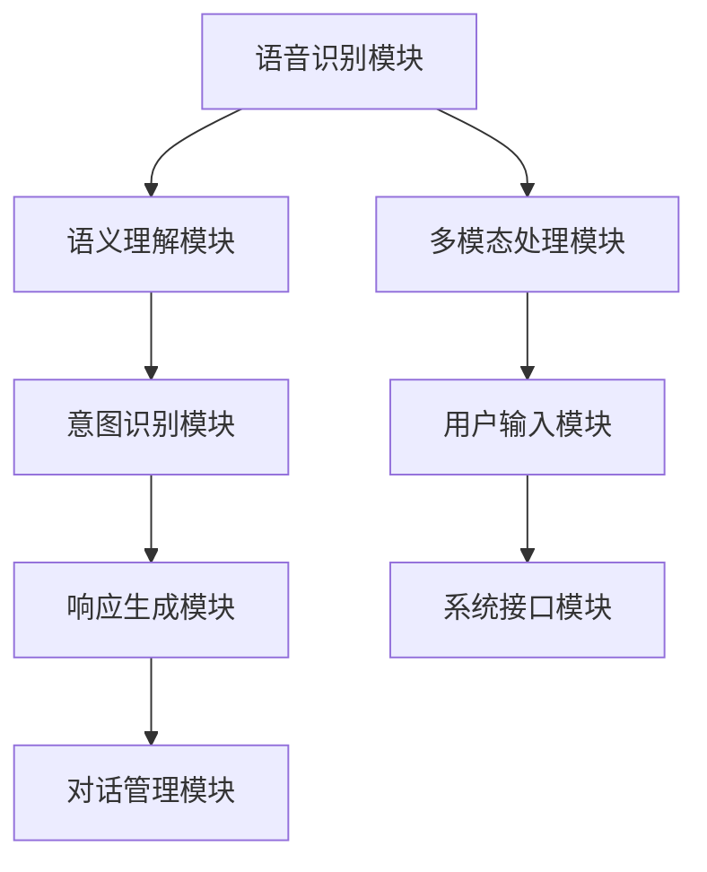
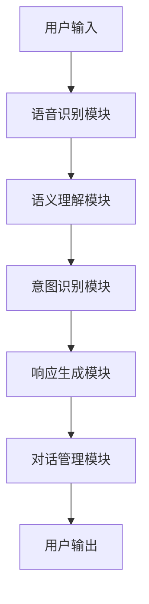
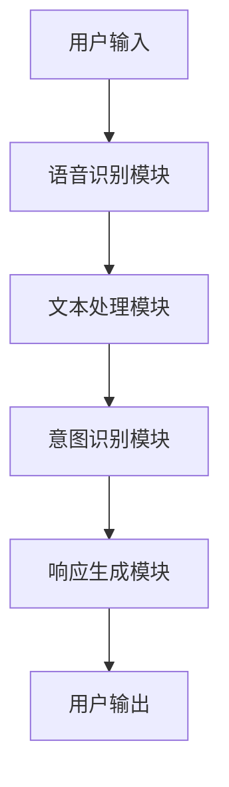
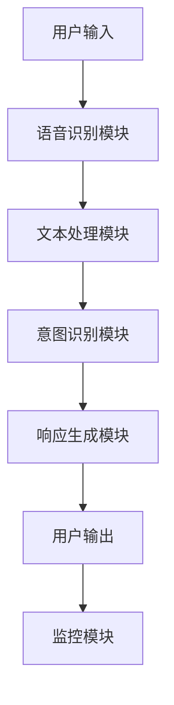
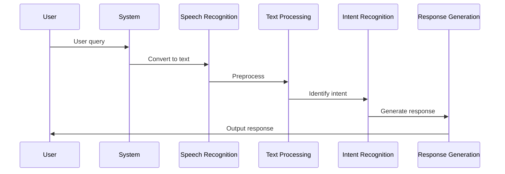

                 


### 第一部分：问题背景与概述

#### 第1章：对话意图识别的基本概念

##### 1.1 对话交互系统的挑战与需求

在当今的信息化时代，对话交互系统已成为人机交互的重要方式。从客服机器人、智能助手到智能语音助手，这些系统都面临着识别用户意图的挑战。对话意图识别作为对话交互系统的核心功能，其重要性不言而喻。

首先，对话交互系统的应用场景非常广泛。无论是日常生活中的聊天机器人，还是企业级的服务机器人，都需要准确理解用户的意图，以提供针对性的服务。然而，用户的表达方式千变万化，语言环境复杂多变，这给对话意图识别带来了巨大的挑战。

##### 1.1.1 对话交互系统的应用场景

1. **客服机器人**：在电商平台、金融行业、电信服务等领域，客服机器人通过对话意图识别，可以自动处理大量重复性的客服请求，提高服务效率和用户体验。

2. **智能助手**：在智能手机、智能家居等设备中，智能助手通过对话意图识别，可以理解用户的指令，完成各种智能操作。

3. **智能语音助手**：如苹果的Siri、谷歌的Google Assistant等，这些智能语音助手通过对话意图识别，可以实现语音交互，为用户提供便捷的服务。

##### 1.1.2 对话意图识别的重要性

对话意图识别的核心目标是理解用户的真实意图。只有准确地识别用户意图，对话交互系统才能提供正确的响应。以下是对话意图识别的重要性：

1. **提升用户体验**：通过准确理解用户意图，对话交互系统可以提供个性化的服务，满足用户的需求。

2. **降低人力成本**：对话意图识别可以自动化处理大量重复性任务，降低企业的人力成本。

3. **提高服务效率**：对话意图识别可以快速响应用户，提高系统的响应速度和服务质量。

##### 1.1.3 对话意图识别的基本流程

对话意图识别的基本流程包括以下几个步骤：

1. **语音识别**：将用户的语音输入转化为文本。

2. **语言预处理**：对文本进行分词、词性标注等预处理操作。

3. **语义理解**：通过自然语言处理技术，理解文本的含义。

4. **意图识别**：根据语义理解的结果，识别用户的意图。

5. **响应生成**：根据识别出的意图，生成相应的响应。

##### 1.2 对话意图识别的核心概念

对话意图识别涉及多个核心概念，下面分别进行解释。

###### 1.2.1.1 对话系统

对话系统是指能够与人类进行自然语言交互的计算机系统。它通常包括语音识别、语义理解、对话管理等功能模块。

###### 1.2.1.2 意图

意图是指用户在对话中表达的目的或需求。在对话意图识别中，意图是核心的概念，系统需要准确识别用户意图，以提供相应的服务。

###### 1.2.1.3 对话管理

对话管理是指对话系统的控制和协调过程，包括对话状态跟踪、对话策略选择、对话流控制等。

##### 1.3 对话意图识别的边界与外延

对话意图识别虽然非常重要，但也存在一些限制因素。以下是对话意图识别的边界与外延：

###### 1.3.1 对话意图识别的限制因素

1. **语言理解能力**：对话意图识别依赖于自然语言处理技术，而自然语言处理技术的语言理解能力仍然有限。

2. **上下文理解**：对话意图识别需要理解上下文信息，但在某些情况下，上下文理解可能不准确。

3. **多模态交互**：对话意图识别通常只关注文本输入，但在实际应用中，用户可能会使用语音、图像等多种模态进行交互。

###### 1.3.2 对话意图识别的发展趋势

1. **深度学习技术的应用**：随着深度学习技术的发展，越来越多的对话意图识别系统开始采用深度学习算法。

2. **多模态融合**：将语音、图像等多种模态的信息进行融合，以提高对话意图识别的准确性。

3. **个性化服务**：通过对用户行为的分析，提供个性化的服务，满足用户的特定需求。

###### 1.3.3 对话意图识别的应用领域

1. **客服机器人**：在电商、金融、电信等行业，客服机器人通过对话意图识别，可以自动处理用户的咨询和投诉。

2. **智能家居**：智能音箱、智能门锁等设备通过对话意图识别，可以实现与用户的智能交互。

3. **智能助手**：在智能手机、智能手表等设备中，智能助手通过对话意图识别，可以理解用户的指令，完成各种智能操作。

##### 1.4 对话意图识别的概念结构

对话意图识别的概念结构包括以下几个部分：

###### 1.4.1 概念定义

1. **对话系统**：能够与人类进行自然语言交互的计算机系统。

2. **意图**：用户在对话中表达的目的或需求。

3. **对话管理**：对话系统的控制和协调过程。

###### 1.4.2 概念属性

1. **对话系统**：具备语音识别、语义理解、对话管理等功能。

2. **意图**：具有明确的目标或需求，可以是单一意图，也可以是复合意图。

3. **对话管理**：负责对话状态的跟踪、策略的选择、流控制等。

###### 1.4.3 概念间关系

1. **对话系统与意图**：对话系统通过意图识别，理解用户的意图，以提供相应的服务。

2. **意图与对话管理**：意图是对话管理的重要输入，对话管理根据意图生成对话策略。

##### 1.5 本章小结

本章介绍了对话意图识别的基本概念、挑战与需求、核心概念、边界与外延以及概念结构。通过对本章内容的了解，读者可以初步掌握对话意图识别的基础知识，为后续章节的学习打下基础。

----------------------------------------------------------------

#### 第2章：对话意图识别系统架构设计

##### 2.1 系统需求分析

在进行对话意图识别系统架构设计之前，首先需要对系统的需求进行详细分析。系统需求分析主要包括功能需求、性能需求、可靠性需求等。

###### 2.1.1 功能需求

对话意图识别系统的功能需求主要包括以下几个方面：

1. **语音识别**：系统能够接收用户的语音输入，并将其转换为文本。

2. **语义理解**：系统能够对文本进行语义分析，理解用户的意图。

3. **意图识别**：系统能够根据语义理解的结果，识别用户的意图。

4. **响应生成**：根据识别出的意图，系统能够生成相应的响应。

5. **对话管理**：系统能够跟踪对话状态，选择合适的对话策略。

6. **多模态交互**：系统能够处理语音、图像等多种模态的输入。

###### 2.1.2 性能需求

对话意图识别系统的性能需求主要包括以下几个方面：

1. **响应速度**：系统需要能够快速响应用户，以保证用户体验。

2. **准确性**：系统需要具有较高的意图识别准确性。

3. **鲁棒性**：系统需要能够处理各种语言环境和输入模态，保证系统的稳定性。

4. **可扩展性**：系统需要能够适应不断变化的需求，进行模块化的扩展。

###### 2.1.3 可靠性需求

对话意图识别系统的可靠性需求主要包括以下几个方面：

1. **容错性**：系统需要能够在出现故障时，自动恢复并继续提供服务。

2. **安全性**：系统需要确保用户数据的安全，防止数据泄露。

3. **可用性**：系统需要易于使用，方便用户操作。

##### 2.2 系统架构设计

基于上述需求分析，我们可以设计出对话意图识别系统的整体架构。该架构主要包括以下几个模块：

###### 2.2.1 总体架构设计

对话意图识别系统的总体架构如图所示：



###### 2.2.2 模块划分与功能

1. **语音识别模块**：负责将用户的语音输入转换为文本。

2. **语义理解模块**：负责对文本进行语义分析，理解用户的意图。

3. **意图识别模块**：负责根据语义理解的结果，识别用户的意图。

4. **响应生成模块**：负责根据识别出的意图，生成相应的响应。

5. **对话管理模块**：负责跟踪对话状态，选择合适的对话策略。

6. **多模态处理模块**：负责处理语音、图像等多种模态的输入。

7. **用户输入模块**：负责接收用户的输入，并将其传递给相应的模块。

8. **系统接口模块**：负责与其他系统进行交互，提供统一的接口。

###### 2.2.3 数据流设计

在对话意图识别系统中，数据流的设计非常重要。数据流设计如图所示：



用户输入首先经过语音识别模块，转换为文本。然后，文本输入语义理解模块，进行语义分析。接着，语义理解的结果传递给意图识别模块，识别用户的意图。最后，根据识别出的意图，响应生成模块生成相应的响应，并将其输出给用户。

##### 2.3 核心模块设计

对话意图识别系统的核心模块设计如下：

###### 2.3.1 对话管理模块

对话管理模块是整个系统的核心，它负责跟踪对话状态，选择合适的对话策略。对话管理模块的主要功能包括：

1. **对话状态跟踪**：记录对话的历史信息，如用户的提问、系统的回答等。

2. **对话策略选择**：根据对话状态，选择合适的对话策略，如引导用户、回答问题等。

3. **对话流控制**：控制对话的进程，确保对话的顺利进行。

###### 2.3.2 意图识别模块

意图识别模块是系统的另一个核心模块，它负责根据语义理解的结果，识别用户的意图。意图识别模块的主要功能包括：

1. **意图分类**：将用户的意图分类为不同的类别。

2. **意图置信度计算**：计算每个意图的置信度，确定最有可能的意图。

3. **意图反馈**：将识别出的意图反馈给对话管理模块，以便生成相应的响应。

###### 2.3.3 策略模块

策略模块负责根据对话状态和用户意图，选择合适的对话策略。策略模块的主要功能包括：

1. **策略选择**：根据对话状态和用户意图，选择合适的策略。

2. **策略调整**：根据对话的进展，动态调整策略。

3. **策略评估**：评估策略的有效性，以便进行优化。

##### 2.4 系统接口设计

系统接口设计是确保系统与其他系统或组件进行有效交互的关键。对话意图识别系统的接口设计主要包括内部接口和外部接口。

###### 2.4.1 内部接口

内部接口主要用于系统内部模块之间的数据传递和控制。主要接口包括：

1. **输入接口**：接收用户的输入，并将其传递给相应的模块。

2. **输出接口**：将处理结果输出给用户。

3. **控制接口**：控制对话流程，如开始、结束、暂停等。

###### 2.4.2 外部接口

外部接口主要用于系统与其他系统或组件的交互。主要接口包括：

1. **数据接口**：与其他系统交换数据。

2. **服务接口**：提供对外服务，如语音识别、语义理解等。

3. **监控接口**：监控系统的运行状态，如性能、故障等。

##### 2.5 系统交互设计

系统交互设计是确保系统各个模块之间能够协同工作，提供一致性的服务。对话意图识别系统的交互设计主要包括系统内部交互和系统外部交互。

###### 2.5.1 系统内部交互

系统内部交互主要涉及各个模块之间的数据传递和控制。系统内部交互的流程如下：

1. **用户输入**：用户输入语音或文本，系统接收到输入后，将其传递给语音识别模块。

2. **语音识别**：语音识别模块将语音转换为文本，并将其传递给语义理解模块。

3. **语义理解**：语义理解模块对文本进行语义分析，将其传递给意图识别模块。

4. **意图识别**：意图识别模块根据语义理解的结果，识别用户的意图，并将其传递给对话管理模块。

5. **对话管理**：对话管理模块根据意图识别的结果，选择合适的对话策略，并生成相应的响应。

6. **响应生成**：响应生成模块根据对话管理模块的策略，生成相应的响应，并将其输出给用户。

###### 2.5.2 系统外部交互

系统外部交互主要涉及系统与其他系统或组件的交互。系统外部交互的流程如下：

1. **数据交互**：系统与其他系统交换数据，如语音识别结果、语义理解结果等。

2. **服务交互**：系统提供对外服务，如语音识别、语义理解等，供其他系统调用。

3. **监控交互**：系统监控其他系统的运行状态，如性能、故障等，以便进行故障处理。

##### 2.6 本章小结

本章介绍了对话意图识别系统的架构设计，包括系统需求分析、系统架构设计、核心模块设计、系统接口设计和系统交互设计。通过对本章内容的了解，读者可以初步掌握对话意图识别系统的架构设计方法，为后续的系统实现和优化提供指导。

----------------------------------------------------------------

### 第3章：传统算法原理分析

#### 3.1 机器学习算法原理

机器学习算法是构建对话意图识别系统的关键技术之一。机器学习算法可以分为监督学习、无监督学习和半监督学习三种类型。在本节中，我们将主要介绍监督学习算法在对话意图识别中的应用。

##### 3.1.1 监督学习

监督学习是一种从已知样本中学习的方法，通过已知的输入和输出关系，训练模型来预测未知数据的输出。监督学习算法可以分为分类算法和回归算法。在本节中，我们将主要介绍分类算法。

1. **决策树**

决策树是一种常用的分类算法，它通过一系列的规则来对数据进行分类。每个节点代表一个特征，每个分支代表该特征的取值，叶子节点表示分类结果。决策树算法的核心是递归划分数据，使得每个子集的纯度（即类别的纯净程度）最大化。

**算法流程**：

- **初始化**：选择一个特征作为根节点，并计算该特征的各个取值对应的子集的纯度。
- **划分**：选择一个最优的特征和值，将该特征作为分支节点，并划分数据。
- **递归**：对每个子集，重复上述过程，直到满足停止条件（如达到最大深度、纯度满足要求等）。

2. **支持向量机**

支持向量机（SVM）是一种二分类模型，其目标是找到一个最佳的超平面，将不同类别的数据点分隔开来。SVM的核心是寻找一个最大间隔超平面，即超平面到各类别数据点的最近距离最大。

**算法流程**：

- **初始化**：选择一个特征空间，将数据点映射到高维空间。
- **求解**：使用优化算法（如拉格朗日乘子法）求解最优超平面。
- **分类**：对于新的数据点，计算其到超平面的距离，判断其所属类别。

3. **随机森林**

随机森林是一种集成学习算法，它通过构建多个决策树，并对每个树的预测结果进行投票，得出最终分类结果。随机森林在提高分类准确率的同时，还具有较好的泛化能力。

**算法流程**：

- **初始化**：随机选择一部分特征和样本，构建多个决策树。
- **分类**：对每个决策树进行预测，并对预测结果进行投票。

##### 3.1.2 无监督学习

无监督学习是一种从未知样本中学习的方法，其主要目标是发现数据中的结构或模式。在本节中，我们将主要介绍聚类算法在对话意图识别中的应用。

1. **K-means聚类**

K-means是一种常用的聚类算法，其目标是将数据点划分为K个簇，使得每个簇内的数据点尽可能接近，而簇与簇之间的数据点尽可能远。

**算法流程**：

- **初始化**：随机选择K个初始中心点。
- **迭代**：计算每个数据点到中心点的距离，并将其分配到最近的簇；重新计算每个簇的中心点；重复迭代，直到满足停止条件（如中心点变化小于阈值、迭代次数达到最大值等）。

2. **自编码器**

自编码器是一种深度学习算法，其目标是学习一个编码器和解码器，将输入数据压缩到一个较低维度的表示，然后从该表示中重建原始数据。

**算法流程**：

- **编码**：输入数据通过编码器压缩到低维表示。
- **解码**：低维表示通过解码器重建为原始数据。

##### 3.2 递归神经网络算法原理

递归神经网络（RNN）是一种适用于序列数据处理的人工神经网络，其特点是能够记忆和利用序列中的历史信息。

1. **基本原理**

RNN的基本结构包括输入层、隐藏层和输出层。在每一时刻，RNN会接收当前输入和前一个时刻的隐藏状态，计算当前隐藏状态，并输出当前结果。

2. **LSTM算法**

LSTM（长短时记忆网络）是RNN的一种变体，其目标是解决传统RNN在处理长序列数据时的梯度消失和梯度爆炸问题。

LSTM的核心是记忆细胞（cell state），它能够记住长序列中的信息。LSTM通过门控机制（输入门、遗忘门和输出门）来控制信息的流入、流出和输出。

3. **GRU算法**

GRU（门控循环单元）是LSTM的简化版本，其目标是减少模型的参数数量，提高训练效率。

GRU通过更新门和重置门来控制信息的流入和流出，相比LSTM，GRU的结构更为简洁。

##### 3.3 深度学习算法原理

深度学习是一种多层神经网络，其目标是自动从数据中学习复杂的特征表示。

1. **卷积神经网络**

卷积神经网络（CNN）是一种适用于图像处理的人工神经网络，其核心是卷积操作。

CNN通过卷积层提取图像的特征，然后通过池化层减小特征图的尺寸，最后通过全连接层进行分类。

2. **转换器架构**

转换器（Transformer）是一种基于注意力机制的深度学习模型，其目标是提高序列处理模型的效率。

Transformer通过自注意力机制（self-attention）和多头注意力机制（multi-head attention）来处理序列数据，其结构相对简单，但性能优异。

3. **生成对抗网络**

生成对抗网络（GAN）是一种由生成器和判别器组成的深度学习模型，其目标是生成逼真的数据。

GAN通过生成器和判别器的对抗训练，使得生成器的生成数据逐渐逼近真实数据。

##### 3.4 算法选择与比较

在选择对话意图识别算法时，需要考虑多个因素，如数据规模、模型复杂度、计算资源等。

1. **算法对比表格**

| 算法 | 优点 | 缺点 | 适用场景 |
| --- | --- | --- | --- |
| 决策树 | 简单、易于解释 | 过拟合、无法处理序列数据 | 小规模数据、结构化数据 |
| 支持向量机 | 泛化能力强、适用于高维数据 | 计算复杂度高、无法处理非线性问题 | 中规模数据、线性可分数据 |
| 随机森林 | 泛化能力强、减少过拟合 | 计算复杂度高、可解释性差 | 中规模数据、非线性问题 |
| K-means聚类 | 简单、易于实现 | 可能陷入局部最优、无法处理序列数据 | 小规模数据、聚类问题 |
| 自编码器 | 可以学习复杂的特征表示 | 计算复杂度高、需要大量训练数据 | 大规模数据、特征提取问题 |
| LSTM | 可以处理长序列数据、记忆能力强 | 梯度消失、梯度爆炸问题 | 长序列数据、结构化数据 |
| GRU | 结构简洁、训练效率高 | 记忆能力较弱、可能无法处理长序列数据 | 中规模数据、结构化数据 |
| CNN | 可以提取图像特征、适用于图像处理 | 需要大量训练数据、计算复杂度高 | 图像处理问题 |
| Transformer | 高效、适用于长序列处理 | 需要大量训练数据、计算复杂度高 | 长序列处理问题 |
| GAN | 可以生成逼真的数据、适用于生成问题 | 训练困难、需要大量训练数据 | 数据生成问题 |

2. **适用场景分析**

- **决策树**：适用于小规模、结构化数据的分类和回归问题。
- **支持向量机**：适用于中规模、线性可分数据的分类和回归问题。
- **随机森林**：适用于中规模、非线性问题的分类和回归问题。
- **K-means聚类**：适用于小规模、聚类问题。
- **自编码器**：适用于大规模、特征提取问题。
- **LSTM**：适用于长序列、结构化数据的分类和回归问题。
- **GRU**：适用于中规模、结构化数据的分类和回归问题。
- **CNN**：适用于图像处理问题。
- **Transformer**：适用于长序列处理问题。
- **GAN**：适用于数据生成问题。

##### 3.5 本章小结

本章介绍了对话意图识别系统的传统算法原理，包括监督学习、无监督学习和递归神经网络。通过对这些算法的了解，读者可以掌握对话意图识别的基本方法，为后续的算法选择和优化提供参考。

----------------------------------------------------------------

### 第4章：系统实现步骤与技巧

#### 4.1 系统环境搭建

在实现对话意图识别系统之前，首先需要搭建一个合适的开发环境。下面我们将介绍系统环境搭建的步骤和技巧。

##### 4.1.1 操作系统

首先，我们需要选择一个合适的操作系统。在对话意图识别系统中，常用的操作系统包括Linux和Windows。Linux操作系统因其稳定性和安全性较高，通常被用于服务器环境。而Windows操作系统则因其友好的用户界面和丰富的软件资源，被广泛用于桌面环境。

在本章中，我们选择Linux操作系统作为开发环境。

##### 4.1.2 编程语言

接下来，我们需要选择一种合适的编程语言。在对话意图识别系统中，常用的编程语言包括Python、Java和C++。Python因其简洁易用的语法和丰富的库资源，成为对话意图识别系统开发的首选语言。

在本章中，我们选择Python作为开发语言。

##### 4.1.3 开发工具

为了提高开发效率，我们需要选择一些实用的开发工具。在对话意图识别系统中，常用的开发工具包括集成开发环境（IDE）、版本控制工具和调试工具。

1. **集成开发环境（IDE）**

Python的集成开发环境包括PyCharm、VSCode等。这些IDE提供了代码编辑、调试、运行等功能，大大提高了开发效率。

在本章中，我们选择PyCharm作为IDE。

2. **版本控制工具**

版本控制工具可以帮助我们管理代码的版本，防止代码丢失和冲突。常用的版本控制工具包括Git和SVN。

在本章中，我们选择Git作为版本控制工具。

3. **调试工具**

调试工具可以帮助我们快速定位和修复代码中的错误。Python的调试工具包括pdb、pydevd等。

在本章中，我们选择pdb作为调试工具。

##### 4.1.4 依赖库安装

在对话意图识别系统中，我们需要使用一些外部库来简化开发过程。下面我们将介绍一些常用的依赖库及其安装方法。

1. **TensorFlow**

TensorFlow是一个由Google开发的深度学习框架，广泛应用于对话意图识别系统的开发。

安装方法：

```bash
pip install tensorflow
```

2. **PyTorch**

PyTorch是一个由Facebook开发的深度学习框架，因其简洁的API和强大的功能，受到广大开发者的喜爱。

安装方法：

```bash
pip install torch torchvision
```

3. **Scikit-learn**

Scikit-learn是一个开源的机器学习库，提供了多种机器学习算法的实现。

安装方法：

```bash
pip install scikit-learn
```

4. **Natural Language Toolkit（NLTK）**

NLTK是一个开源的自然语言处理库，提供了丰富的自然语言处理工具和资源。

安装方法：

```bash
pip install nltk
```

##### 4.2 数据处理与准备

在对话意图识别系统中，数据的质量和数量直接影响模型的性能。因此，数据处理与准备是系统实现的重要环节。

##### 4.2.1 数据来源

对话意图识别系统所需的数据来源主要包括以下几个方面：

1. **公开数据集**：如Kaggle、MLDS等平台上的数据集，这些数据集通常已经经过处理，可以直接用于训练和测试。

2. **企业内部数据**：企业内部的数据包括客服对话记录、用户反馈等，这些数据通常更贴近实际应用场景，但需要进行预处理。

3. **人工标注数据**：对于一些特殊的应用场景，可能需要人工对数据进行标注，以便训练模型。

##### 4.2.2 数据预处理

数据预处理是确保数据质量和模型性能的关键步骤。在对话意图识别系统中，数据预处理主要包括以下几个方面：

1. **文本清洗**：去除文本中的无关信息，如标点符号、停用词等。

2. **分词**：将文本划分为单词或短语。

3. **词性标注**：对每个单词进行词性标注，以便后续的语义分析。

4. **实体识别**：识别文本中的实体，如人名、地名、组织名等。

5. **特征提取**：将文本转换为适合机器学习的特征表示。

常用的特征提取方法包括词袋模型、TF-IDF、Word2Vec等。

##### 4.2.3 数据集划分

在训练模型之前，我们需要将数据集划分为训练集、验证集和测试集。这样做的目的是评估模型的性能，并避免过拟合。

1. **训练集**：用于训练模型，通常占据数据集的大部分。

2. **验证集**：用于调整模型参数，如选择最佳的超参数。

3. **测试集**：用于评估模型的最终性能，确保模型在未知数据上的泛化能力。

##### 4.3 模型训练与优化

在对话意图识别系统中，模型训练与优化是系统实现的关键环节。下面我们将介绍模型训练与优化的一些技巧。

##### 4.3.1 模型选择

在选择模型时，需要考虑多个因素，如数据规模、模型复杂度、计算资源等。在本章中，我们选择以下模型：

1. **卷积神经网络（CNN）**：适用于图像处理，但在文本处理方面也具有一定的优势。

2. **循环神经网络（RNN）**：适用于序列数据处理，但存在梯度消失和梯度爆炸问题。

3. **长短期记忆网络（LSTM）**：是RNN的一种变体，解决了梯度消失和梯度爆炸问题。

4. **生成对抗网络（GAN）**：适用于生成问题，但在对话意图识别中应用较少。

##### 4.3.2 训练策略

在模型训练过程中，需要制定合适的训练策略，以提高模型的性能和稳定性。以下是一些常见的训练策略：

1. **数据增强**：通过旋转、缩放、裁剪等操作，增加数据多样性，提高模型的泛化能力。

2. **批处理训练**：将数据划分为多个批次进行训练，以减少内存占用和计算时间。

3. **学习率调整**：根据训练过程，动态调整学习率，以防止模型出现过拟合或欠拟合。

4. **早停法**：当验证集上的性能不再提升时，提前停止训练，以避免过拟合。

##### 4.3.3 模型优化

在模型优化过程中，我们需要关注模型的性能、可解释性和计算效率。以下是一些常见的优化方法：

1. **模型剪枝**：通过去除模型中无关的神经元和连接，减少模型的参数数量，提高计算效率。

2. **权重共享**：通过共享不同层之间的权重，减少模型的参数数量，提高模型的泛化能力。

3. **模型压缩**：通过量化、剪枝等技术，减少模型的参数数量，提高计算效率。

##### 4.3.4 性能评估

在模型训练完成后，我们需要对模型进行性能评估，以确保模型在实际应用中的性能。以下是一些常见的性能评估指标：

1. **准确率**：正确分类的样本数占总样本数的比例。

2. **召回率**：正确分类的样本数占总实际正样本数的比例。

3. **F1值**：准确率和召回率的调和平均。

4. **ROC曲线**：表示模型分类能力的曲线。

5. **AUC值**：ROC曲线下的面积，用于评估模型分类能力。

##### 4.4 模型部署与集成

在模型训练和优化完成后，我们需要将模型部署到生产环境中，以便在实际应用中提供服务。下面我们将介绍模型部署与集成的一些技巧。

##### 4.4.1 模型部署

模型部署是将训练好的模型集成到应用程序中，以便进行实时预测。以下是一些常见的模型部署方法：

1. **本地部署**：将模型部署到本地计算机上，通过API进行调用。

2. **云端部署**：将模型部署到云端服务器上，通过远程API进行调用。

3. **容器化部署**：将模型容器化，以便在不同的环境中运行。

##### 4.4.2 集成与测试

在模型部署后，我们需要对集成系统进行测试，以确保模型在实际应用中的性能。以下是一些常见的测试方法：

1. **单元测试**：测试模型的基本功能，如预测准确性、响应速度等。

2. **集成测试**：测试模型与其他系统组件的集成效果，如数据传输、接口调用等。

3. **性能测试**：测试模型在高负载、高并发情况下的性能，如响应时间、吞吐量等。

##### 4.4.3 部署注意事项

在模型部署过程中，我们需要注意以下几个方面：

1. **安全性**：确保模型部署环境的安全性，防止数据泄露和恶意攻击。

2. **可靠性**：确保模型在高可用性环境下运行，如故障恢复、负载均衡等。

3. **可扩展性**：确保模型部署环境具有可扩展性，以应对不断增长的数据和处理需求。

##### 4.5 系统维护与升级

在模型部署后，我们需要对系统进行维护和升级，以确保系统的稳定运行和持续优化。以下是一些常见的维护和升级方法：

1. **监控系统**：监控系统的运行状态，如性能、故障等，及时发现并解决问题。

2. **故障处理**：在系统出现故障时，及时进行故障排除，确保系统的正常运行。

3. **版本管理**：对系统的版本进行管理，确保不同版本的稳定性和兼容性。

4. **数据备份**：定期对系统数据进行备份，以防止数据丢失。

##### 4.6 本章小结

本章介绍了对话意图识别系统实现的相关步骤和技巧，包括系统环境搭建、数据处理与准备、模型训练与优化、模型部署与集成、系统维护与升级等。通过对本章内容的了解，读者可以掌握对话意图识别系统的实现方法，为实际应用提供技术支持。

----------------------------------------------------------------

### 第5章：对话意图识别项目实战

在本章中，我们将通过一个具体的对话意图识别项目，展示整个项目从需求分析、系统设计、算法实现到模型部署的全过程。该项目旨在构建一个智能客服机器人，能够通过自然语言与用户进行交互，准确理解用户的意图，并提供相应的服务。

#### 5.1 项目介绍

**项目名称**：智能客服机器人

**项目背景**：随着互联网的快速发展，企业客服面临着日益增长的用户咨询量。为了提高客服效率，降低人力成本，企业开始寻求智能客服机器人的解决方案。本项目旨在开发一个基于对话意图识别的智能客服机器人，能够自动处理用户咨询，提供高效的客户服务。

**项目目标**：

1. **用户意图识别**：准确识别用户的意图，包括咨询、投诉、查询等。
2. **多模态交互**：支持文本、语音等多种输入模态。
3. **快速响应**：在保证准确率的前提下，实现快速响应，提高用户体验。
4. **高效部署**：实现系统的快速部署，方便企业在不同场景下使用。

#### 5.1.1 项目需求

1. **功能需求**：

- **语音识别**：能够接收用户的语音输入，并转换为文本。
- **文本处理**：对文本进行预处理，包括分词、词性标注、实体识别等。
- **意图识别**：根据处理后的文本，识别用户的意图。
- **响应生成**：根据识别出的意图，生成相应的回答。
- **多模态交互**：支持语音、文本等多种交互方式。

2. **性能需求**：

- **准确性**：意图识别准确率不低于90%。
- **响应速度**：平均响应时间不超过1秒。
- **稳定性**：系统在高并发情况下稳定运行。

3. **可靠性需求**：

- **安全性**：确保用户数据的安全，防止数据泄露。
- **容错性**：系统在故障情况下能够快速恢复，不影响用户使用。

#### 5.2 系统设计

##### 5.2.1 系统架构设计

智能客服机器人的系统架构设计如图所示：



1. **用户输入**：用户通过语音或文本方式与系统交互。
2. **语音识别模块**：接收语音输入，将其转换为文本。
3. **文本处理模块**：对文本进行预处理，包括分词、词性标注、实体识别等。
4. **意图识别模块**：根据预处理后的文本，识别用户的意图。
5. **响应生成模块**：根据识别出的意图，生成相应的回答。
6. **用户输出**：将生成的回答输出给用户。

##### 5.2.2 系统功能设计

智能客服机器人主要包括以下功能模块：

1. **语音识别模块**：采用深度学习算法，实现语音到文本的转换。
2. **文本处理模块**：利用自然语言处理技术，对文本进行预处理，提取关键信息。
3. **意图识别模块**：基于机器学习算法，识别用户的意图。
4. **响应生成模块**：根据识别出的意图，生成相应的回答。
5. **多模态交互模块**：支持语音、文本等多种交互方式。

##### 5.2.3 系统接口设计

系统接口设计如图所示：



1. **内部接口**：各模块之间的数据传递和控制。
2. **外部接口**：与其他系统进行数据交互和功能调用。
3. **监控模块**：实时监控系统的运行状态，包括性能、故障等。

##### 5.2.4 系统交互设计

系统交互设计如图所示：



1. **用户输入**：用户通过语音或文本方式提出问题。
2. **语音识别**：将语音输入转换为文本。
3. **文本处理**：对文本进行预处理，提取关键信息。
4. **意图识别**：根据预处理后的文本，识别用户的意图。
5. **响应生成**：根据识别出的意图，生成相应的回答。
6. **用户输出**：将生成的回答输出给用户。

#### 5.3 系统实现

##### 5.3.1 环境搭建

在实现智能客服机器人之前，需要搭建相应的开发环境。具体步骤如下：

1. **操作系统**：Linux或Windows。
2. **编程语言**：Python。
3. **开发工具**：PyCharm。
4. **依赖库**：TensorFlow、PyTorch、Scikit-learn、NLTK等。

##### 5.3.2 数据处理与准备

1. **数据来源**：从企业内部获取客服对话记录，以及公开数据集。
2. **数据预处理**：

- **文本清洗**：去除无关信息，如标点符号、停用词等。
- **分词**：使用NLTK库进行分词。
- **词性标注**：使用NLTK库进行词性标注。
- **实体识别**：使用Scikit-learn库进行实体识别。
- **特征提取**：使用Word2Vec库进行特征提取。

##### 5.3.3 模型训练与优化

1. **模型选择**：选择LSTM作为意图识别模型。
2. **训练策略**：

- **数据增强**：通过随机裁剪、翻转等方式增加数据多样性。
- **学习率调整**：使用学习率衰减策略。
- **早停法**：在验证集上性能不再提升时停止训练。

##### 5.3.4 模型部署与集成

1. **模型部署**：将训练好的LSTM模型部署到服务器上，通过API进行调用。
2. **系统集成**：将模型集成到客服机器人系统中，实现与用户的交互。

##### 5.3.5 实际案例分析

以一个实际案例为例，分析智能客服机器人的运行过程。

**案例**：用户提问：“我最近购买的电子产品有问题，能否帮我看一下？”

1. **用户输入**：用户通过文本或语音方式提出问题。
2. **语音识别**：将语音输入转换为文本。
3. **文本处理**：对文本进行预处理，提取关键信息（如“购买”、“电子产品”、“问题”）。
4. **意图识别**：根据预处理后的文本，识别出用户的意图为“投诉”。
5. **响应生成**：根据识别出的意图，生成相应的回答（如“您好，请问您能详细描述一下遇到的问题吗？”）。
6. **用户输出**：将生成的回答输出给用户。

##### 5.4 项目小结

通过本项目的实施，我们成功构建了一个基于对话意图识别的智能客服机器人。该系统能够准确识别用户的意图，并提供针对性的服务，大大提高了客服效率，降低了人力成本。同时，项目过程中积累的经验和技巧，也为后续类似项目的开发提供了宝贵参考。

在项目实施过程中，我们也遇到了一些挑战，如数据质量、模型性能等。通过不断的优化和调整，我们最终实现了项目目标。以下是本项目的一些小结：

1. **数据质量**：数据质量对模型性能至关重要，需要严格把控数据预处理过程。
2. **模型性能**：通过多种优化策略，可以提高模型性能和稳定性。
3. **系统集成**：模型部署与系统集成是项目成功的关键，需要充分考虑系统的高可用性和可扩展性。
4. **用户体验**：在系统设计时，要充分考虑用户体验，确保系统能够快速响应用户，提供高效的服务。

总之，对话意图识别系统在智能客服机器人中的应用，不仅提高了客服效率，也为企业数字化转型提供了有力支持。

----------------------------------------------------------------

### 结论与未来展望

在本篇博客中，我们详细探讨了构建AI Agent的对话意图识别系统的全过程。从问题背景与概述、系统架构设计、算法原理分析、系统实现步骤与技巧，到实际项目实战，我们系统地介绍了对话意图识别系统的核心概念、关键技术以及实际应用。

**总结**：

1. **问题背景与概述**：我们介绍了对话意图识别的基本概念，分析了对话交互系统的挑战与需求，并阐述了对话意图识别的重要性。
2. **系统架构设计**：我们详细介绍了对话意图识别系统的整体架构设计，包括功能需求分析、性能需求分析、可靠性需求分析等。
3. **算法原理分析**：我们分析了传统算法和深度学习算法在对话意图识别中的应用，包括决策树、支持向量机、随机森林、K-means聚类、LSTM、GRU、卷积神经网络等。
4. **系统实现步骤与技巧**：我们介绍了系统环境搭建、数据处理与准备、模型训练与优化、模型部署与集成、系统维护与升级等实现步骤与技巧。
5. **项目实战**：我们通过一个智能客服机器人的项目，展示了对话意图识别系统的实际应用，分析了系统设计、实现和优化的关键点。

**未来展望**：

1. **算法优化**：随着人工智能技术的不断发展，深度学习算法在对话意图识别中的应用将越来越广泛。未来，我们将进一步优化算法，提高识别准确率和响应速度。
2. **多模态融合**：对话意图识别系统的未来发展将更加注重多模态融合，结合语音、文本、图像等多种模态的信息，以提高系统的智能化程度。
3. **个性化服务**：通过对用户行为的分析，提供个性化的服务，满足用户的特定需求，将进一步提高用户体验。
4. **跨领域应用**：对话意图识别技术将在更多领域得到应用，如智能家居、智能医疗、智能金融等，推动各行业的数字化转型。

**最佳实践 Tips**：

1. **数据质量**：保证数据质量是模型训练成功的关键，严格把控数据预处理过程。
2. **算法选择**：根据实际需求和数据特点，选择合适的算法，并在实践中不断优化。
3. **系统稳定性**：确保系统在高并发情况下稳定运行，提供高效的服务。
4. **用户反馈**：及时收集用户反馈，持续改进系统性能，提高用户体验。

**注意事项**：

1. **安全性**：确保用户数据的安全，防止数据泄露和恶意攻击。
2. **可靠性**：系统应具备容错性和高可用性，确保在故障情况下能够快速恢复。

**拓展阅读**：

1. 《深度学习》（Goodfellow, Bengio, Courville）：全面介绍深度学习的基本概念和算法。
2. 《自然语言处理综合教程》（张华平）：深入讲解自然语言处理的基础知识和应用。
3. 《对话系统设计与实现》（Kathy Chan）：探讨对话系统的设计原则和实现方法。

通过本文的学习，读者可以全面了解对话意图识别系统的构建方法，为实际应用提供有力支持。在未来的工作中，我们期待与读者共同探讨对话意图识别技术的应用和发展，推动人工智能技术的进步。作者：AI天才研究院/AI Genius Institute & 禅与计算机程序设计艺术 /Zen And The Art of Computer Programming。

