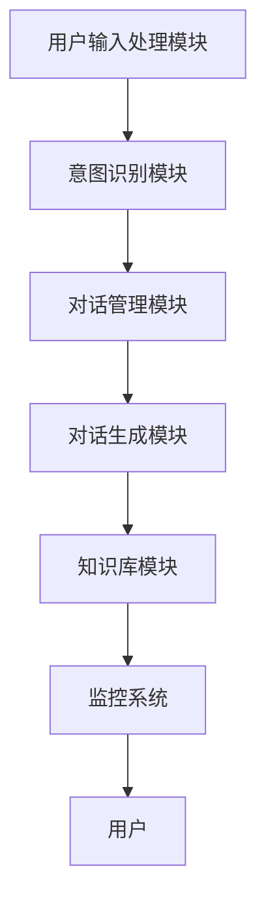

                 

### 引言与背景

在当今快速发展的信息技术时代，人工智能（AI）已经成为各行各业变革的核心驱动力。AI Agent，作为人工智能的一个分支，正逐步融入我们的日常生活和工作场景中。从智能客服、语音助手到自动驾驶，AI Agent以其高效、智能的交互能力，极大地提升了用户体验和工作效率。然而，在实现这些令人惊叹的功能背后，一个关键但往往被忽视的组成部分是对话流管理系统。

对话流管理系统是AI Agent能够流畅、自然地进行对话的核心基础设施。它不仅负责处理用户的输入和输出，还确保了整个对话过程的连贯性和逻辑性。一个优秀的对话流管理系统不仅可以提升用户满意度，还能优化AI Agent的性能，降低维护成本。

### 本文目的

本文旨在深入探讨构建AI Agent的对话流管理系统的关键技术和方法。我们将从基础理论出发，逐步剖析对话流管理系统的设计原则、实现策略和最佳实践。通过本文的阅读，读者将：

1. **理解AI Agent及其对话流管理系统的基本概念**：明确对话流管理系统在AI Agent中的作用和重要性。
2. **掌握对话流管理系统的设计原则和架构**：了解系统的整体架构和主要模块，掌握模块间的关系和交互。
3. **学习用户交互设计和对话流监控与优化方法**：提升用户体验，确保对话流畅度和系统性能。
4. **掌握安全性与隐私保护策略**：确保AI Agent在运行过程中遵守相关法律法规，保护用户隐私。
5. **通过实际案例进行实战分析**：理解对话流管理系统在实际应用中的实施和优化。

### 关键词

- **AI Agent**
- **对话流管理系统**
- **交互设计**
- **用户体验**
- **安全性**
- **隐私保护**
- **架构设计**
- **性能优化**

### 摘要

本文将围绕构建AI Agent的对话流管理系统展开讨论。首先，我们将介绍AI Agent的基础概念及其对话流管理系统的重要性。随后，通过逐步分析，我们将探讨对话流管理系统的设计原则和架构，包括用户交互设计、对话流监控与优化、安全性与隐私保护等方面。最后，通过实际项目案例，我们将展示对话流管理系统的应用和实践，提供最佳实践总结和未来展望。

### 第一部分: 引言与背景

#### 1.1 引言

随着人工智能技术的飞速发展，AI Agent作为智能系统的核心组件，正在逐渐改变我们的生活方式和工作模式。AI Agent，又称为人工智能代理，是一种能够模拟人类智能行为，执行特定任务的人工智能系统。其核心能力在于通过自然语言处理（NLP）、机器学习（ML）和深度学习（DL）等技术，实现与用户的智能对话。

本文旨在探讨构建AI Agent的对话流管理系统的关键技术和方法。对话流管理系统是AI Agent能够流畅、自然地进行对话的核心基础设施，它负责处理用户的输入和输出，确保整个对话过程的连贯性和逻辑性。通过本文的阅读，读者将深入了解对话流管理系统的重要性，掌握其设计原则和实现策略。

#### 1.1.1 书籍目的

本文的主要目的是帮助读者：

1. 理解AI Agent及其对话流管理系统的基本概念，包括其定义、类型和核心能力。
2. 掌握对话流管理系统的设计原则和架构，了解系统的主要模块和功能。
3. 学习如何进行用户交互设计和对话流监控与优化，提升用户体验和系统性能。
4. 理解并实施安全性与隐私保护策略，确保AI Agent在运行过程中遵守相关法律法规，保护用户隐私。

#### 1.1.2 AI Agent的重要性

AI Agent在现代信息技术中的重要性不可忽视，其应用范围广泛，涵盖了多个领域：

1. **智能客服**：AI Agent能够快速响应客户请求，提供高质量的客户服务，降低企业运营成本。
2. **语音助手**：如苹果的Siri、亚马逊的Alexa等，通过语音交互，提供日常生活服务，提升用户体验。
3. **智能家居**：AI Agent能够实现家居设备的智能控制，提高生活便利性。
4. **企业内部助手**：AI Agent帮助企业内部员工快速获取信息、处理事务，提高工作效率。
5. **医疗健康**：AI Agent在医疗领域提供辅助诊断、健康咨询等服务，改善患者体验。

#### 1.1.3 对话流管理系统的角色

对话流管理系统在AI Agent中的作用至关重要，其核心职责包括：

1. **用户输入处理**：对话流管理系统负责接收用户输入，并将其解析为可处理的指令或请求。
2. **对话逻辑控制**：系统根据预设的逻辑规则，控制对话流程的推进，确保对话的连贯性和一致性。
3. **用户输出生成**：系统根据处理结果生成合适的回复，并将其以自然语言的形式反馈给用户。
4. **上下文维护**：对话流管理系统需要维护对话的上下文信息，确保对话的连贯性和延续性。
5. **错误处理**：当系统遇到无法处理的输入或出现问题时，对话流管理系统应具备错误处理能力，确保对话的顺利进行。

#### 1.2 背景介绍

##### 1.2.1 AI Agent的发展历程

AI Agent的发展历程可以追溯到20世纪50年代，当时人工智能的概念刚刚兴起。最初的AI Agent主要是基于规则系统的，通过预定义的规则进行逻辑推理和决策。随着计算机性能的提升和算法的进步，AI Agent逐渐融合了机器学习和深度学习技术，使其具备了更强的自学习和自适应能力。

在21世纪初，随着大数据和云计算技术的发展，AI Agent的应用场景和功能得到了极大的扩展。如今的AI Agent不仅能够处理简单的任务，还能够执行复杂的任务，如自然语言处理、图像识别、情感分析等。

##### 1.2.2 对话流管理系统的现状

对话流管理系统在人工智能领域的应用越来越广泛，已经成为许多智能系统不可或缺的一部分。当前，市场上已经涌现出许多成熟的对话流管理系统，如Rasa、Datrix、IntelligentChat等。这些系统通常具备以下特点：

1. **模块化设计**：系统通常分为多个模块，如自然语言处理、对话管理、对话生成等，方便用户根据需求进行灵活组合和扩展。
2. **可定制化**：用户可以根据自己的需求自定义对话逻辑、对话流程和回复生成策略。
3. **高可扩展性**：系统通常具备良好的扩展性，支持通过插件或接口的方式集成外部服务和数据。
4. **实时交互**：系统能够实现与用户的实时交互，提供快速、高效的对话服务。

然而，现有的对话流管理系统仍然面临一些挑战，如：

1. **对话连贯性**：如何在复杂的对话场景中保持对话的连贯性和一致性，仍是一个亟待解决的问题。
2. **错误处理**：当系统遇到无法处理的错误或异常时，如何进行有效的错误处理，确保对话的顺利进行。
3. **用户隐私**：如何确保用户隐私在对话过程中的安全，避免数据泄露。

##### 1.2.3 技术挑战与机遇

对话流管理系统在技术层面面临以下挑战：

1. **自然语言处理**：如何更好地理解用户的输入，并生成符合用户需求的回复，是一个重要的技术难题。
2. **多语言支持**：如何支持多种语言，实现跨语言的对话处理，是当前对话流管理系统的另一个挑战。
3. **实时交互**：如何保证系统在处理用户输入时的高效性和实时性，是提高用户体验的关键。

然而，随着人工智能技术的不断进步，这些挑战正在逐渐得到解决。例如，深度学习和自然语言处理技术的不断发展，使得AI Agent能够更好地理解和处理自然语言；云计算和边缘计算技术的应用，为实时交互提供了技术支持。

总体来说，对话流管理系统在AI Agent中的应用前景非常广阔。随着技术的不断进步和应用的不断扩展，对话流管理系统将成为AI Agent不可或缺的核心组成部分。

#### 1.3 目标读者

本文的目标读者主要分为以下几类：

1. **AI技术开发者**：对人工智能和自然语言处理技术有较深入了解，希望了解如何构建和维护AI Agent及其对话流管理系统的开发者。
2. **产品经理**：负责AI产品开发和运营的产品经理，希望了解对话流管理系统在AI Agent中的应用和最佳实践。
3. **研究人员**：从事人工智能和自然语言处理领域的研究人员，对对话流管理系统的设计、实现和优化方法有浓厚兴趣。
4. **企业决策者**：希望了解AI技术如何应用于企业，提升业务效率和用户体验的企业决策者。

#### 1.3.1 读者背景

本文假设读者具备以下背景知识：

1. **编程基础**：熟悉至少一种编程语言，如Python、Java等。
2. **机器学习基础**：了解基本的机器学习算法和自然语言处理技术。
3. **人工智能知识**：对人工智能的基本概念和应用场景有一定的了解。

#### 1.3.2 期望收获

通过本文的阅读，读者可以期望获得以下收获：

1. **深入理解对话流管理系统的基本概念和设计原则**：了解对话流管理系统在AI Agent中的作用和重要性。
2. **掌握对话流管理系统的设计方法和实现策略**：了解系统的整体架构和主要模块，学会如何进行用户交互设计和对话流监控与优化。
3. **提升AI产品的开发和管理能力**：通过最佳实践和实际案例，掌握对话流管理系统的最佳实践和实现技巧，提升AI产品的开发和管理能力。
4. **拓宽技术视野**：了解对话流管理系统在各个领域的应用，拓宽技术视野，为未来的技术发展和应用提供参考。

#### 1.4 本章小结

本章首先介绍了本文的研究目的和背景，明确了AI Agent及其对话流管理系统的重要性。随后，回顾了AI Agent的发展历程和对话流管理系统的现状，并分析了其在技术层面面临的挑战与机遇。最后，确定了本文的目标读者和他们的期望收获。通过本章的阅读，读者可以初步了解本文的研究方向和主要内容。

### 第二部分: AI Agent基础

#### 2.1 AI Agent概述

##### 2.1.1 定义

AI Agent，即人工智能代理，是指一种能够模拟人类智能行为，自主执行任务，并与环境进行交互的计算机系统。它是一种具有自我意识和自我学习能力的人工智能实体，可以理解人类语言，执行复杂任务，并适应不断变化的环境。

AI Agent的定义可以从多个角度进行理解：

1. **功能角度**：AI Agent具备感知、推理、决策和行动等能力，能够完成特定的任务。例如，智能客服可以理解用户的提问，提供相应的解答和建议。
2. **交互角度**：AI Agent能够与人类用户进行自然语言交互，通过语音、文本等方式理解用户的需求，并生成相应的回复。
3. **自主性角度**：AI Agent具备自主学习和自我优化的能力，可以通过机器学习和深度学习等技术，从环境中获取知识，不断改进自身性能。

##### 2.1.2 类型

AI Agent可以根据其功能和应用场景进行分类，常见的类型包括：

1. **任务型AI Agent**：这类AI Agent主要执行特定任务，如智能客服、智能家居控制等。它们通常具备良好的任务执行能力，但对复杂决策和情境理解能力有限。
2. **社交型AI Agent**：这类AI Agent具备较强的社交能力，能够与人类进行自然、流畅的对话。例如，聊天机器人、虚拟助手等。它们通常基于自然语言处理和机器学习技术，能够理解用户意图，生成合适的回复。
3. **混合型AI Agent**：这类AI Agent结合了任务型和社交型AI Agent的特点，既能执行特定任务，又能与用户进行自然交互。例如，智能导购、智能助理等。

##### 2.1.3 核心能力

AI Agent的核心能力是其智能性的体现，主要包括以下几个方面：

1. **自然语言处理（NLP）**：AI Agent需要具备处理和理解自然语言的能力，能够理解用户的提问，提取关键信息，并生成自然语言回复。
2. **知识表示与推理**：AI Agent需要能够将知识表示为计算机可以理解的形式，并通过推理机制进行逻辑推理，解决复杂问题。
3. **学习能力**：AI Agent需要具备自我学习能力，能够从数据中学习，不断优化自身性能。这通常涉及到机器学习和深度学习技术。
4. **决策能力**：AI Agent需要能够在复杂环境中做出合理的决策，以实现既定的目标。这通常涉及到决策论和博弈论等理论。
5. **交互能力**：AI Agent需要具备与人类用户进行自然交互的能力，能够理解用户意图，生成合适的回复，并维护良好的对话流程。

#### 2.2 对话系统基础

##### 2.2.1 对话系统的组成

对话系统，也称为聊天系统或对话代理系统，是一种能够与人类进行自然语言交互的计算机系统。一个完整的对话系统通常包括以下几个关键组成部分：

1. **用户界面（UI）**：用户界面是用户与对话系统进行交互的接口，可以是文本聊天界面、语音聊天界面或图形界面。用户通过界面输入信息，对话系统通过界面展示回复。
2. **自然语言处理（NLP）模块**：自然语言处理模块负责处理用户的输入，将其转换为计算机可以理解的形式。这通常包括文本预处理、词法分析、语法分析、语义分析等步骤。
3. **对话管理（DM）模块**：对话管理模块负责控制对话流程，根据用户的输入和系统状态，生成合适的回复。对话管理模块通常包含对话状态追踪、意图识别、上下文维护等功能。
4. **对话生成（DG）模块**：对话生成模块负责生成自然语言回复，将其以人类可理解的方式呈现给用户。对话生成模块通常基于模板匹配、生成式文本生成或结合两者进行。

##### 2.2.2 对话流程

一个典型的对话流程可以分为以下几个阶段：

1. **初始化**：系统启动对话，加载必要的数据和配置，准备好与用户进行交互。
2. **输入处理**：用户通过界面输入信息，对话系统接收并处理用户输入，进行文本预处理和语义分析。
3. **意图识别**：根据用户输入，对话系统识别用户的意图，确定用户想要实现的目标。
4. **对话状态追踪**：对话系统根据当前对话状态和上下文信息，维护对话状态，确保对话的连贯性和一致性。
5. **回复生成**：对话系统根据识别出的用户意图和对话状态，生成合适的回复，并通过用户界面展示给用户。
6. **用户反馈**：用户对系统生成的回复进行反馈，可能包含确认、否定、提问等。
7. **循环**：系统根据用户反馈，继续进行对话，进入下一个循环。

##### 2.2.3 对话质量评估

对话质量评估是衡量对话系统性能的重要指标。一个高质量的对话系统应该具备以下特点：

1. **流畅性**：对话过程应流畅自然，没有明显的迟滞或中断。
2. **准确性**：系统能够准确理解用户的输入，并生成符合用户需求的回复。
3. **连贯性**：对话应保持连贯，逻辑清晰，上下文一致。
4. **多样性**：系统应能够生成丰富多样的回复，避免重复和单调。
5. **适应性**：系统能够适应不同的用户输入和对话场景，具备良好的泛化能力。

常用的对话质量评估方法包括：

1. **人工评估**：通过人类评估者对对话系统的输出进行评估，判断其是否符合用户需求和期望。
2. **自动化评估**：使用自动化工具对对话系统的输出进行评估，如文本相似度分析、语法检查、语义分析等。
3. **用户满意度调查**：通过用户满意度调查，收集用户对对话系统的评价，作为评估对话质量的重要依据。

##### 2.3 AI Agent与对话流管理

##### 2.3.1 关联性分析

AI Agent与对话流管理系统之间存在密切的关联性。AI Agent是执行任务的主体，而对话流管理系统则是确保AI Agent能够高效、流畅地进行任务执行的核心基础设施。具体来说：

1. **对话流管理系统是AI Agent的“大脑”**：对话流管理系统负责控制AI Agent的对话流程，处理用户的输入和输出，确保对话的连贯性和逻辑性。没有对话流管理系统，AI Agent将难以实现与用户的智能交互。
2. **AI Agent依赖于对话流管理系统**：AI Agent的智能行为很大程度上依赖于对话流管理系统的支持。对话流管理系统提供了对话管理、意图识别、对话生成等功能，使得AI Agent能够理解和回应用户的需求。

##### 2.3.2 对话流畅度指标

对话流畅度是评估对话系统性能的重要指标之一。一个流畅的对话应具备以下几个特点：

1. **响应时间**：系统应能够快速响应用户的输入，确保对话的连贯性。通常，响应时间应在秒级或毫秒级。
2. **对话连贯性**：对话内容应保持逻辑清晰，上下文一致，避免出现突兀的转换或断裂。
3. **对话多样性**：系统应能够生成丰富多样的回复，避免重复和单调的对话模式。
4. **错误处理能力**：系统应具备良好的错误处理能力，当遇到无法处理的输入或出现问题时，能够及时做出反应，并引导用户回到正确的对话路径。

常用的对话流畅度评估指标包括：

1. **平均响应时间（Average Response Time, ART）**：衡量系统平均响应用户输入所需的时间。
2. **对话中断率（Dialogue Interruption Rate, DIR）**：衡量对话过程中出现中断的频率，通常用中断次数与总对话次数的比值表示。
3. **错误率（Error Rate, ER）**：衡量系统在对话过程中发生错误的频率，通常用错误次数与总对话次数的比值表示。

##### 2.3.3 技术挑战

在构建AI Agent的对话流管理系统中，技术挑战是不可避免的。以下是其中一些主要的技术挑战：

1. **自然语言理解**：如何准确理解用户的输入，提取关键信息，是对话流管理系统需要解决的关键问题。这涉及到自然语言处理技术，如词法分析、语法分析、语义分析等。
2. **对话状态追踪**：如何在复杂的对话场景中保持对话状态的连贯性和一致性，是另一个重要挑战。对话状态追踪需要处理大量的上下文信息，并确保其更新和存储的准确性。
3. **多模态交互**：如何支持多种交互模式（如文本、语音、图形等），并在不同模态之间进行有效切换，是当前对话流管理系统面临的挑战之一。
4. **错误处理与恢复**：当系统遇到无法处理的输入或出现错误时，如何进行有效的错误处理和对话恢复，确保对话的顺利进行。
5. **安全性与隐私保护**：如何在保障用户隐私的同时，确保系统的安全性和可靠性，是一个重要的技术挑战。

##### 2.4 本章小结

本章介绍了AI Agent及其对话流管理系统的基础知识。首先，我们详细探讨了AI Agent的定义、类型和核心能力，接着介绍了对话系统的组成、对话流程和对话质量评估方法。最后，我们分析了AI Agent与对话流管理系统的关联性，以及对话流畅度指标和技术挑战。通过本章的阅读，读者可以全面了解AI Agent和对话流管理系统的基本概念和关键技术，为后续章节的深入学习打下坚实基础。

### 第三部分: 对话流管理系统设计

#### 3.1 对话流管理系统架构设计

##### 3.1.1 整体架构

对话流管理系统的整体架构设计是确保其高效、稳定运行的关键。一个典型的对话流管理系统通常包括以下几个主要模块：

1. **用户输入处理模块**：负责接收用户输入，进行预处理，如文本清洗、分词等，并将其转换为系统可处理的格式。
2. **意图识别模块**：根据用户输入，识别用户的意图，确定用户想要实现的目标。
3. **对话管理模块**：负责对话状态的追踪和维护，控制对话流程的推进，确保对话的连贯性和一致性。
4. **对话生成模块**：根据意图识别结果和对话状态，生成自然语言回复，并将其展示给用户。
5. **上下文维护模块**：负责维护对话的上下文信息，确保对话的连贯性和延续性。
6. **错误处理模块**：当系统遇到无法处理的输入或出现错误时，进行错误处理和对话恢复。

各个模块之间的交互关系如下：

- **用户输入处理模块**将用户输入传递给意图识别模块，意图识别模块将结果传递给对话管理模块。
- **对话管理模块**根据意图识别结果和当前对话状态，决定下一步的操作，可能调用对话生成模块生成回复，或者更新对话状态。
- **对话生成模块**将生成的回复传递给上下文维护模块，上下文维护模块确保回复中包含必要的信息，以便后续对话的顺利进行。
- **错误处理模块**在系统遇到错误时，进行错误处理和对话恢复，确保对话不会因错误而中断。

##### 3.1.2 主要模块

1. **用户输入处理模块**

用户输入处理模块是整个系统的入口，其核心职责是接收用户输入，并进行预处理。具体功能包括：

- **文本清洗**：去除用户输入中的噪声，如标点符号、特殊字符等。
- **分词**：将文本拆分为单个词汇或短语，便于后续处理。
- **词性标注**：为每个词标注其词性（如名词、动词等），帮助意图识别模块更准确地理解用户输入。

2. **意图识别模块**

意图识别模块的核心职责是理解用户的输入，识别用户的意图。其工作流程如下：

- **词向量编码**：将文本转换为词向量，便于计算和比较。
- **分类器训练**：使用机器学习算法（如朴素贝叶斯、支持向量机等）训练分类器，用于识别用户输入的意图。
- **意图识别**：将用户输入的词向量输入分类器，得到意图识别结果。

3. **对话管理模块**

对话管理模块负责对话状态的追踪和维护，确保对话的连贯性和一致性。其功能包括：

- **对话状态追踪**：记录当前对话的状态，如用户意图、对话历史、上下文信息等。
- **对话逻辑控制**：根据当前对话状态，决定下一步的操作，如生成回复、提出问题、等待用户输入等。
- **对话上下文维护**：确保对话的上下文信息得到正确处理和存储，避免出现信息丢失或错误。

4. **对话生成模块**

对话生成模块负责根据意图识别结果和对话状态，生成自然语言回复。其工作流程如下：

- **回复模板匹配**：根据意图识别结果，从预定义的回复模板中选择合适的模板。
- **回复生成**：将模板中的变量替换为实际值，生成自然语言回复。
- **回复优化**：对生成的回复进行优化，如去除重复内容、调整语序等，确保回复的自然性和流畅性。

5. **上下文维护模块**

上下文维护模块负责维护对话的上下文信息，确保对话的连贯性和延续性。其功能包括：

- **上下文信息存储**：将对话过程中的关键信息（如用户意图、对话历史等）存储在数据库或缓存中，以便后续对话的引用。
- **上下文信息检索**：在生成回复时，检索相关的上下文信息，确保回复与当前对话状态一致。
- **上下文信息更新**：在对话过程中，根据用户输入和系统操作，实时更新上下文信息，确保对话的连贯性。

6. **错误处理模块**

错误处理模块负责当系统遇到无法处理的输入或出现错误时，进行错误处理和对话恢复。其功能包括：

- **错误识别**：检测到系统错误或无法处理的输入时，进行错误识别和分类。
- **错误处理**：根据错误类型，采取相应的错误处理策略，如提示用户重新输入、提供帮助信息等。
- **对话恢复**：在错误处理完成后，尝试恢复对话流程，确保对话不会因错误而中断。

##### 3.1.3 模块间交互

各个模块之间通过事件驱动的方式进行交互，具体交互流程如下：

1. **用户输入处理模块**将用户输入传递给意图识别模块。
2. **意图识别模块**处理用户输入，识别出用户意图，并将结果传递给对话管理模块。
3. **对话管理模块**根据意图识别结果和当前对话状态，决定下一步的操作，可能调用对话生成模块生成回复，或者更新对话状态。
4. **对话生成模块**根据意图识别结果和对话状态，生成自然语言回复，并将其传递给上下文维护模块。
5. **上下文维护模块**处理回复，确保其包含必要的上下文信息，并将其展示给用户。
6. **错误处理模块**在整个过程中，检测系统错误或无法处理的输入，进行错误处理和对话恢复。

通过以上模块和交互流程的设计，对话流管理系统可以实现高效、流畅的自然语言交互，提升用户体验。

#### 3.2 用户交互设计

##### 3.2.1 用户角色分析

在进行用户交互设计之前，首先需要对用户角色进行分析。用户角色是指对话流管理系统的主要用户群体，他们的需求和行为特征将直接影响交互设计的方向和效果。以下是对几种典型用户角色的分析：

1. **普通用户**：普通用户是对话流管理系统的最终用户，他们可能使用智能客服、语音助手或智能家居助手等。他们的需求主要是获得快速、准确的答案或执行特定任务。行为特征包括：
   - 输入格式多样，包括文本、语音等。
   - 对响应速度有较高要求，希望系统能快速理解并回答。
   - 偏好简单、直接的回答，不喜欢复杂的指令或解释。

2. **专业用户**：专业用户通常为企业内部员工或专业领域专家，他们可能使用企业内部智能助手或专业咨询系统。他们的需求主要是获取深度、专业的知识和建议。行为特征包括：
   - 输入格式较为规范，通常使用专业术语和格式。
   - 对响应质量有较高要求，希望系统能提供准确、全面的回答。
   - 偏好详细的解释和背景信息，有助于理解和应用。

3. **开发人员**：开发人员是对话流管理系统的维护者和开发者，他们需要了解系统的内部工作原理，进行功能扩展和优化。他们的需求主要是系统文档、调试工具和接口文档。行为特征包括：
   - 输入格式规范，通常包含代码、调试日志等。
   - 对系统性能和稳定性有较高要求，希望系统具备良好的可扩展性和可维护性。
   - 需要详细的系统文档和接口文档，便于开发和维护。

##### 3.2.2 交互界面设计

交互界面设计是用户交互设计的重要组成部分，其目标是提供直观、易用的用户界面，提升用户体验。以下是一些交互界面设计的原则和技巧：

1. **简洁性**：界面应尽量简洁，避免冗余信息，减少用户操作步骤。使用清晰、直观的图标和标签，方便用户快速理解和使用。

2. **一致性**：界面设计应保持一致性，包括颜色、字体、布局等方面。一致性有助于用户快速适应系统，降低学习成本。

3. **响应性**：界面应具有良好的响应性，确保用户操作能够迅速得到反馈。对于用户输入，应即时展示处理状态，避免用户长时间等待。

4. **可访问性**：界面设计应考虑不同用户的访问需求，包括视力障碍者、听力障碍者等。提供文本提示、语音提示等功能，确保所有用户都能顺畅使用系统。

5. **个性化**：界面设计应支持个性化设置，如主题切换、字体大小调整等，满足不同用户的个性化需求。

6. **错误处理**：界面设计应提供有效的错误处理机制，当用户操作出现错误时，及时提示用户并给出解决方案，避免用户陷入困境。

##### 3.2.3 交互流程设计

交互流程设计是指定义用户与系统之间的交互步骤和逻辑，确保用户能够顺畅地进行操作。以下是一个典型的交互流程设计：

1. **登录/注册**：用户首先需要登录或注册系统，以便使用系统的功能。

2. **导航菜单**：系统提供导航菜单，用户可以选择不同的功能模块，如智能客服、语音助手、智能家居控制等。

3. **输入处理**：用户通过文本输入框或语音输入方式，向系统输入请求或问题。

4. **意图识别**：系统对用户输入进行处理，识别出用户的意图。

5. **对话生成**：系统根据意图识别结果，生成相应的回复，并将其展示在用户界面上。

6. **用户反馈**：用户对系统生成的回复进行反馈，可能包括确认、否定、提问等。

7. **对话管理**：系统根据用户反馈，更新对话状态，决定下一步的操作。

8. **结束对话**：当用户完成所有操作或系统无法继续对话时，对话结束。

通过以上交互流程设计，用户可以方便、高效地与系统进行交互，实现所需的功能。

#### 3.3 对话流监控与优化

##### 3.3.1 监控指标

对话流监控是确保对话流管理系统稳定运行和高效运作的重要环节。通过设置和监控一系列关键指标，可以及时发现并解决问题，优化系统性能。以下是一些常见的监控指标：

1. **响应时间**：衡量系统从接收用户输入到生成回复所需的时间。低响应时间通常意味着系统性能良好。

2. **错误率**：衡量系统在处理对话过程中出现错误的频率。高错误率可能表明系统存在设计或实现问题。

3. **用户满意度**：通过用户反馈或调查问卷，评估用户对系统服务的满意度。高用户满意度通常意味着系统提供了良好的用户体验。

4. **对话中断率**：衡量对话过程中出现中断的频率。高中断率可能表明系统在处理复杂对话场景时存在困难。

5. **资源消耗**：衡量系统运行过程中消耗的计算资源，如CPU、内存、网络带宽等。高资源消耗可能影响系统的稳定性和性能。

6. **对话长度**：衡量对话的持续时间。过长或过短的对话长度可能表明系统在处理某些对话场景时存在问题。

##### 3.3.2 流量分析

流量分析是对话流监控的重要组成部分，通过对系统接收和处理的对话流量进行分析，可以了解系统的运行状况和用户行为模式。以下是一些流量分析的常用方法和技巧：

1. **用户行为分析**：通过分析用户输入和系统回复的频率、时长、内容等，了解用户的需求和使用习惯。这有助于优化系统功能和交互设计。

2. **对话时长分布**：分析不同类型对话的时长分布，识别出长对话和短对话的占比，以及它们对应的用户行为特征。这有助于优化对话处理策略，提升用户体验。

3. **错误日志分析**：收集并分析系统错误日志，识别出常见错误类型和发生频率，找出系统设计或实现中的问题。这有助于优化系统性能和稳定性。

4. **资源消耗分析**：分析系统运行过程中的资源消耗情况，识别出资源消耗较高的模块和对话场景，优化系统性能。

5. **趋势分析**：通过分析流量数据的变化趋势，预测未来的流量变化和系统需求，为系统扩展和优化提供依据。

##### 3.3.3 优化策略

通过对监控指标和流量分析结果的综合评估，可以制定一系列优化策略，提升对话流管理系统的性能和用户体验。以下是一些常见的优化策略：

1. **性能优化**：通过优化算法、降低计算复杂度、使用缓存技术等方式，提高系统的响应速度和处理效率。

2. **错误处理优化**：改进错误处理机制，提高系统的容错能力和恢复能力，确保对话不会因错误而中断。

3. **对话流程优化**：优化对话流程，简化用户操作步骤，提高对话的连贯性和流畅度。

4. **资源管理优化**：合理分配系统资源，降低资源消耗，提高系统的稳定性和性能。

5. **用户体验优化**：根据用户行为分析结果，优化系统功能和交互设计，提升用户体验。

6. **持续监控和改进**：建立完善的监控体系，持续收集和评估系统运行数据，根据反馈不断优化系统。

通过以上优化策略，可以显著提升对话流管理系统的性能和用户体验，为用户提供更加流畅、高效的智能服务。

#### 3.4 安全性与隐私保护

##### 3.4.1 安全性设计

在构建对话流管理系统时，安全性设计是一个至关重要的环节。一个安全的设计可以保护系统免受各种攻击，确保用户数据的安全和隐私。以下是一些关键的安全性设计原则：

1. **身份验证与访问控制**：确保只有授权用户可以访问系统资源。使用强密码策略、双因素认证等手段，提高用户身份验证的强度。同时，实施访问控制策略，限制用户对敏感资源的访问权限。

2. **数据加密**：对用户数据进行加密，确保数据在传输和存储过程中的安全性。采用先进的加密算法，如AES（高级加密标准）或RSA（RSA加密算法），保护数据免受未经授权的访问。

3. **防攻击措施**：实施一系列防攻击措施，如防火墙、入侵检测系统（IDS）和入侵防御系统（IPS），防止外部攻击和恶意行为。定期更新和升级系统，以应对新的安全威胁。

4. **日志记录与监控**：记录系统操作日志，包括用户访问、数据修改和异常行为等。通过监控和分析日志，及时发现和应对潜在的安全威胁。

5. **安全漏洞修复**：定期对系统进行安全漏洞扫描和测试，及时发现并修复安全漏洞，确保系统的安全性。

##### 3.4.2 隐私保护策略

隐私保护是用户对智能系统的主要担忧之一。一个有效的隐私保护策略可以增强用户对系统的信任，促进其使用。以下是一些关键的隐私保护策略：

1. **数据最小化原则**：仅收集和存储必要的数据，避免收集无关或过多的用户信息。确保用户数据的收集和使用有明确的目的。

2. **数据匿名化**：对收集到的用户数据进行匿名化处理，去除可以直接识别用户身份的信息，如姓名、地址、电话号码等。

3. **数据存储安全**：确保存储用户数据的系统具备高水平的安全性，防止数据泄露或丢失。采用加密存储和访问控制措施，保护用户数据的安全。

4. **数据传输安全**：在数据传输过程中，使用安全的传输协议（如HTTPS、SSL/TLS等），确保数据在传输过程中的安全性。

5. **用户隐私声明**：明确告知用户系统收集、使用和存储用户数据的方式和目的，获取用户的同意。提供简单易懂的隐私政策，确保用户了解其隐私权益。

6. **用户隐私控制**：提供用户隐私设置选项，允许用户管理其数据的收集和使用。例如，用户可以选择退出某些功能或删除其数据。

##### 3.4.3 法律法规遵守

确保对话流管理系统遵守相关法律法规，是保护用户隐私和确保系统合法运行的重要保障。以下是一些相关的法律法规和最佳实践：

1. **通用数据保护条例（GDPR）**：欧盟的GDPR规定了对用户个人数据的收集、处理和存储的严格要求。确保系统的设计和实现符合GDPR的要求，如用户同意、数据最小化、数据匿名化等。

2. **加州消费者隐私法案（CCPA）**：加州的CCPA规定了对用户个人数据的透明度和控制权。确保系统的设计和实现符合CCPA的要求，如用户数据透明度、用户删除请求处理等。

3. **信息安全法**：不同国家和地区都有关于信息安全的法律法规。了解并遵守当地的法律规定，确保系统的合法性和合规性。

4. **安全最佳实践**：遵循行业最佳实践，如ISO 27001信息安全管理体系，确保系统的安全性和可靠性。

通过以上安全性设计和隐私保护策略，对话流管理系统可以确保用户数据的安全和隐私，增强用户对系统的信任，为用户提供安全、可靠的智能服务。

#### 3.5 本章小结

本章详细介绍了对话流管理系统的设计原则和架构，包括整体架构设计、主要模块及其功能，以及用户交互设计和对话流监控与优化。同时，探讨了安全性与隐私保护策略，确保系统的稳定运行和用户数据的安全。通过本章的阅读，读者可以全面了解对话流管理系统的设计和实现方法，为后续的系统开发和应用提供指导。

### 第四部分: 实现与部署

#### 4.1 开发环境搭建

在进行对话流管理系统的开发之前，需要搭建一个合适的开发环境，以确保项目的顺利进行。以下是搭建开发环境的详细步骤：

##### 4.1.1 开发工具

1. **集成开发环境（IDE）**：选择一款适合的集成开发环境，如PyCharm、Visual Studio Code等，这些IDE提供了丰富的插件和工具，可以提高开发效率。
2. **版本控制工具**：选择一款版本控制工具，如Git，用于管理代码版本和协作开发。
3. **虚拟环境**：使用虚拟环境（如virtualenv或conda）隔离项目依赖，避免不同项目之间的依赖冲突。
4. **代码编辑器**：选择一款功能强大的代码编辑器，如Visual Studio Code或Atom，这些编辑器提供了丰富的插件和快捷键，可以提高编码效率。

##### 4.1.2 开发框架

1. **Flask**：Flask是一个轻量级的Web框架，适合构建小型到中型的Web应用。它简单易用，具备丰富的扩展能力，是构建对话流管理系统的理想选择。
2. **Django**：Django是一个全功能的Web框架，适合构建大型、复杂的应用。它提供了许多内置的功能，如用户认证、数据库管理等，可以节省开发时间。
3. **Rasa**：Rasa是一个开源的对话管理框架，专门用于构建智能对话系统。它提供了完整的对话管理功能，包括意图识别、实体提取、对话策略等。

##### 4.1.3 数据集准备

1. **数据集来源**：选择合适的数据集用于训练和测试模型。数据集可以从公开的数据集网站（如Kaggle、Reddit等）获取，或者从实际业务场景中收集。
2. **数据预处理**：对收集到的数据集进行预处理，包括数据清洗、分词、词性标注等。预处理后的数据将用于训练模型和评估系统性能。
3. **数据标注**：对于某些需要标注数据的任务（如情感分析、实体识别等），需要人工或自动化工具对数据进行标注。标注后的数据将用于训练和评估模型。

#### 4.2 系统核心功能实现

##### 4.2.1 交互引擎设计

交互引擎是对话流管理系统的核心组件，负责处理用户的输入和生成回复。以下是交互引擎的设计要点：

1. **输入处理**：设计输入处理模块，对用户输入进行预处理，包括文本清洗、分词、词性标注等。使用自然语言处理库（如NLTK、spaCy等）实现这些功能。
2. **意图识别**：设计意图识别模块，使用机器学习算法（如朴素贝叶斯、决策树、随机森林等）或深度学习算法（如卷积神经网络、循环神经网络等）进行意图分类。使用训练好的模型对用户输入进行意图识别。
3. **对话管理**：设计对话管理模块，维护对话状态，根据用户意图和当前对话状态生成回复。对话管理模块应支持对话历史记录和上下文信息存储，以便后续对话的顺利进行。
4. **回复生成**：设计回复生成模块，根据意图识别结果和对话状态生成自然语言回复。可以使用模板匹配、生成式文本生成等技术实现回复生成。

##### 4.2.2 对话管理模块

对话管理模块负责控制对话流程，确保对话的连贯性和一致性。以下是对话管理模块的实现要点：

1. **对话状态追踪**：设计对话状态追踪机制，记录用户意图、对话历史、上下文信息等关键信息。可以使用数据库（如SQLite、MySQL等）或缓存（如Redis、Memcached等）存储对话状态。
2. **对话逻辑控制**：设计对话逻辑控制机制，根据当前对话状态和用户输入，生成合适的回复。可以使用状态机（FSM）或规则引擎实现对话逻辑控制。
3. **错误处理**：设计错误处理机制，当系统遇到无法处理的输入或错误时，能够进行错误处理和对话恢复。可以提供提示信息、重置对话状态等策略。
4. **上下文维护**：设计上下文维护机制，确保对话中的上下文信息得到正确处理和存储，避免信息丢失或错误。

##### 4.2.3 流量分析模块

流量分析模块负责监控和评估对话流管理系统的运行状况和性能。以下是流量分析模块的实现要点：

1. **监控指标**：设计监控指标，包括响应时间、错误率、用户满意度等。可以使用性能监控工具（如Prometheus、Grafana等）收集和展示这些指标。
2. **流量数据收集**：设计流量数据收集机制，从日志、数据库等源收集系统运行过程中的关键数据。可以使用日志采集工具（如Fluentd、Logstash等）实现数据收集。
3. **数据分析**：设计数据分析机制，对收集到的流量数据进行处理和分析，识别出系统运行中的问题和瓶颈。可以使用数据分析和可视化工具（如Pandas、Matplotlib等）实现数据分析。

#### 4.3 系统部署与测试

##### 4.3.1 部署策略

系统部署是将开发完成的应用程序部署到生产环境中，使其可供用户使用的步骤。以下是系统部署的详细策略：

1. **服务器选择**：选择合适的服务器，如云服务器（如阿里云、腾讯云等）或物理服务器。考虑服务器的性能、可靠性、安全性等因素。
2. **部署工具**：选择合适的部署工具，如Docker、Kubernetes等，实现应用的自动化部署和运维。
3. **负载均衡**：设计负载均衡策略，将用户请求均匀分配到多个服务器上，确保系统的可用性和稳定性。
4. **备份与恢复**：设计备份和恢复策略，定期备份系统数据和配置文件，确保在系统故障或数据丢失时能够快速恢复。

##### 4.3.2 测试方案

系统测试是确保系统质量和性能的重要环节。以下是系统测试的详细方案：

1. **功能测试**：设计功能测试用例，验证系统的各项功能是否符合设计要求。包括用户输入处理、意图识别、对话管理、回复生成等模块的测试。
2. **性能测试**：设计性能测试用例，验证系统在高负载条件下的性能和稳定性。包括响应时间、并发处理能力、资源消耗等指标的测试。
3. **安全测试**：设计安全测试用例，验证系统的安全性，包括身份验证、访问控制、数据加密等。可以使用自动化测试工具（如AppScan、Burp Suite等）进行安全测试。
4. **用户体验测试**：设计用户体验测试用例，评估系统的用户体验和易用性。包括界面设计、交互流程、错误处理等。
5. **回归测试**：在系统更新或修复漏洞时，进行回归测试，确保新版本不会引入新的问题或影响已有功能。

##### 4.3.3 性能优化

性能优化是提升系统性能和用户体验的重要手段。以下是性能优化的一些策略：

1. **代码优化**：优化系统代码，减少计算复杂度，提升执行效率。可以使用静态代码分析工具（如PyCharm的Profile工具、Py-Spy等）进行代码优化。
2. **缓存使用**：合理使用缓存技术，减少对数据库的访问次数，提升系统响应速度。可以使用缓存数据库（如Redis、Memcached等）或分布式缓存框架（如Memcached、Ehcache等）。
3. **异步处理**：使用异步处理技术（如异步IO、消息队列等），提高系统的并发处理能力，降低系统的响应时间。
4. **负载均衡**：合理配置负载均衡策略，将用户请求均匀分配到多个服务器上，避免单点瓶颈。可以使用负载均衡器（如Nginx、HAProxy等）。
5. **数据库优化**：优化数据库性能，包括索引优化、查询优化、数据分片等。可以使用数据库分析工具（如Percona Toolkit、Oracle SQL Developer等）进行数据库性能优化。

通过以上开发环境搭建、系统核心功能实现、系统部署与测试和性能优化，可以构建一个高效、稳定、安全的对话流管理系统，为用户提供优质的智能服务。

#### 4.4 本章小结

本章详细介绍了对话流管理系统的实现与部署过程，包括开发环境搭建、系统核心功能实现、系统部署与测试以及性能优化。通过本章的讲解，读者可以了解如何从开发到部署的各个阶段，构建一个高效、稳定、安全的对话流管理系统。这些实践经验和策略将有助于读者在实际项目中成功地应用和优化对话流管理系统。

### 第五部分: 项目实战

#### 5.1 项目背景与目标

在现代企业和信息技术应用中，智能对话系统的需求日益增长。为了提升客户服务效率，优化用户体验，我们开展了一项名为“智能客服系统”的项目。该项目旨在开发一个基于AI技术的智能客服系统，通过自然语言处理和对话流管理技术，实现与客户的智能对话，提供快速、准确的服务。

##### 5.1.1 项目背景

随着互联网的普及和电商行业的快速发展，客户服务成为企业竞争力的关键因素。传统的客服模式往往依赖于人工客服，不仅效率低下，还难以满足大量客户的需求。因此，许多企业开始寻求智能客服解决方案，以提高服务质量和运营效率。智能客服系统作为一种新兴的技术，可以通过自然语言处理和对话流管理技术，实现与客户的智能对话，提供24/7的服务，极大地提升客户满意度。

##### 5.1.2 项目目标

该项目的主要目标包括：

1. **提升客服效率**：通过智能客服系统，自动化处理常见客户问题，减少人工客服的工作量，提高整体客服效率。
2. **优化用户体验**：提供个性化、智能化的服务，满足不同客户的需求，提升用户满意度。
3. **降低运营成本**：自动化处理大量客户问题，减少人力成本，降低企业运营成本。
4. **扩展服务范围**：通过智能客服系统，实现24/7全天候服务，扩大企业的服务范围，提高市场竞争力。

#### 5.2 项目方案

##### 5.2.1 架构设计

为了实现项目目标，我们设计了一个分布式、模块化的智能客服系统架构。该架构主要包括以下模块：

1. **用户输入处理模块**：负责接收客户的文本或语音输入，进行预处理，如文本清洗、分词等。
2. **意图识别模块**：通过机器学习算法，识别客户输入的意图，如查询信息、投诉处理等。
3. **对话管理模块**：负责对话状态的追踪和管理，确保对话的连贯性和一致性。
4. **对话生成模块**：根据意图识别结果和对话状态，生成自然语言回复，向客户展示。
5. **知识库模块**：提供丰富的知识库，用于支持智能客服系统的问答功能。
6. **监控系统**：实时监控系统的运行状态，包括响应时间、错误率等关键指标。

架构设计如下图所示：

##### 5.2.2 技术选型

为了确保系统的性能、稳定性和可扩展性，我们在技术选型上进行了详细考虑。以下是项目所采用的关键技术：

1. **自然语言处理（NLP）**：使用NLTK、spaCy等库进行文本预处理和意图识别。
2. **机器学习**：采用scikit-learn、TensorFlow等库，实现意图识别和对话生成模型。
3. **对话流管理**：使用Rasa框架，实现对话状态的追踪和管理。
4. **知识库**：使用Elasticsearch作为搜索引擎，存储和检索知识库中的信息。
5. **监控系统**：使用Prometheus和Grafana，监控系统的运行状态和性能指标。
6. **后端框架**：采用Flask作为Web框架，实现API接口和业务逻辑。
7. **数据库**：使用MySQL存储用户信息和日志数据。

##### 5.2.3 项目实施

项目实施分为以下几个阶段：

1. **需求分析**：与业务部门紧密合作，明确智能客服系统的需求，包括功能需求、性能需求和安全需求等。
2. **系统设计**：根据需求分析结果，设计系统的整体架构和模块功能，制定详细的技术方案。
3. **开发与测试**：按照设计方案，进行系统开发，同时进行功能测试、性能测试和安全测试，确保系统的质量和稳定性。
4. **部署与运维**：将开发完成的应用程序部署到生产环境，进行监控和运维，确保系统的正常运行。

#### 5.3 实战案例

##### 5.3.1 案例一：智能客服系统

在实施智能客服系统的过程中，我们面临了以下挑战：

1. **多语言支持**：客户来自不同地区，可能使用不同的语言。我们需要实现多语言支持，确保系统能够理解和响应不同语言的客户请求。
2. **对话连贯性**：如何保持对话的连贯性，避免出现突兀的转换或中断，是另一个重要挑战。

为了解决这些问题，我们采取了以下策略：

1. **多语言处理**：使用基于神经网络的翻译模型，实现多语言输入和回复。通过翻译模型，将客户的输入翻译成系统支持的语言，进行意图识别和对话管理。
2. **上下文维护**：设计上下文维护机制，确保对话中的上下文信息得到正确处理和存储。在回复生成时，根据上下文信息，生成连贯、自然的回复。

以下是实际案例的演示：

1. **客户请求**：“您好，我想查询订单状态。”
2. **系统回复**：“您好，请问您的订单号是多少？”
3. **客户请求**：“订单号是123456。”
4. **系统回复**：“根据您提供的信息，您的订单已经发货，预计3天内到达。”

通过以上步骤，系统成功实现了与客户的智能对话，提供了快速、准确的服务。

##### 5.3.2 案例二：智能家居语音助手

另一个项目案例是智能家居语音助手。该助手旨在通过语音交互，实现智能家居设备的控制。

1. **语音识别**：使用语音识别技术，将客户的语音输入转换为文本，进行处理和识别。
2. **意图识别**：根据语音输入，识别客户的意图，如开关灯光、调节温度等。
3. **设备控制**：通过智能家居协议（如MQTT、HTTP等），控制相应设备。

以下是实际案例的演示：

1. **客户请求**：“打开客厅的灯光。”
2. **系统回复**：“正在打开客厅的灯光，请稍等。”
3. **设备反馈**：“客厅的灯光已开启。”

通过语音助手，客户可以方便地控制家居设备，提高了生活的便利性。

##### 5.3.3 案例三：企业内部智能助手

企业内部智能助手旨在为企业内部员工提供快速的信息获取和处理服务。

1. **信息检索**：通过搜索引擎，快速检索企业内部的知识库，提供相关信息。
2. **任务分配**：根据员工的能力和任务需求，自动分配任务。
3. **日程管理**：提供日程管理功能，帮助员工合理安排工作。

以下是实际案例的演示：

1. **员工请求**：“帮我查找关于市场分析的报告。”
2. **系统回复**：“已为您找到相关报告，请查看。”
3. **员工请求**：“帮我安排明天的会议。”
4. **系统回复**：“已为您安排明天上午10点的会议，会议主题是‘市场分析报告讨论’。”

通过企业内部智能助手，企业员工可以高效地获取和处理信息，提高了工作效率。

#### 5.4 项目小结

##### 5.4.1 经验总结

通过以上实战案例，我们总结了以下经验：

1. **多语言支持**：实现多语言支持是提升系统可用性的关键。使用神经网络翻译模型，可以有效地处理多语言输入和回复。
2. **上下文维护**：上下文维护是确保对话连贯性的重要手段。通过维护上下文信息，系统可以生成更自然的回复。
3. **性能优化**：性能优化是提升系统响应速度和用户体验的关键。通过优化算法和缓存策略，可以显著提高系统的性能。
4. **模块化设计**：模块化设计有助于提高系统的可维护性和可扩展性。通过将系统划分为多个模块，可以方便地进行功能扩展和优化。

##### 5.4.2 不足与改进

尽管项目取得了较好的成果，但还存在一些不足之处：

1. **对话连贯性**：在处理复杂对话场景时，系统有时会出现连贯性不足的问题。未来可以通过优化对话管理算法，提高对话连贯性。
2. **错误处理**：系统的错误处理能力仍有待提高。未来可以引入更复杂的错误处理机制，确保对话不会因错误而中断。
3. **用户隐私**：用户隐私保护是系统设计的重点。未来可以通过加密技术和隐私保护策略，进一步提高系统的安全性和隐私保护能力。

##### 5.4.3 拓展应用

基于对话流管理系统，我们可以拓展应用到更多场景，如：

1. **智能客服**：在更多的行业和领域推广智能客服系统，提供24/7的服务，提高客户满意度。
2. **智能助手**：开发智能语音助手，应用于智能家居、企业内部等场景，提升用户体验和工作效率。
3. **医疗健康**：开发智能健康助手，提供医疗咨询、健康建议等服务，改善患者体验。
4. **教育**：开发智能教育助手，提供个性化学习建议和辅导，提高学习效果。

通过不断优化和拓展，对话流管理系统将有望在更多领域发挥重要作用，推动人工智能技术的发展。

#### 5.5 本章小结

本章通过实际项目案例，展示了对话流管理系统在智能客服系统、智能家居语音助手和企业内部智能助手等场景中的应用。通过分析项目实施过程、挑战和解决方案，读者可以深入了解对话流管理系统的实际应用和优化策略。这些实战经验和案例将为读者提供宝贵的参考和启示。

### 第六部分：最佳实践与展望

#### 6.1 最佳实践总结

在构建AI Agent的对话流管理系统的过程中，总结以下最佳实践：

##### 6.1.1 交互设计最佳实践

1. **简洁直观**：界面设计应简洁直观，减少用户操作步骤，确保用户能够轻松理解和使用系统。
2. **一致性**：保持界面设计的一致性，包括颜色、字体、布局等方面，使用户能够快速适应系统。
3. **响应性**：提高系统的响应速度，确保用户操作能够迅速得到反馈，提升用户体验。
4. **错误处理**：设计有效的错误处理机制，当用户操作出现错误时，及时提示用户并给出解决方案，避免用户陷入困境。

##### 6.1.2 流量管理最佳实践

1. **负载均衡**：合理配置负载均衡策略，将用户请求均匀分配到多个服务器上，避免单点瓶颈，确保系统的高可用性。
2. **缓存使用**：合理使用缓存技术，减少对数据库的访问次数，提高系统响应速度。
3. **异步处理**：使用异步处理技术，提高系统的并发处理能力，降低系统的响应时间。

##### 6.1.3 安全性与隐私保护最佳实践

1. **数据加密**：对用户数据进行加密，确保数据在传输和存储过程中的安全性。
2. **访问控制**：实施严格的访问控制策略，确保只有授权用户可以访问系统资源。
3. **隐私保护策略**：遵循数据最小化原则，仅收集必要的数据，并告知用户数据收集和使用的目的。
4. **安全测试**：定期进行安全测试，发现和修复安全漏洞，确保系统的安全性。

#### 6.2 未来发展趋势

##### 6.2.1 技术发展趋势

1. **多模态交互**：随着技术的发展，未来的对话流管理系统将支持更多模态的交互，如语音、视频、手势等，提供更加丰富、自然的交互体验。
2. **实时交互**：实时交互技术将进一步提升，实现与用户的实时互动，降低延迟，提高用户体验。
3. **自适应能力**：对话流管理系统将具备更强的自适应能力，根据用户的反馈和行为，不断优化自身性能和交互策略。

##### 6.2.2 行业应用前景

1. **智能客服**：智能客服系统将继续在金融、零售、医疗等行业广泛应用，提升客户服务质量和效率。
2. **智能助手**：智能语音助手、智能机器人等将更加普及，应用于智能家居、企业内部等领域，提高用户和生活便利性。
3. **教育**：智能教育系统将结合对话流管理系统，提供个性化学习体验，提高学习效果。
4. **医疗健康**：智能健康助手将提供医疗咨询、健康监测等服务，改善患者体验。

##### 6.2.3 潜在挑战与解决方案

1. **自然语言理解**：自然语言理解是对话流管理系统的重要技术难题，需要不断优化算法和模型，提高系统的理解能力。
2. **多语言支持**：多语言支持需要处理语言差异和语言资源不足的问题，未来可以通过引入更多语言模型和跨语言技术进行优化。
3. **隐私保护**：随着用户对隐私保护的要求越来越高，对话流管理系统需要不断加强隐私保护措施，确保用户数据的安全。

#### 6.3 本章小结

本章总结了构建AI Agent对话流管理系统的最佳实践，并探讨了未来发展趋势和潜在挑战。通过最佳实践的总结和未来展望，读者可以更好地理解对话流管理系统的设计与实现，为未来的研究和应用提供指导。

### 结语

随着人工智能技术的不断进步，AI Agent和对话流管理系统在各个领域的应用越来越广泛。本文通过详细的探讨和分析，全面介绍了构建AI Agent对话流管理系统的核心概念、设计原则和实现策略。从AI Agent的基础知识，到对话流管理系统的架构设计、用户交互设计、对话流监控与优化，再到安全性与隐私保护，本文为读者提供了一个系统化的学习框架。

在未来的研究和实践中，对话流管理系统将继续面临自然语言理解、多语言支持、隐私保护等挑战。随着技术的不断演进，我们将看到对话流管理系统在更多应用场景中的落地，为用户带来更加智能化、个性化的体验。希望本文能够为读者在构建AI Agent对话流管理系统的道路上提供有价值的参考和启示。让我们携手共进，探索人工智能技术的无限可能。作者：AI天才研究院/AI Genius Institute & 禅与计算机程序设计艺术 /Zen And The Art of Computer Programming。

