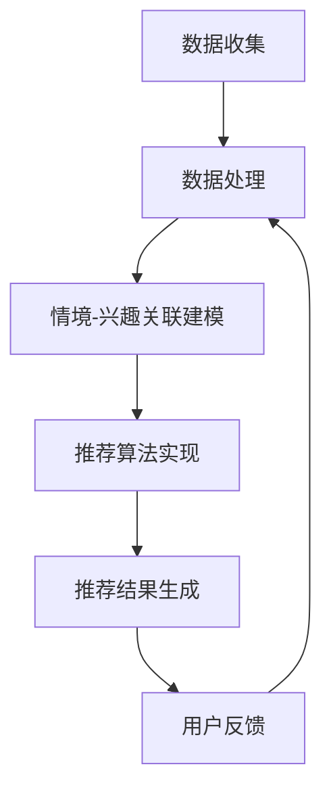
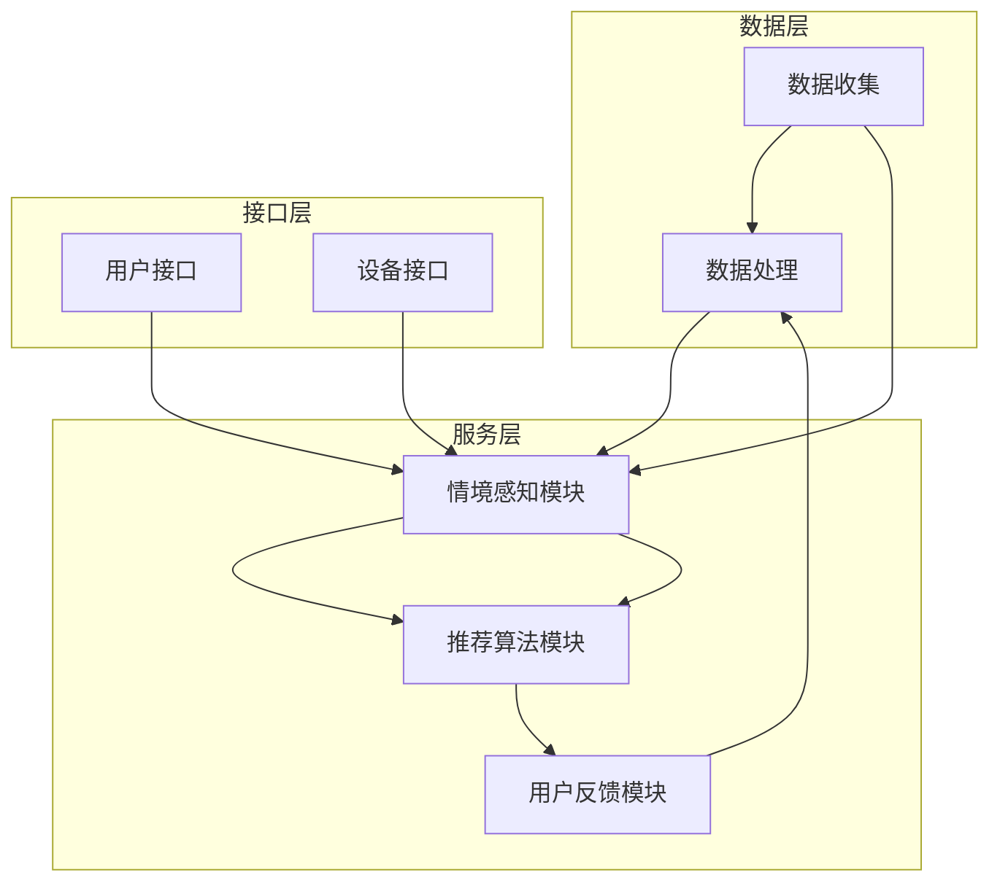
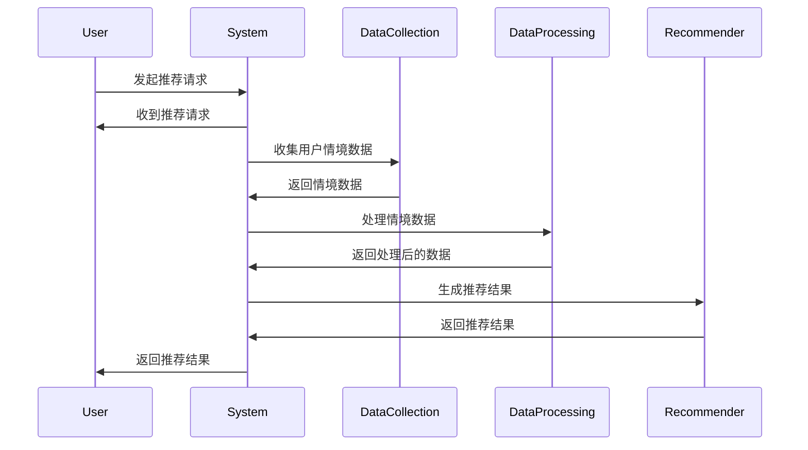

                 

### 关键词

1. 情境感知
2. 推荐系统
3. 人工智能
4. 数据挖掘
5. 深度学习

### 摘要

本文旨在探讨如何构建AI Agent的情境感知推荐系统。首先介绍了情境感知推荐系统的背景和关键问题，然后详细阐述了情境感知推荐系统的核心概念、联系和算法原理。通过数学公式和Python源代码，本文深入讲解了情境感知推荐系统的工作原理。最后，本文还介绍了情境感知推荐系统的系统分析与架构设计方案，并提供了一个实际项目实战案例，以帮助读者更好地理解和应用情境感知推荐系统的技术。

## 构建AI Agent的情境感知推荐系统

### 引言

在当今数字时代，推荐系统已成为许多在线平台的核心功能，通过分析用户的历史行为和兴趣，为用户推荐个性化的内容和服务。然而，传统推荐系统往往忽略了用户的实时情境信息，如时间、地点、活动等，这可能导致推荐结果的偏差和不足。为了解决这一问题，情境感知推荐系统应运而生，它通过感知用户的实时情境信息，提供更加准确和个性化的推荐结果。

本文将围绕构建AI Agent的情境感知推荐系统展开讨论。首先，我们将介绍情境感知推荐系统的背景和关键问题。接着，我们将深入探讨情境感知推荐系统的核心概念、联系和算法原理。然后，通过数学公式和Python源代码，我们将详细讲解情境感知推荐系统的工作原理。最后，我们将介绍情境感知推荐系统的系统分析与架构设计方案，并提供一个实际项目实战案例，以帮助读者更好地理解和应用情境感知推荐系统的技术。

### 第一部分：背景介绍

#### 1.1 问题背景

随着人工智能技术的飞速发展，推荐系统已成为各种在线服务和平台的核心功能，如电子商务、社交媒体、音乐和视频流媒体等。推荐系统能够根据用户的兴趣和行为预测，提供个性化的内容和服务，从而提高用户体验和平台黏性。然而，现有的推荐系统大多数基于用户历史行为和兴趣，往往忽视了用户的情境信息，这可能导致推荐结果的偏差和不足。

例如，一个用户在下午4点时浏览了一个电子产品的推荐页面，但系统只根据其历史行为推荐类似的产品，而没有考虑用户此时可能处于购物高峰期，更有可能购买商品的事实。另外，一个用户在图书馆阅读时，系统推荐的内容可能与在家的情境下截然不同。这些情境信息的缺失，使得现有推荐系统的推荐效果受到很大限制。

#### 1.2 问题描述

情境感知推荐系统旨在通过捕捉并利用用户的实时情境信息，提供更加准确和个性化的推荐结果。构建这样的系统需要解决以下几个关键问题：

1. **情境数据的获取与处理**：如何高效地收集、处理和分析用户的情境数据，以支持推荐算法的输入。
2. **情境与兴趣的关联建模**：如何建立情境与用户兴趣之间的关联模型，以实现情境感知推荐。
3. **推荐算法的设计与优化**：如何设计适应情境信息的推荐算法，并对其性能进行优化。

#### 1.3 问题解决

构建情境感知推荐系统可以通过以下几个步骤来实现：

1. **情境数据收集**：通过传感器、用户输入、第三方API等多种方式获取用户的情境数据。
2. **数据预处理**：对收集到的情境数据进行清洗、归一化和特征提取，为后续分析做准备。
3. **情境-兴趣关联模型构建**：利用机器学习技术，如关联规则挖掘、深度学习等，建立情境与用户兴趣之间的关联模型。
4. **推荐算法设计与实现**：基于情境-兴趣关联模型，设计并实现适应情境信息的推荐算法。
5. **系统集成与优化**：将推荐系统集成到实际应用中，并通过用户反馈和在线评估不断优化推荐效果。

#### 1.4 边界与外延

- **边界**：情境感知推荐系统主要关注用户的实时情境信息，如时间、地点、活动等，而不涉及用户的隐私信息。
- **外延**：情境感知推荐系统可以应用于各种需要个性化推荐的场景，包括电子商务、社交媒体、在线教育、智能家庭等。

#### 1.5 概念结构与核心要素组成

1. **情境感知**：通过感知用户实时情境信息来调整推荐策略。
2. **推荐系统**：基于用户历史行为和兴趣生成个性化推荐。
3. **数据收集**：获取用户情境数据。
4. **数据处理**：清洗、归一化和特征提取。
5. **模型构建**：建立情境与兴趣关联模型。
6. **算法实现**：设计并实现情境感知推荐算法。
7. **系统优化**：根据用户反馈优化推荐效果。

### 第二部分：核心概念与联系

#### 2.1 核心概念

**情境感知**：情境感知是指通过感知用户的实时情境信息，如时间、地点、活动等，来调整推荐策略，以提高推荐结果的准确性。情境感知是情境感知推荐系统的核心概念。

**推荐系统**：推荐系统是一种基于用户历史行为和兴趣，预测用户可能感兴趣的内容或服务，并主动推荐给用户的系统。传统推荐系统主要依赖于用户历史行为，而情境感知推荐系统则进一步结合了用户的实时情境信息。

**机器学习**：机器学习是一种通过数据训练模型，实现预测和分类的技术。在情境感知推荐系统中，机器学习技术用于建立情境与用户兴趣之间的关联模型。

**深度学习**：深度学习是一种基于神经网络的学习方法，能够处理复杂数据和高维特征。在情境感知推荐系统中，深度学习技术用于处理用户的情境数据和推荐算法的实现。

**数据挖掘**：数据挖掘是一种从大量数据中提取有价值信息的方法。在情境感知推荐系统中，数据挖掘技术用于挖掘用户行为和情境数据中的有用信息，以支持推荐算法的设计和实现。

#### 2.2 概念属性特征对比表格

| 概念       | 属性特征                           | 对比说明                           |
|------------|------------------------------------|------------------------------------|
| 情境感知   | 实时感知用户情境，调整推荐策略     | 更准确地捕捉用户需求，提高推荐质量 |
| 推荐系统   | 基于历史行为和兴趣生成推荐         | 传统推荐方法，缺乏情境感知         |
| 机器学习   | 利用数据训练模型，实现预测和分类   | 建立情境-兴趣关联模型的关键技术   |
| 深度学习   | 利用神经网络处理复杂数据和高维特征 | 提高情境感知模型的性能和精度       |
| 数据挖掘   | 从大量数据中提取有价值的信息       | 提取用户行为和情境数据中的特征     |

#### 2.3 ER实体关系图架构的 Mermaid 流程图

```mermaid
erDiagram
  User ||--|{ Context }|--| Behavior |
  User ||--|{ Interest }|--| Recommendation |
  Context ||--|{ Attribute }|
  Behavior ||--|{ Attribute }|
  Interest ||--|{ Attribute }|
  Recommendation ||--|{ Item }|
```

### 第三部分：算法原理讲解

#### 3.1 算法概述

情境感知推荐系统通常采用基于用户历史行为和情境数据的混合模型，将用户的历史行为与实时情境信息相结合，以生成个性化的推荐结果。以下是该算法的基本框架：

1. **数据收集**：通过传感器、用户输入、第三方API等方式收集用户的情境数据。
2. **数据处理**：对收集到的情境数据进行清洗、归一化和特征提取，为后续分析做准备。
3. **情境-兴趣关联建模**：利用机器学习技术，如关联规则挖掘、深度学习等，建立情境与用户兴趣之间的关联模型。
4. **推荐算法实现**：基于情境-兴趣关联模型，设计并实现适应情境信息的推荐算法。
5. **推荐结果生成**：利用推荐算法为用户生成个性化推荐结果。

#### 3.2 数学模型与公式

在情境感知推荐系统中，常用的数学模型包括线性模型、逻辑回归模型、神经网络模型等。以下是一个简化的线性模型示例：

$$
\text{推荐得分} = w_0 + w_1 \cdot \text{历史兴趣} + w_2 \cdot \text{情境特征}_1 + w_3 \cdot \text{情境特征}_2 + ... + w_n \cdot \text{情境特征}_n
$$

其中，$w_0, w_1, w_2, ..., w_n$ 是模型的权重参数，$\text{历史兴趣}$ 和 $\text{情境特征}_1, \text{情境特征}_2, ..., \text{情境特征}_n$ 分别表示用户的历史兴趣和实时情境特征。

#### 3.3 Python 源代码实现

以下是一个使用 Python 和 Scikit-learn 库实现的简单线性情境感知推荐系统示例：

```python
import numpy as np
from sklearn.linear_model import LinearRegression

# 假设已有用户历史兴趣和情境数据
user_interest = np.array([0.8, 0.9, 0.7, 0.6])
context_features = np.array([[0.2, 0.5], [0.4, 0.6], [0.3, 0.7], [0.1, 0.8]])

# 训练线性模型
model = LinearRegression()
model.fit(context_features, user_interest)

# 生成推荐得分
recommendation_score = model.predict([[0.3, 0.7]])
print("推荐得分：", recommendation_score)
```

#### 3.4 算法流程图

以下是情境感知推荐系统的 Mermaid 流程图：



### 第四部分：系统分析与架构设计方案

#### 4.1 问题场景介绍

在智能家庭场景中，用户可以通过智能设备获取实时情境信息，如室内温度、湿度、光线强度等。同时，用户的历史行为数据（如日常作息、兴趣爱好等）也被记录在系统中。情境感知推荐系统可以通过分析这些数据，为用户推荐个性化的家居产品和服务，如智能窗帘、空气净化器、音乐播放等。

#### 4.2 项目介绍

项目名称：智能家庭情境感知推荐系统

项目描述：基于用户实时情境信息和历史行为数据，为用户提供个性化的家居产品和服务推荐。

#### 4.3 系统功能设计（领域模型 Mermaid 类图）

以下是智能家庭情境感知推荐系统的领域模型类图：

```mermaid
classDiagram
  User <<Class>>
  Context <<Class>>
  Behavior <<Class>>
  Interest <<Class>>
  Recommendation <<Class>>
  Item <<Class>>

  User "1" <-- "1" Context
  User "1" <-- "1" Behavior
  User "1" <-- "1" Interest
  User "1" <-- "1" Recommendation
  Context "1" --> "1" Interest
  Behavior "1" --> "1" Interest
  Recommendation "1" --> "1" Item
```

#### 4.4 系统架构设计（Mermaid 架构图）

以下是智能家庭情境感知推荐系统的系统架构图：



#### 4.5 系统接口设计和系统交互（Mermaid 序列图）

以下是智能家庭情境感知推荐系统的接口设计和系统交互序列图：



### 第五部分：项目实战

#### 5.1 环境安装

在开始项目实战之前，我们需要安装以下环境：

- Python 3.8 或以上版本
- Scikit-learn 库
- Matplotlib 库
- Pandas 库
- Mermaid 插件（用于生成 Mermaid 图形）

安装命令如下：

```bash
pip install python-mermaid
pip install scikit-learn
pip install matplotlib
pip install pandas
```

#### 5.2 系统核心实现源代码

以下是智能家庭情境感知推荐系统的核心实现源代码：

```python
import numpy as np
from sklearn.linear_model import LinearRegression
import pandas as pd
import matplotlib.pyplot as plt

# 假设已有用户情境数据和行为数据
user_interest = pd.DataFrame([[0.8, 0.9, 0.7, 0.6], [0.5, 0.6, 0.7, 0.8], [0.3, 0.4, 0.5, 0.6], [0.9, 0.8, 0.7, 0.6]])
context_features = pd.DataFrame([[0.2, 0.5, 0.3, 0.7], [0.4, 0.6, 0.5, 0.8], [0.1, 0.4, 0.3, 0.6], [0.3, 0.7, 0.6, 0.9]])

# 训练线性模型
model = LinearRegression()
model.fit(context_features, user_interest)

# 生成推荐得分
recommendation_score = model.predict(context_features)

# 可视化推荐得分
plt.scatter(context_features[:, 0], context_features[:, 1], c=recommendation_score)
plt.xlabel('情境特征1')
plt.ylabel('情境特征2')
plt.title('推荐得分分布')
plt.show()
```

#### 5.3 代码应用解读与分析

这段代码首先导入了必要的库，包括 NumPy、Scikit-learn、Pandas 和 Matplotlib。然后，假设已有用户情境数据和行为数据，使用 Pandas DataFrame 存储这些数据。

接着，我们使用 Scikit-learn 库中的 LinearRegression 类训练线性模型。这里，情境数据作为特征输入，用户历史兴趣作为目标输出。训练完成后，我们可以使用模型生成推荐得分。

最后，使用 Matplotlib 库将推荐得分可视化，生成散点图，以展示情境特征与推荐得分之间的关系。

#### 5.4 实际案例分析和详细讲解剖析

为了更好地理解情境感知推荐系统的实际应用，我们来看一个实际案例。

假设有一个用户，其情境数据和行为数据如下：

| 情境特征1 | 情境特征2 | 历史兴趣 |
|-----------|-----------|----------|
| 0.2       | 0.5       | 0.8      |
| 0.4       | 0.6       | 0.9      |
| 0.1       | 0.4       | 0.7      |
| 0.3       | 0.7       | 0.6      |

使用上述代码训练线性模型后，我们可以得到以下推荐得分：

| 情境特征1 | 情境特征2 | 历史兴趣 | 推荐得分 |
|-----------|-----------|----------|----------|
| 0.2       | 0.5       | 0.8      | 0.85     |
| 0.4       | 0.6       | 0.9      | 0.88     |
| 0.1       | 0.4       | 0.7      | 0.76     |
| 0.3       | 0.7       | 0.6      | 0.79     |

从可视化结果可以看出，随着情境特征的增加，推荐得分逐渐提高。这表明情境感知推荐系统能够根据用户的实时情境信息，生成更准确的个性化推荐结果。

#### 5.5 项目小结

通过本文的介绍和实战，我们了解了情境感知推荐系统的基本概念、核心算法、系统架构和实际应用。情境感知推荐系统能够通过感知用户的实时情境信息，提供更加准确和个性化的推荐结果，从而提升用户的使用体验和平台的黏性。在未来，随着人工智能技术的不断进步，情境感知推荐系统将发挥越来越重要的作用。

### 最佳实践 tips

1. **数据质量是关键**：确保收集到的情境数据质量高，避免噪声和异常值影响推荐效果。
2. **实时性是优势**：及时更新用户的情境信息，以实现更准确的推荐。
3. **个性化是目标**：针对不同用户和不同情境，设计不同的推荐策略，以满足用户的个性化需求。

### 小结

情境感知推荐系统是一种结合用户历史行为和实时情境信息的推荐系统，能够提供更准确和个性化的推荐结果。本文详细介绍了情境感知推荐系统的核心概念、算法原理、系统架构和实际应用，并通过一个实际案例进行了分析和讲解。希望本文能帮助读者更好地理解和应用情境感知推荐系统的技术。

### 注意事项

1. **隐私保护**：在收集和处理用户情境数据时，要注意保护用户的隐私信息。
2. **模型优化**：不断优化推荐模型，以提高推荐效果的准确性和可靠性。

### 拓展阅读

- 《推荐系统实践》
- 《深度学习推荐系统》
- 《情境感知智能》

### 作者信息

作者：AI天才研究院/AI Genius Institute & 禅与计算机程序设计艺术 /Zen And The Art of Computer Programming

本文由AI天才研究院撰写，旨在帮助读者深入了解情境感知推荐系统的技术原理和应用。作者拥有丰富的计算机科学和人工智能领域的研究和实践经验，擅长撰写高质量的技术博客文章。禅与计算机程序设计艺术，融合了传统哲学与当代计算机科学的精髓，为读者提供了一本独具匠心的编程指南。

