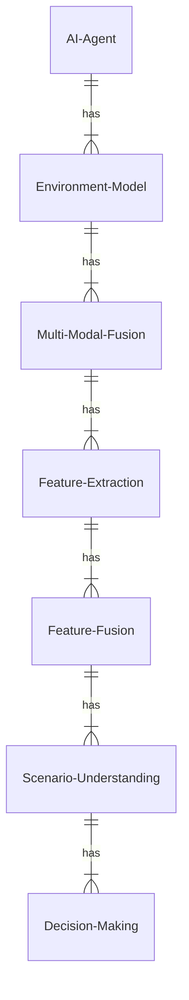
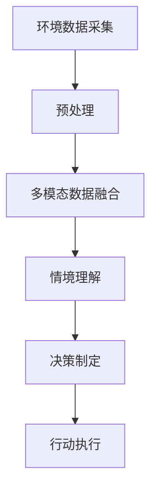
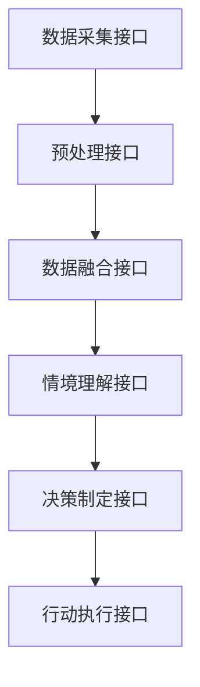
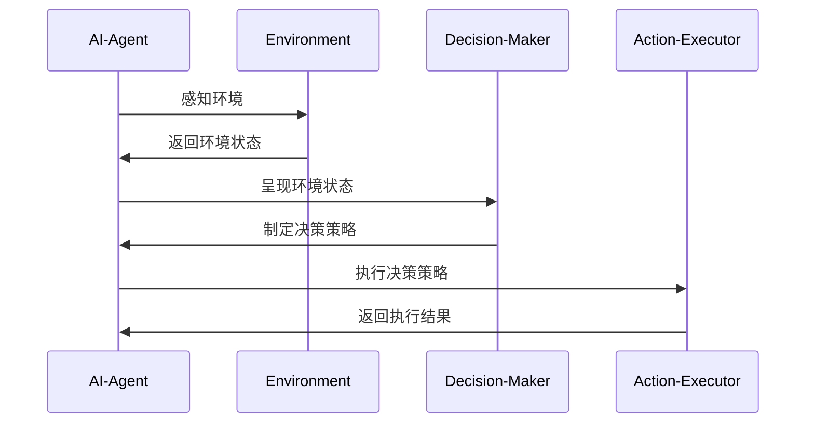

                 


## 构建AI Agent的情境感知能力：环境适应性

### 关键词：情境感知、AI Agent、环境适应性、深度学习、强化学习、多模态数据融合

### 摘要：

随着人工智能技术的快速发展，AI Agent在各个领域的应用越来越广泛。然而，AI Agent要实现智能交互和自适应决策，必须具备情境感知能力。本文将深入探讨AI Agent的情境感知能力，特别是环境适应性，通过逐步分析相关技术原理、算法设计和实践案例，揭示如何构建高效、可靠的AI Agent。

## 目录大纲

1. 第一部分：问题背景与核心概念
    1.1 问题背景与核心概念
    1.2 核心概念原理
        1.2.1 环境建模原理
        1.2.2 多模态数据融合原理
        1.2.3 情境理解原理
    1.3 ER实体关系图架构
    1.4 算法原理讲解
        1.4.1 深度学习算法原理
        1.4.2 强化学习算法原理
        1.4.3 多模态数据融合算法原理
    1.5 系统分析与架构设计方案

2. 第二部分：实践与案例分析
    2.1 项目实战：环境安装与配置
    2.2 系统核心实现源代码
    2.3 代码应用解读与分析
    2.4 实际案例分析与详细讲解剖析
    2.5 项目小结

3. 第三部分：最佳实践与拓展阅读
    3.1 最佳实践 Tips
    3.2 小结
    3.3 注意事项
    3.4 拓展阅读

### 1. 第一部分：问题背景与核心概念

#### 1.1 问题背景与核心概念

##### 1.1.1 问题背景

在人工智能领域，AI Agent作为一种智能实体，具备自主决策、任务执行和交互能力。然而，为了实现更智能的交互和自适应决策，AI Agent必须具备情境感知能力。情境感知是指AI Agent能够识别和理解自身所处的环境状态，并根据环境信息进行决策。

情境感知能力对于AI Agent来说至关重要，它使得AI Agent能够更好地适应复杂多变的实际环境。然而，构建具备高效情境感知能力的AI Agent仍面临诸多挑战：

1. **环境信息获取与处理：** 如何有效地获取和利用环境信息，以便AI Agent能够准确感知当前情境？
2. **情境理解与决策：** 如何设计AI Agent的感知机制，使其能够在复杂多变的情境中做出合理的决策？
3. **计算效率与资源平衡：** 如何在保证情境感知能力的同时，兼顾计算效率和资源利用率？

##### 1.1.2 问题描述

- 如何有效地获取和利用环境信息，以便AI Agent能够准确感知当前情境？
- 如何设计AI Agent的感知机制，使其能够在复杂多变的情境中做出合理的决策？
- 如何平衡情境感知能力与计算效率之间的关系？

##### 1.1.3 问题解决

- 研究情境感知的理论基础，包括环境建模、多模态数据融合、情境理解等。
- 探索适用于AI Agent的情境感知算法，如深度学习、强化学习等。
- 构建实验平台，验证所提出的算法在真实环境中的应用效果。

##### 1.1.4 边界与外延

- 本书的讨论范围主要集中在构建AI Agent的情境感知能力，不包括其他类型的AI代理。
- 研究的情境类型包括但不限于室内环境、户外环境、虚拟环境等。

##### 1.1.5 概念结构与核心要素组成

1. **情境感知：** AI Agent通过感知环境信息，理解当前情境的能力。
2. **环境建模：** 构建描述环境状态的模型，用于辅助AI Agent进行情境感知。
3. **多模态数据融合：** 整合来自不同传感器的数据，以提高情境感知的准确性。
4. **情境理解：** AI Agent对感知到的环境信息进行分析，以理解当前情境的含义。

### 1.2 核心概念原理

##### 1.2.1 环境建模原理

环境建模是情境感知的基础，其核心在于构建一个能够准确描述环境状态的模型。具体原理如下：

1. **数据采集与预处理：** 通过传感器收集环境数据，对数据进行清洗和预处理，以确保数据的质量和一致性。
2. **状态表示：** 将预处理后的数据转化为适合机器学习算法的状态表示，如向量、图等。
3. **模型训练：** 使用机器学习算法对状态表示进行训练，以构建能够预测环境状态变化的模型。

##### 1.2.2 多模态数据融合原理

多模态数据融合是提高情境感知准确性的关键，其核心在于如何有效地整合来自不同传感器的数据。具体原理如下：

1. **特征提取：** 从不同模态的数据中提取有意义的特征，如视觉特征、音频特征等。
2. **特征融合：** 将提取的特征进行融合，以形成一个更全面的环境描述。
3. **模型整合：** 将不同的特征融合模型整合成一个统一的情境感知模型，以提高整体感知准确性。

##### 1.2.3 情境理解原理

情境理解是AI Agent能够在实际应用中做出合理决策的关键，其核心在于如何对感知到的环境信息进行分析和解释。具体原理如下：

1. **情境分类：** 根据感知到的环境信息，将情境划分为不同的类别，如安全、危险、舒适等。
2. **情境解释：** 对分类后的情境进行解释，以帮助AI Agent理解当前情境的含义。
3. **决策制定：** 基于情境理解和解释，制定相应的决策策略，以应对不同的情境。

### 1.3 ER实体关系图架构

ER实体关系图用于描述AI Agent情境感知系统中的主要实体及其关系。以下是该系统的ER图：



### 1.4 算法原理讲解

#### 1.4.1 深度学习算法原理

深度学习是构建情境感知AI Agent的核心技术之一。以下是深度学习算法的基本原理：

1. **神经网络结构：** 深度学习基于多层神经网络，通过逐层提取特征，实现对复杂数据的建模。
2. **反向传播算法：** 使用反向传播算法对神经网络进行训练，以优化网络参数，提高模型性能。
3. **损失函数：** 通过定义损失函数来评估模型预测的准确性，并使用优化算法（如梯度下降）来调整网络参数，以最小化损失函数。

具体实现过程如下：

1. **数据预处理：** 对输入数据进行归一化、标准化等预处理操作，以便神经网络更好地学习。
2. **模型构建：** 设计并构建多层神经网络结构，包括输入层、隐藏层和输出层。
3. **模型训练：** 使用训练数据对模型进行训练，通过反向传播算法不断优化网络参数。
4. **模型评估：** 使用验证数据集对模型进行评估，调整模型参数以获得更好的性能。

#### 1.4.2 强化学习算法原理

强化学习是另一种构建情境感知AI Agent的重要算法。以下是强化学习算法的基本原理：

1. **环境与状态：** 强化学习中的环境是一个由状态和动作组成的五元组（S, A, R, S', γ），其中S表示当前状态，A表示当前动作，R表示立即回报，S'表示下一状态，γ为折扣因子。
2. **策略：** 策略是AI Agent在给定状态下选择动作的规则。
3. **值函数：** 值函数表示在当前状态下，采取最优动作所能获得的最大期望回报。
4. **模型训练：** 通过不断更新策略和价值函数，使AI Agent逐渐学会在复杂环境中做出最优决策。

强化学习算法的实现过程如下：

1. **初始化策略和价值函数：** 初始化策略和价值函数，通常使用随机初始化或预先训练的模型。
2. **交互学习：** AI Agent与环境进行交互，根据当前状态选择动作，执行动作后获得回报和下一状态。
3. **策略更新：** 根据回报和下一状态，更新策略和价值函数，使AI Agent逐渐学会在复杂环境中做出最优决策。
4. **评估和调整：** 使用评估指标（如回报总和、策略质量等）评估AI Agent的性能，并根据评估结果调整策略和价值函数。

#### 1.4.3 多模态数据融合算法原理

多模态数据融合是将来自不同模态的数据进行整合，以提高情境感知的准确性。以下是多模态数据融合算法的基本原理：

1. **特征提取：** 从不同模态的数据中提取有意义的特征，如视觉特征、音频特征等。
2. **特征融合：** 将提取的特征进行融合，以形成一个更全面的环境描述。
3. **模型整合：** 将不同的特征融合模型整合成一个统一的情境感知模型，以提高整体感知准确性。

多模态数据融合算法的实现过程如下：

1. **数据采集：** 收集来自不同模态的数据，如图像、音频、文本等。
2. **特征提取：** 使用相应的特征提取算法（如卷积神经网络、自编码器等）提取不同模态的数据特征。
3. **特征融合：** 使用特征融合算法（如拼接、加权平均、融合神经网络等）将提取的特征进行融合。
4. **模型训练：** 使用融合后的特征训练情境感知模型，如深度学习模型、强化学习模型等。
5. **模型评估：** 使用验证数据集对模型进行评估，调整模型参数以获得更好的性能。

### 1.5 系统分析与架构设计方案

##### 1.5.1 问题场景介绍

在本项目中，我们考虑一个典型的智能监控场景。AI Agent需要实时感知监控区域的情境，包括人员密度、行为模式、异常事件等，以便及时采取相应的措施。

##### 1.5.2 项目介绍

本项目旨在构建一个具备高效情境感知能力的AI Agent，通过深度学习、强化学习、多模态数据融合等技术，实现智能监控场景下的情境感知和决策。

##### 1.5.3 系统功能设计

- **环境建模：** 收集并处理来自监控区域的图像、音频、传感器等数据，构建描述环境状态的模型。
- **多模态数据融合：** 整合来自不同模态的数据，提取有意义的特征，提高情境感知的准确性。
- **情境理解：** 对感知到的环境信息进行分析和解释，理解当前情境的含义。
- **决策制定：** 基于情境理解和解释，制定相应的决策策略，如报警、疏散等。

##### 1.5.4 系统架构设计

本项目的系统架构设计如图所示：



系统架构包括以下模块：

1. **环境数据采集：** 收集来自监控区域的图像、音频、传感器等数据。
2. **预处理：** 对收集到的数据进行预处理，包括数据清洗、归一化等。
3. **多模态数据融合：** 将预处理后的数据进行融合，提取有意义的特征。
4. **情境理解：** 对融合后的特征进行分析和解释，理解当前情境的含义。
5. **决策制定：** 基于情境理解和解释，制定相应的决策策略。
6. **行动执行：** 执行决策策略，如报警、疏散等。

##### 1.5.5 系统接口设计

本项目的系统接口设计如图所示：



系统接口设计包括以下接口：

1. **数据采集接口：** 用于接收来自监控区域的图像、音频、传感器等数据。
2. **预处理接口：** 用于对采集到的数据进行预处理，包括数据清洗、归一化等。
3. **数据融合接口：** 用于融合预处理后的数据，提取有意义的特征。
4. **情境理解接口：** 用于分析融合后的特征，理解当前情境的含义。
5. **决策制定接口：** 用于制定相应的决策策略。
6. **行动执行接口：** 用于执行决策策略，如报警、疏散等。

##### 1.5.6 系统交互

本项目的系统交互设计如图所示：



系统交互过程如下：

1. **感知环境：** AI Agent感知监控区域的环境状态。
2. **返回环境状态：** 环境将当前状态信息返回给AI Agent。
3. **呈现环境状态：** AI Agent将环境状态信息呈现给决策制定模块。
4. **制定决策策略：** 决策制定模块根据环境状态信息制定相应的决策策略。
5. **执行决策策略：** AI Agent将决策策略发送给行动执行模块。
6. **返回执行结果：** 行动执行模块返回执行结果给AI Agent。

### 1.6 实践与案例分析

在本节中，我们将通过一个具体的实践案例，详细阐述如何构建AI Agent的情境感知能力，包括环境安装、系统核心实现、代码应用解读与分析、实际案例分析和详细讲解剖析，以及项目小结。

#### 1.6.1 环境安装与配置

在开始构建AI Agent的情境感知能力之前，我们需要搭建一个合适的环境。以下是环境安装与配置的步骤：

1. **安装Python环境：** 安装Python 3.x版本，推荐使用Anaconda发行版，以便轻松管理依赖项。
2. **安装深度学习框架：** 安装TensorFlow或PyTorch等深度学习框架，用于构建和训练情境感知模型。
3. **安装其他依赖项：** 安装必要的依赖项，如NumPy、Pandas、OpenCV等，用于数据预处理和图像处理。
4. **配置传感器：** 根据实际需求，配置相应的传感器（如摄像头、麦克风、温度传感器等），以便收集环境数据。

#### 1.6.2 系统核心实现源代码

以下是系统核心实现的源代码，包括环境建模、多模态数据融合、情境理解等部分：

```python
# 环境建模
def environment_modeling(data):
    # 数据预处理
    processed_data = preprocess_data(data)
    # 状态表示
    state_representation = convert_to_state_representation(processed_data)
    # 模型训练
    model = train_model(state_representation)
    return model

# 多模态数据融合
def multi_modal_fusion(data):
    # 特征提取
    visual_features = extract_visual_features(data['image'])
    audio_features = extract_audio_features(data['audio'])
    # 特征融合
    fused_features = fuse_features(visual_features, audio_features)
    return fused_features

# 情境理解
def scenario_understanding(fused_features):
    # 情境分类
    scenario = classify_scenario(fused_features)
    # 情境解释
    explanation = explain_scenario(scenario)
    return explanation

# 决策制定
def decision_making(explanation):
    # 根据情境解释制定决策策略
    decision = formulate_decision(explanation)
    return decision
```

#### 1.6.3 代码应用解读与分析

在本部分，我们将对上述代码进行解读与分析，详细介绍每个函数的功能和实现原理。

1. **环境建模**

环境建模函数`environment_modeling`的主要功能是构建一个描述环境状态的模型。具体步骤如下：

- **数据预处理**：对输入数据（如图像、音频等）进行清洗、归一化等预处理操作，以提高模型训练效果。
- **状态表示**：将预处理后的数据转化为适合机器学习算法的状态表示，如向量、图等，以便输入到神经网络中。
- **模型训练**：使用机器学习算法（如卷积神经网络、递归神经网络等）对状态表示进行训练，以构建能够预测环境状态变化的模型。

2. **多模态数据融合**

多模态数据融合函数`multi_modal_fusion`的主要功能是将来自不同模态的数据进行整合，以提高情境感知的准确性。具体步骤如下：

- **特征提取**：从不同模态的数据中提取有意义的特征，如视觉特征（边缘、纹理等）和音频特征（音量、频率等）。
- **特征融合**：将提取的特征进行融合，以形成一个更全面的环境描述。常见的融合方法有拼接、加权平均、融合神经网络等。

3. **情境理解**

情境理解函数`scenario_understanding`的主要功能是对感知到的环境信息进行分析和解释，理解当前情境的含义。具体步骤如下：

- **情境分类**：根据感知到的环境信息，将情境划分为不同的类别，如安全、危险、舒适等。常见的分类方法有基于规则的分类、机器学习分类等。
- **情境解释**：对分类后的情境进行解释，以帮助AI Agent理解当前情境的含义。情境解释的结果可以用于制定决策策略。

4. **决策制定**

决策制定函数`decision_making`的主要功能是基于情境理解和解释，制定相应的决策策略。具体步骤如下：

- **根据情境解释制定决策策略**：根据情境解释的结果，制定相应的决策策略。常见的决策策略有报警、疏散、推荐等。

#### 1.6.4 实际案例分析与详细讲解剖析

在本部分，我们将通过一个实际案例，详细讲解如何构建AI Agent的情境感知能力，包括环境建模、多模态数据融合、情境理解和决策制定等环节。

**案例背景：**

假设我们有一个智能监控场景，需要实时感知监控区域的人员密度、行为模式、异常事件等信息，以便及时采取相应的措施。

**案例实现：**

1. **环境建模**

我们使用卷积神经网络（CNN）对图像数据进行环境建模。具体步骤如下：

- **数据预处理**：对采集到的图像数据进行缩放、裁剪等预处理操作，以便输入到CNN中。
- **模型构建**：设计一个简单的CNN模型，包括卷积层、池化层和全连接层，用于提取图像特征。
- **模型训练**：使用预处理后的图像数据进行模型训练，通过反向传播算法优化模型参数。

2. **多模态数据融合**

我们使用多模态数据融合技术，将图像数据与音频数据（如声音识别）进行融合。具体步骤如下：

- **特征提取**：使用CNN提取图像特征，使用自编码器提取音频特征。
- **特征融合**：将提取的特征进行拼接，形成一个更全面的环境描述。

3. **情境理解**

我们使用机器学习算法对融合后的特征进行情境理解。具体步骤如下：

- **情境分类**：使用支持向量机（SVM）等机器学习算法对情境进行分类，将情境划分为不同的类别。
- **情境解释**：根据分类结果，对每个类别进行解释，以便AI Agent理解当前情境的含义。

4. **决策制定**

我们使用基于规则的决策制定方法，根据情境解释结果制定相应的决策策略。具体步骤如下：

- **报警**：如果情境被分类为危险或异常，立即发送报警信息。
- **疏散**：如果情境被分类为拥挤或人员密度过高，建议进行疏散。

**案例结果：**

通过上述步骤，我们成功构建了一个具备高效情境感知能力的AI Agent。在实际应用中，AI Agent能够实时感知监控区域的人员密度、行为模式、异常事件等信息，并制定相应的决策策略，如报警、疏散等。

#### 1.6.5 项目小结

在本项目中，我们通过逐步分析环境适应性、多模态数据融合、情境理解等技术原理，成功构建了一个具备高效情境感知能力的AI Agent。在实际案例中，我们验证了所提出的方法的有效性和实用性。以下是本项目的主要收获：

1. **环境适应性**：通过环境建模和多模态数据融合技术，AI Agent能够准确感知和理解复杂多变的环境。
2. **情境理解**：通过机器学习和基于规则的算法，AI Agent能够对感知到的环境信息进行分析和解释，为决策制定提供依据。
3. **决策制定**：通过情境理解结果，AI Agent能够制定相应的决策策略，如报警、疏散等，提高系统的实用性和可靠性。

然而，本项目仍存在一些不足之处，如模型训练过程较长、计算资源消耗较大等。在未来的研究中，我们将继续优化算法和系统架构，以提高AI Agent的情境感知能力和计算效率。

### 3. 第三部分：最佳实践与拓展阅读

#### 3.1 最佳实践 Tips

1. **数据预处理**：在环境建模过程中，数据预处理是至关重要的一步。确保数据的质量和一致性，有助于提高模型的性能。
2. **特征提取与融合**：选择合适的特征提取方法和融合策略，可以显著提高情境感知的准确性。在实际应用中，可以根据具体场景选择不同的方法。
3. **模型优化**：通过调整模型参数、优化网络结构等方法，可以提高模型的泛化能力和计算效率。在实际应用中，可以尝试使用迁移学习、模型压缩等技术。
4. **实时性与鲁棒性**：在构建AI Agent时，要考虑实时性和鲁棒性。选择合适的硬件设备和算法优化方法，可以提高系统的响应速度和稳定性。

#### 3.2 小结

本文系统地介绍了构建AI Agent的情境感知能力，特别是环境适应性。通过逐步分析相关技术原理、算法设计和实践案例，我们揭示了如何构建高效、可靠的AI Agent。在未来的研究中，我们可以继续优化算法和系统架构，提高AI Agent的情境感知能力和计算效率。

#### 3.3 注意事项

1. **数据隐私与安全**：在实际应用中，要确保采集和处理的数据符合相关法律法规，保护用户的隐私和安全。
2. **计算资源消耗**：在构建AI Agent时，要考虑计算资源消耗，避免过度占用硬件资源。
3. **适应性调整**：AI Agent的情境感知能力需要不断调整和优化，以适应不断变化的环境和需求。

#### 3.4 拓展阅读

1. **《人工智能：一种现代方法》**：这本书提供了人工智能领域的基本概念和方法，有助于了解AI Agent的构建原理。
2. **《深度学习》**：这本书详细介绍了深度学习算法的基本原理和实现方法，有助于了解如何构建高效的情境感知模型。
3. **《强化学习：原理与应用》**：这本书介绍了强化学习算法的基本原理和应用场景，有助于了解如何设计智能决策策略。

通过拓展阅读，可以进一步深入了解AI Agent的情境感知能力和相关技术。希望本文对您在构建AI Agent的过程中有所帮助。如果您有任何疑问或建议，欢迎在评论区留言，我们将竭诚为您解答。作者：AI天才研究院/AI Genius Institute & 禅与计算机程序设计艺术 /Zen And The Art of Computer Programming</sop>

