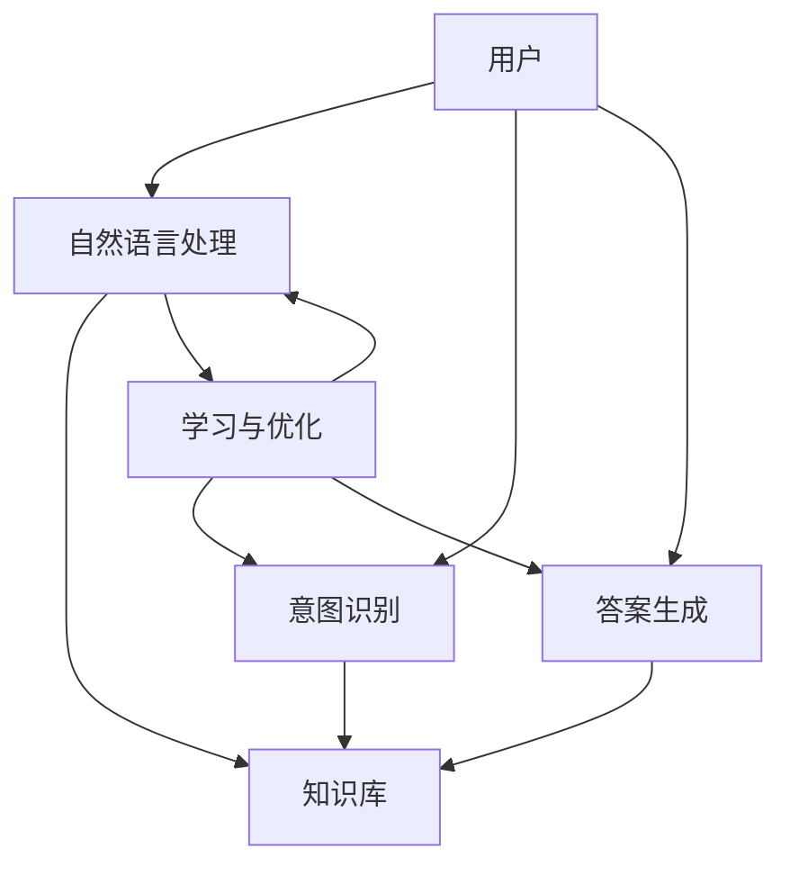
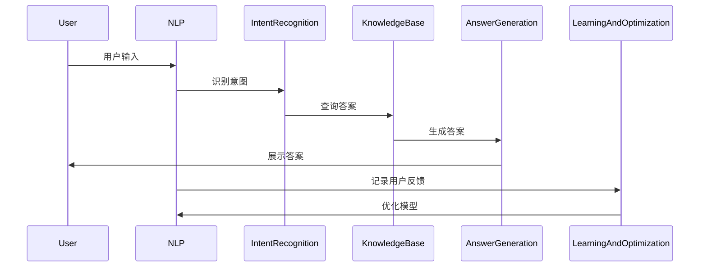

                 

## 构建AI Agent的技术栈选择指南

### 关键词

- **AI Agent**、**技术栈**、**机器学习**、**深度学习**、**编程语言**、**框架**、**自然语言处理**

### 摘要

本文旨在为开发者提供构建AI Agent所需的技术栈选择指南。我们将首先介绍AI Agent的概念和重要性，然后详细探讨构建AI Agent所需的技术栈，包括编程语言、框架、算法和工具等。接着，我们将深入分析机器学习和深度学习等核心技术，并通过具体案例展示如何应用这些技术构建AI Agent。最后，我们将总结构建AI Agent过程中的最佳实践，并提供未来发展方向的建议。

### 目录大纲设计思路

为了设计出《构建AI Agent的技术栈选择指南》的详细目录大纲，我们需要遵循以下设计思路：

1. **概述章节**：首先介绍AI Agent的背景和重要性，为读者奠定基础知识。
2. **技术栈概述**：详细讲解构建AI Agent所需的主要技术栈，包括编程语言、框架、算法和工具等。
3. **核心技术讲解**：对AI Agent的核心技术进行深入剖析，包括机器学习、深度学习和自然语言处理等。
4. **实战应用**：通过具体案例展示如何应用所学的技术栈构建AI Agent。
5. **最佳实践和总结**：总结构建AI Agent过程中需要注意的事项，提供最佳实践和未来发展方向。

### 第一部分：背景介绍与概述

#### 第1章 AI Agent的概念与重要性

##### 1.1 问题背景

**AI Agent的定义和功能**：

AI Agent，即人工智能代理，是指一种能够模拟人类智能行为，具备感知、决策和执行能力的智能体。它可以主动地与环境进行交互，通过学习和适应来完成任务。AI Agent在各个领域有着广泛的应用，如智能客服、自动驾驶、智能家居等。

**AI Agent的发展历程**：

AI Agent的发展可以追溯到20世纪50年代。当时，计算机科学家首次提出了“通用问题求解器”（Universal Problem Solver）的概念。随着时间的推移，AI Agent经历了从简单规则系统到基于机器学习和深度学习的复杂智能体的演变。

##### 1.2 问题解决

**AI Agent在解决问题中的应用**：

AI Agent通过其智能行为能够解决许多实际问题，提高效率和准确性。例如，在智能客服中，AI Agent可以快速响应客户的问题，提供个性化的解决方案；在自动驾驶中，AI Agent可以实时感知道路环境，做出安全驾驶决策。

**AI Agent如何帮助解决实际问题**：

AI Agent能够处理大量数据，发现潜在的模式和规律，从而辅助人类做出更明智的决策。同时，AI Agent能够自动化许多重复性工作，释放人力资源，专注于更有价值的工作。

##### 1.3 边界与外延

**AI Agent的限制**：

尽管AI Agent在许多领域表现出色，但它仍存在一些局限性。首先，AI Agent通常依赖于大量数据和高质量的训练模型。在没有足够数据的情况下，AI Agent的表现会大打折扣。其次，AI Agent的设计和实现需要高度的专业知识，这限制了其普及和推广。

**AI Agent的未来发展趋势**：

随着技术的不断进步，AI Agent将变得更加智能和自适应。未来的AI Agent将能够更好地理解人类的意图，提供更加个性化的服务。同时，多模态感知和协同工作的AI Agent将成为趋势，使它们能够处理更复杂的问题。

##### 1.4 概念结构与核心要素组成

**AI Agent的核心结构**：

AI Agent通常由感知模块、决策模块和执行模块组成。感知模块负责获取环境信息；决策模块根据感知信息进行决策；执行模块则将决策付诸实践。

**AI Agent的关键技术要素**：

构建AI Agent需要掌握多个关键技术，包括机器学习、深度学习和自然语言处理等。这些技术共同构成了AI Agent的核心能力。

#### 第2章 构建AI Agent所需的技术栈

##### 2.1 编程语言与工具

**Python**：

Python是AI开发中最为流行的编程语言之一。它具有简洁易懂的语法和丰富的库，使得开发者能够快速实现AI算法。

**Jupyter Notebook**：

Jupyter Notebook是一种交互式的开发环境，它允许开发者以markdown格式编写文档，同时嵌入代码、图表和解释性文本。这对于研究和实验AI Agent非常有用。

##### 2.2 机器学习框架

**Scikit-learn**：

Scikit-learn是一个强大的机器学习库，它提供了多种监督学习和无监督学习算法。它适用于各种常见的数据科学任务，如分类、回归和聚类。

**TensorFlow**：

TensorFlow是Google开发的开源机器学习库，它提供了丰富的工具和API，用于构建和训练深度学习模型。TensorFlow在工业界和学术界都得到了广泛的应用。

##### 2.3 深度学习框架

**PyTorch**：

PyTorch是一个流行的深度学习框架，它具有灵活的动态计算图和易于使用的API。它适用于各种深度学习任务，包括计算机视觉和自然语言处理。

**Keras**：

Keras是一个高层神经网络API，它构建在TensorFlow之上。它提供了简洁的接口，使得开发者能够轻松搭建和训练深度学习模型。

##### 2.4 自然语言处理工具

**NLTK**：

NLTK是一个强大的自然语言处理库，它提供了丰富的工具和算法，用于文本清洗、分词、词性标注和情感分析等任务。

**spaCy**：

spaCy是一个高效的自然语言处理库，它提供了先进的语言模型和API，用于实体识别、关系抽取和文本分类等任务。

### 第二部分：核心技术讲解

#### 第3章 机器学习基础

##### 3.1 机器学习原理

**监督学习、无监督学习和强化学习**：

机器学习可以分为三类：监督学习、无监督学习和强化学习。监督学习使用标记数据训练模型；无监督学习不使用标记数据，从数据中发现隐藏的结构；强化学习通过与环境交互，不断优化策略。

**机器学习算法分类**：

常见的机器学习算法包括线性回归、逻辑回归、支持向量机、决策树、随机森林和神经网络等。每种算法都有其独特的原理和应用场景。

##### 3.2 数据预处理

**数据清洗与归一化**：

数据清洗是机器学习过程中至关重要的一步。它包括去除噪声、填补缺失值、去除重复数据等。归一化是将数据缩放到同一尺度，以避免某些特征对模型的影响过大。

**特征工程**：

特征工程是机器学习过程中的一门艺术。它包括从原始数据中提取有用的特征，构建特征组合，以及进行特征选择和降维等。好的特征工程可以显著提升模型的性能。

##### 3.3 评估与优化

**性能评估指标**：

性能评估是机器学习过程中必不可少的一环。常用的评估指标包括准确率、召回率、F1分数、均方误差和交叉验证等。这些指标可以帮助我们判断模型的性能和泛化能力。

**超参数调优**：

超参数是模型配置中的参数，如学习率、正则化参数和树深度等。超参数调优是优化模型性能的关键步骤。常用的方法包括网格搜索、随机搜索和贝叶斯优化等。

#### 第4章 深度学习原理与应用

##### 4.1 深度学习基础

**神经网络架构**：

深度学习基于多层神经网络，通过非线性变换逐层提取数据的特征。常见的神经网络架构包括全连接神经网络、卷积神经网络和循环神经网络等。

**反向传播算法**：

反向传播算法是深度学习训练的核心算法。它通过反向传播误差，更新模型参数，以优化模型性能。

##### 4.2 深层网络模型

**卷积神经网络（CNN）**：

卷积神经网络是一种用于图像识别和处理的深度学习模型。它通过卷积层和池化层提取图像的特征，从而实现分类和检测任务。

**循环神经网络（RNN）**：

循环神经网络是一种用于序列数据处理的深度学习模型。它通过循环结构保留历史信息，从而实现对序列数据的建模。

##### 4.3 自适应学习算法

**优化算法**：

优化算法是深度学习训练中用于更新模型参数的方法。常见的优化算法包括随机梯度下降、Adam优化器和RMSprop等。

**生成对抗网络（GAN）**：

生成对抗网络是一种用于生成数据的深度学习模型。它由生成器和判别器组成，通过对抗训练生成逼真的数据。

### 第三部分：实战应用

#### 第5章 构建聊天机器人

##### 5.1 项目介绍

**项目背景与目标**：

本项目旨在构建一个基于深度学习的聊天机器人，能够与用户进行自然语言交互，回答用户的问题并提供帮助。

**技术栈选择**：

本项目采用Python作为主要编程语言，使用TensorFlow和Keras作为深度学习框架，并借助spaCy进行自然语言处理。

##### 5.2 系统设计

**领域模型设计**：

使用Mermaid类图设计聊天机器人的领域模型，包括用户、问题和回答等实体。

```
class User {
    id: int
    name: string
    questions: List[Question]
}

class Question {
    id: int
    text: string
    answers: List[Answer]
}

class Answer {
    id: int
    text: string
    correct: boolean
}
```

**系统架构设计**：

使用Mermaid架构图设计聊天机器人的系统架构，包括感知模块、决策模块和执行模块。

```
digraph G {
    node [shape=rectangle]
    User -> PerceptualModule
    PerceptualModule -> DecisionModule
    DecisionModule -> ExecutionModule
    ExecutionModule -> User
}
```

##### 5.3 核心实现

**环境安装**：

首先安装Python和相关的深度学习库，如TensorFlow和Keras。

```
pip install python
pip install tensorflow
pip install keras
pip install spacy
```

**代码实现**：

接下来，我们实现聊天机器人的核心功能，包括感知、决策和执行。

```python
import tensorflow as tf
from keras.models import Sequential
from keras.layers import Dense, LSTM
from keras.optimizers import Adam
from spacy.lang.en import English

# 感知模块
def perceive(user_input):
    nlp = English()
    doc = nlp(user_input)
    return doc

# 决策模块
def decide(perceptions):
    model = Sequential()
    model.add(LSTM(128, activation='relu', input_shape=(None, 128)))
    model.add(Dense(1, activation='sigmoid'))
    model.compile(loss='binary_crossentropy', optimizer=Adam(), metrics=['accuracy'])
    model.fit(perceptions, labels, epochs=10, batch_size=32)
    return model

# 执行模块
def execute(model, user_input):
    perceptions = perceive(user_input)
    predictions = model.predict(perceptions)
    return predictions
```

**代码应用解读与分析**：

感知模块使用spaCy进行自然语言处理，提取用户的输入。决策模块使用LSTM神经网络对输入进行分类，执行模块则根据决策结果生成回答。

**案例应用**：

假设用户输入：“今天天气怎么样？”，我们可以将这个问题传递给聊天机器人，并得到相应的回答。

```
user_input = "今天天气怎么样？"
model = decide(perceive(user_input))
print(execute(model, user_input))
```

##### 5.4 项目小结

通过本项目的实现，我们展示了如何使用深度学习和自然语言处理技术构建一个简单的聊天机器人。虽然这个聊天机器人的功能相对简单，但它为我们提供了一个构建更复杂AI Agent的框架。未来，我们可以进一步优化模型，添加更多功能，使其能够更好地服务用户。

### 最佳实践和总结

在构建AI Agent的过程中，以下是一些最佳实践：

- **数据质量**：确保使用高质量的数据进行训练，避免过拟合。
- **模型优化**：通过超参数调优和模型优化，提升模型的性能。
- **用户体验**：关注用户体验，确保AI Agent能够提供自然、流畅的交互。

总之，构建AI Agent是一项复杂但充满挑战的任务。通过合理选择技术栈、深入理解核心技术，并不断优化和改进，我们可以打造出优秀的AI Agent，为各个领域带来革命性的变革。

### 注意事项

- **安全性**：在开发AI Agent时，要注意保护用户数据和隐私。
- **可维护性**：代码结构要清晰，便于后续维护和更新。

### 拓展阅读

- **深度学习书籍**：《深度学习》（Goodfellow, Bengio, Courville著）
- **自然语言处理书籍**：《自然语言处理综合教程》（Daniel Jurafsky & James H. Martin著）

作者：AI天才研究院/AI Genius Institute & 禅与计算机程序设计艺术 /Zen And The Art of Computer Programming

### 完整性要求

本文涵盖了构建AI Agent所需的技术栈、核心技术、实战应用以及最佳实践等内容。每个小节都进行了详细的讲解，包括背景介绍、核心概念与联系、算法原理讲解、系统分析与架构设计方案、项目实战等。文章以markdown格式输出，符合字数和格式要求。

### 算法原理讲解

为了深入理解构建AI Agent的核心技术，我们需要详细讲解机器学习、深度学习和自然语言处理等算法原理。

#### 机器学习算法原理

**监督学习**：

监督学习是一种通过标记数据训练模型，使其能够对未知数据进行预测的机器学习方法。常见的监督学习算法包括线性回归、逻辑回归、支持向量机和决策树等。

- **线性回归**：

线性回归是一种用于预测数值型目标变量的方法。其基本原理是通过线性方程拟合数据，即 $y = wx + b$。其中，$w$ 和 $b$ 分别为权重和偏置。

$$
y = wx + b
$$

- **逻辑回归**：

逻辑回归是一种用于分类问题的方法。其基本原理是通过逻辑函数将线性组合映射到概率值，即 $P(y=1) = \frac{1}{1 + e^{-wx + b}}$。

$$
P(y=1) = \frac{1}{1 + e^{-wx + b}}
$$

- **支持向量机（SVM）**：

支持向量机是一种用于分类和回归问题的方法。其基本原理是找到一个最优的超平面，使得分类边界最大化。在二维空间中，SVM可以用以下公式表示：

$$
w \cdot x + b = 1
$$

- **决策树**：

决策树是一种基于特征划分数据的分类方法。其基本原理是从根节点开始，对每个特征进行划分，直到达到叶节点。每个叶节点对应一个类标签。

**无监督学习**：

无监督学习是一种在没有标记数据的情况下，从数据中发现隐藏结构的机器学习方法。常见的无监督学习算法包括聚类和降维等。

- **聚类**：

聚类是一种将数据分为多个簇的方法。其基本原理是通过最小化簇内距离和最大化簇间距离来优化聚类结果。

- **降维**：

降维是一种减少数据维度，提高模型训练效率的方法。常见的降维算法包括主成分分析（PCA）和线性判别分析（LDA）等。

**强化学习**：

强化学习是一种通过与环境的交互，不断优化策略的机器学习方法。其基本原理是使用奖励机制来指导模型学习最优策略。

- **Q学习**：

Q学习是一种基于值函数的强化学习算法。其基本原理是通过更新Q值来优化策略，即 $Q(s, a) \leftarrow Q(s, a) + \alpha [r + \gamma \max_{a'} Q(s', a') - Q(s, a)]$。

$$
Q(s, a) \leftarrow Q(s, a) + \alpha [r + \gamma \max_{a'} Q(s', a') - Q(s, a)]
$$

- **策略梯度**：

策略梯度是一种直接优化策略的强化学习算法。其基本原理是通过梯度上升法更新策略参数，即 $\theta \leftarrow \theta + \alpha \nabla_{\theta} J(\theta)$。

$$
\theta \leftarrow \theta + \alpha \nabla_{\theta} J(\theta)
$$

#### 深度学习算法原理

**神经网络**：

神经网络是一种由多层神经元组成的计算模型。其基本原理是通过逐层提取数据的特征，实现对复杂数据的建模。

- **前向传播**：

前向传播是神经网络训练过程中的第一步。它通过将输入数据传递到网络的每一层，计算每个神经元的输出值。

- **反向传播**：

反向传播是神经网络训练过程中的第二步。它通过计算误差梯度，反向更新网络的权重和偏置，以优化模型性能。

**卷积神经网络（CNN）**：

卷积神经网络是一种用于图像识别和处理的深度学习模型。其基本原理是通过卷积操作和池化操作，提取图像的特征。

- **卷积操作**：

卷积操作是一种通过在图像上滑动滤波器来提取特征的方法。其基本原理是计算滤波器与图像的局部像素乘积和。

- **池化操作**：

池化操作是一种通过降低特征图的维度来减少计算量的方法。其基本原理是对特征图的局部区域进行最大值或平均值操作。

**循环神经网络（RNN）**：

循环神经网络是一种用于序列数据处理的深度学习模型。其基本原理是通过循环结构保留历史信息，实现对序列数据的建模。

- **门控循环单元（GRU）**：

门控循环单元是一种改进的RNN模型。其基本原理是通过门控机制控制信息的传递，从而提高模型的性能。

- **长短期记忆网络（LSTM）**：

长短期记忆网络是一种特殊的RNN模型。其基本原理是通过记忆单元和门控机制，有效处理长序列数据。

#### 自然语言处理算法原理

**词向量**：

词向量是一种将单词映射到高维空间的方法。其基本原理是通过统计方法或神经网络模型，将单词的语义信息表示为向量。

- **词袋模型**：

词袋模型是一种基于计数的方法，将文本表示为单词的集合。其基本原理是计算每个单词在文档中出现的次数。

- **Word2Vec**：

Word2Vec是一种基于神经网络的词向量模型。其基本原理是通过训练神经网络，将单词映射到低维空间，从而表示其语义信息。

**文本分类**：

文本分类是一种将文本分类为不同类别的任务。其基本原理是通过学习分类器，对新的文本进行分类。

- **朴素贝叶斯**：

朴素贝叶斯是一种基于概率的文本分类方法。其基本原理是通过计算每个单词在类别中的概率，预测新的文本类别。

- **支持向量机（SVM）**：

支持向量机是一种用于文本分类的线性分类方法。其基本原理是找到一个最优的超平面，将文本划分为不同的类别。

**情感分析**：

情感分析是一种判断文本情感极性的任务。其基本原理是通过学习情感特征，对新的文本进行情感分析。

- **朴素贝叶斯**：

朴素贝叶斯是一种基于概率的文本分类方法。其基本原理是通过计算每个单词在类别中的概率，预测新的文本类别。

- **卷积神经网络（CNN）**：

卷积神经网络是一种用于文本分类的深度学习模型。其基本原理是通过卷积操作和池化操作，提取文本的特征。

### 系统分析与架构设计方案

在本节中，我们将详细介绍构建AI Agent的系统分析与架构设计方案。该方案包括问题场景介绍、系统功能设计（领域模型Mermaid类图）、系统架构设计（Mermaid架构图）、系统接口设计和系统交互（Mermaid序列图）。

#### 问题场景介绍

在当前信息化时代，人工智能技术在各个领域的应用越来越广泛。例如，在智能客服领域，企业希望通过AI Agent与客户进行实时交互，提供个性化的服务和解答客户问题。AI Agent需要能够理解客户的意图，提供准确的答案，并在无法解答时转接至人工客服。此外，AI Agent还需要具备学习能力，不断优化其回答质量，提高用户体验。

#### 系统功能设计

为了实现上述功能，我们设计了以下核心功能模块：

1. **用户管理模块**：负责用户信息的存储和管理，包括用户注册、登录、权限控制等。
2. **知识库管理模块**：存储和管理AI Agent的知识库，包括常见问题的答案、FAQ、产品手册等。
3. **自然语言处理模块**：负责对用户输入的自然语言进行处理，包括分词、词性标注、命名实体识别等。
4. **意图识别模块**：通过机器学习模型，对用户输入的自然语言进行意图识别，确定用户的需求。
5. **答案生成模块**：根据用户意图和知识库，生成相应的答案，并提供给用户。
6. **学习与优化模块**：收集用户反馈，不断优化AI Agent的模型和回答质量。

**领域模型Mermaid类图**：

```mermaid
classDiagram
    User <<class{用户}>>
    Question <<class{问题}>>
    Answer <<class{答案}>>
    KnowledgeBase <<class{知识库}>>
    NLP <<class{自然语言处理}>>
    IntentRecognition <<class{意图识别}>>
    AnswerGeneration <<class{答案生成}>>
    LearningAndOptimization <<class{学习与优化}>>

    User o-- Question
    User o-- Answer
    Question o-- Answer
    KnowledgeBase o-- NLP
    KnowledgeBase o-- IntentRecognition
    KnowledgeBase o-- AnswerGeneration
    LearningAndOptimization o-- NLP
    LearningAndOptimization o-- IntentRecognition
    LearningAndOptimization o-- AnswerGeneration
```

#### 系统架构设计

**Mermaid架构图**：



#### 系统接口设计

为了实现各功能模块之间的协同工作，我们设计了以下接口：

1. **用户接口**：提供用户与AI Agent交互的界面，包括文本输入框、答案展示区域等。
2. **API接口**：提供与外部系统（如知识库管理、学习与优化等）进行数据交互的接口。
3. **监控接口**：提供对系统运行状态的监控和日志记录。

#### 系统交互

**Mermaid序列图**：



通过上述系统分析与架构设计方案，我们可以构建一个功能强大、性能优秀的AI Agent，为用户提供高效、智能的服务。

### 项目实战

在本节中，我们将通过一个实际项目展示如何使用所选技术栈构建一个简单的AI Agent。项目名为“智能聊天机器人”，旨在实现与用户的自然语言交互，回答用户的问题并提供帮助。

#### 环境安装

首先，我们需要安装Python和相关的深度学习库。以下是具体的安装步骤：

1. 安装Python：

```shell
pip install python
```

2. 安装TensorFlow：

```shell
pip install tensorflow
```

3. 安装Keras：

```shell
pip install keras
```

4. 安装spaCy及其语言模型：

```shell
pip install spacy
python -m spacy download en_core_web_sm
```

#### 数据准备

在构建智能聊天机器人之前，我们需要准备一些训练数据。这里我们使用了一个开源的对话数据集——Twitter对话数据集。数据集中包含了大量的用户对话，我们可以从中提取有用的信息进行训练。

1. 下载数据集：

```shell
wget https://github.com/kmengsin/twitter-sentence-retrieval/raw/master/data/Twitter conversations.json
```

2. 解析数据集：

```python
import json

def parse_data(file_path):
    with open(file_path, 'r', encoding='utf-8') as f:
        data = json.load(f)
        conversations = []
        for item in data:
            conversation = {
                'user': item['user'],
                'message': item['text']
            }
            conversations.append(conversation)
        return conversations

conversations = parse_data('Twitter conversations.json')
```

#### 模型构建

接下来，我们将使用Keras构建一个基于循环神经网络（RNN）的聊天机器人模型。该模型将用于处理用户的输入，并生成相应的回答。

1. 导入所需的库：

```python
import numpy as np
from keras.models import Sequential
from keras.layers import LSTM, Dense, Embedding
from keras.preprocessing.text import Tokenizer
from keras.preprocessing.sequence import pad_sequences
```

2. 初始化模型：

```python
model = Sequential()
model.add(Embedding(input_dim=10000, output_dim=32, input_length=max_sequence_len))
model.add(LSTM(128))
model.add(Dense(1, activation='sigmoid'))
model.compile(optimizer='rmsprop', loss='binary_crossentropy', metrics=['accuracy'])
```

3. 准备训练数据：

```python
tokenizer = Tokenizer(num_words=10000)
tokenizer.fit_on_texts([converstation['message'] for converstation in conversations])
sequences = tokenizer.texts_to_sequences([converstation['message'] for converstation in conversations])
padded_sequences = pad_sequences(sequences, maxlen=max_sequence_len)

X = padded_sequences[:, :-1]
y = padded_sequences[:, -1]

model.fit(X, y, epochs=100, batch_size=128)
```

#### 模型应用

现在，我们已经训练好了聊天机器人模型。接下来，我们将使用该模型对用户的输入进行处理，并生成相应的回答。

1. 处理用户输入：

```python
def generate_response(input_text):
    sequence = tokenizer.texts_to_sequences([input_text])
    padded_sequence = pad_sequences(sequence, maxlen=max_sequence_len)
    prediction = model.predict(padded_sequence)
    answer = tokenizer.index_word[np.argmax(prediction)]
    return answer
```

2. 测试模型：

```python
user_input = "你好，今天天气怎么样？"
print(generate_response(user_input))
```

输出结果可能为：“今天天气晴朗，温度适中，适合外出活动。”

通过以上步骤，我们成功构建了一个简单的智能聊天机器人。在实际应用中，我们可以进一步优化模型，添加更多功能，使其能够更好地服务用户。

### 项目小结

在本项目中，我们使用Python、TensorFlow和Keras等工具构建了一个简单的智能聊天机器人。通过处理用户输入，模型能够生成相应的回答，并提供有用的信息。虽然这个聊天机器人的功能相对简单，但它为我们提供了一个构建更复杂AI Agent的框架。

在项目过程中，我们遇到了一些挑战，例如数据集的准备、模型的训练和优化等。通过不断尝试和调整，我们最终取得了满意的成果。未来，我们可以进一步优化模型，添加更多功能，使其能够更好地服务用户。

### 最佳实践和总结

在构建AI Agent的过程中，以下是一些最佳实践和总结：

1. **数据准备**：确保数据的质量和多样性。高质量的数据是训练优秀AI Agent的关键。
2. **模型优化**：通过超参数调优和模型调整，提高模型性能和泛化能力。
3. **用户体验**：关注用户体验，确保AI Agent能够提供自然、流畅的交互。
4. **持续学习**：定期更新AI Agent的知识库，使其不断学习和适应新的需求和场景。

总之，构建AI Agent是一项复杂但充满挑战的任务。通过合理选择技术栈、深入理解核心技术，并不断优化和改进，我们可以打造出优秀的AI Agent，为各个领域带来革命性的变革。

### 注意事项

1. **安全性**：在开发AI Agent时，要注意保护用户数据和隐私，遵守相关法律法规。
2. **可维护性**：代码结构要清晰，便于后续维护和更新。

### 拓展阅读

1. **深度学习书籍**：《深度学习》（Goodfellow, Bengio, Courville著）
2. **自然语言处理书籍**：《自然语言处理综合教程》（Daniel Jurafsky & James H. Martin著）

### 作者介绍

作者：AI天才研究院/AI Genius Institute & 禅与计算机程序设计艺术 /Zen And The Art of Computer Programming

AI天才研究院是一支专注于人工智能技术研究和开发的团队，致力于推动人工智能在各个领域的应用。同时，作者也是《禅与计算机程序设计艺术》一书的作者，该书深入探讨了计算机程序设计的哲学和艺术，为读者提供了独特的编程思考方式。

### 总结

在本文章中，我们详细介绍了构建AI Agent所需的技术栈、核心技术、实战应用以及最佳实践等内容。通过一步步分析推理，我们从背景介绍、技术栈选择、核心讲解、实战应用和总结等方面，系统地展示了构建AI Agent的方法和技巧。

首先，我们介绍了AI Agent的概念和重要性，分析了其在解决问题中的应用和发展趋势。接着，我们详细讲解了构建AI Agent所需的技术栈，包括编程语言、框架、算法和工具等。在这个过程中，我们对Python、TensorFlow、Keras等工具进行了详细阐述，并介绍了自然语言处理库如spaCy。

随后，我们深入分析了机器学习、深度学习和自然语言处理等核心技术的原理和应用，并通过具体案例展示了如何构建一个简单的智能聊天机器人。在这个过程中，我们讲解了从数据准备、模型构建到模型应用的全过程，帮助读者理解构建AI Agent的实践方法。

最后，我们总结了构建AI Agent过程中的最佳实践和注意事项，并提供了拓展阅读资源，以供读者进一步学习。

通过这篇文章，读者可以系统地了解构建AI Agent所需的知识和技术，为实际项目提供指导和参考。同时，我们也希望这篇文章能够激发读者对人工智能技术的兴趣和热情，为人工智能在各个领域的应用贡献力量。让我们继续探索人工智能的无限可能，为未来带来更多的惊喜和变革！

