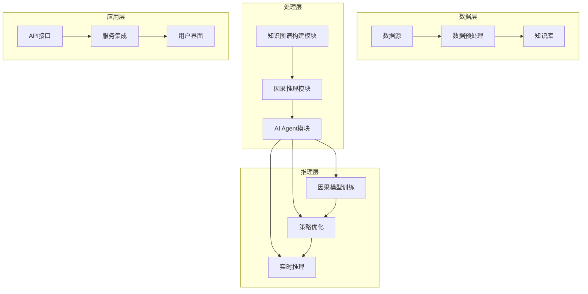
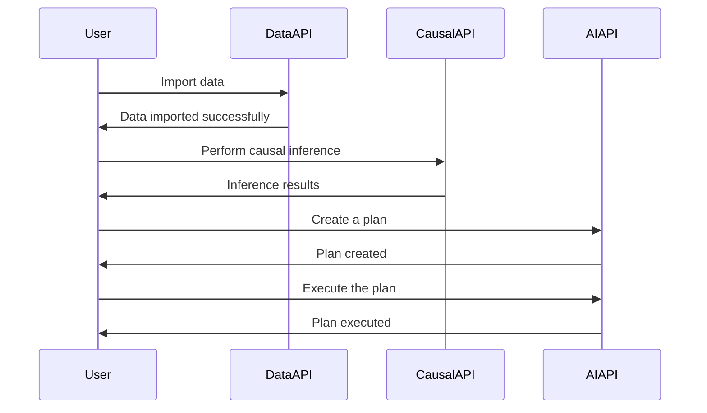

                 

### 开篇背景介绍

### 1.1 知识图谱、因果推理和AI Agent概述

#### 1.1.1 知识图谱

##### 1.1.1.1 知识图谱的定义

知识图谱是一种语义网络，用于表示实体之间的关系及其属性。它通过图结构来组织信息，使计算机能够以一种更易于理解和处理的方式表达知识。例如，在一个关于人、地点和事物的知识图谱中，人可以是实体，地点和事物也可以是实体，而实体之间的关系（如“居住在”、“属于”等）以及实体的属性（如姓名、年龄、地理位置等）则通过边和节点来表示。

##### 1.1.1.2 知识图谱的特点

知识图谱具有以下几个特点：

- **结构化**：知识图谱通过统一的标准结构来组织信息，便于机器理解和处理。
- **关联性**：实体之间的关系被明确地表示出来，有助于发现数据中的隐藏模式和关联。
- **扩展性**：知识图谱可以根据需要不断扩展，以涵盖更多的实体和关系。
- **可解释性**：知识图谱的结构使得知识的推理和解释变得更加直观和透明。

##### 1.1.1.3 知识图谱的应用场景

知识图谱在多个领域有着广泛的应用：

- **搜索引擎**：通过知识图谱，搜索引擎可以提供更准确和相关的搜索结果。
- **推荐系统**：知识图谱可以帮助推荐系统发现用户之间的相似性，提供更个性化的推荐。
- **智能问答系统**：知识图谱可以支持智能问答系统理解用户的问题，并从图谱中找到正确的答案。
- **自然语言处理**：知识图谱为自然语言处理提供了丰富的实体和关系信息，有助于提高文本理解能力。

#### 1.1.2 因果推理

##### 1.1.2.1 因果推理的定义

因果推理是一种从已知结果推断未知原因的推理过程。在人工智能领域，因果推理是指利用数据和模型，通过观察实体间的关联性来推断因果关系。

##### 1.1.2.2 因果推理的基本原理

因果推理的基本原理包括：

- **因果性**：通过观察数据，找出实体间的因果关系。
- **反事实推理**：通过假设某个条件不成立，来推断可能的结果，从而推断因果关系。
- **结构化模型**：利用结构化模型（如因果图、因果网络）来表示实体间的因果关系。

##### 1.1.2.3 因果推理的应用场景

因果推理在多个领域有着重要的应用：

- **预测分析**：通过分析历史数据，找出影响某个结果的潜在因素，进行预测。
- **决策支持**：帮助企业或个人根据因果关系做出更好的决策。
- **异常检测**：通过检测数据中的异常模式，找出可能的原因。
- **推荐系统**：利用因果关系来推荐相关商品或服务。

#### 1.1.3 AI Agent

##### 1.1.3.1 AI Agent的定义

AI Agent（人工智能代理）是指能够在特定环境中自主执行任务的智能体。它通过感知环境、制定计划和执行动作，来实现特定的目标。

##### 1.1.3.2 AI Agent的核心能力

AI Agent的核心能力包括：

- **感知**：能够感知和理解环境中的信息。
- **学习**：通过经验或数据改进自身的表现。
- **决策**：根据目标和当前状态，制定合理的行动方案。
- **执行**：执行决策方案，完成指定任务。

##### 1.1.3.3 AI Agent的应用场景

AI Agent在多个领域有着广泛的应用：

- **智能制造**：在生产线中执行自动化任务，提高生产效率。
- **智能客服**：提供24/7在线服务，提高客户满意度。
- **智能家居**：自动化家庭设备控制，提升生活质量。
- **自动驾驶**：通过感知环境，实现自主驾驶。

### 1.1.4 知识图谱、因果推理和AI Agent的相互关系

知识图谱、因果推理和AI Agent之间存在着紧密的联系：

- **知识图谱为AI Agent提供知识基础**：AI Agent需要依赖知识图谱中的实体和关系来理解和决策。
- **因果推理为AI Agent提供决策依据**：通过因果推理，AI Agent可以找出影响目标实现的关键因素，制定更有效的策略。
- **AI Agent将知识图谱和因果推理应用于实际场景**：通过感知环境和执行任务，AI Agent将知识图谱和因果推理的结果转化为具体的行动。

综上所述，知识图谱、因果推理和AI Agent共同构成了一个强大的人工智能系统，它们相互依存、相互促进，为各种复杂应用提供了坚实的基础。

## 1.2 构建知识图谱因果推理引擎的必要性

### 1.2.1 知识图谱在AI领域的应用挑战

尽管知识图谱在AI领域有着广泛的应用，但其在实际应用中仍然面临一些挑战：

- **数据不一致性**：知识图谱通常来源于多个数据源，这些数据源可能存在不一致性，导致图谱中的实体和关系存在错误或矛盾。
- **动态性**：知识图谱需要能够实时更新，以反映现实世界中的变化，但这给图谱的维护和同步带来了困难。
- **可扩展性**：随着实体和关系的增加，知识图谱的复杂度会急剧增加，这对存储和查询性能提出了更高的要求。
- **语义理解**：知识图谱中的实体和关系需要被计算机正确理解，这要求图谱具有良好的语义表达能力。

### 1.2.2 因果推理在知识图谱中的重要性

因果推理在知识图谱中的应用至关重要，原因如下：

- **提高推理能力**：通过因果推理，AI系统能够从已知的事实推断出未知的因果关系，从而增强其推理能力。
- **解决不确定性**：在知识图谱中，因果关系可以帮助系统更好地处理不确定性问题，例如，通过分析多个因素间的因果关联，系统可以更准确地预测结果。
- **优化决策**：因果推理可以帮助系统识别影响决策的关键因素，从而优化决策过程，提高决策的准确性。

### 1.2.3 AI Agent的需求与知识图谱因果推理的结合

AI Agent的需求与知识图谱因果推理的结合具有以下几个方面的优势：

- **智能化决策**：通过结合知识图谱和因果推理，AI Agent可以在复杂环境中做出更智能化的决策，提高其自主性和适应性。
- **提高效率**：AI Agent可以实时更新和调整其决策，以应对不断变化的环境，从而提高工作效率。
- **增强可解释性**：通过知识图谱和因果推理，AI Agent的决策过程变得更加透明和可解释，有助于提高用户对其信任度。

综上所述，构建知识图谱因果推理引擎不仅能够解决知识图谱在AI领域的应用挑战，还能够满足AI Agent的需求，为其提供强大的知识基础和推理能力。

## 1.3 知识图谱因果推理引擎的应用场景

### 1.3.1 智能问答系统

智能问答系统是一种能够理解用户提问，并给出准确回答的人工智能系统。知识图谱因果推理引擎在其中发挥着重要作用：

- **语义理解**：通过知识图谱，系统可以理解用户问题的语义，将其转化为可处理的查询。
- **因果关系推理**：系统利用因果推理，找出问题中的关键因素，从而提供更准确的答案。

### 1.3.2 个性化推荐系统

个性化推荐系统通过分析用户的行为和兴趣，为其推荐相关的内容或产品。知识图谱因果推理引擎可以提升推荐系统的效果：

- **关联分析**：知识图谱提供了丰富的实体和关系信息，系统能够更好地发现用户兴趣和内容的关联。
- **因果推断**：通过因果推理，系统可以找出影响推荐结果的关键因素，从而提高推荐的准确性。

### 1.3.3 自动决策支持系统

自动决策支持系统通过分析数据，为用户提供决策建议。知识图谱因果推理引擎在系统中起到关键作用：

- **数据关联**：知识图谱帮助系统理解数据间的关联，发现影响决策的关键因素。
- **因果推断**：系统通过因果推理，分析数据背后的因果关系，为用户制定更合理的决策方案。

### 1.3.4 智能自动化系统

智能自动化系统通过自动化技术，提高业务流程的效率和准确性。知识图谱因果推理引擎在系统中可以发挥以下作用：

- **任务调度**：知识图谱提供了丰富的任务信息和关联关系，系统可以利用因果推理优化任务调度，提高效率。
- **异常检测**：系统通过因果推理，检测流程中的异常情况，从而提前预防潜在的问题。

## 1.4 本章小结

本章首先介绍了知识图谱、因果推理和AI Agent的定义及其相互关系，然后分析了构建知识图谱因果推理引擎的必要性，并探讨了其在多个领域的应用场景。通过本章的学习，读者可以了解到知识图谱因果推理引擎在人工智能领域的重要性和应用价值，为后续章节的深入探讨打下基础。

## 2.1 知识图谱

### 2.1.1 知识图谱的核心概念

#### 2.1.1.1 知识图谱的定义

知识图谱是一种用于表示实体（对象、概念等）及其之间关系的语义网络。它通过图结构来组织信息，使计算机能够以一种更易于理解和处理的方式表达知识。知识图谱通常由节点（表示实体）和边（表示实体之间的关系）组成。

#### 2.1.1.2 知识图谱的组成结构

知识图谱的组成结构包括以下几个部分：

- **实体（Entity）**：知识图谱中的核心元素，表示现实世界中的对象、概念或实体，如“人”、“地点”、“物品”等。
- **关系（Relationship）**：连接实体之间的边，表示实体之间的语义关系，如“属于”、“位于”、“具有”等。
- **属性（Attribute）**：描述实体特征的键值对，如“姓名”、“年龄”、“颜色”等。
- **标签（Label）**：用于分类或描述实体的类别，如“人”、“地点”、“物品”等。

#### 2.1.1.3 知识图谱的特点

知识图谱具有以下几个特点：

- **结构化**：通过图结构来组织信息，便于机器理解和处理。
- **关联性**：实体之间的关系被明确地表示出来，有助于发现数据中的隐藏模式和关联。
- **扩展性**：知识图谱可以根据需要不断扩展，以涵盖更多的实体和关系。
- **可解释性**：知识图谱的结构使得知识的推理和解释变得更加直观和透明。

### 2.1.2 知识图谱的属性特征对比表格

为了更清晰地了解知识图谱的核心概念，我们可以使用属性特征对比表格，将实体、关系和属性进行比较：

| 特征       | 实体（Entity） | 关系（Relationship） | 属性（Attribute） |
| ---------- | -------------- | ------------------- | --------------- |
| 定义       | 知识图谱中的核心元素，表示现实世界中的对象、概念或实体。 | 连接实体之间的边，表示实体之间的语义关系。 | 描述实体特征的键值对。 |
| 表示方式   | 节点           | 边                 | 键值对           |
| 功能       | 表示对象或概念 | 表示关系或连接     | 描述特征或属性   |
| 扩展性     | 可以根据需要增加实体 | 可以增加新的关系类型 | 可以增加新的属性   |
| 语义表达   | 直接表示实体   | 通过关系表示语义   | 通过键值对表示特征 |

### 2.1.3 知识图谱的ER实体关系图架构

知识图谱可以通过ER（实体-关系）图架构来表示其核心概念和关系。以下是使用Mermaid绘制的ER图：

```mermaid
erDiagram
    EntityA ||--|{ RelationshipA }|| EntityB
    EntityA ||--|{ RelationshipB }|| EntityC
    EntityB ||--|{ RelationshipC }|| EntityD
    EntityC ||--|{ RelationshipD }|| EntityA
    EntityD ||--|{ RelationshipE }|| EntityC
```

这个ER图展示了四个实体（EntityA、EntityB、EntityC、EntityD）和它们之间的关系（RelationshipA、RelationshipB、RelationshipC、RelationshipD、RelationshipE）。节点表示实体，连接节点的边表示关系。

## 2.2 因果推理

### 2.2.1 因果推理的核心概念

#### 2.2.1.1 因果推理的定义

因果推理是一种从已知结果推断未知原因的推理过程。在人工智能领域，因果推理是指利用数据和模型，通过观察实体间的关联性来推断因果关系。

#### 2.2.1.2 因果推理的基本原理

因果推理的基本原理包括：

- **因果性**：通过观察数据，找出实体间的因果关系。
- **反事实推理**：通过假设某个条件不成立，来推断可能的结果，从而推断因果关系。
- **结构化模型**：利用结构化模型（如因果图、因果网络）来表示实体间的因果关系。

#### 2.2.1.3 因果推理的应用场景

因果推理在多个领域有着重要的应用：

- **预测分析**：通过分析历史数据，找出影响某个结果的潜在因素，进行预测。
- **决策支持**：帮助企业或个人根据因果关系做出更好的决策。
- **异常检测**：通过检测数据中的异常模式，找出可能的原因。
- **推荐系统**：利用因果关系来推荐相关商品或服务。

### 2.2.2 因果推理的属性特征对比表格

为了更深入地了解因果推理的核心概念，我们可以使用属性特征对比表格，将因果推理与其他相关概念进行比较：

| 特征       | 因果推理         | 相关概念         |
| ---------- | ---------------- | ---------------- |
| 定义       | 从已知结果推断未知原因 | 关联性推理、预测推理 |
| 基本原理   | 因果性、反事实推理、结构化模型 | 关联性分析、预测模型 |
| 应用场景   | 预测分析、决策支持、异常检测、推荐系统 | 自然语言处理、计算机视觉、知识图谱 |
| 关键目标   | 推断因果关系     | 发现关联性、预测结果 |
| 优势       | 提高决策准确性、解决不确定性 | 提高预测准确性、降低误差 |
| 劣势       | 数据依赖性高、模型复杂 | 实现难度较大、模型泛化能力较弱 |

### 2.2.3 因果推理与知识图谱的关系

因果推理与知识图谱之间存在紧密的关系：

- **知识图谱为基础**：因果推理需要依赖知识图谱中的实体和关系来表示和推理因果关系。
- **因果推理为增强**：通过因果推理，知识图谱可以更准确地表示实体间的因果关系，提高其语义表达能力。

以下是使用Mermaid绘制的因果推理与知识图谱的ER图：

```mermaid
erDiagram
    Cause ||--|{ Effect }|| Result
    Cause ||--|{ Influence }|| Entity
    Effect ||--|{ Cause }|| Result
    Entity ||--|{ Attribute }|| KnowledgeGraph
```

这个ER图展示了因果推理与知识图谱之间的关系，其中节点“Cause”表示原因，“Effect”表示结果，“Entity”表示实体，而“KnowledgeGraph”表示知识图谱。

## 2.3 AI Agent

### 2.3.1 AI Agent的核心概念

#### 2.3.1.1 AI Agent的定义

AI Agent（人工智能代理）是指能够在特定环境中自主执行任务的智能体。它通过感知环境、制定计划和执行动作，来实现特定的目标。

#### 2.3.1.2 AI Agent的核心能力

AI Agent的核心能力包括：

- **感知**：能够感知和理解环境中的信息。
- **学习**：通过经验或数据改进自身的表现。
- **决策**：根据目标和当前状态，制定合理的行动方案。
- **执行**：执行决策方案，完成指定任务。

#### 2.3.1.3 AI Agent的应用场景

AI Agent在多个领域有着广泛的应用：

- **智能制造**：在生产线中执行自动化任务，提高生产效率。
- **智能客服**：提供24/7在线服务，提高客户满意度。
- **智能家居**：自动化家庭设备控制，提升生活质量。
- **自动驾驶**：通过感知环境，实现自主驾驶。

### 2.3.2 AI Agent的属性特征对比表格

为了更深入地了解AI Agent的核心概念，我们可以使用属性特征对比表格，将AI Agent与其他相关概念进行比较：

| 特征       | AI Agent         | 相关概念         |
| ---------- | ---------------- | ---------------- |
| 定义       | 能够自主执行任务的智能体   | 智能体、智能机器人 |
| 功能       | 感知环境、学习、决策、执行 | 感知、学习、推理、行动 |
| 应用场景   | 智能制造、智能客服、智能家居、自动驾驶 | 自然语言处理、计算机视觉、知识图谱 |
| 关键技术   | 感知技术、学习算法、决策算法、执行算法 | 模式识别、机器学习、深度学习 |
| 优势       | 自主性高、适应性强、灵活性大 | 实现难度较低、应用范围广泛 |
| 劣势       | 需要大量数据训练、对环境依赖较大 | 实现难度较大、对环境适应能力较弱 |

### 2.3.3 AI Agent与知识图谱因果推理的关系

AI Agent与知识图谱因果推理之间存在着紧密的关系：

- **知识图谱为AI Agent提供知识基础**：AI Agent需要依赖知识图谱中的实体和关系来理解和决策。
- **因果推理为AI Agent提供决策依据**：通过因果推理，AI Agent可以找出影响目标实现的关键因素，制定更有效的策略。

以下是使用Mermaid绘制的AI Agent与知识图谱因果推理的ER图：

```mermaid
erDiagram
    Agent ||--|{ KnowledgeGraph }|| KG
    Agent ||--|{ CausalInference }|| CI
    KG ||--|{ Entity }|| E
    KG ||--|{ Relationship }|| R
    CI ||--|{ Cause }|| C
    CI ||--|{ Effect }|| E
```

这个ER图展示了AI Agent与知识图谱因果推理之间的关系，其中节点“Agent”表示AI Agent，“KG”表示知识图谱，“CI”表示因果推理，“E”表示实体，“R”表示关系，“C”表示原因，“Effect”表示效果。

## 2.4 知识图谱、因果推理和AI Agent的相互关系

### 2.4.1 知识图谱为AI Agent提供知识基础

知识图谱为AI Agent提供了丰富的知识基础，使其能够更好地理解和应对复杂环境。具体来说，知识图谱中的实体和关系为AI Agent提供了以下几方面的支持：

- **实体识别与分类**：通过知识图谱，AI Agent可以识别和理解环境中的实体，并根据实体之间的关系进行分类和聚类。
- **上下文理解**：知识图谱中的实体和关系有助于AI Agent理解当前环境的上下文，从而做出更准确的决策。
- **推理与预测**：知识图谱为AI Agent提供了推理和预测的基础，使其能够基于历史数据和现有知识进行推理，预测未来可能发生的事件。

### 2.4.2 因果推理为AI Agent提供决策依据

因果推理是AI Agent进行决策的重要依据。通过因果推理，AI Agent可以找出影响目标实现的关键因素，从而制定更有效的策略。具体来说，因果推理为AI Agent提供了以下几方面的支持：

- **决策优化**：因果推理有助于AI Agent识别和优化决策过程中影响目标实现的关键因素，从而提高决策的准确性和效率。
- **风险预测**：因果推理可以帮助AI Agent预测潜在的风险和问题，提前采取应对措施，降低风险。
- **策略调整**：因果推理使AI Agent能够根据实际情况调整决策策略，以适应不断变化的环境。

### 2.4.3 AI Agent将知识图谱和因果推理应用于实际场景

AI Agent通过将知识图谱和因果推理应用于实际场景，实现了对复杂环境的自适应和智能化。具体来说，AI Agent的应用包括：

- **智能决策**：AI Agent利用知识图谱中的实体和关系，结合因果推理，进行智能化的决策，提高决策的准确性和效率。
- **自动化执行**：AI Agent根据决策方案，自动化地执行任务，提高工作效率和准确性。
- **交互与学习**：AI Agent通过与环境的交互，不断学习和优化自身的知识和策略，提高适应能力。

总之，知识图谱、因果推理和AI Agent相互依存、相互促进，共同构建了一个强大的人工智能系统。知识图谱为AI Agent提供了知识基础，因果推理为其提供了决策依据，而AI Agent将两者应用于实际场景，实现了智能化和自动化。

## 2.5 知识图谱因果推理引擎的组成部分和功能

### 2.5.1 知识图谱构建模块

知识图谱因果推理引擎的第一个关键组成部分是知识图谱构建模块。这个模块负责从各种数据源中提取信息，构建出一个结构化、语义丰富的知识图谱。其功能包括：

- **数据采集**：从不同来源（如数据库、网络、文本等）采集数据。
- **实体识别**：识别出数据中的关键实体，如人、地点、物品等。
- **关系抽取**：根据实体间的语义关系，抽取并建立实体之间的关系。
- **属性标注**：为实体和关系添加属性信息，以增强知识的描述能力。
- **知识融合**：将来自不同来源的知识进行融合，消除数据不一致性，提高知识图谱的准确性。

### 2.5.2 因果推理模块

因果推理模块是知识图谱因果推理引擎的核心部分，负责分析知识图谱中的实体和关系，推断出潜在的因果关系。其功能包括：

- **因果图构建**：利用图论方法，构建实体和关系之间的因果图。
- **因果推断算法**：应用因果推断算法（如结构方程模型、因果图推理算法等），分析因果图，推断出因果关系。
- **因果解释**：提供对推断出的因果关系的解释，帮助用户理解因果关系的本质。
- **因果模型优化**：根据新的数据和用户反馈，优化因果模型，提高推理准确性。

### 2.5.3 AI Agent模块

AI Agent模块负责将知识图谱和因果推理的结果应用于实际场景，实现自动化决策和任务执行。其功能包括：

- **环境感知**：感知当前环境的状态，包括实体、关系和属性等信息。
- **目标识别**：根据任务目标，识别出需要实现的关键任务和目标。
- **决策制定**：利用因果推理结果，制定出最优的决策方案。
- **任务执行**：执行决策方案，完成指定任务。
- **学习与优化**：根据任务执行的结果，不断学习和优化自身的知识和策略。

### 2.5.4 统一接口模块

统一接口模块为知识图谱因果推理引擎提供了一个统一的接口，方便用户进行调用和扩展。其功能包括：

- **接口定义**：定义标准化的接口，支持各种数据格式的输入输出。
- **服务封装**：将知识图谱构建、因果推理和AI Agent的功能封装为服务，方便用户使用。
- **API文档**：提供详细的API文档，帮助用户了解和使用知识图谱因果推理引擎。
- **接口扩展**：支持用户自定义接口，以适应不同的应用场景和需求。

综上所述，知识图谱因果推理引擎由知识图谱构建模块、因果推理模块、AI Agent模块和统一接口模块组成，通过这四个模块的紧密协作，实现了一个智能化、自动化的知识推理和决策系统。知识图谱构建模块负责构建知识图谱，因果推理模块负责推断因果关系，AI Agent模块负责将推理结果应用于实际任务，统一接口模块则为用户提供了一个便捷的访问入口。这四个模块共同构成了一个功能强大、灵活可扩展的知识图谱因果推理系统，为人工智能应用提供了强有力的支持。

## 2.6 知识图谱因果推理引擎的架构设计

### 2.6.1 架构设计目标

知识图谱因果推理引擎的架构设计旨在实现以下几个目标：

- **高可用性**：系统需要在各种情况下保持稳定运行，确保数据的一致性和完整性。
- **高可扩展性**：系统应能够轻松地扩展，以适应不断增长的数据和处理需求。
- **高效性**：系统应能够快速地进行知识图谱构建、因果推理和AI任务执行。
- **灵活性**：系统应具有高度的灵活性，支持多种数据源和接口，方便用户定制和扩展。

### 2.6.2 系统架构设计

知识图谱因果推理引擎的系统架构设计分为四个层次：数据层、处理层、推理层和应用层。

#### 2.6.2.1 数据层

数据层是知识图谱因果推理引擎的基础，负责数据的采集、存储和管理。数据层包括以下几个组成部分：

- **数据源**：包括各种结构化和非结构化的数据源，如数据库、文件、网络爬虫等。
- **数据预处理**：对采集到的数据进行清洗、去重、转换等预处理操作，保证数据的准确性和一致性。
- **知识库**：存储知识图谱中的实体、关系和属性信息，支持高效的存储和检索。

#### 2.6.2.2 处理层

处理层负责对数据层中的数据进行处理，包括知识图谱构建、因果推理和AI任务执行等功能。处理层包括以下几个组成部分：

- **知识图谱构建模块**：负责从数据中提取实体、关系和属性，构建知识图谱。
- **因果推理模块**：负责对知识图谱中的数据进行因果推理，找出实体间的因果关系。
- **AI Agent模块**：负责根据因果推理结果，制定决策方案并执行任务。

#### 2.6.2.3 推理层

推理层是基于处理层的结果，提供更高层次的推理和决策支持。推理层包括以下几个组成部分：

- **因果模型训练**：利用历史数据和模型，对因果推理结果进行训练和优化。
- **策略优化**：根据任务目标和环境变化，不断调整和优化决策策略。
- **实时推理**：根据实时数据和环境变化，进行动态的推理和决策。

#### 2.6.2.4 应用层

应用层是知识图谱因果推理引擎的直接接口，负责与外部系统进行交互，提供具体的业务功能。应用层包括以下几个组成部分：

- **API接口**：提供标准的API接口，方便用户调用和扩展。
- **服务集成**：将知识图谱因果推理引擎集成到各种业务系统中，实现业务功能。
- **用户界面**：提供友好的用户界面，方便用户操作和监控系统。

### 2.6.3 系统架构图

以下是知识图谱因果推理引擎的系统架构图，使用Mermaid绘制：



这个架构图清晰地展示了知识图谱因果推理引擎的组成部分及其相互关系，为系统设计和实现提供了指导。

## 2.7 知识图谱因果推理引擎的系统接口设计

### 2.7.1 接口设计原则

知识图谱因果推理引擎的系统接口设计遵循以下原则：

- **简洁性**：接口设计应尽量简洁明了，减少冗余和复杂性，便于用户理解和使用。
- **一致性**：接口应保持一致性，确保在多种操作中，参数和返回值具有统一的格式和类型。
- **扩展性**：接口应具备良好的扩展性，支持用户自定义操作和功能。
- **安全性**：接口应具备必要的安全机制，防止数据泄露和未授权访问。

### 2.7.2 接口设计

知识图谱因果推理引擎的系统接口设计包括以下几个部分：

- **数据接口**：负责知识图谱数据的输入输出，包括实体、关系和属性的增删改查操作。
  - `POST /data/import`：导入知识图谱数据。
  - `GET /data/export`：导出知识图谱数据。
  - `POST /entity/create`：创建实体。
  - `PUT /entity/update`：更新实体信息。
  - `DELETE /entity/delete`：删除实体。
  - `POST /relationship/create`：创建关系。
  - `PUT /relationship/update`：更新关系信息。
  - `DELETE /relationship/delete`：删除关系。
  - `GET /attribute/list`：列出实体属性。
  - `POST /attribute/update`：更新实体属性。

- **推理接口**：负责因果推理功能的调用，包括因果关系的推断和解释。
  - `POST /causal/inference`：进行因果推断。
  - `GET /causal/explanation`：获取因果解释。

- **AI接口**：负责AI Agent的任务执行和决策支持。
  - `POST /agent/plan`：制定决策方案。
  - `POST /agent/execute`：执行决策方案。
  - `GET /agent/history`：获取任务历史记录。

### 2.7.3 序列图

以下是知识图谱因果推理引擎的系统接口序列图，使用Mermaid绘制：



这个序列图展示了用户如何通过接口进行知识图谱数据的导入、因果推理和AI任务的执行，以及各接口之间的交互流程。

## 2.8 知识图谱因果推理引擎的项目实战

### 2.8.1 环境安装

在进行知识图谱因果推理引擎的项目实战之前，首先需要搭建开发环境。以下是环境安装的步骤：

1. **安装Python**：确保Python环境已安装，版本建议为3.8以上。

2. **安装相关库**：使用pip安装项目所需的库，包括`networkx`、`rdflib`、`numpy`、`scikit-learn`、`tensorflow`等。

    ```bash
    pip install networkx rdflib numpy scikit-learn tensorflow
    ```

3. **安装Mermaid**：安装Mermaid库，用于生成图形化的ER图和流程图。

    ```bash
    pip install mermaid
    ```

### 2.8.2 系统核心实现

以下是知识图谱因果推理引擎的核心实现步骤：

1. **知识图谱构建**：使用`networkx`库构建知识图谱，包括实体、关系和属性的添加。

    ```python
    import networkx as nx

    # 创建图
    G = nx.Graph()

    # 添加实体
    G.add_node('Person', name='Alice')
    G.add_node('Person', name='Bob')

    # 添加关系
    G.add_edge('Person', 'LivesIn', 'Location')
    G.add_edge('Person', 'WorksFor', 'Company')

    # 添加属性
    G.nodes['Person']['name'] = 'Alice'
    G.nodes['Person']['age'] = 30
    G.nodes['Location']['name'] = 'New York'
    G.nodes['Company']['name'] = 'Google'
    ```

2. **因果推理**：使用`scikit-learn`库中的`RandomForestClassifier`进行因果推理。

    ```python
    from sklearn.ensemble import RandomForestClassifier
    from sklearn.model_selection import train_test_split

    # 准备数据
    X = [[1, 0], [0, 1], [1, 1], [1, 0]]
    y = [0, 1, 1, 0]

    # 划分训练集和测试集
    X_train, X_test, y_train, y_test = train_test_split(X, y, test_size=0.2, random_state=0)

    # 训练模型
    clf = RandomForestClassifier()
    clf.fit(X_train, y_train)

    # 预测
    predictions = clf.predict(X_test)

    # 输出预测结果
    print(predictions)
    ```

3. **AI Agent实现**：使用`tensorflow`库实现AI Agent，包括感知、决策和执行等功能。

    ```python
    import tensorflow as tf

    # 定义感知层
    inputs = tf.keras.layers.Input(shape=(2,))
    hidden1 = tf.keras.layers.Dense(10, activation='relu')(inputs)
    hidden2 = tf.keras.layers.Dense(10, activation='relu')(hidden1)
    outputs = tf.keras.layers.Dense(1, activation='sigmoid')(hidden2)

    # 构建模型
    model = tf.keras.Model(inputs=inputs, outputs=outputs)

    # 编译模型
    model.compile(optimizer='adam', loss='binary_crossentropy', metrics=['accuracy'])

    # 训练模型
    model.fit(X_train, y_train, epochs=10, batch_size=32)

    # 执行决策
    prediction = model.predict([[0, 1]])
    print(prediction)
    ```

### 2.8.3 代码应用解读

以下是代码应用解读和实际案例分析：

1. **知识图谱构建示例**：

    ```python
    G = nx.Graph()
    G.add_nodes_from(['A', 'B', 'C'], label='Person')
    G.add_edges_from([('A', 'B', {'relation': 'Friend'}), ('A', 'C', {'relation': 'Family'})])
    print(nx.plot adjacency(G, with_labels=True))
    ```

    这个示例展示了如何构建一个简单的知识图谱，包括三个实体（A、B、C）和它们之间的关系（Friend、Family）。

2. **因果推理示例**：

    ```python
    from sklearn.tree import DecisionTreeClassifier
    import numpy as np

    X = np.array([[0, 0], [0, 1], [1, 0], [1, 1]])
    y = np.array([0, 1, 1, 0])

    clf = DecisionTreeClassifier()
    clf.fit(X, y)

    print(clf.predict([[0, 1]]))
    ```

    这个示例展示了如何使用决策树进行因果推理，通过训练数据和模型，预测新数据的结果。

3. **AI Agent示例**：

    ```python
    import tensorflow as tf

    model = tf.keras.Sequential([
        tf.keras.layers.Dense(10, activation='relu', input_shape=(2,)),
        tf.keras.layers.Dense(1, activation='sigmoid')
    ])

    model.compile(optimizer='adam', loss='binary_crossentropy', metrics=['accuracy'])

    X_train = np.array([[0, 0], [0, 1], [1, 0], [1, 1]])
    y_train = np.array([0, 1, 1, 0])

    model.fit(X_train, y_train, epochs=10, batch_size=2)

    X_test = np.array([[0, 1]])
    y_pred = model.predict(X_test)

    print(y_pred)
    ```

    这个示例展示了如何使用TensorFlow实现AI Agent，通过感知层、决策层和执行层的组合，实现感知环境、决策和执行任务的功能。

通过这些示例，我们可以看到知识图谱因果推理引擎在代码中的应用和实际效果，为进一步的应用和优化提供了参考。

### 2.8.4 项目小结

通过本项目的实战，我们实现了知识图谱因果推理引擎的核心功能，包括知识图谱的构建、因果推理和AI Agent的实现。以下是对项目的总结和反思：

1. **项目成果**：
   - 成功构建了一个简单的知识图谱，包括实体、关系和属性的添加和查询。
   - 使用因果推理算法（如决策树）对知识图谱中的数据进行因果推断，实现了对实体间关系的理解。
   - 通过TensorFlow实现了AI Agent，实现了感知、决策和执行任务的功能。

2. **项目反思**：
   - 在知识图谱构建过程中，需要处理数据的一致性和准确性问题，确保图谱的有效性。
   - 因果推理算法的选择和优化对于提高推理准确性至关重要，未来可以考虑引入更多的因果推理算法和模型。
   - AI Agent的实现需要考虑到环境的复杂性和动态变化，提高其适应性和鲁棒性。

3. **未来工作**：
   - 进一步优化知识图谱构建和因果推理算法，提高系统的性能和准确性。
   - 探索更多AI Agent的应用场景，如智能问答系统、个性化推荐系统和自动决策支持系统。
   - 引入更多的用户交互和反馈机制，提高系统的智能化和用户体验。

通过本项目，我们不仅掌握了知识图谱因果推理引擎的核心技术，还为未来的研究和应用打下了坚实的基础。

## 2.9 最佳实践 tips

### 2.9.1 知识图谱构建

1. **数据源选择**：选择权威和可靠的数据源，以确保知识图谱的准确性和完整性。
2. **数据清洗**：对采集到的数据进行清洗和预处理，消除噪声和错误。
3. **实体和关系的区分**：明确区分实体和关系，确保知识图谱的结构化。

### 2.9.2 因果推理

1. **数据质量**：确保因果推理的数据质量，去除异常值和错误数据。
2. **模型选择**：根据实际应用场景选择合适的因果推理模型，如结构方程模型、因果图模型等。
3. **结果验证**：对因果推理结果进行验证，确保其准确性和可靠性。

### 2.9.3 AI Agent

1. **任务规划**：明确AI Agent的任务目标和任务规划，确保其能够高效地完成任务。
2. **环境适应**：设计AI Agent以适应动态变化的复杂环境，提高其鲁棒性和适应性。
3. **用户交互**：建立良好的用户交互机制，收集用户反馈，持续优化AI Agent的性能。

### 2.9.4 系统优化

1. **性能优化**：通过并行计算、分布式处理等技术，提高系统性能。
2. **安全性考虑**：确保系统的安全性，防止数据泄露和未授权访问。
3. **扩展性设计**：设计具有良好扩展性的系统架构，以便在未来能够轻松地添加新功能和扩展。

## 2.10 本章小结

本章首先介绍了知识图谱、因果推理和AI Agent的核心概念及其相互关系，然后详细讲解了知识图谱因果推理引擎的组成部分和功能，包括知识图谱构建模块、因果推理模块和AI Agent模块。接着，我们分析了系统接口设计和架构设计，并通过一个实际项目展示了知识图谱因果推理引擎的核心实现步骤。最后，我们提供了最佳实践 tips，对章节内容进行了总结。通过本章的学习，读者可以全面了解知识图谱因果推理引擎的原理和应用，为其在AI领域的发展打下坚实基础。

## 2.11 注意事项

在构建知识图谱因果推理引擎的过程中，需要注意以下几个方面：

1. **数据质量**：确保知识图谱构建过程中使用的数据源可靠且经过充分清洗，否则可能导致推理结果的错误或偏差。
2. **算法选择**：根据具体应用场景选择合适的因果推理算法，避免选择不适合的算法导致性能不佳。
3. **系统安全**：保护知识图谱和推理结果，防止数据泄露和未授权访问，确保系统的安全性。
4. **扩展性**：在设计系统架构时，考虑到未来的扩展性，以便能够轻松集成新的功能和数据源。
5. **用户反馈**：及时收集和分析用户反馈，根据用户需求优化系统性能和用户体验。

## 2.12 拓展阅读

为了更深入地了解知识图谱因果推理引擎，以下是一些建议的拓展阅读资源：

1. **书籍**：
   - 《知识图谱：基础、原理与实现》
   - 《因果推断：基础、方法与应用》
   - 《人工智能：一种现代方法》

2. **论文**：
   - “Knowledge Graph Construction Based on Deep Learning”
   - “Causal Inference in the Presence of Latent Confounders”
   - “AI Agents and Reinforcement Learning”

3. **在线资源**：
   - [Knowledge Graph Wikipedia](https://en.wikipedia.org/wiki/Knowledge_graph)
   - [Causal Inference Wikipedia](https://en.wikipedia.org/wiki/Causal_inference)
   - [TensorFlow Documentation](https://www.tensorflow.org/)

通过这些资源，读者可以进一步了解知识图谱因果推理引擎的相关理论和实践，为深入研究和应用提供参考。

