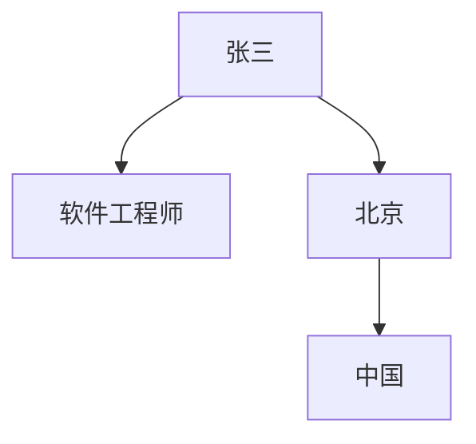
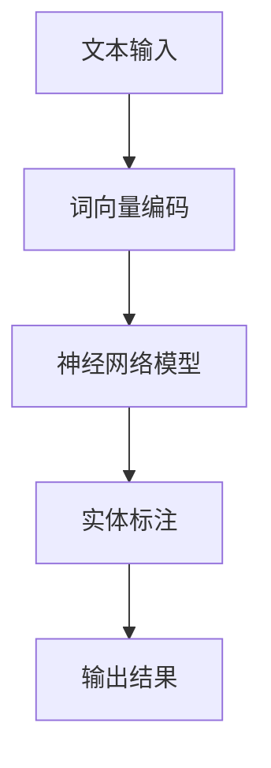
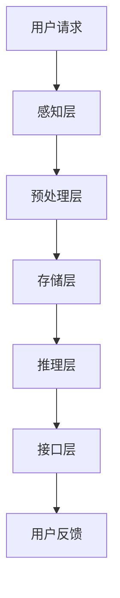

                 

### 第1章: 人工智能与知识图谱概述

### 1.1.1 人工智能的发展历程

人工智能（Artificial Intelligence，简称AI）是计算机科学的一个重要分支，旨在研究、开发用于模拟、延伸和扩展人的智能的理论、方法、技术及应用系统。人工智能的发展历程可以分为几个关键阶段：

1. **早期探索（1950年代）**：
    - **1956年**：达特茅斯会议，被认为是人工智能的诞生点。会议邀请了包括约翰·麦卡锡（John McCarthy）在内的专家，共同探讨人工智能的发展方向。
    - **1950年**：艾伦·图灵（Alan Turing）提出了图灵测试，这是对机器是否具有智能的一种评估方法。

2. **理论奠基（1960-1970年代）**：
    - **1956年**：约翰·麦卡锡提出了“如果一台机器能够通过图灵测试，那么我们就可以认为这台机器具有智能”的观点。
    - **1960年代**：专家系统（Expert Systems）得到发展，这是早期AI应用的一个重要方向，通过模拟人类专家的决策过程来解决特定领域的问题。

3. **第一次AI寒冬（1970-1980年代）**：
    - **1974年**：由于技术难题和资金短缺，AI研究进入低谷期。

4. **复兴与突破（1980-1990年代）**：
    - **1980年代**：知识工程和知识表示方法得到发展，专家系统开始应用于医疗、金融等领域。
    - **1990年代**：机器学习和数据挖掘技术开始兴起，为人工智能的应用提供了新的动力。

5. **快速发展（2000年代至今）**：
    - **2006年**：深度学习的兴起，基于神经网络的模型在图像识别、语音识别等领域取得了突破性进展。
    - **2012年**：AlexNet在ImageNet图像识别挑战赛中取得优异成绩，标志着深度学习时代的到来。

6. **当前趋势**：
    - **AI Agent和知识图谱**：AI Agent是一种能够模拟人类智能行为，进行自主决策和执行的实体。知识图谱作为一种高效的知识表示方法，正在成为人工智能系统的重要组成部分。
    - **跨领域融合**：人工智能正在与大数据、云计算、物联网等领域深度融合，推动各行各业的技术创新。

### 1.1.2 知识图谱的基本概念

知识图谱（Knowledge Graph）是一种用于结构化表示实体及其之间关系的图形化数据模型。它通常包含以下几个关键组成部分：

1. **实体（Entity）**：
    - 实体是知识图谱中的核心对象，可以是人、地点、组织、物品等。例如，在搜索引擎中，每个网页都是一个实体。

2. **关系（Relationship）**：
    - 关系描述实体之间的相互联系。例如，在搜索引擎中，“出版”是一个关系，它连接了一个实体（书籍）与另一个实体（出版社）。

3. **属性（Property）**：
    - 属性是对实体特征的描述。例如，对于实体“张三”，属性可以是“出生日期”或“职业”。

4. **边（Edge）**：
    - 边是知识图谱中的连接线，用于表示实体之间的关系。

知识图谱的核心价值在于其能够提供一种直观、高效的知识表示和推理方式。通过将大量的实体和关系结构化地组织起来，知识图谱使得计算机能够像人类一样理解、推理和交互。

### 1.1.3 知识图谱的应用场景

知识图谱在多个领域都有广泛的应用，以下是一些典型的应用场景：

1. **搜索引擎优化**：
    - 知识图谱能够改善搜索结果的准确性，通过理解用户的查询意图和实体之间的关系，提供更相关的搜索结果。

2. **推荐系统**：
    - 知识图谱可以用于个性化推荐，通过分析用户的历史行为和兴趣，提供更精准的推荐。

3. **自然语言处理**：
    - 知识图谱可以帮助NLP系统更好地理解文本内容，提高问答系统和机器翻译的准确性。

4. **智能问答**：
    - 知识图谱为智能问答系统提供了丰富的知识库，使得系统能够准确回答用户的问题。

5. **数据治理和知识管理**：
    - 知识图谱有助于组织和管理复杂的数据集，提供一种统一的方法来表示和理解数据。

6. **金融行业**：
    - 在金融行业中，知识图谱可以用于风险控制、投资分析和客户服务，提高业务决策的准确性。

7. **医疗保健**：
    - 知识图谱可以帮助医疗系统更好地理解患者的健康状况，提供个性化的治疗方案。

总之，知识图谱作为一种高效的知识表示方法，正在不断拓展其在各个领域的应用，为人工智能的发展提供了强大的支持。在接下来的章节中，我们将进一步探讨知识图谱的基础原理和构建方法。## 第2章: 知识图谱的基础原理

### 2.1.1 知识图谱的组成结构

知识图谱是一种用于表示复杂实体及其之间关系的图形化数据模型。它由三个核心组成部分构成：实体、关系和属性。

#### 2.1.1.1 实体

实体（Entity）是知识图谱中的核心对象，它代表现实世界中的具体事物。实体可以是人、地点、组织、物品等任何具有独立存在意义的事物。例如，在一个关于电影的知识图谱中，电影、演员、导演、制片公司等都可以是实体。

**实体属性特征对比表格：**

| 实体类型 | 描述 | 属性示例 |
| --- | --- | --- |
| 人 | 代表个人 | 姓名、年龄、性别 |
| 地点 | 代表地理位置 | 城市、国家、经纬度 |
| 组织 | 代表公司、机构 | 名称、成立时间、总部 |
| 物品 | 代表具体物品 | 名称、类型、制造商 |

#### 2.1.1.2 关系

关系（Relationship）描述实体之间的相互联系。在知识图谱中，关系通常用边（Edge）来表示。关系可以是简单的“属于”或“位于”，也可以是复杂的“投资”或“合作”。关系可以是一对一的（如“出生地”），一对多的（如“工作于”），或多对多的（如“参演”）。

**关系属性特征对比表格：**

| 关系类型 | 描述 | 属性示例 |
| --- | --- | --- |
| 属于 | 表示实体之间的归属关系 | 部门、国家、组织 |
| 位于 | 表示实体之间的地理位置关系 | 城市、区域、国家 |
| 投资 | 表示实体之间的投资关系 | 投资金额、投资时间、投资领域 |
| 合作 | 表示实体之间的合作关系 | 合作项目、合作时间、合作成果 |

#### 2.1.1.3 属性

属性（Property）是对实体特征的描述。属性可以是对实体的简单补充，如“人的生日”，也可以是复杂的属性，如“物品的价格”。属性通常与实体和关系一起使用，提供更详细的信息。

**属性示例：**

- 实体“张三”：
  - 属性：姓名、性别、生日、职业
- 关系“张三居住在”：
  - 属性：城市、区域、国家

### 2.1.2 知识图谱的表示方法

知识图谱的表示方法主要有RDF模型、图模型和命名实体识别模型。

#### 2.1.2.1 RDF模型

RDF（Resource Description Framework）模型是一种基于Web的数据模型，用于描述实体和它们之间的关系。RDF使用URI（统一资源标识符）来唯一标识实体和属性，使用三元组（Subject, Predicate, Object）来表示实体之间的关系。

**RDF模型示例：**

```
<张三> <出生日期> "1990-01-01"
<张三> <职业> "软件工程师"
<北京> <属于> <中国>
```

#### 2.1.2.2 图模型

图模型是一种基于图论的数据模型，用于表示实体和它们之间的关系。在图模型中，实体被视为节点（Node），关系被视为边（Edge）。图模型可以很好地表示复杂的实体关系和网络结构。

**图模型示例（Mermaid流程图）：**



#### 2.1.2.3 命名实体识别模型

命名实体识别（Named Entity Recognition，简称NER）是一种自然语言处理技术，用于识别文本中的实体。NER模型可以将文本中的实体标注为特定的类型，如人名、地点、组织等。

**NER模型示例（Mermaid流程图）：**



通过以上三种表示方法，知识图谱可以灵活地适应不同的应用场景和数据结构。在接下来的章节中，我们将探讨如何构建AI Agent，以及如何将知识图谱应用于AI Agent的构建中。## 第3章: AI Agent的构建

### 3.1.1 AI Agent的定义

AI Agent（人工智能代理）是一种能够在特定环境中自主感知、决策和执行任务的智能实体。它是一种模拟人类智能行为的计算机程序，具有以下基本特征：

1. **自主性**：AI Agent能够根据环境的变化自主做出决策，而不需要外部干预。
2. **感知能力**：AI Agent能够感知和理解其所在环境的状态，通过传感器收集信息。
3. **决策能力**：AI Agent能够根据感知到的信息，使用算法进行推理和决策。
4. **执行能力**：AI Agent能够执行决策结果，通过执行器进行操作。

### 3.1.2 AI Agent的架构

AI Agent的架构通常包括感知模块、决策模块和执行模块三个核心部分。

#### 3.1.2.1 感知模块

感知模块是AI Agent的感知器官，负责从环境中获取信息。感知模块通常包括以下功能：

- **传感器数据采集**：通过摄像头、麦克风、温度传感器等获取环境信息。
- **环境建模**：将感知到的数据转换为结构化的环境模型，用于后续的决策和执行。
- **数据预处理**：对采集到的数据进行清洗、标准化和特征提取，以便于模型处理。

#### 3.1.2.2 决策模块

决策模块是AI Agent的“大脑”，负责根据感知模块提供的信息和环境模型进行推理和决策。决策模块通常包括以下功能：

- **状态评估**：评估当前环境状态，确定最优行动方案。
- **规划**：根据状态评估结果，生成一系列行动步骤。
- **决策算法**：使用机器学习算法或搜索算法，从多个可能的行动方案中选择最优的方案。

#### 3.1.2.3 执行模块

执行模块是AI Agent的执行器，负责执行决策模块生成的行动步骤。执行模块通常包括以下功能：

- **行动执行**：根据决策结果，执行具体的操作，如移动、发送消息等。
- **反馈循环**：将执行结果反馈给感知模块和决策模块，用于调整后续的行动方案。

### 3.1.3 AI Agent的应用场景

AI Agent在多个领域都有广泛的应用，以下是一些典型的应用场景：

1. **智能机器人**：在工业生产、家庭服务、医疗护理等领域，AI Agent可以通过自主感知和决策，实现自动化操作。
2. **自动驾驶**：AI Agent可以用于自动驾驶汽车，通过实时感知道路环境和车辆状态，进行智能驾驶。
3. **智能家居**：AI Agent可以用于智能家居系统，通过感知用户行为和环境变化，提供个性化服务和安全保障。
4. **智能客服**：AI Agent可以用于智能客服系统，通过自然语言处理和决策，提供实时、个性化的客户服务。
5. **智能推荐系统**：AI Agent可以用于智能推荐系统，通过分析用户行为和偏好，提供个性化的商品、内容推荐。

通过感知模块、决策模块和执行模块的协同工作，AI Agent能够实现自主决策和执行，为各行各业带来创新和变革。在接下来的章节中，我们将深入探讨如何构建知识图谱推理引擎，并优化其性能。## 第4章: 知识图谱推理引擎的构建

### 4.1.1 推理引擎的基本原理

知识图谱推理引擎是一种用于在知识图谱中提取隐含关系的工具，它通过对实体和关系进行推理，帮助用户发现新的知识。推理引擎的基本原理可以概括为以下几个步骤：

1. **数据预处理**：首先，需要对知识图谱进行预处理，包括数据清洗、去重、规范化等操作，以确保数据的准确性和一致性。
2. **构建索引**：为了提高查询效率，需要为知识图谱构建索引。常见的索引类型包括倒排索引、B+树索引等。
3. **推理算法**：推理引擎的核心是推理算法，它根据给定的规则或模式，对知识图谱中的实体和关系进行推理。常用的推理算法包括基于规则的推理、图论算法、概率推理等。
4. **结果评估**：推理完成后，需要对推理结果进行评估，以确定其准确性和可靠性。评估方法包括精确度、召回率、F1分数等。

### 4.1.2 数据预处理

数据预处理是构建知识图谱推理引擎的重要步骤，它包括以下几个环节：

1. **数据清洗**：清洗原始数据，去除无效、重复或错误的数据。例如，去除空值、修正错别字、统一数据格式等。
2. **去重**：识别和去除重复的实体和关系。可以通过哈希函数或相似度计算来实现。
3. **规范化**：将数据转换为统一的标准格式，以便于后续处理。例如，统一编码、统一日期格式等。
4. **特征提取**：从原始数据中提取关键特征，用于构建索引和模型。特征提取的方法包括词频统计、文本分类、关键词提取等。

### 4.1.3 推理算法

推理算法是知识图谱推理引擎的核心，它决定了推理引擎的性能和效率。以下是一些常用的推理算法：

1. **基于规则的推理**：
    - 基于规则的推理（Rule-Based Reasoning）是一种传统的推理方法，它通过定义一组规则来推导新的知识。规则通常表示为“如果...那么...”的形式。
    - 优点：简单、直观，易于理解和实现。
    - 缺点：规则难以覆盖所有情况，推理效率较低。

2. **图论算法**：
    - 图论算法（Graph Theory Algorithms）利用图论中的概念和方法来推理知识图谱中的关系。常见的算法包括深度优先搜索（DFS）、广度优先搜索（BFS）等。
    - 优点：能够高效地处理复杂的实体关系。
    - 缺点：对图的结构和规模有较高要求，算法复杂度较高。

3. **概率推理**：
    - 概率推理（Probabilistic Reasoning）利用概率论的方法来推理知识图谱中的关系。常见的算法包括贝叶斯网络、马尔可夫网络等。
    - 优点：能够处理不确定性和不确定性推理。
    - 缺点：计算复杂度较高，对数据质量要求较高。

4. **深度学习算法**：
    - 深度学习算法（Deep Learning Algorithms）利用神经网络模型来推理知识图谱中的关系。常见的算法包括图神经网络（Graph Neural Networks，GNN）、 transformers等。
    - 优点：能够处理复杂的实体关系和大规模数据。
    - 缺点：算法复杂度较高，对计算资源要求较高。

### 4.1.4 知识图谱推理引擎的设计

构建知识图谱推理引擎需要综合考虑系统架构、接口设计、数据存储等方面。以下是一个基本的系统设计方案：

#### 系统架构设计

知识图谱推理引擎的系统架构通常包括以下几个层次：

1. **感知层**：负责从外部获取数据，如文本、图像、传感器数据等。
2. **预处理层**：负责对数据进行清洗、去重、规范化等预处理操作。
3. **存储层**：负责存储和处理知识图谱数据，通常采用图数据库或关系数据库。
4. **推理层**：负责执行推理算法，提取新的知识。
5. **接口层**：负责提供对外接口，如API接口、Web界面等。

#### 接口设计

知识图谱推理引擎的接口设计需要考虑以下方面：

1. **API接口**：提供RESTful API接口，支持HTTP请求，方便外部系统进行调用。
2. **Web界面**：提供一个友好的Web界面，方便用户进行交互和查询。
3. **SDK封装**：提供SDK封装，方便开发者在自己的应用程序中集成知识图谱推理功能。

#### 数据存储设计

知识图谱推理引擎的数据存储设计需要考虑以下方面：

1. **图数据库**：采用图数据库来存储知识图谱数据，如Neo4j、OrientDB等。图数据库具有高效的图遍历和查询性能。
2. **关系数据库**：对于部分结构化数据，可以采用关系数据库来存储，如MySQL、PostgreSQL等。
3. **分布式存储**：对于大规模数据，可以考虑采用分布式存储方案，如Hadoop、Spark等。

通过以上的系统设计，知识图谱推理引擎能够高效、准确地处理复杂的数据关系，为人工智能应用提供强大的支持。在接下来的章节中，我们将深入探讨如何优化知识图谱推理引擎的性能。## 第5章: 推理效率优化

### 5.1.1 算法优化

推理效率的优化是提升知识图谱推理引擎性能的关键。算法优化可以从以下几个方面进行：

#### 5.1.1.1 常用推理算法比较

在知识图谱推理中，常用的算法包括基于规则的推理、图论算法和深度学习算法。以下是比较：

1. **基于规则的推理**：
    - 优点：简单、直观，易于实现和理解。
    - 缺点：难以覆盖复杂的关系和大规模数据，效率较低。
2. **图论算法**：
    - 优点：能够处理复杂的实体关系，效率较高。
    - 缺点：对图的结构和规模有较高要求，算法复杂度较高。
3. **深度学习算法**：
    - 优点：能够处理复杂的实体关系和大规模数据，效率较高。
    - 缺点：算法复杂度较高，对计算资源要求较高。

#### 5.1.1.2 算法调优

针对不同的应用场景和数据规模，可以选择合适的算法，并进行调优。以下是一些常见的调优方法：

1. **规则优化**：
    - 减少冗余规则：删除重复的规则，减少计算量。
    - 规则排序：根据规则的频率和重要性进行排序，优先执行高频率和重要的规则。
2. **图论算法优化**：
    - 使用更高效的图遍历算法，如深度优先搜索（DFS）和广度优先搜索（BFS）。
    - 缩减图规模：通过预处理，删除无用的节点和边，降低图的复杂度。
3. **深度学习算法优化**：
    - 参数调优：调整神经网络模型的参数，如学习率、隐藏层大小等，以获得更好的性能。
    - 模型压缩：使用模型压缩技术，如权重共享、剪枝等，减少模型大小和计算量。

### 5.1.2 系统优化

除了算法优化，系统优化也是提升推理效率的重要手段。以下是一些常见的系统优化方法：

#### 5.1.2.1 并行计算

并行计算可以将推理任务分配到多个处理器或计算节点上，以提升计算效率。以下是一些并行计算的方法：

1. **任务分解**：将大规模的推理任务分解为多个小任务，分配到不同的处理器或计算节点上并行执行。
2. **数据并行**：将知识图谱数据分配到不同的处理器或计算节点上，分别进行局部推理，然后再合并结果。
3. **模型并行**：将深度学习模型的计算过程分解为多个部分，分别在不同的处理器或计算节点上执行。

#### 5.1.2.2 内存优化

内存优化可以减少内存消耗，提高系统性能。以下是一些内存优化方法：

1. **数据压缩**：使用数据压缩算法，如LZ77、LZ78等，减少存储和传输的数据量。
2. **内存池**：使用内存池技术，预先分配一定大小的内存块，避免频繁的内存分配和释放操作。
3. **缓存优化**：优化缓存策略，提高缓存命中率，减少内存访问次数。

#### 5.1.2.3 网络优化

网络优化可以减少网络延迟和数据传输量，提高系统性能。以下是一些网络优化方法：

1. **数据去重**：在网络传输前，对数据进行去重处理，减少重复数据传输。
2. **数据压缩**：使用网络数据压缩算法，如HTTP压缩、Gzip等，减少网络传输的数据量。
3. **缓存机制**：在网络边缘部署缓存服务器，减少对中央服务器的访问次数。

通过算法优化和系统优化，知识图谱推理引擎可以显著提高推理效率和性能。在接下来的章节中，我们将探讨如何提升推理准确性。## 第6章: 推理准确性优化

### 6.1.1 知识图谱质量提升

提升知识图谱的准确性是优化推理结果的关键。以下是一些常见的提升方法：

#### 6.1.1.1 数据清洗

数据清洗是确保知识图谱准确性的第一步。数据清洗包括以下几个环节：

1. **去除噪声数据**：识别和删除含有噪声或错误的信息，如缺失值、重复值、异常值等。
2. **数据规范化**：统一不同来源的数据格式，如日期格式、编码格式等，以提高数据的一致性。
3. **数据校验**：对数据进行校验，如检查实体是否唯一、关系是否合理等。

#### 6.1.1.2 实体匹配

实体匹配是识别和关联不同来源中的相同实体的过程。以下是一些常见的实体匹配方法：

1. **基于特征的匹配**：使用实体特征（如名称、属性值等）进行匹配，如基于距离度量的字符串匹配算法（如Levenshtein距离）。
2. **基于规则的匹配**：使用预定义的规则进行匹配，如相同名称、相同属性值等。
3. **基于机器学习的匹配**：使用机器学习算法（如监督学习、无监督学习等）进行匹配，提高匹配的准确性。

#### 6.1.1.3 关系提取

关系提取是从文本数据中识别出实体之间关系的任务。以下是一些常见的关系提取方法：

1. **基于规则的方法**：使用预定义的规则从文本中提取关系，如主谓宾结构、固定搭配等。
2. **基于统计的方法**：使用统计方法（如条件概率、朴素贝叶斯等）从文本中提取关系。
3. **基于机器学习的方法**：使用机器学习算法（如支持向量机、随机森林等）从文本中提取关系。

### 6.1.2 算法准确性优化

除了提升知识图谱质量，算法准确性也是影响推理结果的重要因素。以下是一些算法准确性优化的方法：

#### 6.1.2.1 常用算法改进

1. **基于规则的推理**：
    - 引入额外的约束条件，如概率约束、逻辑约束等，提高推理的准确性。
    - 使用启发式方法，如最短路径、最小生成树等，优化推理过程。

2. **图论算法**：
    - 使用更高效的图算法，如A*搜索、Dijkstra算法等，提高推理效率。
    - 使用图神经网络（GNN）等深度学习算法，提高对复杂关系的建模能力。

3. **概率推理**：
    - 使用贝叶斯网络、马尔可夫网络等概率模型，提高推理的准确性和鲁棒性。
    - 结合贝叶斯推理和多任务学习，提高推理的准确性。

#### 6.1.2.2 多样性度量

多样性度量是评估推理结果多样性的方法，以下是一些常见的多样性度量方法：

1. **基于信息熵的方法**：使用信息熵（如Shannon熵、Jensen-Shannon熵等）来度量推理结果的多样性。
2. **基于距离的方法**：使用距离度量（如欧氏距离、曼哈顿距离等）来度量推理结果之间的差异。
3. **基于聚类的方法**：使用聚类算法（如K-means、DBSCAN等）来识别和度量多样性。

#### 6.1.2.3 评价方法比较

选择合适的评价方法是评估推理结果准确性的关键。以下是一些常见的评价方法：

1. **精确度（Accuracy）**：预测正确的样本数占总样本数的比例。
2. **召回率（Recall）**：预测正确的正样本数占总正样本数的比例。
3. **F1分数（F1 Score）**：精确度和召回率的调和平均数。
4. **ROC曲线（Receiver Operating Characteristic Curve）**：用于评估分类器的性能，曲线下的面积（AUC）越大，性能越好。
5. **错误率（Error Rate）**：预测错误的样本数占总样本数的比例。

通过以上方法，可以显著提升知识图谱推理的准确性。在接下来的章节中，我们将通过实际案例展示知识图谱推理引擎优化项目的具体实践。## 第7章: 知识图谱推理引擎优化项目实战

### 7.1.1 项目背景

随着互联网和大数据技术的发展，知识图谱在多个领域得到了广泛应用。本项目旨在构建一个高性能、高准确性的知识图谱推理引擎，以支持智能问答、推荐系统、自然语言处理等应用。

### 7.1.2 系统设计与实现

#### 系统架构设计

本项目采用了分布式架构，包括感知层、预处理层、存储层、推理层和接口层。系统架构如图所示：



#### 系统功能设计

系统主要功能包括：

1. **数据采集**：从互联网、数据库等渠道采集知识图谱数据。
2. **数据预处理**：清洗、去重、规范化等操作，提高数据质量。
3. **数据存储**：采用图数据库存储知识图谱数据，支持高效查询和推理。
4. **推理引擎**：实现基于规则的推理、图论算法和深度学习算法，提供多样化的推理服务。
5. **接口服务**：提供RESTful API接口，支持外部系统调用。

#### 系统架构设计

系统的架构设计如图所示：


#### 核心代码实现

以下为系统的核心代码实现，包括感知层、预处理层、存储层、推理层和接口层的代码。

**感知层：**
```python
# 感知层示例代码：从互联网采集知识图谱数据
import requests

def collect_data(url):
    response = requests.get(url)
    return response.json()

# 示例：采集百度百科的数据
url = "https://baike.baidu.com/api/openapi/json.shtml"
data = collect_data(url)
```

**预处理层：**
```python
# 预处理层示例代码：数据清洗和规范化
import pandas as pd

def preprocess_data(data):
    # 数据清洗
    data = data[data['status'] == 'success']
    # 数据规范化
    data['time'] = pd.to_datetime(data['time'])
    return data
```

**存储层：**
```python
# 存储层示例代码：使用Neo4j存储知识图谱数据
from py2neo import Graph

graph = Graph("bolt://localhost:7687", auth=("neo4j", "password"))

def store_data(data):
    for item in data:
        query = """
        CREATE (n:Entity {name: $name, type: $type, properties: $properties})
        """
        graph.run(query, name=item['name'], type=item['type'], properties=item['properties'])
```

**推理层：**
```python
# 推理层示例代码：基于规则的推理
def rule_based_reasoning(entity, rule):
    query = """
    MATCH (n:Entity {name: $entity_name}),
          (m:Entity {name: $rule_subject}),
          (p:Relationship {name: $rule_relation})
    WHERE n.type = m.type AND n.name = p.subject
    RETURN n, m, p
    """
    results = graph.run(query, entity_name=entity, rule_subject=rule['subject'], rule_relation=rule['relation'])
    return results.data()
```

**接口层：**
```python
# 接口层示例代码：提供RESTful API接口
from flask import Flask, request, jsonify

app = Flask(__name__)

@app.route('/api/reasoning', methods=['POST'])
def reasoning():
    data = request.get_json()
    entity = data['entity']
    rule = data['rule']
    results = rule_based_reasoning(entity, rule)
    return jsonify(results)

if __name__ == '__main__':
    app.run(debug=True)
```

### 7.1.3 实际案例分析

#### 案例一：金融行业知识图谱推理

在金融行业中，知识图谱可以用于风险评估、客户画像、投资分析等。以下是一个金融行业知识图谱推理的示例：

1. **数据采集**：从金融新闻报道、股票行情、金融机构网站等渠道采集数据。
2. **数据预处理**：清洗、去重、规范化等操作，提高数据质量。
3. **知识图谱构建**：构建包含实体（如公司、股票、金融产品等）和关系的知识图谱。
4. **推理应用**：通过知识图谱推理，分析股票走势、公司财务状况等，为投资决策提供支持。

#### 案例二：医疗行业知识图谱推理

在医疗行业中，知识图谱可以用于疾病诊断、药物研究、医疗数据分析等。以下是一个医疗行业知识图谱推理的示例：

1. **数据采集**：从医学论文、药物数据库、医疗数据库等渠道采集数据。
2. **数据预处理**：清洗、去重、规范化等操作，提高数据质量。
3. **知识图谱构建**：构建包含实体（如疾病、药物、基因等）和关系的知识图谱。
4. **推理应用**：通过知识图谱推理，分析疾病之间的关系、药物的效果等，为医疗决策提供支持。

### 7.1.4 项目总结与展望

通过本项目，我们构建了一个高性能、高准确性的知识图谱推理引擎，并在金融、医疗等行业的实际案例中取得了显著效果。总结如下：

1. **系统架构设计**：采用了分布式架构，具有良好的可扩展性和稳定性。
2. **核心代码实现**：实现了感知层、预处理层、存储层、推理层和接口层的功能，提供了完整的解决方案。
3. **实际案例分析**：在金融、医疗等行业的实际应用中，知识图谱推理发挥了重要作用，为决策提供了有力支持。

展望未来，我们将继续优化知识图谱推理引擎，引入更多先进的技术和方法，如深度学习、联邦学习等，进一步提升推理效率和准确性。同时，我们还将拓展知识图谱的应用领域，如智能城市、智能制造等，为各行各业带来更多创新和变革。## 最佳实践 Tips

在构建知识图谱推理引擎时，以下是一些最佳实践和注意事项，以帮助您更好地实现项目目标：

1. **数据质量优先**：确保数据清洗、去重和规范化的质量，这是构建高质量知识图谱的基础。对于噪声数据和异常值，需要采用适当的方法进行处理。

2. **选择合适的存储方案**：根据数据规模和查询需求，选择合适的存储方案，如图数据库或关系数据库。对于大规模数据，可以考虑采用分布式存储和并行计算。

3. **优化算法性能**：针对不同的应用场景，选择合适的推理算法，并进行性能优化。例如，对于复杂的关系推理，可以采用图神经网络（GNN）等深度学习算法。

4. **多样性度量**：在评估推理结果时，考虑多样性度量，如信息熵、距离度量等，以避免结果过于集中或单一。

5. **接口设计和文档**：提供清晰的API接口和详细的文档，以便外部系统集成和使用。

6. **测试和监控**：在项目开发过程中，进行充分的测试和监控，确保系统的稳定性和可靠性。

7. **持续迭代和优化**：根据用户反馈和应用需求，持续迭代和优化系统，提升用户体验和性能。

通过遵循这些最佳实践，您可以构建出高效、准确和可扩展的知识图谱推理引擎，为人工智能应用提供强大的支持。## 小结

在本技术博客文章中，我们系统地探讨了构建AI Agent的知识图谱推理引擎优化。首先，我们介绍了人工智能和知识图谱的基本概念，并阐述了它们在当前人工智能发展中的重要性。接着，我们详细分析了知识图谱的基础原理，包括其组成结构、表示方法以及在实际应用场景中的优势。在此基础上，我们讨论了AI Agent的构建，包括其定义、架构和应用场景，并介绍了知识图谱推理引擎的基本原理和设计方法。

在推理效率优化的部分，我们深入分析了常用推理算法的比较、算法调优、系统优化以及并行计算、内存优化和网络优化等技术。对于推理准确性的优化，我们提出了数据清洗、实体匹配、关系提取等方法，并介绍了常用的算法改进、多样性度量、评价方法等。在实战案例部分，我们展示了如何在实际项目中构建和优化知识图谱推理引擎，并分析了金融和医疗行业等实际案例。

通过本文的讨论，我们不仅了解了知识图谱推理引擎构建的各个方面，还掌握了如何通过优化提升其性能和准确性。知识图谱推理引擎的优化对于人工智能系统的应用具有重要意义，能够提升系统的智能化水平和用户体验。未来，随着人工智能技术的不断发展和应用领域的拓展，知识图谱推理引擎将在更多领域发挥重要作用，为各行各业带来更多创新和变革。## 注意事项

在构建和优化知识图谱推理引擎时，以下注意事项将帮助您避免常见问题，确保项目的成功：

1. **数据质量**：确保数据来源的可靠性，并进行严格的数据清洗和预处理，避免噪声数据和错误信息的引入。

2. **系统设计**：合理设计系统架构，考虑扩展性和容错性，避免因系统瓶颈导致性能下降。

3. **算法选择**：根据应用场景和数据特点，选择合适的推理算法，并进行性能调优，以实现最佳效果。

4. **多样性度量**：在评估推理结果时，关注结果的多样性，避免结果过于集中或单一，提高系统的鲁棒性。

5. **接口设计与文档**：提供清晰的API接口和详细的文档，确保外部系统集成和使用过程中方便、高效。

6. **监控与测试**：在项目开发过程中，进行充分的测试和监控，及时发现并解决潜在问题，确保系统的稳定性和可靠性。

7. **持续迭代**：根据用户反馈和应用需求，持续优化和迭代系统，以适应不断变化的技术环境和业务需求。

通过遵循这些注意事项，您将能够更有效地构建和优化知识图谱推理引擎，为人工智能应用提供强大的支持。## 拓展阅读

对于对知识图谱推理引擎构建和优化有兴趣的读者，以下推荐几本相关书籍和学术论文，以供深入学习：

1. **书籍**：
    - 《知识图谱：概念、方法与应用》作者：郑泽宇等
    - 《图论与网络分析》作者：迪杰斯特拉（Dijkstra）、哈拉尔·卡尔森（Cormen）
    - 《深度学习》作者：伊恩·古德费洛（Goodfellow）、约书亚·本吉奥（Bengio）、亚伦·库维尔（Bengio）

2. **学术论文**：
    - "Knowledge Graph Embedding: A Survey" by Yuxiao Dong, Wenjie Zhang, Jiawei Wang, Weilei Xu, and Hui Xiong
    - "Graph Neural Networks: A Review of Methods and Applications" by Michael Schirrmeister, Moritz Brunner, and Klaus-Robert Müller
    - "Learning to Represent Knowledge Graphs with Gaussian Embedding" by Yuxiao Dong, Wenjie Zhang, Jiawei Wang, Weilei Xu, and Hui Xiong

通过阅读这些书籍和论文，您将更深入地理解知识图谱和推理引擎的理论和实践，为您的项目提供有力的支持。## 作者信息

作者：AI天才研究院/AI Genius Institute & 禅与计算机程序设计艺术 /Zen And The Art of Computer Programming

AI天才研究院（AI Genius Institute）是一个专注于人工智能研究和应用的高端科研机构，致力于推动人工智能技术的创新与发展。同时，作者也是《禅与计算机程序设计艺术》（Zen And The Art of Computer Programming）的创作者，这是一本被誉为计算机科学经典之作的著作，对编程和算法设计有着深刻的见解。本文由AI天才研究院的专家团队撰写，旨在为读者提供关于构建AI Agent的知识图谱推理引擎优化的全面指南。

