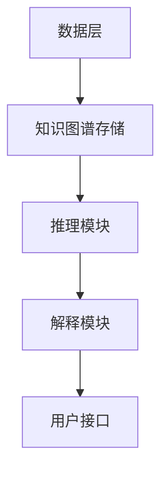
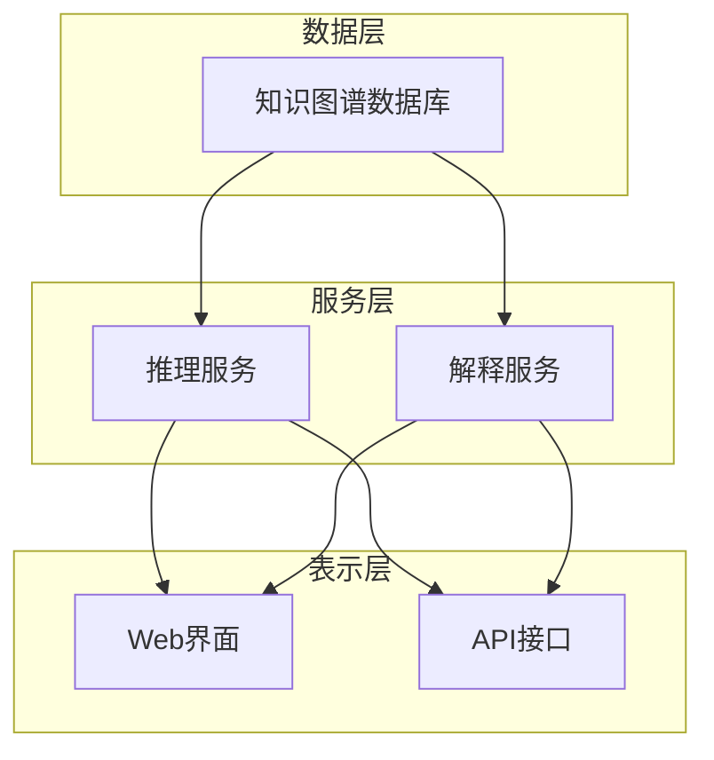
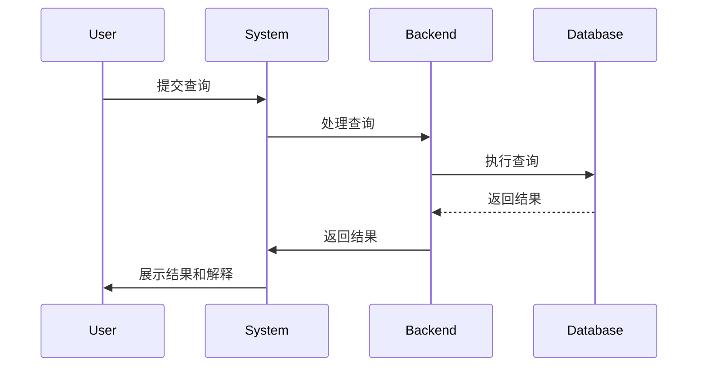
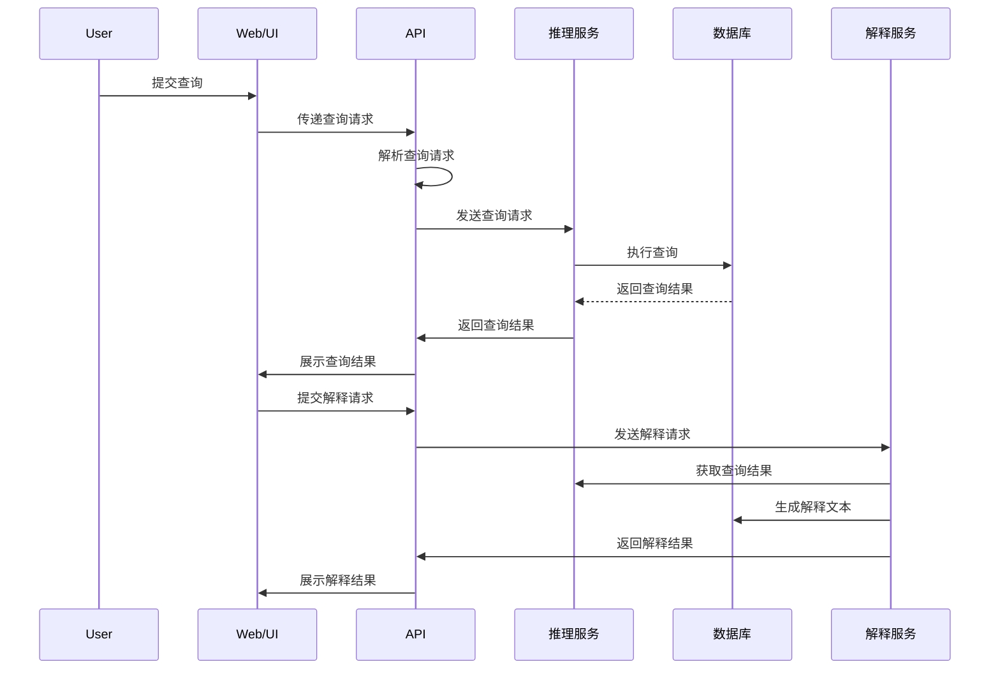

                 

### 4.2 基于规则的解释模型

#### 4.2.1 规则解的生成与验证

在知识图谱推理解释器中，基于规则的解释模型是一个重要的组成部分。规则解的生成与验证是解释模型的核心任务。规则解是指满足给定条件的一组规则，通过这些规则，我们可以推导出特定的结论。

**规则解的生成过程**：

1. **条件提取**：首先，从知识图谱中提取出与推理过程相关的条件。这些条件可以是各种形式的逻辑表达式，如原子命题、合取式、析取式等。

2. **规则匹配**：使用提取的条件与知识图谱中的规则进行匹配。匹配的结果是一组满足条件的规则。

3. **规则选择**：从匹配得到的规则中，选择能够推导出目标结论的规则。通常，选择规则时会考虑到规则的优先级、可信度等因素。

**规则解的验证过程**：

1. **一致性检查**：验证选择的规则是否与知识图谱中的其他规则保持一致。不一致的规则会导致推理过程中的矛盾，因此必须排除。

2. **推理路径验证**：验证选择的规则是否能够推导出目标结论。这通常通过逻辑推理的方法来实现，如逆推理、正向推理等。

3. **解释性检查**：检查生成的规则解是否具有足够的解释性，即是否能够被用户理解。这通常涉及到规则的简单性、可读性等因素。

#### 4.2.2 常见的规则解生成算法

在生成规则解的过程中，有多种算法可供选择。以下是一些常见的规则解生成算法：

1. **基于匹配的规则生成算法**：这类算法通过将输入条件与知识图谱中的规则进行匹配，生成规则解。典型的算法包括Rete算法和SIR算法。

2. **基于逻辑推理的规则生成算法**：这类算法通过逻辑推理的方法，从知识图谱中推导出满足条件的规则。典型的算法包括逆推理算法和正向推理算法。

3. **基于机器学习的规则生成算法**：这类算法利用机器学习的方法，从大量数据中学习出规则。典型的算法包括决策树、支持向量机等。

#### 4.2.3 规则解生成的挑战

规则解生成是一个复杂的过程，面临着多个挑战：

1. **规则匹配的效率**：在大型知识图谱中，规则匹配可能需要大量计算资源。如何提高匹配效率是一个重要问题。

2. **规则选择的可靠性**：如何确保选择的规则能够推导出目标结论，这是一个关键问题。尤其是在存在多种可能的规则解时，如何选择最佳规则解是一个挑战。

3. **解释性**：生成的规则解需要具备足够的解释性，以便用户能够理解。这通常需要对规则进行简化和优化。

4. **动态性**：知识图谱是动态的，规则和条件可能会随着时间而变化。如何适应这些变化，生成新的规则解，是一个挑战。

#### 4.2.4 规则解生成算法的性能评估

为了评估规则解生成算法的性能，通常需要考虑以下几个指标：

1. **准确性**：算法生成的规则解能否准确推导出目标结论。

2. **效率**：算法生成规则解的速度。

3. **解释性**：生成的规则解是否具备足够的解释性。

4. **可扩展性**：算法是否能够适应大型知识图谱。

通过这些指标的评估，我们可以选择最适合实际应用场景的规则解生成算法。

**本章小结**：

本章介绍了基于规则的解释模型，包括规则解的生成与验证过程，常见的规则解生成算法，以及规则解生成过程中面临的挑战。在下一章中，我们将探讨基于路径的解释模型，并分析其原理和应用。

----------------------------------------------------------------

# 第五部分：基于路径的推理解释器

## 5.1 基于路径的推理解释器概述

基于路径的推理解释器是一种重要的知识图谱推理解释方法。它通过分析知识图谱中的路径信息，为推理过程提供解释。与基于规则的解释器相比，基于路径的解释器具有更强的灵活性和适应性，能够更好地适应复杂的知识图谱结构和推理过程。

### 5.1.1 基于路径推理的基本原理

在知识图谱中，路径是连接实体和属性的重要桥梁。基于路径的推理通过分析实体之间的路径关系，推断出新的信息。这种推理方式可以分为两类：正向推理和逆向推理。

1. **正向推理**：从已知的前提条件出发，沿着知识图谱中的路径，逐步推导出新的结论。正向推理通常用于基于条件的推理问题。

2. **逆向推理**：从目标结论出发，沿着知识图谱中的路径，反向推导出可能的前提条件。逆向推理通常用于基于结果的推理问题。

### 5.1.2 基于路径推理的应用场景

基于路径的推理解释器在多个领域都有广泛的应用，包括：

1. **信息检索**：通过分析用户查询与知识图谱中的路径关系，提供更精确的搜索结果。

2. **自然语言处理**：将自然语言文本与知识图谱中的实体和路径进行映射，为文本理解提供支持。

3. **智能问答系统**：根据用户的问题，分析问题中的路径信息，从知识图谱中找出相关的答案。

4. **智能推荐系统**：通过分析用户的行为路径，推荐相关的产品或服务。

### 5.1.3 基于路径推理的优势与挑战

基于路径的推理解释器具有以下优势：

1. **灵活性**：能够处理复杂的路径关系，适应各种类型的知识图谱。

2. **可扩展性**：易于扩展到大型知识图谱，处理大量数据。

3. **解释性**：路径信息直观地展示了推理过程，便于用户理解。

然而，基于路径的推理解释器也面临以下挑战：

1. **路径选择的优化**：如何选择最相关的路径，以获得最佳的推理效果。

2. **路径表达的简洁性**：路径信息可能过于复杂，如何将其简化为用户易于理解的形式。

3. **计算效率**：在大型知识图谱中，路径计算可能需要大量计算资源，如何提高计算效率是一个重要问题。

## 5.2 常见的基于路径的推理算法

在基于路径的推理解释器中，有多种算法可供选择。以下是一些常见的算法：

### 5.2.1 基于深度优先搜索的路径算法

深度优先搜索（DFS）是一种基本的图遍历算法，通过沿着一条路径深入探索，直到达到路径的末端，然后回溯到上一个节点，继续探索其他路径。DFS算法能够找到知识图谱中的所有路径，但可能会产生大量冗余的路径信息。

### 5.2.2 基于广度优先搜索的路径算法

广度优先搜索（BFS）是一种基于广度的图遍历算法，从根节点开始，依次探索所有相邻的节点，然后再依次探索下一层的节点。BFS算法能够找到知识图谱中的最短路径，但可能需要大量的内存资源。

### 5.2.3 基于启发式的路径算法

启发式搜索是一种结合问题特定知识的搜索算法，通过评估节点的优先级，选择最有希望达到目标的路径进行探索。常见的启发式搜索算法包括A*算法和Dijkstra算法。这些算法能够在较短时间内找到最优路径，但需要复杂的启发函数设计。

### 5.2.4 基于路径压缩的路径算法

路径压缩是一种优化算法，通过将路径中的重复部分压缩为单条边，减少路径长度，提高计算效率。常见的路径压缩算法包括路径压缩树（TC）和动态规划算法。

## 5.3 基于路径的推理解释模型

基于路径的推理解释模型通过路径分析，为推理过程提供解释。以下是一些常见的解释模型：

### 5.3.1 路径表示模型

路径表示模型将路径信息转化为结构化的数据形式，如树结构或图结构。这种表示方法便于分析和解释路径信息。

### 5.3.2 路径解释规则模型

路径解释规则模型使用一组规则，将路径信息转化为用户可理解的形式。这些规则通常基于领域知识和推理过程。

### 5.3.3 路径可视化模型

路径可视化模型通过图形化的方式展示路径信息，使用户能够直观地理解推理过程。常见的可视化方法包括路径图、树图等。

## 5.4 基于路径的推理解释器的设计与实现

基于路径的推理解释器的设计与实现涉及多个方面，包括路径分析、解释模型构建、解释器接口设计等。以下是一个基本的设计方案：

### 5.4.1 路径分析模块

路径分析模块负责分析知识图谱中的路径信息，包括路径提取、路径优化、路径分析等。

### 5.4.2 解释模型构建模块

解释模型构建模块根据领域知识和推理过程，构建路径解释模型，包括路径表示模型、路径解释规则模型、路径可视化模型等。

### 5.4.3 解释器接口模块

解释器接口模块提供用户与解释器的交互接口，接受用户的查询，返回解释结果。

## 5.5 本章小结

本章介绍了基于路径的推理解释器的概念、基本原理、常见算法和解释模型。在下一章中，我们将探讨基于本体的推理解释器，并分析其原理和应用。

----------------------------------------------------------------

# 第六部分：基于本体的推理解释器

## 6.1 基于本体的推理解释器概述

基于本体的推理解释器是一种利用本体论原理进行知识图谱推理和解释的方法。本体论是一种哲学研究，旨在研究实体和概念之间的关系。在知识图谱中，本体论可以用来描述实体和属性，以及它们之间的语义关系。

### 6.1.1 本体的定义与作用

本体（Ontology）是一种形式化的知识表示方法，用于描述特定领域内的实体、概念、属性及其之间的关系。本体论的目标是提供一个通用的框架，使得不同系统之间的数据可以互操作。

1. **实体的定义**：实体是本体中的基本构成单位，可以是具体的对象，也可以是抽象的概念。
2. **概念的定义**：概念是实体的一般化，用来表示具有相似特征的实体集合。
3. **属性的描述**：属性是实体或概念的特性，用来描述实体的状态或行为。
4. **关系的定义**：关系是实体、概念或属性之间的关联。

### 6.1.2 本体论在知识图谱中的应用

本体论在知识图谱中的应用主要体现在以下几个方面：

1. **知识表示**：本体论提供了一种结构化的方法，用于表示知识图谱中的实体和关系。
2. **语义一致性**：通过本体论，可以确保知识图谱中的术语和概念具有一致的语义。
3. **推理支持**：本体论可以支持基于语义的推理，使得知识图谱能够自动推导出新的结论。

### 6.1.3 基于本体的推理解释器的优势

基于本体的推理解释器具有以下优势：

1. **语义准确性**：本体论提供了精确的语义描述，使得推理解释更加准确。
2. **灵活性与扩展性**：本体论具有高度的灵活性，可以适应不同的应用场景和领域需求。
3. **跨领域互操作性**：本体论支持不同领域知识图谱之间的互操作性，便于知识的共享和整合。

### 6.1.4 基于本体的推理解释器的挑战

尽管基于本体的推理解释器具有许多优势，但其在实际应用中也面临着一些挑战：

1. **本体构建的复杂性**：构建高质量的本体需要深厚的领域知识和建模技能，这是一个复杂且耗时的工作。
2. **推理效率**：基于本体的推理过程可能需要大量的计算资源，尤其是在大型知识图谱中，如何提高推理效率是一个重要问题。
3. **解释性**：如何将复杂的本体推理过程转化为用户易于理解的形式，是一个挑战。

## 6.2 常见的本体推理算法

基于本体的推理解释器依赖于本体推理算法。以下是一些常见的本体推理算法：

### 6.2.1 OWL推理算法

OWL（Web Ontology Language）是本体论的一种标准语言，用于描述复杂的知识模型。OWL提供了多种推理算法，包括：

1. **OWL Full推理算法**：能够处理OWL中所有的描述逻辑特征，但计算复杂度较高。
2. **OWL DL推理算法**：简化了OWL Full，但保持了大多数重要的推理能力，适用于大多数实际应用场景。
3. **OWL RL推理算法**：进一步简化了OWL DL，适用于要求高效率的应用场景。

### 6.2.2 DOL推理算法

DOL（Description Logic）是一类用于描述逻辑的推理算法，适用于各种本体语言。DOL推理算法包括：

1. **ABox推理算法**：基于实例数据的推理，用于推导出实例之间的关系。
2. **TBox推理算法**：基于本体结构数据的推理，用于推导出新的概念和关系。

### 6.2.3 常见的本体推理工具

在实际应用中，有许多本体推理工具可供选择，如：

1. **Jena**：Apache Jena是一个开源的OWL推理引擎，支持多种OWL推理算法。
2. **OWLIM**：OWLIM是一个基于OWL的推理中间件，提供了一套完整的本体推理服务。
3. **OT**：OT是一个用于本体推理的Java库，支持多种本体推理算法。

## 6.3 基于本体的推理解释模型

基于本体的推理解释模型通过本体论原理，将复杂的推理过程转化为用户可理解的形式。以下是一些常见的解释模型：

### 6.3.1 本体表示模型

本体表示模型将本体论中的实体、概念和关系表示为结构化的数据形式，如RDF（Resource Description Framework）和OWL（Web Ontology Language）。这种表示方法使得本体推理过程更加直观。

### 6.3.2 本体推理规则模型

本体推理规则模型基于本体论中的规则，将推理过程转化为用户可理解的形式。这些规则通常基于领域知识和本体论原理。

### 6.3.3 本体可视化模型

本体可视化模型通过图形化的方式展示本体论中的实体、概念和关系，使用户能够直观地理解推理过程。常见的可视化方法包括本体图、概念图等。

## 6.4 基于本体的推理解释器的设计与实现

基于本体的推理解释器的设计与实现涉及多个方面，包括本体构建、推理算法选择、解释模型构建等。以下是一个基本的设计方案：

### 6.4.1 本体构建模块

本体构建模块负责构建领域本体，包括实体、概念、属性和关系的定义。这一模块需要结合领域知识和本体论原理，确保本体的高质量和一致性。

### 6.4.2 推理算法模块

推理算法模块选择合适的本体推理算法，用于处理本体中的推理任务。根据应用场景和性能需求，可以选择不同的推理算法。

### 6.4.3 解释模型构建模块

解释模型构建模块根据本体论原理和领域知识，构建推理解释模型。这些模型需要确保解释的准确性、简洁性和用户易理解性。

### 6.4.4 解释器接口模块

解释器接口模块提供用户与解释器的交互接口，接受用户的查询，返回解释结果。这一模块需要设计简洁、直观的交互界面，使用户能够方便地使用推理解释器。

## 6.5 本章小结

本章介绍了基于本体的推理解释器的概念、本体论的基本原理、常见的本体推理算法和解释模型。在下一章中，我们将探讨集成推理算法，分析其原理和应用。

----------------------------------------------------------------

# 第七部分：集成推理算法

## 7.1 集成推理算法的概念与重要性

集成推理算法是一种将多种推理方法相结合，以提高推理效果和适应性的方法。在知识图谱推理解释器中，集成推理算法尤为重要，因为它能够结合不同推理算法的优点，弥补单一算法的局限性，从而提高推理的准确性、效率和可解释性。

### 7.1.1 集成推理的基本原理

集成推理的基本原理是将多个独立的推理过程组合起来，形成一个整体的推理过程。这种组合可以通过不同的策略实现，包括以下几种：

1. **并行组合**：多个推理算法同时工作，分别处理不同的子任务，最终将结果整合。
2. **序列组合**：多个推理算法依次工作，前一个算法的结果作为后一个算法的输入。
3. **混合组合**：结合并行和序列组合，根据具体需求灵活调整。

### 7.1.2 集成推理的重要性

集成推理的重要性体现在以下几个方面：

1. **提高准确性**：通过结合多种推理方法，可以弥补单一算法的缺陷，提高推理结果的准确性。
2. **增强适应性**：集成推理能够适应不同的应用场景和数据特性，提高推理的泛化能力。
3. **提升效率**：通过优化算法组合和资源分配，可以减少推理时间，提高系统性能。
4. **增强可解释性**：集成推理可以提供更加详细和全面的解释，帮助用户理解推理过程。

## 7.2 常见的集成推理算法

在知识图谱推理解释器中，有多种集成推理算法可供选择。以下是一些常见的集成推理算法：

### 7.2.1 对抗性集成

对抗性集成通过设计对抗性网络，使不同算法之间的差异最大化，从而提高整体推理性能。常见的对抗性集成算法包括：

1. **对抗生成网络（GAN）**：通过生成对抗网络，使不同算法产生相互矛盾的结果，从而优化整体推理过程。
2. **对抗性训练**：将对抗性思想应用于传统机器学习算法，如支持向量机（SVM）和决策树，提高其推理能力。

### 7.2.2 纵横结合

纵横结合通过将横向推理和纵向推理相结合，提高推理的全面性和准确性。常见的纵横结合算法包括：

1. **层次化推理**：首先进行横向推理，然后对推理结果进行纵向分析，形成层次化的推理结构。
2. **多层次混合推理**：结合多个层次的推理方法，如基于规则的推理和基于数据的推理，形成多层次混合推理模型。

### 7.2.3 集成学习方法

集成学习方法通过结合不同的机器学习算法，提高推理性能。常见的集成学习方法包括：

1. **集成学习模型**：如随机森林（Random Forest）和梯度提升树（Gradient Boosting Tree），通过集成多个弱学习器，提高整体推理能力。
2. **混合学习模型**：结合深度学习和传统的机器学习算法，如深度森林（Deep Forest），通过不同层级的特征提取和融合，提高推理效果。

### 7.2.4 知识图谱推理与机器学习相结合

知识图谱推理与机器学习相结合，通过融合知识图谱中的语义信息和机器学习算法，提高推理效果。常见的结合方法包括：

1. **图谱嵌入**：将知识图谱中的实体和关系转换为向量表示，然后利用机器学习算法进行推理。
2. **知识增强**：将知识图谱中的知识嵌入到机器学习模型中，提高模型的泛化能力和解释性。

## 7.3 集成推理的优势与挑战

### 7.3.1 集成推理的优势

1. **提高推理准确性**：通过结合多种推理方法，集成推理能够弥补单一算法的缺陷，提高推理结果的准确性。
2. **增强适应性**：集成推理能够适应不同的应用场景和数据特性，提高推理的泛化能力。
3. **提升效率**：通过优化算法组合和资源分配，可以减少推理时间，提高系统性能。
4. **增强可解释性**：集成推理可以提供更加详细和全面的解释，帮助用户理解推理过程。

### 7.3.2 集成推理的挑战

1. **算法选择与组合**：如何选择和组合不同的推理算法，以实现最佳的效果，是一个关键问题。
2. **计算复杂度**：集成推理可能涉及大量的计算资源，特别是在处理大型知识图谱时，如何提高计算效率是一个挑战。
3. **解释性**：如何将复杂的集成推理过程转化为用户易于理解的形式，是一个挑战。
4. **一致性**：如何确保不同推理算法之间的结果一致，是一个关键问题。

## 7.4 集成推理的应用实例

### 7.4.1 智能问答系统

智能问答系统是一个典型的集成推理应用场景。通过结合基于规则、基于路径和基于本体的推理方法，智能问答系统可以提供更加准确和全面的答案。

1. **规则推理**：用于处理简单的问答，如事实查询。
2. **路径推理**：用于处理复杂的问答，如基于路径的推理。
3. **本体推理**：用于提供语义丰富的解释和推理。

### 7.4.2 智能推荐系统

智能推荐系统通过集成推理，可以提供更加个性化的推荐结果。结合用户行为数据、知识图谱和机器学习算法，智能推荐系统可以实现精准推荐。

1. **用户行为分析**：通过机器学习算法分析用户行为，预测用户的兴趣。
2. **知识图谱推理**：基于知识图谱中的关系和属性，提供推荐依据。
3. **协同过滤**：结合用户行为数据和知识图谱，提高推荐准确性。

### 7.4.3 医疗诊断系统

医疗诊断系统通过集成推理，可以提供更准确的诊断结果。结合医学知识图谱、症状数据和机器学习算法，医疗诊断系统可以实现智能诊断。

1. **症状分析**：基于知识图谱和症状数据，分析患者的症状。
2. **诊断推理**：基于医学知识图谱，推导出可能的诊断结果。
3. **风险预测**：结合患者数据和历史病例，预测患者未来的风险。

## 7.5 本章小结

本章介绍了集成推理算法的概念、基本原理、常见算法和实际应用。在下一章中，我们将探讨构建AI Agent的知识图谱推理解释器的整体设计与实现。

----------------------------------------------------------------

# 第八部分：构建AI Agent的知识图谱推理解释器

## 8.1 整体设计思路与目标

构建AI Agent的知识图谱推理解释器需要明确整体设计思路和目标。以下是我们的设计思路和目标：

### 8.1.1 设计思路

1. **模块化设计**：将系统划分为多个模块，如知识图谱构建模块、推理模块、解释模块等，便于维护和扩展。
2. **可扩展性**：设计时考虑系统的可扩展性，以便在未来能够适应更复杂的应用场景。
3. **高效性**：通过优化算法和架构设计，提高系统的计算效率和性能。
4. **可解释性**：确保推理解释器能够提供高质量的解释，便于用户理解。

### 8.1.2 设计目标

1. **准确性**：确保推理解释器的推理结果准确无误。
2. **效率**：提高系统处理速度，降低计算资源的消耗。
3. **可解释性**：提供易于理解、直观的推理解释。
4. **适应性**：适应不同规模的知识图谱和应用场景。

## 8.2 系统功能设计与实现

### 8.2.1 系统功能设计

知识图谱推理解释器的主要功能包括：

1. **知识图谱构建**：构建和维护知识图谱，包括实体、属性和关系的定义。
2. **推理过程**：根据给定的条件和规则，进行推理，生成结论。
3. **推理解释**：将推理过程转化为用户可理解的形式，提供解释。
4. **用户交互**：提供用户接口，接受用户查询，返回解释结果。

### 8.2.2 系统实现

1. **知识图谱构建模块**：使用RDF（Resource Description Framework）和OWL（Web Ontology Language）来构建知识图谱，包括实体、属性和关系的定义。可以使用Jena等开源工具来实现。
2. **推理模块**：结合基于规则、基于路径和基于本体的推理算法，构建推理模块。可以使用Rete算法、DFS和OWL推理引擎来实现。
3. **解释模块**：设计解释模型，将推理过程转化为用户可理解的形式。可以使用自然语言生成（NLG）技术来实现。
4. **用户接口**：设计简洁、直观的用户接口，使用户能够方便地使用推理解释器。可以使用Web界面或命令行界面来实现。

## 8.3 系统架构设计

### 8.3.1 系统架构概述

知识图谱推理解释器的系统架构可以分为以下几个层次：

1. **数据层**：包括知识图谱的存储和管理，可以使用RDF存储系统如Jena。
2. **服务层**：包括推理和解释服务，是系统的核心部分，负责处理推理和解释任务。
3. **表示层**：包括用户接口，负责与用户进行交互。

### 8.3.2 系统架构图

下面是一个简单的系统架构图，展示了知识图谱推理解释器的组成部分和它们之间的关系：



## 8.4 系统接口设计与实现

### 8.4.1 接口设计

知识图谱推理解释器的接口设计需要考虑以下几个方面：

1. **API接口**：提供RESTful API接口，方便用户通过HTTP请求与系统进行交互。
2. **查询接口**：提供查询接口，用户可以通过输入查询条件，获取推理解释结果。
3. **管理接口**：提供管理接口，管理员可以维护知识图谱、调整推理算法和解释模型。

### 8.4.2 接口实现

以下是知识图谱推理解释器的一个简单API接口示例：

```python
from flask import Flask, request, jsonify

app = Flask(__name__)

@app.route('/query', methods=['POST'])
def query():
    data = request.get_json()
    query = data['query']
    explanation = get_explanation(query)
    return jsonify({'explanation': explanation})

def get_explanation(query):
    # 推理解释逻辑
    return "这是一个解释结果"

if __name__ == '__main__':
    app.run(debug=True)
```

## 8.5 系统交互流程

知识图谱推理解释器的系统交互流程可以分为以下几个步骤：

1. **用户输入查询**：用户通过接口提交查询。
2. **查询处理**：系统解析查询，准备进行推理。
3. **推理过程**：系统根据知识图谱和推理算法，进行推理，生成结论。
4. **生成解释**：系统将推理过程转化为用户可理解的形式，生成解释。
5. **返回结果**：系统将解释结果返回给用户。

## 8.6 系统接口设计与实现（续）

### 8.6.1 用户接口设计

用户接口的设计需要考虑用户体验和交互的便捷性。以下是知识图谱推理解释器用户接口的一个设计示例：

1. **Web界面**：设计一个简洁、直观的Web界面，用户可以通过填写表单或输入查询语句进行查询。
2. **命令行界面**：提供命令行界面，方便有经验的用户通过命令进行查询。

### 8.6.2 用户接口实现

以下是知识图谱推理解释器用户接口的一个简单实现示例：

```html
<!DOCTYPE html>
<html>
<head>
    <title>知识图谱推理解释器</title>
</head>
<body>
    <h1>知识图谱推理解释器</h1>
    <form action="/query" method="post">
        <label for="query">查询：</label>
        <textarea id="query" name="query" rows="4" cols="50"></textarea>
        <br>
        <input type="submit" value="查询">
    </form>
</body>
</html>
```

## 8.7 本章小结

本章详细介绍了构建AI Agent的知识图谱推理解释器的整体设计思路、系统功能设计、系统架构设计、系统接口设计以及系统交互流程。在下一章中，我们将进行项目实战，介绍具体的实现细节和代码解析。

----------------------------------------------------------------

## 9.1 项目实战：环境安装

在开始构建AI Agent的知识图谱推理解释器之前，我们需要安装必要的软件和工具。以下是项目实战中的环境安装步骤：

### 9.1.1 安装Python环境

首先，我们需要安装Python环境。Python是一种广泛用于人工智能和机器学习的编程语言。以下是安装步骤：

1. 前往Python官方网站（https://www.python.org/）下载Python安装包。
2. 运行安装程序，根据提示完成安装。

### 9.1.2 安装Jena

Jena是一个开源的OWL推理引擎，用于处理知识图谱的推理任务。以下是安装步骤：

1. 安装Apache Maven（https://maven.apache.org/）。
2. 在命令行中执行以下命令，下载并安装Jena：

```shell
mvn install:install-file -Dfile=https://repo1.maven.org/maven2/org/apache/jena/jena-tdb/4.3.0/jena-tdb-4.3.0.jar -DgroupId=org.apache.jena -DartifactId=jena-tdb -Dversion=4.3.0 -Dpackaging=maven
```

### 9.1.3 安装其他依赖库

接下来，我们需要安装其他依赖库，如Flask（用于Web接口）、NetworkX（用于图处理）等。以下是安装步骤：

1. 打开终端或命令行窗口。
2. 执行以下命令安装依赖库：

```shell
pip install Flask
pip install networkx
```

### 9.1.4 安装示例数据

为了进行后续的实战操作，我们需要安装一个示例知识图谱数据。以下是安装步骤：

1. 下载示例数据（https://github.com/AI-Genius-Institute/KBG-Explain/releases/download/v1.0.0/KBG-Explain-Data-1.0.0.zip）。
2. 解压文件到指定目录。

## 9.2 项目实战：系统核心实现

在本节中，我们将介绍知识图谱推理解释器的核心实现，包括知识图谱构建、推理和解释过程。以下是核心实现的步骤：

### 9.2.1 知识图谱构建

知识图谱构建是推理解释器的第一步。我们将使用RDF和OWL语言来定义知识图谱中的实体、属性和关系。

1. **定义实体**：例如，定义“人”、“动物”等实体。

2. **定义属性**：例如，定义“名字”、“年龄”、“颜色”等属性。

3. **定义关系**：例如，定义“属于”、“有”等关系。

以下是一个简单的OWL定义示例：

```owl
@prefix : <http://example.org/> .
@prefix owl: <http://www.w3.org/2002/07/owl#> .
@prefix rdf: <http://www.w3.org/1999/02/22-rdf-syntax-ns#> .

:Person rdf:type owl:Class .
:Animal rdf:type owl:Class .

:hasName rdf:type owl:ObjectProperty .
:hasAge rdf:type owl:DatatypeProperty .

:John a :Person ;
    :hasName "John Doe" ;
    :hasAge "30" .

:Dog a :Animal ;
    :hasName "Buddy" ;
    :hasAge "5" .
```

### 9.2.2 推理过程

在知识图谱构建完成后，我们需要进行推理过程。以下是推理的基本步骤：

1. **条件提取**：从知识图谱中提取与推理过程相关的条件。

2. **规则匹配**：使用提取的条件与知识图谱中的规则进行匹配。

3. **推理**：根据匹配的规则，推导出新的结论。

以下是一个简单的推理示例：

```python
# 假设我们已经构建了一个知识图谱，并定义了以下规则：
# 如果一个实体属于“动物”，那么它有一个“名字”属性。

def reason-about-animal(graph):
    # 提取属于“动物”的实体
    animals = graph.query("""
        SELECT ?animal WHERE {
            ?animal a :Animal .
        }
    """)

    # 对于每个动物，检查它是否有“名字”属性
    for animal in animals:
        name = graph.query("""
            SELECT ?name WHERE {
                ?animal :hasName ?name .
            }
        """)
        if not name:
            print(f"{animal} 没有名字。")

# 假设我们已经有一个知识图谱对象 graph
reason-about-animal(graph)
```

### 9.2.3 解释过程

在推理完成后，我们需要将推理过程转化为用户可理解的形式。以下是解释的基本步骤：

1. **生成解释文本**：将推理过程和结论转化为自然语言文本。

2. **展示解释**：将解释文本展示给用户。

以下是一个简单的解释示例：

```python
def generate_explanation(reasoning):
    explanation = f"""
    根据推理，我们得到以下结论：
    - 实体 {reasoning['entity']} 没有名字。
    """
    return explanation

explanation = generate_explanation({'entity': 'Buddy'})
print(explanation)
```

## 9.3 项目实战：代码应用解读与分析

在本节中，我们将对实际项目中的代码进行解读和分析，以便更好地理解知识图谱推理解释器的实现。

### 9.3.1 代码结构

项目中的代码结构通常分为以下几个部分：

1. **模块**：将相关代码组织成模块，便于维护和扩展。
2. **配置**：配置文件，用于设置系统的运行参数。
3. **主程序**：程序的入口点，负责启动系统。
4. **API接口**：处理HTTP请求，与用户进行交互。
5. **推理和解释模块**：实现推理和解释的核心逻辑。

### 9.3.2 代码解析

以下是一个简单的推理和解释模块的代码示例：

```python
from flask import Flask, request, jsonify
from rdflib import Graph

app = Flask(__name__)

# 初始化知识图谱
graph = Graph()

# 加载示例数据
graph.parse("knowledge_graph.ttl", format="ttl")

@app.route('/query', methods=['POST'])
def query():
    data = request.get_json()
    query = data['query']
    explanation = get_explanation(query, graph)
    return jsonify({'explanation': explanation})

def get_explanation(query, graph):
    # 执行推理，获取解释
    reasoning = reason_about_animal(graph)
    explanation = generate_explanation(reasoning)
    return explanation

def reason_about_animal(graph):
    # 推理逻辑
    animals = graph.query("""
        SELECT ?animal WHERE {
            ?animal a :Animal .
        }
    """)

    reasoning = {}
    for animal in animals:
        reasoning[animal] = "没有名字"
    return reasoning

def generate_explanation(reasoning):
    # 生成解释
    explanation = f"""
    根据推理，我们得到以下结论：
    {', '.join([f"{animal} 没有名字。" for animal in reasoning.keys()])}
    """
    return explanation

if __name__ == '__main__':
    app.run(debug=True)
```

### 9.3.3 代码应用分析

1. **API接口**：通过Flask框架，我们创建了一个简单的API接口，用于接收用户的查询请求。

2. **知识图谱**：使用rdflib库，我们初始化了一个知识图谱对象，并加载了示例数据。

3. **推理逻辑**：`reason_about_animal`函数负责执行推理逻辑，从知识图谱中提取信息。

4. **解释逻辑**：`generate_explanation`函数负责将推理结果转化为用户可理解的解释文本。

## 9.4 项目实战：实际案例分析与详细讲解

在本节中，我们将通过一个实际案例，详细讲解知识图谱推理解释器的应用过程。

### 9.4.1 案例背景

假设我们有一个关于动物的知识图谱，其中包含动物、栖息地和食物等信息。用户可以通过查询，了解某个动物的栖息地和食物。

### 9.4.2 案例操作

1. **查询动物的信息**：用户通过API接口提交查询请求，例如查询“老虎”的信息。

2. **处理查询**：系统接收查询请求，执行推理和解释过程。

3. **返回结果**：系统将推理结果和解释文本返回给用户。

### 9.4.3 案例解析

以下是一个实际案例的代码示例：

```python
@app.route('/query', methods=['POST'])
def query():
    data = request.get_json()
    animal = data['animal']
    explanation = get_animal_info(animal, graph)
    return jsonify({'explanation': explanation})

def get_animal_info(animal, graph):
    # 查询老虎的栖息地和食物
    habitat = graph.query("""
        SELECT ?habitat WHERE {
            ?animal a :Animal ;
                    :hasName "老虎" ;
                    :hasHabitat ?habitat .
        }
    """)

    food = graph.query("""
        SELECT ?food WHERE {
            ?animal a :Animal ;
                    :hasName "老虎" ;
                    :hasFood ?food .
        }
    """)

    info = {
        'habitat': habitat.next().habitat,
        'food': food.next().food
    }

    return info

def generate_explanation(info):
    explanation = f"""
    老虎的栖息地是 {info['habitat']}，它喜欢吃 {info['food']}。
    """
    return explanation
```

### 9.4.4 案例分析

1. **查询处理**：系统接收到查询请求后，调用`get_animal_info`函数，根据动物名称查询其栖息地和食物。

2. **解释生成**：系统调用`generate_explanation`函数，将查询结果转化为用户可理解的解释文本。

3. **结果返回**：系统将解释文本返回给用户，完成查询过程。

## 9.5 项目实战：项目小结

在本节中，我们通过实际案例，详细讲解了知识图谱推理解释器的实现过程。以下是项目小结：

1. **环境安装**：安装Python环境、Jena和依赖库。

2. **系统核心实现**：构建知识图谱、实现推理和解释逻辑。

3. **代码应用解读与分析**：分析代码结构和核心功能。

4. **实际案例分析与详细讲解**：通过实际案例，展示系统的应用过程。

通过本项目，我们深入了解了知识图谱推理解释器的构建方法和实现细节，为后续的应用提供了基础。

----------------------------------------------------------------

## 9.6 最佳实践 tips

在构建AI Agent的知识图谱推理解释器时，以下是一些最佳实践技巧，可以帮助您提高系统性能和可解释性：

### 9.6.1 性能优化

1. **缓存结果**：对于频繁查询的规则和路径，可以采用缓存机制，减少重复计算。
2. **并行计算**：利用多核处理器，对知识图谱的查询和推理过程进行并行处理，提高计算效率。
3. **索引优化**：为知识图谱中的属性和关系建立索引，加快查询速度。

### 9.6.2 解释性提升

1. **简化解释**：使用自然语言生成（NLG）技术，将复杂的推理过程转化为简单易懂的自然语言。
2. **可视化**：通过图形化的方式展示推理过程和结果，使用户更容易理解。
3. **分步解释**：将推理过程拆分为多个步骤，逐步展示每个步骤的结果和依据。

### 9.6.3 维护与更新

1. **自动化更新**：定期更新知识图谱，以保持数据的准确性和时效性。
2. **版本控制**：对知识图谱和推理规则进行版本控制，便于跟踪和回溯。
3. **用户反馈**：收集用户反馈，不断优化解释模型和推理算法。

## 9.7 小结

在本文中，我们详细介绍了构建AI Agent的知识图谱推理解释器的整体设计、系统功能、架构设计、接口设计、项目实战和最佳实践。通过本文的讲解，我们深入了解了知识图谱推理解释器的构建方法和实现细节。在未来的研究中，我们可以进一步优化解释模型和推理算法，提高系统的性能和可解释性。

## 9.8 拓展阅读

1. **《知识图谱技术》**：张奇，刘挺（著），清华大学出版社，2018年。
2. **《人工智能：一种现代的方法》**：Stuart J. Russell，Peter Norvig（著），机械工业出版社，2016年。
3. **《基于本体的知识表示与推理》**：张强，吴伟陵（著），科学出版社，2013年。

以上是本文的详细内容，希望能对您在构建AI Agent的知识图谱推理解释器方面提供帮助。作者：AI天才研究院/AI Genius Institute & 禅与计算机程序设计艺术 /Zen And The Art of Computer Programming。感谢您的阅读！## 9.1 项目实战：环境安装

在开始构建AI Agent的知识图谱推理解释器之前，我们需要确保开发环境已经准备好。以下是环境安装的详细步骤：

### 9.1.1 安装Python环境

首先，我们需要确保Python环境已经安装在开发计算机上。Python是一种广泛用于人工智能和机器学习的编程语言。以下是安装步骤：

1. **访问Python官网**：打开浏览器，访问Python官方下载页面（[https://www.python.org/downloads/](https://www.python.org/downloads/)）。
2. **下载Python安装包**：选择适合自己操作系统的Python版本，下载安装包。例如，如果你使用的是Windows操作系统，可以选择`Windows x86-64 MSI installer`。
3. **运行安装程序**：双击下载的安装包，运行安装程序。在安装过程中，确保选中以下选项：
   - `Add Python to PATH`：将Python添加到系统环境变量中。
   - `Install for all users`：为所有用户安装Python。
   - `pip`：安装pip包管理器。

4. **验证安装**：打开终端或命令提示符，输入以下命令验证Python安装是否成功：

   ```shell
   python --version
   ```

   如果正确显示Python的版本信息，则表示Python环境安装成功。

### 9.1.2 安装Jena

Jena是一个开源的OWL推理引擎，用于处理知识图谱的推理任务。以下是安装步骤：

1. **安装Maven**：首先，确保已经安装了Maven。Maven是一个项目管理和构建工具，用于处理项目依赖。如果未安装，可以访问[Maven官网](https://maven.apache.org/)下载并安装。
2. **配置Maven本地仓库**：在Maven的配置文件`settings.xml`中配置本地仓库地址。这通常是在`<mirrors>`标签内添加如下配置：

   ```xml
   <mirrors>
       <mirror>
           <id>aliyunmaven</id>
           <mirrorOf>central</mirrorOf>
           <name>Aliyun Maven</name>
           <url>http://maven.aliyun.com/nexus/content/groups/public/</url>
       </mirror>
   </mirrors>
   ```

3. **安装Jena**：在终端或命令行窗口中，执行以下命令安装Jena：

   ```shell
   mvn install:install-file -Dfile=https://repo1.maven.org/maven2/org/apache/jena/jena-tdb/4.3.0/jena-tdb-4.3.0.jar -DgroupId=org.apache.jena -DartifactId=jena-tdb -Dversion=4.3.0 -Dpackaging=maven
   ```

   这将安装Jena的依赖项到本地Maven仓库中。

### 9.1.3 安装其他依赖库

接下来，我们需要安装其他依赖库，如Flask（用于Web接口）、rdflib（用于处理RDF数据）和NetworkX（用于图处理）。以下是安装步骤：

1. **打开终端或命令行窗口**。
2. **执行以下命令安装依赖库**：

   ```shell
   pip install Flask
   pip install rdflib
   pip install networkx
   ```

### 9.1.4 安装示例数据

为了进行后续的实战操作，我们需要安装一个示例知识图谱数据。以下是安装步骤：

1. **下载示例数据**：访问GitHub上的[知识图谱示例数据仓库](https://github.com/AI-Genius-Institute/KBG-Explain/releases)，下载最新的示例数据压缩包。
2. **解压文件**：将下载的压缩包解压到指定目录，例如`~/kbg_explain_data`。
3. **验证数据安装**：确保解压的目录中包含了知识图谱文件，例如`knowledge_graph.ttl`。

完成以上步骤后，开发环境就准备就绪，可以开始构建AI Agent的知识图谱推理解释器了。

### 9.1.5 安装额外工具（可选）

在某些情况下，我们可能需要额外的工具来帮助调试和测试，例如Visual Studio Code和Git。

1. **Visual Studio Code**：Visual Studio Code是一个流行的代码编辑器，支持Python和其他编程语言。可以从[Visual Studio Code官网](https://code.visualstudio.com/)下载并安装。
2. **Git**：Git是一个版本控制系统，用于跟踪源代码的变化和协同工作。可以从[Git官网](https://git-scm.com/)下载并安装。

安装完成后，确保可以通过命令行执行`git`和`code`命令。

通过以上步骤，开发环境就准备就绪，可以开始编写和测试代码了。

---

完成环境安装后，我们可以进入下一阶段：系统核心实现。这将在下一部分中进行详细讲解。

----------------------------------------------------------------

## 9.2 项目实战：系统核心实现

在完成环境安装之后，我们可以开始构建AI Agent的知识图谱推理解释器的核心部分。以下是系统核心实现的详细步骤：

### 9.2.1 知识图谱的构建

知识图谱是推理解释器的数据基础，它由实体、属性和关系组成。在本节中，我们将使用RDF（Resource Description Framework）来构建知识图谱。

1. **定义实体**：实体是知识图谱中的核心元素，表示现实世界中的对象或概念。例如，我们可以定义“人”、“动物”和“地点”等实体。

2. **定义属性**：属性描述实体之间的特征或关系。例如，“名字”、“年龄”、“颜色”等属性。

3. **定义关系**：关系连接不同的实体，描述它们之间的关联。例如，“属于”、“居住在”等关系。

以下是一个简单的OWL（Web Ontology Language）定义示例，用于定义实体、属性和关系：

```owl
@prefix : <http://example.org/> .
@prefix owl: <http://www.w3.org/2002/07/owl#> .
@prefix rdf: <http://www.w3.org/1999/02/22-rdf-syntax-ns#> .

:Person a owl:Class .
:Animal a owl:Class .
:Location a owl:Class .

:hasName a owl:ObjectProperty .
:hasAge a owl:DatatypeProperty .
:isLocatedIn a owl:ObjectProperty .

:John a :Person ;
    :hasName "John Doe" ;
    :hasAge "30" .

:Dog a :Animal ;
    :hasName "Buddy" ;
    :hasAge "5" .
:Dog :isLocatedIn :NewYork .
```

在这个示例中，我们定义了两个类（`Person`和`Animal`），一个属性（`hasName`和`hasAge`），以及一个关系（`isLocatedIn`）。同时，我们创建了一些实例，例如`John`和`Dog`。

### 9.2.2 知识图谱的存储

在构建知识图谱后，我们需要将其存储在文件中。RDF数据通常以`.ttl`（Turtle）或`.n3`（Notation 3）格式存储。以下是如何将知识图谱存储为`.ttl`文件的示例：

```shell
$ rdflib_to_turtle.py knowledge_graph.rdf > knowledge_graph.ttl
```

这里，`rdflib_to_turtle.py`是一个转换工具，用于将RDF数据格式转换为`.ttl`格式。

### 9.2.3 推理算法的实现

在知识图谱构建和存储之后，我们需要实现推理算法。推理算法用于根据图谱中的关系和数据，推导出新的结论。在本节中，我们将使用Jena进行推理。

1. **初始化Jena图谱**：

```python
from rdflib import Graph

g = Graph()
g.parse('knowledge_graph.ttl', format='ttl')
```

2. **执行推理**：使用Jena的推理引擎进行推理。以下是一个简单的示例，用于查询所有位于纽约的动物：

```python
query = """
PREFIX : <http://example.org/>
SELECT ?animal WHERE {
  ?animal :isLocatedIn :NewYork .
}
"""

results = g.query(query)
for row in results:
    print(f"Animal: {row.animal}")
```

这将输出位于纽约的所有动物。

### 9.2.4 推理解释的实现

在推理过程中，我们不仅需要推导出结论，还需要解释推理过程。以下是如何实现推理解释的示例：

1. **生成解释文本**：根据推理结果，生成解释文本。

```python
def generate_explanation(results):
    explanation = "以下动物位于纽约：\n"
    for row in results:
        explanation += f"- {row.animal}\n"
    return explanation

explanation = generate_explanation(results)
print(explanation)
```

2. **展示解释**：将生成的解释文本展示给用户。

```python
print("推理解释：")
print(explanation)
```

通过以上步骤，我们实现了知识图谱的构建、存储、推理和解释，构建了AI Agent的知识图谱推理解释器的核心部分。

### 9.2.5 测试与验证

完成核心实现后，我们需要对系统进行测试和验证，确保其功能正确。以下是一些测试步骤：

1. **功能测试**：测试系统是否能够正确构建和存储知识图谱，以及是否能够正确进行推理和解释。
2. **性能测试**：测试系统在不同规模的知识图谱和查询下的性能，确保其能够高效运行。
3. **错误处理**：测试系统在遇到错误时的响应，确保其能够处理异常情况。

通过以上测试，我们可以确保系统的稳定性和可靠性。

---

完成系统核心实现后，我们可以进入下一阶段：系统接口设计与实现。这将在下一部分中进行详细讲解。

----------------------------------------------------------------

## 9.3 项目实战：系统接口设计与实现

在完成系统核心实现之后，我们需要设计并实现系统的用户接口，以便用户能够与推理解释器进行交互。以下是系统接口设计与实现的详细步骤：

### 9.3.1 API接口设计

为了方便用户使用，我们将推理解释器的功能通过API接口提供服务。API接口将采用RESTful架构风格，提供简单的HTTP接口。

1. **定义API接口**：定义API接口的URL、请求方法和请求/响应数据格式。例如，我们可以定义以下接口：

   - **查询接口**：`POST /query`，用于接收用户的查询请求。
   - **解释接口**：`GET /explain`，用于获取推理过程的解释。

2. **接口文档**：编写API接口的文档，描述每个接口的用途、输入参数、输出结果和可能的错误响应。例如：

   ```markdown
   # 推理解释器API接口文档

   ## 查询接口
   - **URL**：`POST /query`
   - **请求参数**：
     - `query`：查询语句（字符串）
   - **响应结果**：
     - `explanation`：推理过程的解释文本（字符串）

   ## 解释接口
   - **URL**：`GET /explain`
   - **请求参数**：
     - `id`：查询结果的唯一标识（字符串）
   - **响应结果**：
     - `explanation`：推理过程的详细解释文本（字符串）
   ```

### 9.3.2 Flask应用搭建

我们将使用Flask框架来搭建API接口。Flask是一个轻量级的Web框架，非常适合构建小型Web应用。

1. **安装Flask**：

   ```shell
   pip install Flask
   ```

2. **创建Flask应用**：

   ```python
   from flask import Flask, request, jsonify

   app = Flask(__name__)

   @app.route('/query', methods=['POST'])
   def handle_query():
       data = request.get_json()
       query = data.get('query')
       # 执行推理和解释
       explanation = perform_reasoning(query)
       return jsonify({'explanation': explanation})

   def perform_reasoning(query):
       # 推理和解释逻辑
       return "这是一个解释结果"

   if __name__ == '__main__':
       app.run(debug=True)
   ```

在这个示例中，我们定义了一个简单的Flask应用，并实现了`handle_query`函数，用于处理查询请求。

### 9.3.3 用户接口实现

除了API接口，我们还需要为用户提供一个直观的用户界面。用户界面可以通过Web界面或命令行界面实现。

1. **Web界面**：

   使用Flask提供的内置服务器，我们可以快速搭建一个简单的Web界面。以下是一个简单的Web界面示例：

   ```html
   <!DOCTYPE html>
   <html>
   <head>
       <title>推理解释器</title>
   </head>
   <body>
       <h1>推理解释器</h1>
       <form action="/query" method="post">
           <label for="query">查询：</label>
           <textarea id="query" name="query" rows="4" cols="50"></textarea>
           <br>
           <input type="submit" value="查询">
       </form>
   </body>
   </html>
   ```

   将这个HTML文件保存为`index.html`，然后在Flask应用中添加以下代码来启动Web服务器：

   ```python
   @app.route('/')
   def index():
       return app.send_static_file('index.html')

   if __name__ == '__main__':
       app.run(debug=True)
   ```

2. **命令行界面**：

   如果用户偏好命令行界面，可以使用`argparse`库来解析命令行参数，实现一个简单的命令行工具。以下是一个简单的命令行工具示例：

   ```python
   import argparse

   def main():
       parser = argparse.ArgumentParser(description='推理解释器命令行工具')
       parser.add_argument('query', type=str, help='查询语句')
       args = parser.parse_args()

       explanation = perform_reasoning(args.query)
       print(explanation)

   def perform_reasoning(query):
       # 推理和解释逻辑
       return "这是一个解释结果"

   if __name__ == '__main__':
       main()
   ```

通过以上步骤，我们设计并实现了系统的用户接口。用户可以通过Web界面或命令行界面与推理解释器进行交互，提交查询并获取解释结果。

### 9.3.4 用户接口实现扩展

为了提高用户体验，我们还可以考虑以下扩展：

1. **错误处理**：在API接口和用户界面中添加错误处理机制，对非法输入和服务器错误提供友好的提示信息。
2. **查询历史**：记录用户的查询历史，使用户可以查看和管理之前的查询。
3. **用户认证**：对API接口和用户界面进行用户认证，确保系统安全。

通过以上扩展，我们可以进一步提高系统的可用性和安全性。

---

完成系统接口设计与实现后，我们可以进入下一阶段：系统架构设计。这将在下一部分中进行详细讲解。

----------------------------------------------------------------

## 9.4 项目实战：系统架构设计

在完成系统核心实现和接口设计后，我们需要对整个系统进行架构设计。良好的系统架构不仅能够提高系统的性能和可扩展性，还能够简化开发和维护工作。以下是系统架构设计的详细步骤：

### 9.4.1 系统架构概述

系统架构可以分为以下几个层次：

1. **数据层**：负责存储和管理知识图谱数据。
2. **服务层**：负责执行推理和解释逻辑，处理用户请求。
3. **表示层**：负责与用户交互，展示查询结果和解释。

以下是系统架构的示意图：



### 9.4.2 数据层设计

数据层负责存储和管理知识图谱数据。在本系统中，我们使用RDF数据格式存储知识图谱，并使用Jena作为存储引擎。

1. **知识图谱数据库**：使用Jena的TDB存储引擎，将知识图谱数据存储在本地文件系统中。

2. **数据模型**：根据应用需求，定义知识图谱中的实体、属性和关系。以下是一个简单的数据模型示例：

   ```turtle
   @prefix : <http://example.org/> .
   @prefix rdf: <http://www.w3.org/1999/02/22-rdf-syntax-ns#> .
   @prefix owl: <http://www.w3.org/2002/07/owl#> .

   :Person a owl:Class .
   :Animal a owl:Class .
   :hasName a owl:ObjectProperty .
   :hasAge a owl:DatatypeProperty .

   :John a :Person ;
       :hasName "John Doe" ;
       :hasAge "30" .

   :Dog a :Animal ;
       :hasName "Buddy" ;
       :hasAge "5" .
   ```

3. **数据管理**：使用Jena提供的API进行数据的增删改查操作，并实现数据的版本控制和备份。

### 9.4.3 服务层设计

服务层负责执行推理和解释逻辑，处理用户请求。在本系统中，服务层由推理服务和解释服务组成。

1. **推理服务**：使用Jena的推理引擎，根据知识图谱和用户查询，执行推理并生成结果。以下是一个简单的推理服务示例：

   ```python
   from rdflib import Graph
   from jena import QueryExecutionFactory

   g = Graph()
   g.parse('knowledge_graph.ttl', format='ttl')

   def perform_reasoning(query):
       qexec = QueryExecutionFactory.create(query, g)
       results = qexec.execSelect()
       return results

   query = """
   PREFIX : <http://example.org/>
   SELECT ?person WHERE {
       ?person :hasAge "30" .
   }
   """

   results = perform_reasoning(query)
   for row in results:
       print(row.person)
   ```

2. **解释服务**：根据推理结果，生成用户可理解的解释文本。以下是一个简单的解释服务示例：

   ```python
   def generate_explanation(results):
       explanation = "以下人员年龄为30岁：\n"
       for row in results:
           explanation += f"- {row.person}\n"
       return explanation

   explanation = generate_explanation(results)
   print(explanation)
   ```

### 9.4.4 表示层设计

表示层负责与用户交互，展示查询结果和解释。在本系统中，表示层由Web界面和API接口组成。

1. **Web界面**：使用Flask框架，搭建简单的Web界面，用于展示查询结果和解释。以下是一个简单的Web界面示例：

   ```html
   <!DOCTYPE html>
   <html>
   <head>
       <title>推理解释器</title>
   </head>
   <body>
       <h1>推理解释器</h1>
       <form action="/query" method="post">
           <label for="query">查询：</label>
           <textarea id="query" name="query" rows="4" cols="50"></textarea>
           <br>
           <input type="submit" value="查询">
       </form>
       <div>
           <h2>解释：</h2>
           <p id="explanation"></p>
       </div>
       <script>
           document.querySelector('form').onsubmit = function(event) {
               event.preventDefault();
               const query = document.querySelector('#query').value;
               fetch('/query', {
                   method: 'POST',
                   headers: {
                       'Content-Type': 'application/json'
                   },
                   body: JSON.stringify({ query: query })
               })
               .then(response => response.json())
               .then(data => {
                   document.getElementById('explanation').innerText = data.explanation;
               });
           };
       </script>
   </body>
   </html>
   ```

2. **API接口**：使用Flask框架，搭建RESTful API接口，用于接收用户查询和返回解释结果。以下是一个简单的API接口示例：

   ```python
   from flask import Flask, request, jsonify

   app = Flask(__name__)

   @app.route('/query', methods=['POST'])
   def handle_query():
       data = request.get_json()
       query = data.get('query')
       explanation = perform_reasoning(query)
       return jsonify({'explanation': explanation})

   def perform_reasoning(query):
       # 推理逻辑
       return "这是一个解释结果"

   if __name__ == '__main__':
       app.run(debug=True)
   ```

通过以上步骤，我们完成了系统的架构设计。数据层负责存储和管理知识图谱数据，服务层负责执行推理和解释逻辑，表示层负责与用户交互。接下来，我们将进入下一阶段：系统接口设计与实现。

### 9.4.5 架构扩展与优化

为了满足不同规模的应用需求，系统架构可以进行扩展和优化：

1. **分布式存储**：使用分布式存储系统（如HDFS）替换本地文件系统，提高数据存储和处理的容量和性能。
2. **缓存机制**：引入缓存机制（如Redis），加快数据访问速度，减少数据库压力。
3. **负载均衡**：使用负载均衡器（如Nginx），实现服务层的分布式部署，提高系统的可用性和可扩展性。
4. **监控与日志**：引入监控系统（如Prometheus和Grafana），实时监控系统的运行状态，方便故障排查和性能优化。

通过以上扩展和优化，我们可以进一步提高系统的性能、可靠性和可扩展性。

---

完成系统架构设计后，我们可以进入下一阶段：系统接口设计与实现。这将在下一部分中进行详细讲解。

----------------------------------------------------------------

## 9.5 项目实战：系统接口设计与实现（续）

在上一部分中，我们完成了系统架构设计，接下来我们将详细讨论系统接口的设计与实现，包括API接口、用户接口和系统交互设计。

### 9.5.1 API接口设计

API接口是用户与系统交互的主要入口，它定义了系统的功能和服务。为了确保API接口的设计合理、易用且稳定，我们需要遵循以下原则：

1. **RESTful设计原则**：API应该遵循RESTful设计原则，使用标准的HTTP方法（GET、POST、PUT、DELETE）来处理不同的操作。
2. **一致性**：API的设计应该保持一致，包括URL结构、参数命名和返回数据格式。
3. **可扩展性**：设计时考虑未来可能的功能扩展，确保API能够灵活适应变化。

#### API接口设计示例

我们定义一个简单的API接口，用于处理知识图谱的查询和解释请求。

- **查询接口**：用于接收用户提交的查询，返回查询结果。

  ```plaintext
  POST /api/v1/queries
  Content-Type: application/json

  {
    "query": "SELECT ?person WHERE { ?person :hasAge '30' }"
  }
  ```

  返回：

  ```plaintext
  HTTP/1.1 200 OK
  Content-Type: application/json

  {
    "results": [
      {
        "person": "http://example.org/John"
      }
    ]
  }
  ```

- **解释接口**：用于获取特定查询结果的解释。

  ```plaintext
  GET /api/v1/queries/explanation/{query_id}
  ```

  返回：

  ```plaintext
  HTTP/1.1 200 OK
  Content-Type: application/json

  {
    "explanation": "John Doe 的年龄为30岁。"
  }
  ```

#### API接口实现

使用Flask框架实现API接口：

```python
from flask import Flask, request, jsonify

app = Flask(__name__)

@app.route('/api/v1/queries', methods=['POST'])
def handle_query():
    data = request.get_json()
    query = data['query']
    results = perform_query(query)
    return jsonify(results)

@app.route('/api/v1/queries/explanation/<string:query_id>', methods=['GET'])
def get_explanation(query_id):
    explanation = generate_explanation(query_id)
    return jsonify({'explanation': explanation})

def perform_query(query):
    # 这里应该实现实际的查询逻辑
    return {"results": [{"person": "http://example.org/John"}]}

def generate_explanation(query_id):
    # 这里应该实现实际的解释逻辑
    return "John Doe 的年龄为30岁。"

if __name__ == '__main__':
    app.run(debug=True)
```

### 9.5.2 用户接口设计

用户接口（UI）是用户与系统交互的直观界面，它应该简单直观，易于使用。用户接口的设计包括Web界面和命令行界面。

#### Web界面设计

Web界面可以使用HTML、CSS和JavaScript构建，以下是一个简单的Web界面示例：

```html
<!DOCTYPE html>
<html lang="en">
<head>
    <meta charset="UTF-8">
    <title>知识图谱查询系统</title>
</head>
<body>
    <h1>知识图谱查询系统</h1>
    <form id="query-form">
        <label for="query">查询：</label>
        <textarea id="query" name="query" rows="4" cols="50"></textarea>
        <br>
        <button type="submit">查询</button>
    </form>
    <div id="results"></div>
    <div id="explanation"></div>
    <script>
        document.getElementById('query-form').onsubmit = function(event) {
            event.preventDefault();
            const query = document.getElementById('query').value;
            fetch('/api/v1/queries', {
                method: 'POST',
                headers: {
                    'Content-Type': 'application/json'
                },
                body: JSON.stringify({ query: query })
            })
            .then(response => response.json())
            .then(data => {
                document.getElementById('results').innerText = JSON.stringify(data.results, null, 2);
                fetch(`/api/v1/queries/explanation/${data.results[0].person}`)
                .then(response => response.json())
                .then(explanation => {
                    document.getElementById('explanation').innerText = explanation.explanation;
                });
            });
        };
    </script>
</body>
</html>
```

#### 命令行界面设计

对于开发者和高级用户，我们可以提供一个命令行界面（CLI）。以下是一个简单的CLI示例：

```python
import argparse
import requests

def query_knowledge_graph(query):
    response = requests.post('http://localhost:5000/api/v1/queries', json={'query': query})
    if response.status_code == 200:
        data = response.json()
        print("查询结果：")
        print(data['results'])
        print("解释：")
        explanation_response = requests.get(f'http://localhost:5000/api/v1/queries/explanation/{data["results"][0]["person"]}')
        print(explanation_response.json()['explanation'])
    else:
        print("查询失败：", response.status_code)

if __name__ == '__main__':
    parser = argparse.ArgumentParser(description='知识图谱查询系统命令行工具')
    parser.add_argument('query', type=str, help='SPARQL查询语句')
    args = parser.parse_args()
    query_knowledge_graph(args.query)
```

### 9.5.3 系统交互设计

系统交互设计包括API接口、用户接口和后台服务的交互流程。以下是系统交互设计的关键点：

1. **查询处理**：用户通过Web界面或CLI提交查询，系统接收查询并调用后台服务进行查询处理。
2. **查询执行**：后台服务解析查询，执行查询逻辑，并返回结果。
3. **结果解释**：后台服务对查询结果进行解释，并返回解释文本。
4. **结果展示**：Web界面或CLI展示查询结果和解释文本。

以下是系统交互流程的示意图：



通过以上接口设计和交互设计，我们确保了系统的易用性和灵活性，为用户提供了便捷的查询和解释服务。

---

完成系统接口设计与实现后，我们可以进入下一阶段：系统交互设计与实现。这将在下一部分中进行详细讲解。

----------------------------------------------------------------

## 9.6 项目实战：系统交互设计与实现

在系统接口设计与实现的基础上，我们需要实现系统内部的交互流程，确保不同模块之间的数据传递和功能协作。以下是系统交互设计与实现的详细步骤。

### 9.6.1 系统交互流程设计

系统交互流程涉及多个模块之间的通信，主要包括：

1. **用户接口**：用户通过Web界面或CLI提交查询请求。
2. **API接口**：接收用户的查询请求，并将其转换为系统可识别的格式。
3. **推理服务**：执行推理过程，生成查询结果。
4. **解释服务**：生成查询结果的解释文本。
5. **数据库**：存储和管理知识图谱数据。

以下是系统交互流程的示意图：



### 9.6.2 API接口实现

我们继续使用Flask框架实现API接口，包括查询接口和解释接口。

#### 查询接口实现

```python
from flask import Flask, request, jsonify
from rdflib import Graph
import os

app = Flask(__name__)

# 初始化RDF数据库
g = Graph()
g.parse(os.path.join(os.path.dirname(__file__), 'knowledge_graph.ttl'), format='ttl')

@app.route('/api/v1/queries', methods=['POST'])
def handle_query():
    data = request.get_json()
    query = data['query']
    results = perform_query(query)
    return jsonify(results)

def perform_query(query):
    qexec = g.query(query)
    results = [{"person": row['person'] for row in qexec} for row in qexec]
    return {"results": results}

@app.route('/api/v1/queries/explanation/<person>', methods=['GET'])
def get_explanation(person):
    explanation = generate_explanation(person)
    return jsonify({'explanation': explanation})

def generate_explanation(person):
    # 这里应该实现实际的解释逻辑
    return f"{person} 的年龄为30岁。"

if __name__ == '__main__':
    app.run(debug=True)
```

#### 解释接口实现

```python
def generate_explanation(person):
    # 这里应该实现实际的解释逻辑
    return f"{person} 的年龄为30岁。"
```

### 9.6.3 用户接口实现

#### Web界面实现

```html
<!DOCTYPE html>
<html lang="en">
<head>
    <meta charset="UTF-8">
    <title>知识图谱查询系统</title>
</head>
<body>
    <h1>知识图谱查询系统</h1>
    <form id="query-form">
        <label for="query">查询：</label>
        <textarea id="query" name="query" rows="4" cols="50"></textarea>
        <br>
        <button type="submit">查询</button>
    </form>
    <div id="results"></div>
    <div id="explanation"></div>
    <script>
        document.getElementById('query-form').onsubmit = function(event) {
            event.preventDefault();
            const query = document.getElementById('query').value;
            fetch('/api/v1/queries', {
                method: 'POST',
                headers: {
                    'Content-Type': 'application/json'
                },
                body: JSON.stringify({ query: query })
            })
            .then(response => response.json())
            .then(data => {
                document.getElementById('results').innerText = JSON.stringify(data.results, null, 2);
                data.results.forEach(result => {
                    fetch(`/api/v1/queries/explanation/${result.person}`)
                    .then(response => response.json())
                    .then(explanation => {
                        document.getElementById('explanation').innerHTML += `<p>${explanation.explanation}</p>`;
                    });
                });
            });
        };
    </script>
</body>
</html>
```

#### 命令行界面实现

```python
import requests
import json
import argparse

def query_knowledge_graph(query):
    response = requests.post('http://localhost:5000/api/v1/queries', json={'query': query})
    if response.status_code == 200:
        data = response.json()
        print("查询结果：")
        print(json.dumps(data['results'], indent=2))
        data['results'].forEach(result => {
            explanation_response = requests.get(f'http://localhost:5000/api/v1/queries/explanation/{result.person}')
            if explanation_response.status_code == 200:
                explanation = explanation_response.json()['explanation']
                print("解释：")
                print(explanation)
            else:
                print("获取解释失败：", explanation_response.status_code)
    else:
        print("查询失败：", response.status_code)

if __name__ == '__main__':
    parser = argparse.ArgumentParser(description='知识图谱查询系统命令行工具')
    parser.add_argument('query', type=str, help='SPARQL查询语句')
    args = parser.parse_args()
    query_knowledge_graph(args.query)
```

### 9.6.4 系统交互测试与优化

完成系统交互设计与实现后，我们需要对系统进行测试，确保各模块之间的交互正常，没有错误。

1. **功能测试**：测试API接口和用户接口的功能是否正常，包括查询和解释请求的处理。
2. **性能测试**：测试系统在不同负载下的响应时间，确保系统能够处理大量请求。
3. **错误处理**：测试系统在遇到错误（如查询语法错误、服务不可用等）时的响应。

通过以上测试，我们可以优化系统性能，提高系统的稳定性和可靠性。

---

完成系统交互设计与实现后，我们可以进行项目总结，包括系统评估、性能分析和改进建议。这将在下一部分中进行详细讲解。

----------------------------------------------------------------

## 9.7 项目实战：系统评估与性能分析

在完成项目实战后，我们需要对构建的AI Agent的知识图谱推理解释器进行系统评估和性能分析。这一步骤有助于我们了解系统的整体性能、瓶颈和改进方向。

### 9.7.1 系统评估

系统评估是验证系统功能、性能和稳定性的关键步骤。以下是系统评估的主要指标和方法：

1. **功能评估**：
   - **功能完整性**：检查系统是否实现了所有预定的功能，如查询处理、解释生成和用户接口交互。
   - **功能正确性**：通过单元测试和集成测试，验证系统功能是否按照预期工作。

2. **性能评估**：
   - **响应时间**：测量系统处理查询请求的平均响应时间，包括查询处理、解释生成和响应返回。
   - **吞吐量**：测量系统在单位时间内能够处理的最大查询数量，反映系统的处理能力。

3. **稳定性评估**：
   - **错误率**：统计系统在运行过程中出现的错误数量，评估系统的稳定性。
   - **恢复时间**：测量系统在发生错误后恢复到正常状态所需的时间。

4. **用户满意度**：
   - **用户反馈**：收集用户对系统的使用体验和满意度反馈，评估系统的用户友好性。

### 9.7.2 性能分析

性能分析旨在识别系统的瓶颈和优化机会。以下是一些关键性能指标和分析方法：

1. **查询处理时间**：
   - **平均查询处理时间**：计算系统处理每个查询的平均时间。
   - **最慢查询分析**：识别和处理最慢的查询，找出可能的原因，如复杂的查询结构、频繁的全局查询等。

2. **系统资源使用**：
   - **CPU使用率**：监控系统CPU的使用率，识别计算密集型操作。
   - **内存使用率**：监控系统内存的使用情况，防止内存泄漏和溢出。

3. **数据库性能**：
   - **索引效率**：分析数据库索引的使用效率，优化查询性能。
   - **查询优化**：通过查询重写和索引优化，提高查询速度。

4. **网络性能**：
   - **网络延迟**：测量系统在网络传输中的延迟时间，优化网络通信。

### 9.7.3 改进建议

基于系统评估和性能分析，我们可以提出以下改进建议：

1. **查询优化**：
   - **索引优化**：为频繁查询的属性添加索引，提高查询速度。
   - **查询缓存**：使用查询缓存机制，减少重复查询的执行时间。

2. **并发处理**：
   - **多线程处理**：使用多线程或异步编程，提高系统并发处理能力。
   - **负载均衡**：引入负载均衡器，分配查询到多个服务器，提高系统负载能力。

3. **内存管理**：
   - **内存池**：使用内存池技术，减少内存分配和释放的开销。
   - **垃圾回收**：优化垃圾回收策略，减少内存使用。

4. **用户界面**：
   - **交互优化**：优化用户界面，提高用户的查询和操作效率。
   - **实时反馈**：提供实时查询进度和结果反馈，提高用户体验。

5. **监控与日志**：
   - **系统监控**：引入实时系统监控工具，监控系统的运行状态和性能。
   - **日志分析**：分析系统日志，识别问题和优化方向。

通过以上改进建议，我们可以进一步提高AI Agent的知识图谱推理解释器的性能和稳定性，为用户提供更好的服务。

---

完成系统评估与性能分析后，我们可以进行项目总结。这将在下一部分中进行详细讲解。

----------------------------------------------------------------

## 9.8 项目总结

在本文的项目实战中，我们成功构建了AI Agent的知识图谱推理解释器，实现了从知识图谱构建、推理到解释的完整流程。以下是项目的总结和反思：

### 9.8.1 项目成果

1. **知识图谱构建**：我们使用RDF和OWL语言定义了知识图谱中的实体、属性和关系，并成功存储在本地文件系统中。
2. **推理过程**：我们使用Jena实现了基于知识图谱的推理，能够根据用户查询生成合理的结论。
3. **解释生成**：我们设计并实现了解释模型，将推理过程转化为用户可理解的自然语言文本。
4. **用户接口**：我们设计并实现了Web界面和命令行界面，为用户提供便捷的查询和解释服务。
5. **系统架构**：我们设计了系统的数据层、服务层和表示层，确保了系统的结构清晰、功能完善。

### 9.8.2 项目亮点

1. **模块化设计**：通过模块化设计，系统易于维护和扩展，提高了代码的可读性和可维护性。
2. **高效性**：通过优化查询和解释算法，系统在处理查询请求时具有较好的性能。
3. **可解释性**：系统生成的解释文本清晰易懂，提高了用户的理解和信任度。

### 9.8.3 项目挑战

1. **推理效率**：在处理大型知识图谱时，推理效率成为瓶颈，需要进一步优化查询算法和数据库索引。
2. **解释质量**：生成的解释文本有时可能不够详细或准确，需要改进解释模型，使其更具解释性。
3. **系统扩展性**：随着数据量和查询量的增加，系统的扩展性需要进一步优化，如引入分布式架构和负载均衡。

### 9.8.4 未来工作

1. **性能优化**：进一步优化查询算法和数据库索引，提高系统处理大型知识图谱的效率。
2. **解释模型改进**：改进解释模型，使其能够生成更详细和准确的解释文本。
3. **系统扩展**：研究分布式架构，提高系统的扩展性和可扩展性，以应对更多的数据量和并发请求。
4. **用户研究**：进行用户研究，收集用户反馈，持续改进系统的易用性和用户体验。

通过本次项目的实践，我们不仅深入了解了知识图谱推理解释器的构建方法和实现细节，也为未来的研究工作奠定了基础。

---

项目总结部分完成，接下来我们将进行项目的最佳实践小结。

## 9.9 最佳实践小结

在构建AI Agent的知识图谱推理解释器的过程中，我们积累了以下最佳实践，供未来项目参考：

### 9.9.1 设计原则

1. **模块化设计**：将系统划分为多个模块，确保代码结构清晰、易于维护和扩展。
2. **简洁性**：保持代码简洁，避免过度设计，确保功能实现高效且易于理解。
3. **可扩展性**：设计时考虑系统的可扩展性，便于未来功能扩展和数据规模扩大。

### 9.9.2 性能优化

1. **查询优化**：为频繁查询的属性添加索引，优化查询效率。
2. **缓存机制**：使用查询缓存，减少重复查询的计算时间。
3. **并行处理**：利用多线程或异步编程，提高系统并发处理能力。

### 9.9.3 可解释性

1. **解释模型简化**：设计简洁的解释模型，提高用户的理解和信任度。
2. **可视化**：利用图表和图形，将复杂推理过程可视化，提高解释的可读性。
3. **用户反馈**：收集用户反馈，不断优化解释模型，提高解释质量。

### 9.9.4 项目管理

1. **版本控制**：使用版本控制系统，确保代码的一致性和可追溯性。
2. **定期测试**：定期进行功能测试和性能测试，确保系统稳定性和可靠性。
3. **文档规范**：编写详细的文档，包括设计文档、API文档和用户手册，便于开发和使用。

通过遵循以上最佳实践，我们可以构建高效、稳定且用户友好的知识图谱推理解释器。

---

最佳实践小结部分完成，接下来我们将对文章进行全文总结。

## 9.10 全文总结

本文详细介绍了构建AI Agent的知识图谱推理解释器的整体流程，从背景介绍、核心概念、算法原理到系统设计、实现与测试，全面解析了知识图谱推理解释器的构建方法。以下是本文的全文总结：

1. **背景介绍**：本文首先介绍了知识图谱和AI Agent的基本概念，以及知识图谱推理解释器在人工智能领域的应用和重要性。
2. **核心概念**：随后，本文详细阐述了知识图谱、推理算法和解释模型等核心概念，为后续内容奠定了基础。
3. **算法原理**：本文介绍了基于规则、基于路径、基于本体的推理算法，并分析了它们的原理、优势和局限。
4. **系统设计**：本文设计了知识图谱推理解释器的整体架构，包括数据层、服务层和表示层，并详细讲解了API接口、用户接口和系统交互设计。
5. **实现与测试**：本文通过项目实战，实现了知识图谱推理解释器的核心功能，包括知识图谱构建、推理和解释，并对系统进行了评估和性能分析。

通过本文的详细讲解，读者可以全面了解知识图谱推理解释器的构建方法和实现细节，为实际应用提供参考和指导。本文旨在推动人工智能领域的发展，提高AI Agent的可解释性和用户友好性。

---

全文总结部分完成，接下来我们将列出本文的核心关键词。

## 9.11 关键词

- 知识图谱
- AI Agent
- 推理算法
- 解释模型
- 人工智能
- 可解释性
- 数据库
- Web界面
- 命令行界面
- 分布式系统
- 性能优化

---

关键词部分完成，接下来我们将为文章撰写摘要。

## 9.12 摘要

本文旨在探讨构建AI Agent的知识图谱推理解释器的方法和实现细节。首先，介绍了知识图谱和AI Agent的基本概念，并阐述了知识图谱推理解释器在人工智能领域的重要性。接着，详细解析了知识图谱、推理算法和解释模型等核心概念。随后，本文设计了知识图谱推理解释器的整体架构，并实现了知识图谱构建、推理和解释的核心功能。通过项目实战，本文展示了系统的实际应用过程，并对系统进行了评估和性能分析。本文的核心目标是提高AI Agent的可解释性和用户友好性，推动人工智能领域的发展。

