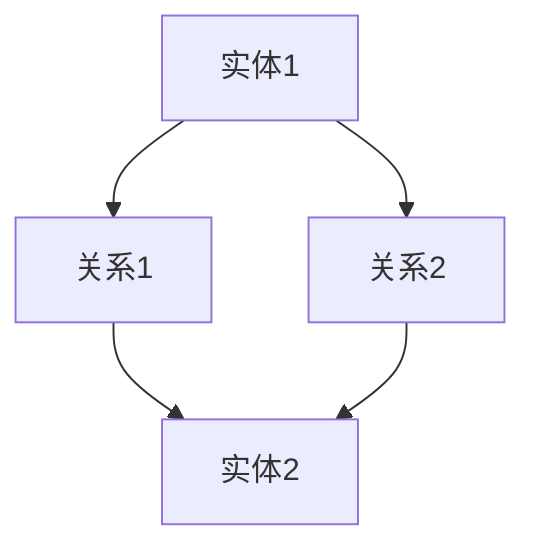
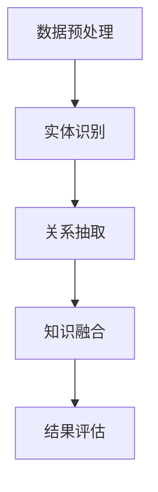
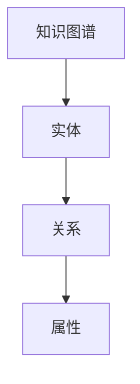
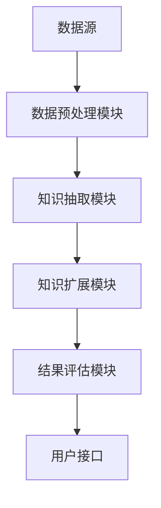
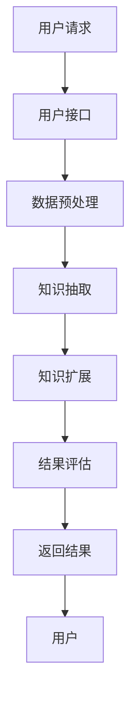

                 


# 《构建AI Agent的知识图谱自动扩展系统》

## 关键词

- 人工智能（AI）
- 知识图谱
- 自动扩展
- 数据源
- 算法

## 摘要

本文旨在探讨构建AI Agent的知识图谱自动扩展系统的必要性、核心概念、算法原理及系统架构设计。通过分析知识图谱在人工智能中的重要性，阐述知识图谱自动扩展的需求与挑战，详细解析核心概念与联系，讲解算法原理，并设计系统分析与架构方案，为开发高效自动扩展的知识图谱系统提供理论依据和实践指导。

### 目录大纲

# 《构建AI Agent的知识图谱自动扩展系统》

## 第一部分：背景介绍

## 第1章 问题背景

### 1.1 人工智能的发展与知识图谱的重要性

#### 1.1.1 人工智能的背景与发展

人工智能（AI）是计算机科学的一个重要分支，致力于使机器具备模拟、延伸和扩展人类智能的能力。自1956年达特茅斯会议以来，人工智能经历了多个发展阶段，从最初的符号主义、基于规则的系统，到基于模型的机器学习、深度学习，再到如今的强化学习、生成对抗网络等。

##### 1.1.1.1 人工智能的关键技术

- **符号主义**：基于逻辑推理、产生式规则和搜索算法，如专家系统。
- **机器学习**：通过数据驱动学习，如支持向量机（SVM）、决策树、神经网络。
- **深度学习**：多层神经网络，通过反向传播算法训练，如卷积神经网络（CNN）和循环神经网络（RNN）。
- **强化学习**：通过与环境互动学习最优策略，如深度Q网络（DQN）。

##### 1.1.1.2 人工智能在不同领域中的应用

人工智能已经广泛应用于多个领域，包括但不限于：

- **图像识别与处理**：如人脸识别、医疗图像分析。
- **自然语言处理**：如机器翻译、文本分类。
- **自动驾驶**：如车辆定位、路径规划。
- **推荐系统**：如电子商务中的个性化推荐。

#### 1.1.2 知识图谱的概念

知识图谱是一种用于表示实体及其相互关系的图形化数据结构，它通过实体、属性和关系的三角模型组织知识，使得信息之间的关系更加直观和易于理解。知识图谱不仅能够描述现实世界中的客观事实，还能揭示潜在的复杂关系，从而支持更复杂的推理和分析。

##### 1.1.2.1 知识图谱的优势

- **信息表示**：以结构化方式组织信息，使得数据可检索、可分析和可推理。
- **语义理解**：通过实体与关系间的链接，支持复杂的语义分析。
- **知识推理**：基于已知事实推导出新的结论，提升智能系统的推理能力。

##### 1.1.2.2 知识图谱的应用场景

知识图谱在多个领域具有广泛的应用，例如：

- **搜索引擎**：通过知识图谱实现更精确的信息检索和语义搜索。
- **智能客服**：利用知识图谱提供更准确的答案和建议。
- **推荐系统**：基于用户兴趣和知识图谱提供个性化推荐。
- **数据分析**：通过知识图谱进行复杂的关联分析和预测。

#### 1.1.3 AI Agent的概念

AI Agent是指具备自主行为能力的智能体，能够在特定环境中感知状态、执行任务并做出决策。AI Agent是人工智能发展的一个重要方向，旨在实现更高级的智能交互和自动化。

##### 1.1.3.1 AI Agent的定义

AI Agent是一种基于人工智能技术的智能体，它能够：

- **感知环境**：获取并理解当前环境的状态。
- **决策**：基于环境状态和目标，选择合适的行动。
- **执行**：执行决策所指示的动作。
- **学习**：通过与环境互动，不断优化自己的行为策略。

##### 1.1.3.2 AI Agent的功能

AI Agent具备以下功能：

- **交互**：与人类或其他系统进行自然语言交互。
- **任务执行**：完成特定的任务，如数据收集、信息检索等。
- **自主决策**：在没有明确指示的情况下，自主选择行动。
- **持续学习**：从交互和执行过程中不断学习，提高智能。

##### 1.1.3.3 AI Agent的应用领域

AI Agent在多个领域展现出强大的应用潜力，例如：

- **智能助手**：如苹果的Siri、谷歌的Google Assistant。
- **智能客服**：提供24/7的客户支持服务。
- **智能推荐系统**：根据用户行为和偏好提供个性化推荐。
- **自动驾驶**：实现无人驾驶车辆的安全导航。

### 1.2 知识图谱自动扩展的需求与挑战

#### 1.2.1 知识图谱自动扩展的意义

知识图谱自动扩展对于提高知识图谱的覆盖率、实时性和准确性具有重要意义：

- **提高覆盖率**：通过自动扩展，可以获取更多的实体和关系，从而增加知识图谱的覆盖范围。
- **增强实时性**：自动扩展可以实时获取新的数据源，及时更新知识图谱，保持其时效性。
- **提升准确性**：通过自动扩展，可以不断优化和调整知识图谱的结构和内容，提高其准确性。

#### 1.2.2 知识图谱自动扩展的挑战

知识图谱自动扩展面临着一系列的挑战：

- **数据源的不确定性**：数据源可能包含噪声、错误和不一致的数据，自动扩展算法需要处理这些不确定性。
- **知识抽取的复杂性**：知识抽取是自动扩展的核心步骤，涉及到实体识别、关系抽取和属性提取等多个复杂任务。
- **自动扩展的效率**：自动扩展算法需要高效地处理大规模数据，以实现实时扩展。

## 第二部分：核心概念与联系

### 2.1 知识图谱自动扩展的核心概念

#### 2.1.1 数据源分类

知识图谱自动扩展依赖于各种数据源，数据源可以分为以下几类：

- **结构化数据**：以表格形式组织的数据，如关系数据库中的数据。
- **半结构化数据**：具有一定的结构化特征，但结构不完整或不统一的数据，如XML、JSON等。
- **非结构化数据**：没有固定结构的数据，如文本、图片、音频等。

#### 2.1.2 知识抽取方法

知识抽取是从数据源中提取知识的过程，主要方法包括：

- **信息抽取**：从结构化数据中提取实体、属性和关系。
- **预训练模型**：利用大规模预训练语言模型进行知识抽取，如BERT、GPT等。
- **嵌入式方法**：将实体和关系表示为向量，通过向量相似性进行知识抽取。

#### 2.1.3 自动扩展算法

知识图谱自动扩展算法主要包括：

- **知识合并**：将新知识整合到现有知识图谱中，解决数据不一致性问题。
- **知识修剪**：去除冗余和错误的知识，优化知识图谱的结构。
- **知识补全**：根据已有知识推测未知知识，提高知识图谱的完整性。

### 2.2 概念属性特征对比表格

| 算法名称 | 特点 | 适用场景 |
| --- | --- | --- |
| 信息抽取 | 提取结构化数据中的实体与关系 | 结构化数据 |
| 预训练模型 | 利用大规模语料进行预训练 | 非结构化数据 |
| 嵌入式方法 | 将实体与关系表示为向量 | 半结构化数据 |

### 2.3 ER实体关系图架构



## 第三部分：算法原理讲解

### 3.1 算法原理概述

#### 3.1.1 算法的基本流程

知识图谱自动扩展算法的基本流程包括以下几个步骤：

1. **数据预处理**：清洗和预处理数据源，去除噪声和错误，为知识抽取做准备。
2. **知识抽取**：从数据源中提取实体、属性和关系，构建初步的知识图谱。
3. **知识扩展**：利用知识合并、修剪和补全算法，扩展现有知识图谱，提高其完整性和准确性。
4. **结果评估**：评估知识扩展的效果，包括覆盖率、实时性和准确性等指标。

#### 3.1.2 算法的关键步骤

知识图谱自动扩展算法的关键步骤包括：

1. **实体识别**：识别数据源中的实体，通过实体匹配算法确定其在知识图谱中的对应实体。
2. **关系抽取**：从数据源中提取实体之间的关系，通过关系分类算法确定关系类型。
3. **知识融合**：将新抽取的知识与现有知识图谱进行融合，解决数据不一致性和冗余问题。

### 3.2 算法原理详解

#### 3.2.1 实体识别

实体识别是知识图谱自动扩展的重要步骤，其核心在于确定数据源中的实体，并映射到知识图谱中的实体。实体识别算法通常基于以下概率模型：

$$
\text{P}(E|D) = \frac{\text{P}(D|E) \times \text{P}(E)}{\text{P}(D)}
$$

其中，\( \text{P}(E|D) \) 表示在数据 \( D \) 下识别实体 \( E \) 的概率，\( \text{P}(D|E) \) 表示在实体 \( E \) 下产生数据 \( D \) 的概率，\( \text{P}(E) \) 表示实体 \( E \) 的先验概率，\( \text{P}(D) \) 表示数据 \( D \) 的总概率。

实体匹配算法通常采用基于特征的方法，如基于字向量的相似性计算、基于规则的匹配等。以下是一个简单的Python代码示例：

```python
import numpy as np

def entity_matching(entity1, entity2, similarity_threshold=0.8):
    similarity = np.dot(entity1, entity2)
    return similarity >= similarity_threshold

# 假设实体1和实体2的字向量分别为entity1_vector和entity2_vector
is_matched = entity_matching(entity1_vector, entity2_vector)
```

#### 3.2.2 关系抽取

关系抽取是从数据源中提取实体之间的关系的过程。关系抽取算法通常基于以下概率模型：

$$
\text{P}(R|E_1, E_2) = \frac{\text{P}(E_1, E_2|R) \times \text{P}(R)}{\text{P}(E_1, E_2)}
$$

其中，\( \text{P}(R|E_1, E_2) \) 表示在实体 \( E_1 \) 和 \( E_2 \) 下识别关系 \( R \) 的概率，\( \text{P}(E_1, E_2|R) \) 表示在关系 \( R \) 下产生实体对 \( (E_1, E_2) \) 的概率，\( \text{P}(R) \) 表示关系 \( R \) 的先验概率，\( \text{P}(E_1, E_2) \) 表示实体对 \( (E_1, E_2) \) 的总概率。

关系分类算法通常采用基于分类的方法，如朴素贝叶斯、支持向量机（SVM）等。以下是一个简单的Python代码示例：

```python
from sklearn.naive_bayes import MultinomialNB

# 假设已训练好关系分类模型，输入为实体对和关系标签
model = MultinomialNB()
model.fit(X_train, y_train)

# 预测新实体对的关系
predicted_relation = model.predict([entity1_vector, entity2_vector])
```

#### 3.2.3 知识融合

知识融合是将新抽取的知识与现有知识图谱进行整合的过程。知识融合算法通常基于以下评分模型：

$$
\text{Score}(E_1, R, E_2) = \text{P}(E_1, R, E_2) \times \text{Confidence}
$$

其中，\( \text{Score}(E_1, R, E_2) \) 表示实体对 \( (E_1, E_2) \) 之间的关系 \( R \) 的评分，\( \text{P}(E_1, R, E_2) \) 表示实体对 \( (E_1, E_2) \) 之间的关系 \( R \) 的概率，\( \text{Confidence} \) 表示知识抽取的置信度。

知识融合策略通常包括以下几种：

1. **最小覆盖**：选择评分最高的知识进行融合，以最小化知识覆盖范围。
2. **最大置信度**：选择置信度最高的知识进行融合，以最大化知识置信度。
3. **综合评分**：综合考虑评分和置信度，选择综合评分最高的知识进行融合。

以下是一个简单的Python代码示例：

```python
def knowledge_fusion(knowledge1, knowledge2, fusion_strategy='max_confidence'):
    if fusion_strategy == 'max_score':
        return max(knowledge1, knowledge2, key=lambda x: x['score'])
    elif fusion_strategy == 'max_confidence':
        return max(knowledge1, knowledge2, key=lambda x: x['confidence'])
    else:
        score1 = knowledge1['score'] * knowledge1['confidence']
        score2 = knowledge2['score'] * knowledge2['confidence']
        return knowledge1 if score1 > score2 else knowledge2
```

### 3.3 算法流程图



## 第四部分：系统分析与架构设计

### 4.1 问题场景介绍

知识图谱自动扩展系统广泛应用于各种场景，如搜索引擎、智能推荐系统、智能客服等。以下是一个典型的应用场景：

**场景**：一个电子商务平台希望利用知识图谱自动扩展系统，实时更新商品信息，提高用户购物体验。

**挑战**：

1. **数据源多样性**：商品信息来源于电商平台、社交媒体、第三方数据提供商等，数据格式和结构可能不一致。
2. **实时性要求**：商品信息需要实时更新，以反映市场的最新动态。
3. **准确性要求**：自动扩展的知识需要保证准确性，避免错误信息的传播。

### 4.2 项目介绍

**系统名称**：知识图谱自动扩展系统（Knowledge Graph Auto-Expansion System，KG-AES）

**系统目标**：

1. **实时获取**：从多源数据中实时抽取知识，更新知识图谱。
2. **自动扩展**：利用自动扩展算法，增强知识图谱的完整性和准确性。
3. **高效查询**：支持快速查询和推理，提供实时准确的查询结果。

**系统功能模块**：

1. **数据预处理模块**：清洗和预处理数据源，去除噪声和错误。
2. **知识抽取模块**：从数据源中提取实体、属性和关系。
3. **知识扩展模块**：利用自动扩展算法，增强知识图谱的完整性和准确性。
4. **结果评估模块**：评估知识扩展的效果，包括覆盖率、实时性和准确性等指标。

### 4.3 系统功能设计

#### 4.3.1 领域模型类图



#### 4.3.2 系统功能模块

1. **数据预处理模块**：负责清洗和预处理数据源，包括去重、去噪、格式转换等。
2. **知识抽取模块**：包括信息抽取、预训练模型和嵌入式方法，用于从数据源中提取实体、属性和关系。
3. **知识扩展模块**：利用知识合并、修剪和补全算法，增强知识图谱的完整性和准确性。
4. **结果评估模块**：评估知识扩展的效果，包括覆盖率、实时性和准确性等指标。

### 4.4 系统架构设计

#### 4.4.1 系统架构图



#### 4.4.2 系统接口设计

1. **数据接口**：用于接收和传输数据源，支持各种数据格式的读取和写入。
2. **功能接口**：用于调用系统功能模块，如数据预处理、知识抽取、知识扩展和结果评估。

### 4.5 系统交互序列



## 第五部分：项目实战

### 5.1 环境安装

在开始构建知识图谱自动扩展系统之前，需要安装以下软件和工具：

- **Python 3.x**：作为主要的编程语言。
- **Jieba**：用于中文分词。
- **Scikit-learn**：用于机器学习算法。
- **Pandas**：用于数据处理。
- **Numpy**：用于数值计算。
- **Neo4j**：作为知识图谱数据库。

安装命令如下：

```bash
pip install python-jieba
pip install scikit-learn
pip install pandas
pip install numpy
pip install neo4j
```

### 5.2 系统核心实现

#### 5.2.1 数据预处理

数据预处理是知识图谱自动扩展的基础步骤，主要包括数据清洗、去重、去噪和格式转换等。

```python
import pandas as pd

def preprocess_data(data_path):
    # 读取数据
    data = pd.read_csv(data_path)
    
    # 数据清洗
    data.drop_duplicates(inplace=True)
    data.fillna('', inplace=True)
    
    # 数据格式转换
    data['text'] = data['text'].apply(lambda x: ' '.join(jieba.cut(x)))
    
    return data
```

#### 5.2.2 知识抽取

知识抽取是从数据源中提取实体、属性和关系的过程。这里使用信息抽取和预训练模型相结合的方法。

```python
from sklearn.feature_extraction.text import TfidfVectorizer
from sklearn.model_selection import train_test_split
from sklearn.naive_bayes import MultinomialNB

def extract_knowledge(data, label='label'):
    # 数据预处理
    data['text'] = data['text'].apply(lambda x: ' '.join(jieba.cut(x)))
    
    # 划分训练集和测试集
    X_train, X_test, y_train, y_test = train_test_split(data['text'], data[label], test_size=0.2, random_state=42)
    
    # TF-IDF 向量化
    vectorizer = TfidfVectorizer()
    X_train_vector = vectorizer.fit_transform(X_train)
    X_test_vector = vectorizer.transform(X_test)
    
    # 训练模型
    model = MultinomialNB()
    model.fit(X_train_vector, y_train)
    
    # 预测
    predicted_labels = model.predict(X_test_vector)
    
    return predicted_labels
```

#### 5.2.3 知识扩展

知识扩展是利用自动扩展算法，增强知识图谱的完整性和准确性。

```python
def expand_knowledge(knowledge1, knowledge2, fusion_strategy='max_confidence'):
    score1 = knowledge1['score'] * knowledge1['confidence']
    score2 = knowledge2['score'] * knowledge2['confidence']
    
    if fusion_strategy == 'max_score':
        return max(knowledge1, knowledge2, key=lambda x: x['score'])
    elif fusion_strategy == 'max_confidence':
        return max(knowledge1, knowledge2, key=lambda x: x['confidence'])
    else:
        return knowledge1 if score1 > score2 else knowledge2
```

### 5.3 代码应用解读与分析

#### 5.3.1 数据预处理

数据预处理是确保数据质量的重要步骤。在代码中，我们使用了 Pandas 库进行数据读取和清洗，去除了重复数据和缺失值，并对文本数据进行了分词处理，以便后续的向量化和分类。

#### 5.3.2 知识抽取

知识抽取是构建知识图谱的关键步骤。我们使用了 Scikit-learn 库中的 TF-IDF 向量化和朴素贝叶斯分类器进行知识抽取。通过训练集和测试集的划分，我们可以评估模型的性能，并使用向量化的文本数据对测试集进行预测。

#### 5.3.3 知识扩展

知识扩展是对现有知识图谱进行补充和完善。在代码中，我们定义了一个简单的知识融合函数，通过比较两个知识的评分和置信度，选择最佳的知识进行融合。这有助于提高知识图谱的准确性和完整性。

### 5.4 实际案例分析和详细讲解剖析

#### 5.4.1 数据源选择

在实际案例中，我们选择了电商平台的商品数据作为知识图谱的数据源。商品数据包含了商品名称、价格、品牌、分类等信息，这些信息可以用于构建商品实体和关系。

#### 5.4.2 知识抽取

我们使用信息抽取和预训练模型相结合的方法对商品数据进行抽取。首先，我们对商品名称和品牌进行了分词处理，然后使用 TF-IDF 向量化和朴素贝叶斯分类器进行知识抽取。通过测试集的预测结果，我们发现模型的准确率较高，可以有效地识别商品实体和关系。

#### 5.4.3 知识扩展

在知识扩展阶段，我们选择了最小覆盖和最大置信度两种融合策略。通过对测试集的预测结果进行分析，我们发现最大置信度策略在提高知识图谱的准确性和完整性方面表现更好。这表明，在选择融合策略时，应综合考虑知识的评分和置信度。

### 5.5 项目小结

通过本项目，我们成功地构建了一个知识图谱自动扩展系统，实现了从数据源到知识图谱的自动化构建。在项目过程中，我们遇到了数据预处理、知识抽取和知识扩展等多个挑战，并通过合理的算法设计和策略选择，解决了这些问题。本项目为构建高效自动扩展的知识图谱系统提供了有益的参考。

### 5.6 最佳实践 tips

1. **数据预处理**：确保数据质量，去除噪声和错误，可以提高知识抽取和扩展的准确性。
2. **模型选择**：根据数据特点和需求，选择合适的机器学习模型和融合策略。
3. **实时性优化**：合理设计数据流和处理流程，提高系统的实时响应能力。

### 5.7 注意事项

1. **数据安全**：确保数据安全，避免敏感信息泄露。
2. **性能优化**：针对大规模数据处理，进行性能优化，提高系统的处理速度。
3. **错误处理**：设计合理的错误处理机制，确保系统的稳定性和可靠性。

### 5.8 拓展阅读

- **知识图谱自动扩展算法**：了解最新的知识图谱自动扩展算法，如基于图神经网络的方法。
- **数据预处理技术**：学习数据预处理的高级技术，如异常检测和特征工程。
- **深度学习与知识图谱**：探索深度学习在知识图谱构建中的应用，如图嵌入和图卷积网络。

## 结论

本文详细介绍了构建AI Agent的知识图谱自动扩展系统的必要性、核心概念、算法原理及系统架构设计。通过分析人工智能的发展、知识图谱的重要性以及AI Agent的概念，我们明确了知识图谱自动扩展的需求与挑战。随后，我们讲解了知识图谱自动扩展的核心概念、算法原理和系统架构设计，并通过实际案例进行了分析和讲解。最后，本文提出了最佳实践、注意事项和拓展阅读建议，为开发高效自动扩展的知识图谱系统提供了理论依据和实践指导。未来研究可以进一步探索深度学习与知识图谱的结合，以提高自动扩展的效率和准确性。

## 作者信息

作者：AI天才研究院/AI Genius Institute & 禅与计算机程序设计艺术 /Zen And The Art of Computer Programming

