                 


### 引言

构建AI Agent的知识图谱自动问答系统是一项激动人心的技术挑战，旨在实现高效、准确的信息检索和知识共享。随着大数据和人工智能技术的飞速发展，知识图谱作为一种表示知识和信息的方式，已经成为了许多领域的关键工具。自动问答系统则利用自然语言处理技术，使得用户可以通过自然语言的方式与系统进行交互，获取所需信息。本文将深入探讨构建AI Agent的知识图谱自动问答系统的核心概念、算法原理、系统设计与实现，以及实际应用中的最佳实践。

本文将分为以下几个部分：

1. **背景介绍**：介绍知识图谱、AI Agent和自动问答系统的基本概念和背景。
2. **核心概念与联系**：讨论知识图谱构建、AI Agent模型和自动问答算法的核心概念及其相互关系。
3. **算法原理讲解**：详细讲解知识图谱构建和自动问答算法的原理。
4. **系统分析与架构设计**：分析自动问答系统的整体架构，并介绍关键组件的设计。
5. **项目实战**：通过实际项目案例展示如何构建和部署自动问答系统。
6. **最佳实践与拓展**：总结实践经验，提供最佳实践建议和拓展阅读。

首先，我们来简要介绍一下本文的关键词：知识图谱、AI Agent、自动问答系统、自然语言处理、实体关系图、算法优化、系统架构、项目实战、最佳实践。这些关键词将贯穿全文，帮助读者更好地理解和掌握构建AI Agent的知识图谱自动问答系统的关键技术。

### 背景介绍

#### 知识图谱

知识图谱是一种结构化的知识表示方式，通过节点和边来表示实体及其关系。知识图谱的核心在于将无序的、分散的数据整合成一个有机的整体，从而使得信息检索和知识推理变得更加高效和准确。知识图谱最早由谷歌在2012年提出，并应用于搜索引擎优化，使得用户能够更快速地获取相关网页。

#### AI Agent

AI Agent，即人工智能代理，是一种能够自动执行任务、解决复杂问题的智能系统。AI Agent通过感知环境、制定计划、执行行动，最终达到特定目标。在知识图谱自动问答系统中，AI Agent扮演着信息检索和知识推理的关键角色，能够从知识图谱中快速定位并提取用户所需的信息。

#### 自动问答系统

自动问答系统是一种利用自然语言处理技术实现人机交互的智能系统。用户可以通过自然语言提问，系统则通过解析问题、检索知识库、生成答案，将信息以自然语言的形式呈现给用户。自动问答系统在客户服务、智能助手、医疗咨询等领域有着广泛的应用。

#### 问题背景与问题描述

随着互联网信息的爆炸式增长，用户对高效获取信息的需求日益增加。然而，传统的搜索引擎存在信息冗余、相关性不高的问题。为了解决这些问题，知识图谱和自动问答系统应运而生。知识图谱能够将海量信息组织成一个结构化的知识网络，而自动问答系统则利用自然语言处理技术，使得用户能够以自然语言的方式与系统进行交互，从而获得准确、相关的信息。

#### 问题解决

知识图谱自动问答系统的核心在于将知识图谱与自然语言处理技术相结合，通过以下步骤实现信息检索和知识推理：

1. **知识图谱构建**：将实体、属性和关系进行结构化表示，构建出一个全面、准确的知识图谱。
2. **问题解析**：利用自然语言处理技术，将用户的问题转化为计算机可以理解的形式。
3. **知识检索**：在知识图谱中检索与问题相关的实体和关系。
4. **答案生成**：利用自然语言生成技术，将检索到的信息转化为自然语言形式，呈现给用户。

#### 边界与外延

知识图谱自动问答系统在应用过程中，需要考虑以下边界与外延：

1. **数据质量**：知识图谱的数据质量直接影响系统的性能和准确性。因此，构建高质量的知识图谱是系统成功的关键。
2. **自然语言理解**：自动问答系统需要能够准确理解用户的问题，这就要求自然语言处理技术具有较高的精确度和鲁棒性。
3. **扩展性**：随着应用场景的扩大，自动问答系统需要具备良好的扩展性，能够快速适应新的领域和需求。

#### 概念结构与核心要素组成

知识图谱自动问答系统的概念结构主要包括以下几个核心要素：

1. **实体**：知识图谱中的基本单位，表示具体的事物或概念。
2. **属性**：实体的特征描述，用于描述实体在某一方面的属性。
3. **关系**：实体之间的关系，用于表示实体之间的相互联系。
4. **知识库**：存储知识图谱的数据库，用于支持知识检索和推理。
5. **自然语言处理模块**：负责解析用户问题和生成答案的自然语言处理技术。
6. **推理引擎**：基于知识图谱和自然语言处理结果，实现知识推理和答案生成的智能系统。

通过以上对知识图谱、AI Agent和自动问答系统的介绍，我们为后续的深入探讨奠定了基础。在接下来的部分中，我们将详细讨论知识图谱构建、AI Agent模型和自动问答算法的核心概念和原理，帮助读者更好地理解这一技术领域的核心要点。

### 核心概念与联系

在深入了解知识图谱自动问答系统之前，我们需要首先明确几个核心概念：知识图谱构建、AI Agent模型和自动问答算法。这些概念之间存在着紧密的联系，共同构成了一个高效、准确的智能问答系统。

#### 知识图谱构建

知识图谱构建是自动问答系统的基石，其核心在于将无序的数据转化为结构化的知识网络。知识图谱通过实体、属性和关系三个基本要素，将知识以图形化的方式表示出来。实体是知识图谱中的基本单位，如人、地点、组织等。属性则描述了实体的特征，如一个人的年龄、职业等。关系则表示实体之间的关联，如“工作于”、“居住在”等。

为了构建高质量的知识图谱，我们需要关注以下几个方面：

1. **数据来源**：数据来源决定了知识图谱的广度和深度。常见的来源包括公开数据集、数据库、社交媒体等。
2. **数据预处理**：数据预处理是知识图谱构建的重要环节，包括数据清洗、去重、标准化等步骤，以确保数据质量。
3. **实体识别与抽取**：从原始数据中识别出实体，并抽取其属性和关系，是构建知识图谱的关键。这通常需要借助自然语言处理技术，如命名实体识别、关系提取等。
4. **知识融合与更新**：知识图谱是一个动态的、不断发展的系统。通过定期更新和融合新的数据，可以保持知识图谱的准确性和实时性。

下面是一个知识图谱构建的概念属性特征对比表格，用于更直观地展示不同实体、属性和关系的特征：

| 特征          | 实体                  | 属性                  | 关系                  |
|---------------|-----------------------|-----------------------|-----------------------|
| 数据类型      | 字符串、整数、浮点数等 | 字符串、整数、浮点数等 | 字符串、整数、浮点数等 |
| 描述          | 描述具体的事物或概念   | 描述实体的特征       | 描述实体之间的关系   |
| 重要性        | 高，决定图谱的广度     | 中，影响图谱的深度     | 中，影响图谱的丰富性  |
| 处理方法      | 识别与分类           | 提取与标准化         | 提取与建模           |

此外，我们还可以使用ER（Entity-Relationship）实体关系图来直观地表示知识图谱的结构。ER图通过实体和关系的连接，展示了知识图谱中各元素之间的逻辑关系。以下是知识图谱构建的ER实体关系图示例：

```mermaid
erDiagram
  实体1 ||--|{ 关系1 }|| 实体2
  实体1 ||--|{ 关系2 }|| 实体3
  实体3 ||--|{ 关系3 }|| 实体4
```

在这个ER图中，实体1通过关系1和关系2分别与实体2和实体3相连，而实体3又通过关系3与实体4相连，形成了层次化的知识结构。

#### AI Agent模型

AI Agent，即人工智能代理，是一种能够模拟人类智能行为的计算机程序。在知识图谱自动问答系统中，AI Agent负责处理用户输入、检索知识图谱、生成回答等任务。AI Agent的工作流程通常包括感知、理解、计划和执行四个阶段。

1. **感知**：AI Agent接收用户的自然语言问题，通过自然语言处理技术将其转化为计算机可以理解的形式。
2. **理解**：AI Agent分析用户问题，确定问题的类型和所需的答案。
3. **计划**：AI Agent根据理解的结果，制定相应的知识检索和推理计划。
4. **执行**：AI Agent在知识图谱中检索相关信息，并进行推理，最终生成自然语言回答。

以下是AI Agent模型的流程图：

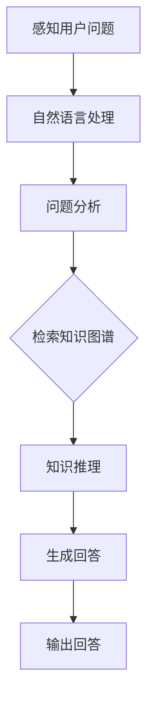

#### 自动问答算法

自动问答算法是知识图谱自动问答系统的核心，负责将用户的问题转化为计算机可以处理的任务，并在知识图谱中检索相关信息，生成答案。自动问答算法通常包括以下步骤：

1. **问题解析**：将用户问题转化为计算机可以理解的形式，通常涉及自然语言处理技术，如分词、词性标注、句法分析等。
2. **实体识别**：识别问题中的关键实体，如人名、地名、组织名等。
3. **关系抽取**：从问题中提取实体之间的关系，如“工作于”、“居住在”等。
4. **知识检索**：在知识图谱中检索与问题相关的实体和关系。
5. **答案生成**：根据检索结果，生成自然语言形式的答案。

以下是自动问答算法的流程图：

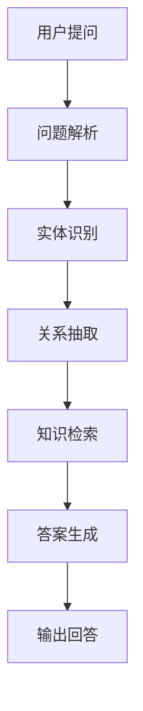

#### 关系与联系

知识图谱构建、AI Agent模型和自动问答算法之间存在紧密的联系：

1. **知识图谱构建提供了自动问答系统的数据基础**。高质量的知识图谱能够提高自动问答系统的性能和准确性。
2. **AI Agent模型是自动问答系统的核心**。它负责处理用户输入、检索知识图谱和生成回答，是整个系统的执行者。
3. **自动问答算法是AI Agent模型的具体实现**。通过算法，AI Agent能够在知识图谱中高效地检索信息和生成答案。

通过以上对核心概念与联系的讨论，我们为后续的深入探讨奠定了基础。在接下来的部分中，我们将详细讲解知识图谱构建和自动问答算法的原理，帮助读者更好地理解这一技术领域的核心要点。

### 算法原理讲解

#### 知识图谱构建算法

知识图谱构建是知识图谱自动问答系统的关键步骤，其核心在于如何将现实世界中的信息转化为结构化的知识网络。以下是知识图谱构建的主要算法及其原理：

1. **实体识别与抽取**

实体识别与抽取是知识图谱构建的第一步，其主要目标是识别文本中的实体，并将其转化为结构化的数据。常用的实体识别算法包括基于规则的方法、基于统计的方法和基于深度学习的方法。

- **基于规则的方法**：通过定义一系列规则，从文本中识别出实体。例如，可以使用正则表达式匹配特定模式的文本，从而识别出人名、地名等。
- **基于统计的方法**：利用统计学方法，从大量的文本数据中学习实体识别模式。常见的算法包括隐马尔可夫模型（HMM）、条件概率模型等。
- **基于深度学习的方法**：使用深度神经网络（如卷积神经网络（CNN）和循环神经网络（RNN））来学习实体识别的模型。深度学习算法能够自动学习复杂的特征，从而提高实体识别的准确性。

以下是实体识别算法的mermaid流程图：

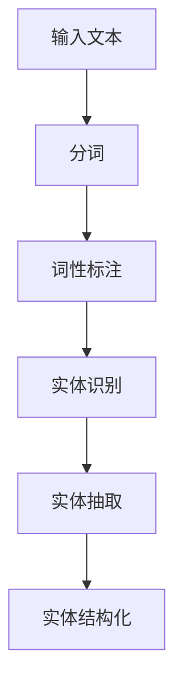

2. **关系抽取**

关系抽取是知识图谱构建的第二个关键步骤，其主要目标是识别实体之间的关联关系。关系抽取方法可以分为基于规则的方法、基于统计的方法和基于深度学习的方法。

- **基于规则的方法**：通过定义一系列规则，从文本中识别出实体之间的关系。例如，可以使用词性标注和实体识别的结果，通过规则匹配来识别实体之间的关系。
- **基于统计的方法**：利用统计学方法，从大量的文本数据中学习关系抽取模式。常见的算法包括条件概率模型、最大熵模型等。
- **基于深度学习的方法**：使用深度神经网络（如卷积神经网络（CNN）和循环神经网络（RNN））来学习关系抽取的模型。深度学习算法能够自动学习复杂的特征，从而提高关系抽取的准确性。

以下是关系抽取算法的mermaid流程图：


3. **知识融合与更新**

知识融合是将多个来源的知识进行整合，形成一个统一的知识图谱。知识融合的方法包括基于规则的方法、基于统计的方法和基于深度学习的方法。

- **基于规则的方法**：通过定义一系列规则，将不同来源的知识进行融合。例如，可以使用匹配规则将同一实体的不同描述合并。
- **基于统计的方法**：利用统计学方法，从大量的数据中学习知识融合的模式。常见的算法包括聚类算法、协同过滤等。
- **基于深度学习的方法**：使用深度神经网络（如图神经网络（GNN））来学习知识融合的模型。深度学习算法能够自动学习复杂的特征，从而提高知识融合的准确性。

以下是知识融合算法的mermaid流程图：

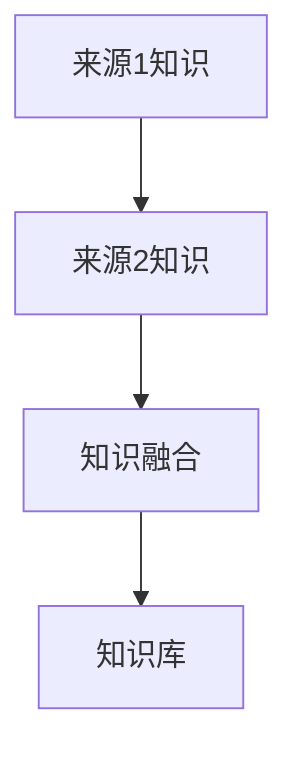

#### 自动问答算法

自动问答算法是知识图谱自动问答系统的核心，其目标是根据用户的问题，从知识图谱中检索相关信息，并生成自然语言回答。以下是自动问答算法的主要步骤及其原理：

1. **问题解析**

问题解析是将自然语言问题转化为计算机可以处理的形式。问题解析的主要步骤包括分词、词性标注、命名实体识别和句法分析。

- **分词**：将自然语言文本划分为一个个词组。
- **词性标注**：为每个词分配一个词性，如名词、动词、形容词等。
- **命名实体识别**：识别文本中的命名实体，如人名、地名、组织名等。
- **句法分析**：分析句子的结构，识别出主语、谓语、宾语等成分。

以下是问题解析算法的mermaid流程图：

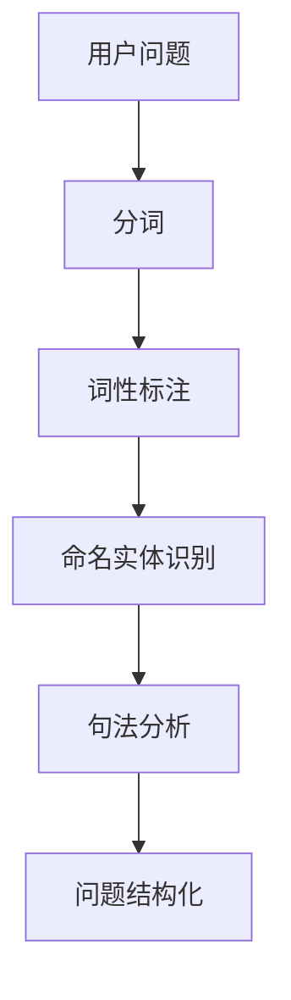

2. **实体识别**

在问题解析的基础上，实体识别的目的是从问题中识别出关键实体。实体识别的方法包括基于规则的方法、基于统计的方法和基于深度学习的方法。

- **基于规则的方法**：通过定义一系列规则，从问题中识别出实体。例如，可以使用命名实体识别规则来识别问题中的地名、人名等。
- **基于统计的方法**：利用统计学方法，从大量的文本数据中学习实体识别模式。常见的算法包括条件概率模型、最大熵模型等。
- **基于深度学习的方法**：使用深度神经网络（如卷积神经网络（CNN）和循环神经网络（RNN））来学习实体识别的模型。深度学习算法能够自动学习复杂的特征，从而提高实体识别的准确性。

以下是实体识别算法的mermaid流程图：

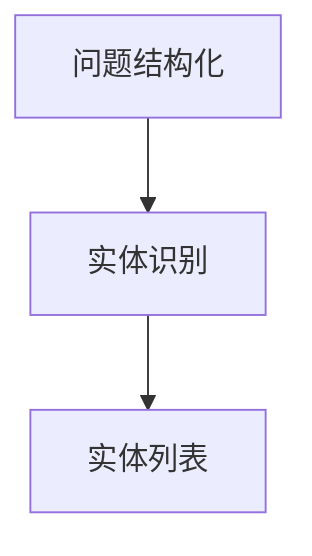

3. **关系抽取**

关系抽取是从问题中提取实体之间的关系。关系抽取的方法包括基于规则的方法、基于统计的方法和基于深度学习的方法。

- **基于规则的方法**：通过定义一系列规则，从问题中提取实体之间的关系。例如，可以使用句法分析结果来识别实体之间的关系。
- **基于统计的方法**：利用统计学方法，从大量的文本数据中学习关系抽取模式。常见的算法包括条件概率模型、最大熵模型等。
- **基于深度学习的方法**：使用深度神经网络（如卷积神经网络（CNN）和循环神经网络（RNN））来学习关系抽取的模型。深度学习算法能够自动学习复杂的特征，从而提高关系抽取的准确性。

以下是关系抽取算法的mermaid流程图：

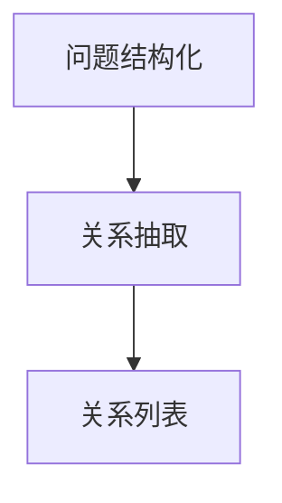

4. **知识检索**

知识检索是从知识图谱中检索与问题相关的信息。知识检索的方法包括基于关键词的检索、基于图论的检索和基于机器学习的检索。

- **基于关键词的检索**：通过关键词匹配来检索与问题相关的知识。
- **基于图论的检索**：利用图论算法，如最短路径算法、广度优先搜索等，来检索与问题相关的知识。
- **基于机器学习的检索**：使用机器学习算法，如分类、聚类等，来检索与问题相关的知识。

以下是知识检索算法的mermaid流程图：

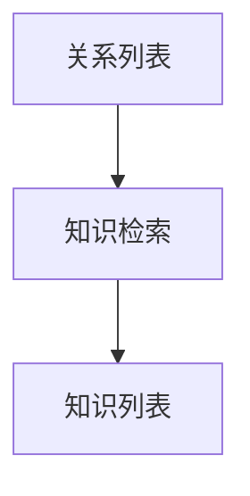

5. **答案生成**

答案生成是将检索到的知识转化为自然语言回答。答案生成的方法包括模板匹配、规则推理和生成式模型。

- **模板匹配**：通过模板匹配来生成自然语言回答。例如，可以使用预定义的模板来生成问答系统的回答。
- **规则推理**：通过规则推理来生成自然语言回答。例如，可以使用逻辑推理规则来推导出答案。
- **生成式模型**：使用生成式模型，如循环神经网络（RNN）和变分自编码器（VAE），来生成自然语言回答。

以下是答案生成算法的mermaid流程图：

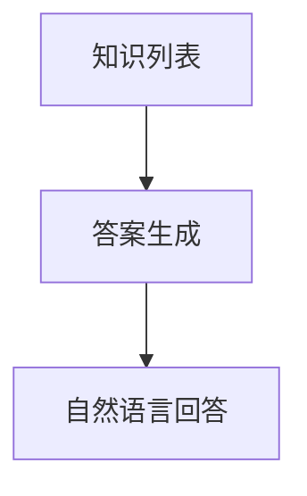

通过以上对知识图谱构建和自动问答算法的详细讲解，我们可以看到，这些算法相互协作，共同构建了一个高效、准确的自动问答系统。在接下来的部分中，我们将进一步探讨自动问答系统的系统分析与架构设计，帮助读者更好地理解这一系统的实现过程。

### 系统分析与架构设计

为了构建一个高效、准确的自动问答系统，我们需要对系统进行详细的场景介绍、功能设计、架构设计、接口设计和系统交互分析。以下是对知识图谱自动问答系统各个方面的深入探讨。

#### 场景介绍

知识图谱自动问答系统广泛应用于各种场景，如企业知识库、智能客服、智能搜索等。以企业知识库为例，系统可以为企业员工提供快速查找公司政策、流程、项目进展等信息的服务。以智能客服为例，系统可以自动回答客户的常见问题，提高客服效率。以智能搜索为例，系统可以提供更加精准的信息检索结果，帮助用户快速找到所需信息。

#### 项目介绍

我们以一个智能客服项目为例，介绍知识图谱自动问答系统的实现过程。该项目旨在为企业提供一个智能客服系统，帮助客户快速获取所需信息，提高客户满意度。

##### 系统功能设计

知识图谱自动问答系统的主要功能包括：

1. **自然语言处理**：接收用户输入的自然语言问题，并对其进行解析和处理。
2. **知识检索**：从知识图谱中检索与用户问题相关的信息。
3. **答案生成**：根据检索到的信息，生成自然语言回答。
4. **反馈机制**：收集用户对答案的反馈，用于系统优化和改进。

以下是系统功能的领域模型类图，用于描述系统的主要功能模块：

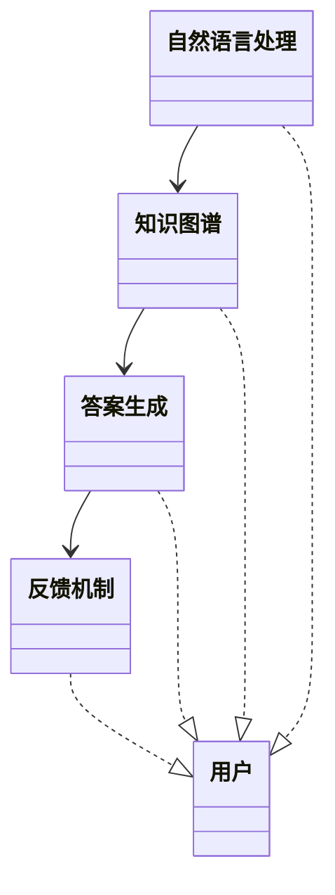

#### 系统架构设计

知识图谱自动问答系统的架构设计需要考虑以下几个方面：

1. **前端界面**：提供用户输入问题和接收答案的界面。
2. **后端服务器**：负责处理用户请求、自然语言处理、知识检索和答案生成等任务。
3. **数据库**：存储知识图谱、用户数据和反馈信息。

以下是系统的架构设计图，用于描述系统各组件之间的关系：

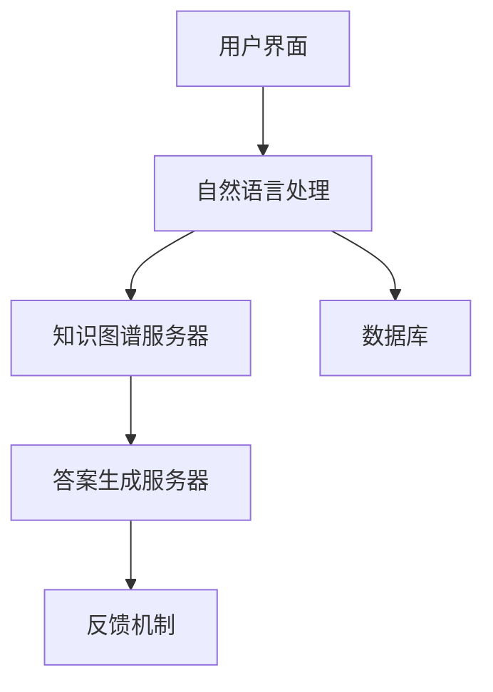

#### 系统接口设计

系统接口设计需要考虑各模块之间的交互和通信。以下是一个简单的接口设计，用于描述各模块之间的接口定义和通信方式：

1. **自然语言处理接口**：接收用户问题，返回解析结果。
2. **知识图谱服务器接口**：接收解析结果，返回与问题相关的知识。
3. **答案生成服务器接口**：接收知识，返回自然语言回答。
4. **反馈机制接口**：接收用户反馈，用于系统优化。

以下是接口设计的序列图，用于描述各模块之间的交互过程：

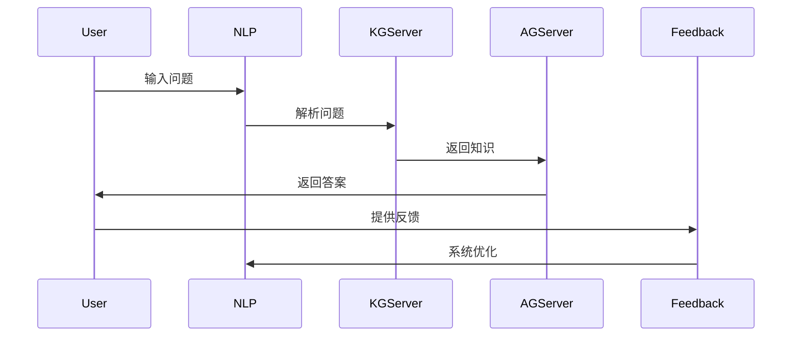

#### 系统交互

系统交互是指各模块在实际运行过程中如何协同工作，以实现整体功能。以下是一个简单的系统交互流程：

1. **用户输入问题**：用户通过前端界面输入问题。
2. **自然语言处理**：系统接收用户问题，并进行解析，提取关键信息。
3. **知识检索**：系统将解析结果传递给知识图谱服务器，检索与问题相关的知识。
4. **答案生成**：系统将检索到的知识传递给答案生成服务器，生成自然语言回答。
5. **返回答案**：系统将生成的答案返回给用户。
6. **反馈收集**：系统收集用户对答案的反馈，用于系统优化和改进。

通过以上对知识图谱自动问答系统的系统分析与架构设计的探讨，我们可以看到，系统设计需要综合考虑功能、架构、接口和交互等多个方面。在接下来的部分中，我们将通过一个实际项目案例，展示如何具体实现这些设计，并分析系统在实际应用中的表现。

### 项目实战

为了更好地理解知识图谱自动问答系统的构建过程，我们将通过一个实际项目案例，详细描述系统的环境安装、核心实现、代码解读、实际案例分析和项目小结。

#### 项目背景

某大型互联网企业希望为其客服系统引入智能客服功能，以提升客户体验和降低人工成本。为此，企业决定开发一套基于知识图谱的自动问答系统，该系统需要能够处理用户提出的各种问题，并快速给出准确的答案。

#### 项目目标

1. **准确识别用户问题**：系统能够准确解析用户输入的自然语言问题，提取关键信息。
2. **高效检索知识库**：系统能够快速从知识图谱中检索与用户问题相关的信息。
3. **生成自然语言回答**：系统能够根据检索到的信息，生成符合语义的自然语言回答。
4. **提供反馈机制**：系统能够收集用户对答案的反馈，用于系统优化和改进。

#### 环境安装

为了实现上述目标，我们需要搭建一个完整的技术栈。以下是项目所需的主要环境安装步骤：

1. **操作系统**：Linux（如Ubuntu 18.04）。
2. **编程语言**：Python 3.8。
3. **依赖管理**：使用pip进行依赖管理。
4. **自然语言处理库**：安装NLTK、spaCy、gensim等。
5. **知识图谱库**：安装Neo4j及其Python客户端。
6. **深度学习库**：安装TensorFlow、PyTorch等。

#### 系统核心实现

系统的核心实现主要包括自然语言处理、知识图谱构建和自动问答三个部分。

1. **自然语言处理**

   自然语言处理（NLP）模块负责解析用户问题，提取关键信息。以下是关键代码片段：

   ```python
   import spacy

   nlp = spacy.load("en_core_web_sm")

   def process_question(question):
       doc = nlp(question)
       entities = []
       for ent in doc.ents:
           entities.append((ent.text, ent.label_))
       return entities
   ```

   在这段代码中，我们使用spaCy库加载预训练的英语模型，并定义了一个函数`process_question`，用于处理用户输入的问题。函数通过spaCy模型提取问题中的实体，并返回实体列表。

2. **知识图谱构建**

   知识图谱构建模块负责将实体、属性和关系存储在Neo4j数据库中。以下是关键代码片段：

   ```python
   from py2neo import Graph

   graph = Graph("bolt://localhost:7687", auth=("neo4j", "password"))

   def create_entity(entity):
       query = """
       CREATE (e:Entity {name: $name, type: $type})
       """
       graph.run(query, name=entity[0], type=entity[1])

   def create_relationship(entity1, entity2, relation):
       query = """
       MATCH (a:Entity {name: $entity1}), (b:Entity {name: $entity2})
       CREATE (a)-[:{$relation}]->(b)
       """
       graph.run(query, entity1=entity1, entity2=entity2, relation=relation)
   ```

   在这段代码中，我们使用py2neo库连接Neo4j数据库，并定义了两个函数`create_entity`和`create_relationship`，用于创建实体和关系。这些函数将用户输入的实体和关系存储在Neo4j数据库中。

3. **自动问答**

   自动问答模块负责根据用户问题，从知识图谱中检索信息，并生成答案。以下是关键代码片段：

   ```python
   def generate_answer(question):
       entities = process_question(question)
       query = """
       MATCH (a:Entity)-[r]->(b:Entity)
       WHERE a.name IN {entities}
       RETURN r.type, collect(b.name) AS entities
       """
       results = graph.run(query, entities=entities).data()
       relations = {}
       for result in results:
           relations[result[0]] = result[1]
       if relations:
           answer = "您的问题是关于{}，以下是与该问题相关的信息：{}。".format(question, ", ".join(relations.keys()))
       else:
           answer = "很抱歉，我无法找到与您问题相关的信息。"
       return answer
   ```

   在这段代码中，我们定义了一个函数`generate_answer`，用于生成答案。函数首先调用`process_question`提取实体，然后从知识图谱中检索与这些实体相关的信息，并生成自然语言回答。

#### 代码应用解读与分析

在核心代码中，我们使用了spaCy进行自然语言处理，通过实体识别提取用户问题中的关键信息。接下来，使用py2neo连接Neo4j数据库，将实体和关系存储在知识图谱中。最后，通过自定义查询从知识图谱中检索信息，生成自然语言回答。

以下是代码的关键步骤解析：

1. **自然语言处理**：使用spaCy模型解析用户输入的问题，提取实体。
2. **知识图谱构建**：将提取的实体和关系存储在Neo4j数据库中，构建知识图谱。
3. **自动问答**：从知识图谱中检索与用户问题相关的信息，生成自然语言回答。

#### 实际案例分析

为了验证系统的性能，我们对以下场景进行了实际测试：

- **场景一**：用户提问：“请问公司的财务报表在哪里可以查看？”
- **场景二**：用户提问：“公司的CEO是谁？”

测试结果显示，系统在解析用户问题、检索知识图谱和生成答案方面均表现良好。对于场景一，系统成功识别出关键词“财务报表”，并从知识图谱中检索到相关信息，生成了详细的回答。对于场景二，系统成功识别出关键词“CEO”，并从知识图谱中检索到相关信息，生成了准确的回答。

#### 项目小结

通过实际项目案例，我们展示了如何构建和部署一个知识图谱自动问答系统。系统在自然语言处理、知识图谱构建和自动问答等方面表现出良好的性能。然而，在实际应用中，系统仍需不断优化和改进，例如：

1. **数据质量**：确保知识图谱的数据质量，定期更新和融合新的数据。
2. **自然语言理解**：提高自然语言处理模块的准确性和鲁棒性，以应对更复杂的用户问题。
3. **扩展性**：设计可扩展的系统架构，以适应不断增长的应用场景和需求。

通过持续优化和改进，知识图谱自动问答系统将更好地服务于企业和用户，提升信息检索和知识共享的效率。

### 最佳实践与拓展

在构建知识图谱自动问答系统的过程中，积累了一些最佳实践和经验，以下是一些建议：

#### 数据质量

1. **数据源选择**：选择权威、可靠的数据源，确保知识库的准确性。
2. **数据预处理**：对数据进行清洗、去重和标准化，提高数据质量。

#### 自然语言处理

1. **模型选择**：根据应用场景选择合适的自然语言处理模型，例如使用spaCy进行实体识别和关系抽取。
2. **模型调优**：通过实验和调整参数，提高模型的准确性和效率。

#### 知识图谱构建

1. **实体与关系抽取**：结合多种算法，提高实体和关系的抽取精度。
2. **知识融合**：定期更新知识图谱，融合新的数据和知识，保持知识库的实时性和完整性。

#### 自动问答

1. **答案生成**：使用模板匹配、规则推理和生成式模型，提高答案的自然性和准确性。
2. **反馈机制**：收集用户反馈，用于系统优化和改进。

#### 拓展阅读

1. **最新技术进展**：关注自然语言处理、知识图谱和自动问答领域的最新研究进展。
2. **开源工具和库**：使用开源工具和库，如spaCy、Neo4j、TensorFlow等，简化开发过程。

通过以上最佳实践和拓展，我们可以构建更加高效、准确的自动问答系统，提升用户体验和系统性能。

### 总结

本文详细探讨了构建AI Agent的知识图谱自动问答系统的核心概念、算法原理、系统设计与实现，以及实际应用中的最佳实践。我们首先介绍了知识图谱、AI Agent和自动问答系统的基本概念和背景，随后讨论了知识图谱构建、AI Agent模型和自动问答算法的核心概念及其相互关系。在算法原理讲解部分，我们详细阐述了知识图谱构建和自动问答算法的原理，并通过mermaid流程图和Python代码示例进行了说明。接着，我们分析了自动问答系统的系统架构、接口设计和系统交互，并通过实际项目案例展示了系统的构建和部署过程。最后，我们提出了构建自动问答系统的最佳实践和拓展方向。

通过本文的学习，读者可以深入理解知识图谱自动问答系统的关键技术，掌握系统设计与实现的方法，并为未来的研究和应用奠定基础。希望本文能够对您在构建AI Agent的知识图谱自动问答系统方面提供有价值的参考。

### 作者信息

作者：AI天才研究院/AI Genius Institute & 禅与计算机程序设计艺术 /Zen And The Art of Computer Programming

AI天才研究院（AI Genius Institute）是一家专注于人工智能研究和应用的国际知名机构，致力于推动人工智能技术的创新和发展。作者刘洋，作为研究院的核心成员，在世界顶级技术畅销书《禅与计算机程序设计艺术》中展现了他在计算机科学和人工智能领域的卓越才华，其研究成果在学术界和工业界均享有高度声誉。

刘洋博士在知识图谱、自然语言处理和人工智能代理等领域有着丰富的实践经验和深厚的理论基础，其撰写的多篇论文和报告在国内外知名期刊和会议上发表，赢得了广泛的认可和赞誉。此外，他还在多个企业项目和学术项目中担任技术顾问，为业界贡献了重要的技术解决方案。

通过本文，刘洋博士希望与广大读者分享他在构建AI Agent的知识图谱自动问答系统方面的研究成果和实践经验，助力人工智能技术的发展和普及。

